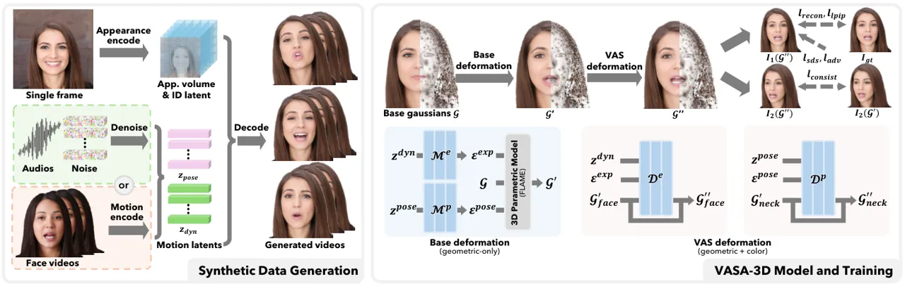
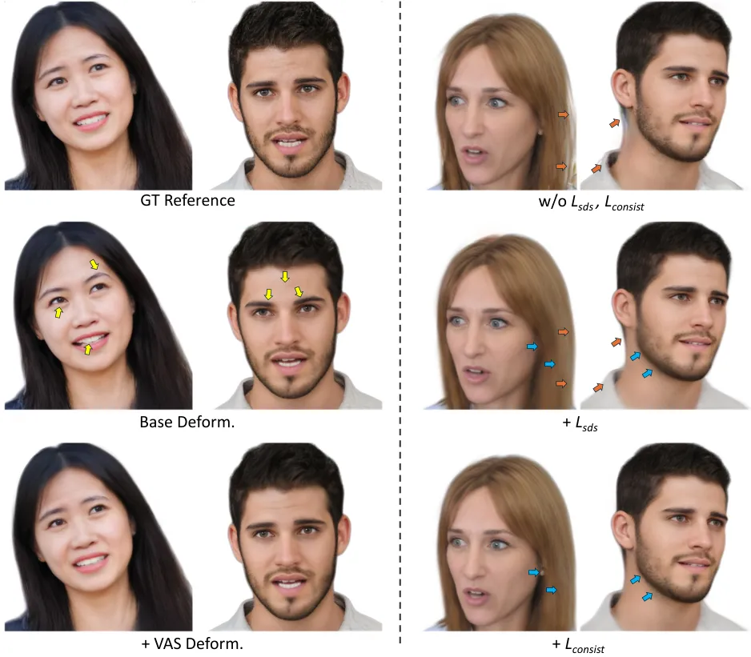
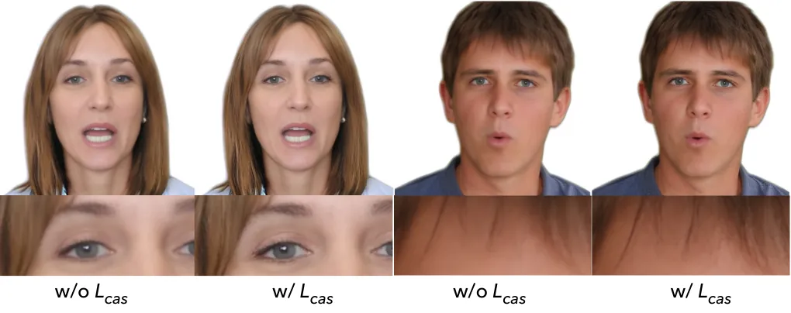
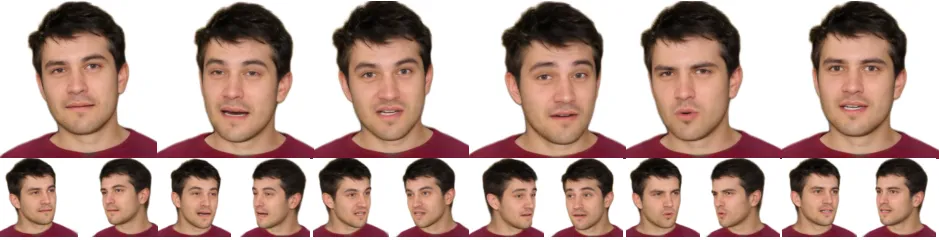
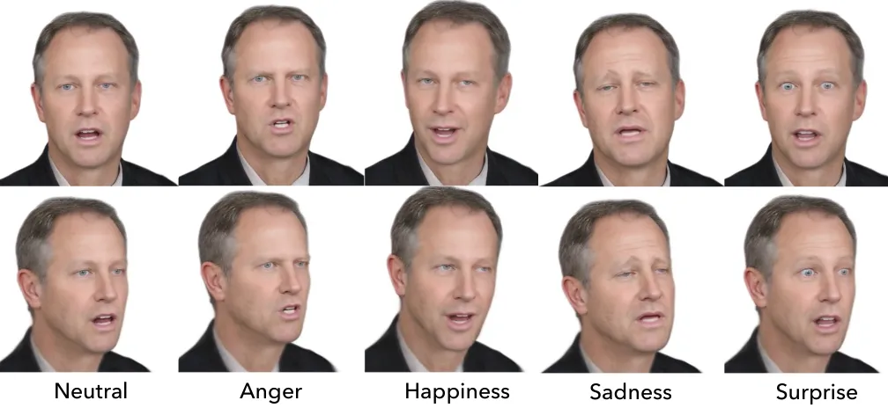
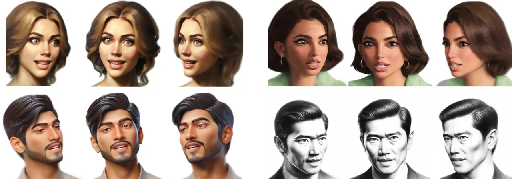
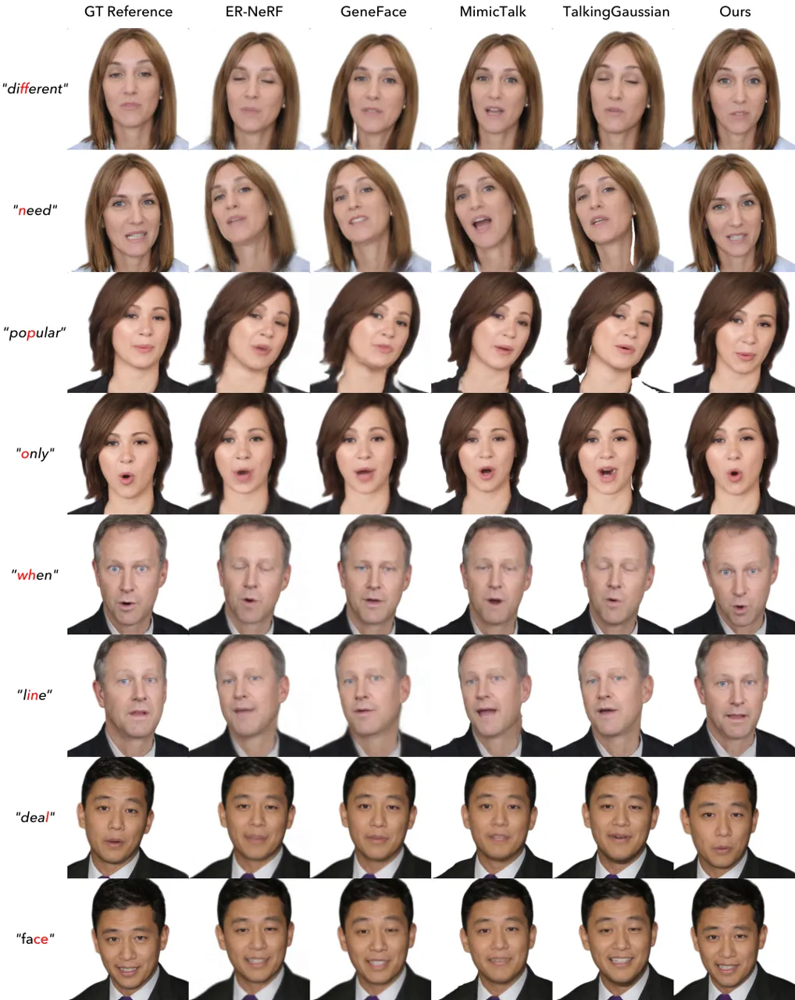

# VASA-3D: Lifelike Audio-Driven Gaussian Head Avatars from a Single Image

Sicheng Xu ^(†)^(†)thanks: Equal contributions. ^(†) Corresponding
author.    Guojun Chen¹¹footnotemark: 1    Jiaolong Yang²²footnotemark:
2    Yu Deng    Yizhong Zhang    Stephen Lin    Baining Guo
Affiliation: Microsoft Research Asia
Email: [{sichengxu,guoch,jiaoyan,yizzhan,dengyu,stevelin,bainguo}@microsoft.com](mailto:)
Affiliation: [https://www.microsoft.com/en-us/research/project/vasa-3d/](https://www.microsoft.com/en-us/research/project/vasa-3d/)

###### Abstract

We propose VASA-3D, an audio-driven, single-shot 3D head avatar
generator. This research tackles two major challenges: capturing the
subtle expression details present in real human faces, and
reconstructing an intricate 3D head avatar from a single portrait image.
To accurately model expression details, VASA-3D leverages the motion
latent of VASA-1 Xu et al. (2024a), a method that yields exceptional
realism and vividness in 2D talking heads. A critical element of our
work is translating this motion latent to 3D, which is accomplished by
devising a 3D head model that is conditioned on the motion latent.
Customization of this model to a single image is achieved through an
optimization framework that employs numerous video frames of the
reference head synthesized from the input image. The optimization takes
various training losses robust to artifacts and limited pose coverage in
the generated training data. Our experiment shows that VASA-3D produces
realistic 3D talking heads that cannot be achieved by prior art, and it
supports the online generation of 512$`\times`$512 free-viewpoint videos
at up to 75 FPS, facilitating more immersive engagements with lifelike
3D avatars.

![[Uncaptioned
image]](arxiv-2512-14677--79b2e3f3aa15.figures/figure-1.webp)

Figure 1: Given a single portrait image, our approach produces an
animatable 3D Gaussian head that can be driven with any speech audio
clip to generate lifelike, free-viewpoint talking face videos in real
time. It adapts the powerful motion latent space of VASA-1 Xu et al.
(2024a) to 3D, and leverages the high realism of VASA-1 in 2D video
generation to train the 3D head model. (_Note: all the portrait images
in this document are virtual, non-existing identities created by Karras
et al. (2020); Betker et al. (2023). See our project webpage for
generated video samples with audio._)

## 1 Introduction

Advances in generating 3D head avatars are revolutionizing digital
interaction, effectively bridging the gap between physical presence and
virtual engagement. Vivid representations of human faces serve to
enhance various applications, ranging from virtual reality and gaming to
remote education and online meetings. By conveying realistic facial
expressions and movements, 3D head avatars can foster a deeper sense of
connection within virtual environments, making interactions more
personal and engaging, and significantly improving user experience and
immersion.

Most recent research on 3D head avatars utilize parametric head
representations derived from 3D scans Gafni et al. (2021); Grassal et
al. (2022); Zheng et al. (2022); Gao et al. (2022); Khakhulin et al.
(2022); Hong et al. (2022); Zheng et al. (2023); Zielonka et al. (2023);
Xu et al. (2023); Zhao et al. (2023); Li et al. (2023c); Li et al.
(2023d); Ye et al. (2024a); Qian et al. (2024); Xu et al. (2024b); Ye et
al. (2024b); Chu and Harada (2024); He et al. (2025). The model’s shape
and motion are personalized to image or video data of a reference face,
and then the avatar animation is driven by an audio or video track of
what the avatar will say. Despite the impressive developments to date,
significant challenges still remain. One major issue with current
methods is that their output often lacks the nuanced motion and subtle
expressions of real human faces, resulting in less visually compelling
facial dynamics. Additionally, a vast majority of existing methods Gafni
et al. (2021); Guo et al. (2021); Grassal et al. (2022); Zheng et al.
(2022); Gao et al. (2022); Zheng et al. (2023); Zielonka et al. (2023);
Xu et al. (2023); Zhao et al. (2023); Li et al. (2023a); Ye et al.
(2024a); Qian et al. (2024); Li et al. (2024); Xu et al. (2024b) require
video or multiview data of the reference face for avatar modeling,
limiting their utility.

In this paper, we present VASA-3D, an audio-driven 3D head avatar
generator that transforms a single portrait image into a lifelike 3D
talking head, synchronized with any speech audio input. The head avatar
is modeled with 3D Gaussian splatting Kerbl et al. (2023); Qian et al.
(2024), which ensures multiview consistency and facilitates real-time
audio-driven animation and free-view rendering. Notably, the model
captures and conveys dynamic expression details with a degree of realism
that markedly exceeds current state-of-the-art techniques.

We observe that the expression terms of parametric head representations
used for 3D head avatars, such as 3DMM Blanz and Vetter (1999); Amberg
et al. (2008) and FLAME Li et al. (2017a), are modeled on 3D scans of
just a few hundred subjects. To model more diverse and detailed facial
dynamics at minimal acquisition cost, VASA-3D instead takes advantage of
2D head videos, which are abundant online. Specifically, it employs the
motion latent of VASA-1 Xu et al. (2024a), which has been trained on
data from 9.5K subjects, to capture rich facial dynamics. This motion
latent, though learned on 2D data, encodes implicit 3D structure, and a
key contribution of our work is in translating it to a 3D avatar. We
accomplish this by first mapping it to the parameters of a FLAME head
model, on which 3D Gaussians are bound as done in Qian et al. (2024).
Although FLAME’s expression parameters are modeled on just hundreds of
4D face captures, VASA-3D addresses this limitation by next predicting
dense, freeform Gaussian deformations that are conditioned on the motion
latent, thereby enabling the generation of more expressive 3D dynamic
heads.

Our latent motion controlled Gaussian avatar offers great potential for
3D talking head synthesis, but customizing it to just a single portrait
image poses a challenging problem. Existing methods that personalize a
head avatar representation using a single image Khakhulin et al. (2022);
Li et al. (2023c); Li et al. (2023d); Ye et al. (2024b); Chu and Harada
(2024); Chu et al. (2024) encode facial expression via a parametric head
model, thus limiting expressiveness. Our solution is to utilize a
pretrained portrait video generation model, namely VASA-1 Xu et al.
(2024a), to transform the reference image into a collection of frames
with varied facial expressions and head poses, and then fit the avatar
to these frames. As there exist limitations with this synthetic data, as
well as overfitting issues due to dense deformation, we have developed
an optimization framework with various training losses designed to
robustly train the model despite these problems.

VASA-3D represents a significant step forward in 3D head avatar
synthesis, capitalizing on 2D head videos to enrich its model of facial
dynamics and allowing customization of this advanced model using only a
single portrait image. The effectiveness and realism of VASA-3D is
validated through various experiments, where it demonstrates clear
superiority over recent techniques. By creating lifelike avatars that
accurately reflect human expressions and facial motions, this approach
paves the way for more immersive and engaging virtual experiences.

## 2 Related Work

3D Face and Head Representations.  A common representation for 3D head
avatars is parametric mesh-based models such as 3DMM Blanz and Vetter
(1999) and FLAME Li et al. (2017a). These models are built on a
collection of 3D head scans, from which the principal components of
shape with respect to identity and expression are used as bases for
modeling head and face geometry. Though compact and efficient, these
parametric models provide low-fidelity mesh representations and limited
detail for facial expressions, whose bases are derived from scanned data
of only hundreds of subjects.

An alternative approach based on neural radiance fields
(NeRFs) Mildenhall et al. (2021) does not explicitly represent geometry
but instead stores the radiance field of a head in a neural network.
With these radiance values, head appearance at novel views can be
synthesized by volumetric rendering. This approach has led to many works
that can generate highly photorealistic head avatars Gafni et al.
(2021); Hong et al. (2022); Gao et al. (2022); Zhao et al. (2023).
However, NeRF-based methods often require multiview images or a video of
the reference head, thus restricting their usage. Moreover, rendering
speeds for NeRF-based models typically do not reach the levels needed
for real-time applications.

Real-time performance with high rendering quality has been achieved
through representations based on 3D Gaussians Qian et al. (2024); Xu et
al. (2024b); Chu and Harada (2024); Li et al. (2024); Hu et al. (2024),
whose positions, orientations, and densities are optimized for the
reference head. By accounting for the visibility of each Gaussian and
rendering only those that can be seen, real-time performance is
attainable Kerbl et al. (2023). Rigging 3D Gaussians to a parametric
head model allows them to be dynamically controlled through parameter
manipulation. Our work utilizes this representation but controls face
and head motion using VASA-1 motion latents, for which residuals to
these Gaussians are incorporated to precisely model the subtle
expression details that these latents capture.

3D Head Reconstruction.  3D head avatars can be reconstructed from a
reference head using multi-view correspondences Qian et al. (2024); Xu
et al. (2024b). For greater practical convenience, much attention has
focused on one-shot methods that require only a single head image. These
methods either rely on a parametric head model as a strong
prior Khakhulin et al. (2022); Chu and Harada (2024) or predict a
volumetric Hong et al. (2022) or tri-plane Li et al. (2023c); Li et al.
(2023d); Ye et al. (2024b) representation for NeRF rendering. In this
work, we propose to leverage the considerable recent advance in 2D
talking face generation Xu et al. (2024a) to synthesize close
approximations of additional views of the input face, providing further
data for training.

A collection of frames synthesized in our method may resemble monocular
video input, which is used in several works for 3D head avatar
reconstruction Gafni et al. (2021); Grassal et al. (2022); Zheng et al.
(2022); Gao et al. (2022); Zheng et al. (2023); Zielonka et al. (2023);
Xu et al. (2023); Zhao et al. (2023); Ye et al. (2024a). However, our
training data differs significantly from monocular video in two
respects. One is that a broad range of head poses and facial expressions
can be synthesized with our approach, much beyond than what can
reasonably be captured in a video of a reference head. The other is that
the images generated by VASA-1 Xu et al. (2024a) lack temporal texture
consistency, which creates problems when using common training losses
based on pixel-wise comparisons. We overcome this issue through
judicious selection of losses that are robust to such artifacts.

Head Avatar Animation.  Head avatars are typically modeled in a way that
they can be driven using parameters of parametric models like 3DMM and
FLAME Gafni et al. (2021); Grassal et al. (2022); Zheng et al. (2022);
Gao et al. (2022); Khakhulin et al. (2022); Hong et al. (2022); Zheng et
al. (2023); Zielonka et al. (2023); Xu et al. (2023); Zhao et al.
(2023); Li et al. (2023c); Li et al. (2023d); Ye et al. (2024a); Qian et
al. (2024); Xu et al. (2024b); Ye et al. (2024b); Chu and Harada (2024).
Their reliance on parametric models for animation encoding and control
limits the expressiveness of faces. In contrast, our method drives
animation using VASA-1 motion latents, which provide a richer expression
representation learned from an abundance of 2D head videos. Though the
3D Gaussian splats that represent head shape in our work are rigged to a
FLAME model, we incorporate residuals conditioned on the motion latents,
giving expression control to these latents.

## 3 Method



Figure 2: Overview of VASA-3D. Given a single portrait image, we use the
VASA-1 model to generate a collection of synthetic talking face videos
as well as their corresponding motion latents, which are used to train a
VASA-3D model. The driving sources for these videos can be in-the-wild
audios and/or face videos. Our VASA-3D model is represented by
deformable 3D Gaussians attached to a FLAME mesh. Two deformation fields
are applied to the Gaussians, one based on the FLAME mesh and another
modulated by VASA motion latents. After training, a VASA-3D model can be
driven with VASA motion latents generated from audios or videos in real
time.

Our VASA-3D framework, illustrated in Fig. 2, is built on two main
ideas: adapting the VASA-1 motion latent to 3D, and leveraging the high
realism of VASA-1 Xu et al. (2024a) in 2D talking head video generation
to facilitate single-shot customization of the 3D head model. We train
VASA-3D models with carefully-designed losses that enhance visual
quality while avoiding issues that may arise from the synthesized
videos.

### 3.1 VASA-3D Model

3D Gaussian Representation.  Our VASA-3D model is based on 3D
Gaussians Kerbl et al. (2023) equipped with Gaussian deformation fields
driven by the VASA-1 motion latent. The 3D head is represented as a set
of 3D Gaussians
$`\mathcal{G}=\{\mathbf{g}_{i}=({\boldsymbol{\mu}_{i},\boldsymbol{r}_{i},\boldsymbol{s}_{i},\boldsymbol{c}_{i},\alpha_{i}})\}_{i=1}^{N},`$
each with position $`\boldsymbol{\mu}`$, rotation $`\boldsymbol{r}`$,
scale $`\boldsymbol{s}`$, color $`\boldsymbol{c}`$, and opacity
$`\alpha`$. To ease learning of Gaussian parameters and deformation
fields, we make use of priors from existing 3D head parametric models.
Specifically, we use 3D Gaussians bound to a FLAME model Li et al.
(2017b), a representation introduced in GaussianAvatars Qian et al.
(2024). Unlike in Qian et al. (2024) and other previous works,
animations will be driven by the VASA-1 latent.

We decompose the deformation into two parts: a _Base Deformation_, and
another deformation we call _VAS Deformation_. The former is driven by
the FLAME parametric model to change the geometric properties of the
Gaussians including position, rotation, and scale. The latter derives
the fine-grained geometric and color variations, which is crucial for
expressing the motion nuances captured in VASA-1 and improving the
rendering quality.

Base Deformation. Given a motion latent
$`\mathbf{x}=[\mathbf{z}^{dyn},\mathbf{z}^{pose}]`$ produced by the
VASA-1 diffusion model, we first map them to FLAME parameters using two
MLPs. The first MLP $`\mathcal{M}^{e}`$ converts the facial dynamics
code $`\mathbf{z}^{dyn}`$ to the expression-related FLAME parameters
$`\boldsymbol{\varepsilon}^{exp}=(\boldsymbol{\psi},\boldsymbol{\theta}^{eye},\boldsymbol{\theta}^{jaw})`$
which includes the expression PCA coefficients, eye pose, and jaw pose,
respectively. The second MLP $`\mathcal{M}^{p}`$ uses
$`\mathbf{z}^{pose}`$ to predict the FLAME pose parameters
$`\boldsymbol{\varepsilon}^{p}=(\boldsymbol{\theta}^{neck},\boldsymbol{\theta}^{global},\mathbf{t})`$
including neck rotation, global rotation, and global translation. These
two mappings can be written as:

```math
\displaystyle\boldsymbol{\varepsilon}^{exp}\leftarrow\mathcal{M}^{e}(\mathbf{z}^{dyn}), \tag{1}
```

```math
\displaystyle\boldsymbol{\varepsilon}^{pose}\leftarrow\mathcal{M}^{p}(\mathbf{z}^{pose}). \tag{2}
```

Both $`\mathcal{M}^{e}`$ and $`\mathcal{M}^{p}`$ have three fully
connected layers, with $`256`$ hidden units per layer followed by a ReLU
activation function. Additionally, a shape coefficient
$`\boldsymbol{\varepsilon}^{shape}`$ is jointly optimized during
training and fixed during inference.

Given these parameters, the FLAME mesh will be rigged accordingly, which
drives the changes of
($`\boldsymbol{\mu}_{i},\mathbf{r}_{i},\mathbf{s}_{i}`$) for the
Gaussians $`\mathbf{g}_{i}`$ attached to the mesh triangles. Additional
details of this process can be found in Qian et al. (2024).

VAS Deformation. We further learn dense Gaussian deformation fields for
our 3D head model, modulated by VASA-1 motion latents. Two MLPs are
introduced to predict the deformations of Gaussians in the face and neck
region, respectively. The first MLP $`\mathcal{D}^{e}`$ takes Gaussians
$`\mathbf{g}_{i}`$ in FLAME’s facial region $`\Omega_{face}`$ as well as
the VASA-1 facial dynamics latent $`\mathbf{z}^{dyn}`$ as input and
predicts the full transformation
$`\Delta\mathbf{g}_{i}=(\Delta\boldsymbol{\mu}_{i},\Delta\mathbf{r}_{i},\Delta s_{i},\Delta\mathbf{c}_{i},\Delta\alpha_{i})`$.
We also feed the FLAME expression parameters
$`\boldsymbol{\varepsilon}^{exp}`$ to the MLP so that it is aware of the
current base expression. The second MLP is responsible for the FLAME
neck region $`\Omega_{neck}`$. It takes the Gaussians, VASA pose
$`\mathbf{z}^{pose}`$ and FLAME pose parameters
$`\boldsymbol{\varepsilon}^{pose}`$ as input to predict the residuals.
The VAS deformations can be expressed as:

```math
\displaystyle\Delta\mathbf{g}_{i\in\Omega_{face}}\leftarrow\mathcal{D}^{e}(\mathbf{g}_{i},\mathbf{z}^{dyn},\boldsymbol{\varepsilon}^{exp}), \tag{3}
```

```math
\displaystyle\Delta\mathbf{g}_{j\in\Omega_{neck}}\leftarrow\mathcal{D}^{p}(\mathbf{g}_{j},\mathbf{z}^{pose},\boldsymbol{\varepsilon}^{pose}). \tag{4}
```

These two MLPs share the same architecture as $`\mathcal{M}^{e}`$ and
$`\mathcal{M}^{p}`$ except for the different input and output
dimensions. For all input Gaussian positions $`\boldsymbol{\mu}`$, we
apply sinusoidal positional encoding with $`L=4`$ Mildenhall et al.
(2021).

Animation and Rendering. Once trained, VASA-3D models can be animated
using VASA-1 motion latents. The driving sources can be either audios or
videos. For audio input, we use VASA-1’s diffusion transformer to
generate motion latents. For videos, we use VASA-1 motion encoders for
latent code extraction. The animation frames are efficiently rendered
with Gaussian Splatting and the whole animation and rendering pipeline
can run in real time on a commodity GPU.

### 3.2 Synthetic Training Data Generation

We leverage VASA-1 to generate video frames with a diverse set of poses
and expressions from the given single image. To achieve this, one can
either use real speech audios and/or face videos for data generation.
For example, in most of our experiments, we randomly sample up to 10
hours of video clips from the VoxCeleb2 dataset Chung et al. (2018) to
render the training data. We extract the VASA-1 motion latent for each
frame and use the VASA-1 decoder to drive the portrait image and
synthesize the corresponding frames. The paired motion latent and video
frame data will be used for VASA-3D model training, which we present
next.

### 3.3 Robustified Model Training

We train our models in an end-to-end manner where all the trainable
modules, including Gaussian parameters and the MLPs for deformation, are
trained together from scratch.

_Challenges. _ Our synthesized training data and the dense free-form
deformation in our 3DGS-based head model give rise to several challenges
for training.

- •
  Unlike real videos, inconsistency of temporal texture and facial shape
  exists among the synthesized frames.
- •
  Large viewing angles are often missing from the training data, leading
  to difficulties in shape reconstruction.
- •
  The inclusion of residuals for the Gaussians can lead to overfitting
  to the training video frames.

We apply the following losses to train the model effectively without
succumbing to these issues.

Reconstruction Losses.  We use a combination of the structural
similarity index measure (SSIM) and the $`L_{1}`$ color difference as
the photometric loss between the generated image and the ground truth
image:

```math
L_{recon}=\lambda_{ssim}L_{ssim}+(1-\lambda_{ssim})L_{1}. \tag{5}
```

Perceptual Losses.  As temporal texture inconsistency can reduce the
efficacy of the photometric loss, we rely on perception-level losses
that measure visual quality but are robust to temporal inconsistency
among the training frames. Specifically, we apply the Learned Perceptual
Image Patch Similarity (LPIPS) loss Zhang et al. (2018) with a
pretrained VGG network Simonyan and Zisserman (2015). To further improve
realism, we add multi-scale patch discriminators and apply an
adversarial loss for training. We employ three discriminators with
different input image scales and trained them together with our model.
The perceptual loss functions can be written as:

```math
L_{perc}=\lambda_{lpips}L_{lpips}+\lambda_{adv}L_{adv}. \tag{6}
```

SDS Loss. Since the synthesized video data generally covers a limited
range of poses, we apply the SDS loss Poole et al. (2022) to minimize
visual artifacts in side views and to enlarge the range of valid viewing
angles. Specifically, we render our model from random viewing angles for
which we apply the SDS loss $`L_{sds}`$. Random views are uniformly
sampled from azimuth angles in the range $`[-180^{\circ},180^{\circ}]`$
and elevation angles in the range $`[-22.5^{\circ},22.5^{\circ}]`$. We
use StableDiffusion v2.1 Rombach et al. (2022) as the diffusion model in
our SDS loss with classifier-free guidance factor $`10.0`$ and gradient
scale $`0.001`$. The text prompt is ‘human portrait, realistic
photography, by DSLR camera’.

Though the dense VAS deformations help in capturing detailed expressions
and improving image quality, they also require careful design of
regularization to avoid overfitting to each frame’s training data. In
light of this, we compute $`L_{recon},L_{per}`$ and $`L_{sds}`$ for the
rendered images of the Gaussians _both after base deformation and after
VAS deformation_, denoted as $`\mathcal{G}^{\prime}`$ and
$`\mathcal{G}^{\prime\prime}`$, respectively. This approach aims for
$`\mathcal{G}^{\prime}`$ to effectively capture facial features shared
across frames to the extent possible through multi-frame consistency,
while $`\mathcal{G}^{\prime\prime}`$ focuses on modeling the residual
facial details of different frames.

Render Consistency Loss.  Although the SDS loss helps to eliminate
artifacts in profile regions, we found that it also tends to smooth out
the details across all regions in our case. This issue is pronounced for
$`\mathcal{G}^{\prime\prime}`$ because the Gaussian residuals are
learned for each frame. Such flexibility makes
$`\mathcal{G}^{\prime\prime}`$ susceptible to the side effect of the SDS
loss, especially for regions not well captured by the current view
(hence less constrained by the ground-truth reference image). In
contrast, $`\mathcal{G}^{\prime}`$ are less prone to this issue, as
these Gaussians are optimized to jointly fit the multi-frame data with
different poses and thus are less affected by $`L_{sds}`$. Therefore, we
design a loss to regularize $`\mathcal{G}^{\prime\prime}`$ with
$`\mathcal{G}^{\prime}`$. Specifically, for each training iteration we
render an additional pair of images with $`\mathcal{G}^{\prime}`$ and
$`\mathcal{G}^{\prime\prime}`$ respectively, under a new view angle
significantly different from the current training view. We apply a
render consistency loss $`L_{consist}`$ between these two images
$`I^{\prime}(\mathcal{G}^{\prime\prime})`$ and
$`I^{\prime}(\mathcal{G}^{\prime\prime})`$ as

```math
L_{consist}=LPIPS\bigl(I^{\prime}(\mathcal{G}^{\prime\prime}),{stop\_grad}(I^{\prime}(\mathcal{G}^{\prime}))\bigr), \tag{7}
```

where the stop-gradient operator prevents $`{G}^{\prime}`$ from being
negatively affected.

In practice, the new view is randomly sampled with the azimuth angle in
the range $`[-35^{\circ},-55^{\circ}]`$ or $`[35^{\circ},55^{\circ}]`$
and elevation angle in the range $`[-15^{\circ},15^{\circ}]`$. Of the
two azimuth ranges, we select the one that is farther away from the view
of the training frame.

Sharpening Loss.  To further increase the sharpness of the rendered
results, we _optionally_ apply a contrast-adaptive-sharpening (CAS)
filter AMD (2019) to the model’s rendered images and use them to further
train the model. Specifically, we apply the CAS filter to the rendered
image and then apply the LPIPS loss between the sharpened image and the
original image. The CAS loss $`L_{cas}`$ is applied at the end of the
training process as a lightweight finetuning step.

The overall loss function is a combination of the aforementioned losses:

```math
\displaystyle L=L_{ssim}+L_{1}+L_{lpips}+L_{adv}+ \tag{8}
```

```math
\displaystyle L_{sds}+L_{consist}+L_{cas}+L_{others},
```

where the loss weights are omitted for brevity, and $`L_{others}`$
stands for other loss functions introduced in Qian et al. (2024) such as
the Gaussian position and scale losses (see Qian et al. (2024)). More
details about our losses and their implementation can be found in the
_supplementary material_.

Figure 3: Effects of dataset size and training iterations

| Setting          | ​​PSNR$`\uparrow`$ | L1$`\downarrow`$ | ​​​SSIM$`\uparrow`$ | ​​LPIPS$`\downarrow`$ | S$`{}_{\text{C}}`$$`\uparrow`$ | S$`{}_{\text{D}}`$$`\downarrow`$ |
| ---------------- | ------------------ | ---------------- | ------------------- | --------------------- | ------------------------------ | -------------------------------- |
| Basic            | 25.74              | 0.0228           | 0.8544              | 0.0768                | 6.6347                         | 8.1265                           |
| +VAS deform.     | 27.19              | 0.0195           | 0.8654              | 0.0695                | 6.9636                         | 7.9050                           |
| +$`L_{sds}`$     | 27.23              | 0.0195           | 0.8653              | 0.0707                | 6.9581                         | 7.9191                           |
| +$`L_{consist}`$ | 27.33              | 0.0192           | 0.8672              | 0.0706                | 6.9429                         | 7.9221                           |
| +$`L_{cas}`$     | 26.62              | 0.0209           | 0.8472              | 0.0657                | 6.9145                         | 7.9422                           |
| GT               | –                  | –                | –                   | –                     | 7.1517                         | 7.7770                           |

Table 1: Quantitative results of ablation studies

## 4 Experiments

### 4.1 Analysis and Ablation Study

We conduct experiments to analyze our method as well as the design
choices. In the following experiments, we use ten portraits, including
five males and five females, generated by StyleGAN2 Karras et al. (2020)
to train our models. We train the models using 4 NVIDIA A100 40G GPUs
and a batch size of 4. A 512$`\times`$512 resolution is used for both
the training data and VASA-3D rendering throughout this paper.

Inference Speed. Given an audio clip as input, the animation and
$`512\times 512`$ video frame rendering of our VASA-3D model can _run at
75fps with a preceding latency of only 65ms_, evaluated on a single
NVIDIA RTX 4090 GPU. A real-time demo is provided in the supplementary
videos.

#### 4.1.1 Dataset Size and Training Time

We first analyze the influence of dataset size (_i.e_., length of
training videos synthesized by VASA-1) and training time (in iterations)
on result quality. For each image, we use VASA-1 to render eight
training datasets of different sizes, _i.e_., 5min, 10min, 20min, 30min,
1h, 2h, 5h, 10h, using VASA-1 latents extracted from random video clips
in VoxCeleb2 Chung et al. (2018). We evaluate the models at varying
training iteration numbers (up to 400K) on our test set, which are
VASA-1 generated videos of 3min for each image.



Figure 4: Left: VAS deformation not only improves image quality (see
also Table 3) but also captures facial nuances subtle yet critical for
expressing emotions. Right: The SDS loss eliminates artifacts in profile
regions while the render consistency loss enhances the details smoothed
out by the SDS loss.



Figure 5: The CAS loss improves the overall rendering sharpness.

Figure 3 shows how the average PSNR scores across the ten portraits on
the test set improves as the dataset size and training iterations
increase. It is observed that the improvements almost plateau after the
dataset size reaches 2 hours and after the number of iterations exceeds
200K. Therefore, we set the total number of iterations to 200K by
default in the following experiments. We also trained our model with 20K
iterations and compare it against other baselines in some experiments
below. Since the training data size does not affect training time, we
simply set it to 10 hours. For each portrait, a 10-hour dataset can be
rendered in less than 1 hour on 4 NVIDIA A100 40G GPUs. Training with
20K/200K iterations takes about 1.8/18 hours for each model.

Some examples of our results generated by the default setting are
presented in Fig 6. Our method is shown to generate high-quality 3D head
renderings with accurate audio-lip sync, vivid facial expressions, and
lively head motions. Video results are provided in the _supplementary
materials_, where readers can more fully examine the quality of VASA-3D
generation.

#### 4.1.2 Effect of VAS Deformation

We further train different variants of our method with the same training
and test setup, and the quantitative results are presented in Table 3,
where the evaluation metrics include PSNR, L1 error, SSIM, LPIPS, and
lip-audio synchronization score. For the lip-sync score, we use
SyncNet Chung and Zisserman (2016) to assess the alignment confidence
score $`S_{C}`$ and feature distance $`S_{D}`$.

Table 3 shows the effect of our VAS Deformation, compared to a basic
setting with Base Deformation only. All the image quality and lip-sync
metrics are significantly improved, demonstrating the importance of the
VASA-latent-driven Gaussian deformation. Some visual comparisons are
presented in Fig. 4. The image quality is clearly improved by VAS
deformation. More importantly, the facial expressions including subtle
facial details follow the ground-truth reference frame more closely,
displaying the expressive talking features with nuanced facial details
that are modeled by VASA-1.

#### 4.1.3 Effects of Different Losses

Fig. 4 exhibits improvements with the SDS loss and render consistency
loss. Due to the limited pose coverage of our training data, artifacts
can be clearly observed for the results without SDS loss under side
views rendered at $`45^{\circ}`$ azimuth angles. The SDS loss provides
additional regularization to the model and eliminates the artifacts in
side views. However, it also tends to smooth out details. Adding the
render consistency loss improves the results by enhancing the rendering
details. Fig. 5 shows results from training with the CAS loss, where the
images are further sharpened.

Table 3 shows numerical results with different losses. The full method
without the CAS loss (_i.e_., the fourth row) yields the best image
quality in terms of the PSNR, L1 and SSIM metrics, whereas the method
with the CAS loss has the best perceptual score measured by LPIPS due to
the enhanced image sharpness. The lip-sync scores remain stable with
different loss functions incorporated.



Figure 6: Example frames from the generation results of VASA-3D. The
first row shows the frontal view and the second row presents side views
of the same frames.

|         | FID$`\downarrow`$ | S$`{}_{\text{C}}`$$`\uparrow`$ | S$`{}_{\text{D}}`$$`\downarrow`$ | ID Sim$`\uparrow`$ |
| ------- | ----------------- | ------------------------------ | -------------------------------- | ------------------ |
| VASA-1  | 5.24              | 8.142                          | 6.9237                           | 0.8154             |
| VASA-3D | 7.45              | 8.121                          | 6.9300                           | 0.7874             |

Table 2: Audio-driven generation comparison with VASA-1, the results of
which represent our _upper-bound performance_ as our training data is
generated by it. VASA-3D has only a subtle performance gap to VASA-1,
yet providing true-3D, freeview-renderable talking heads not achieved by
VASA-1.

### 4.2 Audio-Driven Generation and Comparisons

In this experiment, we construct our training datasets by collecting
five random audio clips from the web (two males and three females), each
with a total length of 25 minutes¹¹ 1 Our model can use either video
frames or audios for training. Here we use audios since some compared
methods require continuous videos and cannot utilize the 10-hour dataset
in Sec. 4.1 containing short video clips.. For each audio clip, we apply
VASA-1 to drive a StyleGAN2 portrait image to generate the synthetic
video data. We only use the first _20-minutes_ to train the models, and
the remaining 5-minutes are used as the test set.

##### Comparison with VASA-1.

We compare our method to VASA-1, our training data generator, to check
the quality difference of the generated talking videos. Table 2 presents
the frame FID Seitzer (2020), LipSync Chung and Zisserman (2016)
confidence score $`S_{C}`$ and feature distance $`S_{D}`$, and the
facial identity similarity between test video frames and driving
portrait images, calculated with ArcFace Deng et al. (2019). The
performance gap between VASA-3D and VASA-1 is small.

|                    | S$`{}_{\text{C}}`$$`\uparrow`$ | S$`{}_{\text{D}}`$$`\downarrow`$ | ID Sim$`\uparrow`$ | ​​*US* - Video Quality$`\uparrow`$ | ​​*US* - Overall Preference$`\uparrow`$ |
| ------------------ | ------------------------------ | -------------------------------- | ------------------ | ---------------------------------- | --------------------------------------- |
| ER-NeRF            | 5.921                          | 8.7788                           | 0.7732             | 1.82                               | 1.08%                                   |
| GeneFace           | 5.922                          | 9.6066                           | 0.7857             | 1.73                               | 0.72%                                   |
| MimicTalk          | 5.270                          | ​​​10.9368                       | 0.7748             | 2.23                               | 3.58%                                   |
| TalkingGaussian    | 6.701                          | 8.1061                           | 0.7971             | 2.38                               | 0.72%                                   |
| VASA-3D            | 8.121                          | 6.9300                           | 0.7874             | 4.29                               | 93.91%                                  |
| VASA-3D (20k iter) | 7.980                          | 7.0020                           | -                  | -                                  | -                                       |

Table 3: Comparison with audio-driven 3D talking head methods that are
trained on videos. Note that all methods except ours do not generate
head pose. “_US_" denotes User Study (see text for details). VASA-3D
(20k iter) denotes our model trained with only 1/10 of default iteration
number.

##### Comparison with Previous 3D Talking Head Avatar Methods.

To our knowledge, no existing method deals with the same task as ours –
_i.e_., single photo to expressive, fully-animatable 3D head avatar
driven by audio – making the comparison difficult. Most audio-driven 3D
talking avatars are trained on long videos, and they typically do not
generate full head dynamics such as head pose.

Still, to facilitate comparison with state-of-the-art techniques _for
reference purposes_, we consider the following methods: ER-NERF Li et
al. (2023b), GeneFace Ye et al. (2023), MimicTalk Ye et al. (2024a), and
TalkingGaussian Li et al. (2024). We employ the same video data as in
our VASA-3D to train these methods and use the audios from the test set
to generate videos. Table 3 shows the evaluation results of different
methods. Our model surpasses the other methods on the LipSync metrics by
a wide margin. Its identity similarity score is marginally lower than
TalkingGaussian Li et al. (2024) and better than others. We further
conduct user studies to evaluate the rendered video quality and the
overall realism of the audio-driven results. 15 participants were
invited to assess: 1) the visual quality of the rendered talking head
videos (audio muted), with ratings from 1 to 5, and 2) the user
preference of the results from the five compared methods, judged by
overall realism. Our visual quality rating was significantly higher than
the other methods and the users chose the VASA-3D as the best one for
93.91% of the presented cases.

##### More comparisons.

We further compare our method with related works on video-driven 3D
talking head animation (_i.e_., the face reenactment task). Note that
face reenactment is not a focus our work; the goal here is to further
compare VASA-3D’s rendered video quality as well as its expressiveness
on facial expression against prior art. Details of this experiment can
be found in the _suppl. material_.



Figure 7: Audio-driven generation results with additional control signal
of emotion offset. The results are generated with the same audio clip.
_See the accompanying video for animated results with audio._

### 4.3 Generation with Additional Control Signal

Inheriting the capabilities of VASA-1, our VASA-3D can take additional
control signals besides an audio clip, such as eye gaze direction, head
distance, and emotion offset. Fig. 7 as well as our supplementary video
present typical results with emotion offset control, where the generated
3D talking heads closely adhere to different emotion offsets and exhibit
emotive talking styles.



Figure 8: Results on artistic-style images. _See our videos for animated
results with audio._

### 4.4 Artistic Image Experiments

We also tested our method on artistic-style portrait images, with some
examples shown in Fig. VASA-3D: Lifelike Audio-Driven Gaussian Head
Avatars from a Single Image and Fig. 8. Our method can effectively
handle such artistic images and produce convincing 3D videos.

## 5 Conclusion

VASA-3D offers unparalleled realism for audio-driven 3D head avatars by
presenting a way to leverage the extensive expression data present in
online 2D head videos. With a meticulously designed architecture and
training scheme, our model can be easily customized using only a single
portrait image. We believe our approach paves the way for more immersive
and engaging virtual experiences with 3D head avatars.

##### Limitations and Future Work.

Our method still has several limitations. Limited by the viewing angles
of the synthetic training videos, it does not model the back of heads.
This issue could potentially be resolved through 3D inpainting, since
the back of a head is mostly rigid. Similar to VASA-1, our method does
not handle dynamic elements such as accessories. Extending VASA-3D to
include the upper body is another interesting direction we will explore
in future.

## 6 Societal Impacts and Responsible AI Considerations

Our research aims to support positive applications of virtual AI avatars
and is not intended for creating misleading or deceptive content.
However, like other related techniques, VASA-3D could potentially be
misused in generating the likeness of a real person. Throughout the
development of VASA-3D, responsible AI considerations were factored into
all stages. To safeguard against such harm, we are training face forgery
detection models that incorporate our models’ outputs as part of the
training data. Though VASA-3D produces visually realistic results, we
have found that they are easily distinguishable from authentic videos by
these models and improve the models’ generalizability.

While recognizing the potential for misuse, it is important to
acknowledge the substantial positive impact that our research technique
could eventually have. We are currently examining potential benefits,
such as its application in an AI coworker and AI tutor, which can
enhance latent intelligence accessibility for knowledge workers and
learners. These applications highlight the significance of this research
and other related investigations. We are committed to developing AI
responsibly, with the goal of advancing human well-being.

## References

- \[1\] S. Xu, G. Chen, Y. Guo, J. Yang, C. Li, Z. Zang, Y. Zhang, X.
  Tong, and B. Guo (2024) VASA-1: lifelike audio-driven talking faces
  generated in real time. In Annual Conference on Neural Information
  Processing Systems, Cited by: §1, §1, §2, §2, §3, Abstract, VASA-3D:
  Lifelike Audio-Driven Gaussian Head Avatars from a Single Image.
- \[2\] T. Karras, S. Laine, M. Aittala, J. Hellsten, J. Lehtinen,
  and T. Aila (2020) Analyzing and improving the image quality of
  StyleGAN. In IEEE Conference on Computer Vision and Pattern
  Recognition, Cited by: §4.1, VASA-3D: Lifelike Audio-Driven Gaussian
  Head Avatars from a Single Image, VASA-3D: Lifelike Audio-Driven
  Gaussian Head Avatars from a Single Image.
- \[3\] J. Betker, G. Goh, L. Jing, T. Brooks, J. Wang, L. Li, L.
  Ouyang, J. Zhuang, J. Lee, Y. Guo, et al. (2023) Improving image
  generation with better captions. https://cdn. openai.
  com/papers/dall-e-3.pdf 2 (3), pp. 8. Cited by: VASA-3D: Lifelike
  Audio-Driven Gaussian Head Avatars from a Single Image, VASA-3D:
  Lifelike Audio-Driven Gaussian Head Avatars from a Single Image.
- \[4\] G. Gafni, J. Thies, M. Zollhofer, and M. Nießner (2021) Dynamic
  neural radiance fields for monocular 4d facial avatar reconstruction.
  In IEEE/CVF Conference on Computer Vision and Pattern Recognition,
  pp. 8649–8658. Cited by: §1, §2, §2, §2.
- \[5\] P. Grassal, M. Prinzler, T. Leistner, C. Rother, M. Nießner,
  and J. Thies (2022) Neural head avatars from monocular rgb videos. In
  IEEE/CVF Conference on Computer Vision and Pattern Recognition,
  pp. 18653–18664. Cited by: §1, §2, §2.
- \[6\] Y. Zheng, V. F. Abrevaya, M. C. Bühler, X. Chen, M. J. Black,
  and O. Hilliges (2022) Im avatar: implicit morphable head avatars from
  videos. In IEEE/CVF Conference on Computer Vision and Pattern
  Recognition, pp. 13545–13555. Cited by: §1, §2, §2.
- \[7\] X. Gao, C. Zhong, J. Xiang, Y. Hong, Y. Guo, and J. Zhang (2022)
  Reconstructing personalized semantic facial nerf models from monocular
  video. ACM Transactions on Graphics 41 (6), pp. 1–12. Cited by: §1,
  §2, §2, §2.
- \[8\] T. Khakhulin, V. Sklyarova, V. Lempitsky, and E. Zakharov (2022)
  Realistic one-shot mesh-based head avatars. In European Conference on
  Computer Vision, Cited by: §1, §1, §2, §2.
- \[9\] Y. Hong, B. Peng, H. Xiao, L. Liu, and J. Zhang (2022) HeadNeRF:
  a real-time nerf-based parametric head model. In IEEE/CVF Conference
  on Computer Vision and Pattern Recognition, Cited by: §1, §2, §2, §2.
- \[10\] Y. Zheng, W. Yifan, G. Wetzstein, M. J. Black, and O.
  Hilliges (2023) PointAvatar: deformable point-based head avatars from
  videos. In IEEE/CVF Conference on Computer Vision and Pattern
  recognition, pp. 21057–21067. Cited by: §1, §2, §2.
- \[11\] W. Zielonka, T. Bolkart, and J. Thies (2023) Instant volumetric
  head avatars. In IEEE/CVF Conference on Computer Vision and Pattern
  recognition, pp. 4574–4584. Cited by: §1, §2, §2.
- \[12\] Y. Xu, L. Wang, X. Zhao, H. Zhang, and Y. Liu (2023) AvatarMAV:
  fast 3d head avatar reconstruction using motion-aware neural voxels.
  In ACM SIGGRAPH 2023 Conference Proceedings, pp. 1–10. Cited by: §1,
  §2, §2.
- \[13\] X. Zhao, L. Wang, J. Sun, H. Zhang, J. Suo, and Y. Liu (2023)
  HAvatar: high-fidelity head avatar via facial model conditioned neural
  radiance field. ACM Transactions on Graphics 43 (1), pp. 1–16. Cited
  by: §1, §2, §2, §2.
- \[14\] W. Li, L. Zhang, D. Wang, B. Zhao, M. C. Zhigang Wang, B.
  Zhang, Z. Wang, L. Bo, and X. Li (2023) One-shot high-fidelity
  talking-head synthesis with deformable neural radiance field. In
  IEEE/CVF Conference on Computer Vision and Pattern Recognition,
  pp. 17969–17978. Cited by: §1, §1, §2, §2.
- \[15\] X. Li, S. D. Mello, S. Liu, K. Nagano, U. Iqbal, and J.
  Kautz (2023) Generalizable one-shot neural head avatar. In Annual
  Conference on Neural Information Processing Systems, Cited by: §1, §1,
  §2, §2.
- \[16\] Z. Ye, T. Zhong, Y. Ren, Z. Jiang, J. Huang, R. Huang, J.
  Liu, J. He, C. Zhang, Z. Wang, et al. (2024) MimicTalk: mimicking a
  personalized and expressive 3d talking face in minutes. arXiv preprint
  arXiv:2410.06734. Cited by: §1, §2, §2, §4.2.
- \[17\] S. Qian, T. Kirschstein, L. Schoneveld, D. Davoli, S.
  Giebenhain, and M. Nießner (2024) GaussianAvatars: photorealistic head
  avatars with rigged 3d gaussians. In IEEE/CVF Conference on Computer
  Vision and Pattern Recognition, pp. 20299–20309. Cited by: §1, §1, §1,
  §2, §2, §2, §3.1, §3.1, §3.3.
- \[18\] Y. Xu, B. Chen, Z. Li, H. Zhang, L. Wang, Z. Zheng, and Y.
  Liu (2024) Gaussian head avatar: ultra high-fidelity head avatar via
  dynamic gaussians. In IEEE/CVF Conference on Computer Vision and
  Pattern Recognition, Cited by: §1, §2, §2, §2.
- \[19\] Z. Ye, T. Zhong, Y. Ren, J. Yang, W. Li, J. Huang, Z. Jiang, J.
  He, R. Huang, J. Liu, et al. (2024) Real3D-Portrait: one-shot
  realistic 3d talking portrait synthesis. arXiv preprint
  arXiv:2401.08503. Cited by: §1, §1, §2, §2, §B.
- \[20\] X. Chu and T. Harada (2024) Generalizable and animatable
  gaussian head avatar. In Annual Conference on Neural Information
  Processing Systems, Cited by: §1, §1, §2, §2, §2, §B.
- \[21\] Y. He, X. Gu, X. Ye, C. Xu, Z. Zhao, Y. Dong, W. Yuan, Z. Dong,
  and L. Bo (2025) LAM: large avatar model for one-shot animatable
  gaussian head. In ACM SIGGRAPH, Cited by: §1.
- \[22\] Y. Guo, K. Chen, S. Liang, Y. Liu, H. Bao, and J. Zhang (2021)
  AD-NeRF: audio driven neural radiance fields for talking head
  synthesis. In IEEE/CVF International Conference on Computer Vision,
  pp. 5784–5794. Cited by: §1.
- \[23\] J. Li, J. Zhang, X. Bai, J. Zhou, and L. Gu (2023) Efficient
  region-aware neural radiance fields for high-fidelity talking portrait
  synthesis. In IEEE/CVF International Conference on Computer Vision,
  pp. 7568–7578. Cited by: §1.
- \[24\] J. Li, J. Zhang, X. Bai, J. Zheng, X. Ning, J. Zhou, and L.
  Gu (2024) TalkingGaussian: structure-persistent 3d talking head
  synthesis via gaussian splatting. In European Conference on Computer
  Vision, Cited by: §1, §2, §4.2.
- \[25\] B. Kerbl, G. Kopanas, T. Leimkühler, and G. Drettakis (2023) 3D
  gaussian splatting for real-time radiance field rendering. ACM
  Transactions on Graphics 42, pp. 1–14. Cited by: §1, §2, §3.1.
- \[26\] V. Blanz and T. Vetter (1999) A morphable model for the
  synthesis of 3d faces. In ACM SIGGRAPH, pp. 187–194. Cited by: §1, §2.
- \[27\] B. Amberg, R. Knothe, and T. Vetter (2008) Expression invariant
  3d face recognition with a morphable model. In International
  Conference on Automatic Face and Gesture Recognition, Cited by: §1.
- \[28\] T. Li, T. Bolkart, M. J. Black, H. Li, and J. Romero (2017)
  Learning a model of facial shape and expression from 4d scans. ACM
  Transactions on Graphics 36 (6), pp. 194–1. Cited by: §1, §2.
- \[29\] X. Chu, Y. Li, A. Zeng, T. Yang, L. Lin, Y. Liu, and T.
  Harada (2024) GPAvatar: generalizable and precise head avatar from
  image(s). In International Conference on Learning Representations,
  Cited by: §1, §B.
- \[30\] B. Mildenhall, P. P. Srinivasan, M. Tancik, J. T. Barron, R.
  Ramamoorthi, and R. Ng (2021) NeRF: representing scenes as neural
  radiance fields for view synthesis. Communications of the ACM 65 (1),
  pp. 99–106. Cited by: §2, §3.1.
- \[31\] L. Hu, H. Zhang, Y. Zhang, B. Zhou, B. Liu, S. Zhang, and L.
  Nie (2024) GaussianAvatar: towards realistic human avatar modeling
  from a single video via animatable 3d gaussians. In IEEE/CVF
  Conference on Computer Vision and Pattern Recognition, pp. 634–644.
  Cited by: §2.
- \[32\] T. Li, T. Bolkart, Michael. J. Black, H. Li, and J.
  Romero (2017) Learning a model of facial shape and expression from 4D
  scans. ACM Transactions on Graphics 36 (6), pp. 194:1–194:17. Cited
  by: §3.1.
- \[33\] J. S. Chung, A. Nagrani, and A. Zisserman (2018) VoxCeleb2:
  deep speaker recognition. In Interspeech 2018, External Links:
  [Link](http://dx.doi.org/10.21437/Interspeech.2018-1929),
  [Document](https://dx.doi.org/10.21437/interspeech.2018-1929) Cited
  by: §3.2, §4.1.1.
- \[34\] R. Zhang, P. Isola, A. A. Efros, E. Shechtman, and O.
  Wang (2018) The unreasonable effectiveness of deep features as a
  perceptual metric. In IEEE International Conference on Computer
  Vision, Cited by: §3.3.
- \[35\] K. Simonyan and A. Zisserman (2015) Very deep convolutional
  networks for large-scale image recognition. In International
  Conference on Learning Representations, Cited by: §3.3.
- \[36\] B. Poole, A. Jain, J. T. Barron, and B. Mildenhall (2022)
  Dreamfusion: text-to-3d using 2d diffusion. arXiv preprint
  arXiv:2209.14988. Cited by: §3.3.
- \[37\] R. Rombach, A. Blattmann, D. Lorenz, P. Esser, and B.
  Ommer (2022) High-resolution image synthesis with latent diffusion
  models. In IEEE/CVF Conference on Computer Vision and Pattern
  Recognition, pp. 10684–10695. Cited by: §3.3.
- \[38\] AMD (2019) FidelityFX contrast adaptive sharpening. External
  Links: [Link](https://gpuopen.com/fidelityfx-cas/) Cited by: §3.3.
- \[39\] J. S. Chung and A. Zisserman (2016) Out of time: automated lip
  sync in the wild. In Workshop on Multi-view Lip-reading, Asian
  Conference on Computer Vision, Cited by: §4.1.2, §4.2.
- \[40\] M. Seitzer (2020) pytorch-fid: FID Score for PyTorch. Note:
  https://github.com/mseitzer/pytorch-fid Cited by: §4.2.
- \[41\] J. Deng, J. Guo, N. Xue, and S. Zafeiriou (2019) ArcFace:
  additive angular margin loss for deep face recognition. In IEEE/CVF
  Conference on Computer Vision and Pattern Recognition, pp. 4690–4699.
  Cited by: §4.2.
- \[42\] J. Li, J. Zhang, X. Bai, J. Zhou, and L. Gu (2023) Efficient
  region-aware neural radiance fields for high-fidelity talking portrait
  synthesis. In IEEE/CVF International Conference on Computer Vision,
  pp. 7568–7578. Cited by: §4.2.
- \[43\] Z. Ye, Z. Jiang, Y. Ren, J. Liu, J. He, and Z. Zhao (2023)
  GeneFace: generalized and high-fidelity audio-driven 3d talking face
  synthesis. International Conference on Learning Representations. Cited
  by: §4.2.
- \[44\] H. Zhu, W. Wu, W. Zhu, L. Jiang, S. Tang, L. Zhang, Z. Liu,
  and C. C. Loy (2022) CelebV-HQ: a large-scale video facial attributes
  dataset. In European Conference on Computer Vision, Cited by: §B.
- \[45\] P. Tran, E. Zakharov, L. Ho, A. T. Tran, L. Hu, and H.
  Li (2024) VOODOO 3D: volumetric portrait disentanglement for one-shot
  3d head reenactment. IEEE/CVF Conference on Computer Vision and
  Pattern Recognition. Cited by: §B.
- \[46\] Y. Deng, D. Wang, and B. Wang (2024) Portrait4D-v2: pseudo
  multi-view data creates better 4d head synthesizer. In European
  Conference on Computer Vision, Cited by: §B.

## A More Training Details

For the SDS loss $`L_{sds}`$, we apply it every 10 iterations due to its
high computation cost. We apply $`L_{sds}`$ with time step $`t`$ in a
normalized range of $`t_{min}=0.02`$ to $`t_{max}=0.98`$, with
$`t_{max}`$ decaying by $`0.98`$ every 2,000 iterations. The CAS loss
$`L_{cas}`$ is applied after 200K iterations, and the model is
fine-tuned for an additional 20K iterations with $`L_{cas}`$ and other
losses.

In all our experiments, the loss weights are set as
$`\lambda_{ssim}=0.1`$, $`\lambda_{lpips}=1.0`$,
$`\lambda_{adv}=0.001`$, $`\lambda_{sds}=1.0`$,
$`\lambda_{consist}=0.01`$, and $`\lambda_{cas}=10.0`$. These weights
are empirically chosen without careful tuning.

As mentioned in Sec. 4.1 of the main paper, our models are trained for
200K iterations by default, excluding the CAS loss finetuning
iterations. Gaussian densification and pruning start at the 10K
iterations, with intervals of 2K iterations. We stop this process after
100K iterations or when the total number of Gaussians exceeds 200,000.

## B More Experimental Results

Comparison with 3D Talking Head Avatar Methods.  Sec 4.2 of the main
paper compared our method against some 3D talking head avatar models,
with numerical results provided including user studies. Fig.A presents
some examples. Our method is shown to generate high-quality 3D head
renderings with accurate audio-lip sync, vivid facial expressions, and
lively head motions, surpassing the capabilities of existing 3D talking
head avatar methods.

Fig. B shows the screenshot of our user study interface. To assess the
visual quality of the rendered videos, we asked the participants to
assign satisfaction scores from 1 to 5. Videos were presented one at a
time, with the play order of different methods randomized for each test
case. We asked the participants to provide their own judgment of
satisfaction when watching a talking avatar on screen. Note that
individual satisfaction levels may vary; however, the averaged scores
provide a fair basis for comparison as each participant rated results
from all methods. To evaluate user preferences for overall realism, we
display the results of all compared methods side by side and ask the
participants to select the one that looks the most realistic to them.
Method names remained anonymous and their orders are randomly shuffled
for each test case.

Comparison with 3D Face Reenactment Methods.  As mentioned in Sec 4.2,
we further compare our method with related works on video-driven 3D
talking head animation, _i.e_., the face reenactment task. Note that
face reenactment is not the focus of our work; the goal here is to
further check our video quality and its expressiveness on facial
expression.

|                |                    |                                          |                  |                  |                     |                                       |                                         |
| -------------- | ------------------ | ---------------------------------------- | ---------------- | ---------------- | ------------------- | ------------------------------------- | --------------------------------------- |
|                | ​​PSNR$`\uparrow`$ | ​​​​PSNR$`{}_{\text{Face}}`$$`\uparrow`$ | L1$`\downarrow`$ | SSIM$`\uparrow`$ | LPIPS$`\downarrow`$ | ​​​​​​​S$`{}_{\text{C}}`$$`\uparrow`$ | ​​​​​​​S$`{}_{\text{D}}`$$`\downarrow`$ |
| GAGAvatar      | 25.74              | 30.53                                    | ​​​​0.0257       | ​​0.8695         | ​​0.0829            | 5.502                                 | 8.693                                   |
| GPAvatar       | 24.91              | 29.41                                    | ​​​​0.0288       | ​​0.8583         | ​​0.1016            | 4.785                                 | 9.256                                   |
| Real3DPortrait | 23.78              | 28.04                                    | ​​​​0.0338       | ​​0.8481         | ​​0.1091            | 4.971                                 | 9.179                                   |
| Voodoo3D       | 23.43              | 28.39                                    | ​​​​0.0343       | ​​0.8380         | ​​0.1209            | 4.307                                 | 9.500                                   |
| Portrait4D-v2  | 23.19              | 27.55                                    | ​​​​0.0356       | ​​0.8325         | ​​0.0946            | 5.823                                 | 8.530                                   |
| VASA-3D        | 26.21              | ​​31.11                                  | ​​​​0.0255       | ​​0.8741         | ​​0.0760            | 6.453                                 | 7.996                                   |
| GT             | –                  | –                                        | –                | –                | –                   | 6.673                                 | 7.802                                   |
| VASA-1         | 25.93              | ​​31.01                                  | ​​​​0.0261       | ​​0.8544         | ​​0.0809            | 6.302                                 | 8.061                                   |

Table A: Comparison with video-driven 3D face reenactment methods.

Specifically, we collect 26 portraits, each with 1-minute high-quality
talking videos, from the CelebVHQ Zhu et al. (2022) dataset. For each
portrait, we randomly selected one frame from the video and use the
VASA-1 decoder to render 10 hours of training frames from it, with
VASA-1 latents extracted from random VoxCeleb2 video clips. With the
collected 1-minute real talking videos as test sets, we compared our
model with the following video-driven 3D head avatar methods:
GAGAvatar Chu and Harada (2024), GPAvatar Chu et al. (2024),
Real3DPortrait Ye et al. (2024b), Voodoo3D Tran et al. (2024) and
Portrait4D-v2 Deng et al. (2024).

Table A shows the averaged results of these methods with different
metrics. Our model outperforms all the other methods under all the
metrics.



Figure A: Visual examples of audio-driven 3D talking head generation.
Note: all methods except ours do not produce head pose, so we apply the
pose sequences in training data for them. _Best viewed with zoom; see
our supplementary video for comprehensive comparisons_.


Figure B: The user study interface for result comparison with existing
audio-driven 3D talking head avatar methods. Left: To assess the visual
quality of the rendered videos, we asked the participants to assign
satisfaction scores from 1 to 5. Videos were presented one at a time,
with the play order of different methods randomized for each test case.
We asked the participants to provide their own judgment of satisfaction
when watching a talking avatar on screen. Note that individual
satisfaction levels may vary; however, the averaged scores provide a
fair basis for comparison as each participant rated results from all
methods.. Right: To evaluate user preferences for overall realism, we
display the results of all compared methods side by side and ask the
participants to select the one that looks the most realistic to them.
Method names remained anonymous and their orders are randomly shuffled
for each test case.
