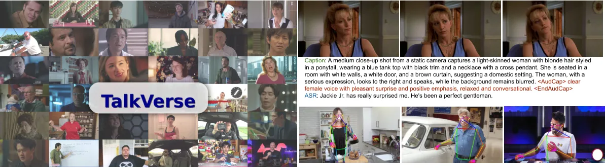
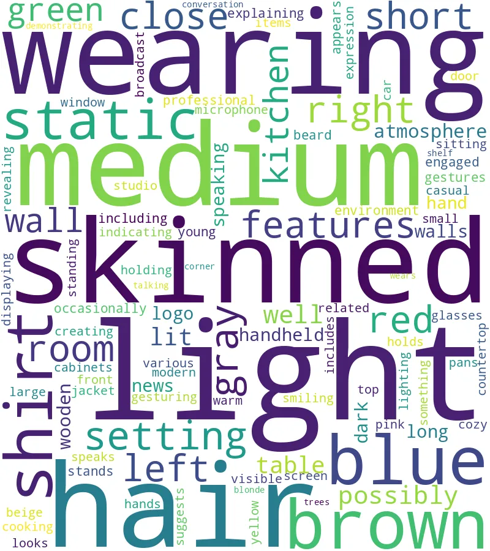
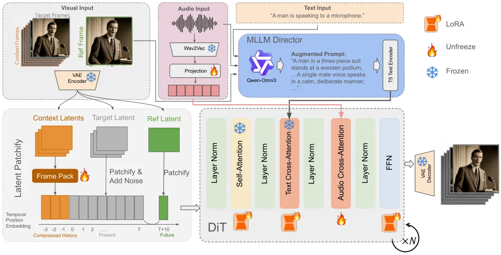

# TalkVerse: Democratizing Minute-Long Audio-Driven Video Generation

Zhenzhi Wang Affiliation: The Chinese University of Hong Kong
Email: <wz122@ie.cuhk.edu.hk>    Jian Wang Affiliation: Snap Inc.    Ke
Ma Affiliation: Snap Inc.    Dahua Lin Affiliation: The Chinese
University of Hong Kong    Bing Zhou Affiliation: Snap Inc.

###### Abstract

We introduce TalkVerse, a large-scale, open corpus for single-person,
audio-driven talking video generation designed to enable fair,
reproducible comparison across methods. While current state-of-the-art
systems rely on closed data or compute-heavy models, TalkVerse offers
2.3 million high-resolution (720p/1080p) audio-video synchronized clips
totaling 6.3k hours. These are curated from over 60k hours of video via
a transparent pipeline that includes scene-cut detection, aesthetic
assessment, strict audio-visual synchronization checks, and
comprehensive annotations including 2D skeletons and structured
visual/audio-style captions. Leveraging TalkVerse, we present a
reproducible 5B DiT baseline built on Wan2.2-5B. By utilizing a video
VAE with a high downsampling ratio and a sliding window mechanism with
motion-frame context, our model achieves minute-long generation with low
drift. It delivers comparable lip-sync and visual quality to the 14B
Wan-S2V model but with 10$`\times`$ lower inference cost. To enhance
storytelling in long videos, we integrate an MLLM director to rewrite
prompts based on audio and visual cues. Furthermore, our model supports
zero-shot video dubbing via controlled latent noise injection. We
open-source the dataset, training recipes, and 5B checkpoints to lower
barriers for research in audio-driven human video generation. Project
Page:
[https://zhenzhiwang.github.io/talkverse/](https://zhenzhiwang.github.io/talkverse/).

## 1 Introduction



Figure 1: Overview of TalkVerse with 2.3M single-person clips (6.3K
hours) at 720p with synchronized speech audio, 2D skeleton sequences,
and structured captions (visual+audio-style). Dataset and training
recipes for the 5B baseline for audio-driven video generation will be
open-sourced. It can also facilitate audio-video joint generation,
pose-driven video generation, and video personalization. (top right)
Video examples paired with visual+audio captions, as well as ASR
results. (bottom right) Pose visualizations.

Human video generation from audio and pose conditions \[28, 57, 73, 62,
14, 74, 55, 36, 41, 42, 21, 13\] has advanced rapidly with pretrained
video diffusion models \[4, 6, 7, 26, 86, 27, 63, 30, 8, 66, 53, 40, 60,
43\], enabling expressive talking/performing portraits and beyond. Yet
high-quality research and applications in this space remain hampered by
(1) limited open training data with reliable audio-visual
synchronization, and (2) compute-heavy pretrained models (e.g.,
Wan2.1-14B) that impede broad participation. In this work, we show that
curating a large-scale and transparent full-body human-centric video
corpus with high-quality synchronized audio is feasible, and it could
foster the training of lightweight models with lip synchronization and
visual quality on par with commercial-level models, by leveraging
limited computational resources (e.g., 64 GPUs for one week) with the
goal of reproducibility at moderate compute, not SOTA-at-any-cost.

Although many existing methods managed to generate full-body
audio-driven videos \[42, 21, 13, 58, 23, 24\], their training datasets
are either internal data \[42, 21, 37, 13\] or a combination of
open-source talking-head datasets \[87, 22, 18, 84\] and a limited
amount of self-collected full-body data. Besides, the recent large-scale
human-centric dataset OpenHumanVid \[39\] focuses on text-to-video
generation and ignores the audio synchronization property for human
image animation. We identify several challenges with existing
open-source data: (1) Video-audio synchronization: Unlike pose and text
conditions that can be inferred from video by pose detection or video
captioning, the audio modality is recorded during collection and
synchronization is not guaranteed in internet videos; (2) Appearance
consistency and disambiguation: it is hard to train audio-driven video
generation models with ambiguity of the active speaker when multiple
subjects exist; (3) Scale of data: as we want to generate realistic lip
and full-body movements from in-the-wild audio, the total duration of
data and language coverage are vital for this task. The assumption is,
the training corpus should cover most phonemes across many languages so
that the model can generalize. Therefore, a high-quality and large-scale
dataset is necessary to facilitate this area and end-to-end
reproducibility.

In this paper, we introduce TalkVerse, a large-scale audio-video corpus
for single-person, full-body human video generation conditioned on audio
or pose. It comprises _2.3M_ high-resolution (720p or 1080p)
audio-synchronized clips with over _6.3k_ hours from two human-centric
text-to-video sources \[39, 12\] with 30M initial human-related clips,
as shown in Fig. 1. It is curated through a pipeline that performs
scene-cut detection, human and subtitle screening, aesthetic and image
quality assessment, motion filtering, and audio-video synchronization
checks, followed by language annotation. It emphasizes verified
audio-video synchronization and high-quality, identity- and
motion-diverse content. To preserve most of the text-conditioning
ability when training audio-conditioning injection from a pretrained Wan
DiT \[61\], we also annotate structured video captions with background
appearance, camera movement, subject appearance, and subject movement
from a fine-tuned Qwen2.5-VL \[2\] and an audio-style caption from
Qwen3-Omni \[72\]. We utilize a pose detector \[76\] to ensure there is
a single subject and also extract the pose condition. In summary, we
provide various human-related annotations, including video captions,
synchronized audio, 2D human pose, audio-style captions, and language
type. Given the properties of audio-video synchronization, this dataset
is also valuable for other human-centric video tasks, such as
audio-video joint generation, pose-driven video generation, and video
personalization from human images.

To demonstrate the utility of the data, we adopt the Wan-S2V
architecture \[24\] and train a 5B model using a higher VAE downsampling
ratio. Despite being over 10$`\times`$ cheaper at inference than the
strong Wan-S2V-14B, this baseline attains comparable perceptual quality
and lip synchronization. In summary, our contributions are: (1)
TalkVerse-2.3M. We release a large, synchronized, single-person
talking/performing video corpus (with _2.3M_ clips and _6.3k_+ hours)
curated by a transparent pipeline with reproducible filters for visual
quality, motion, and audio-video alignment. (2) TalkVerse-5B model and
open recipes. We open-source data recipes, preprocessing tools, training
scripts, and inference code, along with checkpoints for a compact 5B
Wan-S2V baseline trained end-to-end on TalkVerse.

## 2 Related Work

Human Animation Models synthesize human videos conditioned on text,
reference images, human body poses, or audio. Early GAN-based
approaches \[51, 85, 52, 65\], typically trained on comparatively small
datasets \[47, 51, 71, 87\], tackled self-supervised pose transfer.
Recent diffusion-based methods \[50, 83, 33, 67, 68\] surpass GANs by
conditioning on 2D skeletons, estimated depth, or mesh sequences.
Audio-driven portrait animation \[77, 82, 57, 36, 18\] has expanded to
full-body motion through both two-stage pipelines \[17, 45, 56, 31\] or
unified one-stage designs \[41, 42, 58, 23, 13, 21, 69, 24\]. However,
many prior works remain for internal use or are released only as
checkpoints. In contrast, we are the first to disclose the full
data-curation pipeline for training high-quality human animation models.
Our dataset constitutes, to our knowledge, the first million-scale
open-source resource for this task.

Figure 2: Overview of our comprehensive data filtering pipeline. We
obtain 6.3k hours of high-quality audio–video data from 60k hours of
human-related videos, and provide 2D skeletons and extensive text
annotations from three aspects: visual, audio-style, and ASR content.

Human-Centric Video Datasets with paired, temporally synchronized
modalities (e.g., pose, audio, and text) are critical for progress in
human image animation. Prior human-centric datasets either prioritize
pose without audio \[35, 79, 67, 5\] or are limited to talking
heads \[87, 18, 84\]. Meanwhile, action-recognition datasets such as
UCF101 \[54\], NTU RGB+D \[49\], ActivityNet \[9\], and AVA \[25\]
suffer from low resolution and reduced visual quality for our purposes.
General-purpose text-to-video corpora, e.g., HD-VILA-100M \[75\],
HowTo100M \[46\], WebVid-10M \[3\], Panda-70M \[12\], and
OpenVid-1M \[48\], lack diversity within the human category (identities
and motions) and typically do not provide accurate captions, skeleton
representations, or synchronized speech audio as motion conditions. More
recently, OpenHumanVid \[39\] introduced 16.7k hours of human-centric
video, but its duration and visual quality are still limited and audio
is not guaranteed to be synchronized for animation training.
TalkCuts \[11\] collects multi-shot, long-form talk shows, yet the scale
remains about 500 hours. While valuable, these resources are
insufficient for training human image animation models due to
constraints in diversity, scale, audio synchronization, and skeleton
quality. Building on general text-to-video corpora such as Panda-70M and
OpenHumanVid, we curate a high-quality, single-person full-body
human-centric dataset with verified pose quality and audio-pose
synchronization, and demonstrate its effectiveness for training human
image animation models in our experiments.

|                       |                         |           |                |                                     |            |
| --------------------- | ----------------------- | --------- | -------------- | ----------------------------------- | ---------- |
| Dataset name          | Domain                  | \# Videos | Length (hours) | Motion type                         | Resolution |
| WebVid-10M\[3\]       | Open                    | 10M       | 52K            | Text                                | 360P       |
| Panda-70M\[12\]       | Open                    | 70M       | 167K           | Text                                | 720P       |
| OpenVid-1M\[48\]      | Open                    | 1M        | 2K             | Text                                | 512P       |
| UCF-101\[54\]         | Human action            | 13.3K     | 26.7           | Text                                | 240P       |
| NTU RGB+D\[49\]       | Human action            | 114K      | 37             | 3D pose, depth                      | 1080P      |
| ActivityNet\[9\]      | Human action            | 100K      | 849            | Text                                | 480P       |
| TikTok\[34\]          | Single-person dance     | 350       | 1              | Skeleton                            | 600P       |
| UBC-Fashion\[79\]     | Single-person dance     | 500       | 2              | Skeleton                            | 720P       |
| HumanVid\[67\]        | Single-person dance     | 20K       | 115            | Skeleton, camera                    | 1080P      |
| OpenHumanVid\[39\]    | Multi-person performing | 13.2M     | 16.7K          | Text, skeleton pose, non-sync audio | 720P       |
| VoxCeleb2\[16\]       | Talking heads           | 1M        | 2.4K           | speech audio                        | 240P       |
| HDTF\[84\]            | Talking heads           | 368       | 15.8           | speech audio                        | 512P       |
| TalkingHead-1KH\[65\] | Talking heads           | 80K       | 160            | speech audio                        | 512P       |
| CelebV-HQ\[87\]       | Talking heads           | 35K       | 68             | Text, speech audio                  | 512P       |
| CelebV-Text\[78\]     | Talking heads           | 70K       | 279            | Text, speech audio                  | 512P       |
| DH-FaceVid-1K\[20\]   | Talking heads           | 270K      | 1.2K           | Text, speech audio                  | 512P       |
| TalkCuts \[11\]       | Single-person talking   | 164k      | 507            | Text, skeleton pose, speech audio   | 1080P      |
| Ours                  | Single-person talking   | 2.3M      | 6.3K           | Text, skeleton pose, speech audio   | 720P/1080P |

Table 1: Comparison of representative datasets for human-centric video
understanding and generation. We integrate skeleton sequences derived
from DWPose \[76\] and ensure the speech audio is synchronized through
SyncNet \[15\]. In audio-driven video generation, we are the largest
dataset with synchronized speech audio and keep full-body human
movements instead of only talking heads.



Figure 3: Dataset statistics and analysis: (left) distribution of clip
durations; (middle) language distribution from automatic detection on
speech tracks; (right) keyword word cloud summarizing caption content.

## 3 TalkVerse Dataset

TalkVerse comprises 2.3M short clips (5–50s) totaling _6.3k_ hours, each
with (i) 720p/1080p frame sequences, (ii) time-aligned speech audio,
(iii) 2D pose skeletons, (iv) visual and audio captions, and (v)
metadata for analysis and evaluation such as duration, language type,
and quality scores. We curate primarily from *OpenHumanVid* \[39\] and
*Panda-70M* \[12\]. All clips are standardized, de-duplicated, and
verified for audio–visual alignment prior to downstream processing. To
reduce active-speaker ambiguity for audio-driven generation, we restrict
clips to _a single visible person_ and talking/performing segments.

### 3.1 Data Processing

As shown in Fig. 2, we construct a comprehensive data filtering pipeline
to ensure the high visual quality and audio synchronization of our
dataset.

#### 3.1.1 Video Preprocessing

Video Segmentation. We first apply codec standardization (H.264) and
black-border removal. All videos are converted to 25 fps for the
convenience of lip-sync filtering. Scene splitting is performed using
PySceneDetect \[10\] to segment videos into coherent shots, after which
we retain segments of 5–50 seconds to balance semantic completeness and
training efficiency. Notably, many internet videos may have scene
boundaries that cannot be detected by PySceneDetect \[10\] due to edited
videos recorded from a static camera, where the background is continuous
but the foreground may have sudden posture changes. This leads to
unexpected human movements within a video generation window (e.g., 5s)
in long-video generation when training an audio-driven video generation
method upon it. For this type of scene boundary, we use AutoShot \[88\]
to cut segments to ensure temporal smoothness. Empirically, we find it
is effective for audio-driven video generation training to remove sudden
posture changes in the generated results.

Video Quality Filter. We perform a multi-faceted quality screening that
considers luminance, blurriness, aesthetic and image quality \[70\].
Thresholds are selected to achieve high recall at intake and high
precision post-filtering.

#### 3.1.2 Human-Centric Annotation

Textual Caption. To preserve strong text-conditioning for
audio-injection training, we additionally produce _structured_ video
captions covering background appearance, camera movement, subject
appearance, and subject movement with a fine-tuned Qwen2.5-VL \[2\] from
seven evenly spaced frames from the clip, and an _audio-style_ caption
with Qwen3-Omni \[72\] from the entire audio track. The audio
description emphasizes speaker-related acoustic attributes such as age,
gender, prosody, emotion, speaking rate, as well as the ASR results. An
audio-style caption can be beneficial for emotion consistency in
long-video generation. Note that for audio-driven video generation we do
not include ASR information in training, yet it could facilitate joint
audio–video generation in the future. Additionally, we will leverage the
OCR information from visual captions to remove videos with moving
subtitles like broadcasts or TV shows. Videos with static text overlays
are kept as long as they stay in the same position across the whole
video.

Skeleton Sequence. We extract human skeletons with DWPose \[76\] to
serve as pose control signals for human video generation. In addition,
we use the detected person bounding box size and head/hand keypoint
confidences to filter the data: we keep clips with a single person and
persistent head keypoints, require the bounding box area
$`>\!0.2\times`$ the whole image area, enforce head confidence
$`>\!0.9`$, and, when hands are present, hand keypoint confidence
$`>\!0.8`$. As a result, our dataset can contribute to pose-driven video
generation with million-level video data.

Speech Audio. We use SyncNet \[15\] to check lip–audio synchrony and
remove async videos, strengthening audio-conditioned training.
Specifically, SyncNet learns a joint audio–visual embedding and outputs
a scalar synchronization confidence and a temporal offset (in frames).
We run it at scale on millions of clips and retain clips satisfying
$`|\text{offset}|\!\leq\!3`$ and $`\text{confidence}\!>\!1.6`$. We
observed that even a small amount of out-of-sync data degrades lip-sync
learning in audio-driven video generation, so we adopt these strict
thresholds to minimize misalignment.



Figure 4: TalkVerse‑5B model architecture. Wav2Vec features are
projected and injected via sparse audio cross‑attention. FramePack
compresses context; a reference‑image positional embedding prevents
drift across sliding windows. An MLLM Director rewrites prompts
conditioned on audio and reference frames. VAE uses (t,h,w) = (4,16,16)
downsampling for a 4× token reduction versus typical settings.

## 4 Method

### 4.1 Audio-Driven Video Generation

Given a reference image, an audio input, and a text prompt describing
the video content and audio style, we can generate a video synchronized
with the audio while preserving the content in the reference image, as
shown in Fig. 4. Our base model (Wan2.2-5B) is a Diffusion Transformer
(DiT) pretrained for text/image-to-video generation, paired with a video
VAE that downsamples by $`(t,h,w)=(4,16,16)`$, which has a larger
compression ratio than widely used ones (e.g., Wan2.1-14B). As a result,
this latent space is 4$`\times`$ faster than previous ones when
generating the same video resolution. Concurrent with Wan-S2V \[24\], we
find that using a set of {motion-frame context, denoised video,
reference image} with proper positional embedding can generate smooth
and coherent minute-long videos via a sliding window. The visual
quality, subject consistency, and anti-drifting capability of this
design are generally better than previous methods with first-frame image
conditioning \[38, 23\]. In training, the video duration only needs to
be the length of motion-frame context plus denoised video, e.g., 3s + 4s
in our case, much shorter than the minute-long objective.

#### 4.1.1 Audio Condition Injection

We encode raw audio with Wav2Vec \[1\], aggregate multi-layer Wav2Vec
features via projection layers to fuse audio cues from different
semantic levels, and compress them with causal 1D convolutions so that
each latent frame receives a temporally aligned audio segment. Audio
features are injected into DiT blocks by per-latent cross-attention from
visual tokens to audio tokens, ensuring precise lip–audio
synchronization. The audio cross-attention is applied to selected DiT
blocks sparsely to reduce the computational overhead, and is trained in
an end-to-end manner.

#### 4.1.2 Long-Video Generation

Image Condition and Anti-drifting in Long Videos. We find that the image
condition is crucial for the visual appearance consistency in long
videos. We adopt a Positional Embedding slightly longer than the last
latent of denoised video (e.g., 10 latents) to guide the generation.
This assignment makes the generation “chase” the reference image in the
future rather than copy it at the current step, effectively decoupling
the human posture in the reference image from the posture in the
training video and avoiding copy-paste artifacts. As a result, we can
share the same reference image across sliding windows at inference
without inducing looped body movements; in contrast, first-frame
conditioning tends to reset the starting latent of each window to
exactly match the reference pose. Finally, this scheme also supports
injecting different reference images for different windows to gradually
change the background while keeping the subject’s appearance consistent,
yielding more cinematic long videos.

Context History Frames. Following Wan-S2V \[24\], we pass a window of
preceding motion frames as context and pack them with a FramePack
module \[81\] to preserve smooth transition between each short video
clip (e.g., 5 seconds). FramePack could effectively compress the motion
frames and reduce the total number of tokens in the expensive 3D
self-attention (temporal, width and height). The patchify embeddings are
trained in a data-driven manner jointly with the audio cross-attention
training. To make the set of {motion-frame context, denoised video,
reference image,} consistent in positional embedding, we assign negative
positional embedding to the motion frames to indicate that the context
is the history information.

Figure 5: Illustration of video dubbing using the pretrained
audio-driven reference-image-to-video generation model with video
editing tricks during inference.

#### 4.1.3 MLLM Director

In minute-long video generation, there may be storylines in text prompts
that guide the generation. Therefore, an MLLM Director that accepts user
prompts and audio/image features to rewrite and produce a diverse and
accurate video caption is crucial for the generation. In this stage, the
rewritten video caption can also reduce the training–inference gap by
matching the text prompt style in the training stage. To ground
multimodal instructions into a coherent plan, we use Qwen3-Omni \[72\]
as an MLLM Director. It extracts emotion from the audio and
scene/appearance descriptors from reference frames, then merges them
with the user prompt to produce a compact storyline. The storyline
prioritizes user intent, then audio cues, then image references, and
enumerates character traits, background layout, actions, emotional
shifts, visual style, and camera planning. We employ few-shot in-context
templates to stabilize outputs. The finalized storyline is injected as
text conditioning via cross-attention to guide generation consistently
across time. As a result, the trained audio-driven DiT model can ensure
lip synchronization, visual appearance consistency, and smooth window
transitions in long videos, while the MLLM Director can guide the
generation to be interesting and consistent with the user prompt and
audio/emotion style.

#### 4.1.4 Training techniques.

As Wan2.2-5B with a higher compression ratio VAE is more prone to
generating artifacts during fine-tuning, we find that full parameter
tuning is not suitable for the 5B model, which is different from the
results from 14B models \[24\]. We perform audio-driven fine-tuning via
Low-Rank Adaptation (LoRA) \[32\] for all DiT weights and full-parameter
fine-tuning for audio projection, cross-attention, and FramePack-related
weights. Specifically, for a pretrained weight matrix $`W`$, we
introduce a low-rank residual $`\Delta W`$ and form the adapted weight
$`W^{\prime}=W+\Delta W`$, where $`\Delta W`$ is factorized as
$`\Delta W=AB^{\top},\quad A\in\mathbb{R}^{n\times d},\;B\in\mathbb{R}^{m\times d},\;d\ll\min(n,m)`$.
By training only the small matrices $`A`$ and $`B`$ (and keeping $`W`$
frozen) in attention and MLP blocks inside DiT blocks, we greatly reduce
memory and compute while preserving the base model’s priors. This
enables more stable adaptation to synchronized speech cues with minimal
visual artifacts. To facilitate faster convergence of audio-conditioning
injection, we initialize the audio cross-attention layers from the text
cross-attention weights instead of random initialization. The major
difficulty of model training is to add audio conditioning ability and
smooth context frame transitions without damaging the text-conditioning
ability. To prevent the new layers from disturbing the pretrained
model’s knowledge, we use a zero-initialized linear layer to connect the
audio cross-attention layer to the main DiT blocks like
ControlNet \[80\]. LoRA training is also beneficial for preserving the
text-conditioning priors.

| Method                | FID$`\downarrow`$ | FVD$`\downarrow`$ | Sync-C$`\uparrow`$ | HKC$`\uparrow`$ | HKV$`\uparrow`$ | CSIM$`\uparrow`$ |
| --------------------- | ----------------- | ----------------- | ------------------ | --------------- | --------------- | ---------------- |
| EchoMimicV2 \[45\]    | 33.42             | 217.71            | 4.44               | 0.425           | 0.150           | 0.519            |
| EMO2 \[56\]           | 27.28             | 129.41            | 4.58               | 0.553           | 0.198           | 0.650            |
| FantasyTalking \[64\] | 22.60             | 178.12            | 3.00               | 0.281           | 0.087           | 0.626            |
| Hunyuan-Avatar \[13\] | 18.07             | 145.77            | 4.71               | 0.379           | 0.145           | 0.583            |
| Wan-S2V-14B \[24\]    | 15.66             | 129.57            | 6.41^(†)           | 0.435           | 0.142           | 0.677            |
| TalkVerse-5B          | 18.66             | 147.21            | 5.47               | 0.412           | 0.151           | 0.658            |

Table 2: Quantitative comparisons on EMTD test set. ^(†) our
experimental results from Wan-S2V-14B official checkpoint.

Figure 6: Qualitative comparison with EchoMimicV3 \[44\] (case 1&2) and
OmniAvatar \[23\] (case 3), from top-down order.

### 4.2 Application to Video Dubbing

We find that once an audio-driven image-to-video generation model is
trained, it can generalize to audio-driven video-to-video generation in
a zero-shot manner. As shown in Fig. 5, given an input video, we adapt
our generation pipeline to enable flexible control over content
preservation and motion synthesis. Rather than initializing the
diffusion process with pure Gaussian noise, we inject controlled noise
into the encoded video latents at a specified noise level
$`\alpha\in[0,1]`$. Specifically, we first encode the input video into
the latent space using our VAE encoder, then initialize the denoising
process with:

```math
\mathbf{z}_{t}=(1-\alpha)\mathbf{z}_{0}+\alpha\boldsymbol{\epsilon},\quad\boldsymbol{\epsilon}\sim\mathcal{N}(0,\mathbf{I}), \tag{1}
```

where $`\mathbf{z}_{0}`$ represents the clean video latents and
$`\mathbf{z}_{t}`$ is the noisy initialization. The denoising process
then proceeds only from timestep $`t=\alpha T`$ to $`t=0`$, where $`T`$
is the total number of timesteps.

We empirically set $`\alpha=0.95`$ as the default value, as we observe
that motion dynamics are predominantly synthesized during high-noise
denoising steps in flow-based diffusion models. This high noise level
allows the model to generate new audio-synchronized motion and
expressions while the remaining low-noise steps refine details and
preserve scene structure from the original video. The noise strength
$`\alpha`$ provides intuitive control over the dubbing effect: lower
values ($`\alpha\to 0`$) preserve more original video content, while
higher values ($`\alpha\to 1`$) enable more flexible motion generation.
Additionally, for temporal consistency across segments during multi-clip
generation, we dynamically update the reference image by randomly
sampling a frame from each video segment, ensuring the reference
conditioning remains aligned with the current scene context throughout
the entire video.

## 5 Experiments

### 5.1 Implementation Details

We follow Wan2.2-5B and use resolution bins matching 720p area during
training. Starting from a pretrained Wan2.2-5B, we train newly
introduced parameters (i.e., audio projection, cross-attention, and
FramePack-related weights) from scratch on TalkVerse while keeping DiT
frozen, applying LoRA tuning to DiT. Audio layers are injected sparsely
at DiT blocks $`3k`$ for $`k\!=\!0,\dots,9`$, plus the final block,
leading to a total of 5.8B parameters. Training uses DDP with up to 73
context + 80 video frames due to GPU memory limits, batch size 1 per GPU
on 64 GPUs. LoRA rank/alpha are 128. We use AdamW with lr 1e-5 (full
fine-tuning parameters) and 1e-4 (LoRA). For training FramePack, we use
mixed-length sampling: if a video $`\geq`$ 73+80 frames, we randomly
sample a 73+80 window (first 73 as context, last 80 as video);
otherwise, we zero the context latents and randomly sample an 80-frame
video window. We sample the reference image temporally after the video
window to be consistent with the positional embedding in our method. We
use CFG=6.5 for both text and audio. Due to compute resource limits, we
train for only one week ($`\sim`$1 epoch) and report these results in
this section. We believe the performance could be further optimized with
more computations.

Figure 7: Qualitative comparison on 40s long video generation (25fps)
with StableAvatar \[58\].

Figure 8: Qualitative comparison on LoRA training and full finetuning on
DiT weights.

Metrics. As most open-source benchmarks focus on talking heads, we
evaluate on the EMTD dataset \[45\] and compare with EchoMimicV2 \[45\],
EMO2 \[56\], FantasyTalking \[64\], and Hunyuan-Avatar \[13\] following
Wan-S2V-14B \[24\]. We report FID \[29\], FVD \[59\], lip-sync
Sync-C \[15\], ArcFace \[19\] similarity (CSIM), and hand keypoint
confidence (HKC) and hand keypoint variance (HKV). We remove PSNR and
SSIM due to the fact that they are ineffective with audio condition.

### 5.2 Main Results

Lip-sync and Identity Consistency. Our 5B model’s performance is
comparable to SOTA methods on FID/FVD/lip-sync/hand quality/identity
consistency. Compared to Wan-S2V-14B and FantasyTalking based on
Wan2.1-14B model, this performance is achieved with roughly
$`11.2\times`$ lower inference compute, stemming from a $`4\times`$
reduction in latent tokens due to our higher VAE compression and an
additional $`\approx 2.8\times`$ speedup from using 5B vs 14B parameters
(14/5). Hunyuan-Avatar also uses a large 13B HunyuanVideo video model,
which is significantly slower than ours. In Fig 6, we show qualitative
comparisons with EchoMimicV3 \[44\] and OmniAvatar \[23\]. Our model can
generate more natural body movements and better subject consistency than
open-sourced academic methods.

Long Video Generation. We also evaluate our model on 40s long video
generation at 25fps and compare with StableAvatar \[58\] in Fig. 7. We
can see that our model can achieve on-par long-video appearance
preservation ability with StableAvatar after 1000 frames, which could
cover most use cases in applications.

### 5.3 Ablations

Lora Training. We compare LoRA training and full fine-tuning on DiT
weights in Fig. 8. We can see that LoRA training can preserve better
visual quality than full fine-tuning on DiT weights, especially for
articulated hands and objects. Our observation is that small pretrained
DiT models (e.g., 5B or 1.3B) could suffer more from visual artifacts
during fine-tuning than the powerful 14B model. However, the heavy 14B
model could be prohibitively slow for inference in applications and
impede broad participation in the community. We argue that the 5B model
is a good compromise between performance and inference speed, with a
suitable training strategy. Furthermore, it could have the potential to
be real-time with proper distillation and engineering optimization.

## 6 Conclusion

We introduced TalkVerse, a large-scale, audio-synchronized video corpus
for single-person human video generation conditioned on audio or pose.
The dataset comprises 2.3M clips (6.3k hours) at 720p/1080p, each with
time-aligned speech audio, DWPose skeleton sequences, and video/audio
captions. On top of this data, we train a Wan2.2-5B DiT, yielding a
substantially faster latent space than widely used settings. Despite its
small size, the model attains perceptual quality and lip synchronization
comparable to larger 14B systems with 10$`\times`$ lower inference cost,
enabled by audio condition injection from aggregated Wav2Vec features
via sparse cross-attention, FramePack-based history compression for
smooth window transitions, and a reference-image positional embedding
strategy that sustains minute-long generation with less drift. An MLLM
Director (Qwen3-Omni) rewrites user prompts by grounding audio and image
cues to produce coherent, style-consistent storylines. Our model can
generalize zero-shot to video dubbing via controlled noise injection.

Limitations and future work. 5B models may underperform on complex and
extreme hand articulation and full-body motions. Although this dataset
could support other tasks like pose-driven video generation and
audio-video joint generation, this paper does not include these
experiments due to compute resource limits. We will adapt our dataset to
these tasks in future work.

Supplementary Material

## 7 More Details about Experiments

### 7.1 Training Details

We finetune the Wan S2V 5B model and newly added audio cross-attention
using AdamW ($`10^{-5}`$ learning rate) with selective unfreezing of the
time embedding, projection, head, and optional transformer blocks. LoRA
parameters in DiT are scaled by $`10\times`$ to be $`10^{-4}`$. Training
uses a batch size of 1 per GPU with gradient accumulation to be total
batch size as 256 and gradient clipping (norm 1.0). To perform CFG, we
apply 10% dropout to text, image, and audio conditions. When framepack
module is enabled, we jointly encodes motion and target frames to VAE
space for training to maintain temporal continuity in long-video
generation. Otherwise, the motion context frames in VAE space as
all-zero tensors.

### 7.2 Spatial Loss Weighting

We use a ROI loss up weights for reconstruction error in face and body
regions by employing DWPose \[76\] to estimate body and face bounding
boxes and keypoints which are normalized and rasterized into binary
masks aligned with the resolution in VAE space, and then construct a
spatial loss weighting over the diffusion denoising objective.
Specifically, let $`L_{\mathrm{full}}`$, $`L_{\mathrm{body}}`$, and
$`L_{\mathrm{face}}`$ denote the per-pixel losses on the full frame, the
body bounding box, and the face bounding box, respectively. The final
training loss is

```math
L=\frac{1\cdot L_{\mathrm{full}}+1\cdot L_{\mathrm{body}}+1\cdot L_{\mathrm{face}}}{Z}, \tag{2}
```

where $`Z`$ is a normalization factor (e.g., the sum of the weights), so
that regions inside the body and face boxes receive proportionally
higher importance than the background.

### 7.3 Data Preprocessing Pipeline

We construct a video–audio–text dataset by unifying metadata from
multiple sources, ensuring all clips contain valid 25 fps video and
audio streams. To control resolution, we adopt a resolution-bin policy
(e.g., 720p) where each clip is resized and center-cropped to the
closest target bucket. We sample a continuous sequence of frames for
denoising, optionally prepended by motion context frames, and extract a
conditional reference image from a nearby window.

Audio is resampled to 16 kHz and strictly aligned to the video segment,
padded if necessary. Finally, we load cached text embeddings
(pre-extracted by T5 text encoder) and a null embedding for
classifier-free guidance, yielding a comprehensive set of synchronized
inputs for training.

### 7.4 Inference Process

Our inference pipeline supports both image-to-video generation and
video-to-video “dubbing” across multiple resolutions. We encode the text
prompt (T5), audio (wav2vec2), and reference image (VAE) to condition
the diffusion model. For dubbing, instead of initializing from pure
noise, we encode the input video into latents, add noise to a target
timestep $`t_{\text{dub}}`$, and denoise from that state to preserve
coarse structure while synchronizing lip motion. The latent sequence is
iteratively denoised using a flow-matching solver (e.g., UniPC, 50
steps) and decoded by the VAE. For CFG scale, we find that 3 to 6 will
leads to good results, which is a trade-off between (1) visual quality
and motion strength, and (2) lip-sync quality. The larger CFG weights,
the better lip-sync quality but worse visual quality and motion
strength.

### 7.5 Hyper-parameter Settings for Wan S2V 5B

We summarize the main configuration used in our experiments in Table 3.

|                               |                                      |
| ----------------------------- | ------------------------------------ |
| Hyper-parameter               | Value                                |
| Language Encoder              | T5-XXL                               |
| VAE                           | Wan2.2-VAE                           |
| VAE stride                    | $`(4,16,16)`$                        |
| Audio encoder                 | wav2vec2-large-xlsr-53-english       |
| Patch size                    | $`(1,2,2)`$                          |
| Model dimension               | $`3072`$                             |
| FFN dimension                 | $`14336`$                            |
| Frequency embedding dimension | $`256`$                              |
| Attention heads               | $`24`$                               |
| Transformer layers            | $`30`$                               |
| QK norm / cross-attn norm     | True / True                          |
| Audio dimension               | $`1024`$                             |
| Audio injection layers        | $`\{0,3,6,9,12,15,18,21,24,27,29\}`$ |
| Motion frames                 | $`73`$                               |
| Latent dimension              | $`48`$                               |
| $`v`$-scale                   | $`1.0`$                              |
| Sampling frame rate           | $`25`$ fps                           |
| Sampling frame count          | $`120`$                              |
| Diffusion shifting            | $`5`$                                |
| Default sampling steps        | $`50`$                               |

Table 3: Hyper-parameters for our 5B model.

## References

- \[1\] Alexei Baevski, Yuhao Zhou, Abdelrahman Mohamed, and Michael
  Auli. wav2vec 2.0: A framework for self-supervised learning of speech
  representations. _Advances in neural information processing systems_,
  33:12449–12460, 2020.
- \[2\] Shuai Bai, Keqin Chen, Xuejing Liu, Jialin Wang, Wenbin Ge, Sibo
  Song, Kai Dang, Peng Wang, Shijie Wang, Jun Tang, et al. Qwen2. 5-vl
  technical report. _arXiv preprint arXiv:2502.13923_, 2025.
- \[3\] Max Bain, Arsha Nagrani, Gül Varol, and Andrew Zisserman. Frozen
  in time: A joint video and image encoder for end-to-end retrieval. In
  _Proceedings of the IEEE/CVF international conference on computer
  vision_, pages 1728–1738, 2021.
- \[4\] Omer Bar-Tal, Hila Chefer, Omer Tov, Charles Herrmann, Roni
  Paiss, Shiran Zada, Ariel Ephrat, Junhwa Hur, Yuanzhen Li, Tomer
  Michaeli, et al. Lumiere: A space-time diffusion model for video
  generation. _arXiv preprint arXiv:2401.12945_, 2024.
- \[5\] Michael J. Black, Priyanka Patel, Joachim Tesch, and Jinlong
  Yang. BEDLAM: A synthetic dataset of bodies exhibiting detailed
  lifelike animated motion. In _CVPR_, pages 8726–8737. IEEE, 2023.
- \[6\] Andreas Blattmann, Tim Dockhorn, Sumith Kulal, Daniel
  Mendelevitch, Maciej Kilian, Dominik Lorenz, Yam Levi, Zion English,
  Vikram Voleti, Adam Letts, et al. Stable video diffusion: Scaling
  latent video diffusion models to large datasets. _arXiv preprint
  arXiv:2311.15127_, 2023a.
- \[7\] Andreas Blattmann, Robin Rombach, Huan Ling, Tim Dockhorn,
  Seung Wook Kim, Sanja Fidler, and Karsten Kreis. Align your latents:
  High-resolution video synthesis with latent diffusion models. In
  _Proceedings of the IEEE/CVF Conference on Computer Vision and Pattern
  Recognition_, pages 22563–22575, 2023b.
- \[8\] Tim Brooks, Janne Hellsten, Miika Aittala, Ting-Chun Wang, Timo
  Aila, Jaakko Lehtinen, Ming-Yu Liu, Alexei Efros, and Tero Karras.
  Generating long videos of dynamic scenes. _Advances in Neural
  Information Processing Systems_, 35:31769–31781, 2022.
- \[9\] Fabian Caba Heilbron, Victor Escorcia, Bernard Ghanem, and Juan
  Carlos Niebles. Activitynet: A large-scale video benchmark for human
  activity understanding. In _Proceedings of the ieee conference on
  computer vision and pattern recognition_, pages 961–970, 2015.
- \[10\] Brandon Castellano. PySceneDetect.
- \[11\] Jiaben Chen, Zixin Wang, Ailing Zeng, Yang Fu, Xueyang Yu,
  Siyuan Cen, Julian Tanke, Yihang Chen, Koichi Saito, Yuki Mitsufuji,
  et al. Talkcuts: A large-scale dataset for multi-shot human speech
  video generation. _arXiv preprint arXiv:2510.07249_, 2025a.
- \[12\] Tsai-Shien Chen, Aliaksandr Siarohin, Willi Menapace, Ekaterina
  Deyneka, Hsiang-wei Chao, Byung Eun Jeon, Yuwei Fang, Hsin-Ying Lee,
  Jian Ren, Ming-Hsuan Yang, et al. Panda-70m: Captioning 70m videos
  with multiple cross-modality teachers. In _Proceedings of the IEEE/CVF
  Conference on Computer Vision and Pattern Recognition_, pages
  13320–13331, 2024a.
- \[13\] Yi Chen, Sen Liang, Zixiang Zhou, Ziyao Huang, Yifeng Ma,
  Junshu Tang, Qin Lin, Yuan Zhou, and Qinglin Lu. Hunyuanvideo-avatar:
  High-fidelity audio-driven human animation for multiple characters.
  _arXiv preprint arXiv:2505.20156_, 2025b.
- \[14\] Zhiyuan Chen, Jiajiong Cao, Zhiquan Chen, Yuming Li, and
  Chenguang Ma. Echomimic: Lifelike audio-driven portrait animations
  through editable landmark conditions. _arXiv preprint
  arXiv:2407.08136_, 2024b.
- \[15\] Joon Son Chung and Andrew Zisserman. Out of time: automated lip
  sync in the wild. In _Computer Vision–ACCV 2016 Workshops: ACCV 2016
  International Workshops, Taipei, Taiwan, November 20-24, 2016, Revised
  Selected Papers, Part II 13_, pages 251–263. Springer, 2017.
- \[16\] Joon Son Chung, Arsha Nagrani, and Andrew Zisserman. Voxceleb2:
  Deep speaker recognition. In _INTERSPEECH_, pages 1086–1090.
  ISCA, 2018.
- \[17\] Enric Corona, Andrei Zanfir, Eduard Gabriel Bazavan, Nikos
  Kolotouros, Thiemo Alldieck, and Cristian Sminchisescu. Vlogger:
  Multimodal diffusion for embodied avatar synthesis. _arXiv preprint
  arXiv:2403.08764_, 2024.
- \[18\] Jiahao Cui, Hui Li, Yun Zhan, Hanlin Shang, Kaihui Cheng, Yuqi
  Ma, Shan Mu, Hang Zhou, Jingdong Wang, and Siyu Zhu. Hallo3: Highly
  dynamic and realistic portrait image animation with diffusion
  transformer networks. _arXiv preprint arXiv:2412.00733_, 2024.
- \[19\] Jiankang Deng, Jia Guo, Niannan Xue, and Stefanos Zafeiriou.
  Arcface: Additive angular margin loss for deep face recognition. In
  _Proceedings of the IEEE/CVF conference on computer vision and pattern
  recognition_, pages 4690–4699, 2019.
- \[20\] Donglin Di, He Feng, Wenzhang Sun, Yongjia Ma, Hao Li, Wei
  Chen, Lei Fan, Tonghua Su, and Xun Yang. Dh-facevid-1k: A large-scale
  high-quality dataset for face video generation. In _Proceedings of the
  IEEE/CVF International Conference on Computer Vision_, pages
  12124–12134, 2025.
- \[21\] Yikang Ding, Jiwen Liu, Wenyuan Zhang, Zekun Wang, Wentao Hu,
  Liyuan Cui, Mingming Lao, Yingchao Shao, Hui Liu, Xiaohan Li, et al.
  Kling-avatar: Grounding multimodal instructions for cascaded
  long-duration avatar animation synthesis. _arXiv preprint
  arXiv:2509.09595_, 2025.
- \[22\] Ariel Ephrat, Inbar Mosseri, Oran Lang, Tali Dekel, Kevin
  Wilson, Avinatan Hassidim, William T. Freeman, and Michael Rubinstein.
  Looking to listen at the cocktail party: a speaker-independent
  audio-visual model for speech separation. _ACM Trans. Graph._,
  37(4):112, 2018.
- \[23\] Qijun Gan, Ruizi Yang, Jianke Zhu, Shaofei Xue, and Steven Hoi.
  Omniavatar: Efficient audio-driven avatar video generation with
  adaptive body animation. _arXiv preprint arXiv:2506.18866_, 2025.
- \[24\] Xin Gao, Li Hu, Siqi Hu, Mingyang Huang, Chaonan Ji, Dechao
  Meng, Jinwei Qi, Penchong Qiao, Zhen Shen, Yafei Song, et al. Wan-s2v:
  Audio-driven cinematic video generation. _arXiv preprint
  arXiv:2508.18621_, 2025.
- \[25\] Chunhui Gu, Chen Sun, David A Ross, Carl Vondrick, Caroline
  Pantofaru, Yeqing Li, Sudheendra Vijayanarasimhan, George Toderici,
  Susanna Ricco, Rahul Sukthankar, et al. Ava: A video dataset of
  spatio-temporally localized atomic visual actions. In _Proceedings of
  the IEEE conference on computer vision and pattern recognition_, pages
  6047–6056, 2018.
- \[26\] Yuwei Guo, Ceyuan Yang, Anyi Rao, Zhengyang Liang, Yaohui Wang,
  Yu Qiao, Maneesh Agrawala, Dahua Lin, and Bo Dai. Animatediff: Animate
  your personalized text-to-image diffusion models without specific
  tuning. In _International Conference on Learning Representations
  (ICLR)_, 2023.
- \[27\] Agrim Gupta, Lijun Yu, Kihyuk Sohn, Xiuye Gu, Meera Hahn, Li
  Fei-Fei, Irfan Essa, Lu Jiang, and José Lezama. Photorealistic video
  generation with diffusion models. _arXiv preprint
  arXiv:2312.06662_, 2023.
- \[28\] Tianyu He, Junliang Guo, Runyi Yu, Yuchi Wang, Jialiang Zhu,
  Kaikai An, Leyi Li, Xu Tan, Chunyu Wang, Han Hu, et al. Gaia:
  Zero-shot talking avatar generation. _arXiv preprint
  arXiv:2311.15230_, 2023.
- \[29\] Martin Heusel, Hubert Ramsauer, Thomas Unterthiner, Bernhard
  Nessler, and Sepp Hochreiter. Gans trained by a two time-scale update
  rule converge to a local nash equilibrium. _Advances in neural
  information processing systems_, 30, 2017.
- \[30\] Jonathan Ho, Tim Salimans, Alexey Gritsenko, William Chan,
  Mohammad Norouzi, and David J Fleet. Video diffusion models. _Advances
  in Neural Information Processing Systems (NeurIPS)_,
  35:8633–8646, 2022.
- \[31\] Steven Hogue, Chenxu Zhang, Hamza Daruger, Yapeng Tian, and
  Xiaohu Guo. Diffted: One-shot audio-driven ted talk video generation
  with diffusion-based co-speech gestures. In _Proceedings of the
  IEEE/CVF Conference on Computer Vision and Pattern Recognition_, pages
  1922–1931, 2024.
- \[32\] Edward J Hu, Yelong Shen, Phillip Wallis, Zeyuan Allen-Zhu,
  Yuanzhi Li, Shean Wang, Lu Wang, and Weizhu Chen. Lora: Low-rank
  adaptation of large language models. _arXiv preprint
  arXiv:2106.09685_, 2021.
- \[33\] Li Hu. Animate anyone: Consistent and controllable
  image-to-video synthesis for character animation. In _Proceedings of
  the IEEE/CVF Conference on Computer Vision and Pattern Recognition_,
  pages 8153–8163, 2024.
- \[34\] Yasamin Jafarian and Hyun Soo Park. Learning high fidelity
  depths of dressed humans by watching social media dance videos. In
  _CVPR_, pages 12753–12762. Computer Vision Foundation / IEEE, 2021a.
- \[35\] Yasamin Jafarian and Hyun Soo Park. Learning high fidelity
  depths of dressed humans by watching social media dance videos. In
  _Proceedings of the IEEE/CVF Conference on Computer Vision and Pattern
  Recognition_, pages 12753–12762, 2021b.
- \[36\] Jianwen Jiang, Chao Liang, Jiaqi Yang, Gaojie Lin, Tianyun
  Zhong, and Yanbo Zheng. Loopy: Taming audio-driven portrait avatar
  with long-term motion dependency. _arXiv preprint
  arXiv:2409.02634_, 2024.
- \[37\] Jianwen Jiang, Weihong Zeng, Zerong Zheng, Jiaqi Yang, Chao
  Liang, Wang Liao, Han Liang, Yuan Zhang, and Mingyuan Gao.
  Omnihuman-1.5: Instilling an active mind in avatars via cognitive
  simulation. _arXiv preprint arXiv:2508.19209_, 2025.
- \[38\] Zhe Kong, Feng Gao, Yong Zhang, Zhuoliang Kang, Xiaoming Wei,
  Xunliang Cai, Guanying Chen, and Wenhan Luo. Let them talk:
  Audio-driven multi-person conversational video generation. _arXiv
  preprint arXiv:2505.22647_, 2025.
- \[39\] Hui Li, Mingwang Xu, Yun Zhan, Shan Mu, Jiaye Li, Kaihui Cheng,
  Yuxuan Chen, Tan Chen, Mao Ye, Jingdong Wang, et al. Openhumanvid: A
  large-scale high-quality dataset for enhancing human-centric video
  generation. _arXiv preprint arXiv:2412.00115_, 2024.
- \[40\] Yitong Li, Martin Min, Dinghan Shen, David Carlson, and
  Lawrence Carin. Video generation from text. In _Proceedings of the
  AAAI conference on artificial intelligence_, 2018.
- \[41\] Gaojie Lin, Jianwen Jiang, Chao Liang, Tianyun Zhong, Jiaqi
  Yang, and Yanbo Zheng. Cyberhost: Taming audio-driven avatar diffusion
  model with region codebook attention. _arXiv preprint
  arXiv:2409.01876_, 2024.
- \[42\] Gaojie Lin, Jianwen Jiang, Jiaqi Yang, Zerong Zheng, and Chao
  Liang. Omnihuman-1: Rethinking the scaling-up of one-stage conditioned
  human animation models. _arXiv preprint arXiv:2502.01061_, 2025a.
- \[43\] Shanchuan Lin, Xin Xia, Yuxi Ren, Ceyuan Yang, Xuefeng Xiao,
  and Lu Jiang. Diffusion adversarial post-training for one-step video
  generation. _arXiv preprint arXiv:2501.08316_, 2025b.
- \[44\] Rang Meng, Yan Wang, Weipeng Wu, Ruobing Zheng, Yuming Li, and
  Chenguang Ma. Echomimicv3: 1.3 b parameters are all you need for
  unified multi-modal and multi-task human animation. _arXiv preprint
  arXiv:2507.03905_, 2025a.
- \[45\] Rang Meng, Xingyu Zhang, Yuming Li, and Chenguang Ma.
  Echomimicv2: Towards striking, simplified, and semi-body human
  animation. In _CVPR_, pages 5489–5498. Computer Vision Foundation /
  IEEE, 2025b.
- \[46\] Antoine Miech, Dimitri Zhukov, Jean-Baptiste Alayrac, Makarand
  Tapaswi, Ivan Laptev, and Josef Sivic. Howto100m: Learning a
  text-video embedding by watching hundred million narrated video clips.
  In _Proceedings of the IEEE/CVF international conference on computer
  vision_, pages 2630–2640, 2019.
- \[47\] A Nagrani, J Chung, and A Zisserman. Voxceleb: a large-scale
  speaker identification dataset. _Interspeech 2017_, 2017.
- \[48\] Kepan Nan, Rui Xie, Penghao Zhou, Tiehan Fan, Zhenheng Yang,
  Zhijie Chen, Xiang Li, Jian Yang, and Ying Tai. Openvid-1m: A
  large-scale high-quality dataset for text-to-video generation. _arXiv
  preprint arXiv:2407.02371_, 2024.
- \[49\] Amir Shahroudy, Jun Liu, Tian-Tsong Ng, and Gang Wang. Ntu rgb+
  d: A large scale dataset for 3d human activity analysis. In
  _Proceedings of the IEEE conference on computer vision and pattern
  recognition_, pages 1010–1019, 2016.
- \[50\] Ruizhi Shao, Youxin Pang, Zerong Zheng, Jingxiang Sun, and
  Yebin Liu. Human4dit: Free-view human video generation with 4d
  diffusion transformer. _arXiv preprint arXiv:2405.17405_, 2024.
- \[51\] Aliaksandr Siarohin, Stéphane Lathuilière, Sergey Tulyakov,
  Elisa Ricci, and Nicu Sebe. First order motion model for image
  animation. _Advances in neural information processing systems_,
  32, 2019.
- \[52\] Aliaksandr Siarohin, Oliver J Woodford, Jian Ren, Menglei Chai,
  and Sergey Tulyakov. Motion representations for articulated animation.
  In _Proceedings of the IEEE/CVF Conference on Computer Vision and
  Pattern Recognition_, pages 13653–13662, 2021.
- \[53\] Uriel Singer, Adam Polyak, Thomas Hayes, Xi Yin, Jie An,
  Songyang Zhang, Qiyuan Hu, Harry Yang, Oron Ashual, Oran Gafni, et al.
  Make-a-video: Text-to-video generation without text-video data. _arXiv
  preprint arXiv:2209.14792_, 2022.
- \[54\] K Soomro. Ucf101: A dataset of 101 human actions classes from
  videos in the wild. _arXiv preprint arXiv:1212.0402_, 2012.
- \[55\] Michal Stypulkowski, Konstantinos Vougioukas, Sen He, Maciej
  Zieba, Stavros Petridis, and Maja Pantic. Diffused heads: Diffusion
  models beat gans on talking-face generation. In _Proceedings of the
  IEEE/CVF Winter Conference on Applications of Computer Vision_, pages
  5091–5100, 2024.
- \[56\] Linrui Tian, Siqi Hu, Qi Wang, Bang Zhang, and Liefeng Bo.
  Emo2: End-effector guided audio-driven avatar video generation. _arXiv
  preprint arXiv:2501.10687_, 2025a.
- \[57\] Linrui Tian, Qi Wang, Bang Zhang, and Liefeng Bo. Emo: Emote
  portrait alive generating expressive portrait videos with audio2video
  diffusion model under weak conditions. In _European Conference on
  Computer Vision_, pages 244–260. Springer, 2025b.
- \[58\] Shuyuan Tu, Yueming Pan, Yinming Huang, Xintong Han, Zhen Xing,
  Qi Dai, Chong Luo, Zuxuan Wu, and Yu-Gang Jiang. Stableavatar:
  Infinite-length audio-driven avatar video generation. _arXiv preprint
  arXiv:2508.08248_, 2025.
- \[59\] Thomas Unterthiner, Sjoerd van Steenkiste, Karol Kurach,
  Raphaël Marinier, Marcin Michalski, and Sylvain Gelly. Fvd: A new
  metric for video generation.
- \[60\] Ruben Villegas, Mohammad Babaeizadeh, Pieter-Jan Kindermans,
  Hernan Moraldo, Han Zhang, Mohammad Taghi Saffar, Santiago Castro,
  Julius Kunze, and Dumitru Erhan. Phenaki: Variable length video
  generation from open domain textual descriptions. In _International
  Conference on Learning Representations_, 2022.
- \[61\] Ang Wang, Baole Ai, Bin Wen, Chaojie Mao, Chen-Wei Xie, Di
  Chen, Feiwu Yu, Haiming Zhao, Jianxiao Yang, Jianyuan Zeng, et al.
  Wan: Open and advanced large-scale video generative models. _arXiv
  preprint arXiv:2503.20314_, 2025a.
- \[62\] Cong Wang, Kuan Tian, Jun Zhang, Yonghang Guan, Feng Luo, Fei
  Shen, Zhiwei Jiang, Qing Gu, Xiao Han, and Wei Yang. V-express:
  Conditional dropout for progressive training of portrait video
  generation. _arXiv preprint arXiv:2406.02511_, 2024a.
- \[63\] Jiuniu Wang, Hangjie Yuan, Dayou Chen, Yingya Zhang, Xiang
  Wang, and Shiwei Zhang. Modelscope text-to-video technical report.
  _arXiv preprint arXiv:2308.06571_, 2023.
- \[64\] Mengchao Wang, Qiang Wang, Fan Jiang, Yaqi Fan, Yunpeng Zhang,
  Yonggang Qi, Kun Zhao, and Mu Xu. Fantasytalking: Realistic talking
  portrait generation via coherent motion synthesis. _arXiv preprint
  arXiv:2504.04842_, 2025b.
- \[65\] Ting-Chun Wang, Arun Mallya, and Ming-Yu Liu. One-shot
  free-view neural talking-head synthesis for video conferencing. In
  _Proceedings of the IEEE/CVF conference on computer vision and pattern
  recognition_, pages 10039–10049, 2021.
- \[66\] Yaohui Wang, Piotr Bilinski, Francois Bremond, and Antitza
  Dantcheva. Imaginator: Conditional spatio-temporal gan for video
  generation. In _Proceedings of the IEEE/CVF Winter Conference on
  Applications of Computer Vision_, pages 1160–1169, 2020.
- \[67\] Zhenzhi Wang, Yixuan Li, Yanhong Zeng, Youqing Fang, Yuwei Guo,
  Wenran Liu, Jing Tan, Kai Chen, Tianfan Xue, Bo Dai, and Dahua Lin.
  Humanvid: Demystifying training data for camera-controllable human
  image animation. In _Advances in Neural Information Processing
  Systems_, 2024b.
- \[68\] Zhenzhi Wang, Yixuan Li, Yanhong Zeng, Yuwei Guo, Dahua Lin,
  Tianfan Xue, and Bo Dai. Multi-identity human image animation with
  structural video diffusion. _arXiv preprint arXiv:2504.04126_, 2025c.
- \[69\] Zhenzhi Wang, Jiaqi Yang, Jianwen Jiang, Chao Liang, Gaojie
  Lin, Zerong Zheng, Ceyuan Yang, and Dahua Lin. Interacthuman:
  Multi-concept human animation with layout-aligned audio conditions.
  _arXiv preprint arXiv:2506.09984_, 2025d.
- \[70\] Haoning Wu, Zicheng Zhang, Weixia Zhang, Chaofeng Chen, Liang
  Liao, Chunyi Li, Yixuan Gao, Annan Wang, Erli Zhang, Wenxiu Sun,
  et al. Q-align: Teaching lmms for visual scoring via discrete
  text-defined levels. _arXiv preprint arXiv:2312.17090_, 2023.
- \[71\] Liangbin Xie, Xintao Wang, Honglun Zhang, Chao Dong, and Ying
  Shan. Vfhq: A high-quality dataset and benchmark for video face
  super-resolution. In _Proceedings of the IEEE/CVF Conference on
  Computer Vision and Pattern Recognition_, pages 657–666, 2022.
- \[72\] Jin Xu, Zhifang Guo, Hangrui Hu, Yunfei Chu, Xiong Wang,
  Jinzheng He, Yuxuan Wang, Xian Shi, Ting He, Xinfa Zhu, et al.
  Qwen3-omni technical report. _arXiv preprint arXiv:2509.17765_, 2025.
- \[73\] Mingwang Xu, Hui Li, Qingkun Su, Hanlin Shang, Liwei Zhang, Ce
  Liu, Jingdong Wang, Luc Van Gool, Yao Yao, and Siyu Zhu. Hallo:
  Hierarchical audio-driven visual synthesis for portrait image
  animation. _arXiv preprint arXiv:2406.08801_, 2024a.
- \[74\] Sicheng Xu, Guojun Chen, Yu-Xiao Guo, Jiaolong Yang, Chong Li,
  Zhenyu Zang, Yizhong Zhang, Xin Tong, and Baining Guo. Vasa-1:
  Lifelike audio-driven talking faces generated in real time. _arXiv
  preprint arXiv:2404.10667_, 2024b.
- \[75\] Hongwei Xue, Tiankai Hang, Yanhong Zeng, Yuchong Sun, Bei Liu,
  Huan Yang, Jianlong Fu, and Baining Guo. Advancing high-resolution
  video-language representation with large-scale video transcriptions.
  In _Proceedings of the IEEE/CVF Conference on Computer Vision and
  Pattern Recognition_, pages 5036–5045, 2022.
- \[76\] Zhendong Yang, Ailing Zeng, Chun Yuan, and Yu Li. Effective
  whole-body pose estimation with two-stages distillation. In
  _Proceedings of the IEEE/CVF International Conference on Computer
  Vision_, pages 4210–4220, 2023.
- \[77\] Zhenhui Ye, Ziyue Jiang, Yi Ren, Jinglin Liu, Jinzheng He, and
  Zhou Zhao. Geneface: Generalized and high-fidelity audio-driven 3d
  talking face synthesis. In _The Eleventh International Conference on
  Learning Representations_, 2022.
- \[78\] Jianhui Yu, Hao Zhu, Liming Jiang, Chen Change Loy, Weidong
  Cai, and Wayne Wu. Celebv-text: A large-scale facial text-video
  dataset. In _Proceedings of the IEEE/CVF Conference on Computer Vision
  and Pattern Recognition_, pages 14805–14814, 2023.
- \[79\] Polina Zablotskaia, Aliaksandr Siarohin, Bo Zhao, and Leonid
  Sigal. Dwnet: Dense warp-based network for pose-guided human video
  generation. _arXiv preprint arXiv:1910.09139_, 2019.
- \[80\] Lvmin Zhang, Anyi Rao, and Maneesh Agrawala. Adding conditional
  control to text-to-image diffusion models. In _ICCV_, pages 3813–3824.
  IEEE, 2023a.
- \[81\] Lvmin Zhang, Shengqu Cai, Muyang Li, Gordon Wetzstein, and
  Maneesh Agrawala. Frame context packing and drift prevention in
  next-frame-prediction video diffusion models. In _The Thirty-ninth
  Annual Conference on Neural Information Processing Systems_, 2025.
- \[82\] Wenxuan Zhang, Xiaodong Cun, Xuan Wang, Yong Zhang, Xi Shen, Yu
  Guo, Ying Shan, and Fei Wang. Sadtalker: Learning realistic 3d motion
  coefficients for stylized audio-driven single image talking face
  animation. In _Proceedings of the IEEE/CVF Conference on Computer
  Vision and Pattern Recognition_, pages 8652–8661, 2023b.
- \[83\] Yuang Zhang, Jiaxi Gu, Li-Wen Wang, Han Wang, Junqi Cheng,
  Yuefeng Zhu, and Fangyuan Zou. Mimicmotion: High-quality human motion
  video generation with confidence-aware pose guidance. _arXiv preprint
  arXiv:2406.19680_, 2024.
- \[84\] Zhimeng Zhang, Lincheng Li, Yu Ding, and Changjie Fan.
  Flow-guided one-shot talking face generation with a high-resolution
  audio-visual dataset. In _Proceedings of the IEEE/CVF Conference on
  Computer Vision and Pattern Recognition_, pages 3661–3670, 2021.
- \[85\] Jian Zhao and Hui Zhang. Thin-plate spline motion model for
  image animation. In _Proceedings of the IEEE/CVF Conference on
  Computer Vision and Pattern Recognition_, pages 3657–3666, 2022.
- \[86\] Daquan Zhou, Weimin Wang, Hanshu Yan, Weiwei Lv, Yizhe Zhu, and
  Jiashi Feng. Magicvideo: Efficient video generation with latent
  diffusion models. _arXiv preprint arXiv:2211.11018_, 2022.
- \[87\] Hao Zhu, Wayne Wu, Wentao Zhu, Liming Jiang, Siwei Tang, Li
  Zhang, Ziwei Liu, and Chen Change Loy. Celebv-hq: A large-scale video
  facial attributes dataset. In _European conference on computer
  vision_, pages 650–667. Springer, 2022.
- \[88\] Wentao Zhu, Yufang Huang, Xiufeng Xie, Wenxian Liu, Jincan
  Deng, Debing Zhang, Zhangyang Wang, and Ji Liu. Autoshot: A short
  video dataset and state-of-the-art shot boundary detection. In
  _Proceedings of the IEEE/CVF Conference on Computer Vision and Pattern
  Recognition_, pages 2238–2247, 2023.
