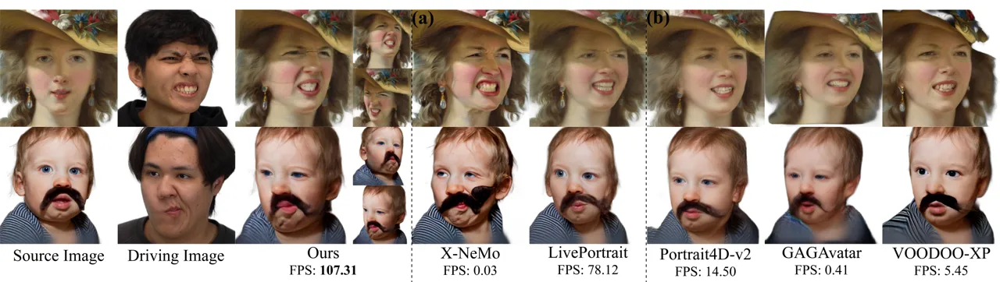
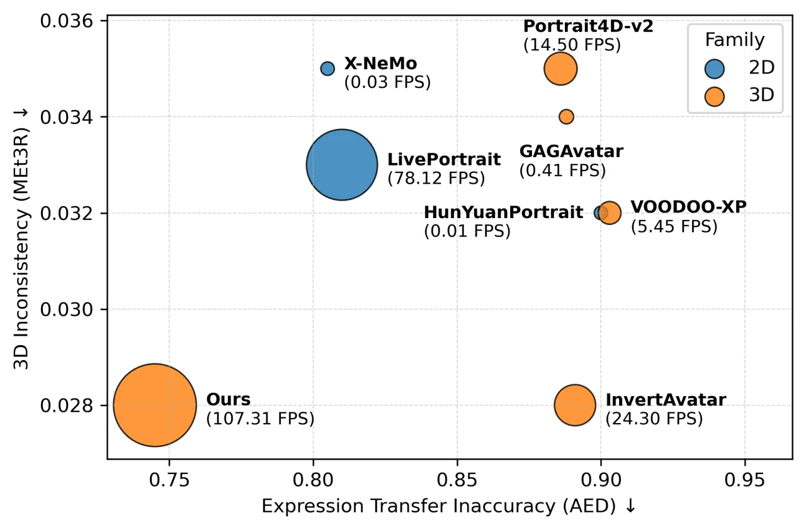
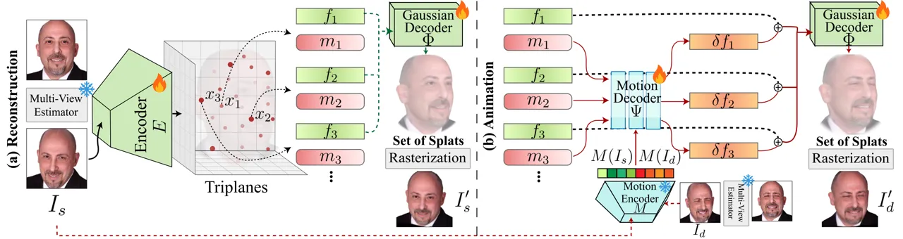
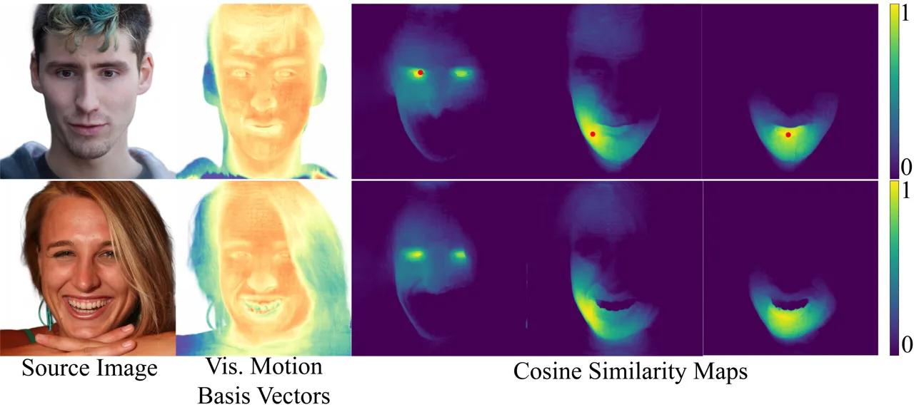
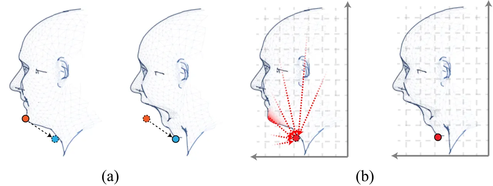
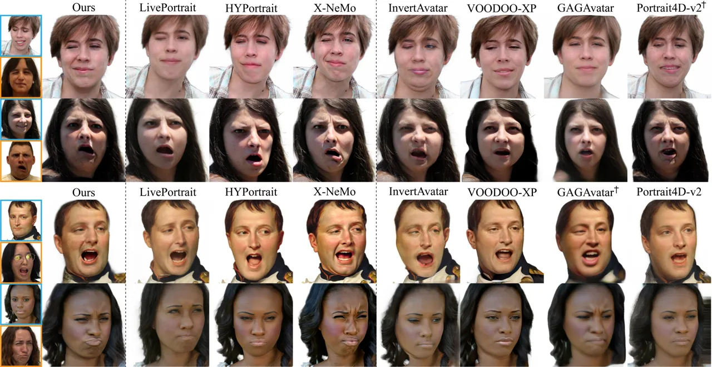
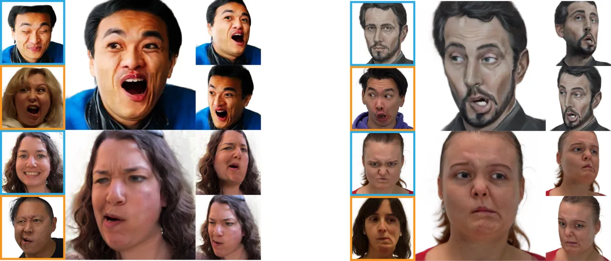
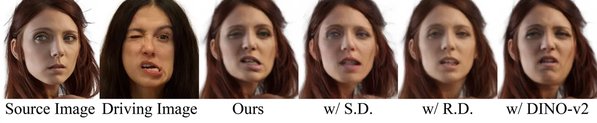

# Instant Expressive Gaussian Head Avatars at Over 100 FPS

Kaiwen Jiang ^(†)^(†)thanks: This project was initiated and
substantially carried out during an internship at NVIDIA.
Affiliation: University of California, San Diego, United States   
Xueting Li Affiliation: NVIDIA, United States    Seonwook Park
Affiliation: NVIDIA, United States    Ravi Ramamoorthi
Affiliation: University of California, San Diego, United States   
Shalini De Mello Affiliation: NVIDIA, United States    Koki Nagano
Affiliation: NVIDIA, United States

###### Abstract

Portrait animation has witnessed tremendous quality improvements thanks
to recent advances in video diffusion models. However, these 2D methods
often compromise 3D consistency and speed, limiting their applicability
in real-world scenarios, such as digital twins or telepresence. In
contrast, 3D-aware feedforward facial animation methods – built upon 3D
representations, such as neural radiance fields or Gaussian splatting –
ensure 3D consistency and achieve faster inference speed, but come with
inferior expression details. In this paper, we address this portrait
animation trilemma (speed, 3D consistency, and expressiveness) and
propose a pipeline that instantly converts an in-the-wild single image
into a 3D-consistent, fast yet expressive animatable representation via
a feed-forward encoder. Unlike previous computationally intensive global
fusion mechanisms (e.g., multiple attention layers) for fusing 3D
structural and animation information, our design employs an efficient
lightweight local fusion strategy to achieve high animation
expressivity. Furthermore, our animation representation is decoupled
from the face’s 3D representation and learns motion implicitly from
data, eliminating the dependency on pre-defined parametric models that
often constrain animation capabilities. Our method runs at 107.31 FPS
for animation and pose control, representing a 3-4 order of magnitude
speedup versus the state of the art while achieving comparable animation
quality, thus surpassing alternative designs that trade speed for
quality or vice versa. Project Page:
[https://research.nvidia.com/labs/amri/projects/instant4d](https://research.nvidia.com/labs/amri/projects/instant4d)



Figure 1: We present an instant feedforward encoder that transforms an
in-the-wild source image into an animatable 3D avatar. Our method
introduces a fast, consistent yet expressive 3D animation
representation. Given a driving image, we evaluate both the expression
transfer quality and the animation speed (measured as “FPS” on an NVIDIA
6000 Ada GPU) against (a) 2D diffusion- or GAN-based methods and (b)
3D-aware methods. In the first row, Portrait4D-v2 \[16\], GAGAvatar
\[11\] and VOODOO-XP \[75\] fail to faithfully transfer expressions,
particularly around the nasal wrinkles. LivePortrait \[26\] is
inaccurate at eyes. In the second row, the baby wears a fake mustache as
a decoration. X-NeMo distorts identity and adds a hallucinated mustache.
Other methods cannot deal with the asymmetric expression in the driving
image well. In contrast, ours not only accurately transfers expressions
but also achieves high animation speed and consistent pose control.
Insets show our rendered results under different poses. _FPS is measured
in a fully end-to-end streaming setting throughout the paper, where
incoming frames are processed sequentially and all modules, including
preprocessing and fitting steps, are accounted for across all
baselines._

## 1 Introduction

Creating a 4D digital twin from a single facial image that supports both
3D viewpoint control and animation is a long-standing goal in computer
vision and graphics. Real-time animatable synthesis and animation
control of photorealistic digital humans is essential for developing
AR/VR, video conferencing, and agentic AI applications.

Achieving such comprehensive 4D control has been historically
challenging. With the advent of radiance fields, including neural
radiance fields (NeRFs) \[50\] and 3D Gaussians \[31\], previous
3D-aware face animation works \[42, 12, 108, 11, 68\] have achieved
real-time and consistent animation with photo-realistic view synthesis
by using parametric models \[4, 20, 40\]. However, parametric models
inherently limit the animation quality. Follow-up methods \[35, 75, 16,
15, 76\] therefore resort to learning the animation purely from data.
Nevertheless, their representations entangle 3D structure and animation
(e.g., via global residual triplanes \[8\] or feature maps), requiring
computationally expensive attention mechanisms to repeatedly fuse 3D
structure and motion at every animation step. Meanwhile, the
introduction of 2D diffusion models \[95, 109, 13, 89, 48, 58, 26, 7,
10, 62, 59, 37\] into portrait animation has brought the expressivity of
achieved facial animation to a whole new level \[109, 95\]. However,
these methods often suffer from 3D inconsistency and remain slow due to
the expensive denoising process, preventing them from being used in a
real-time system. Fig. 2 shows a quantitative comparison where existing
methods fail to excel at _all three criteria_: speed, 3D consistency and
expression transfer expressivity. We call this new challenge _the
portrait animation trilemma_.

There are existing methods (e.g., \[72, 24, 69, 1, 71\]) proposing to
optimize a person-specific animatable 3D avatar from captured videos or
generated images that achieve these three goals. However, we seek to
design a 3D-aware animation framework that _instantly_ encodes a facial
image into an animatable 4D avatar, while supporting fast, consistent
and detailed animation. Our key insights for solving this problem are
twofold. First, we observe that large-scale 2D diffusion models already
encode rich facial dynamics. We reinterpret them as motion priors for
3D-aware animation and introduce a principled mechanism to leverage
their guidance while avoiding their inherent 2D inconsistencies and
hallucinations. Second, we show that achieving both efficiency and 3D
consistency without sacrificing expressiveness requires a novel
animation representation, which we propose.



Figure 2: A portrait animation trilemma: existing methods do not
simultaneously achieve 3D consistency, speed, and expressive expression
transfer. We provide a visualization of the quantitative comparison in
terms of 3D inconsistency (measured by MEt3R $`\downarrow`$), expression
transfer inaccuracy (measured by AED $`\downarrow`$) and animation speed
(measured by FPS $`\uparrow`$, visualized as the size of the circle)
with other 2D- or 3D-based baselines, including \[108, 16, 75, 95, 11,
26, 109\], using the task of cross-reenactment. 2D methods tend to
appear on the upper left (better expression transfer accuracy; worse 3D
consistency) while 3D methods tend to appear on the lower right (worse
expression transfer accuracy; better 3D consistency). Our method is 3-4
orders of magnitude faster than diffusion based models \[95, 109\] while
simultaneously achieving better 3D consistency and expression transfer
accuracy, appearing on the lower left.

Specifically, we build upon 3D Gaussians \[31\] that makes dynamic
deformation more efficient than NeRFs’ volumetric fields to propose an
expressive yet efficient animation representation. We first encode an
input image into triplanes \[77\] as an intermediate representation,
from which we sample feature vectors to decode the Gaussian attributes.
For each Gaussian, we encode its motion information in an auxiliary
vector which is analogous to learned personalized animation bases in
traditional blendshapes animation. This auxiliary vector is then
combined with the driving signal to deform each Gaussian associated with
the existing 3D structure, updating the 3D representation while keeping
the animation representation both efficient and decoupled from the
underlying 3D representation.

While previous works \[45, 46, 87, 44\] deform the 3D Gaussians in
spatial space to model motion, we find it unable to capture expressive
facial details. Instead, we propose to deform the Gaussians individually
in the high-dimensional feature vector space, rather than in 3D spatial
space, which offers better expressivity and is capable of capturing
asymmetric expressions and details such as shadow changes and wrinkles
(Fig. 1).

Typically, portrait animation methods, including ours, are trained with
a self-reenactment objective using datasets that contain multiple
expression-varying images per identity. Instead of training on real
datasets, we construct a synthetic facial expression dataset via a
state-of-the-art facial animation diffusion model \[109\] for
transferring its expressive motion priors in a 3D consistent manner. To
minimize the 3D inconsistency and hallucination issues of diffusion
models, we first frontalize in-the-wild portraits and then synthesize
expressions by the diffusion model only on frontal views, thereby
avoiding hallucinations caused by viewpoint changes. Multi-view results
are then separately synthesized during training using a pre-trained
expert 2D-to-3D network, which enforces cross-view geometric consistency
via multiview supervision. Therefore, our method is _free of_
inconsistency or hallucination issues. In summary, our main
contributions include:

- •
  We design an expressive yet computationally-efficient animation
  representation for 3D Gaussians that achieves detailed animation for
  human faces (Sec. 4.1).
- •
  We propose practical strategies to train this animation representation
  by leveraging guidance from existing diffusion-based methods
  (Sec. 4.2).
- •
  Our method is the first to simultaneously achieve best 3D consistency,
  fast inference speed and detailed expressions such as wrinkles, and
  run orders of magnitude faster than competing methods at the same
  level of expressivity. (Fig. 1, 2).

## 2 Related Work

#### 2D and 3D facial portrait animation.

2D facial portrait animation methods often feature a generative backbone
(e.g., GAN \[25\] or diffusion \[66, 28\]), which synthesizes driven
faces given control signals. GAN-based methods \[63, 64, 60, 81, 49,
101, 22, 17, 26, 107, 5, 43, 110, 52, 82, 83, 80, 19, 18, 94\] feature
fast inference using either explicit or implicit expression
representations, but are limited by the capability of GAN models. A
diffusion backbone–often pre-trained on large-scale internet
data–provides much stronger synthesis capability, and has been employed
for facial animation \[47, 90, 78, 55, 73, 109, 89, 95, 58, 86, 93, 13,
99, 79, 48, 9\], showing excellent expression transfer quality. However,
the repeated denoising steps trade speed for quality and are thus
prohibitive for real-time applications. They are also not 3D consistent.

Another line of methods builds explicit 3D representations for 3D
talking heads, which improve 3D consistency. They typically rely on 3D
morphable models (3DMM) \[4, 20, 39, 23, 27\] or facial motion
representations (e.g., rasterized coordinates \[111\] or facial
keypoints) as priors \[70, 68, 108, 88, 91, 42, 32, 41, 24, 100, 65,
11\] for animating the face. However, morphable models inherently limit
facial expressiveness, as their strong statistical priors, which are
derived from a finite set of face scans and linear basis representations
restrict motion to a narrow, predefined space. Therefore, another group
of methods \[76, 75, 16, 15\] implicitly learns the motion as residual
features to the triplanes \[8\] through data. Notably, Portrait4D \[15\]
transfers knowledge from synthetic data. However, in their animation
representation, the global residual features coupled with dense
attention mechanisms are computationally expensive to infer. We instead
propose a local fusion mechanism that individually deforms each 3D
Gaussian through a lightweight MLP based on a learned auxiliary vector
that encodes all the motion information.



Figure 3: Overview of our training pipeline with the two-part
self-reenactment task. (a) Reconstruction: Given a frontalized source
frame with an expression synthesized by a pre-trained diffusion
model \[109\], we first use a pre-trained multi-view estimator \[77\] to
generate its another viewpoint $`I_{s}`$. The encoder $`E`$ converts
$`I_{s}`$ into triplanes, from which we sample feature vectors
$`f_{1},f_{2},\ldots`$ and paired motion basis vectors
$`m_{1},m_{2},\ldots`$. A Gaussian decoder $`\Phi`$ maps these features
into a set of 3D Gaussians, forming a lifted 3D avatar for $`I_{s}`$,
which we render at the viewpoint of $`I_{s}`$ as $`I_{s}^{\prime}`$. (b)
Animation: For the synthesized driving frame of the same identity but
with a different expression, we similarly obtain its another viewpoint
image $`I_{d}`$. Both $`I_{s}`$ and $`I_{d}`$ are input into the motion
encoder $`M`$ to produce motion coefficients $`M(I_{s})`$ and
$`M(I_{d})`$. They are concatenated to condition a motion decoder
$`\Psi`$ to predict residual features
$`\delta f_{1},\delta f_{2},\ldots`$ from paired motion basis vectors.
Adding these residuals to the original features and decoding them with
$`\Phi`$ yields an animated set of Gaussians, which we render at the
viewpoint of $`I_{d}`$ as $`I_{d}^{\prime}`$. The loss is computed
between $`(I_{s},I_{s}^{\prime})`$ and $`(I_{d},I_{d}^{\prime})`$. Fire
icons denote trainable modules; snow icons denote frozen pre-trained
modules.

#### 4D representation and rendering.

Aiming at a native 4D representation, many works \[53, 54, 21, 57\]
build upon NeRFs to construct a spatial deformation field, which,
however, is computationally expensive. With the advent of Gaussian
splatting \[31\], another family of methods identify the potential of
using the spatial deformation of 3D Gaussians to represent motion. One
group of methods \[87, 45, 46, 24\] learn an implicit representation,
such as HexPlanes \[6\] or a coordinate-based MLP, to deform the
Gaussians. Another group of methods \[112, 24, 105, 69, 27\] utilizes an
explicit mesh to drive the 3D Gaussians. However, we propose to deform
Gaussians in a high-dimensional feature space, thereby preserving
greater expressivity (Sec. 5.2).

Notably, Avat3r \[35\] and ScaffoldAvatar \[1\] also use 3D Gaussians to
build animatable avatars. However, they are not a feed-forward method
from a single image and require either 3D GAN inversion or mesh
tracking. Prior work \[71, 72\] uses diffusion-generated multi-view
images for animated 3D head synthesis, but relies on hours-long
optimization to fit a single avatar. In contrast, we develop a
generalizable 3D-consistent framework that requires no tracking,
supports instant encoding, and enables real-time expressive animation.

## 3 Preliminaries

#### 3D avatar encoder and volume rendering.

We choose the state-of-the-art facial 2D-to-3D lifting encoder \[77\] as
our architectural backbone for lifting a single-view image into a 3D
avatar. Given a single image $`I`$, the encoder encodes it into
triplanes $`\{T_{xy},T_{yz},T_{zx}\}`$ \[8\], each of which is
$`\in\mathbb{R}^{256\times 256\times 32}`$. These planes can then be
used for rendering arbitrary viewpoints using volumetric rendering
\[50\]. Specifically, for each queried 3D position
$`\mathbf{x}=(x,y,z)`$, its corresponding feature vector
$`{f}(\mathbf{x})\in\mathbb{R}^{32}`$ is retrieved by projecting
$`\mathbf{x}`$ onto each of the three planes via bilinear interpolation
and further aggregation across the three planes by summation. A
light-weight non-linear multi-layer perceptron (MLP) decoder then
decodes the aggregated features into colors and densities for volume
rendering. In this work, we extend this approach by adapting this
NeRF-based encoder for encoding a single-view image into a set of 3D
Gaussians as explained later (Sec. 4.1).

#### 3D Gaussian splatting.

Kerbl et al. \[31\] provides a differentiable and efficient solution to
encoding a 3D scene as a set of anisotropic 3D Gaussian and rendering
them efficiently into images. Specifically, each 3D Gaussian is
parametrized by its position vector $`\mathbf{\mu}\in\mathbb{R}^{3}`$,
scaling vector $`\mathbf{s}\in\mathbb{R}^{3}`$, quaternion vector
$`\mathbf{q}\in\mathbb{R}^{4}`$, opacity $`o\in\mathbb{R}`$ and color
$`\mathbf{c}\in\mathbb{R}^{3}`$. The final rendering color of a pixel is
calculated by alpha-blending all 3D Gaussians overlapping the pixel. In
the following discussion, we use the sub-script $`i`$ to denote that
these quantities belong to the $`i^{\text{th}}`$ 3D Gaussian.

## 4 Method

#### Overview.

Our overall training pipeline is shown in Fig. 3, which consists of (a)
reconstruction modules (left) and (b) animation modules (right). Given a
source image $`I_{s}`$, we train an instant encoder $`E`$, adapted from
\[77\], to encode $`I_{s}`$ into a set of 3D Gaussians \[31\] for free
viewpoint rendering (Sec. 4.1). For animation, we update the set of
Gaussians conditioned on an expression from a driving image $`I_{d}`$,
while preserving the appearance in $`I_{s}`$ (Sec. 4.1). We denote the
encoding, animation and rendering procedure as $`E(I_{s},I_{d},p)`$ to
synthesize a 2D image with identity from $`I_{s}`$ and expression from
$`I_{d}`$ at viewpoint $`p`$.

For training, we construct a frontalized synthetic extreme facial
expression dataset (Sec. 4.2), in which each identity is represented by
multiple images with different expressions. We first frontalize the
FFHQ \[30\] in-the-wild portraits and leverage a pre-trained
diffusion-based portrait animation model \[109\] to synthesize facial
expressions on the frontalized views. Multi-view images are synthesized
on the fly during the training by a pre-trained expert 2D-to-3D
network \[77\] for multi-view supervision. We then perform
self-reenactment—using $`I_{d}`$ (the driving image) to drive $`I_{s}`$
(the source image) of the same identity—and optimize our model by
minimizing the reconstruction loss between the reconstructed result and
$`I_{s}`$, and the driven result and $`I_{d}`$ (Sec. 4.2).

During inference, we directly input $`I_{s}`$ into our encoder $`E`$
once to reconstruct its 3D representation, and then animate the
resulting set of Gaussians according to any given driving image
$`I_{d}`$, whose identity may differ from that of $`I_{s}`$. Note that
our animation pipeline, consisting of compact MLPs, does not require
re-encoding the expensive 3D representation from $`I_{s}`$ and $`I_{d}`$
as in \[35, 75, 16\], leading to faster inference. The rendering of the
Gaussians from arbitrary viewpoints is realized through rasterization
\[31\].

### 4.1 Encoder Design and Animation Representation

#### 3D Gaussians decoder.

LP3D \[77\] lifts single 2D image to a 3D avatar represented by a neural
triplane representation. However, its implicit radiance field
representation is less ideal for representing dynamics as opposed to 3D
Gaussians. 3D Gaussians offer more independent control over each
primitive and fast rendering speed while maintaining 3D consistency
\[29\].

Therefore, we make a minimal change to adapt the architecture of \[77\]
into using 3D Gaussians while preserving its strong capability of
faithfully lifting 2D images into 3D. We sample 3D Gaussians from the
encoded triplanes, as explored in \[3\]. We will first explain how we
decode 3D Gaussians from features sampled from neural triplane and then
clarify how we decide the sampling locations.

We first use $`96`$ channels for the encoded triplanes. Given a sampled
3D location $`\mathbf{x}_{i}`$, we project it onto each plane and sum
along the channel dimension to obtain the feature vector $`{f}_{i}`$
using the first $`48`$ channels and retrieve a vector $`\mathbf{m}_{i}`$
using the remaining $`48`$ channels (see Fig. 3). We call
$`\mathbf{m}_{i}`$ a motion basis vector and explain its details later.

We replace the original NeRF-based decoder in \[77\] with an MLP
$`\Phi`$ as shown in Fig. 3 with a single hidden layer of $`96`$ units
and softplus activation functions to decode the feature vector into a
set of attributes for a 3D Gaussian:

```math
\Phi({f}_{i})=\{\mathbf{\mu}_{i},\mathbf{s}_{i},\mathbf{q}_{i},o_{i},\mathbf{c}_{i}\}. \tag{1}
```

Therefore, we associate one 3D Gaussian with each sampled location and
the aforementioned motion basis vector. The final image is synthesized
using the differentiable renderer \[31\] from the set of 3D Gaussians
and the specified camera parameters as shown in Fig. 3. Notably, unlike
previous works \[11, 108, 16, 75\], we do not use the 2D convolution
refinement module to improve the rendered image’s quality. We denote the
rendered result of this encoded set of Gaussians at the viewpoint of
$`I_{s}`$ as $`I_{s}^{\prime}`$.

To decide where to sample 3D Gaussians from the triplanes, different
from \[3\], we do not have a paired pre-trained radiance field model to
propose the sampling locations. Instead, we find that simply adapting
the original ray shooting operation and two-pass importance sampling
strategy in \[50, 8\] already gives reasonable performance.

Specifically, given a camera viewpoint, we shoot one ray for one pixel.
We uniformly sample locations on each ray to decode 3D Gaussians, and
then perform an additional importance sampling based on the opacity of
previous decoded Gaussians to decode another set of Gaussians. Notice
that the shooting resolution does not need to coincide with the
rendering resolution. In practice, we use a sampling resolution of
$`64\times 64`$, but a resolution of $`512\times 512`$ for rendering,
which greatly improves efficiency. With $`48`$ sampled Gaussians on each
ray, this configuration yields about $`200K`$ Gaussians, which is
sufficient to render at $`512\times 512`$ resolution \[34, 104\].

Although this sampling of Gaussians is inherently viewpoint-dependent,
we find in practice that during inference, sampling from a fixed frontal
viewpoint already produces a sufficiently dense and representative set
of Gaussians. The same set can then be effectively reused for rendering
from novel viewpoints, accelerating inference. During training, the
Gaussians are instantiated from the final rendering viewpoint to ensure
view consistency. We explain this later.

#### Feature-space deformation for animation.

Typically, dynamics with Gaussians are modeled by deforming the Gaussian
attributes directly, i.e., updating their position, scaling and rotation
vectors and optionally their color \[87, 45, 46, 24\]. However, we find
that such a design has limited capacity to model expressions and
struggles with learning the animation details in the training dataset.
We hypothesize that it is because the learning of motion in the
low-dimensional 3D space is more difficult compared to learning on a
potentially smoother manifold in the high-dimensional feature vector
space. We thus propose to deform the feature vector $`{f}_{i}`$ sampled
from the triplanes, which encodes information for all Gaussian
properties and offers a richer deformation space, based on motion
signals.



Figure 4: Demonstration of the similarity among motion basis vectors
within and across subjects. Given the source images, we render the
motion basis vectors of their Gaussian kernels via splatting. For the
first-row subject, we select three specific points (red points) and
compute the cosine similarity between their motion basis vectors and
those of all other locations. We then compute the cosine similarity
across subjects between these same points of the first subject and all
motion basis vectors of the second subject in the second row.



Figure 5: Conceptual comparison between predicting residual features per
Gaussian versus per grid point on the triplanes \[16, 75\] in the case
of realizing the expression of opening the mouth. (a) In our framework,
the 3D Gaussian can be transformed independently from the red point to
the blue point because its motion basis vector encodes all necessary
motion information. (b) In contrast, existing triplanes-based works
require aggregating dense global context, to update the features on each
grid point. For example, it needs to fuse the shape information from the
global context through the attention mechanism to decide whether the
mouth will reach the red point and therefore update its geometry or not.



Figure 6: Qualitative comparison between our method and other 2D methods
and 3D-aware methods in terms of expression and pose transfer. We denote
\[95\] as “HYPortrait”. Source images are marked with blue borders at
the leftmost column, while the driving images are marked with orange
borders throughout the paper. ^(†) indicates that the methods are
trained with our synthetic dataset for distillation from scratch for
fair comparisons.

Specifically, we first use the pre-trained motion encoder $`M`$ in
\[109\] to encode the motion signals in the source image $`I_{s}`$ and
the driving image $`I_{d}`$ into 1D motion coefficients
$`M(I_{s}),M(I_{d})\in\mathbb{R}^{512}`$, respectively (see Fig. 3).
Recall that, in Fig. 3, each feature vector $`{f}_{i}`$ is associated
with a motion basis vector $`\mathbf{m}_{i}`$, which encodes the
spatially-varying deformation of the decoded 3D Gaussian and
$`\mathbf{m}_{i}`$ does not change while animating. The concept is
similar to facial muscles or localized bases in blendshape
animation \[38\], but it is uniquely adapted for each individual and
each facial part to capture personalized differences such as wrinkles.
We show that the learned motion basis vector is coherent,
semantically-meaningful and localized in Fig. 4. Altogether, a residual
feature $`\delta f_{i}(I_{s}\rightarrow I_{d})\in\mathbb{R}^{48}`$ due
to the motion from $`I_{s}`$ to $`I_{d}`$ for each sampled Gaussian is
individually predicted by a motion decoder $`\Psi`$ using both the
motion basis vector $`\mathbf{m_{i}}`$ and motion coefficients
$`M(I_{s})`$ and $`M(I_{d})`$. Formally, the $`i^{\text{th}}`$ 3D
Gaussian is updated as:

```math
\Phi({f}_{i}+\delta{f}_{i}(I_{s}\rightarrow I_{d}))=\{\mathbf{\mu}_{i},\mathbf{s}_{i},\mathbf{q}_{i},o_{i},\mathbf{c}_{i}\}, \tag{2}
```

#### Details of motion decoder $`\Psi`$.

We adopt a single-layer AdaLN \[92\] to modulate the motion basis vector
$`\mathbf{m}_{i}`$ conditioned on the concatenated motion coefficients
$`M(I_{s})`$ and $`M(I_{d})`$ and then pass the modulated vector to
another MLP with a single hidden layer of $`96`$ units and softplus
activation functions to predict the delta feature vector.

#### Discussion.

We highlight the difference between our design of predicting residual
features and the design of existing works (i.e., \[16, 76\]) in Fig. 5
with visual explanations. Our design is more efficient by locally
deforming each 3D Gaussian individually without aggregating dense global
context, while also being expressive to capture motion details
(Table 2).

### 4.2 Training with Guidance from a Diffusion Model

We adopt a state-of-the-art 2D facial animation diffusion model X-NeMo
\[109\] as our data synthesizer. Specifically, we construct a synthetic
dataset for self-reenactment-based training, containing over $`60,000`$
real identities from the FFHQ dataset \[30\], each of which has $`8`$
synthesized expressions with the driving expressions sampled from both
the FFHQ and FEED datasets \[18\]. These two datasets altogether
represent diverse identities and expressions in the real world. To
minimize inconsistency and hallucination issues in the diffusion model,
we use pre-trained LP3D \[77, 67\] to frontalize the source and driving
images before synthesizing expressions via X-NeMo. During the training,
we apply the same LP3D on these frontalized synthetic portraits on the
fly to randomize input and output viewpoints for augmentation and novel
view supervision.

#### Training procedure.

We use self-reenactment as the training objective. With the synthetic
dataset described above, we first sample $`I_{s}`$ and $`I_{d}`$ from
the same identity whose expressions could be same or different, and then
randomly sample camera parameters as in \[77\] and estimate their other
viewpoint images using a frozen pre-trained LP3D \[77, 67\] for
multi-view supervision, as shown in Fig. 3. When $`I_{d}`$ has the same
expression as $`I_{s}`$, we intend to learn zero residual features.
Given the synthesized result $`I^{\prime}_{d}=E(I_{s},I_{d},p(I_{d}))`$
and $`I_{d}`$, where $`p(I_{d})`$ denotes the viewpoint of $`I_{d}`$ and
Gaussians are therefore instantiated from $`p(I_{d})`$, we design the
loss to compare them along with an adversarial objective to enhance the
image quality as:

```math
\displaystyle\mathcal{L}= \displaystyle\lambda_{\text{L1}}\mathcal{L}_{\text{L1}}(I^{\prime}_{d},I_{d})+\lambda_{\text{LPIPS}}\mathcal{L}_{\text{LPIPS}}(I^{\prime}_{d},I_{d})+\lambda_{\text{ID}}\mathcal{L}_{\text{ID}}(I^{\prime}_{d},I_{d})+ \tag{3}
```

```math
\displaystyle\lambda_{\text{Detail}}\mathcal{L}_{\text{Detail}}(I^{\prime}_{d},I_{d})+\lambda_{\text{Norm}}\mathcal{L}_{\text{norm}}+\lambda_{\text{adv}}\mathcal{L}_{\text{adv}},
```

where $`\lambda_{\text{L1}}=1`$; $`\mathcal{L}_{\text{LPIPS}}`$ denotes
the perceptual loss \[106\] with $`\lambda_{\text{LPIPS}}=1`$;
$`\mathcal{L}_{\text{ID}}`$ denotes the identity loss \[14\] with
$`\lambda_{\text{ID}}=0.1`$; $`\lambda_{\text{Detail}}`$ computes an
additional separate L1 loss over the eye and mouth regions \[102\] with
$`\lambda_{\text{Detail}}=0.1`$; $`\lambda_{\text{Norm}}`$ regularizes
the averaged L2 norm for each predicted residual feature to enforce
sparsity as in \[88, 84\] with $`\lambda_{\text{Norm}}=0.001`$;
$`\mathcal{L}_{\text{adv}}`$ is the adversarial loss as in \[77\], which
is further conditioned on the motion coefficients extracted by the
motion encoder $`M`$, with $`\lambda_{\text{adv}}=0.025`$. Similarly, we
also compute the loss for $`I^{\prime}_{s}`$ and $`I_{s}`$ and sum it
with loss for $`I^{\prime}_{d}`$ and $`I_{d}`$ as our final loss.

#### Implementation details.

We initialize all our networks including our instant lifting encoder and
the adversarial discriminator used in $`\mathcal{L}_{\text{adv}}`$ from
random weights, except the motion encoder $`M`$ from  \[109\] that is
pre-trained and frozen, and optimize with the Adam optimizer \[33\] and
batch size $`32`$ and learning rate $`5e-5`$. We gradually increase the
rendering resolution from $`64`$ to $`512`$ with fixed number of sampled
Gaussians and introduce the adversarial loss in the middle of training.
More details are in the supplementary.

|        |                          |                     |                   |                  |                     |                  |                    |                  |
| ------ | ------------------------ | ------------------- | ----------------- | ---------------- | ------------------- | ---------------- | ------------------ | ---------------- |
| Method |                          | MEt3R$`\downarrow`$ | PSNR $`\uparrow`$ | SSIM$`\uparrow`$ | LPIPS$`\downarrow`$ | IoU $`\uparrow`$ | Mem.$`\downarrow`$ | FPS $`\uparrow`$ |
| 2D     | LivePortrait \[26\]      | 0.032               | 22.18             | 0.821            | 0.174               | 0.79             | 0.5 GB             | 78.12            |
|        | HYPortrait \[95\]        | 0.028               | 22.31             | 0.834            | 0.169               | 0.83             | 4.2 GB             | 0.01             |
|        | X-NeMo \[109\]           | 0.032               | 21.92             | 0.823            | 0.174               | 0.83             | $`6.0`$ GB         | 0.03             |
| 3D     | GAGAvatar \[11\]         | 0.032               | 21.45             | 0.821            | 0.191               | 0.80             | 1.4 GB             | 0.41             |
|        | InvertAvatar \[108\]     | 0.026               | 23.43             | 0.846            | 0.159               | 0.79             | 3.0 GB             | 0.07             |
|        | VOODOO-XP \[75\]         | 0.030               | 21.14             | 0.809            | 0.197               | 0.77             | 1.2 GB             | 5.45             |
|        | Portrait4D-v2 \[16\]     | 0.030               | 22.17             | 0.833            | 0.171               | 0.82             | 1.5 GB             | 14.50            |
|        | GAGAvatar^(†) \[11\]     | 0.027               | 21.33             | 0.826            | 0.199               | 0.77             | 1.4 GB             | 0.41             |
|        | Portrait4D-v2^(†) \[16\] | 0.030               | 21.25             | 0.822            | 0.195               | 0.82             | 1.5 GB             | 14.50            |
|        | Ours                     | 0.025               | 22.34             | 0.835            | 0.181               | 0.85             | $`0.4`$ GB         | 107.31           |

Table 1: Quantitative comparison on self-reenactment. Red indicates best
and orange indicates second best throughout the paper. ^(†) indicates
training with our synthetic dataset.

|        |                          |                     |                |                 |                   |                   |                 |
| ------ | ------------------------ | ------------------- | -------------- | --------------- | ----------------- | ----------------- | --------------- |
| Method |                          | MEt3R$`\downarrow`$ | ID$`\uparrow`$ | EMO$`\uparrow`$ | AED$`\downarrow`$ | APD$`\downarrow`$ | FPS$`\uparrow`$ |
| 2D     | LivePortrait \[26\]      | 0.033               | 0.74           | 0.716           | 0.810             | 0.026             | 78.12           |
|        | HYPortrait \[95\]        | 0.032               | 0.74           | 0.752           | 0.900             | 0.077             | 0.01            |
|        | X-NeMo \[109\]           | 0.035               | 0.72           | 0.760           | 0.805             | 0.032             | 0.03            |
| 3D     | GAGAvatar \[11\]         | 0.034               | 0.77           | 0.654           | 0.888             | 0.025             | 0.41            |
|        | InvertAvatar \[108\]     | 0.028               | 0.80           | 0.565           | 0.891             | 0.049             | 0.07            |
|        | VOODOO-XP \[75\]         | 0.032               | 0.77           | 0.699           | 0.903             | 0.028             | 5.45            |
|        | Portrait4D-v2 \[16\]     | 0.035               | 0.79           | 0.589           | 0.886             | 0.029             | 14.50           |
|        | GAGAvatar^(†) \[11\]     | 0.030               | 0.67           | 0.578           | 0.944             | 0.038             | 0.41            |
|        | Portrait4D-v2^(†) \[16\] | 0.034               | 0.76           | 0.448           | 0.972             | 0.026             | 14.50           |
|        | Ours                     | 0.028               | 0.76           | 0.785           | 0.731             | 0.028             | 107.31          |

Table 2: Quantitative comparison on cross-reenactment.

## 5 Results

We provide quantitative and qualitative comparisons and an ablation
study here. For more results, including a real-time demo, please refer
to the supplementary material and the accompanying video.

#### Metrics.

We conduct experiments for facial animation using the VOODOO-XP test set
as in \[75\], which contains $`102`$ video sequences. It features
extreme expressions and wide viewing angles. We extract one out of five
consecutive frames for testing to eliminate unnecessary duplication,
which, in total, results in over $`20K`$ images. We evaluate results on
common head regions without the background across all methods. We
conduct the following experiments. (1) Self-reenactment: for each video
sequence, we use the first frame as the source frame, and all other
frames to drive it. Each method is tasked with reproducing the viewpoint
and the expression of the driving frame. (2) Cross-reenactment: for each
video sequence, we randomly sample another video sequence. We use the
first frame of the first video sequence as the source frame, and all
frames in the second video sequence to drive it.

Besides the memory consumption for static model storage required during
inference and the rendering speed measured in FPS on an NVIDIA 6000 Ada
GPU, we evaluate performance using the following five aspects: (a)
MEt3R \[2\] for dense 3D inconsistency; (b) PSNR, SSIM \[85\] and
LPIPS \[106\] to evaluate the quality of image reconstruction; (c) IoU
to evaluate 3D reconstruction quality by computing the
intersection-over-union between the binary silhouettes of the full head
region in the driving frame and the resulting frame of the same subject;
(d) face ID consistency \[14\]; (e) the accuracy of expression and pose
transfer where we use SMIRK \[61\] to extract the FLAME \[40\]
coefficients for the driving and resulting frames, and measure the
averaged distance of the expression coefficients as “AED”, and averaged
distance of the pose parameters as “APD”. Besides, we also use
EmoNet \[74\] as in \[109\] to measure the emotion similarity between
the driving and resulting frames as “EMO” that is more sensitive to
extreme motions. Please note that “APD” reveals coarse 3D shape quality
while MEt3R focuses more on dense photometric 3D consistency across
views.

### 5.1 Comparisons

#### Baselines.

We compare our method against other existing open-source feed-forward
methods, including the state-of-the-art GAN-based 2D facial animation
method LivePortrait \[26\], diffusion-based 2D facial animation methods
HunyuanPortrait \[95\] and X-NeMo \[109\], 3DMM-based 3D facial
animation methods InvertAvatar \[108\] and GAGAvatar \[11\], and 3D
facial animation methods with learned motion space Portrait4D-v2 \[16\]
and VOODOO-XP \[75\]. Furthermore, for an additional fairer comparison
and to illustrate the benefits of our proposed animation representation,
we also train the best-performing prior 3D-based methods Portrait4D-v2
and GAGAavatar from scratch using our synthetic dataset with multi-view
images estimated and denote them as Portrait4D-v2^(†) and GAGAvatar^(†).

#### Qualitative results.

We provide qualitative comparisons in Fig. 6. Generally, other 3D-aware
methods create muted expressions even when retrained with our synthetic
dataset and do not faithfully synthesize expressions in the driving
image. Especially, in the first row, the 3D-aware methods cannot remove
the extreme mouth motion in the source frame and the right wrinkles near
the mouth are leaked into the driven results. InvertAvatar occasionally
produces collapsed 3D head geometry (third and forth rows). Among the
2D-based methods, X-NeMo mostly produces impressive results, but
occasionally distorts head shape under a large pose change (third row)
and hallucinates details (e.g., added cheek color in the fourth row).
HunYuanPortrait cannot faithfully transfer the pose and expression in
the second, third and fourth rows. LivePortrait creates dampened mouth
expressions in the second to fourth rows. Even after retraining with our
expressive synthetic dataset, Portrait4D-v2^(†) and GAGAvatar^(†)
produce less accurate expression transfer results. In contrast, our
method faithfully transfers the expression and pose and is on par with
X-NeMo while maintaining the identity and being $`3500\times`$ faster
(see Tab. 2). Please find more comparison in the supplementary. We
further provide multi-view rendering results in Fig. 7. Despite extreme
expressions being present in the source images, our method can infer the
occluded regions, such as the closed eyes, produces outputs with
identity consistent with that of the source image and motions consistent
with the driving image.



Figure 7: More qualitative results with our method from a source image
and driving image. We provide the multi-view rendered results next to
the driven results.

#### Quantitative results.

As shown in Table 1, 2, our method achieves the best 3D consistency
(MEt3R), 3D shape (IOU), and compute efficiencies (Mem and FPS) and
second best image reconstruction (in terms of PSNR and SSIM) across all
methods, for the task of self-reenactment. All of the compared 3D
baselines utilize camera-space 2D refinement to improve image quality,
but this is known to degrade 3D consistency – reflected by their lower
MEt3R score. Even though InvertAvatar achieves the best image quality,
its 3D quality is significantly limited, as captured by the worse IoU
for the 3D head shape compared to us. We also achieve state-of-the-art
MEt3R, EMO, and AED scores across all methods for the task of
cross-reenactment, even surpassing X-NeMo due to potentially more
accurate pose transfer, which aids correct expression and emotion
detection. We note that ID scores conflate identity preservation with
expression transfer accuracy, since simply keeping the source image
without modifying the expression can maximize the ID score (please see
more analysis in the supplement). For example, InvertAvatar achieves
strong identity similarity (high ID) but fails to faithfully reproduce
the target expression in Fig. 6 (fourth row), resulting in worse EMO and
AED scores in Table 2. InvertAvatar’s collapsed 3D shape is also
reflected in poor APD due to inaccurate pose transfer.

While our training data is synthesized using X-NeMo and LP3D, we
restrict X-NeMo to operate on frontal images only and use LP3D to
estimate multi-view images to resolve identity drift. This improves
consistency beyond that of the teacher model (X-NeMo) as evidenced by
our method’s better ID metric and consistency metric versus X-NeMo
(Table 2).

Our method animates faces at 107.31 FPS, surpassing all other baselines,
including ones using attention mechanisms \[16, 75\]. In contrast, 2D
diffusion methods could take up to almost a minute for driving a single
image sequentially, or several seconds per frame when a sequence of
images is used and the time cost is amortized across frames. For our
method, encoding a facial image into 3D Gaussians is required only once
per video sequence, and our method performs this step almost instantly
in just $`20`$ms.

| Method                    | MEt3R $`\downarrow`$ | PSNR $`\uparrow`$ | SSIM $`\uparrow`$ | LPIPS $`\downarrow`$ | AED$`\downarrow`$ | IoU$`\uparrow`$ | Mem.$`\downarrow`$ | FPS$`\uparrow`$ |
| ------------------------- | -------------------- | ----------------- | ----------------- | -------------------- | ----------------- | --------------- | ------------------ | --------------- |
| Ours ($`128\times 128`$)  | 0.073                | 23.18             | 0.785             | 0.104                | 0.507             | 0.88            | 0.32 GB            | 132.87          |
|    w/ DINO-v2 Encoding    | 0.074                | 22.88             | 0.776             | 0.110                | 0.597             | 0.87            | 4.32 GB            | 22.47           |
|    w/ Real Dataset        | 0.073                | 23.10             | 0.782             | 0.109                | 0.543             | 0.88            | 0.32 GB            | 132.87          |
|    w/ Spatial Deformation | 0.075                | 23.27             | 0.788             | 0.109                | 0.634             | 0.89            | 0.27 GB            | 141.61          |

Table 3: Ablation studies with self-reenactment.

### 5.2 Ablation Studies

We validate each component of our model using the self-reenactment task
on the same VOODOO-XP test set with a rendering resolution of
$`128\times 128`$ without an adversarial loss for more stable
comparison. We use the exact same metrics for quantitatively evaluating
self-reenactment as before along with AED for measuring expression
transfer accuracy, reported in Table 3 and Fig. 8.

#### Choice of motion encoder.

We study the importance of the selected motion encoder. Instead of the
motion encoder in X-Nemo \[109\] we use DINO-v2 \[51\] as in \[75\].
Notably, this encoder is computationally more expensive than our
selected motion encoder \[109\]. It increases the memory consumption and
reduces the FPS. It fails to capture expression details in Fig. 8 and
leads to a worse AED.

#### Usage of diffusion model.

We study the necessity of using a synthetic dataset generated with a
pre-trained diffusion model by using a real dataset instead. We use
CelebVText \[103\] as the real dataset for its diversity of expressions
and identities. Since a real dataset usually features common expressions
such as smiling, opening the mouth, etc. and less extreme expressions,
the AED is affected and the produced expression is muted (Fig. 8).

#### Feature-space- vs. spatial-deformation.

We ablate the usage of the proposed feature-space deformation by
replacing it with directly predicting the residual for the 3D Gaussians’
position, scaling and quaternion vectors from the motion decoder
$`\Psi`$, similarly to the previous dynamic modeling methods (e.g.,
\[87, 45, 46, 24\]). Since we do not need to go through the non-linear
decoder in this setup, the memory consumption and FPS are slightly
improved. However, the expression transfer accuracy is significantly
compromised, leading to worsened AED. This is also reflected in Fig. 8.



Figure 8: Comparison among different ablation models based on the
expression transfer. “w/ S.D.” denotes using the spatial deformation
instead of feature-space deformation. “w/ R.D.” denotes using a real
dataset instead of the synthetic one.

## 6 Discussion

#### Conclusion.

In this work, we propose an instant 4D method that encodes a single
image into 3D-consistent, efficient yet expressive avatar. We propose an
animation representation that deforms both the Gaussian appearance and
geometry based on the encoded motion basis vectors, inspired by bases
representations in traditional facial animation. We believe our method
paves the way for a real-time expressive representation, enabling
real-world applications such as digital twins, where real-time
performance, and controllability are critical.

#### Limitation & Future work.

Our method finds it hard to extend to high-quality eyewear
reconstruction due to thin structures, and complex reflection and
refraction. We plan to extend our method into disentangling appearance
properties (lighting). Besides, even though we demonstrate our method
using only image-driven examples, it is possible to encode other
conditions, such as audio or texts, into sequences of the 1D motion
coefficients and drive our avatar.

#### Ethics concern.

We propose an algorithm, which is capable of converting a single 2D
facial image into a 3D-aware animatable avatar, which could be misused
for generating malicious content. We do not condone such behavior and
identify potential works that could be used for detecting fake
information \[36, 98, 97, 96\] or works that authenticate the authorized
driving subject of the avatar \[56\].

## Acknowledgements

We thank David Luebke, Michael Stengel, Yeongho Seol, Simon Yuen, Marcel
Bühler, and Arash Vahdat for feedback on drafts and early discussions.
We also thank Alex Trevithick and Tianye Li for proof-reading. This
research was also funded in part by the Ronald L. Graham Chair and the
UC San Diego Center for Visual Computing.

## References

- \[1\] S. Aneja, S. Weiss, I. Baeza, P. Chandran, G. Zoss, M. Nießner,
  and D. Bradley (2025) ScaffoldAvatar: high-fidelity gaussian avatars
  with patch expressions. In Proceedings of the Special Interest Group
  on Computer Graphics and Interactive Techniques Conference Conference
  Papers, pp. 1–11. Cited by: §1, §2.
- \[2\] M. Asim, C. Wewer, T. Wimmer, B. Schiele, and J. E.
  Lenssen (2024) MEt3R: measuring multi-view consistency in generated
  images. In Computer Vision and Pattern Recognition (CVPR), Cited by:
  §5.
- \[3\] F. Barthel, A. Beckmann, W. Morgenstern, A. Hilsmann, and P.
  Eisert (2024) Gaussian splatting decoder for 3d-aware generative
  adversarial networks. In Proceedings of the IEEE/CVF Conference on
  Computer Vision and Pattern Recognition, pp. 7963–7972. Cited by:
  §4.1, §4.1.
- \[4\] V. Blanz and T. Vetter (1999) A morphable model for the
  synthesis of 3d faces. In Proceedings of SIGGRAPH, Cited by: §1, §2.
- \[5\] E. Burkov, I. Pasechnik, A. Grigorev, and V. Lempitsky (2020)
  Neural head reenactment with latent pose descriptors. In Proceedings
  of the IEEE/CVF conference on computer vision and pattern recognition,
  pp. 13786–13795. Cited by: §2.
- \[6\] A. Cao and J. Johnson (2023) Hexplane: a fast representation for
  dynamic scenes. In Proceedings of the IEEE/CVF Conference on Computer
  Vision and Pattern Recognition, pp. 130–141. Cited by: §2.
- \[7\] C. Cao, J. Zhou, S. Li, J. Liang, C. Yu, F. Wang, X. Xue, and Y.
  Fu (2025) Uni3C: unifying precisely 3d-enhanced camera and human
  motion controls for video generation. arXiv preprint arXiv:2504.14899.
  Cited by: §1.
- \[8\] E. R. Chan, C. Z. Lin, M. A. Chan, K. Nagano, B. Pan, S. De
  Mello, O. Gallo, L. J. Guibas, J. Tremblay, S. Khamis, et al. (2022)
  Efficient geometry-aware 3d generative adversarial networks. In
  Proceedings of the IEEE/CVF conference on computer vision and pattern
  recognition, pp. 16123–16133. Cited by: §1, §2, §3, §4.1.
- \[9\] Z. Chen, J. Cao, Z. Chen, Y. Li, and C. Ma (2025) Echomimic:
  lifelike audio-driven portrait animations through editable landmark
  conditions. In Proceedings of the AAAI Conference on Artificial
  Intelligence, Vol. 39, pp. 2403–2410. Cited by: §2.
- \[10\] G. Cheng, X. Gao, L. Hu, S. Hu, M. Huang, C. Ji, J. Li, D.
  Meng, J. Qi, P. Qiao, et al. (2025) Wan-animate: unified character
  animation and replacement with holistic replication. arXiv preprint
  arXiv:2509.14055. Cited by: §1.
- \[11\] X. Chu and T. Harada (2024) Generalizable and animatable
  gaussian head avatar. Advances in Neural Information Processing
  Systems 37, pp. 57642–57670. Cited by: Figure 1, Figure 1, Figure 2,
  Figure 2, §1, §2, §4.1, Table 1, Table 1, Table 2, Table 2, §5.1.
- \[12\] X. Chu, Y. Li, A. Zeng, T. Yang, L. Lin, Y. Liu, and T.
  Harada (2024) GPAvatar: generalizable and precise head avatar from
  image(s). Cited by: §1.
- \[13\] J. Cui, H. Li, Y. Zhan, H. Shang, K. Cheng, Y. Ma, S. Mu, H.
  Zhou, J. Wang, and S. Zhu (2025) Hallo3: highly dynamic and realistic
  portrait image animation with video diffusion transformer. In
  Proceedings of the Computer Vision and Pattern Recognition Conference,
  pp. 21086–21095. Cited by: §1, §2.
- \[14\] J. Deng, J. Guo, N. Xue, and S. Zafeiriou (2019) Arcface:
  additive angular margin loss for deep face recognition. In Proceedings
  of the IEEE/CVF conference on computer vision and pattern recognition,
  pp. 4690–4699. Cited by: §4.2, §5.
- \[15\] Y. Deng, D. Wang, X. Ren, X. Chen, and B. Wang (2023) Learning
  one-shot 4d head avatar synthesis using synthetic data. arXiv preprint
  arXiv:2311.18729. Cited by: §1, §2.
- \[16\] Y. Deng, D. Wang, and B. Wang (2024) Portrait4D-v2: pseudo
  multi-view data creates better 4d head synthesizer. arXiv. Cited by:
  Figure 1, Figure 1, Figure 2, Figure 2, §1, §2, Figure 5, Figure 5,
  §4, §4.1, §4.1, Table 1, Table 1, Table 2, Table 2, §5.1, §5.1.
- \[17\] M. C. Doukas, S. Zafeiriou, and V. Sharmanska (2021) Headgan:
  one-shot neural head synthesis and editing. In Proceedings of the
  IEEE/CVF International conference on Computer Vision, pp. 14398–14407.
  Cited by: §2.
- \[18\] N. Drobyshev, A. B. Casademunt, K. Vougioukas, Z. Landgraf, S.
  Petridis, and M. Pantic (2024) Emoportraits: emotion-enhanced
  multimodal one-shot head avatars. In Proceedings of the IEEE/CVF
  Conference on Computer Vision and Pattern Recognition, pp. 8498–8507.
  Cited by: §2, §4.2.
- \[19\] N. Drobyshev, J. Chelishev, T. Khakhulin, A. Ivakhnenko, V.
  Lempitsky, and E. Zakharov (2022) Megaportraits: one-shot megapixel
  neural head avatars. In Proceedings of the 30th ACM International
  Conference on Multimedia, pp. 2663–2671. Cited by: §2.
- \[20\] B. Egger, W. A. Smith, A. Tewari, S. Wuhrer, M. Zollhoefer, T.
  Beeler, F. Bernard, T. Bolkart, A. Kortylewski, S. Romdhani, et
  al. (2020) 3d morphable face models—past, present, and future. ACM
  Transactions on Graphics (ToG) 39 (5), pp. 1–38. Cited by: §1, §2.
- \[21\] J. Fang, T. Yi, X. Wang, L. Xie, X. Zhang, W. Liu, M. Nießner,
  and Q. Tian (2022) Fast dynamic radiance fields with time-aware neural
  voxels. In SIGGRAPH Asia 2022 Conference Papers, pp. 1–9. Cited by:
  §2.
- \[22\] Y. Gao, Y. Zhou, J. Wang, X. Li, X. Ming, and Y. Lu (2023)
  High-fidelity and freely controllable talking head video generation.
  In Proceedings of the IEEE/CVF conference on computer vision and
  pattern recognition, pp. 5609–5619. Cited by: §2.
- \[23\] S. Giebenhain, T. Kirschstein, M. Georgopoulos, M. Rünz, L.
  Agapito, and M. Nießner (2024) Mononphm: dynamic head reconstruction
  from monocular videos. In Proceedings of the IEEE/CVF Conference on
  Computer Vision and Pattern Recognition, pp. 10747–10758. Cited by:
  §2.
- \[24\] S. Giebenhain, T. Kirschstein, M. Rünz, L. Agapito, and M.
  Nießner (2024) NPGA: neural parametric gaussian avatars. arXiv
  preprint arXiv:2405.19331. Cited by: §1, §2, §2, §4.1, §5.2.
- \[25\] I. Goodfellow, J. Pouget-Abadie, M. Mirza, B. Xu, D.
  Warde-Farley, S. Ozair, A. Courville, and Y. Bengio (2014) Generative
  adversarial nets. Advances in neural information processing systems 27. Cited by: §2.
- \[26\] J. Guo, D. Zhang, X. Liu, Z. Zhong, Y. Zhang, P. Wan, and D.
  Zhang (2024) Liveportrait: efficient portrait animation with stitching
  and retargeting control. arXiv preprint arXiv:2407.03168. Cited by:
  Figure 1, Figure 1, Figure 2, Figure 2, §1, §2, Table 1, Table 2,
  §5.1.
- \[27\] Y. He, X. Gu, X. Ye, C. Xu, Z. Zhao, Y. Dong, W. Yuan, Z. Dong,
  and L. Bo (2025) LAM: large avatar model for one-shot animatable
  gaussian head. arXiv preprint arXiv:2502.17796. Cited by: §2, §2.
- \[28\] J. Ho, A. Jain, and P. Abbeel (2020) Denoising diffusion
  probabilistic models. Advances in neural information processing
  systems 33, pp. 6840–6851. Cited by: §2.
- \[29\] Y. Huang, Y. Sun, Z. Yang, X. Lyu, Y. Cao, and X. Qi (2024)
  Sc-gs: sparse-controlled gaussian splatting for editable dynamic
  scenes. In Proceedings of the IEEE/CVF conference on computer vision
  and pattern recognition, pp. 4220–4230. Cited by: §4.1.
- \[30\] T. Karras, S. Laine, and T. Aila (2019) A style-based generator
  architecture for generative adversarial networks. In Proceedings of
  the IEEE/CVF conference on computer vision and pattern recognition,
  pp. 4401–4410. Cited by: §4, §4.2.
- \[31\] B. Kerbl, G. Kopanas, T. Leimkühler, and G. Drettakis (2023) 3D
  gaussian splatting for real-time radiance field rendering.. ACM Trans.
  Graph. 42 (4), pp. 139–1. Cited by: §1, §1, §2, §3, §4, §4, §4.1.
- \[32\] T. Ki, D. Min, and G. Chae (2024) Learning to generate
  conditional tri-plane for 3d-aware expression controllable portrait
  animation. arXiv preprint arXiv:2404.00636. Cited by: §2.
- \[33\] D. P. Kingma (2014) Adam: a method for stochastic optimization.
  arXiv preprint arXiv:1412.6980. Cited by: §4.2.
- \[34\] T. Kirschstein, S. Giebenhain, J. Tang, M. Georgopoulos, and M.
  Nießner (2024) Gghead: fast and generalizable 3d gaussian heads. In
  SIGGRAPH Asia 2024 Conference Papers, pp. 1–11. Cited by: §4.1.
- \[35\] T. Kirschstein, J. Romero, A. Sevastopolsky, M. Nießner, and S.
  Saito (2025) Avat3r: large animatable gaussian reconstruction model
  for high-fidelity 3d head avatars. External Links: 2502.20220,
  [Link](https://arxiv.org/abs/2502.20220) Cited by: §1, §2, §4.
- \[36\] StyleGAN3 Synthetic Image Detection External Links:
  [Link](https://github.com/NVlabs/stylegan3-detector) Cited by: §6.
- \[37\] Z. Kuang, S. Cai, H. He, Y. Xu, H. Li, L. Guibas, and Gordon.
  Wetzstein (2024) Collaborative video diffusion: consistent multi-video
  generation with camera control. In arXiv, Cited by: §1.
- \[38\] J. P. Lewis, K. Anjyo, T. Rhee, M. Zhang, F. Pighin, and Z.
  Deng (2014) Practice and Theory of Blendshape Facial Models. In
  Eurographics 2014 - State of the Art Reports, Cited by: §4.1.
- \[39\] T. Li, T. Bolkart, M. J. Black, H. Li, and J. Romero (2017)
  Learning a model of facial shape and expression from 4d scans. ACM
  Trans. Graph. 36 (6). External Links: ISSN 0730-0301,
  [Link](https://doi.org/10.1145/3130800.3130813),
  [Document](https://dx.doi.org/10.1145/3130800.3130813) Cited by: §2.
- \[40\] T. Li, T. Bolkart, Michael. J. Black, H. Li, and J.
  Romero (2017) Learning a model of facial shape and expression from 4D
  scans. ACM Transactions on Graphics, (Proc. SIGGRAPH Asia) 36 (6),
  pp. 194:1–194:17. External Links:
  [Link](https://doi.org/10.1145/3130800.3130813) Cited by: §1, §5.
- \[41\] W. Li, L. Zhang, D. Wang, B. Zhao, Z. Wang, M. Chen, B.
  Zhang, Z. Wang, L. Bo, and X. Li (2023) One-shot high-fidelity
  talking-head synthesis with deformable neural radiance field. In
  Proceedings of the IEEE/CVF Conference on Computer Vision and Pattern
  Recognition, pp. 17969–17978. Cited by: §2.
- \[42\] X. Li, S. De Mello, S. Liu, K. Nagano, U. Iqbal, and J.
  Kautz (2024) Generalizable one-shot 3d neural head avatar. Advances in
  Neural Information Processing Systems 36. Cited by: §1, §2.
- \[43\] B. Liang, Y. Pan, Z. Guo, H. Zhou, Z. Hong, X. Han, J. Han, J.
  Liu, E. Ding, and J. Wang (2022) Expressive talking head generation
  with granular audio-visual control. In 2022 IEEE/CVF Conference on
  Computer Vision and Pattern Recognition (CVPR), Vol. , pp. 3377–3386.
  External Links:
  [Document](https://dx.doi.org/10.1109/CVPR52688.2022.00338) Cited by:
  §2.
- \[44\] C. Lin, Y. Lin, P. Pan, Y. Yu, H. Yan, K. Fragkiadaki, and Y.
  Mu (2025) MoVieS: motion-aware 4d dynamic view synthesis in one
  second. arXiv preprint arXiv:2507.10065. Cited by: §1.
- \[45\] H. Ling, S. W. Kim, A. Torralba, S. Fidler, and K. Kreis (2024)
  Align your gaussians: text-to-4d with dynamic 3d gaussians and
  composed diffusion models. In Proceedings of the IEEE/CVF Conference
  on Computer Vision and Pattern Recognition, pp. 8576–8588. Cited by:
  §1, §2, §4.1, §5.2.
- \[46\] I. Liu, H. Su, and X. Wang (2024) Dynamic gaussians mesh:
  consistent mesh reconstruction from monocular videos. arXiv preprint
  arXiv:2404.12379. Cited by: §1, §2, §4.1, §5.2.
- \[47\] R. Liu, B. Ma, W. Zhang, Z. Hu, C. Fan, T. Lv, Y. Ding, and X.
  Cheng (2024) Towards a simultaneous and granular identity-expression
  control in personalized face generation. In Proceedings of the
  IEEE/CVF Conference on Computer Vision and Pattern Recognition,
  pp. 2114–2123. Cited by: §2.
- \[48\] Y. Ma, H. Liu, H. Wang, H. Pan, Y. He, J. Yuan, A. Zeng, C.
  Cai, H. Shum, W. Liu, et al. (2024) Follow-your-emoji:
  fine-controllable and expressive freestyle portrait animation. arXiv
  preprint arXiv:2406.01900. Cited by: §1, §2.
- \[49\] A. Mallya, T. Wang, and M. Liu (2022) Implicit warping for
  animation with image sets. Advances in Neural Information Processing
  Systems 35, pp. 22438–22450. Cited by: §2.
- \[50\] B. Mildenhall, P. P. Srinivasan, M. Tancik, J. T. Barron, R.
  Ramamoorthi, and R. Ng (2020) NeRF: representing scenes as neural
  radiance fields for view synthesis. In ECCV, Cited by: §1, §3, §4.1.
- \[51\] M. Oquab, T. Darcet, T. Moutakanni, H. V. Vo, M. Szafraniec, V.
  Khalidov, P. Fernandez, D. Haziza, F. Massa, A. El-Nouby, R. Howes, P.
  Huang, H. Xu, V. Sharma, S. Li, W. Galuba, M. Rabbat, M. Assran, N.
  Ballas, G. Synnaeve, I. Misra, H. Jegou, J. Mairal, P. Labatut, A.
  Joulin, and P. Bojanowski (2023) DINOv2: learning robust visual
  features without supervision. Cited by: §5.2.
- \[52\] Y. Pang, Y. Zhang, W. Quan, Y. Fan, X. Cun, Y. Shan, and D.
  Yan (2023) Dpe: disentanglement of pose and expression for general
  video portrait editing. In Proceedings of the IEEE/CVF Conference on
  Computer Vision and Pattern Recognition, pp. 427–436. Cited by: §2.
- \[53\] K. Park, U. Sinha, J. T. Barron, S. Bouaziz, D. B.
  Goldman, S. M. Seitz, and R. Martin-Brualla (2021) Nerfies: deformable
  neural radiance fields. In Proceedings of the IEEE/CVF International
  Conference on Computer Vision, pp. 5865–5874. Cited by: §2.
- \[54\] K. Park, U. Sinha, P. Hedman, J. T. Barron, S. Bouaziz, D. B.
  Goldman, R. Martin-Brualla, and S. M. Seitz (2021) Hypernerf: a
  higher-dimensional representation for topologically varying neural
  radiance fields. arXiv preprint arXiv:2106.13228. Cited by: §2.
- \[55\] R. Paskaleva, M. Holubakha, A. Ilic, S. Motamed, L. Van Gool,
  and D. Paudel (2024) A unified and interpretable emotion
  representation and expression generation. In Proceedings of the
  IEEE/CVF Conference on Computer Vision and Pattern Recognition,
  pp. 2447–2456. Cited by: §2.
- \[56\] E. Prashnani, K. Nagano, S. D. Mello, D. Luebke, and O.
  Gallo (2024) Avatar fingerprinting for authorized use of synthetic
  talking-head videos. ECCV. Cited by: §6.
- \[57\] A. Pumarola, E. Corona, G. Pons-Moll, and F.
  Moreno-Noguer (2020) D-NeRF: neural radiance fields for dynamic
  scenes. https://arxiv.org/abs/2011.13961. Cited by: §2.
- \[58\] D. Qiu, Z. Fei, R. Wang, J. Bai, C. Yu, M. Fan, G. Chen, and X.
  Wen (2025) Skyreels-a1: expressive portrait animation in video
  diffusion transformers. arXiv preprint arXiv:2502.10841. Cited by: §1,
  §2.
- \[59\] X. Ren, T. Shen, J. Huang, H. Ling, Y. Lu, M. Nimier-David, T.
  Müller, A. Keller, S. Fidler, and J. Gao (2025) GEN3C: 3d-informed
  world-consistent video generation with precise camera control. In
  Proceedings of the IEEE/CVF Conference on Computer Vision and Pattern
  Recognition, Cited by: §1.
- \[60\] Y. Ren, G. Li, Y. Chen, T. H. Li, and S. Liu (2021) Pirenderer:
  controllable portrait image generation via semantic neural rendering.
  In Proceedings of the IEEE/CVF international conference on computer
  vision, pp. 13759–13768. Cited by: §2.
- \[61\] G. Retsinas, P. P. Filntisis, R. Danecek, V. F. Abrevaya, A.
  Roussos, T. Bolkart, and P. Maragos (2024) 3D facial expressions
  through analysis-by-neural-synthesis. In Proceedings of the IEEE/CVF
  Conference on Computer Vision and Pattern Recognition, pp. 2490–2501.
  Cited by: §5.
- \[62\] S. Sang, T. Zhi, T. Gu, J. Liu, and L. Luo (2025) Lynx: towards
  high-fidelity personalized video generation. arXiv preprint
  arXiv:2509.15496. Cited by: §1.
- \[63\] A. Siarohin, S. Lathuilière, S. Tulyakov, E. Ricci, and N.
  Sebe (2019) Animating arbitrary objects via deep motion transfer. In
  Proceedings of the IEEE/CVF conference on computer vision and pattern
  recognition, pp. 2377–2386. Cited by: §2.
- \[64\] A. Siarohin, S. Lathuilière, S. Tulyakov, E. Ricci, and N.
  Sebe (2019) First order motion model for image animation. Advances in
  neural information processing systems 32. Cited by: §2.
- \[65\] A. Siarohin, W. Menapace, I. Skorokhodov, K. Olszewski, H.
  Lee, J. Ren, M. Chai, and S. Tulyakov (2023) Unsupervised volumetric
  animation. arXiv preprint arXiv:2301.11326. Cited by: §2.
- \[66\] Y. Song and S. Ermon (2019) Generative modeling by estimating
  gradients of the data distribution. Advances in neural information
  processing systems 32. Cited by: §2.
- \[67\] M. Stengel, K. Nagano, C. Liu, M. Chan, A. Trevithick, S. D.
  Mello, J. Kim, and D. Luebke (2023) AI-mediated 3d video conferencing.
  In ACM SIGGRAPH Emerging Technologies, Cited by: §4.2, §4.2.
- \[68\] J. Sun, X. Wang, L. Wang, X. Li, Y. Zhang, H. Zhang, and Y.
  Liu (2023) Next3d: generative neural texture rasterization for
  3d-aware head avatars. In Proceedings of the IEEE/CVF conference on
  computer vision and pattern recognition, pp. 20991–21002. Cited by:
  §1, §2.
- \[69\] J. Tang, D. Davoli, T. Kirschstein, L. Schoneveld, and M.
  Niessner (2025) Gaf: gaussian avatar reconstruction from monocular
  videos via multi-view diffusion. In Proceedings of the Computer Vision
  and Pattern Recognition Conference, pp. 5546–5558. Cited by: §1, §2.
- \[70\] J. Tang, B. Zhang, B. Yang, T. Zhang, D. Chen, L. Ma, and F.
  Wen (2023) 3DFaceShop: explicitly controllable 3d-aware portrait
  generation. IEEE Transactions on Visualization and Computer Graphics.
  Cited by: §2.
- \[71\] F. Taubner, R. Zhang, M. Tuli, S. Bahmani, and D. B.
  Lindell (2025) MVP4D: multi-view portrait video diffusion for
  animatable 4D avatars. External Links: 2510.12785,
  [Link](https://arxiv.org/abs/2510.12785) Cited by: §1, §2.
- \[72\] F. Taubner, R. Zhang, M. Tuli, and D. B. Lindell (2025) Cap4d:
  creating animatable 4d portrait avatars with morphable multi-view
  diffusion models. In 2025 IEEE/CVF Conference on Computer Vision and
  Pattern Recognition (CVPR), pp. 5318–5330. Cited by: §1, §2.
- \[73\] L. Tian, Q. Wang, B. Zhang, and L. Bo (2024) Emo: emote
  portrait alive generating expressive portrait videos with audio2video
  diffusion model under weak conditions. In European Conference on
  Computer Vision, pp. 244–260. Cited by: §2.
- \[74\] A. Toisoul, J. Kossaifi, A. Bulat, G. Tzimiropoulos, and M.
  Pantic (2021) Estimation of continuous valence and arousal levels from
  faces in naturalistic conditions. Nature Machine Intelligence.
  External Links:
  [Link](https://www.nature.com/articles/s42256-020-00280-0) Cited by:
  §5.
- \[75\] P. Tran, E. Zakharov, L. Ho, L. Hu, A. Karmanov, A. Agarwal, M.
  Goldwhite, A. B. Venegas, A. T. Tran, and H. Li (2024) VOODOO xp:
  expressive one-shot head reenactment for vr telepresence. arXiv
  preprint arXiv:2405.16204. Cited by: Figure 1, Figure 1, Figure 2,
  Figure 2, §1, §2, Figure 5, Figure 5, §4, §4.1, Table 1, Table 2, §5,
  §5.1, §5.1, §5.2.
- \[76\] P. Tran, E. Zakharov, L. Ho, A. T. Tran, L. Hu, and H.
  Li (2024) VOODOO 3d: volumetric portrait disentanglement for one-shot
  3d head reenactment. In Proceedings of the IEEE/CVF Conference on
  Computer Vision and Pattern Recognition, pp. 10336–10348. Cited by:
  §1, §2, §4.1.
- \[77\] A. Trevithick, M. Chan, M. Stengel, E. R. Chan, C. Liu, Z.
  Yu, S. Khamis, M. Chandraker, R. Ramamoorthi, and K. Nagano (2023)
  Real-time radiance fields for single-image portrait view synthesis. In
  ACM Transactions on Graphics (SIGGRAPH), Cited by: §1, Figure 3,
  Figure 3, §3, §4, §4, §4.1, §4.1, §4.1, §4.2, §4.2, §4.2.
- \[78\] T. Varanka, H. Khor, Y. Li, M. Wei, H. Kung, N. Sebe, and G.
  Zhao (2024) Towards localized fine-grained control for facial
  expression generation. arXiv preprint arXiv:2407.20175. Cited by: §2.
- \[79\] C. Wang, K. Tian, J. Zhang, Y. Guan, F. Luo, F. Shen, Z.
  Jiang, Q. Gu, X. Han, and W. Yang (2024) V-express: conditional
  dropout for progressive training of portrait video generation. arXiv
  preprint arXiv:2406.02511. Cited by: §2.
- \[80\] D. Wang, Y. Deng, Z. Yin, H. Shum, and B. Wang (2023)
  Progressive disentangled representation learning for fine-grained
  controllable talking head synthesis. In Proceedings of the IEEE/CVF
  Conference on Computer Vision and Pattern Recognition,
  pp. 17979–17989. Cited by: §2.
- \[81\] T. Wang, A. Mallya, and M. Liu (2020) One-shot free-view neural
  talking-head synthesis for video conferencing. arXiv preprint
  arXiv:2011.15126. Cited by: §2.
- \[82\] Y. Wang, D. Yang, F. Bremond, and A. Dantcheva (2022) Latent
  image animator: learning to animate images via latent space
  navigation. In International Conference on Learning Representations,
  Cited by: §2.
- \[83\] Y. Wang, D. Yang, F. Bremond, and A. Dantcheva (2024) LIA:
  latent image animator. IEEE Transactions on Pattern Analysis and
  Machine Intelligence, pp. 1–16. Cited by: §2.
- \[84\] Y. Wang, D. Yang, X. Chen, F. Bremond, Y. Qiao, and A.
  Dantcheva (2025) LIA-x: interpretable latent portrait animator. arXiv
  preprint arXiv:2508.09959. Cited by: §4.2.
- \[85\] Z. Wang, A.C. Bovik, H.R. Sheikh, and E.P. Simoncelli (2004)
  Image quality assessment: from error visibility to structural
  similarity. IEEE Transactions on Image Processing 13 (4), pp. 600–612.
  Cited by: §5.
- \[86\] H. Wei, Z. Yang, and Z. Wang (2024) Aniportrait: audio-driven
  synthesis of photorealistic portrait animation. arXiv preprint
  arXiv:2403.17694. Cited by: §2.
- \[87\] G. Wu, T. Yi, J. Fang, L. Xie, X. Zhang, W. Wei, W. Liu, Q.
  Tian, and X. Wang (2024) 4d gaussian splatting for real-time dynamic
  scene rendering. In Proceedings of the IEEE/CVF Conference on Computer
  Vision and Pattern Recognition, pp. 20310–20320. Cited by: §1, §2,
  §4.1, §5.2.
- \[88\] Y. Wu, Y. Deng, J. Yang, F. Wei, Q. Chen, and X. Tong (2022)
  Anifacegan: animatable 3d-aware face image generation for video
  avatars. Advances in Neural Information Processing Systems 35,
  pp. 36188–36201. Cited by: §2, §4.2.
- \[89\] Y. Xie, H. Xu, G. Song, C. Wang, Y. Shi, and L. Luo (2024)
  X-portrait: expressive portrait animation with hierarchical motion
  attention. In ACM SIGGRAPH 2024 Conference Papers, pp. 1–11. Cited by:
  §1, §2.
- \[90\] C. Xu, Y. Liu, J. Xing, W. Wang, M. Sun, J. Dan, T. Huang, S.
  Li, Z. Cheng, Y. Tai, et al. (2024) Facechain-imagineid: freely
  crafting high-fidelity diverse talking faces from disentangled audio.
  In Proceedings of the IEEE/CVF Conference on Computer Vision and
  Pattern Recognition, pp. 1292–1302. Cited by: §2.
- \[91\] H. Xu, G. Song, Z. Jiang, J. Zhang, Y. Shi, J. Liu, W. Ma, J.
  Feng, and L. Luo (2023) Omniavatar: geometry-guided controllable 3d
  head synthesis. In Proceedings of the IEEE/CVF Conference on Computer
  Vision and Pattern Recognition, pp. 12814–12824. Cited by: §2.
- \[92\] J. Xu, X. Sun, Z. Zhang, G. Zhao, and J. Lin (2019)
  Understanding and improving layer normalization. Advances in neural
  information processing systems 32. Cited by: §4.1.
- \[93\] M. Xu, H. Li, Q. Su, H. Shang, L. Zhang, C. Liu, J. Wang, Y.
  Yao, and S. zhu (2024) Hallo: hierarchical audio-driven visual
  synthesis for portrait image animation. External Links: 2406.08801
  Cited by: §2.
- \[94\] S. Xu, G. Chen, Y. Guo, J. Yang, C. Li, Z. Zang, Y. Zhang, X.
  Tong, and B. Guo (2024) Vasa-1: lifelike audio-driven talking faces
  generated in real time. Advances in Neural Information Processing
  Systems 37, pp. 660–684. Cited by: §2.
- \[95\] Z. Xu, Z. Yu, Z. Zhou, J. Zhou, X. Jin, F. Hong, X. Ji, J.
  Zhu, C. Cai, S. Tang, et al. (2025) Hunyuanportrait: implicit
  condition control for enhanced portrait animation. In Proceedings of
  the Computer Vision and Pattern Recognition Conference,
  pp. 15909–15919. Cited by: Figure 2, Figure 2, §1, §2, Figure 6,
  Figure 6, Table 1, Table 2, §5.1.
- \[96\] Z. Yan, Y. Luo, S. Lyu, Q. Liu, and B. Wu (2024) Transcending
  forgery specificity with latent space augmentation for generalizable
  deepfake detection. In Proceedings of the IEEE/CVF Conference on
  Computer Vision and Pattern Recognition, Cited by: §6.
- \[97\] Z. Yan, Y. Zhang, Y. Fan, and B. Wu (2023) Ucf: uncovering
  common features for generalizable deepfake detection. In Proceedings
  of the IEEE/CVF International Conference on Computer Vision,
  pp. 22412–22423. Cited by: §6.
- \[98\] Z. Yan, Y. Zhang, X. Yuan, S. Lyu, and B. Wu (2023)
  DeepfakeBench: a comprehensive benchmark of deepfake detection. In
  Advances in Neural Information Processing Systems, A. Oh, T.
  Neumann, A. Globerson, K. Saenko, M. Hardt, and S. Levine (Eds.), Vol.
  36, pp. 4534–4565. External Links:
  [Link](https://proceedings.neurips.cc/paper_files/paper/2023/file/0e735e4b4f07de483cbe250130992726-Paper-Datasets_and_Benchmarks.pdf)
  Cited by: §6.
- \[99\] S. Yang, H. Li, J. Wu, M. Jing, L. Li, R. Ji, J. Liang, and H.
  Fan (2024) Megactor: harness the power of raw video for vivid portrait
  animation. arXiv preprint arXiv:2405.20851. Cited by: §2.
- \[100\] Z. Ye, T. Zhong, Y. Ren, J. Yang, W. Li, J. Huang, Z.
  Jiang, J. He, R. Huang, J. Liu, et al. (2024) Real3D-portrait:
  one-shot realistic 3d talking portrait synthesis. arXiv preprint
  arXiv:2401.08503. Cited by: §2.
- \[101\] F. Yin, Y. Zhang, X. Cun, M. Cao, Y. Fan, X. Wang, Q. Bai, B.
  Wu, J. Wang, and Y. Yang (2022) Styleheat: one-shot high-resolution
  editable talking face generation via pre-trained stylegan. In European
  conference on computer vision, pp. 85–101. Cited by: §2.
- \[102\] C. Yu, C. Gao, J. Wang, G. Yu, C. Shen, and N. Sang (2021)
  Bisenet v2: bilateral network with guided aggregation for real-time
  semantic segmentation. International journal of computer vision 129,
  pp. 3051–3068. Cited by: §4.2.
- \[103\] J. Yu, H. Zhu, L. Jiang, C. C. Loy, W. Cai, and W. Wu (2023)
  CelebV-Text: a large-scale facial text-video dataset. In CVPR, Cited
  by: §5.2.
- \[104\] Z. Yu, T. Li, J. Sun, O. Shapira, S. Park, M. Stengel, M.
  Chan, X. Li, W. Wang, K. Nagano, and S. De Mello (2025) GAIA:
  generative animatable interactive avatars with expression-conditioned
  gaussians. SIGGRAPH Conference Papers ’25. Cited by: §4.1.
- \[105\] Z. Yu, T. Li, J. Sun, O. Shapira, S. Park, M. Stengel, M.
  Chan, X. Li, W. Wang, K. Nagano, and S. D. Mello (2025) GAIA:
  generative animatable interactive avatars with expression-conditioned
  gaussians. In ACM SIGGRAPH, Cited by: §2.
- \[106\] R. Zhang, P. Isola, A. A. Efros, E. Shechtman, and O.
  Wang (2018) The unreasonable effectiveness of deep features as a
  perceptual metric. In CVPR, Cited by: §4.2, §5.
- \[107\] J. Zhao and H. Zhang (2022) Thin-plate spline motion model for
  image animation. In Proceedings of the IEEE/CVF conference on computer
  vision and pattern recognition, pp. 3657–3666. Cited by: §2.
- \[108\] X. Zhao, J. Sun, L. Wang, J. Suo, and Y. Liu (2024)
  InvertAvatar: incremental gan inversion for generalized head avatars.
  In ACM SIGGRAPH 2024 Conference Papers, pp. 1–10. Cited by: Figure 2,
  Figure 2, §1, §2, §4.1, Table 1, Table 2, §5.1.
- \[109\] X. Zhao, H. Xu, G. Song, Y. Xie, C. Zhang, X. Li, L. Luo, J.
  Suo, and Y. Liu (2025) X-nemo: expressive neural motion reenactment
  via disentangled latent attention. arXiv preprint arXiv:2507.23143.
  Cited by: Figure 2, Figure 2, §1, §1, Figure 3, Figure 3, §2, §4,
  §4.1, §4.2, §4.2, Table 1, Table 2, §5, §5.1, §5.2.
- \[110\] H. Zhou, Y. Sun, W. Wu, C. C. Loy, X. Wang, and Z. Liu (2021)
  Pose-controllable talking face generation by implicitly modularized
  audio-visual representation. In Proceedings of the IEEE/CVF conference
  on computer vision and pattern recognition, pp. 4176–4186. Cited by:
  §2.
- \[111\] X. Zhu, Z. Lei, X. Liu, H. Shi, and S. Z. Li (2016) Face
  alignment across large poses: a 3d solution. In Proceedings of the
  IEEE conference on computer vision and pattern recognition,
  pp. 146–155. Cited by: §2.
- \[112\] W. Zielonka, T. Bagautdinov, S. Saito, M. Zollhöfer, J. Thies,
  and J. Romero (2023) Drivable 3d gaussian avatars. arXiv preprint
  arXiv:2311.08581. Cited by: §2.
