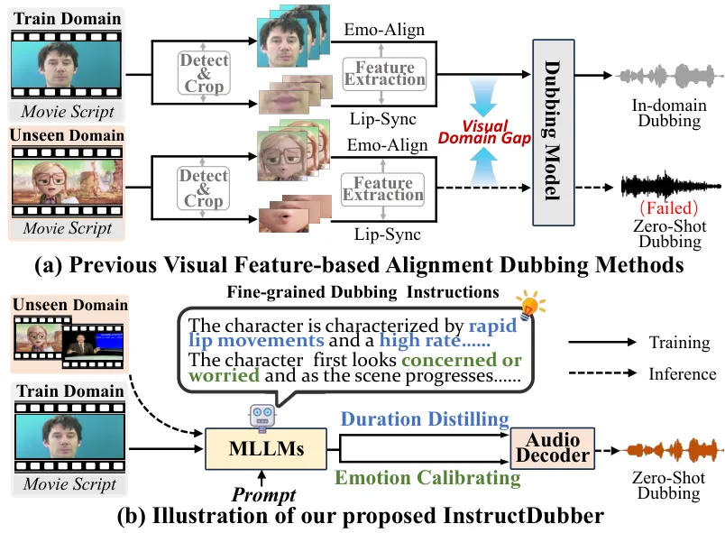
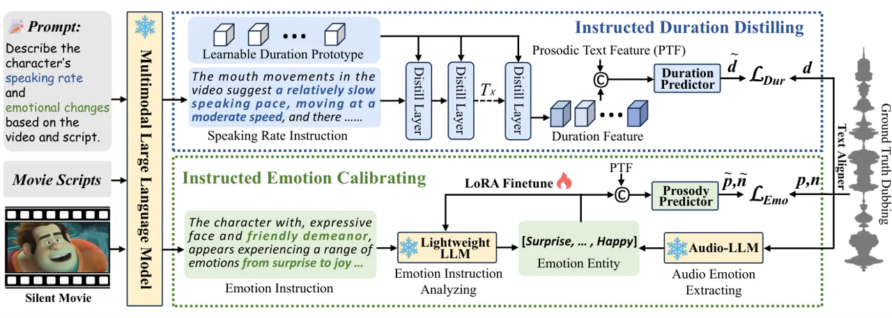
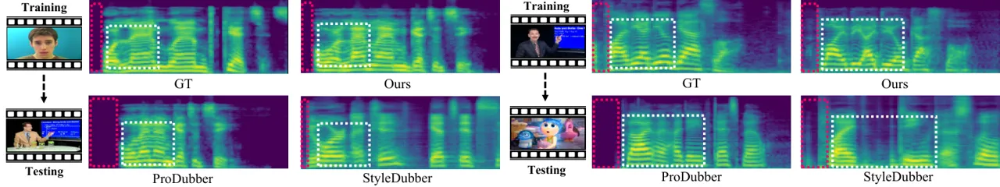

# InstructDubber: Instruction-based Alignment for Zero-shot Movie Dubbing

Zhedong Zhang Note: This work is done during the intern in VIPL group,
ICT, CAS.    Liang Li ^(†)^(†)thanks: Corresponding author.    Gaoxiang
Cong    Chunshan Liu    Yuhan Gao    Xiaowan Wang    Tao Gu    Yuankai
Qi

###### Abstract

Movie dubbing seeks to synthesize speech from a given script using a
specific voice, while ensuring accurate lip synchronization and
emotion-prosody alignment with the character’s visual performance.
However, existing alignment approaches based on visual features face two
key limitations: (1) they rely on complex, handcrafted visual
preprocessing pipelines, including facial landmark detection and feature
extraction; and (2) they generalize poorly to unseen visual domains,
often resulting in degraded alignment and dubbing quality. To address
these issues, we propose InstructDubber, a novel instruction-based
alignment dubbing method for both robust in-domain and zero-shot movie
dubbing. Specifically, we first feed the video, script, and
corresponding prompts into a multimodal large language model to generate
natural language dubbing instructions regarding the speaking rate and
emotion state depicted in the video, which is robust to visual domain
variations. Second, we design an instructed duration distilling module
to mine discriminative duration cues from speaking rate instructions to
predict lip-aligned phoneme-level pronunciation duration. Third, for
emotion-prosody alignment, we devise an instructed emotion calibrating
module, which fine-tunes an LLM-based instruction analyzer using ground
truth dubbing emotion as supervision and predicts prosody based on the
calibrated emotion analysis. Finally, the predicted duration and
prosody, together with the script, are fed into the audio decoder to
generate video-aligned dubbing. Extensive experiments on three major
benchmarks demonstrate that InstructDubber outperforms state‑of‑the‑art
approaches across both in‑domain and zero‑shot scenarios.

¹Hangzhou Dianzi University, Hangzhou, China,

²Institute of Computing Technology, Chinese Academy of Sciences,
Beijing, China,

³University of Chinese Academy of Science, Beijing, China,

⁴Tsinghua University, Beijing, China,

⁵Macquarie University, Sydney, Australia

Demo — https://zzdoog.github.io/InstructDubber/

## 1 Introduction

Movie Dubbing, also known as Visual Voice Cloning (V2C) (Chen et al.
2022), aims to transfer the given script into speech with a specific
voice, while preserving temporal synchronization with the character’s
lip movements and emotional alignment with their facial expressions in
the video. It has broad real-world applications in areas such as film
production, digital media, and personalized speech AIGC. However, the
requirement of accurately and fine-grainedly aligning the speech with
visual performance also presents a substantial challenge to movie
dubbing task.



Figure 1: (a) Illustration of the previous dubbing methods with visual
feature-based alignment, which rely on complex visual preprocessing and
suffer from poor generalization to unseen visual domains. (b)
Illustration of our proposed InstructDubber, an instruction-based
alignment dubbing method that achieves robust zero-shot dubbing using
natural language fine-grained dubbing instructions.

Existing alignment methods for movie dubbing broadly fall into two main
categories. The first category (Hu et al. 2021; Cong et al. 2023; Zhao
et al. 2024) generates dubbing using the fusion representation of visual
features from lip regions and the textual features from the script to
achieve temporal alignment. It improves the synchronization between the
generated dubbing and lip movements but struggles to build clear speech
from the lips of various visual scenes, thus often results in suboptimal
speech quality. The second category (Cong et al. 2024; Zhang et al.
2024b) employs phoneme-based speech synthesis models (Ren et al. 2021;
Li et al. 2023b) as the generation backbone, leveraging visual features
of lip movements and facial expressions to predict video-aligned
phoneme-level duration and prosodic attributes (_i.e._, pitch and
energy). By incorporating acoustic pre-training techniques (Zhang et al.
2025c), the second category achieves improved video-dubbing alignment
while maintaining high speech quality.

Despite the progress, the aforementioned approaches typically rely on
complex and time-consuming handcrafted visual preprocessing steps like
detecting and segmenting characters’ facial and lip regions, followed by
various feature extraction procedures, as illustrated in Figure 1 (a).
Beyond the burdensome preprocessing pipeline, these visual-based
alignment methods are sensitive to variations in visual domains, such as
the domain gap between animated and live-action characters.
Consequently, the reliance on such preprocessed visual features makes
these methods vulnerable to performance degradation when facing videos
from unseen domains, severely compromising both alignment accuracy and
dubbing quality.

Compared to visual features, natural language instructions serve a more
intuitive and interpretable modality for dubbing alignment. They provide
fine-grained alignment guidance while offering better universality
across diverse visual domains. Meanwhile, the powerful multimodal
understanding capabilities of the multimodal large language models
(MLLMs) make it possible to generate visual-domain-robust fine-grained
dubbing instructions directly from video input. However, related prior
methods only leverage coarse-grained instructions (_e.g._, character
gender or age) as a supplement to visual features (Zheng et al. 2025) or
solely adopt the autoregressive framework for dubbing
generation (Sung-Bin et al. 2025), overlooking the capability of the
instruction-based dubbing alignment and its zero-shot potential to
generalize across diverse visual domains.

To this end, we propose InstructDubber, a novel instruction-based
alignment dubbing method that effectively leverages fine-grained dubbing
instructions to achieve robust in-domain and zero-shot movie dubbing (as
shown in Figure 1 (b)). Specifically, we first feed both the video and
script to a pre-trained MLLM to generate fine-grained,
visual-domain-robust natural language dubbing instructions that capture
characters’ speaking rates and emotions using corresponding prompts.
Second, we propose an Instructed Duration Distilling module to mine
duration cues from the speaking rate instruction. This is achieved by a
set of learnable duration prototypes with slot-attention-based
distillation. The distilled duration cues are then used to predict the
phoneme-level pronunciation duration together with prosodic text
features of input script. Third, for the emotion-prosody alignment, we
propose an Instructed Emotion Calibrating module. It fine-tunes a
lightweight LLM to analyze the emotion instructions by leveraging
emotion entities extracted from ground truth dubbing as supervision.
Based on the calibrated emotion entities extracted from emotion
instruction by the fine-tuned analyzer, we predict the emotion-aligned
prosody of each phoneme. Finally, the script text features, combined
with duration and prosody inferred from visual-domain-robust
instructions, are provided to an audio decoder to synthesize temporally
aligned, high-fidelity dubbing in both in-domain and zero-shot dubbing
scenarios.

The main contributions are summarized as follows:

- •
  We propose InstructDubber, a dubbing method with instruction-based
  alignment that effectively leverages natural language instructions to
  generate video-aligned dubbing in both in-domain and zero-shot
  scenarios.
- •
  We design an instructed duration distilling module to mine duration
  cues from fine-grained speaking rate instructions by
  slot-attention-based distillation to predict the lip-aligned
  phoneme-level pronunciation duration.
- •
  We devise an instructed emotion calibrating module that optimizes the
  analysis of fine-grained emotion instructions and models
  emotion-aligned dubbing prosody based on the calibrated emotion
  analysis.
- •
  Favorable performance on both in-domain and zero-shot dubbing
  scenarios across three major benchmarks demonstrates the effectiveness
  of our approach.



Figure 2: The main architecture of the proposed InstructDubber. To
predict the lip-synchronized phoneme-level duration, the Instructed
Duration Distilling module (IDD) mines the duration cues from
fine-grained speaking rate instructions. The Instructed Emotion
Calibrating module (IEC) fine-tunes a lightweight LLM to analyze the
emotion instructions using the emotion entities from ground truth
dubbing as supervision, and predicts the dubbing prosody based on the
calibrated emotion analysis.

## 2 Related Works

### 2.1 Speech Synthesis

With the rapid development of deep learning (Cui et al. 2025; Zhao et
al. 2025b; Yin et al. 2025; Chen et al. 2024; Zhang et al. 2024a; Tu et
al. 2024; Li et al. 2022a; Zhang et al. 2025d), the FastSpeech
series (Ren et al. 2021) first introduces a phoneme-level duration-based
upsampling strategy and a controllable speech synthesis paradigm based
on pitch and energy prediction. Subsequently, many recent models, such
as the StyleTTS (Li et al. 2023b) and NaturalSpeech series (Ju et al. 2024) achieve more natural speech synthesisby incorporating techniques
such as diffusion models and adversarial training. Meanwhile, speech
synthesis models based on discrete speech codecs and autoregressive
architectures have also emerged progressively, such as SparkTTS (Wang et
al. 2025), Llasa (Ye et al. 2025), and CosyVoice series (Du et al.
2025). Despite the progress, they cannot be directly applied to movie
dubbing tasks because they lack the design of modeling duration and
prosody from performance in the given movie clips.

### 2.2 Visual Voice Cloning

Some previous V2C methods attempt to improve dubbing quality by
pretraining the phoneme encoder (Zhang et al. 2024b) or decoupling
acoustic modeling and prosody adaptation (Zhang et al. 2025c), in
response to the scarcity and noisiness of movie dubbing datasets caused
by issues such as copyright constraints. Another group of work explores
techniques such as flow matching (Cong et al. 2025b) and contrastive
learning (Cong et al. 2024), primarily aiming to enhance the performance
of audiovisual alignment (Cong et al. 2023; Zhao et al. 2025a; Cong et
al. 2025a; Li et al. 2025). However, their visual-based alignment
methods struggle to generalize to unseen video scenarios, hindering the
broader application.

### 2.3 Dubbing with MLLMs

Multimodal large language models (MLLMs) have powerful and generalizable
capabilities for multimodal content understanding. The earliest works
leveraging MLLMs for dubbing primarily utilized them to align the
overall duration between the dubbing and the video for multilingual
dubbing (Sahipjohn et al. 2024). Recently, VoiceCraft-Dub (Sung-Bin et
al. 2025) attempted to autoregressively generate dubbing by feeding
video frames and script text into an LLM-decoder. DeepDubber (Zheng et
al. 2025) attempts to leverage a chain-of-thought prompting strategy to
guide the MLLMs generating coarse-grained information—such as scene
type, character age, and gender—from the video to assist alignment.
However, they overlook the capability of fine-grained MLLM-generated
dubbing instructions in alignment and their potential in zero-shot
dubbing.

## 3 Method

### 3.1 Overview

The target of the overall movie dubbing task is:

```math
\hat{A}_{Dub}=\mathrm{Model}(A_{Ref},T_{d},V_{m}), \tag{1}
```

where the $`\hat{A}_{Dub}`$ is the generated dubbing and
$`A_{Ref},T_{d},V_{m}`$ are the reference audio, dubbing scripts, and
the input silent movie clip, respectively. The core of audio-visual
alignment in movie dubbing lies in assigning accurate phoneme-level
durations and prosody attributes based on the visual content and the
corresponding dubbing script:

```math
\tilde{p},\tilde{n},\tilde{d}=\mathrm{Alignment}(T_{d},V_{m}), \tag{2}
```

where the $`\tilde{p}`$, $`\tilde{n}`$, and $`\tilde{d}`$ are predicted
pitch, energy, and duration that align with the video content.

Figure 2 illustrates the framework of our proposed instruction-based
alignment approach. We employ a pre-trained multimodal large language
model to generate natural language fine-grained instructions of the
character’s speaking rate and emotional dynamics by taking both the
movie clip and the script as input with the corresponding prompt. Then,
the instructed duration distilling module mines the duration cues from
the speaking rate instructions, which are then combined with prosodic
text features to predict phoneme-level durations $`\tilde{d}`$.
Meanwhile, the instructed emotion calibrating module fine-tunes a
lightweight LLM-based analyzer to extract the dubbing emotions from
emotion instructions, thereby guiding the prediction of emotion-aligned
prosody $`\tilde{p}`$ and $`\tilde{n}`$. We detail each module below.

### 3.2 Instructed Duration Distilling

To enable the MLLM to generate fine-grained instructions that capture
the character’s speaking rate in the input video, we feed both the video
clip, movie script, and the speaking rate prompt into the MLLM as input:

```math
I_{Dur}=\mathrm{MLLM}(T_{d},V_{m},Prompt_{Dur}), \tag{3}
```

where $`I_{Dur}`$ is the fine-grained speaking rate instruction of the
given video, $`Prompt_{Dur}`$ is the speaking rate prompt. Compared to
conventional methods that extract visual features from each video frame,
the fine-grained instructions generated by MLLMs are more informative,
yet often contain redundant elements such as prepositions and
conjunctions. Therefore, it is essential to distill the discriminative
duration cues from them for accurate duration prediction.

To alleviate this problem, we propose the Instructed Duration Distilling
(IDD) module, which consists of multiple distilling layers that leverage
the slot attention mechanism (Locatello et al. 2020). Slot attention
initializes a set of learnable prototypes, referred to as element slots,
which interact with sequence inputs to iteratively group information
corresponding to the same underlying element. Within the IDD module, it
is particularly well-suited for extracting discriminative duration cues
from fine-grained speaking rate instructions, enabling effective
alignment modeling.

Specifically, we first employ a global text embedding (GTE) module to
convert the speaking rate instruction $`I_{Dur}`$ into text embeddings
$`E_{Dur}`$ with position encoding:

```math
E_{Dur}=\mathrm{GTE}(T_{Dur})\in\mathbb{R}^{L_{Dur}\times d_{GTE}}. \tag{4}
```

The input features of the distilling layers $`E_{Dur}`$ are first
linearly projected to obtain key and value representations:

```math
K_{Dur}=W^{K}E_{Dur},V_{Dur}=W^{V}E_{Dur}, \tag{5}
```

where $`W^{K}`$ and $`W^{V}\in\mathbb{R}^{d_{GTE}}`$ are learnable
linear projections. A fixed number $`K`$ of duration prototype slots
$`\{s^{(0)}_{k}\}^{K}_{k=1}`$ are initialized randomly as learned
duration features shared across all inputs. For $`T`$ iterations
(_i.e._, $`T`$ distilling layers), each slot $`s_{k}^{(t)}`$ is updated
by attending to the input features. At each iteration $`t`$, the current
slots are projected into queries:

```math
Q^{(t)}=W^{Q}S^{(t)}, \tag{6}
```

where $`S^{(t)}=[s_{1}^{(t)};...;s_{K}^{(t)}]`$ and $`W^{Q}`$ is a
learnable projection. Attention weights between each slot and input
token are computed using scaled dot-product attention:

```math
\alpha_{k,n}^{(t)}=\frac{\exp\left(\frac{q_{k}^{(t)}\cdot k_{n}}{\sqrt{d}}\right)}{\sum_{k^{\prime}=1}^{K}\exp\left(\frac{q_{k}^{(t)}\cdot k_{n}}{\sqrt{d}}\right)},\quad\mathrm{for~}k=1\ldots K, \tag{7}
```

where $`q_{k}^{(t)}\in\mathbb{R}^{d_{GTE}}`$ is the $`k`$-th query
vector and $`k_{n}\in\mathbb{R}^{d_{GTE}},n=1,\ldots,L_{Dur}`$ is the
$`n`$-th key vector. Then, each slot $`s_{k}^{(t)}`$ receives the weight
summary of the input values and updated via a GRU-based mechanism:

```math
\begin{split}u_{k}^{(t)}&=\sum_{n=1}^{N}\alpha_{k,n}^{(t)}\cdot v_{n},\quad v_{n}\in\mathbb{R}^{d_{GTE}},\\
s_{k}^{(t+1)}&=\mathrm{GRU}(u_{k}^{(t)},s_{k}^{(t)})+\mathrm{MLP}(\mathrm{LN}(s_{k}^{(t+1)})),\end{split} \tag{8}
```

where $`\mathrm{LN}`$ denotes layer normalization, and $`\mathrm{MLP}`$
is a small feedforward network with non-linearity. After $`T`$
iterations ($`T`$ distilling layers with shared weights), we obtain the
final slots $`S^{(T)}`$ as the duration features $`P_{Dur}`$, which are
distilled from the speaking rate instructions:

```math
P_{Dur}=S^{(T)}\in\mathbb{R}^{K\times d_{GTE}}. \tag{9}
```

After getting the distilled duration features, following (Zhang et al.
2025c), we convert the script text into phonemes and extract prosodic
text features $`T_{p}`$ using a pretrained phoneme-level BERT model (Li
et al. 2023a):

```math
\begin{split}T_{pho}&=\mathrm{G2P}(T_{d})\in\mathbb{R}^{L_{pho}},\\
T_{p}&=\mathrm{BERT}_{pho}(T_{pho})\in\mathbb{R}^{L_{pho}\times d_{m}},\end{split} \tag{10}
```

where the $`\mathrm{G2P}`$ and $`\mathrm{BERT}_{pho}`$ are the grapheme
to phoneme transfer and phoneme-level BERT. We use the $`T_{p}`$ as
queries, while the dimension-reduced duration features
$`P^{\prime}_{Dur}`$ as both keys and values to a cross-attention (CA)
layer. The fused duration representations are then fed into a duration
predictor to obtain the final duration output:

```math
\begin{split}F_{Dur}&=\mathrm{CA}(T_{p},P_{Dur}^{\prime},P_{Dur}^{\prime})\in\mathbb{R}^{L_{pho}\times d_{m}},\\
\tilde{d}&=\mathrm{DurationPrdictor}(F_{Dur})\in\mathbb{R}^{L_{pho}},\end{split} \tag{11}
```

where the $`\mathrm{DurationPrdictor}`$ is a Bi-LSTM network with a
prediction head following (Li et al. 2023b). The $`\tilde{d}`$ is scaled
according to the length of input video to ensure the consistency between
total duration of video and dubbing.

### 3.3 Instructed Emotion Calibrating

First, we input the video, script, and prompt into the MLLM to obtain
fine-grained emotion instructions:

```math
I_{Emo}=\mathrm{MLLM}(T_{d},V_{m},Prompt_{Emo}). \tag{12}
```

Similarly, it is essential to extract discriminative emotional
variations from fine-grained emotion instructions to facilitate accurate
emotion-aligned prosody prediction of each phoneme. To this end and also
to enhance the model’s generalization ability in emotion analysis, we
introduce a predefined set of emotions and use the elements as emotion
entities. After a comprehensive analysis of several emotion-labeled
speech and dubbing datasets (Chen et al. 2022; Zhou et al. 2022), we
adopt the following seven emotions as the predefined set of emotion
entities: happy, angry, disgust, fear, neutral, sad, and surprise.

We employ a lightweight LLM as the emotion instruction analyzer to
extract the emotion entities from the emotion instructions. Introducing
an additional analyzer during training helps prevent the MLLM’s
knowledge from being biased by the visual styles of specific dubbing
datasets, thereby preserving the model’s generalization capability while
also enhancing its flexibility to accommodate different MLLMs. To ensure
consistency between the emotion entities extracted from the emotion
instruction and those present in the ground truth dubbing, we employ an
audio large language model (Audio LLM) to extract ground truth emotion
entities from the reference dubbing:

```math
Entity_{Emo}=\mathrm{AudioLLM}(A_{Dub},Prompt_{Entity}), \tag{13}
```

where $`Entity_{Emo}`$ denotes the ground-truth emotion entities
extracted from the dubbing audio.

|                                  |                   |                          |                        |                    |                   |                          |                        |                    |                   |                        |                    |
| -------------------------------- | ----------------- | ------------------------ | ---------------------- | ------------------ | ----------------- | ------------------------ | ---------------------- | ------------------ | ----------------- | ---------------------- | ------------------ |
| Benchmark                        | V2C-Animation     |                          |                        |                    | Chem              |                          |                        |                    | GRID              |                        |                    |
| Methods                          | DD $`\downarrow`$ | EMO-SIM (%) $`\uparrow`$ | WER (%) $`\downarrow`$ | UTMOS $`\uparrow`$ | DD $`\downarrow`$ | EMO-SIM (%) $`\uparrow`$ | WER (%) $`\downarrow`$ | UTMOS $`\uparrow`$ | DD $`\downarrow`$ | WER (%) $`\downarrow`$ | UTMOS $`\uparrow`$ |
| GT                               | 0.0000            | 100.00                   | 25.55                  | 2.26               | 0.0000            | 100.00                   | 3.85                   | 4.18               | 0.0000            | 22.41                  | 3.94               |
| Speak2Dub (Zhang et al. 2024b)   | 0.5173            | 66.58                    | 17.51                  | 2.41               | 0.4786            | 76.78                    | 11.82                  | 3.72               | 0.2650            | 17.40                  | 3.69               |
| StyleDubber (Cong et al. 2024)   | 0.5092            | 67.22                    | 31.94                  | 1.89               | 0.4508            | 77.99                    | 13.14                  | 3.02               | 0.2453            | 18.88                  | 3.73               |
| DeepDubber\* (Zheng et al. 2025) | 0.5756            | 56.42                    | 35.88                  | 2.03               | 0.5041            | 52.37                    | 25.51                  | 2.53               | 0.3995            | 51.16                  | 2.31               |
| ProDubber (Zhang et al. 2025c)   | 0.5148            | 67.15                    | 8.04                   | 3.10               | 0.4673            | 76.69                    | 9.45                   | 3.85               | 0.2551            | 18.60                  | 3.87               |
| InstructDubber (Ours)            | 0.5122            | 68.46                    | 9.27                   | 3.11               | 0.4461            | 78.38                    | 8.86                   | 3.87               | 0.2522            | 17.81                  | 3.88               |

Table 1: Results of in-domain dubbing on three major benchmarks, which
use the train set and test set from the same benchmark for training and
evaluation. The best results are in bold and the second-best ones are
underlined.

Supervised by ground truth emotion entities, we fine-tune this analyzer
using Low Rank Adaptation (LoRA) (Hu et al. 2022) to calibrate its
analysis of the emotion instruction. For each QKV projection layer and
feed-forward layer in the emotion instruction analyzer, we perform
fine-tuning using rank-$`R`$ adaptation matrices:

```math
W^{\prime}=W+\Delta W=W+AB, \tag{14}
```

where $`W`$ is the original parameter,
$`A\in\mathbb{R}^{d_{LLM}\times R}`$ and
$`B\in\mathbb{R}^{R\times d_{LLM}}`$ together constitute the complete
set of trainable parameters $`\theta`$. During training, the parameters
$`\theta`$ are optimized by minimizing the autoregressive loss:

```math
\theta^{\prime}\leftarrow\theta-\eta\cdot\nabla_{\theta}\mathcal{L}(\mathrm{Analyzer}(I_{\mathrm{Emo}};\theta),Entity_{Emo}), \tag{15}
```

where $`\eta`$ is the learning rate.

After the fine-tuning, we use the emotion instruction analyzer to
extract emotion entities from the emotion instructions and obtain their
corresponding text embeddings:

```math
E_{Emo}=\mathrm{GTE}(\mathrm{Analyzer}(I_{Emo},Prompt_{A},\theta^{\prime})), \tag{16}
```

where $`Prompt_{A}`$ is the analysis prompt,
$`E_{Emo}\in\mathbb{R}^{L\times d_{GTE}}`$ is the text embedding of the
predicted emotion entities. Then, we apply cross-attention between the
dimension-reduced emotion features $`E_{Emo}^{\prime}`$ and the prosodic
text features to obtain prosody features for prosody prediction:

```math
\begin{split}F_{Emo}&=\mathrm{CA}(T_{p},E_{Emo}^{\prime},E_{Emo}^{\prime})\in\mathbb{R}^{L_{pho}\times d_{m}},\\
\tilde{p},\tilde{n}&=\mathrm{ProsodyPrdictor}(F_{Emo})\in\mathbb{R}^{L_{pho}},\end{split} \tag{17}
```

where the $`\mathrm{ProsodyPrdictor}`$ has the same architecture as the
duration predictor with two prediction heads for pitch and energy,
respectively.

### 3.4 Audio Generation and Training Objective

We feed the predicted duration and prosody, along with the script text
and reference audio, into a pre-trained HiFi-GAN-based audio
decoder (Kong et al. 2020) to generate the final dubbing audio:

```math
\hat{A}_{Dub}=\mathrm{AudioDecoder}(T_{d},\tilde{p},\tilde{n},\tilde{d},A_{Ref}). \tag{18}
```

The overall training objective of InstructDubber is:

```math
\mathcal{L}_{total}=\lambda_{1}\mathcal{L}_{Dur}+\lambda_{2}\mathcal{L}_{Emo}, \tag{19}
```

```math
\mathcal{L}_{Dur}=\frac{1}{L_{pho}}\sum_{i=0}^{L_{pho}-1}\left\|\widetilde{d}_{i}-d_{i}\right\|_{1}, \tag{20}
```

```math
\mathcal{L}_{Emo}=\frac{1}{L_{pho}}\sum_{i=0}^{L_{pho}-1}\left\|\widetilde{p}_{i}-p_{i}\right\|_{1}+\left\|\widetilde{n}_{i}-n_{i}\right\|_{1}, \tag{21}
```

where the weight in Equation (19) are set to $`\lambda_{1}=2`$,
$`\lambda_{2}=1`$. We use the ground truth emotion entities during
training and the predicted during inference and evaluation.

## 4 Experiments

### 4.1 Datasets

V2C-Animation dataset (Chen et al. 2022) is a collection of 10,217 video
clips from 26 animated movies, consists of 10,217 video-audio-text
triplets cropped from 26 Disney animated movies, totaling 153 different
speakers, with complete speaker and emotion annotations.

Chem dataset (Prajwal et al. 2020) is a popular dubbing dataset
recording a chemistry teacher speaking in the class. For complete
dubbing, each video has clip to sentence-level following (Hu et al.
2021).

GRID dataset (Cooke et al. 2006) is a multi-speaker dubbing benchmark
which comprises video recordings of 33 speakers performing 1,000
scripted sentences each.

### 4.2 Evaluation Metrics

Duration Divergence (DD). The duration divergence evaluates the
lip-synchronization by calculating the divergence between phoneme-level
duration distributions of synthesized and ground truth dubbing
following (Ye et al. 2024).

EMO-SIM. Emotion similarity (EMO-SIM) measures the cosine similarity
between the emotion embedding of generated dubbing and ground truth,
which is obtained using Emotion2Vec (Ma et al. 2023) following (Sung-Bin
et al. 2025). Since GRID videos predominantly feature neutral
expressions, we only conduct EMO-SIM on V2C-Animation and Chem
benchmarks.

WER. The Word Error Rate (WER) ¹¹ 1 https://github.com/jitsi/jiwer
assesses the model’s pronunciation accuracy by using an advanced ASR
model Whisper²² 2 https://huggingface.co/openai/whisper-large (Radford
et al. 2023) to transcribe the dubbing into text and compare it with the
original dubbing script.

UTMOS. UTMOS (Saeki et al. 2022) is a speech mean opinion score (MOS)
predictor to measure the acoustic quality and naturalness of the
generated dubbing following (Ju et al. 2024).

|              |                   |                          |                        |                    |                   |                        |                    |                   |                          |                        |                    |
| ------------ | ----------------- | ------------------------ | ---------------------- | ------------------ | ----------------- | ---------------------- | ------------------ | ----------------- | ------------------------ | ---------------------- | ------------------ |
| Benchmark    | V2C2Chem          |                          |                        |                    | V2C2GRID          |                        |                    | GRID2V2C          |                          |                        |                    |
| Methods      | DD $`\downarrow`$ | EMO-SIM (%) $`\uparrow`$ | WER (%) $`\downarrow`$ | UTMOS $`\uparrow`$ | DD $`\downarrow`$ | WER (%) $`\downarrow`$ | UTMOS $`\uparrow`$ | DD $`\downarrow`$ | EMO-SIM (%) $`\uparrow`$ | WER (%) $`\downarrow`$ | UTMOS $`\uparrow`$ |
| GT           | 0.0000            | 100.00                   | 3.85                   | 4.18               | 0.0000            | 22.41                  | 3.94               | 0.0000            | 100.00                   | 25.55                  | 2.26               |
| Speak2Dub    | 0.5334            | 57.21                    | 10.23                  | 2.66               | 0.3258            | 64.31                  | 2.91               | 0.5506            | 36.96                    | 65.82                  | 2.52               |
| StyleDubber  | 0.4721            | 67.03                    | 18.63                  | 2.26               | 0.3380            | 77.97                  | 2.58               | 0.5397            | 39.92                    | 70.32                  | 1.93               |
| DeepDubber\* | 0.5041            | 52.37                    | 25.51                  | 2.53               | 0.3995            | 51.16                  | 2.31               | 0.5756            | 56.42                    | 35.88                  | 2.03               |
| ProDubber    | 0.4649            | 68.21                    | 10.32                  | 3.62               | 0.3146            | 25.67                  | 3.55               | 0.5367            | 51.60                    | 41.27                  | 2.73               |
| Ours         | 0.4565            | 70.34                    | 8.42                   | 3.71               | 0.3103            | 23.49                  | 3.61               | 0.5261            | 57.09                    | 19.56                  | 2.85               |

Table 2: Results on zero-shot movie dubbing across three major
benchmarks. For example, V2C2GRID indicates that using the checkpoint
trained on the V2C-Animation dataset to directly dub the video clip from
GRID dataset without any fine-tuning. Note that the official checkpoint
of DeepDubber\* is trained jointly on multiple datasets, including
V2C-Animation and GRID, and therefore exhibits identical performance
across various zero-shot settings and as reported in Table 1.

|              |                   |                          |                        |                    |                   |                        |                    |                   |                          |                        |                    |
| ------------ | ----------------- | ------------------------ | ---------------------- | ------------------ | ----------------- | ---------------------- | ------------------ | ----------------- | ------------------------ | ---------------------- | ------------------ |
| Benchmark    | Chem2V2C          |                          |                        |                    | Chem2GRID         |                        |                    | GRID2Chem         |                          |                        |                    |
| Methods      | DD $`\downarrow`$ | EMO-SIM (%) $`\uparrow`$ | WER (%) $`\downarrow`$ | UTMOS $`\uparrow`$ | DD $`\downarrow`$ | WER (%) $`\downarrow`$ | UTMOS $`\uparrow`$ | DD $`\downarrow`$ | EMO-SIM (%) $`\uparrow`$ | WER (%) $`\downarrow`$ | UTMOS $`\uparrow`$ |
| GT           | 0.0000            | 100.00                   | 25.55                  | 2.26               | 0.0000            | 22.41                  | 3.94               | 0.0000            | 100.00                   | 3.85                   | 4.18               |
| Speak2Dub    | 0.5873            | 59.72                    | 23.78                  | 2.74               | 0.3123            | 55.08                  | 3.00               | 0.5832            | 35.14                    | 60.47                  | 2.58               |
| StyleDubber  | 0.5627            | 58.54                    | 25.43                  | 1.95               | 0.3139            | 67.46                  | 2.10               | 0.5095            | 41.35                    | 68.91                  | 2.05               |
| DeepDubber\* | 0.5756            | 56.42                    | 35.88                  | 2.03               | 0.3995            | 51.16                  | 2.31               | 0.5041            | 52.37                    | 25.51                  | 2.53               |
| ProDubber    | 0.5650            | 65.98                    | 14.33                  | 2.91               | 0.3209            | 47.42                  | 3.73               | 0.5781            | 54.87                    | 30.17                  | 2.72               |
| Ours         | 0.5583            | 66.57                    | 12.60                  | 3.07               | 0.3042            | 38.53                  | 3.84               | 0.4849            | 58.91                    | 20.73                  | 2.94               |

Table 3: Results on zero-shot movie dubbing across three major
benchmarks with same zero-shot setting as Table 2.

### 4.3 Implementation Details

We employ a pre-trained JDC network (Kum and Nam 2019) as the pitch
extractor and use the log norm to calculate the energy following (Li et
al. 2023b). To get the ground truth duration and calculate the duration
divergence metrics, we adopt the ASR model fine-tuned for the TTS task
as text aligner (Li et al. 2022b) to get the alignment between phoneme
and mel-spectrogram following StyleTTS2 (Li et al. 2023b). For audio
generation, we adopt the same pre-trained audio decoder as
ProDubber (Zhang et al. 2025c). We use the Qwen2.5-Instruct-7B (QwenTeam 2024) to analyze the emotion instructions and the
Qwen2.5-Omni-7B (QwenTeam 2025) to get ground truth emotion entities. An
Adam (Kingma and Ba 2015) with $`\beta_{1}=0.9`$, $`\beta_{2}=0.98`$,
$`\epsilon=10^{-9}`$ is used as the optimizer during the training. The
learning rate is set to 0.00625.

### 4.4 Comparison with SOTA Methods

#### Results on in-domain dubbing.

As shown in Table 1, InstructDubber outperforms existing
state-of-the-art models on the majority of evaluation metrics across
three dubbing benchmarks. In terms of lip synchronization,
InstructDubber achieves the lowest duration divergence on Chem
benchmarks, and second best on V2C-Animation and GRID benchmarks. It
indicates that InstructDubber can generate dubbing exhibits the smallest
temporal discrepancy with the ground truth. The highest EMO-SIM on both
the V2C-Animation and Chem benchmarks shows that the dubbing generated
by InstructDubber exhibits the closest emotional expressiveness to the
ground truth, demonstrating the best emotion alignment performance in
this scenario.

Moreover, due to natural language instructions being inherently less
susceptible to noise compared to visual features, resulting in more
stable predictions of duration and prosody, the pronunciation clarity
and dubbing quality of the generated dubbing are also improved. We
achieve competitive WER performance across all three benchmarks and
observe an improvement in UTMOS, indicating the best overall dubbing
alignment and quality.

#### Results on zero-shot dubbing.

We conduct pairwise zero-shot dubbing evaluations across the three
benchmarks by directly using unseen videos from another dataset for
evaluation. As shown in Table 2 and 3, InstructDubber outperforms
state-of-the-art models across all six zero-shot dubbing scenarios on
both alignment accuracy and dubbing quality.

Specifically, compared to previous approaches that rely on visual
features to achieve alignment, which are easily perturbed by variations
in visual domains, guidance derived from natural language instructions
remains invariant to visual domain variations, enabling more accurate
and robust alignment in temporal and emotional aspects. More accurate
prediction of duration and prosody also leads to significant
improvements in pronunciation clarity and speech quality of the
generated dubbing. Besides, compared to the DeepDubber, which uses
coarse-grained instructions as a supplement to visual features and is
trained across multiple benchmarks, our proposed instructed duration
distilling and instructed emotion calibrating module effectively
leverages fine-grained dubbing instructions to guide the prediction of
aligned duration and prosody, consistently achieving superior
performance in all six zero-shot dubbing scenarios.

| Methods        | DD $`\downarrow`$ | EMO-SIM (%) $`\uparrow`$ | WER(%) $`\downarrow`$ | UTMOS $`\uparrow`$ |
| -------------- | ----------------- | ------------------------ | --------------------- | ------------------ |
| Visual Feature | 0.5030            | 69.51                    | 10.54                 | 3.37               |
| w/ IDD         | 0.4941            | 67.85                    | 9.97                  | 3.42               |
| w/ IEC         | 0.5046            | 70.77                    | 11.76                 | 3.40               |
| Full Model     | 0.4933            | 70.94                    | 9.79                  | 3.44               |

Table 4: Results of ablation study on each module.



Figure 3: The mel-spectrograms of ground truth and synthesized dubbing
by different models in zero-shot scenario. The red and white boxes
highlight regions where different models exhibit significant differences
in temporal and prosody alignment.

### 4.5 Ablation Studies

To validate the effectiveness of each proposed module, we conduct
ablation studies on V2C-Animation, Chem, and their cross-domain
zero-shot scenarios (_i.e._, V2C2Chem and Chem2V2C) . We report the
average performance of the four scenarios in this section.

#### Ablation of each module.

We integrate the proposed Instructed Duration Distilling (IDD) and
Instructed Emotion Calibrating (IEC) module into the visual
feature-based dubbing baseline model separately to validate their
effectiveness. As shown in Table 4, incorporating the IDD module leads
to improved duration alignment performance, with the average duration
divergence (DD) reduced compared to the baseline model. More accurate
duration alignment also leads to clearer pronunciation and improved
dubbing quality, resulting in performance gains in both WER and UTMOS.
The IEC module enables the model to better predict emotion-aligned
prosody, achieving +1.43% performance gain on the EMO-SIM metric. The
two proposed modules together enable InstructDubber to achieve the best
overall dubbing performance, validating the effectiveness of both
components.

| Method                   | DD $`\downarrow`$ | WER(%) $`\downarrow`$ | UTMOS $`\uparrow`$ |
| ------------------------ | ----------------- | --------------------- | ------------------ |
| Raw Instruction CA       | 0.5072            | 11.55                 | 3.40               |
| LoRA Prediction          | 0.5331            | 13.58                 | 3.32               |
| IDD (Prototype Num = 1)  | 0.5005            | 11.63                 | 3.38               |
| IDD (Prototype Num = 5)  | 0.4975            | 9.23                  | 3.43               |
| IDD (Prototype Num = 10) | 0.4933            | 9.79                  | 3.44               |
| IDD (Prototype Num = 20) | 0.4991            | 10.16                 | 3.45               |

Table 5: Results of ablation study on different instruction-based
duration alignment methods.

| Method                 | EMO-SIM (%) $`\uparrow`$ | WER(%) $`\downarrow`$ | UTMOS $`\uparrow`$ |
| ---------------------- | ------------------------ | --------------------- | ------------------ |
| Raw Instruction CA     | 69.55                    | 10.41                 | 3.38               |
| Instrcution Distilling | 70.51                    | 9.92                  | 3.42               |
| w/o Calibrating        | 70.33                    | 10.52                 | 3.39               |
| Ours (IEC)             | 70.94                    | 9.79                  | 3.44               |

Table 6: Results of ablation study on different instruction-based
emotion alignment methods.

#### Ablation of instruction-based duration alignment.

In Table 5, we report the performance of various strategies to leverage
the speaking rate instruction for duration alignment. Directly applying
cross-attention to fine-grained speaking rate instruction and dubbing
script (Raw Instruction CA) fails to extract discriminative duration
cues from the instruction, resulting in degraded duration alignment
performance. Finetuning an LLM using LoRA to directly predict the
duration sequence based on the instruction (LoRA Prediction) suffers
from implicit duration value optimization and unstable inference success
rate. Instead, the proposed IDD module achieves the best
lip-synchronization performance by mining duration cues from
fine-grained instructions. Through an ablation on the number of
learnable duration prototypes, we find that the 10-prototype achieves
better balance on alignment accuracy and speech quality.

#### Ablation of instruction-based emotion alignment.

The results of ablation on instruction-based emotion alignment are shown
in Table 6. Directly applying fine-grained emotion instructions in a
cross-attention mechanism to predict prosody introduces detailed yet
redundant information, which leads to suboptimal performance on the
EMO-SIM metric and dubbing quality. Using the instruction distilling
method similar to the IDD module or directly extracting emotion entities
from the instructions lacks supervision of emotion state from the ground
truth dubbing audio, limiting the accuracy in reflecting the character’s
emotional state in the video. The proposed IEC module incorporates
ground truth emotion entities as supervision to calibrate the analysis
of emotion instruction, which improves the emotion alignment and
achieves superior performance on EMO-SIM.

| Models         | DD $`\downarrow`$ | EMO-SIM (%) $`\uparrow`$ | WER(%) $`\downarrow`$ | UTMOS $`\uparrow`$ |
| -------------- | ----------------- | ------------------------ | --------------------- | ------------------ |
| VideoLLaMA3-7B | 0.4924            | 70.09                    | 9.84                  | 3.46               |
| LLaVA-Next-7B  | 0.4933            | 70.94                    | 9.79                  | 3.44               |
| GTE-0.6B       | 0.4988            | 70.99                    | 10.02                 | 3.43               |
| GTE-1.5B       | 0.4933            | 70.94                    | 9.79                  | 3.44               |
| GTE-4B         | 0.4999            | 70.51                    | 10.27                 | 3.41               |

Table 7: Results of ablation study on different MLLMs and GTE models of
varying size.

#### Ablation of different MLLMs and GTE models.

To validate the robustness of our proposed method , we conducted
ablation experiments using different MLLMs (VideoLLaMA3-7B (Zhang et al.
2025a) and LLaVA-NEXT-7B (Li et al. 2024)) and GTE models of varying
sizes (Zhang et al. 2025b). Table 7 shows that InstructDubber achieves
advanced and stable performance under different configurations of MLLM
and GTE size.

### 4.6 Qualitative Analysis

We visualize ground-truth and zero-shot dubbing mel-spectrograms from
different models in Figure 3. As shown in the red box, our model
produces more accurate phoneme-level duration predictions, leading to
superior lip synchronization. The white box further highlights
spectrogram patterns and variations which shows that we achieves prosody
patterns more consistent with the ground truth.

## 5 Conclusion

In this paper, we propose InstructDubber, a novel instruction-based
alignment dubbing method that achieves robust both in-domain and
zero-shot dubbing. The proposed instructed duration distilling module
and the instructed emotion calibrating effectively leverage fine-grained
dubbing instructions to facilitate temporal and emotional alignment,
respectively. The superior performance on both in-domain and zero-shot
experiments across three major benchmarks, along with the ablation
studies, demonstrates the effectiveness of the proposed method and each
module.

## Acknowledgements

This work was supported by the National Nature Science Foundation of
China (62322211, U21B2024), the “Pioneer” and “Leading Goose” R&D
Program of Zhejiang Province(2024C01023, 2024C01107, 2023C01030,
2023C03012), Key Laboratory of Intelligent Processing Technology for
Digital Music (Zhejiang Conservatory of Music), Ministry of Culture and
Tourism (2023DMKLB004). Yuankai Qi and Tao Gu are not supported by the
aforementioned fundings.

## References

- Chen et al. (2022) Q. Chen, M. Tan, Y. Qi, J. Zhou, Y. Li, and Q. Wu
  V2C: visual voice cloning. In IEEE/CVF Conference on Computer Vision
  and Pattern Recognition, CVPR 2022, New Orleans, LA, USA, June 18-24,
  2022, pp. 21210–21219. Cited by: §1, §3.3, §4.1.
- Chen et al. (2024) Q. Chen, T. Wang, Z. Yang, H. Li, R. Lu, Y. Sun, B.
  Zheng, and C. Yan Sdpl: shifting-dense partition learning for uav-view
  geo-localization. IEEE Transactions on Circuits and Systems for Video
  Technology 34 (11), pp. 11810–11824. Cited by: §2.1.
- Cong et al. (2025a) G. Cong, L. Li, J. Pan, Z. Zhang, A. Beheshti, A.
  van den Hengel, Y. Qi, and Q. Huang FlowDubber: movie dubbing with
  llm-based semantic-aware learning and flow matching based voice
  enhancing. In Proceedings of the 33rd ACM International Conference on
  Multimedia, pp. 905–914. Cited by: §2.2.
- Cong et al. (2023) G. Cong, L. Li, Y. Qi, Z. Zha, Q. Wu, W. Wang, B.
  Jiang, M. Yang, and Q. Huang Learning to dub movies via hierarchical
  prosody models. In IEEE/CVF Conference on Computer Vision and Pattern
  Recognition, CVPR 2023, Vancouver, BC, Canada, June 17-24, 2023,
  pp. 14687–14697. Cited by: §1, §2.2.
- Cong et al. (2025b) G. Cong, J. Pan, L. Li, Y. Qi, Y. Peng, A. van den
  Hengel, J. Yang, and Q. Huang EmoDubber: towards high quality and
  emotion controllable movie dubbing. In Proceedings of the Computer
  Vision and Pattern Recognition Conference (CVPR), pp. 15863–15873.
  Cited by: §2.2.
- Cong et al. (2024) G. Cong, Y. Qi, L. Li, A. Beheshti, Z. Zhang, A.
  van den Hengel, M. Yang, C. Yan, and Q. Huang StyleDubber: towards
  multi-scale style learning for movie dubbing. In Findings of the
  Association for Computational Linguistics, ACL 2024, Bangkok, Thailand
  and virtual meeting, August 11-16, 2024, pp. 6767–6779. Cited by: §1,
  §2.2, Table 1.
- Cooke et al. (2006) M. Cooke, J. Barker, S. Cunningham, and X. Shao An
  audio-visual corpus for speech perception and automatic speech
  recognition. The Journal of the Acoustical Society of America 120 (5),
  pp. 2421–2424. Cited by: §4.1.
- Cui et al. (2025) Y. Cui, L. Li, H. Yin, Y. Gao, Y. Sun, and C. Yan
  Debiased teacher for day-to-night domain adaptive object detection. In
  Proceedings of the IEEE/CVF International Conference on Computer
  Vision, pp. 2577–2587. Cited by: §2.1.
- Du et al. (2025) Z. Du, C. Gao, Y. Wang, F. Yu, T. Zhao, H. Wang, X.
  Lv, H. Wang, X. Shi, K. An, et al. CosyVoice 3: towards in-the-wild
  speech generation via scaling-up and post-training. arXiv preprint
  arXiv:2505.17589. Cited by: §2.1.
- Hu et al. (2021) C. Hu, Q. Tian, T. Li, Y. Wang, Y. Wang, and H. Zhao
  Neural dubber: dubbing for videos according to scripts. In Advances in
  Neural Information Processing Systems 34: Annual Conference on Neural
  Information Processing Systems 2021, NeurIPS 2021, December 6-14,
  2021, virtual, pp. 16582–16595. Cited by: §1, §4.1.
- Hu et al. (2022) E. J. Hu, Y. Shen, P. Wallis, Z. Allen-Zhu, Y. Li, S.
  Wang, L. Wang, W. Chen, et al. Lora: low-rank adaptation of large
  language models.. ICLR 1 (2), pp. 3. Cited by: §3.3.
- Ju et al. (2024) Z. Ju, Y. Wang, K. Shen, X. Tan, D. Xin, D. Yang, Y.
  Liu, Y. Leng, K. Song, S. Tang, et al. NaturalSpeech 3: zero-shot
  speech synthesis with factorized codec and diffusion models. arXiv
  preprint arXiv:2403.03100. Cited by: §2.1, §4.2.
- Kingma and Ba (2015) D. P. Kingma and J. Ba Adam: A method for
  stochastic optimization. In 3rd International Conference on Learning
  Representations, ICLR 2015, San Diego, CA, USA, May 7-9, 2015,
  Conference Track Proceedings, Cited by: §4.3.
- Kong et al. (2020) J. Kong, J. Kim, and J. Bae HiFi-gan: generative
  adversarial networks for efficient and high fidelity speech synthesis.
  In Advances in Neural Information Processing Systems 33: Annual
  Conference on Neural Information Processing Systems 2020, External
  Links:
  [Link](https://proceedings.neurips.cc/paper/2020/hash/c5d736809766d46260d816d8dbc9eb44-Abstract.html)
  Cited by: §3.4.
- Kum and Nam (2019) S. Kum and J. Nam Joint detection and
  classification of singing voice melody using convolutional recurrent
  neural networks. Applied Sciences 9 (7), pp. 1324. Cited by: §4.3.
- Li et al. (2024) B. Li, K. Zhang, H. Zhang, D. Guo, R. Zhang, F.
  Li, Y. Zhang, Z. Liu, and C. Li LLaVA-next: stronger llms supercharge
  multimodal capabilities in the wild. External Links:
  [Link](https://llava-vl.github.io/blog/2024-05-10-llava-next-stronger-llms/)
  Cited by: §4.5.
- Li et al. (2025) L. Li, G. Cong, Y. Qi, Z. Zha, Q. Wu, Q. Z. Sheng, Q.
  Huang, and M. Yang Dubbing movies via hierarchical phoneme modeling
  and acoustic diffusion denoising. IEEE Transactions on Pattern
  Analysis and Machine Intelligence. Cited by: §2.2.
- Li et al. (2022a) L. Li, X. Gao, J. Deng, Y. Tu, Z. Zha, and Q. Huang
  Long short-term relation transformer with global gating for video
  captioning. IEEE Transactions on Image Processing 31, pp. 2726–2738.
  Cited by: §2.1.
- Li et al. (2023a) Y. A. Li, C. Han, X. Jiang, and N. Mesgarani
  Phoneme-level bert for enhanced prosody of text-to-speech with
  grapheme predictions. In IEEE International Conference on Acoustics,
  Speech and Signal Processing ICASSP 2023, Rhodes Island, Greece, June
  4-10, 2023, pp. 1–5. Cited by: §3.2.
- Li et al. (2022b) Y. A. Li, C. Han, and N. Mesgarani Styletts: a
  style-based generative model for natural and diverse text-to-speech
  synthesis. arXiv preprint arXiv:2205.15439. Cited by: §4.3.
- Li et al. (2023b) Y. A. Li, C. Han, V. S. Raghavan, G. Mischler,
  and N. Mesgarani StyleTTS 2: towards human-level text-to-speech
  through style diffusion and adversarial training with large speech
  language models. In Advances in Neural Information Processing Systems
  36: Annual Conference on Neural Information Processing Systems 2023,
  NeurIPS 2023, New Orleans, LA, USA, December 10 - 16, 2023, External
  Links:
  [Link](http://papers.nips.cc/paper%5C_files/paper/2023/hash/3eaad2a0b62b5ed7a2e66c2188bb1449-Abstract-Conference.html)
  Cited by: §1, §2.1, §3.2, §4.3.
- Locatello et al. (2020) F. Locatello, D. Weissenborn, T.
  Unterthiner, A. Mahendran, G. Heigold, J. Uszkoreit, A. Dosovitskiy,
  and T. Kipf Object-centric learning with slot attention. Advances in
  neural information processing systems 33, pp. 11525–11538. Cited by:
  §3.2.
- Ma et al. (2023) Z. Ma, Z. Zheng, J. Ye, J. Li, Z. Gao, S. Zhang,
  and X. Chen Emotion2vec: self-supervised pre-training for speech
  emotion representation. arXiv preprint arXiv:2312.15185. Cited by:
  §4.2.
- Prajwal et al. (2020) K. Prajwal, R. Mukhopadhyay, V. P. Namboodiri,
  and C. Jawahar Learning individual speaking styles for accurate lip to
  speech synthesis. In Proceedings of the IEEE/CVF conference on
  computer vision and pattern recognition, pp. 13796–13805. Cited by:
  §4.1.
- QwenTeam (2024) QwenTeam Qwen2.5: a party of foundation models.
  External Links: [Link](https://qwenlm.github.io/blog/qwen2.5/) Cited
  by: §4.3.
- QwenTeam (2025) QwenTeam Qwen2.5-omni technical report. arXiv preprint
  arXiv:2503.20215. Cited by: §4.3.
- Radford et al. (2023) A. Radford, J. W. Kim, T. Xu, G. Brockman, C.
  McLeavey, and I. Sutskever Robust speech recognition via large-scale
  weak supervision. In International Conference on Machine Learning,
  ICML 2023, 23-29 July 2023, Honolulu, Hawaii, USA, pp. 28492–28518.
  Cited by: §4.2.
- Ren et al. (2021) Y. Ren, C. Hu, X. Tan, T. Qin, S. Zhao, Z. Zhao,
  and T. Liu FastSpeech 2: fast and high-quality end-to-end text to
  speech. In 9th International Conference on Learning Representations,
  ICLR 2021, Virtual Event, Austria, May 3-7, 2021, External Links:
  [Link](https://openreview.net/forum?id=piLPYqxtWuA) Cited by: §1,
  §2.1.
- Saeki et al. (2022) T. Saeki, D. Xin, W. Nakata, T. Koriyama, S.
  Takamichi, and H. Saruwatari UTMOS: utokyo-sarulab system for voicemos
  challenge 2022. In 23rd Annual Conference of the International Speech
  Communication Association, Interspeech 2022, Incheon, Korea, September
  18-22, 2022, pp. 4521–4525. Cited by: §4.2.
- Sahipjohn et al. (2024) N. Sahipjohn, A. Gudmalwar, N. Shah, P.
  Wasnik, and R. R. Shah DubWise: video-guided speech duration control
  in multimodal llm-based text-to-speech for dubbing. In 25th Annual
  Conference of the International Speech Communication Association,
  Interspeech 2024, Kos, Greece, September 1-5, 2024, I. Lapidot and S.
  Gannot (Eds.), Cited by: §2.3.
- Sung-Bin et al. (2025) K. Sung-Bin, J. Choi, P. Peng, J. S. Chung, T.
  Oh, and D. Harwath VoiceCraft-dub: automated video dubbing with neural
  codec language models. arXiv preprint arXiv:2504.02386. Cited by: §1,
  §2.3, §4.2.
- Tu et al. (2024) Y. Tu, L. Li, L. Su, Z. Zha, and Q. Huang Smart:
  syntax-calibrated multi-aspect relation transformer for change
  captioning. IEEE Transactions on Pattern Analysis and Machine
  Intelligence. Cited by: §2.1.
- Wang et al. (2025) X. Wang, M. Jiang, Z. Ma, Z. Zhang, S. Liu, L.
  Li, Z. Liang, Q. Zheng, R. Wang, X. Feng, et al. Spark-tts: an
  efficient llm-based text-to-speech model with single-stream decoupled
  speech tokens. arXiv preprint arXiv:2503.01710. Cited by: §2.1.
- Ye et al. (2024) Z. Ye, Z. Ju, H. Liu, X. Tan, J. Chen, Y. Lu, P.
  Sun, J. Pan, W. Bian, S. He, Q. Liu, Y. Guo, and W. Xue FlashSpeech:
  efficient zero-shot speech synthesis. CoRR abs/2404.14700. Cited by:
  §4.2.
- Ye et al. (2025) Z. Ye, X. Zhu, C. Chan, X. Wang, X. Tan, J. Lei, Y.
  Peng, H. Liu, Y. Jin, Z. DAI, et al. Llasa: scaling train-time and
  inference-time compute for llama-based speech synthesis. arXiv
  preprint arXiv:2502.04128. Cited by: §2.1.
- Yin et al. (2025) J. Yin, L. Li, J. Zhang, Y. Gao, C. Yan, and X.
  Sheng Progressive homeostatic and plastic prompt tuning for
  audio-visual multi-task incremental learning. In Proceedings of the
  IEEE/CVF International Conference on Computer Vision, pp. 2022–2033.
  Cited by: §2.1.
- Zhang et al. (2024a) B. Zhang, L. Li, S. Wang, S. Cai, Z. Zha, Q.
  Tian, and Q. Huang Inductive state-relabeling adversarial active
  learning with heuristic clique rescaling. IEEE Transactions on Pattern
  Analysis and Machine Intelligence. Cited by: §2.1.
- Zhang et al. (2025a) B. Zhang, K. Li, Z. Cheng, Z. Hu, Y. Yuan, G.
  Chen, S. Leng, Y. Jiang, H. Zhang, X. Li, et al. Videollama 3:
  frontier multimodal foundation models for image and video
  understanding. arXiv preprint arXiv:2501.13106. Cited by: §4.5.
- Zhang et al. (2025b) Y. Zhang, M. Li, D. Long, X. Zhang, H. Lin, B.
  Yang, P. Xie, A. Yang, D. Liu, J. Lin, et al. Qwen3 embedding:
  advancing text embedding and reranking through foundation models.
  arXiv preprint arXiv:2506.05176. Cited by: §4.5.
- Zhang et al. (2024b) Z. Zhang, L. Li, G. Cong, H. Yin, Y. Gao, C.
  Yan, A. van den Hengel, and Y. Qi From speaker to dubber: movie
  dubbing with prosody and duration consistency learning. In Proceedings
  of the 32nd ACM International Conference on Multimedia, 2024,
  pp. 7523–7532. Cited by: §1, §2.2, Table 1.
- Zhang et al. (2025c) Z. Zhang, L. Li, C. Yan, C. Liu, A. v. d. Hengel,
  and Y. Qi Prosody-enhanced acoustic pre-training and
  acoustic-disentangled prosody adapting for movie dubbing. In
  Proceedings of the IEEE/CVF conference on computer vision and pattern
  recognition, Cited by: §1, §2.2, §3.2, Table 1, §4.3.
- Zhang et al. (2025d) Z. Zhang, L. Li, J. Zhang, Z. Hu, H. Wang, C.
  Yan, J. Yang, and Y. Qi Generating high-quality symbolic music using
  fine-grained discriminators. In International Conference on Pattern
  Recognition, pp. 332–344. Cited by: §2.1.
- Zhao et al. (2024) Y. Zhao, Z. Jia, R. Liu, D. Hu, F. Bao, and G. Gao
  MCDubber: multimodal context-aware expressive video dubbing. CoRR
  abs/2408.11593. Cited by: §1.
- Zhao et al. (2025a) Y. Zhao, R. Liu, and G. Cong Towards expressive
  video dubbing with multiscale multimodal context interaction. In
  ICASSP 2025-2025 IEEE International Conference on Acoustics, Speech
  and Signal Processing (ICASSP), pp. 1–5. Cited by: §2.2.
- Zhao et al. (2025b) Z. Zhao, L. Li, J. Zhang, Y. Sun, X. Sheng, H.
  Yin, and S. Jiang Heterogeneous prompt-guided entity inferring and
  distilling for scene-text aware cross-modal retrieval. In Proceedings
  of the AAAI Conference on Artificial Intelligence, Vol. 39,
  pp. 10537–10545. Cited by: §2.1.
- Zheng et al. (2025) J. Zheng, Z. Chen, C. Ding, and X. Di
  DeepDubber-v1: towards high quality and dialogue, narration, monologue
  adaptive movie dubbing via multi-modal chain-of-thoughts reasoning
  guidance. CoRR abs/2503.23660. Cited by: §1, §2.3, Table 1.
- Zhou et al. (2022) K. Zhou, B. Sisman, R. Liu, and H. Li Emotional
  voice conversion: theory, databases and esd. Speech Communication 137,
  pp. 1–18. Cited by: §3.3.
