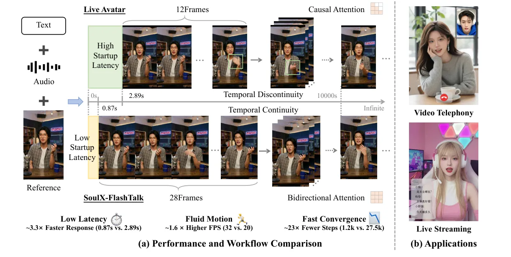
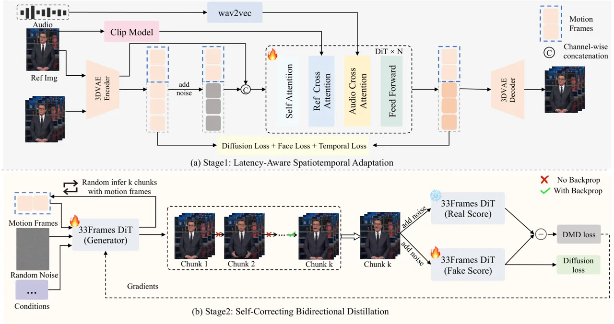
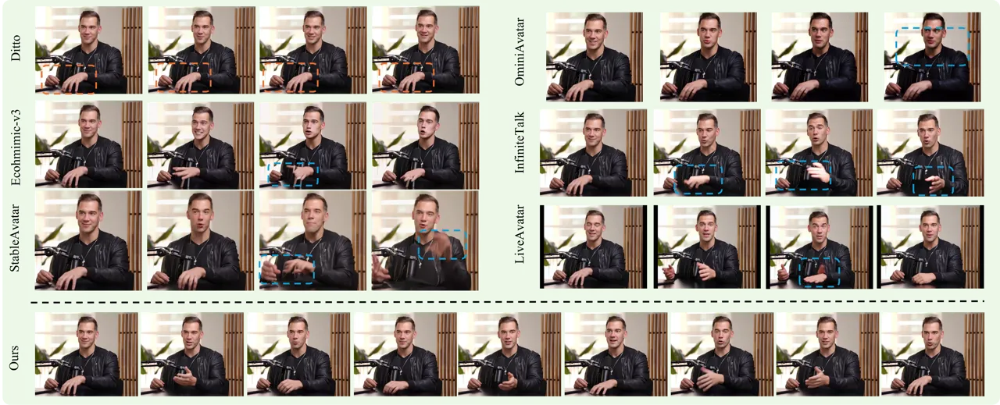
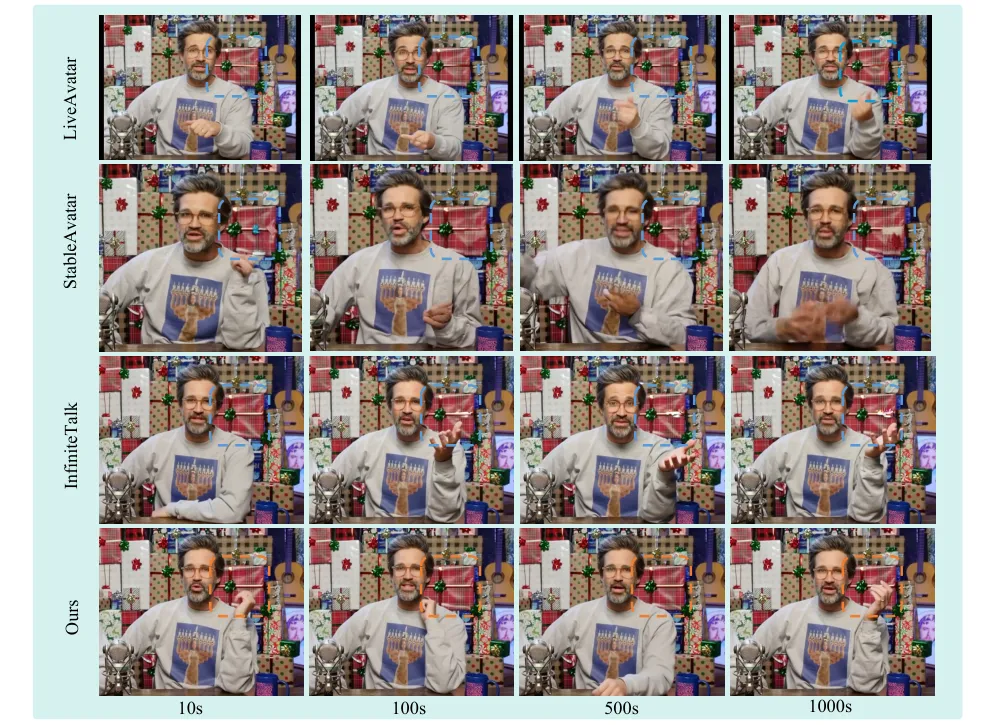
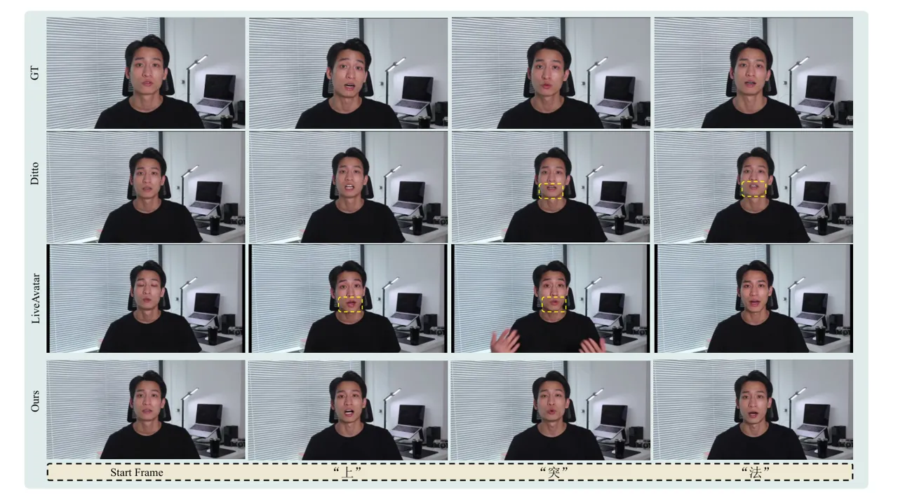
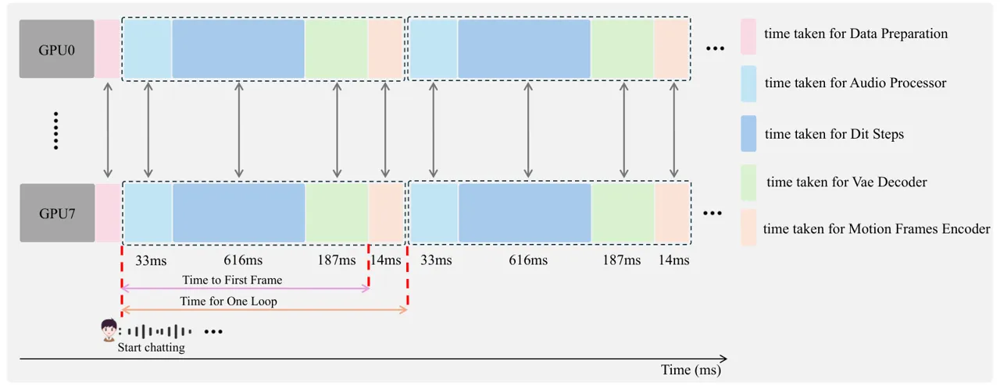

# SoulX-FlashTalk: Real-Time Infinite Streaming of Audio-Driven Avatars via Self-Correcting Bidirectional Distillation

Le Shen ^(†)^(†)thanks: Equal contribution. \$ˆ‡\$Work done during an
internship at Soul AI Lab. le.shen@mail.dhu.edu.cn,
{qiaoqian,yutan}@soulapp.cn Affiliation: AIGC Team, Soul AI Lab, China
Affiliation: Donghua UniversityProject
Page:[https://soul-ailab.github.io/soulx-flashtalk/](https://soul-ailab.github.io/soulx-flashtalk/)
   Qian Qiao^(\*) Affiliation: AIGC Team, Soul AI Lab, China    Tan
Yu^(\*) Affiliation: AIGC Team, Soul AI Lab, China    Ke Zhou
Affiliation: AIGC Team, Soul AI Lab, China    Tianhang Yu
Affiliation: AIGC Team, Soul AI Lab, China    Yu Zhan Affiliation: AIGC
Team, Soul AI Lab, China    Zhenjie Wang Affiliation: Donghua
UniversityProject
Page:[https://soul-ailab.github.io/soulx-flashtalk/](https://soul-ailab.github.io/soulx-flashtalk/)
   Dingcheng Zhen Affiliation: AIGC Team, Soul AI Lab, China    Ming Tao
Affiliation: AIGC Team, Soul AI Lab, China    Shunshun Yin
Affiliation: AIGC Team, Soul AI Lab, China    Siyuan Liu ^(†)^(†)thanks:
Corresponding authors. liusiyuan@soulapp.cn

###### Abstract

Deploying massive diffusion models for real-time, infinite-duration,
audio-driven avatar generation presents a significant engineering
challenge, primarily due to the conflict between computational load and
strict latency constraints. Existing approaches often compromise visual
fidelity by enforcing strictly unidirectional attention mechanisms or
reducing model capacity. To address this problem, we introduce
SoulX-FlashTalk, a 14B-parameter framework optimized for high-fidelity
real-time streaming. Diverging from conventional unidirectional
paradigms, we use a Self-correcting Bidirectional Distillation strategy
that retains bidirectional attention within video chunks. This design
preserves critical spatiotemporal correlations, significantly enhancing
motion coherence and visual detail. To ensure stability during infinite
generation, we incorporate a Multi-step Retrospective Self-Correction
Mechanism, enabling the model to autonomously recover from accumulated
errors and preventing collapse. Furthermore, we engineered a full-stack
inference acceleration suite incorporating hybrid sequence parallelism,
Parallel VAE, and kernel-level optimizations. Extensive evaluations
confirm that SoulX-FlashTalk is the first 14B-scale system to achieve a
sub-second start-up latency (0.87s) while reaching a real-time
throughput of 32 FPS, setting a new standard for high-fidelity
interactive digital human synthesis.

![[Uncaptioned
image]](arxiv-2512-23379--8ec3e8f18726.figures/figure-1.webp)

 

|     |
| --- |
|     |

## 1 Introduction



Figure 1: Performance Overview and Applications of SoulX-FlashTalk. (a)
Performance and Workflow Comparison: Powered by our bidirectional
streaming distillation, SoulX-FlashTalk converges in just 1.2k steps
(reducing training costs by $`\sim`$23$`\times`$ compared to
LiveAvatar), achieves a 0.87s start-up latency ($`\sim`$3.3$`\times`$
faster), and attains fluid motion at 32FPS ($`\sim`$1.6$`\times`$
higher). (b) Applications: Supports real-time interactions, including
Video Telephony and Live Streaming.

Diffusion Transformers (DiTs) (Peebles and Xie, 2023) serve as a
scalable backbone for high-fidelity generative modeling. Building on
this capability, recent large-scale models (Gao et al., 2025; Zhong et
al., 2025; Guo et al., 2024; Yang et al., 2025) have significantly
advanced avatar generation, delivering cinematic quality, detailed
micro-expressions, and natural full-body dynamics. However, deploying
these models for real-time, infinite streaming remains a major
engineering challenge. The primary conflict lies between the high
computational cost required for high-fidelity generation and the strict
low-latency demands of live streaming.

To achieve real-time performance, state-of-the-art approacheslike
LiveAvatar (Huang et al., 2025b) typically employ a
_bidirectional-teacher to unidirectional-student_ distillation strategy,
combined with multi-GPU parallel inference. While effective, this design
requires a complex two-stage training pipeline comprising diffusion
forcing and DMD (Yin et al., 2024)distillation. This process is
computationally expensive and can require up to 27,500 training steps.
More critically, converting the student model to a strictly
unidirectional architecture disrupts the spatiotemporal correlations
inherent in video generation. This structural mismatch often results in
rigid full-body dynamics and a loss of textural detail. Although methods
like Self-Forcing (Huang et al., 2025a) and Self-Forcing++ (Cui et al., 2025) simulate autoregressive inference to mitigate error accumulation,
applying these mechanisms effectively to a large-scale model under
real-time constraints lacks a mature reference solution.

To address these challenges, we introduce SoulX-FlashTalk, a
low-latency, real-time, audio-driven avatar framework built upon a
14B-parameter DiT. Compared with prior approaches, our method offers
substantial advantages across model architecture design, training and
distillation strategy, and inference-time optimization, enabling
high-fidelity avatar generation while meeting the stringent latency
requirements of live streaming.

First, regarding model architecture and generation quality, we diverge
from the strictly unidirectional paradigm by adopting a
_bidirectional-teacher to bidirectional-student_ strategy. We argue that
in chunk-based streaming inference, future information within the
current chunk is available. Therefore, retaining the bidirectional
attention mechanism for intra-chunk processing is not only feasible but
beneficial. This design allows the student model to leverage local
context for motion planning, significantly enhancing full-body coherence
and detail. Crucially, maintaining high architectural alignment between
the teacher and student simplifies the distillation task, avoiding the
performance degradation caused by structural forcing.

Second, in terms of training efficiency, SoulX-FlashTalk streamlines the
time-consuming training paradigm of LiveAvatar (Huang et al., 2025b).
This improvement is enabled by the architectural consistency described
above, which allows us to adopt a lightweight yet effective training
strategy. Latency-Aware Spatiotemporal Adaptation adapts the model to
operate effectively under lower spatial resolutions and shorter temporal
horizons for real-time constraints. Self-Correcting Bidirectional
Distillation further reduces inference steps and eliminates
classifier-free guidance, while introducing a multi-step retrospective
self-correction mechanism inspired by Self-Forcing++ to enable the model
to recover from self-induced deviations and prevents collapse during
long-horizon generation.

Finally, to meet strict real-time streaming requirements with a
large-scale DiTs, we construct a full-stack inference acceleration
solution. By utilizing xDiT’s hybrid sequence parallelism (integrating
Ulysses (Jacobs et al., 2023) and Ring Attention (Liu et al., 2023)), we
achieve an approximate $`5\times`$ speedup for single-step inference on
an $`8`$ GPUs setup. We also address the 3D VAE bottleneck by
introducing the slicing parallel strategy from LightX2V (Contributors,
2025), accelerating encoding/decoding by nearly $`5\times`$.
Furthermore, we tailor our kernel implementations for the Hopper
architecture to fully exploit its hardware capabilities by adopting
FlashAttention3 (Shah et al., 2024). Combined with torch.compile
optimizations, these measures maximize hardware utilization.

As shown in Figure 1(a), our model converges to superior performance
with only 200 distillation steps, yielding an efficiency improvement of
approximately $`23\times`$ over LiveAvatar, which requires 27,500 steps.
Meanwhile, the proposed system achieves a start-up latency of 0.87 s,
about $`3\times`$ faster than prior baselines at 2.89 s. Together with
these gains, this report presents comprehensive ablation studies of the
proposed optimizations, providing practical guidance for the stable
training and real-time deployment of large-scale DiTs.

## 2 SoulX-FlashTalk



Figure 2: Framework Overview. (a) Stage 1: Latency-Aware Spatiotemporal
Adaptation, which adapts the model to operate effectively under lower
spatial resolutions and shorter temporal frames to meet real-time
constraints. (b) Stage 2: Self-Correcting Bidirectional Distillation,
where the generator autoregressively synthesizes $`k`$ chunks
conditioned on past motion frames, while the Real and Fake Score
networks align data distributions through distillation losses.

This section details the core methodology of SoulX-FlashTalk. As
illustrated in Figure 2, our framework is built upon a 14B-parameter DiT
and integrates a two-stage training pipeline with a full-stack inference
acceleration engine. The training protocol progresses from Latency-Aware
Spatiotemporal Adaptation phase to a Self-Correcting Bidirectional
Distillation phase, designed to satisfy both high-fidelity generation
and low-latency streaming requirements.

### 2.1 Model Architecture

The architecture derives from WAN2.1-I2V-14B (Wan et al., 2025) and
InfiniteTalk (Yang et al., 2025), comprising four primary components:

3D VAE. We utilize the WAN2.1 VAE for latent space compression to
facilitate efficient high-resolution video generation. This module
encodes video frames into compact latent representations, achieving a
spatio-temporal downsampling factor of $`4\times 8\times 8`$ across
temporal, height, and width dimensions.

DiT-Based Generator. The core generator adopts the DiT
architecture (Peebles and Xie, 2023). As shown in Figure. 2(a), each DiT
block incorporates a 3D Attention mechanism to model spatio-temporal
dependencies. A unified cross-attention layer conditions the generation
on reference images and textual inputs to preserve visual fidelity and
provide semantic guidance. Furthermore, we integrate a dedicated audio
cross-attention layer to inject speech-driven signals directly into the
generation process.

Conditioning Encoders. The model conditions generation on audio, text,
and reference images. We employ a Wav2Vec model (Baevski et al., 2020)
customized for Chinese speech to transform continuous audio signals into
sequential embeddings. To ensure identity consistency, we extract
semantic representations and visual features $`f_{ref}`$ from the
reference image using CLIP (Radford et al., 2021) and the VAE encoder.
For textual conditioning, we adopt umT5 (Raffel et al., 2020) to support
bilingual captions. These identity and textual conditions are injected
via the cross-attention layers.

Latent Input Formulation. For a given source video, we sample a clip
$`\mathbf{X}_{\text{clean}}`$ of length $`L_{c}`$. The initial $`L_{m}`$
frames serve as motion frames $`\mathbf{X}_{\text{mf}}`$ to capture
historical context, while the subsequent frames function as generation
targets. A reference frame $`\mathbf{X}_{\text{ref}}`$ is randomly
sampled from outside the clip boundaries. All inputs are encoded by the
3D VAE and assembled to form the DiT input $`\mathbf{z}_{\text{in}}`$:

```math
\displaystyle\mathbf{z}_{\text{in}} \displaystyle=\mathbf{z}_{\text{noise}}\|\mathbf{z}_{\text{mask}}\|\mathbf{z}_{\text{cond}},\quad\text{where }\mathbf{z}_{\text{mask}}=\mathbf{1}_{1}\oplus\mathbf{0}_{L_{c}-1}, \tag{1}
```

```math
\displaystyle\mathbf{z}_{\text{noise}} \displaystyle=\mathcal{E}(\mathbf{X}_{\text{mf}})\oplus\psi(\mathcal{E}(\mathbf{X}_{\text{clean}}),t),\quad\mathbf{z}_{\text{cond}}=\mathcal{E}(\mathbf{X}_{\text{ref}}\oplus\mathbf{0}_{L_{c}-1}),
```

where $`\oplus`$ denotes frame-wise concatenation and $`\|`$ denotes
channel-wise concatenation. $`\mathcal{E}(\cdot)`$ represents the 3D VAE
encoder. The stream $`\mathbf{z}_{\text{noise}}`$ combines historical
latents with noisy latents derived by applying the forward diffusion
process $`\psi(\cdot)`$ to $`\mathcal{E}(\mathbf{X}_{\text{clean}})`$ at
timestep $`t`$. The stream $`\mathbf{z}_{\text{cond}}`$ injects
reference guidance, while $`\mathbf{z}_{\text{mask}}`$ identifies
reference frames using a binary indicator. This composite input
structure facilitates bidirectional interaction between historical
motion context and the current generation target, allowing the model to
correct accumulated errors using reference information.

### 2.2 Model Training

To satisfy real-time inference under strict latency constraints, we
employ a two-stage training strategy. Latency-Aware Spatiotemporal
Adaptation adapts the model to reduced spatial resolutions and shorter
frame sequences, while Self-Correcting Bidirectional Distillation
further reduces sampling steps and removes classifier-free guidance (Ho
and Salimans, 2022). This two-stage procedure enables rapid model
responses while preserving high generation quality.

Stage 1: Latency-Aware Spatiotemporal Adaptation

The high computational cost of the 14B-parameter DiT backbone poses a
significant challenge for real-time applications. While the original
InfiniteTalk model delivers high-quality results, its inference latency
on standard hardware is too high for interactive streaming.
Consequently, we adapt the model to function at reduced spatial
resolutions and with shorter frame sequences.

Deploying the pre-trained model directly under these constrained
settings results in poor feature alignment and reduced generation
quality. We address this by performing a dedicated fine-tuning phase
optimized for the target resolution and frame count. During this phase,
we apply a dynamic aspect-ratio bucketing strategy to organize training
samples efficiently, reducing data loss from padding or cropping. This
process enables the 14B model to recover fine details and maintain
identity consistency, even at lower resolutions.

Stage 2: Self-Correcting Bidirectional Distillation

Multi-step sampling and classifier-free guidance create significant
computational overhead. We adopt the DMD framework (Yin et al., 2024) to
compress the sampling steps and eliminate the need for guidance,
enabling real-time streaming.

The framework aims to minimize the distributional discrepancy between
the original teacher model and the distilled student model at each time
step $`t`$, using the Kullback–Leibler (KL) divergence as the
optimization criterion. The resulting training objective is formulated
as:

```math
\nabla_{\theta}\mathcal{L}_{\text{DMD}}=-\mathbb{E}_{t,\mathbf{z}}\left[\left(s_{\text{real}}(\psi(G_{\theta}(z),t),t)-s_{\text{fake}}(\psi(G_{\theta}(z),t),t)\right)\frac{\partial G_{\theta}(\mathbf{z})}{\partial\theta}\right], \tag{2}
```

Where, $`s_{real}(\cdot)`$ is frozen to model the teacher distribution,
while $`s_{fake}(\cdot)`$ is trainable and tracks the evolving student
distribution. The student generator $`G_{\theta}(\cdot)`$ produces
samples via few-step inference without classifier-free guidance. All
components are initialized from the Stage-1 SFT model.

Standard DMD does not address error accumulation or identity drift in
long-form videos. Inspired by Self-Forcing++ (Cui et al., 2025), we
introduce Self-Correcting Bidirectional Distillation, which incorporates
a multi-step retrospective self-correction mechanism to explicitly
simulate error propagation during long-horizon generation. Specifically,
the generator is required to autoregressively synthesize $`K`$
consecutive chunks, where each chunk is conditioned on the previously
generated motion frame rather than the ground truth.

To balance computational efficiency and training stability, we further
propose a Stochastic Truncation Strategy. Instead of synthesizing all
$`K`$ chunks, we randomly sample a smaller value $`k<K`$ and generate
only the first $`k`$ chunks. During backpropagation, a denoising step
$`t^{\prime}`$ is randomly sampled from the $`T`$ reduced sampling
steps, and gradients are retained _only_ for the $`t^{\prime}`$-th
denoising step of the $`k`$-th chunk, while all other steps are detached
from the computational graph. This stochastic truncation yields a
memory-efficient yet unbiased approximation of the full training
objective, which can be expressed as:

```math
\nabla_{\theta}\mathcal{L}=\mathbb{E}_{k\sim\mathcal{U}(1,K),\,t^{\prime}\sim\mathcal{U}(1,T)}\left[\nabla_{\theta}\,\mathcal{L}_{\text{DMD}}\!\left(G^{(k,t^{\prime})}_{\theta}(\mathbf{z})\right)\right], \tag{3}
```

where $`G^{(k,t^{\prime})}_{\theta}(\mathbf{z})`$ denotes the model
output at the $`t^{\prime}`$-th denoising step of the $`k`$-th chunk,
and all preceding chunks and denoising steps are detached from the
computational graph during backpropagation.

Following this two-stage training strategy, SoulX-FlashTalk achieves
state-of-the-art performance in both inference speed and generation
quality compared to existing audio-driven video generation models.

### 2.3 Real-time Inference Acceleration

Purely optimizing training and inference in isolation is insufficient to
fully satisfy stringent low-latency requirements. To achieve sub-second
latency with the 14B-parameter model, we implement a full-stack
acceleration suite specifically designed for 8-H800 node.

The core computational bottleneck lies within the DiT’s massive
attention operations. To dismantle this barrier, we deploy Hybrid
Sequence Parallelism powered by xDiT. By synergizing Ulysses and Ring
Attention mechanisms, we effectively distribute the attention workload,
yielding a substantial 5$`\times`$ speedup in single-step inference
compared to standard implementations. Furthermore, we optimize the DiT
at the kernel level by adopting FlashAttention3, which is specifically
designed to leverage the NVIDIA Hopper architecture, including its
asynchronous execution pipeline. This enables improved overlap between
data movement and computation, resulting in an additional 20% reduction
in attention latency compared to FlashAttention2.

As DiT inference becomes sufficiently accelerated, the computational
overhead of the high-resolution VAE decoder emerges as the dominant
latency factor. To address this paradigm shift, we introduce 3D VAE
Parallelism to mitigate the decoding burden. By employing slicing-based
strategies to distribute spatial decoding workloads across GPUs, we
achieve an approximate 5$`\times`$ acceleration in VAE processing,
ensuring that it does not become a pipeline bottleneck.

Finally, to eliminate overhead from the Python runtime and fragmented
kernel execution, the entire inference pipeline is unified and optimized
via torch.compile. This enables aggressive graph-level fusion and memory
optimization, maximizing the hardware utilization limits of the H800
node.

### 2.4 Architectural Analysis: Why Bidirectional?

Although autoregressive models dominate streaming video generation,
their inherent unidirectional dependency fundamentally constrains the
modeling of global temporal structure. Under this paradigm, models
primarily condition on historical frames and typically avoid strict
frame-by-frame synthesis. Instead, generation is performed in minimal
chunks to improve local consistency, where bidirectional attention is
applied within each chunk, while unidirectional dependencies are
enforced across chunks. However, this compromise remains insufficient to
prevent temporal inconsistency, error accumulation, and identity drift,
particularly in long-horizon generation.

We argue that, for the target task, incorporating long histories is not
the primary bottleneck. Rather, effectively suppressing temporal drift
and accumulated errors is of greater importance. Motivated by this
observation, we fully preserve the bidirectional attention mechanism of
the original model, consistently allowing all-to-all information
exchange among frames. This design enables the model to jointly leverage
past and implicit future context, resulting in more accurate and
coherent generation at each step, while remaining fully aligned with the
teacher architecture, thereby significantly accelerating model training.

Such bidirectional modeling not only substantially improves
spatio-temporal coherence within individual chunks, but also provides a
more robust and high-quality fundamental unit for streaming generation,
thereby effectively mitigating drift and collapse issues in
long-sequence video generation as a whole.

## 3 Experiment

Implementation. We build our model upon the InfiniteTalk architecture,
optimizing it to satisfy real-time constraints. The training pipeline
begins with a lightweight Supervised Fine-Tuning (SFT) phase of
$`1,000`$ steps to adapt the model to the reduced spatial resolutions
and frame counts required for streaming. The subsequent distillation
phase converges within $`200`$ steps. We adhere to the Self-Forcing
training paradigm, setting learning rates to $`2\times 10^{-6}`$ for the
Generator and $`4\times 10^{-7}`$ for the Fake Score Network with a 1:5
update ratio. To simulate error accumulation in long-horizon generation,
the Generator synthesizes up to $`K=5`$ consecutive chunks during
distillation. To accommodate variable aspect ratios in real-world data,
we employ a bucketing strategy across both SFT and distillation stages.
All experiments utilize a cluster of 32 NVIDIA H20 GPUs with a per-GPU
batch size of 1. We enable efficient training of the 14B-parameter model
under these hardware constraints via Fully Sharded Data Parallel
(FSDP) (Zhao et al., 2023), gradient checkpointing, and mixed-precision
training.

Datasets. We source training and evaluation data from the public
SpeakerVid-5M (Zhang et al., 2025) and TalkVid (Chen et al., 2025)
datasets, ensuring no overlap between training and test splits. To
evaluate model performance, we construct a dedicated benchmark named
TalkBench. This benchmark comprises two subsets: TalkBench-Short, which
contains 100 samples with durations under 10 seconds, and
TalkBench-Long, which consists of 20 samples exceeding 5 minutes.

Evaluation Metrics. We use the Q-Align visual-language model (Wu et al., 2023) for Image Quality Assessment (IQA) and Aesthetics Score Evaluation
(ASE). Lip-audio synchronization is measured via Sync-C and Sync-D
metrics (Chung and Zisserman, 2016). Furthermore, we adopt VBench (Huang
et al., 2024) to evaluate temporal quality, covering Subject Consistency
(Subject-C), Background Consistency (BG-C), Motion Smoothness
(Motion-S), and Temporal Flickering (Temporal-F).

### 3.1 Performance of SoulX-FlashTalk

SoulX-FlashTalk against state-of-the-art audio-driven generation models,
including Ditto (Li et al., 2025), EchoMimic-V3 (Meng et al., 2025),
StableAvatar (Tu et al., 2025), OmniAvatar (Gan et al., 2025),
InfiniteTalk (Yang et al., 2025), and LiveAvatar (Huang et al., 2025b).

#### 3.1.1 Quantitative Analysis

|         |                                      |                  |                  |                    |                      |                        |                  |                      |                        |                  |
| ------- | ------------------------------------ | ---------------- | ---------------- | ------------------ | -------------------- | ---------------------- | ---------------- | -------------------- | ---------------------- | ---------------- |
| Dataset | Model                                | Metrics          |                  |                    |                      |                        |                  |                      |                        |                  |
|         |                                      | ASE $`\uparrow`$ | IQA $`\uparrow`$ | Sync-C$`\uparrow`$ | Sync-D$`\downarrow`$ | Subject-C $`\uparrow`$ | BG-C$`\uparrow`$ | Motion-S$`\uparrow`$ | Temporal-F$`\uparrow`$ | FPS $`\uparrow`$ |
| Short   | Ditto^(∗) (Li et al., 2025)          | 3.10             | 4.37             | 1.04               | 12.58                | 99.80                  | 99.23            | 99.75                | 99.86                  | 21.80            |
|         | Echomimic-V3 (Meng et al., 2025)     | 3.45             | 4.70             | 0.89               | 12.81                | 98.75                  | 95.98            | 99.54                | 99.44                  | 0.53             |
|         | StableAvatar (Tu et al., 2025)       | 3.05             | 3.01             | 0.78               | 12.12                | 98.34                  | 96.46            | 99.44                | 99.06                  | 0.64             |
|         | OminiAvatar (Gan et al., 2025)       | 3.06             | 3.01             | 1.32               | 11.85                | 98.64                  | 96.95            | 99.60                | 99.66                  | 0.16             |
|         | LiveAvatar^(∗) (Huang et al., 2025b) | 3.10             | 3.25             | 1.01               | 12.10                | 98.27                  | 97.48            | 99.25                | 98.86                  | 20.88            |
|         | Infinitetalk^(△) (Yang et al., 2025) | 3.09             | 3.04             | 1.25               | 11.89                | 98.71                  | 97.04            | 99.54                | 99.34                  | 5.10             |
|         | SoulX-FlashTalk^(∗) (Ours)           | 3.51             | 4.79             | 1.47               | 11.56                | 99.22                  | 98.10            | 99.61                | 99.52                  | 32.00            |
| Long    | Ditto^(∗) (Li et al., 2025)          | 3.11             | 3.03             | 0.83               | 13.45                | 99.80                  | 99.23            | 99.76                | 99.89                  | 0.53             |
|         | StableAvatar (Tu et al., 2025)       | 3.11             | 3.02             | 0.70               | 12.73                | 98.38                  | 96.42            | 99.42                | 98.99                  | 0.64             |
|         | OmniAvatar (Gan et al., 2025)        | 2.92             | 2.82             | 0.99               | 12.80                | 85.42                  | 86.59            | 99.61                | 99.57                  | 0.16             |
|         | LiveAvatar^(∗) (Huang et al., 2025b) | 3.15             | 3.06             | 0.96               | 12.73                | 98.19                  | 97.39            | 99.26                | 98.87                  | 20.88            |
|         | InfiniteTalk^(△) (Yang et al., 2025) | 3.12             | 3.03             | 1.51               | 12.28                | 98.97                  | 97.32            | 99.59                | 99.50                  | 5.10             |
|         | SoulX-FlashTalk^(∗) (Ours)           | 3.12             | 3.04             | 1.61               | 12.25                | 99.29                  | 98.36            | 99.63                | 99.58                  | 32.00            |

Table 1: Quantitative comparison of SoulX-FlashTalk and state-of-the-art
methods on TalkBench-Short ($`10`$ s) and TalkBench-Long ($`>5`$ min).
Models marked with ^(∗) support real-time inference, and ^(△) denotes
the LoRA version.

Table. 1 compares SoulX-FlashTalk with state-of-the-art methods on the
TalkBench-Short and TalkBench-Long datasets.

On the short-video benchmark, SoulX-FlashTalk achieves the highest
scores in visual quality and synchronization. Specifically, it records
an ASE of $`3.51`$ and an IQA of $`4.79`$, surpassing the previous best
performer, Echomimic-V3, which scored $`3.45`$ and $`4.70`$
respectively. In terms of lip-sync precision, our model attains a Sync-C
score of $`1.47`$, outperforming the $`1.32`$ score of OmniAvatar. For
inference speed, the system achieves a throughput of $`32`$ FPS on a
14B-parameter model. This exceeds the real-time requirement of $`25`$
FPS and significantly outperforms the $`20.88`$ FPS recorded by
LiveAvatar.

Regarding temporal consistency metrics such as Subject-C and BG-C, Ditto
records the highest values across both datasets, including a Subject-C
of $`99.80`$. This performance is attributed to Ditto’s generation
paradigm which inpaints only the facial region while keeping the
background and torso pixel-wise static. While this approach maximizes
stability scores, it precludes the generation of full-body dynamics.
SoulX-FlashTalk is designed to synthesize audio-driven full-body motion
which naturally introduces greater pixel variance. Despite this
increased complexity, it maintains a Subject-C score of $`99.22`$,
demonstrating a balance between motion expressiveness and temporal
stability.

For long-form generation, we assess robustness through synchronization
retention. SoulX-FlashTalk achieves a Sync-C of $`1.61`$ and a Sync-D of
$`12.25`$. These scores are better than InfiniteTalk and LiveAvatar.
Additionally, the model sustains a throughput of $`32`$ FPS in
long-duration tasks. These results confirm that the bidirectional
distillation strategy effectively reduces the desynchronization and
drift often found in unidirectional streaming models.

#### 3.1.2 Qualitative Analysis

This section presents a qualitative assessment of SoulX-FlashTalk,
focusing on generation fidelity, long-term stability, and lip-sync
precision.



Figure 3: Visual quality comparison on 5-second video generation. Orange
boxes highlight static hand poses in Ditto, while blue boxes highlight
significant artifacts (e.g., hand distortion, over-exposure) in
baselines. In contrast, SoulX-FlashTalk eliminates these artifacts,
demonstrating superior structural integrity and detail fidelity.

Visual Fidelity and Detail Preservation. Figure. 3 compares the visual
quality of 5-second video generations. Baseline models demonstrate
significant struggles with plausible dynamics during large limb
movements. Ditto fails to synthesize meaningful hand motion, with poses
remaining static throughout the sequence, as highlighted in orange.
Echomimic-v3 and StableAvatar exhibit structural distortions and
artifacts in hand regions, marked in blue. InfiniteTalk suffers from
hand over-exposure and excessive motion blur during rapid gestures. In
contrast, SoulX-FlashTalk leverages its 14B DiT architecture and
bidirectional attention mechanism to eliminate these artifacts. It
synthesizes clear, structurally sound hand movements with sharp
textures, avoiding the issues observed in baselines. Furthermore, our
method surpasses LiveAvatar in background consistency and identity
fidelity.



Figure 4: Qualitative evaluation of long-term stability. Comparison
across $`10`$s to $`1000`$s reveals structural collapse in baselines
(blue boxes) versus the sustained robustness of SoulX-FlashTalk (orange
boxes), which preserves sharp details even after 1000 seconds of
continuous generation.

Stability in Infinite Generation. Figure. 4 evaluates generation
stability over continuous sequences extending to 1000 seconds. Baseline
models, including LiveAvatar, StableAvatar, and InfiniteTalk, suffer
from significant error accumulation over time. As indicated by the blue
boxes, these methods exhibit severe texture blurring and loss of detail
in background regions. SoulX-FlashTalk mitigates error propagation
through bidirectional streaming distillation and its self-correction
mechanism. As shown in the orange boxes, our model preserves consistent
facial geometry and sharp background details at the 1000-second mark,
verifying its robustness for infinite streaming.

Fine-grained Lip-sync Precision. Figure. 5 assesses lip-sync fidelity
during specific Chinese phonetic articulations. Baseline methods
struggle with complex phonemes, exhibiting structural misalignment. As
highlighted by the yellow dashed boxes, during the articulation of
characters such as “上” (shàng) and “突” (tū), competitors fail to match
the mouth aperture and shape of the Ground Truth (GT), resulting in
visible distortions. Conversely, SoulX-FlashTalk captures these
fine-grained phonemic dynamics, yielding lip geometries that are
rigorously aligned with the GT. This precision minimizes lip-sync drift
and stiffness, ensuring visual authenticity across different languages.



Figure 5: Qualitative comparison of lip-sync precision on Chinese
pronunciations. Yellow dashed boxes indicate lip shape distortions in
baseline methods for characters “上”, “突” and, “法” , whereas our
method achieves high alignment with the Ground Truth (GT).

|          |          |                  |      |                  |      |                    |      |                       |       |                                  |
| -------- | -------- | ---------------- | ---- | ---------------- | ---- | ------------------ | ---- | --------------------- | ----- | -------------------------------- |
| Strategy |          | ASE $`\uparrow`$ |      | IQA $`\uparrow`$ |      | Syn-C $`\uparrow`$ |      | Sync-D $`\downarrow`$ |       | Training Cost (h) $`\downarrow`$ |
|          |          | short            | long | short            | long | short              | long | short                 | long  |                                  |
| Fixed    | $`K=1`$  | 3.42             | 3.08 | 4.69             | 2.99 | 1.39               | 1.12 | 11.79                 | 12.47 | 2.33                             |
|          | $`K=3`$  | 3.47             | 3.09 | 4.75             | 3.00 | 1.39               | 1.59 | 11.69                 | 12.02 | 4.40                             |
|          | $`K=5`$  | 3.50             | 3.10 | 4.79             | 3.01 | 1.35               | 1.44 | 11.87                 | 12.33 | 6.40                             |
| Random   | \[1, 5\] | 3.51             | 3.12 | 4.79             | 3.04 | 1.47               | 1.61 | 11.56                 | 12.25 | 4.40                             |

Table 2: Ablation study on chunk generation strategies during
distillation.

### 3.2 Distillation Ablations

#### 3.2.1 Impact of Multi-step Retrospective Self-Correction

We analyze how the number of generated chunks $`K`$ and scheduling
strategies affect long-term stability. We compare fixed chunk strategies
where $`K`$ equals $`1`$, $`3`$, or $`5`$ against a Random Strategy that
samples $`K`$ from $`1`$ to $`5`$ during training.

Table. 2 indicates that training with a single chunk $`K=1`$ yields the
lowest training cost of $`2.33`$ hours but fails to maintain long-term
stability. This is evidenced by a low Sync-C score of $`1.12`$ on long
videos, confirming the issue of error accumulation. Increasing $`K`$ to
$`3`$ improves stability significantly. However, further increasing
$`K`$ to 5 raises the training cost to $`6.40`$ hours without delivering
proportional gains in synchronization performance. The Random strategy
achieves the best overall balance. It attains the highest Long Sync-C
score of $`1.61`$ and optimal visual quality metrics while maintaining a
moderate training cost of $`4.40`$ hours. This demonstrates that
exposing the model to varying autoregressive lengths during distillation
effectively improves robustness against accumulated errors.

|                      |                |           |                  |                  |                     |                       |
| -------------------- | -------------- | --------- | ---------------- | ---------------- | ------------------- | --------------------- |
| Motion Source        | Noise Strategy |           | Metrics          |                  |                     |                       |
|                      | Add Noise      | Calc Loss | ASE $`\uparrow`$ | IQA $`\uparrow`$ | Sync-C $`\uparrow`$ | Sync-D $`\downarrow`$ |
| Ground Truth Latents | ✗              | ✗         | 3.46             | 4.75             | 1.43                | 11.68                 |
| Ground Truth Latents | ✓              | ✗         | 3.48             | 4.77             | 1.34                | 11.82                 |
| Predicted Latents    | ✗              | ✗         | 3.46             | 4.75             | 1.43                | 11.68                 |
| Predicted Latents    | ✓              | ✗         | 3.51             | 4.79             | 1.47                | 11.56                 |
| Predicted Latents    | ✓              | ✓         | 3.48             | 4.77             | 1.35                | 11.94                 |

Table 3: Ablation on the conditioning of motion latents in the Real
Score Network.

#### 3.2.2 Impact of Motion Latent Conditioning in DMD

We examine the conditioning of the Real Score network across three
dimensions: the source of motion latents, noise injection, and loss
computation. Table. 3 shows that using student-predicted motion latents
yields better visual quality than using Ground Truth (GT) latents.
Specifically, the Predicted strategy with noise achieves an ASE of
$`3.51`$ and an IQA of $`4.79`$, surpassing the GT configuration which
scores $`3.48`$ and $`4.77`$. This indicates that using predicted
latents helps reduce the disparity between training and inference.

Regarding noise and loss, injecting noise into predicted latents
improves performance, raising ASE from $`3.46`$ to $`3.51`$. Conversely,
including motion latents in the loss computation lowers the ASE to
$`3.48`$. This suggests that requiring the model to reconstruct
conditioning frames diverts focus from the primary denoising task. Thus,
the configuration of Predicted Latents with Noise Injection and No Loss
delivers the optimal results.

### 3.3 Inference Latency Analysis

|                      |        |        |                   |                  |
| -------------------- | ------ | ------ | ----------------- | ---------------- |
| GPUs                 | VAE    |        | DiT               |                  |
|                      | Encode | Decode | w/o torch.compile | w/ torch.compile |
| 1                    | 97     | 988    | 1070              | 800              |
| 2                    | 69     | 690    | 620               | 490              |
| 4                    | 39     | 350    | 313               | 261              |
| 8                    | 21     | 192    | 193               | 154              |
|    -w/ torch.compile | 14     | 187    |                   |                  |

Table 4: Inference latency breakdown across varying GPU counts (Unit:
ms).

In this section, we analyze component-wise latency on a single-node
system with varying numbers of NVIDIA H800 GPUs. The experimental setup
targets high-fidelity streaming at a resolution of $`720\times 416`$
with 4-step denoising. Each clip comprises 33 frames, including 28
generated frames and 5 motion frames. Under this configuration, the
pipeline achieves a throughput of up to 32 FPS.



Figure 6: Detailed inference latency breakdown on 8 NVIDIA H800 GPUs.

The latency of the VAE and DiT is first examined to highlight the
necessity of multi-GPU parallelism, as summarized in Table 4. On a
single GPU, DiT inference alone incurs a latency of $`1070`$ ms per
step, while VAE inference requires $`97`$ ms for motion frames encoding
and $`988`$ ms for generated frames decoding.

When scaling to 8 GPUs, DiT and VAE are parallelized using xDiT’s hybrid
sequence parallelism and LightX2V’s slicing-based parallel strategy,
respectively. Due to inter-GPU communication overhead, the acceleration
is slightly sub-linear, resulting in an overall speedup of nearly
$`5\times`$. Concretely, DiT latency is reduced from $`1070`$ ms to
$`193`$ ms, VAE encoding from $`97`$ ms to $`21`$ ms, and decoding from
$`988`$ ms to $`192`$ ms. Additional latency reductions are achieved by
enabling torch.compile.

Building upon the core component optimizations, we report the end-to-end
pipeline latency on an 8 $`\times`$ H800 GPU cluster in Figure. 6.
During the steady-state generation loop, the total latency per cycle is
$`876`$ ms, of which audio processing takes $`33`$ ms, the core 4-step
DiT denoising accounts for $`616`$ ms, frame decoding consumes $`187`$
ms, and motion-frame encoding requires $`14`$ ms. The remaining latency
is attributed to miscellaneous overheads. By achieving sub-second
end-to-end latency, the proposed pipeline meets the stringent throughput
requirements of real-time streaming.

## 4 Conclusion and Future Work

We presented SoulX-FlashTalk, a framework designed to meet real-time
requirements while maintaining high-quality video synthesis. Integrating
Bidirectional Streaming Distillation with a Multi-step Self-Correction
mechanism allows our 14B-parameter DiT model to sustain stable,
infinite-length streaming on an 8$`\times`$H800 cluster. Our approach
also simplifies training. We demonstrate that complex multi-stage
pre-training is not required. A brief SFT phase followed by distribution
matching distillation suffices to achieve state-of-the-art performance.
We are open-sourcing this solution to serve as a practical baseline for
the community.

Future work will prioritize model efficiency over system scaling. We
intend to explore pruning, quantization, and optimized attention
mechanisms. The objective is to deploy these models on consumer-grade
hardware, eliminating the dependency on expensive computing clusters.

## 5 Ethics Statement

This research aims to advance digital human synthesis for beneficial
applications. We confirm that all datasets utilized in this study are
derived from publicly accessible academic repositories. The visual
demonstrations presented in this report are fully synthetic and do not
contain the Personally Identifiable Information (PII) of private
individuals.

We acknowledge the dual-use nature of high-fidelity video generation
technology and the potential risks associated with its misuse, such as
the creation of deepfakes or the spread of misinformation. We firmly
condemn any malicious application of this technology and advocate for
the principles of Responsible AI. To mitigate these risks, we support
the development of robust forgery detection algorithms and the
implementation of invisible watermarking mechanisms to ensure content
transparency and traceability. We remain committed to adhering to
ethical guidelines and ensuring that our contributions promote the safe
and positive evolution of the field.

## 6 Project Contributions

All contributors are listed in no particular order.

- •
  Project Sponsor: Ming Tao, Shunshun Yin
- •
  Project Leader: Siyuan Liu
- •
  Algorithm: Le Shen, Qian Qiao, Tan Yu
- •
  Deployment & Acceleration: Ke Zhou, Tianhang Yu, Yu Zhan
- •
  Data & Evaluation: Tan Yu, Tianhang Yu, Dingcheng Zhen

## References

- Baevski et al. (2020) A. Baevski, Y. Zhou, A. Mohamed, and M. Auli
  Wav2vec 2.0: a framework for self-supervised learning of speech
  representations. Advances in neural information processing systems 33,
  pp. 12449–12460. Cited by: §2.1.
- Chen et al. (2025) S. Chen, H. Huang, Y. Liu, Z. Ye, P. Chen, C.
  Zhu, M. Guan, R. Wang, J. Chen, G. Li, S. Lim, H. Yang, and B. Wang
  TalkVid: a large-scale diversified dataset for audio-driven talking
  head synthesis. External Links: 2508.13618,
  [Link](https://arxiv.org/abs/2508.13618) Cited by: §3.
- Chung and Zisserman (2016) J. S. Chung and A. Zisserman Out of time:
  automated lip sync in the wild. In Asian conference on computer
  vision, pp. 251–263. Cited by: §3.
- Contributors (2025) L. Contributors LightX2V: light video generation
  inference framework. GitHub. Note:
  [https://github.com/ModelTC/lightx2v](https://github.com/ModelTC/lightx2v)
  Cited by: §1.
- Cui et al. (2025) J. Cui, J. Wu, M. Li, T. Yang, X. Li, R. Wang, A.
  Bai, Y. Ban, and C. Hsieh Self-forcing++: towards minute-scale
  high-quality video generation. arXiv preprint arXiv:2510.02283. Cited
  by: §1, §2.2.
- Gan et al. (2025) Q. Gan, R. Yang, J. Zhu, S. Xue, and S. Hoi
  OmniAvatar: efficient audio-driven avatar video generation with
  adaptive body animation. arXiv preprint arXiv:2506.18866. Cited by:
  §3.1, Table 1, Table 1.
- Gao et al. (2025) X. Gao, L. Hu, S. Hu, M. Huang, C. Ji, D. Meng, J.
  Qi, P. Qiao, Z. Shen, Y. Song, et al. Wan-s2v: audio-driven cinematic
  video generation. arXiv preprint arXiv:2508.18621. Cited by: §1.
- Guo et al. (2024) J. Guo, D. Zhang, X. Liu, Z. Zhong, Y. Zhang, P.
  Wan, and D. Zhang Liveportrait: efficient portrait animation with
  stitching and retargeting control. arXiv preprint arXiv:2407.03168.
  Cited by: §1.
- Ho and Salimans (2022) J. Ho and T. Salimans Classifier-free diffusion
  guidance. arXiv preprint arXiv:2207.12598. Cited by: §2.2.
- Huang et al. (2025a) X. Huang, Z. Li, G. He, M. Zhou, and E. Shechtman
  Self forcing: bridging the train-test gap in autoregressive video
  diffusion. arXiv preprint arXiv:2506.08009. Cited by: §1.
- Huang et al. (2025b) Y. Huang, H. Guo, F. Wu, S. Zhang, S. Huang, Q.
  Gan, L. Liu, S. Zhao, E. Chen, J. Liu, et al. Live avatar: streaming
  real-time audio-driven avatar generation with infinite length. arXiv
  preprint arXiv:2512.04677. Cited by: §1, §1, §3.1, Table 1, Table 1.
- Huang et al. (2024) Z. Huang, Y. He, J. Yu, F. Zhang, C. Si, Y.
  Jiang, Y. Zhang, T. Wu, Q. Jin, N. Chanpaisit, Y. Wang, X. Chen, L.
  Wang, D. Lin, Y. Qiao, and Z. Liu VBench: comprehensive benchmark
  suite for video generative models. In Proceedings of the IEEE/CVF
  Conference on Computer Vision and Pattern Recognition, Cited by: §3.
- Jacobs et al. (2023) S. A. Jacobs, M. Tanaka, C. Zhang, M.
  Zhang, S. L. Song, S. Rajbhandari, and Y. He Deepspeed ulysses: system
  optimizations for enabling training of extreme long sequence
  transformer models. arXiv preprint arXiv:2309.14509. Cited by: §1.
- Li et al. (2025) T. Li, R. Zheng, M. Yang, J. Chen, and M. Yang Ditto:
  motion-space diffusion for controllable realtime talking head
  synthesis. In Proceedings of the 33rd ACM International Conference on
  Multimedia, pp. 9704–9713. Cited by: §3.1, Table 1, Table 1.
- Liu et al. (2023) H. Liu, M. Zaharia, and P. Abbeel Ring attention
  with blockwise transformers for near-infinite context. arXiv preprint
  arXiv:2310.01889. Cited by: §1.
- Meng et al. (2025) R. Meng, Y. Wang, W. Wu, R. Zheng, Y. Li, and C. Ma
  Echomimicv3: 1.3 b parameters are all you need for unified multi-modal
  and multi-task human animation. arXiv preprint arXiv:2507.03905. Cited
  by: §3.1, Table 1.
- Peebles and Xie (2023) W. Peebles and S. Xie Scalable diffusion models
  with transformers. In Proceedings of the IEEE/CVF international
  conference on computer vision, pp. 4195–4205. Cited by: §1, §2.1.
- Radford et al. (2021) A. Radford, J. W. Kim, C. Hallacy, A. Ramesh, G.
  Goh, S. Agarwal, G. Sastry, A. Askell, P. Mishkin, J. Clark, G.
  Krueger, and I. Sutskever Learning transferable visual models from
  natural language supervision. In Proceedings of the 38th International
  Conference on Machine Learning, ICML 2021, 18-24 July 2021, Virtual
  Event, M. Meila and T. Zhang (Eds.), Proceedings of Machine Learning
  Research, Vol. 139, pp. 8748–8763. External Links:
  [Link](http://proceedings.mlr.press/v139/radford21a.html) Cited by:
  §2.1.
- Raffel et al. (2020) C. Raffel, N. Shazeer, A. Roberts, K. Lee, S.
  Narang, M. Matena, Y. Zhou, W. Li, and P. J. Liu Exploring the limits
  of transfer learning with a unified text-to-text transformer. J.
  Mach. Learn. Res. 21, pp. 140:1–140:67. External Links:
  [Link](https://jmlr.org/papers/v21/20-074.html) Cited by: §2.1.
- Shah et al. (2024) J. Shah, G. Bikshandi, Y. Zhang, V. Thakkar, P.
  Ramani, and T. Dao Flashattention-3: fast and accurate attention with
  asynchrony and low-precision. Advances in Neural Information
  Processing Systems 37, pp. 68658–68685. Cited by: §1.
- Tu et al. (2025) S. Tu, Y. Pan, Y. Huang, X. Han, Z. Xing, Q. Dai, C.
  Luo, Z. Wu, and Y. Jiang Stableavatar: infinite-length audio-driven
  avatar video generation. arXiv preprint arXiv:2508.08248. Cited by:
  §3.1, Table 1, Table 1.
- Wan et al. (2025) T. Wan, A. Wang, B. Ai, B. Wen, C. Mao, C. Xie, D.
  Chen, F. Yu, H. Zhao, J. Yang, et al. Wan: open and advanced
  large-scale video generative models. arXiv preprint arXiv:2503.20314.
  Cited by: §2.1.
- Wu et al. (2023) H. Wu, Z. Zhang, W. Zhang, C. Chen, L. Liao, C.
  Li, Y. Gao, A. Wang, E. Zhang, W. Sun, et al. Q-align: teaching lmms
  for visual scoring via discrete text-defined levels. arXiv preprint
  arXiv:2312.17090. Cited by: §3.
- Yang et al. (2025) S. Yang, Z. Kong, F. Gao, M. Cheng, X. Liu, Y.
  Zhang, Z. Kang, W. Luo, X. Cai, R. He, et al. Infinitetalk:
  audio-driven video generation for sparse-frame video dubbing. arXiv
  preprint arXiv:2508.14033. Cited by: §1, §2.1, §3.1, Table 1, Table 1.
- Yin et al. (2024) T. Yin, M. Gharbi, R. Zhang, E. Shechtman, F.
  Durand, W. T. Freeman, and T. Park One-step diffusion with
  distribution matching distillation. In Proceedings of the IEEE/CVF
  conference on computer vision and pattern recognition, pp. 6613–6623.
  Cited by: §1, §2.2.
- Zhang et al. (2025) Y. Zhang, Z. Li, D. Wang, J. Zhang, D. Zhou, Z.
  Yin, X. Dai, G. Yu, and X. Li SpeakerVid-5m: a large-scale
  high-quality dataset for audio-visual dyadic interactive human
  generation. arXiv preprint arXiv:2507.09862. Cited by: §3.
- Zhao et al. (2023) Y. Zhao, A. Gu, R. Varma, L. Luo, C. Huang, M.
  Xu, L. Wright, H. Shojanazeri, M. Ott, S. Shleifer, et al. Pytorch
  fsdp: experiences on scaling fully sharded data parallel. arXiv
  preprint arXiv:2304.11277. Cited by: §3.
- Zhong et al. (2025) Z. Zhong, Y. Ji, Z. Kong, Y. Liu, J. Wang, J.
  Feng, L. Liu, X. Wang, Y. Li, Y. She, et al. AnyTalker: scaling
  multi-person talking video generation with interactivity refinement.
  arXiv preprint arXiv:2511.23475. Cited by: §1.
