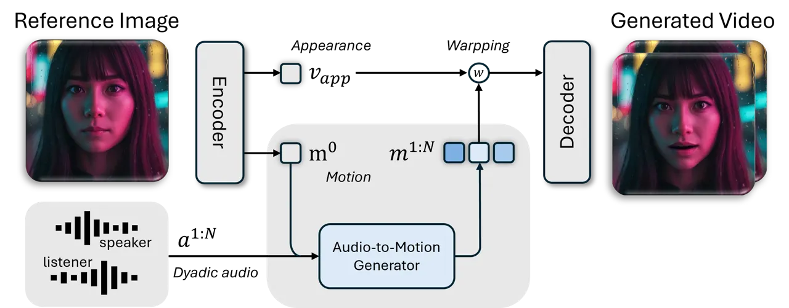
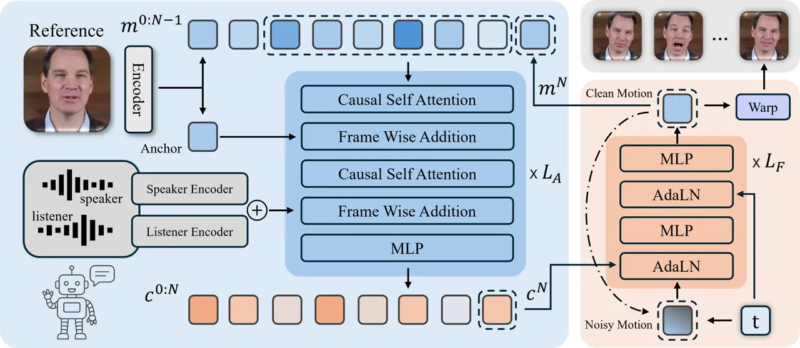
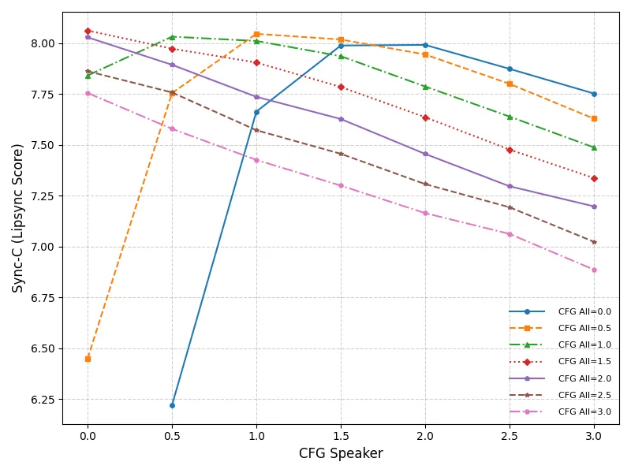
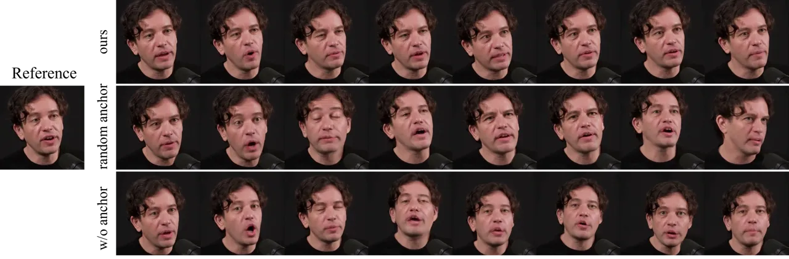
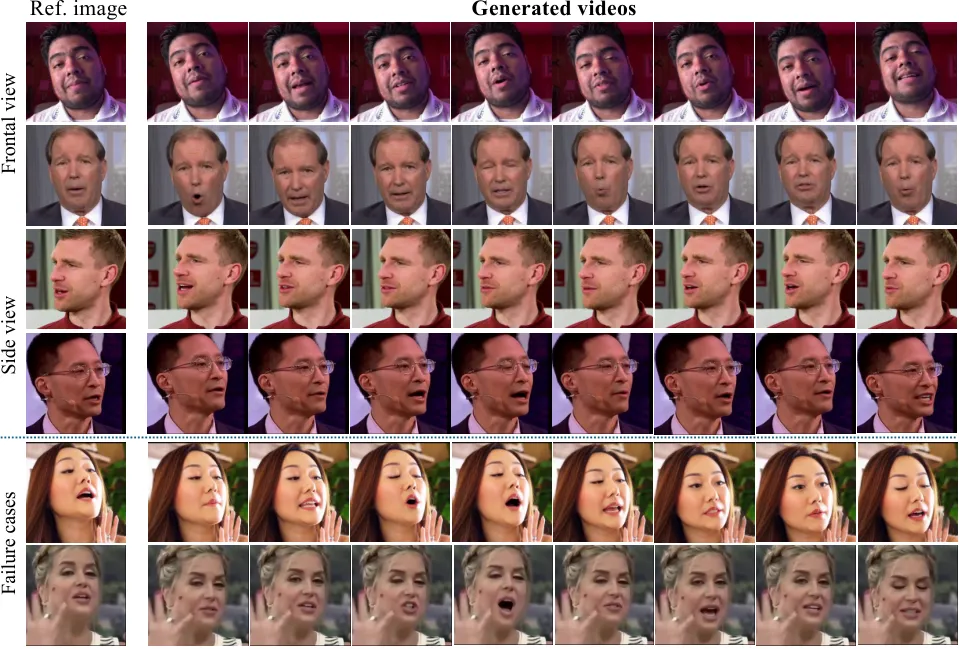

# DyStream: Streaming Dyadic Talking Heads Generation via Flow Matching-based Autoregressive Model

Bohong Chen Affiliation: Zhejiang University    Haiyang Liu
Affiliation: The University of
Tokyo[https://robinwitch.github.io/DyStream-Page](https://robinwitch.github.io/DyStream-Page)

###### Abstract

Generating realistic, dyadic talking head video requires ultra-low
latency. Existing chunk-based methods require full non-causal context
windows, introducing significant delays. This high latency critically
prevents the immediate, non-verbal feedback required for a realistic
listener. To address this, we present DyStream, a flow matching-based
autoregressive model that could generate video in real-time from both
speaker and listener audio. Our method contains two key designs: (1) we
adopt a stream-friendly autoregressive framework with flow-matching
heads for probabilistic modeling, and (2) We propose a causal encoder
enhanced by a lookahead module to incorporate short future context
(e.g., 60 ms) to improve quality while maintaining low latency. Our
analysis shows this simple-and-effective method significantly surpass
alternative causal strategies, including distillation and generative
encoder. Extensive experiments show that DyStream could generate video
within 34 ms per frame, guaranteeing the entire system latency remains
under 100 ms. Besides, it achieves state-of-the-art lip-sync quality,
with offline and online LipSync Confidence scores of 8.13 and 7.61 on
HDTF, respectively. The model, weights and codes are available.

## 1 Introduction

Recent breakthroughs in full-duplex speech generation systems \[61, 11\]
have paved the way for highly interactive, streaming AI agents. However,
these speech-only agents lack a visual presence, limiting their
application in areas like education, sales, and virtual companionship.
Bridging this gap requires a model that can generate real-time
talking-head video from a single image and the streaming dual-track
audio source.



Figure 1: System pipeline. DyStream generates talking-head videos from a
single reference image and dyadic stream. First, an Autoencoder
disentangles the reference image into a static appearance feature
$`\mathbf{v}_{app}`$ and an initial, identity-agnostic motion feature
$`\mathbf{m}^{0}`$. Next, the Audio-to-Motion Generator takes the
initial motion $`\mathbf{m}^{0}`$ and the audio stream as input to
generate a new sequence of audio-aligned motion features
$`\mathbf{m}^{1:N}`$. Finally, the Autoencoder’s decoder synthesizes the
output video by warping the appearance feature $`\mathbf{v}_{app}`$
according to the generated motion sequence $`\mathbf{m}^{1:N}`$.

Current state-of-the-art approaches \[78\] have primarily focused on
exploring offline solutions. These systems, typically based on
two-stage, chunk-by-chunk models, achieve good generation quality.
However, their design requires the entire audio chunk’s content before
generation begin, introduces a fundamental latency problem. This
accumulated latency, often hundreds of milliseconds, is acceptable when
the agent is speaking but becomes a critical bottleneck when it needs to
act as an active listener. A listener must react instantaneously to the
user’s speech with subtle non-verbal cues like nods and facial
expressions to create a sense of engagement. The inherent delay in
chunk-based systems limits their performance on immediate, naturalistic
responses.

To address the latency issue, we propose a new flow-matching based
autoregressive model, DyStream. It accepts a streaming, dual-track audio
input—capturing both the user’s speech and the agent’s own generated
speech—and generates the corresponding talking head video
frame-by-frame. This autoregressive (AR) architecture fundamentally
reduces the latency bottleneck and could generate a listener response
with one-token latency in theory.

However, achieving high-fidelity lip synchronization in this causal,
frame-by-frame manner is challenging. As human speech involves
anticipatory coarticulation, where mouth movements prepare for upcoming
phonemes slightly before the sound is produced. This makes it difficult
for a purely causal model, without future information, to generate
accurate lip shapes. To solve this, we design a causal audio encoder
with a minimal audio lookahead module. Specifically, the model generates
the current video frame by conditioning on an extremely short segment of
future audio (e.g., 60ms). Crucially, this lookahead duration is
designed to be shorter than the typical packet size of streaming audio
APIs (e.g.,  100ms from the OpenAI Realtime API). This ensures that our
system can process an entire incoming audio packet and generate the
corresponding video before the next packet arrives, thus achieving
system-level real-time performance and operating seamlessly within a
streaming infrastructure. In addition, we analyzed alternative causal
encoder designs, such as distillation and generative encoders, and found
the lookahead module to be simple yet effective.

With the above designs, our system achieves state-of-the-art lip-sync
quality, with offline and online LipSync Confidence scores of 8.13 and
7.61 on HDTF, respectively. Furthermore, it ensures an immediate and
fluid interactive experience by processing any incoming audio packet
within 40ms. This level of responsiveness makes our model suitable for
creating interactive visual agents that can not only speak but also
listen. Our contributions can be summarized as follows:

- •
  We propose a new flow-matching based autoregressive model that
  generates talking head videos frame-by-frame, theoretically reducing
  the generation latency compared to previous chunk-based methods.
- •
  We introduce a causal audio encoder with a minimal audio lookahead
  mechanism (e.g., 60ms) and demonstrate it is simple yet effective for
  enabling high-quality lip-sync while maintaining system-level
  real-time responsiveness.
- •
  Our method achieves state-of-the-art performance in lip-sync accuracy
  and guarantees a generation latency under 34ms.

## 2 Related Work

#### Video Diffusion-based Talking Heads Generation

A prominent approach involves finetuning a pre-trained image-to-video
(I2V) model to align the generated video content with an audio
condition, mainly for achieving accurate lip synchronization \[55, 65,
28, 32, 6, 64, 77, 2, 31, 21, 74, 17, 70, 68, 34, 33, 46, 3, 41, 53, 60,
7\]. Early works in this domain were often based on U-Net architectures
from Stable Diffusion \[48\]. For instance, EMO \[55\] integrates audio
conditions via an additional cross-attention layer, while Loopy \[28\]
designs a past-frame compression scheme to better support longer video
generation. More recent works have shifted towards Transformer-based
backbones (DiT), such as Hallo \[65\], HunyuanVideo-Avatar \[6\], and
MOCHA \[64\], which largely follow the cross-attention mechanism to
inject audio features. While all these methods demonstrate high-quality
results with few artifacts and strong generalization, they suffer from
high computational costs and slow inference speeds.

#### Two-Stage Warp-based Talking Heads Generation

Two-stage methods aim to first predict disentangled appearance and
motion representations from audio, and then use these representations to
warp a source image \[13, 12, 66, 78, 38, 76, 71, 63, 45, 23, 4, 16, 14,
50, 35, 73, 36, 19\]. Representative works such as MegaPortraits \[13\],
VASA \[66\], and INFP \[78\] have explored various designs for a robust,
identity-agnostic facial motion space. Recent variants further improve
flexibility and style controllability, including OmniTalker \[63\], and
ChatAnyone \[45\]. For the audio-to-motion stage, they typically adopt a
chunk by chunk diffusion strategy. However, the requirement of the
entire audio chunk’s content leads to a latency problem. Different with
them, we introduce a flow-matching based autoregressive model to
guarantee one token latency in theory.

#### Dyadic Talking Heads Generation

The early approaches in dyadic talking heads generation typically
treated conversations as multi-turn exchanges, where the agent acted as
either a speaker or listener in each turn. MultiDialog \[44\] generated
speaker behaviors conditioned on the user’s previous utterance, but
failed to produce synchronized listener reactions. To jointly model both
roles, ViCo-X \[75\] proposes a Role Switcher bridging separate
generators for speaker and listener, but the explicit switching often
caused unnatural transitions. DIM \[56\] pretrained a unified model to
capture dyadic context but still required manual role assignment during
adaptation. AgentAvatar \[58\] synthesized photo-realistic avatars
driven by textual descriptions, but its motions lacked precise audio
alignment. Recent person-specific studies \[52, 43, 24, 67\] achieve
high realism but perform limited on unseen identities. In contrast to
these approaches, which often rely on explicit role-switching rules,
multiple expert models, or offline processing of dual audio tracks, our
method is designed for online, streaming applications. We utilize a
single, unified model to generate both speaker and listener behaviors
concurrently from dual-track audio inputs.



Figure 2: The architecture of our audio-to-motion generator. Our model
comprises two core modules: an autoregressive network (blue) and a flow
matching head (orange). The autoregressive network, built from causal
self-attention and MLP blocks, processes the audio, anchor, and previous
motion inputs to generate a conditioning signal $`c^{N}`$. This signal
is fed into the flow matching head, a stack of MLPs and AdaLN layers.
Here, it is injected via AdaLN to guide a multi-step flow matching
process to produce the final motion $`m^{N}`$. Finally, the newly
generated motion $`m^{N}`$ is used to warp the reference image into the
output frame, while simultaneously being fed back into the
autoregressive network as input for the subsequent generation.

## 3 Methodology

Given a single image and a streaming dyadic audio signal, our method
generates streaming talking-head videos. It is based on a two-stage
framework. The first stage disentangles appearance and motion from the
source image using an off-the-shelf model based on LIA \[62\], which we
briefly review in Section 3.1. The second stage implements
audio-to-motion generation using a flow matching-based autoregressive
model, as detailed in Section 3.2. Furthermore, to facilitate real-time
responsiveness, we design a causal audio encoder with a lookahead module
(Section 3.3) to minimize its reliance on future audio frames.

### 3.1 Motion-aware Autoencoder

The first stage contains an Autoencoder (AE) to disentangle a source
image $`\mathbf{I}_{s}`$ into two distinct representations: a static
appearance feature $`\mathbf{v}_{app}`$ that encodes the subject’s
identity, and a dynamic motion feature $`\mathbf{m}`$ that describes the
pose and expression. Conceptually, this AE includes: an appearance
encoder ($`\mathcal{E}_{app}`$), a motion encoder ($`\mathcal{E}_{m}`$),
a flow estimator ($`\mathcal{F}`$), and a final decoder
($`\mathcal{D}_{vae}`$). These components are trained jointly in a
self-supervised manner, using a video reconstruction task that
reconstruct a driving video by combining the appearance from a source
image with the motion from the driving video itself. In our
implementation, we adopt the architecture and training objective from
LivePortrait \[18\] and LIA \[62\].

First, the motion encoder $`\mathcal{E}_{m}`$ extracts a source motion
feature $`\mathbf{m}_{s}`$ from the source image $`\mathbf{I}_{s}`$, and
a sequence of driving motion features $`\mathbf{m}^{1:N}_{dri}`$ from a
driving video $`\mathcal{V}_{dri}`$.

```math
\mathbf{m}_{s}=\mathcal{E}_{m}(\mathbf{I}_{s}),\quad\mathbf{v}_{app}=\mathcal{E}_{app}(\mathbf{I}_{s}),\quad\mathbf{m}^{1:N}_{dri}=\mathcal{E}_{m}(\mathcal{V}_{dri}) \tag{1}
```

Subsequently, a motion flow estimator $`\mathcal{F}`$ predicts a dense
flow field $`\mathbf{F}_{s\rightarrow d}`$ from the motion features. The
decoder $`\mathcal{D}_{vae}`$ then synthesizes the final video frames
$`\hat{\mathbf{I}}^{1:N}_{pred}`$ by warping the source appearance
feature $`\mathbf{v}_{app}`$ with this flow field.

```math
\mathbf{F}_{s\rightarrow d}=\mathcal{F}(\mathbf{m}_{s},\mathbf{m}^{1:N}_{dri});\quad\hat{\mathbf{I}}^{1:N}_{pred}=\mathcal{D}_{vae}(\text{Warp}(\mathbf{v}_{app},\mathbf{F}_{s\rightarrow d})) \tag{2}
```

The module is trained with a composite loss function
$`\mathcal{L}_{AE}`$ combining reconstruction, adversarial, perceptual,
cycle consistency, and gaze direction losses. More details are provided
in Appendix A.

### 3.2 Flow matching-based Autoregressive Model

The second stage employs an Audio-Driven Motion Generation Transformer,
which we denote as $`\mathcal{D}_{\theta}`$. This model generates a
sequence of motion latents $`\mathbf{m}^{1:N}`$ conditioned on a
corresponding dyadic audio feature sequence $`\mathbf{a}^{1:N}`$ and the
initial motion latent $`\mathbf{m}_{s}`$ extracted from the source
image.

#### Model Architecture.

As shown in Figure 2, the core architecture of our network is a
combination of a flow matching head and an autoregressive (AR) model.
Motivated by \[30\], the AR model regresses the continuous,
deterministic feature, and a single frame-level flow matching head is
for stochastic modeling. Specifically, the feature from the AR model,
along with the denoising timestep and noise, are fed as conditions for
the flow matching head. The denoised clean motion latent is then fed to
the AR model for next-frame generation.

#### Implementation Details.

For the AR model, we adapt the 1D Transformer block design from Wan2.1
\[57\]. A key change is our use of block-independent projections for
timestamp embeddings instead of the original shared projections. The
flow matching head is composed of stacked MLPs. For audio conditioning,
the dyadic audio feature is from the concatenation of encoded speaker
and listener audio features. We adopt a customized Wav2Vec2 \[1\] as an
audio encoder; the details are in Section 3.3. As shown in Figure 2, we
leverage linear interpolation to align with the temporal dimension of
the motion features, and fuse the audio feature via element-wise
addition. We found that this is similar to a cross-attention with a
diagonal attention mask, which shows better performance in our case.

#### Anchor Conditioning for Anti-Drifting.

As an inherently frame-by-frame autoregressive model, our approach
inevitably faces error accumulation during long-sequence generation. The
subject’s head position gradually drifts from its initial location in
the reference image, causing severe artifacts and a decline in visual
quality. Considering that our inference procedure generates only one new
frame per forward pass in the sliding window—with previously generated
frames serving as historical context—we introduce a corresponding
modification to the training strategy. Specifically, during training, we
randomly select one frame from the last ten frames of the sequence to
serve as the appearance anchor during training. During inference,
however, we consistently use only the initial reference frame as the
anchor. This randomized anchor training strategy effectively mitigating
pose drift during autoregressive generation.

#### Training and Inference.

For training, we adopt the $`{m}_{0}`$-prediction objective, where the
model learns to predict the clean motion latent $`\mathbf{m}_{0}`$ from
its noised version $`\mathbf{m}_{t}`$. The loss function is formulated
as:

```math
\mathcal{L}_{\text{flow}}=\mathbb{E}_{t,\boldsymbol{\epsilon}}\left[\|\mathcal{D}_{\theta}(\mathbf{m}_{t},t,\mathbf{c})-\mathbf{m}_{0}\|^{2}\right] \tag{3}
```

where
$`\mathbf{m}_{t}=(1-\sigma_{t})\mathbf{m}_{0}+\sigma_{t}\boldsymbol{\epsilon}`$
with $`t\sim\mathcal{U}[0,1]`$ and
$`\boldsymbol{\epsilon}\sim\mathcal{N}(\mathbf{0},\mathbf{I})`$. The
conditioning signal $`\mathbf{c}`$ is the output from AR model.

During inference, we compute the velocity field from the predicted
$`\hat{\mathbf{m}}_{0}`$ and integrate using an Euler-based ODE solver.
To enable fine-grained control, we employ a multi-conditional guidance
strategy. Let
$`\hat{\mathbf{m}}(\mathbf{c}_{S},\mathbf{c}_{L},\mathbf{c}_{R})=\mathbf{m}_{\theta}(\mathbf{m}_{t},t,\mathbf{c}_{S},\mathbf{c}_{L},\mathbf{c}_{R})`$
denote the model’s prediction given the speaker ($`\mathbf{S}`$),
listener ($`\mathbf{L}`$), and anchor ($`\mathbf{R}`$) conditions. The
unconditional prediction is
$`\hat{\mathbf{m}}_{\text{uncond}}=\hat{\mathbf{m}}(\mathbf{0},\mathbf{0},\mathbf{0})`$.

The final guided prediction $`\mathbf{m}_{\text{cond}}`$ is computed by
rearranging the standard CFG formulation:

```math
\begin{split}\mathbf{m}_{\text{cond}}={}&(1-w_{\Sigma})\hat{\mathbf{m}}_{\text{uncond}}+w_{s}\hat{\mathbf{m}}(\mathbf{S},\mathbf{0},\mathbf{0})\\
&+w_{l}\hat{\mathbf{m}}(\mathbf{0},\mathbf{L},\mathbf{0})+w_{r}\hat{\mathbf{m}}(\mathbf{0},\mathbf{0},\mathbf{R})\\
&+w_{\text{all}}\hat{\mathbf{m}}(\mathbf{S},\mathbf{L},\mathbf{R}),\end{split} \tag{4}
```

where $`w_{s},w_{l},w_{r},`$ and $`w_{\text{all}}`$ are the respective
guidance scales, and $`w_{\Sigma}=w_{s}+w_{l}+w_{r}+w_{\text{all}}`$.

Besides, we maintain a sliding window of N frames matching the training
length. Initially, the first N-1 frames are set to static motion with
the corresponding dyadic audio input to predict the next frame. We then
shift the window by removing the oldest frame and appending the newly
generated frame, repeating this process autoregressively to generate the
entire sequence frame by frame.

### 3.3 Make It Realtime with Customized Wav2Vec2

While current models could generate video in a causal frame-by-frame
manner in theory, their lipsync performance is limited with a
straightforward implementation. A primary reason is that standard audio
encoders, such as Wav2Vec2 \[1\], typically require non-causal context
to extract current features. This leads to severe feature degradation
when causality is enforced during inference. As shown in Table 3, the
model’s audio-lip synchronization improves as the current audio frame
can access more future audio frames. To solve this, we customize a
causal Wav2Vec2 with a minimal lookahead module, restricting its
receptive field to a maximum of $`n`$ future audio frames.

To implement this causal Wav2Vec2, we introduce two key modifications to
eliminate its inherent non-causal operations. First, the standard
architecture utilizes GroupNorm in its initial convolutional layer.
Since GroupNorm computes statistics across the entire input sequence, it
introduces a dependency on future frames. We replace it with LayerNorm,
which operates independently at each timestep, thus ensuring causality.
Second, a more significant source of non-causality lies in its
positional encoding, implemented as a convolution with a large kernel
size of $`128`$. This layer inherently accesses up to $`64`$ future
frames (a 1.28-second lookahead). We therefore remove this convolutional
positional encoding entirely and instead integrate Rotary Positional
Embeddings (RoPE) \[51\] into the Transformer attention layers.

These modifications are important to remove implicit, hard-coded
lookaheads from the architecture. As a result, the model’s temporal
receptive field is governed solely by the attention mask. This grants us
precise and explicit control over the amount of future audio context the
model can access.

We then decide the number of lookahead frames based on the demands of
real-time processing. For instance, systems like the OpenAI Realtime
API \[26\] deliver audio in 100ms chunks. Our target video generation
rate is 25 fps, which corresponds to one video frame per 40ms of audio.
By configuring our modified audio encoder to access an additional 60ms
or less of future audio, we can generate a video frame immediately upon
receiving the first 100ms audio segment, thereby incurring no additional
latency. This lookahead is implemented by adjusting the attention mask
inside our customized Wav2Vec2.

In contrast, for the listener part, we adopt a different approach. The
average human reaction time in a conversation is approximately 300
milliseconds \[40\]. Unlike a speaker, a listener may not require future
audio context to determine precise lip movements. Therefore, for the
listener’s audio encoder, we implement a purely causal attention mask.
This ensures that the model’s responses are generated based only on past
and current audio information.

#### Training Details.

Our training strategy for the Rope-Wav2Vec2 models differs based on
their attention mechanism. The Rope-Wav2Vec2 model with a full attention
mask is trained from scratch, using the same pre-training task as the
original Wav2Vec2. Subsequently, for the variant with restricted
attention, we do not train it from scratch. Instead, we employ knowledge
distillation, using the pre-trained full-attention model as the teacher
to train the restricted-attention model. These final distilled models
are then used for our generation task.

## 4 Experiments

### 4.1 Implementation Details

#### Architecture.

Our model has three components: an Autoencoder (AE), an Autoregressive
model, and a Flow matching Head, with 110M, 182M, and 80M parameters,
respectively. The Autoregressive model consists of 12 blocks, each with
a hidden dimension of 768 and 8 attention heads. The Flowmatching Head
is composed of 6 blocks, also featuring a hidden dimension of 768.

#### Autoencoder Training.

We train the AE using the AdamW optimizer \[37\] with a learning rate of
1e-5 and a batch size of 48. The dimension of the latent motion codes is
set to 512. The AE is trained for a total of 150,000 iterations on H200.

#### Autoregressive Flow Matching Training.

We apply a dropout of 0.5 to the speaker and listener audio, and 0.1 to
the reference anchor. For inference, we employ a 5-step Euler ODE
sampler and utilize Classifier-Free Guidance (CFG) \[20\], as described
in Equation 4, with guidance weights set to $`w_{all}=1.0`$,
$`w_{s}=0.5`$, $`w_{l}=0.5`$, and $`w_{r}=0.5`$. The model is trained
for 120,000 iterations using the AdamW optimizer with a learning rate of
2e-5 and a global batch size of 64, and costs 12 hours on a single H200.

### 4.2 Dataset

We use two types of data for our experiments: public datasets and an
additional colloected dataset. Our data preprocessing pipeline is
similar to that of LatentSync \[29\]. The core steps include detecting
and cropping face regions from raw videos, followed by filtering out
clips with low SyncNet \[8\] scores to ensure data quality. All data are
finally processed into talking-head-only videos at a resolution of
$`512\times 512`$, matching the input size of our model. We use two
public datasets, HDTF \[72\] and Realtalk \[15\]. After processing, our
open-source training set contains approximately 50k video clips, each
with a duration of about 8 seconds. Our colloected dataset contains
approximately 100k clips of human faces, processed using the same
pipeline. This dataset is used exclusively as an additional training
source to improve model robustness and is not used for evaluation. The
AE is trained on both datasets and the Audio-to-Motion Transformer is
trained on Open-Source Datasets only. All videos are resampled to 25FPS.

### 4.3 Evaluation of Speaker

We first compare all methods in offline version in Sec. 4.3, 4.4 and
4.5, i.e., the audio feature are encoded in once via audio encoder (the
encoder could see the future audio). Then discuss the online version in
Sec 4.6.

We focus on automated, no-reference metrics for evaluation in this
subsection. Metrics that require a ground-truth video are discussed in
our ablation studies. Following the evaluation protocol of recent video
generation benchmarks \[25\], we evaluate our method across four key
dimensions: lip-sync quality \[8\], content similarity \[47\], image
quality \[25\], motion dynamics \[25\]. The specific metrics used to
quantify each dimension are detailed in Appendix.

We compare DyStream with several representative or state-of-the-art
talking-head generation models: SadTalker \[71\], Real3DPortrait \[69\],
Hallo3 \[9\], Sonic \[27\], and our reproduced INFP \[78\]. For
evaluation, we construct a unified test set by randomly sampling $`100`$
clips each from the HDTF and our internal datasets, these clips were
filtered out from training. All input faces are cropped and resized to
$`512\times 512`$.

To ensure a fair and comprehensive comparison, we establish two
additional baselines specifically designed for frame-by-frame
generation. The first, which we denote as INFP-I (INFP-Inpainting), is
an adaptation of our reproduced INFP baseline. We modify its
chunk-by-chunk framework: for a fixed chunk size $`k=32`$, we decrease
the number of generated frames to $`n`$ and use $`k-n`$ frames as past
context. We tested $`n\in\{1,2,4,8\}`$, which corresponds to latencies
of $`\{40,80,160,320\}`$ ms, respectively, in our 25 FPS setting. It is
important to note that this strategy must be consistently applied during
both training and inference; applying it only at inference time to a
model trained on full chunks results in severe temporal instability and
jitter. The second baseline is a deterministic ablation of our own
proposed method. We achieve this by removing the flow matching head from
our architecture. This transforms our probabilistic model into a
deterministic one that autoregressively predicts the motion frame by
frame.



Figure 3: Effect of classifier-free guidance (CFG) on lipsync
performance. We evaluate Sync-C across a grid of CFG All and CFG
Speaker.

The lip-sync performance is mainly determined by the guidance weights
$`w_{all}`$ and $`w_{s}`$. As shown in Figure 3, we empirically found
that optimal performance is typically achieved when their sum,
$`w_{all}+w_{s}`$, is approximately 1.5. Therefore, we set
$`w_{all}=1.0`$ and $`w_{s}=0.5`$ as the chosen hyperparameters for our
model.

|                                | Sync-C$`\uparrow`$ | CS$`\uparrow`$ | Quality$`\uparrow`$ | Dynamic$`\uparrow`$ |
| ------------------------------ | ------------------ | -------------- | ------------------- | ------------------- |
| GroundTruth                    | 7.614              | 0.928          | 0.642               | 0.660               |
| Hallo3 \[9\]                   | 6.814              | 0.915          | 0.638               | 0.870               |
| Sonic \[27\]                   | 8.495              | 0.935          | 0.626               | 0.600               |
| SadTalker \[71\]               | 6.704              | 0.965          | 0.697               | 0.080               |
| Real3DPortrait \[69\]          | 6.811              | 0.943          | 0.637               | 0.030               |
| INFP\* \[78\]                  | 6.894              | 0.909          | 0.643               | 0.950               |
| INFP_I\* (latency $`40`$ ms)   | 1.718              | 0.877          | 0.630               | 0.580               |
| INFP_I\* (latency $`80`$ ms)   | 3.112              | 0.897          | 0.655               | 0.270               |
| INFP_I\* (latency $`160`$ ms)  | 5.335              | 0.939          | 0.644               | 0.040               |
| INFP_I\* (latency $`320`$ ms)  | 6.637              | 0.945          | 0.638               | 0.210               |
| Ours                           | 8.136              | 0.947          | 0.642               | 0.580               |
| Ours (w/o Flow Matching Head)  | 7.867              | 0.940          | 0.643               | 0.680               |
| Ours (w/o Frame Wise Addition) | 7.660              | 0.925          | 0.648               | 0.470               |
| Ours (latency $`40`$ ms)       | 6.896              | 0.937          | 0.647               | 0.570               |
| Ours (latency $`80`$ ms)       | 7.671              | 0.959          | 0.645               | 0.520               |

Table 1: Comparison with existing methods. We compare our method with
state-of-the-art video diffusion models (slower) and other warp-based
methods (faster) on the HDTF-100 test set. $`*`$ denotes our reproduced
version. Latency means the reaction time to the most recent incoming
audio.

### 4.4 Evaluation of Listener

To quantitatively evaluate the listener performance, we conduct
evaluations on the RealTalk test set, which comprises $`38`$ videos
ranging from $`3`$ to $`14`$ seconds in length. We compare our method
against our own reproduced of INFP. The evaluation relies on facial
expression coefficients (Exp) and head poses (Pose) extracted using
MediaPipe \[39\]. We employ four key metrics: Fréchet Distance (FD) and
Mean Squared Error (MSE) to measure the realism and accuracy of the
generated motions, and two metrics to evaluate diversity: Variance (Var)
and SI Diversity (SID). For SID, we follow the methodology of \[42\],
which assesses the diversity of facial and head motions by applying
k-means clustering (with $`k=40`$ for expression and k=20 for rotation)
on ground truth and then calculating the entropy of the resulting
histogram of cluster IDs within each sequence.

|               |                  |       |                   |       |                 |       |                 |       |
| ------------- | ---------------- | ----- | ----------------- | ----- | --------------- | ----- | --------------- | ----- |
| Method        | FD$`\downarrow`$ |       | MSE$`\downarrow`$ |       | SID$`\uparrow`$ |       | Var$`\uparrow`$ |       |
|               | Exp              | Pose  | Exp               | Pose  | Exp             | Pose  | Exp             | Pose  |
| INFP \[78\]   | 0.141            | 3.158 | 0.019             | 1.286 | 4.263           | 2.562 | 0.185           | 0.200 |
| Ours          | 0.074            | 3.192 | 0.018             | 1.636 | 4.586           | 3.070 | 0.275           | 0.596 |
| Ours (w/o fm) | 0.079            | 3.236 | 0.020             | 1.472 | 4.570           | 2.896 | 0.246           | 0.556 |
| Ours (80ms)   | 0.069            | 3.489 | 0.019             | 1.503 | 4.602           | 2.831 | 0.263           | 0.338 |

Table 2: Quantitative comparison on FD, MSE, SID and Var for expression
(Exp) and pose (Pose). Lower FD/MSE and higher SID/Var are better.

### 4.5 Ablation Study

#### Feature Frame Wise Addition.

We inject dyadic audio and anchor information via direct, frame-wise
addition along the temporal dimension, instead of the cross-attention
mechanism. As shown in Tables 1 and  4, this approach yields better
lip-sync performance. The suggests for this task, the audio feature
within a local window is enough for lip-syncing. Furthermore, by
replacing computationally expensive cross-attention with simple
addition, we achieve a 23.1% increase in inference speed.

#### Anchor Frame Selection.

The anchor frame is crucial for mitigating pose drift in long-sequence
autoregressive generation. We designed an ablation study with three
settings: (1) our method, where the anchor is randomly sampled from the
last 10 frames of the training sequence, (2) an anchor frame randomly
sampled from the entire sequence, and (3) no anchor. As shown in
Figure 4, our approach proves most effective at preventing pose drift
over long generation periods.



Figure 4: Ablation Study on Anchor Frame Selection Strategy. Visual
comparison of long-sequence generation results using the same input
audio and initial reference image. The rows from top to bottom
correspond to three different anchor selection strategies used during
training: our method (anchor sampled from the last 10 frames), a random
anchor, and no anchor.

#### Flow Matching Head.

By removing the flow matching head, our model is converted into a
deterministic autoregressive model. As detailed in Tables 1 and 2, the
listener mode shows a notable decrease in motion diversity, as the model
loses its ability to generate varied, stochastic reactions. In contrast,
the speaker mode’s performance degrades only marginally. We hypothesize
this is because the listener mode is a more pronounced one-to-many
mapping, where stochastic modeling provides a clear benefit.

|                             |                     |            |                     |
| --------------------------- | ------------------- | ---------- | ------------------- |
| Wav Encoder                 | Lookahead Time (ms) |            | Sync-C $`\uparrow`$ |
|                             | Train               | Inference  |                     |
| Wav2vec2 \[1\]              | $`\infty`$          | $`\infty`$ | 8.114               |
| Wav2vec2 (random init)      | $`\infty`$          | $`\infty`$ | 4.568               |
| Wav2vec2 (freeze)           | $`\infty`$          | $`\infty`$ | 6.037               |
| Rope-Wav2vec2               | $`\infty`$          | $`\infty`$ | 8.136               |
| Hubert \[22\]               | $`\infty`$          | $`\infty`$ | 8.007               |
| Wavlm \[5\]                 | $`\infty`$          | $`\infty`$ | 7.719               |
| Wav2vec \[49\]              | 0                   | 0          | 1.761               |
| Mimi \[11\]                 | 0                   | 0          | 5.628               |
| Encodec(24KHz) \[10\]       | 0                   | 0          | 2.034               |
| Rope-Wav2vec2               | $`\infty`$          | $`\infty`$ | 8.136               |
| Rope-Wav2vec2 (w/o distill) | 0                   | 0          | 2.861               |
| Rope-Wav2vec2 (w. distill)  | 0                   | 0          | 3.017               |
| Rope-Wav2vec (lookahead)    | 0                   | 0          | 3.017               |
|                             | 20                  | 20         | 5.976               |
|                             | 40                  | 40         | 6.896               |
|                             | 60                  | 60         | 7.387               |
|                             | 80                  | 80         | 7.671               |
| Rope-Wav2vec2-VAE           | 0                   | 0          | 3.495               |

Table 3: Comparison of different Wav encoders. $`\infty`$ and $`0`$
denotes full-attention and pure-causal architecture, respectively. Top
to bottom: (1) different pretrained full-attention wav encoder performs
similar; (2) all pure-causal wav encoder show limited performance; (3)
training with distillation from full-attention version could slightly
improve the results; (4) lookahead improves the performance of
Rope-Wav2vec2 (w. distill) (5) training Rope-Wav2vec2 with VAE style
generation loss have a limited improvement, suggest that lookahead is
simple yet effective.

|                |      |       |        |                    |
| -------------- | ---- | ----- | ------ | ------------------ |
| Method         | Step | FPS   | APD(s) | Sync-C$`\uparrow`$ |
| INFP           | 5    | 21.27 | 1.0070 | 6.104              |
| INFP           | 10   | 11.37 | 1.0479 | 6.381              |
| Ours           | 1    | 38.46 | 0.0262 | 7.165              |
| Ours           | 5    | 29.24 | 0.0342 | 7.371              |
| Ours           | 10   | 21.88 | 0.0457 | 7.387              |
| Ours (w/o Add) | 5    | 22.47 | 0.0445 | 7.119              |

Table 4: Inference performance. Inference speeds measured on an H200
GPU, where APD (Audio Packet Delay) denotes the latency between the
arrival of a new audio packet and the generation of the corresponding
facial motion, and Step denotes the flow matching denoising step. Result
of our model is with lookahead $`60`$ ms version.



Figure 5: Qualitative results and limitations. Top: Given reference
images from different views, our approach can generate realistic videos
that maintain consistent head pose over time. Bottom: Our method have
the limitation when hands are overlapped with face.

### 4.6 Wav Encoder for Online Generation

We then discuss the online version, the selection of the audio encoder
will influence the performance on downstream tasks. We conducted a
comprehensive evaluation of several prominent audio encoders to
determine their suitability for our task. The candidates included
non-causal encoders: Wav2vec2 \[1\], Hubert \[22\], WavLM \[5\], and
causal encoders: Wav2vec \[49\], Mimi \[11\], Encodec \[10\], and our
Rope-Wav2vec2.

As shown in the Table 3, group 1. our experiments provide several
insights into the role of the audio encoder. First, we observe that
wav2vec2, Hubert, and WavLM yield comparable performance, which we
attribute to their similar network architectures and pre-training
objectives. To emphasize the importance of pre-training, we also trained
a model with a randomly initialized wav2vec2, which led to a substantial
drop in performance. This confirms that a well-pre-trained audio encoder
is critical for this task. Furthermore, unlike INFP, which freezes the
audio encoder during training, our method finetunes its parameters
throughout the process. An ablation study where we froze the wav2vec2
encoder resulted in a significant performance degradation. This finding
likely explains why our method outperforms INFP, even without resorting
to more complex operations on the audio features, such as memory bank.
The continuous fintuning of the encoder during training is the key
factor in our model’s better performance.

Then, we discuss the different design choices to make the audio encoder
causal.

1.  1.  Apply pretrained causal encoders directly. Instread of using
        Wav2Vec2 \[1\], we test wav encoder origianlly designed with causal
        architectures, such as Mimi \[11\], Encodec(24KHz) \[10\] and
        Wav2vec \[49\].
2.  2.  Train a causal encoder with distillation. We modified our Wav2Vec2
        encoder to make it causal, noted as Rope-Wav2vec2, and first train a
        the full-attention version, then distill a causal version.
3.  3.  Train a causal encoder with lookahead. We operate on the attention
        mask to allow Rope-Wav2vec2 could use a few future audio features.
4.  4.  Train a generative causal encoder. We apply generative model style
        training for the Rope-Wav2vec2, e.g., during the distillation phase,
        apply a VAE style loss.

As shown in Table 3, group $`2-4`$, The empirical evidence strongly
suggests that for high-fidelity audio-driven talking head generation, a
small window of future audio is not just beneficial but essential for
correctly modeling the co-articulation and anticipatory dynamics of
human speech.

## 5 Limitations and Future Works

Our method inherits some structural limitations from its warp-based
foundation. First, inaccuracies in the warping process can occasionally
lead to rigid deformations on accessories like jewelry or glasses.
Second, it is challenging for our method to deal with hand occlusion. As
shown in Figure 5, the generated videos exhibit static hand motion.
Additionally, our inference pipeline requires the input face to be
cropped and aligned to a fixed position and scale, similar to the
training data. Finally, while our autoregressive model can access
historical context, it lacks a dedicated design to ensure long-term
diversity. This is largely due to the scarcity of continuous, long-form
training data, presenting a key challenge we will explore in the future.

## References

- \[1\] A. Baevski, Y. Zhou, A. Mohamed, and M. Auli (2020) Wav2vec 2.0:
  a framework for self-supervised learning of speech representations.
  Advances in neural information processing systems 33, pp. 12449–12460.
  Cited by: §3.2, §3.3, item 1, §4.6, Table 3.
- \[2\] A. Bigata, R. Mira, S. Bounareli, M. Stypułkowski, K.
  Vougioukas, S. Petridis, and M. Pantic (2025) Keysync: a robust
  approach for leakage-free lip synchronization in high resolution.
  arXiv preprint arXiv:2505.00497. Cited by: §2.
- \[3\] A. Bigata, M. Stypułkowski, R. Mira, S. Bounareli, K.
  Vougioukas, Z. Landgraf, N. Drobyshev, M. Zieba, S. Petridis, and M.
  Pantic (2025) Keyface: expressive audio-driven facial animation for
  long sequences via keyframe interpolation. In Proceedings of the
  Computer Vision and Pattern Recognition Conference, pp. 5477–5488.
  Cited by: §2.
- \[4\] J. Chen, Y. Huan, R. Shi, C. Ding, X. Mo, S. Xiong, and Y.
  He (2025) Audio-driven gesture generation via deviation feature in the
  latent space. arXiv preprint arXiv:2503.21616. Cited by: §2.
- \[5\] S. Chen, C. Wang, Z. Chen, Y. Wu, S. Liu, Z. Chen, J. Li, N.
  Kanda, T. Yoshioka, X. Xiao, et al. (2022) Wavlm: large-scale
  self-supervised pre-training for full stack speech processing. IEEE
  Journal of Selected Topics in Signal Processing 16 (6), pp. 1505–1518.
  Cited by: §4.6, Table 3.
- \[6\] Y. Chen, S. Liang, Z. Zhou, Z. Huang, Y. Ma, J. Tang, Q. Lin, Y.
  Zhou, and Q. Lu (2025) HunyuanVideo-avatar: high-fidelity audio-driven
  human animation for multiple characters. arXiv preprint
  arXiv:2505.20156. Cited by: §2.
- \[7\] Z. Chen, J. Cao, Z. Chen, Y. Li, and C. Ma (2025) Echomimic:
  lifelike audio-driven portrait animations through editable landmark
  conditions. In Proceedings of the AAAI Conference on Artificial
  Intelligence, Vol. 39, pp. 2403–2410. Cited by: §2.
- \[8\] J. S. Chung and A. Zisserman (2016) Out of time: automated lip
  sync in the wild. In Asian conference on computer vision, pp. 251–263.
  Cited by: Appendix E, §4.2, §4.3.
- \[9\] J. Cui, H. Li, Y. Zhan, H. Shang, K. Cheng, Y. Ma, S. Mu, H.
  Zhou, J. Wang, and S. Zhu (2025) Hallo3: highly dynamic and realistic
  portrait image animation with video diffusion transformer. In
  Proceedings of the Computer Vision and Pattern Recognition Conference,
  pp. 21086–21095. Cited by: §4.3, Table 1.
- \[10\] A. Défossez, J. Copet, G. Synnaeve, and Y. Adi (2022) High
  fidelity neural audio compression. arXiv preprint arXiv:2210.13438.
  Cited by: item 1, §4.6, Table 3.
- \[11\] A. Défossez, L. Mazaré, M. Orsini, A. Royer, P. Pérez, H.
  Jégou, E. Grave, and N. Zeghidour (2024) Moshi: a speech-text
  foundation model for real-time dialogue. arXiv preprint
  arXiv:2410.00037. Cited by: §1, item 1, §4.6, Table 3.
- \[12\] N. Drobyshev, A. B. Casademunt, K. Vougioukas, Z. Landgraf, S.
  Petridis, and M. Pantic (2024) Emoportraits: emotion-enhanced
  multimodal one-shot head avatars. In Proceedings of the IEEE/CVF
  Conference on Computer Vision and Pattern Recognition, pp. 8498–8507.
  Cited by: §2.
- \[13\] N. Drobyshev, J. Chelishev, T. Khakhulin, A. Ivakhnenko, V.
  Lempitsky, and E. Zakharov (2022) Megaportraits: one-shot megapixel
  neural head avatars. In Proceedings of the 30th ACM International
  Conference on Multimedia, pp. 2663–2671. Cited by: Appendix B, §2.
- \[14\] A. Fu, Z. Ni, and Y. Zhou (2025) Dual audio-centric modality
  coupling for talking head generation. arXiv preprint arXiv:2503.22728.
  Cited by: §2.
- \[15\] S. Geng, R. Teotia, P. Tendulkar, S. Menon, and C.
  Vondrick (2023) Affective faces for goal-driven dyadic communication.
  arXiv preprint arXiv:2301.10939. Cited by: §4.2.
- \[16\] S. Gong, H. Li, J. Tang, D. Hu, S. Huang, H. Chen, T. Chen,
  and Z. Liu (2025) Monocular and generalizable gaussian talking head
  animation. In Proceedings of the Computer Vision and Pattern
  Recognition Conference, pp. 5523–5534. Cited by: §2.
- \[17\] J. Guan, K. Wang, Z. Xu, Q. Yang, Y. Sun, S. He, B. Liang, Y.
  Cao, Y. Li, H. Feng, et al. (2025) AudCast: audio-driven human video
  generation by cascaded diffusion transformers. In Proceedings of the
  Computer Vision and Pattern Recognition Conference, pp. 10678–10689.
  Cited by: §2.
- \[18\] J. Guo, D. Zhang, X. Liu, Z. Zhong, Y. Zhang, P. Wan, and D.
  Zhang (2024) Liveportrait: efficient portrait animation with stitching
  and retargeting control. arXiv preprint arXiv:2407.03168. Cited by:
  Appendix B, §3.1.
- \[19\] Y. Guo, X. Liu, C. Zhen, P. Yan, and X. Wei (2025) ARIG:
  autoregressive interactive head generation for real-time
  conversations. arXiv preprint arXiv:2507.00472. Cited by: §2.
- \[20\] J. Ho and T. Salimans (2022) Classifier-free diffusion
  guidance. arXiv preprint arXiv:2207.12598. Cited by: §4.1.
- \[21\] F. Hong, Z. Xu, Z. Zhou, J. Zhou, X. Li, Q. Lin, Q. Lu, and D.
  Xu (2025) Audio-visual controlled video diffusion with masked
  selective state spaces modeling for natural talking head generation.
  arXiv preprint arXiv:2504.02542. Cited by: §2.
- \[22\] W. Hsu, B. Bolte, Y. H. Tsai, K. Lakhotia, R. Salakhutdinov,
  and A. Mohamed (2021) Hubert: self-supervised speech representation
  learning by masked prediction of hidden units. IEEE/ACM transactions
  on audio, speech, and language processing 29, pp. 3451–3460. Cited by:
  §4.6, Table 3.
- \[23\] Y. Huang, J. Liu, Y. Ren, W. Liu, and J. Tang (2025) SE4Lip:
  speech-lip encoder for talking head synthesis to solve phoneme-viseme
  alignment ambiguity. arXiv preprint arXiv:2504.05803. Cited by: §2.
- \[24\] Y. Huang, L. Ho, D. Qin, M. Shi, and T. Komura (2024) InterAct:
  capture and modelling of realistic, expressive and interactive
  activities between two persons in daily scenarios. arXiv preprint
  arXiv:2405.11690. Cited by: §2.
- \[25\] Z. Huang, Y. He, J. Yu, F. Zhang, C. Si, Y. Jiang, Y. Zhang, T.
  Wu, Q. Jin, N. Chanpaisit, et al. (2024) Vbench: comprehensive
  benchmark suite for video generative models. In Proceedings of the
  IEEE/CVF Conference on Computer Vision and Pattern Recognition,
  pp. 21807–21818. Cited by: §4.3.
- \[26\] A. Hurst, A. Lerer, A. P. Goucher, A. Perelman, A. Ramesh, A.
  Clark, A. Ostrow, A. Welihinda, A. Hayes, A. Radford, et al. (2024)
  Gpt-4o system card. arXiv preprint arXiv:2410.21276. Cited by: §3.3.
- \[27\] X. Ji, X. Hu, Z. Xu, J. Zhu, C. Lin, Q. He, J. Zhang, D.
  Luo, Y. Chen, Q. Lin, et al. (2025) Sonic: shifting focus to global
  audio perception in portrait animation. In Proceedings of the Computer
  Vision and Pattern Recognition Conference, pp. 193–203. Cited by:
  §4.3, Table 1.
- \[28\] J. Jiang, C. Liang, J. Yang, G. Lin, T. Zhong, and Y.
  Zheng (2024) Loopy: taming audio-driven portrait avatar with long-term
  motion dependency. arXiv preprint arXiv:2409.02634. Cited by: §2.
- \[29\] C. Li, C. Zhang, W. Xu, J. Lin, J. Xie, W. Feng, B. Peng, C.
  Chen, and W. Xing (2024) LatentSync: taming audio-conditioned latent
  diffusion models for lip sync with syncnet supervision. arXiv preprint
  arXiv:2412.09262. Cited by: §4.2.
- \[30\] T. Li, Y. Tian, H. Li, M. Deng, and K. He (2024) Autoregressive
  image generation without vector quantization. Advances in Neural
  Information Processing Systems 37, pp. 56424–56445. Cited by: §3.2.
- \[31\] T. Li, R. Zheng, M. Yang, J. Chen, and M. Yang (2025) Ditto:
  motion-space diffusion for controllable realtime talking head
  synthesis. In Proceedings of the 33rd ACM International Conference on
  Multimedia, pp. 9704–9713. Cited by: §2.
- \[32\] G. Lin, J. Jiang, J. Yang, Z. Zheng, C. Liang, Y. Zhang, and J.
  Liu (2025) Omnihuman-1: rethinking the scaling-up of one-stage
  conditioned human animation models. In Proceedings of the IEEE/CVF
  International Conference on Computer Vision, pp. 13847–13858. Cited
  by: §2.
- \[33\] H. Liu, Z. Xu, F. Hong, H. Huang, Y. Zhou, and Y. Zhou (2025)
  Video motion graphs. arXiv preprint arXiv:2503.20218. Cited by: §2.
- \[34\] H. Liu, X. Yang, T. Akiyama, Y. Huang, Q. Li, S. Kuriyama,
  and T. Taketomi (2024) Tango: co-speech gesture video reenactment with
  hierarchical audio motion embedding and diffusion interpolation. arXiv
  preprint arXiv:2410.04221. Cited by: §2.
- \[35\] K. Liu, J. Liu, Y. Cao, J. Guo, and X. Yi (2025) DisentTalk:
  cross-lingual talking face generation via semantic disentangled
  diffusion model. arXiv preprint arXiv:2503.19001. Cited by: §2.
- \[36\] Y. Liu, S. Xu, J. Guo, D. Wang, Z. Wang, X. Tan, and X.
  Liu (2025) SyncAnimation: a real-time end-to-end framework for
  audio-driven human pose and talking head animation. arXiv preprint
  arXiv:2501.14646. Cited by: §2.
- \[37\] I. Loshchilov and F. Hutter (2017) Decoupled weight decay
  regularization. arXiv preprint arXiv:1711.05101. Cited by: §4.1.
- \[38\] Y. Lu, J. Chai, and X. Cao (2021) Live speech portraits:
  real-time photorealistic talking-head animation. ACM Transactions on
  Graphics (ToG) 40 (6), pp. 1–17. Cited by: §2.
- \[39\] C. Lugaresi, J. Tang, H. Nash, C. McClanahan, E. Uboweja, M.
  Hays, F. Zhang, C. Chang, M. G. Yong, J. Lee, et al. (2019) Mediapipe:
  a framework for building perception pipelines. arXiv preprint
  arXiv:1906.08172. Cited by: §4.4.
- \[40\] A. S. Meyer (2023) Timing in conversation. Journal of Cognition
  6 (1). External Links: [Document](https://dx.doi.org/10.5334/joc.268),
  [Link](https://doi.org/10.5334/joc.268) Cited by: §3.3.
- \[41\] L. Mu, B. Liu, R. Zhang, G. Mo, J. Jin, K. Zhang, and H.
  Huang (2025) FLAP: fully-controllable audio-driven portrait video
  generation through 3d head conditioned diffusion model. In Proceedings
  of the 33rd ACM International Conference on Multimedia,
  pp. 10437–10446. Cited by: §2.
- \[42\] E. Ng, H. Joo, L. Hu, H. Li, T. Darrell, A. Kanazawa, and S.
  Ginosar (2022) Learning to listen: modeling non-deterministic dyadic
  facial motion. In Proceedings of the IEEE/CVF Conference on Computer
  Vision and Pattern Recognition, pp. 20395–20405. Cited by: Appendix E,
  Appendix E, §4.4.
- \[43\] E. Ng, J. Romero, T. Bagautdinov, S. Bai, T. Darrell, A.
  Kanazawa, and A. Richard (2024) From audio to photoreal embodiment:
  synthesizing humans in conversations. In Proceedings of the IEEE/CVF
  Conference on Computer Vision and Pattern Recognition, pp. 1001–1010.
  Cited by: §2.
- \[44\] S. J. Park, C. W. Kim, H. Rha, M. Kim, J. Hong, J. H. Yeo,
  and Y. M. Ro (2024) Let’s go real talk: spoken dialogue model for
  face-to-face conversation. arXiv preprint arXiv:2406.07867. Cited by:
  §2.
- \[45\] J. Qi, C. Ji, S. Xu, P. Zhang, B. Zhang, and L. Bo (2025)
  Chatanyone: stylized real-time portrait video generation with
  hierarchical motion diffusion model. arXiv preprint arXiv:2503.21144.
  Cited by: §2.
- \[46\] Z. Qin, R. Zheng, Y. Wang, T. Li, Z. Zhu, S. Zhou, M. Yang,
  and L. Wang (2025) Versatile multimodal controls for expressive
  talking human animation. In Proceedings of the 33rd ACM International
  Conference on Multimedia, pp. 8253–8262. Cited by: §2.
- \[47\] A. Radford, J. W. Kim, C. Hallacy, A. Ramesh, G. Goh, S.
  Agarwal, G. Sastry, A. Askell, P. Mishkin, J. Clark, et al. (2021)
  Learning transferable visual models from natural language supervision.
  In International conference on machine learning, pp. 8748–8763. Cited
  by: §4.3.
- \[48\] R. Rombach, A. Blattmann, D. Lorenz, P. Esser, and B.
  Ommer (2022) High-resolution image synthesis with latent diffusion
  models. In Proceedings of the IEEE/CVF conference on computer vision
  and pattern recognition, pp. 10684–10695. Cited by: §2.
- \[49\] S. Schneider, A. Baevski, R. Collobert, and M. Auli (2019)
  Wav2vec: unsupervised pre-training for speech recognition. arXiv
  preprint arXiv:1904.05862. Cited by: item 1, §4.6, Table 3.
- \[50\] S. Shen, W. Li, Y. Zhang, W. Hu, and Y. Tan (2025) Audio-plane:
  audio factorization plane gaussian splatting for real-time talking
  head synthesis. arXiv preprint arXiv:2503.22605. Cited by: §2.
- \[51\] J. Su, M. Ahmed, Y. Lu, S. Pan, W. Bo, and Y. Liu (2024)
  Roformer: enhanced transformer with rotary position embedding.
  Neurocomputing 568, pp. 127063. Cited by: §3.3.
- \[52\] M. Sun, C. Xu, X. Jiang, Y. Liu, B. Sun, and R. Huang (2025)
  Beyond talking–generating holistic 3d human dyadic motion for
  communication. International Journal of Computer Vision 133 (5),
  pp. 2910–2926. Cited by: §2.
- \[53\] W. Sun, X. Li, D. Di, Z. Liang, Q. Zhang, H. Li, W. Chen,
  and J. Cui (2024) Uniavatar: taming lifelike audio-driven talking head
  generation with comprehensive motion and lighting control. arXiv
  preprint arXiv:2412.19860. Cited by: §2.
- \[54\] Z. Teed and J. Deng (2020) Raft: recurrent all-pairs field
  transforms for optical flow. In European conference on computer
  vision, pp. 402–419. Cited by: Appendix E.
- \[55\] L. Tian, Q. Wang, B. Zhang, and L. Bo (2024) Emo: emote
  portrait alive generating expressive portrait videos with audio2video
  diffusion model under weak conditions. In European Conference on
  Computer Vision, pp. 244–260. Cited by: §2.
- \[56\] M. Tran, D. Chang, M. Siniukov, and M. Soleymani (2024) Dim:
  dyadic interaction modeling for social behavior generation. In
  European Conference on Computer Vision, pp. 484–503. Cited by: §2.
- \[57\] T. Wan, A. Wang, B. Ai, B. Wen, C. Mao, C. Xie, D. Chen, F.
  Yu, H. Zhao, J. Yang, et al. (2025) Wan: open and advanced large-scale
  video generative models. arXiv preprint arXiv:2503.20314. Cited by:
  §3.2.
- \[58\] D. Wang, B. Dai, Y. Deng, and B. Wang (2023) Agentavatar:
  disentangling planning, driving and rendering for photorealistic
  avatar agents. arXiv preprint arXiv:2311.17465. Cited by: §2.
- \[59\] D. Wang, Y. Deng, Z. Yin, H. Shum, and B. Wang (2023)
  Progressive disentangled representation learning for fine-grained
  controllable talking head synthesis. In Proceedings of the IEEE/CVF
  Conference on Computer Vision and Pattern Recognition,
  pp. 17979–17989. Cited by: Appendix B.
- \[60\] H. Wang, Y. Weng, Y. Li, Z. Guo, J. Du, S. Niu, J. Ma, S.
  He, X. Wu, Q. Hu, et al. (2025) Emotivetalk: expressive talking head
  generation through audio information decoupling and emotional video
  diffusion. In Proceedings of the Computer Vision and Pattern
  Recognition Conference, pp. 26212–26221. Cited by: §2.
- \[61\] P. Wang, S. Lu, Y. Tang, S. Yan, W. Xia, and Y. Xiong (2024) A
  full-duplex speech dialogue scheme based on large language model.
  Advances in Neural Information Processing Systems 37, pp. 13372–13403.
  Cited by: §1.
- \[62\] Y. Wang, D. Yang, F. Bremond, and A. Dantcheva (2024) LIA:
  latent image animator. IEEE Transactions on Pattern Analysis and
  Machine Intelligence. Cited by: Appendix B, Appendix B, Appendix B,
  §3.1, §3.
- \[63\] Z. Wang, P. Zhang, J. Qi, G. Wang, C. Ji, S. Xu, B. Zhang,
  and L. Bo (2025) OmniTalker: one-shot real-time text-driven talking
  audio-video generation with multimodal style mimicking. arXiv preprint
  arXiv:2504.02433. Cited by: §2.
- \[64\] C. Wei, B. Sun, H. Ma, J. Hou, F. Juefei-Xu, Z. He, X. Dai, L.
  Zhang, K. Li, T. Hou, et al. (2025) Mocha: towards movie-grade talking
  character synthesis. arXiv preprint arXiv:2503.23307. Cited by: §2.
- \[65\] M. Xu, H. Li, Q. Su, H. Shang, L. Zhang, C. Liu, J. Wang, Y.
  Yao, and S. Zhu (2024) Hallo: hierarchical audio-driven visual
  synthesis for portrait image animation. arXiv preprint
  arXiv:2406.08801. Cited by: §2.
- \[66\] S. Xu, G. Chen, Y. Guo, J. Yang, C. Li, Z. Zang, Y. Zhang, X.
  Tong, and B. Guo (2024) Vasa-1: lifelike audio-driven talking faces
  generated in real time. Advances in Neural Information Processing
  Systems 37, pp. 660–684. Cited by: §2.
- \[67\] Y. Yan, Z. Zhou, Z. Wang, J. Gao, and X. Yang (2024)
  Dialoguenerf: towards realistic avatar face-to-face conversation video
  generation. Visual Intelligence 2 (1), pp. 24. Cited by: §2.
- \[68\] S. Yang, H. Li, J. Wu, M. Jing, L. Li, R. Ji, J. Liang, H. Fan,
  and J. Wang (2025) Megactor-sigma: unlocking flexible mixed-modal
  control in portrait animation with diffusion transformer. In
  Proceedings of the AAAI Conference on Artificial Intelligence, Vol.
  39, pp. 9256–9264. Cited by: §2.
- \[69\] Z. Ye, T. Zhong, Y. Ren, J. Yang, W. Li, J. Huang, Z. Jiang, J.
  He, R. Huang, J. Liu, et al. (2024) Real3d-portrait: one-shot
  realistic 3d talking portrait synthesis. arXiv preprint
  arXiv:2401.08503. Cited by: §4.3, Table 1.
- \[70\] H. Yi, T. Ye, S. Shao, X. Yang, J. Zhao, H. Guo, T. Wang, Q.
  Yin, Z. Xie, L. Zhu, et al. (2025) Magicinfinite: generating infinite
  talking videos with your words and voice. arXiv preprint
  arXiv:2503.05978. Cited by: §2.
- \[71\] W. Zhang, X. Cun, X. Wang, Y. Zhang, X. Shen, Y. Guo, Y. Shan,
  and F. Wang (2023) Sadtalker: learning realistic 3d motion
  coefficients for stylized audio-driven single image talking face
  animation. In Proceedings of the IEEE/CVF conference on computer
  vision and pattern recognition, pp. 8652–8661. Cited by: §2, §4.3,
  Table 1.
- \[72\] Z. Zhang, L. Li, Y. Ding, and C. Fan (2021) Flow-guided
  one-shot talking face generation with a high-resolution audio-visual
  dataset. In Proceedings of the IEEE/CVF conference on computer vision
  and pattern recognition, pp. 3661–3670. Cited by: §4.2.
- \[73\] D. Zhen, S. Yin, S. Qin, H. Yi, Z. Zhang, S. Liu, G. Qi, and M.
  Tao (2025) Teller: real-time streaming audio-driven portrait animation
  with autoregressive motion generation. In Proceedings of the Computer
  Vision and Pattern Recognition Conference, pp. 21075–21085. Cited by:
  §2.
- \[74\] T. Zhong, C. Liang, J. Jiang, G. Lin, J. Yang, and Z.
  Zhao (2025) Fada: fast diffusion avatar synthesis with
  mixed-supervised multi-cfg distillation. In Proceedings of the
  Computer Vision and Pattern Recognition Conference, pp. 3101–3110.
  Cited by: §2.
- \[75\] M. Zhou, Y. Bai, W. Zhang, T. Yao, and T. Zhao (2025)
  Interactive conversational head generation. IEEE Transactions on
  Pattern Analysis and Machine Intelligence. Cited by: §2.
- \[76\] Y. Zhou, X. Han, E. Shechtman, J. Echevarria, E. Kalogerakis,
  and D. Li (2020) Makelttalk: speaker-aware talking-head animation. ACM
  Transactions On Graphics (TOG) 39 (6), pp. 1–15. Cited by: §2.
- \[77\] Z. Zhou, W. Quan, H. Shi, W. Li, L. Wang, and D. Yan (2025)
  GoHD: gaze-oriented and highly disentangled portrait animation with
  rhythmic poses and realistic expressions. In Proceedings of the AAAI
  Conference on Artificial Intelligence, Vol. 39, pp. 10914–10922. Cited
  by: §2.
- \[78\] Y. Zhu, L. Zhang, Z. Rong, T. Hu, S. Liang, and Z. Ge (2025)
  INFP: audio-driven interactive head generation in dyadic
  conversations. In Proceedings of the Computer Vision and Pattern
  Recognition Conference, pp. 10667–10677. Cited by: §1, §2, §4.3, Table
  1, Table 2.

Supplementary Material

This supplemental document contains four sections:

- •
  Video and Codes (Section A).
- •
  Disentangled AE for Motion Representation (Section B).
- •
  Inference Performance (Section C).
- •
  Metric Definitions (Section E).

## Appendix A Video and Codes

This supplemental provides a comprehensive HTML that contains separate
videos, including:

- •
  Results for dyadic talking heads generation.
- •
  Comparison between our method and INFP baseline.
- •
  Ablation study for the lookahead module and anchor.
- •
  More results for in-the-wild image and audios.

## Appendix B Disentangled AE for Motion Representation

#### Architecture.

The VAE is an image-level autoencoder that disentangles a source image
$`I_{s}`$ into an appearance feature $`\mathbf{v}_{app}`$ and a motion
feature $`\mathbf{m}`$ in the latent space. To enhance the robustness of
facial representations, we leverage a 3D-aided appearance encoder
($`E_{app}`$) and a face decoder ($`D_{vae}`$) with the same network
architecture as LivePortrait \[18\]. The 3D appearance feature volume
provides a more accurate characterization of facial appearance in 3D
compared to traditional 2D feature maps. We also employ a 2D-based
motion encoder ($`E_{m}`$) to extract motion codes and compress them
into low-dimensional 1D representations. This design effectively
captures the core semantics of facial motion while avoiding entanglement
with appearance information \[59, 62\].

Following LIA, we build a motion flow-based generation pipeline.
Concretely, $`E_{m}`$ first extracts the source motion code
$`\mathbf{m_{s}}`$ from the input portrait image $`I_{s}`$, and driving
motion codes $`\mathbf{m^{1:N}_{dri}}`$ from the driving video
$`V_{dri}`$. A motion flow estimation model $`F`$ then takes these
motion codes as input to predict the self$`\rightarrow`$driving flow
$`\mathit{Flow}_{s\rightarrow d}`$. We utilize the $`E_{app}`$ to
extract a 3D appearance feature volume ($`\mathbf{v}_{app}`$) from the
portrait image $`I_{s}`$. $`\mathbf{v}_{app}`$ is then warped using the
estimated motion flow and passed to the decoder $`D_{vae}`$ to
synthesize the final predicted video $`I^{1:N}_{pred}`$. The overall
pipeline is formulated as follows:

```math
\mathbf{m_{s}}=E_{m}(I_{s});\mathbf{m^{1:N}_{dri}}=E_{m}(V_{dri})
```

```math
\mathbf{v}_{app}=E_{app}(I_{s})
```

```math
\mathit{Flow_{s\rightarrow d}}=F(\mathbf{m_{s}},\mathbf{m^{1:N}_{dri}})
```

```math
I^{1:N}_{pred}=D_{vae}(Warp(\mathbf{v}_{app},\mathit{Flow_{s\rightarrow d}}))
```

Readers are referred to \[62\] for more details of this architecture.

#### Training Objective.

The VAE is trained with a composite loss function. We adopt the base
losses from LIA \[62\], which include reconstruction
($`\mathcal{L}_{rec}`$), perceptual ($`\mathcal{L}_{feat}`$), and
adversarial ($`\mathcal{L}_{adv}`$) losses. We adopt two additional
losses following \[13\]: a cycle consistency loss
($`\mathcal{L}_{cyc}`$) to prevent appearance leakage and enhance the
disentanglement between motion and appearance features; and a gaze
direction loss ($`\mathcal{L}_{gaze}`$) to encourage diversity in eye
movement. To further enhance the disentanglement between motion and
appearance features, we follow MegaPortrait \[13\] and incorporate
severl additional losses: a cross-identity consistency loss
($`\mathcal{L}_{cyc}`$), an identity consistency loss
($`\mathcal{L}_{id}`$) a gaze direction loss ($`\mathcal{L}_{gaze}`$).
We additionally incorporate a gaze direction loss
($`\mathcal{L}_{gaze}`$) to encourage diversity in eye movement. The
final objective is a weighted sum of these terms:

```math
\mathcal{L}_{VAE}=\lambda_{rec}\mathcal{L}_{rec}+\lambda_{adv}\mathcal{L}_{adv}+\lambda_{feat}\mathcal{L}_{feat}+\lambda_{cyc}\mathcal{L}_{cyc}+\lambda_{gaze}\mathcal{L}_{gaze} \tag{5}
```

The weights $`\lambda`$ for each term are determined empirically
($`\lambda_{rec}=1`$, $`\lambda_{feat}=2`$, $`\lambda_{adv}=0.2`$,
$`\lambda_{gaze}=5`$, $`\lambda_{cyc}=1`$).

## Appendix C Inference Performance

In Table 4, we report that our method achieves a FPS of 29.24 and an APD
(Audio Packet Delay) of 0.0342 with a flow matching step of 5. By
reducing the data offload between the CPU and GPU, we could archive an
FPS of 38.61 and an APD of 0.0259 on the same server.

Furthermore, we conduct tests on a consumer-grade host equipped with a
consumer-grade GPU (4090) and an i9-13900KF CPU. On this setup, our
method achieves a FPS of 58.48 and an APD of 0.0171. The entire process
consumed only 2.37G of VRAM.

## Appendix D Head Pose Stability (Anchor)

To quantitatively evaluate the anti-drifting efficacy, we measure the
6-DoF head pose drift relative to the initial frame using MediaPipe. We
report Mean/Max Drift (average/maximum deviation) and Std Drift
(fluctuation stability). As shown in Table 5, we tested on 10 audio
clips (3 minutes each) driven by 10 different reference images. Our
method demonstrates exceptional stability across all durations (10s,
60s, 180s). Specifically, our rotation drift remains under $`8^{\circ}`$
even after 3 minutes, significantly outperforming the “Random Anchor”
and “No Anchor” baselines, which suffer from severe cumulative error
(drifting $`>34^{\circ}`$).

| Duration | Method        | Rotation (degrees)        |                          |                          |     | Position                  |                          |                          |
| -------- | ------------- | ------------------------- | ------------------------ | ------------------------ | --- | ------------------------- | ------------------------ | ------------------------ |
|          |               | Mean Drift $`\downarrow`$ | Max Drift $`\downarrow`$ | Std Drift $`\downarrow`$ |     | Mean Drift $`\downarrow`$ | Max Drift $`\downarrow`$ | Std Drift $`\downarrow`$ |
| 10s      | Ours          | $`\mathbf{6.61}`$         | $`\mathbf{12.48}`$       | $`\mathbf{2.25}`$        |     | $`\mathbf{1.04}`$         | $`\mathbf{2.45}`$        | $`\mathbf{0.53}`$        |
|          | Random Anchor | $`11.65`$                 | $`20.76`$                | $`3.83`$                 |     | $`1.62`$                  | $`3.32`$                 | $`0.74`$                 |
|          | No Anchor     | $`30.12`$                 | $`41.08`$                | $`8.47`$                 |     | $`2.19`$                  | $`4.17`$                 | $`0.84`$                 |
| 60s      | Ours          | $`\mathbf{7.73}`$         | $`\mathbf{17.61}`$       | $`\mathbf{2.45}`$        |     | $`\mathbf{1.16}`$         | $`\mathbf{3.26}`$        | $`\mathbf{0.57}`$        |
|          | Random Anchor | $`12.69`$                 | $`24.27`$                | $`3.49`$                 |     | $`1.62`$                  | $`3.87`$                 | $`0.76`$                 |
|          | No Anchor     | $`33.96`$                 | $`43.25`$                | $`4.59`$                 |     | $`2.38`$                  | $`4.56`$                 | $`0.73`$                 |
| 180s     | Ours          | $`\mathbf{7.62}`$         | $`\mathbf{19.31}`$       | $`\mathbf{2.72}`$        |     | $`\mathbf{1.20}`$         | $`\mathbf{3.69}`$        | $`\mathbf{0.59}`$        |
|          | Random Anchor | $`12.86`$                 | $`26.90`$                | $`4.62`$                 |     | $`1.62`$                  | $`4.09`$                 | $`0.75`$                 |
|          | No Anchor     | $`34.52`$                 | $`44.45`$                | $`3.31`$                 |     | $`2.42`$                  | $`4.68`$                 | $`0.71`$                 |

Table 5: Head Pose Drift Evaluation. We evaluate head pose stability
across three different anchor strategies. The metrics reported for
Rotation are in degrees, and for Position are in relative units from
MediaPipe. Lower values indicate better stability.

## Appendix E Metric Definitions

#### Lip-sync Consistency (Sync-C):

We employ the confidence score derived from SyncNet \[8\], referred to
as SyncScore, to evaluate the temporal synchronization quality between
the generated lip movements and the corresponding audio signals.
Specifically, we extract audio features and visual features from
consecutive video frames, and compute the cross-correlation between
audio and visual embeddings across multiple temporal shifts. The
confidence score represents the maximum correlation value, indicating
the degree of audio-visual synchronization. The final metric is computed
as a weighted average across all frames, where higher values indicate
better lip-sync quality.

#### Content Similarity (CS):

To evaluate the temporal consistency of the generated content, we employ
Content Similarity metric. Specifically, we extract deep visual features
from all video frames using a pre-trained encoder, resizing each frame
to 160×160 pixels. The first frame serves as the reference, and we
compute the cosine similarity between its feature embedding and those of
all subsequent frames. The final score is the mean cosine similarity
across all frame pairs, with values closer to 1 indicating higher
temporal consistency.

#### Imaging Quality (Quality):

We assess the visual quality of generated videos using a pre-trained
image quality assessment model. Each frame in the video is independently
evaluated by the model, producing a quality score. The Imaging Quality
metric is computed as the average score across all frames, normalized to
the range \[0, 1\], where higher values indicate superior visual
fidelity and perceptual quality.

#### Dynamic Degree (Dynamic):

To quantify the presence of motion in generated videos, we utilize the
Dynamic Degree metric based on optical flow analysis. We employ the RAFT
model \[54\] to estimate inter-frame optical flow, sampling frames at
intervals of fps/8. For each consecutive frame pair, we compute the flow
magnitude and take the mean of the top 5% largest magnitudes as the
motion score. A video is classified as dynamic if the number of frames
exceeding an adaptive threshold (scaled by resolution and video length)
surpasses a minimum count threshold. The final metric represents the
proportion of videos exhibiting significant motion.

#### Fréchet Distance (FD):

Motion realism is quantified by measuring the distributional discrepancy
between the generated motion sequences and the ground-truth motions.
Specifically, we calculate the Fréchet Distance (FD) across the feature
domains of facial expressions and head poses over the entire sequence.

#### Mean Squared Error (MSE):

We calculate the Mean Squared Error (MSE) between the generated motion
parameters and the ground-truth motion sequences to evaluate the
deterministic reconstruction accuracy.

#### Shannon Index for Diversity (SID):

Following L2L \[42\], this metric quantifies the magnitude and dynamism
of generated facial motions by calculating the variance along the
temporal dimension. We extract facial motion representations using
MediaPipe Face Landmarker, obtaining 6-dimensional head motion
parameters (3D translation and 3D rotation in Rodrigues form) and
52-dimensional expression blendshapes for each frame. The variance is
computed separately for head motion ($`\text{Var}_{\text{head}}`$) and
facial expressions ($`\text{Var}_{\text{exp}}`$) as
$`\text{Var}=\sum_{d=1}^{D}\text{Var}(\mathbf{x}^{(d)})`$, where
$`\mathbf{x}^{(d)}`$ denotes the motion sequence along dimension $`d`$.
Higher variance indicates more dynamic and expressive motions.

#### Variance (Var):

Following L2L \[42\], this metric quantifies the magnitude and dynamism
of generated facial motions by calculating the variance along the
temporal dimension. We extract facial motion representations using
MediaPipe Face Landmarker, obtaining 6-dimensional head motion
parameters (3D translation and 3D rotation in Rodrigues form) and
52-dimensional expression blendshapes for each frame. The variance is
computed separately for head motion ($`\text{Var}_{\text{head}}`$) and
facial expressions ($`\text{Var}_{\text{exp}}`$) as
$`\text{Var}=\sum_{d=1}^{D}\text{Var}(\mathbf{x}^{(d)})`$, where
$`\mathbf{x}^{(d)}`$ denotes the motion sequence along dimension $`d`$.
Higher variance indicates more dynamic and expressive motions.

#### Audio Packet Delay (APD):

This metric evaluates system latency in real-time streaming generation
scenarios, defined as the time interval between the reception of an
audio packet and the output of the corresponding motion. It is important
to note that chunk-based methods, such as INFP, inherently require the
accumulation of a full audio chunk before motion synthesis can commence.
Consequently, the calculation of APD must encompass not only the model’s
computational inference time but also the buffering latency equivalent
to the duration of the audio chunk. In our implementation of INFP, this
chunk duration is set to 0.96 seconds.
