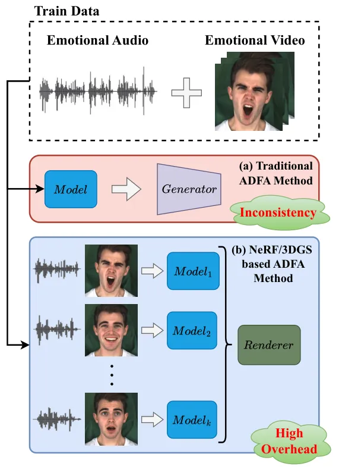
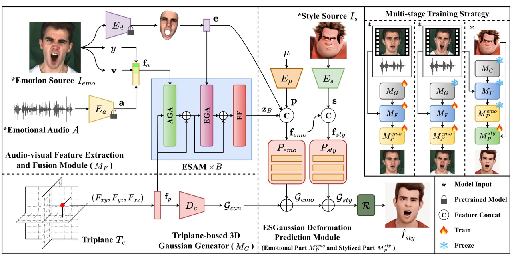
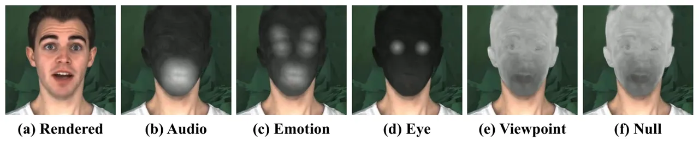
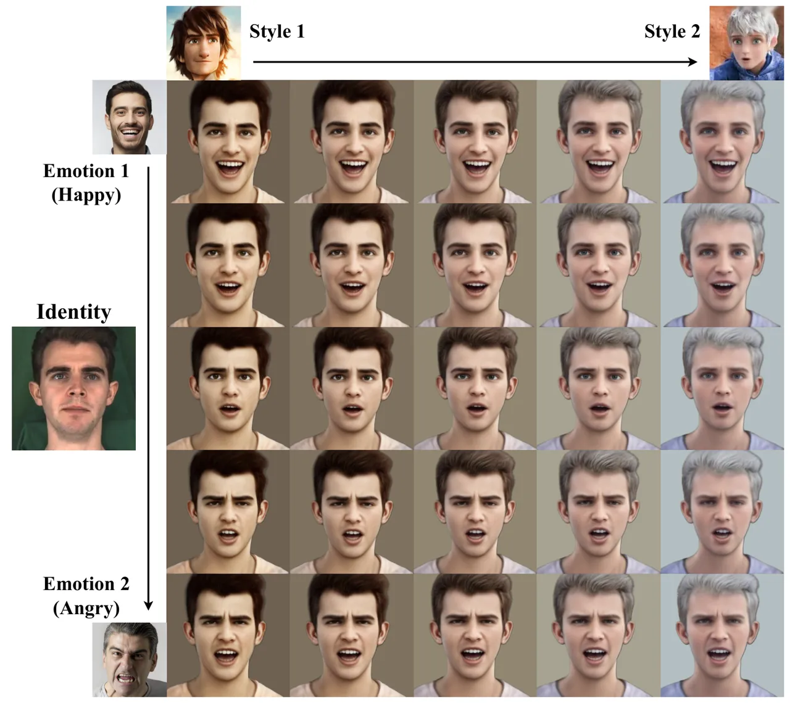
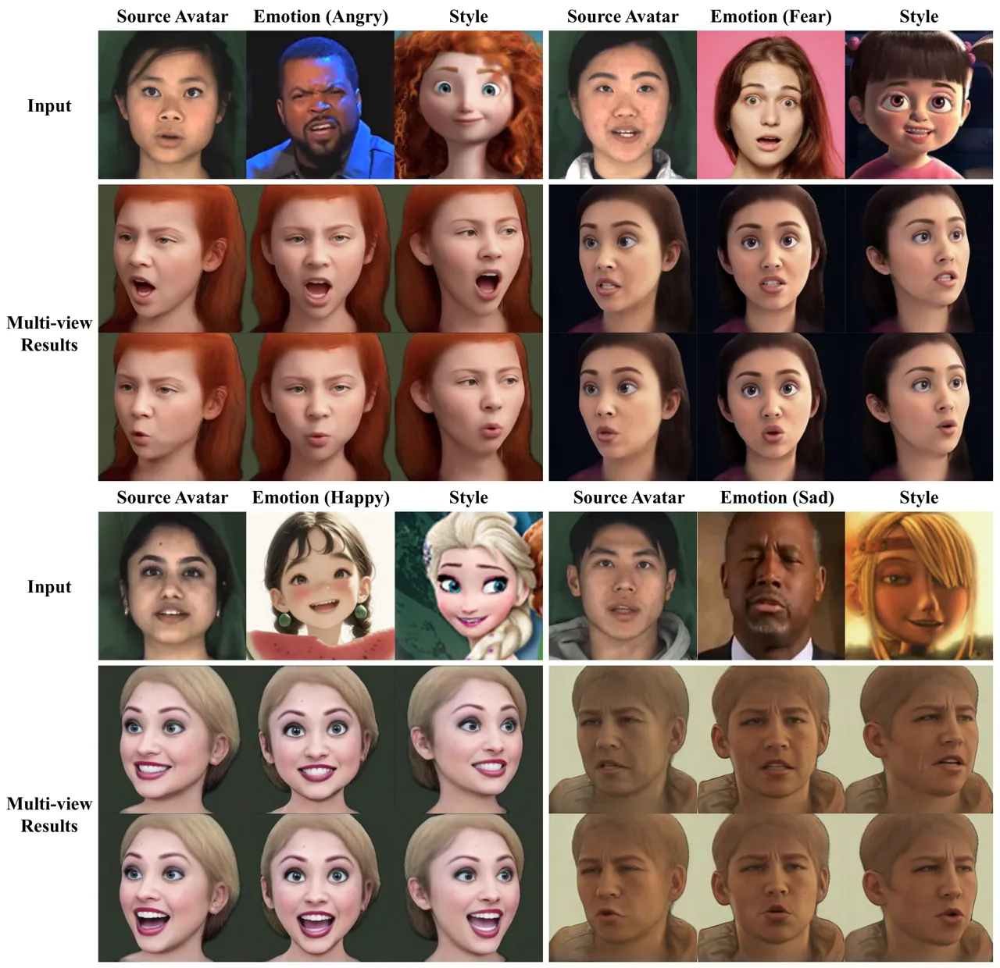
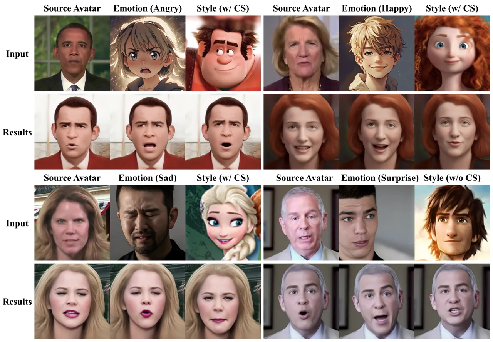
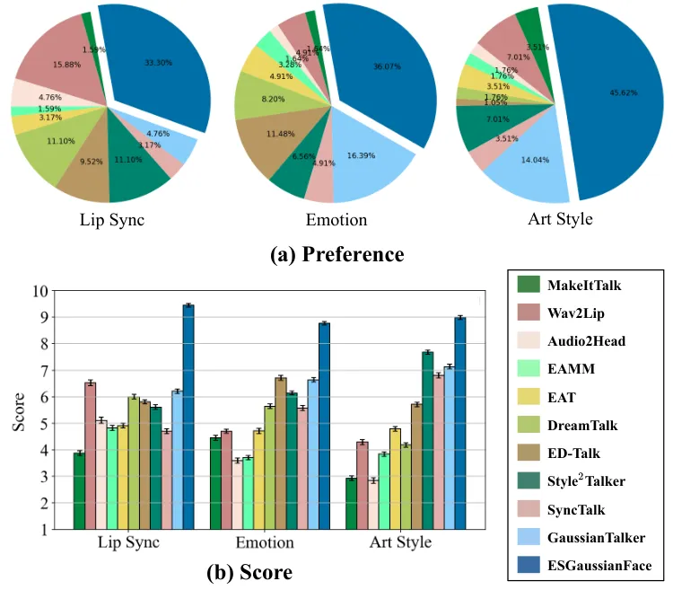
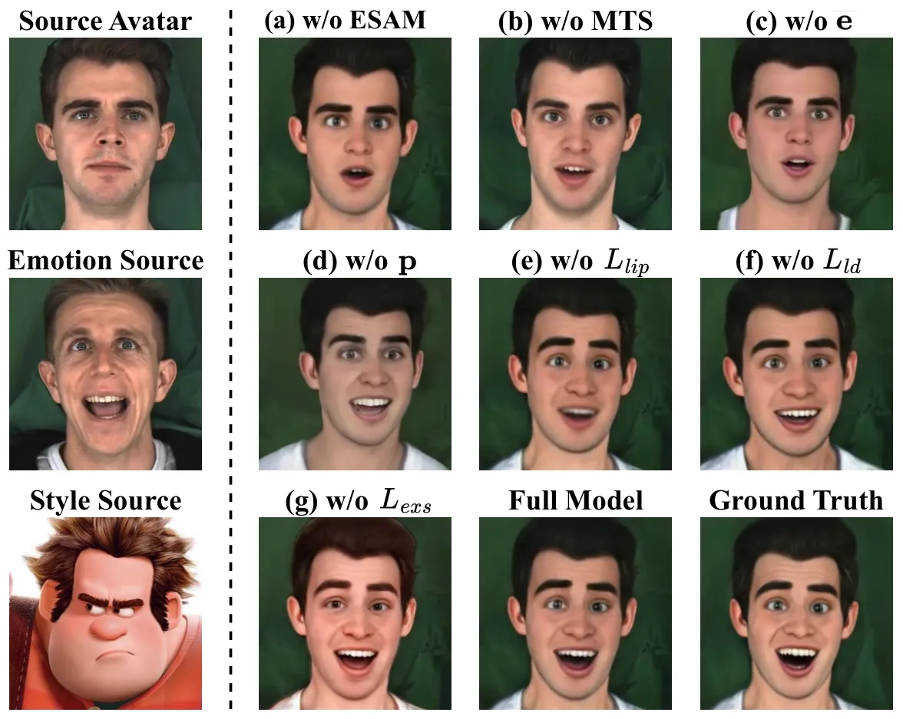

# ESGaussianFace: Emotional and Stylized Audio-Driven Facial Animation via 3D Gaussian Splatting

PubID: pubid:

Chuhang Ma    Shuai Tan    Ye Pan^(∗)    Jiaolong Yang    Xin Tong
^(†)^(†)thanks: This paper was produced by the IEEE Publication
Technology Group. They are in Piscataway, NJ.^(†)^(†)thanks: Manuscript
received April 19, 2021; revised August 16, 2021.

###### Abstract

Most current audio-driven facial animation research primarily focuses on
generating videos with neutral emotions. While some studies have
addressed the generation of facial videos driven by emotional audio,
efficiently generating high-quality talking head videos that integrate
both emotional expressions and style features remains a significant
challenge. In this paper, we propose ESGaussianFace, an innovative
framework for emotional and stylized audio-driven facial animation. Our
approach leverages 3D Gaussian Splatting to reconstruct 3D scenes and
render videos, ensuring efficient generation of 3D consistent results.
We propose an emotion-audio-guided spatial attention method that
effectively integrates emotion features with audio content features.
Through emotion-guided attention, the model is able to reconstruct
facial details across different emotional states more accurately. To
achieve emotional and stylized deformations of the 3D Gaussian points
through emotion and style features, we introduce two 3D Gaussian
deformation predictors. Futhermore, we propose a multi-stage training
strategy, enabling the step-by-step learning of the character’s lip
movements, emotional variations, and style features. Our generated
results exhibit high efficiency, high quality, and 3D consistency.
Extensive experimental results demonstrate that our method outperforms
existing state-of-the-art techniques in terms of lip movement accuracy,
expression variation, and style feature expressiveness.

###### Index Terms: 

Facial animation, neural networks, 3D gaussian splatting.

![[Uncaptioned
image]](arxiv-2601-01847--4a5ef96e2ce3.figures/figure-1.webp)

Fig. 1: We propose an Audio-Driven Facial Animation (ADFA) framework,
named ESGaussianFace. This method is based on 3D Gaussian Splatting and
supports the generation of talking heads with diverse emotions art
styles. In contrast to prior ADFA approaches, our framework enables the
training of a single model capable of generating high-precision,
multi-view consistent videos with varying emotions in real time.

^(†)^(†)footnotetext:  ^(†)^(†)footnotetext: C. Ma, S. Tan and Y. Pan
are with JHC & AI Institute, Shanghai Jiao Tong University, Shanghai,
China, E-mail:{mch3148300494, tanshuai0219, whitneypanye}@sjtu.edu.cn.
J. Yang and X. Tong are with Microsoft Research Asia. Corresponding
author: Ye Pan.

## I Introduction

Audio-Driven Facial Animation (ADFA) generates facial animations for
specific characters based on a given audio segment. This task has
widespread applications in digital humans, virtual reality, and various
other industrial domains. Most existing ADFA methods primarily focus on
neutral emotions \[1, 2, 3\], with only a few \[4, 5, 6, 7\] using audio
with different emotions to generate talking head videos. However, due to
the lack of constraints from a 3D scene, the videos produced by these
methods lack 3D consistency and cannot achieve multi-view rendering. In
recent years, Neural Radiance Fields (NeRF) \[8\] have achieved
significant breakthroughs in 3D reconstruction by modeling 3D scenes
using implicit functions. However, NeRF suffers from slow rendering
speeds, limiting its ability to achieve real-time rendering.

3D Gaussian Splatting (3DGS) \[9\] offers a promising solution to
address this limitation. 3DGS is a 3D reconstruction method that enables
high-speed rendering through explicit point-based 3D scene
representation and a highly parallel workflow, allowing for
near-real-time rendering while maintaining visual quality. Consequently,
many ADFA approaches \[10, 11\] have begun to use 3DGS to model heads of
specific characters. However, these efforts primarily focus on ADFA with
neutral emotion. Although EmoTalkingGaussian \[12\] is capable of
generating talking heads with predefined emotion labels, generating ADFA
videos that integrate 3D consistency, emotional expression and style
features from an emotional image and a stylized avatar has not yet been
explored.

We propose a novel framework named ESGaussianFace, designed to generate
both emotional and stylized talking head videos efficiently. Fig. 2
illustrates the limitations of current state-of-the-art ADFA methods in
handling multi-emotion ADFA tasks. Traditional ADFA methods \[1, 2\],
depicted in Fig. 2 (a), often suffer from a lack of 3D consistency,
resulting in inaccurate reconstructions of facial orientation and pose.
NeRF/3DGS-based ADFA methods \[13, 14\], shown in Fig. 2 (b), are
proficient at capturing 3D features but struggle with audios that
contain mixed emotions. They typically require training multiple models
for different emotions, leading to significant time and memory overhead.
In contrast, our ESGaussianFace efficiently generates videos for a wide
range of emotions using a single model. Moreover, ESGaussianFace allows
for the seamless integration of any artistic avatar’s style into
emotional videos. During training, ESGaussianFace takes driving audios,
emotional videos, and style images as inputs. These inputs provide the
character’s lip movements, emotional expressions, and style features,
respectively. During inference, any emotional video or image can be used
as the emotion source to extract emotion features.



Fig. 2: (a) Traditional ADFA methods and (b) NeRF/3DGS-based ADFA
approaches struggle to handle multi-emotion talking head generation
tasks.

To realize the aforementioned advantages, our ESGaussianFace is
structured into three modules: triplane-based 3D Gaussian generator,
audio-visual feature extraction and fusion module, and ESGaussian
deformation prediction module. The triplane-based 3D Gaussian generator
focuses on generating the Gaussian parameters for the canonical face. We
employ a multi-resolution triplane to encode spatial information form a
standard 3D head, and a triplane decoder to generate the canonical 3D
Gaussian parameters.

Our goal is to train a 3D Gaussian model capable of accurately
generating the target avatar’s lip movements and emotional expressions.
The former is primarily driven by the input audio, while the latter is
controlled by a facial image representing a specific emotion. To achieve
this, we extract content features from the audio and employ a 3D
Morphable Model \[15\] to capture the facial expression coefficients as
emotion features in audio-visual feature extraction and fusion module.
However, efficiently integrating these two feature types to precisely
control the 3D Gaussian deformation presents a significant challenge. We
hope that these two features can dynamically influence distinct facial
regions and control the deformation of 3D Gaussian points within these
regions. For this purpose, we propose an emotion-audio-guided spatial
attention module, which consists of two primary cross-attention layers.
The audio-guided attention layer captures the influence of the audio
content features on the mouth region, while the emotion-guided attention
layer controls the deformation of various facial regions under the
guidance of emotions. The module leverages spatial attention to
effectively integrate content and emotion features, enabling precise
guidance of the 3D Gaussian parameter deformations.

To further generate emotional and stylized talking head videos, we
incorporate the ESGaussian deformation prediction module. We combine
features output by the previous module with the embeddings of 3D point
positions to learn more precise emotional variations. Futhermore, we
extract style encodings to capture the stylistic attributes of a
specific artistic avatar. These features guide the deformation predictor
in generating Gaussian deformations. Training a model to directly
accomplish such a complex task is challenging. To overcome this, we
propose a multi-stage training strategy. First, the neutral stage
enables the model to predict lip movements under neutral emotion. In the
emotion stage, the model learns how different emotions influence the
Gaussian parameters, based on the learned lip movements. Finally, to
achieve the stylized deformation, we introduce a stylization stage.

Overall, ESGaussianFace can generate emotional and stylized talking head
videos, merging realism, accuracy, and high efficiency. Experimental
results show the superiority of our method compared to state-of-the-art
methods. The main contributions of this work can be summarized as
follows:

- •
  We propose a novel framework for tackling the ADFA task that combines
  both emotion and style features. To the best of our knowledge, we are
  the first to achieve this task while ensuring efficiency, accuracy,
  and multi-view generation.
- •
  We introduce an emotion-audio-guided spatial attention method to
  accurately learn the influence of both the audio and the emotion on
  dynamic spatial points. This method enables the precise prediction of
  Gaussian deformations.
- •
  We design a multi-stage training strategy, consisting of three stages,
  to train the model. This strategy enables the model to generate more
  accurate and stable videos. We also introduce several novel loss
  functions for this task.

## II Related Work

### II-A Audio-Driven Facial Animation in 2D Pixel Space

Audio-Driven Facial Animation (ADFA) tasks involve creating facial
animation videos from an input audio clip. Early approaches primarily
employ CNN-based encoder-decoder architectures \[16, 17\] or adversarial
networks \[18, 19, 20, 2, 21, 22, 3, 23, 24\] to generate talking head
videos. However, they often neglect facial structural features, leading
to significant distortions in the generated images. To address this
issue, several techniques \[25, 26, 27, 1\] enhance model accuracy by
utilizing facial landmarks as an additional control mechanism.
Furthermore, integrating the 3D Morphable Model (3DMM) \[15, 28, 29, 30,
31, 32, 33\] and 3D blendshape face model \[34, 35, 36, 37, 38, 39, 40\]
into ADFA systemsproduces more realistic and accurate videos. However,
these works primarily focus on faces displaying neutral emotions.

Currently, few studies address the generation of talking head videos
with varying facial emotions. MEAD \[41\] and RAVDESS \[42\] datasets
provide valuable emotional audio-visual data with high quality. Several
efforts \[43, 44, 45, 4, 46, 5, 47, 48, 7, 6, 49, 50, 51, 52, 53, 54,
55, 56, 57, 58, 59, 60, 61, 62, 63, 64, 65\] have developed methods for
generating emotional talking head videos. These methods derive emotion
features from diverse sources. For instance, EAT \[7\] utilizes discrete
emotion labels, while DreamTalk \[6\] relies on emotional images.
However, they often fall short in managing facial aspects such as
orientation and pose, and they cannot render multi-view videos.

### II-B Audio-Driven Facial Animation via Neural Rendering

Recently, Neural Radiance Fields (NeRF) \[8\] have shown exceptional
performance in rendering complex 3D scenes. As a result, many ADFA
methods \[13, 66, 67, 68, 69, 70, 71, 72\] have incorporated NeRF into
their frameworks. For instance, AD-NeRF \[13\] innovatively separates
facial generation into head and torso stages, leveraging NeRF’s implicit
representation to achieve high-quality rendering. However, a major
limitation of NeRF is its slow rendering speed, presenting a challenge
in balancing efficiency and accuracy in ADFA.

The advent of 3D Gaussian Splatting (3DGS) \[9\] has significantly
addressed this issue by offering both improved rendering quality and
faster speeds compared to NeRF. Recent studies in 3D facial animation
have begun to adopt 3DGS for its high precision and efficiency. HeadGas
\[10\] is pioneering in applying 3DGS into 3D facial reconstruction.
MonoGaussianAvatar \[11\] utilizes linear blend skinning to map the 3D
points from the canonical space to the deformed space, enabling
effective ADFA. Currently, numerous studies \[73, 74, 75, 76, 77\]
integrate the FLAME model \[78\] and parameterized tri-plane \[79\] into
3DGS methods, yielding more accurate outcomes. For instance,
GaussianTalker \[14\] employs a multi-resolution tri-plane to represent
canonical facial shapes and uses a spatial-audio attention module to
predict 3D Gaussian deformation. EmoTalkingGaussian \[12\] utilizes
predefined emotion labels and predicts Gaussian parameter deformations
to infuse emotions into talking heads. However, no existing method has
yet explored facial stylization based on 3DGS.

### II-C Style Transfer on Facial Images and Videos

Facial style transfer is a well-explored research area. DualStyleGAN
\[80\] employs the pSp encoder \[81\] to extract style features from any
style image and integrates them with structural features from facial
images. Utilizing StyleGAN \[82\], this approach generates high-quality
stylized images based on the combined features. VToonify \[83\] extends
this capability to video, enabling the creation of high-precision
stylized videos. In ADFA domain, Style²Talker \[84\] extracts style
features from style images and controls emotions using a diffusion
model. However, it is constrained by its 2D generation framework.
Although a few studies \[85, 86, 87\] have explored 3D facial style
transfer, no existing work is capable of achieving 3D facial animation
while simultaneously enabling control over arbitrary emotion and style.
In contrast, our method utilizes 3DGS to achieve ADFA with various
emotional expressions and styles efficiently.



Fig. 3: The overview of our proposed ESGaussianFace model. During
inference, we initialize the Gaussian parameters of the canonical face
with the Triplane-based 3D Gaussian Generator (Sec. IV-A). The
Audio-Visual Feature Extraction and Fusion Module (Sec. IV-B) extracts
content and emotion features from the audio and emotional source
separately, then combines them through the Emotion-audio-guided Spatial
Attention Module (ESAM). The resulting fused features are subsequently
input into the ESGaussian Deformation Prediction Module (Sec. IV-C),
which predicts the emotional and stylized deformations of the Gaussian
parameters. For training, a Multi-stage Training Strategy (Sec. IV-D) is
adopted, with the model learning lip movements, emotional expressions,
and style features in three stages.

## III Preliminary: 3D Gaussian Splatting

3D Gaussian Splatting (3DGS) \[9\] can learn an explicit 3D
representation from given images and camera parameters, enabling the
reconstruction of stable scenes by a series of 3D Gaussian splats.
Typically, a Gaussian splat is defined by its center position
$`\mathbf{\mu}\in\mathbb{R}^{3}`$, scaling factor
$`\mathbf{s}\in\mathbb{R}^{3}`$, rotation quaternion
$`\mathbf{q}\in\mathbb{R}^{4}`$, $`k`$-degree spherical harmonics
coefficients $`\mathbf{sh}\in\mathbb{R}^{3(k+1)^{2}}`$, and opacity
value $`\alpha\in\mathbb{R}`$. Therefore, a Gaussian splat can be
described as
$`\mathcal{G}=\{\mathbf{\mu},\mathbf{s},\mathbf{q},\mathbf{sh},\alpha\}`$.
Each 3D Gaussian can be computed as follows:

```math
g(\mathbf{x})=e^{-\frac{1}{2}(\mathbf{x}-\mathbf{\mu})^{T}\mathbf{\Sigma}^{-1}(\mathbf{x}-\mathbf{\mu})}. \tag{1}
```

The semi-definite covariance matrix $`\mathbf{\Sigma}`$ can be computed
from a scaling matrix $`\mathbf{S}`$ and a rotation matrix
$`\mathbf{R}`$, defined by $`\mathbf{s}`$ and $`\mathbf{r}`$,
respectively:

```math
\mathbf{\Sigma}=\mathbf{R}\mathbf{S}\mathbf{S}^{T}\mathbf{R}^{T}. \tag{2}
```

During the rendering process, 3D Gaussians need to be projected onto the
2D image plane within a specific camera coordinate system. The
covariance matrix $`\mathbf{\Sigma}^{\prime}\in\mathbb{R}^{2}`$ in 2D
space can be obtained from the view transformation matrix $`\mathbf{W}`$
and the Jacobian matrix $`\mathbf{J}`$ of the approximated projection
transformation \[88\]:

```math
\mathbf{\Sigma}^{\prime}=\mathbf{J}\mathbf{W}\mathbf{\Sigma}\mathbf{W}^{T}\mathbf{J}^{T}. \tag{3}
```

The 3D Gaussians associated with each pixel can be sorted based on their
respective depths. The pixel color $`\mathbf{C}`$ is computed by
blending all $`N`$ Gaussians in the depth-sorted order:

```math
\mathbf{C}=\sum_{i=1}^{N}\mathbf{c_{i}}\alpha_{i}^{\prime}\prod_{j=1}^{i-1}(1-\alpha_{j}^{\prime}), \tag{4}
```

where $`\mathbf{c_{i}}`$ is the color derived from the spherical
harmonics coefficients of the $`i`$-th Gaussian with view direction, and
$`\mathbf{\alpha}_{i}^{\prime}`$ denotes the opacity obtained by the
multiplication of the opacity of the $`i`$-th Gaussian with the
covariance matrix $`\mathbf{\Sigma}^{\prime}`$.

## IV Method

The proposed ESGaussianFace framework is shown in Fig. 3. It mainly
comprises three parts: a triplane-based 3D Gaussian generator (Sec.
IV-A), an audio-visual feature extraction and fusion module (Sec. IV-B)
and an ESGaussian deformation prediction module (Sec. IV-C).

The triplane-based 3D Gaussian generator decodes features generated by a
triplane to obtain the Gaussian parameters of the canonical face. In the
audio-visual feature extraction and fusion module , we extract both
audio and emotion features from the input to guide the computation of
the spatial attention. The ESGaussian deformation prediction module
predicts the deformation of the Gaussian parameters under emotional and
stylistic control, and uses a neural renderer to generate emotional and
stylized talking head videos. Additionally, we introduce a multi-stage
training strategy (Sec. IV-D) designed to enable the model to
effectively capture and predict deformations across a diverse range of
emotions and styles.

### IV-A Triplane-based 3D Gaussian Generator

In this section, we introduce the implementation specifics of the
triplane-based 3D Gaussian generator. To achieve high-quality and
3D-consistent facial animation results, we employ 3DGS to obtain
explicit 3D representations. We initialize $`N`$ sets of 3D Gaussians
based on a 3DMM model of the standard human face. Subsequently, we
encode the positional features of all 3D Gaussians using a
multi-resolution tri-plane \[71\]. The tri-plane $`T_{c}`$ consists of
three axis-aligned orthogonal feature planes. For any 3D position
$`\mathbf{\mu}\in\mathbb{R}^{3}`$, we project it onto $`T_{c}`$ to
obtain the corresponding feature vector $`\mathbf{f}_{p}`$:

```math
\mathbf{f}_{p}=(\mathbf{F}_{xy},\mathbf{F}_{yz},\mathbf{F}_{xz})=T_{c}(\mathbf{\mu}). \tag{5}
```

Each plane $`\mathbf{F}`$ has a resolution of $`R\times R\times C`$,
where $`R`$ denotes the spatial resolution and $`C`$ represents the
number of channels. $`\mathbf{f}_{p}`$ is then fed into a tri-plane
decoder $`D_{c}`$, enabling the extraction of the canonical Gaussian
parameters $`\mathcal{G}_{can}`$.

### IV-B Audio-visual Feature Extraction and Fusion Module

This module performs the extraction of audio and video features, as well
as the feature fusion via spatial attention.

#### IV-B1 Audio-visual Feature Extraction

We aim to extract content features from the driving audio to guide the
generation of lip movements in the human face. For an emotional audio
segment $`A^{1:T}`$, we extract its Deep Speech features \[89\]
$`\mathbf{a}^{1:T}`$, which effectively capture the content of the
audio. To capture contextual information, we extend
$`\mathbf{a}^{t}\in\mathbb{R}^{16\times 29}`$ by $`l`$ frames both
forward and backward, resulting in $`\mathbf{a}^{t-l:t+l}`$ with a
temporal length of $`2l`$.

To imbue the generated results with different emotions, we use an
emotional video (or an emotional image) as the emotion source. For
emotion feature extraction, we employ a pretrained Deep3D \[90\] model
as the 3D facial extractor $`E_{d}`$. This model, based on 3DMM,
performs 3D reconstruction and extracts 3D coefficients of 2D facial
images. Here we use the expression coefficients
$`\mathbf{e}\in\mathbb{R}^{64}`$ as the emotion feature. Following
previous works, we extract the AU45 feature $`y\in\mathbb{R}`$ \[91\]
from $`I_{emo}`$ to quantify the degree of blinking. Furthermore, we
capture the extrinsic camera pose of the video and encode the viewpoint
feature $`\mathbf{v}\in\mathbb{R}^{12}`$.



Fig. 4: (a) Shows the rendered image, while the other panels display the
attention score distributions for (b) audio content, (c) emotions, (d)
eye blinks, (e) head orientations, and (f) temporal consistency.

#### IV-B2 Emotion-audio-guided Spatial Attention

We aim for the audio and emotion features to influence different facial
regions and guide the deformation of Gaussian points within them. For
this purpose, we introduce an emotion-audio-guided spatial attention
method based on spatial-audio attention \[14\]. The spatial attention
dynamically allocate weights to different regions in space, enabling the
fusion of audio and emotion features while controlling the 3D Gaussian
points. We integrates $`B`$ Emotion-audio-guided Spatial Attention
Modules (ESAMs). Each ESAM is composed of two cross-attention layers and
a Feed-forward (FF) layer. The first, known as the Audio-guided
Attention (AGA) layer, forecasts the effect of audio on distinct facial
regions. In contrast, the second layer, the Emotion-guided Attention
(EGA) layer, estimates the influence of different emotions across
various facial regions:

```math
\mathbf{z}_{0}=\mathbf{f}_{p}, \tag{6}
```

```math
\mathbf{z}_{b}^{\prime}=F_{ca}(\mathbf{z}_{b-1},\mathbf{f}_{c}^{t})+\mathbf{z}_{b-1},\qquad b=1,...,B, \tag{7}
```

```math
\mathbf{z}_{b}^{\prime\prime}=F_{eg}(\mathbf{z}_{b}^{\prime},\mathbf{f}_{e}^{t})+\mathbf{z}_{b}^{\prime},\qquad b=1,...,B, \tag{8}
```

```math
\mathbf{z}_{b}=F_{fl}(\mathbf{z}_{b}^{\prime\prime})+\mathbf{z}_{b}^{\prime\prime},\qquad b=1,...,B, \tag{9}
```

where
$`\mathbf{f}_{a}^{t}=\{\mathbf{a}^{t-l:t+l},y,\mathbf{v},\varnothing\}`$,
$`\mathbf{f}_{e}^{t}=\{\mathbf{e},\varnothing\}`$. $`\varnothing`$ is an
empty vector, ensuring the consistency of global features across
different frames. $`F_{ag}`$, $`F_{eg}`$ and $`F_{fl}`$ represent AGA,
EGA and FF, respectively.

We visualize the attention scores of different features across various
facial regions, as shown in Fig. 4. It is evident that the audio
features primarily affect areas around the mouth, while emotion features
influence multiple regions that are more sensitive to emotional
variations, such as the eyes, eyebrows and mouth. This significantly
ensures the stability and accuracy of video generation in dynamic
scenarios with changes of audio contents and emotional expressions.

### IV-C ESGaussian Deformation Prediction Module

To obtain the emotional and stylized ADFA results, we introduce the
ESGaussian deformation prediction module. This module consists of two
Gaussian parameter deformation predictors, $`P_{emo}`$ and $`P_{sty}`$.
In addition to the spatially-aware feature $`\mathbf{z}_{B}`$, we
incorporate the emotion feature $`\mathbf{e}`$ to further capture
different emotions. We also discover that incorporating the positional
embedding of 3D points yields more precise results. For this, we use an
MLP network $`E_{\mu}`$ as encoder to obtain the encoded feature
$`\mathbf{p}\in\mathbb{R}^{64}`$ of the 3D positions.

We input the feature
$`\mathbf{f}_{emo}=\{\mathbf{z}_{B},\mathbf{e},\mathbf{p}\}`$ into
emotional deformation predictor $`P_{emo}`$ to obtain the Gaussian
deformation
$`\Delta\mathcal{G}_{emo}=\{\Delta\mathbf{\mu}_{emo},\Delta\mathbf{s}_{emo},\Delta\mathbf{q}_{emo},\Delta\mathbf{sh}_{emo},\Delta\alpha_{emo}\}`$.
Adding $`\Delta\mathcal{G}_{emo}`$ to $`\mathcal{G}_{can}`$ yields
$`\mathcal{G}_{emo}`$, which are input to the 3DGS neural renderer
$`\mathcal{R}`$ to generate the image $`\hat{I}_{emo}`$ that reflects
the emotional expression:

```math
\hat{I}_{emo}=\mathcal{R}(\mathcal{G}_{emo})=\mathcal{R}(\mathcal{G}_{can}+P_{emo}(\mathbf{f}_{emo})). \tag{10}
```

Regarding the stylized deformation predictor $`F_{sty}`$, it also
utilizes the spatially-aware feature $`\mathbf{z}_{B}`$, the emotion
feature $`\mathbf{e}`$ and the position feature $`\mathbf{p}`$ as
inputs. Furthermore, we utilize a pretrained style encoder \[81\] and an
MLP encoder jointly as style extractor $`E_{s}`$ to capture extrinsic
style feature $`\mathbf{s}\in\mathbb{R}^{128}`$ of the style images. The
feature
$`\mathbf{f}_{sty}=\{\mathbf{z}_{B},\mathbf{e},\mathbf{p},\mathbf{s}\}`$
is then input into $`P_{sty}`$ to obtain the Gaussian deformation
$`\Delta\mathcal{G}_{sty}`$. This deformation imparts the style of
$`I_{s}`$ to the emotional 3D Gaussians, thereby rendering images
$`\hat{I}_{sty}`$ that combine both the art style and emotional
expression.

| Method                | MEAD \[41\]      |                  |                   |                     |                  |                   |                                    | RAVDESS \[42\]   |                  |                   |                     |                  |                   |                                    | Output  |       |            |
| --------------------- | ---------------- | ---------------- | ----------------- | ------------------- | ---------------- | ----------------- | ---------------------------------- | ---------------- | ---------------- | ----------------- | ------------------- | ---------------- | ----------------- | ---------------------------------- | ------- | ----- | ---------- |
|                       | PSNR$`\uparrow`$ | SSIM$`\uparrow`$ | FID$`\downarrow`$ | LPIPS$`\downarrow`$ | Sync$`\uparrow`$ | LMD$`\downarrow`$ | $`\mathrm{Acc_{emo}}`$$`\uparrow`$ | PSNR$`\uparrow`$ | SSIM$`\uparrow`$ | FID$`\downarrow`$ | LPIPS$`\downarrow`$ | Sync$`\uparrow`$ | LMD$`\downarrow`$ | $`\mathrm{Acc_{emo}}`$$`\uparrow`$ | Emotion | Style | Multi-view |
| MakeItTalk \[1\]      | 27.597           | 0.602            | 53.090            | 0.059               | 4.495            | 5.208             | 19.379                             | 27.760           | 0.689            | 29.168            | 0.058               | 5.135            | 5.786             | 20.468                             | ✗       | ✗     | ✗          |
| Wav2Lip \[2\]         | 27.819           | 0.670            | 46.373            | 0.051               | 5.851            | 5.068             | 16.802                             | 27.931           | 0.715            | 32.567            | 0.057               | 6.169            | 5.623             | 18.027                             | ✗       | ✗     | ✗          |
| Audio2Head \[3\]      | 26.529           | 0.623            | 63.287            | 0.070               | 3.342            | 6.681             | 19.915                             | 25.639           | 0.583            | 69.613            | 0.069               | 2.837            | 7.243             | 19.322                             | ✗       | ✗     | ✗          |
| MEAD \[41\]           | 28.081           | 0.712            | 21.273            | 0.039               | 5.784            | 3.564             | 64.920                             | –                | –                | –                 | –                   | –                | –                 | –                                  | ✓       | ✗     | ✗          |
| EAMM \[4\]            | 26.807           | 0.681            | 58.334            | 0.063               | 3.457            | 4.578             | 25.415                             | 26.071           | 0.643            | 50.811            | 0.068               | 4.106            | 5.746             | 27.133                             | ✓       | ✗     | ✗          |
| EAT \[7\]             | 27.650           | 0.690            | 35.094            | 0.049               | 5.277            | 4.360             | 58.485                             | 26.134           | 0.613            | 40.736            | 0.067               | 3.662            | 6.459             | 53.869                             | ✓       | ✗     | ✗          |
| DreamTalk \[6\]       | 27.801           | 0.732            | 34.239            | 0.051               | 5.560            | 4.693             | 61.810                             | 26.193           | 0.650            | 38.826            | 0.064               | 5.076            | 6.118             | 57.090                             | ✓       | ✗     | ✗          |
| EDTalk \[52\]         | 27.938           | 0.760            | 34.497            | 0.048               | 5.436            | 4.467             | 62.288                             | 26.466           | 0.667            | 36.221            | 0.060               | 4.720            | 5.854             | 59.315                             | ✓       | ✗     | ✗          |
| Style²Talker \[84\]   | 29.455           | 0.795            | 25.282            | 0.035               | 5.294            | 3.007             | 70.273                             | 26.906           | 0.647            | 41.649            | 0.061               | 3.410            | 6.186             | 49.544                             | ✓       | ✓     | ✗          |
| AD-NeRF \[13\]        | 25.282           | 0.549            | 84.506            | 0.086               | 1.298            | –                 | 10.245                             | 25.021           | 0.508            | 86.448            | 0.082               | 1.132            | –                 | 10.714                             | ✗       | ✗     | ✓          |
| SyncTalk \[92\]       | 28.120           | 0.803            | 32.959            | 0.040               | 4.770            | 5.071             | 48.245                             | 27.706           | 0.697            | 31.793            | 0.053               | 3.857            | 5.646             | 47.680                             | ✗       | ✗     | ✓          |
| GaussianTalker \[14\] | 28.911           | 0.818            | 22.290            | 0.038               | 5.202            | 4.981             | 52.621                             | 28.516           | 0.747            | 25.260            | 0.044               | 4.354            | 5.329             | 51.319                             | ✗       | ✗     | ✓          |
| ESGaussianFace        | 31.873           | 0.901            | 16.933            | 0.028               | 6.216            | 2.832             | 75.944                             | 30.772           | 0.833            | 21.796            | 0.034               | 5.757            | 3.145             | 71.124                             | ✓       | ✓     | ✓          |

TABLE I: Quantitative comparisons of stylized emotional ADFA results
with state-of-the-art methods. The top-performing results are
highlighted in bold, while the second-best results are underlined. For
each method, We also provide its additional capabilities in generating
emotional expression, art style, and multi-view images.

### IV-D Multi-stage Training Strategy

During training, the Gaussian deformation predictor often fails to
directly learn the deformations from a neutral face to faces with lip
movements and different emotions. Directly training the model leads to
weak emotional expressions, loss of facial features, or even distortion.
To address this, we propose a multi-stage training strategy to obtain
more accurate results.

#### IV-D1 Neutral Stage with Lip Movement

First, we train the triplane-based 3D Gaussian generator $`M_{G}`$ and
the emotional deformation prediction module $`M_{P}^{emo}`$ ($`E_{\mu}`$
and $`P_{emo}`$). The goal of this stage is to enable the $`M_{G}`$ to
accurately generate the Gaussian parameters $`\mathcal{G}_{can}`$ of a
canonical face, while allowing $`M_{P}^{emo}`$ to learn the lip movement
of neutral emotion. We use the $`t`$-th frame of the talking head video
$`I_{neu}^{1:T}`$, which depicts neutral emotion, for training
supervision. We employ a loss function that comprises six distinct
components:

```math
\begin{split}L&=\lambda_{1}L_{rgb}+\lambda_{2}L_{per}+\lambda_{3}L_{ssim}\\
&+\lambda_{4}L_{lip}+\lambda_{5}L_{ld}+\lambda_{6}L_{smo},\end{split} \tag{11}
```

where $`L_{rgb}`$, $`L_{per}`$, and $`L_{ssim}`$ represent the L1 color
loss, perceptual loss \[93\], and SSIM loss \[94\], respectively;
$`\lambda_{i}`$ denotes the weighting factor of the loss function. To
ensure consistency of lip movements with the audio, we employ L1 loss to
the mouth region to accurately align the lip movements:

```math
L_{lip}=\|m_{neu}\cdot I_{neu}-\hat{m}_{neu}\cdot\hat{I}_{neu}\|_{1}, \tag{12}
```

where $`m_{neu}`$ denotes the mask of the mouth region extracted by a
face parsing model \[95\]. Furthermore, we utilize the facial landmarks
to ensure the accuracy of facial structure and emotions. This leads to
the landmark distance loss $`L_{ld}`$:

```math
L_{ld}=\|\mathbf{w}(F_{ld}(I_{neu})-F_{ld}(\hat{I}_{neu}))\|_{2}^{2}, \tag{13}
```

$`F_{ld}`$ denotes the pretrained landmark detector, and
$`w_{i}\in\mathbf{w}`$ is the weight for the $`i`$-th landmark.
Moreover, we add a smooth loss $`L_{smo}`$ to eliminate temporal jitter
in generated videos:

```math
L_{smo}=\|\Delta\mathcal{G}_{neu}^{t}-0.5\times(\Delta\mathcal{G}_{neu}^{t-1}+\Delta\mathcal{G}_{neu}^{t+1})\|_{2}^{2}. \tag{14}
```

In this stage, we select talking head videos exhibiting neutral emotion
of a specific actor from the emotional dataset. The objective of this
stage is to enable $`M_{G}`$ to learn the person’s explicit 3D
representation, while allowing $`M_{F}`$ and $`M_{P}^{emo}`$ to learn
lip movements under varying audio conditions.

#### IV-D2 Emotion Stage with Emotional Deformation

Building on the pretraining of the model, the goal of this stage is to
train the entire network (excluding the stylization component). Here, we
fix the weights of $`M_{G}`$. After pretraining, $`M_{P}^{emo}`$ is
capable of predicting lip movements of neutral emotion. At this point,
the model only needs to predict the emotional deformation of the
Gaussian parameters with the same lip movement. We supervise the model’s
generated $`\hat{I}_{emo}`$ using the same loss function as in the
neutral stage for training.

Since the model has already learned the 3D facial representation of the
current actor, we fix the parameters of $`M_{G}`$ in emotion stage. We
select talking head videos of the same actor and the same audio but with
different emotions for training. As $`M_{F}`$ and $`M_{P}^{emo}`$ are
already capable of predicting lip movements corresponding to a given
audio, this stage simply continues training these two modules based on
the parameters obtained in the neutral stage, enabling them to learn the
overall facial emotional deformation under consistent lip movements.

#### IV-D3 Stylization Stage with 3DGS Style Transfer

To further train the stylization functionality, we introduce a third
training stage. We employ the VToonify \[83\] model on the emotional
video $`I_{emo}^{1:T}`$ used in emotion stage and the style image
$`I_{s}`$ to achieve stylization of emotional facial video, resulting in
$`I_{sty}^{1:T}`$. In this stage, $`M_{P}^{sty}`$ ($`E_{s}`$ and
$`P_{sty}`$) aims to learn the stylized deformation of the 3D Gaussian
parameters guided by the style features $`\mathbf{s}`$. In addition to
the loss functions from $`L`$, we introduce a extrinsic style loss
$`L_{sty}`$ to ensure consistency between the generated results and the
style of $`I_{s}`$:

```math
L_{exs}=\|E_{s}(I_{sty})-E_{s}(\hat{I}_{sty})\|_{1}. \tag{15}
```

After completing the multi-stage training, we obtain a person-specific
3D Gaussian model capable of controlling arbitrary emotions and styles.
During inference, since $`M_{G}`$ has already learned the 3D Gaussian
representation of the target person, no additional input image of the
individual is required. We only need to provide the target driving
audio, an image representing the target emotion (emotion source), and an
image with the desired art style (style source). ESGaussianFace can then
generate a 3D talking head with accurate lip synchronization, realistic
emotional expression, and faithful stylization.

Fig. 5: Qualitative comparisons of stylized emotional ADFA results with
state-of-the-art methods. Experiments (a) and (b) present results on the
RAVDESS and MEAD datasets, respectively, where the source avatar and
emotion source are derived from the same dataset in each experiment.
Experiments (c) and (d) show results with the emotion source from
different datasets.

## V Experiments

### V-A Experimental Settings

#### V-A1 Datasets

In our experiments, we use the MEAD \[41\] and RAVDESS \[42\] datasets
for training. MEAD is a high-quality publicly available dataset that
contains audio-visual data of 8 emotions performed by 60 actors. To
demonstrate the generalizability of our model across different datasets,
we also incorporate the RAVDESS dataset, which consists of audio-visual
data representing 8 emotions from 24 actors. Additionally, we use
various art datasets \[96\] to obtain art style references. For further
details on the datasets and experimental parameters, please consult the
supplementary materials.

#### V-A2 Comparison Setting

To perform a comprehensive comparison of talking head videos with both
emotional expressions and art styles, we follow the experimental
approach of Style²Talker \[84\]. We input the source facial image and
the style image into VToonify \[83\] to generate a stylized facial
image. This image is then processed using several state-of-the-art ADFA
methods, achieving results comparable to our method. We select three
traditional ADFA methods: MakeItTalk \[1\], Wav2Lip \[2\], and
Audio2Head \[3\]. In the category of ADFA methods based on NeRF or 3DGS,
we choose AD-NeRF \[13\], SyncTalk \[92\] GaussianTalker \[14\]. For
emotional ADFA methods, we include MEAD \[41\], EAMM \[4\], EAT \[7\],
DreamTalk \[6\] and EDTalk \[52\] in our comparisons.

We employ PSNR, SSIM \[94\], FID \[97\], and LPIPS \[98\] to evaluate
the quality of the generated images and their similarity to real images.
To compare the consistency of lip movements with the audio, we use the
confidence score of SyncNet \[99\] (Sync). Additionally, we measure the
accuuracy of expressions and poses by the average distance between
landmarks \[100\] of the generated and real faces (LMD), and further
assess emotional accuracy using $`\mathrm{Acc_{emo}}`$ \[101\].

### V-B Experimental Results

#### V-B1 Quantitative Results

The quantitative comparison of the stylized emotional ADFA results
between our method and state-of-the-art methods is given in Tab. I. As
observed, we are the only method that supports generation of emotional
expressions, art styles, and multi-view rendering. It consistently
outperforms others on most evaluation metrics, ranking second only to
Wav2Lip in Sync. This is attributed to Wav2Lip’s use of SyncNet as
discriminator during training. Notably, the lowest LMD demonstrates that
our method is the most accurate in representing lip movements and
emotional expressions.

#### V-B2 Qualitative Results

Fig. 5 presents a qualitative comparisons of the results. Experiments
(a) and (b) present test results on the RAVDESS and MEAD datasets,
respectively, where the source avatar and emotion source are derived
from the same dataset in each experiment. Experiments (c) and (d) show
results with the emotion source selected from different datasets. For
stylization, experiments (a) and (b) show the results without color
transfer, while experiments (c) and (d) include color transfer. As
observed, while GaussianTalker excels at restoring facial poses and
details, it tend to confuse different emotions (circled in yellow
boxes). Compared to other methods, our results demonstrate significantly
improved accuracy in lip movements (indicated by blue boxes).
Furthermore, our method supports multi-view video generation, showcasing
its versatility and effectiveness. More experimental results and an
in-depth analysis are provided in the supplementary material.

|        |            |         |            |       |       |        |           |        |              |         |          |                |                |
| ------ | ---------- | ------- | ---------- | ----- | ----- | ------ | --------- | ------ | ------------ | ------- | -------- | -------------- | -------------- |
| Method | MakeItTalk | Wav2Lip | Audio2Head | MEAD  | EAMM  | EAT    | DreamTalk | EDTalk | Style²Talker | AD-NeRF | SyncTalk | GaussianTalker | ESGaussianFace |
| FPS    | 14.290     | 15.243  | 13.817     | 5.715 | 8.351 | 15.360 | 7.832     | 16.878 | 14.905       | 0.112   | 1.030    | 76.802         | 69.624         |

TABLE II: We use FPS to measure the efficiency of reenactment. The
top-performing results are highlighted in bold, while the second-best
results are underlined.

#### V-B3 Inference Speed

We evaluate the efficiency using FPS. Our method achieves an FPS of 69,
enabling real-time rendering and generation. As shown in Tab. II, our
method outperforms most state-of-the-art methods in terms of efficiency,
ranks second only to GaussianTalker. This is attributed to the
incorporation of additional emotion and stylization modules.
Nevertheless, the lightweight predictor in our model enables flexible
control over arbitrary emotions and styles, resulting in only a minimal
FPS difference compared to GaussianTalker.



Fig. 6: Emotion and style manipulation results. We set the interpolation
weight to 1, 0.75, 0.5, 0.25, and 0, respectively.

#### V-B4 Emotion and Style Manipulation

We can achieve emotion and style manipulation through linear
interpolation:

```math
\mathbf{f}=\alpha\mathbf{f}_{1}+(1-\alpha)\mathbf{f}_{2}. \tag{16}
```

Here, $`\mathbf{f}`$ denotes the emotion or style feature, and
$`\alpha`$ represents the interpolation weight. For emotion
manipulation, we use the emotion feature $`\mathbf{e}`$ encoded by 3D
facial extractor $`E_{d}`$. For style manipulation, we use the style
feature $`\mathbf{s}`$ extracted from the style source $`I_{s}`$. The
results of emotion and style manipulation under different interpolation
weights are shown in Fig. 6. We set the value of $`\alpha`$ to 1, 0.75,
0.5, 0.25, and 0, respectively. As shown in the figure, our method
successfully achieves smooth and continuous transitions in both emotion
and style domains by interpolating the corresponding features.

#### V-B5 Multi-view Rendering Results



Fig. 7: Multi-view rendering results. We select in-the-wild emotional
images as emotion sources.

Our method enables multi-view rendering based on 3D Gaussian Splatting.
We present rendering results from various viewpoints, as shown in Fig. 7. We select in-the-wild images representing angry, surprised, happy and
sad emotions as emotion sources. The results demonstrate that our method
can accurately control both the target emotion and style, while
maintaining strong 3D consistency across different rotation angles.

#### V-B6 Generalization on Other Datasets



Fig. 8: Our method demonstrates strong generalization capabilities to
videos from other datasets \[13, 102\].

Most videos outside of the emotional datasets \[41, 42\] exhibit neutral
emotions, making it challenging to find emotional videos that meet the
requirements of our training strategy. To demonstrate the generalization
capability of our method, we utilize EmoStyle \[103\] to edit the
emotion of each frame of any in-the-wild talking head video. These
emotion-edited videos are then used to train our method. In Fig. 8, we
present inference results on videos beyond MEAD and RAVDESS datasets.
These results demonstrate the strong generalization ability of our
method.

#### V-B7 User Study

We conduct a user study to compare the performance with state-of-the-art
methods. We recruit 24 participants (12 males and 12 females) and each
is presented with 7 videos generated by 11 methods. Since MEAD can only
generate driving results for a specific avatar and the outputs of
AD-NeRF are blurry, we do not include them in the user study.
Participants are asked to rate the accuracy of lip movement, emotional
expressions, and art style in the generated videos, using a scale from 1
to 11 for different methods. We then identify the top-performing method
for each participant and illustrate their preferences using a pie chart,
which is included in Fig. 9 (a). Additionally, we calculate the average
scores for each method. The results for the three metrics are presented
in Fig. 9 (b). Our method demonstrate superior performance in terms of
lip movements, emotion and art style.

#### V-B8 Ablation Study



Fig. 9: User Study Results. (a) The most preferred method of each
participant; (b) The score ranges from 1 to 11, and error bars imply the
standard deviations.

| Method             | PSNR $`\uparrow`$ | SSIM $`\uparrow`$ | FID $`\downarrow`$ | LPIPS $`\downarrow`$ | Sync $`\uparrow`$ | LMD $`\downarrow`$ | $`\mathrm{Acc_{emo}}`$ $`\uparrow`$ |
| ------------------ | ----------------- | ----------------- | ------------------ | -------------------- | ----------------- | ------------------ | ----------------------------------- |
| w/o ESAM           | 28.679            | 0.769             | 25.403             | 0.040                | 4.876             | 4.982              | 29.807                              |
| w/o MTS            | 28.050            | 0.748             | 30.672             | 0.046                | 2.154             | 4.781              | 36.263                              |
| w/o $`\mathbf{p}`$ | 28.780            | 0.813             | 24.012             | 0.033                | 4.169             | 4.026              | 63.558                              |
| w/o $`\mathbf{e}`$ | 29.455            | 0.814             | 23.124             | 0.036                | 5.061             | 4.816              | 27.921                              |
| w/o $`L_{lip}`$    | 30.025            | 0.878             | 18.539             | 0.029                | 3.064             | 3.524              | 66.542                              |
| w/o $`L_{ld}`$     | 30.842            | 0.823             | 22.094             | 0.033                | 4.440             | 4.776              | 53.540                              |
| w/o $`L_{exs}`$    | 29.189            | 0.790             | 26.303             | 0.038                | 5.435             | 3.022              | 71.251                              |
| Full Model         | 31.873            | 0.901             | 16.933             | 0.028                | 6.216             | 2.832              | 75.944                              |

TABLE III: Quantitative Results for ablation study.



Fig. 10: Qualitative ablation study results. The figure presents an
example of ADFA results depicting a happy emotion.

To better demonstrate the effectiveness of our method’s components, we
conduct ablation experiments. The quantitative results are presented in
Tab. III, while the qualitative results are shown in Fig. 10.

We design 7 variants in total: (a) First, we examine the contribution of
the emotion-audio-guided spatial attention module introduced in Sec.
IV-B (w/o ESAM). We replace our proposed ESAM module with the
spatial-audio attention module employed in GaussianTalker. As shown in
Fig. 10 (a), the model’s generated results, without ESAM, exhibit
inaccurate emotional expressions. Furthermore, the lower
$`\mathrm{Acc_{emo}}`$ observed in the quantitative results also
indicates a decline in the accuracy of emotion reconstruction in the
absence of ESAM module. The result highlights the crucial role of this
module in controlling the character’s emotional expression. (b) Next, we
investigate the necessity of the multi-stage training strategy proposed
in Sec. IV-D (w/o MTS). We bypass the first two stages and directly
train the full model using stylized emotional videos as supervision. As
seen in the results depicted in Fig. 10 (b), the output only shows
slight color changes and does not achieve the desired stylization
effect. Additionally, the emotional variation in the generated results
is minimal, and the accuracy of lip movements shows a slight decline.
These experimental findings suggest that directly training the full
model for such a complex task is inadequate. A multi-stage approach,
where lip movements, emotional expressions, and style features are
learned incrementally, is essential.

We also evaluate the necessity of two features, $`\mathbf{e}`$ and
$`\mathbf{p}`$, used in the ESGaussian deformation prediction module.
(c) Although the expression feature $`\mathbf{e}`$ is incorporated
during the extraction of $`\mathbf{z}_{B}`$, it remains essential during
the Gaussian parameter prediction process. In ESAM, $`\mathbf{e}`$
primarily assigns spatial attention weights across different facial
regions. In contrast, $`\mathbf{e}`$ provides emotion features to guide
the emotion-aware deformation of Gaussian parameters in the deformation
prediction module. Fig. 10 (c), LMD and $`\mathrm{Acc_{emo}}`$ in Tab.
III show that omitting $`\mathbf{e}`$ during the prediction process
leads to inaccurate emotions. (d) 3D Gaussian points at different
locations undergo varying degrees of deformation. Positional embedding
feature $`\mathbf{p}`$ provides spatial location priors, improving the
network’s understanding of emotion’s impact on different facial regions.
The visualized results of Fig. 10 (d) and the PSNR values in Tab. III
show that removing $`\mathbf{p}`$ leads to a noticeable decline in both
image quality and accuracy.

Furthermore, We analyze the loss functions proposed in our method: (e)
w/o $`L_{lip}`$: the absence of this loss primarily leads to a decrease
in lip synchronization; (f) w/o $`L_{ld}`$: the lack of landmark
constraints results in declines in various metrics of the results; (g)
w/o $`L_{exs}`$: the absence of style loss does not significantly impact
lip movement and landmark positions but greatly reduces the accuracy of
the generated images. Both quantitative and qualitative results
demonstrate that our proposed loss functions are essential for training
our model.

## VI Limitation

Despite the success of our work, we also recognize some limitations. (a)
First, since the MEAD dataset contains only 3 intensity levels for each
emotion, our method tends to produce similar results when processing
emotion sources with subtle differences. (b) Our method uses stylized
videos processed by VToonify as ground truth. However, more advanced
stylization methods based on diffusion models have recently emerged. (c)
Our method can only train a 3D Gaussian field for a specific character.
To drive the talking head videos of different characters, separate 3D
Gaussian models need to be trained for each. This is a common challenge
faced by current ADFA methods based on NeRF and 3D Gaussians. In future
work, we will focus on addressing these issues.

## VII Conclusion

In this paper, we introduce ESGaussianFace, a novel framework for
generating high-quality talking head videos that incorporate both
emotional expressions and style features. Leveraging 3D Gaussian
Splatting, our method ensures high efficiency, 3D consistency, and
multi-view rendering capabilities. We design an emotion-audio-guided
spatial attention module that captures the influence of audio and
emotion on the position of Gaussian points. The features output by this
module, together with the encoded expression features and the embedding
of 3D point positions, ensure the precision of the generated facial
structures. Furthermore, to tackle this complex task, we propose a
multi-stage training strategy, where the model learns the lip movements,
emotional deformations, and style features in three stages. Both
qualitative and quantitative results on multiple datasets demonstrate
the superior performance of our approach over existing state-of-the-art
methods.

## Acknowledgments

This work was completed during a visit to MSRA under the StarTrack
program, hosted by Jiaolong Yang and Xin Tong. This work was supported
in part by National Natural Science Foundation of China (NSFC, No.
62472285 and No. 62102255).

## References

- \[1\] Y. Zhou, X. Han, E. Shechtman, J. Echevarria, E. Kalogerakis,
  and D. Li (2020) Makelttalk: speaker-aware talking-head animation. ACM
  Transactions On Graphics (TOG) 39 (6), pp. 1–15. Cited by: §I, §I,
  §II-A, TABLE I, §V-A2.
- \[2\] K. Prajwal, R. Mukhopadhyay, V. P. Namboodiri, and C.
  Jawahar (2020) A lip sync expert is all you need for speech to lip
  generation in the wild. In Proceedings of the 28th ACM international
  conference on multimedia, pp. 484–492. Cited by: §I, §I, §II-A, TABLE
  I, §V-A2.
- \[3\] S. Wang, L. Li, Y. Ding, C. Fan, and X. Yu (2021) Audio2head:
  audio-driven one-shot talking-head generation with natural head
  motion. arXiv preprint arXiv:2107.09293. Cited by: §I, §II-A, TABLE I,
  §V-A2.
- \[4\] X. Ji, H. Zhou, K. Wang, Q. Wu, W. Wu, F. Xu, and X. Cao (2022)
  Eamm: one-shot emotional talking face via audio-based emotion-aware
  motion model. In ACM SIGGRAPH 2022 Conference Proceedings, pp. 1–10.
  Cited by: §I, §II-A, TABLE I, §V-A2.
- \[5\] S. Tan, B. Ji, and Y. Pan (2023) Emmn: emotional motion memory
  network for audio-driven emotional talking face generation. In
  Proceedings of the IEEE/CVF International Conference on Computer
  Vision, pp. 22146–22156. Cited by: §I, §II-A.
- \[6\] Y. Ma, S. Zhang, J. Wang, X. Wang, Y. Zhang, and Z. Deng (2023)
  DreamTalk: when emotional talking head generation meets diffusion
  probabilistic models. arXiv preprint arXiv:2312.09767. Cited by: §I,
  §II-A, TABLE I, §V-A2.
- \[7\] Y. Gan, Z. Yang, X. Yue, L. Sun, and Y. Yang (2023) Efficient
  emotional adaptation for audio-driven talking-head generation. In
  Proceedings of the IEEE/CVF International Conference on Computer
  Vision, pp. 22634–22645. Cited by: §I, §II-A, TABLE I, §V-A2.
- \[8\] B. Mildenhall, P. P. Srinivasan, M. Tancik, J. T. Barron, R.
  Ramamoorthi, and R. Ng (2021) Nerf: representing scenes as neural
  radiance fields for view synthesis. Communications of the ACM 65 (1),
  pp. 99–106. Cited by: §I, §II-B.
- \[9\] B. Kerbl, G. Kopanas, T. Leimkühler, and G. Drettakis (2023) 3D
  gaussian splatting for real-time radiance field rendering.. ACM Trans.
  Graph. 42 (4), pp. 139–1. Cited by: §I, §II-B, §III.
- \[10\] H. Dhamo, Y. Nie, A. Moreau, J. Song, R. Shaw, Y. Zhou, and E.
  Pérez-Pellitero (2023) Headgas: real-time animatable head avatars via
  3d gaussian splatting. arXiv preprint arXiv:2312.02902. Cited by: §I,
  §II-B.
- \[11\] Y. Chen, L. Wang, Q. Li, H. Xiao, S. Zhang, H. Yao, and Y.
  Liu (2023) Monogaussianavatar: monocular gaussian point-based head
  avatar. arXiv preprint arXiv:2312.04558. Cited by: §I, §II-B.
- \[12\] J. Cha, S. Yoon, V. Strizhkova, F. Bremond, and S. Baek (2025)
  Emotalkinggaussian: continuous emotion-conditioned talking head
  synthesis. arXiv preprint arXiv:2502.00654. Cited by: §I, §II-B.
- \[13\] Y. Guo, K. Chen, S. Liang, Y. Liu, H. Bao, and J. Zhang (2021)
  Ad-nerf: audio driven neural radiance fields for talking head
  synthesis. In Proceedings of the IEEE/CVF international conference on
  computer vision, pp. 5784–5794. Cited by: §I, §II-B, TABLE I, Fig. 8,
  §V-A2.
- \[14\] K. Cho, J. Lee, H. Yoon, Y. Hong, J. Ko, S. Ahn, and S.
  Kim (2024) GaussianTalker: real-time high-fidelity talking head
  synthesis with audio-driven 3d gaussian splatting. arXiv preprint
  arXiv:2404.16012. Cited by: §I, §II-B, §IV-B2, TABLE I, §V-A2.
- \[15\] V. Blanz and T. Vetter (2023) A morphable model for the
  synthesis of 3d faces. In Seminal Graphics Papers: Pushing the
  Boundaries, Volume 2, pp. 157–164. Cited by: §I, §II-A.
- \[16\] R. Kumar, J. Sotelo, K. Kumar, A. De Brebisson, and Y.
  Bengio (2017) Obamanet: photo-realistic lip-sync from text. arXiv
  preprint arXiv:1801.01442. Cited by: §II-A.
- \[17\] A. Jamaludin, J. S. Chung, and A. Zisserman (2019) You said
  that?: synthesising talking faces from audio. International Journal of
  Computer Vision 127, pp. 1767–1779. Cited by: §II-A.
- \[18\] I. Goodfellow, J. Pouget-Abadie, M. Mirza, B. Xu, D.
  Warde-Farley, S. Ozair, A. Courville, and Y. Bengio (2014) Generative
  adversarial nets. Advances in neural information processing systems 27. Cited by: §II-A.
- \[19\] L. Chen, R. K. Maddox, Z. Duan, and C. Xu (2019) Hierarchical
  cross-modal talking face generation with dynamic pixel-wise loss. In
  Proceedings of the IEEE/CVF conference on computer vision and pattern
  recognition, pp. 7832–7841. Cited by: §II-A.
- \[20\] H. Zhou, Y. Liu, Z. Liu, P. Luo, and X. Wang (2019) Talking
  face generation by adversarially disentangled audio-visual
  representation. In Proceedings of the AAAI conference on artificial
  intelligence, Vol. 33, pp. 9299–9306. Cited by: §II-A.
- \[21\] L. Yu, J. Yu, M. Li, and Q. Ling (2020) Multimodal inputs
  driven talking face generation with spatial–temporal dependency. IEEE
  Transactions on Circuits and Systems for Video Technology 31 (1),
  pp. 203–216. Cited by: §II-A.
- \[22\] D. Das, S. Biswas, S. Sinha, and B. Bhowmick (2020)
  Speech-driven facial animation using cascaded gans for learning of
  motion and texture. In Computer Vision–ECCV 2020: 16th European
  Conference, Glasgow, UK, August 23–28, 2020, Proceedings, Part XXX 16,
  pp. 408–424. Cited by: §II-A.
- \[23\] Y. Sun, H. Zhou, Z. Liu, and H. Koike (2021)
  Speech2Talking-face: inferring and driving a face with synchronized
  audio-visual representation.. In IJCAI, Vol. 2, pp. 4. Cited by:
  §II-A.
- \[24\] F. Yin, Y. Zhang, X. Cun, M. Cao, Y. Fan, X. Wang, Q. Bai, B.
  Wu, J. Wang, and Y. Yang (2022) Styleheat: one-shot high-resolution
  editable talking face generation via pre-trained stylegan. In European
  conference on computer vision, pp. 85–101. Cited by: §II-A.
- \[25\] Y. Zhou, Z. Xu, C. Landreth, E. Kalogerakis, S. Maji, and K.
  Singh (2018) Visemenet: audio-driven animator-centric speech
  animation. ACM Transactions on Graphics (TOG) 37 (4), pp. 1–10. Cited
  by: §II-A.
- \[26\] E. Zakharov, A. Shysheya, E. Burkov, and V. Lempitsky (2019)
  Few-shot adversarial learning of realistic neural talking head models.
  In Proceedings of the IEEE/CVF international conference on computer
  vision, pp. 9459–9468. Cited by: §II-A.
- \[27\] Y. Lu, J. Chai, and X. Cao (2021) Live speech portraits:
  real-time photorealistic talking-head animation. ACM Transactions on
  Graphics (ToG) 40 (6), pp. 1–17. Cited by: §II-A.
- \[28\] S. Taylor, T. Kim, Y. Yue, M. Mahler, J. Krahe, A. G.
  Rodriguez, J. Hodgins, and I. Matthews (2017) A deep learning approach
  for generalized speech animation. ACM Transactions On Graphics (TOG)
  36 (4), pp. 1–11. Cited by: §II-A.
- \[29\] S. Suwajanakorn, S. M. Seitz, and I.
  Kemelmacher-Shlizerman (2017) Synthesizing obama: learning lip sync
  from audio. ACM Transactions on Graphics (ToG) 36 (4), pp. 1–13. Cited
  by: §II-A.
- \[30\] J. Thies, M. Elgharib, A. Tewari, C. Theobalt, and M.
  Nießner (2020) Neural voice puppetry: audio-driven facial reenactment.
  In Computer Vision–ECCV 2020: 16th European Conference, Glasgow, UK,
  August 23–28, 2020, Proceedings, Part XVI 16, pp. 716–731. Cited by:
  §II-A.
- \[31\] R. Yi, Z. Ye, J. Zhang, H. Bao, and Y. Liu (2020) Audio-driven
  talking face video generation with learning-based personalized head
  pose. arXiv preprint arXiv:2002.10137. Cited by: §II-A.
- \[32\] Y. Ren, G. Li, Y. Chen, T. H. Li, and S. Liu (2021) Pirenderer:
  controllable portrait image generation via semantic neural rendering.
  In Proceedings of the IEEE/CVF international conference on computer
  vision, pp. 13759–13768. Cited by: §II-A.
- \[33\] W. Zhang, X. Cun, X. Wang, Y. Zhang, X. Shen, Y. Guo, Y. Shan,
  and F. Wang (2023) Sadtalker: learning realistic 3d motion
  coefficients for stylized audio-driven single image talking face
  animation. In Proceedings of the IEEE/CVF Conference on Computer
  Vision and Pattern Recognition, pp. 8652–8661. Cited by: §II-A.
- \[34\] T. Karras, T. Aila, S. Laine, A. Herva, and J. Lehtinen (2017)
  Audio-driven facial animation by joint end-to-end learning of pose and
  emotion. ACM Transactions on Graphics (ToG) 36 (4), pp. 1–12. Cited
  by: §II-A.
- \[35\] H. X. Pham, S. Cheung, and V. Pavlovic (2017) Speech-driven 3d
  facial animation with implicit emotional awareness: a deep learning
  approach. In Proceedings of the IEEE conference on computer vision and
  pattern recognition workshops, pp. 80–88. Cited by: §II-A.
- \[36\] H. X. Pham, Y. Wang, and V. Pavlovic (2018) End-to-end learning
  for 3d facial animation from speech. In Proceedings of the 20th ACM
  International Conference on Multimodal Interaction, pp. 361–365. Cited
  by: §II-A.
- \[37\] D. Cudeiro, T. Bolkart, C. Laidlaw, A. Ranjan, and M. J.
  Black (2019) Capture, learning, and synthesis of 3d speaking styles.
  In Proceedings of the IEEE/CVF conference on computer vision and
  pattern recognition, pp. 10101–10111. Cited by: §II-A.
- \[38\] P. Tzirakis, A. Papaioannou, A. Lattas, M. Tarasiou, B.
  Schuller, and S. Zafeiriou (2020) Synthesising 3d facial motion from
  “in-the-wild” speech. In 2020 15th IEEE International Conference on
  Automatic Face and Gesture Recognition (FG 2020), pp. 265–272. Cited
  by: §II-A.
- \[39\] A. Richard, M. Zollhöfer, Y. Wen, F. De la Torre, and Y.
  Sheikh (2021) Meshtalk: 3d face animation from speech using
  cross-modality disentanglement. In Proceedings of the IEEE/CVF
  International Conference on Computer Vision, pp. 1173–1182. Cited by:
  §II-A.
- \[40\] Z. Peng, Y. Luo, Y. Shi, H. Xu, X. Zhu, H. Liu, J. He, and Z.
  Fan (2023) Selftalk: a self-supervised commutative training diagram to
  comprehend 3d talking faces. In Proceedings of the 31st ACM
  International Conference on Multimedia, pp. 5292–5301. Cited by:
  §II-A.
- \[41\] K. Wang, Q. Wu, L. Song, Z. Yang, W. Wu, C. Qian, R. He, Y.
  Qiao, and C. C. Loy (2020) Mead: a large-scale audio-visual dataset
  for emotional talking-face generation. In European Conference on
  Computer Vision, pp. 700–717. Cited by: §II-A, TABLE I, TABLE I,
  §V-A1, §V-A2, §V-B6.
- \[42\] S. R. Livingstone and F. A. Russo (2018) The ryerson
  audio-visual database of emotional speech and song (ravdess): a
  dynamic, multimodal set of facial and vocal expressions in north
  american english. PloS one 13 (5), pp. e0196391. Cited by: §II-A,
  TABLE I, §V-A1, §V-B6.
- \[43\] S. E. Eskimez, Y. Zhang, and Z. Duan (2021) Speech driven
  talking face generation from a single image and an emotion condition.
  IEEE Transactions on Multimedia 24, pp. 3480–3490. Cited by: §II-A.
- \[44\] B. Liang, Y. Pan, Z. Guo, H. Zhou, Z. Hong, X. Han, J. Han, J.
  Liu, E. Ding, and J. Wang (2022) Expressive talking head generation
  with granular audio-visual control. In Proceedings of the IEEE/CVF
  Conference on Computer Vision and Pattern Recognition, pp. 3387–3396.
  Cited by: §II-A.
- \[45\] S. Sinha, S. Biswas, R. Yadav, and B. Bhowmick (2022)
  Emotion-controllable generalized talking face generation. arXiv
  preprint arXiv:2205.01155. Cited by: §II-A.
- \[46\] Y. Ma, S. Wang, Z. Hu, C. Fan, T. Lv, Y. Ding, Z. Deng, and X.
  Yu (2023) Styletalk: one-shot talking head generation with
  controllable speaking styles. In Proceedings of the AAAI Conference on
  Artificial Intelligence, Vol. 37, pp. 1896–1904. Cited by: §II-A.
- \[47\] Z. Sun, Y. Wen, T. Lv, Y. Sun, Z. Zhang, Y. Wang, and Y.
  Liu (2023) Continuously controllable facial expression editing in
  talking face videos. IEEE Transactions on Affective Computing. Cited
  by: §II-A.
- \[48\] Z. Peng, H. Wu, Z. Song, H. Xu, X. Zhu, J. He, H. Liu, and Z.
  Fan (2023) Emotalk: speech-driven emotional disentanglement for 3d
  face animation. In Proceedings of the IEEE/CVF International
  Conference on Computer Vision, pp. 20687–20697. Cited by: §II-A.
- \[49\] Q. He, X. Ji, Y. Gong, Y. Lu, Z. Diao, L. Huang, Y. Yao, S.
  Zhu, Z. Ma, S. Xu, et al. (2024) EmoTalk3D: high-fidelity free-view
  synthesis of emotional 3d talking head. In European Conference on
  Computer Vision, pp. 55–72. Cited by: §II-A.
- \[50\] S. Xu, G. Chen, Y. Guo, J. Yang, C. Li, Z. Zang, Y. Zhang, X.
  Tong, and B. Guo (2024) Vasa-1: lifelike audio-driven talking faces
  generated in real time. arXiv preprint arXiv:2404.10667. Cited by:
  §II-A.
- \[51\] S. Tan, B. Ji, Y. Ding, and Y. Pan (2024) Say anything with any
  style. In Proceedings of the AAAI Conference on Artificial
  Intelligence, Vol. 38, pp. 5088–5096. Cited by: §II-A.
- \[52\] S. Tan, B. Ji, M. Bi, and Y. Pan (2024) EDTalk: efficient
  disentanglement for emotional talking head synthesis. arXiv preprint
  arXiv:2404.01647. Cited by: §II-A, TABLE I, §V-A2.
- \[53\] C. Ma, S. Tan, J. Wei, and Y. Pan (2025) GOES: 3d
  gaussian-based one-shot head animation with any emotion and any style.
  In Proceedings of the 33rd ACM International Conference on Multimedia,
  pp. 9578–9587. Cited by: §II-A.
- \[54\] S. Tan and B. Ji (2025) EDTalk++: full disentanglement for
  controllable talking head synthesis. arXiv preprint arXiv:2508.13442.
  Cited by: §II-A.
- \[55\] S. Tan, B. Gong, Z. Liu, Y. Wang, X. Chen, Y. Feng, and H.
  Zhao (2025) Animate-x++: universal character image animation with
  dynamic backgrounds. arXiv preprint arXiv:2508.09454. Cited by: §II-A.
- \[56\] B. Ji, Y. Pan, Z. Liu, S. Tan, and X. Yang (2025) Sport: from
  zero-shot prompts to real-time motion generation. IEEE Transactions on
  Visualization and Computer Graphics. Cited by: §II-A.
- \[57\] S. Tan, B. Ji, and Y. Pan (2024) FlowVQTalker: high-quality
  emotional talking face generation through normalizing flow and
  quantization. In Proceedings of the IEEE/CVF Conference on Computer
  Vision and Pattern Recognition, pp. 26317–26327. Cited by: §II-A.
- \[58\] P. Witzig, B. Solenthaler, M. Gross, and R. Wampfler (2024)
  EmoSpaceTime: decoupling emotion and content through contrastive
  learning for expressive 3d speech animation. In Proceedings of the
  17th ACM SIGGRAPH Conference on Motion, Interaction, and Games,
  pp. 1–12. Cited by: §II-A.
- \[59\] S. Tan, B. Gong, Y. Feng, K. Zheng, D. Zheng, S. Shi, Y.
  Shen, J. Chen, and M. Yang (2025) Mimir: improving video diffusion
  models for precise text understanding. In Proceedings of the IEEE/CVF
  Conference on Computer Vision and Pattern Recognition, Cited by:
  §II-A.
- \[60\] S. Tan, B. Gong, Y. Wei, S. Zhang, Z. Liu, D. Zheng, J.
  Chen, Y. Wang, H. Ouyang, K. Zheng, and Y. Shen (2025) SynMotion:
  semantic-visual adaptation for motion customized video generation.
  arXiv preprint arXiv:2506.23690. Cited by: §II-A.
- \[61\] S. Tan, B. Gong, X. Wang, S. Zhang, D. Zheng, R. Zheng, K.
  Zheng, J. Chen, and M. Yang (2025) Animate-x: universal character
  image animation with enhanced motion representation. In International
  Conference on Learning Representations, Cited by: §II-A.
- \[62\] S. Tan, B. Gong, B. Ji, and Y. Pan (2025) FixTalk: taming
  identity leakage for high-quality talking head generation in extreme
  cases. In Proceedings of the IEEE/CVF International Conference on
  Computer Vision, Cited by: §II-A.
- \[63\] Y. Pan, R. Zhang, S. Cheng, S. Tan, Y. Ding, K. Mitchell,
  and X. Yang (2023) Emotional voice puppetry. IEEE Transactions on
  Visualization and Computer Graphics 29 (5), pp. 2527–2535. Cited by:
  §II-A.
- \[64\] Y. Pan, S. Tan, S. Cheng, Q. Lin, Z. Zeng, and K.
  Mitchell (2024) Expressive talking avatars. IEEE Transactions on
  Visualization and Computer Graphics 30 (5), pp. 2538–2548. Cited by:
  §II-A.
- \[65\] Y. Pan, C. Liu, S. Xu, S. Tan, and J. Yang (2025) Vasa-rig:
  audio-driven 3d facial animation with ‘live’mood dynamics in virtual
  reality. IEEE Transactions on Visualization and Computer Graphics.
  Cited by: §II-A.
- \[66\] X. Liu, Y. Xu, Q. Wu, H. Zhou, W. Wu, and B. Zhou (2022)
  Semantic-aware implicit neural audio-driven video portrait generation.
  In European conference on computer vision, pp. 106–125. Cited by:
  §II-B.
- \[67\] S. Shen, W. Li, Z. Zhu, Y. Duan, J. Zhou, and J. Lu (2022)
  Learning dynamic facial radiance fields for few-shot talking head
  synthesis. In European conference on computer vision, pp. 666–682.
  Cited by: §II-B.
- \[68\] S. Yao, R. Zhong, Y. Yan, G. Zhai, and X. Yang (2022) Dfa-nerf:
  personalized talking head generation via disentangled face attributes
  neural rendering. arXiv preprint arXiv:2201.00791. Cited by: §II-B.
- \[69\] J. Tang, K. Wang, H. Zhou, X. Chen, D. He, T. Hu, J. Liu, G.
  Zeng, and J. Wang (2022) Real-time neural radiance talking portrait
  synthesis via audio-spatial decomposition. arXiv preprint
  arXiv:2211.12368. Cited by: §II-B.
- \[70\] T. Müller, A. Evans, C. Schied, and A. Keller (2022) Instant
  neural graphics primitives with a multiresolution hash encoding. ACM
  transactions on graphics (TOG) 41 (4), pp. 1–15. Cited by: §II-B.
- \[71\] J. Li, J. Zhang, X. Bai, J. Zhou, and L. Gu (2023) Efficient
  region-aware neural radiance fields for high-fidelity talking portrait
  synthesis. In Proceedings of the IEEE/CVF International Conference on
  Computer Vision, pp. 7568–7578. Cited by: §II-B, §IV-A.
- \[72\] W. Yu, Y. Fan, Y. Zhang, X. Wang, F. Yin, Y. Bai, Y. Cao, Y.
  Shan, Y. Wu, Z. Sun, et al. (2023) Nofa: nerf-based one-shot facial
  avatar reconstruction. In ACM SIGGRAPH 2023 Conference Proceedings,
  pp. 1–12. Cited by: §II-B.
- \[73\] S. Qian, T. Kirschstein, L. Schoneveld, D. Davoli, S.
  Giebenhain, and M. Nießner (2024) Gaussianavatars: photorealistic head
  avatars with rigged 3d gaussians. In Proceedings of the IEEE/CVF
  Conference on Computer Vision and Pattern Recognition,
  pp. 20299–20309. Cited by: §II-B.
- \[74\] Z. Zhou, F. Ma, H. Fan, and Y. Yang (2024) Headstudio: text to
  animatable head avatars with 3d gaussian splatting. arXiv preprint
  arXiv:2402.06149. Cited by: §II-B.
- \[75\] H. Yu, Z. Qu, Q. Yu, J. Chen, Z. Jiang, Z. Chen, S. Zhang, J.
  Xu, F. Wu, C. Lv, et al. (2024) GaussianTalker: speaker-specific
  talking head synthesis via 3d gaussian splatting. arXiv preprint
  arXiv:2404.14037. Cited by: §II-B.
- \[76\] J. Wang, J. Xie, X. Li, F. Xu, C. Pun, and H. Gao (2023)
  Gaussianhead: high-fidelity head avatars with learnable gaussian
  derivation. arXiv preprint arXiv:2312.01632. Cited by: §II-B.
- \[77\] J. Li, J. Zhang, X. Bai, J. Zheng, X. Ning, J. Zhou, and L.
  Gu (2024) TalkingGaussian: structure-persistent 3d talking head
  synthesis via gaussian splatting. arXiv preprint arXiv:2404.15264.
  Cited by: §II-B.
- \[78\] T. Li, T. Bolkart, M. J. Black, H. Li, and J. Romero (2017)
  Learning a model of facial shape and expression from 4d scans.. ACM
  Trans. Graph. 36 (6), pp. 194–1. Cited by: §II-B.
- \[79\] E. R. Chan, C. Z. Lin, M. A. Chan, K. Nagano, B. Pan, S. D.
  Mello, O. Gallo, L. Guibas, J. Tremblay, S. Khamis, T. Karras, and G.
  Wetzstein (2022) Efficient geometry-aware 3D generative adversarial
  networks. In CVPR, Cited by: §II-B.
- \[80\] S. Yang, L. Jiang, Z. Liu, and C. C. Loy (2022) Pastiche
  master: exemplar-based high-resolution portrait style transfer. In
  Proceedings of the IEEE/CVF Conference on Computer Vision and Pattern
  Recognition, pp. 7693–7702. Cited by: §II-C.
- \[81\] E. Richardson, Y. Alaluf, O. Patashnik, Y. Nitzan, Y. Azar, S.
  Shapiro, and D. Cohen-Or (2021) Encoding in style: a stylegan encoder
  for image-to-image translation. In Proceedings of the IEEE/CVF
  conference on computer vision and pattern recognition, pp. 2287–2296.
  Cited by: §II-C, §IV-C.
- \[82\] T. Karras, S. Laine, and T. Aila (2019) A style-based generator
  architecture for generative adversarial networks. In Proceedings of
  the IEEE/CVF conference on computer vision and pattern recognition,
  pp. 4401–4410. Cited by: §II-C.
- \[83\] S. Yang, L. Jiang, Z. Liu, and C. C. Loy (2022) VToonify:
  controllable high-resolution portrait video style transfer. ACM
  Transactions on Graphics (TOG) 41 (6), pp. 1–15. External Links:
  [Document](https://dx.doi.org/10.1145/3550454.3555437) Cited by:
  §II-C, §IV-D3, §V-A2.
- \[84\] S. Tan, B. Ji, and Y. Pan (2024) Style2talker: high-resolution
  talking head generation with emotion style and art style. In
  Proceedings of the AAAI Conference on Artificial Intelligence, Vol.
  38, pp. 5079–5087. Cited by: §II-C, TABLE I, §V-A2.
- \[85\] Y. Men, H. Liu, Y. Yao, M. Cui, X. Xie, and Z. Lian (2024)
  3dtoonify: creating your high-fidelity 3d stylized avatar easily from
  2d portrait images. In Proceedings of the IEEE/CVF Conference on
  Computer Vision and Pattern Recognition, pp. 10127–10137. Cited by:
  §II-C.
- \[86\] R. Shao, J. Sun, C. Peng, Z. Zheng, B. Zhou, H. Zhang, and Y.
  Liu (2024) Control4d: efficient 4d portrait editing with text. In
  Proceedings of the IEEE/CVF Conference on Computer Vision and Pattern
  Recognition, pp. 4556–4567. Cited by: §II-C.
- \[87\] Z. Chen, Y. Yan, S. Liu, Y. Cheng, W. Zhao, L. Li, M. Bi,
  and X. Yang (2025) Revealing directions for text-guided 3d face
  editing. IEEE Transactions on Multimedia. Cited by: §II-C.
- \[88\] M. Zwicker, H. Pfister, J. Van Baar, and M. Gross (2001)
  Surface splatting. In Proceedings of the 28th annual conference on
  Computer graphics and interactive techniques, pp. 371–378. Cited by:
  §III.
- \[89\] A. Hannun, C. Case, J. Casper, B. Catanzaro, G. Diamos, E.
  Elsen, R. Prenger, S. Satheesh, S. Sengupta, A. Coates, et al. (2014)
  Deep speech: scaling up end-to-end speech recognition. arXiv preprint
  arXiv:1412.5567. Cited by: §IV-B1.
- \[90\] Y. Deng, J. Yang, S. Xu, D. Chen, Y. Jia, and X. Tong (2019)
  Accurate 3d face reconstruction with weakly-supervised learning: from
  single image to image set. In IEEE Computer Vision and Pattern
  Recognition Workshops, Cited by: §IV-B1.
- \[91\] T. Baltrušaitis, P. Robinson, and L. Morency (2016) Openface:
  an open source facial behavior analysis toolkit. In 2016 IEEE winter
  conference on applications of computer vision (WACV), pp. 1–10. Cited
  by: §IV-B1.
- \[92\] Z. Peng, W. Hu, Y. Shi, X. Zhu, X. Zhang, H. Zhao, J. He, H.
  Liu, and Z. Fan (2024) Synctalk: the devil is in the synchronization
  for talking head synthesis. In Proceedings of the IEEE/CVF Conference
  on Computer Vision and Pattern Recognition, pp. 666–676. Cited by:
  TABLE I, §V-A2.
- \[93\] J. Johnson, A. Alahi, and L. Fei-Fei (2016) Perceptual losses
  for real-time style transfer and super-resolution. In Computer
  Vision–ECCV 2016: 14th European Conference, Amsterdam, The
  Netherlands, October 11-14, 2016, Proceedings, Part II 14,
  pp. 694–711. Cited by: §IV-D1.
- \[94\] Z. Wang, A. C. Bovik, H. R. Sheikh, and E. P. Simoncelli (2004)
  Image quality assessment: from error visibility to structural
  similarity. IEEE transactions on image processing 13 (4), pp. 600–612.
  Cited by: §IV-D1, §V-A2.
- \[95\] C. Lee, Z. Liu, L. Wu, and P. Luo (2020) Maskgan: towards
  diverse and interactive facial image manipulation. In Proceedings of
  the IEEE/CVF conference on computer vision and pattern recognition,
  pp. 5549–5558. Cited by: §IV-D1.
- \[96\] J. N. Pinkney and D. Adler (2020) Resolution dependent gan
  interpolation for controllable image synthesis between domains. arXiv
  preprint arXiv:2010.05334. Cited by: §V-A1.
- \[97\] M. Heusel, H. Ramsauer, T. Unterthiner, B. Nessler, and S.
  Hochreiter (2017) Gans trained by a two time-scale update rule
  converge to a local nash equilibrium. Advances in neural information
  processing systems 30. Cited by: §V-A2.
- \[98\] R. Zhang, P. Isola, A. A. Efros, E. Shechtman, and O.
  Wang (2018) The unreasonable effectiveness of deep features as a
  perceptual metric. In Proceedings of the IEEE conference on computer
  vision and pattern recognition, pp. 586–595. Cited by: §V-A2.
- \[99\] J. S. Chung and A. Zisserman (2017) Out of time: automated lip
  sync in the wild. In Computer Vision–ACCV 2016 Workshops: ACCV 2016
  International Workshops, Taipei, Taiwan, November 20-24, 2016, Revised
  Selected Papers, Part II 13, pp. 251–263. Cited by: §V-A2.
- \[100\] S. Cheng, C. Ma, and Y. Pan (2024) StylizedFacePoint: facial
  landmark detection for stylized characters. In Proceedings of the 32nd
  ACM International Conference on Multimedia, pp. 8072–8080. Cited by:
  §V-A2.
- \[101\] D. Meng, X. Peng, K. Wang, and Y. Qiao (2019) Frame attention
  networks for facial expression recognition in videos. In 2019 IEEE
  international conference on image processing (ICIP), pp. 3866–3870.
  Cited by: §V-A2.
- \[102\] Z. Zhang, L. Li, Y. Ding, and C. Fan (2021) Flow-guided
  one-shot talking face generation with a high-resolution audio-visual
  dataset. In Proceedings of the IEEE/CVF Conference on Computer Vision
  and Pattern Recognition, pp. 3661–3670. Cited by: Fig. 8.
- \[103\] B. Azari and A. Lim (2024) EmoStyle: one-shot facial
  expression editing using continuous emotion parameters. In Proceedings
  of the IEEE/CVF Winter Conference on Applications of Computer Vision,
  pp. 6385–6394. Cited by: §V-B6.

## VIII Biography Section

|                                                                               |                                                                                                                                                                                                                                                                                                                                                                             |
| ----------------------------------------------------------------------------- | --------------------------------------------------------------------------------------------------------------------------------------------------------------------------------------------------------------------------------------------------------------------------------------------------------------------------------------------------------------------------- |
| ![[Uncaptioned image]](arxiv-2601-01847--4a5ef96e2ce3.figures/figure-11.webp) | Chuhang Ma is a member of Character Lab, Shanghai Jiao Tong University, Shanghai, China. He received the B.E. degree in Artificial Intelligence from Shanghai Jiao Tong University. He is currently pursuing the Ph.D. degree in Computer Science and Engineering at Shanghai Jiao Tong University. His research interest includes computer vision and 3D facial animation. |

|                                                                               |                                                                                                                                                                                                                                                                                                                                                               |
| ----------------------------------------------------------------------------- | ------------------------------------------------------------------------------------------------------------------------------------------------------------------------------------------------------------------------------------------------------------------------------------------------------------------------------------------------------------- |
| ![[Uncaptioned image]](arxiv-2601-01847--4a5ef96e2ce3.figures/figure-12.webp) | Shuai Tan is a member of Character Lab, Shanghai Jiao Tong University, Shanghai, China. He received the B.S. degree in software engineering from Sichuan University. He is currently pursuing the Ph.D. degree in Computer Science and Engineering at Shanghai Jiao Tong University. His research interest includes computer vision and multi-modal learning. |

|                                                                               |                                                                                                                                                                                                                                                                                                                                                                                                                                                                                                                                                                                                                                               |
| ----------------------------------------------------------------------------- | --------------------------------------------------------------------------------------------------------------------------------------------------------------------------------------------------------------------------------------------------------------------------------------------------------------------------------------------------------------------------------------------------------------------------------------------------------------------------------------------------------------------------------------------------------------------------------------------------------------------------------------------- |
| ![[Uncaptioned image]](arxiv-2601-01847--4a5ef96e2ce3.figures/figure-13.webp) | Ye Pan is currently an Associate Professor with Shanghai Jiao Tong University. Her research interests include AR/VR, avatars/characters, 3D animations, HCI, and computer graphics. Previously, she was an Associate Research Scientist in AR/VR at Disney Research Los Angeles. She received the B.Sc. degree in communication and information engineering from Purdue/UESTC in 2010 and the Ph.D. degree in computer graphics from the University College London (UCL) in 2015. She has served as Associate Editor of the International Journal of Human Computer Studies, and a regular member of IEEE virtual reality program committees. |

|                                                                               |                                                                                                                                                                                                                                                                                                                                                                                                                                                                                                                                                                                                  |
| ----------------------------------------------------------------------------- | ------------------------------------------------------------------------------------------------------------------------------------------------------------------------------------------------------------------------------------------------------------------------------------------------------------------------------------------------------------------------------------------------------------------------------------------------------------------------------------------------------------------------------------------------------------------------------------------------ |
| ![[Uncaptioned image]](arxiv-2601-01847--4a5ef96e2ce3.figures/figure-14.webp) | Jiaolong Yang is currently a senior researcher at Microsoft Research Asia, Beijing, China. He received the dual Ph.D. degrees in Computer Science and Engineering from the Australian National University and Beijing Institute of Tech nology in 2016. His research interests include 3D vision for human face and body. He serve as the program committee member/reviewer for major computer vision conferences and journals including CVPR/ICCV/ECCV/TPAMI/IJCV, the Area Chair for CVPR/ICCV/ECCV/WACV/MM, and the Associate Editor for the International Journal on Computer Vision (IJCV). |

|                                                                               |                                                                                                                                                                                                                                                                                                                                                                                                                                                                                             |
| ----------------------------------------------------------------------------- | ------------------------------------------------------------------------------------------------------------------------------------------------------------------------------------------------------------------------------------------------------------------------------------------------------------------------------------------------------------------------------------------------------------------------------------------------------------------------------------------- |
| ![[Uncaptioned image]](arxiv-2601-01847--4a5ef96e2ce3.figures/figure-15.webp) | Xin Tong received the BS and master’s degrees in computer science from Zhejiang University in 1993 and 1996, respectively, and the PhD degree in computer graphics from Tsinghua University in 1999. He is currently a principal researcher with Internet Graphics Group, Microsoft Research Asia. His PhD thesis is about hardware assisted volume rendering. His research interests include appearance modeling and rendering, texture synthesis, and image based modeling and rendering. |
