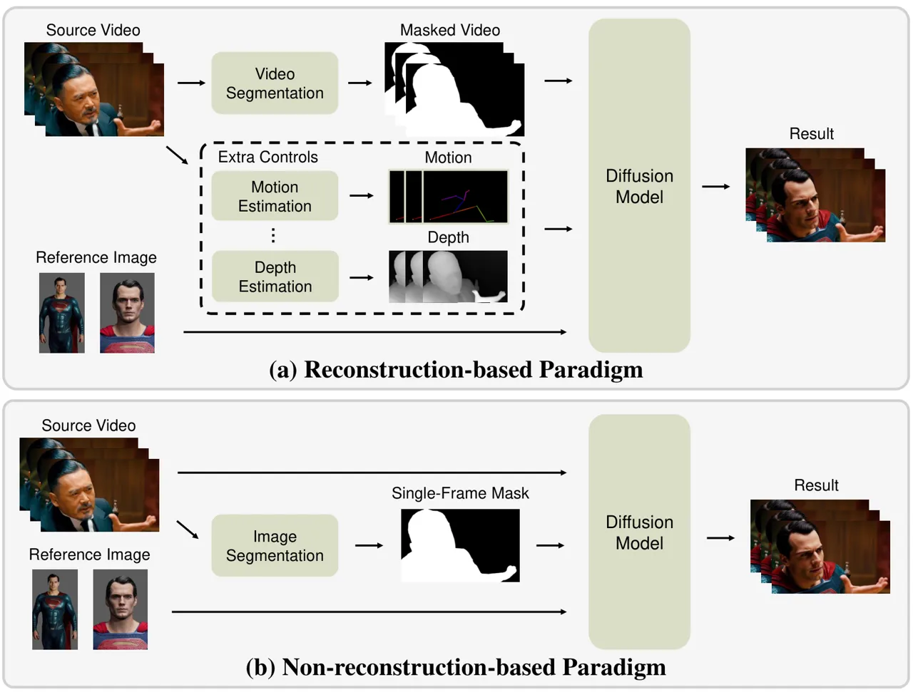
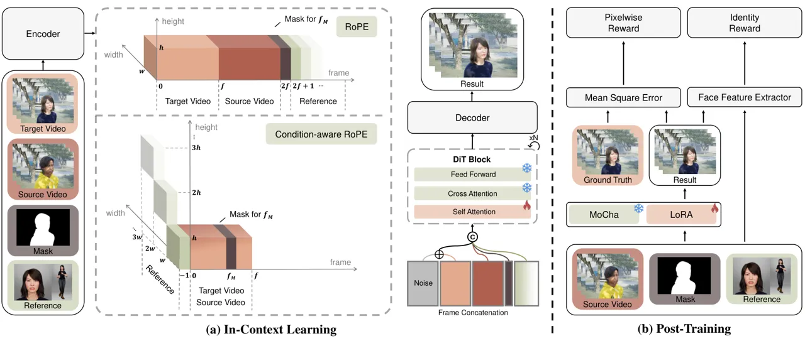
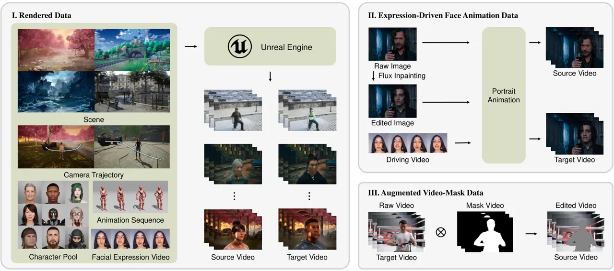
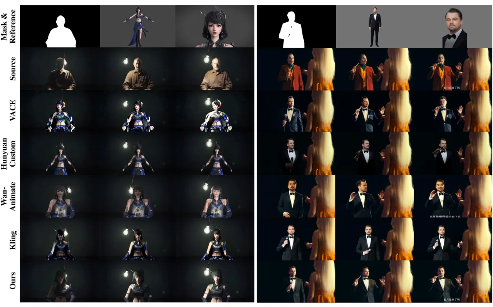
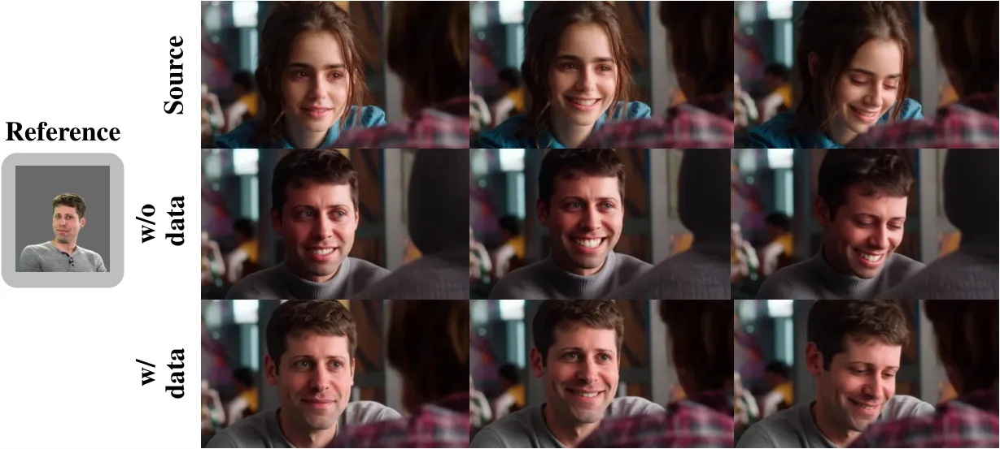
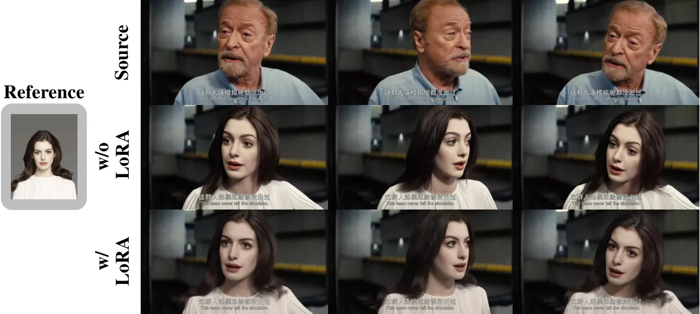
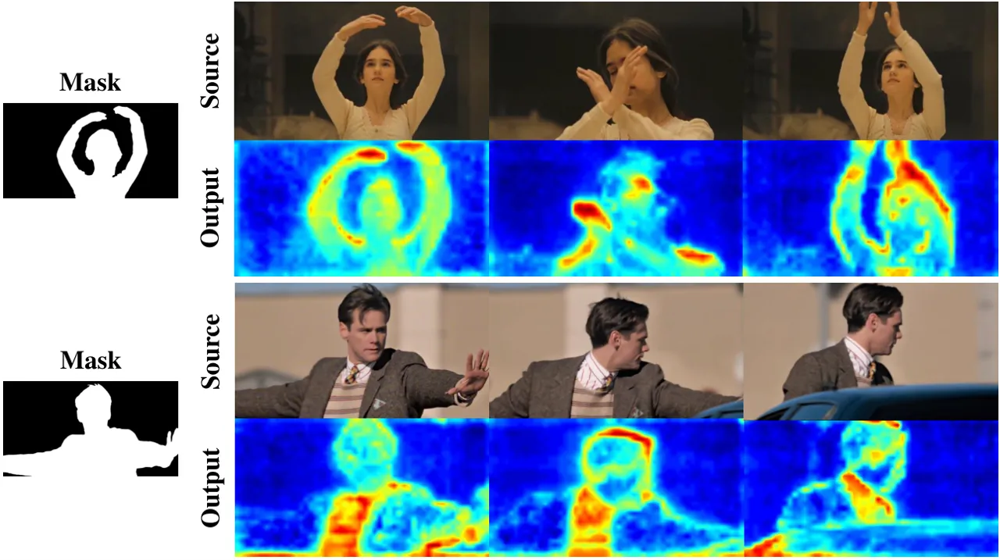
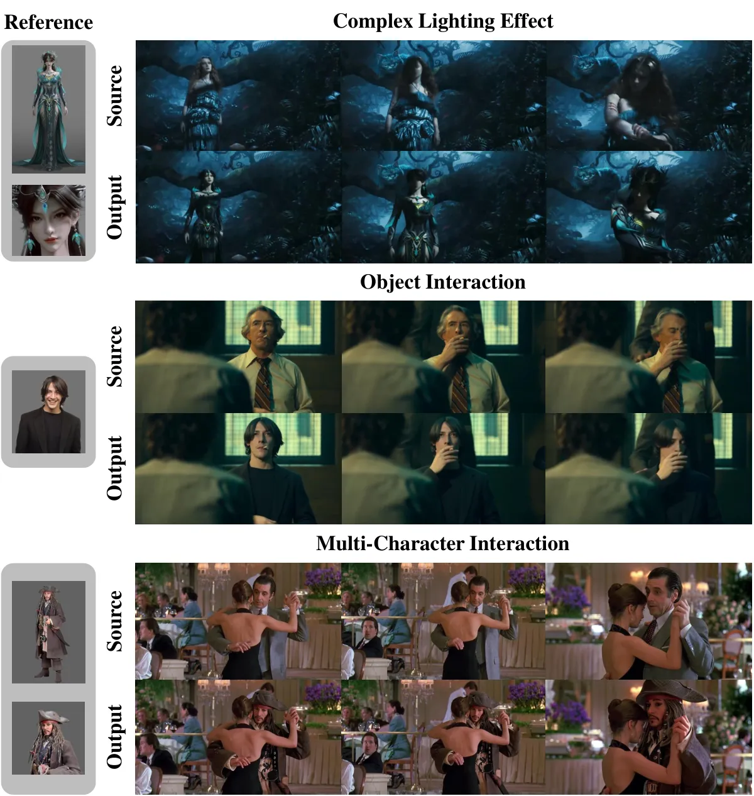

# MoCha: End-to-End Video Character Replacement without Structural Guidance

Zhengbo Xu    Jie Ma    Ziheng Wang    Zhan Peng    Jun Liang    Jing Li
Affiliation:  Project Page:
[orange-3dv-team.github.io/MoCha](https://orange-3dv-team.github.io/MoCha)

###### Abstract

Controllable video character replacement with a user-provided identity
remains a challenging problem due to the lack of paired video data.
Prior works have predominantly relied on a reconstruction-based paradigm
that requires per-frame segmentation masks and explicit structural
guidance (e.g., skeleton, depth). This reliance, however, severely
limits their generalizability in complex scenarios involving occlusions,
character-object interactions, unusual poses, or challenging
illumination, often leading to visual artifacts and temporal
inconsistencies. In this paper, we propose MoCha, a pioneering framework
that bypasses these limitations by requiring only a single arbitrary
frame mask. To effectively adapt the multi-modal input condition and
enhance facial identity, we introduce a condition-aware RoPE and employ
an RL-based post-training stage. Furthermore, to overcome the scarcity
of qualified paired-training data, we propose a comprehensive data
construction pipeline. Specifically, we design three specialized
datasets: a high-fidelity rendered dataset built with Unreal Engine 5
(UE5), an expression-driven dataset synthesized by current portrait
animation techniques, and an augmented dataset derived from existing
video-mask pairs. Extensive experiments demonstrate that our method
substantially outperforms existing state-of-the-art approaches. We will
release the code to facilitate further research. Please refer to our
project page for more details:
[orange-3dv-team.github.io/MoCha](https://orange-3dv-team.github.io/MoCha)

![[Uncaptioned
image]](arxiv-2601-08587--babe6fba3ccb.figures/figure-1.webp)

Figure 1: Examples generated by MoCha. MoCha enables high-fidelity
character replacement in source videos based on provided reference
images for diverse subjects, including virtual (first row) and
real-human (second row) characters. Furthermore, our approach robustly
preserves original lighting conditions (third row) and effectively
handles multi-character occlusion and interaction (fourth row).

## 1 Introduction

Recent breakthroughs in generative technologies, particularly diffusion
models 18; 2; 28; 17, have propelled content creation into a new era.
Consequently, user demand for fine-grained and highly personalized
editing of images and videos surges rapidly. Video character
replacement 4, defined as the task of seamlessly substituting the
character in a video while precisely preserving the original background,
scene dynamics, and character motion, demonstrates substantial practical
value and growing commercial significance. Its applicability spans
diverse domains, including costly post-production in film and
television, personalized advertising, virtual try-on, and the creation
of dynamic digital avatars.

Despite its significance, video character replacement still faces
significant challenges. Current research 13; 4; 11 has predominantly
adopted a reconstruction-based paradigm, as shown in Fig. 2. These
methods first require a dense, per-frame segmentation mask to annotate
the character spatial location and ruin its ID information. Then they
utilize the structural guidance, such as pose skeletons 31 or depth
maps 32 extracted from the source video, along with a reference image of
the new character, to re-render the video. While this paradigm produce
impressive results in simple scenarios, it struggles in complex
ones—such as videos with occlusion, unusual poses (e.g., acrobatics),
and multi-character interactions involving physical contact. In these
cases, the multi-frame masks and structural information are prone to
inaccuracies. Consequently, inaccuracies in these explicit guidance
signals are further propagated and amplified during the generation
process, resulting in severe visual artifacts, motion discontinuities,
and temporal inconsistency in the rendered videos. Furthermore, the
reliance on dense explicit guidance not only limits the flexibility and
robustness of video character replacement algorithms but also incurs
substantial computational overhead.



Figure 2: (a) Reconstruction-based paradigm used in baseline methods.
(b) Non-reconstruction-based paradigm used in MoCha.

Recent advances have shown that video diffusion models inherently
perform temporal perception and implicit reasoning abilities 30.
Harnessing these capabilities, specifically video tracking, we challenge
the reliance on a per-frame mask for this task. In this paper, we
propose MoCha, the first end-to-end framework for video character
replacement that requires only a single frame mask from an arbitrary
video frame without any structural guidance. MoCha operates by
decoupling the source character’s motion and facial expressions from the
background scene, and subsequently transferring these dynamics onto a
new reference identity through efficient in-context learning by
integrating the video content, frame mask, and reference character
identity. To coherently fuse these multi-modal inputs, we propose a
condition-aware RoPE, an extension of the original 3D RoPE 26; 28
mechanism. Furthermore, to better preserve the character’s identity, we
introduce a post-training stage guided by a differentiable facial reward
function 5. Benefiting from these designs, MoCha demonstrates strong
potential in achieving accurate and temporally consistent video
character replacement.

Training MoCha requires a high-quality paired dataset consisting of
source videos and corresponding target videos, in which the character is
replaced while preserving the character motion and scene dynamics. To
this end, we introduce a comprehensive data construction pipeline that
aggregates data from three distinct sources, as shown in Fig. 4. First,
we use Unreal Engine 5 (UE5) to render paired character video, ensuring
that different characters perform identical actions within the same
scene. Second, we generate animated portrait videos by first replacing
the person in a source image using the Flux inpainting model  18, and
then animating both the original and inpainted images using current
portrait animation methods 7 with a shared driving facial expression
sequence. Third, to further enrich data diversity, we incorporate
publicly available video-mask datasets 10. By training on this composite
dataset, MoCha can perform video character replacement in an end-to-end
manner, without requiring auxiliary inputs like per-frame masks or
structural guidance. Our contributions can be summarized as follows:



Figure 3: Overview of MoCha. Training MoCha consists of two stages: (a)
In-Context Learning. We apply the condition-aware RoPE to the
concatenated tokens and train the DiT backbone. (b) Post-Training. We
employ an RL-based strategy to further enhance the facial consistency.

- •
  We introduce a high-quality and large-scale paired dataset for video
  character replacement.
- •
  We propose MoCha, the first end-to-end framework for video character
  replacement that requires only a single frame mask from an arbitrary
  source video frame without any structural guidance. MoCha also
  demonstrates the tracking ability of the video diffusion model.
- •
  Extensive experiments demonstrate that MoCha significantly outperforms
  current state-of-the-art methods in terms of identity preservation,
  temporal consistency, and facial expression fidelity.

## 2 Related Works

In-Context Learning in Video Generation. Recent breakthroughs in video
generation have ushered in a new era for content creation.
State-of-the-art video diffusion models 28; 17 are now capable of
producing high-fidelity, long-duration videos. Building on these
foundation models, various works explore in-context learning for
different downstream tasks. This approach typically involves guiding the
generation process by concatenating conditioning inputs along the
temporal dimension. For instance, Recammaster 1 frames camera-controlled
video re-rendering as an in-context learning task, FullDiT 14 integrates
multiple conditions for versatile video generation, and VFXMaster 19
applies this method to transfer visual effects from a video to an image.
Motivated by the demonstrated effectiveness of this paradigm, our work
also adopts an in-context learning framework.

Video Character Replacement. Character replacement in video is a key
challenge in video editing, with recent methods showing significant
progress. A dominant paradigm among current methods is
reconstruction-based synthesis, where a specified character is generated
within a masked region of a target video. HunyuanCustom 11 simply masks
the target area and concatenates the reference image. VACE 13
incorporates structural guidance, such as depth or skeleton maps, into
the DiT diffusion model to maintain character movement. Building upon
this, Wan-Animate 4 introduces a face encoder to extract fine-grained
detail to maintain facial expressions. However, a key limitation of
these approaches is their reliance on dense, per-frame segmentation
masks and structural priors. In contrast, our method, MoCha, achieves
end-to-end character replacement via an implicit learning mechanism. It
requires only a single frame mask of the video, thus obviating the need
for such explicit guidance and streamlining the synthesis process.

## 3 Method

MoCha is designed for the video character replacement task, which
requires a source video
$`V_{s}\in\mathbb{R}^{f\times c\times h\times w}`$, a designation frame
mask $`M_{s}\in\mathbb{R}^{1\times 1\times h\times w}`$ to annotate the
character and a set of refernece character image
$`\{I_{i}\in\mathbb{R}^{1\times 1\times h\times w}\}`$, as shown in
Fig. 3. In this section, we first review the Flow matching framework
that is commonly used in current video diffusion models in Sec.3.1. Then
we introduce our in-context learning framework in Sec.3.2 and reward
post-training in Sec.3.3.

### 3.1 Preliminary

MoCha builds on the pretrained text-to-video latent diffusion model
using the Rectified Flow framework 6. The input video $`V_{0}`$ will
first be compressed to a latent $`z_{0}`$ through a video variational
encoder 15 (VAE). Based on the clean latent $`z_{0}`$, a noisy latent
$`z_{t}`$ is constructed by a randomly sampled timestep $`t`$ and a
noise $`\epsilon`$ sampled from standard Gaussian Distribution
$`\mathcal{N}(0,1)`$:

```math
z_{t}=(1-t)z_{0}+t\epsilon \tag{1}
```

During training, $`z_{t}`$ is fed to a Transformer-based diffusion
model 22 (DiT). The model predicts the velocity $`v_{\Theta}(z_{t},t)`$
at point $`z_{t}`$, the gradient value satisfying
$`\mathrm{d}z_{t}=v_{\Theta}(z_{t},t)\mathrm{d}t`$. We use the
Conditional Flow Matching 21 loss to optimize the model:

```math
\mathcal{L}_{FM}=\mathbb{E}_{z_{0},t,\epsilon}||v_{\Theta}(z_{t},t)-u_{t}(z_{0}|\epsilon)||_{2} \tag{2}
```

where $`u_{t}(z_{0}|\epsilon)`$ is the actual slope of the secant line
through $`z_{0}`$ and $`\epsilon`$. For inference, we start from a pure
noise $`z_{1}`$ and iteratively generate the output latent $`z_{0}`$
through a timestep list $`\{t_{i}\}`$:

```math
z_{t_{i+1}}=z_{t_{i}}+v_{\Theta}(z_{t_{i}},t_{i})\cdot(t_{i+1}-t_{i}) \tag{3}
```

where $`\{t_{i}\}`$ is a decreasing list with $`t_{0}=1`$ and
$`t_{n}=0`$. $`z_{0}`$ is finally decoded to the output video.

### 3.2 In-Context Learning

To guide the generation of a target video $`V_{t}`$ based on a source
video $`V_{s}`$, a designation mask $`M`$ for a single frame, and a set
of reference images $`\{I_{i}\}`$, we employ an in-context learning
manner due to its effectiveness demonstrated in various tasks 14; 8; 1; 19. Concretely, we first encode these conditions with a 3D VAE
$`\mathcal{E}`$ to achieve spatiotemporal compression. This yields the
latents $`z_{t}=\mathcal{E}(V_{t})`$, $`z_{s}=\mathcal{E}(S)`$,
$`z_{m}=\mathcal{E}(M)`$, $`z_{I_{i}}=\mathcal{E}(I_{i})`$. These
latents are then patchified into visual tokens, namely
$`x_{t}\in\mathbb{R}^{b\times f\times c\times h\times w}`$,
$`x_{s}\in\mathbb{R}^{b\times f\times c\times h\times w}`$,
$`x_{m}\in\mathbb{R}^{b\times 1\times c\times h\times w}`$, and
$`x_{I_{i}}\in\mathbb{R}^{b\times 1\times c\times h\times w}`$. Here
$`b`$, $`f`$, $`c`$, $`h`$, $`w`$ represent the batch size, frame count,
channel number, height, and width, respectively. Next, we concatenate
all conditional tokens with the target tokens along the frame dimension
to form a unified latent sequence:

```math
x=[x_{t},x_{s},x_{m},x_{I_{1}},x_{I_{2}},...] \tag{4}
```

where $`x\in\mathbb{R}^{b\times(2f+1+j)\times c\times h\times w}`$ and
$`j`$ is the number of reference images. The latent sequence $`x`$ is
subsequently fed into the DiT backbone and processed using full
self-attention.

However, a naive application of 3D Rotary Positional Embeddings (RoPE)
by assigning a different temporal index to each condition would result
in inflexible generation, such as being constrained to a fixed output
length. To address this, we propose a condition-aware RoPE mechanism to
coherently fuse these diverse inputs, as shown in Fig. 3. Concretely, we
assign the same frame index, ranging from $`0`$ to $`f-1`$, to both the
source video tokens $`x_{s}`$ and target video tokens $`x_{t}`$, as they
share a frame-to-frame correspondence. For the reference image tokens
$`{I_{i}}`$, a fixed frame index of $`-1`$ is assigned, and different
reference image tokens are distinguished using an offset in the height
and width dimensions. A key innovation of MoCha is that it supports
flexible arbitrary frame mask selection, which is implemented by
assigning a variable frame index $`f_{M}`$ for the mask token $`x_{m}`$
based on the designation frame number $`F`$, i.e.

```math
f_{M}=(F-1)//4+1 \tag{5}
```

This in-context learning manner, equipped with our designed
condition-aware RoPE, enables MoCha to effectively handle variable
generation length, flexible multi-reference images, and arbitrary frame
mask selection.

### 3.3 Identity-Enhancing Post-Training

Recent works 20; 25 have explored diffusion post-training with
reinforcement learning to align human preferences. Drawing inspiration
from this, we employ a similar RL-based post-training strategy to
further enhance the facial consistency between the generated video and
the reference images, as shown in Fig. 3 (b). The core idea is to guide
the generation process through an explicit optimization objective that
maximizes facial consistency between the generated video frames and
ground-truth video frames. Specifically, we compute a facial reward
score $`R_{face}`$ based on the cosine similarity between the Arcface 5
embeddings of the generated video and the reference images. To avoid
reward hacking that the model simply pastes the reference image into the
generated video, we also use a pixel-wise Mean Squared Error (MSE) loss
between the generated video and the GT video to provide dense
supervision. The overall loss function is:

```math
\mathcal{L}_{RL}=(1-R_{face})+||V_{t}-\hat{V_{t}}||_{2} \tag{6}
```

where $`\hat{V_{t}}`$ is the video generated by the model. Since
fine-grained details are primarily synthesized in the later timestamps
of the sampling process 23, we only backpropagate the loss through the
final $`K`$ sampling steps to reduce memory and accelerate optimization.



Figure 4: Overview of the data construction pipeline. We propose three
methods to construct the training dataset: (I) Rendered data built with
Unreal Engine 5. (II) Expression-driven face animation data generated
through portrait animation methods. (III) Augmented data synthesized
from traditional video-mask pairs.

## 4 Dataset

Training MoCha requires strictly aligned paired video, where different
characters share the same motion, facial expressions and background
dynamics. However, it is challenging to obtain such pairs in real-world
settings. To address this critical limitation, we introduce a
comprehensive data construction pipeline that aggregates data from three
distinct sources. This process is illustrated in Fig. 4.

### 4.1 Rendered Data

We develop a scalable data generation pipeline built upon Unreal Engine
5 (UE5) to synthesize a large-scale dataset of paired videos. The
pipeline leverages an extensive library of virtual assets from the UE
ecosystem, including 3D scenes, characters, motions, and facial
expressions. Each video is rendered through the random composition of
these assets. To enrich the dataset with diverse perspectives, we also
implement a procedural system to automatically generate natural camera
trajectories.

The core of our dataset lies in its paired structure. For each video, a
corresponding paired video is rendered by substituting the character
while meticulously preserving all other parameters. Additionally, a
video character mask is also rendered to precisely annotate the replaced
character location. Finally, for each character, a set of reference
images is rendered, capturing them in various poses and under different
lighting conditions.

### 4.2 Expression-Driven Face Animation Data

To enhance facial expression fidelity, we further construct an
expression-driven paired dataset by the current portrait animation
methods. We first collect a large set of film images and use the Flux
inpainting model 18 to substitute the foreground character. Then we use
LivePortrait 7 to animate both images with the same facial-driven video.
Simply using an image from the video as a reference image may cause a
copy-paste problem, i.e., the model tends to directly paste the
reference image to the generated video. Therefore, instead of using a
raw frame from the driving video as the reference, we augment its pose
with Flux Kontext 2. This creates a novel reference that forces the
model to decouple identity from facial animation.

### 4.3 Augmented Video-Mask Data

Training MoCha solely on the two aforementioned synthetic datasets may
lead to noticeable synthetic artifacts and a lack of realism in the
generated characters. To address this, we enrich our training set with
real-world videos from two public datasets that provide video-mask
pairs: VIVID-10M 10 and VPData 3. We apply a YOLOv12 detector 27 to
filter non-human videos. The references are augmented using the similar
method mentioned in Sec 4.2.

## 5 Experiments



Figure 5: Comparison with state-of-the-art methods. The results show
that MoCha can replace the character with more consistent animation,
higher facial expressiveness, and more natural lighting effects.

### 5.1 Experiment Settings

Implementation Details.  We use Wan-2.1-T2V-14B 28 as the base model,
due to its excellent performance. The training process consists of two
stages. In the in-context learning stage, we fine-tune all
self-attention layers to handle multi-model input conditions. Training
is conducted on $`8`$ NVIDIA H20 GPUs for $`30`$K steps. We use a
learning rate of $`2\times 10^{-5}`$, a batch size of $`8`$. In the
post-training stage, to avoid rewards affecting the generation ability
of the base model, we employ parameter-efficient fine-tuning using
Low-Rank Adaptation (LoRA) 9 instead of full model tuning. We apply LoRA
with a rank of $`64`$ to all linear layers within the DiT architecture.
The LoRA modules are then trained for $`500`$ steps, using a batch size
of $`8`$ and a learning rate of $`2\times 10^{-5}`$.

Our dataset consists of three distinct sources. We randomly select 60K,
20K, 20K videos from rendered data, expression-driven animation data,
and augmented video-mask data, respectively, in a total of 100K samples.
All videos, masks, and reference images are resized to $`480\times 832`$
resolution for training.

Training Strategy.  MoCha supports multiple reference images as input.
During training, we always provide one base reference and, with 50%
probability, include an additional face-centric reference. This
stochastic reference-dropout scheme improves robustness when reference
cues are limited and enhances the model’s ability to exploit extra
references to learn fine-grained facial details. In addition, we
initially train the model using short video clips (e.g., 21 frames).
Once the generation results stabilize, we increase the length of the
input video sequences (e.g., 81 frames) in subsequent training stage.

Benchmark.  To facilitate a comprehensive quantitative evaluation, we
introduce a new benchmark composed of two distinct subsets: a synthetic
benchmark and a real-world benchmark. The synthetic benchmark is
constructed by a render engine, providing perfectly paired data. To
ensure a fair comparison, none of the scenes, characters, motions, or
facial expressions in the benchmark appear in our training data. For
evaluation on this benchmark, we employ widely-used quantitative
metrics, including SSIM 29, LPIPS 33, and PSNR.

The real-world benchmark consists of a diverse set of videos collected
to encompass challenging scenarios, such as multi-person interactions,
rapid movements, and complex lighting conditions. For each video, we use
SAM2 24 to generate a randomly selected frame mask. We also curate a
diverse collection of reference images, spanning various artistic styles
(e.g., cartoon, photorealistic) and subject attributes (e.g., gender,
body shape). To assess performance on this benchmark, we adopt the
comprehensive evaluation suite from VBench 12 for a thorough comparison.

### 5.2 Comparison on Character Replacement

Baselines. We compare MoCha with the current state-of-the-art multimodal
video editing methods including VACE 13, Kling 16, Wan-Animate 4 and
HunyuanCustom 11. Among them, Kling 16 is a commercial product
supporting online character replacement. Other methods are open-sourced
and we use their official implementations for evaluation.

Qualitative Results.  We present several character replacement results
generated by MoCha in Fig. 1. Our model demonstrates robust performance
across diverse subject styles, handling both cartoon and real-human
characters. Specifically, MoCha is capable of reproducing vivid facial
expressions and transferring complex animation onto the reference
characters.

We further compare MoCha with state-of-the-art methods in Fig. 5. While
all these methods can generate relatively high-quality video based on a
reference character, they exhibit distinct limitations. Specifically,
Kling 16 and HunyuanCustom 11 successfully preserve the characteristics
of the reference character, but fail to maintain the character’s
original motion and cannot integrate the character naturally into the
source video. Wan-Animate 4 and VACE 13 preserve the clothing of target
character well. However, they struggle to learn precise lighting and
shading information because their reconstruction-based paradigm loses a
significant amount of original video information. In comparison, MoCha
can replace the specified character with high identity and animation
consistency, all while preserving the original environment details and
lighting effects.

Quantitative Results.  We compare MoCha with other methods on the
aforementioned quantitative metrics. It is important to note that we
omit Kling from the comparison because it lacks the capability for
large-scale, automated batch testing. As shown in Tab. 1, MoCha
consistently achieves state-of-the-art performance across all
reference-based metrics, demonstrating superior temporal coherence and
structural fidelity. For VBench 12 metrics, we select six different
evaluation dimensions most closely related to our character replacement
task. Tab. 2 illustrates that videos generated by MoCha exhibit superior
quality and consistency compared to existing methods.

|               |                  |                     |                  |
| ------------- | ---------------- | ------------------- | ---------------- |
| Method        | SSIM$`\uparrow`$ | LPIPS$`\downarrow`$ | PSNR$`\uparrow`$ |
| VACE          | 0.572            | 0.253               | 17.10            |
| HunyuanCustom | 0.644            | 0.257               | 17.70            |
| Wan-Animate   | 0.692            | 0.213               | 19.20            |
| MoCha         | 0.746            | 0.152               | 23.09            |

Table 1: Quantitative comparison with state-of-the-art methods on
synthesized benchmark on structural similarity (SSIM), perceptual
similarity (LPIPS) and reconstruction quality (PSNR).

|               |                                  |                                     |                                |                              |                                  |                                |
| ------------- | -------------------------------- | ----------------------------------- | ------------------------------ | ---------------------------- | -------------------------------- | ------------------------------ |
| Method        | Subject Consistency $`\uparrow`$ | Background Consistency $`\uparrow`$ | Aesthetic Quality $`\uparrow`$ | Imaging Quality $`\uparrow`$ | Temporal Flickering $`\uparrow`$ | Motion Smoothness $`\uparrow`$ |
| VACE          | 71.19                            | 77.89                               | 56.76                          | 60.88                        | 97.04                            | 97.87                          |
| HunyuanCustom | 90.03                            | 93.68                               | 56.77                          | 58.92                        | 97.98                            | 98.62                          |
| Wan-Animate   | 91.25                            | 93.42                               | 54.60                          | 58.48                        | 97.27                            | 98.25                          |
| MoCha         | 92.25                            | 94.40                               | 60.24                          | 59.58                        | 97.98                            | 98.79                          |

Table 2: Quantitative comparison with state-of-the-art methods on
real-world benchmark on VBench 12 metrics.

### 5.3 Ablation Study



Figure 6: Ablation on Real-Human Data. The result shows that real-human
data improves the overall realism and facial fidelity of the output.

Ablation on Real-Human Data. In this paper, we propose several methods
to construct paired training data for the character replacement task.
Among these, the rendered dataset forms the foundation of our training
data since its paired video is strictly aligned. To validate the
contribution of the remaining real-human datasets (i.e., the
expression-driven data and the augmented video-mask data), we compare
the model’s performance when trained with and without their inclusion.

As illustrated in Fig. 6, the real-human datasets significantly enhance
the generated character’s facial appearance, yielding expressions that
more accurately align with the source video character. Furthermore, the
result indicates that these data are crucial for overall quality: they
effectively mitigate the synthetic artifacts (e.g., an overly smooth or
glossy texture) brought by the rendered data, and substantially generate
more realistic and higher-fidelity characters.



Figure 7: Ablation on Identity-Enhancing Post-Training. The result shows
that our post-training strategy is crucial to enhance the facial
consistency.

Ablation on Identity-Enhancing Post-Training. In Section 3.3, we
introduce an RL-based identity-enhancing post-training strategy to
overcome the challenge of imperfect identity consistency in the face of
the generated video relative to the reference image. As shown in Fig. 7,
equipped with reward LoRA, our model significantly improves the
character’s facial identity preservation while simultaneously
maintaining the original generation quality.

### 5.4 More Analysis



Figure 8: Visualization of the attention score. It shows that MoCha can
automatically trace the character with the mask of only one frame.

Tracking ability of video diffusion model.  Our method, MoCha, leverages
the inherent tracking capabilities of video diffusion models, requiring
only a single-frame mask to identify the target character, rather than a
mask sequence for the entire video. To validate this tracking ability,
we visualize the attention score map between the mask latent and the
source video latent. As shown in Fig. 8, the regions corresponding to
the selected character consistently maintain high attention scores
across different frames. This observation confirms that the model can
effectively track the specified subject throughout the video sequence,
obviating the need for sequential masks.



Figure 9: MoCha’s performance on complex scenarios. MoCha demonstrates
its robustness and practical utility on complex cases that are commonly
encountered in real-world film and video production.

Performance on Complex Cases. To demonstrate the wide applicability and
practical utility of MoCha, we evaluate its performance using a
collection of more complex test cases. We focus on challenging examples
by seeking difficult scenarios across three distinct dimensions: 1)
Complex lighting effect. 2) Object interaction. 3) Multiple-character
interaction. Fig. 9 illustrates MoCha’s performance in these scenarios.
The results confirm that our model consistently generates highly
realistic and high-quality video even under these conditions.

Application beyond Character Replacement. Although our method is
primarily developed for the character replacement task, we observe that
MoCha demonstrates the capability to handle other types of subject
replacement and video editing. Specifically, our model can seamlessly
replace non-human subjects from the source video. Furthermore, by
editing the reference character’s face and clothing using image-editing
models, MoCha can be readily applied to tasks such as face swapping and
virtual try-on. Some novel and illustrative results showing this
expanded utility are presented in the supplementary material. In
summary, these findings highlight MoCha’s strong generalization ability
and broad practical utility.

## 6 Conclusion

In this paper, we introduce MoCha, the first end-to-end video character
replacement framework. Distinct from current reconstruction-based
methods that rely on dense guidance, MoCha efficiently fulfills the
replacement task, requiring only a single arbitrary frame mask by
harnessing the tracking ability of the video diffusion model. MoCha
faithfully transfers original character motion and facial expression
through efficient in-context learning. To effectively adapt the
multi-modal input condition and enhance facial identity, we introduce a
condition-aware RoPE and an RL-based post-training stage guided by a
differentiable facial function. Extensive experimental results
demonstrate that MoCha significantly outperforms existing methods.
Finally, we show that MoCha exhibits wide applicability beyond video
character replacement, extending to applications such as face swapping
and virtual try-on.

## References

- Bai et al. (2025) J. Bai, M. Xia, X. Fu, X. Wang, L. Mu, J. Cao, Z.
  Liu, H. Hu, X. Bai, P. Wan, et al. Recammaster: camera-controlled
  generative rendering from a single video. arXiv preprint
  arXiv:2503.11647. Cited by: §2, §3.2.
- Batifol et al. (2025) S. Batifol, A. Blattmann, F. Boesel, S.
  Consul, C. Diagne, T. Dockhorn, J. English, Z. English, P. Esser, S.
  Kulal, et al. FLUX. 1 kontext: flow matching for in-context image
  generation and editing in latent space. arXiv e-prints,
  pp. arXiv–2506. Cited by: §1, §4.2.
- Bian et al. (2025) Y. Bian, Z. Zhang, X. Ju, M. Cao, L. Xie, Y. Shan,
  and Q. Xu Videopainter: any-length video inpainting and editing with
  plug-and-play context control. In Proceedings of the Special Interest
  Group on Computer Graphics and Interactive Techniques Conference
  Conference Papers, pp. 1–12. Cited by: §4.3.
- Cheng et al. (2025) G. Cheng, X. Gao, L. Hu, S. Hu, M. Huang, C.
  Ji, J. Li, D. Meng, J. Qi, P. Qiao, et al. Wan-animate: unified
  character animation and replacement with holistic replication. arXiv
  preprint arXiv:2509.14055. Cited by: §1, §1, §2, §5.2, §5.2.
- Deng et al. (2019) J. Deng, J. Guo, N. Xue, and S. Zafeiriou Arcface:
  additive angular margin loss for deep face recognition. In Proceedings
  of the IEEE/CVF conference on computer vision and pattern recognition,
  pp. 4690–4699. Cited by: §1, §3.3.
- Esser et al. (2024) P. Esser, S. Kulal, A. Blattmann, R. Entezari, J.
  Müller, H. Saini, Y. Levi, D. Lorenz, A. Sauer, F. Boesel, et al.
  Scaling rectified flow transformers for high-resolution image
  synthesis. In Forty-first international conference on machine
  learning, Cited by: §3.1.
- Guo et al. (2024) J. Guo, D. Zhang, X. Liu, Z. Zhong, Y. Zhang, P.
  Wan, and D. Zhang Liveportrait: efficient portrait animation with
  stitching and retargeting control. arXiv preprint arXiv:2407.03168.
  Cited by: §1, §4.2.
- He et al. (2025) X. He, Q. Liu, Z. Ye, W. Ye, Q. Wang, X. Wang, Q.
  Chen, P. Wan, D. Zhang, and K. Gai Fulldit2: efficient in-context
  conditioning for video diffusion transformers. arXiv preprint
  arXiv:2506.04213. Cited by: §3.2.
- Hu et al. (2022) E. J. Hu, Y. Shen, P. Wallis, Z. Allen-Zhu, Y. Li, S.
  Wang, L. Wang, W. Chen, et al. Lora: low-rank adaptation of large
  language models.. ICLR 1 (2), pp. 3. Cited by: §5.1.
- Hu et al. (2024) J. Hu, T. Zhong, X. Wang, B. Jiang, X. Tian, F.
  Yang, P. Wan, and D. Zhang VIVID-10m: a dataset and baseline for
  versatile and interactive video local editing. arXiv preprint
  arXiv:2411.15260. Cited by: §1, §4.3.
- Hu et al. (2025) T. Hu, Z. Yu, Z. Zhou, S. Liang, Y. Zhou, Q. Lin,
  and Q. Lu Hunyuancustom: a multimodal-driven architecture for
  customized video generation. arXiv preprint arXiv:2505.04512. Cited
  by: §1, §2, §5.2, §5.2.
- Huang et al. (2024) Z. Huang, Y. He, J. Yu, F. Zhang, C. Si, Y.
  Jiang, Y. Zhang, T. Wu, Q. Jin, N. Chanpaisit, et al. Vbench:
  comprehensive benchmark suite for video generative models. In
  Proceedings of the IEEE/CVF Conference on Computer Vision and Pattern
  Recognition, pp. 21807–21818. Cited by: §5.1, §5.2, Table 2, Table 2.
- Jiang et al. (2025) Z. Jiang, Z. Han, C. Mao, J. Zhang, Y. Pan, and Y.
  Liu Vace: all-in-one video creation and editing. arXiv preprint
  arXiv:2503.07598. Cited by: §1, §2, §5.2, §5.2.
- Ju et al. (2025) X. Ju, W. Ye, Q. Liu, Q. Wang, X. Wang, P. Wan, D.
  Zhang, K. Gai, and Q. Xu Fulldit: multi-task video generative
  foundation model with full attention. arXiv preprint arXiv:2503.19907.
  Cited by: §2, §3.2.
- Kingma and Welling (2013) D. P. Kingma and M. Welling Auto-encoding
  variational bayes. arXiv preprint arXiv:1312.6114. Cited by: §3.1.
- Kling (2025) Kling Kling. Note:
  [https://klingai.com](https://klingai.com) Cited by: §5.2, §5.2.
- Kong et al. (2024) W. Kong, Q. Tian, Z. Zhang, R. Min, Z. Dai, J.
  Zhou, J. Xiong, X. Li, B. Wu, J. Zhang, et al. Hunyuanvideo: a
  systematic framework for large video generative models. arXiv preprint
  arXiv:2412.03603. Cited by: §1, §2.
- Labs (2024) B. F. Labs FLUX. Note:
  [https://github.com/black-forest-labs/flux](https://github.com/black-forest-labs/flux)
  Cited by: §1, §1, §4.2.
- Li et al. (2025) B. Li, Y. Zhang, Q. Wang, L. Ma, X. Shi, X. Wang, P.
  Wan, Z. Yin, Y. Zhuge, H. Lu, et al. VFXMaster: unlocking dynamic
  visual effect generation via in-context learning. arXiv preprint
  arXiv:2510.25772. Cited by: §2, §3.2.
- Liang et al. (2025) Z. Liang, Y. Yuan, S. Gu, B. Chen, T. Hang, M.
  Cheng, J. Li, and L. Zheng Aesthetic post-training diffusion models
  from generic preferences with step-by-step preference optimization. In
  Proceedings of the Computer Vision and Pattern Recognition Conference,
  pp. 13199–13208. Cited by: §3.3.
- Lipman et al. (2022) Y. Lipman, R. T. Chen, H. Ben-Hamu, M. Nickel,
  and M. Le Flow matching for generative modeling. arXiv preprint
  arXiv:2210.02747. Cited by: §3.1.
- Peebles and Xie (2022) W. Peebles and S. Xie Scalable diffusion models
  with transformers. arXiv preprint arXiv:2212.09748. Cited by: §3.1.
- Prabhudesai et al. (2023) M. Prabhudesai, A. Goyal, D. Pathak, and K.
  Fragkiadaki Aligning text-to-image diffusion models with reward
  backpropagation. Cited by: §3.3.
- Ravi et al. (2024) N. Ravi, V. Gabeur, Y. Hu, R. Hu, C. Ryali, T.
  Ma, H. Khedr, R. Rädle, C. Rolland, L. Gustafson, et al. Sam 2:
  segment anything in images and videos. arXiv preprint
  arXiv:2408.00714. Cited by: §5.1.
- Shen et al. (2025) X. Shen, Z. Li, Z. Yang, S. Zhang, Y. Zhang, D.
  Li, C. Wang, Q. Lu, and Y. Tang Directly aligning the full diffusion
  trajectory with fine-grained human preference. arXiv preprint
  arXiv:2509.06942. Cited by: §3.3.
- Su et al. (2024) J. Su, M. Ahmed, Y. Lu, S. Pan, W. Bo, and Y. Liu
  Roformer: enhanced transformer with rotary position embedding.
  Neurocomputing 568, pp. 127063. Cited by: §1.
- Tian et al. (2025) Y. Tian, Q. Ye, and D. Doermann YOLOv12:
  attention-centric real-time object detectors. arXiv preprint
  arXiv:2502.12524. Cited by: §4.3.
- Wan et al. (2025) T. Wan, A. Wang, B. Ai, B. Wen, C. Mao, C. Xie, D.
  Chen, F. Yu, H. Zhao, J. Yang, J. Zeng, J. Wang, J. Zhang, J. Zhou, J.
  Wang, J. Chen, K. Zhu, K. Zhao, K. Yan, L. Huang, M. Feng, N.
  Zhang, P. Li, P. Wu, R. Chu, R. Feng, S. Zhang, S. Sun, T. Fang, T.
  Wang, T. Gui, T. Weng, T. Shen, W. Lin, W. Wang, W. Wang, W. Zhou, W.
  Wang, W. Shen, W. Yu, X. Shi, X. Huang, X. Xu, Y. Kou, Y. Lv, Y.
  Li, Y. Liu, Y. Wang, Y. Zhang, Y. Huang, Y. Li, Y. Wu, Y. Liu, Y.
  Pan, Y. Zheng, Y. Hong, Y. Shi, Y. Feng, Z. Jiang, Z. Han, Z. Wu,
  and Z. Liu Wan: open and advanced large-scale video generative models.
  arXiv preprint arXiv:2503.20314. Cited by: §1, §1, §2, §5.1.
- Wang et al. (2004) Z. Wang, A. C. Bovik, H. R. Sheikh, and E. P.
  Simoncelli Image quality assessment: from error visibility to
  structural similarity. IEEE transactions on image processing 13 (4),
  pp. 600–612. Cited by: §5.1.
- Wiedemer et al. (2025) T. Wiedemer, Y. Li, P. Vicol, S. S. Gu, N.
  Matarese, K. Swersky, B. Kim, P. Jaini, and R. Geirhos Video models
  are zero-shot learners and reasoners. arXiv preprint arXiv:2509.20328.
  Cited by: §1.
- Xu et al. (2022) Y. Xu, J. Zhang, Q. Zhang, and D. Tao Vitpose: simple
  vision transformer baselines for human pose estimation. Advances in
  neural information processing systems 35, pp. 38571–38584. Cited by:
  §1.
- Yang et al. (2024) L. Yang, B. Kang, Z. Huang, X. Xu, J. Feng, and H.
  Zhao Depth anything: unleashing the power of large-scale unlabeled
  data. In Proceedings of the IEEE/CVF conference on computer vision and
  pattern recognition, pp. 10371–10381. Cited by: §1.
- Zhang et al. (2018) R. Zhang, P. Isola, A. A. Efros, E. Shechtman,
  and O. Wang The unreasonable effectiveness of deep features as a
  perceptual metric. In Proceedings of the IEEE conference on computer
  vision and pattern recognition, pp. 586–595. Cited by: §5.1.
