# ELITE: Efficient Gaussian Head Avatar from a Monocular Video via Learned Initialization and TEst-time Generative Adaptation

Kim Youwang¹  Lee Hyoseok²  Park Subin³  Gerard Pons-Moll^(4,5,6)
 Tae-Hyun Oh²  
¹Dept. of Electrical Engineering, POSTECH  ²School of Computing,
KAIST  ³UNIST  
⁴University of Tübingen  ⁵Tübingen AI Center  ⁶Max Planck Institute for
Informatics

###### Abstract

We introduce ELITE, an Efficient Gaussian head avatar synthesis from a
monocular video via Learned Initialization and TEst-time generative
adaptation. Prior works rely either on a 3D data prior or a 2D
generative prior to compensate for missing visual cues in monocular
videos. However, 3D data prior methods often struggle to generalize
in-the-wild, while 2D generative prior methods are computationally heavy
and prone to identity hallucination. We identify a complementary synergy
between these two priors and design an efficient system that achieves
high-fidelity animatable avatar synthesis with strong in-the-wild
generalization. Specifically, we introduce a feed-forward Mesh2Gaussian
Prior Model (MGPM) that enables fast initialization of a Gaussian
avatar. To further bridge the domain gap at test time, we design a
test-time generative adaptation stage, leveraging both real and
synthetic images as supervision. Unlike previous full diffusion
denoising strategies that are slow and hallucination-prone, we propose a
rendering-guided single-step diffusion enhancer that restores missing
visual details, grounded on Gaussian avatar renderings. Our experiments
demonstrate that ELITE produces visually superior avatars to prior
works, even for challenging expressions, while achieving
$`\text{60}\times`$ faster synthesis than the 2D generative prior
methods. Project page:
[https://kim-youwang.github.io/elite](https://kim-youwang.github.io/elite).

![[Uncaptioned
image]](arxiv-2601-10200--66c743d7f51b.figures/figure-1.webp)

Figure 1: ELITE synthesizes an animatable photorealistic Gaussian head
avatar from a casual monocular video. To compensate for missing views
and expressions from the input video, ELITE leverages two complementary
priors: (1) 3D data prior for feed-forward Gaussian initialization, and
(2) 2D generative prior for augmenting unseen views and expressions for
test-time adaptation. Compared to existing methods \[37, 41\] that
utilize no priors or only a 2D generative prior, ELITE achieves superior
generalization across unseen views and expressions in the wild. Please
refer to the supplementary video for dynamic avatar animation results.

## 1 Introduction

Photorealistic human head avatars have become an essential building
block for modern immersive applications, including telepresence in
virtual and augmented reality \[20, 22, 21, 10, 4, 15\] as well as
virtual film production \[7\]. Advances in neural rendering \[12, 24,
25, 9\] and 3D human face modeling \[35, 29, 13\] have greatly improved
visual fidelity. However, these approaches still rely on accurately
calibrated multi-view video inputs and time-consuming optimization
procedures, limiting the popularization of such promising technologies
to novice users in reality.

To enable practical and efficient avatar synthesis, we tackle the
problem of high-fidelity, animatable head avatar synthesis from more
accessible capture setups, such as monocular selfie videos. The core
challenge here is the trade-off between the abundance of visual
observations and the burdens caused by the capture setup. High-fidelity
3D/4D avatar reconstruction typically relies on dense visual
observations from accurately calibrated multi-view human performance
capture systems \[11, 14, 20, 46, 44, 7\], which require substantial
computing resources and complex processing pipelines. On the contrary,
accessible and casual capture methods, _e.g_., monocular phone videos,
simplify the acquisition process but require strong prior knowledge to
compensate for the lack of visual evidence.

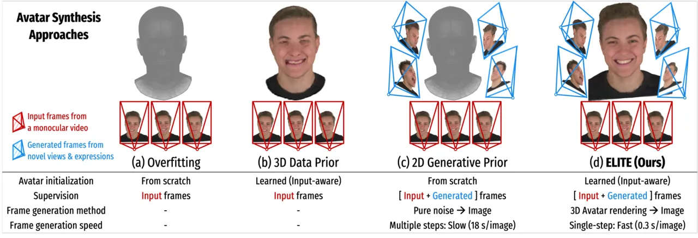

Figure 2: Comparison of existing avatar synthesis approaches. (a)
Overfitting methods \[51, 37\] optimize avatars from scratch, starting
from 3D primitives anchored on a template mesh, and use only the input
video frames as supervision. (b) 3D data prior methods \[52, 1\] use
learned avatar initialization, but use only the input video frames as
supervision. (c) 2D generative prior methods \[40, 41\] use
diffusion-generated (full denoising, _i.e_., slow) images as test-time
supervision, but optimize avatars from scratch. (d) Our ELITE enjoys the
benefits of (b) and (c), _i.e_., we use learned avatar initialization
and generated images as test-time supervision. We also generate images
using a single-step diffusion that enhances Gaussian avatar renderings,
significantly faster than full denoising methods \[40, 41\].

Several works \[52, 49, 2, 1\] have tried to learn facial appearance,
geometry, and expression priors from 3D datasets, to initialize 3D
avatars from these priors, and to adapt them to monocular input frames
at test time. However, due to practical challenges in scaling the
capture dataset and limited observations at test time, this 3D data
prior adaptation strategy often struggles to handle in-the-wild edge
cases, _e.g_., long hair and rare facial expressions \[2\]. More
recently, as another line of research, 2D generative prior
approaches \[41, 40\] employ diffusion models to generate facial images
from unseen views and expressions, providing additional supervision to
complete missing views and expressions during 3D reconstruction. While
yielding improved generalization, these methods suffer from severe
identity hallucinations, a slow sampling process of diffusion models,
and the costly optimization of 3D primitives from scratch.

We observe that existing works have relied either on a 3D data prior or
a 2D generative prior, and identify a potential complementary synergy
between the two. Our key idea is that (1) the limitations of 3D data
prior methods, _i.e_., hard to generalize in-the-wild, can be alleviated
if supervised by synthetic images from a generative model, and (2) slow
sampling and hallucinations of 2D generative prior methods can be
mitigated if grounded on 3D avatar renderings. Building upon these, we
propose ELITE, an Efficient Gaussian head avatar synthesis by leveraging
Learned Initialization and TEst-time generative adaptation (Fig. 1). We
build a 3D data prior model, the Mesh2Gaussian Prior Model (MGPM), that
provides an efficient, identity-preserving Gaussian avatar
initialization. To bridge the domain gap between the MGPM’s training
dataset (studio capture) and in-the-wild scenarios, we design a
test-time generative adaptation stage that uses both real video frames
and synthetic images as test-time supervision. Unlike conventional 2D
generative prior approaches \[40, 41\], which are slow and
hallucination-prone because they rely on full-diffusion denoising from
pure noise, we leverage Gaussian avatar renderings as strong
initializations for image generation. Specifically, we propose a
rendering-guided single-step diffusion enhancer that fixes visual
artifacts and completes missing visual details, grounded on 3D
renderings. We evaluate the quality of ELITE-generated avatars on
unseen, diverse identities and expressions and show that
ELITE outperforms recent competing methods both visually and
quantitatively. We also investigate the effects of the core design
choices.

We summarize our main contributions as follows:

- •
  We introduce ELITE, an efficient Gaussian head avatar synthesis method
  that synergizes a 3D data prior with a 2D generative prior,
  complementing each prior’s drawbacks.
- •
  Our feed-forward 3D data prior model initializes Gaussian avatars in a
  feed-forward manner, enabling fast, stable test-time adaptation via
  better initialization.
- •
  Our test-time generative adaptation integrates a single-step diffusion
  enhancement guided by 3D avatar renderings for efficient synthesis and
  improved identity preservation.

## 2 Related Work

We aim to build an efficient system that creates an authentic Gaussian
head avatar from a monocular video. We categorize related approaches
into: {Overfitting, 3D data prior, and 2D generative prior} approaches
(see Fig. 2).

#### Overfitting approaches

Early methods proposed to overfit a 3D representation against the input
video sequence *from scratch* \[51, 5, 6, 50\]. Typically, a set of 3D
primitives, _e.g_., a deformable mesh \[6\], Neural Radiance Fields
(NeRF) \[24, 5\], Signed Distance Fields (SDF) \[50\], are optimized to
minimize photometric losses against the captured frames. Recently,
methods leveraging 3D Gaussian Splatting (3DGS) \[12\] have shown
improved fidelity \[37, 43\]. Although these overfitting approaches are
capable of producing plausible results for the training views, they
require separate optimization for every new identity, without
identity-specific initialization (Fig. 2a). Such per-identity
overfitting _from scratch_ is inefficient and limits animated avatars’
ability to generalize to complex viewpoints or unseen expressions.

#### 3D data prior approaches

To facilitate efficient avatar synthesis, 3D data prior approaches \[49,
2, 16, 52, 1\] have proposed training a generalizable data-driven prior
model for animatable 3D head avatars. Such prior, trained on multi-view
performance capture \[14, 2, 23\] or synthetic 3D head assets \[52, 1\],
encodes strong shape and appearance information. Cao et al. \[2\]
proposed a VAE-style prior model that translates tracked face mesh UV
maps into UV-aligned volumetric primitives \[21\]. Recently,
HeadGAP \[49\] and SynShot \[52\] proposed 3D prior models that
translate the tracked face meshes into a set of 3D Gaussians. At test
time, they initialize a 3D avatar from the learned 3D data prior model,
and test-time adaptation is applied to reduce domain gaps in in-the-wild
setups. Such test-time adaptation from the avatar initialization
significantly speeds up avatar synthesis, compared to fitting 3D
primitives from scratch. However, test-time supervision still relies on
few-shot images with limited viewpoints and expressions; the resulting
avatars often overfit to constrained observations or distort the learned
expression space of the prior model \[2\]. Furthermore, they cannot
model the torso and shoulder regions and are closed-source, limiting
their practical applicability.

#### 2D generative prior approaches

With the advancements in image generative models \[32, 26\], animatable
head avatar synthesis methods using generated images as supervision have
emerged \[40, 41\]. GAF \[40\] and CAP4D \[41\] are analogous, where
they optimize Gaussian avatar _from scratch_ by using a set of synthetic
face images with diverse viewpoints and expressions, generated by a
multi-view image diffusion model \[47, 32\] (Fig. 2c). While the
direction of using synthetic images to enhance the avatar’s
generalization to extreme viewpoints and expressions is promising, the
multiple diffusion sampling steps are required to ensure high-fidelity
generation, making the overall pipeline computationally expensive and
time-consuming. Moreover, because such diffusion models generate images
from pure noise, the resulting images exhibit severe identity shifts,
hindering 3D representation optimization and degrading the fidelity and
identity consistency of the avatar.

#### Our approach

From the previous works, we observe disconnected advancements of a 3D
data prior and a 2D generative prior. We identify their potential
complementarity and propose a systematic coupling of both priors
(Fig. 2d): (1) a learned 3D data prior model can achieve generalization
if supervised by synthetic images from a generative model, (2) a 2D
generative model can generate identity-preserving images with improved
speed if a 3D prior model provides reliable image initialization,
_e.g_., 3D avatar renderings. Unlike the previous works that rely either
on a 3D data prior or a 2D generative prior, we show that systematic
coupling of both priors enables efficient and high-fidelity avatar
synthesis by mitigating the drawbacks of prior works (see Fig. 1).

## 3 ELITE: Efficient Gaussian Head via Learned Initialization & TEst-time Adaptation

We introduce ELITE: how we train the feed-forward 3D data prior model
for avatar initialization (Sec. 3.1), how we perform test-time
adaptation by leveraging real images (Sec. 3.2), how we train a
single-step diffusion enhancer guided by rendered avatar (Sec. 3.3), and
how we design test-time generative adaptation (Sec. 3.4).

### 3.1 Feed-forward Gaussian Head Avatar Initialization via Learned Mesh2Gaussian Prior Model

The core module of ELITE is the Mesh2Gaussian Prior Model (MGPM). The
MGPM is a feed-forward U-Net \[33\] model that efficiently initializes a
3D avatar given monocular video frames as input. The MGPM is trained to
translate 3D mesh surface information, _e.g_., RGB color and vertex
displacement, into a set of 2D Gaussian primitives (see Fig. 3).

#### MGPM pipeline

The MGPM takes the concatenated canonical FLAME \[18\] UV texture and
geometry maps,
$`[\mathbf{M}_{\text{tex}},\mathbf{M}_{\text{geo}}]\in\mathbb{R}^{H\times W\times(3+3)}`$,
as an input. We obtain both UV maps via photometric FLAME
tracking \[30\] on videos. To control the dynamic expressions and
movements of the output Gaussian head avatar, we inject FLAME driving
signals, _i.e_., expression code
$`\mbox{\boldmath$\psi$}_{\text{expr}}`$, joint poses
$`\mbox{\boldmath$\theta$}_{\text{jaw}}`$,
$`\mbox{\boldmath$\theta$}_{\text{eyes}}`$,
$`\mbox{\boldmath$\theta$}_{\text{neck}}`$, global head rotation
$`\mbox{\boldmath$\theta$}_{\text{glob}}`$, and translation
$`{\mathbf{t}}`$, as conditioning signals through FiLM \[27\] layers.
The MGPM U-Net, $`\mathcal{F}_{\phi}`$, then translates mesh UV maps and
driving signals into UV-aligned 2D Gaussians (2DGS) as:

```math
\displaystyle\mathbf{M}_{\text{gs}|\mbox{\boldmath$\Theta$}}=\mathcal{F}_{\phi}([\mathbf{M}_{\text{tex}},\mathbf{M}_{\text{geo}}],\mbox{\boldmath$\Theta$}), \tag{1}
```

where
$`\mbox{\boldmath$\Theta$}{=}[\mbox{\boldmath$\psi$}_{\text{expr}},\mbox{\boldmath$\theta$}_{\text{jaw}},\mbox{\boldmath$\theta$}_{\text{eyes}},\mbox{\boldmath$\theta$}_{\text{neck}},\mbox{\boldmath$\theta$}_{\text{glob}},{\mathbf{t}}]`$.
The generated 2DGS UV map
$`\mathbf{M}_{\text{gs}|\mbox{\boldmath$\Theta$}}\in\mathbb{R}^{H\times W\times 13}`$
contains channel-separated 2DGS parameters for each UV coordinate
$`(u,v)`$ as:
$`[\delta{\mathbf{x}},{\mathbf{c}},{\mathbf{q}},{\mathbf{s}},{\mathbf{o}}]^{u,v}\in\mathbb{R}^{(3+3+4+2+1)}`$,
where $`\delta{\mathbf{x}}`$ is the position offset of a 2D Gaussian
from the template mesh surface, and $`{\mathbf{c}}`$, $`{\mathbf{q}}`$,
$`{\mathbf{s}}`$, and $`{\mathbf{o}}`$ denote the color, rotation,
scale, and opacity for each 2D Gaussian, respectively. Please refer to
the supplementary material for implementation details on the network
design and the pipeline.

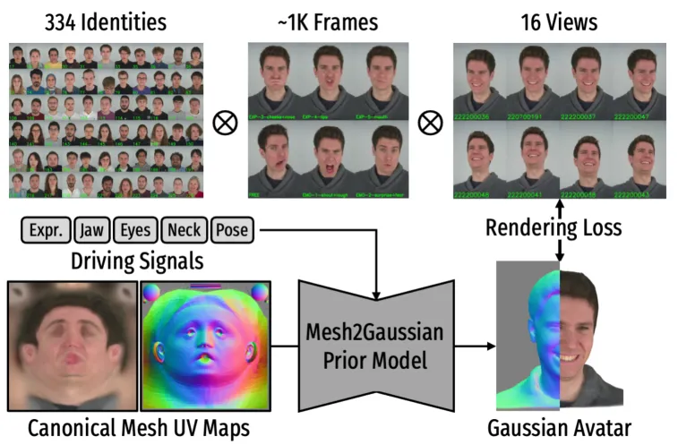

Figure 3: Training Mesh2Gaussian Prior Model (MGPM). We train a 3D
avatar prior model, MGPM, that takes mesh UV maps and 3D face driving
signals, _e.g_., expression codes, poses (jaw, eyes, neck, head), as
inputs and outputs a Gaussian avatar, structured in the form of
UV-aligned 2D Gaussian primitives. We supervise the MGPM training using
images from the face capture dataset \[14\] that spans diverse
identities across different expressions and viewpoints.

#### Training MGPM

To make the MGPM learn to predict 2DGS UV maps, conditioned on identity,
expressions, and viewpoints, we train it on a face performance capture
dataset \[14\], which contains multi-view, synchronized videos of
diverse identities with diverse facial expressions.

During training, MGPM takes the tracked canonical FLAME UV maps to
produce a 2DGS UV map. With randomly sampled frames and viewpoints, the
2DGS avatar is differentiably rasterized into image space using the
driving signal $`\Theta`$ and camera parameters. Then, we measure the
rendering loss between the rendered and ground-truth images, which
consists of L1 photometric loss $`\mathcal{L}_{\ell 1}`$ and perceptual
loss $`\mathcal{L}_{\text{LPIPS}}`$ \[48\]. We also add the 2DGS
geometry regularization losses \[9\], _i.e_., the depth distortion loss
$`\mathcal{L}_{\text{depth}}`$, and normal consistency loss
$`\mathcal{L}_{\text{normal}}`$:

```math
\mathcal{L}_{\text{MGPM}}{=}\mathcal{L}_{\ell 1}{+}\lambda_{\text{lpips}}\mathcal{L}_{\text{LPIPS}}{+}\lambda_{\text{d}}\mathcal{L}_{\text{depth}}{+}\lambda_{\text{n}}\mathcal{L}_{\text{normal}}, \tag{2}
```

where $`\lambda_{\{\cdot\}}`$ denote loss weights. We train MGPM by
minimizing the loss function $`\mathcal{L}_{\text{MGPM}}`$ across all
the identities in the multi-view expressive face performance capture
data \[14\].

#### Feed-forward MGPM avatar prediction

While MGPM produces visually reasonable Gaussian head avatars for unseen
identities at test time, we observe missing avatar details, as well as
minor identity shifts (Fig. 4a). We attribute this mainly to the limited
scale and diversity of MGPM’s training dataset \[14\], which contains
only about 400 identities, making it difficult for MGPM to perfectly
generalize to unseen facial appearances, geometries, and expressions.
Moreover, casual monocular video inputs provided at test time, _e.g_.,
selfies and internet videos, exhibit significant domain gaps relative to
the videos used for MGPM training. These practical limitations
necessitate test-time avatar adaptation stages (Fig. 4b), which we
describe in the following sections.

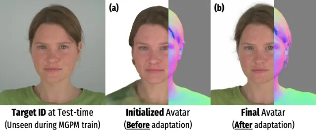

Figure 4: Why need test-time avatar adaptation? (a) Our learned Gaussian
initialization provides a visually reasonable initial, but synthesizing
a high-fidelity avatar from only a feed-forward path is challenging at
test time. (b) After the test-time adaptation of the avatar prior model,
we obtain a high-fidelity, authentic avatar.

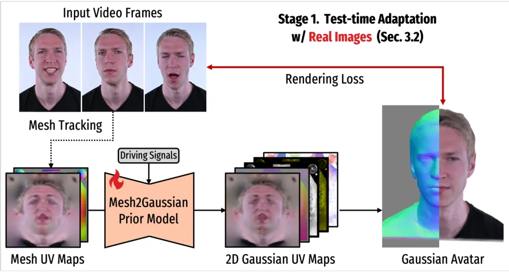

Figure 5: Stage 1: Test-time adaptation w/ real images. Given input
video frames and offline-tracked head mesh UV maps, we obtain 2D
Gaussian UV maps by Mesh2Gaussian Prior Model’s (MGPM) feed-forward
avatar initialization. We fine-tune MGPM by minimizing the rendering
loss between the animated Gaussian avatar images and the sampled image
frames within the input video.

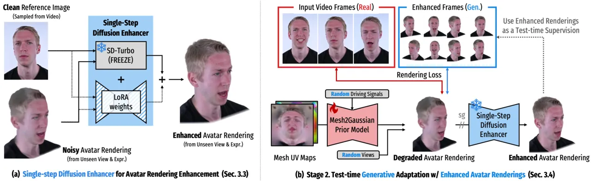

Figure 6: Single-step diffusion enhancer & Test-time “generative”
adaptation. (a) We design a single-step diffusion enhancer that takes a
degraded avatar rendering and a clean reference image as inputs, and
efficiently generates a detail-enhanced and identity-preserving avatar
rendering, within 0.3 seconds. (b) Using the generated images as
test-time supervision, we conduct the stage 2 test-time avatar
adaptation. After stage 2 adaptation, we obtain a final
identity-specific avatar that generalizes across diverse poses,
expressions, and viewpoints.

### 3.2 Stage 1:Test-time Adaptation with Real Images

We design a test-time adaptation stage to compensate for missing details
and identity shifts from an initialized Gaussian avatar. Since the
pre-trained MGPM already can generate an initial 2D Gaussian avatar from
the mesh UV maps and driving signals, our test-time avatar adaptation
essentially means the MGPM fine-tuning stage using the observed test
time input video frames (Fig. 5).

Given a set of input video frames, $`\mathbf{I}_{\text{real}}`$, we
first conduct off-line FLAME mesh tracking \[30\] to obtain canonical
mesh UV maps and per-frame driving signals, _i.e_.,
$`[\mathbf{M}_{\text{tex}},\mathbf{M}_{\text{geo}},\mbox{\boldmath$\Theta$}]\leftarrow\texttt{Track}(\mathbf{I}_{\text{real}})`$.
We query
$`\mathbf{M}_{\text{tex}},\mathbf{M}_{\text{geo}},\mbox{\boldmath$\Theta$}`$
to the pre-trained MGPM and obtain initialized 2DGS avatar in a
feed-forward manner (Eq. (1)). Then, as in the MGPM training, we
rasterize the 2DGS avatar into image space and compute reconstruction
losses (Eq. (2)), using the estimated camera parameters. By
backpropagating the loss gradients to the pre-trained MGPM, we adapt the
general-purpose prior model $`\mathcal{F}_{\phi}`$ to an
identity-specific prior model $`\mathcal{F}^{*}_{\phi}`$. In practice,
we sample $`N_{\text{real}}`$ frames ($`N_{\text{real}}=3`$ unless noted
otherwise) from the input video for computational efficiency and use a
learning rate $`0.05\times`$ that of the MGPM training stage.

### 3.3 Single-step Diffusion Enhancer for Test-time Avatar Rendering Enhancement

![[Uncaptioned
image]](arxiv-2601-10200--66c743d7f51b.figures/figure-7.webp)

The previous test-time avatar adaptation yields plausible avatar
rendering results for the views and expressions seen in stage 1
(inset-a). However, when the avatar is rendered from unseen views and
expressions, the rendered results are often degraded (inset-b).
Therefore, we follow the principle of 2D generative prior approaches,
where we leverage a diffusion model to provide augmented facial images
from unseen views and expressions and use them as test-time supervision.

#### Gaussian avatars for grounded image generation

Previous works \[40, 41\] generate multi-view/-expression face images
via full diffusion denoising from pure noise, which is slow and often
hallucinates the identity. Our core idea is to leverage the degraded
avatar renderings to _ground the generation_ of novel view and
expression images. Although degraded, we observe that the avatar
renderings already contain rich appearance and geometry, which can serve
as conditioning signals for a generative model, rather than pure noise.
We approach this rendering-grounded image generation as a generative
image enhancement and design an efficient diffusion image enhancer to
enhance avatar renderings.

#### Single-step diffusion enhancer

Our single-step diffusion model enhances blurry, noisy avatar renderings
and generate clean images by referencing the clean input frame (see
Fig. 6a). After stage 1 adaptation, we render the avatar from random
viewpoints and driving expression signals
$`\mbox{\boldmath$\Theta$}_{\text{rand}}`$, and obtain degraded
renderings, _i.e_.,
$`\mathbf{I}_{\text{gen}}\leftarrow\mathcal{F}^{*}_{\phi}([\mathbf{M}_{\text{tex}},\mathbf{M}_{\text{geo}}],\mbox{\boldmath$\Theta$}_{\text{rand}})`$.
The single-step diffusion model $`\mathcal{D}_{\xi}`$ takes
$`\mathbf{I}_{\text{gen}}`$, and a clean face image from input frames
$`\mathbf{I}_{\text{real}}`$, then remove artifacts and add missing
details in image space, as follows:
$`\mathbf{I}_{\text{gen}}^{\star}=\mathcal{D}_{\xi}([\mathbf{I}_{\text{gen}},\mathbf{I}_{\text{real}}])`$.
Our design is inspired by the single-step diffusion enhancer for static
3D scene renderings, DIFIX \[42\]. Our enhancer is built to handle
heterogeneous viewpoints and expressions between the clean reference
image and the degraded avatar rendering. This is crucial in monocular
video settings, where clean reference frames are mostly frontal while
avatar renderings span diverse poses and expressions. Compared to the
full diffusion denoising approach \[41\], our rendering-grounded image
generation achieves $`60\times`$ faster image generation time, while
better preserving identity-specific details (later discussed in
Sec. 4.2). We train our model by fine-tuning the single-step
image-translation diffusion model SD-Turbo \[36\] using our curated
triplets of degraded avatar rendering, clean reference image, clean
ground-truth image. Additional training details are provided in the
supplementary material.

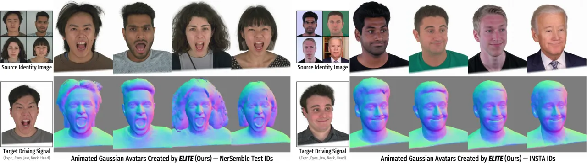

Figure 7: ELITE: Qualitative results. We show the animated rendering
results (RGB and normal) of ELITE’s generated 2DGS avatars for test
IDs \[14, 51\]. ELITE synthesizes authentic, ID-preserving avatars for
diverse attributes, _e.g_., races, genders, ages, and hairstyles, even
when trained on only 3 frames from an input monocular video. Please
refer to the supplementary video for the dynamic animation results.

### 3.4 Stage 2: Test-time Generative Adaptation with Enhanced Avatar Renderings

After generating images from novel views and expressions, we use the
generated images as test-time supervision to further fine-tune the
avatar prior model. In other words, we perform the second-round
test-time avatar adaptation using the generated images as additional
supervision; we call this _test-time generative adaptation_ (see
Fig. 6b).

Given $`N_{\text{gen}}`$ enhanced avatar images
$`\{\mathbf{I}_{\text{gen}}^{\star}\}`$, we add them to the test-time
adaptation dataset, _i.e_., we use $`N_{\text{real}}{+}N_{\text{gen}}`$
images for test-time fine-tuning. Since we create
$`\{\mathbf{I}_{\text{gen}}^{\star}\}`$ conditioned on the sampled
viewpoints and driving signals, we already have accurately aligned pairs
of images, camera parameters, and driving signals. As in Stage 1, we
query the mesh UV maps and driving signals (Eq. (1)), rasterize the 2DGS
avatar, and compute reconstruction losses (Eq. (2)), to further
fine-tune the prior model
$`\mathcal{F}^{*}_{\phi}\rightarrow\mathcal{F}^{\star}_{\phi}`$.
Finally, the identity-specific avatar prior model
$`\mathcal{F}^{\star}_{\phi}`$ can generalize to diverse poses,
expressions, and viewpoints.

#### Rendering the final avatar

After test-time generative adaptation, we use the identity-specific
avatar prior model $`\mathcal{F}^{\star}_{\phi}`$ to animate the target
identity’s 2DGS avatar given any FLAME driving signals in a feed-forward
manner.

## 4 Experiments

In this section, we provide visualizations of our synthesized avatars
and compare ELITE with the recent competing methods. We also conduct
ablation studies to support our core design choices. For all
experiments, we train our Mesh2Gaussian Prior Model (MGPM) on
NerSemble-V2 \[14\], and use in-the-wild monocular videos from the
INSTA \[51\] for testing and comparison.

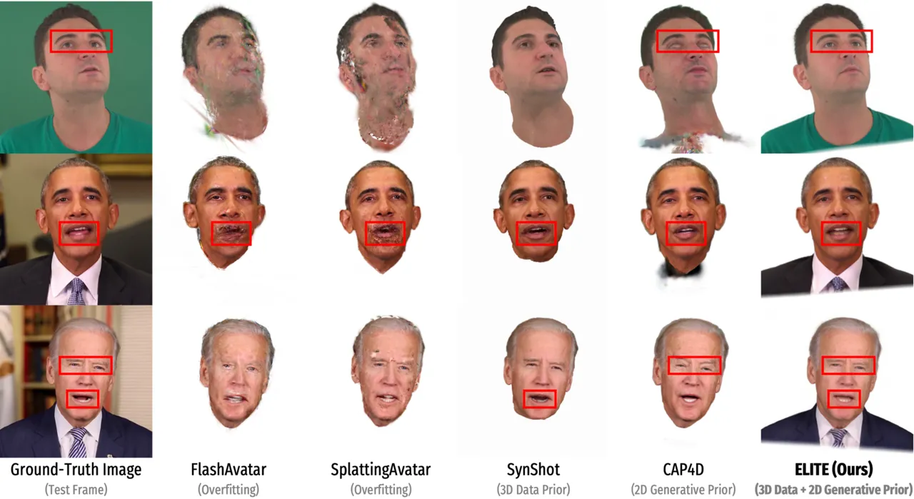

(a) Monocular self re-enactment comparison.

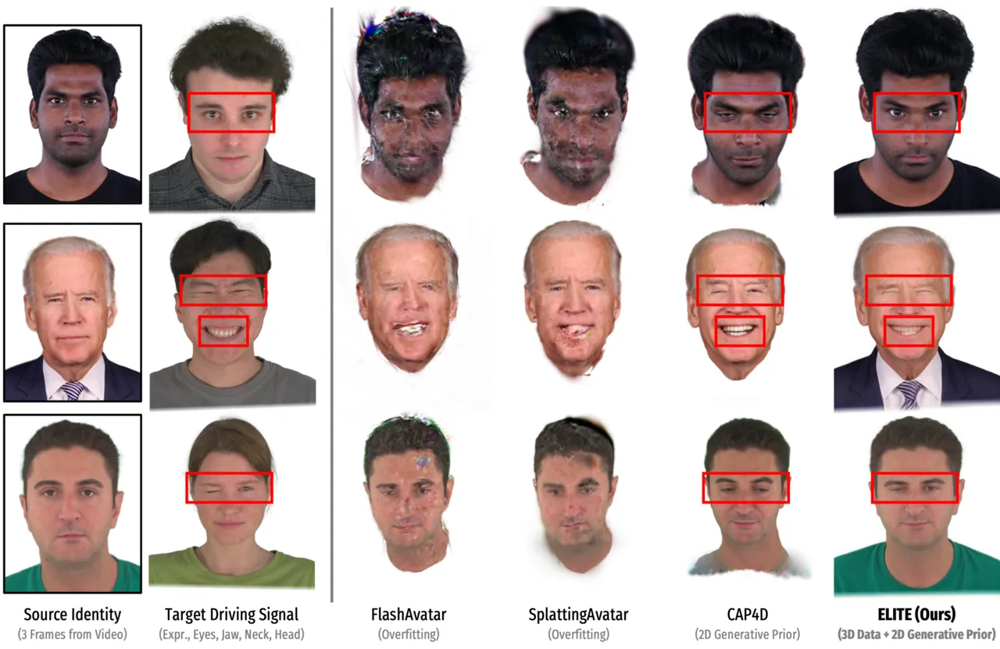

(b) Monocular cross re-enactment comparison.

Figure 8: Monocular self (a) and cross (b) re-enactment comparisons. We
synthesize 3D head avatars using ELITE (Ours) and competing methods
\[43, 37, 52, 41\] ($`N_{\text{real}}=3`$ input images), and evaluate
both self and cross re-enactment using test split or held-out driving
signals. ELITE produces Gaussian avatars with _better identity
preservation_ (iris color, hair style), as well as _stronger
generalization_ to novel head poses and fine-grained expressions,
including gaze changes and one-eye winking.

### 4.1 Qualitative Results

In Fig. 7, we visualize synthesized Gaussian avatars for unseen IDs
animated using various driving signals. ELITE faithfully synthesizes
high-fidelity, authentic avatars that reliably reflect source visual
details (_e.g_., facial spots or cloth patterns) and accurately follow
the driving signals (_e.g_., gaze directions or laugh lines). Even under
variations in source human attributes (races, genders, ages, hairstyles)
and challenging driving signals with rich, expressive facial motions,
ELITE maintains strong generalization.

### 4.2 Comparison with Competing Methods

We compare ELITE with recent competing methods in terms of visual
quality and quantitative metrics.

#### Competing methods

We compare the avatar synthesis quality of ELITE from the in-the-wild
face videos from INSTA dataset \[51\] against recent competing methods,
including: overfitting-based method (FlashAvatar \[43\],
SplattingAvatar \[37\]), 3D data prior method (SynShot \[52\]¹¹ 1 No 3D
data prior methods \[49, 1, 2, 52\] released codes and models. SynShot
only provides videos without metrics; we only compare visual results.),
and 2D generative prior method (CAP4D \[41\]).

#### Monocular avatar self/cross re-enactment

Following the avatar synthesis protocol from \[52\], we synthesize
avatars using only three supervision frames, excluding the last 600 test
frames. For self re-enactment, we animate the synthesized avatars using
the driving signals from the 600 test frames for quantitative
evaluation. For cross re-enactment, we instead use driving signals from
other sequences.

| Method                 | Duration  | PSNR ($`\uparrow`$) | SSIM ($`\uparrow`$) | LPIPS ($`\downarrow`$) | CSIM ($`\uparrow`$) |
| ---------------------- | --------- | ------------------- | ------------------- | ---------------------- | ------------------- |
| FlashAvatar \[43\]     | 10 mins.  | 20.875              | 0.8338              | 0.1420                 | 0.5823              |
| SplattingAvatar \[37\] | 15 mins.  | 24.838              | 0.8831              | 0.0893                 | 0.6406              |
| CAP4D \[41\]           | 400 mins. | 19.478              | 0.8675              | 0.0992                 | 0.7064              |
| ELITE (Ours)           | 20 mins.  | 25.220              | 0.8771              | 0.0732                 | 0.7396              |

Table 1: Self re-enactment comparison. We compare the visual quality of
the avatars for INSTA identities \[51\]. ELITE (Ours) shows superior
reconstruction quality and ID preservation.

In Table 1, we report the photometric metrics (PSNR, SSIM, and LPIPS)
and ID-consistency metric (CSIM) for self re-enactment.
ELITE ourperforms all competing methods across most metrics, while
showing comparable performance in SSIM. Notably, ELITE achieves superior
performance in identity preservation, which is a crucial component of
avatar personalization. Since INSTA \[51\] primarily consists of
speech-oriented videos with low variation in head pose,
overfitting-based approaches \[37, 43\] can achieve favorable metric
results. However, they fail under unseen views or expressions²² 2 We
follow their exact inference instructions, but we use
$`N_{\text{real}}{=}3`$ images for a fair comparison. We discuss the
effects of $`N_{\text{real}}`$ in the supplementary. (see Fig. 8).
Another crucial requirement for a practical avatar system is the
synthesis speed. Although CAP4D provides strong visual fidelity, it
requires over six hours per identity because it relies on slow
diffusion-based image generation, making it less suitable for practical
use. ELITE strikes a favorable balance between fidelity and speed: it
synthesizes avatars at a speed comparable to overfitting-based methods
while surpassing existing methods in visual fidelity, both
quantitatively and qualitatively.

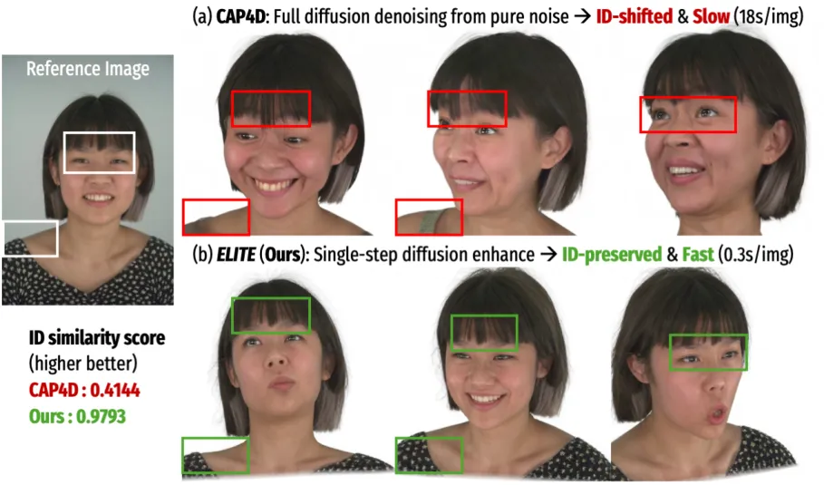

Figure 9: Comparison of ID preservation of generated images. CAP4D
severely hallucinates IDs and slow (18 secs./image). Our
rendering-guided single-step enhancement leads to significantly better
ID preservation, with 60$`\times`$ faster image generation speed.

While SynShot and CAP4D produce reasonable avatars, they fail to capture
detailed appearance and geometry and do not model complete avatars,
_i.e_., missing torso. CAP4D fails to generalize to extreme and
fine-grained facial expressions (See Fig. 8(b)). In contrast,
ELITE crafts high-fidelity, authentic, and more complete (including
torso) avatars that generalize well across diverse identities and
expressions. Please refer to the supplementary material for more
results.

#### ID preservation of generated images

Both CAP4D \[41\] and ELITE (Ours) generate synthetic face images for
supervising the avatar synthesis, yet CAP4D often hallucinates the
identity ($`\textrm{CSIM}_{\textrm{CAP4D}}{=}\textrm{0.4144}`$) and
takes 18 seconds/image generation. In contrast, ELITE generates
ID-preserving images
($`\textrm{CSIM}_{\textrm{ours}}{=}\textrm{0.9793}`$), with 60$`\times`$
faster speed, _i.e_., 0.3 seconds/image. Our generative single-step
enhancement, anchored by avatar renderings, achieves both high identity
consistency and rapid avatar personalization (see Fig. 9).

### 4.3 Ablation Study

We discuss the effects of design choices in each module.

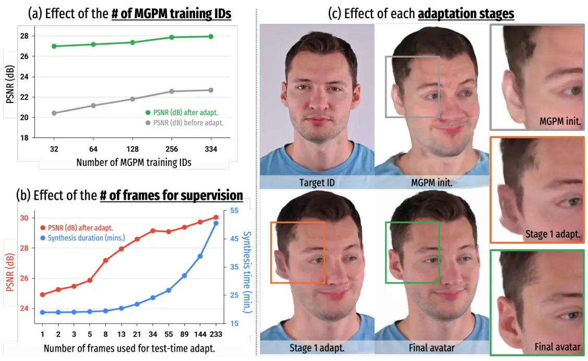

Figure 10: Ablation Study. (a) Scaling up the number of training
identities for MGPM leads to better quality and generalization at test
time. (b) Using more video frames for supervision improves quality but
sacrifices the synthesis speed. (c) Our proposed modules, learned 3D
avatar initialization & test-time generative adaptation, enable
high-fidelity and generalizable avatar synthesis.

#### Effects of number of training IDs for 3D data prior

Our MGPM, trained on the widest ID and expression coverage (334 IDs)
achieves the best avatar synthesis for both before and after avatar
adaptation. Intuitively, the MGPM exposed to more IDs during training is
more likely to learn a generalizable appearance and expression prior,
providing better 3D avatar initialization before the adaptation, and
yields higher-fidelity avatars after the adaptation.

#### Effects of the number of frames used for supervision

We evaluate the fidelity of the synthesized avatars, using a varying
number of frames from the video at test time. In Fig. 10b, the graph
shows the trade-off: the more frames we use to supervise avatar
synthesis, the better the fidelity, but at the cost of sacrificing the
synthesis time.

#### Effects of each module

Figure 10c shows the improvements in the avatar’s visual quality
achieved by each module. The MGPM gives a strong 3D avatar
initialization. The stage 1 adaptation using video frames gives better
ID alignment. Finally, the stage 2 adaptation using a 2D generative
prior yields high-fidelity details and generalization.

## 5 Conclusion and Limitations

We present ELITE, an efficient Gaussian head avatar synthesis from a
casual video. We identify a reinforcing synergy of two priors: 2D
generative prior helps 3D prior generalize better, and 3D prior guides
fast, ID-consistent image generation for test time supervision.
ELITE strikes the sweet spot between fidelity and speed, surpassing
competing methods.

Currently, ELITE can be vulnerable to unusual lighting conditions:
adopting lighting priors \[3, 19\] or material texture modeling \[35,
45\] could be an interesting research problem. Joint 3D data prior
modeling for avatars and accessories, _e.g_., glasses \[17\], would be a
promising future direction.

## References

- \[1\] M. C. Buehler, G. Li, E. Wood, L. Helminger, X. Chen, T.
  Shah, D. Wang, S. Garbin, S. Orts-Escolano, O. Hilliges, D. Lagun, J.
  Riviere, P. Gotardo, T. Beeler, A. Meka, and K. Sarkar (2024) Cafca:
  high-quality novel view synthesis of expressive faces from casual
  few-shot captures. ACM Transactions on Graphics (SIGGRAPH Asia).
  External Links:
  [Document](https://dx.doi.org/10.1145/3680528.3687580),
  [Link](https://doi.org/10.1145/3680528) Cited by: Figure 2, Figure 2,
  §1, §2, footnote 1.
- \[2\] C. Cao, T. Simon, J. K. Kim, G. Schwartz, M. Zollhoefer, S.
  Saito, S. Lombardi, S. Wei, D. Belko, S. Yu, Y. Sheikh, and J.
  Saragih (2022) Authentic volumetric avatars from a phone scan. ACM
  Transactions on Graphics (SIGGRAPH) 41 (4). External Links: ISSN
  0730-0301, [Document](https://dx.doi.org/10.1145/3528223.3530143)
  Cited by: §1, §2, footnote 1.
- \[3\] L. Chen, C. Cao, F. D. la Torre, J. Saragih, C. Xu, and Y.
  Sheikh (2021) High-fidelity face tracking for ar/vr via deep lighting
  adaptation. In IEEE Conference on Computer Vision and Pattern
  Recognition (CVPR), Cited by: §5.
- \[4\] M. de La Gorce, C. Hewitt, T. Takacs, R. Gerdisch, Z.
  Hosenie, G. Meishvili, M. Kowalski, T. J. Cashman, and A.
  Criminisi (2025) VoluMe – authentic 3d video calls from live gaussian
  splat prediction. In IEEE International Conference on Computer Vision
  (ICCV), Cited by: §1.
- \[5\] G. Gafni, J. Thies, M. Zollhöfer, and M. Nießner (2021) Dynamic
  neural radiance fields for monocular 4d facial avatar reconstruction.
  In IEEE Conference on Computer Vision and Pattern Recognition (CVPR),
  Cited by: §2.
- \[6\] P. Grassal, M. Prinzler, T. Leistner, C. Rother, M. Nießner,
  and J. Thies (2022) Neural head avatars from monocular rgb videos. In
  IEEE Conference on Computer Vision and Pattern Recognition (CVPR),
  Cited by: §2.
- \[7\] M. He, P. Clausen, A. L. Taşel, L. Ma, O. Pilarski, W. Xian, L.
  Rikker, X. Yu, R. Burgert, N. Yu, and P. Debevec (2024) DifFRelight:
  diffusion-based facial performance relighting. In ACM Transactions on
  Graphics (SIGGRAPH Asia), Cited by: §1, §1.
- \[8\] E. J. Hu, Y. Shen, P. Wallis, Z. Allen-Zhu, Y. Li, S. Wang, L.
  Wang, and W. Chen (2022) LoRA: low-rank adaptation of large language
  models. In International Conference on Learning Representations
  (ICLR), Cited by: §B.2.
- \[9\] B. Huang, Z. Yu, A. Chen, A. Geiger, and S. Gao (2024) 2D
  gaussian splatting for geometrically accurate radiance fields. In ACM
  Transactions on Graphics (SIGGRAPH Asia), Cited by: §1, §3.1.
- \[10\] F. Iandola, S. Pidhorskyi, I. Santesteban, D. Gupta, A.
  Pahuja, N. Bartolovic, F. Yu, E. Garbin, T. Simon, and S. Saito (2025)
  SqueezeMe: mobile-ready distillation of gaussian full-body avatars. In
  ACM Transactions on Graphics (SIGGRAPH), Cited by: §1.
- \[11\] H. Joo, H. Liu, L. Tan, L. Gui, B. Nabbe, I. Matthews, T.
  Kanade, S. Nobuhara, and Y. Sheikh (2015) Panoptic studio: a massively
  multiview system for social motion capture. In IEEE International
  Conference on Computer Vision (ICCV), Cited by: §1.
- \[12\] B. Kerbl, G. Kopanas, T. Leimkühler, and G. Drettakis (2023) 3D
  gaussian splatting for real-time radiance field rendering. ACM
  Transactions on Graphics (SIGGRAPH) 42 (4). Cited by: §1, §2.
- \[13\] B. Kim, S. Saito, G. Nam, T. Simon, J. Saragih, H. Joo, and J.
  Li (2025) HairCUP: hair compositional universal prior for 3d gaussian
  avatars. In IEEE International Conference on Computer Vision (ICCV),
  Cited by: §1.
- \[14\] T. Kirschstein, S. Qian, S. Giebenhain, T. Walter, and M.
  Nießner (2023) NeRSemble: multi-view radiance field reconstruction of
  human heads. ACM Transactions on Graphics (SIGGRAPH) 42 (4). External
  Links: ISSN 0730-0301, [Link](https://doi.org/10.1145/3592455),
  [Document](https://dx.doi.org/10.1145/3592455) Cited by: §1, §2, §B.1,
  §B.2, Figure 3, Figure 3, Figure 7, Figure 7, §3.1, §3.1, §3.1, §D.2,
  §4.
- \[15\] J. Lee, C. Li, L. Tran, S. Wei, J. Saragih, A. Richard, H. Joo,
  and S. Bai (2025) Audio driven real-time facial animation for social
  telepresence. In ACM Transactions on Graphics (SIGGRAPH Asia), Cited
  by: §1.
- \[16\] J. Li, C. Cao, G. Schwartz, R. Khirodkar, C. Richardt, T.
  Simon, Y. Sheikh, and S. Saito (2024) URAvatar: universal relightable
  gaussian codec avatars. In ACM Transactions on Graphics (SIGGRAPH
  Asia), Cited by: §2.
- \[17\] J. Li, S. Saito, T. Simon, S. Lombardi, H. Li, and J.
  Saragih (2023) MEGANE: morphable eyeglass and avatar network. In IEEE
  Conference on Computer Vision and Pattern Recognition (CVPR), Cited
  by: §5.
- \[18\] T. Li, T. Bolkart, Michael. J. Black, H. Li, and J.
  Romero (2017) Learning a model of facial shape and expression from 4D
  scans. ACM Transactions on Graphics (SIGGRAPH Asia) 36 (6). External
  Links: [Link](https://doi.org/10.1145/3130800.3130813) Cited by: §3.1.
- \[19\] R. Liang, K. He, Z. Gojcic, I. Gilitschenski, S. Fidler, N.
  Vijaykumar, and Z. Wang (2025) LuxDiT: lighting estimation with video
  diffusion transformer. In Advances in Neural Information Processing
  Systems (NeurIPS), Cited by: §5.
- \[20\] S. Lombardi, J. Saragih, T. Simon, and Y. Sheikh (2018) Deep
  appearance models for face rendering. ACM Transactions on Graphics
  (SIGGRAPH) 37 (4), pp. 68:1–68:13. External Links: ISSN 0730-0301
  Cited by: §1, §1.
- \[21\] S. Lombardi, T. Simon, G. Schwartz, M. Zollhoefer, Y. Sheikh,
  and J. Saragih (2021) Mixture of volumetric primitives for efficient
  neural rendering. ACM Transactions on Graphics (SIGGRAPH) 40 (4).
  External Links: ISSN 0730-0301,
  [Link](https://doi.org/10.1145/3450626.3459863),
  [Document](https://dx.doi.org/10.1145/3450626.3459863) Cited by: §1,
  §2.
- \[22\] S. Ma, T. Simon, J. Saragih, D. Wang, Y. Li, F. De La Torre,
  and Y. Sheikh (2021) Pixel codec avatars. In IEEE Conference on
  Computer Vision and Pattern Recognition (CVPR), Cited by: §1.
- \[23\] J. Martinez, E. Kim, J. Romero, T. Bagautdinov, S. Saito, S.
  Yu, S. Anderson, M. Zollhöfer, T. Wang, S. Bai, C. Li, S. Wei, R.
  Joshi, W. Borsos, T. Simon, J. Saragih, P. Theodosis, A. Greene, A.
  Josyula, S. M. Maeta, A. I. Jewett, S. Venshtain, C. Heilman, Y.
  Chen, S. Fu, M. E. A. Elshaer, T. Du, L. Wu, S. Chen, K. Kang, M.
  Wu, Y. Emad, S. Longay, A. Brewer, H. Shah, J. Booth, T. Koska, K.
  Haidle, M. Andromalos, J. Hsu, T. Dauer, P. Selednik, T. Godisart, S.
  Ardisson, M. Cipperly, B. Humberston, L. Farr, B. Hansen, P. Guo, D.
  Braun, S. Krenn, H. Wen, L. Evans, N. Fadeeva, M. Stewart, G.
  Schwartz, D. Gupta, G. Moon, K. Guo, Y. Dong, Y. Xu, T. Shiratori, F.
  Prada, B. R. Pires, B. Peng, J. Buffalini, A. Trimble, K. McPhail, M.
  Schoeller, and Y. Sheikh (2024) Codec Avatar Studio: Paired Human
  Captures for Complete, Driveable, and Generalizable Avatars. In
  Advances in Neural Information Processing Systems (NeurIPS), Cited by:
  §2.
- \[24\] B. Mildenhall, P. P. Srinivasan, M. Tancik, J. T. Barron, R.
  Ramamoorthi, and R. Ng (2020) NeRF: representing scenes as neural
  radiance fields for view synthesis. In European Conference on Computer
  Vision (ECCV), Cited by: §1, §2.
- \[25\] T. Müller, A. Evans, C. Schied, and A. Keller (2022) Instant
  neural graphics primitives with a multiresolution hash encoding. ACM
  Transactions on Graphics (SIGGRAPH) 41 (4). Cited by: §1.
- \[26\] W. Peebles and S. Xie (2023) Scalable diffusion models with
  transformers. In IEEE International Conference on Computer Vision
  (ICCV), Cited by: §2.
- \[27\] E. Perez, F. Strub, H. de Vries, V. Dumoulin, and A. C.
  Courville (2018) FiLM: visual reasoning with a general conditioning
  layer. In AAAI Conference on Artificial Intelligence (AAAI), Cited by:
  §B.1, §3.1.
- \[28\] E. Prashnani, K. Nagano, S. D. Mello, D. Luebke, and O.
  Gallo (2024) Avatar fingerprinting for authorized use of synthetic
  talking-head videos. In European Conference on Computer Vision (ECCV),
  Cited by: §E.
- \[29\] S. Qian, T. Kirschstein, L. Schoneveld, D. Davoli, S.
  Giebenhain, and M. Nießner (2024) GaussianAvatars: photorealistic head
  avatars with rigged 3d gaussians. In IEEE Conference on Computer
  Vision and Pattern Recognition (CVPR), Cited by: §1.
- \[30\] S. Qian (2024) VHAP: versatile head alignment with adaptive
  appearance priors. External Links:
  [Link](https://github.com/ShenhanQian/VHAP) Cited by: §3.1, §3.2.
- \[31\] F. Reda, J. Kontkanen, E. Tabellion, D. Sun, C. Pantofaru,
  and B. Curless (2022) FILM: frame interpolation for large motion. In
  European Conference on Computer Vision (ECCV), Cited by: §B.2.
- \[32\] R. Rombach, A. Blattmann, D. Lorenz, P. Esser, and B.
  Ommer (2022) High-resolution image synthesis with latent diffusion
  models. In IEEE Conference on Computer Vision and Pattern Recognition
  (CVPR), Cited by: §2.
- \[33\] O. Ronneberger, P. Fischer, and T. Brox (2015) U-net:
  convolutional networks for biomedical image segmentation. In
  International Conference on Medical Image Computing and
  Computer-Assisted Intervention (MICCAI), Cited by: §3.1.
- \[34\] A. Rössler, D. Cozzolino, L. Verdoliva, C. Riess, J. Thies,
  and M. Nießner (2018) FaceForensics: a large-scale video dataset for
  forgery detection in human faces. arXiv preprint, 1803.09179. Cited
  by: §E.
- \[35\] S. Saito, G. Schwartz, T. Simon, J. Li, and G. Nam (2024)
  Relightable gaussian codec avatars. In IEEE Conference on Computer
  Vision and Pattern Recognition (CVPR), Cited by: §1, §5.
- \[36\] A. Sauer, D. Lorenz, A. Blattmann, and R. Rombach (2024)
  Adversarial diffusion distillation. In European Conference on Computer
  Vision (ECCV), Cited by: §B.2, §3.3.
- \[37\] Z. Shao, Z. Wang, Z. Li, D. Wang, X. Lin, Y. Zhang, M. Fan,
  and Z. Wang (2024) SplattingAvatar: Realistic Real-Time Human Avatars
  with Mesh-Embedded Gaussian Splatting. In IEEE Conference on Computer
  Vision and Pattern Recognition (CVPR), Cited by: Figure 1, Figure 1,
  Figure 2, Figure 2, 3rd item, §2, §C.2, Figure 8, Figure 8, §4.2,
  §4.2, Table 1.
- \[38\] Y. Song, J. Sohl-Dickstein, D. P. Kingma, A. Kumar, S. Ermon,
  and B. Poole (2021) Score-based generative modeling through stochastic
  differential equations. In International Conference on Learning
  Representations (ICLR), Cited by: §B.1.
- \[39\] S. Szymanowicz, C. Rupprecht, and A. Vedaldi (2024) Splatter
  image: ultra-fast single-view 3d reconstruction. In IEEE Conference on
  Computer Vision and Pattern Recognition (CVPR), Cited by: §B.1.
- \[40\] J. Tang, D. Davoli, T. Kirschstein, L. Schoneveld, and M.
  Niessner (2025) GAF: gaussian avatar reconstruction from monocular
  videos via multi-view diffusion. In IEEE Conference on Computer Vision
  and Pattern Recognition (CVPR), Cited by: Figure 2, Figure 2, Figure
  2, §1, §1, §2, §3.3.
- \[41\] F. Taubner, R. Zhang, M. Tuli, and D. B. Lindell (2025) CAP4D:
  creating animatable 4D portrait avatars with morphable multi-view
  diffusion models. In IEEE Conference on Computer Vision and Pattern
  Recognition (CVPR), Cited by: Figure 1, Figure 1, Figure 2, Figure 2,
  Figure 2, 3rd item, §1, §1, §2, §C.2, §3.3, §3.3, Figure 8, Figure 8,
  §4.2, §4.2, Table 1.
- \[42\] J. Z. Wu, Y. Zhang, H. Turki, X. Ren, J. Gao, M. Z. Shou, S.
  Fidler, Z. Gojcic, and H. Ling (2025) DIFIX3D+: improving 3d
  reconstructions with single-step diffusion models. In IEEE Conference
  on Computer Vision and Pattern Recognition (CVPR), Cited by: §B.2,
  §3.3.
- \[43\] J. Xiang, X. Gao, Y. Guo, and J. Zhang (2024) FlashAvatar:
  high-fidelity head avatar with efficient gaussian embedding. In IEEE
  Conference on Computer Vision and Pattern Recognition (CVPR), Cited
  by: 3rd item, §2, §C.2, Figure 8, Figure 8, §4.2, §4.2, Table 1.
- \[44\] J. S. Yoon, Z. Yu, J. Park, and H. S. Park (2023) HUMBI: a
  large multiview dataset of human body expressions and benchmark
  challenge. IEEE Transactions on Pattern Analysis and Machine
  Intelligence (TPAMI) 45 (1), pp. 623–640. External Links:
  [Document](https://dx.doi.org/10.1109/TPAMI.2021.3138762) Cited by:
  §1.
- \[45\] K. Youwang, T. Oh, and G. Pons-Moll (2024) Paint-it:
  text-to-texture synthesis via deep convolutional texture map
  optimization and physically-based rendering. In IEEE Conference on
  Computer Vision and Pattern Recognition (CVPR), Cited by: §5.
- \[46\] Z. Yu, J. S. Yoon, I. K. Lee, P. Venkatesh, J. Park, J. Yu,
  and H. S. Park (2020) HUMBI: a large multiview dataset of human body
  expressions. In IEEE Conference on Computer Vision and Pattern
  Recognition (CVPR), Cited by: §1.
- \[47\] L. Zhang, A. Rao, and M. Agrawala (2023) Adding conditional
  control to text-to-image diffusion models. In IEEE International
  Conference on Computer Vision (ICCV), Cited by: §2.
- \[48\] R. Zhang, P. Isola, A. A. Efros, E. Shechtman, and O.
  Wang (2018) The unreasonable effectiveness of deep features as a
  perceptual metric. In IEEE Conference on Computer Vision and Pattern
  Recognition (CVPR), Cited by: §B.2, §3.1.
- \[49\] X. Zheng, C. Wen, Z. Li, W. Zhang, Z. Su, X. Chang, Y. Zhao, Z.
  Lv, X. Zhang, Y. Zhang, G. Wang, and X. Lan (2025) HeadGAP: few-shot
  3d head avatar via generalizable gaussian priors. In International
  Conference on 3D Vision (3DV), Cited by: §1, §2, footnote 1.
- \[50\] Y. Zheng, V. F. Abrevaya, M. C. Bühler, X. Chen, M. J. Black,
  and O. Hilliges (2022) I M Avatar: implicit morphable head avatars
  from videos. In IEEE Conference on Computer Vision and Pattern
  Recognition (CVPR), Cited by: §2.
- \[51\] W. Zielonka, T. Bolkart, and J. Thies (2023) Instant volumetric
  head avatars. In IEEE Conference on Computer Vision and Pattern
  Recognition (CVPR), Cited by: Figure 2, Figure 2, §2, Figure 7, Figure
  7, §4.2, §4.2, Table 1, Table 1, §4.
- \[52\] W. Zielonka, S. J. Garbin, A. Lattas, G. Kopanas, P.
  Gotardo, T. Beeler, J. Thies, and T. Bolkart (2025) Synthetic prior
  for few-shot drivable head avatar inversion. In IEEE Conference on
  Computer Vision and Pattern Recognition (CVPR), Cited by: Figure 2,
  Figure 2, §1, §2, Figure 8, Figure 8, §4.2, §4.2, footnote 1.

— Supplementary Material —

Kim Youwang¹    Lee Hyoseok²    Park Subin³    Gerard Pons-Moll^(4,5,6)
   Tae-Hyun Oh²

¹Dept. of Electrical Engineering, POSTECH  ²School of Computing,
KAIST  ³UNIST

⁴University of Tübingen  ⁵Tübingen AI Center  ⁶Max Planck Institute for
Informatics

In this supplementary material, we provide additional details and
results for our method, ELITE, that are not included in the main paper
due to the space limit. Also, we encourage readers to watch the attached
video, where we show dynamic avatar visualizations.

 

###### Contents

1.  1 Introduction
2.  2 Related Work
3.  3 ELITE: Efficient Gaussian Head via Learned Initialization &
    TEst-time Adaptation
    1.  3.1 Feed-forward Gaussian Head Avatar Initialization via Learned
        Mesh2Gaussian Prior Model
    2.  3.2 Stage 1:Test-time Adaptation with Real Images
    3.  3.3 Single-step Diffusion Enhancer for Test-time Avatar
        Rendering Enhancement
    4.  3.4 Stage 2: Test-time Generative Adaptation with Enhanced
        Avatar Renderings
4.  4 Experiments
    1.  4.1 Qualitative Results
    2.  4.2 Comparison with Competing Methods
    3.  4.3 Ablation Study
5.  5 Conclusion and Limitations
6.  References
7.  A Video for Summary & Visual Results
8.  B Details of ELITE Pipeline
    1.  B.1 Mesh2Gaussian Prior Model (Sec. 3.1)
    2.  B.2 Single-step Diffusion Enhancer (Sec. 3.3)
9.  C More Ablation Studies
    1.  C.1 Effect of 3D Data & 2D Generative Priors
    2.  C.2 Effect of the Number of Real Video Frames
10. D More Results
    1.  D.1 Comparison of Generated Supervision Images
    2.  D.2 Limitations on Modeling Accessories
    3.  D.3 Multi-view/-expression Renderings
11. E Broader Impacts & Ethical Considerations

 

## A Video for Summary & Visual Results

In the attached video, we provide the following content:

- •
  ELITE overview and differences from existing methods.
- •
  Multi-view videos of avatars synthesized by ELITE.
- •
  Visual comparisons w/ competing methods \[43, 37, 41\].

## B Details of ELITE Pipeline

### B.1 Mesh2Gaussian Prior Model (Sec. 3.1)

Our Mesh2Gaussian Prior Model (MGPM) serves as the core component of our
feed-forward 3D data prior. It provides a fast and stable initialization
of 2D Gaussian primitives from tracked mesh observations, enabling
reliable identity-preserving avatar synthesis before any test-time
adaptation.

#### Architecture

MGPM is a U-Net-based architecture that accepts a conditioning embedding
vector through FiLM modulation \[27\]. Since our goal is to translate
the concatenated FLAME UV texture map and UV geometry map into
UV-aligned 2D Gaussian parameters, we adopt the U-Net design from
SplatterImage \[39\], a feed-forward per-pixel 3D Gaussian parameter
predictor, and repurpose it for the UV domain to use the U-Net to
translate per-texel color and geometry to per-texel 2D Gaussian
parameters. Following SplatterImage, we use a variant of SongUNet \[38\]
with built-in self-attention layers, enabling the model to capture
long-range dependencies across the UV maps.

Note that the FLAME geometry map contains the UV-unwrapped surface
points’ coordinates in a three-channel UV map. Since it contains 3D
coordinate information, it has distinct statistics compared to UV
texture maps, which typically have a limited range from 0 to 255. To
mitigate this statistic mismatch between UV texture and geometry maps,
we pre-compute the mean and standard deviation of UV geometry maps
across all NerSemble \[14\] identities, and standardize the UV geometry
maps, so that we can balance the statistic between the texture and
geometry. Also, we use independent convolution layers for UV texture and
geometry maps, so that we can balance the feature statistic before
querying them into the U-Net.

To account for expression- and pose-dependent changes in the resulting
UV-aligned 2D Gaussian primitives, we use a dedicated driving signal
encoder implemented as a combination of lightweight MLP projection
layers. The encoder receives FLAME driving parameters, global head
rotation ($`\mathbb{R}^{3}`$), jaw rotation ($`\mathbb{R}^{3}`$), eye
rotations ($`\mathbb{R}^{6}`$), neck rotation ($`\mathbb{R}^{3}`$), and
expression code ($`\mathbb{R}^{100}`$), projects each into a compact
latent space, and aggregates them into a single embedding
($`\mathbb{R}^{128}`$). This embedding modulates the U-Net features via
FiLM layers across multiple resolution levels.

#### Training

The full MGPM contains 36.2M learnable parameters: approximately 0.2M
parameters belong to the driving signal encoder, and the remaining 36M
to the U-Net. We train MGPM using four NVIDIA RTX A6000 GPUs (48GB) with
Distributed Data Parallel (DDP) for two days.

### B.2 Single-step Diffusion Enhancer (Sec. 3.3)

Our single-step diffusion enhancer serves as an essential module for
achieving plausible generalization of an avatar across diverse views and
expressions.

#### Dataset

To train such a diffusion enhancer, we need a paired dataset of
{Degraded avatar rendering, Clean reference image, Clean ground-truth
image}.

As a preliminary step, we first render animated Gaussian avatars from a
pre-trained 3D prior model, MGPM (Sec. 3.1), for all the identities,
viewpoints, and timeframes from NerSemble \[14\]. Then, we construct a
data triplet by sampling two sets of viewpoints and the frame. First, we
sample view $`v_{\text{ref}}`$, frame $`t_{\text{ref}}`$, and retrieve a
clean image from the NerSemble dataset, where this image will serve as
the “Clean reference image.” Then, we sample view $`v_{\text{tgt}}`$,
frame $`t_{\text{tgt}}`$, and render the avatar from the view and frame,
and this will serve as the “Degraded avatar rendering.” From the same
view and frame ($`v_{\text{tgt}}`$, $`t_{\text{tgt}}`$), we also
retrieve the corresponding clean image from the NerSemble dataset, which
will serve as the “Clean ground-truth image.” We collect total 10,688
triplets for training the single-step diffusion enhancer. We visualize
the data triplet samples in Fig. S1. By sampling heterogeneous views and
frames for the inputs, the model becomes robust across varying
viewpoints and expressions.

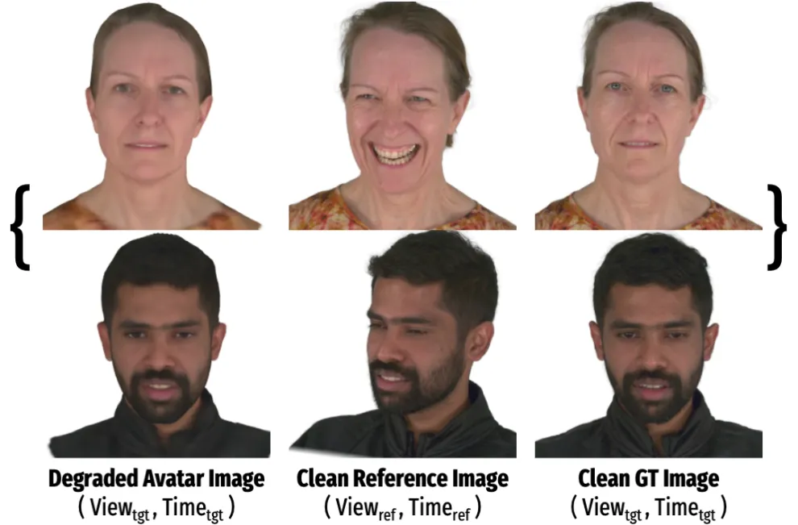

Figure S1: Data samples for training diffusion enhancer. We use the
rendered Gaussian avatars, corresponding clean target images, and clean
reference images from heterogeneous views and frames to build data
triplet for training our diffusion enhancer.

#### Training

Following DIFIX \[42\], we train our cross-viewpoint and
cross-expression single-step diffusion enhancer by fine-tuning the
pre-trained single-step diffusion model SD-Turbo \[36\]. We freeze the
VAE encoder and conduct LoRA finetuning for the decoder. During
training, we supervise the model using L1, LPIPS \[48\], and Gram matrix
losses \[31\], and conduct LoRA fine-tune \[8\] on DIFIX \[42\]. We use
a single NVIDIA RTX A6000 GPU (48GB) for 6 hours to train the
single-step diffusion enhancer model.

#### Test time

We mainly use the enhanced avatar images to supervise the test-time
adaptation process, _i.e_., we distill the 2D enhanced images back to 3D
avatars. At test time, following DIFIX, we further enhance the rendering
quality of the final synthesized avatar (after the stage 2 adaptation),
by using our diffusion enhancer as the final post-processing step at
test time. By only using the avatar rendering as an input, _without
reference image_ and fp16 precision, we achieve an interactive
post-processing rate ($`\sim`$80 ms per image) on a single NVIDIA RTX
A6000 GPU.

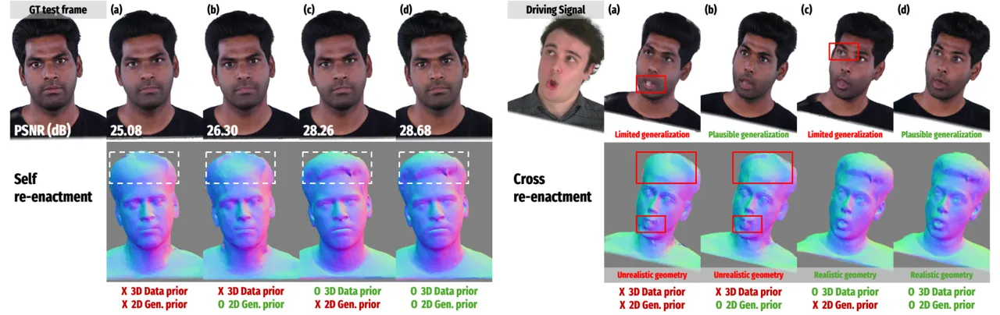

Figure S2: Ablation on the 3D data prior and the 2D generative prior.
Self re-enactment (left) shows that methods without the 3D prior
((a),(b)) overfit and produce unrealistic geometry, while (c) and (d)
preserve plausible structure. Cross re-enactment (right) highlights
generalization differences: (a) fails in both geometry and appearance,
(b) improves appearance but not geometry, (c) maintains geometry but
lacks appearance generalization, and (d) (our proposed method) achieves
both.

## C More Ablation Studies

### C.1 Effect of 3D Data & 2D Generative Priors

We analyze the contribution of each prior by evaluating four system
variants: (a) an _overfitting baseline_ without the 3D data prior or the
2D generative prior, (b) a _2D generative prior_ variant without the 3D
data prior, (c) a _3D data prior_ variant without the 2D generative
prior, and (d) our _hybrid_ model combining both priors.

| Variants   | 3D Data Prior | 2D Gen. Prior | PSNR ($`\uparrow`$) | SSIM ($`\uparrow`$) | LPIPS ($`\downarrow`$) | CSIM ($`\uparrow`$) |
| ---------- | ------------- | ------------- | ------------------- | ------------------- | ---------------------- | ------------------- |
| \(a\)      | ✗             | ✗             | 25.08               | 0.8701              | 0.0948                 | 0.6918              |
| \(b\)      | ✗             | ✓             | 26.30               | 0.8759              | 0.0664                 | 0.7237              |
| \(c\)      | ✓             | ✗             | 28.26               | 0.8843              | 0.0742                 | 0.7129              |
| \(d\) Ours | ✓             | ✓             | 28.68               | 0.8912              | 0.0585                 | 0.7397              |

Table S1: Ablation on the 3D data prior and the 2D generative prior
(Self Re-enactment). Our hybrid 3D data & 2D generative prior approach
achieves the highest reconstruction performance on self re-enactment
task, and achieves the most plausible appearance and geometry results on
cross re-enactment (Fig. S2-right).

Fig. S2-left shows self re-enactment results, evaluated on held-out
frames for which full metrics can be computed. For all the variants, we
use three input frames for supervising the test-time adaptation.
Quantitative comparisons for the self re-enactment PSNR, SSIM, LPIPS,
and CSIM are provided in Table S1. Since the held-out frames are
visually similar to the training data (speech-driven frames with limited
pose variation), all the methods achieve comparable PSNR values.
However, geometry quality differs significantly: methods (a) and (b),
which lack a 3D data prior and optimize directly from a template mesh,
overfit to RGB observations and converge to flattened, unrealistic
facial geometry. In contrast, methods (c) and (d) benefit from the 3D
prior and faithfully preserve plausible facial structure. Because the
held-out frames are close to the training distribution, the influence of
the 2D generative prior is less noticeable in this setting.

Fig. S2-right further evaluates cross re-enactment, where each avatar is
driven by novel and challenging poses and expressions. This setting
exposes clear differences in generalization performance. Variant (a)
shows limited generalization in appearance due to the absence of any
prior and producing noticeable geometric collapses. Variant (b)
leverages the 2D generative prior and therefore plausibly generalizes to
unseen poses and expressions, yet still suffers from unrealistic
geometry because it lacks the 3D prior. Variant (c) produces realistic
geometry thanks to the learned 3D prior, but its RGB appearance does not
generalize well to out-of-distribution poses when trained solely on real
monocular data. Finally, our hybrid approach (d), using both priors,
achieves faithful geometry and appears to have strong view/expression
generalization simultaneously, producing the most plausible re-enactment
results.

Overall, this ablation confirms three key observations: (1) without a 3D
data prior, monocular reconstruction easily overfits and produces
inaccurate geometry even when the rendered appearance seems plausible;
(2) without a 2D generative prior, appearance-space generalization to
unseen poses and expressions remains limited; and (3) combining both
priors yields a complementary effect, enabling ELITE to achieve
realistic geometry and plausible re-enactment quality across both seen
and unseen driving signals.

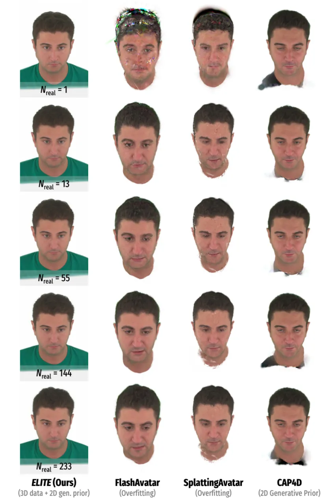

Figure S3: Effect of the number of real frames.

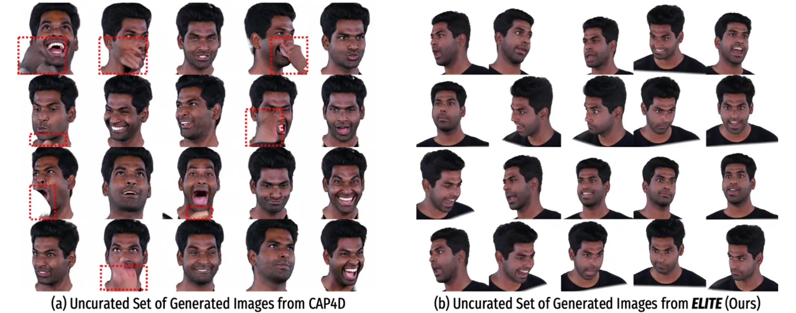

Figure S4: Uncurated comparison of generated supervision images. (a)
CAP4D produces images via full denoising from pure noise, leading to
severe artifacts and identity drift, whereas (b) our rendering-grounded
single-step enhancer generates identity-preserving, artifact-free images
with significantly higher consistency, with 60$`\times`$ faster
generation speed.

### C.2 Effect of the Number of Real Video Frames

Figure S3 compares the cross re-enactment quality as we vary the number
of real supervision frames $`N_{\text{real}}`$. Although self
re-enactment metrics (e.g., PSNR) improve with more real frames
(Sec. 4.3 & Fig. 10 in the main paper), we observe that ELITE already
produces stable and high-quality cross re-enactment results even with a
single supervision frame. We attribute this robustness to our 3D data
prior, which provides strong initialization, and to our generative
adaptation stage, which supplies synthetic multi-view supervision
regardless of $`N_{\text{real}}`$. In contrast, overfitting-based
methods, FlashAvatar \[43\] and SplattingAvatar \[37\], show limited
generalization to unseen expressions when $`N_{\text{real}}`$ is small,
as they rely solely on limited observations. CAP4D \[41\] benefits from
synthetic views but still suffers from identity drift and limited
expression fidelity. Overall, ELITE maintains strong cross-view and
cross-expression generalization even under extremely sparse supervision.

## D More Results

### D.1 Comparison of Generated Supervision Images

In Fig. S4, we qualitatively compare the uncurated sets of supervision
images produced by CAP4D and our method.

Since CAP4D synthesizes each image by performing full diffusion
denoising from pure noise, its outputs frequently exhibit severe
artifacts (e.g., distorted facial regions, inconsistent geometry, or
implausible textures) and suffer from noticeable identity drift. In
contrast, our single-step diffusion enhancer is grounded on the rendered
Gaussian avatar, providing strong geometric and appearance cues that
guide the single-step generation process. As a result, our generated
images preserve identity much more faithfully and contain significantly
fewer visual artifacts. Moreover, by avoiding multi-step diffusion
sampling, our method achieves 60$`\times`$ faster generation while
delivering cleaner and more reliable supervision for test-time
adaptation.

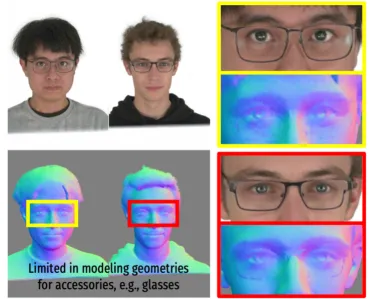

Figure S5: Limitation in modeling accessories. Although the RGB
appearance from ELITE follows the eyeglasses in the input, the normal
maps show no corresponding geometry, indicating that the glasses are
baked into the texture.

### D.2 Limitations on Modeling Accessories

Our method has room for improvement in modeling accessories such as
eyeglasses. Because the underlying 3D data prior model, MGPM, is trained
on NerSemble \[14\], and we filtered out few identities with accessories
to focus on pure head geometry and appearance, ELITE did not have a
chance to learn explicit geometry priors for glasses. As a result, while
the RGB appearance partially follows the glasses in input frames, the
rendered normal maps reveal that no corresponding 3D structure is
reconstructed (see Fig. S5), meaning the glasses are effectively baked
into the texture space rather than modeled as geometry. Extending the
prior to jointly learn facial and accessory geometry remains an
important direction for future work.

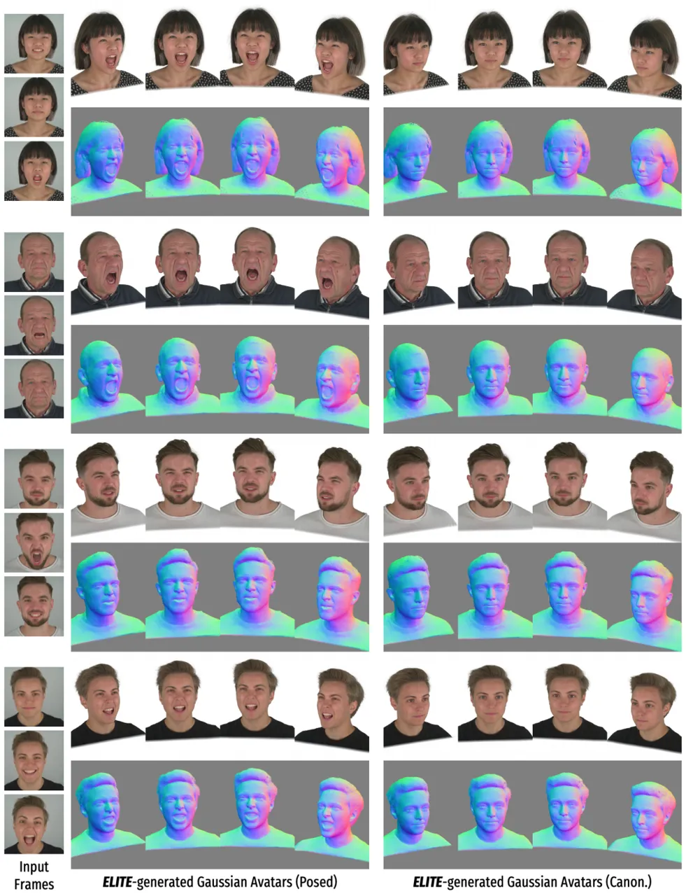

Figure S6: Multi-view, Multi-expression Renderings of ELITE-generated
Gaussian Avatars.

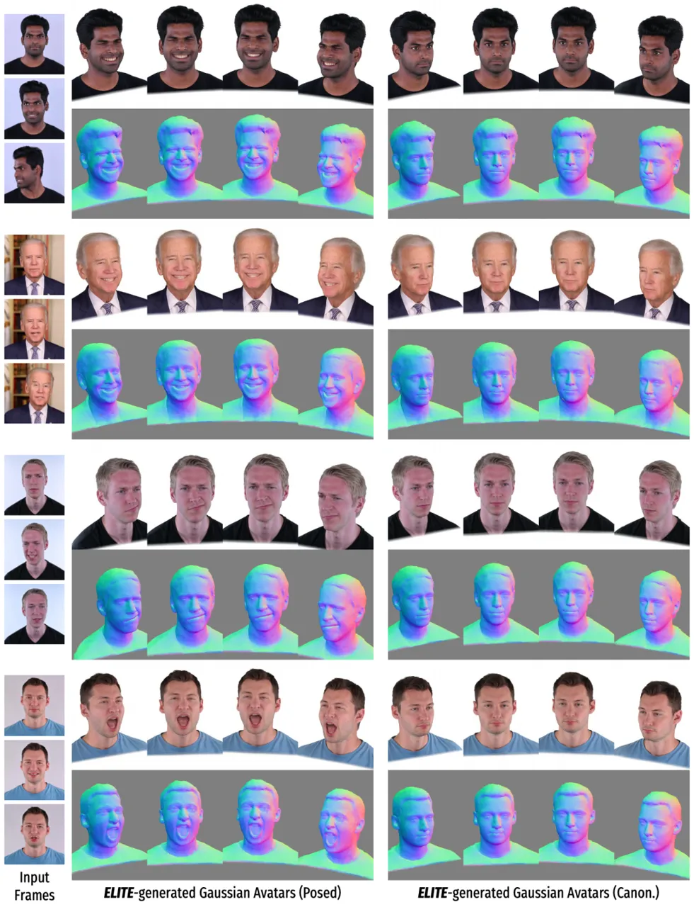

Figure S7: Multi-view, Multi-expression Renderings of ELITE-generated
Gaussian Avatars.

### D.3 Multi-view/-expression Renderings

In Figs. S6 & S7, we show multi-view rendered images and normal
renderings of the Gaussian avatars synthesized from our method. We use
our held-out test identities from the NerSemble-V2 dataset and test
identities from the INSTA dataset. For all the identities, we use three
images from the videos as test-time supervision for avatar adaptation.
Overall, our method synthesizes high-fidelity, authentic Gaussian
avatars with faithful appearances and geometries that generalize across
diverse expressions and viewpoints.

## E Broader Impacts & Ethical Considerations

#### Societal Impact

The primary goal of ELITE is to enabling accessible high-fidelity avatar
synthesis for applications in telepresence, mixed reality, and we
recognize the potential risks associated with misuse. To mitigate these
risks, we advocate for the community’s ongoing efforts in avatar
fingerprinting \[28\] and digital media forensics \[34\] to support the
detection of synthetic media. To promote transparency and
reproducibility, we plan to release our code and models strictly for
research purposes.

#### Data Considerations

ELITE utilizes open-sourced academic datasets (NerSemble-V2, INSTA) to
learn geometric and appearance priors. While ELITE demonstrates
plausible generalization across various identities, we are aware of the
importance of continued improvements in dataset diversity.
