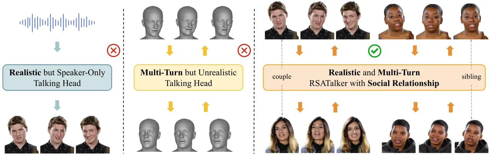
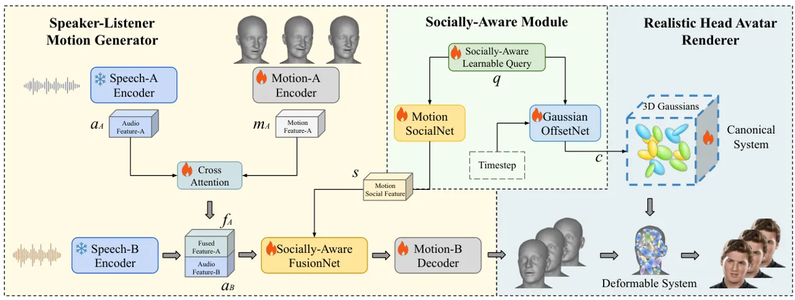
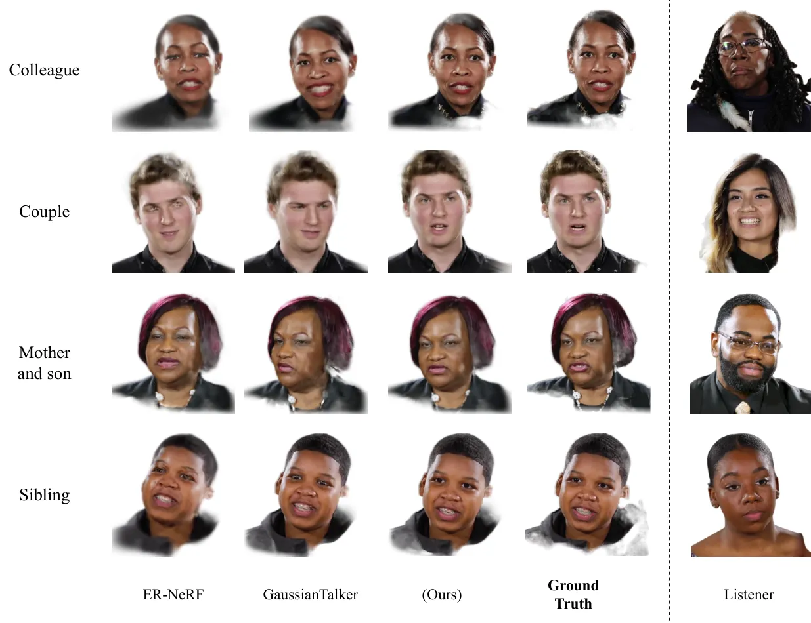
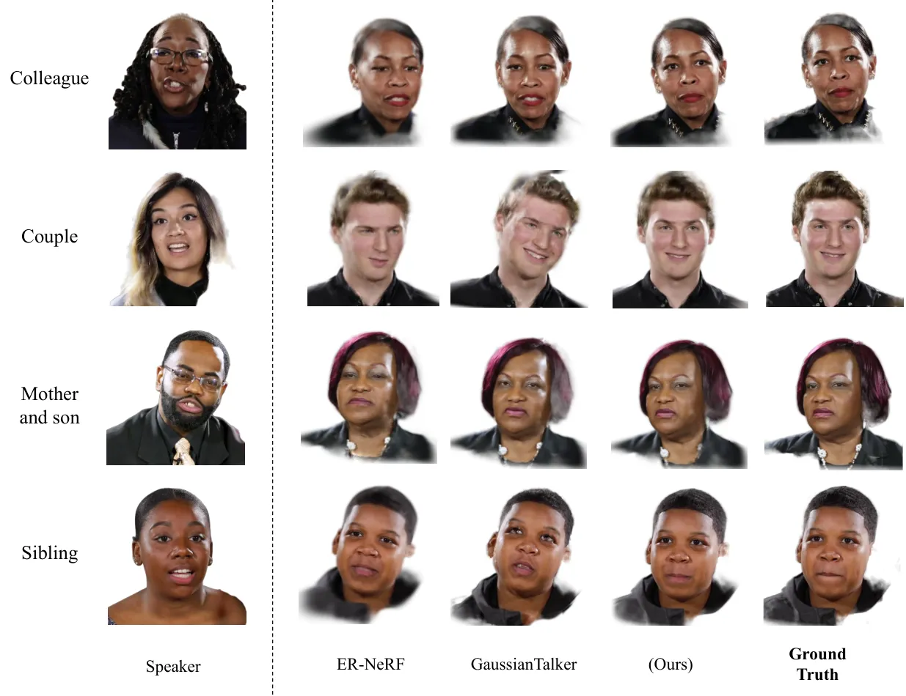

# RSATalker: Realistic Socially-Aware Talking Head Generation for Multi-Turn Conversation

Peng Chen  Xiaobao Wei  Yi Yang  Naiming Yao  Hui Chen  Feng Tian
Affiliation: Institute of Software, Chinese Academy of Sciences
Affiliation: University of Chinese Academy of Sciences

###### Abstract

Talking head generation is increasingly important in virtual reality
(VR), especially for social scenarios involving multi-turn conversation.
Existing approaches face notable limitations: mesh-based 3D methods can
model dual-person dialogue but lack realistic textures,
large-model-based 2D methods produce natural appearances but incur
prohibitive computational costs. Recently, 3D Gaussian Splatting
(3DGS)-based methods achieve efficient and realistic rendering but
remain speaker-only and ignore social relationships. We introduce
RSATalker, the first framework that leverages 3DGS for realistic and
socially-aware talking head generation, with support for multi-turn
conversation. Our method first drives mesh-based 3D facial motion from
speech, then binds 3D Gaussians to mesh facets to render high-fidelity
2D avatar videos. To capture interpersonal dynamics, we propose a
socially-aware module that encodes social relationships, including blood
and non-blood as well as equal and un-equal, into high-level embeddings
through a learnable query mechanism. We design a three-stage training
paradigm and construct the RSATalker dataset with speech–mesh–image
triplets annotated with social relationships. Extensive experiments
demonstrate that RSATalker achieves state-of-the-art performance in both
realism and social awareness. The code and dataset will be released.

²²footnotetext: Corresponding author.

## 1 Introduction



Figure 1: Pipeline of RSATalker. We introduce RSATalker, a novel
framework that leverages 3D Gaussian Splatting (3DGS) to generate highly
realistic and socially-aware talking heads, specifically designed for
dynamic speaker–listener interaction scenarios.

In recent years, the advancement of deep learning techniques and
computer graphics technologies has significantly promoted the
development of talking head generation \[1, 3, 6\]. This capability has
gained considerable importance in applications within virtual reality
(VR) \[21, 43\], especially in immersive social interaction scenarios
that involve multi-turn conversation between two participants \[26,
23\]. In such settings, the roles of speaker and listener alternate
dynamically over the course of dialogue. The outputs of talking head
generation systems can generally be categorized into two
representational paradigms: those based on 3D meshes and those relying
on 2D imagery.

For 3D mesh-based methods, most approaches generate vertices or
blendshapes \[15\] using Transformer- or Diffusion-based models to drive
head mesh models such as FLAME \[20\], thereby enabling talking head
animations. Representative works include FaceFormer \[7\], EmoTalk
\[29\], DiffusionTalker \[3\], and Learning to Listen. However, these
methods are typically “speaker-only” or “listener-only.” For multi-turn
conversation, DualTalk \[26\] made an initial attempt by modeling
dual-person dialogues, which marked an important step forward.
Nevertheless, these approaches struggle to achieve photorealistic
textures, accurate color reproduction, and naturalistic dynamic
behaviors (e.g., facial expressions or micro-movements), frequently
inducing the ‘uncanny valley’ \[33, 13\] effect in VR environments due
to perceptible inconsistencies that trigger visceral discomfort.

In contrast, 2D image-based methods address this limitation by driving
RGB human faces to generate photorealistic talking heads. Current
approaches can be broadly grouped into two paradigms. First, large-scale
pretrained models based on Stable Diffusion \[32\] or Diffusion
Transformer (DIT) \[24\], such as Wan \[35\] and HunyuanVideo-Avatar
\[4\], exhibit strong generalization capabilities, but their massive
parameter sizes lead to extremely high computational costs, rendering
them impractical for VR deployment. Second, Neural Radiance Field \[22\]
(NeRF)- and 3D Gaussian Splatting \[14\] (3DGS)-based methods, such as
ER-NeRF \[17\], SyncTalk \[27\], and GaussianTalker \[5\], achieve high
rendering efficiency and accuracy at relatively low computational costs,
making them well-suited for VR applications. However, existing
approaches remain fundamentally “speaker-only,” without modeling the
dynamics of multi-turn conversation.

Moreover, in the context of social interactions during multi-turn
conversation, the social relationship between two speakers plays a
decisive role in shaping facial expressions, head movements, and other
nonverbal behaviors, a crucial factor that previous works have not taken
into account \[8, 25\]. In real multi-turn conversation, these
relationships strongly influence both expressiveness and responsiveness:
for instance, the conversation between close friends often involve
relaxed expressions, frequent smiling, and dynamic gestures, whereas
professional dialogues between a superior and a subordinate tend to be
more restrained, with controlled gaze shifts and formal expressions
\[31, 34\]. Such interpersonal dynamics accumulate over multiple
dialogue rounds, directly affecting how smoothly roles transition
between speaker and listener, and determining the overall naturalness of
the interaction. Ignoring this relationship leads to talking heads that
may appear visually plausible but socially inconsistent, ultimately
limiting their effectiveness in VR-based social communication.

In summary, as shown in Fig. , current methods for talking head
generation in multi-turn conversation face the following limitations:
(1) Existing realistic talking head generation methods only focus on the
speaker-only setting. (2) Mesh-based 3D approaches can achieve dynamic
multi-turn interaction between speakers and listeners, but the results
are unrealistic. (3) Existing talking head methods overlook the
importance of social relationships in multi-turn conversation.



Figure 2: Pipeline of RSATalker. We introduce RSATalker, a novel
framework that leverages 3D Gaussian Splatting (3DGS) to generate highly
realistic and socially-aware talking heads, specifically designed for
dynamic speaker–listener interaction scenarios.

To address the above issues, we propose RSATalker, the first method that
leverages 3DGS to achieve Realistic and Socially-Aware talking head
generation between speakers and listeners. Our approach combines 3D mesh
with 3DGS and consists of three modules: a speaker–listener motion
generator, a realistic head avatar renderer, and a socially-aware
module. The speaker–listener motion generator is built upon 3D mesh and
integrates multiple modalities such as visual and audio cues to infer
smooth facial motion. Subsequently, the realistic head avatar renderer
associates 3D Gaussian primitives with the mesh’s triangular facets and
exploits mesh deformations to produce high-fidelity 2D avatar videos. To
incorporate the social relationship between two people during the
conversation, we introduce a socially-aware module. Specifically, we
categorize social relationships along two dimensions—_blood vs.
non-blood_ and _equal vs. non-equal_—and employ a learnable query
mechanism to abstract these relationships into high-level embeddings,
which are integrated into the model features. We adopt a three-stage
training paradigm, consisting of two cold-start stages followed by an
end-to-end training stage. Moreover, we construct the RSATalker dataset,
which contains speech–mesh–image triplets of different social
relationships. Extensive experiments demonstrate that our method
achieves state-of-the-art performance in this field.

In summary, the main contributions of this work are as follows:

- •
  We propose RSATalker, which leverages 3DGS to achieve realistic and
  socially-aware talking head generation for speaker–listener
  interaction.
- •
  We introduce a socially-aware module that incorporates the crucial
  interpersonal relationship between conversational partners to
  investigate its impact on talking head generation.
- •
  We construct the RSATalker dataset, a realistic multi-turn
  conversation dataset focusing on social relationships, and design a
  three-stage training strategy to optimize the performance of talking
  head generation.

## 2 Related Work

### 2.1 Realistic Speech-Driven Talking Head Generation

Recent advances in talking head generation have been largely driven by
large-scale pretrained models, which achieve impressive photorealism.
MEMO \[19\] introduces a memory-guided diffusion framework that enhances
long-term identity consistency and emotion-aware expression alignment
through temporal modeling and audio-driven emotion modulation. Sonic
\[11\] improves photorealism and expressiveness by incorporating
audio-aligned identity units and semantic motion decomposition into a
coarse-to-fine denoising pipeline, achieving accurate lip-sync and
strong identity preservation across diverse speakers. EmotiveTalk \[36\]
disentangles emotion and content in both audio and visual domains,
allowing fine-grained control over identity, emotion intensity, and lip
synchronization through an emotion-aware conditioning mechanism.
HunyuanVideo-Avatar \[4\] employs a unified diffusion model trained on
large-scale video data to synthesize personalized avatars with diverse
expressions and head poses, integrating identity encoding and
controllable condition inputs for high-fidelity video generation. To
address efficiency, VASA-1 \[42\] proposes a real-time pipeline that
leverages a latent face embedding and controllable keypoints to produce
realistic, expressive talking heads from a single image and audio,
offering a favorable speed–quality trade-off.

While recent diffusion-based approaches have achieved impressive
realism, their reliance on large-scale pretrained models often results
in high computational cost and slow inference, limiting their deployment
in interactive or real-time scenarios. To address these limitations, a
line of research has turned to neural scene representation methods,
particularly those based on Neural Radiance Field (NeRF) \[22, 40, 10,
9\] and 3D Gaussian Splatting (3DGS) \[14, 37, 38, 39\], which offer
significantly faster rendering while maintaining high visual quality.
ER-NeRF \[17\] extends neural radiance fields with expression-aware
radiance modeling and audio-driven deformation fields, enabling
high-fidelity rendering of dynamic facial expressions and
lip-synchronized speech from monocular input, along with free-viewpoint
control. To further improve efficiency, SyncTalk \[27\] adopts a
structured implicit representation combining audio-driven keypoint
control and neural blendshapes, effectively decoupling identity,
expression, and pose for real-time, expressive NeRF-based talking head
generation. Moving beyond radiance fields, GaussianTalker \[5\] pioneers
the use of 3D Gaussian Splatting for talking head synthesis by learning
a dynamic neural blendshape basis over Gaussians, achieving real-time
rendering with accurate lip sync and high identity fidelity.
TalkingGaussian \[16\] generalizes this idea by introducing a unified
3DGS framework that incorporates audio-driven dynamic Gaussians with
decomposed appearance and pose control, enabling disentangled and
expressive talking head generation with high efficiency. Building on
this, EmoTalkingGaussian \[2\] further enhances the expressiveness of
3DGS-based models by introducing emotion-aware dynamic Gaussians and
semantic priors, allowing fine-grained.

Despite their advantages in rendering speed and fidelity, these NeRF-
and 3DGS-based approaches are typically designed for single-speaker
scenarios and lack mechanisms to model dual-speaker interaction, such as
turn-taking and socially-aware behavioral cues between interlocutors.

### 2.2 Multi-Turn Conversation

Modeling multi-turn conversation in talking head generation remains a
largely underexplored yet crucial area. Early attempts, such as RealTalk
\[12\] and Learning to Listen \[23\], primarily focus on the
listener-only setting. These approaches generate short-term nonverbal
feedback—such as nodding, blinking, or subtle head tilts—in response to
the speaker’s audio-visual cues. While such methods improve realism in
passive listening scenarios, they are inherently limited: they cannot
model role switching between speakers, nor sustain coherent
bidirectional interactions across multiple turns of dialogue.
Consequently, they fail to capture the dynamic reciprocity that defines
natural human conversation.

To move beyond passive listening, DualTalk \[26\] introduces the first
multi-turn conversation framework for talking head generation. By
jointly modeling both conversational roles, DualTalk enables more
interactive behaviors, including role alternation, mutual gaze control,
and motion-aware feedback. This represents an important step toward more
natural multi-turn dialogue modeling. However, despite these advances,
DualTalk is still built upon relatively coarse 3D mesh representations.
As a result, it lacks the ability to synthesize realistic textures,
fine-grained appearance details, or natural color variations, which are
essential for achieving photorealistic quality. This limitation
significantly reduces its applicability in VR and other immersive
environments, where users expect both high visual fidelity and socially
consistent interaction.

In addition, prior studies have primarily focused on incorporating
emotion and personalization into talking head generation \[29, 3\], but
have not explored the impact of social relationships in multi-turn
conversation.

In summary, prior works on multi-turn conversation either restrict
themselves to short-term listener feedback or adopt coarse geometric
models that cannot deliver photorealistic visual quality, while
overlooking this critical factor of social relationships. Bridging this
gap requires a new generation of models capable of jointly modeling
dynamic role switching, rich nonverbal behaviors, and high-fidelity
appearance, all within a socially aware conversational framework.

## 3 Method

### 3.1 Preliminaries

In 3D Gaussian Splatting \[14\] (3DGS), a 3D scene is represented as a
collection of Gaussian primitives. Each primitive is parameterized by
its center position $`\mathbf{p_{k}}\in\mathbb{R}^{3}`$ and a covariance
matrix $`\Sigma\in\mathbb{R}^{3\times 3}`$. The Gaussian density at a
spatial point $`\mathbf{p}`$ can be expressed as:

```math
G(\mathbf{p})=\exp\left(-\tfrac{1}{2}(\mathbf{p}-\mathbf{p_{k}})^{\top}\Sigma^{-1}(\mathbf{p}-\mathbf{p_{k}})\right) \tag{1}
```

To make the covariance easier to interpret and manipulate, it is
commonly decomposed into a rotation matrix $`R`$ and a scaling matrix
$`S`$, such that:

```math
\Sigma=RSS^{\top}R^{\top} \tag{2}
```

where $`R`$ encodes the orientation of the Gaussian in 3D space, while
$`S`$ determines its anisotropic spread along different axes.

During the rendering stage, these 3D Gaussian primitives are projected
onto the image plane. This is achieved by applying the world-to-camera
transformation matrix $`W`$, which maps points from world coordinates to
camera coordinates, and a local affine transformation matrix $`J`$,
which adjusts the shape of the Gaussian under perspective projection.
The result of this projection is a set of 2D Gaussian primitives, each
with a covariance matrix $`\Sigma^{2D}`$. The corresponding projected
Gaussian is denoted as $`G^{3D}`$ when expressed in screen space.
Finally, image formation is carried out via alpha blending. In this
process, the contribution of each projected Gaussian is accumulated
along the viewing direction. The color at a given pixel $`\mathbf{x}`$
is computed as:

```math
\mathbf{c}(\mathbf{x})=\sum_{k=1}^{K}\mathbf{c_{k}}\alpha_{k}G^{3D}_{k}(\mathbf{x})\prod_{j=1}^{k-1}\big(1-\alpha_{j}G^{3D}_{j}(\mathbf{x})\big) \tag{3}
```

where $`\mathbf{c_{k}}`$ denotes the color attribute of the $`k`$-th
Gaussian primitive, and $`\alpha_{k}`$ represents its opacity.

### 3.2 Overview

RSATalker consists of three modules: speaker-listener motion generator,
realistic head avatar renderer, and socially-aware module.

For the speaker-listener motion generator, the inputs are speaker-A’s
speech and FLAME-based \[20\] motion parameters, as well as speaker-B’s
speech. Through a cross-attention mechanism, a socially-aware fusionnet,
and a motion decoder, it predicts speaker-B’s facial motion, which can
drive the FLAME model to generate 3D head avatar facial animations. The
realistic head avatar renderer binds 3D Gaussians to the corresponding
triangular facets of the FLAME model. As the deformable FLAME model
moves, the 3D Gaussians are indirectly driven to move. For a given
timestep, the 3D Gaussians are rendered into an RGB image through
Gaussian splatting. Multiple timesteps collectively render a talking
head video. The socially-aware module employs learnable queries to
process learnable social embeddings through the motion socialnet and
Gaussian offsetnet, respectively producing motion social features and
Gaussian offset corrections. This injects social relationship
information into the first two modules.

### 3.3 Speaker-Listener Motion Generator

The primary function of this module is to capture the relationship
between speech and facial motion. It conditions on the audiovisual
information of the interlocutor (i.e., speaker-A) to better guide the
model in generating the facial motion of the current speaker (i.e.,
speaker-B) within social interaction scenarios.

Specifically, the speech signals from speaker-A and speaker-B
($`\text{speech}_{A}`$, $`\text{speech}_{B}`$) are processed by a
pretrained speech encoder Wav2Vec 2.0 to obtain their corresponding
audio features $`a_{A}`$ and $`a_{B}`$. Meanwhile, the facial motion of
speaker-A, represented by FLAME parameters, is passed through a motion
encoder to yield the motion feature $`m_{A}`$. To effectively capture
speaker-A’s audiovisual information, we fuse $`a_{A}`$ and $`m_{A}`$
using a cross-attention mechanism. The fusion process is formulated as:

```math
f_{A}=\text{CrossAttn}\big(\mathbf{Q}=a_{A},\;\mathbf{K}=m_{A},\;\mathbf{V}=m_{A}\big) \tag{4}
```

where $`f_{A}`$ denotes the fused feature of speaker-A.

Figure 3: The structure of the socially-aware fusion network.

Subsequently, we concatenate $`f_{A}`$ and $`a_{B}`$, and feed the
combined features into a socially-aware fusion network, which injects
social relationship information into the motion representation. As
illustrated in Fig. 3, the concatenated features $`[f_{A};a_{B}]`$ are
first processed by a Transformer encoder to model their temporal
dependencies and contextual interactions. The encoded representation is
then used as the keys and values in a cross-attention mechanism, where
the query is the motion social feature $`s`$ generated from the
socially-aware module:

```math
z=\text{CrossAttn}\big(\mathbf{Q}=s,\;\mathbf{K}=[f_{A};a_{B}],\;\mathbf{V}=[f_{A};a_{B}]\big), \tag{5}
```

where $`[\cdot;\cdot]`$ denotes the feature concatenation operation.
This design allows the query of motion social feature $`s`$ to
selectively attend to the fused motion–audio features according to the
underlying social relationship, thereby embedding socially conditioned
dynamics into the motion representation.

Finally, the socially-aware motion representation $`z`$ is passed
through a Transformer-based motion decoder, which generates the target
facial motion sequence of speaker B. The predicted motion is directly
mapped onto the FLAME parametric head model, enabling the rendering of
high-fidelity and socially consistent facial dynamics for the multi-turn
conversation.

### 3.4 Realistic Head Avatar Renderer

To generate realistic talking heads, we adopt a coordinate system
conversion strategy inspired by the 3D Gaussian rigging approach in
GaussianAvatars \[30\]. The key idea is to establish a mapping between
the FLAME mesh and the 3D Gaussians, where the mapping essentially
encodes the transformation between the canonical coordinate system and
the deformable coordinate system.

At initialization, each triangular facet of the FLAME mesh is assigned a
corresponding 3D Gaussian. If the FLAME mesh has $`N`$ triangular
facets, then $`N`$ 3D Gaussians are initialized, which we refer to as
the anchor Gaussians. In the canonical coordinate system, the Gaussian
parameters are set to default states: the position $`\mu_{c}`$ is
initialized to zero, the rotation matrix $`r_{c}`$ is the identity
matrix, the scaling $`s_{c}`$ is a unit vector, and the opacity
$`\alpha`$ is set to zero. In contrast, in the deformable coordinate
system, these Gaussian parameters are determined by the geometry of the
associated mesh triangle. Through this mapping, the 3D Gaussians are
transformed from the canonical system to the deformable one, enabling
the Gaussians to follow mesh deformations.

During training, 3DGS performs adaptive density control, under which
existing anchor Gaussians may be cloned and split. The newly cloned and
split Gaussians are referred to as the neural Gaussians. Each neural
Gaussian is bound to its anchor Gaussian, as illustrated in Fig. 4,
thereby forming an anchor-neural relationship.

In the deformable coordinate system, the parameters of a 3D Gaussian are
defined as the position $`\mu_{d}`$, rotation matrix $`r_{d}`$, scaling
$`s_{d}`$, and opacity $`\alpha`$. The transformation of Gaussian
rotation and scaling is formulated as:

```math
r_{d}=Rr_{c},\quad s_{d}=\lambda s_{c} \tag{6}
```

where $`R`$ is a rotation matrix constructed from the triangle’s edge
direction, its normal vector, and their cross-product. The factor
$`\lambda`$ corresponds to the average length of an edge and its
perpendicular, serving as a global scale factor for both position and
size.

The position transformation between the mesh and the 3D Gaussian is
defined as:

```math
\mu_{d}=\lambda R\mu_{c}+T+c \tag{7}
```

where $`T`$ denotes the centroid of the corresponding triangle in global
space. To reduce alignment errors, we further introduce Gaussian offset
corrections $`c`$ (with $`N`$ dimensions, corresponding to the $`N`$
anchor Gaussians) from the socially-aware module, which adaptively
corrects positional deviations over time. Each neural Gaussian shares
the same Gaussian offset correction with its anchor Gaussian.

At each timestep, all 3D Gaussians in the deformable system are rendered
into an image through splatting as formulated in Eq. 3. The images
generated across all timesteps can then be composed into a realistic
head avatar video, as shown in Fig. 5.

### 3.5 Socially-Aware Module

Figure 4: The anchor–neural structure of the 3D Gaussians.

We categorize social relationships in multi-turn conversation along two
orthogonal dimensions: _blood vs. non-blood_ and _equal vs. non-equal_,
which yield four possible combinations of interpersonal contexts. For
example, a young couple falls under the category of non-blood and equal,
a mother-son relationship corresponds to blood and non-equal, while an
interaction between superior–subordinate colleagues is classified as
non-blood and non-equal. This taxonomy provides a compact yet expressive
representation of the diverse social dynamics that naturally arise in
human dialogues.

To model these relationships, we maintain two sets of embeddings, each
encoding one dimension of the social taxonomy. Specifically, each set
consists of two orthogonal embeddings, allowing us to represent the
binary states in a disentangled manner. Given an input conversation
sample, the embedding corresponding to the detected social relationship
is retrieved and fused to form a structured query $`q`$ of the
interpersonal context. This query is then processed by a dedicated
motion socialnet, implemented as a two-layer MLP, to generate the motion
social feature $`s`$. The feature $`s`$ serves as a high-level
relational prior that modulates the facial motion dynamics through
cross-attention with the motion modality. In parallel, we introduce a
Gaussian offsetnet, which is also a two-layer MLP. It takes as input
$`q`$ and the timestep $`t`$, and generates Gaussian offset corrections
$`c`$. The formulation is as follows:

```math
c=\text{GON}(q,t) \tag{8}
```

where GON denotes the Gaussian offsetnet. These corrections are applied
during the coordinate system conversion step, adaptively adjusting the
positional parameters of the 3D Gaussian primitives. In this way, the
socially conditioned information not only influences temporal motion
generation but also fine-tunes the geometric rendering of facial
details.

Importantly, all parameters in this socially-aware module are learnable,
enabling the system to jointly optimize motion dynamics and appearance
adaptation under different social contexts. This design allows the model
to flexibly capture subtle interpersonal variations—such as restrained
facial expressions in the hierarchical conversation or expressive cues
in intimate interactions—ultimately leading to more socially consistent
talking head generation.

Figure 5: In the deformable system, the motion of the mesh can drive the
3DGS to render a realistic 2D talking head.

### 3.6 Three-Stage Training

We adopt a three-stage training paradigm to progressively build up the
proposed framework. In the first stage, we pretrain the speaker–listener
motion generator through a cold start, where a large-scale dataset is
used to learn the general interaction patterns of multi-turn
conversation. The training objective is defined as

```math
L_{\text{mesh}}=\|M-M_{\text{gt}}\|_{2} \tag{9}
```

where $`M`$ denotes the facial motion parameterized by the FLAME model
(e.g., expression and pose coefficients), and $`M_{\text{gt}}`$ is the
corresponding ground truth.

In the second stage, we pretrain the realistic head avatar renderer by
reconstructing the 3DGS representation of the speaker. This step allows
the model to acquire the ability to render speaker-specific head and
facial motion. We calculate the $`L_{1}`$ loss between the rendered
images and the ground truth, including a D-SSIM term:

```math
L_{\text{image}}=(1-\lambda)L_{1}+\lambda L_{\text{D-SSIM}} \tag{10}
```

where $`\lambda`$ is set to 0.2. To ensure that the locations of the 3D
Gaussians and the corresponding underlying mesh remain adequately
aligned in the deformable system, we constrain the canonical position
$`\mu_{c}`$ using $`L_{\text{pos}}`$:

```math
L_{\text{pos}}=\left\|\max\left(\mu_{c},\epsilon_{\text{pos}}\right)\right\|_{2} \tag{11}
```

Similarly, for the Gaussian offset corrections $`c`$, we also restrict
their magnitude:

```math
L_{\text{offset}}=\left\|\max\left(c,\epsilon_{\text{offset}}\right)\right\|_{2} \tag{12}
```

where the thresholds are set as
$`\epsilon_{\text{pos}}=\epsilon_{\text{offset}}=1`$.

Finally, in the third stage, we introduce the socially-aware module and
perform end-to-end joint training, which integrates social relationship
embeddings into the overall system. The joint optimization objective is
formulated as

```math
L_{\text{joint}}=L_{\text{mesh}}+\lambda_{1}L_{\text{image}}+\lambda_{2}L_{\text{pos}}+\lambda_{3}L_{\text{offset}} \tag{13}
```

where $`\lambda_{1}`$ is set to 0.5, and
$`\lambda_{2}=\lambda_{3}=0.01`$. Except for the parameters of the
speech encoder, all other model parameters are trained.

## 4 Experiments

|                       | FD $`\downarrow`$ |                   |                   | P-FD $`\downarrow`$ |                   |                   | MSE $`\downarrow`$ |                   |                   |
| --------------------- | ----------------- | ----------------- | ----------------- | ------------------- | ----------------- | ----------------- | ------------------ | ----------------- | ----------------- |
| Methods               | EXP               | JAW               | POSE              | EXP                 | JAW               | POSE              | EXP                | JAW               | POSE              |
|                       |                   | $`\times 10^{3}`$ | $`\times 10^{2}`$ |                     | $`\times 10^{3}`$ | $`\times 10^{2}`$ | $`\times 10^{1}`$  | $`\times 10^{3}`$ | $`\times 10^{2}`$ |
| FaceFormer \[7\]      | 34.90             | 5.40              | 8.00              | 34.90               | 5.40              | 8.00              | 6.97               | 1.80              | 2.67              |
| CodeTalker \[41\]     | 48.57             | 6.89              | 10.74             | 48.57               | 6.89              | 10.74             | 9.71               | 2.29              | 3.58              |
| EmoTalk \[29\]        | 29.86             | 4.33              | 7.54              | 30.20               | 4.36              | 7.58              | 6.88               | 1.76              | 2.59              |
| DiffusionTalker \[3\] | 30.67             | 4.89              | 8.23              | 36.71               | 5.98              | 7.43              | 6.54               | 1.63              | 2.57              |
| SelfTalk \[28\]       | 35.77             | 5.49              | 8.14              | 35.77               | 5.49              | 8.14              | 7.15               | 1.83              | 2.71              |
| L2L \[23\]            | 24.61             | 3.69              | 7.08              | 24.99               | 3.74              | 7.13              | 5.68               | 1.48              | 2.49              |
| DualTalk \[26\]       | 11.14             | 1.90              | 3.83              | 11.88               | 1.97              | 3.97              | 3.59               | 1.04              | 1.72              |
| RSATalker             | 10.68             | 2.05              | 3.43              | 10.21               | 1.82              | 4.34              | 2.98               | 1.12              | 1.65              |

Table 1: Quantitative evaluation on the test set of DualTalk dataset.

### 4.1 RSATalker Dataset Construction

In multi-turn conversational talking head scenarios, existing datasets
often lack one or more modalities. For example, RealTalk \[12\] contains
only speech and 2D video, whereas DualTalk \[26\] provides only speech
and 3D mesh data. This limitation motivates the need for a dataset that
includes all three modalities—speech, 3D mesh, and video—to fully
capture facial movements in multi-turn interactions. To address this, we
construct a speech–mesh–video triplet dataset by combining information
from RealTalk and DualTalk, providing a more comprehensive resource for
learning realistic talking head dynamics. Specifically, we first
leverage two social relationship dimensions in DualTalk
(_blood/non-blood_ and _equal/non-equal_) to form four typical
relationship scenarios: blood & equal (e.g., sibling), blood & non-equal
(e.g., mother and son), non-blood & equal (e.g., couple), and non-blood
& non-equal (e.g., superior–subordinate colleagues). We then retrieve
the corresponding video segments from RealTalk using the speech clips
from these data, precisely localizing their temporal positions via audio
feature matching and cropping the corresponding video. This results in a
complete speech–mesh–video triplet dataset, providing richer support for
multi-modal modeling.

### 4.2 Experimental Settings

#### 4.2.1 Baselines

To comprehensively evaluate the capability of RSATalker, we selected two
types of talking head methods, namely mesh-based and image-based
approaches, as baselines. The former is evaluated on the test set of
DualTalk dataset, while the latter is assessed on the test set of
RSATalker dataset. The mesh generation methods include FaceFormer \[7\],
CodeTalker \[41\], DiffusionTalker \[3\], EmoTalk \[29\], SelfTalk
\[28\], Learning-to-Listen(L2L) \[23\], and DualTalk \[26\]. The image
generation methods include ER-NeRF \[18\], SyncTalk \[27\], and
GaussianTalker \[5\]. For speaker-only and listener-only methods, we
could only use the speech of one single speaker as input.

#### 4.2.2 Metrics

We employ two sets of quantitative metrics to evaluate the mesh and
image, one set of qualitative talking head image visualizations, and one
socially-aware user study.

For mesh-based methods, we use metrics such as Frechet Distance (FD),
Paired Frechet Distance (P-FD), and Mean Squared Error (MSE) to assess
the accuracy and smoothness of facial motions.

For the image–based methods, we adopt L1, PSNR, SSIM, and LPIPS to
measure the quality of the generated images and the realism of the
talking heads. Detailed experimental results can be found in the
quantitative evaluation section.

In addition, to assess the performance of talking head generation in
capturing social relationships, we propose a novel metric termed
“socially-aware user study”. This metric relies on human evaluation,
where professional annotators assign scores to all methods. The specific
experimental setup and results are presented in the qualitative
evaluation section.

### 4.3 Quantitative Evaluation

#### 4.3.1 Mesh-based methods

For mesh-based methods, the results are shown in Tab. 1. We report three
metrics—FD, P-FD, and MSE—each further evaluated across three
dimensions: expression, jaw, and head pose. All models were tested on
the DualTalk dataset test set.

Among them, FaceFormer, CodeTalker, EmoTalk, DiffusionTalker, and
SelfTalk are speaker-only methods. Suppose the two participants are
speaker A and speaker B: in this setting, these methods can only take
speaker B’s speech as input, without conditioning on speaker A’s facial
motion or speech. However, in multi-turn dialogue scenarios, speaker B
may act as a listener. In such cases, speaker B’s speech often consists
only of filler tokens (e.g., “uh,” “hmm,” “mm”), which lack meaningful
semantic content. If the model relies solely on speaker B’s speech
input, it struggles to generate natural facial expressions and head
poses, leading to higher errors across the reported metrics.

L2L addresses this limitation by effectively capturing speaker B’s
facial behaviors when acting as a listener, thereby reducing errors
across all metrics. Nevertheless, it cannot handle multi-turn dialogues,
which results in suboptimal performance when speaker B takes the role of
the speaker. As a result, its overall performance still falls short of
the best.

DualTalk, as the first method designed for multi-turn dialogue,
introduces improvements in temporal modeling and feature fusion for both
speakers and listeners. This significantly enhances the modeling of
interactions between the two participants, yielding a notable
performance gain over L2L. However, it does not consider the influence
of social relationships in multi-turn conversation.

To overcome this limitation, RSATalker incorporates a socially-aware
module, which classifies and extracts features based on different types
of social relationships. This design further improves the accuracy of
facial expressions and head poses in multi-turn dialogue scenarios.

| Method               | L1 $`\downarrow`$ | PSNR $`\uparrow`$ | SSIM $`\uparrow`$ | LPIPS $`\downarrow`$ |
| -------------------- | ----------------- | ----------------- | ----------------- | -------------------- |
| ER-NeRF \[18\]       | 0.0468            | 19.8098           | 0.8856            | 0.1413               |
| SyncTalk \[27\]      | 0.0288            | 20.9312           | 0.9184            | 0.1035               |
| GaussianTalker \[5\] | 0.0224            | 21.3262           | 0.9164            | 0.0967               |
| RSATalker            | 0.0198            | 22.9979           | 0.9377            | 0.0560               |

Table 2: Quantitative evaluation on the test set of RSATalker dataset.

#### 4.3.2 Image-based methods

| Method               | Realism $`\uparrow`$ |                   |                |      | Fluency $`\uparrow`$ |                      |                     |      | SRA $`\uparrow`$ |                |                      |      | Total $`\uparrow`$ |
| -------------------- | -------------------- | ----------------- | -------------- | ---- | -------------------- | -------------------- | ------------------- | ---- | ---------------- | -------------- | -------------------- | ---- | ------------------ |
|                      | Lip Sync             | Expr. Naturalness | Visual Realism | Mean | Motion Smoothness    | Temporal Consistency | Long-term Stability | Mean | Role Consistency | Emotional Tone | Interaction Dynamics | Mean |                    |
| ER-NeRF \[18\]       | 65.1                 | 58.3              | 62.7           | 62.0 | 60.2                 | 58.5                 | 55.4                | 58.0 | 40.6             | 42.1           | 38.4                 | 40.4 | 50.2               |
| SyncTalk \[27\]      | 85.2                 | 72.4              | 74.1           | 77.2 | 70.3                 | 65.7                 | 68.2                | 68.1 | 48.6             | 50.2           | 47.3                 | 48.7 | 60.7               |
| GaussianTalker \[5\] | 80.5                 | 78.6              | 86.2           | 81.8 | 75.8                 | 72.5                 | 70.9                | 73.1 | 55.4             | 58.7           | 60.3                 | 58.1 | 67.8               |
| RSATalker            | 90.7                 | 86.4              | 88.2           | 88.4 | 88.5                 | 86.1                 | 85.6                | 86.7 | 84.7             | 82.3           | 86.5                 | 84.5 | 86.1               |

Table 3: User study results (0–100 scale). Each dimension is evaluated
by three sub-criteria, and the final scores are averaged across all
participants. RSATalker achieves the highest scores across all
dimensions, with the most significant improvements observed in SRA. Each
dimension mean is reported in the last column of the dimension.

2D image-based talking head methods better capture the realism of
digital humans. We conducted the evaluation on the RSATalker dataset
test set, with results shown in Tab. 2. ER-NeRF and SyncTalk are
NeRF-based methods, while GaussianTalker and RSATalker are based on
3DGS. Overall, compared with NeRF, 3DGS-based methods deliver higher
rendering quality.

However, since ER-NeRF, SyncTalk, and GaussianTalker are all
speaker-only methods, they cannot take speaker A’s facial motion and
speech as conditional inputs and can only rely on speaker B’s speech,
which leads to suboptimal rendering quality. By contrast, RSATalker
benefits from its ability to support multi-turn dialogues and
incorporate social relationship features, enabling it to significantly
outperform the baselines.



Figure 6: Visualization comparison with the talking head as the speaker.
We selected four representative social relationships:
superior–subordinate colleagues, couple, mother and son, and siblings.



Figure 7: Visualization comparison with the talking head as the
listener.

### 4.4 Qualitative Evaluation

#### 4.4.1 Socially-aware user study

To further evaluate the rendering quality of talking head generation, we
conducted a socially-aware user study comparing RSATalker against three
representative baselines: ER-NeRF, SyncTalk, and GaussianTalker.
Twenty-four participants (graduate students and researchers with prior
experience in computer vision and human–computer interaction; 10 male,
11 female, 2 non-binary, and 1 undisclosed, all of whom provided
informed consent) each viewed four videos generated from the same input
speech and provided continuous ratings (0–100) on nine sub-criteria
grouped into three high-level dimensions: Realism (lip–speech
synchronization, expression naturalness, visual photorealism), Fluency
(motion smoothness, temporal consistency, long-term stability), and
Social Relationship Accuracy, SRA (role consistency, emotional
plausibility, interaction dynamics). Dimension scores were computed by
averaging the three sub-criteria, and the overall score for each method
was computed as

```math
S_{\text{total}}=0.25\,S_{\text{Realism}}+0.25\,S_{\text{Fluency}}+0.5\,S_{\text{SRA}} \tag{14}
```

reflecting the design choice to emphasize social relationship fidelity
in multi-turn conversation.

Tab. 3 lists the averaged sub-criterion and total scores. RSATalker
achieves the highest scores across every reported sub-criterion and
dimension: overall weighted totals are RSATalker = 86.1, GaussianTalker
= 67.8, SyncTalk = 60.7, and ER-NeRF = 50.2. In relative terms,
RSATalker improves the weighted total by $`26.9\%`$ over GaussianTalker,
$`41.9\%`$ over SyncTalk, and $`71.5\%`$ over ER-NeRF, indicating a
substantial perceptual advantage when social relationship modeling is
required.

##### Dimension-wise findings.

Realism. RSATalker’s realism average is 88.4 (Lip Sync = 90.7,
Expression Naturalness = 86.4, Visual Realism = 88.2), which is
$`7.6\%`$ higher than GaussianTalker (81.8) and substantially higher
than SyncTalk (77.2) and ER-NeRF (62.0). These improvements reflect two
factors: (1) accurate audio–visual alignment that reduces
micro-mismatches in expressive turns (RSATalker lip sync = 90.7 vs.
SyncTalk = 85.2), and (2) Gaussian offset corrections that preserve
high-frequency facial details.

Fluency. On temporal metrics, RSATalker averages 86.7 versus
GaussianTalker 73.1 and SyncTalk 68.1, an improvement of $`18.7\%`$ over
GaussianTalker. The gains are most visible in motion smoothness and
long-term stability (RSATalker long-term stability = 85.6 vs.
GaussianTalker = 70.9), indicating the effectiveness of speaker-listener
motion generator in preventing jitter and motion error across timesteps.

Social Relationship Accuracy (SRA). The largest relative gains are
observed in SRA: RSATalker = 84.5 vs. GaussianTalker = 58.1, a relative
increase of $`45.4\%`$. Sub-criterion improvements are particularly
strong for role consistency (84.7 vs. 55.4, $`52.9\%`$ relative gain),
emotional plausibility (82.3 vs. 58.7, $`40.1\%`$), and interaction
dynamics (86.5 vs. 60.3, $`43.5\%`$). These results directly support the
hypothesis that conditioning on social relationship embeddings produces
observable, interpretable behavioral cues (role-appropriate head poses,
emotionally congruent micro-expressions, turn-taking / backchannel
patterns) that human raters use to infer relationship and intent.

##### Sub-criterion analysis and qualitative corroboration.

Inspecting the sub-criteria in Tab. 3 highlights complementary strengths
and weaknesses of the baselines. SyncTalk is strong in framewise lip
alignment (85.2) but loses ground on temporal consistency (65.7) due to
occasional head-pose jitter. GaussianTalker attains high per-frame
visual fidelity (Visual Realism = 86.2) via 3D Gaussian splatting but
shows lower SRA (58.1) because it does not exploit interlocutor cues;
this often results in listener outputs that are visually sharp but
socially incongruent (e.g., passive or mismatched listener responses).
ER-NeRF tends toward over-smoothing (lower realism and fluency scores)
and produces artifacts in high-frequency facial regions (mouth corners,
eye contours), which reduces expressiveness and perceived authenticity.

Qualitative inspection of representative clips (Fig. 6 and Fig. 7)
confirms these measurements: RSATalker clips contain clearer nodding,
timely gaze shifts, and expression micro-variations that align with
conversational roles, whereas baselines frequently fail to manifest
these socially diagnostic signals.

##### Limitations.

Although RSATalker outperforms baselines on average, several limitations
remain. First, extreme head rotations and heavy occlusions still reduce
both visual fidelity and SRA, as key facial cues become unavailable.
Second, in very long conversations where the model must retain
information spanning many turns, we observed occasional attenuation of
early-turn social cues, which can slightly reduce role-consistency over
extended sequences. Third, the present user study was conducted with a
domain-expert participant pool (CV / HCI researchers), which is
appropriate for sensitivity to subtle cues but may not reflect judgments
of lay viewers; future user studies should include broader, more diverse
populations to assess ecological validity.

##### Conclusion of the study.

In summary, both quantitative scores and qualitative inspection indicate
that implicitly modeling social relationships substantially improves the
perceived realism, temporal fluency, and—most notably—social
relationship accuracy of generated talking heads. The largest and most
meaningful gains are in SRA, corroborating our claim that social
conditioning is essential for believable multi-turn conversational
avatars.

#### 4.4.2 Comparison on visualization

We provide qualitative comparisons with ER-NeRF \[18\] and
GaussianTalker \[5\]. Fig. 6 and Fig. 7 present representative frames
extracted from multi-turn conversation to highlight the differences in
both speaker and listener scenarios.

In Fig. 6, we visualize the case where the talking head serves as the
speaker. We choose four representative social relationships:
superior-subordinate colleagues, couple, mother and son, and siblings.
Our method produces head and facial motions that are not only realistic
in appearance but also consistent with the social relationship between
two speakers. In contrast, ER-NeRF often generates overly smoothed
expressions that fail to capture the high-frequency dynamics of facial
muscles, leading to a lack of expressiveness. It also tends to produce
minor rendering artifacts, especially around challenging regions such as
the mouth corners and eye contours. GaussianTalker leverages 3DGS to
maintain high rendering fidelity, successfully preserving fine-scale
facial texture. However, its motion modeling occasionally suffers from
drifting facial landmarks, resulting in misalignment between expressions
and the underlying mesh, which weakens the sense of embodiment and
continuity. For example, in the superior–subordinate colleague
relationship, GaussianTalker displayed an incorrect “happy” facial
expression instead of the intended “serious” one.

Fig. 7 illustrates the case where the talking head assumes the listener
role. The results clearly show that ER-NeRF and GaussianTalker both fail
to generate appropriate facial responses. This is because these methods
are fundamentally designed for speaker-only scenarios: they condition
generation solely on the speaker’s audio input, while ignoring the
multi-modal signals coming from the conversational partner. As a result,
they cannot produce socially-aware listener behaviors such as attentive
gaze shifts, responsive nods, or subtle backchanneling cues. The lack of
conditioning on conversational context leads to visual outputs that
appear passive, unengaged, or even unnatural when placed in multi-turn
conversation.

By contrast, our method explicitly incorporates both the speaker’s and
the listener’s multi-modal cues, together with social relationship
conditioning, which enables the model to generate temporally coherent
and socially consistent behaviors across turns. The avatars produced by
our approach not only maintain sharp facial details and smooth motion
trajectories, but also capture subtle non-verbal behaviors—such as
nodding, eyebrow raises, and gaze adjustments—that reflect the
interpersonal dynamics of the conversation. These cues play a critical
role in signaling attention, empathy, and social alignment, thereby
enhancing the realism and credibility of the generated talking heads.

In summary, our method achieves higher visual fidelity and stronger
social awareness than baselines, offering a more complete and
context-sensitive simulation of conversational interactions.

### 4.5 Ablation Studies

To validate the effectiveness of the socially-aware module and the
three-stage training strategy, we perform ablation experiments on the
RSATalker dataset. We evaluate several variants of our model: RSATalker
without the socially-aware module (w/o SAM), which removes the social
embedding input and Gaussian offset corrections; RSATalker trained
without the cold-start pretraining of the speaker-listener motion
generator (w/o Stage 1); RSATalker trained without the cold-start
pretraining of the realistic head avatar renderer (w/o Stage 2); and the
full RSATalker model with all modules and three-stage training. User
studies were conducted following the same protocol as in Sec. 4.4.1,
with each variant evaluated on Realism, Fluency, and Social Relationship
Accuracy (SRA) using a 0–100 rating scale.

| Method        | Realism | Fluency | SRA  | Total |
| ------------- | ------- | ------- | ---- | ----- |
| w/o SAM       | 85.5    | 78.1    | 71.3 | 76.6  |
| w/o Stage 1   | 81.3    | 70.9    | 61.3 | 68.7  |
| w/o Stage 2   | 72.0    | 75.9    | 77.5 | 75.7  |
| Full pipeline | 88.4    | 86.7    | 84.5 | 86.1  |

Table 4: Ablation study results (0–100 scale). Removing the
socially-aware module or skipping pretraining stages leads to
performance drops, particularly in SRA.

As shown in Tab. 4, removing the socially-aware module results in a
significant drop in SRA, highlighting its importance for capturing
interpersonal relationships. Skipping the cold-start pretraining of
either the motion generator or the realistic head avatar renderer leads
to reduced realism and fluency, demonstrating that proper initialization
is crucial for stable training. Overall, the full RSATalker achieves the
highest scores across all metrics, confirming the effectiveness of
integrating the socially-aware module with the three-stage training
strategy.

| Method        | L1 $`\downarrow`$ | PSNR $`\uparrow`$ | SSIM $`\uparrow`$ | LPIPS $`\downarrow`$ |
| ------------- | ----------------- | ----------------- | ----------------- | -------------------- |
| w/o SAM       | 0.0205            | 21.4786           | 0.9348            | 0.0613               |
| w/o Stage 1   | 0.0279            | 20.5629           | 0.9088            | 0.0929               |
| w/o Stage 2   | 0.0210            | 21.6408           | 0.9140            | 0.0668               |
| Full pipeline | 0.0198            | 22.9979           | 0.9377            | 0.0560               |

Table 5: Image quality metrics (L1, PSNR, SSIM, LPIPS) for ablation
variants. The full RSATalker consistently achieves better image fidelity
and perceptual quality.

These results indicate that both the socially-aware module and the
staged pretraining strategy not only improve social relationship
modeling but also enhance the image fidelity and perceptual quality of
generated talking heads. The combination of socially-aware user study
and traditional image metrics provides a comprehensive understanding of
each component’s contribution to RSATalker.

## 5 Conclusion

In this work, we present RSATalker, a novel framework for generating
realistic and socially-aware talking heads in multi-turn
speaker–listener interaction. By integrating 3D Gaussian Splatting with
a socially-aware module that models interpersonal relationships, our
method effectively produces facial expressions, head movements, and
interaction dynamics that are consistent with the underlying social
context. The framework is further strengthened by a carefully designed
three-stage training strategy and the newly curated RSATalker dataset,
ensuring both high fidelity and robust performance across diverse
scenarios. Extensive experiments and user studies demonstrate that our
method outperforms state-of-the-art baselines in realism, fluency, and
social relationship accuracy. By providing a new benchmark for
socially-conditioned talking head generation, RSATalker represents a
significant step forward in immersive virtual reality applications.

## References

- \[1\] Z. Bai, P. Chen, X. Peng, L. Liu, N. Yao, and H. Chen (2024)
  Bring your own character: a holistic solution for automatic facial
  animation generation of customized characters. In 2024 IEEE Conference
  Virtual Reality and 3D User Interfaces (VR), pp. 429–438. Cited by:
  §1.
- \[2\] J. Cha, S. Yoon, V. Strizhkova, F. Bremond, and S. Baek (2025)
  Emotalkinggaussian: continuous emotion-conditioned talking head
  synthesis. arXiv preprint arXiv:2502.00654. Cited by: §2.1.
- \[3\] P. Chen, X. Wei, M. Lu, H. Chen, and F. Tian (2025)
  DiffusionTalker: efficient and compact speech-driven 3d talking head
  via personalizer-guided distillation. Cited by: §1, §1, §2.2, §4.2.1,
  Table 1.
- \[4\] Y. Chen, S. Liang, Z. Zhou, Z. Huang, Y. Ma, J. Tang, Q. Lin, Y.
  Zhou, and Q. Lu (2025) HunyuanVideo-avatar: high-fidelity audio-driven
  human animation for multiple characters. arXiv preprint
  arXiv:2505.20156. Cited by: §1, §2.1.
- \[5\] K. Cho, J. Lee, H. Yoon, Y. Hong, J. Ko, S. Ahn, and S.
  Kim (2024) Gaussiantalker: real-time talking head synthesis with 3d
  gaussian splatting. In Proceedings of the 32nd ACM International
  Conference on Multimedia, pp. 10985–10994. Cited by: §1, §2.1, §4.2.1,
  §4.4.2, Table 2, Table 3.
- \[6\] N. Christoff, N. N. Neshov, K. Tonchev, and A. Manolova (2023)
  Application of a 3d talking head as part of telecommunication ar, vr,
  mr system: systematic review. Electronics 12 (23), pp. 4788. Cited by:
  §1.
- \[7\] Y. Fan, Z. Lin, J. Saito, W. Wang, and T. Komura (2022)
  Faceformer: speech-driven 3d facial animation with transformers. In
  Proceedings of the IEEE/CVF conference on computer vision and pattern
  recognition, pp. 18770–18780. Cited by: §1, §4.2.1, Table 1.
- \[8\] C. Frith (2009) Role of facial expressions in social
  interactions. Philosophical Transactions of the Royal Society B:
  Biological Sciences 364 (1535), pp. 3453–3458. Cited by: §1.
- \[9\] Y. Guo, K. Chen, S. Liang, Y. Liu, H. Bao, and J. Zhang (2021)
  Ad-nerf: audio driven neural radiance fields for talking head
  synthesis. In Proceedings of the IEEE/CVF international conference on
  computer vision, pp. 5784–5794. Cited by: §2.1.
- \[10\] Y. Hong, B. Peng, H. Xiao, L. Liu, and J. Zhang (2022)
  Headnerf: a real-time nerf-based parametric head model. In Proceedings
  of the IEEE/CVF Conference on Computer Vision and Pattern Recognition,
  pp. 20374–20384. Cited by: §2.1.
- \[11\] X. Ji, X. Hu, Z. Xu, J. Zhu, C. Lin, Q. He, J. Zhang, D.
  Luo, Y. Chen, Q. Lin, et al. (2025) Sonic: shifting focus to global
  audio perception in portrait animation. In Proceedings of the Computer
  Vision and Pattern Recognition Conference, pp. 193–203. Cited by:
  §2.1.
- \[12\] X. Ji, C. Lin, Z. Ding, Y. Tai, J. Zhu, X. Hu, D. Luo, Y. Ge,
  and C. Wang (2024) Realtalk: real-time and realistic audio-driven face
  generation with 3d facial prior-guided identity alignment network.
  arXiv preprint arXiv:2406.18284. Cited by: §2.2, §4.1.
- \[13\] J. Kätsyri, K. Förger, M. Mäkäräinen, and T. Takala (2015) A
  review of empirical evidence on different uncanny valley hypotheses:
  support for perceptual mismatch as one road to the valley of eeriness.
  Frontiers in psychology 6, pp. 390. Cited by: §1.
- \[14\] B. Kerbl, G. Kopanas, T. Leimkühler, and G. Drettakis (2023) 3D
  gaussian splatting for real-time radiance field rendering.. ACM Trans.
  Graph. 42 (4), pp. 139–1. Cited by: §1, §2.1, §3.1.
- \[15\] J. P. Lewis, K. Anjyo, T. Rhee, M. Zhang, F. H. Pighin, and Z.
  Deng (2014) Practice and theory of blendshape facial models..
  Eurographics (State of the Art Reports) 1 (8), pp. 2. Cited by: §1.
- \[16\] J. Li, J. Zhang, X. Bai, J. Zheng, X. Ning, J. Zhou, and L.
  Gu (2024) Talkinggaussian: structure-persistent 3d talking head
  synthesis via gaussian splatting. In European Conference on Computer
  Vision, pp. 127–145. Cited by: §2.1.
- \[17\] J. Li, J. Zhang, X. Bai, J. Zhou, and L. Gu (2023) Efficient
  region-aware neural radiance fields for high-fidelity talking portrait
  synthesis. In Proceedings of the IEEE/CVF International Conference on
  Computer Vision, pp. 7568–7578. Cited by: §1, §2.1.
- \[18\] J. Li, J. Zhang, X. Bai, J. Zhou, and L. Gu (2023) Efficient
  region-aware neural radiance fields for high-fidelity talking portrait
  synthesis. In Proceedings of the IEEE/CVF International Conference on
  Computer Vision, pp. 7568–7578. Cited by: §4.2.1, §4.4.2, Table 2,
  Table 3.
- \[19\] J. Li, W. Wu, S. Wang, Z. Pan, K. A. Lee, H. Meng, and H.
  Li (2025) MeMo: attentional momentum for real-time audio-visual
  speaker extraction under impaired visual conditions. arXiv preprint
  arXiv:2507.15294. Cited by: §2.1.
- \[20\] T. Li, T. Bolkart, M. J. Black, H. Li, and J. Romero (2017)
  Learning a model of facial shape and expression from 4d scans.. ACM
  Trans. Graph. 36 (6), pp. 194–1. Cited by: §1, §3.2.
- \[21\] J. Liang (2024) 2024 ieee conference on virtual reality and 3d
  user interfaces abstracts and workshops (vrw). cultural heritage 2,
  pp. 6. Cited by: §1.
- \[22\] B. Mildenhall, P. P. Srinivasan, M. Tancik, J. T. Barron, R.
  Ramamoorthi, and R. Ng (2021) Nerf: representing scenes as neural
  radiance fields for view synthesis. Communications of the ACM 65 (1),
  pp. 99–106. Cited by: §1, §2.1.
- \[23\] E. Ng, H. Joo, L. Hu, H. Li, T. Darrell, A. Kanazawa, and S.
  Ginosar (2022) Learning to listen: modeling non-deterministic dyadic
  facial motion. In Proceedings of the IEEE/CVF Conference on Computer
  Vision and Pattern Recognition, pp. 20395–20405. Cited by: §1, §2.2,
  §4.2.1, Table 1.
- \[24\] W. Peebles and S. Xie (2023) Scalable diffusion models with
  transformers. In Proceedings of the IEEE/CVF international conference
  on computer vision, pp. 4195–4205. Cited by: §1.
- \[25\] C. Pelachaud, N. I. Badler, and M. Steedman (1996) Generating
  facial expressions for speech. Cognitive science 20 (1), pp. 1–46.
  Cited by: §1.
- \[26\] Z. Peng, Y. Fan, H. Wu, X. Wang, H. Liu, J. He, and Z.
  Fan (2025) Dualtalk: dual-speaker interaction for 3d talking head
  conversations. In Proceedings of the Computer Vision and Pattern
  Recognition Conference, pp. 21055–21064. Cited by: §1, §1, §2.2, §4.1,
  §4.2.1, Table 1.
- \[27\] Z. Peng, W. Hu, Y. Shi, X. Zhu, X. Zhang, H. Zhao, J. He, H.
  Liu, and Z. Fan (2024) Synctalk: the devil is in the synchronization
  for talking head synthesis. In Proceedings of the IEEE/CVF Conference
  on Computer Vision and Pattern Recognition, pp. 666–676. Cited by: §1,
  §2.1, §4.2.1, Table 2, Table 3.
- \[28\] Z. Peng, Y. Luo, Y. Shi, H. Xu, X. Zhu, H. Liu, J. He, and Z.
  Fan (2023) Selftalk: a self-supervised commutative training diagram to
  comprehend 3d talking faces. In Proceedings of the 31st ACM
  International Conference on Multimedia, pp. 5292–5301. Cited by:
  §4.2.1, Table 1.
- \[29\] Z. Peng, H. Wu, Z. Song, H. Xu, X. Zhu, J. He, H. Liu, and Z.
  Fan (2023) Emotalk: speech-driven emotional disentanglement for 3d
  face animation. In Proceedings of the IEEE/CVF international
  conference on computer vision, pp. 20687–20697. Cited by: §1, §2.2,
  §4.2.1, Table 1.
- \[30\] S. Qian, T. Kirschstein, L. Schoneveld, D. Davoli, S.
  Giebenhain, and M. Nießner (2024) Gaussianavatars: photorealistic head
  avatars with rigged 3d gaussians. In Proceedings of the IEEE/CVF
  Conference on Computer Vision and Pattern Recognition,
  pp. 20299–20309. Cited by: §3.4.
- \[31\] A. Rafaeli R. I. Sutton et al. (1989) The expression of emotion
  in organizational life. Research in organizational behavior 11 (1),
  pp. 1–42. Cited by: §1.
- \[32\] R. Rombach, A. Blattmann, D. Lorenz, P. Esser, and B.
  Ommer (2022) High-resolution image synthesis with latent diffusion
  models. In Proceedings of the IEEE/CVF conference on computer vision
  and pattern recognition, pp. 10684–10695. Cited by: §1.
- \[33\] V. Schwind, K. Wolf, and N. Henze (2018) Avoiding the uncanny
  valley in virtual character design. interactions 25 (5), pp. 45–49.
  Cited by: §1.
- \[34\] D. Tannen (2005) Conversational style: analyzing talk among
  friends. Oxford University Press. Cited by: §1.
- \[35\] T. Wan, A. Wang, B. Ai, B. Wen, C. Mao, C. Xie, D. Chen, F.
  Yu, H. Zhao, J. Yang, J. Zeng, J. Wang, J. Zhang, J. Zhou, J. Wang, J.
  Chen, K. Zhu, K. Zhao, K. Yan, L. Huang, M. Feng, N. Zhang, P. Li, P.
  Wu, R. Chu, R. Feng, S. Zhang, S. Sun, T. Fang, T. Wang, T. Gui, T.
  Weng, T. Shen, W. Lin, W. Wang, W. Wang, W. Zhou, W. Wang, W. Shen, W.
  Yu, X. Shi, X. Huang, X. Xu, Y. Kou, Y. Lv, Y. Li, Y. Liu, Y. Wang, Y.
  Zhang, Y. Huang, Y. Li, Y. Wu, Y. Liu, Y. Pan, Y. Zheng, Y. Hong, Y.
  Shi, Y. Feng, Z. Jiang, Z. Han, Z. Wu, and Z. Liu (2025) Wan: open and
  advanced large-scale video generative models. arXiv preprint
  arXiv:2503.20314. Cited by: §1.
- \[36\] H. Wang, Y. Weng, Y. Li, Z. Guo, J. Du, S. Niu, J. Ma, S.
  He, X. Wu, Q. Hu, et al. (2025) Emotivetalk: expressive talking head
  generation through audio information decoupling and emotional video
  diffusion. In Proceedings of the Computer Vision and Pattern
  Recognition Conference, pp. 26212–26221. Cited by: §2.1.
- \[37\] X. Wei, P. Chen, G. Li, M. Lu, H. Chen, and F. Tian (2025)
  GazeGaussian: high-fidelity gaze redirection with 3d gaussian
  splatting. In Proceedings of the IEEE/CVF international conference on
  computer vision, Cited by: §2.1.
- \[38\] X. Wei, P. Chen, M. Lu, H. Chen, and F. Tian (2025)
  GraphAvatar: compact head avatars with gnn-generated 3d gaussians.
  Cited by: §2.1.
- \[39\] X. Wei, Q. Wuwu, Z. Zhao, Z. Wu, N. Huang, M. Lu, N. Ma, and S.
  Zhang (2025) EMD: explicit motion modeling for high-quality street
  gaussian splatting. In Proceedings of the IEEE/CVF international
  conference on computer vision, Cited by: §2.1.
- \[40\] X. Wei, R. Zhang, J. Wu, J. Liu, M. Lu, Y. Guo, and S.
  Zhang (2024) Nto3d: neural target object 3d reconstruction with
  segment anything. In Proceedings of the IEEE/CVF Conference on
  Computer Vision and Pattern Recognition, pp. 20352–20362. Cited by:
  §2.1.
- \[41\] J. Xing, M. Xia, Y. Zhang, X. Cun, J. Wang, and T. Wong (2023)
  Codetalker: speech-driven 3d facial animation with discrete motion
  prior. In Proceedings of the IEEE/CVF Conference on Computer Vision
  and Pattern Recognition, pp. 12780–12790. Cited by: §4.2.1, Table 1.
- \[42\] S. Xu, G. Chen, Y. Guo, J. Yang, C. Li, Z. Zang, Y. Zhang, X.
  Tong, and B. Guo (2024) Vasa-1: lifelike audio-driven talking faces
  generated in real time. Advances in Neural Information Processing
  Systems 37, pp. 660–684. Cited by: §2.1.
- \[43\] Y. Yang, H. Zhang, A. B. Fernández, S. Alemany, S. Chen, and G.
  Zhang (2024) Digitalization of 3-d human bodies: a survey. IEEE
  Transactions on Consumer Electronics 70 (1), pp. 3152–3166. Cited by:
  §1.
