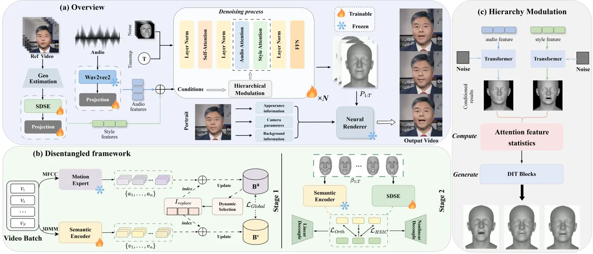
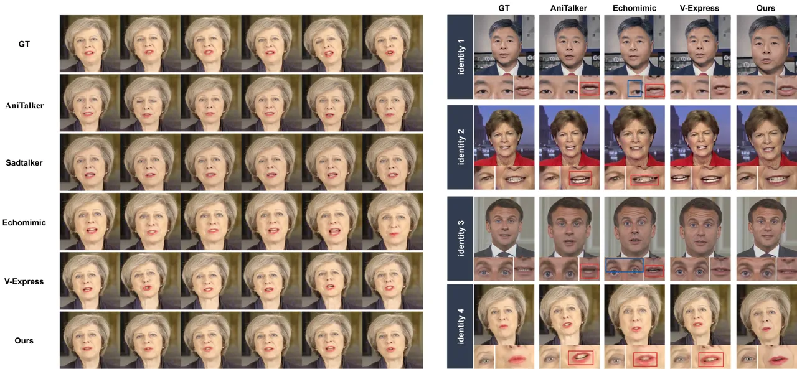

# MIRRORTALK: Forging Personalized Avatars Via Disentangled Style and Hierarchical Motion Control

Renjie Lu    Xulong Zhang    Xiaoyang Qu    Jianzong Wang    Shangfei
Wang ^(†)^(†)thanks: ^(⋆) These authors contributed equally to this
work.^(†)^(†)thanks: ^(†) Corresponding author.^(†)^(†)thanks: Supported
by Shenzhen-Hong Kong Joint Funding Project (Category A) under grant No.
SGDX20240115103359001.

###### Abstract

Synthesizing personalized talking faces that uphold and highlight
speaker’s unique style while maintaining lip-sync accuracy remains a
significant challenge. A primary limitation of existing approaches is
the intrinsic confounding of speaker-specific talking style and semantic
content within facial motions, which prevents the faithful transfer of a
speaker’s unique persona to arbitrary speech. In this paper, we propose
MirrorTalk, a generative framework based on a conditional diffusion
model, combined with the Semantically-Disentangled Style Encoder (SDSE)
that can distill pure style representation from a brief reference video.
To effectively utilize this representation, we then introduce a
hierarchical modulation strategy within diffusion process. This
mechanism guides the synthesis by dynamically balancing the
contributions of audio and style features to distinct facial regions,
ensuring both precise lip-sync and expressive full-face dynamics.
Extensive experiments demonstrate that MirrorTalk achieves significant
improvements against state-of-the-art methods in terms of lip-sync
accuracy and personalization preservation.

###### Index Terms: 

Talking face generation, Representation learning, Latent diffusion
models, Video synthesis

^(†)^(†)address: ¹Ping An Technology (Shenzhen) Co., Ltd., Shenzhen,
China  
²University of Science and Technology of China, Hefei, China

## 1 Introduction

Audio-driven talking face generation is an inherently cross-modal task
that aims to synthesize realistic talking videos by animating a target
identity’s face according to arbitrary speech. Existing methods can be
broadly categorized into two main paradigms. Some works \[21, 22, 8\]
achieve high-fidelity talking face generation by performing
person-specific training or fine-tuning, but they typically require
extensive video data from the target speaker, limiting their
scalability. Others \[6, 17, 24, 28, 12\] focus on developing a
universal model, which have recently achieved tremendous progress in lip
synchronization, yet struggle to capture unique facial dynamics. This
limitation stems from the tendency of models to learn a generalized
mapping from audio to facial motion, which averages out the
speaker-specific dynamics and results in homogeneous animations.

Generating expressive and realistic facial motions remains challenging,
as it requires not only precise synchronization with the audio but also
an accurate reflection of the target speaker’s unique facial movements
and expression variations. While several works \[20, 25\] model talking
style through a limited set of discrete emotion classes, this approach
is often too coarse to capture the subtle and speaker-specific
characteristics. Subsequent research \[14, 29, 26\] explore the use of
additional video clips as style references to guide the personalized
generation of facial animations, which facilitates achieving expressive
results. By deploying a style encoder to extract the speaker’s talking
style from a reference video, these methods leverage it as a condition
to modulate the generation. However, this paradigm suffers from a
fundamental flaw: the entanglement of talking style and semantic
content. The extracted style features is intrinsically confounded with
the semantic content of the reference speech, creating an unstable and
context-dependent representation. This leads to a conflict when the
talking style is transferred to a new speech with different semantics,
which resulting in degradation of lip-sync accuracy and unfaithful
synthesis of facial motions.

To address these challenges and limitations, we propose Mirrortalk, a
novel diffusion-based generative framework, which is capable of not only
producing audio-synchronized lip movements, but also upholding speaker’s
unique talking style and facial dynamics. As its core, MirrorTalk first
introduces a Semantically-Disentangled Style Encoder (SDSE). Trained via
a unique two-stage, cross-modal strategy, the SDSE can distills a pure,
content-agnostic style representation from a brief reference video,
which is crucial for generating personlized and realistc facial motions.
To effectively utilize this purified style representation, we then
propose a spatial-temporal hierarchical modulation mechanism within a
diffusion-based generating process to precisely guide the fusion of
multi-modal conditions. This strategy enables the precise fusion of the
style and audio features by dynamically balancing their contributions
across different facial regions, which results in the synthesis of
motion that is both precisely synchronized with the audio and faithful
to the speaker’s expressive style. Our main contributions are summarized
as:

- $`\bullet`$
  We propose a novel two-stage disentangled representation learning
  framework, which effectively separates target’s talking style from
  confounding semantic content with only a brief reference segment.
- $`\bullet`$
  We introduce a spatial-temporal hierarchical modulation strategy for
  conditional diffusion models, enabling dynamic and region-aware
  balancing of audio and style features for expressive personalized
  motion synthesis.
- $`\bullet`$
  Extensive experiments demonstrate that our method outperforms existing
  state-of-the-art approaches in lip-sync accuracy and personalization
  preservation.



Figure 1: Architecture of MirrorTalk. We first introduce a two-stage
training framework (b) to obtain the Semantically-disentangled Style
Encoder (SDSE) for talking style prediction. In the main generation
pipeline (a), audio and reference video inputs are encoded into
compressed tokens as conditions for a diffusion transformer (DiT) model.
During the denoising process, we employ a hierarchical modulation
strategy (c) to dynamically balances the contributions of audio and
style features for distinct facial regions at each timestep $`T`$.
Finally, a Neural Renderer \[18\] utilizes the portrait image and
generated motion sequence $`P_{1:T}`$ to synthesize the final video
frames.

## 2 Method

An overview of our proposed method is illustrated in Fig. 1. Our
framework firstly leverages a Semantically-Disentangled Style Encoder
(SDSE) to obtain pure talking style representations from a reference
video. We then utilize a spatial-temporal hierarchical modulation
strategy to guide a diffusion-based generation, ensuring both lip-sync
accuracy and hign realistic facial motions. These key contributions will
be detailed in the following subsections.

### 2.1 Facial geometry estimation

For a given speaker video $`V_{i}`$, we can utilize a 3D morphable model
FLAME \[10\] to obtain speaker’s facial parameters
$`P_{1:T}=\{\{\alpha_{1},\beta_{1},\theta_{1}\},\dots,\{\alpha_{T},\beta_{T},\theta_{T}\}\}`$
of video frames $`F_{1:T}`$, where $`\alpha_{t}\in\mathbb{R}^{100}`$,
$`\beta_{t}\in\mathbb{R}^{50}`$ and $`\theta_{t}\in\mathbb{R}^{15}`$
respectively denote shape, expression and pose. Specifically, to
estimate these parameters from audio-visual inputs with high accuracy,
we adopt SMIRK \[19\] for accurate expression prediction, MICA \[33\]
for identity-related shape estimation and 3DDFA \[32\] for head pose
reconstruction. Afterwards, following EmoTalk \[16\], we apply a
Savitzky–Golay smoothing filter to the estimated expression and pose
parameters to improve motion smoothness.

### 2.2 Disentangled Framework for Style Embedder

The speaker’s facial motion $`m_{i}`$ is jointly determined by the
semantic content $`m_{i}^{semantic}`$ that reflects the meaning of the
content, and the individual’s speaking style $`m_{i}^{style}`$ that
denotes the speaker-specfic motion patterns such as articulation habits
and expression dynamics. We hypothesize that
$`m_{i}=m_{i}^{semantic}+m_{i}^{style}`$, modeling their additive
contribution to facial motion. Previous methods \[14, 29\] for stylized
facial animations often fail to explicitly disentangle semantic
information from style representation. To address this, our approach
begins with a style encoder backbone that extracts a comprehensive
motion representation from a given reference video. Specifically, we use
a transformer-based encoder that takes the sequential expression
parameters $`\beta_{1:T}`$ as input. By modeling their temporal
dependencies and employing a frame-level self-attention pooling layer,
the encoder aggregates per-frame vectors $`\mathbf{s}^{\prime}_{t}`$
into a overall style embedding $`\mathbf{s}`$ using the computed
attention weight $`e_{t}`$:

```math
\mathbf{s}=\sum_{t=1}^{T}\left(\frac{\exp(e_{t})}{\sum_{k=1}^{T}\exp(e_{k})}\right)\mathbf{s}^{\prime}_{t} \tag{1}
```

To isolate talking style representation from semantic content, we
introduce a novel two-stage training strategy to disentangle them.

Stage 1: Cross-Modal Supervision for Semantic Encoder Training. The
primary objective of this stage is to train a semantic encoder to derive
semantic representations from visual-only motion signals. To this end, a
supervisory signal is required, for which we leverage a pre-trained
Motion Expert. Its architecture is adapted from the powerful lip-sync
discriminator of Wav2Lip \[17\]. We takes pairs of audio MFCCs and
corresponding lower-face image crops as input to retrain the model,
endows the Motion Expert with a robust understanding of speech-related
facial motion. This expert model serves to extract audio-semantic
embeddings $`a_{i}`$ from the audio modality of $`V_{i}`$, which act as
semantic target. The semantic encoder is then trained to produce
visual-semantic embeddings $`v_{i}`$ from $`\beta_{1:T}`$ of $`V_{i}`$.
To facilitate a robust alignment, we utilize memory banks $`B^{a}`$,
$`B^{v}`$ and employ a redundancy-based update strategy to enhance
model’s global perception. For each training batch, we first compute the
redundancy $`\rho_{i}`$ for each embedding in $`B^{a}`$:

```math
\rho_{i}=\frac{1}{N-1}\sum_{j=1,j\neq i}^{N}S_{ij} \tag{2}
```

where $`S_{ij}=\mathrm{sim}(a_{i},a_{j})`$. We then identify the indices
of the most redundant embeddings, denoted as
$`\mathbb{I}_{\text{replace}}`$, and use them to update $`B^{a}`$ and
$`B^{v}`$. The Semantic Encoder is ultimately trained by minimizing a
global structural loss between the two spaces:

```math
\mathcal{L}_{\text{global}}=\sum_{i,j\in\text{mem}}\left(\cos(v_{i},v_{j})-\cos(a_{i},a_{j})\right)^{2} \tag{3}
```

Stage 2: Semantic-Aware Style Disentanglement. With the semantic encoder
frozen, we train the SDSE to extract style representations that are
disentangled from the semantic information. The training objective for
the SDSE is a joint optimization of two losses. First, a decoupling loss
is used to enforce independence between the style and semantic
embeddings by combining an orthogonalization constraint and a nonlinear
independence regularizer based on the Hilbert-Schmidt Independence
Criterion (HSIC) \[13\].

```math
\mathcal{L}_{\text{decouple}}=\lambda_{\text{orth}}\left\|\tilde{\mathbf{s}}^{\top}\tilde{\mathbf{v}}\right\|_{F}^{2}+\lambda_{\text{hsic}}\,\mathrm{HSIC}(\tilde{\mathbf{s}},\tilde{\mathbf{v}}) \tag{4}
```

where $`\tilde{\mathbf{s}}`$ and $`\tilde{\mathbf{v}}`$ denote the
normalized style and visual-semantic embeddings. Second, to learn a
style representation that is both highly discriminative between
different speakers and consistent across various speech from the same
speaker, we apply a triplet loss:

```math
\mathcal{L}_{\text{triple}}=\max\!\left(0,\;\delta+\left\|\mathbf{s}^{a}-\mathbf{s}^{p}\right\|_{2}^{2}-\left\|\mathbf{s}^{a}-\mathbf{s}^{n}\right\|_{2}^{2}\right) \tag{5}
```

where $`\delta`$ is the margin, and $`\mathbf{s}^{a}`$,
$`\mathbf{s}^{p}`$, $`\mathbf{s}^{n}`$ are the anchor, positive, and
negative style samples, respectively. The final SDSE model is obtained
by minimizing the combined loss:
$`\mathcal{L}_{\text{total}}=\mathcal{L}_{\text{decouple}}+\mathcal{L}_{\text{triple}}`$.

|                  |                  |                   |                     |                     |                                  |                      |                  |                   |                     |                     |                                  |                      |
| ---------------- | ---------------- | ----------------- | ------------------- | ------------------- | -------------------------------- | -------------------- | ---------------- | ----------------- | ------------------- | ------------------- | -------------------------------- | -------------------- |
|                  | CREMA-D          |                   |                     |                     |                                  |                      | HDTF             |                   |                     |                     |                                  |                      |
| Method           | SSIM$`\uparrow`$ | FID$`\downarrow`$ | M-LMD$`\downarrow`$ | F-LMD$`\downarrow`$ | Sync$`{}_{\text{conf}}\uparrow`$ | StyleSim$`\uparrow`$ | SSIM$`\uparrow`$ | FID$`\downarrow`$ | M-LMD$`\downarrow`$ | F-LMD$`\downarrow`$ | Sync$`{}_{\text{conf}}\uparrow`$ | StyleSim$`\uparrow`$ |
| Wav2Lip \[17\]   | 0.725            | 32.461            | 3.025               | 3.476               | 4.384                            | 0.826                | 0.618            | 38.744            | 4.121               | 4.040               | 3.762                            | 0.841                |
| EAMM \[9\]       | 0.414            | 37.296            | 6.630               | 6.819               | 1.545                            | 0.788                | 0.396            | 42.158            | 6.019               | 7.135               | 1.204                            | 0.805                |
| SadTalker \[30\] | 0.762            | 15.135            | 4.143               | 2.804               | 2.676                            | 0.851                | 0.664            | 20.514            | 3.559               | 2.926               | 2.232                            | 0.862                |
| AniTalker \[11\] | 0.726            | 16.141            | 5.742               | 4.052               | 1.926                            | 0.730                | 0.593            | 25.259            | 6.413               | 4.547               | 2.763                            | 0.724                |
| Echomimic \[3\]  | 0.912            | 28.506            | 4.006               | 2.612               | 3.461                            | 0.852                | 0.879            | 31.243            | 3.681               | 2.851               | 2.689                            | 0.866                |
| V-Express \[23\] | 0.708            | 18.074            | 4.906               | 4.868               | 2.130                            | 0.834                | 0.651            | 24.061            | 5.706               | 5.001               | 1.593                            | 0.845                |
| Ours             | 0.917            | 16.293            | 2.771               | 1.824               | 4.106                            | 0.937                | 0.890            | 21.682            | 2.481               | 2.122               | 3.811                            | 0.958                |
| Ground Truth     | 1.000            | 0.000             | 0.000               | 0.000               | 4.531                            | 0.942                | 1.000            | 0.000             | 0.000               | 0.000               | 3.962                            | 0.969                |

Table 1: Quantitative comparisons with the state-of-the-arts on the
CREMA-D and HDTF datasets. Bold indicates the best results , and the
second value are underlined.

### 2.3 Hierarchical Conditioning for Motion Synthesis

We employ a diffusion transformer model \[15\] to generate the motion
sequence. The model is trained to denoise a noisy sample $`x_{t}`$ back
to the original data $`x_{0}`$ conditioned on features $`c`$, which is
achieved by training a network $`\epsilon_{\theta}`$ to predict the
added noise $`\epsilon`$ at each timestep $`t`$, optimized via the
following objective:

```math
\mathcal{L}_{\text{denoising}}=\mathbb{E}{x_{0},\epsilon,c,t}\left\|\epsilon-\epsilon\theta(x_{t},c,t)\right\|^{2} \tag{6}
```

Previous works used to directly inject $`c`$ into diffusion model
through cross attention. However, the motion patterns of the upper and
lower face exhibit distinct characteristics: the upper face is
predominantly influenced by speaking style $`c_{s}`$, whereas the lower
face is more strongly correlated with audio feature $`c_{a}`$. To
account for this differential behavior, we propose a spatial–temporal
hierarchical strategy to dynamically modulate audio and style features.
For each of the two facial regions $`r`$—the upper face $`r_{u}`$ and
the lower face $`r_{l}`$—at every denoising time step $`t`$, we first
compute the cosine similarity between the outputs of the
audio-conditioned cross-attention $`Z_{a}(r,t)`$ and style-conditioned
cross-attention $`Z_{s}(r,t)`$ with respect to the combined feature map
$`Z(r,t)`$:

```math
\displaystyle P_{a}(r,t)=\cos\left(Z_{a}(r,t),Z(r,t)\right) \tag{7}
```

```math
\displaystyle P_{s}(r,t)=\cos\left(Z_{s}(r,t),Z(r,t)\right)
```

While audio features often exhibit stronger influence ($`P_{a}>P_{s}`$),
the magnitude of this dominance varies significantly across timesteps. A
static correction would fail to capture this nuance, potentially
over-suppressing audio during crucial early structural formation or
under-amplifying style during late-stage refinement. To address this, we
introduce $`D(r,t)`$ which measures the relative dominance of audio over
style, that adapts at region $`r`$ and timestep $`t`$:

```math
\displaystyle D(r,t)=\sigma\left(P_{a}(r,t)-P_{s}(r,t)\right) \tag{8}
```

where $`\sigma`$ is the sigmoid function. This factor then re-weights
the contributions of $`Z_{a}`$ and $`Z_{s}`$ based on the spatial prior
of each facial region, producing the modulated feature map
$`Z^{\prime}(r,t)`$ as follows:

```math
Z^{\prime}(r,t)=\begin{cases}Z_{s}(r,t)/D(r,t)+Z_{a}(r,t),&\text{if }r=r_{u}\\
Z_{a}(r,t)*D(r,t)+Z_{s}(r,t),&\text{if }r=r_{l}\end{cases} \tag{9}
```

| Ablation                            | M-LMD$`\downarrow`$ | F-LMD$`\downarrow`$ | Sync$`{}_{\text{conf}}\uparrow`$ | StyleSim$`\uparrow`$ |
| ----------------------------------- | ------------------- | ------------------- | -------------------------------- | -------------------- |
| w/o Memory Bank                     | 3.074               | 2.426               | 3.473                            | 0.869                |
| w/o Dis-Module                      | 3.687               | 2.581               | 2.805                            | 0.837                |
| w/o $`\mathcal{L}_{\text{triple}}`$ | 2.933               | 2.734               | 3.724                            | 0.901                |
| w/o H-Scales                        | 3.281               | 2.401               | 3.059                            | 0.911                |
| Ours(Full Model)                    | 2.503               | 2.265               | 3.843                            | 0.938                |

Table 2: Ablation studies on our method. Bold means the best.

## 3 EXPERIMENT

### 3.1 Datasets

We leverage a composite dataset consisting of VoxCeleb2 \[4\], HDTF
\[31\] and CREMA-D \[1\]. Specifically, VoxCeleb2 is an extensive
audio-visual library featuring 1 million+ utterances from 6,112 YouTube
figures. HDTF is a high-resolution dataset that contains 16 hours of
videos. CREMA-D is an emotional talking-face dataset involving 91
identities. Preprocessing involves resampling all videos to 25 fps and
then cropped to the size of 512$`\times`$512.

### 3.2 Experiment setup

Evaluation Metrics. Consistent with previous works \[7, 26\], we use
Structured Similarity (SSIM) \[27\] and Frechet Inception Distance (FID)
to access the visual fidelity. For account of lip-sync accuracy, we
utilize the Landmark Distance around the mouth (M-LMD) \[2\] and the
confidence score of SyncNet ($`\mathbf{Sync}_{\mathbf{conf}}`$) \[5\].
Furthermore, we employ two metrics - the Landmark Distance on the whole
face (F-LMD) and Speaking Style Similarity (StyleSim) \[29\] - to
measure preservation of speaker‘s persona.

Baselines. Our comparative analysis includes several state-of-the-art
person-generic methods of different types, including Wav2Lip \[17\],
EAMM \[9\], AniTalker \[11\], SadTalker \[30\], Echomimic \[3\],
V-Express \[23\]. Wav2lip utilizes a pretrained lip-expert to train the
model for improving the audio-visual synchronization. AniTalker employs
self-supervised learning to disentangle and generate identity-agnostic
facial motion. SadTalker innovates by separately modeling
audio-to-expression and audio-to-head pose to drive a 3D-aware neural
renderer. Echomimic combines audio inputs with reference landmarks to
produce naturalistic results. These baselines are selected to provide a
comprehensive evaluation across various aspects of talking-face
generation.



Figure 2: Qualitative comparsion with AniTalker \[11\], SadTalker
\[30\], Echomimic \[3\] and V-Express \[23\]. Red and blue boxes
highlight incorrect lip movements and facial expressions in the
synthesized image respectively. Our methods not only generates accurate
lip movements, but also preserves speaker’s talking style and facial
dynamics.

### 3.3 Evaluation

Quantitative Evaluation. As shown in Table 1, our method obtain
consistent improvements against other baselines on most metrics across
both datasets. Regarding visual qualities, our approach achieves
superior and competitive results compared to other methods. As for the
lip-sync accuracy, we gets much better comparable performance in the
M-LMD, which can be largely attributed to hierarchical scales that
biases the lower face to audio cues for finer lip motion. Of particular
note, in terms of talking style and facial dynamic preservation, our
method is far ahead of other approachs. This superiority stems from the
disentangled framework for style embedder, which yields a pure style
representation, free from confounding semantic information. These
indicates the progressiveness of our disentangled-framework for style
embedder and hierarchical scales in capturing person-specific talking
style and generating realist facial expressions.

Quanlitative Evaluation. To more intuitively evaluate viusal effects, we
display a comparison between our method and others in Fig. 2. It can be
observed that MirrorTalk demonstrates more accurate facial movements.
Compared to AniTalker \[11\], which generates rigid facial motions that
lack a personal style, our methods also excels in lip shape
synchronization. Against Sadtalker \[30\] and Echomimic \[3\],
MirrorTalk can generate more expressive facial animations due to the
hierarchical modulation strategy, particularly in the upper-face regions
like the eyebrows and eyes. Compared to V-Express \[23\], our methods
achieves better preservation of target’s speaking style. Overall,
MirrorTalk achieves a superior balance of lip-sync accuracy and
personalized expression within these methods.

Ablation Study. We conduct an ablation study in Table 2, to examine the
contributions of different components in our model and select four core
metrics for evaluation. Specifically, we first remove the memory bank in
the training stage of semantic encoder. We observed that both M-LMD and
F-LMD increase noticeably, and StyleSim also drops, which indicates that
the absence of informative memory reduces the encoder’s ability to align
semantic features. Besides, eliminating the disentanglement module
causes the most severe performance degradation across all metrics,
demonstrating the necessity of explicitly separating style from
semantics. Moreover, removing the triplet loss
$`\mathcal{L}_{\text{triple}}`$ results in a significant drop in
StyleSim and the largest increase in F-LMD, underscoring its crucial
role in learning a speaker-discriminative style representation. Finally,
when the hierarchical scale modulation is removed,
$`\mathbf{Sync}_{\mathbf{conf}}`$ decreases significantly along with a
clear rise in landmark distances, proving that this strategy is critical
for generating natural and realistic facial motions.critical for
generating natural and realistic facial motions.

## 4 Conclusion

In this paper, we propose MirrorTalk, a novel diffusion-based framework
for generating personalized facial animations. By disentangling style
from content via our two-stage training framework, and fusing it with
audio using a hierarchical strategy, our approach faithfully preserves a
speaker’s unique persona.

## References

- \[1\] H. Cao, D. G. Cooper, Keutmann, et al. (2014) Crema-d:
  crowd-sourced emotional multimodal actors dataset. IEEE transactions
  on affective computing 5 (4), pp. 377–390. Cited by: §3.1.
- \[2\] L. Chen, R. K. Maddox, Duan, et al. (2019) Hierarchical
  cross-modal talking face generation with dynamic pixel-wise loss. In
  CVPR, pp. 7832–7841. Cited by: §3.2.
- \[3\] Z. Chen, J. Cao, Chen, et al. (2025) Echomimic: lifelike
  audio-driven portrait animations through editable landmark conditions.
  In AAAI, pp. 2403–2410. Cited by: Table 1, Figure 2, §3.2, §3.3.
- \[4\] J. S. Chung, A. Nagrani, Zisserman, et al. (2018) Voxceleb2:
  deep speaker recognition. arXiv:1806.05622. Cited by: §3.1.
- \[5\] J. S. Chung and A. Zisserman (2016) Out of time: automated lip
  sync in the wild. In ACCV, pp. 251–263. Cited by: §3.2.
- \[6\] M. C. Doukas, S. Zafeiriou, Sharmanska, et al. (2021) Headgan:
  one-shot neural head synthesis and editing. In CVPR, pp. 14398–14407.
  Cited by: §1.
- \[7\] J. Guan, Z. Zhang, Zhou, et al. (2023) Stylesync: high-fidelity
  generalized and personalized lip sync in style-based generator. In
  CVPR, pp. 1505–1515. Cited by: §3.2.
- \[8\] Y. Guo, K. Chen, Liang, et al. (2021) Ad-nerf: audio driven
  neural radiance fields for talking head synthesis. In CVPR,
  pp. 5784–5794. Cited by: §1.
- \[9\] X. Ji, H. Zhou, K. Wang, Q. Wu, W. Wu, F. Xu, and X. Cao (2022)
  EAMM: one-shot emotional talking face via audio-based emotion-aware
  motion model. ACM SIGGRAPH 2022 Conference Proceedings. External
  Links: [Link](https://api.semanticscholar.org/CorpusID:249192023)
  Cited by: Table 1, §3.2.
- \[10\] T. Li, T. Bolkart, Black, et al. (2017) Learning a model of
  facial shape and expression from 4d scans.. ACM Trans. Graph. 36 (6),
  pp. 194–1. Cited by: §2.1.
- \[11\] T. Liu, F. Chen, Fan, et al. (2024) Anitalker: animate vivid
  and diverse talking faces through identity-decoupled facial motion
  encoding. In ACM MM, pp. 6696–6705. Cited by: Table 1, Figure 2, §3.2,
  §3.3.
- \[12\] Z. Liu, J. Lu, R. Lu, C. Liang, and S. Wang (2025) ConsistTalk:
  intensity controllable temporally consistent talking head generation
  with diffusion noise search. ArXiv abs/2511.06833. External Links:
  [Link](https://api.semanticscholar.org/CorpusID:282911816) Cited by:
  §1.
- \[13\] W. K. Ma, J. Lewis, Kleijn, et al. (2020) The hsic bottleneck:
  deep learning without back-propagation. In AAAI, pp. 5085–5092. Cited
  by: §2.2.
- \[14\] Y. Ma, S. Wang, Hu, et al. (2023) Styletalk: one-shot talking
  head generation with controllable speaking styles. In AAAI,
  pp. 1896–1904. Cited by: §1, §2.2.
- \[15\] W. Peebles and S. Xie (2023) Scalable diffusion models with
  transformers. In CVPR, pp. 4195–4205. Cited by: §2.3.
- \[16\] Z. Peng, H. Wu, Song, et al. (2023) Emotalk: speech-driven
  emotional disentanglement for 3d face animation. In CVPR,
  pp. 20687–20697. Cited by: §2.1.
- \[17\] K. Prajwal, R. Mukhopadhyay, Namboodiri, et al. (2020) A lip
  sync expert is all you need for speech to lip generation in the wild.
  In ACM MM, pp. 484–492. Cited by: §1, §2.2, Table 1, §3.2.
- \[18\] Y. Ren, G. Li, Chen, et al. (2021) Pirenderer: controllable
  portrait image generation via semantic neural rendering. In CVPR,
  pp. 13759–13768. Cited by: Figure 1.
- \[19\] G. Retsinas, P. P. Filntisis, Danecek, et al. (2024) 3D facial
  expressions through analysis-by-neural-synthesis. In CVPR,
  pp. 2490–2501. External Links:
  [Link](https://api.semanticscholar.org/CorpusID:268987596) Cited by:
  §2.1.
- \[20\] S. Sinha, S. Biswas, R. Yadav, and B. Bhowmick (2022)
  Emotion-controllable generalized talking face generation. In IJCAI,
  External Links:
  [Link](https://api.semanticscholar.org/CorpusID:248505755) Cited by:
  §1.
- \[21\] S. Suwajanakorn, S. M. Seitz, Kemelmacher-Shlizerman, et
  al. (2017) Synthesizing obama: learning lip sync from audio. ACM
  Transactions on Graphics 36 (4), pp. 1–13. Cited by: §1.
- \[22\] J. Thies, M. Elgharib, Tewari, et al. (2020) Neural voice
  puppetry: audio-driven facial reenactment. In ECCV, pp. 716–731. Cited
  by: §1.
- \[23\] C. Wang, K. Tian, Zhang, et al. (2024) V-express: conditional
  dropout for progressive training of portrait video generation.
  arXiv:2406.02511. Cited by: Table 1, Figure 2, §3.2, §3.3.
- \[24\] J. Wang, X. Qian, Zhang, et al. (2023) Seeing what you said:
  talking face generation guided by a lip reading expert. In CVPR,
  pp. 14653–14662. Cited by: §1.
- \[25\] K. Wang, Q. Wu, Song, et al. (2020) Mead: a large-scale
  audio-visual dataset for emotional talking-face generation. In ECCV,
  pp. 700–717. Cited by: §1.
- \[26\] S. Wang, Y. Ma, Ding, et al. (2024) Styletalk++: a unified
  framework for controlling the speaking styles of talking heads. IEEE
  Transactions on Pattern Analysis and Machine Intelligence 46 (6),
  pp. 4331–4347. Cited by: §1, §3.2.
- \[27\] Z. Wang, A. C. Bovik, Sheikh, et al. (2004) Image quality
  assessment: from error visibility to structural similarity. IEEE
  transactions on image processing 13 (4), pp. 600–612. Cited by: §3.2.
- \[28\] B. Zhang, X. Zhang, N. Cheng, J. Yu, J. Xiao, and J.
  Wang (2024) Emotalker: emotionally editable talking face generation
  via diffusion model. In ICASSP 2024, pp. 8276–8280. Cited by: §1.
- \[29\] L. Zhang, S. Liang, Ge, et al. (2024) Personatalk: bring
  attention to your persona in visual dubbing. In SIGGRAPH Asia,
  pp. 1–9. Cited by: §1, §2.2, §3.2.
- \[30\] W. Zhang, X. Cun, Wang, et al. (2023) Sadtalker: learning
  realistic 3d motion coefficients for stylized audio-driven single
  image talking face animation. In CVPR, pp. 8652–8661. Cited by: Table
  1, Figure 2, §3.2, §3.3.
- \[31\] Z. Zhang, L. Li, Ding, et al. (2021) Flow-guided one-shot
  talking face generation with a high-resolution audio-visual dataset.
  In CVPR, pp. 3661–3670. Cited by: §3.1.
- \[32\] X. Zhu, X. Liu, Lei, et al. (2017) Face alignment in full pose
  range: a 3d total solution. IEEE transactions on pattern analysis and
  machine intelligence 41 (1), pp. 78–92. Cited by: §2.1.
- \[33\] W. Zielonka, T. Bolkart, Thies, et al. (2022) Towards metrical
  reconstruction of human faces. In ECCV, pp. 250–269. Cited by: §2.1.
