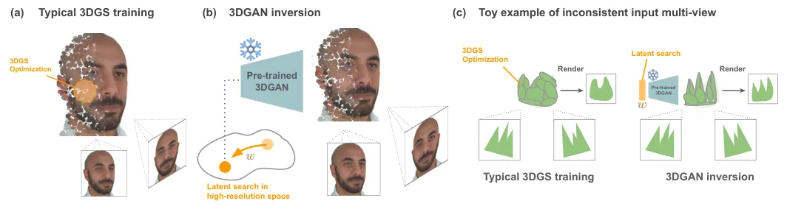
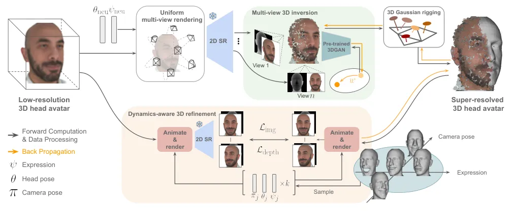
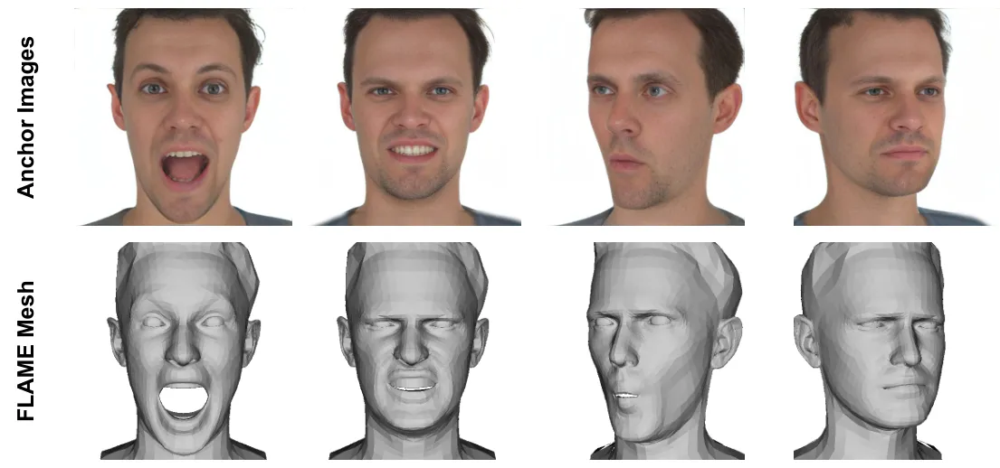
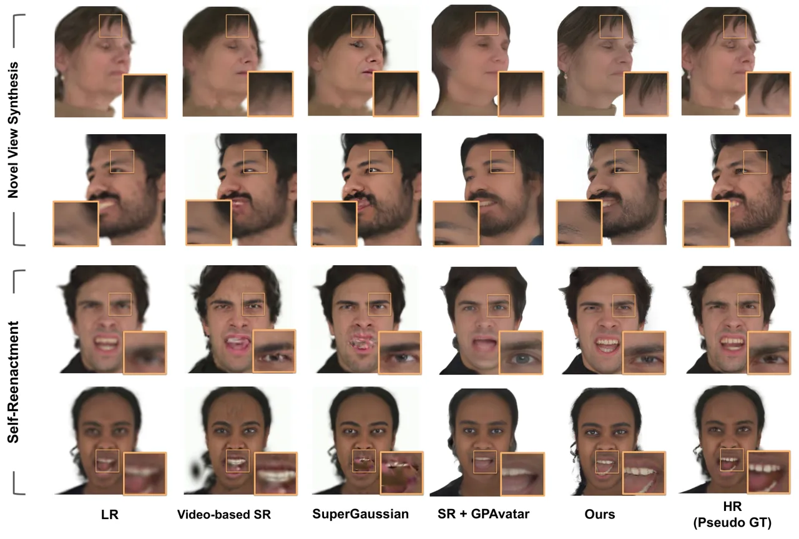
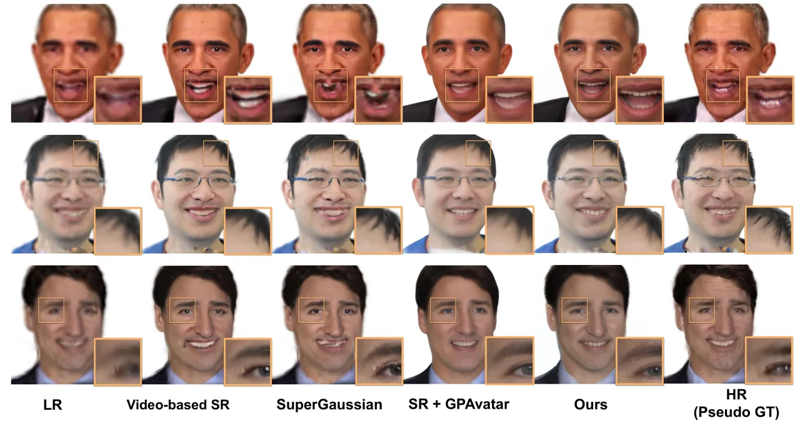
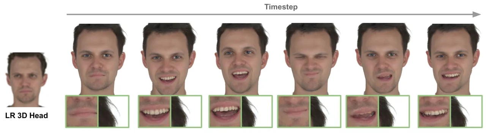
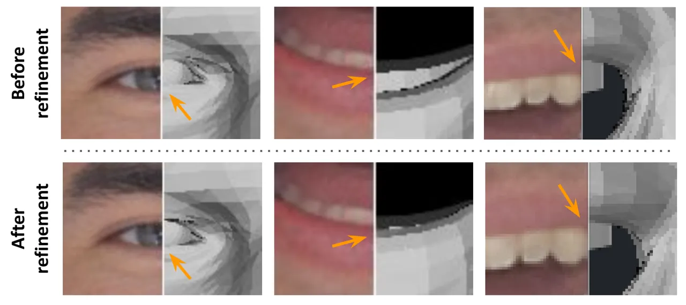
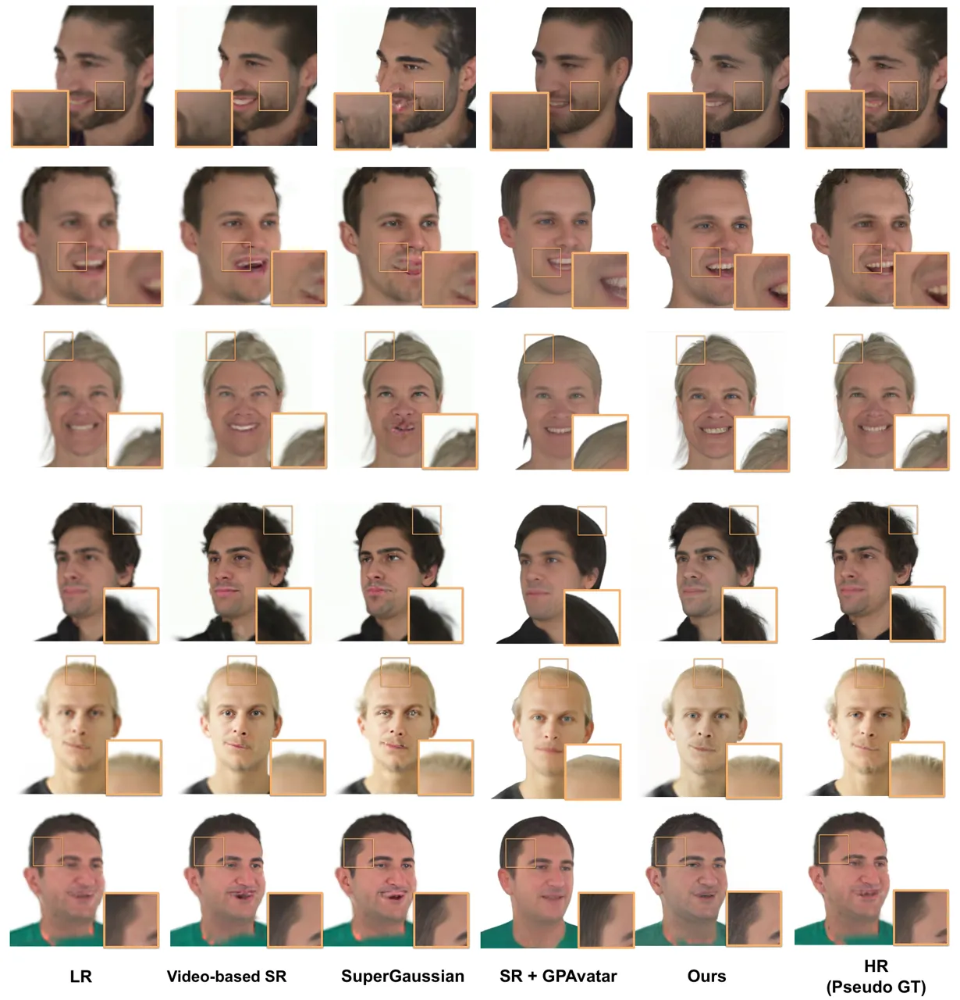
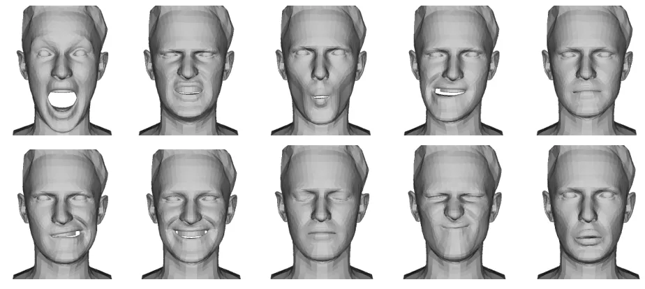

# From Blurry to Believable: Enhancing Low-quality Talking Heads with 3D Generative Priors

Ding-Jiun Huang ^(†)^(†)thanks: Equal Contribution    Yuanhao Wang   
Shao-Ji Yuan    Albert Mosella-Montoro    Francisco Vicente Carrasco   
Cheng Zhang Affiliation:  Texas A&M University\[6pt\]
[humansensinglab.github.io/super-head](https:/humansensinglab.github.io/super-head/)
   Fernando De la Torre    \[6pt\] Carnegie Mellon University

###### Abstract

Creating high-fidelity, animatable 3D talking heads is crucial for
immersive applications, yet often hindered by the prevalence of
low-quality image or video sources, which yield poor 3D reconstructions.
In this paper, we introduce SuperHead, a novel framework for enhancing
low-resolution, animatable 3D head avatars. The core challenge lies in
synthesizing high-quality geometry and textures, while ensuring both 3D
and temporal consistency during animation and preserving subject
identity. Despite recent progress in image, video and 3D-based
super-resolution (SR), existing SR techniques are ill-equipped to handle
dynamic 3D inputs. To address this, SuperHead leverages the rich priors
from pre-trained 3D generative models via a novel dynamics-aware 3D
inversion scheme. This process optimizes the latent representation of
the generative model to produce a super-resolved 3D Gaussian Splatting
(3DGS) head model, which is subsequently rigged to an underlying
parametric head model (e.g., FLAME) for animation. The inversion is
jointly supervised using a sparse collection of upscaled 2D face
renderings and corresponding depth maps, captured from diverse facial
expressions and camera viewpoints, to ensure realism under dynamic
facial motions. Experiments demonstrate that SuperHead generates avatars
with fine-grained facial details under dynamic motions, significantly
outperforming baseline methods in visual quality.

![[Uncaptioned
image]](arxiv-2602-06122--e87bbfe789ea.figures/figure-1.webp)

Figure 1: We present SuperHead, a new method for super-resolving
low-resolution 3D head avatars. Given a low-resolution animatable avatar
reconstructed from low-quality captures, SuperHead synthesizes
high-fidelity geometry and detailed textures while ensuring multi-view
and temporal consistency under diverse facial expressions. Unlike prior
image- or video-based SR approaches, our method directly upsamples 3D
avatars, enabling photorealistic animation and faithful identity
preservation from degraded inputs.

## 1 Introduction



Figure 2: (a) Typical 3DGS process optimizes a head from multi-view
images. (b) 3D GAN inversion aims to find a latent code whose generated
3D head best explains the given multi-view images. (c) When input
multi-views are inconsistent, typical 3DGS tends to create an “averaged”
result as a compromise among inconsistent inputs. 3D GAN inversion can
generate high-frequency details because it searches in a pre-trained
high-resolution space.

High-fidelity, animatable 3D head avatars are increasingly important in
augmented and virtual reality, telepresence, gaming, and digital
entertainment, where realism is critical. However, capturing
scan-quality geometry and dynamic textures with traditional pipelines
requires costly, specialized equipment \[5, 3, 8, 18\], limiting its
accessibility. As a result, much recent work reconstructs dynamic 3D
heads from videos or images acquired with consumer devices \[24, 17, 19,
54, 68, 66, 41, 43, 53, 31, 23, 11\]. Yet such inputs often suffer from
low resolution, poor lighting, and motion blur, producing avatars with
blurry textures and artifacts that fall short of high-fidelity
requirements.

In this paper, we focus on enhancing the visual quality of
low-resolution animatable head avatars, i.e., 3D talking head models
whose textures appear blurry and lack fine facial details, often as a
result of reconstruction from low-quality inputs. While significant
progress has been made in image, video, and static 3D super-resolution
(SR), extending these advances to dynamic 3D heads presents unique
challenges. Unlike static SR, this task demands simultaneously
generating high-resolution geometry and textures, preserving temporal
consistency, and faithfully maintaining identity. Existing 3D SR
approaches \[49, 22, 25, 61, 44, 40\] often rely on 2D priors, but
applying them frame-by-frame leads to flickering, and video SR cannot
ensure cross-view consistency, making them ill-suited for dynamic
avatars.

Recent advances in 3D-aware generative models, particularly 3D
GANs \[60, 62, 4\], have demonstrated strong 3D priors for
reconstructing head avatars via GAN inversion. By projecting input
images into the latent space of a 3D GAN, they can synthesize
high-quality 3D heads from limited data. Inspired by this paradigm, we
propose to extend 3D GAN inversion to the super-resolution of animatable
3D avatars. As shown in Figure 2, we demonstarte the difference between
typical 3DGS head reconstruction and 3D GAN inversion. We also provide
an example to illustrate that 3D GAN inversion can well handle
inconsistent multi-view inputs. However, unlike static inversion,
directly applying inversion to animatable avatars is much harder: the
super-resolved head must stay realistic and identity-preserving across
diverse expressions.

To address these challenges, we propose a dynamics-aware 3D inversion
framework for upsampling low-resolution animatable head avatars. The key
idea is to leverage the strong 3D priors of generative head models while
tightly coupling the inversion process with the underlying mesh
structure (e.g., FLAME \[37\]). Instead of relying on single-frame
information, we condition inversion on multi-view renderings and depth
cues, ensuring cross-view consistency and faithful alignment. To further
tackle animation, we extend this conditioning across multiple facial
expressions, enabling the reconstructed avatar to preserve identity,
detail, and realism even under dynamic motion.

We name our approach SuperHead and demonstrate its effectiveness on
different benchmarks (i.e., NeRSemble \[32\], INSTA \[72\]). SuperHead
works seamlessly across different head avatar models (e.g.,
GaussianAvatar \[41\], SplattingAvatar \[43\]), showing clear gains in
fidelity over competing methods. Our dynamics-aware design ensures that
the upsampled avatars remain consistent under diverse facial motions, a
scenario where existing methods often struggle. Moreover, since GAN
inversion is computationally lightweight, our method achieves these
improvements without sacrificing efficiency, enabling fast inference. To
the best of our knowledge, this is the first framework that directly
addresses the task of super-resolving low-resolution animatable 3D head
avatars and obtains competitive results.

## 2 Related Work

Animatable 3D Head Avatar. 3D head avatar modeling has long been an
active area due to its broad applications. Early works rely on
multi-view stereo for geometry reconstruction \[5, 3, 8, 18\], but
require heavy computation and complex capture setups. More recent
approaches employ volumetric representations \[24, 58, 21, 71, 46, 2,
17, 19\] or neural implicit functions \[59, 54, 68, 65, 66\], offering
higher efficiency and reconstruction quality, often leveraging 3D
Morphable Models \[6, 37\] for semantic control and identity–expression
disentanglement. INSTA \[72\] deforms query points to a canonical space
using FLAME \[37\], while Khakhulin et al. \[30\] learn non-rigid
deformations on FLAME templates to recover dynamic details from
in-the-wild videos. Another branch of methods \[11, 67\] explore 3D head
avatar creation with few-shot images, avoiding the need of heavy video
inputs. More recently, 3D Gaussian Splatting (3DGS) \[29\] has advanced
novel view synthesis with superior fidelity and much faster rendering,
and has become widely used for head avatar modeling \[41, 43, 53, 38,
67, 35, 57, 31, 10, 70, 14\]. GaussianAvatars \[41\] binds 3D Gaussians
to FLAME mesh surface to create animatable heads; SplattingAvatar \[43\]
offsets Gaussians along surface normals to fit more complex geometry;
and SurFhead \[35\] rigs 2D Gaussian surfels to parametric models for
well-defined geometry. Our method is complementary to these designs and
can be directly applied to different types of Gaussian-based head
avatars to enhance their fidelity and robustness.



Figure 3: Overview of SuperHead. Given a low-resolution 3D head avatar
driven by a morphable model, we first reconstruct static 3D head in the
canonical space with multi-view 3D GAN inversion (Section 4.1). We then
refine mesh geometry and rig 3D Gaussians onto mesh surface to enable
animation (Section 4.2). We further include anchor images with diverse
camera poses and expressions for dynamics-aware 3D refinement, ensuring
the robustness of the 3D head model across viewing angles and complex
facial motions (Section 4.3).

3D Super-Resolution. Despite progress in 3D reconstruction and
generation, enhancing low-resolution 3D content remains challenging. One
line of work \[22, 25, 36, 49, 61\] leverages pre-trained single-image
super-resolution (SISR) models to upscale images rendered from 3D
representations, with additional mechanisms to improve multi-view
consistency. More recently, other methods \[40, 44, 33\] employ
pre-trained video upsamplers \[55, 7\] to enhance 3D content through 2D
video priors, offering stronger temporal coherence but struggling with
long-range consistency under large viewpoint changes. In contrast, our
approach achieves dynamic 3D super-resolution by directly enforcing both
multi-view and temporal consistency, producing high-fidelity avatars
robust to diverse expressions and motions.

Generative Head Avatar Reconstruction. Advances in 3D-aware generative
models \[9, 1, 20, 45, 31, 26\] have gained attention for synthesizing
high-quality 3D representations and consistent multi-view images, making
them strong priors for head avatar reconstruction. Among them,
GSGAN \[26\] generates 3D Gaussian-based static head through adversarial
training with large-scale 2D head image data. Several works \[4, 16, 34,
47, 56, 60, 62\] reconstruct and edit 3D faces from a single image via
GAN inversion, projecting real images into the latent space of 3D-aware
GANs to enable viewpoint-consistent synthesis and semantic control.
Others target animatable avatars. AniFaceGAN \[52\] extends a static
3D-aware generator \[13\] with a deformation field mapping query points
to canonical space, while Lin et al. \[39\] use 3D GAN inversion to
animate portraits. Next3D \[45\] combines a tri-plane representation
with a conditional 3D Morphable Model (3DMM) and applies PTI
inversion \[42\], while InvertAvatar \[64\] improves reconstruction
through incremental inversion across multiple frames. These works show
the effectiveness of pre-trained 3D GANs for one-shot or few-shot avatar
reconstruction. We extend this direction by leveraging 3D generative
priors to upsample low-resolution animatable head avatars.

## 3 Preliminary

We use 3D GAN inversion with GSGAN \[26\] for 3D head reconstruction and
adopt a representation where avatars are modeled as 3D Gaussian splats
rigged to a parametric face model. In this section, we review both
components.

### 3.1 3D GAN Inversion

Given a pre-trained unconditional 3D GAN model $`G`$ parameterized by
weight $`g`$ and an input image $`\mathbf{I}`$, the goal of 3D GAN
inversion is to find a latent code $`\boldsymbol{w}^{*}`$ that
accurately reconstructs $`\mathbf{I}`$ at the corresponding camera pose,
while enabling content-consistent synthesis from novel viewpoints. This
problem is commonly formulated as:

```math
\boldsymbol{w}^{*}=\arg\min_{\boldsymbol{w}}\mathcal{L}_{\text{recon}}(G(\boldsymbol{w},\pi;g),\mathbf{I}), \tag{1}
```

where $`\boldsymbol{w}`$ is the latent representation in
$`\mathcal{W}^{+}`$ space \[27, 28\] of the 3D GAN model, $`\pi`$ is the
corresponding camera matrix of the input image, and
$`\mathcal{L}_{\text{recon}}`$ is a pixel-wise reconstruction or
perceptual loss. However, optimizing only in the $`\mathcal{W}^{+}`$
space often fails to capture fine-grained facial details, resulting in
suboptimal reconstructions. To address this issue, recent methods (e.g.,
\[42\]) propose a second-stage inversion in the parameter space by
slightly finetuning the GAN generator, and achieves improved
reconstruction results. This second-stage optimization is formulated as:

```math
g^{*}=\arg\min_{g}\mathcal{L}_{\text{recon}}({G}(\boldsymbol{w}^{*},\pi;g),\mathbf{I}) \tag{2}
```

where $`\boldsymbol{w}^{*}`$ is fixed from the first stage. In our
framework, we thus adopt this two-stage 3D GAN inversion approach for
high-fidelity reconstruction. In this paper, we define “anchor image” as
all images $`\mathbf{I}`$ that are used for inversion.

### 3.2 3D Gaussian Avatar

Following GaussianAvatars \[41\], an avatar is represented by 3D
Gaussian primitives anchored to the surface of a parametric face model
such as FLAME \[37\]. Each primitive is defined in the local coordinate
system of a mesh face by position $`\boldsymbol{\mu}^{\prime}`$,
rotation $`\mathbf{r}^{\prime}`$, and scaling $`\mathbf{S}^{\prime}`$,
and transformed to global coordinates as:

```math
\mathbf{r}=\mathbf{R}\mathbf{r}^{\prime},\quad\boldsymbol{\mu}=s\mathbf{R}\boldsymbol{\mu}^{\prime}+\mathbf{T},\quad\mathbf{S}=s\mathbf{S}^{\prime}, \tag{3}
```

where $`\mathbf{R}`$ is the orientation of the triangle face,
$`\mathbf{T}`$ is the mean of its three vertices, and $`s`$ is a scale
factor. The FLAME model is controlled by shape parameters $`\beta`$,
pose parameters $`\theta`$, expression parameters $`\psi`$, and static
vertex offsets $`\delta`$.

## 4 Our Approach

Overview. Figure 3 illustrates the SuperHead framework. The input is a
low-resolution (LR) animatable 3D head model $`H`$, whose movement is
driven by an underlying FLAME model $`M`$. Our goal is to synthesize an
animatable head avatar $`\hat{H}`$ that exhibits a high level of realism
and fidelity in various facial expressions, while preserving the
identity of the subject. We start by synthesizing a static 3D Gaussian
head in canonical space through multi-view 3D GAN inversion
(Section 4.1), where multi-view renderings of a neutral expression
$`\psi_{\textrm{neu}}`$ from LR input model are sampled and
super-resolved for the inversion. Then, we rig the static 3D Gaussian
head to the FLAME mesh for animation (Section 4.2). Finally, to make the
synthesized 3D head model robust under different facial motions, we
perform dynamics-aware 3D refinement to get $`\hat{H}`$ by jointly
optimizing 3D GAN inversion using a set of sampled and super-resolved
anchor images $`\{\hat{\mathbf{I}}_{j}\}_{j=1}^{k}`$ (Section 4.3)
rendered from the LR input model $`H`$ with configurations
$`\{(\theta_{j},\psi_{j},\pi_{j})\}_{j=1}^{k}`$, where $`\theta_{j}`$,
$`\psi_{j}`$ are the pose and expression parameters of FLAME and
$`\pi_{j}`$ is the camera parameter.

### 4.1 Multi-View 3D Inversion

Given a pre-trained 3D GAN $`G`$ for generating Gaussian head avatars
with parameters $`g`$, we optimize a latent code $`\boldsymbol{w}^{*}`$
such that the resulting 3DGS representation
$`\mathcal{G}=G(\boldsymbol{w}^{*},g^{*})`$ can faithfully reconstruct a
given set of $`n`$ multi-view anchor images
$`\{\hat{\mathbf{I}}_{i}\}_{i=1}^{n}`$.

Multi-view anchor images sampling. We collect
$`\{\mathbf{I}_{i}\}_{i=1}^{n}`$ by sampling $`n`$ multi-view renderings
of a specific expression $`\psi_{\textrm{neu}}`$ and FLAME mesh pose
$`\theta_{\textrm{neu}}`$ from LR input model. The camera poses
$`\pi_{i}`$ of the multi-views are uniformly sampled on a sphere with
radius $`r`$ centered at the model. Note that we only sample views
within an angle range that covers the frontal part of input head model.
We manually select $`\psi_{\textrm{neu}}`$ with a major consideration
that $`\psi_{\textrm{neu}}`$ should contain major occluded parts, e.g.,
teeth and eyeballs, so that $`G`$ can generate these facial parts
through the inversion. Then, we obtain high-resolution counterparts
$`\{\hat{\mathbf{I}}_{i}\}_{i=1}^{n}`$ using an off-the-shelf image
super-resolution model \[69\].

Multi-view 3D GAN inversion. We then reconstruct a static 3D Gaussian
head in canonical space using the multi-view images
$`\{\hat{\mathbf{I}}_{i}\}_{i=1}^{n}`$ and the canonical FLAME mesh
$`\hat{M}_{\theta_{\textrm{neu}},\psi_{\textrm{neu}}}`$, defined by the
neutral pose $`\theta_{\textrm{neu}}`$ and expression
$`\psi_{\textrm{neu}}`$. The objective is to minimize the reconstruction
loss:

```math
\displaystyle\mathcal{L}_{\text{img}}^{i}=\left\|\hat{\mathbf{I}}_{i}^{\prime}-\hat{\mathbf{I}}_{i}\right\|_{2}+\lambda_{\text{p}}\,\mathcal{L}_{\text{pips}}(\hat{\mathbf{I}}_{i}^{\prime},\hat{\mathbf{I}}_{i}), \tag{4}
```

where
$`\hat{\mathbf{I}}_{i}^{\prime}=\mathcal{R}(G(\boldsymbol{w},g);\pi_{i})`$
and $`\mathcal{R}`$ is a differentiable renderer. The object
$`\mathcal{L}_{\text{pips}}`$ is the perceptual loss, and $`\pi_{i}`$ is
the camera parameter of $`\hat{\mathbf{I}}_{i}`$.

To enforce geometric alignment, we add depth supervision. Let $`D_{i}`$
be the depth map of
$`\hat{M}_{\theta_{\textrm{neu}},\psi_{\textrm{neu}}}`$ rendered at
$`\pi_{i}`$, and $`m_{i}`$ a mask excluding hair regions. The depth loss
is

```math
\displaystyle\mathcal{L}_{\text{depth}}^{i}=\left\|\big(\mathcal{R}_{d}(G(\boldsymbol{w},g);\pi_{i})-D_{i}\big)\cdot m_{i}\right\|_{2}, \tag{5}
```

where $`\mathcal{R}_{d}`$ is the differentiable depth renderer. Depth
supervision is omitted for hair regions since FLAME does not model hair.
The multi-view 3D GAN inversion loss is

```math
\displaystyle\mathcal{L}_{\text{mv}}=\frac{1}{n}\sum_{i=1}^{n}\big(\mathcal{L}_{\text{img}}^{i}+\lambda_{\text{d}}\,\mathcal{L}_{\text{depth}}^{i}\big). \tag{6}
```

The inversion jointly enforces image and depth consistency across views,
ensuring the reconstructed 3D Gaussian head aligns photometrically and
geometrically with the input.

### 4.2 3D Gaussian Rigging

Following GaussianAvatars \[41\], we bind the reconstructed Gaussian
head $`\mathcal{G}`$ to the underlying FLAME mesh for animation.
However, the initial geometry of the low-resolution head model $`H`$,
driven by the FLAME mesh $`M`$, often deviates from the super-resolved
images $`\{\hat{\mathbf{I}}_{i}\}_{i=1}^{n}`$, so directly binding
$`\mathcal{G}`$ to the mesh may cause mismatching between 3D Gaussians
and corresponding facial parts. For example, 3D Gaussians of teeth could
be bound to lips on the mesh. To correct these misalignments, we first
perform mesh geometry refinement, then bind 3D Gaussians to the refined
mesh.

Geometry refinement. Let $`M_{\beta,\theta,\psi}`$ denote the FLAME mesh
parameterized by global shape $`\beta`$, pose $`\theta`$, and expression
$`\psi`$. For each image $`\hat{\mathbf{I}}_{i\leq n}`$, we detect 2D
facial landmarks $`\ell_{i}\in\mathbb{R}^{2\times m}`$, where $`m`$ is
the number of landmarks. The corresponding 3D landmarks are extracted as
$`\mathbf{X}_{i}=S(M_{\beta,\theta_{i},\psi_{i}})\in\mathbb{R}^{3\times m}`$,
where $`S(\cdot)`$ is a landmark selection operator that selects the
$`m`$ predefined mesh vertices corresponding to facial landmarks. With
camera projection $`\Pi_{i}(\cdot)`$, the optimized shape parameter is

```math
\displaystyle\beta^{*}=\arg\min_{\beta}\sum_{i=1}^{n}\left\|\Pi_{i}(\mathbf{X}_{i})-\ell_{i}\right\|_{2}. \tag{7}
```

Here, $`\beta`$ is shared globally across all anchor images, while
$`(\theta_{i},\psi_{i},\Pi_{i})`$ vary per image. The optimized shape
$`\beta^{*}`$ is fixed for the rest of the pipeline. See Figure 9 for
illustrations.

3D Gaussian rigging. Following GaussianAvatars \[41\], we bind the
reconstructed Gaussian head $`\mathcal{G}`$ to the underlying FLAME
mesh. Each Gaussian primitive is associated with its nearest mesh face.
To enable animation, the Gaussian parameters (i.e., position
$`\boldsymbol{\mu}`$, rotation $`\mathbf{r}`$, and scale $`\mathbf{S}`$)
are transformed into the local coordinate system of that face as

```math
\displaystyle\mathbf{r}^{\prime}=\mathbf{R}^{-1}\mathbf{r},\boldsymbol{\mu}^{\prime}=\frac{1}{s}\,\mathbf{R}^{-1}(\boldsymbol{\mu}-\mathbf{T}),\mathbf{S}^{\prime}=\frac{1}{s}\,\mathbf{S}^{-1}, \tag{8}
```

where $`\mathbf{R}`$ is the face orientation, $`\mathbf{T}`$ is the mean
of its three vertices, and $`s`$ is a scaling factor. After the FLAME
mesh deforms (e.g., under expression changes), the local Gaussian
parameters are mapped back to the global coordinate system using
Equation 3.

### 4.3 Dynamics-Aware 3D GAN Refinement

Through multi-view 3D GAN inversion (Section 4.1) and 3D Gaussian
rigging (Section 4.2), we can animate a high-resolution 3D head model.
However, this setup has the following limitations: First, there is no
guarantee of faithful reconstruction at camera poses far from
$`\pi_{i\leq n}`$; Second, some facial regions are occluded in the
canonical view (e.g., eyelids, inner mouth), causing incomplete
reconstruction; Finally, $`\mathcal{G}`$ is unstable under deformation,
causing artifacts in large facial motions. To solve the above
limitations, we utilize multi-expression renderings from LR input model
to jointly optimize the 3D GAN inversion process.

Multi-expression anchor images sampling. To begin, we first augment the
anchor image set $`\{\hat{\mathbf{I}}_{i}\}_{i=1}^{n}`$ by adding
super-resolved multi-expression anchor images, getting an augmented
image set of $`k`$ images in total. We manually select various facial
expressions that (1) each facial region (e.g., teeth, eyelids) is
visible in at least one selected expression, and (2) the selected
expressions capture a wide range of common facial deformations to
improve robustness under stretch and compression. With the selected
expressions, we sample and super-resolve multi-view renderings from LR
input model following the same way in Section 4.1. Note that in the
augmented image set, $`\{\hat{\mathbf{I}}_{i}\}_{i=1}^{n}`$ is solely
used in multi-view 3D GAN inversion, while
$`\{\hat{\mathbf{I}}_{j}\}_{j=1}^{k},k>n`$ is used for dynamics-aware 3D
GAN refinement. See Figure 4 for representative examples.



Figure 4: Example of sampled anchor images and the corresponding FLAME
mesh used for 3D GAN inversion.

| Method                      | NeRSemble dataset \[32\] |                   |                      |                      |                   |                      | INSTA dataset \[72\] |                   |                      | Time |
| --------------------------- | ------------------------ | ----------------- | -------------------- | -------------------- | ----------------- | -------------------- | -------------------- | ----------------- | -------------------- | ---- |
|                             | Self-Reenactment         |                   |                      | Novel View Synthesis |                   |                      | Self-Reenactment     |                   |                      |      |
|                             | PSNR $`\uparrow`$        | SSIM $`\uparrow`$ | LPIPS $`\downarrow`$ | PSNR $`\uparrow`$    | SSIM $`\uparrow`$ | LPIPS $`\downarrow`$ | PSNR $`\uparrow`$    | SSIM $`\uparrow`$ | LPIPS $`\downarrow`$ | min  |
| GaussianAvatars (LR) \[41\] | 18.56                    | 0.811             | 0.302                | 18.72                | 0.822             | 0.249                | 19.79                | 0.837             | 0.220                | —    |
| Video-based SR \[15\]       | 21.91                    | 0.840             | 0.254                | 21.18                | 0.833             | 0.219                | 23.01                | 0.850             | 0.158                | 30   |
| SuperGaussian \[44\]        | 19.57                    | 0.837             | 0.278                | 21.57                | 0.860             | 0.215                | 22.89                | 0.842             | 0.177                | 14   |
| SR + GPAvatar \[11\]        | 18.29                    | 0.768             | 0.244                | 18.14                | 0.810             | 0.228                | 20.15                | 0.823             | 0.156                | 3    |
| SuperHead (ours)            | 22.21                    | 0.850             | 0.238                | 22.76                | 0.871             | 0.213                | 23.76                | 0.864             | 0.135                | 5    |

Table 1: State-of-the-art comparison of upsampling animatable 3D head
avatars on the NeRSemble and INSTA datasets. Image metrics
(PSNR$`\uparrow`$, SSIM$`\uparrow`$, LPIPS$`\downarrow`$) are computed
frame-by-frame using an identical validation motion sequence on novel
camera poses and expressions. We also report inference time for each
methods, showing that our method achieves best quality with competitive
efficiency.



Figure 5: Qualitative comparisons on the NeRSemble dataset \[32\].
SuperHead synthesizes high-quality facial details across diverse
expressions, clearly outperforming baselines and in some cases
approaching the pseudo ground-truth head avatar.

Joint optimization via multi-expression anchor images. We leverage
images with different poses and expressions to jointly supervise 3D GAN
inversion. Let $`\mathcal{T}_{j}`$ denote the deformation from the
canonical mesh $`\hat{M}_{\theta_{\textrm{neu}},\psi_{\textrm{neu}}}`$
to $`\hat{M}_{\theta_{j},\psi_{j}}`$. This yields transformed Gaussian
heads $`\mathcal{T}_{j}(\mathcal{G})`$, enabling both image and depth
supervision at every view. The per-view image reconstruction loss is

```math
\displaystyle\mathcal{L}_{\text{img}}^{j}=\left\|\hat{\mathbf{I}}_{j}^{\prime}-\hat{\mathbf{I}}_{j}\right\|_{2}+\lambda_{\text{p}}\,\mathcal{L}_{\text{pips}}(\hat{\mathbf{I}}_{j}^{\prime},\hat{\mathbf{I}}_{j}), \tag{9}
```

where
$`\hat{\mathbf{I}}_{j}^{\prime}=\mathcal{R}(\mathcal{T}_{j}(G(\boldsymbol{w},g));\pi_{j})`$
is the rendered image at view $`\pi_{j}`$. The per-view depth loss is

```math
\displaystyle\mathcal{L}_{\text{depth}}^{j}=\left\|(D_{j}^{\prime}-D_{j})\cdot m_{j}\right\|_{2}, \tag{10}
```

where
$`D_{j}^{\prime}=\mathcal{R}_{d}(\mathcal{T}_{j}(G(\boldsymbol{w},g));\pi_{j})`$
is the rendered depth map and $`m_{i}`$ excludes hair regions. The total
objective averages both terms across all views:

```math
\displaystyle\mathcal{L}_{\text{dyn}}=\frac{1}{k}\sum_{j=1}^{k}\big(\mathcal{L}_{\text{img}}^{j}+\lambda_{\text{d}}\,\mathcal{L}_{\text{depth}}^{j}\big). \tag{11}
```

Finally, we can have the final loss term in each optimization iteration
by combining Equation 6 and Equation 11:

```math
\displaystyle\mathcal{L}_{\text{total}}=\mathcal{L}_{\text{mv}}+\mathcal{L}_{\text{dyn}} \tag{12}
```

Following Section 3.1 in 3D GAN inversion, we adopt a two-stage training
strategy: first optimize $`\boldsymbol{w}`$ with Equation 12, then
fine-tune $`g`$ with fixed $`\boldsymbol{w}^{*}`$.

## 5 Experiments

We validate SuperHead with diverse scenarios using different Gaussian
avatar models. Section 5.1 describes the experimental setup, Section 5.2
presents the main results, and Section 5.3 provides ablations and
analysis.



Figure 6: Qualitative results on INSTA dataset \[72\]. All methods are
driven and rendered with novel camera poses and expressions.

### 5.1 Setup

Datasets. We evaluate our method using two challenging datasets:
NeRSemble \[32\] (multi-view video) and INSTA \[72\] (monocular video).
For NeRSemble, a pseudo ground-truth animatable head avatar (HR avatar)
was reconstructed using GaussianAvatars \[41\] from all multi-view
recordings of a single animation sequence at a base resolution of
$`802\times 550`$. For INSTA, we train the HR avatar with monocular
video. We use a down-sampling factor of $`4`$ to create low-resolution
videos. Each set of down-sampled videos was subsequently used to
reconstruct a low-resolution head avatar (LR avatar) with
GaussianAvatars, which serve as the input to our enhancement pipeline.

Evaluation protocols. For NeRSemble, we consider two settings, both with
baselines driven by the validation sequence: (1) Novel View Synthesis,
with novel camera poses
$`\pi_{\textrm{eval}}\notin\pi_{1\leq j\leq k}`$. (2) Self-Reenactment,
with novel expressions
$`\psi_{\textrm{eval}}\notin\psi_{1\leq j\leq k}`$. We also show HR
avatar as an upper-bound of 3D head super-resolution in qualitative
results. For INSTA, which contains only monocular videos, we evaluate in
the Self-Reenactment setting and report renderings with novel poses and
expressions for all methods.

Metrics. We evaluate the quality of up-scaled animatable 3D head avatars
using Peak Signal-to-Noise Ratio (PSNR), Structural Similarity Index
(SSIM) \[50\], and Learned Perceptual Image Patch Similarity (LPIPS)
\[63\].

Baselines. We compare SuperHead with the state-of-the-art methods:
(1) GaussianAvatars (LR) \[41\]: We train it directly on low-resolution
videos. (2) Video-based SR: Given a LR avatar and an animation sequence,
we render multi-view video sequences and apply a video SR model \[15\]
to upsample them independently. GaussianAvatars reconstructs the HR
avatar from these upsampled videos. (3) 3D-based SR: A naive baseline
for upsampling an animatable 3D model is to upsample the static model in
the canonical pose. Following this idea, we apply SuperGaussian \[44\]
to upsample the static 3D Gaussian head under $`\psi_{\textrm{neu}}`$
expression. The resulting HR head is then rigged to the original FLAME
model and animated over the motion sequence. (4) SR+GPAvatar: We
reconstruct a 3D head model using the few-shot method GPAvatar \[11\],
with super-resolved multi-view renderings from the LR avatar as input.

Implementation details. We use pre-trained GSGAN \[26\] for 3D GAN
inversion. We place cameras on a sphere of radius $`r=0.6`$, with
$`\pi_{1\leq j\leq k}`$ sampled within $`\pm 45^{\circ}`$ across all
axes and facing the LR input center. Each optimization runs 150
iterations with both multi-view inversion and dynamics-aware refinement.
We use Adam with learning rate $`0.04`$ for $`\mathcal{W}^{+}`$
inversion, followed by PTI \[42\] for the last 50 iterations with
learning rate $`0.002`$ and locality regularization to preserve GAN
expressivity.

### 5.2 Main Results

| Setting                       | PSNR $`\uparrow`$ | SSIM $`\uparrow`$ | LPIPS $`\downarrow`$ |
| ----------------------------- | ----------------- | ----------------- | -------------------- |
| SuperHead (ours)              | 22.15             | 0.841             | 0.243                |
| (a) w/o multi-view inversion  | 19.86             | 0.812             | 0.283                |
| (b) w/o multi-expr. inversion | 21.18             | 0.824             | 0.269                |
| (c) w/o depth supervision     | 21.74             | 0.829             | 0.251                |
| (d) w/o FLAME refinement      | 22.03             | 0.838             | 0.246                |

Table 2: Ablation study on the key design components. Please see the
corresponding qualitative analysis in Figure 8.



Figure 7: Sequential frames of SuperHead. SuperHead recovers fine
details and facial components with multi-view/frame consistency.

Figure 8: Ablation studies. We iteratively remove various design
components, including multi-expression inversion, depth supervision, and
multi-view inversion, and show the rendered image and depth maps of the
output head avatar with novel expression and novel camera view. The
results get progressively worse.

We show quantitative results in Table 1. Our method outperforms all
other baselines on both multi-view and monocular video datasets. We also
report inference time for each enhancement method, and SuperHead shows
great inference speed while achieving the best performance. Figure 5 and
Figure 6 present qualitative comparisons between SuperHead and the
baseline approaches. Other methods exhibit blurry textures and
noticeable artifacts, likely due to inconsistencies arising from
independently up-scaling multi-view inputs. In contrast, SuperHead
synthesizes sharp textures and much richer facial details, e.g., facial
hair and teeth. In some cases, the visual quality achieved by SuperHead
is on par with and even surpass the pseudo ground-truth (GT) HR avatar
in the synthesis of certain high-frequency details, e.g., eyebrows,
underscoring the effectiveness of our approach in leveraging powerful
generative 3D priors for the super-resolution task. We also show
rendering sequence of SuperHead in Figure 7, indicating that our method
can recover high-quality and consistent facial details.

### 5.3 Ablation and Analysis

We conduct ablation studies to evaluate key design components and report
results in Table 2 and Figure 8.

Multi-view inversion (cf. Section 4.1). When performing 3D GAN inversion
with only single-view, the quality of novel views is poor with distorted
geometry and appearance (Table 2-(a)). In contrast, with all components
enabled, SuperHead produces high-fidelity reconstructions with smooth
and coherent surfaces, demonstrating the complementary benefits of each
design choice.

Multi-expression inversion and depth supervision (cf. Section 4.3). With
only one expression, the 3D head often shows floating artifacts on novel
expressions (Table 2-(b)). Similarly, omitting depth supervision can
result in surfaces with holes (Table 2-(c)).

Geometry refinement. Before 3D Gaussian binding, we refine the mesh
(cf. Section 4.2) to ensure Gaussians are rigged to the correct parts,
as shown in Figure 9. This step also improves performance, as shown in
Table 2-(d).

More results. We include videos, analysis on anchor image sampling, and
results of comparison to other 3D avatar model (e.g.,
SplattingAvatar \[43\]) in the supplementary.



Figure 9: Importance of geometry refinement. Without refinement, anchor
images misalign with the underlying geometry, such as the eye sockets,
lower lip, and teeth. After refinement, the FLAME mesh aligns accurately
with the anchor images.

## 6 Discussion and Conclusion

We present SuperHead, a new framework for upsampling low-resolution
animatable 3D head avatars. By leveraging upsampled multi-view images
and depth cues across diverse expressions, SuperHead exploits 3D GAN
priors to synthesize realistic 3D Gaussian heads with geometric
consistency and temporal coherence. Extensive experiments show that
SuperHead outperforms existing baselines in visual quality. We hope our
method opens new possibilities for digital humans in VR, telepresence,
and entertainment.

Limitation and future work. Our method still has challenges: it cannot
handle dynamics of hair in head-shaking motion or recover $`360`$-degree
3D head. Please refer to the supplementary material for further
discussion.

## References

- \[1\] S. An, H. Xu, Y. Shi, G. Song, U. Y. Ogras, and L. Luo (2023)
  Panohead: geometry-aware 3d full-head synthesis in 360deg. In
  Proceedings of the IEEE/CVF conference on computer vision and pattern
  recognition, pp. 20950–20959. Cited by: §2.
- \[2\] S. Athar, Z. Xu, K. Sunkavalli, E. Shechtman, and Z. Shu (2022)
  RigNeRF: fully controllable neural 3d portraits. In Computer Vision
  and Pattern Recognition (CVPR), Cited by: §2.
- \[3\] T. Beeler, B. Bickel, P. Beardsley, B. Sumner, and M.
  Gross (2010) High-quality single-shot capture of facial geometry. In
  ACM SIGGRAPH 2010 papers, pp. 1–9. Cited by: §1, §2.
- \[4\] A. R. Bhattarai, M. Nießner, and A. Sevastopolsky (2024)
  Triplanenet: an encoder for eg3d inversion. In Proceedings of the
  IEEE/CVF Winter Conference on Applications of Computer Vision,
  pp. 3055–3065. Cited by: §1, §2.
- \[5\] B. Bickel, M. Botsch, R. Angst, W. Matusik, M. Otaduy, H.
  Pfister, and M. Gross (2007) Multi-scale capture of facial geometry
  and motion. ACM transactions on graphics (TOG) 26 (3), pp. 33–es.
  Cited by: §1, §2.
- \[6\] V. Blanz and T. Vetter (2003) Face recognition based on fitting
  a 3d morphable model. IEEE Transactions on pattern analysis and
  machine intelligence 25 (9), pp. 1063–1074. Cited by: §2.
- \[7\] A. Blattmann, T. Dockhorn, S. Kulal, D. Mendelevitch, M.
  Kilian, D. Lorenz, Y. Levi, Z. English, V. Voleti, A. Letts, et
  al. (2023) Stable video diffusion: scaling latent video diffusion
  models to large datasets. arXiv preprint arXiv:2311.15127. Cited by:
  §2.
- \[8\] D. Bradley, W. Heidrich, T. Popa, and A. Sheffer (2010) High
  resolution passive facial performance capture. In ACM SIGGRAPH 2010
  papers, pp. 1–10. Cited by: §1, §2.
- \[9\] E. R. Chan, C. Z. Lin, M. A. Chan, K. Nagano, B. Pan, S. De
  Mello, O. Gallo, L. J. Guibas, J. Tremblay, S. Khamis, et al. (2022)
  Efficient geometry-aware 3d generative adversarial networks. In
  Proceedings of the IEEE/CVF conference on computer vision and pattern
  recognition, pp. 16123–16133. Cited by: §2.
- \[10\] X. Chu and T. Harada (2024) Generalizable and animatable
  gaussian head avatar. In The Thirty-eighth Annual Conference on Neural
  Information Processing Systems, External Links:
  [Link](https://openreview.net/forum?id=gVM2AZ5xA6) Cited by: §2.
- \[11\] X. Chu, Y. Li, A. Zeng, T. Yang, L. Lin, Y. Liu, and T.
  Harada (2024) GPAvatar: generalizable and precise head avatar from
  image (s). arXiv preprint arXiv:2401.10215. Cited by: §1, §2, Table
  S3, Table 1, §5.1.
- \[12\] J. Deng, J. Guo, J. Yang, N. Xue, I. Kotsia, and S.
  Zafeiriou (2022) ArcFace: additive angular margin loss for deep face
  recognition. IEEE Transactions on Pattern Analysis and Machine
  Intelligence 44 (10), pp. 5962–5979. External Links: ISSN 1939-3539,
  [Link](http://dx.doi.org/10.1109/TPAMI.2021.3087709),
  [Document](https://dx.doi.org/10.1109/tpami.2021.3087709) Cited by:
  §C.
- \[13\] Y. Deng, J. Yang, J. Xiang, and X. Tong (2022) Gram: generative
  radiance manifolds for 3d-aware image generation. In Proceedings of
  the IEEE/CVF conference on computer vision and pattern recognition,
  pp. 10673–10683. Cited by: §2.
- \[14\] H. Dhamo, Y. Nie, A. Moreau, J. Song, R. Shaw, Y. Zhou, and E.
  Pérez-Pellitero (2024) Headgas: real-time animatable head avatars via
  3d gaussian splatting. In European Conference on Computer Vision,
  pp. 459–476. Cited by: §2.
- \[15\] R. Feng, C. Li, and C. C. Loy (2024) Kalman-inspired feature
  propagation for video face super-resolution. In European Conference on
  Computer Vision, pp. 202–218. Cited by: Table S3, Table 1, §5.1.
- \[16\] A. Frühstück, N. Sarafianos, Y. Xu, P. Wonka, and T.
  Tung (2023) VIVE3D: viewpoint-independent video editing using 3d-aware
  gans. In Proceedings of the IEEE/CVF Conference on Computer Vision and
  Pattern Recognition, pp. 4446–4455. Cited by: §2.
- \[17\] G. Gafni, J. Thies, M. Zollhofer, and M. Nießner (2021) Dynamic
  neural radiance fields for monocular 4d facial avatar reconstruction.
  In Proceedings of the IEEE/CVF Conference on Computer Vision and
  Pattern Recognition, pp. 8649–8658. Cited by: §1, §2.
- \[18\] A. Ghosh, G. Fyffe, B. Tunwattanapong, J. Busch, X. Yu, and P.
  Debevec (2011) Multiview face capture using polarized spherical
  gradient illumination. In Proceedings of the 2011 SIGGRAPH Asia
  Conference, pp. 1–10. Cited by: §1, §2.
- \[19\] P. Grassal, M. Prinzler, T. Leistner, C. Rother, M. Nießner,
  and J. Thies (2021) Neural head avatars from monocular rgb videos.
  arXiv preprint arXiv:2112.01554. Cited by: §1, §2.
- \[20\] J. Gu, L. Liu, P. Wang, and C. Theobalt (2021) Stylenerf: a
  style-based 3d-aware generator for high-resolution image synthesis.
  arXiv preprint arXiv:2110.08985. Cited by: §2.
- \[21\] Y. Guo, K. Chen, S. Liang, Y. Liu, H. Bao, and J. Zhang (2021)
  AD-nerf: audio driven neural radiance fields for talking head
  synthesis. In IEEE/CVF International Conference on Computer Vision
  (ICCV), Cited by: §2.
- \[22\] Y. Han, T. Yu, X. Yu, D. Xu, B. Zheng, Z. Dai, C. Yang, Y.
  Wang, and Q. Dai (2024) Super-nerf: view-consistent detail generation
  for nerf super-resolution. IEEE Transactions on Visualization and
  Computer Graphics. Cited by: §1, §2.
- \[23\] Y. He, X. Gu, X. Ye, C. Xu, Z. Zhao, Y. Dong, W. Yuan, Z. Dong,
  and L. Bo (2025) LAM: large avatar model for one-shot animatable
  gaussian head. arXiv preprint arXiv:2502.17796. Cited by: §1.
- \[24\] Y. Hong, B. Peng, H. Xiao, L. Liu, and J. Zhang (2022)
  HeadNeRF: a real-time nerf-based parametric head model. In IEEE/CVF
  Conference on Computer Vision and Pattern Recognition (CVPR), Cited
  by: §1, §2.
- \[25\] X. Huang, W. Li, J. Hu, H. Chen, and Y. Wang (2023) Refsr-nerf:
  towards high fidelity and super resolution view synthesis. In
  Proceedings of the IEEE/CVF Conference on Computer Vision and Pattern
  Recognition, pp. 8244–8253. Cited by: §1, §2.
- \[26\] S. Hyun and J. Heo (2024) GSGAN: adversarial learning for
  hierarchical generation of 3d gaussian splats. Advances in Neural
  Information Processing Systems 37, pp. 67987–68012. Cited by: §A, §2,
  §B, §3, §5.1.
- \[27\] T. Karras, S. Laine, and T. Aila (2019) A style-based generator
  architecture for generative adversarial networks. In Proceedings of
  the IEEE/CVF conference on computer vision and pattern recognition,
  pp. 4401–4410. Cited by: §A, §B, §3.1.
- \[28\] T. Karras, S. Laine, M. Aittala, J. Hellsten, J. Lehtinen,
  and T. Aila (2020) Analyzing and improving the image quality of
  stylegan. In Proceedings of the IEEE/CVF conference on computer vision
  and pattern recognition, pp. 8110–8119. Cited by: §3.1.
- \[29\] B. Kerbl, G. Kopanas, T. Leimkühler, and G. Drettakis (2023) 3D
  gaussian splatting for real-time radiance field rendering. ACM
  Transactions on Graphics 42 (4). External Links:
  [Link](https://repo-sam.inria.fr/fungraph/3d-gaussian-splatting/)
  Cited by: §2.
- \[30\] T. Khakhulin, V. Sklyarova, V. Lempitsky, and E.
  Zakharov (2022) Realistic one-shot mesh-based head avatars. In
  European Conference on Computer Vision, pp. 345–362. Cited by: §2.
- \[31\] T. Kirschstein, S. Giebenhain, J. Tang, M. Georgopoulos, and M.
  Nießner (2024) Gghead: fast and generalizable 3d gaussian heads. In
  SIGGRAPH Asia 2024 Conference Papers, pp. 1–11. Cited by: §1, §2, §2.
- \[32\] T. Kirschstein, S. Qian, S. Giebenhain, T. Walter, and M.
  Nießner (2023) Nersemble: multi-view radiance field reconstruction of
  human heads. ACM Transactions on Graphics (TOG) 42 (4), pp. 1–14.
  Cited by: §1, Figure S11, Figure S11, Figure 5, Figure 5, Table 1,
  §5.1.
- \[33\] H. Ko, D. Park, Y. Park, B. Lee, J. Han, and E. Park (2025)
  Sequence matters: harnessing video models in 3d super-resolution. In
  Proceedings of the AAAI Conference on Artificial Intelligence, Vol.
  39, pp. 4356–4364. Cited by: §2.
- \[34\] J. Ko, K. Cho, D. Choi, K. Ryoo, and S. Kim (2023) 3d gan
  inversion with pose optimization. In Proceedings of the IEEE/CVF
  Winter Conference on Applications of Computer Vision, pp. 2967–2976.
  Cited by: §2.
- \[35\] J. Lee, T. Kang, M. Buehler, M. Kim, S. Hwang, J. Hyung, H.
  Jang, and J. Choo (2025) SurFhead: affine rig blending for
  geometrically accurate 2d gaussian surfel head avatars. In The
  Thirteenth International Conference on Learning Representations,
  External Links: [Link](https://openreview.net/forum?id=1x1gGg49jr)
  Cited by: §2.
- \[36\] J. L. Lee, C. Li, and G. H. Lee (2024) DiSR-nerf:
  diffusion-guided view-consistent super-resolution nerf. In Proceedings
  of the IEEE/CVF Conference on Computer Vision and Pattern Recognition,
  pp. 20561–20570. Cited by: §2.
- \[37\] T. Li, T. Bolkart, M. J. Black, H. Li, and J. Romero (2017)
  Learning a model of facial shape and expression from 4d scans.. ACM
  Trans. Graph. 36 (6), pp. 194–1. Cited by: §1, §2, §3.2.
- \[38\] Z. Liao, Y. Xu, Z. Li, Q. Li, B. Zhou, R. Bai, D. Xu, H. Zhang,
  and Y. Liu (2023) HHAvatar: gaussian head avatar with dynamic hairs.
  arXiv e-prints, pp. arXiv–2312. Cited by: §2.
- \[39\] C. Z. Lin, D. B. Lindell, E. R. Chan, and G. Wetzstein (2022)
  3d gan inversion for controllable portrait image animation. arXiv
  preprint arXiv:2203.13441. Cited by: §2.
- \[40\] X. Liu, C. Zhou, and S. Huang (2024) 3dgs-enhancer: enhancing
  unbounded 3d gaussian splatting with view-consistent 2d diffusion
  priors. Advances in Neural Information Processing Systems 37,
  pp. 133305–133327. Cited by: §1, §2.
- \[41\] S. Qian, T. Kirschstein, L. Schoneveld, D. Davoli, S.
  Giebenhain, and M. Nießner (2024) Gaussianavatars: photorealistic head
  avatars with rigged 3d gaussians. In Proceedings of the IEEE/CVF
  Conference on Computer Vision and Pattern Recognition,
  pp. 20299–20309. Cited by: §1, §1, §2, §3.2, Table S3, Table S4, §C,
  §4.2, §4.2, Table 1, §5.1, §5.1.
- \[42\] D. Roich, R. Mokady, A. H. Bermano, and D. Cohen-Or (2022)
  Pivotal tuning for latent-based editing of real images. ACM
  Transactions on graphics (TOG) 42 (1), pp. 1–13. Cited by: §2, §3.1,
  §5.1.
- \[43\] Z. Shao, Z. Wang, Z. Li, D. Wang, X. Lin, Y. Zhang, M. Fan,
  and Z. Wang (2024) SplattingAvatar: Realistic Real-Time Human Avatars
  with Mesh-Embedded Gaussian Splatting. In Proceedings of the IEEE/CVF
  Conference on Computer Vision and Pattern Recognition (CVPR), Cited
  by: §1, §1, §2, Table S4, Table S4, Table S4, Table S4, §C, §5.3.
- \[44\] Y. Shen, D. Ceylan, P. Guerrero, Z. Xu, N. J. Mitra, S. Wang,
  and A. Frühstück (2024) Supergaussian: repurposing video models for 3d
  super resolution. In European Conference on Computer Vision,
  pp. 215–233. Cited by: §1, §2, Table S3, Table 1, §5.1.
- \[45\] J. Sun, X. Wang, L. Wang, X. Li, Y. Zhang, H. Zhang, and Y.
  Liu (2023) Next3d: generative neural texture rasterization for
  3d-aware head avatars. In Proceedings of the IEEE/CVF conference on
  computer vision and pattern recognition, pp. 20991–21002. Cited by:
  §2.
- \[46\] J. Sun, X. Wang, Y. Zhang, X. Li, Q. Zhang, Y. Liu, and J.
  Wang (2022) Fenerf: face editing in neural radiance fields. In
  Proceedings of the IEEE/CVF conference on computer vision and pattern
  recognition, pp. 7672–7682. Cited by: §2.
- \[47\] A. Trevithick, M. Chan, M. Stengel, E. Chan, C. Liu, Z. Yu, S.
  Khamis, M. Chandraker, R. Ramamoorthi, and K. Nagano (2023) Real-time
  radiance fields for single-image portrait view synthesis. ACM
  Transactions on Graphics (TOG) 42 (4), pp. 1–15. Cited by: §2.
- \[48\] T. Unterthiner, S. van Steenkiste, K. Kurach, R. Marinier, M.
  Michalski, and S. Gelly (2019) Towards accurate generative models of
  video: a new metric & challenges. External Links: 1812.01717,
  [Link](https://arxiv.org/abs/1812.01717) Cited by: §C.
- \[49\] C. Wang, X. Wu, Y. Guo, S. Zhang, Y. Tai, and S. Hu (2022)
  Nerf-sr: high quality neural radiance fields using supersampling. In
  Proceedings of the 30th ACM International Conference on Multimedia,
  pp. 6445–6454. Cited by: §1, §2.
- \[50\] Z. Wang, A. C. Bovik, H. R. Sheikh, and E. P. Simoncelli (2004)
  Image quality assessment: from error visibility to structural
  similarity. IEEE transactions on image processing 13 (4), pp. 600–612.
  Cited by: §5.1.
- \[51\] H. Wu, E. Zhang, L. Liao, C. Chen, J. Hou, A. Wang, W. Sun, Q.
  Yan, and W. Lin (2023) Exploring video quality assessment on user
  generated contents from aesthetic and technical perspectives. External
  Links: 2211.04894, [Link](https://arxiv.org/abs/2211.04894) Cited by:
  §C.
- \[52\] Y. Wu, Y. Deng, J. Yang, F. Wei, Q. Chen, and X. Tong (2022)
  Anifacegan: animatable 3d-aware face image generation for video
  avatars. Advances in Neural Information Processing Systems 35,
  pp. 36188–36201. Cited by: §2.
- \[53\] J. Xiang, X. Gao, Y. Guo, and J. Zhang (2024) FlashAvatar:
  high-fidelity head avatar with efficient gaussian embedding. In The
  IEEE Conference on Computer Vision and Pattern Recognition (CVPR),
  Cited by: §1, §2.
- \[54\] Y. Xiao, H. Zhu, H. Yang, Z. Diao, X. Lu, and X. Cao (2022)
  Detailed facial geometry recovery from multi-view images by learning
  an implicit function. In Proceedings of the AAAI Conference on
  Artificial Intelligence, Cited by: §1, §2.
- \[55\] Y. Xu, T. Park, R. Zhang, Y. Zhou, E. Shechtman, F. Liu, J.
  Huang, and D. Liu (2024) VideoGigaGAN: towards detail-rich video
  super-resolution. arXiv preprint arXiv:2404.12388. Cited by: §2.
- \[56\] Y. Xu, Z. Shu, C. Smith, J. Huang, and S. W. Oh (2023)
  In-n-out: face video inversion and editing with volumetric
  decomposition. arXiv preprint arXiv:2302.04871 3. Cited by: §2.
- \[57\] Y. Xu, Z. Su, Q. Wu, and Y. Liu (2024) GPHM: gaussian
  parametric head model for monocular head avatar reconstruction. Cited
  by: §2.
- \[58\] S. Yao, R. Zhong, Y. Yan, G. Zhai, and X. Yang (2022) DFA-nerf:
  personalized talking head generation via disentangled face attributes
  neural rendering. arXiv preprint arXiv:2201.00791. Cited by: §2.
- \[59\] T. Yenamandra, A. Tewari, F. Bernard, H. Seidel, M.
  Elgharib, D. Cremers, and C. Theobalt (2021) I3DMM: deep implicit 3d
  morphable model of human heads. In Proceedings of the IEEE / CVF
  Conference on Computer Vision and Pattern Recognition (CVPR), Cited
  by: §2.
- \[60\] F. Yin, Y. Zhang, X. Wang, T. Wang, X. Li, Y. Gong, Y. Fan, X.
  Cun, Y. Shan, C. Oztireli, et al. (2023) 3d gan inversion with facial
  symmetry prior. In Proceedings of the IEEE/CVF Conference on Computer
  Vision and Pattern Recognition, pp. 342–351. Cited by: §1, §2.
- \[61\] Y. Yoon and K. Yoon (2023) Cross-guided optimization of
  radiance fields with multi-view image super-resolution for
  high-resolution novel view synthesis. In Proceedings of the IEEE/CVF
  conference on computer vision and pattern recognition,
  pp. 12428–12438. Cited by: §1, §2.
- \[62\] Z. Yuan, Y. Zhu, Y. Li, H. Liu, and C. Yuan (2023) Make encoder
  great again in 3d gan inversion through geometry and occlusion-aware
  encoding. In Proceedings of the IEEE/CVF international conference on
  computer vision, pp. 2437–2447. Cited by: §1, §2.
- \[63\] R. Zhang, P. Isola, A. A. Efros, E. Shechtman, and O.
  Wang (2018) The unreasonable effectiveness of deep features as a
  perceptual metric. In Proceedings of the IEEE conference on computer
  vision and pattern recognition, pp. 586–595. Cited by: §5.1.
- \[64\] X. Zhao, J. Sun, L. Wang, J. Suo, and Y. Liu (2024)
  InvertAvatar: incremental gan inversion for generalized head avatars.
  In ACM SIGGRAPH 2024 Conference Papers, pp. 1–10. Cited by: §2.
- \[65\] M. Zheng, H. Yang, D. Huang, and L. Chen (2022) ImFace: a
  nonlinear 3d morphable face model with implicit neural
  representations. In Proceedings of the IEEE/CVF Conference on Computer
  Vision and Pattern Recognition, pp. 20343–20352. Cited by: §2.
- \[66\] M. Zheng, H. Zhang, H. Yang, and D. Huang (2023) NeuFace:
  realistic 3d neural face rendering from multi-view images. In
  Proceedings of the IEEE/CVF Conference on Computer Vision and Pattern
  Recognition, pp. 16868–16877. Cited by: §1, §2.
- \[67\] X. Zheng, C. Wen, Z. Li, W. Zhang, Z. Su, X. Chang, Y. Zhao, Z.
  Lv, X. Zhang, Y. Zhang, G. Wang, and X. Lan (2024) HeadGAP: few-shot
  3d head avatar via generalizable gaussian priors. arXiv preprint
  arXiv:2408.06019. Cited by: §2.
- \[68\] Y. Zheng, V. F. Abrevaya, M. C. Bühler, X. Chen, M. J. Black,
  and O. Hilliges (2022) I M Avatar: implicit morphable head avatars
  from videos. In Computer Vision and Pattern Recognition (CVPR), Cited
  by: §1, §2.
- \[69\] S. Zhou, K. Chan, C. Li, and C. C. Loy (2022) Towards robust
  blind face restoration with codebook lookup transformer. Advances in
  Neural Information Processing Systems 35, pp. 30599–30611. Cited by:
  §4.1.
- \[70\] Z. Zhou, F. Ma, H. Fan, Z. Yang, and Y. Yang (2024) HeadStudio:
  text to animatable head avatars with 3d gaussian splatting. In ECCV,
  Cited by: §2.
- \[71\] Y. Zhuang, H. Zhu, X. Sun, and X. Cao (2022) MoFaNeRF:
  morphable facial neural radiance field. In European Conference on
  Computer Vision, Cited by: §2.
- \[72\] W. Zielonka, T. Bolkart, and J. Thies (2023) Instant volumetric
  head avatars. In Proceedings of the IEEE/CVF conference on computer
  vision and pattern recognition, pp. 4574–4584. Cited by: §1, §2,
  Figure S11, Figure S11, Table S4, Table S4, Table 1, Figure 6, Figure
  6, §5.1.

Supplementary Material

In this supplementary material, we provide additional details and
results omitted in the main text.

## A Contribution and Limitations

Main contribution. While many previous works have explored
super-resolution (SR) in 2D content, e.g., images, or static 3D
representation, e.g., 3D Gaussian, super-resolution in dynamic 3D
representation remains an unexplored direction. The main challenge lies
in the fact that 2D SR not only struggles with multi-view but also
temporal inconsistencies, when up-sampling a dynamic 3D representation.
Our method addresses this challenge by performing multi-view and
multi-expression 3D GAN inversion, ensuring that the synthesized 3D head
preserves high-frequency details even when the up-sampled anchor images
are inconsistent. To the best of our knowledge, this is the first
attempt at super-resolution of dynamic 3D avatar representation.

Limitation. The major limitation is that 3D GAN cannot synthesize
complete 3D head, i.e., it struggles to generate back of a human head.
The main reason is that 3D GAN is trained on FFHQ \[27\], which consists
only of frontal human faces. Building a large-scale human face dataset
that includes views of the back of the head is a possible way to extend
3D GAN’s ability of synthesizing back views of human heads. As shown in
Figure S10, while GSGAN \[26\] can synthesize frontal views of
high-fidelity details, it struggles to synthesize the back of the human
head.

Figure S10: 3D GAN struggles to synthesize the back of a human head. We
rotate a synthesized head before camera to show quality gap between
views of frontal and back of a head.

## B Additional Implementation Details

We adopt GSGAN \[26\] as our 3D GAN backbone. To make 3D GAN robust to
side views of a 3D head and hairstyles, we processed FFHQ \[27\] by
cropping the image source to include full head in the image. Then, we
fine-tuned the GSGAN checkpoint on the re-cropped FFHQ dataset.
Figure S11 shows that the fine-tuned 3D GAN can not only synthesize
finer details on facial parts but also accurate hairstyles. All of our
experiments, including the 3D GAN fine-tuning, were conducted on a RTX
A6000 GPU.

## C Additional Results and Analyses

Spatio-temporal Quality and Identity Preservation. While the main paper
focuses on comparing static per-frame quality, we provide an additional
evaluation of the spatio-temporal coherence and identity fidelity of the
synthesized video sequences here. To quantify the distributional
similarity between the generated and ground-truth video motion, we
employ the Fréchet Video Distance (FVD) \[48\], which utilizes an I3D
backbone to extract spatio-temporal features. Furthermore, we adopt
DOVER \[51\], a learning-based blind video quality assessment (BVQA)
metric, to assess perceptual quality in alignment with human aesthetic
judgment. Finally, we quantify identity preservation by calculating the
Cosine Similarity (CSIM) of facial embeddings extracted via a
pre-trained ArcFace \[12\] model.

| Method                      | CSIM $`\uparrow`$ | FVD $`\downarrow`$ | DOVER $`\uparrow`$ |
| --------------------------- | ----------------- | ------------------ | ------------------ |
| GaussianAvatars (LR) \[41\] | 0.922             | 282.48             | 15.46              |
| Video-based SR  \[15\]      | 0.775             | 437.16             | 42.63              |
| SuperGaussian \[44\]        | 0.807             | 293.59             | 59.12              |
| SR + GPAvatar \[11\]        | 0.633             | 788.10             | 74.65              |
| SuperHead (ours)            | 0.867             | 181.13             | 82.21              |

Table S3: SuperHead outperforms all other baselines on metrics of
spatio-temporal quality (FVD$`\downarrow`$, DOVER$`\uparrow`$) with high
identity preservation (CSIM$`\uparrow`$).

As shown in Table S3, our method achieves the best performance in
temporal quality metrics, significantly reducing flickering and motion
artifacts. Notably, while our method maintains high identity
consistency, GaussianAvatars (LR) exhibits a slightly higher CSIM score.
This is attributed to the inherent noise-invariance of face recognition
models like ArcFace, which are trained to extract robust geometric
signatures regardless of degradations. Since GaussianAvatars (LR) is
directly optimized for down-sampled ground truth, it preserves the
global structural layout (biometric signature) while our method
prioritized the synthesis of high-fidelity textures, which can introduce
minor, perceptually superior variations that the embedding space
interprets as a slight identity shift.



Figure S11: Additional qualitative results on the NeRSemble
dataset \[32\] and INSTA \[72\]. In addition to zooming in facial parts
of results, we also show the holistic view of upsampled 3D avatar,
indicating that our method can not only enhance facial expressions but
also details such as hair strands. Please zoom in to check details.

Additional qualitative results. We show additional visual comparison of
various baselines introduced in the main paper in Figure S11. Our method
demonstrates superior capability in recovering detailed facial
expressions, e.g., corner of the mouth, but also accurate geometry of
the hair.

| Setting                            | PSNR $`\uparrow`$ | SSIM $`\uparrow`$ | LPIPS $`\downarrow`$ |
| ---------------------------------- | ----------------- | ----------------- | -------------------- |
| SplattingAvatar (LR) \[43\]        | 19.24             | 0.825             | 0.251                |
| SuperHead + SplattingAvatar \[43\] | 23.04             | 0.834             | 0.167                |
| SuperHead + GaussianAvatars \[41\] | 23.76             | 0.864             | 0.135                |

Table S4: SuperHead achieves identical performance when applying to
SplattingAvatar \[43\] on INSTA dataset \[72\], proving SuperHead’s
generalizability to enhance diverse 3D avatar models.



Figure S12: Expressions we used to sample anchor images.

Comparability to other 3D avatar model. We further evaluate our method
on an alternative 3D avatar model to demonstrate its generalizability.
Specifically, we adopt SplattingAvatar \[43\], which, similar to
GaussianAvatars \[41\], rigs 3D Gaussians onto the FLAME mesh with a
learnable normal offset to the surface. The upsampling procedure follows
the same pipeline as with GaussianAvatars: we first sample and enhance
anchor images from a SplattingAvatar trained on low-resolution captures,
and then perform multi-view inversion along with dynamics-aware 3D
refinement to optimize a 3D Gaussian head rigged on the underlying FLAME
mesh. The results are reported in Table S4. We compare SplattingAvatar
(LR), a 3D head model trained on low-resolution captures, with
SuperHead + SplattingAvatar, the corresponding upsampled 3D head model.
We show that our method successfully enhances low-quality 3D head models
across different design choices, thereby demonstrating its strong
generalizability.

Anchor image sampling As mentioned in Section 4.3 of the main paper, we
perform dynamics-aware 3D GAN refinement to improve the synthesized 3D
head under different expressions and motions. For this purpose, we
carefully select a set of expressions to form an ”expression pool”, from
which we sample anchor images with different camera poses. We found that
a set of $`10`$ expressions is sufficient to achieve good performance.
We show the expressions we use throughout our experiments in Figure S12.
The selected expressions cover a range of facial motions, from screaming
to smiling and eye-closing.

## D Ethical and Societal Impacts

Our work improves the quality of 3D head avatar reconstruction, which
has potential benefits in areas such as telecommunication and digital
content creation. At the same time, we are aware of possible risks,
including issues of privacy, misuse for non-consensual content, and bias
in representation. We emphasize the importance of developing and
applying such techniques responsibly and with appropriate safeguards.
Furthermore, like many generative methods, reconstruction results may
contain certain biases if not carefully addressed. We believe it is
important for future research and deployment of these techniques to be
guided by principles of responsible AI, including fairness,
transparency, and safeguards against malicious use.
