1\]Tsinghua University 2\]Intelligent Creation Lab, ByteDance
\contribution\[⋆\]Equal contribution \contribution\[†\]Project Lead
\contribution\[§\]Corresponding author \checkdata\[Project Page (Demo,
Codes,
Models)\][https://guoxu1233.github.io/DreamID-Omni/](https://guoxu1233.github.io/DreamID-Omni/)

# DreamID-Omni: Unified Framework for Controllable Human-Centric Audio-Video Generation

Xu Guo    Fulong Ye    Qichao Sun    Liyang Chen    Bingchuan Li     
Pengze Zhang    Jiawei Liu    Songtao Zhao    Qian He    Xiangwang Hou
Affiliation: \[ Affiliation: \[

February 13, 2026

###### Abstract

Recent advancements in foundation models have revolutionized joint
audio-video generation. However, existing approaches typically treat
human-centric tasks including reference-based audio-video generation
(R2AV), video editing (RV2AV) and audio-driven video animation (RA2V) as
isolated objectives. Furthermore, achieving precise, disentangled
control over multiple character identities and voice timbres within a
single framework remains an open challenge. In this paper, we propose
DreamID-Omni, a unified framework for controllable human-centric
audio-video generation. Specifically, we design a Symmetric Conditional
Diffusion Transformer that integrates heterogeneous conditioning signals
via a symmetric conditional injection scheme. To resolve the pervasive
identity-timbre binding failures and speaker confusion in multi-person
scenarios, we introduce a Dual-Level Disentanglement strategy:
Synchronized RoPE at the signal level to ensure rigid attention-space
binding, and Structured Captions at the semantic level to establish
explicit attribute-subject mappings. Furthermore, we devise a Multi-Task
Progressive Training scheme that leverages weakly-constrained generative
priors to regularize strongly-constrained tasks, preventing overfitting
and harmonizing disparate objectives. Extensive experiments demonstrate
that DreamID-Omni achieves comprehensive state-of-the-art performance
across video, audio, and audio-visual consistency, even outperforming
leading proprietary commercial models. We will release our code to
bridge the gap between academic research and commercial-grade
applications.

## 1 Introduction

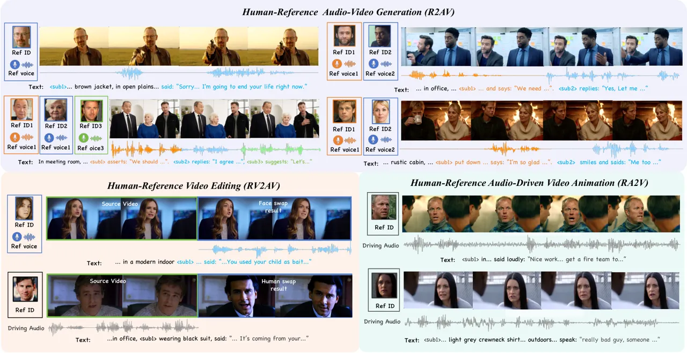

Figure 1: Showcase of DreamID-Omni. DreamID-Omni seamlessly unifies
reference-based audio-video generation (R2AV), video editing (RV2AV),
and audio-driven video animation (RA2V).

Recently, joint audio-video generation has seen rapid progress, with
many breakthrough works emerging. For example, commercial models such as
Veo3, Sora2, Wan 2.6 \[47\] and Seedance 1.5 Pro \[4\] have achieved
impressive results. In the open-source community, models like Ovi \[36\]
and LTX-2 \[15\] have also demonstrated promising performance. These
advances have greatly promoted the development of joint audio-video
generation. However, in real-world applications, supporting more
controllable generation particularly within human-centric scenarios is
crucial.

Controllable human-centric generation has advanced in several
directions. Works such as Phantom \[35\] and Wan2.6 \[47\] utilize
reference images or voice timbres for video (R2V) or audio-video (R2AV)
generation, which rely solely on text prompts as a weakly-constrained
guidance. To achieve higher controllability, other approaches introduce
stronger supervision, such as source videos or driving audio, for
strongly-constrained generation. For instance, Humo \[2\] animates
videos (RA2V) based on reference identities and driving audio, while
works like HunyuanCustom \[21\] and VACE \[25\] perform video editing
given a reference identity and source video, which can be further
extended to replace the corresponding audio (RV2AV). Despite these
advancements, these capabilities are largely treated as isolated tasks.
Researchers in the video-only domain have begun to shift toward unified
architectures \[25, 61, 30, 59, 40, 19\] to enhance task flexibility and
reduce the operational overhead of deploying multiple models. However,
the joint audio-video domain still lacks a unified perspective.
Fundamentally, we observe that R2AV, RV2AV, and RA2V all share an
identical objective: mapping a static identity anchor (image and audio)
onto a dynamic spatio-temporal canvas (text, source video, or driving
audio). Based on this insight, these tasks are inherently amenable to a
unified framework trained on a consistent data source, transcending the
limitations of task-specific silos.

Nevertheless, developing this unified framework presents several
challenges: (1) How to build a unified model framework that supports
generation, editing and animation; (2) How to address identity-timbre
binding and speaker confusion in multi-person generation; (3) How to
design effective training strategies to prevent conflicts among multiple
tasks.

To address these challenges, we introduce DreamID-Omni, which integrates
reference-based generation, editing, and animation into a single
paradigm. DreamID-Omni builds upon a dual-stream Diffusion Transformer
\[38\] (DiT) architecture, where video and audio streams interact via
bidirectional cross-attention for fine-grained synchronization. We
propose a Symmetric Conditional DiT design that unifies heterogeneous
conditioning signals—reference images, voice timbres, source videos, and
driving audio—into a shared latent space, enabling seamless task
switching without architectural changes.

To resolve multi-person confusion, we propose a Dual-Level
Disentanglement strategy. At the signal level, Synchronized Rotary
Positional Embeddings (Syn-RoPE) is introduced to bind reference
identities with their corresponding voice timbres within the attention
space. At the semantic level, Structured Captions utilize anchor tokens
paired with fine-grained descriptions to establish explicit mappings
between specific subjects and their respective attributes or speech
content.

Finally, we devise a Multi-Task Progressive Training strategy to
harmonize the three tasks. In the initial two stages, we focus
exclusively on the weakly-constrained R2AV task, employing in-pair
reconstruction and cross-pair disentanglement to enhance identity and
timbre fidelity while encouraging the model to learn robust reference
representations. In the final stage, strongly-constrained tasks (RV2AV
and RA2V) are introduced for joint training with R2AV. This approach
prevents the model from overfitting to strongly-constrained tasks,
thereby maintaining superior performance on the weakly-constrained
generation task.

In summary, our contributions are as follows: (1) We propose
DreamID-Omni, a novel human-centric controllable generation framework
based on a Symmetric Conditional DiT, which seamlessly integrates R2AV,
RV2AV, and RA2V tasks. (2) We introduce Dual-Level Disentanglement,
which addresses identity-timbre binding and speaker confusion in
multi-person generation via Syn-RoPE and Structured Captions. (3) We
present a Multi-Task Progressive Training strategy that effectively
harmonizes diverse tasks with varying constraint strengths. (4)
Extensive experiments demonstrate that DreamID-Omni achieves
comprehensive state-of-the-art performance across video, audio, and
audio-visual consistency, even when compared to leading proprietary
commercial models.

## 2 Related Work

### 2.1 Joint Audio-Video Generation

Recent advancements in diffusion-based foundation models in video
generation \[47, 26, 12\] and audio generation \[32, 13\] have
significantly expanded the frontier of joint audio-video synthesis.
While pioneering works \[42\] use coupled U-Net backbones, current
DiT-based approaches dominate the field. These methods typically employ
either dual-stream architectures \[33, 17, 48, 34, 36, 15\] with
specialized fusion layers (e.g., cross-attention) or unified DiT
structures \[50, 63, 22, 49\] with joint self-attention to achieve
synchronized multi-modal alignment. Despite their impressive generative
fidelity, these models are primarily designed for vanilla
text-to-audio-video or first-frame-conditioned synthesis. They lack the
capability to condition the generative process on external identity or
voice timbre references. This limitation restricts their utility in
scenarios requiring persistent identity and timbre consistency.

### 2.2 Controllable Video Generation Model

Reference-based Generation. To enhance controllability, reference-based
video generation has emerged as a prominent research direction, focusing
on maintaining identity consistency by integrating reference features
into the diffusion process. While initial efforts \[18, 62, 39\] were
primarily tailored for single-identity scenarios, subsequent research
has extended these capabilities to multi-subject settings \[65, 23, 1,
35, 21, 29, 10\]. However, these works are typically video-centric and
do not support audio generation.

Video Editing and Animation. In terms of temporal control, tasks can be
categorized into video editing and audio-driven video animation. Editing
frameworks \[5, 14, 37, 52, 43, 25, 58, 7\] allow for the modification
of identity attributes within the source video. Audio-driven video
animation \[54, 57, 2, 51, 31\] aims to generate videos from reference
images to produce lip movements matching input speech signals. Despite
their success, these models are all task-specific, and no existing model
attempts to unify reference-based generation, editing, and animation.

## 3 Methodology

### 3.1 Problem Formulation

We unify the landscape of controllable human-centric generation into a
single probabilistic framework. Given a text prompt $`\mathcal{T}`$, a
set of reference identities $`\mathcal{I}=\{I_{1},\dots,I_{N}\}`$, and
corresponding reference voice timbres
$`\mathcal{A}=\{A_{1},\dots,A_{N}\}`$, the goal is to synthesize a
synchronized video-audio stream
$`Y=\{Y_{\text{video}},Y_{\text{audio}}\}`$.

To support reference-based editing and animation tasks, we introduce two
optional structural conditions: a source video context
$`V_{\text{src}}`$ and a driving audio stream $`A_{\text{dri}}`$. The
framework models the conditional distribution:

```math
P(Y\mid\mathcal{T},\mathcal{I},\mathcal{A},V_{\text{src}},A_{\text{dri}}) \tag{1}
```

By selectively providing these conditions, our framework seamlessly
transitions between three distinct tasks, as summarized in Table 1.

| Task                                                | Input                                                  | Output Goal                                                |
| --------------------------------------------------- | ------------------------------------------------------ | ---------------------------------------------------------- |
| Human-Reference Audio-Video Generation (R2AV)       | $`\mathcal{T},\mathcal{I},\mathcal{A}`$                | Generate with references $`\mathcal{I},\mathcal{A}`$.      |
| Human-Reference Video Editing (RV2AV)               | $`\mathcal{T},\mathcal{I},\mathcal{A},V_{\text{src}}`$ | Edit identity and audio in $`V_{\text{src}}`$.             |
| Human-Reference Audio-Driven Video Animation (RA2V) | $`\mathcal{T},\mathcal{I},A_{\text{dri}}`$             | Animate identity $`\mathcal{I}`$ using $`A_{\text{dri}}`$. |

Table 1: Task Unification in DreamID-Omni. Our framework unifies R2AV,
RV2AV and RA2V by toggling input conditions.

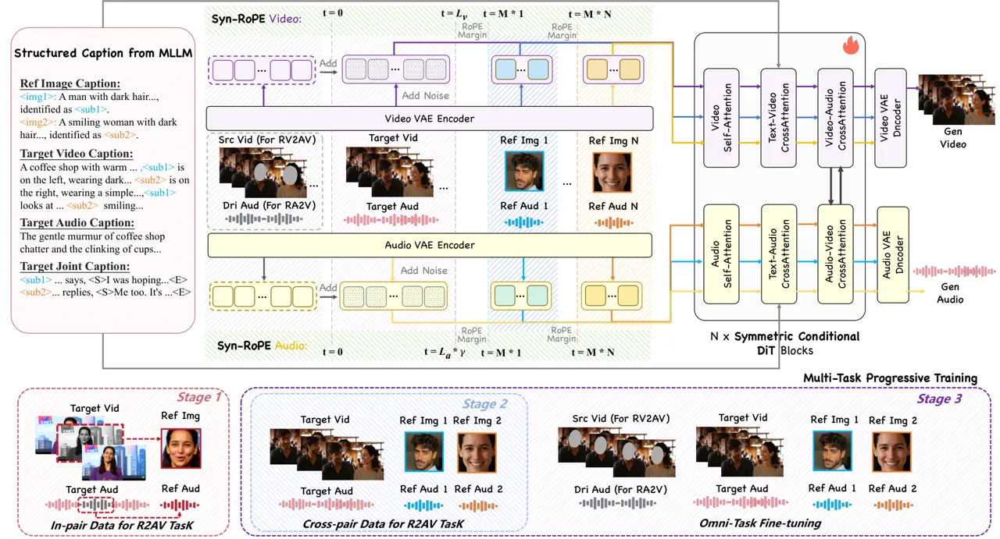

Figure 2: Overview of DreamID-Omni framework. We integrate
reference-based generation (R2AV), editing (RV2AV), and animation (RA2V)
using a Symmetric Conditional DiT trained via a multi-task progressive
training strategy. Structured Caption and Syn-RoPE ensure robust
dual-level disentanglement in multi-person scenarios.

### 3.2 Framework

To address the diverse tasks defined in Section 3.1, we propose
DreamID-Omni, a unified framework built upon a dual-stream DiT, as
illustrated in Figure 2. The architecture consists of two parallel
backbones: a video stream for visual synthesis and an audio stream for
acoustic synthesis. These streams interact via bidirectional
cross-attention layers, enabling fine-grained temporal synchronization
and semantic alignment between the visual and auditory modalities.

#### 3.2.1 Symmetric Conditional DiT

A core architectural contribution of DreamID-Omni is the Symmetric
Conditional DiT, designed to seamlessly integrate reference-based
generation, editing, and animation within a unified framework. This is
achieved through a symmetric dual-stream conditioning strategy that
composes heterogeneous control signals in the latent space with
structural parity. Let $`z_{v}`$ and $`z_{a}`$ represent the noisy
target video and target audio latents, respectively. To guide the
denoising process, we construct two comprehensive conditional sequences,
$`X_{v}`$ and $`X_{a}`$, which integrate both identity-specific and
structural guidance:

```math
\displaystyle X_{v} \displaystyle=[z_{v};\mathcal{E}_{v}(\mathcal{I})]+[\mathcal{E}_{v}(V_{\text{src}});\mathbf{0}_{\mathcal{E}_{v}(\mathcal{I})}] \tag{2}
```

```math
\displaystyle X_{a} \displaystyle=[z_{a};\mathcal{E}_{a}(\mathcal{A})]+[\mathcal{E}_{a}(A_{\text{dri}});\mathbf{0}_{\mathcal{E}_{a}(\mathcal{A})}] \tag{3}
```

where $`[\cdot;\cdot]`$ denotes concatenation along the sequence
dimension, $`\mathbf{0}_{T}`$ represents a zero tensor with the same
shape as $`T`$, and $`\mathcal{E}_{v},\mathcal{E}_{a}`$ are the
respective VAE encoders. In this symmetric formulation, the reference
features ($`\mathcal{E}_{v}(\mathcal{I}),\mathcal{E}_{a}(\mathcal{A})`$)
are concatenated to the noisy latents, allowing the DiT blocks to
extract and disentangle high-level identity and timbre priors.
Simultaneously, the structural conditions
($`V_{\text{src}},A_{\text{dri}}`$) are injected via element-wise
addition, serving as a structural canvas that enforces spatial and
temporal consistency. This dual-injection strategy effectively decouples
the conditioning into identity-preservation and structural-guidance
channels.

The inherent flexibility of this design enables seamless task switching.
As detailed in Table 1, providing a null input for the structural
conditions ($`V_{\text{src}}`$ or $`A_{\text{dri}}`$) effectively
nullifies the additive term in Eqs. 2 or 3. Consequently, the model
adaptively transitions between R2AV, RV2AV, and RA2V based on the
available conditional modalities, maintaining a unified parameter set
across all functional modes.

#### 3.2.2 Dual-Level Disentanglement

A critical challenge in multi-person generation is the confusion between
subjects, which manifests in two forms: identity-timbre mismatch (e.g.,
subject A speaks with the voice of subject B) and attribute-content
misattribution (e.g., subject A erroneously inheriting the visual
attributes and dialogue of subject B). We posit that these failures stem
from entanglement at two distinct levels. At the signal level, standard
attention mechanisms fail to bind the visual features of an identity to
its corresponding voice timbre. At the semantic level, unstructured text
captions provide insufficient granularity to explicitly link specific
subjects to their respective visual attributes, motions, and speech
content. To address this, we propose a Dual-Level Disentanglement
strategy. We introduce Syn-RoPE to enforce a rigid binding at the signal
level, and a Structured Captioning scheme to resolve ambiguity at the
semantic level.

Syn-RoPE. Recent works \[27\] have explored using Rotary Position
Embedding \[44\] for spatial localization within video frames. However,
such a spatially-grounded approach is incompatible with the more
challenging task like R2AV, where character positions are synthesized
dynamically by the model. To overcome this limitation, we propose
Syn-RoPE, an identity-grounded mechanism that operates by assigning
distinct, non-overlapping temporal positional segments to different
semantic inputs within the model’s attention space. As illustrated in
Figure 2, inspired by \[36\], we synchronize the video and audio streams
by scaling the RoPE frequencies of the target audio latents by a factor
$`\gamma=L_{v}/L_{a}`$, where $`L_{v}`$ and $`L_{a}`$ denote the
sequence lengths of the target video and audio latents, respectively.
More crucially, Syn-RoPE partitions the absolute temporal positional
index space into reserved “RoPE Margins” for the target sequence and
each reference identity. Specifically, the target video and audio
latents occupy the initial positional range $`[0,L-1]`$, where $`L`$
denotes the maximum temporal length. We define a fixed margin $`M`$ such
that $`M\gg L`$ to serve as the base interval for each identity slot.
Subsequently, the latent features of the $`k`$-th reference identity
(both image $`\mathcal{I}_{k}`$ and audio $`\mathcal{A}_{k}`$) are
assigned to the $`k`$-th reserved segment,
$`[k\cdot M,(k+1)\cdot M-1]`$. This strategy offers two fundamental
advantages: (i) Inter-Identity Decoupling: By leveraging the periodicity
of RoPE, each identity’s features are projected into a distinct
rotational subspace, naturally suppressing cross-identity attention
scores and preventing feature entanglement. (ii) Intra-Identity
Synchronization: By mapping the visual and acoustic features of the same
identity to identical positional segments, we achieve a robust, implicit
cross-modal synchronization at the signal level. This design provides a
unified mechanism for robust identity binding across all generation,
editing, and animation tasks.

Structured Caption. At the semantic level, ambiguity in multi-subject
scenarios typically arises when standard prompts fail to explicitly
associate visual attributes, motions, and speech content with specific
individuals. To resolve this, we introduce a Structured Captioning
scheme that establishes an unambiguous mapping between each reference
identity $`\mathcal{I}_{k}`$ and a unique anchor token, denoted as
$`\langle sub_{k}\rangle`$. The process begins by generating a
fine-grained attribute description for each identity to initialize the
anchor tokens. Building upon this foundation, the target video content
is synthesized into a comprehensive “script” partitioned into distinct
semantic fields: video caption, audio caption, and joint caption.
Crucially, all references to individuals across these fields
consistently utilize the predefined anchor tokens
$`\langle sub_{k}\rangle`$. This format provides the model with an
explicit grounding that resolves semantic-level entanglement, which is
critical for the success of all three core tasks.

### 3.3 Multi-Task Progressive Training

Training a unified model for R2AV, RV2AV, and RA2V presents a complex
optimization challenge. A naive joint training approach often suffers
from conflicting learning objectives, where the generative objective of
creating diverse content can interfere with the fidelity objective of
adhering to strong conditional constraints. To circumvent this, we
introduce a Multi-Task Progressive Training Strategy, a three-stage
curriculum designed to incrementally build model capabilities, ensuring
stable convergence and synergistic learning.

In-pair Reconstruction. The initial stage aims to establish a robust
generative prior for controllable generation. We train the model
exclusively on the R2AV task, using an in-pair reconstruction objective.
For each training sample $`Y`$, we extract the reference identity
$`\mathcal{I}`$ and the reference timbre $`\mathcal{A}`$ from the sample
itself. The model is then tasked with reconstructing the full data
stream conditioned on these internal references and the text prompt
$`\mathcal{T}`$. To prevent the model from trivially copying the
reference segments and to encourage true conditional synthesis, we
introduce a masked reconstruction loss. Let $`\mathcal{M}_{v}`$ and
$`\mathcal{M}_{a}`$ be binary masks identifying the spatio-temporal
regions of $`\mathcal{I}`$ and $`\mathcal{A}`$ within the ground truth
latents. The loss is computed only on the unmasked regions, forcing the
model to generate, rather than merely copy, the content corresponding to
the references. The objective is defined as:

```math
\displaystyle\mathcal{L}_{\text{inpair}}={} \displaystyle\mathbb{E}_{z,t,\mathcal{C}}\big[\lambda_{v}\|(1-\mathcal{M}_{v})\odot(\epsilon_{v}-\hat{\epsilon}_{\theta}(z_{v,t},t,\mathcal{C}))\|^{2}_{2} \tag{4}
```

```math
\displaystyle+\lambda_{a}\|(1-\mathcal{M}_{a})\odot(\epsilon_{a}-\hat{\epsilon}_{\theta}(z_{a,t},t,\mathcal{C}))\|^{2}_{2}\big]
```

where the conditioning set for this stage is
$`\mathcal{C}=\{\mathcal{I},\mathcal{A},\mathcal{T}\}`$, $`\epsilon`$ is
the ground truth noise, $`\hat{\epsilon}_{\theta}`$ is the model’s
prediction, and $`\odot`$ denotes element-wise multiplication.

Cross-pair Disentanglement. To enhance the model’s generalization
capabilities and force it to learn a truly disentangled representation
of identity and timbre, we advance to a cross-pair training stage. In
this phase, the reference identity $`\mathcal{I}`$ and timbre
$`\mathcal{A}`$ are sourced from a different video clip than the target
video-audio stream $`Y`$. This more challenging objective compels the
model to synthesize content based on abstract identity and timbre
concepts, rather than relying on low-level correlations present in the
source. The training objective for this stage,
$`\mathcal{L}_{\text{cross}}`$, reuses the same formulation as
$`\mathcal{L}_{\text{inpair}}`$ (Eq. 4). However, a key distinction is
that the masks are nullified by setting $`\mathcal{M}_{v}=\mathbf{0}`$
and $`\mathcal{M}_{a}=\mathbf{0}`$. This modification ensures the loss
is computed over the entire data stream, pushing the model towards a
more robust disentanglement.

Omni-Task Fine-tuning. The final stage unifies all tasks by fine-tuning
the model on a mixed dataset comprising R2AV, RV2AV, and RA2V samples.
RV2AV samples are constructed by providing a masked version of the
target video as structural context ($`V_{\text{src}}`$), while RA2V
samples supply the target audio as the driving signal
($`A_{\text{dri}}`$). By training on this composite dataset, the model
learns to seamlessly switch between generation, editing, and animation
based on the provided conditions, as formulated in Eq. 1. This
progressive, three-stage curriculum is crucial. We observe that by first
mastering the weakly-constrained R2AV task, the model develops a
powerful and diverse generative prior. This prior then serves as a
robust foundation for the strongly-constrained RV2AV and RA2V tasks,
allowing the model to learn high-fidelity conditional control without
sacrificing generative quality, leading to a truly unified and capable
omni-purpose model.

### 3.4 Inference Pipeline

At inference time, we employ a multi-condition Classifier-Free Guidance
(CFG) \[20\] strategy, which is applied independently to the video and
audio streams, but follows the same unified formulation:

```math
\displaystyle\hat{\epsilon}_{\text{final}}= \displaystyle\hat{\epsilon}_{\theta}(z_{t},\emptyset,\emptyset)+w_{\mathcal{T}}\cdot(\hat{\epsilon}_{\theta}(z_{t},\mathcal{T},\emptyset)-\hat{\epsilon}_{\theta}(z_{t},\emptyset,\emptyset)) \tag{5}
```

```math
\displaystyle+w_{\mathcal{S}}\cdot(\hat{\epsilon}_{\theta}(z_{t},\mathcal{T},\mathcal{S})-\hat{\epsilon}_{\theta}(z_{t},\mathcal{T},\emptyset))
```

where $`\hat{\epsilon}_{\theta}(z_{t},\mathcal{T},\mathcal{S})`$ is the
model’s prediction under text condition $`\mathcal{T}`$ and a
stream-specific condition $`\mathcal{S}`$. For the video stream,
$`\mathcal{S}=\mathcal{I}`$ , while for the audio stream,
$`\mathcal{S}=\mathcal{A}`$. The terms $`w_{\mathcal{T}}`$ and
$`w_{\mathcal{S}}`$ are their respective guidance scales. This chained
application ensures that identity and timbre guidance operates on a
text-aligned basis, leading to more stable and coherent results. The
MLLM system prompt for Structured Caption is shown in Fig. 8.

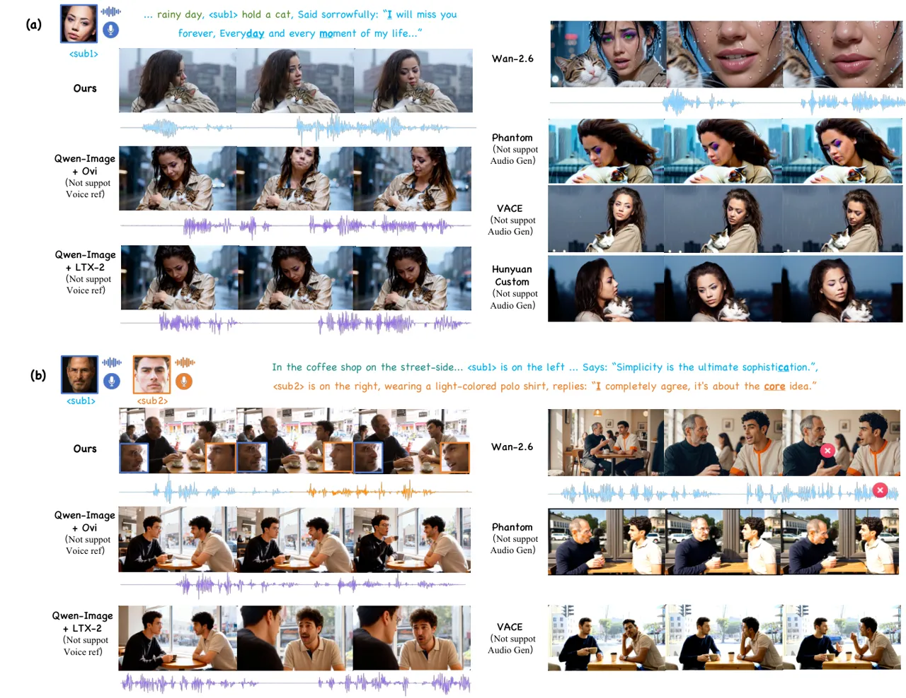

Figure 3: Qualitative comparison with state-of-the-art (SOTA) methods on
R2AV. Please zoom in for more details.

|                    |                |                |                  |                     |                            |                 |                   |                    |                           |                          |                       |                          |
| ------------------ | -------------- | -------------- | ---------------- | ------------------- | -------------------------- | --------------- | ----------------- | ------------------ | ------------------------- | ------------------------ | --------------------- | ------------------------ |
| Method             | Support        |                | Video            |                     |                            | Audio           |                   |                    |                           | Audio-Visual Consistency |                       |                          |
|                    | Video          | Audio          | AES $`\uparrow`$ | ViCLIP $`\uparrow`$ | ID-Sim. (S/M) $`\uparrow`$ | PQ $`\uparrow`$ | CLAP $`\uparrow`$ | WER $`\downarrow`$ | T-Sim. (S/M) $`\uparrow`$ | Sync-C $`\uparrow`$      | Sync-D $`\downarrow`$ | Spk-Conf. $`\downarrow`$ |
| Phantom            | $`\checkmark`$ | $`\times`$     | 0.604            | 13.791              | 0.657/0.572                | \-              | \-                | \-                 | \-                        | \-                       | \-                    | \-                       |
| VACE               | $`\checkmark`$ | $`\times`$     | 0.613            | 11.091              | 0.664/0.395                | \-              | \-                | \-                 | \-                        | \-                       | \-                    | \-                       |
| HunyuanCustom      | $`\checkmark`$ | $`\times`$     | 0.589            | 12.159              | 0.659/-                    | \-              | \-                | \-                 | \-                        | \-                       | \-                    | \-                       |
| Qwen-Image + LTX-2 | $`\checkmark`$ | $`\checkmark`$ | 0.611            | 8.548               | 0.571/0.349                | 6.247           | 0.144             | 0.093              | \-                        | 3.706                    | 10.003                | 0.340                    |
| Qwen-Image + Ovi   | $`\checkmark`$ | $`\checkmark`$ | 0.606            | 8.974               | 0.459/0.336                | 5.826           | 0.203             | 0.097              | \-                        | 5.857                    | 8.407                 | 0.380                    |
| Wan2.6             | $`\checkmark`$ | $`\checkmark`$ | 0.632            | 13.410              | 0.523/0.455                | 6.391           | 0.236             | 0.534              | 0.391/0.217               | 6.026                    | 8.352                 | 0.380                    |
| Ours               | $`\checkmark`$ | $`\checkmark`$ | 0.618            | 13.911              | 0.674/0.603                | 6.290           | 0.278             | 0.052              | 0.493/0.402               | 6.226                    | 7.791                 | 0.080                    |

Table 2: Quantitative comparison of R2AV on our proposed benchmark. Best
results are in bold, second best are underlined. The S/M notation in
ID-Sim. and T-Sim. refers to results on single-person and multi-person
scenarios, respectively.

| Method        | AES $`\uparrow`$ | ViCLIP $`\uparrow`$ | ID-Sim. $`\uparrow`$ | WER $`\downarrow`$ | T-Sim. $`\uparrow`$ | Sync-C $`\uparrow`$ |
| ------------- | ---------------- | ------------------- | -------------------- | ------------------ | ------------------- | ------------------- |
| VACE          | 0.560            | 14.353              | 0.565                | \-                 | \-                  | \-                  |
| HunyuanCustom | 0.538            | 14.576              | 0.590                | \-                 | \-                  | \-                  |
| Ours          | 0.584            | 14.832              | 0.635                | 0.065              | 0.513               | 6.241               |

Table 3: Comparison with SOTA methods on RV2AV.

| Method        | AES $`\uparrow`$ | ViCLIP $`\uparrow`$ | ID-Sim. $`\uparrow`$ | Sync-C $`\uparrow`$ | Sync-D $`\downarrow`$ |
| ------------- | ---------------- | ------------------- | -------------------- | ------------------- | --------------------- |
| Humo          | 0.550            | 14.859              | 0.609                | 6.114               | 8.323                 |
| HunyuanCustom | 0.567            | 13.027              | 0.611                | 5.786               | 9.071                 |
| Ours          | 0.591            | 16.618              | 0.623                | 6.325               | 8.659                 |

Table 4: Comparison with SOTA methods on RA2V.

## 4 Experiments

### 4.1 Setup

IDBench-Omni. We introduce IDBench-Omni, a new comprehensive benchmark
for controllable human-centric audio-video generation. The benchmark
comprises three specialized test sets, totaling 200 high-quality data
instances, designed to evaluate a model’s omni-purpose capabilities: (1)
100 identity-timbre-caption triplets for evaluating generation task; (2)
50 masked videos with target identity and timbre for evaluating
controlled video editing; and (3) 50 driving audios with reference
identities for evaluating audio-driven animation. These sets cover a
diverse range of challenging scenarios, including complex multi-person
dialogues, significant variations in identity and timbre, and
in-the-wild recording conditions. IDBench-Omni provides a rigorous and
holistic platform for evaluating the generation, editing, and animation
capabilities of unified audio-video models.

Implementation Details. We initialize our model from Ovi \[36\] and
train on audio-video data from \[28\] (construction details in Sec.
A.2). During training, we set the learning rate to
$`1.0\times 10^{-5}`$, with a global batch size of 32 and Rope Margin
$`M=150`$. The training curriculum begins with the In-pair
Reconstruction for 10,000 steps, followed by the Cross-pair
Disentanglement and Omni-Task Fine-tuning stages, which involve 20,000
iterations each. In the final Omni-Task stage, we sample R2AV, RV2AV,
and RA2V data with a ratio of 4:3:3.

Evaluation Metrics. We evaluate our model across three key dimensions.
For video, we assess fidelity and coherence through the aesthetics score
(AES) from VBench \[24\] for video quality, the text-video similarity
from ViCLIP \[53\] for text following, and ArcFace \[9\] for Identity
Similarity (ID-Sim.). For audio, we evaluate its quality and fidelity
from multiple aspects. We gauge audio quality via the Production Quality
(PQ) score from AudioBox-Aesthetics \[46\] and semantic consistency
using CLAP \[56\]. Additionally, we compute the Word Error Rate (WER) by
transcribing the generated audio with Whisper-large-v3 \[41\] and
comparing it against the ground-truth transcript, while Timbre
Similarity (T-Sim.) is determined by the cosine similarity of speaker
embeddings from WavLM \[3\]. For audio-visual consistency, we focus on
synchronization and attribution. Lip-sync accuracy relies on the
standard confidence (Sync-C) and distance (Sync-D) scores from SyncNet
\[8\]. Finally, Speaker Confusion (Spk-Conf.), a critical metric for
multi-person dialogues, is evaluated by the Gemini-2.5-Pro model \[45\],
a detailed system prompt provided in Sec. A.3.

### 4.2 Comparison

Comparison on R2AV. As there are no open-source methods that directly
support the R2AV task, we establish a set of strong baselines for
comparison. We compare our method with the closed-source model Wan2.6
\[47\] and two cascaded pipelines constructed by first generating an
initial frame with Qwen-Image \[55\] and then animating it with LTX-2
\[15\] and Ovi \[36\]. Additionally, for video-centric metrics, we
include leading R2V models: Phantom \[35\], VACE \[25\], and
HunyuanCustom \[21\]. As demonstrated in Table 2, our method achieves
superior or comparable results across the video, audio, and audio-visual
consistency dimensions. For qualitative comparison in Fig. 3, in case
(a), our model delivers the most realistic visual results compared to
baselines such as Wan2.6, while exhibiting superior identity consistency
with the reference identities relative to Ovi and LTX-2. In case (b),
only ours successfully achieves correct binding between specific
identities and their corresponding timbres, whereas baselines like
Wan2.6 suffer from identity-timbre mismatch. See Sec. A.4 for user study
details.

Comparison on RV2AV. We compare our method with SOTA video editing
methods, VACE \[25\] and HunyuanCustom \[21\] on RV2AV. The quantitative
results are presented in Table 4. Since the compared methods do not
support audio generation, audio-related metrics are reported exclusively
for our model. The results demonstrate that our method not only achieves
SOTA performance on video-centric metrics (AES, ViCLIP, and ID-Sim.),
but also exhibits excellent audio generating capabilities, as evidenced
by the strong WER, T-Sim., and Sync-C scores. Qualitative results are
illustrated in Fig. 4. In case (a), our model delivers higher identity
similarity and superior visual quality; in case (b), it demonstrates
improved text-following capabilities compared to the baselines.

Comparison on RA2V. For the RA2V task, we compare our method with Humo
\[2\] and HunyuanCustom \[21\]. As shown in Table 4, our method achieves
comparable lip-sync accuracy to Humo and leading performance on
video-related metrics. Qualitative comparisons are provided in Fig. 5.
Notably, in scenarios involving multiple subjects, both Humo and
HunyuanCustom frequently exhibit speaker misattribution errors. In
contrast, our model animates the correct subject by precisely following
the structured captions.

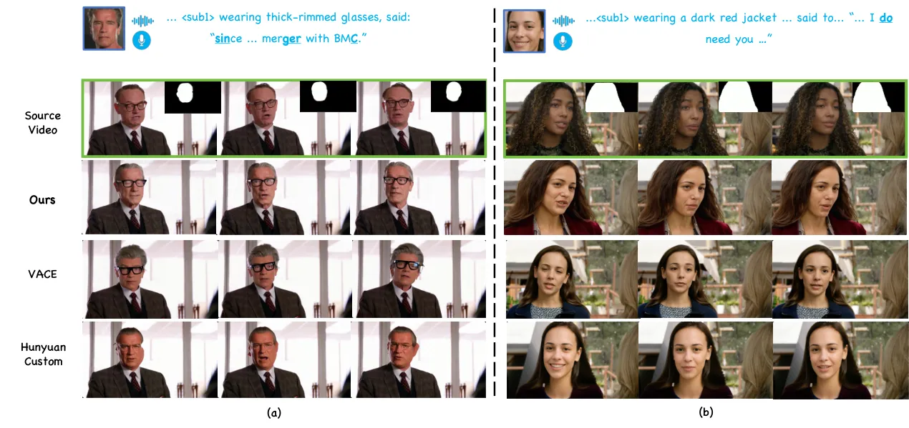

Figure 4: Qualitative comparison with SOTA methods on RV2AV. Please zoom
in for more details.

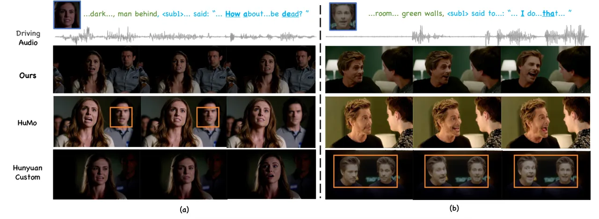

Figure 5: Qualitative comparison with SOTA methods on RA2V. Please zoom
in for more details.

### 4.3 Ablation Studies

Ablation on Dual-level Disentanglement. To validate the effectiveness of
our dual-level disentanglement design, we conduct an ablation study on
the challenging multi-person dialogue scenario of the R2AV task. The
quantitative results are presented in Table 6, with a qualitative
comparison in Fig. 6 (a). Our analysis highlights the distinct
contributions of each component: (1)w/o SC: Following Ovi \[36\], we
replace the Structured Caption (SC) with standard unstructured joint
caption (i.e., a single global description for both target video and
audio), the model’s ability to follow textual instructions is
significantly impaired, resulting in the lowest ViCLIP score. More
critically, this leads to a dramatic increase in speaker confusion, with
the Spk-Conf. rate more than tripling from 0.08 to 0.26. This
underscores the crucial role of SC in explicitly associating visual
attributes and dialogue content with specific subjects in multi-person
scenarios. As illustrated in the first row of Fig. 6 (a), without SC,
both the visual attributes and content of $`\langle sub_{1}\rangle`$ and
$`\langle sub_{2}\rangle`$ suffer from severe mismatch. (2)w/o Syn-RoPE:
Removing Syn-RoPE, which is designed to bind specific speakers to their
corresponding timbres, leads to a severe degradation in timbre
preservation, as indicated by the sharp drop in the T-Sim. score. The
identity-timbre mismatch also negatively impacts lip-sync accuracy
(Sync-C/D). As shown in the second row of Fig. 6 (a), without Syn-RoPE,
$`\langle sub_{1}\rangle`$ is erroneously bound to the voice timbre of
$`\langle sub_{2}\rangle`$.

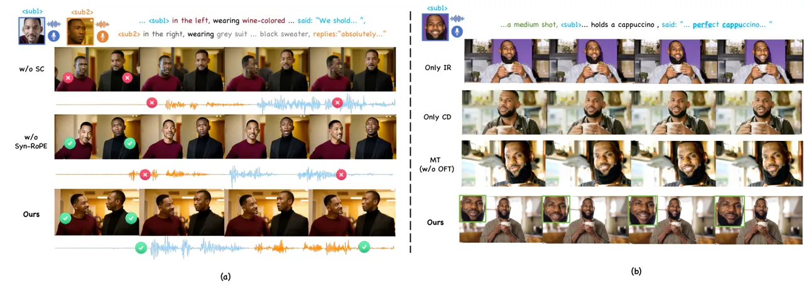

Figure 6: Qualitative results of our ablation studies. (a) Ablation on
our dual-level disentanglement design. (b) Ablation on multi-task
progressive training.

| Method       | ViCLIP $`\uparrow`$ | T-Sim. $`\uparrow`$ | Sync-C $`\uparrow`$ | Sync-D $`\downarrow`$ | Spk-Conf. $`\downarrow`$ |
| ------------ | ------------------- | ------------------- | ------------------- | --------------------- | ------------------------ |
| w/o Syn-RoPE | 13.179              | 0.211               | 4.192               | 10.411                | 0.12                     |
| w/o SC       | 11.381              | 0.378               | 5.943               | 8.064                 | 0.26                     |
| Ours         | 13.613              | 0.402               | 6.074               | 8.027                 | 0.08                     |

Table 5: Ablation study on Dual-level Disentanglement.

| Method       | ViCLIP $`\uparrow`$ | ID-Sim.$`\uparrow`$ | AQ $`\uparrow`$ | T-Sim. $`\uparrow`$ | CLAP $`\uparrow`$ |
| ------------ | ------------------- | ------------------- | --------------- | ------------------- | ----------------- |
| Only IR      | 11.931              | 0.692               | 5.576           | 0.504               | 0.225             |
| Only CD      | 14.044              | 0.543               | 6.072           | 0.471               | 0.287             |
| MT (w/o OFT) | 9.518               | 0.638               | 4.449           | 0.442               | 0.104             |
| Ours         | 14.573              | 0.674               | 6.313           | 0.493               | 0.282             |

Table 6: Ablation study on Multi-Task Progressive Training.

Ablation on Multi-Task Progressive Training. We conduct an ablation
study on our multi-task progressive training strategy, with the results
on the single-person R2AV scenario presented in Table 6. A qualitative
comparison is provided in Fig. 6 (b) Only IR: Training exclusively with
In-pair Reconstruction (IR) leads to severe copy-paste issues, as
illustrated in Fig. 6 (b) (the first row). While this results in
deceptively high ID-Sim. and T-Sim. scores, the model fails to learn
meaningful conditional synthesis, leading to poor text-following ability
(ViCLIP) and audio quality (AQ). (2) Only CD: Conversely, training only
with Cross-pair Disentanglement (CD) from the start proves too
challenging. The model struggles to learn fundamental representations,
resulting in very low ID-Sim. and T-Sim. scores, as shown in the second
row in Fig. 6 (b). (3) MT (w/o OFT): This experiment validates our
progressive training philosophy by attempting to train all tasks (R2AV,
RV2AV, RA2V) jointly from scratch without Omni-Task Fine-tuning (OFT).
This naive multi-task (MT) approach yields suboptimal performance on the
R2AV task, particularly in text-following as indicated by ViCLIP (third
row of Fig. 6 (b)). This confirms our hypothesis that when training a
unified model, it is crucial to first establish a strong generative
prior on weakly-constrained tasks (like R2AV) before introducing
strongly-constrained tasks (like RV2AV/RA2V). Without this progression,
the model tends to “shortcut” the learning process by overfitting to the
easier, strongly-constrained tasks, ultimately failing to generalize on
the more complex, weakly-constrained generation tasks.

## 5 Conclusion

In this paper, we have presented DreamID-Omni, a unified framework for
controllable human-centric audio-video generation. By integrating
reference-based generation, editing, and animation into a single
paradigm, DreamID-Omni addresses the limitations of previous
task-specific models. To tackle the critical challenge of multi-person
confusion, we introduced Syn-RoPE for signal-level identity-timbre
binding and Structured Captioning for semantic-level disentanglement.
Furthermore, our proposed Multi-Task Progressive Training strategy
effectively harmonizes disparate objectives. Extensive experiments on
our new benchmark, IDBench-Omni, demonstrate that DreamID-Omni achieves
SOTA performance across multiple tasks.

## References

- \[1\] G. Chen, D. Lin, J. Yang, C. Lin, J. Zhu, M. Fan, H. Zhang, S.
  Chen, Z. Chen, C. Ma, et al. (2025) Skyreels-v2: infinite-length film
  generative model. arXiv preprint arXiv:2504.13074. Cited by: §2.2.
- \[2\] L. Chen, T. Ma, J. Liu, B. Li, Z. Chen, L. Liu, X. He, G. Li, Q.
  He, and Z. Wu (2025) Humo: human-centric video generation via
  collaborative multi-modal conditioning. arXiv preprint
  arXiv:2509.08519. Cited by: §1, §2.2, §4.2.
- \[3\] S. Chen, C. Wang, Z. Chen, Y. Wu, S. Liu, Z. Chen, J. Li, N.
  Kanda, T. Yoshioka, X. Xiao, J. Wu, L. Zhou, S. Ren, Y. Qian, Y.
  Qian, J. Wu, M. Zeng, and F. Wei (2021) WavLM: large-scale
  self-supervised pre-training for full stack speech processing.
  External Links: 2110.13900 Cited by: §4.1.
- \[4\] S. Chen, Y. Chen, Y. Chen, Z. Chen, F. Cheng, X. Chi, J.
  Cong, Q. Cui, Q. Dong, J. Fan, et al. (2025) Seedance 1.5 pro: a
  native audio-visual joint generation foundation model. arXiv preprint
  arXiv:2512.13507. Cited by: §1.
- \[5\] X. Chen, K. He, J. Zhu, Y. Ge, W. Li, and C. Wang (2024)
  Hifivfs: high fidelity video face swapping. arXiv preprint
  arXiv:2411.18293. Cited by: §2.2.
- \[6\] Z. Chen, B. Li, T. Ma, L. Liu, M. Liu, Y. Zhang, G. Li, X.
  Li, S. Zhou, Q. He, and X. Wu (2025) Phantom-data: towards a general
  subject-consistent video generation dataset. arXiv preprint
  arXiv:2506.18851. Cited by: §A.2.
- \[7\] G. Cheng, X. Gao, L. Hu, S. Hu, M. Huang, C. Ji, J. Li, D.
  Meng, J. Qi, P. Qiao, et al. (2025) Wan-animate: unified character
  animation and replacement with holistic replication. arXiv preprint
  arXiv:2509.14055. Cited by: §2.2.
- \[8\] J. S. Chung and A. Zisserman (2016) Out of time: automated lip
  sync in the wild. In Asian conference on computer vision, pp. 251–263.
  Cited by: §4.1.
- \[9\] J. Deng, J. Guo, N. Xue, and S. Zafeiriou (2019) ArcFace:
  additive angular margin loss for deep face recognition. In 2019
  IEEE/CVF Conference on Computer Vision and Pattern Recognition (CVPR),
  Cited by: §4.1.
- \[10\] Y. Deng, X. Guo, Y. Yin, J. Z. Fang, Y. Yang, Y. Wang, S.
  Yuan, A. Wang, B. Liu, H. Huang, et al. (2025) MAGREF: masked guidance
  for any-reference video generation. arXiv preprint arXiv:2505.23742.
  Cited by: §2.2.
- \[11\] Z. Du, Q. Chen, S. Zhang, K. Hu, H. Lu, Y. Yang, H. Hu, S.
  Zheng, Y. Gu, Z. Ma, et al. (2024) Cosyvoice: a scalable multilingual
  zero-shot text-to-speech synthesizer based on supervised semantic
  tokens. arXiv preprint arXiv:2407.05407. Cited by: §A.2.
- \[12\] Y. Gao, H. Guo, T. Hoang, W. Huang, L. Jiang, F. Kong, H.
  Li, J. Li, L. Li, X. Li, et al. (2025) Seedance 1.0: exploring the
  boundaries of video generation models. arXiv preprint
  arXiv:2506.09113. Cited by: §2.1.
- \[13\] J. Gong, S. Zhao, S. Wang, S. Xu, and J. Guo (2025) Ace-step: a
  step towards music generation foundation model. arXiv preprint
  arXiv:2506.00045. Cited by: §2.1.
- \[14\] X. Guo, F. Ye, X. Li, P. Tu, P. Zhang, Q. Sun, S. Zhao, X. Hou,
  and Q. He (2026) DreamID-v:bridging the image-to-video gap for
  high-fidelity face swapping via diffusion transformer. External Links:
  2601.01425 Cited by: §2.2.
- \[15\] Y. HaCohen, B. Brazowski, N. Chiprut, Y. Bitterman, A.
  Kvochko, A. Berkowitz, D. Shalem, D. Lifschitz, D. Moshe, E. Porat, et
  al. (2026) LTX-2: efficient joint audio-visual foundation model. arXiv
  preprint arXiv:2601.03233. Cited by: §1, §2.1, §4.2.
- \[16\] J. Han, F. Landini, J. Rohdin, A. Silnova, M. Diez, and L.
  Burget (2025) Leveraging self-supervised learning for speaker
  diarization. In Proc. ICASSP, Cited by: §A.2.
- \[17\] A. Hayakawa, M. Ishii, T. Shibuya, and Y. Mitsufuji (2024)
  MMDisCo: multi-modal discriminator-guided cooperative diffusion for
  joint audio and video generation. arXiv preprint arXiv:2405.17842.
  Cited by: §2.1.
- \[18\] X. He, Q. Liu, S. Qian, X. Wang, T. Hu, K. Cao, K. Yan, and J.
  Zhang (2024) Id-animator: zero-shot identity-preserving human video
  generation. arXiv preprint arXiv:2404.15275. Cited by: §2.2.
- \[19\] X. He, Q. Liu, Z. Ye, W. Ye, Q. Wang, X. Wang, Q. Chen, P.
  Wan, D. Zhang, and K. Gai (2025) Fulldit2: efficient in-context
  conditioning for video diffusion transformers. arXiv preprint
  arXiv:2506.04213. Cited by: §1.
- \[20\] J. Ho and T. Salimans (2022) Classifier-free diffusion
  guidance. arXiv preprint arXiv:2207.12598. Cited by: §3.4.
- \[21\] T. Hu, Z. Yu, Z. Zhou, S. Liang, Y. Zhou, Q. Lin, and Q.
  Lu (2025) Hunyuancustom: a multimodal-driven architecture for
  customized video generation. arXiv preprint arXiv:2505.04512. Cited
  by: §1, §2.2, §4.2, §4.2, §4.2.
- \[22\] X. Huang, H. Zhou, Q. Yang, S. Wen, and K. Han (2025) JoVA:
  unified multimodal learning for joint video-audio generation. arXiv
  preprint. Cited by: §2.1.
- \[23\] Y. Huang, Z. Yuan, Q. Liu, Q. Wang, X. Wang, R. Zhang, P.
  Wan, D. Zhang, and K. Gai (2025) Conceptmaster: multi-concept video
  customization on diffusion transformer models without test-time
  tuning. arXiv preprint arXiv:2501.04698. Cited by: §2.2.
- \[24\] Z. Huang, Y. He, J. Yu, F. Zhang, C. Si, Y. Jiang, Y. Zhang, T.
  Wu, Q. Jin, N. Chanpaisit, Y. Wang, X. Chen, L. Wang, D. Lin, Y. Qiao,
  and Z. Liu (2024) VBench: comprehensive benchmark suite for video
  generative models. In Proceedings of the IEEE/CVF Conference on
  Computer Vision and Pattern Recognition, Cited by: §4.1.
- \[25\] Z. Jiang, Z. Han, C. Mao, J. Zhang, Y. Pan, and Y. Liu (2025)
  Vace: all-in-one video creation and editing. arXiv preprint
  arXiv:2503.07598. Cited by: §1, §2.2, §4.2, §4.2.
- \[26\] W. Kong, Q. Tian, Z. Zhang, R. Min, Z. Dai, J. Zhou, J.
  Xiong, X. Li, B. Wu, J. Zhang, et al. (2024) Hunyuanvideo: a
  systematic framework for large video generative models. arXiv preprint
  arXiv:2412.03603. Cited by: §2.1.
- \[27\] Z. Kong, F. Gao, Y. Zhang, Z. Kang, X. Wei, X. Cai, G. Chen,
  and W. Luo (2025) Let them talk: audio-driven multi-person
  conversational video generation. arXiv preprint arXiv:2505.22647.
  Cited by: §3.2.2.
- \[28\] H. Li, M. Xu, Y. Zhan, S. Mu, J. Li, K. Cheng, Y. Chen, T.
  Chen, M. Ye, J. Wang, et al. (2024) OpenHumanVid: a large-scale
  high-quality dataset for enhancing human-centric video generation.
  arXiv preprint arXiv:2412.00115. Cited by: §4.1.
- \[29\] Z. Li, D. Qian, K. Su, Q. Diao, X. Xia, C. Liu, W. Yang, T.
  Zhang, and Z. Yuan (2025) Bindweave: subject-consistent video
  generation via cross-modal integration. arXiv preprint
  arXiv:2510.00438. Cited by: §2.2.
- \[30\] S. Liang, Z. Yu, Z. Zhou, T. Hu, H. Wang, Y. Chen, Q. Lin, Y.
  Zhou, X. Li, Q. Lu, et al. (2025) OmniV2V: versatile video generation
  and editing via dynamic content manipulation. arXiv preprint
  arXiv:2506.01801. Cited by: §1.
- \[31\] G. Lin, J. Jiang, J. Yang, Z. Zheng, C. Liang, Y. Zhang, and J.
  Liu (2025) Omnihuman-1: rethinking the scaling-up of one-stage
  conditioned human animation models. In Proceedings of the IEEE/CVF
  International Conference on Computer Vision, pp. 13847–13858. Cited
  by: §2.2.
- \[32\] H. Liu, Z. Chen, Y. Yuan, X. Mei, X. Liu, D. Mandic, W. Wang,
  and M. D. Plumbley (2023) AudioLDM: text-to-audio generation with
  latent diffusion models. In Proceedings of the 40th International
  Conference on Machine Learning, Proceedings of Machine Learning
  Research, Vol. 202, pp. 21450–21474. Cited by: §2.1.
- \[33\] H. Liu, G. L. Lan, X. Mei, Z. Ni, A. Kumar, V. Nagaraja, W.
  Wang, M. D. Plumbley, Y. Shi, and V. Chandra (2024) SyncFlow: toward
  temporally aligned joint audio-video generation from text. arXiv
  preprint arXiv:2412.15220. Cited by: §2.1.
- \[34\] K. Liu, W. Li, L. Chen, S. Wu, Y. Zheng, J. Ji, F. Zhou, R.
  Jiang, J. Luo, H. Fei, and T. Chua (2025) JavisDiT: joint audio-video
  diffusion transformer with hierarchical spatio-temporal prior
  synchronization. In arxiv, Cited by: §2.1.
- \[35\] L. Liu, T. Ma, B. Li, Z. Chen, J. Liu, G. Li, S. Zhou, Q. He,
  and X. Wu (2025) Phantom: subject-consistent video generation via
  cross-modal alignment. arXiv preprint arXiv:2502.11079. Cited by: §1,
  §2.2, §4.2.
- \[36\] C. Low, W. Wang, and C. Katyal (2025) Ovi: twin backbone
  cross-modal fusion for audio-video generation. arXiv preprint
  arXiv:2510.01284. Cited by: §1, §2.1, §3.2.2, §4.1, §4.2, §4.3.
- \[37\] X. Luo, Y. Zhu, Y. Liu, L. Lin, C. Wan, Z. Cai, S. Huang,
  and Y. Li (2025) CanonSwap: high-fidelity and consistent video face
  swapping via canonical space modulation. arXiv preprint
  arXiv:2507.02691. Cited by: §2.2.
- \[38\] W. Peebles and S. Xie (2022) Scalable diffusion models with
  transformers. arXiv preprint arXiv:2212.09748. Cited by: §1.
- \[39\] A. Polyak, A. Zohar, A. Brown, A. Tjandra, A. Sinha, A. Lee, A.
  Vyas, B. Shi, C. Ma, C. Chuang, et al. (2024) Movie gen: a cast of
  media foundation models. arXiv preprint arXiv:2410.13720. Cited by:
  §2.2.
- \[40\] L. Qu, F. Cheng, Z. Yang, Q. Zhao, S. Lin, Y. Shi, Y. Li, W.
  Wang, T. Chua, and L. Jiang (2025) VINCIE: unlocking in-context image
  editing from video. arXiv preprint arXiv:2506.10941. Cited by: §1.
- \[41\] A. Radford, J. W. Kim, T. Xu, G. Brockman, C. McLeavey, and I.
  Sutskever (2023) Robust speech recognition via large-scale weak
  supervision. In International conference on machine learning,
  pp. 28492–28518. Cited by: §4.1.
- \[42\] L. Ruan, Y. Ma, H. Yang, H. He, B. Liu, J. Fu, N. J. Yuan, Q.
  Jin, and B. Guo (2023) Mm-diffusion: learning multi-modal diffusion
  models for joint audio and video generation. In Proceedings of the
  IEEE/CVF Conference on Computer Vision and Pattern Recognition,
  pp. 10219–10228. Cited by: §2.1.
- \[43\] H. Shao, S. Wang, Y. Zhou, G. Song, D. He, Z. Zong, S. Qin, Y.
  Liu, and H. Li (2025) VividFace: a robost and high-fidelity video face
  swapping framework. In The Thirty-ninth Annual Conference on Neural
  Information Processing Systems, Cited by: §2.2.
- \[44\] J. Su, M. Ahmed, Y. Lu, S. Pan, W. Bo, and Y. Liu (2024)
  Roformer: enhanced transformer with rotary position embedding.
  Neurocomputing 568, pp. 127063. Cited by: §3.2.2.
- \[45\] G. Team, R. Anil, S. Borgeaud, J. Alayrac, J. Yu, R.
  Soricut, J. Schalkwyk, A. M. Dai, A. Hauth, K. Millican, et al. (2023)
  Gemini: a family of highly capable multimodal models. arXiv preprint
  arXiv:2312.11805. Cited by: §A.2, §4.1.
- \[46\] A. Tjandra, Y. Wu, B. Guo, J. Hoffman, B. Ellis, A. Vyas, B.
  Shi, S. Chen, M. Le, N. Zacharov, C. Wood, A. Lee, and W. Hsu (2025)
  Meta audiobox aesthetics: unified automatic quality assessment for
  speech, music, and sound. Cited by: §4.1.
- \[47\] T. Wan, A. Wang, B. Ai, B. Wen, C. Mao, C. Xie, D. Chen, F.
  Yu, H. Zhao, J. Yang, et al. (2025) Wan: open and advanced large-scale
  video generative models. arXiv preprint arXiv:2503.20314. Cited by:
  §1, §1, §2.1, §4.2.
- \[48\] D. Wang, W. Zuo, A. Li, L. Chen, X. Liao, D. Zhou, Z. Yin, X.
  Dai, D. Jiang, and G. Yu (2025) UniVerse-1: unified audio-video
  generation via stitching of experts. arXiv preprint arXiv:2509.06155.
  Cited by: §2.1.
- \[49\] J. Wang, C. Qiang, Y. Guo, Y. Wang, X. Zeng, C. Zhang, and P.
  Wan (2026) Klear: unified multi-task audio-video joint generation.
  arXiv preprint arXiv:2601.04151. Cited by: §2.1.
- \[50\] K. Wang, S. Deng, J. Shi, D. Hatzinakos, and Y. Tian (2024)
  Av-dit: efficient audio-visual diffusion transformer for joint audio
  and video generation. arXiv preprint arXiv:2406.07686. Cited by: §2.1.
- \[51\] M. Wang, Q. Wang, F. Jiang, Y. Fan, Y. Zhang, Y. Qi, K. Zhao,
  and M. Xu (2025) Fantasytalking: realistic talking portrait generation
  via coherent motion synthesis. In Proceedings of the 33rd ACM
  International Conference on Multimedia, pp. 9891–9900. Cited by: §2.2.
- \[52\] R. Wang, Y. Chen, S. Xu, T. He, W. Zhu, D. Song, N. Chen, X.
  Tang, and Y. Hu (2025) DynamicFace: high-quality and consistent face
  swapping for image and video using composable 3d facial priors. In
  Proceedings of the IEEE/CVF International Conference on Computer
  Vision, pp. 13438–13447. Cited by: §2.2.
- \[53\] Y. Wang, Y. He, Y. Li, K. Li, J. Yu, X. Ma, X. Chen, Y.
  Wang, P. Luo, Z. Liu, Y. Wang, L. Wang, and Y. Qiao (2023) InternVid:
  a large-scale video-text dataset for multimodal understanding and
  generation. arXiv preprint arXiv:2307.06942. Cited by: §4.1.
- \[54\] H. Wei, Z. Yang, and Z. Wang (2024) AniPortrait: audio-driven
  synthesis of photorealistic portrait animations. External Links:
  2403.17694 Cited by: §2.2.
- \[55\] C. Wu, J. Li, J. Zhou, J. Lin, K. Gao, K. Yan, S. Yin, S.
  Bai, X. Xu, Y. Chen, et al. (2025) Qwen-image technical report. arXiv
  preprint arXiv:2508.02324. Cited by: §4.2.
- \[56\] Y. Wu, K. Chen, T. Zhang, Y. Hui, T. Berg-Kirkpatrick, and S.
  Dubnov (2023) Large-scale contrastive language-audio pretraining with
  feature fusion and keyword-to-caption augmentation. In IEEE
  International Conference on Acoustics, Speech and Signal Processing,
  ICASSP, Cited by: §4.1.
- \[57\] M. Xu, H. Li, Q. Su, H. Shang, L. Zhang, C. Liu, J. Wang, Y.
  Yao, and S. zhu (2024) Hallo: hierarchical audio-driven visual
  synthesis for portrait image animation. External Links: 2406.08801
  Cited by: §2.2.
- \[58\] Z. Xu, J. Ma, Z. Wang, Z. Peng, J. Liang, and J. Li (2026)
  End-to-end video character replacement without structural guidance.
  arXiv preprint arXiv:2601.08587. Cited by: §2.2.
- \[59\] T. Yang, R. Li, Y. Shi, Y. Zhang, Q. Dong, H. Cheng, W.
  Feng, S. Wen, B. Peng, and L. Zhang (2025) Many-for-many: unify the
  training of multiple video and image generation and manipulation
  tasks. arXiv preprint arXiv:2506.01758. Cited by: §1.
- \[60\] Z. Yang, A. Zeng, C. Yuan, and Y. Li (2023) Effective
  whole-body pose estimation with two-stages distillation. In
  Proceedings of the IEEE/CVF International Conference on Computer
  Vision, pp. 4210–4220. Cited by: §A.2.
- \[61\] Z. Ye, X. He, Q. Liu, Q. Wang, X. Wang, P. Wan, D. Zhang, K.
  Gai, Q. Chen, and W. Luo (2025) UNIC: unified in-context video
  editing. arXiv preprint arXiv:2506.04216. Cited by: §1.
- \[62\] S. Yuan, J. Huang, X. He, Y. Ge, Y. Shi, L. Chen, J. Luo,
  and L. Yuan (2025) Identity-preserving text-to-video generation by
  frequency decomposition. In Proceedings of the Computer Vision and
  Pattern Recognition Conference, pp. 12978–12988. Cited by: §2.2.
- \[63\] L. Zhao, L. Feng, D. Ge, R. Chen, F. Yi, C. Zhang, X. Zhang,
  and X. Li (2025) UniForm: a unified multi-task diffusion transformer
  for audio-video generation. arXiv preprint arXiv:2502.03897. Cited by:
  §2.1.
- \[64\] S. Zhao, Z. Pan, and B. Ma (2025) ClearerVoice-studio: bridging
  advanced speech processing research and practical deployment. arXiv
  preprint arXiv:2506.19398. Cited by: §A.2.
- \[65\] Y. Zhong, Z. Yang, J. Teng, X. Gu, and C. Li (2025) Concat-id:
  towards universal identity-preserving video synthesis. arXiv preprint
  arXiv:2503.14151. Cited by: §2.2.

## Appendix A Appendix

In the supplementary material, the sections are organized as follows:

- •
  We provide qualitative comparisons with baselines on RV2AV and RA2V in
  Sec. A.1.
- •
  We provide the details of our data construction pipeline in Sec. A.2.
- •
  We provide the MLLM-based judge prompt in Sec. A.3.
- •
  We provide more details regarding the user study in Sec. A.4.
- •
  We provide more qualitative results for R2AV, RV2AV, and RA2V tasks in
  Sec. A.5.

### A.1 Comparison Results on RV2AV and RA2V

Figs. 4 and 5 compare DreamID-Omni with SOTA methods on RV2AV and RA2V,
respectively, where the qualitative results clearly demonstrate our
superior performance.

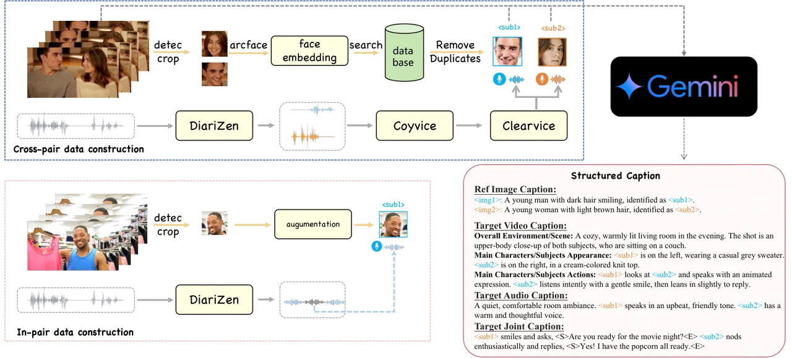

Figure 7: Data construction pipeline.

### A.2 Data Construction Details

Our full dataset consists of approximately 1M high-quality audio-video
pairs. As illustrated in Fig. 7, our data construction pipeline is
categorized into two primary stages: In-pair data construction. We
process each video clip to extract its internal references. The
reference voice timbre set $`\mathcal{A}`$ is created by applying
DiariZen \[16\] for speaker diarization to obtain precise timestamps.
Concurrently, the reference identity set $`\mathcal{I}`$ is formed by
using DWPose \[60\] to detect and crop face regions from keyframes.
Cross-pair data construction. For the audio branch, we construct the
reference timbre $`\mathcal{A}`$ through a multi-stage pipeline. First,
DiariZen \[16\] and Gemini \[45\] are combined to accurately label
speaker segments in multi-person dialogues. Subsequently, CosyVoice
\[11\] is employed to clone a clean voice for each speaker, which is
then purified using ClearerVoice \[64\] for final denoising. For the
video branch, the reference identity $`\mathcal{I}`$ is constructed
following the established Phantom-Data \[6\] pipeline.

Figure 8: MLLM system prompt for Structured Caption.

### A.3 MLLM-Based Judge

We employ Gemini-2.5-Pro as a MLLM-based judge for Speaker Confusion,
Fig. 9 presents the system prompt.

Figure 9: MLLM system prompt for speaker confusion detection.

### A.4 User Study

We conduct a user study as part of the evaluation on IDBench-Omni.
Specifically, we invited 30 professional video creators to serve as
evaluators. Users rate each video on seven dimensions on a 1–5 scale,
and we average the ratings to obtain the final scores. The user study
was carried out in a blinded setting. Table 7 indicates that our
approach performs strongly across multiple dimensions.

| Method             | Text-Video Alignment | ID-Sim. | Video Quality | Text-Audio Alignment | Timbre-Sim. | Audio Quality | Lip-sync |
| ------------------ | -------------------- | ------- | ------------- | -------------------- | ----------- | ------------- | -------- |
| Phantom            | 3.62                 | 3.55    | 3.35          | \-                   | \-          | \-            | \-       |
| VACE               | 3.45                 | 3.47    | 3.28          | \-                   | \-          | \-            | \-       |
| Qwen-Image + LTX-2 | 3.32                 | 3.09    | 3.14          | 4.18                 | 2.41        | 3.73          | 2.91     |
| Qwen-Image + Ovi   | 3.70                 | 3.05    | 3.64          | 4.23                 | 2.41        | 3.77          | 3.32     |
| Wan2.6             | 3.51                 | 3.18    | 3.77          | 3.57                 | 2.95        | 4.08          | 3.12     |
| Ours               | 3.86                 | 3.95    | 3.68          | 4.75                 | 3.50        | 4.23          | 4.50     |

Table 7: User Study with state-of-the-art methods on R2AV. Best results
are in bold, second best are underlined.

### A.5 More Visual Results

As shown in Fig. 10-13, we provide more qualitative results of
DreamID-Omni on R2AV, RV2AV and RA2V task.

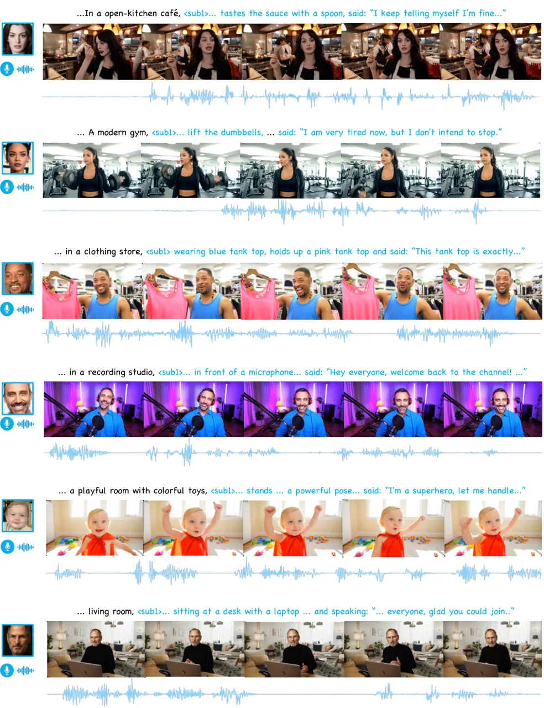

Figure 10: More qualitative results on R2AV I

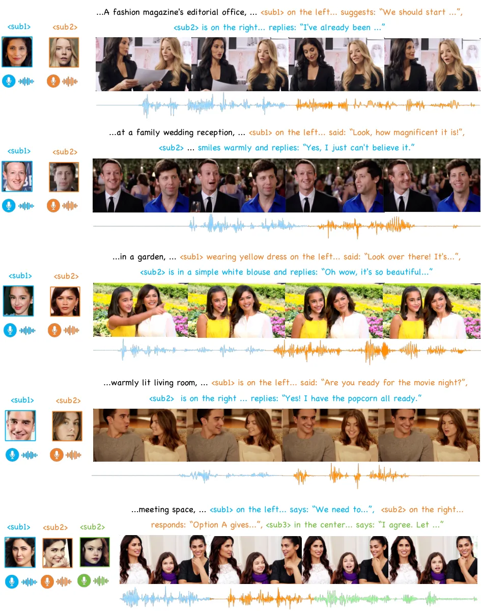

Figure 11: More qualitative results on R2AV II

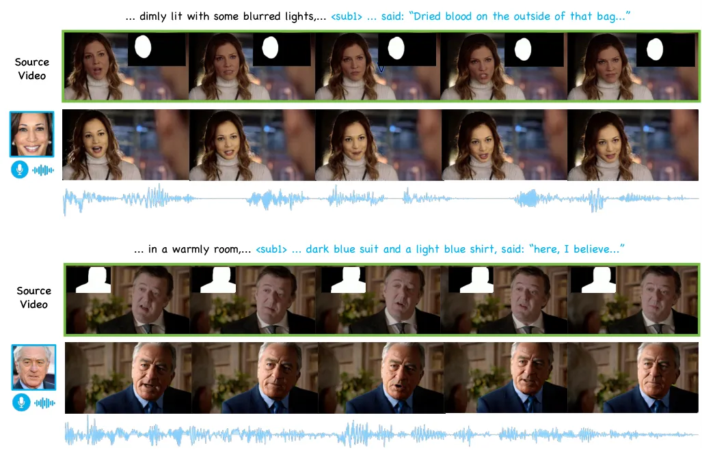

Figure 12: More qualitative results on RV2AV

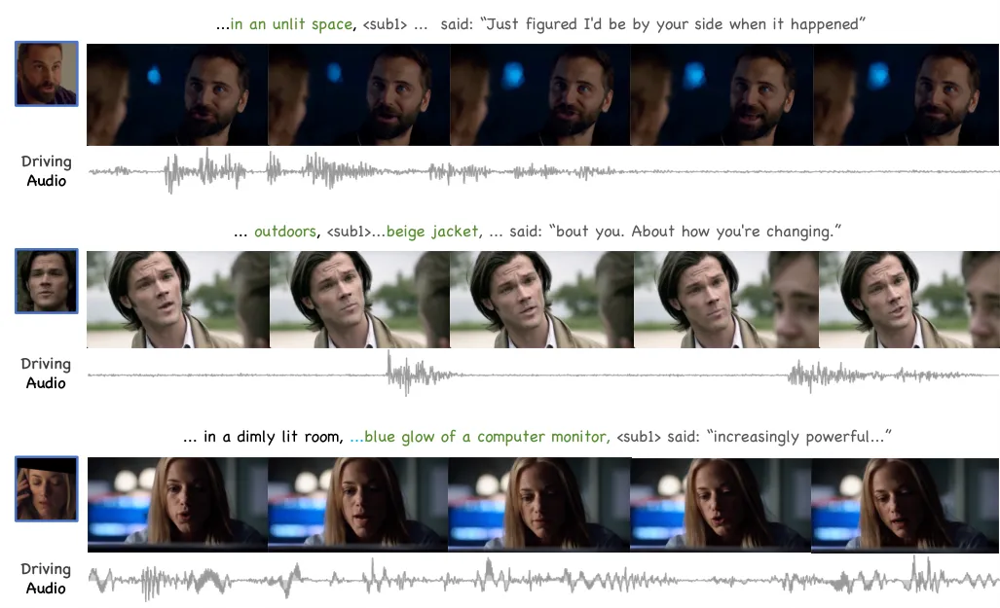

Figure 13: More qualitative results on RA2V
