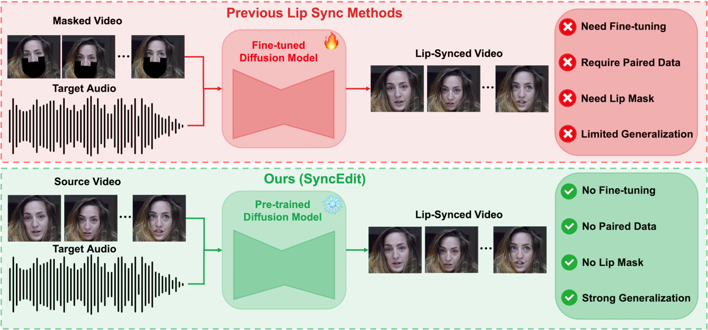
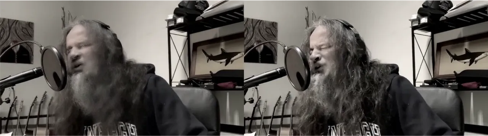
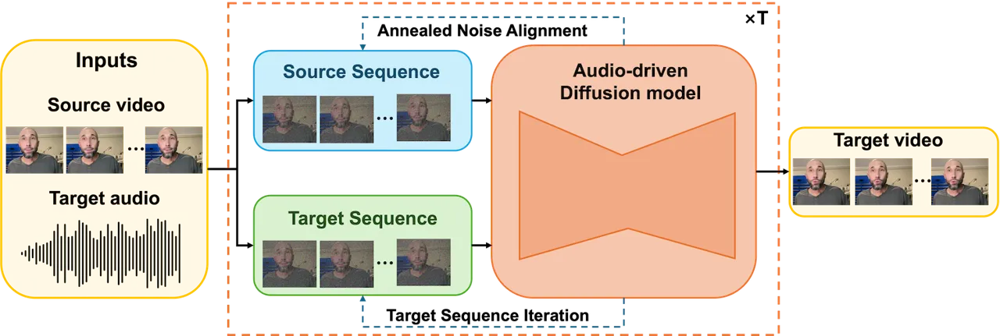
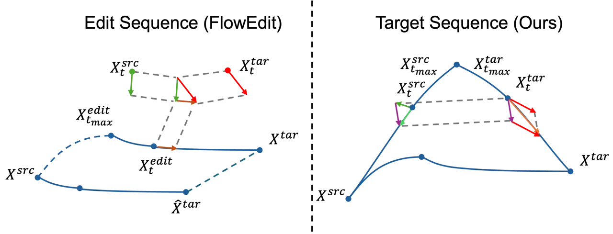
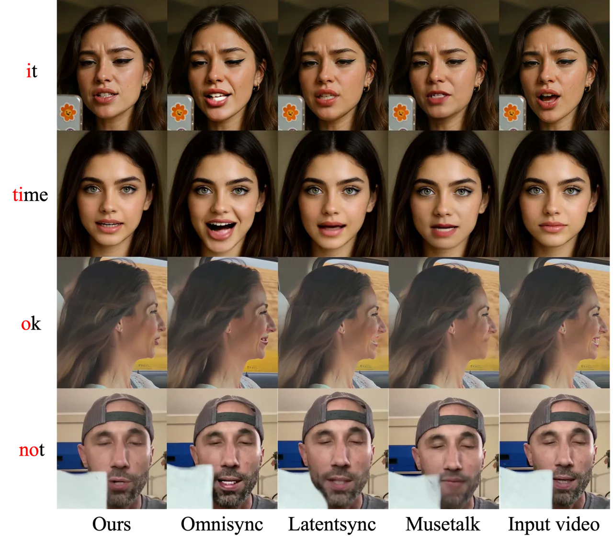
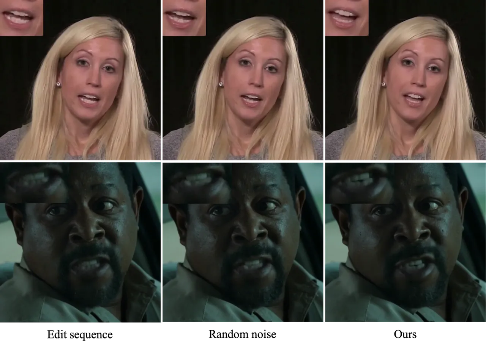
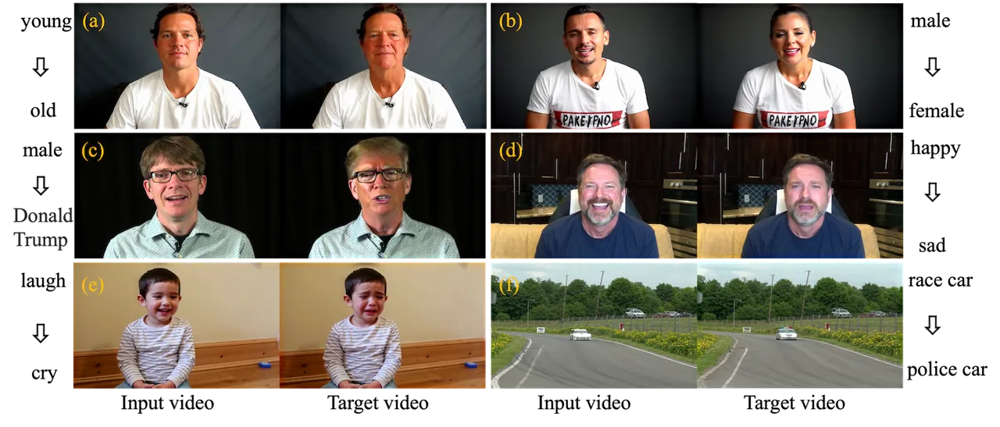

# SyncEdit: Rethinking Lip Synchronization as Editing with Audio-Driven Diffusion Models

Lixiang Lin Affiliation: HiThink Research
Email: [linlixiang@myhexin.com](mailto:)    Siyuan Jin Affiliation: USTC
   Jinshan Zhang Affiliation: ZheJiang University

###### Abstract

Lip synchronization refers to the task of modifying facial lip movements
such that they are temporally aligned with a given audio signal. It is a
fundamental problem in audio-visual synthesis for generating realistic
talking-head videos. Recent progress in diffusion-based generative
models has led to remarkable advances in lip synchronization.
Nevertheless, existing methods typically achieve audio-visual alignment
by fine-tuning pre-trained diffusion models on large scale datasets,
resulting in substantial computational costs and significant data
requirements. Inspired by FlowEdit, we reformulate lip synchronization
as a video editing problem. Building upon a pre-trained audio-driven
diffusion model, our approach achieves lip synchronization in a
training-free manner, without additional fine-tuning or paired data. In
this paper, we present SyncEdit, a training-free framework designed for
lip synchronization. We reformulate the editing paradigm by substituting
the edit sequence in FlowEdit with the target sequence, yielding an
unbiased estimation of the desired output. Moreover, we propose annealed
noise alignment, which progressively alignes the sampled Gaussian noise
with diffusion-model-estimated noise during iterative editing, producing
a smooth and stable editing trajectory. Extensive experimental results
validate the effectiveness and robustness of the proposed framework.
Code is available at [here](https://github.com/l1346792580123/SyncEdit).

## 1 Introduction

Lip synchronization \[25, 35, 15\], which aims to align mouth movements
with corresponding speech audio, is a fundamental yet critical task in
computer vision. By enforcing fine-grained temporal and semantic
consistency between facial dynamics and acoustic signals, lip
synchronization plays an essential role in applications such as film
dubbing and digital human generation. As a result, it has become a
foundational component in modern video generation systems, underpinning
the realism and perceptual quality of AI-generated visual content.

Recent advances in diffusion-based generative models \[8, 17, 26, 24\]
have significantly accelerated the development of lip synchronization
techniques. Numerous lip synchronization approaches \[21, 33, 23\]
formulate lip synchronization as a conditional generation problem and
achieve impressive performance by fine-tuning text-to-image or
text-to-video diffusion models. However, their success typically relies
on large amounts of paired audio-visual training data and substantial
computational resources for model adaptation. These limitations motivate
the exploration of training-free alternatives that can exploit the
powerful generative capabilities of pretrained diffusion models while
avoiding costly fine-tuning procedures.



Figure 1: Comparison of existing lip synchronization methods and our
approach. Previous methods generally rely on paired audio–video data,
diffusion model fine-tuning, and lip masking, whereas our method
achieves lip synchronization using only a pretrained audio-driven
diffusion model.

Moreover, due to the scarcity of paired lip-synchronization training
data, many existing methods rely on explicit mouth-region masking or
employ carefully designed training strategies to enforce audio-visual
alignment. Such designs not only increase data annotation requirements
but also introduce strong assumptions about facial geometry.
Consequently, their performance often degrades in challenging scenarios,
such as facial occlusions, large head poses, and profile views.

Motivated by the aforementioned limitations, we revisit lip
synchronization from a different perspective by formulating it as a
video editing problem. We propose SyncEdit, a training-free framework
that directly leverages the rich audio-visual priors of pre-trained
audio-driven diffusion models. As illustrated in Fig. 1, unlike existing
diffusion-based approaches that require task-specific fine-tuning and
paired lip-sync data, SyncEdit performs lip synchronization by directly
editing the input video according to the target speech, without any
additional training. By treating lip synchronization as an editing
process, our method achieves accurate temporal alignment between lip
movements and speech while preserving the speaker’s identity and non-lip
facial attributes. SyncEdit substantially reduces both data and
computational requirements, while naturally supporting flexible
audio-driven visual editing across a wide range of scenarios.

We first replace the iterative refinement of the edit sequence in
FlowEdit \[13\] with iterations over the target sequence, obtaining an
unbiased estimation of the desired output. This reformulation not only
reduces the inherent bias introduced by sequential editing but also
enables a more direct alignment with the target distribution.

Second, we replace purely stochastic Gaussian sampling with an annealed
noise alignment strategy, where Gaussian noise is progressively blended
with noise estimated by the pre-trained diffusion model. As the
iterative process proceeds, the contribution of Gaussian noise gradually
diminishes, resulting in a smoother optimization trajectory that
improves both the stability and quality of the generated results

Our contributions can be summarized as follows:

- •
  We present SyncEdit, the first training-free framework for lip
  synchronization, eliminating the need for task-specific fine-tuning,
  and paving the way for plug-and-play multimodal content creation.
- •
  We establish a target iterative sequence to enable an unbiased
  estimation of the desired output, reducing bias from sequential
  editing and facilitating more direct alignment with the target
  distribution.
- •
  We construct a smoother and more stable generation trajectory through
  annealed noise alignment, where stochastic Gaussian noise is
  progressively aligned with noise estimated by a pre-trained diffusion
  model, leading to improved generation stability and output quality.
- •
  SyncEdit achieves state-of-the-art performance without additional
  training, rivaling or surpassing supervised methods in lip
  synchronization while supporting flexible cross-modal audio–visual
  editing.



Figure 2: Comparison of editing results under different $`t_{max}`$
values. The left image presents the result obtained with $`t_{max}=1`$,
whereas the right image corresponds to $`t_{max}=0.95`$. Starting the
editing process from pure noise ($`t_{max}=1`$) degrades the fidelity of
the edited image

## 2 Related Works

### 2.1 Audio-driven Video Generation

Audio-driven video generation is commonly categorized into lip
synchronization and portrait animation, distinguished primarily by their
input settings. Lip synchronization operates on a given video to match
target audio, while portrait animation generates video content using
only audio and a reference image. The emergence of diffusion models has
markedly advanced the state of the art in audio-driven lip
synchronization \[15, 33, 19, 23\]. Omnisync \[23\] adopts a mask-free
training strategy with diffusion transformer models, allowing direct
frame-level editing in the absence of explicit masking. Despite
achieving promising results, these approaches still requires paired
audio-visual data and additional model fine-tuning.

Portrait Animation \[30, 20, 2, 9, 1, 3, 4\] differs from lip
synchronization in that it directly generates videos by driving a
reference image with an audio signal. While this approach requires fewer
conditional inputs, it typically offers limited control over background,
head pose, and detailed facial expressions. We propose a training-free
method that leverages a portrait animation model to achieve lip
synchronization, hence unifying the two approaches.



Figure 3: Overview of SyncEdit. Given a source video and a target audio,
SyncEdit performs lip synchronization through a pre-trained audio-driven
diffusion model. SyncEdit directly iterates over the target sequence,
yielding an unbiased estimate of the desired output. Furthermore,
SyncEdit employs an annealed noise alignment strategy that progressively
replaces stochastic Gaussian noise with model-estimated noise throughout
the denoising process.

### 2.2 Training Free Editing

Training-free editing has emerged as an important direction in
diffusion-based generative modeling, as it enables image manipulation
without requiring additional model retraining or task-specific
fine-tuning. Optimization-based editing \[11, 12, 22, 6\] directly
modifies the input image by iteratively optimizing it toward consistency
with a given textual prompt. Inversion-based editing \[7, 27, 32, 31\]
involves recovering a noise map via image-to-noise inversion and
subsequently applying the conventional diffusion process guided by the
target prompts to achieve the intended modifications.

FlowEdit \[13\] introduces an inversion-free, optimization-free and
model agnostic method for text-based image editing. FlowEdit constructs
a direct ODE between the source and target distributions, without
passing through the standard Gaussian distribution. FlowAlign \[10\]
extends FlowEdit by promoting a smoother transition from source to
target. FlowDirector \[16\] further introduces flow correction and
applies the framework to text-to-video editing.

## 3 Preliminaries

### 3.1 Flow Matching

Flow Matching \[17\] is a framework for learning continuous-time
generative models by directly regressing the vector field of a
probability flow. The transportation between the data distribution
$`X_{0}`$ and the Gaussian distribution $`X_{1}\sim\mathcal{N}(0,I)`$,
is defined by an ordinary differential equation (ODE)

```math
dX_{t}=V(X_{t},t)dt, \tag{1}
```

$`t\in[0,1]`$, $`V`$ is the velocity field. Flow matching trains a
neural network $`v_{\theta}`$ to model the velocity field by minimizing

```math
\mathcal{L}_{FM}=\mathbb{E}||v_{\theta}(x_{t},t)-V(x_{t},t|x_{1})||^{2}, \tag{2}
```

where $`x_{t}\sim X_{t},x_{1}\sim X_{1}`$, $`V(x_{t},t|x_{1})`$ is the
conditional velocity field. Once $`v_{\theta}`$ is trained, the data
sample can be generated by sampling a random Gaussian noise and solving
the ODE iteratively.

Rectified Flow \[18\] is a particular instantiation of flow matching
that constructs a linear interpolation path between samples from the
data distribution and the Gaussian distribution
$`x_{t}=(1-t)x_{0}+tx_{1}`$, resulting in a constant target velocity
$`V(x_{t},t|x_{1})=x_{1}-x_{0}`$ that transports noise to data along
straight-line trajectories.

For conditional generation, the velocity field is parameterized to
depend on auxiliary conditioning information, such as text or audio.
Conditional generative flow models are trained on paired observations of
data and conditions, enabling sampling from the corresponding
conditional data distribution.

### 3.2 FlowEdit

FlowEdit \[13\] presents an inversion-free and model agnostic method for
text-based image editing using pretrained flow models. FlowEdit
reinterprets inversion as a direct path between the source and target
distribution, and defines an edit sequence

```math
\displaystyle X_{t}^{edit} \displaystyle=X^{src}+X_{t}^{tar}-X_{t}^{src}, \tag{3}
```

```math
\displaystyle X_{t}^{src} \displaystyle=(1-t)X^{src}+t\epsilon. \tag{4}
```

$`X^{src}`$ is the source image, $`\epsilon\sim\mathcal{N}(0,I)`$ is
Gaussian noise, $`X_{t}^{src}`$ and $`X_{t}^{tar}`$ represent the
sequence of source image and target image respectively. $`X_{t}^{src}`$
is constructed by adding Gaussian noise to the source image, and
$`X_{t}^{tar}`$ is computed according to Eq. 3
$`X_{t}^{tar}=X_{t}^{edit}+X_{t}^{src}-X^{src}`$. The transportation ODE
of $`X_{t}^{edit}`$ is defined by

```math
dX_{t}^{edit}=(V(X_{t}^{tar},t)-V(X_{t}^{src},t))dt. \tag{5}
```

For more details, we suggest readers to refer to the FlowEdit \[13\]
paper.

While FlowEdit defines the direct transportation from source image to
target image, making the iteration results noise-free, some problems
still exist. First, the editing process starts from $`t_{max}`$ instead
of $`1`$, and $`X_{t_{max}}^{edit}`$ is initialized to $`X^{src}`$.
Consequently, the resulting edited output is not strictly equivalent to
the desired target sample $`X^{tar}`$ Instead, it is given by

```math
X^{edit}=X^{src}+\int_{t_{max}}^{0}(V(X_{t}^{tar},t)-V(X_{t}^{src},t))dt, \tag{6}
```

which reveals that the final estimate depends on the discrepancy between
the target and source velocity fields accumulated along the truncated
trajectory. This mismatch between the initialization scheme and the
ideal diffusion boundary condition introduces an inherent bias in the
editing process, preventing exact recovery of the target distribution.



Figure 4: Illustration of the difference between edit sequence and the
proposed target-sequence iteration. FlowEdit estimates the edited sample
by integrating an edit sequence initialized at $`t_{max}`$, which
introduces estimation bias with respect to the desired target. In
contrast, the proposed target-sequence formulation directly iterates
over the target trajectory, eliminating the bias and producing an
unbiased estimate of the final output.

Although initializing the trajectory from $`t=1`$ is more faithful to
the original diffusion process, it incurs higher computational overhead
by integrating over the entire time horizon. In addition, initiating the
editing process from pure Gaussian noise amplifies numerical error
accumulation and trajectory instability, often leading to degraded
editing fidelity. Fig 2 demonstrate the impact of different choices of
$`t_{max}`$.

Second, as noted in FlowAlign \[10\] and DynaEdit \[14\], sampling a
random Gaussian noise $`\epsilon_{t}`$ at each iteration to generate
$`x_{t}^{src}`$ produces a non-smooth trajectory. This temporal
inconsistency propagates to $`x_{t}^{edit}`$, reducing optimization
stability, and hindering the attainment of optimal performance.

Input: source video $`X^{src}`$, $`\{t_{i}\}^{T}_{i=0}`$, pretrained
model $`V_{\theta}`$, prompt $`c`$, start step $`n_{max}`$, target audio
$`A^{tar}`$, source audio $`A^{src}`$

Output: target video $`X^{tar}`$

Init:
$`X^{tar}_{t_{max}}=X^{src}_{t_{max}}=(1-t_{max})X^{src}+t_{max}\epsilon`$

for _$`i=n_{max}`$ to $`0`$_ do

   $`\epsilon_{i}\leftarrow\mathcal{N}(0,I)`$

   // Compute source and target velocity

   $`V^{src}_{t_{i}}\leftarrow V_{\theta}(X^{src}_{t_{i}},A^{src},t_{i},c)`$

   $`V^{tar}_{t_{i}}\leftarrow V_{\theta}(X^{tar}_{t_{i}},A^{tar},t_{i},c)`$

   // Annealed noise alignment

   $`\hat{\epsilon}_{i}\leftarrow X^{src}_{t_{i}}+(1-t_{i})V^{src}_{t_{i}}`$

   $`\tilde{\epsilon}_{t_{i-1}}\leftarrow(1-t_{i-1})\hat{\epsilon}_{i}+t_{i-1}\epsilon_{i}`$

   // Source and target sequence iteration

   $`X^{src}_{t_{i-1}}\leftarrow(1-t_{i-1})X^{src}+t_{i-1}\tilde{\epsilon}_{t_{i-1}}`$

   $`X^{tar}_{t_{i-1}}\leftarrow X^{tar}_{t_{i}}+\Delta t_{i}(V^{tar}_{t_{i}}-V^{src}_{t_{i}})+X^{src}_{t_{i-1}}-X^{src}_{t_{i}}`$

end for

Return: $`X^{tar}_{0}`$

Algorithm 1 SyncEdit for Lip Synchronization

## 4 SyncEdit

Motivated by the aforementioned observations, we propose SyncEdit, a
training-free framework for lip synchronization. An overview of the
proposed framework is presented in Fig. 3. Our approach reformulates the
FlowEdit paradigm by replacing the conventional iterative editing
trajectory with an iteration process defined directly on the target
sequence, enabling an unbiased estimation of the desired output.
Moreover, we introduce an annealed noise alignment strategy that
progressively interpolates between stochastic Gaussian noise and noise
estimated from the pre-trained diffusion model, resulting in a smoother
and more stable editing trajectory.

In the following, we first introduce the proposed target-sequence
iteration strategy and annealed noise alignment mechanism in detail.
Based on these two components, we establish a unified training-free
editing framework that performs accurate lip synchronization.

|                  |                        |                   |                  |                      |                       |                      |                   |                   |
| ---------------- | ---------------------- | ----------------- | ---------------- | -------------------- | --------------------- | -------------------- | ----------------- | ----------------- |
| Methods          | Full Reference Metrics |                   |                  | No Reference Metrics |                       |                      | Lip Sync          |                   |
|                  | FID$`\downarrow`$      | FVD$`\downarrow`$ | CSIM$`\uparrow`$ | NIQE$`\downarrow`$   | BRISQUE$`\downarrow`$ | HyperIQA$`\uparrow`$ | LMD$`\downarrow`$ | LSE-C$`\uparrow`$ |
| Wav2Lip\[25\]    | 14.912                 | 543.340           | 0.852            | 6.495                | 53.372                | 45.822               | 10.007            | 7.630             |
| IP-LAP\[35\]     | 9.512                  | 325.691           | 0.809            | 6.533                | 54.402                | 50.086               | 7.695             | 7.260             |
| Diff2Lip\[21\]   | 12.079                 | 461.341           | 0.869            | 6.261                | 49.361                | 48.869               | 18.986            | 7.140             |
| MuseTalk\[33\]   | 8.759                  | 231.418           | 0.862            | 5.824                | 46.003                | 55.397               | 8.701             | 6.890             |
| LatentSync\[15\] | 8.518                  | 216.899           | 0.859            | 6.270                | 50.861                | 53.208               | 17.344            | 8.050             |
| Omnisync\[23\]   | 7.855                  | 199.627           | 0.875            | 5.481                | 37.917                | 56.356               | 7.097             | 7.309             |
| Ours(Humo1.7B)   | 7.952                  | 201.038           | 0.879            | 5.604                | 39.527                | 54.714               | 7.698             | 7.157             |
| Ours(Humo17B)    | 7.623                  | 190.299           | 0.884            | 5.385                | 37.412                | 55.973               | 7.182             | 7.286             |

Table 1: Quantitative results on HDTF Dataset.

|                  |                        |                   |                  |                      |                       |                      |                          |                                 |
| ---------------- | ---------------------- | ----------------- | ---------------- | -------------------- | --------------------- | -------------------- | ------------------------ | ------------------------------- |
| Methods          | Full Reference Metrics |                   |                  | No Reference Metrics |                       |                      | Generation Success Rate  |                                 |
|                  | FID$`\downarrow`$      | FVD$`\downarrow`$ | CSIM$`\uparrow`$ | NIQE$`\downarrow`$   | BRISQUE$`\downarrow`$ | HyperIQA$`\uparrow`$ | All Videos$`\downarrow`$ | Stylized Characters$`\uparrow`$ |
| Wav2Lip\[25\]    | 22.989                 | 562.245           | 0.727            | 5.392                | 42.816                | 50.511               | 71.38%                   | 26.67%                          |
| IP-LAP\[35\]     | 14.686                 | 247.402           | 0.796            | 5.546                | 45.153                | 53.174               | 45.53%                   | 6.67%                           |
| Diff2Lip\[21\]   | 23.542                 | 403.149           | 0.692            | 5.440                | 42.442                | 50.335               | 74.63%                   | 36.67%                          |
| MuseTalk\[33\]   | 17.668                 | 297.621           | 0.667            | 4.935                | 36.017                | 58.334               | 92.20%                   | 67.78%                          |
| LatentSync\[15\] | 15.374                 | 263.111           | 0.751            | 5.342                | 41.917                | 54.648               | 74.96%                   | 35.56%                          |
| Omnisync\[23\]   | 10.681                 | 211.350           | 0.808            | 4.588                | 25.485                | 61.906               | 97.40%                   | 87.78%                          |
| Ours(Humo1.7B)   | 10.516                 | 213.136           | 0.824            | 4.632                | 26.374                | 58.936               | 96.26%                   | 79.98%                          |
| Ours(Humo17B)    | 9.663                  | 203.145           | 0.831            | 4.370                | 23.856                | 61.448               | 96.75%                   | 84.27%                          |

Table 2: Quantitative results on AIGC-LipSync Benchmark.

### 4.1 Target Sequence Iteration

We reframe the FlowEdit iteration process, transforming the iteration of
the edit sequence into the iteration of the target sequence

```math
\displaystyle X_{t_{max}}^{tar} \displaystyle=X_{t_{max}}^{src}=(1-t_{max})X^{src}+t_{max}\epsilon, \tag{7}
```

```math
\displaystyle X_{t_{i}}^{tar} \displaystyle=X_{t_{i}}^{edit}+X_{t_{i}}^{src}-X^{src}, \tag{8}
```

```math
\displaystyle X_{t_{i-1}}^{tar} \displaystyle=X_{t_{i}}^{tar}+X_{t_{i-1}}^{edit}-X_{t_{i}}^{edit}+X_{t_{i-1}}^{src}-X_{t_{i}}^{src}
```

```math
\displaystyle=X_{t_{i}}^{tar}+\Delta t_{i}(V_{t_{i}}^{tar}-V_{t_{i}}^{src})+X_{t_{i-1}}^{src}-X_{t_{i}}^{src}. \tag{9}
```

$`\{t_{i}\}_{i=0}^{T}`$ is a monotonically decreasing time schedule.
$`X_{t_{max}}^{tar}`$ and $`X_{t_{max}}^{src}`$ are initialized by
adding the same Gaussian noise in $`X^{src}`$.
$`\Delta t_{i}=t_{i-1}-t_{i}`$. The continuous-time ODE of the edit
sequence in Eq. 5 is solved using a numerical ODE solver via time
discretization.

In contrast to the edit sequence, the target sequence yields an unbiased
estimate of the desired target quantity. As illustrated in Fig. 4, the
key difference lies in the initialization of the trajectories.
Specifically, the target trajectory is initialized as
$`X_{t_{max}}^{tar}=(1-t_{max})X^{src}+t_{max}\epsilon`$. By comparison,
the edit sequence is initialized directly from the clean source input,
$`X_{t_{max}}^{edit}=X^{src}`$. The mismatch between the actual
initialization and the theoretically required diffusion state introduces
a systematic bias into the estimated editing trajectory, whereas the
target sequence avoids this issue and yields an unbiased estimate of the
desired target state.

By reformulating the iterative process in terms of the target sequence,
we obtain a clearer interpretation of the underlying dynamical system
and improve its analytical tractability. This reformulation not only
facilitates theoretical analysis of the iteration dynamics but also
provides a more principled foundation for the design of the associated
noise parameterization.



Figure 5: Qualitative comparison with existing methods. Compared with
prior approaches, our method generates more accurate lip synchronization
and more faithful dental structures while maintaining superior visual
consistency. Even in challenging scenarios, including profile views and
significant facial occlusions, our method produces natural and plausible
lip movements with fewer visual artifacts.

### 4.2 Annealed Noise Alignment

Eq. 9 can be further reformulated into the following form

```math
X_{t_{i-1}}^{tar}=X_{t_{i}}^{tar}+\Delta t_{i}V_{t_{i}}^{tar}+X_{t_{i-1}}^{src}-X_{t_{i}}^{src}+\Delta t_{i}V_{t_{i}}^{src}, \tag{10}
```

which can be interpreted as augmenting the iteration of the target
sequence with the incremental variation induced by the source sequence
iteration. This further indicates that the introduction of random noise
into the source sequence in FlowEdit \[13\] is suboptimal, since it
leads to irregular trajectories and increases the iterative error of the
source sequence.

As mentioned in DynaEdit \[14\], the stochastic Gaussian noise sampled
at each iteration introduces inconsistencies in the direction of the
editing velocity, resulting in unstable editing trajectories and
undesired artifacts. We introduce annealed noise alignment to replace
the purely stochastic noise injection in FlowEdit. Instead of relying
solely on randomly sampled Gaussian noise, $`X^{src}_{t_{i-1}}`$ is
constructed from a weighted combination of Gaussian noise and
diffusion-model-estimated noise, with the influence of Gaussian noise
gradually annealed throughout the iterative process

```math
\displaystyle\hat{\epsilon}_{t_{i}}=X^{src}_{t_{i}} \displaystyle+(1-t_{i})V^{src}_{t_{i}},\epsilon_{t_{i}}\sim\mathcal{N}(0,I) \tag{11}
```

```math
\displaystyle\tilde{\epsilon}_{t_{i-1}} \displaystyle=(1-t_{i-1})\hat{\epsilon}_{t_{i}}+t_{i-1}\epsilon_{t_{i}} \tag{12}
```

```math
\displaystyle X^{src}_{t_{i-1}} \displaystyle=(1-t_{i-1})X^{src}+t_{i-1}\tilde{\epsilon}_{t_{i-1}}. \tag{13}
```

By adopting this modification, we obtain smoother iteration dynamics and
alleviate error accumulation associated with random noise.

### 4.3 Lip Synchronization

The proposed method can be directly applied to pre-trained
audio-to-video diffusion models to achieve accurate lip synchronization.
By incorporating the aforementioned theoretical insights into the
editing process, our approach effectively leverages the generalization
capability and expressive power of pre-trained models, enabling precise
alignment between speech audio and lip movements.

Algorithm 1 outlines the proposed SyncEdit procedure for audio-driven
lip synchronization within a training-free generative flow framework.
Given a source video $`X^{src}`$, a predefined time schedule
$`\{t_{i}\}^{T}_{i=0}`$, and a pretrained audio-driven video generation
diffusion model $`V_{\theta}`$, the algorithm synthesizes a target video
$`X^{tar}`$ that preserves the visual identity and dynamics of the
source while conforming to a target audio signal $`A^{tar}`$.

The algorithm begins by initializing the source and target trajectories
from an identical noisy latent at the maximum time. At each timestep,
the pretrained audio-driven diffusion model predicts the source and
target velocity fields conditioned on the corresponding audio. Instead
of propagating the editing trajectory as in FlowEdit, the source
trajectory is first updated by estimating the underlying noise from the
predicted source velocity and annealing it with Gaussian noise to
construct the latent at the next timestep. The target trajectory is then
obtained by integrating the relative editing velocity while following
the updated source trajectory, yielding an unbiased estimate of the
desired target sequence. By coupling target-sequence iteration with
annealed noise alignment, the proposed algorithm constructs a smooth and
stable editing trajectory, enabling accurate training-free lip
synchronization using a pretrained audio-driven diffusion model.

## 5 Experiments

|               |                   |                   |                  |                    |                       |                      |                   |
| ------------- | ----------------- | ----------------- | ---------------- | ------------------ | --------------------- | -------------------- | ----------------- |
| Methods       | FID$`\downarrow`$ | FVD$`\downarrow`$ | CSIM$`\uparrow`$ | NIQE$`\downarrow`$ | BRISQUE$`\downarrow`$ | HyperIQA$`\uparrow`$ | LSE-C$`\uparrow`$ |
| Edit sequence | 7.944             | 198.409           | 0.878            | 5.408              | 37.526                | 55.198               | 7.284             |
| Random noise  | 7.707             | 194.916           | 0.880            | 5.396              | 37.457                | 55.492               | 7.286             |
| Ours          | 7.623             | 190.299           | 0.884            | 5.385              | 37.412                | 55.973               | 7.286             |

Table 3: Ablation study for our proposed method.

### 5.1 Experimental Setups

We utilize Humo \[1\] for lip synchronization. Humo is a unified
human-centric framework for video generation that enables audio-driven
synthesis and facilitates collaborative control across multiple
modalities. The total number of denoising steps is set to $`20`$, with
an initial step of $`4`$. We evaluate lip synchronization using
quantitative and qualitative metrics.

### 5.2 Lip Synchronization

We compare SyncEdit with OmniSync \[23\], LatentSync \[15\],
MuseTalk \[33\], IP-LAP \[35\], Diff2Lip \[21\], ad Wav2Lip \[25\] on
HDTF \[34\] dataset and AIGC-LipSync Benchmark \[23\]. Since OmniSync is
not publicly available, we use the qualitative results reported in its
paper, while the quantitative results are obtained from the Kling
website \[29\]. We follow the same evaluation metrics and datasets as
OmniSync. Visual quality is evaluated using FID (Fréchet Inception
Distance), FVD (Fréchet Video Distance), and CSIM (Cosine Similarity).
We additionally report no-reference perceptual metrics, including NIQE
(Natural Image Quality Evaluator), BRISQUE (Blind/Referenceless Image
Spatial Quality Evaluator), and HyperIQA \[28\]. Audio–visual
synchronization performance is measured via LMD (Landmark Distance), and
LSE-C (Lip Sync Error – Confidence).

We evaluate Generation Success Rate (GSR) on the AIGC-LipSync benchmark
for both the full set and stylized characters. The GSR quantifies the
proportion of videos exhibiting correct lip synchronization as confirmed
by human evaluators, providing a crucial metric for assessing the
effectiveness of universal lip synchronization in AI-generated content.



Figure 6: Ablation study for edit sequence and random noise. Edit
sequence and stochastic noise injection tends to produce blurred dental
details, whereas our method is capable of generating sharper and more
clearly defined teeth.

The experimental results on the HDTF dataset are presented in Table 1.
Our method achieves comparable performance to the current
state-of-the-art approach, OmniSync. By formulating lip synchronization
as an editing process, our approach minimally alters the original video
while maximally preserving identity consistency, resulting in the lowest
FID and FVD scores, as well as the highest CSIM. Regarding no-reference
quality metrics, our method outperforms OmniSync in terms of NIQE and
BRISQUE, while achieving slightly lower performance on HyperIQA. In
terms of lip-synchronization-specific metrics, including LMD and LSE-C,
our method performs slightly worse than OmniSync. LatentSync attains a
highest LSE-C score, which can be attributed to its SyncNet-based loss.

The quantitative results on the AIGC-LipSync Benchmark are shown in
Table 2. Our method again achieves the lowest FID and FVD scores,
together with the highest CSIM, demonstrating its strong capability in
preserving visual quality and identity consistency. In terms of
generation success rate, our approach performs slightly worse than
OmniSync. This limitation can be attributed to Humo, which is primarily
trained on human-centric datasets and thus exhibits a relatively lower
driving success rate on stylized characters. Nevertheless, our method
still outperforms other methods in this regard.



Figure 7: Qualitative results of SyncEdit for Audio-visual Editing. Our
approach supports prompt-based manipulation of diverse
attributes—including age (a), gender (b), person (c), emotion (d),
behaviors (e), and even car categories (f), while jointly generating
audio and video in a temporally synchronized and semantically consistent
manner.

The qualitative results are illustrated in Fig. 5. The results of
omnisync come from Kling’s website \[29\]. Our method consistently
achieves more accurate lip synchronization while generating sharper and
more faithful dental structures than competing approaches. Notably, in
challenging cases involving large head poses (e.g., profile views) and
facial occlusions, our method exhibits substantially stronger
robustness, producing natural and visually consistent lip movements
where other methods often suffer from noticeable artifacts or temporal
inconsistencies. Comprehensive visual results are provided in the
supplementary material.

### 5.3 Ablation Study

To validate the contribution of each component in our framework, we
conduct an ablation study on key modules, including replacing the edit
sequence with the target sequence and annealed noise alignment startegy.
Quantitative results are reported in Table 3, and qualitative
comparisons are presented in Fig. 6.

Although the iterative process over the edit sequence can produce
noise-free results, it fails to yield an unbiased estimate of the
target, which consequently degrades the fidelity and visual clarity of
the generated results. In contrast, iterating over the target sequence
more accurately approximates the underlying ODE, leading to improved
generative quality as reflected by lower FID and FVD scores. As
illustrated in Fig. 6, iterating over the edit sequence produces
noticeably blurred teeth, whereas the target-sequence iteration yields
significantly sharper and more clearly defined dental details.

Similarly, introducing randomly sampled Gaussian noise when computing
the source sequence yields a non-smooth iterative trajectory, which
adversely affects generation quality and leads to higher FID and FVD
scores. In contrast, replacing stochastic noise with estimated noise
produces a smoother trajectory, thereby improving the overall quality of
the generated results. As shown in Fig. 6, incorporating random noise
also results in degraded visual clarity, particularly in the dental
region, while our approach preserves sharper structural details and
achieves superior overall quality.

### 5.4 Audio-Visual Editing

Similarly, by leveraging a pre-trained audio–visual foundation model,
SyncEdit extends naturally to prompt-driven audio–visual editing.
Textual prompts serve as high-level semantic guidance, enabling coherent
manipulation of both visual and auditory modalities.

We employ LTX-2 \[5\] for audio–visual editing. We conduct a qualitative
evaluation of SyncEdit to assess its performance in this setting. As
illustrated in Fig. 7, our proposed method demonstrates the ability to
modify input videos according to given textual prompts, enabling
controlled editing of attributes such as age, gender, identity, emotion,
behaviors, and car categories. These results highlight the flexibility
and generality of SyncEdit in handling diverse and semantically rich
audio-visual editing tasks.

## 6 Conclusion

In this paper, we introduce SyncEdit, a training-free framework for lip
synchronization. By reformulating the editing process and replacing the
edit sequence with the target sequence in the FlowEdit paradigm, the
proposed method enables an unbiased estimation of the desired output.
Furthermore, by progressively aligning stochastic Gaussian noise with
diffusion-model-estimated noise, we constructs a smoother and more
stable editing trajectory, leading to improved stability and
higher-quality generation. Extensive experiments demonstrate that our
approach achieves strong performance and robustness across diverse
scenarios, validating the effectiveness of the proposed design. We
believe this training-free formulation provides a practical and
efficient alternative to conventional fine-tuning-based editing methods.

## References

- \[1\] L. Chen, T. Ma, J. Liu, B. Li, Z. Chen, L. Liu, X. He, G. Li, Q.
  He, and Z. Wu (2025) HuMo: human-centric video generation via
  collaborative multi-modal conditioning. External Links: 2509.08519,
  [Link](https://arxiv.org/abs/2509.08519) Cited by: §2.1, §5.1.
- \[2\] J. Cui, H. Li, Y. Yao, H. Zhu, H. Shang, K. Cheng, H. Zhou, S.
  Zhu, and J. Wang (2025) Hallo2: long-duration and high-resolution
  audio-driven portrait image animation. In ICLR, Cited by: §2.1.
- \[3\] Q. Gan, R. Yang, J. Zhu, S. Xue, and S. Hoi (2025) OmniAvatar:
  efficient audio-driven avatar video generation with adaptive body
  animation. External Links: 2506.18866,
  [Link](https://arxiv.org/abs/2506.18866) Cited by: §2.1.
- \[4\] X. Gao, L. Hu, S. Hu, M. Huang, C. Ji, D. Meng, J. Qi, P.
  Qiao, Z. Shen, Y. Song, K. Sun, L. Tian, G. Wang, Q. Wang, Z. Wang, J.
  Xiao, S. Xu, B. Zhang, P. Zhang, X. Zhang, Z. Zhang, J. Zhou, and L.
  Zhuo (2025) Wan-s2v: audio-driven cinematic video generation. External
  Links: 2508.18621, [Link](https://arxiv.org/abs/2508.18621) Cited by:
  §2.1.
- \[5\] Y. HaCohen, B. Brazowski, N. Chiprut, Y. Bitterman, A.
  Kvochko, A. Berkowitz, D. Shalem, D. Lifschitz, D. Moshe, E. Porat, E.
  Richardson, G. Shiran, I. Chachy, J. Chetboun, M. Finkelson, M.
  Kupchick, N. Zabari, N. Guetta, N. Kotler, O. Bibi, O. Gordon, P.
  Panet, R. Benita, S. Armon, V. Kulikov, Y. Inger, Y. Shiftan, Z.
  Melumian, and Z. Farbman (2026) LTX-2: efficient joint audio-visual
  foundation model. External Links: 2601.03233,
  [Link](https://arxiv.org/abs/2601.03233) Cited by: §5.4.
- \[6\] A. Hertz, K. Aberman, and D. Cohen-Or (2023) Delta denoising
  score. In ICCV, pp. 2328–2337. Cited by: §2.2.
- \[7\] A. Hertz, R. Mokady, J. Tenenbaum, K. Aberman, Y. Pritch, and D.
  Cohen-Or (2023) Prompt-to-prompt image editing with cross-attention
  control. In ICLR, Cited by: §2.2.
- \[8\] J. Ho, A. Jain, and P. Abbeel (2020) Denoising diffusion
  probabilistic models. In neurips, Cited by: §1.
- \[9\] X. Ji, X. Hu, Z. Xu, J. Zhu, C. Lin, Q. He, J. Zhang, D. Luo, Y.
  Chen, Q. Lin, Q. Lu, and C. Wang (2025) Sonic: shifting focus to
  global audio perception in portrait animation. In CVPR, pp. 193–203.
  Cited by: §2.1.
- \[10\] J. Kim, Y. Hong, and J. C. Ye (2026) FlowAlign:
  trajectory-regularized, inversion-free flow-based image editing. In
  ICLR, Cited by: §2.2, §3.2.
- \[11\] J. Kim, G. Y. Park, and J. C. Ye (2024) DreamSampler: unifying
  diffusion sampling and score distillation for image manipulation. In
  ECCV, Vol. 15140, pp. 398–414. Cited by: §2.2.
- \[12\] J. Koo, C. Park, and M. Sung (2024) Posterior distillation
  sampling. In CVPR, pp. 13352–13361. Cited by: §2.2.
- \[13\] V. Kulikov, M. Kleiner, I. Huberman-Spiegelglas, and T.
  Michaeli (2025) Flowedit: inversion-free text-based editing using
  pre-trained flow models. In ICCV, pp. 19721–19730. Cited by: §1, §2.2,
  §3.2, §3.2, §4.2.
- \[14\] V. Kulikov, R. Paiss, A. Voynov, I. Mosseri, T. Dekel, and T.
  Michaeli (2026) Versatile editing of video content, actions, and
  dynamics without training. External Links: 2603.17989,
  [Link](https://arxiv.org/abs/2603.17989) Cited by: §3.2, §4.2.
- \[15\] C. Li, C. Zhang, W. Xu, J. Lin, J. Xie, W. Feng, B. Peng, C.
  Chen, and W. Xing (2024) LatentSync: taming audio-conditioned latent
  diffusion models for lip sync with syncnet supervision. External
  Links: 2412.09262, [Link](https://arxiv.org/abs/2412.09262) Cited by:
  §1, §2.1, Table 1, Table 2, §5.2.
- \[16\] G. Li, Y. Yang, C. Song, and C. Zhang (2025) FlowDirector:
  training-free flow steering for precise text-to-video editing. In
  CVPR, pp. 2589–2598. Cited by: §2.2.
- \[17\] Y. Lipman, R. T. Q. Chen, H. Ben-Hamu, M. Nickel, and M.
  Le (2023) Flow matching for generative modeling. In ICLR, Cited by:
  §1, §3.1.
- \[18\] X. Liu, C. Gong, and Q. Liu (2023) Flow straight and fast:
  learning to generate and transfer data with rectified flow. In ICLR,
  Cited by: §3.1.
- \[19\] J. Ma, S. Wang, J. Yang, J. Hu, J. Liang, G. Lin, J. Chen, K.
  Li, and Y. Meng (2025) SayAnything: audio-driven lip synchronization
  with conditional video diffusion. External Links: 2502.11515,
  [Link](https://arxiv.org/abs/2502.11515) Cited by: §2.1.
- \[20\] R. Meng, Y. Wang, W. Wu, R. Zheng, Y. Li, and C. Ma (2025)
  EchoMimicV3: 1.3b parameters are all you need for unified multi-modal
  and multi-task human animation. In AAAI, Cited by: §2.1.
- \[21\] S. Mukhopadhyay, S. Suri, R. T. Gadde, and A.
  Shrivastava (2024) Diff2Lip: audio conditioned diffusion models for
  lip-synchronization. In IEEE Conf. Win. Appli. Comput. Vis.,
  pp. 5292–5302. Cited by: §1, Table 1, Table 2, §5.2.
- \[22\] H. Nam, G. Kwon, G. Y. Park, and J. C. Ye (2024) Contrastive
  denoising score for text-guided latent diffusion image editing. In
  CVPR, pp. 9192–9201. Cited by: §2.2.
- \[23\] Z. Peng, J. Liu, H. Zhang, X. Liu, S. Tang, P. Wan, D.
  Zhang, H. Liu, and J. He (2025) OmniSync: towards universal lip
  synchronization via diffusion transformers. In neurips, Cited by: §1,
  §2.1, Table 1, Table 2, §5.2.
- \[24\] D. Podell, Z. English, K. Lacey, A. Blattmann, T. Dockhorn, J.
  Müller, J. Penna, and R. Rombach (2024) SDXL: improving latent
  diffusion models for high-resolution image synthesis. In ICLR, Cited
  by: §1.
- \[25\] K. R. Prajwal, R. Mukhopadhyay, V. P. Namboodiri, and C. V.
  Jawahar (2020) A lip sync expert is all you need for speech to lip
  generation in the wild. In ACM MM, pp. 484–492. Cited by: §1, Table 1,
  Table 2, §5.2.
- \[26\] R. Rombach, A. Blattmann, D. Lorenz, P. Esser, and B.
  Ommer (2022) High-resolution image synthesis with latent diffusion
  models. In CVPR, Cited by: §1.
- \[27\] D. Samuel, B. Meiri, H. Maron, Y. Tewel, N. Darshan, S.
  Avidan, G. Chechik, and R. Ben-Ari (2025) Lightning-fast image
  inversion and editing for text-to-image diffusion models. In ICLR,
  Cited by: §2.2.
- \[28\] S. Su, Q. Yan, Y. Zhu, C. Zhang, X. Ge, J. Sun, and Y.
  Zhang (2020) Blindly assess image quality in the wild guided by a
  self-adaptive hyper network. In CVPR, pp. 3664–3673. Cited by: §5.2.
- \[29\] K. Team (2026)Kling ai(Website) External Links:
  [Link](https://app.klingai.com/) Cited by: §5.2, §5.2.
- \[30\] L. Tian, Q. Wang, B. Zhang, and L. Bo (2024) EMO: emote
  portrait alive generating expressive portrait videos with audio2video
  diffusion model under weak conditions. In ECCV, Vol. 15141,
  pp. 244–260. Cited by: §2.1.
- \[31\] N. Tumanyan, M. Geyer, S. Bagon, and T. Dekel (2023)
  Plug-and-play diffusion features for text-driven image-to-image
  translation. In CVPR, pp. 1921–1930. Cited by: §2.2.
- \[32\] B. Wallace, A. Gokul, and N. Naik (2023) EDICT: exact diffusion
  inversion via coupled transformations. In CVPR, Cited by: §2.2.
- \[33\] Y. Zhang, M. Liu, Z. Chen, B. Wu, Y. Zeng, C. Zhan, Y. He, J.
  Huang, and W. Zhou (2024) MuseTalk: real-time high quality lip
  synchronization with latent space inpainting. External Links:
  2410.10122, [Link](https://arxiv.org/abs/2410.10122) Cited by: §1,
  §2.1, Table 1, Table 2, §5.2.
- \[34\] Z. Zhang, L. Li, Y. Ding, and C. Fan (2021) Flow-guided
  one-shot talking face generation with a high-resolution audio-visual
  dataset. In CVPR, pp. 3661–3670. Cited by: §5.2.
- \[35\] W. Zhong, C. Fang, Y. Cai, P. Wei, G. Zhao, L. Lin, and G.
  Li (2023) Identity-preserving talking face generation with landmark
  and appearance priors. In CVPR, pp. 9729–9738. Cited by: §1, Table 1,
  Table 2, §5.2.
