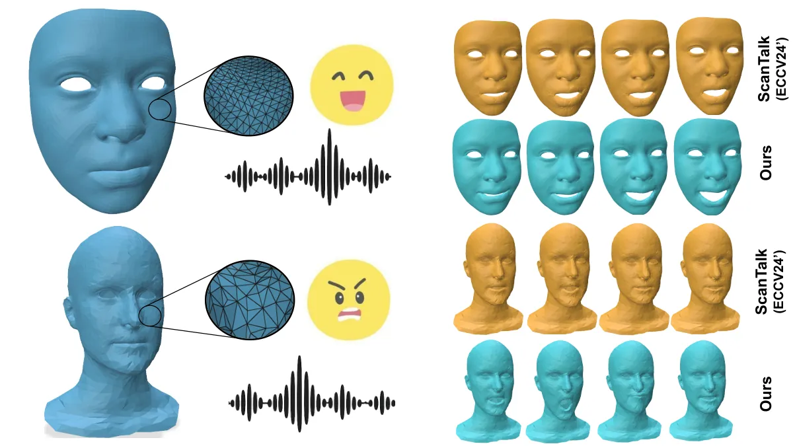
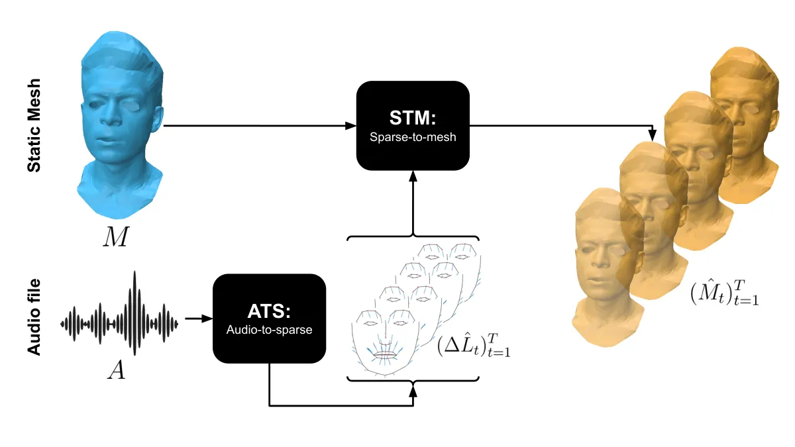
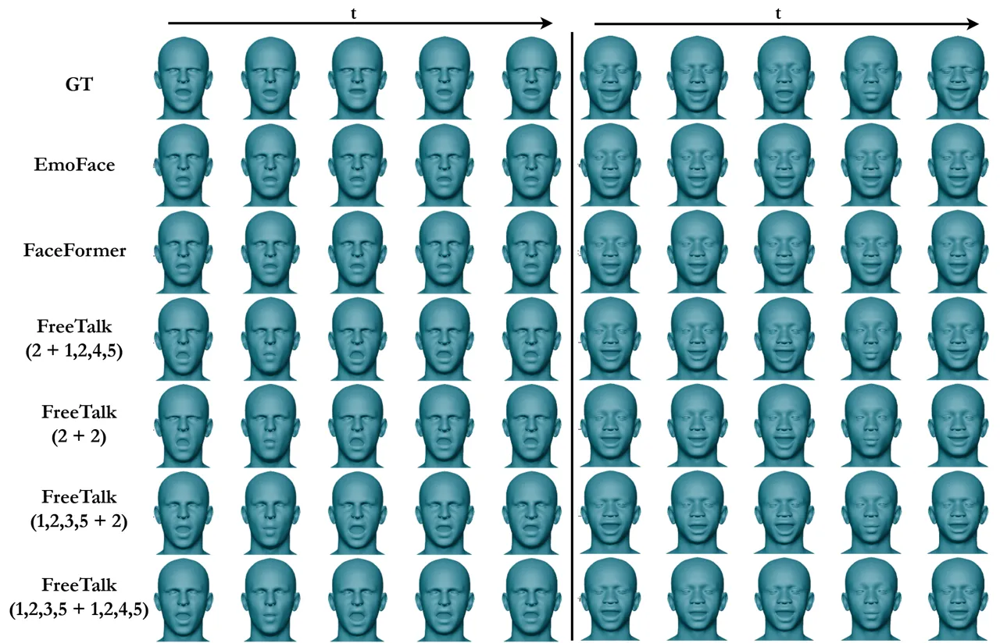
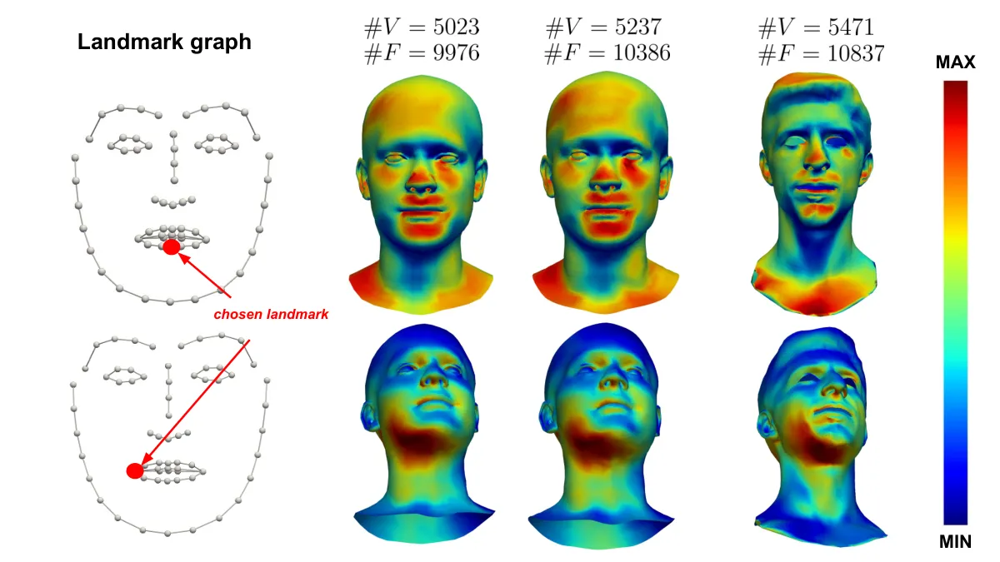

# FreeTalk: Emotional Topology-Free 3D Talking Heads

Federico Nocentini^(∗) Affiliation: Media Integration and Communication
Center (MICC),  
University of Florence, Italy E-mail [federico.nocentini@unifi.it,
stefano.berretti@unifi.it,
claudio.ferrari@unifi.it](mailto:federico.nocentini@unifi.it,%20stefano.berretti@unifi.it,%20claudio.ferrari@unifi.it)
   Thomas Besnier^(∗) Affiliation: University of Copenhagen
E-mail <thomas.besnier@di.ku.dk>    Claudio Ferrari Affiliation: Media
Integration and Communication Center (MICC),  
University of Florence, Italy E-mail [federico.nocentini@unifi.it,
stefano.berretti@unifi.it,
claudio.ferrari@unifi.it](mailto:federico.nocentini@unifi.it,%20stefano.berretti@unifi.it,%20claudio.ferrari@unifi.it)
   Stefano Berretti Affiliation: Media Integration and Communication
Center (MICC),  
University of Florence, Italy E-mail [federico.nocentini@unifi.it,
stefano.berretti@unifi.it,
claudio.ferrari@unifi.it](mailto:federico.nocentini@unifi.it,%20stefano.berretti@unifi.it,%20claudio.ferrari@unifi.it)
   Mohamed Daoudi Affiliation: IMT Nord Europe, Institut Mines-Télécom,
Centre for Digital Systems Affiliation: Univ. Lille, CNRS, Centrale
Lille, Institut Mines-Telecom, UMR 9189 CRIStAL, F-59000 Lille, France
E-mail <mohamed.daoudi@imt-nord-europe.fr> Affiliation: Media
Integration and Communication Center (MICC),  
University of Florence, Italy E-mail [federico.nocentini@unifi.it,
stefano.berretti@unifi.it,
claudio.ferrari@unifi.it](mailto:federico.nocentini@unifi.it,%20stefano.berretti@unifi.it,%20claudio.ferrari@unifi.it)
Affiliation: University of Copenhagen E-mail <thomas.besnier@di.ku.dk>
Affiliation: IMT Nord Europe, Institut Mines-Télécom, Centre for Digital
Systems E-mail <mohamed.daoudi@imt-nord-europe.fr>

###### Abstract

Speech-driven 3D facial animation has advanced rapidly, yet most
approaches remain tied to registered template meshes, preventing
effective deployment on raw 3D scans with arbitrary topology. At the
same time, modeling controllable emotional dynamics beyond lip
articulation remains challenging, and is often tied to template-based
parameterizations. We address these challenges by proposing FreeTalk, a
two-stage framework for _emotion-conditioned_ 3D talking-head animation
that generalizes to _unregistered_ face meshes with arbitrary vertex
count and connectivity. First, Audio-To-Sparse (ATS) predicts a
temporally coherent sequence of 3D landmark displacements from speech
audio, conditioned on an emotion category and intensity. This sparse
representation captures both articulatory and affective motion while
remaining independent of mesh topology. Second, Sparse-To-Mesh (STM)
transfers the predicted landmark motion to a target mesh by combining
intrinsic surface features with landmark-to-vertex conditioning,
producing dense per-vertex deformations without template fitting or
correspondence supervision at test time. Extensive experiments show that
FreeTalk matches specialized baselines when trained in-domain, while
providing substantially improved robustness to unseen identities and
mesh topologies. Code and pre-trained models will be made publicly
available.

###### Keywords: 

3D Talking Heads Topology-agnostic deformation Emotion-conditioned
Landmark-based motion Intrinsic surface learning

^(\*)^(\*)footnotetext: Equal contribution



Figure 1: FreeTalk takes an unregistered static face mesh (in blue on
the left) and an emotional audio speech and predicts a sequence of
deformation fields (in cyan) matching speech-related motions and
expression-related deformations.

## 1 Introduction

Human face animation is a long-standing and challenging task in Computer
Vision, with applications spanning virtual reality, digital humans,
movie production, and video games. In recent years, speech-driven facial
animation has emerged as a key, application-oriented research direction,
aiming to synthesize temporally coherent and visually realistic 3D
facial motion directly from audio signals. Despite significant progress,
learning a robust cross-modal mapping from speech to 3D facial geometry
remains fundamentally ill-posed. Audio alone provides incomplete
information about facial motion: identical phonemes may correspond to
different visual realizations depending on speaker identity,
co-articulation effects, and, crucially, emotional state. Emotional
content introduces complex, coordinated deformations that extend beyond
lip articulation, involving eyebrows, cheeks, and global facial
musculature. Modeling such affective dynamics jointly with speech
remains a challenging problem. An additional and often overlooked
limitation of current methods lies in their dependency on a fixed
arrangement of triangles (number of vertices/faces and face
connectivity) of the input mesh: the mesh topology is predetermined.
Most state-of-the-art approaches operate on registered template meshes
(e.g., FLAME-based \[26\] models), implicitly binding the learned
representation to a specific vertex connectivity. This design choice
simplifies learning but severely limits generalization: newly acquired
3D scans must be fitted to the template before animation can be applied,
introducing computational overhead and reducing practical applicability.
Existing works partially address either emotional expressiveness \[10,
27, 40\] or topology generalization \[33\], but not both simultaneously.
Several approaches incorporate emotion control, either via explicit
emotion labels \[36\] or implicit audio embeddings, yet they operate on
fixed, registered meshes.

In this work, as described in Figure 1, we bridge this gap by proposing
the first framework that jointly models emotionally expressive
speech-driven facial motion and enables animation across arbitrary mesh
topologies without template registration. Our approach is based on a
two-stage architecture that explicitly decouples motion generation from
geometric realization. In the first stage, we train an identity-agnostic
generative model that takes as input speech audio together with emotion
category and intensity labels, and predicts a sequence of 3D landmark
displacements. This intermediate representation captures both
articulatory and affective facial dynamics in a compact,
topology-independent form. In the second stage, we learn a
geometry-aware deformation module that transfers the predicted landmark
motion onto any target 3D face mesh. Given the mesh geometry and the
landmark displacements, the model predicts consistent vertex
deformations, enabling animation of arbitrary topologies without
requiring registration to a template. By explicitly separating
expressive motion synthesis from identity and topology-specific
deformation, our framework achieves both emotional controllability and
topology invariance. This decoupled design not only improves
generalization to unseen identities and meshes, but also removes the
need for costly template fitting procedures, facilitating practical
deployment.

Our contributions are three-fold. First, we introduce Audio-To-Sparse
(ATS), an identity-agnostic generative model designed to produce
emotionally expressive landmark displacement sequences conditioned on
speech, emotion category, and intensity. Building upon this, we propose
Sparse-To-Mesh (STM), a discretization-agnostic deformation module that
transfers these sparse motions to arbitrary 3D face meshes without the
need for fixed connectivity or template registration. Finally, through
qualitative and quantitative evaluation, we support that FreeTalk
successfully combines expressive speech-driven animation with topology
generalization, addressing a significant limitation of prior works.

## 2 Related Work

3D facial animation methods are commonly built by registering raw scans
\[45, 17\] to a predefined template topology \[26, 43, 32, 53, 15, 25\]
and subsequently animating them using 3D morphable models
(3DMMs) \[13\]. While effective, this registration step may smooth fine
geometric details and tightly couples animation to a fixed connectivity.
Several learning-based approaches have proposed latent representations
of raw face scans using point-based encoders such as PointNet \[29, 2,
7, 6, 3, 5, 41\]. For robust surface feature learning, models such as
DiffusionNet \[46\] or PoissonNet \[31\] can be combined with robust
deformation methods such as jacobian fields \[1\]. While promising,
these approaches are general method, not yet specialized for
speech-driven animation.

#### Speech-Driven 3D Facial Animation.

Early facial animation systems relied on procedural rigs and rule-based
viseme blending \[11, 12, 21\], manually mapping phonemes to facial
controls. The availability of large-scale 3D capture enabled data-driven
modeling. Karras *et al*. \[22\] demonstrated high-fidelity
actor-specific reconstruction from dense 3D capture, though without
cross-identity generalization. VOCA \[8\] extended speech-driven
animation to multi-subject settings. Subsequent works adopted stronger
generative architectures. MeshTalk \[44\] introduced categorical
autoregressive latent modeling, while FaceFormer \[14\] leveraged
Transformers \[51\] to capture long-range temporal dependencies and more
recent approaches \[54, 39, 20, 55\] improved the accuracy and lip sync.
Diffusion-based approaches, such as FaceDiffuser \[47\] and
DiffPoseTalk \[48\], reformulated speech-driven animation as a denoising
process. Personalized motion control was explored in Imitator \[50\].
Despite architectural advances, these methods typically assume
registered template meshes and operate on neutral speech datasets such
as VOCASET or custom datasets.

#### Emotionally Expressive Talking Heads.

To model affective dynamics, several works introduced emotion-aware
speech-driven animation. Reconstruction-based pipelines regress
expressive parameters from 2D video using models such as EMOCA \[9\],
generating pseudo-3D expressive supervision \[30\]. Other approaches
inject emotional cues from audio embeddings, as in EmoTalk \[40\], or
target specific expressive behaviors such as laughter in
LaughTalk \[49\]. Datasets such as EMOTE \[10\] and EmoVOCA \[36\]
enabled explicit emotion supervision in 3D space. More recent systems
such as EmoFace \[27\], DEEPTalk \[24\], MEDTalk \[28\], and
MemoryTalker \[23\] explore dynamic emotion control, probabilistic
expressive motion, and personalized stylization. These methods improve
realism but are still bound to registered meshes or predefined rig
spaces.

#### Topology-Agnostic Facial Animation.

To alleviate the fixed mesh topology limitation, intermediate
geometry-aware representations have been explored such as Neural Face
Rigging \[42\] and Neural Face Skinning \[4\] for face motion
retargeting but these approaches are not speech-driven. Building on this
idea, ScanTalk \[33\] introduced the first topology-agnostic framework
for speech-driven 3D talking head animation, learning a
connectivity-independent motion representation transferable to arbitrary
meshes. While successfully removing the fixed-topology constraint,
ScanTalk focuses on neutral speech and does not explicitly model
emotional dynamics. In contrast, FreeTalk jointly addresses affective
modeling and mesh generalization, enabling animation of arbitrary
unregistered face meshes directly from audio while preserving geometric
fidelity and lip synchronization quality in a multi-modal 4D setting.

|                                    |         |          |
| ---------------------------------- | ------- | -------- |
|                                    | Emotion | Any mesh |
| CodeTalker / FaceFormer / SelfTalk | ✗       | ✗        |
| EmoTalk / Emote / Emovoca          | ✓       | ✗        |
| ScanTalk                           | ✗       | ✓        |
| FreeTalk                           | ✓       | ✓        |

Table 1: Comparison of talking head models.

In summary, as shown in Table 1, existing works address either
emotionally expressive speech-driven animation under fixed mesh
topologies, or topology-agnostic animation under neutral conditions. To
the best of our knowledge, no prior method jointly models affective
speech-driven facial motion while generalizing across arbitrary
topologies without template registration. Our work fills this gap by
decoupling emotion-aware motion generation from topology-specific
geometric deformation.

## 3 Proposed Approach: FreeTalk



Figure 2: Overview of the proposed approach. ATS takes the speech audio
signal $`A`$ and generates a sequence of landmarks displacements
$`(\Delta L_{t})_{t=1}^{T}`$. Then, STM takes a static neutral mesh
$`M`$ and maps the sparse motion sequence of landmarks
$`(\Delta L_{t})_{t=1}^{T}`$ to dense vertex motions to predict the
final animated mesh sequence $`(\hat{M}_{t})_{t=1}^{T}`$.

We propose FreeTalk a two-stage framework, as shown in Figure 2, for
speech-driven 3D facial animation that generalizes across _arbitrary_
mesh topologies by explicitly decoupling expressive speech motion
synthesis from geometric realization. Given a target face mesh
$`M=(V,F)`$, where $`V\in\mathbb{R}^{n\times 3}`$ denotes vertex
positions and $`F\in\mathbb{N}^{m\times 3}`$ the mesh connectivity, and
an input speech signal $`A`$ of duration $`T`$, FreeTalk generates a
temporally coherent sequence of deformed meshes
$`(\hat{M}_{t})_{t=1}^{T}`$ without requiring template registration,
fixed vertex ordering, or any constraint on topology. The core idea is
to first generate identity-agnostic facial motion in a sparse,
topology-independent representation, and then transfer this motion onto
the specific target geometry. Concretely, FreeTalk comprises (i) an
Audio-To-Sparse (ATS) module that predicts a sequence of 3D landmark
displacements conditioned on speech, emotion category and emotion
intensity, and (ii) a Sparse-To-Mesh (STM) module that maps the
predicted landmark displacements motion to a dense vertex displacement
field over the target mesh. This decomposition stems from the
observation that the facial musculoskeletal structure induces
neighboring points to move according to consistent motion
patterns \[16\], making it possible to exploit such correlation to learn
a dense motion field from a sparse set of points. This further allows
separating expressive motion generation from mesh-specific deformation
and animate arbitrary face meshes while preserving geometric
consistency. This strategy has been explored in previous works for 4D
face animation yet on fixed topology meshes \[37, 35, 38\]. We here
generalize it to work on arbitrary mesh structures.

### 3.1 ATS: Audio-To-Sparse

The goal of the Audio-To-Sparse (ATS) module is to generate a temporally
coherent 3D facial motion sequence directly from speech. Rather than
predicting dense geometry, ATS operates in a sparse landmark space,
which provides a compact yet expressive representation of facial
dynamics and serves as an intermediate abstraction between audio and
full mesh animation. Let $`T`$ represent the total number of animation
frames corresponding to the input speech signal. For each frame
$`t\in\{1,\dots,T\}`$, the facial configuration is represented by
$`N=68`$ landmarks $`L_{t}\in\mathbb{R}^{N\times 3}`$, which capture
semantically meaningful facial keypoints (e.g., lips, jaw, eyebrows).
These landmarks provide sufficient geometric structure to capture
articulation and expression while remaining lightweight. Then, to
decouple identity from motion, we assume a subject-specific neutral
template with $`L^{\mathrm{tpl}}\in\mathbb{R}^{N\times 3}`$ and
represent facial motions as a curve, parametrized by $`t`$ in a space of
landmark displacements:

```math
\Delta L_{t}=L_{t}-L^{\mathrm{tpl}}. \tag{1}
```

This formulation allows the network to focus on motion dynamics while
preserving the identity. By stacking the landmark displacements into a
vector of shape $`D=3\times N`$ the complete motion sequence can be
compactly written as:

```math
x_{0}=(\Delta L_{t})_{t=1}^{T}\in\mathbb{R}^{T\times D}. \tag{2}
```

ATS is therefore formulated as learning a conditional generative mapping

```math
\mathrm{ATS}:(A,e,i)\longmapsto x_{0}, \tag{3}
```

where $`e`$ and $`i`$ denote discrete emotion category and intensity
label, respectively. This explicit conditioning enables controllable
affect synthesis while maintaining speech-driven articulation.

#### Audio representation.

To extract high-level speech features, we use a pretrained HuBERT
encoder \[19\]. Given a speech signal $`A`$, the encoder produces
contextualized token-level representations
$`H=\mathrm{HuBERT}(A)\in\mathbb{R}^{S\times C}(C=768)`$, where $`S`$
depends on the internal temporal resolution of the encoder. These
features are then resampled to match the landmark timeline, yielding
$`\tilde{H}\in\mathbb{R}^{T\times C}`$. The sequence $`\tilde{H}`$
provides one speech embedding per animation frame and encodes phonetic
content, and longer-range temporal context. This representation serves
as the conditioning memory for motion generation.

#### Conditional diffusion model.

We model the conditional distribution $`p(x_{0}\mid A,e,i)`$ using a
denoising diffusion probabilistic model \[18\] defined over full motion
trajectories. Diffusion models are particularly suited to this setting
as they allow stable training on high-dimensional structured outputs and
naturally capture multi-modal distributions. Let
$`\{\beta_{\ell}\}_{\ell=1}^{T_{d}}`$ be a linear noise schedule with
$`T_{d}`$ diffusion steps. Define $`\alpha_{\ell}=1-\beta_{\ell}`$ and
$`\bar{\alpha}_{\ell}=\prod_{j=1}^{\ell}\alpha_{j}`$. The forward
diffusion process gradually corrupts the clean sequence $`x_{0}`$ to
generate the noisy sequence $`x_{\ell}`$ as:

```math
q(x_{\ell}\mid x_{0})=\mathcal{N}\!\left(x_{\ell};\sqrt{\bar{\alpha}_{\ell}}\,x_{0},(1-\bar{\alpha}_{\ell})\mathbf{I}\right), \tag{4}
```

which can be sampled in closed form as:

```math
x_{\ell}=\sqrt{\bar{\alpha}_{\ell}}\,x_{0}+\sqrt{1-\bar{\alpha}_{\ell}}\,\epsilon,\qquad\epsilon\sim\mathcal{N}(0,\mathbf{I}). \tag{5}
```

A conditional denoiser $`f_{\theta}`$ is trained to reconstruct
$`\hat{x}_{0}=f_{\theta}(x_{\ell},\ell,A,e,i)`$, where $`\ell`$ is
sampled uniformly during training and $`\hat{x}_{0}`$ is the predicted
landmarks displacements sequence. Intuitively, the network is asked to
reconstruct the clean motion sequence from progressively noisier
versions while being guided by speech and affect cues. This formulation
enables the model to learn a rich mapping from audio dynamics to facial
motion trajectories.

#### Transformer-based conditional denoiser.

The denoiser $`f_{\theta}`$ is implemented as a Transformer decoder
operating on the noisy landmark sequence with cross-attention to audio
features. The noisy displacement sequence
$`x_{\ell}\in\mathbb{R}^{T\times D}`$ and the audio
$`\tilde{H}\in\mathbb{R}^{T\times C}`$ features are projected to the
model dimension $`d`$ and augmented with learned positional embeddings:

```math
X_{\ell}=W_{x}x_{\ell}+P_{\mathrm{tgt}}\in\mathbb{R}^{T\times d},\qquad\hat{A}=W_{h}\tilde{H}+P_{\mathrm{mem}}\in\mathbb{R}^{T\times d}. \tag{6}
```

Here $`W_{h}`$ and $`W_{x}`$ are learned linear projections and
$`P_{\mathrm{mem}}`$ and $`P_{\mathrm{tgt}}`$ denote learned positional
encodings. Conditioning information $`X_{\ell}`$ is injected into the
target tokens through (i) a sinusoidal embedding of the diffusion
timestep $`\ell`$ followed by a Multi-Layer Perceptron (MLP)
$`g_{t}(\ell)`$, and (ii) an affect embedding $`g_{c}(e,i)`$. The
resulting decoder input tokens are given by
$`Z=X_{\ell}+g_{t}(\ell)+g_{c}(e,i)`$. Each decoder layer first applies
multi-head self-attention $`Z^{\prime}=\mathrm{SelfAttn}(Z)`$ allowing
temporal interactions across landmark tokens. Then, cross-attention is
performed between the updated landmark tokens $`Z^{\prime}`$ and the
audio memory $`\hat{A}`$. Denoting by $`Q`$, $`K`$, and $`V`$ the
projected queries, keys, and values, we have:

```math
Q=Z^{\prime}W_{Q},\qquad K=\hat{A}W_{K},\qquad V=\hat{A}W_{V}. \tag{7}
```

The cross-attention update is then given by:

```math
\mathrm{Attn}(Z^{\prime},\hat{A})=\mathrm{softmax}\!\left(\frac{QK^{\top}}{\sqrt{d}}\right)V. \tag{8}
```

Through this hierarchical attention mechanism, the model first refines
the noisy landmark trajectory via global temporal interactions and then
aligns it with the speech representations. This design enables the
denoiser to jointly capture intrinsic facial motion coherence and
audio-conditioned articulatory and affective dynamics at each diffusion
step.

#### Monotonic cross-attention constraint.

To further emphasize temporally consistent behavior, we introduce a
band-diagonal constraint on the cross-attention weights. Specifically,
attention from frame $`i`$ to audio token $`j`$ is allowed only within a
fixed radius $`r`$:

```math
B_{ij}=\begin{cases}0&\text{if }|j-i|\leq r,\\
1&\text{otherwise}.\end{cases} \tag{9}
```

The masked cross-attention then becomes:

```math
\mathrm{Attn}_{\mathrm{mono}}(Z^{\prime},\hat{A})=\mathrm{softmax}\!\left(\frac{QK^{\top}}{\sqrt{d}}+B\right)V. \tag{10}
```

This inductive bias promotes an approximately-monotonic correspondence
between audio progression and facial motion yet allowing contextual
interaction.

#### Prediction head.

Let $`Z_{\mathrm{out}}\in\mathbb{R}^{T\times d}`$ be the output tokens
of the final Transformer decoder layer. We map them back to the
landmarks displacement space with a linear projection:

```math
\hat{x}_{0}=Z_{\mathrm{out}}W_{o}+b_{o},\qquad W_{o}\in\mathbb{R}^{d\times D},\;b_{o}\in\mathbb{R}^{D}. \tag{11}
```

Reshaping each frame $`\hat{x}_{0,t}\in\mathbb{R}^{D}`$ into
$`\mathbb{R}^{N\times 3}`$ yields the predicted landmark displacements
$`(\hat{\Delta L}_{t})_{t=1}^{T}`$.

#### Sampling and output representation.

At inference time, motion sequences are generated by simulating the
learned reverse diffusion process conditioned on speech and affect.
Starting from Gaussian noise $`x_{T_{d}}\sim\mathcal{N}(0,\mathbf{I})`$,
we iteratively apply the conditional denoiser $`f_{\theta}`$ using a
DDIM sampler over $`N`$ reverse steps. At each step
$`\ell\rightarrow\ell-1`$, the model predicts an estimate of the clean
displacement sequence $`\hat{x}_{0}=f_{\theta}(x_{\ell},\ell,A,e,i)`$,
which is used to update the latent trajectory according to the
deterministic DDIM dynamics. After the final reverse step, we obtain the
predicted displacement sequence
$`\hat{x}_{0}\in\mathbb{R}^{T\times D}`$. Each frame
$`\hat{x}_{0,t}\in\mathbb{R}^{D}`$ is reshaped into
$`\hat{\Delta L}_{t}\in\mathbb{R}^{N\times 3}`$, yielding the landmark
displacement trajectory $`(\hat{\Delta L}_{t})_{t=1}^{T}`$. This
sequence represents frame-wise landmark displacements relative to the
neutral template and constitutes the output of the ATS module. ATS is
the first stage of our multi-module pipeline: the predicted displacement
sequence $`\hat{x}_{0}`$ is then fed into the subsequent module, which
is explicitly trained to operate in the displacement space. Working with
this representation preserves identity–motion disentanglement, since the
neutral template $`L^{\mathrm{tpl}}`$ remains factored out and static
across the sequence.

### 3.2 STM: Sparse-To-Mesh

The Sparse-To-Mesh module converts the topology and identity-independent
landmark motion predicted by ATS into a sequence of dense per-vertex
deformation fields. STM takes a static mesh $`M=(V,F)`$ in neutral state
with vertices $`V\in\mathbb{R}^{n\times 3}`$ and faces $`F`$, and a
sequence of predicted landmark displacements
$`(\Delta\hat{L}_{t})_{t=1}^{T}`$ (from ATS) where
$`\Delta\hat{L}_{t}\in\mathbb{R}^{N\times 3}`$. For each time step
$`t`$, STM predicts a sequence of vertex displacement fields
$`(\Delta V_{t})_{t=1}^{T}`$ with
$`\Delta V_{t}\in\mathbb{R}^{n\times 3}`$ on $`M`$. The deformed mesh at
frame $`t`$ is then obtained as $`\hat{M}_{t}=(\hat{V}_{t},F)`$ where
$`\hat{V}_{t}=V+\Delta V_{t}`$.

Figure 3: Overview of the Sparse-To-Mesh (STM) module. STM predicts
vertex-wise features on a static mesh $`M`$, and landmark features from
displacement vectors $`L`$. The mesh features are enhanced by a
learnable mapping that injects a global embedding of the landmark
displacements into each vertex via cross-attention.

A key requirement is that STM must generalize across arbitrary mesh
triangulations, without relying on prior registration. This motivates
the use of intrinsic, discretization-agnostic surface learning for mesh
features. As illustrated in Figure 3, STM consists of four stages.
First, static mesh features are extracted once from the input neutral
mesh and shared across all time steps. Second, for each frame, sparse
landmark motion features are computed from the predicted displacement
vectors. Third, a learned soft correspondence mechanism injects motion
information into the mesh representation by combining cross-attention
between landmark and mesh features with a global displacement embedding
that is broadcast to all vertices. Finally, the fused per-vertex
features are decoded into dense vertex displacement fields, producing
frame-wise mesh deformations.

#### Static mesh feature extractor (dense).

We first compute vertex-wise features on the static input mesh $`M`$
using a mesh encoder $`E_{M}`$. For each vertex $`i`$, the encoder
predicts a feature vector $`f_{i}\in\mathbb{R}^{d}`$ so that
$`E_{M}(M)=(f_{i})_{i=1}^{n}`$. To make the model robust to remeshing
and changes in discretization, we use DiffusionNet \[46\], which is
intrinsic to the mesh geometry. The encoder takes as input vertex
coordinates and associated normal vectors. Since the input mesh is
static, the dense feature field is computed once and reused for all
frames.

#### Landmark motion encoder (sparse).

For each frame $`t`$, the landmark displacement set
$`\Delta\hat{L}_{t}\in\mathbb{R}^{N\times 3}`$ is processed in two
complementary ways. First, all landmark displacements are stacked into a
single global motion vector $`\Delta\hat{L}_{t}\in\mathbb{R}^{D}`$,
which is later replicated across all vertices and provides global motion
context. Second, we compute landmark-wise features using a lightweight
Graph Convolutional Network (GCN) defined on the fixed landmark graph
$`G_{L}=(\mathcal{N}_{L},\mathcal{E}_{L})`$. For each landmark $`j`$,
the GCN predicts $`l_{t,j}=\mathrm{GCN}(\Delta\hat{L}_{t})_{j}`$.

Because two landmarks may exhibit similar displacements within the same
frame, we augment the landmark features with a positional encoding based
on its index as $`p_{j}=\mathrm{PE}(j)`$. The final frame-dependent
landmark feature is then:

```math
\tilde{l}_{t,j}=\phi\!\left([\,l_{t,j}\,\|\,p_{j}\,]\right), \tag{12}
```

where $`\phi`$ is a learnable projection and $`\|`$ denotes feature
concatenation.

#### Landmark to mesh cross attention.

These features are mapped to the shape of the mesh features with a
learned cross attention layer between the landmark features and the mesh
features. For each vertex $`i`$, we define a query from its mesh feature
$`f_{i}`$ and keys and values from landmark features so that:

```math
q_{i}=W_{Q}f_{i},\qquad k_{t,j}=W_{K}\tilde{l}_{t,j},\qquad v_{t,j}=W_{V}\tilde{l}_{t,j}. \tag{13}
```

Attention weights and landmark-conditioned features at vertex $`i`$ are
given by:

```math
\alpha_{t,i,j}=\text{softmax}_{j}\left(\frac{q_{i}^{T}k_{t,j}}{\sqrt{d_{c}}}\right),\qquad c_{t,i}=\sum_{j=1}^{N}\alpha_{t,i,j}v_{t,j}, \tag{14}
```

where $`d_{c}`$ is the common attention dimension. We then form the
fused vertex feature to augment the mesh feature field to obtain a new
frame-dependent feature field $`(\tilde{f}_{t,i})`$ such that
$`\tilde{f}_{t,i}=(f_{i},g_{t},c_{t,i})`$.

#### Deformation decoding.

We employ a DiffusionNet-based decoder (DN) to regress the dense
deformation field. Let
$`\tilde{F}_{t}=(\tilde{f}_{t,i})_{i=1}^{n}\in\mathbb{R}^{n\times(d+D+d_{c})}`$
be the augmented feature field. While the augmented features
$`\tilde{f}_{t,i}`$ already encode landmark-conditioned information, a
purely local MLP would treat each vertex independently and ignore
intrinsic geometric relations across the surface. To better exploit the
mesh structure and ensure smooth, geometrically consistent deformations,
we leverage an intrinsic surface network as a deformation decoder.
Formally, we define a DiffusionNet decoder mapping the time dependent
feature field to time dependent displacement fields as
$`D_{\mathrm{DN}}(M,\tilde{F}_{t})=\Delta V_{t}\in\mathbb{R}^{n\times 3}`$.

By operating intrinsically on the mesh, the DN decoder propagates
information across neighboring vertices, leading to smoother and
topology-aware deformation fields. The predicted mesh at frame $`t`$ is
then given by $`\hat{M}_{t}=(\hat{V}_{t},F)`$, where
$`\hat{V}_{t}=V+\Delta V_{t}`$. Finally, for each forward pass, STM
iterates over all frames of the predicted landmark sequence
$`STM(M,(\Delta\hat{L}_{t})_{t=1}^{T})=(\hat{M}_{t})_{t=1}^{T}`$.

### 3.3 Training Strategy

Although ATS and STM operate in different representation spaces
(landmark displacements and vertex displacements, respectively), both
modules are trained using the same motion supervision principle. Let
$`Y_{t}\in\mathbb{R}^{K\times 3}`$ denote a generic motion
representation at frame $`t`$, where $`K=N`$ landmarks for ATS and
$`K=n`$ mesh vertices for STM. Let $`\hat{Y}_{t}`$ be the corresponding
prediction. We define a unified motion loss:

```math
\resizebox{22609920}{}{$\mathcal{L}_{\mathrm{motion}}=\underbrace{\frac{1}{TK}\sum_{t=1}^{T}\|Y_{t}-\hat{Y}_{t}\|_{2}^{2}}_{\mathcal{L}_{\mathrm{pos}}}+\lambda_{v}\underbrace{\frac{1}{(T-1)K}\sum_{t=1}^{T-1}\|v(Y_{t})-v(\hat{Y}_{t})\|_{2}^{2}}_{\mathcal{L}_{\mathrm{vel}}}+\lambda_{a}\underbrace{\frac{1}{(T-2)K}\sum_{t=1}^{T-2}\|a(Y_{t})-a(\hat{Y}_{t})\|_{2}^{2}}_{\mathcal{L}_{\mathrm{acc}}}$}. \tag{15}
```

Here, the first- and second-order temporal differences are defined as:

```math
v(Y_{t})=Y_{t+1}-Y_{t},\qquad a(Y_{t})=Y_{t+2}-2Y_{t+1}+Y_{t}. \tag{16}
```

This formulation is instantiated for ATS, where $`Y_{t}=\Delta L_{t}`$
corresponds to landmark displacements, and for STM, where
$`Y_{t}=\Delta V_{t}`$ corresponds to dense vertex displacements.
Despite sharing the same loss, the two modules are trained
independently.This decoupling reduces computational cost (STM training
does not require backpropagation through ATS diffusion sampling) and
enables precomputation of static mesh features. Furthermore, modular
training provides finer control: ATS can be adapted to new
speech-emotion datasets independently of mesh topology, while STM can be
optimized for new mesh families without modifying the motion generator.
At inference time, the landmark motion predicted by ATS is fed to STM to
obtain the final animated mesh sequence $`(\hat{M}_{t})_{t=1}^{T}`$.

## 4 Experiments

In this section, we describe the experimental protocol adopted to
evaluate our method against state-of-the-art approaches. First, we
introduce the datasets and evaluation metrics in Section 4.1, then
present the quantitative and qualitative results in Section 4.2. More
results are reported in the supplementary material.

### 4.1 Datasets and Metrics

We train and evaluate our framework on multiple datasets to assess its
robustness and generalization capabilities. Thanks to the modular design
of our approach, the two stages of the model can be trained
independently, enabling the use of different datasets for each
component. This flexibility allows our framework to generalize across
identities, topologies, and emotional settings. In our experiments, we
used the following datasets:

_1_ EmoVOCA \[36\] provides speech-driven 3D facial sequences with
emotional expressions paired with neutral (non-expressive) audio
signals. The dataset spans 11 emotional categories: afraid, ashamed,
angry, disgust, happy, sad, drunk, ill, suspicious, pleased, and upset.
In total, it contains 15.840 registered 3D mesh sequences. The dataset
is split into training, validation, and test sets using 8 identities for
training and 2 identities each for validation and testing. All meshes
are in FLAME \[26\] topology, consisting of 5,023 vertices and 9,976
faces.

_2_ MEAD-EMOTE \[10\], provides 3D facial reconstructions derived from
the MEAD dataset \[52\]. It includes seven emotional categories (fear,
anger, disgust, happiness, surprise, sadness, and contempt) recorded at
three intensity levels, in addition to a neutral expression. The dataset
contains 31,013 sequences from 47 actors, which are split into 36 for
training, 5 for validation, and 6 for testing. All meshes are in
FLAME \[26\] topology.

_3_ VOCAset \[8\] contains mesh sequences of 12 actors performing 40
speeches at 60 fps in a neutral state. Sequences last between 3 and 5
seconds. All meshes are in FLAME \[26\] topology.

_4_ BIWI \[15\] includes 14 subjects articulating 40 sentences each,
recorded at 25 fps in a neutral state. Each sentence lasts approximately
5 seconds, and all meshes share a fixed topology. Due to GPU memory
constraints, we use a downsampled version denoted as BIWI₆, which
contains 3,895 vertices and 7,539 faces.

_5_ Multiface \[53\] consists of 13 identities performing up to 50
speech sequences of approximately 4 seconds each, sampled at 30 fps in a
neutral state. The meshes have a fixed topology with 5,471 vertices and
10,837 faces.

For EmoVOCA, MEAD-EMOTE, and VOCAset, landmark correspondences are
directly available thanks to the shared FLAME \[26\] topology. Since all
meshes are registered to the same template, vertex-level correspondence
across identities and sequences is inherently guaranteed, allowing us to
consistently extract 3D landmarks from fixed vertex indices. In
contrast, BIWI and Multiface do not follow the FLAME topology.
Therefore, for these datasets, we manually selected a set of
semantically consistent landmarks on the corresponding mesh templates to
ensure comparable landmark supervision across datasets.

Metrics: Following prior work \[47, 34, 40\], we use the following
metrics:

- •
  LVE (Lip Vertex Error): Maximum $`L_{2}`$ error computed over vertices
  in the mouth region, capturing speech- and emotion-related lip
  dynamics.
- •
  MVE (Max Vertex Error): Maximum $`L_{2}`$ distance between predicted
  and ground-truth mesh vertices, serving as a global reconstruction
  metric.
- •
  FDD (Upper-Face Dynamic Deviation): Measures the discrepancy between
  the standard deviation of upper-face vertices in the generated
  sequence and the ground truth.
- •
  DTW (Dynamic Time Warping): Evaluates similarity between predicted and
  ground-truth lip vertex trajectories while allowing non-linear
  temporal alignment.
- •
  DFD (Discrete Fréchet Distance): Measures similarity between lip
  vertex trajectories while preserving temporal ordering.
- •
  $`\boldsymbol{\delta_{M}}`$ (Mean Squared Displacement Error):
  Computes the error magnitude between displacement vectors of
  consecutive frames.
- •
  $`\boldsymbol{\delta_{Cd}}`$ (Cosine Displacement Error): Computes
  cosine distance between displacement vectors of consecutive frames,
  catching directional consistency.

### 4.2 Experimental Results

We evaluate FreeTalk against state-of-the-art speech-driven 3D facial
animation methods. Our primary objective is not to optimize performance
for a single benchmark, but rather to demonstrate that FreeTalk achieves
competitive accuracy while offering substantially improved
generalization across identities, mesh topologies, and emotional
settings. Thanks to its modular design, the two components of FreeTalk
(ATS and STM) can be trained independently and even on different
datasets. This flexibility allows the model to leverage heterogeneous
supervision signals and adapt to datasets with different
characteristics. Importantly, our framework does not require predefined
landmark correspondences: when such annotations are unavailable,
manually selected landmarks (as done for BIWI₆ and Multiface) are
sufficient to obtain strong performance.

|                                |                   |                   |                   |                   |                   |                              |                               |
| ------------------------------ | ----------------- | ----------------- | ----------------- | ----------------- | ----------------- | ---------------------------- | ----------------------------- |
|                                | LVE$`\downarrow`$ | MVE$`\downarrow`$ | FDD$`\downarrow`$ | DTW$`\downarrow`$ | DFD$`\downarrow`$ | $`\delta_{M}`$$`\downarrow`$ | $`\delta_{Cd}`$$`\downarrow`$ |
| Faceformer _(2)_               | 12.7              | 1.87              | 14.4              | 3.41              | 13.3              | 3.11                         | 0.98                          |
| EmoFace _(2)_                  | 12.8              | 1.85              | 14.9              | 3.46              | 13.3              | 3.10                         | 0.99                          |
| FreeTalk _(1,2,4,5 + 1,2,4,5)_ | 16.4              | 2.29              | 3.35              | 2.65              | 11.4              | 4.61                         | 0.83                          |
| FreeTalk _(1,2,4,5 + 2)_       | 16.6              | 2.31              | 3.52              | 2.65              | 11.4              | 4.60                         | 0.83                          |
| FreeTalk _(2 + 1,2,4,5)_       | 13.7              | 2.27              | 4.93              | 2.61              | 11.1              | 3.23                         | 0.82                          |
| FreeTalk _(2 + 2)_             | 13.8              | 2.27              | 5.12              | 2.60              | 11.0              | 3.25                         | 0.81                          |

Table 2: Quantitative comparison on the MEAD-EMOTE test set. We compare
FreeTalk with state-of-the-art speech-driven 3D facial animation methods
trained on MEAD-EMOTE. Lower values indicate better performance.
Numbered settings follow the dataset order defined in Sec. 4.1: _(1)_
EmoVOCA, _(2)_ MEAD-EMOTE, _(3)_ VOCAset, _(4)_ BIWI₆, _(5)_ Multiface.
For FreeTalk, “_(a,b + c,d)_” denotes that ATS is trained on the
datasets before “+” and STM on those after it.

Table 2 reports quantitative results on the MEAD-EMOTE test set,
comparing multiple training configurations of FreeTalk with
state-of-the-art methods trained exclusively on MEAD-EMOTE. When both
ATS and STM are trained solely on MEAD-EMOTE, FreeTalk achieves its best
performance on this benchmark, reaching results comparable to
specialized methods. Notably, even when trained on heterogeneous
datasets, FreeTalk maintains competitive accuracy while gaining improved
robustness to unseen identities and mesh topologies. Figure 4 provides a
qualitative comparison on two example sentences. Although some metrics
in Table 2 slightly favor competing methods, the visual results show
that FreeTalk produces more expressive and coherent emotional dynamics,
while preserving accurate speech-related mouth movements. In particular,
FreeTalk achieves the best performance in terms of FDD, a metric that
evaluates upper-face dynamics, suggesting that our model generates more
expressive facial movements compared to existing methods.



Figure 4: Qualitative comparison on the MEAD-EMOTE test set. Each panel
shows a sequence of rendered frames for a single identity. Left:
Disgust; right: Happy. Numbered settings follow the definition in
Table 2.

To demonstrate the generalization ability of FreeTalk, Figure 5 presents
animations of identities unseen during training. The results highlight
FreeTalk capability to generate expressive and coherent facial dynamics
even on previously unseen mesh topologies, including highly challenging
cases such as non-human or stylized characters where the general face
structure is significantly different with respect to standard faces.

Figure 5: Results on unseen topologies.

In Table 3, we evaluate both the performance and the generalization
capability of FreeTalk. We compare several training variants of our
model, obtained by using different combinations of datasets, against
state-of-the-art methods on neutral (non-expressive) talking head
benchmarks. The purpose of this analysis is not merely to surpass
specialized methods, but to demonstrate that FreeTalk can achieve
comparable performance while offering greater flexibility and
cross-dataset robustness, thanks to the use of 3D landmarks as an
intermediate representation. We study multiple configurations in which
both submodules, ATS and STM, are trained on expressive, unexpressive,
or mixed datasets. When training on unexpressive datasets, we set the
emotion label to _neutral_ and the intensity to 1 to ensure consistency.

As expected, models trained exclusively on expressive data exhibit
slightly degraded performance when evaluated on unexpressive test sets,
since they learn facial dynamics that are not present in neutral
sequences. In contrast, when FreeTalk is trained on unexpressive
datasets, it achieves performance comparable to state-of-the-art methods
specifically designed for neutral talking-head benchmarks. Notably,
although FreeTalk is trained only in multi-dataset settings, it remains
competitive with methods trained on a single dataset as well as with
ScanTalk \[33\], which is evaluated in both single- and multi-dataset
regimes. This suggests that the landmark-based intermediate
representation enables the model to effectively integrate heterogeneous
training data without sacrificing animation fidelity. Furthermore, the
modular training of ATS and STM allows the framework to leverage
different datasets with varying characteristics, improving robustness
across identities, mesh topologies, and recording conditions. These
results indicate that FreeTalk preserves animation quality across
heterogeneous training conditions while additionally enabling
controllable emotional dynamics in the generated meshes.

|                                |                   |                   |                   |                   |                   |                          |                           |                   |                   |                   |                   |                   |                          |                           |                   |                   |                   |                   |                   |                          |                           |
| ------------------------------ | ----------------- | ----------------- | ----------------- | ----------------- | ----------------- | ------------------------ | ------------------------- | ----------------- | ----------------- | ----------------- | ----------------- | ----------------- | ------------------------ | ------------------------- | ----------------- | ----------------- | ----------------- | ----------------- | ----------------- | ------------------------ | ------------------------- |
|                                | VOCAset           |                   |                   |                   |                   |                          |                           | BIWI₆             |                   |                   |                   |                   |                          |                           | Multiface         |                   |                   |                   |                   |                          |                           |
|                                | LVE$`\downarrow`$ | MVE$`\downarrow`$ | FDD$`\downarrow`$ | DTW$`\downarrow`$ | DFD$`\downarrow`$ | $`\delta_{M}\downarrow`$ | $`\delta_{Cd}\downarrow`$ | LVE$`\downarrow`$ | MVE$`\downarrow`$ | FDD$`\downarrow`$ | DTW$`\downarrow`$ | DFD$`\downarrow`$ | $`\delta_{M}\downarrow`$ | $`\delta_{Cd}\downarrow`$ | LVE$`\downarrow`$ | MVE$`\downarrow`$ | FDD$`\downarrow`$ | DTW$`\downarrow`$ | DFD$`\downarrow`$ | $`\delta_{M}\downarrow`$ | $`\delta_{Cd}\downarrow`$ |
| VOCA _(sd)_                    | 6.99              | 0.98              | 2.66              | 1.77              | 7.41              | 1.39                     | 1.02                      | 5.74              | 2.59              | 41.5              | 1.60              | 7.89              | 1.47                     | 0.67                      | 4.92              | 2.76              | 55.78             | 1.56              | 6.51              | 0.86                     | 1.23                      |
| FaceFormer _(sd)_              | 6.12              | 0.93              | 2.16              | 1.33              | 5.39              | 0.86                     | 0.58                      | 4.08              | 2.16              | 37.1              | 1.56              | 6.61              | 0.87                     | 0.55                      | 2.45              | 1.45              | 20.2              | 0.87              | 4.13              | 0.22                     | 0.73                      |
| FaceDiffuser _(sd)_            | 4.35              | 0.90              | 2.43              | 1.73              | 6.83              | 0.81                     | 0.60                      | 4.02              | 2.12              | 39.6              | 1.55              | 6.50              | 0.85                     | 0.56                      | 3.55              | 2.39              | 29.1              | 1.45              | 5.24              | 0.28                     | 0.77                      |
| CodeTalker _(sd)_              | 3.55              | 0.89              | 2.26              | 1.33              | 5.66              | 0.80                     | 0.55                      | 5.19              | 2.64              | 20.6              | 1.50              | 6.61              | 0.91                     | 0.59                      | 4.09              | 2.38              | 47.9              | 1.44              | 5.95              | 0.55                     | 0.96                      |
| SelfTalk _(sd)_                | 5.61              | 0.91              | 2.32              | 1.25              | 5.43              | 0.72                     | 0.56                      | 3.63              | 2.06              | 35.5              | 1.60              | 6.93              | 1.03                     | 0.66                      | 2.28              | 1.90              | 37.4              | 0.96              | 4.18              | 0.25                     | 0.75                      |
| ScanTalk _(sd)_                | 3.01              | 0.86              | 2.40              | 1.20              | 5.25              | 0.73                     | 0.55                      | 4.65              | 2.14              | 36.0              | 1.56              | 7.22              | 1.05                     | 0.63                      | 2.65              | 1.87              | 64.4              | 0.96              | 4.27              | 0.57                     | 0.93                      |
| ScanTalk _(3,4,5)_             | 7.05              | 1.07              | 1.29              | 1.19              | 5.25              | 0.72                     | 0.52                      | 4.44              | 2.09              | 36.6              | 1.46              | 6.71              | 1.01                     | 0.61                      | 2.37              | 1.71              | 16.0              | 0.93              | 4.71              | 0.33                     | 0.74                      |
| FreeTalk _(1,2,4,5 + 1,2,4,5)_ | 4.28              | 0.99              | 1.38              | 1.87              | 5.87              | 0.39                     | 0.73                      | 6.10              | 2.45              | 40.3              | 1.55              | 6.84              | 1.82                     | 0.76                      | 10.7              | 2.39              | 5.34              | 1.81              | 6.89              | 0.71                     | 0.90                      |
| FreeTalk _(1,2,4,5 + 3,4,5)_   | 4.01              | 1.01              | 1.67              | 1.73              | 5.69              | 0.36                     | 0.74                      | 5.58              | 2.37              | 30.8              | 1.56              | 7.14              | 1.76                     | 0.75                      | 7.89              | 2.31              | 4.01              | 1.58              | 6.35              | 0.65                     | 0.89                      |
| FreeTalk _(3,4,5 + 1,2,4,5)_   | 3.12              | 0.94              | 1.56              | 1.61              | 5.08              | 0.33                     | 0.67                      | 4.72              | 2.20              | 36.0              | 1.52              | 6.54              | 1.13                     | 0.63                      | 3.90              | 1.95              | 16.4              | 1.19              | 5.36              | 0.44                     | 0.77                      |
| FreeTalk _(3,4,5 + 3,4,5)_     | 3.05              | 0.95              | 1.85              | 1.60              | 5.16              | 0.31                     | 0.69                      | 4.44              | 2.17              | 30.0              | 1.53              | 6.87              | 1.11                     | 0.63                      | 3.19              | 1.92              | 14.3              | 1.14              | 5.29              | 0.46                     | 0.76                      |

Table 3: Cross-dataset generalization results on neutral speech
datasets. Lower values indicate better performance. _(sd)_ denotes
single-dataset training. Numbered settings follow the definition in
Table 2.

## 5 Conclusions

We presented FreeTalk, a two-stage framework for emotionally expressive,
speech-driven 3D facial animation that generalizes across _arbitrary_
mesh topologies without template registration. FreeTalk first
synthesizes emotion-conditioned facial motion as landmark displacement
sequences via ATS, and then transfers this sparse motion to dense mesh
deformations on any target geometry via STM using intrinsic surface
learning. Experiments demonstrate that our approach achieves competitive
accuracy with state-of-the-art methods on expressive benchmarks while
substantially improving generalization across unseen mesh topologies and
even non-human or stylized faces, inaccessible to template-based
methods.

Still, FreeTalk exhibits limitations. First, ATS treats emotions as a
discrete categorical label (with intensity), while a continuous latent
emotion space could enable finer-grained stylization. Second, STM uses
DiffusionNet, requiring to solve the eigenvalue problem of the
Laplace-Beltrami operator. This operation can be costly for large
meshes. PoissonNet \[31\] addresses this issue but showed slightly worse
accuracy (see ablation in the supp. material). Additionally, the
Laplace-Beltrami operator is intrinsic to the mesh and can lose
robustness when large tears and holes are present.

## Acknowledgments

This work is supported by the [CNRS Int. Research Project
GeoGen3DHuman](https://geogen3dhuman.univ-lille.fr). This work was also
partially supported by “Partenariato FAIR (Future Artificial
Intelligence Research) - PE00000013, CUP J33C22002830006" funded by
NextGenerationEU through the italian MUR within NRRP, project DL-MIG.
This work was also partially funded by the ministerial decree n.352 of
the 9th April 2022 NextGenerationEU through the italian MUR within NRRP.
This work was also partially supported by the project 4DSHAPE
ANR-24-CE23-5907 of the French National Research Agency (ANR), and by
Fédération de Recherche Mathématique des Hauts-de-France (FMHF, FR2037
du CNRS). This work was also partially supported by the AI4Debunk
project (HORIZON-CL4-2023-HUMAN-01-CNECT grant n.101135757).

Supplementary Material

Federico Nocentini^(∗)Thomas Besnier^(∗) Claudio Ferrari Stefano
Berretti Mohamed Daoudi

## 6 Ethical statement

FreeTalk is thought as beneficial for applications in virtual reality,
digital human modeling and accessibility tools. However, as for any
technology capable of synthesizing realistic face motions, we
acknowledge the risk of potential misuse. In particular, we strongly
condemn impersonation, deceptive synthetic media or any application that
animates the representation of any individual without their informed and
explicit consent. While FreeTalk operates on 3D meshes, it requires a 3D
scan of a target individual as input, which raises the practical barrier
for malicious usage compared to 2D videos but the risk is still
present.  
Regarding data, all experiments rely on publicly available datasets
collected under institutional oversight with participant consent; no new
human subject data was collected, and no personally identifiable
information beyond what is present in the original published datasets is
used or disclosed.  
After the reviewing process, we commit to releasing code and pretrained
weights under a license that explicitly prohibits non-consensual
animation of real individuals.

## 7 Implementation details

#### Hardware.

All experiments were conducted on a workstation equipped with a single
NVIDIA GeForce RTX 5090 GPU with 32 GB of VRAM. Training was performed
using mixed precision to improve computational efficiency.

#### Hyperparameters.

FreeTalk is composed of two modules trained independently: an
audio-to-landmark generator and a landmark-to-mesh densifier (STM). The
audio-to-landmark generator is implemented as a transformer-based
diffusion model with hidden dimension $`d_{model}=512`$, $`6`$
transformer layers, $`8`$ attention heads, and a feed-forward dimension
of $`2048`$. The diffusion process uses $`1000`$ training timesteps and
$`100`$ DDIM sampling steps. Models are trained for $`100`$ epochs using
the AdamW optimizer with learning rate $`10^{-4}`$ and weight decay
$`10^{-2}`$, batch size $`16`$, and gradient clipping set to $`1.0`$.
Temporal smoothness is encouraged using velocity and acceleration losses
weighted by $`0.3`$ and $`0.1`$, respectively.

The STM module uses DiffusionNet as both encoder and decoder with
feature width $`128`$ and latent dimension $`128`$. Landmark
conditioning is performed through a graph convolutional network with
$`3`$ layers and hidden dimension $`128`$, followed by a cross-attention
module with $`4`$ heads and model dimension $`128`$. The STM is trained
for $`30`$ epochs using AdamW with learning rate $`10^{-4}`$ and weight
decay $`10^{-2}`$, and employs velocity and acceleration losses weighted
by $`0.5`$ and $`0.2`$ to improve temporal consistency.

## 8 Ablation / Component substitution study for STM

This module predicts a mapping from landmark displacements to a dense
displacement field on a face mesh of any arbitrary topology. In
particular, it is made of a mesh feature extractor, a feature
combination and a point-wise deformation decoder. Compared to the main
paper, the training and testing datasets are subsamples of the full
datasets: all sequences are sampled at 10 fps (between 15 and 30 frames
per sequence) and only half of the sequences are used. This enables us
to run ablation and component substitution studies much quicker.

Static mesh feature extractor and decoder. First, we report a component
substitution study regarding the mesh feature extractor and the
deformation decoder. In Table 4, we compare the Lip Vertex Error (LVE)
in different configurations to account for the accuracy of predicted
deformation sequences.

| Feature extractor       | Deformation Decoder |              |           |
| ----------------------- | ------------------- | ------------ | --------- |
|                         | Shared MLP          | DiffusionNet | NJF \[1\] |
| Shared MLP              | 0.0020              | 0.0023       | 0.0018    |
| DiffusionNet \[46\]     | 0.0017              | 0.0021       | 0.0018    |
| PoissonNet \[31\]       | 0.0016              | 0.0020       | 0.0017    |

Table 4: Component substitution analysis for the STM module. We report
the Lip Vertex Error (LVE) of the STM module when trained and tested on
VOCAset, BIWI and MultiFace. Each cell correspond to a different model
for the mesh feature extractor (left column) and the deformation decoder
(first row).

In this table, we observe that reported performance with respect to the
LVE metric is mostly comparable across the different Feature
extractor/deformation decoder configurations. However, qualitatively,
with a MLP as deformation decoder, predicted deformations are "noisy" as
shown by Figure 6. On the opposite, Neural Jacobian Fields (NJF) \[1\]
have demonstrated to produce smooth deformations but then, predicted
deformation fields are globally smoothed by solving the Poisson equation
on the mesh, which is inherently global and offer less locality than
propagating geometric features with the heat equation. Because of this,
using DiffusionNet\[46\] for the deformation decoder yields more
satisfying results than a MLP or Neural Jacobian Fields despite a
slightly worse LVE.

Figure 6: Vertex-wise L2 error on a predicted deformed mesh. We use
different models for the deformation decoder. We highlight how a MLP as
decoder tends to predict noisy deformations around the lips. On the
opposite, Neural Jacobian Fields tends to smooth out "too much" to
capture highly localized deformations around the right of the lower lip
area.

Feature combination. Next, we support the design choice for the feature
combination strategy to fuse the sparse features from the landmark
displacements to the static mesh features. For this, we report
in Table 5 the LVE to account for raw accuracy of the predicted
deformation sequences.

| Feature combination strategy | LVE    |
| ---------------------------- | ------ |
| Concat.                      | 0.0035 |
| CA                           | 0.0025 |
| CA + Concat.                 | 0.0023 |
| GCN + CA + Concat. (ours)    | 0.0021 |

Table 5: Ablation studies for the feature combination component of the
STM module.

In particular, we observe a large drop in performance when we only use
raw displacement vectors. This makes sense as a given displacement
vector can be attributed to different positions on the face during the
deformation sequence. To address this, the cross-attention between
landmark displacements (with positional embedding based on the graph
node index) really allow the model to learn that a displacement vector
on a given node of the landmark graph should be transferred to a
specific set of vertices on the dense unregistered mesh. Adding graph
convolutional features further improves the performance by linking
neighboring displacement vectors on the landmark graph.

Qualitative view of the attention map from landmark displacements to
dense unregistered meshes. One of the technical contribution of FreeTalk
comes from the learned cross attention between landmark features and
vertex features. Basically, the intuitive thing here is that, for a
fixed frame, each vertex has to find the "most relevant landmarks" to
drive its deformation. We highlight this with a heatmap in Figure 7. It
shows, for a selected frame and landmark (in red on the landmark graph
on the left of the figure), how strongly each mesh vertex attends to
that landmark inside the model’s cross-attention module. Red values mean
that the vertex relies more on the selected landmark when building its
time-dependent latent feature, while blue values mean that the landmark
has less influence there.



Figure 7: Heatmap of the attention scores from one landmark to each mesh
vertex at one frame. For a selected frame and landmark (in red on the
landmark graph on the left of the figure), how strongly each mesh vertex
attends to that landmark inside the model’s cross-attention module. Red
values mean that the vertex relies more on the selected landmark when
building its time-dependent latent feature, while blue values mean that
the landmark has less influence there.

These values should be interpreted as relative attention weights, not as
geometric distances, displacement magnitudes, or explicit
correspondences between landmarks and mesh vertices. Since the mesh is
unregistered, the heatmap indicates which regions of the mesh are most
affected by the selected landmark in the learned feature space, rather
than where that landmark is physically located on the mesh. In
particular, we highlight how robust the cross attention is to remeshing
and identity change thanks to the robustness of the underlying model.

## References

- \[1\] N. Aigerman, K. Gupta, V. G. Kim, S. Chaudhuri, J. Saito, and T.
  Groueix (2022) Neural jacobian fields: learning intrinsic mappings of
  arbitrary meshes. ACM Trans. Graph. 41 (4). External Links: ISSN
  0730-0301, [Document](https://dx.doi.org/10.1145/3528223.3530141)
  Cited by: §2, Table 4, §8.
- \[2\] M. Bahri, E. O’ Sullivan, S. Gong, F. Liu, X. Liu, M. M.
  Bronstein, and S. Zafeiriou (2021) Shape my face: registering 3d face
  scans by surface-to-surface translation. International Journal of
  Computer Vision (IJCV) (en). Cited by: §2.
- \[3\] T. Besnier, S. Arguillère, E. Pierson, and M. Daoudi (2023)
  Toward Mesh-Invariant 3D Generative Deep Learning with Geometric
  Measures. Computers and Graphics. External Links:
  [Document](https://dx.doi.org/10.1016/j.cag.2023.06.027) Cited by: §2.
- \[4\] S. Cha, S. Yoon, K. Seo, and J. Noh (2025) Neural face skinning
  for mesh-agnostic facial expression cloning. In Computer Graphics
  Forum, pp. e70009. Cited by: §2.
- \[5\] P. Chandran, G. Zoss, M. Gross, P. Gotardo, and D.
  Bradley (2022) Shape transformers: topology-independent 3d shape
  models using transformers. In Computer Graphics Forum, Vol. 41,
  pp. 195–207. Cited by: §2.
- \[6\] R. Q. Charles, H. Su, M. Kaichun, and L. J. Guibas (2017)
  PointNet: deep learning on point sets for 3d classification and
  segmentation. In 2017 IEEE Conference on Computer Vision and Pattern
  Recognition (CVPR), pp. 77–85 (en). Cited by: §2.
- \[7\] B. Croquet, D. Christiaens, S. M. Weinberg, M. Bronstein, D.
  Vandermeulen, and P. Claes (2021) Unsupervised diffeomorphic surface
  registration and non-linear modelling. In Medical Image Computing and
  Computer Assisted Intervention (MICCAI), pp. 118–128 (en). Cited by:
  §2.
- \[8\] D. Cudeiro, T. Bolkart, C. Laidlaw, A. Ranjan, and M.
  Black (2019) Capture, learning, and synthesis of 3D speaking styles.
  In Proceedings IEEE Conf. on Computer Vision and Pattern Recognition
  (CVPR), pp. 10101–10111. Cited by: §2, §4.1.
- \[9\] R. Daněček, M. J. Black, and T. Bolkart (2022) EMOCA: emotion
  driven monocular face capture and animation. In IEEE/CVF Conf. on
  Computer Vision and Pattern Recognition (CVPR), pp. 20311–20322. Cited
  by: §2.
- \[10\] R. Daněček, K. Chhatre, S. Tripathi, Y. Wen, M. Black, and T.
  Bolkart (2023) Emotional speech-driven animation with content-emotion
  disentanglement. In SIGGRAPH Asia 2023 Conference Papers, SA ’23, New
  York, NY, USA. External Links: ISBN 9798400703157,
  [Document](https://dx.doi.org/10.1145/3610548.3618183) Cited by: §1,
  §2, §4.1.
- \[11\] J. M. De Martino, L. Pini Magalhães, and F. Violaro (2006)
  Facial animation based on context-dependent visemes. Computers &
  Graphics 30 (6), pp. 971–980. External Links: ISSN 0097-8493,
  [Document](https://dx.doi.org/https%3A//doi.org/10.1016/j.cag.2006.08.017)
  Cited by: §2.
- \[12\] P. Edwards, C. Landreth, E. Fiume, and K. Singh (2016) JALI: an
  animator-centric viseme model for expressive lip synchronization. ACM
  Trans. on Graphics 35 (4). External Links: ISSN 0730-0301,
  [Document](https://dx.doi.org/10.1145/2897824.2925984) Cited by: §2.
- \[13\] B. Egger, W. A. P. Smith, A. Tewari, S. Wuhrer, M.
  Zollhoefer, T. Beeler, F. Bernard, T. Bolkart, A. Kortylewski, S.
  Romdhani, C. Theobalt, V. Blanz, and T. Vetter (2020) 3D Morphable
  Face Models - Past, Present and Future. ACM Transactions on Graphics
  39 (5), pp. 157:1–38. External Links:
  [Document](https://dx.doi.org/10.1145/3395208) Cited by: §2.
- \[14\] Y. Fan, Z. Lin, J. Saito, W. Wang, and T. Komura (2022)
  Faceformer: speech-driven 3D facial animation with transformers. In
  IEEE/CVF Conf. on Computer Vision and Pattern Recognition (CVPR),
  pp. 18770–18780. Cited by: §2.
- \[15\] G. Fanelli, J. Gall, H. Romsdorfer, T. Weise, and L. Van
  Gool (2010) A 3-d audio-visual corpus of affective communication. IEEE
  Transactions on Multimedia 12 (6), pp. 591–598. External Links:
  [Document](https://dx.doi.org/10.1109/TMM.2010.2052239) Cited by: §2,
  §4.1.
- \[16\] C. Ferrari, S. Berretti, P. Pala, and A. Del Bimbo (2021) A
  sparse and locally coherent morphable face model for dense semantic
  correspondence across heterogeneous 3d faces. IEEE transactions on
  pattern analysis and machine intelligence 44 (10), pp. 6667–6682.
  Cited by: §3.
- \[17\] S. Gupta, K. R. Castleman, M. K. Markey, and A. C. Bovik (2010)
  Texas 3d face recognition database. In 2010 IEEE Southwest Symposium
  on Image Analysis & Interpretation (SSIAI), Vol. , pp. 97–100.
  External Links:
  [Document](https://dx.doi.org/10.1109/SSIAI.2010.5483908) Cited by:
  §2.
- \[18\] J. Ho, A. Jain, and P. Abbeel (2020) Denoising diffusion
  probabilistic models. In Proceedings of the 34th International
  Conference on Neural Information Processing Systems, NIPS ’20, Red
  Hook, NY, USA. External Links: ISBN 9781713829546 Cited by: §3.1.
- \[19\] W. Hsu, B. Bolte, Y. H. Tsai, K. Lakhotia, R. Salakhutdinov,
  and A. Mohamed (2021) HuBERT: self-supervised speech representation
  learning by masked prediction of hidden units. IEEE/ACM Trans. Audio,
  Speech and Lang. Proc. 29, pp. 3451–3460. External Links: ISSN
  2329-9290, [Document](https://dx.doi.org/10.1109/TASLP.2021.3122291)
  Cited by: §3.1.
- \[20\] Y. Hu, R. Liu, Y. Ren, X. Yin, and H. Li (2025) UniTalker:
  conversational speech-visual synthesis. In Proceedings of the 33rd ACM
  International Conference on Multimedia, MM ’25, New York, NY, USA,
  pp. 10248–10257. External Links: ISBN 9798400720352,
  [Document](https://dx.doi.org/10.1145/3746027.3755502) Cited by: §2.
- \[21\] G.A. Kalberer and L. Van Gool (2001) Face animation based on
  observed 3D speech dynamics. In IEEE Conf. on Computer Animation, Vol.
  , pp. 20–251. External Links:
  [Document](https://dx.doi.org/10.1109/CA.2001.982373) Cited by: §2.
- \[22\] T. Karras, T. Aila, S. Laine, A. Herva, and J. Lehtinen (2017)
  Audio-driven facial animation by joint end-to-end learning of pose and
  emotion. ACM Trans. on Graphics 36 (4). External Links: ISSN
  0730-0301, [Document](https://dx.doi.org/10.1145/3072959.3073658)
  Cited by: §2.
- \[23\] H. K. Kim, S. Lee, and H. G. Kim (2025) MemoryTalker:
  personalized speech-driven 3d facial animation via audio-guided
  stylization. Proceedings of the IEEE/CVF International Conference on
  Computer Vision (ICCV). Cited by: §2.
- \[24\] J. Kim, J. Cho, J. Park, S. Hwang, D. E. Kim, G. Kim, and Y.
  Yu (2025) DEEPTalk: dynamic emotion embedding for probabilistic
  speech-driven 3d face animation. In Proceedings of the Thirty-Ninth
  AAAI Conference on Artificial Intelligence and Thirty-Seventh
  Conference on Innovative Applications of Artificial Intelligence and
  Fifteenth Symposium on Educational Advances in Artificial
  Intelligence, External Links: ISBN 978-1-57735-897-8,
  [Document](https://dx.doi.org/10.1609/aaai.v39i4.32449) Cited by: §2.
- \[25\] J. Li, Z. Kuang, Y. Zhao, M. He, K. Bladin, and H. Li (2020)
  Dynamic facial asset and rig generation from a single scan. ACM Trans.
  Graph. 39 (6). External Links: ISSN 0730-0301,
  [Document](https://dx.doi.org/10.1145/3414685.3417817) Cited by: §2.
- \[26\] T. Li, T. Bolkart, Michael. J. Black, H. Li, and J.
  Romero (2017) Learning a model of facial shape and expression from 4D
  scans. ACM Transactions on Graphics, (Proc. SIGGRAPH Asia) 36 (6),
  pp. 194:1–194:17. External Links:
  [Link](https://doi.org/10.1145/3130800.3130813) Cited by: §1, §2,
  §4.1, §4.1, §4.1, §4.1.
- \[27\] C. Liu, Q. Lin, Z. Zeng, and Y. Pan (2024) EmoFace:
  audio-driven emotional 3d face animation. In 2024 IEEE Conference
  Virtual Reality and 3D User Interfaces (VR), pp. 387–397. External
  Links: [Document](https://dx.doi.org/10.1109/vr58804.2024.00060) Cited
  by: §1, §2.
- \[28\] C. Liu, Y. Pan, C. Ding, S. Rahardja, and X. Yang (2025)
  MEDTalk: multimodal controlled 3d facial animation with dynamic
  emotions by disentangled embedding. In Proceedings of the 33rd ACM
  International Conference on Multimedia, MM ’25, pp. 7538–7547.
  External Links: [Document](https://dx.doi.org/10.1145/3746027.3754933)
  Cited by: §2.
- \[29\] F. Liu, L. Tran, and X. Liu (2019) 3D face modeling from
  diverse raw scan data. In 2019 IEEE/CVF International Conference on
  Computer Vision (ICCV), Vol. , Los Alamitos, CA, USA, pp. 9407–9417.
  External Links: ISSN ,
  [Document](https://dx.doi.org/10.1109/ICCV.2019.00950) Cited by: §2.
- \[30\] L. Lu, T. Zhang, Y. Liu, X. Chu, and Y. Li (2023) Audio-driven
  3D facial animation from in-the-wild videos. External Links:
  2306.11541 Cited by: §2.
- \[31\] A. Maesumi, T. Makadia, T. Groueix, V. G. Kim, D. Ritchie,
  and N. Aigerman (2025) PoissonNet: a local-global approach for
  learning on surfaces. ACM Transactions on Graphics (Proceedings of
  SIGGRAPH Asia 2025). Cited by: §2, §5, Table 4.
- \[32\] S. Muralikrishnan, C. P. Huang, D. Ceylan, and N. J.
  Mitra (2023) BLiSS: bootstrapped linear shape space. External Links:
  2309.01765 Cited by: §2.
- \[33\] F. Nocentini, T. Besnier, C. Ferrari, S. Arguillere, S.
  Berretti, and M. Daoudi (2024) ScanTalk: 3D talking heads from
  unregistered scans. In Computer Vision – ECCV 2024: 18th European
  Conference, Milan, Italy, September 29–October 4, 2024, Proceedings,
  Part XXIX, Berlin, Heidelberg, pp. 19–36. External Links: ISBN
  978-3-031-73396-3,
  [Document](https://dx.doi.org/10.1007/978-3-031-73397-0%5F2) Cited by:
  §1, §2, §4.2.
- \[34\] F. Nocentini, T. Besnier, C. Ferrari, S. Arguillère, M. Daoudi,
  and S. Berretti (2026) Beyond fixed topologies: unregistered training
  and comprehensive evaluation metrics for 3D talking heads. Int. J.
  Comput. Vis. 134 (3), pp. 105. Cited by: §4.1.
- \[35\] F. Nocentini, C. Ferrari, and S. Berretti (2023) Learning
  landmarks motion from speech for speaker-agnostic 3d talking heads
  generation. External Links: 2306.01415 Cited by: §3.
- \[36\] F. Nocentini, C. Ferrari, and S. Berretti (2025) EmoVOCA:
  speech-driven emotional 3d talking heads. In 2025 IEEE/CVF Winter
  Conference on Applications of Computer Vision (WACV), Vol. ,
  pp. 2859–2868. External Links:
  [Document](https://dx.doi.org/10.1109/WACV61041.2025.00283) Cited by:
  §1, §2, §4.1.
- \[37\] N. Otberdout, C. Ferrari, M. Daoudi, S. Berretti, and A. Del
  Bimbo (2022) Sparse to dense dynamic 3D facial expression generation.
  In IEEE/CVF Conf. on Computer Vision and Pattern Recognition,
  pp. 20385–20394. Cited by: §3.
- \[38\] N. Otberdout, C. Ferrari, M. Daoudi, S. Berretti, and A. Del
  Bimbo (2023) Generating multiple 4d expression transitions by learning
  face landmark trajectories. IEEE Trans. on Affective Computing. Cited
  by: §3.
- \[39\] Z. Peng, Y. Luo, Y. Shi, H. Xu, X. Zhu, H. Liu, J. He, and Z.
  Fan (2023) SelfTalk: a self-supervised commutative training diagram to
  comprehend 3D talking faces. In ACM International Conference on
  Multimedia, MM ’23, pp. 5292–5301. External Links:
  [Document](https://dx.doi.org/10.1145/3581783.3611734) Cited by: §2.
- \[40\] Z. Peng, H. Wu, Z. Song, H. Xu, X. Zhu, H. Liu, J. He, and Z.
  Fan (2023) EmoTalk: speech-driven emotional disentanglement for 3d
  face animation. In Proceedings of the IEEE/CVF international
  conference on computer vision, Cited by: §1, §2, §4.1.
- \[41\] C. R. Qi, L. Yi, H. Su, and L. J. Guibas (2017) Pointnet++:
  deep hierarchical feature learning on point sets in a metric space.
  Advances in neural information processing systems (NeurIPS) 30. Cited
  by: §2.
- \[42\] D. Qin, J. Saito, N. Aigerman, G. Thibault, and T.
  Komura (2023) Neural face rigging for animating and retargeting facial
  meshes in the wild. In SIGGRAPH 2023 Conference Papers, Cited by: §2.
- \[43\] A. Ranjan, T. Bolkart, S. Sanyal, and M. J. Black (2018)
  Generating 3D faces using convolutional mesh autoencoders. In European
  Conference on Computer Vision (ECCV), pp. 725–741. External Links:
  [Link](http://coma.is.tue.mpg.de/) Cited by: §2.
- \[44\] A. Richard, M. Zollhöfer, Y. Wen, F. de la Torre, and Y.
  Sheikh (2021) MeshTalk: 3d face animation from speech using
  cross-modality disentanglement. In Proceedings of the IEEE/CVF
  International Conference on Computer Vision (ICCV), pp. 1173–1182.
  Cited by: §2.
- \[45\] A. Savran, N. Alyüz, H. Dibeklioğlu, O. Çeliktutan, B.
  Gökberk, B. Sankur, and L. Akarun (2008) Bosphorus database for 3d
  face analysis. In Biometrics and Identity Management, B.
  Schouten, N. C. Juul, A. Drygajlo, and M. Tistarelli (Eds.), Berlin,
  Heidelberg, pp. 47–56. External Links: ISBN 978-3-540-89991-4 Cited
  by: §2.
- \[46\] N. Sharp, S. Attaiki, K. Crane, and M. Ovsjanikov (2022)
  DiffusionNet: discretization agnostic learning on surfaces. ACM Trans.
  Graph. 41 (3), pp. 27:1–27:16. External Links:
  [Link](https://doi.org/10.1145/3507905),
  [Document](https://dx.doi.org/10.1145/3507905) Cited by: §2, §3.2,
  Table 4, §8.
- \[47\] S. Stan, K. I. Haque, and Z. Yumak (2023) FaceDiffuser:
  speech-driven 3D facial animation synthesis using diffusion. In ACM
  SIGGRAPH Conference on Motion, Interaction and Games (MIG’23),
  External Links: [Document](https://dx.doi.org/10.1145/3623264.3624447)
  Cited by: §2, §4.1.
- \[48\] Z. Sun, T. Lv, S. Ye, M. Lin, J. Sheng, Y. Wen, M. Yu, and Y.
  Liu (2024) DiffPoseTalk: speech-driven stylistic 3d facial animation
  and head pose generation via diffusion models. ACM Transactions on
  Graphics (TOG) 43 (4). External Links:
  [Document](https://dx.doi.org/10.1145/3658221) Cited by: §2.
- \[49\] K. Sung-Bin, L. Hyun, D. H. Hong, S. Nam, J. Ju, and T.
  Oh (2024) LaughTalk: expressive 3D talking head generation with
  laughter. Cited by: §2.
- \[50\] B. Thambiraja, I. Habibie, S. Aliakbarian, D. Cosker, C.
  Theobalt, and J. Thies (2023) Imitator: personalized speech-driven 3D
  facial animation. In IEEE/CVF Int. Conf. on Computer Vision (ICCV),
  pp. 20621–20631. Cited by: §2.
- \[51\] A. Vaswani, N. Shazeer, N. Parmar, J. Uszkoreit, L.
  Jones, A. N. Gomez, Ł. Kaiser, and I. Polosukhin (2017) Attention is
  all you need. In Advances in Neural Information Processing Systems, I.
  Guyon, U. V. Luxburg, S. Bengio, H. Wallach, R. Fergus, S.
  Vishwanathan, and R. Garnett (Eds.), Vol. 30, pp. . Cited by: §2.
- \[52\] K. Wang, Q. Wu, L. Song, Z. Yang, W. Wu, C. Qian, R. He, Y.
  Qiao, and C. C. Loy (2020) MEAD: a large-scale audio-visual dataset
  for emotional talking-face generation. In Computer Vision – ECCV 2020:
  16th European Conference, Glasgow, UK, August 23–28, 2020,
  Proceedings, Part XXI, Berlin, Heidelberg, pp. 700–717. External
  Links: ISBN 978-3-030-58588-4,
  [Document](https://dx.doi.org/10.1007/978-3-030-58589-1%5F42) Cited
  by: §4.1.
- \[53\] C. Wuu, N. Zheng, S. Ardisson, R. Bali, D. Belko, E.
  Brockmeyer, L. Evans, T. Godisart, H. Ha, X. Huang, A. Hypes, T.
  Koska, S. Krenn, S. Lombardi, X. Luo, K. McPhail, L. Millerschoen, M.
  Perdoch, M. Pitts, A. Richard, J. Saragih, J. Saragih, T.
  Shiratori, T. Simon, M. Stewart, A. Trimble, X. Weng, D. Whitewolf, C.
  Wu, S. Yu, and Y. Sheikh (2022) Multiface: a dataset for neural face
  rendering. In arXiv, External Links:
  [Document](https://dx.doi.org/10.48550/ARXIV.2207.11243) Cited by: §2,
  §4.1.
- \[54\] J. Xing, M. Xia, Y. Zhang, X. Cun, J. Wang, and T. Wong (2023)
  CodeTalker: speech-driven 3D facial animation with discrete motion
  prior. In IEEE/CVF Conference on Computer Vision and Pattern
  Recognition (CVPR), pp. 12780–12790. Cited by: §2.
- \[55\] Z. Xu, S. Gong, J. Tang, L. Liang, Y. Huang, H. Li, and S.
  Huang (2025) KMTalk: speech-driven 3d facial animation with key motion
  embedding. In Computer Vision – ECCV 2024, A. Leonardis, E. Ricci, S.
  Roth, O. Russakovsky, T. Sattler, and G. Varol (Eds.), Cham,
  pp. 236–253. External Links: ISBN 978-3-031-72992-8 Cited by: §2.
