# Identity as Presence: Towards Appearance and Voice Personalized Joint Audio-Video Generation

Qin Chen    Yingjie Chen    Shilun Lin    Cai Xing    Binxin Yang   
Long Zhou    Qixin Yan    Wenjing Wang    Dingming Liu    Hao Liu   
Chen Li    Jing LYU

###### Abstract

Recent advances in video synthesis have enabled realistic integration of
real individuals, driving demand for identity-aware generation. While
emerging methods support joint appearance and voice injection in
audio-visual models, they primarily focus on single-subject settings.
Multimodal identity integration across multiple subjects remains
limited, and precise alignment between visual and vocal identities in
multi-subject scenarios remains underexplored. We present
Identity-as-Presence, a unified framework for joint personalized
audio-video generation. An automated data curation pipeline constructs
identity-labeled audio-visual pairs for single- and multi-subject
scenes. A unified identity injection mechanism then binds paired
appearance and voice through shared cross-modal identity binding and
subject-anchored captions. A multi-stage training strategy further
leverages large-scale unimodal data alongside scarce paired clips to
mitigate modality imbalance. Experiments show superior audio quality,
video fidelity, and audio-visual consistency, with stronger
multi-subject binding than the compared methods. For more details and
qualitative results, please refer to our webpage:
[Identity-as-Presence](https://chen-yingjie.github.io/projects/Identity-as-Presence).

¹WXG, Tencent Inc.

²Peking University

{qinqinchen,alexyjchen,cirolin,yolocai,binxinyang,simonlzhou,qixinyan,augustawang,leweshaoliu,chaselli,eckolv}@tencent.com,

dingmingliu3722@gmail.com

![[Uncaptioned
image]](arxiv-2603-17889--49963c48f0df.figures/figure-1.webp)

Figure 1. Identity-as-Presence supports multi-subject personalization,
cross-domain personalization, and spatio-temporal multi-view consistent
personalization for both appearance and voice.

## Introduction

Recent advances in audio-visual generation have established a strong
foundation for high-fidelity multimodal synthesis. Building on this
progress, emerging applications have created increasing demand for
personalized video generation that faithfully replicates both the facial
appearance and vocal timbre of real individuals. This trend highlights
the need for models with cameo capabilities, enabling a specific subject
to speak arbitrary content and appear in diverse scenes conditioned on
user input. Such functionality is critical for applications including
virtual avatars and digital identity preservation, which require precise
and disentangled control over facial identity and voice characteristics.

A straightforward solution is a multi-stage cascade. It first generates
audio independently and then performs reference-based audio-driven lip
synchronization. However, such sequential pipelines impose rigid visual
constraints and offer limited support for cinematic dynamics. They also
model audio mainly through lip motion rather than holistic sound, which
weakens overall audio-visual coherence. These limitations make
end-to-end generation a more promising paradigm for unified audio-visual
synthesis.

Despite this potential, building a unified identity-personalized joint
audio-video model remains difficult. Unimodal identity control is
comparatively mature: audio systems clone timbre from a reference
utterance (Ren et al. 2019; Ren et al. 2020; Wang et al. 2023), and
video systems preserve faces via cross-attention (Ye et al. 2023; He et
al. 2024; Yuan et al. 2025), parallel branches (Zhang et al. 2023a; Hu
et al. 2023), or token concatenation (Liu et al. 2025b; Fei et al. 2025;
Xue et al. 2025), with recent progress on multi-subject spatial
composition (Wang et al. 2025b; Deng et al. 2025; Liang et al. 2025).
Concurrent works have made progress toward joint audio-visual generation
conditioned on both appearance and voice references (Li et al. 2026c; Li
et al. 2026b; Li et al. 2026a; Chen et al. 2026b). Nevertheless,
appearance-voice binding is often insufficiently enforced, and identity
entanglement remains prevalent in interactive multi-subject scenarios.
Text prompts likewise provide limited control over _who_ should speak or
appear when multiple references are given. Identity-labeled audio-visual
pairs also remain scarce relative to unimodal corpora, which complicates
stable joint training.

To this end, we present Identity-as-Presence, a unified framework for
appearance- and voice-personalized joint audio-video generation
(Figure Identity as Presence: Towards Appearance and Voice
Personalized  
Joint Audio-Video Generation). An automated curation pipeline scales
identity-labeled audio-visual pairs for single- and multi-subject
scenes. On these pairs, shared cross-modal identity binding couples
appearance and voice, while subject-anchored captions specify who
appears and who speaks under multiple references. Multi-stage training
further mitigates the modality imbalance between abundant unimodal
corpora and scarce paired clips. Experiments show superior audio
quality, video fidelity, and audio-visual consistency, with stronger
multi-subject binding than the compared state-of-the-art methods. Our
main contributions are threefold.

- •
  We introduce a data curation pipeline based on detection, diarization,
  captioning, and filtering that yields identity-labeled audio-visual
  pairs for multi-subject scenes, where paired supervision is especially
  scarce.
- •
  We propose identity injection with shared embeddings, reference
  positioning, decoupled asymmetric attention, and subject-anchored
  captions, reducing cross-subject entanglement and appearance-voice
  mismatch in multi-reference generation.
- •
  We devise a three-stage curriculum from unimodal pretraining to joint
  alignment and multi-view fine-tuning, exploiting abundant unimodal
  data to stabilize training under limited paired clips.

## Related Work

Identity-Aware Video Generation. Facial identity is commonly injected
with face adapters (He et al. 2024), temporal consistency
constraints (Yuan et al. 2025), or reference-token concatenation under
full-sequence denoising (Liu et al. 2025b; Fei et al. 2025; Jiang et al.
2025). Foundation-model customizers add modality-specific modules at
higher cost (Hu et al. 2025; Huang et al. 2025), while lightweight
designs such as Stand-In (Xue et al. 2025) reduce trainable parameters.
These methods focus on visual fidelity and do not model appearance-voice
binding for identity-personalized joint audio-video generation.

Identity-Aware Audio Generation. Zero-shot speaker cloning covers AR
codec language models (Wang et al. 2023) and efficient NAR or
flow-matching TTS (Ren et al. 2019; Ren et al. 2020; Ju et al. 2024;
Mehta et al. 2024; Eskimez et al. 2024; Chen et al. 2025b). Despite
strong timbre transfer, these methods lack visual identity and
lip-speech coupling. Many TTS pipelines also rely on audio infilling,
which is ill-suited to open-text audio-visual generation.

Joint Audio-Visual Generation. Dual-tower models synthesize video and
audio together (HaCohen et al. 2026; Zhang et al. 2025; Wang et al.
2025a; Liu et al. 2025a; Low et al. 2025), with symmetric (Low et al.
2025; HaCohen et al. 2026) or asymmetric (Liu et al. 2025a; Wang et al.
2025a; Zhang et al. 2025) cross-modal fusion. Identity-aware extensions
personalize single subjects via token concatenation, cross-attention, or
bypass branches (Li et al. 2026c), but offer limited support for
disentangling multiple appearance-voice pairs. For multi-subject
control, DreamID-Omni (Guo et al. 2026) and Omni-Customizer (Chen et al.
2026b) rely on specific RoPE settings and attention masks to bind
multimodal identities of different subjects. Such positional or textual
cues can fail under crowded prompts or imperfect captions, leaving
appearance-voice entanglement unresolved. We instead bind paired visual
and auditory references with shared identity embeddings, use
subject-anchored captions for grounding, and apply progressive training
to exploit scarce paired audio-visual identity data after unimodal
pretraining.

## Identity-as-Presence

We propose Identity-as-Presence, a unified audio-video generation
framework for coherent multi-subject control. It consists of three key
aspects: automated identity-aware data curation, shared embeddings for
unified visual-auditory identity injection, and multi-stage training to
mitigate modality disparity and stabilize convergence (Figure 3).

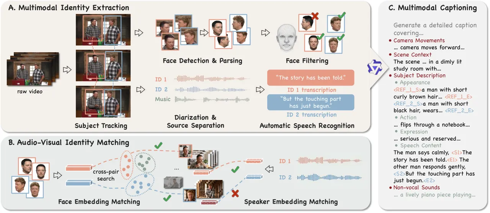

Figure 2: Overview of the data curation pipeline: A. extracting paired
appearance-voice identity signals from raw videos, B. matching
cross-clip references for identity injection, and C. synthesizing
structured captions with subject anchors.

### Preliminaries

To address the distinct dynamics of visual and auditory modalities, a
dual-tower architecture is employed, facilitating cross-modal
interaction via attention mechanisms. Let $`v_{0}`$ and $`a_{0}`$ denote
the clean latents encoded by their respective VAEs. Independent
probability paths are defined via linear interpolation with Gaussian
noise $`v_{1},a_{1}\sim\mathcal{N}(0,I)`$:

```math
v_{t}=(1-t)v_{0}+tv_{1},\quad a_{t}=(1-t)a_{0}+ta_{1}, \tag{1}
```

where $`t\in[0,1]`$. These paths induce target velocity fields
$`u_{t}^{v}=v_{1}-v_{0}`$ and $`u_{t}^{a}=a_{1}-a_{0}`$. To enable
personalized generation, the model is conditioned on disentangled visual
and auditory identity signals $`c^{v}`$ and $`c^{a}`$. Consequently, the
joint optimization objective is a weighted sum of two flow matching
losses:

```math
\displaystyle\mathcal{L}_{\text{joint}}=\mathbb{E}_{t,v_{0},a_{0},v_{1},a_{1}}\Big[ \displaystyle\left\|\hat{u}_{\theta}^{v}(v_{t},a_{t},t,c^{v})-u_{t}^{v}\right\|_{2}^{2} \tag{2}
```

```math
\displaystyle+\lambda\left\|\hat{u}_{\theta}^{a}(v_{t},a_{t},t,c^{a})-u_{t}^{a}\right\|_{2}^{2}\Big].
```

where $`\hat{u}_{\theta}^{v}`$ and $`\hat{u}_{\theta}^{a}`$ denote the
predicted velocity fields conditioned on their respective identity
controls, and $`\lambda`$ balances the learning between the two
modalities.

### Data Curation Pipeline

Paired identity-labeled audio-visual data are scarce but essential for
learning appearance-voice association. We therefore build an automated
curation pipeline (Figure 2) that converts raw videos from
OpenHumanVid (Li et al. 2025) and OmniHuman (Zhu et al. 2026) into
training tuples $`\mathcal{D}=\{(v,a,c^{v},c^{a},\mathrm{txt})\}`$ for
single- and multi-subject scenes. Beyond scale, the pipeline enforces
correct appearance-voice pairing and non-trivial reference-target gaps,
so the model must inject identity rather than copy content. More details
and statistics are provided in the supplementary material.

Multimodal Identity Extraction. We detect humans with YOLOv11 (Khanam
and Hussain 2024), track them with MOTRv2 (Zhang et al. 2023b), and
estimate FLAME (Li et al. 2017) parameters with SMIRK (Retsinas et al. 2024) to obtain one-shot or spatio-temporal multi-view appearance
references $`c^{v}`$. On the audio side, Demucs (Défossez et al. 2019)
separates speech, 3D-Speaker (Chen et al. 2025a) performs diarization,
and ASR yields per-subject transcripts for voice references $`c^{a}`$.
SyncNet (Chung and Zisserman 2016) then retains only lip-sync-consistent
appearance-voice pairs.

Multimodal Captioning with Subject Anchors. Given the clip, face crops,
and transcripts, Qwen3-Omni (Xu et al. 2025) generates structured
captions of camera, scene, ambience, actions, and speech. We require
_subject anchors_ that bind appearance and spoken content to unique
subject IDs, enabling text to specify who appears and who speaks. The
full prompt is provided in the supplementary material.

Cross-clip Audio-visual Identity Matching. To discourage copy-and-paste,
we match references across clips of the same subject with varied
pose/expression and non-overlapping speech content. Clips are first
grouped by ArcFace (Deng et al. 2019) embeddings and then verified with
ERes2Net (Chen et al. 2024) speaker embeddings to reject dubbing and
voice-over mismatches.

The resulting supervision supports identity-aware joint audio-video
learning, including multi-subject scenes that require unambiguous
appearance-voice association.

### Network Architecture

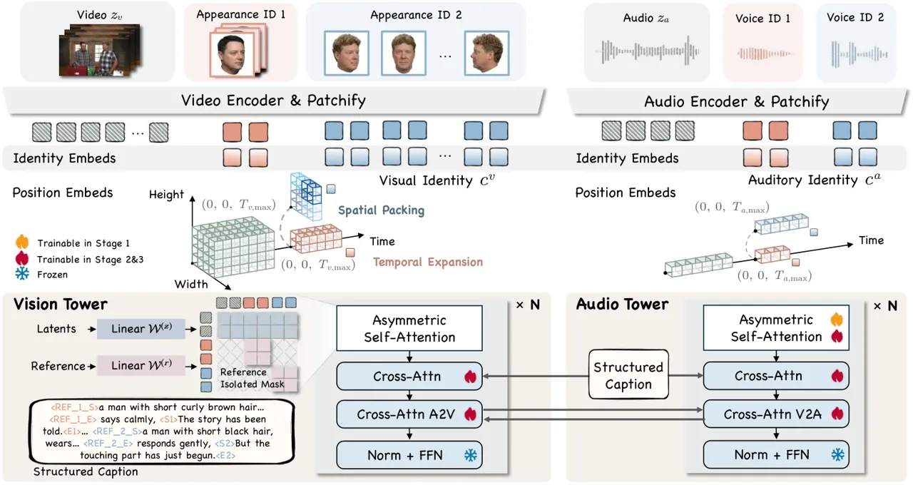

Figure 3: The overall dual-tower DiT architecture and training
framework. The model encodes video, audio, paired appearance/voice
references, and subject-anchored captions, binds them with shared
identity embeddings, and injects them via reference positioning and
decoupled asymmetric attention. Training proceeds in three stages:
unimodal identity, joint multimodal alignment, and spatio-temporal
multi-view fine-tuning.

To achieve high-fidelity joint audio-video generation, we build on a
dual-tower Diffusion Transformer (DiT). The key challenge is to inject
facial appearance and vocal timbre in a disentangled yet coherent way.
We address this with a unified identity injection mechanism that
combines shared identity embeddings, reference positioning, and
decoupled asymmetric attention, as shown in Figure 3.

#### Multimodal Identity Injection.

Instead of employing auxiliary control networks or adapters, we treat
identity signals as additional input tokens and seamlessly integrate
them into the input sequence of the DiT backbone. This unified approach
allows for the joint optimization of multimodal content generation and
identity preservation.

Let $`m\in\{v,a\}`$ denote the modality index. Let
$`z_{t}^{m}\in\mathbb{R}^{L_{t}^{m}\times D}`$ be the sequence of noisy
latent tokens at diffusion timestep $`t`$, and $`c^{m}`$ be the
corresponding raw reference signal. Specifically, for the visual branch
($`m=v`$), $`c^{v}`$ comprises reference facial images (supporting
one-shot as well as spatio-temporal multi-view layouts), and for the
auditory branch ($`m=a`$), $`c^{a}`$ consists of a reference audio clip.
We first encode these control signals into discrete tokens $`r^{m}`$
using modality-specific VAE encoders:

```math
r^{m}=\text{Patchify}(\mathcal{E}_{m}(c^{m}))\in\mathbb{R}^{L_{r}^{m}\times D}. \tag{3}
```

Shared Identity Embeddings. To enable robust multi-subject personalized
generation, we must ensure that each voice timbre is correctly
associated with its corresponding facial appearance. To this end, we
introduce learnable Identity Embeddings to explicitly bind these
modalities at the token level. For a scene with $`n`$ distinct
identities ($`n\leq K_{\max}`$), we assign each subject a slot index
$`k`$ and the corresponding vector $`e^{id}_{(k)}`$. This embedding is
injected into the reference tokens via element-wise addition:

```math
\hat{r}^{m}_{(k)}=r^{m}_{(k)}+e^{id}_{(k)},\quad m\in\{v,a\}. \tag{4}
```

Since $`e^{id}_{(k)}`$ is shared between $`r^{v}_{(k)}`$ and
$`r^{a}_{(k)}`$, it serves as an explicit binding signal that guides the
model to associate the visual tokens of identity $`k`$ with the auditory
tokens of the same identity. In training, we set a fixed number of
identity slots, and subject-to-slot assignments are randomly permuted
each iteration so that every slot receives a gradient under the
long-tailed subject-count distribution. Identity-bound reference tokens
$`\hat{r}^{m}`$ are then concatenated with noisy latents $`z_{t}^{m}`$
along the sequence dimension to form
$`X^{m}\in\mathbb{R}^{(L_{r}^{m}+L_{t}^{m})\times D}`$ as the composite
input for each tower:

```math
X^{m}=[\hat{r}^{m};z_{t}^{m}]. \tag{5}
```

Token-wise concatenation introduces a symmetric inductive bias that
enables the model to flexibly attend to fine-grained features,
facilitating the aggregation of spatio-temporal, multi-view facial cues
and the extraction of spectral formant representations with minimal
architectural overhead.

Reference Position Embeddings. Appearance-voice binding and
cross-subject distinction are carried by the shared identity embeddings
$`e^{id}_{(k)}`$. RoPE only encodes spatio-temporal geometry for
generation and reference layout, not identity. For noisy latents
$`z_{t}^{v}`$ and $`z_{t}^{a}`$, factorized 3D RoPE (Su et al. 2021) is
applied for video and scaled 1D RoPE for audio. For reference tokens, we
place all identities at a shared margin beyond the generation horizon,
_i.e_., every visual reference starts at $`T_{v,\max}`$, and every
auditory reference starts at $`T_{a,\max}`$ (audio references occupy a
contiguous span of length up to $`L`$). Placing all references beyond
$`T_{\cdot,\max}`$ avoids occupying the early temporal indices and
interfering with frame-conditioned generation. To further improve view
diversity and dynamic consistency of each subject, we use two
complementary layouts that target different multi-view evidence:
(i) spatial packing tiles multi-view images lacking temporal
dependencies in a near-square grid within $`(H,W)`$ at the shared margin
index $`T_{v,\max}`$ before the patchify operation, favoring _multi-view
consistency_ under large pose or camera changes; (ii) temporal expansion
places images of the same subject along consecutive indices beyond
$`T_{v,\max}`$ with shared spatial anchors, favoring _dynamic
consistency_ (e.g., expression transitions) over a short temporal
process.

Decoupled Asymmetric Attention. Standard self-attention layers typically
share projection weights across all tokens. However, given the distinct
semantic roles of the reference conditions and the noisy latents,
sharing weights may lead to optimization conflicts. To this end, we use
decoupled projection weights together with an asymmetric attention mask.

Let $`X\in\mathbb{R}^{L\times D}`$ be the input sequence. We partition
token indices into a noisy latent set $`\Omega_{z}`$ and a reference set
$`\Omega_{r}=\bigcup_{k\in\mathcal{S}}\Omega_{r}^{(k)}`$, where
$`\mathcal{S}`$ is the set of occupied identity slots in the clip and
$`\Omega_{r}^{(k)}`$ collects all reference tokens assigned to
slot $`k`$ (visual and auditory). Thus
$`\Omega_{r}\cup\Omega_{z}=\{1,\dots,L\}`$. To learn specialized
representations, we use separate projection weights for the two groups:
$`\mathcal{W}^{(r)}`$ for reference tokens and $`\mathcal{W}^{(z)}`$ for
noisy tokens. Each token is projected using the weights corresponding to
its set, producing the matrices $`Q,K,V\in\mathbb{R}^{L\times d}`$. This
decoupling allows the model to learn identity-preserving and denoising
features independently.

To control information flow under multi-reference conditions and prevent
interference, we introduce a structural reference isolation mask $`M`$
for attention computation:

```math
\displaystyle\operatorname{Attn}(Q,K,V) \displaystyle=\operatorname{softmax}\left(\frac{QK^{\top}}{\sqrt{d}}+M\right)V, \tag{6}
```

```math
\displaystyle M_{i,j} \displaystyle=\begin{cases}-\infty,&i\in\Omega_{r}^{(k)},\;j\in\Omega_{z},\\
-\infty,&i\in\Omega_{r}^{(k)},\;j\in\Omega_{r}^{(\ell)},\;k\neq\ell,\\
0,&\text{otherwise.}\end{cases}
```

With this mask, the main latents can extract identity cues from all
references, whereas each reference remains isolated from both diffusion
noise and other references, preserving the integrity of the control
signals during generation.

|                              |                    |                     |                    |                     |
| ---------------------------- | ------------------ | ------------------- | ------------------ | ------------------- |
| Method                       | English            |                     | Chinese            |                     |
|                              | WER%$`\downarrow`$ | AID-SIM$`\uparrow`$ | WER%$`\downarrow`$ | AID-SIM$`\uparrow`$ |
| E2 TTS (Eskimez et al. 2024) | 2.19               | 0.710               | 1.97               | 0.730               |
| F5 TTS (Chen et al. 2025b)   | 1.83               | 0.647               | 1.56               | 0.741               |
| CosyVoice2 (Du et al. 2024)  | 2.57               | 0.652               | 1.45               | 0.748               |
| CosyVoice3 (Du et al. 2025)  | 2.21               | 0.720               | 1.12               | 0.781               |
| Ours-LTX-2.3 Audio           | 1.57               | 0.770               | 1.20               | 0.785               |

Table 1: Comparison with SOTA TTS Methods on Seed-TTS-Eval (Anastassiou
et al. 2024).

|                                                                                                                                                                                                     |                |                  |                  |                   |                     |                 |                |                |                     |                    |                      |                       |                |                |
| --------------------------------------------------------------------------------------------------------------------------------------------------------------------------------------------------- | -------------- | ---------------- | ---------------- | ----------------- | ------------------- | --------------- | -------------- | -------------- | ------------------- | ------------------ | -------------------- | --------------------- | -------------- | -------------- |
| Models                                                                                                                                                                                              | Audio          |                  |                  |                   |                     | Video           |                |                |                     | A/V Consistency    |                      |                       | Binding^(†)    |                |
|                                                                                                                                                                                                     | PQ$`\uparrow`$ | CLAP$`\uparrow`$ | FD$`\downarrow`$ | WER$`\downarrow`$ | AID-SIM$`\uparrow`$ | AES$`\uparrow`$ | DD$`\uparrow`$ | OC$`\uparrow`$ | VID-SIM$`\uparrow`$ | Sync-C$`\uparrow`$ | Sync-D$`\downarrow`$ | ImageBind$`\uparrow`$ | FM$`\uparrow`$ | SM$`\uparrow`$ |
| Phantom^(‡)                                                                                                                                                                                         | /              | /                | /                | /                 | /                   | 0.54/0.53       | 0.55/0.57      | 0.11/0.09      | 0.74/0.49           | /                  | /                    | /                     | 0.62           | /              |
| CV3+HunyuanCustom                                                                                                                                                                                   | 7.32           | 0.14             | 1.00             | 22.94             | 0.48                | 0.54            | 0.60           | 0.11           | 0.64                | 5.41               | 8.66                 | 0.27                  | /              | /              |
| CV3+HuMo                                                                                                                                                                                            | 7.35           | 0.10             | 1.06             | 24.09             | 0.47                | 0.54            | 0.33           | 0.11           | 0.71                | 5.35               | 8.86                 | 0.28                  | /              | /              |
| QIE+UniAVGen                                                                                                                                                                                        | 6.15           | 0.24             | 0.97             | 68.86             | 0.32                | 0.35            | 0.65           | 0.11           | 0.37                | 3.99               | 11.66                | 0.29                  | /              | /              |
| QIE+ID-LoRA                                                                                                                                                                                         | 7.03           | 0.11             | 0.84             | 30.59             | 0.54                | 0.56            | 0.58           | 0.11           | 0.41                | 6.30               | 7.85                 | 0.36                  | /              | /              |
| OmniCustom                                                                                                                                                                                          | 6.10           | 0.13             | 0.90             | 33.71             | 0.34                | 0.57            | 0.14           | 0.10           | 0.35                | 6.45               | 8.41                 | 0.22                  | /              | /              |
| DreamID-Omni                                                                                                                                                                                        | 5.97/5.63      | 0.22/0.23        | 0.91/0.78        | 28.48/39.99       | 0.39/0.30           | 0.56/0.54       | 0.42/0.40      | 0.11/0.10      | 0.67/0.42           | 4.84/4.02          | 9.48/10.80           | 0.25/0.22             | 0.57           | 0.62           |
| Ours-Ovi                                                                                                                                                                                            | 6.52/6.15      | 0.19/0.20        | 0.76/0.75        | 32.89/28.10       | 0.54/0.47           | 0.58/0.57       | 0.69/0.64      | 0.11/0.10      | 0.75/0.59           | 6.76/4.63          | 7.63/9.57            | 0.38/0.33             | 0.70           | 0.67           |
| Ours-LTX-2.3                                                                                                                                                                                        | 7.30/6.24      | 0.29/0.25        | 0.78/0.72        | 24.77/27.86       | 0.57/0.45           | 0.59/0.55       | 0.70/0.67      | 0.12/0.11      | 0.78/0.60           | 6.74/5.05          | 7.44/10.37           | 0.38/0.30             | 0.85           | 0.70           |
| ^(†)FM/SM on multi-subject only (R2AV methods with multi-identity support). ^(‡)No generated audio. CV3: CosyVoice3; QIE: Qwen-Image-Edit. Entries are single/multi when both splits are available. |                |                  |                  |                   |                     |                 |                |                |                     |                    |                      |                       |                |                |

Table 2: Comparison under a matched identity-conditioned protocol. Bold
and underline mark best and second-best over all reported scores for
each metric (single and multi ranked separately).

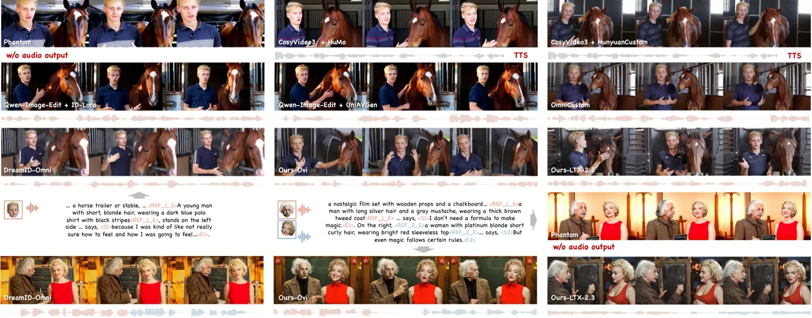

Figure 4: Qualitative comparison with identity-aware video and joint
audio-video baselines.

### Training Strategy

To leverage heterogeneous data across modalities and facilitate
progressive audio-visual alignment, we adopt a multi-stage training
strategy motivated by disparities in data availability. Identity-labeled
audio data (e.g., TTS corpora) is the most abundant, identity-labeled
video data is more limited due to filtering requirements, and paired
identity-labeled audio-visual data is the scarcest because of strict
synchronization and semantic constraints. Directly training on limited
paired data risks overfitting and poor identity diversity. We therefore
propose a multi-stage training strategy (a curriculum) with three
stages: unimodal identity training, joint multimodal identity training,
and spatio-temporal multi-view identity fine-tuning.

Stage 1: Unimodal Identity Training. We first train each tower on large
unimodal data to learn identity priors before cross-modal alignment. The
audio tower is trained on TTS corpora for timbre and prosody. We find
that multilingual speech ability is best acquired at this stage, since
large multilingual TTS data can be used without paired video and remains
largely preserved after Stages 2-3. Table 1 shows that the audio tower
overall surpasses the state-of-the-art TTS models. In parallel, the
video tower is trained on identity-labeled video data with a dummy audio
counterpart.

Stage 2: Joint Multimodal Identity Training. Then, we perform joint
multimodal training using curated paired identity-labeled audio-visual
data. The model is initialized from Stage 1 and cross-modal fusion
layers are activated to learn temporal alignment between speech and
facial motion. This decoupling allows large unimodal datasets to provide
identity diversity while a smaller paired set enables precise
audio-visual synchronization.

Stage 3: Spatio-temporal Multi-view Fine-tuning. We then fine-tune on a
small multi-view identity set with the two complementary
reference-positioning layouts above (spatial packing and temporal
expansion). Spatial packing is used when references emphasize multi-view
consistency under pose/viewpoint change. Temporal expansion is used when
references emphasize dynamic consistency such as expression evolution.
Stage 3 therefore adapts the model to both multi-view types rather than
selecting a single winner.

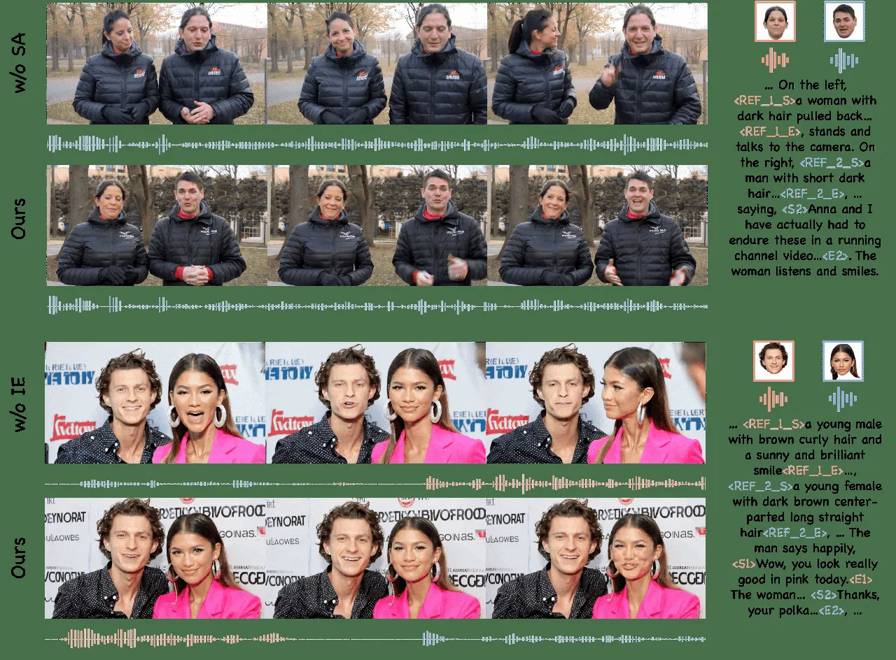

Figure 5: Typical multi-subject binding failures motivating FM/SM:
identity collapse (top), appearance-voice mismatch and overlapped dual
talking (bottom).

## Experiments

### Experimental Settings

We evaluate on an identity-disjoint bilingual benchmark of $`400`$
triplets ($`200`$ single-subject/$`200`$ multi-subject), each with
appearance and voice references plus a prompt with bilingual dialogue.
Both splits include challenging cases such as extreme poses, occlusions,
complex multi-subject interactions, offscreen subjects, and late-entry
subjects. All methods share matched identity references, and prompts are
adapted for each method. For methods that require a reference-based
first frame, we use Qwen-Image-Edit (Wu et al. 2025) to generate an
image from the same references and adapted prompts. The supplementary
material provides more details.

For audio, we report WER (intelligibility), CLAP (audio-text semantics),
FD (distributional quality), PQ (production quality), and AID-SIM
(speaker similarity). For video, we report AES (aesthetic quality) / DD
(dynamic degree) / OC (overall consistency) from VBench and VID-SIM
(face identity similarity). For audio-visual consistency, we report
Sync-C/Sync-D (lip-sync) and ImageBind (visual and auditory event-level
alignment). Because average AID-SIM / VID-SIM can remain high under
cross-binding, we further report Face Match (FM) and Speaker Match (SM)
as assignment accuracies on multi-subject cases only (details in Supp.).

We implement Identity-as-Presence on LTX-2.3 (HaCohen et al. 2026) as
the primary dual-tower backbone (Ours-LTX-2.3). Reference audio length
is $`L{=}5`$s and $`T_{\max}{=}12`$s. Training follows the three-stage
strategy with unimodal audio/video budgets of $`10`$k/$`10`$k iterations
and $`15`$k joint steps, followed by spatio-temporal multi-view
fine-tuning. Optimizer settings, inference hyperparameters, and an
additional Ovi (Low et al. 2025)-based implementation reported for
reference (Ours-Ovi) can be found in the supplementary material (Supp.).

|                   |                   |                     |                     |                    |                |                |
| ----------------- | ----------------- | ------------------- | ------------------- | ------------------ | -------------- | -------------- |
| Variant           | WER$`\downarrow`$ | AID-SIM$`\uparrow`$ | VID-SIM$`\uparrow`$ | Sync-C$`\uparrow`$ | FM$`\uparrow`$ | SM$`\uparrow`$ |
| A Shared IE       | 25.47/38.91       | 0.56/0.47           | 0.70/0.54           | 6.48/5.06          | 0.79           | 0.65           |
| B RoPE Offset     | 28.76/49.36       | 0.44/0.31           | 0.67/0.23           | 5.79/4.48          | 0.58           | 0.59           |
| C Rotary Bias     | 27.43/44.67       | 0.52/0.41           | 0.63/0.21           | 6.20/4.30          | 0.43           | 0.33           |
| A+Subject Anchors | 24.77/33.86       | 0.57/0.45           | 0.75/0.59           | 6.74/5.05          | 0.85           | 0.70           |

Table 3: Ablation of binding and caption design. Bold and underline mark
best and second-best for each metric.

|                    |                   |                     |                     |                    |                |                |
| ------------------ | ----------------- | ------------------- | ------------------- | ------------------ | -------------- | -------------- |
| Schedule           | WER$`\downarrow`$ | AID-SIM$`\uparrow`$ | VID-SIM$`\uparrow`$ | Sync-C$`\uparrow`$ | FM$`\uparrow`$ | SM$`\uparrow`$ |
| One-stage          | 36.43/51.03       | 0.44/0.31           | 0.61/0.60           | 5.55/4.26          | 0.65           | 0.51           |
| Two-stage          | 24.77/33.86       | 0.57/0.45           | 0.75/0.59           | 6.74/5.05          | 0.85           | 0.70           |
| + ST multi-view FT | 22.39/32.58       | 0.58/0.54           | 0.78/0.61           | 6.80/5.32          | 0.87           | 0.71           |

Table 4: Ablation of training strategy. Bold and underline mark best and
second-best for each metric.

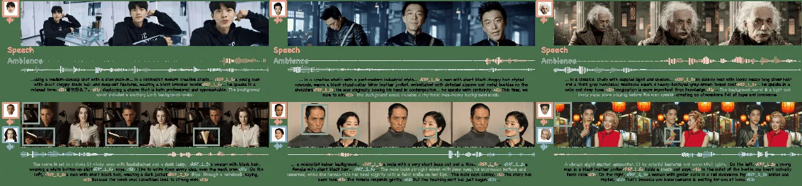

Figure 6: Representative qualitative results for identity-preserving
joint audio-video generation.

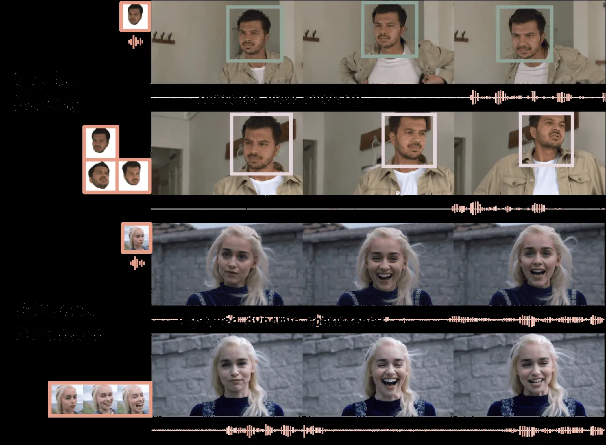

Figure 7: Spatio-temporal multi-view reference positioning.

### Comparison with State-of-the-Art Methods

We compare methods in Table 2, including methods under
reference-to-video (R2V), reference-audio-to-video (RA2V, TTS+lip-sync),
and reference-to-audio-video (R2AV) protocols (refer to Supp. for
details). All samples are generated at 720p for 5 seconds. Baselines
include R2V Phantom (Liu et al. 2025b), RA2V CosyVoice3 (Du et al.
2025)+HunyuanCustom (Hu et al. 2025)/HuMo (Chen et al. 2026a), and R2AV
UniAVGen (Zhang et al. 2025), Qwen-Image-Edit (Wu et al.
2025)+ID-LoRA (Dahan et al. 2026), OmniCustom (Li et al. 2026c),
DreamID-Omni (Guo et al. 2026), together with our LTX-2.3 implementation
Ours-LTX-2.3 (HaCohen et al. 2026). We also report Ours-Ovi (Low et al. 2025) under the same identity injection mechanism to demonstrate the
generality of our method (implementation details in Supp.). We attribute
the lower WER of RA2V to CosyVoice3 (Du et al. 2025), a state-of-the-art
TTS approach conditioned on ground-truth transcripts. As such, their
slightly higher WER primarily reflects the oracle TTS system’s high
intelligibility, rather than superior performance in
identity-personalized joint audio-visual generation. Our R2AV models are
strongest on joint audio-visual consistency and multi-subject binding
(FM/SM); Ours-LTX-2.3 is better on video fidelity and improves FM/SM
over DreamID-Omni under the same assignment protocol. Relative to R2AV
baselines without explicit multi-subject binding, shared identity
embeddings reduce cross-talk. Figure 4 shows qualitative comparisons.

### Ablation Study

We ablate binding, captions, and training under matched budgets on the
LTX-2.3 implementation (Tables 3 and 4). Dual-identity generation must
preserve each appearance and voice, and their pairing. Figure 5 shows
that without SA, multiple subjects collapse onto a shared face, and
without shared IE, the model fails to align face and voice IDs and
produces voice-face mismatch. Table 3 asks whether shared identity
embeddings outperform RoPE-layout binding under the same
reference-positioning budget. A uses shared identity embeddings (IE)
with a shared $`T_{\cdot,\max}`$ margin. B removes shared IE and encodes
each subject by a distinct RoPE time offset (per-subject RoPE offset
similar to Syn-RoPE (Guo et al. 2026)). C adds a per-subject rotary bias
to align same-subject cross-modal tokens. A is most reliable
(FM $`0.79`$ vs. $`0.58`$/$`0.43`$ for B/C) and does not entangle
identity with temporal offsets as subject count grows. Adding subject
anchors (SA) further improves multi-subject grounding (A+SA). For scarce
paired audio-visual data, Table 4 shows the three-stage training
strategy outperforms one-stage joint training. The final spatio-temporal
multi-view fine-tuning stage further improves identity metrics by
exposing both complementary multi-view layouts (refer to Supp. for more
details).

### Qualitative Analysis

Figure 6 illustrates faithful prompt following in joint generation. The
top row shows single-subject results that realize audio-related
descriptions in the text prompt, including clear speech and realistic
non-vocal sounds fused with the visuals. The second row shows
dual-subject cases that respond to fine-grained captions specifying who
speaks and who appears. Despite training only on real-human video,
Figure Identity as Presence: Towards Appearance and Voice Personalized  
Joint Audio-Video Generation demonstrates zero-shot generalization to
cartoon and animal domains not covered by the training data. Figure 7
shows the two complementary multi-view layouts. _Spatial packing_ better
preserves identity under large pose or viewpoint change, while _temporal
expansion_ better captures dynamic appearance cues such as expression
transitions (refer to Supp. for additional qualitative results).

## Conclusion

We presented Identity-as-Presence, a unified framework for appearance-
and voice-personalized joint audio-video generation. Shared identity
embeddings provide more reliable appearance-voice association than RoPE
positional binding. Subject-anchored captions improve multi-subject text
grounding. Progressive training better utilizes scarce paired
audio-visual identity data. Experiments show superior audio quality,
video fidelity, and cross-modal alignment, with improved multi-subject
binding over the compared methods. Limitations and failure cases are
discussed in Supp.

## References

- Anastassiou et al. (2024) P. Anastassiou, J. Chen, J. Chen, Y.
  Chen, Z. Chen, Z. Chen, J. Cong, L. Deng, C. Ding, L. Gao, et al.
  Seed-tts: a family of high-quality versatile speech generation models.
  arXiv preprint arXiv:2406.02430. Cited by: Table 1, Audio metrics..
- Chen et al. (2026a) L. Chen, T. Ma, J. Liu, B. Li, Z. Chen, L. Liu, X.
  He, G. Li, Q. He, and Z. Wu Human-centric video generation via
  collaborative multi-modal conditioning. In Proceedings of the AAAI
  Conference on Artificial Intelligence, Cited by: Comparison with
  State-of-the-Art Methods.
- Chen et al. (2022) S. Chen, C. Wang, Z. Chen, Y. Wu, S. Liu, Z.
  Chen, J. Li, N. Kanda, T. Yoshioka, X. Xiao, et al. Wavlm: large-scale
  self-supervised pre-training for full stack speech processing. IEEE
  Journal of Selected Topics in Signal Processing 16 (6), pp. 1505–1518.
  Cited by: Audio metrics., Face Match and Speaker Match.
- Chen et al. (2024) Y. Chen, S. Zheng, H. Wang, L. Cheng, Q. Chen, S.
  Zhang, and J. Li ERes2NetV2: boosting short-duration speaker
  verification performance with computational efficiency. arXiv preprint
  arXiv:2406.02167. Cited by: Data Curation Pipeline, Pipeline modules.
- Chen et al. (2025a) Y. Chen, S. Zheng, H. Wang, L. Cheng, T. Zhu, R.
  Huang, C. Deng, Q. Chen, S. Zhang, W. Wang, et al. 3D-speaker-toolkit:
  an open-source toolkit for multimodal speaker verification and
  diarization. In ICASSP 2025-2025 IEEE International Conference on
  Acoustics, Speech and Signal Processing (ICASSP), pp. 1–5. Cited by:
  Data Curation Pipeline, Pipeline modules.
- Chen et al. (2026b) Y. Chen, Q. He, T. Hu, Y. Wang, Y. Wang, L. Ma,
  and J. Zhang Omni-customizer: end-to-end multimodal customization for
  joint audio-video generation. arXiv preprint arXiv:2605.17488. Cited
  by: Introduction, Related Work, Additional Ablation Details.
- Chen et al. (2025b) Y. Chen, Z. Niu, Z. Ma, K. Deng, C. Wang, J.
  JianZhao, K. Yu, and X. Chen F5-tts: a fairytaler that fakes fluent
  and faithful speech with flow matching. In Proceedings of the 63rd
  Annual Meeting of the Association for Computational Linguistics
  (Volume 1: Long Papers), pp. 6255–6271. Cited by: Related Work, Table
  1.
- Chung and Zisserman (2016) J. S. Chung and A. Zisserman Out of time:
  automated lip sync in the wild. In Asian conference on computer
  vision, pp. 251–263. Cited by: Data Curation Pipeline, Pipeline
  modules, Audio-visual consistency metrics., Face Match and Speaker
  Match.
- Dahan et al. (2026) A. Dahan, M. Yanuka, N. Kraicer, L. Wolf, and R.
  Giryes ID-lora: identity-driven audio-video personalization with
  in-context lora. arXiv preprint arXiv:2603.10256. Cited by: Comparison
  with State-of-the-Art Methods.
- Défossez et al. (2019) A. Défossez, N. Usunier, L. Bottou, and F. Bach
  Demucs: deep extractor for music sources with extra unlabeled data
  remixed. arXiv preprint arXiv:1909.01174. Cited by: Data Curation
  Pipeline, Pipeline modules.
- Deng et al. (2019) J. Deng, J. Guo, N. Xue, and S. Zafeiriou Arcface:
  additive angular margin loss for deep face recognition. In Proceedings
  of the IEEE/CVF conference on computer vision and pattern recognition,
  pp. 4690–4699. Cited by: Data Curation Pipeline, Pipeline modules,
  Video metrics., Face Match and Speaker Match.
- Deng et al. (2025) Y. Deng, Y. Yin, X. Guo, Y. Wang, J. Z. Fang, S.
  Yuan, Y. Yang, A. Wang, B. Liu, H. Huang, et al. MAGREF: masked
  guidance for any-reference video generation with subject
  disentanglement. arXiv preprint arXiv:2505.23742. Cited by:
  Introduction.
- Du et al. (2025) Z. Du, C. Gao, Y. Wang, F. Yu, T. Zhao, H. Wang, X.
  Lv, H. Wang, C. Ni, X. Shi, et al. Cosyvoice 3: towards in-the-wild
  speech generation via scaling-up and post-training. arXiv preprint
  arXiv:2505.17589. Cited by: Table 1, Comparison with State-of-the-Art
  Methods.
- Du et al. (2024) Z. Du, Y. Wang, Q. Chen, X. Shi, X. Lv, T. Zhao, Z.
  Gao, Y. Yang, C. Gao, H. Wang, et al. Cosyvoice 2: scalable streaming
  speech synthesis with large language models. arXiv preprint
  arXiv:2412.10117. Cited by: Table 1.
- Eskimez et al. (2024) S. E. Eskimez, X. Wang, M. Thakker, C. Li, C.
  Tsai, Z. Xiao, H. Yang, Z. Zhu, M. Tang, X. Tan, et al. E2 tts:
  embarrassingly easy fully non-autoregressive zero-shot tts. In 2024
  IEEE spoken language technology workshop (SLT), pp. 682–689. Cited by:
  Related Work, Table 1.
- Fei et al. (2025) Z. Fei, D. Li, D. Qiu, J. Wang, Y. Dou, R. Wang, J.
  Xu, M. Fan, G. Chen, Y. Li, et al. Skyreels-a2: compose anything in
  video diffusion transformers. arXiv preprint arXiv:2504.02436. Cited
  by: Introduction, Related Work.
- Gao et al. (2022) Z. Gao, S. Zhang, I. McLoughlin, and Z. Yan
  Paraformer: fast and accurate parallel transformer for
  non-autoregressive end-to-end speech recognition. arXiv preprint
  arXiv:2206.08317. Cited by: Audio metrics..
- Guo et al. (2026) X. Guo, F. Ye, Q. Sun, L. Chen, B. Li, P. Zhang, J.
  Liu, S. Zhao, Q. HE, and X. Hou DreamID-omni: unified framework for
  controllable human-centric audio-video generation. In Forty-third
  International Conference on Machine Learning, Cited by: Related Work,
  Comparison with State-of-the-Art Methods, Ablation Study, 2nd item.
- HaCohen et al. (2026) Y. HaCohen, B. Brazowski, N. Chiprut, Y.
  Bitterman, A. Kvochko, A. Berkowitz, D. Shalem, D. Lifschitz, D.
  Moshe, E. Porat, E. Richardson, G. Shiran, I. Chachy, J. Chetboun, M.
  Finkelson, M. Kupchick, N. Zabari, N. Guetta, N. Kotler, O. Bibi, O.
  Gordon, P. Panet, R. Benita, S. Armon, V. Kulikov, Y. Inger, Y.
  Shiftan, Z. Melumian, and Z. Farbman LTX-2: efficient joint
  audio-visual foundation model. External Links: 2601.03233,
  [Link](https://arxiv.org/abs/2601.03233) Cited by: Related Work,
  Experimental Settings, Comparison with State-of-the-Art Methods.
- He et al. (2024) X. He, Q. Liu, S. Qian, X. Wang, T. Hu, K. Cao, K.
  Yan, and J. Zhang Id-animator: zero-shot identity-preserving human
  video generation. arXiv preprint arXiv:2404.15275. Cited by:
  Introduction, Related Work.
- Hu et al. (2023) L. Hu, X. Gao, P. Zhang, K. Sun, B. Zhang, and L. Bo
  Animate anyone: consistent and controllable image-to-video synthesis
  for character animation. arXiv preprint arXiv:2311.17117. Cited by:
  Introduction.
- Hu et al. (2025) T. Hu, Z. Yu, Z. Zhou, S. Liang, Y. Zhou, Q. Lin,
  and Q. Lu Hunyuancustom: a multimodal-driven architecture for
  customized video generation. arXiv preprint arXiv:2505.04512. Cited
  by: Related Work, Comparison with State-of-the-Art Methods.
- Huang et al. (2025) Y. Huang, Z. Yuan, Q. Liu, Q. Wang, X. Wang, R.
  Zhang, P. Wan, D. Zhang, and K. Gai Conceptmaster: multi-concept video
  customization on diffusion transformer models without test-time
  tuning. arXiv preprint arXiv:2501.04698. Cited by: Related Work.
- Huang et al. (2024) Z. Huang, Y. He, J. Yu, F. Zhang, C. Si, Y.
  Jiang, Y. Zhang, T. Wu, Q. Jin, N. Chanpaisit, et al. Vbench:
  comprehensive benchmark suite for video generative models. In
  Proceedings of the IEEE/CVF Conference on Computer Vision and Pattern
  Recognition, pp. 21807–21818. Cited by: Video metrics..
- Jiang et al. (2025) Z. Jiang, Z. Han, C. Mao, J. Zhang, Y. Pan, and Y.
  Liu Vace: all-in-one video creation and editing. In Proceedings of the
  IEEE/CVF International Conference on Computer Vision, pp. 17191–17202.
  Cited by: Related Work.
- Ju et al. (2024) Z. Ju, Y. Wang, K. Shen, X. Tan, D. Xin, D. Yang, Y.
  Liu, Y. Leng, K. Song, S. Tang, et al. Naturalspeech 3: zero-shot
  speech synthesis with factorized codec and diffusion models. arXiv
  preprint arXiv:2403.03100. Cited by: Related Work.
- Khanam and Hussain (2024) R. Khanam and M. Hussain Yolov11: an
  overview of the key architectural enhancements. arXiv preprint
  arXiv:2410.17725. Cited by: Data Curation Pipeline, Pipeline modules.
- Li et al. (2026a) H. Li, B. Sun, Y. Yang, Z. Liang, Z. Yin, X. Sha,
  and C. Wang UniTalking: a unified audio-video framework for talking
  portrait generation. In Proceedings of the IEEE/CVF Conference on
  Computer Vision and Pattern Recognition, pp. 4647–4656. Cited by:
  Introduction.
- Li et al. (2025) H. Li, M. Xu, Y. Zhan, S. Mu, J. Li, K. Cheng, Y.
  Chen, T. Chen, M. Ye, J. Wang, et al. Openhumanvid: a large-scale
  high-quality dataset for enhancing human-centric video generation. In
  Proceedings of the Computer Vision and Pattern Recognition Conference,
  pp. 7752–7762. Cited by: Data Curation Pipeline, Dataset statistics.
- Li et al. (2026b) L. Li, W. Wang, C. Zhao, T. Feng, Z. Zhao, H. Chen,
  and C. Shen MMControl: unified multi-modal control for joint
  audio-video generation. arXiv preprint arXiv:2604.19679. Cited by:
  Introduction.
- Li et al. (2026c) M. Li, Z. Li, K. Zhang, G. Yin, Z. Li, and D. Xu
  OmniCustom: sync audio-video customization via joint audio-video
  generation model. arXiv preprint arXiv:2602.12304. Cited by:
  Introduction, Related Work, Comparison with State-of-the-Art Methods,
  Evaluation settings.
- Li et al. (2017) T. Li, T. Bolkart, M. J. Black, H. Li, and J. Romero
  Learning a model of facial shape and expression from 4d scans. ACM
  Transactions on Graphics (TOG) 36, pp. 1 – 17. Cited by: Data Curation
  Pipeline, Pipeline modules.
- Liang et al. (2025) F. Liang, H. Ma, Z. He, T. Hou, J. Hou, K. Li, X.
  Dai, F. Juefei-Xu, S. Azadi, A. Sinha, et al. Movie weaver:
  tuning-free multi-concept video personalization with anchored prompts.
  arXiv preprint arXiv:2502.07802. Cited by: Introduction.
- Liu et al. (2025a) K. Liu, W. Li, L. Chen, S. Wu, Y. Zheng, J. Ji, F.
  Zhou, R. Jiang, J. Luo, H. Fei, et al. Javisdit: joint audio-video
  diffusion transformer with hierarchical spatio-temporal prior
  synchronization. arXiv preprint arXiv:2503.23377. Cited by: Related
  Work.
- Liu et al. (2025b) L. Liu, T. Ma, B. Li, Z. Chen, J. Liu, G. Li, S.
  Zhou, Q. He, and X. Wu Phantom: subject-consistent video generation
  via cross-modal alignment. In Proceedings of the IEEE/CVF
  International Conference on Computer Vision, pp. 14951–14961. Cited
  by: Introduction, Related Work, Comparison with State-of-the-Art
  Methods.
- Loshchilov (2017) I. Loshchilov Decoupled weight decay regularization.
  arXiv preprint arXiv:1711.05101. Cited by: Implementation Details.
- Low et al. (2025) C. Low, W. Wang, and C. Katyal Ovi: twin backbone
  cross-modal fusion for audio-video generation. arXiv preprint
  arXiv:2510.01284. Cited by: Related Work, Experimental Settings,
  Comparison with State-of-the-Art Methods, Implementation Details.
- Mehta et al. (2024) S. Mehta, R. Tu, J. Beskow, É. Székely, and G. E.
  Henter Matcha-tts: a fast tts architecture with conditional flow
  matching. In ICASSP 2024-2024 IEEE International Conference on
  Acoustics, Speech and Signal Processing (ICASSP), pp. 11341–11345.
  Cited by: Related Work.
- Radford et al. (2023) A. Radford, J. W. Kim, T. Xu, G. Brockman, C.
  McLeavey, and I. Sutskever Robust speech recognition via large-scale
  weak supervision. In International conference on machine learning,
  pp. 28492–28518. Cited by: Audio metrics..
- Ren et al. (2020) Y. Ren, C. Hu, X. Tan, T. Qin, S. Zhao, Z. Zhao,
  and T. Liu Fastspeech 2: fast and high-quality end-to-end text to
  speech. arXiv preprint arXiv:2006.04558. Cited by: Introduction,
  Related Work.
- Ren et al. (2019) Y. Ren, Y. Ruan, X. Tan, T. Qin, S. Zhao, Z. Zhao,
  and T. Liu Fastspeech: fast, robust and controllable text to speech.
  Advances in neural information processing systems 32. Cited by:
  Introduction, Related Work.
- Retsinas et al. (2024) G. Retsinas, P. P. Filntisis, R. Danecek, V. F.
  Abrevaya, A. Roussos, T. Bolkart, and P. Maragos SMIRK: 3d facial
  expressions through analysis-by-neural-synthesis. arXiv preprint
  arXiv:2404.04104. Cited by: Data Curation Pipeline, Pipeline modules.
- Schuhmann et al. (2022) C. Schuhmann, R. Beaumont, R. Vencu, C.
  Gordon, R. Wightman, M. Cherti, T. Coombes, A. Katta, C. Mullis, M.
  Wortsman, et al. Laion-5b: an open large-scale dataset for training
  next generation image-text models. Advances in neural information
  processing systems 35, pp. 25278–25294. Cited by: Video metrics..
- Su et al. (2021) J. Su, Y. Lu, S. Pan, B. Wen, and Y. Liu RoFormer:
  enhanced transformer with rotary position embedding. External Links:
  2104.09864 Cited by: Multimodal Identity Injection..
- Teed and Deng (2020) Z. Teed and J. Deng Raft: recurrent all-pairs
  field transforms for optical flow. In European conference on computer
  vision, pp. 402–419. Cited by: Video metrics..
- Tjandra et al. (2025) A. Tjandra, Y. Wu, B. Guo, J. Hoffman, B.
  Ellis, A. Vyas, B. Shi, S. Chen, M. Le, N. Zacharov, et al. Meta
  audiobox aesthetics: unified automatic quality assessment for speech,
  music, and sound. arXiv preprint arXiv:2502.05139. Cited by: Audio
  metrics..
- Wang et al. (2023) C. Wang, S. Chen, Y. Wu, Z. Zhang, L. Zhou, S.
  Liu, Z. Chen, Y. Liu, H. Wang, J. Li, et al. Neural codec language
  models are zero-shot text to speech synthesizers. arXiv preprint
  arXiv:2301.02111. Cited by: Introduction, Related Work.
- Wang et al. (2025a) D. Wang, W. Zuo, A. Li, L. Chen, X. Liao, D.
  Zhou, Z. Yin, X. Dai, D. Jiang, and G. Yu UniVerse-1: unified
  audio-video generation via stitching of experts. arXiv preprint
  arXiv:2509.06155. Cited by: Related Work.
- Wang et al. (2024) Y. Wang, Y. He, Y. Li, K. Li, J. Yu, X. Ma, X.
  Li, G. Chen, X. Chen, Y. Wang, et al. Internvid: a large-scale
  video-text dataset for multimodal understanding and generation. In
  International Conference on Learning Representations, Vol. 2024,
  pp. 42055–42079. Cited by: Video metrics..
- Wang et al. (2025b) Z. Wang, J. Yang, J. Jiang, C. Liang, G. Lin, Z.
  Zheng, C. Yang, and D. Lin InterActHuman: multi-concept human
  animation with layout-aligned audio conditions. arXiv preprint
  arXiv:2506.09984. Cited by: Introduction.
- Wu et al. (2025) C. Wu, J. Li, J. Zhou, J. Lin, K. Gao, K. Yan, S.
  Yin, S. Bai, X. Xu, Y. Chen, et al. Qwen-image technical report. arXiv
  preprint arXiv:2508.02324. Cited by: Experimental Settings, Comparison
  with State-of-the-Art Methods, Evaluation settings.
- Wu et al. (2023a) Y. Wu, K. Chen, T. Zhang, Y. Hui, T.
  Berg-Kirkpatrick, and S. Dubnov Large-scale contrastive language-audio
  pretraining with feature fusion and keyword-to-caption augmentation.
  In ICASSP 2023-2023 IEEE International Conference on Acoustics, Speech
  and Signal Processing (ICASSP), pp. 1–5. Cited by: Audio metrics..
- Wu et al. (2023b) Y. Wu, K. Chen, T. Zhang, Y. Hui, T.
  Berg-Kirkpatrick, and S. Dubnov Large-scale contrastive language-audio
  pretraining with feature fusion and keyword-to-caption augmentation.
  In ICASSP 2023-2023 IEEE International Conference on Acoustics, Speech
  and Signal Processing (ICASSP), pp. 1–5. Cited by: Audio-visual
  consistency metrics..
- Xu et al. (2025) J. Xu, Z. Guo, H. Hu, Y. Chu, X. Wang, J. He, Y.
  Wang, X. Shi, T. He, X. Zhu, Y. Lv, Y. Wang, D. Guo, H. Wang, L.
  Ma, P. Zhang, X. Zhang, H. Hao, Z. Guo, B. Yang, B. Zhang, Z. Ma, X.
  Wei, S. Bai, K. Chen, X. Liu, P. Wang, M. Yang, D. Liu, X. Ren, B.
  Zheng, R. Men, F. Zhou, B. Yu, J. Yang, L. Yu, J. Zhou, and J. Lin
  Qwen3-omni technical report. External Links: 2509.17765,
  [Link](https://arxiv.org/abs/2509.17765) Cited by: Data Curation
  Pipeline, Pipeline modules.
- Xue et al. (2025) B. Xue, Z. Duan, Q. Yan, W. Wang, H. Liu, C. Guo, C.
  Li, C. Li, and J. Lyu Stand-in: a lightweight and plug-and-play
  identity control for video generation. arXiv preprint
  arXiv:2508.07901. Cited by: Introduction, Related Work.
- Ye et al. (2023) H. Ye, J. Zhang, S. Liu, X. Han, and W. Yang
  Ip-adapter: text compatible image prompt adapter for text-to-image
  diffusion models. arXiv preprint arXiv:2308.06721. Cited by:
  Introduction.
- Yuan et al. (2025) S. Yuan, J. Huang, X. He, Y. Ge, Y. Shi, L.
  Chen, J. Luo, and L. Yuan Identity-preserving text-to-video generation
  by frequency decomposition. In Proceedings of the Computer Vision and
  Pattern Recognition Conference, pp. 12978–12988. Cited by:
  Introduction, Related Work.
- Zhang et al. (2025) G. Zhang, Z. Zhou, T. Hu, Z. Peng, Y. Zhang, Y.
  Chen, Y. Zhou, Q. Lu, and L. Wang Uniavgen: unified audio and video
  generation with asymmetric cross-modal interactions. arXiv preprint
  arXiv:2511.03334. Cited by: Related Work, Comparison with
  State-of-the-Art Methods.
- Zhang et al. (2023a) L. Zhang, A. Rao, and M. Agrawala Adding
  conditional control to text-to-image diffusion models. In Proceedings
  of the IEEE/CVF International Conference on Computer Vision,
  pp. 3836–3847. Cited by: Introduction.
- Zhang et al. (2023b) Y. Zhang, T. Wang, and X. Zhang Motrv2:
  bootstrapping end-to-end multi-object tracking by pretrained object
  detectors. In Proceedings of the IEEE/CVF conference on computer
  vision and pattern recognition, pp. 22056–22065. Cited by: Data
  Curation Pipeline, Pipeline modules.
- Zhu et al. (2026) L. Zhu, X. Cai, Y. Chen, Y. Li, B. Yang, H. Liu, J.
  Chen, C. Li, and J. LYu OmniHuman: a large-scale dataset and benchmark
  for human-centric video generation. arXiv preprint arXiv:2604.18326.
  Cited by: Data Curation Pipeline, Dataset statistics.

Supplementary Material

## Data Curation Details

### Pipeline modules

As described in the main paper, we convert raw videos into
identity-labeled training tuples $`\{(v,a,c^{v},c^{a},\mathrm{txt})\}`$
with our data curation pipeline. Below we expand the pipeline modules
and the role of each component.

Multimodal Identity Extraction. From each current clip, we extract
per-subject appearance and voice signals and verify that they are
lip-sync consistent within the clip. On the visual side, we construct
per-subject tracks and then extract face crops. YOLOv11 (Khanam and
Hussain 2024) detects humans in each frame, and MOTRv2 (Zhang et al.
2023b) links detections across frames into subject tracks. For each
track, SMIRK (Retsinas et al. 2024) regresses FLAME (Li et al. 2017)
parameters that capture dense 3D facial geometry and expression details.
These parameters guide the extraction of high-quality face crops for
one-shot or spatio-temporal multi-view layouts, which also serve as
visual identity evidence for captioning. On the audio side, we process
the soundtrack separately. Demucs (Défossez et al. 2019) separates
speech from background music and effects. 3D-Speaker (Chen et al. 2025a)
performs speaker diarization to assign speech segments to subjects, and
ASR yields per-subject transcripts for later captioning. SyncNet (Chung
and Zisserman 2016) then retains only within-clip appearance-voice pairs
whose lip motion is temporally consistent with the speech, rejecting
dubbed or off-sync candidates before cross-clip matching and captioning.

Cross-clip Audio-visual Identity Matching. To discourage copy-and-paste
and enforce non-trivial reference-target gaps, we select identity
references from a different clip of the same subject whenever possible.
Clips are first grouped by ArcFace (Deng et al. 2019) face embeddings to
propose same-person visual candidates. ERes2Net (Chen et al. 2024) then
verifies speaker identity and rejects dubbing or voice-over mismatches.
Using the FLAME and transcript annotations from extraction, we retain
pairs with varied pose/expression and non-overlapping speech content.
The retained cross-clip pairs provide the appearance and voice
references $`c^{v}`$ and $`c^{a}`$ for their matched target clips while
preventing direct content copying.

Multimodal Captioning with Subject Anchors. Our multimodal captioning
pipeline synthesizes visual, auditory, and textual streams into a
structured narrative with precise subject grounding. To generate text
conditions for training, we feed each video clip, its subject-specific
face crops, and ASR transcripts to Qwen3-Omni (Xu et al. 2025) under the
subject-anchor prompt in Algorithm A. The model describes camera
movement, scene context, ambience and sound effects, as well as each
subject’s appearance, actions, expressions, and speech. The prompt binds
appearance attributes and spoken content to a unique subject ID, so the
resulting structured captions can specify who appears and who speaks in
multi-subject scenes. These captions serve as the text prompts for our
joint audio-video generation model. Algorithm A gives the full system
prompt used with Qwen3-Omni.

### Dataset statistics

As in the main paper, source videos come from OpenHumanVid (Li et al. 2025) and OmniHuman (Zhu et al. 2026). We keep clips satisfying
$`\lvert\mathrm{SyncNet~offset}\rvert{<}3`$ and
$`\mathrm{score}{>}1.5`$, together with face similarity $`{>}0.72`$,
speaker similarity $`{>}0.70`$, and head pose $`{<}30^{\circ}`$. Across
the full pipeline these thresholds reject about $`18.7\%`$ of raw
candidates. The retained training pool covers about $`110`$k unique
identities. Evaluation uses an identity-disjoint split of $`400`$
triplets as in the main paper.

1:  You are a professional video captioning assistant. Generate a
fluent, structured natural language description based on the video,
audio, speech transcripts, and face images, including the following
elements in a logical narrative order.

2:  Camera Movements. Describe the shot type (e.g., close-up, medium
shot), camera movement (e.g., fixed, dolly, pan), angle (e.g., eye
level), and position (e.g., front view, over-the-shoulder).

3:  Scene Context. Describe the setting (e.g., indoor, outdoor),
background (e.g., office, red carpet, street), lighting (e.g., soft,
high-key, spotlight), and overall atmosphere (e.g., tense, glamorous,
nostalgic).

4:  Subject Descriptions (Appearance). For each main person, use the
format: \<REF_N_S\>appearance description\<REF_N_E\>. Include gender,
age estimate, hairstyle, facial features, clothing, accessories, and
distinguishing traits. Use the provided face images to ensure accurate
and consistent identification.

5:  Subject Descriptions (Actions & Expressions). Describe body posture,
gestures, facial expressions (e.g., serious, smiling), and eye
direction.

6:  Subject Descriptions (Speech Content). For each spoken utterance,
identify the speaker via \<REF_N_S\>/\<REF_N_E\>. Use \<S1\>spoken
text\<E1\>, \<S2\>speech transcript\<E2\>, etc. Transcribe verbatim.
Keep speech synchronized with speaker identity and timing.

7:  Non-Vocal Sounds. Describe notable background or environmental
sounds (e.g., camera shutters, traffic, music, cloth friction), but keep
it concise.

8:  Example Output. This is a classic interview or group photo close-up,
shot with a medium-close fixed lens at eye level. The scene is set
against a minimalist indoor background, with beige textured wallpaper
appearing simple and nostalgic, and soft frontal lighting clearly
illuminating the faces. On the left side of the screen, \<REF_1_S\>a
male with a very short buzz cut and a thin, cool face\<REF_1_E\> is
wearing a dark gray turtleneck sweater. On the right side, \<REF_2_S\>a
female with short black hair\<REF_2_E\> is wearing a black top with gold
embroidery on the collar, looking gentle. They stand side by side,
looking natural. The male looks straight ahead with deep eyes, his
expression serious and reserved, while the female tilts her head
slightly with a faint smile on her lips. The male says calmly: \<S1\>The
story has been told.\<E1\> The female responds gently: \<S2\>But the
touching part has just begun.\<E2\> The background sound includes subtle
friction of clothes and the quiet sound of air flowing indoors.

Algorithm A System Prompt for Qwen3-Omni

## Implementation Details

Identity-as-Presence is implemented on two dual-tower backbones under
the same identity injection mechanism (shared identity embeddings,
reference positioning, decoupled asymmetric attention, and
subject-anchored captions). Ours-LTX-2.3 is the primary system in the
main paper. Ours-Ovi (Low et al. 2025) is a reference implementation
that demonstrates generality.

Unimodal audio uses $`150`$k hours of TTS data. Unimodal video uses
$`100`$k identity-labeled clips. Joint multimodal training uses $`50`$k
identity-labeled audio-visual pairs. Stage 3 fine-tuning uses $`10`$k
spatio-temporal multi-view clips. We use AdamW (Loshchilov 2017)
($`\beta_{1}{=}0.9`$, $`\beta_{2}{=}0.999`$, $`\epsilon{=}10^{-8}`$),
learning rate $`1{\times}10^{-4}`$, and batch size $`64`$. Unimodal
stages optimize only the modality-specific flow-matching loss. Joint
training balances towers with $`\lambda{=}0.2`$. Reference audio length
is $`L{=}5`$s and $`T_{\max}{=}12`$s. Inference uses $`50`$ steps with
audio/video classifier-free guidance of $`4.0/3.0`$. Both backbones
follow the same three-stage curriculum. Ours-LTX-2.3 uses unimodal
audio/video $`10`$k/$`10`$k iterations and joint multimodal $`15`$k
steps. Ours-Ovi uses unimodal audio/video $`12`$k/$`8`$k iterations and
joint multimodal $`5`$k steps. Both then share the same Stage 3
multi-view fine-tuning.

## Evaluation Details

We group baselines by conditioning paradigm:

- •
  R2V: reference-driven video generation from facial identities (no
  joint audio synthesis).
- •
  RA2V: reference-audio-driven video. Speech is first obtained (e.g.,
  via voice cloning) and then drives lip-synced video.
- •
  R2AV: reference-conditioned joint audio-video generation that
  synthesizes speech and video together from identity cues.

Single- and multi-subject splits follow the identity-disjoint benchmark
in the main paper. All compared systems use matched identity references
and LLM-adapted prompts derived from the same source captions unless
otherwise noted.

### Evaluation settings

The evaluation set contains $`400`$ identity-disjoint triplets ($`200`$
single-subject and $`200`$ multi-subject). Each sample provides
appearance references (one-shot or spatio-temporal multi-view), a voice
reference, and a text prompt with bilingual dialogue. The single-subject
split includes hard cases with large head pose and/or occlusion. The
multi-subject split likewise includes hard interaction cases. For
methods that require a reference-based first frame, we use
Qwen-Image-Edit (Wu et al. 2025) to synthesize an image from the same
identity references and adapted prompts. We observe that OmniCustom (Li
et al. 2026c) and ID-LoRA are stronger on English than on Chinese.

### Evaluation metrics

##### Audio metrics.

Following the Seed-TTS protocol (Anastassiou et al. 2024), we transcribe
generated English and Chinese speech with Whisper-large-v3 (Radford et
al. 2023) and Paraformer-zh (Gao et al. 2022), respectively. We compute
the Word Error Rate (WER) between the recognized and target transcripts
to measure speech intelligibility. CLAP (Wu et al. 2023a) measures
audio-text alignment by computing the cosine similarity between the
embeddings of the generated audio and the corresponding text prompt.
Fréchet Distance (FD) computes distribution distance between generated
and real audio. Audiobox PQ (Tjandra et al. 2025) uses a pretrained
no-reference model to predict the human-rated production quality of each
audio sample. AID-SIM computes the cosine similarity between WavLM (Chen
et al. 2022) speaker embeddings of the generated and reference speech to
assess their speaker identity similarity.

##### Video metrics.

To assess visual quality, motion dynamics, and prompt alignment, we use
three metrics from VBench (Huang et al. 2024): Aesthetic Quality (AES),
Dynamic Degree (DD), and Overall Consistency (OC). AES evaluates the
aesthetic quality of each generated frame using the LAION (Schuhmann et
al. 2022) aesthetic predictor and averages the resulting scores over the
video. DD estimates optical flow between sampled adjacent frames with
RAFT (Teed and Deng 2020) and reports the proportion of videos
classified as dynamic based on a predefined motion threshold. OC encodes
the generated video and its text prompt into a shared embedding space
with ViCLIP (Wang et al. 2024), and computes their cosine similarity to
measure overall video-text consistency. To evaluate appearance identity
preservation, we additionally use VID-SIM, which averages the cosine
similarity between ArcFace (Deng et al. 2019) embeddings of generated
face crops and their reference faces.

##### Audio-visual consistency metrics.

To evaluate lip-speech synchronization, we use Sync-C and Sync-D
computed by SyncNet (Chung and Zisserman 2016). Sync-C measures the
confidence of the best temporal alignment between speech and mouth
motion, while Sync-D measures the minimum distance between their
embeddings across different temporal offsets. Higher Sync-C and lower
Sync-D indicate better synchronization. To evaluate event-level
audio-visual alignment, we use ImageBind (Wu et al. 2023b), which
computes the cosine similarity between the generated audio and video
embeddings. Face Match (FM) and Speaker Match (SM) for multi-subject
binding are defined next.

##### Face Match and Speaker Match

Averaged identity similarities (AID-SIM/VID-SIM) are insufficient for
multi-subject evaluation: a model can still score well when both
identities appear, yet are _cross-bound_ or partially collapsed.
Motivated by recurring dual-subject failure modes, we report two
assignment-based metrics on multi-subject prompts only (the $`200`$
multi-subject cases). Single-subject clips are excluded because unique
assignment among $`K{>}1`$ references is undefined.

Given $`K`$ reference faces and $`K`$ reference voices, we extract face
tracks (detection + tracking) and speech segments (VAD + diarization).
Each track/segment is embedded with ArcFace (Deng et al. 2019) and
WavLM (Chen et al. 2022). Bipartite matching to references with
empirical similarity thresholds yields face and voice assignments
$`\pi_{v}`$ and $`\pi_{a}`$.

Face Match (FM). FM is the fraction of reference faces that are
_uniquely_ matched to a generated track above threshold. It penalizes
face reuse, missing faces, and wrong visual assignment.

Speaker Match (SM). A reference voice $`k`$ counts as matched only if
all of the following hold. (i) It is uniquely assigned a speech support
above the speaker-similarity threshold. (ii) *Turn exclusivity:* that
support overlaps speech assigned to any other matched speaker by at most
$`\tau`$ seconds (we use $`\tau{=}0.3`$). Otherwise both overlapping
speakers are unmatched. (iii) *Face-voice consistency:* within the
temporal support of each of its matched segments, the face track with
the highest SyncNet (Chung and Zisserman 2016) lip-sync confidence must
be assigned to the same identity $`k`$ under $`\pi_{v}`$. Segments
without a reliable active face count as failures for (iii). SM is the
fraction of reference voices that satisfy (i)–(iii). Thus SM penalizes
missing speakers and voice collapse, dual talking under expected
turn-taking, and appearance-voice swap even when unimodal coverage looks
complete.

A high FM with low SM indicates speaker-side or cross-modal binding
failures (including swap and dual talking). Simultaneous drops typically
reflect identity collapse or missing subjects. Main-paper tables report
FM and SM under this protocol.

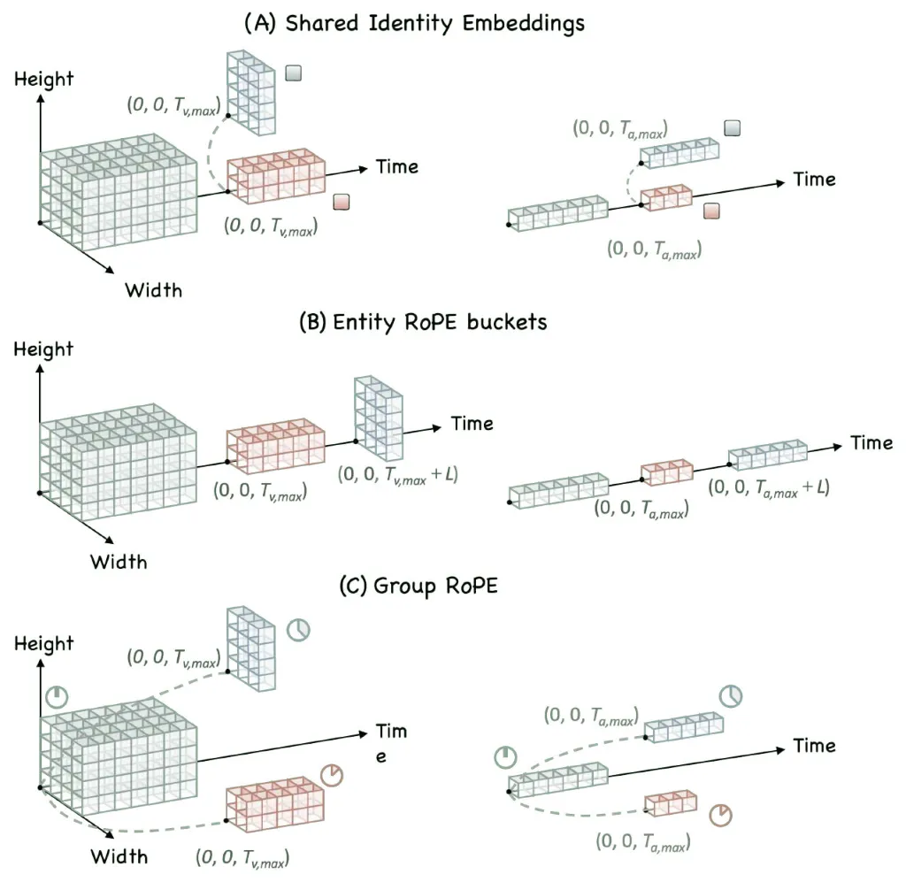

Figure A: Three appearance-voice binding variants aligned with the
main-paper ablation. (A) Shared Identity Embeddings (IE) assign the same
learnable embedding to each subject’s visual and audio references.
(B) RoPE Offset (Entity RoPE buckets) places different subjects in
separate temporal RoPE ranges. (C) Rotary Bias (Group RoPE) retains
shared temporal positions and distinguishes subjects with group-specific
rotary biases. Green denotes noisy target tokens. Red and blue denote
references from two subjects.

## Additional Ablation Details

Figure A illustrates three alternatives for encoding subject identity in
visual and audio reference tokens. All variants use the same LTX-2.3
dual-tower backbone and differ only in the binding signal.

- •
  A Shared Identity Embeddings (IE): all subjects share the same RoPE
  start positions, and the visual and audio reference tokens of each
  subject $`k`$ receive the same learnable identity embedding
  $`e^{id}_{(k)}`$.
- •
  B RoPE Offset (Entity RoPE buckets): following Syn-RoPE-style
  positioning (Guo et al. 2026), we remove IE and assign each subject a
  non-overlapping temporal RoPE range beyond the generation horizon.
- •
  C Rotary Bias (Group RoPE): references are placed at
  $`T_{v,\max}{=}0`$ and $`T_{a,\max}{=}0`$ (not beyond the generation
  horizon as in A), and a group rotary bias $`R_{\mathrm{group}}(g)`$
  aligns same-person cross-modal references.

A is most reliable on FM/SM. Unlike B, it does not entangle identity
with the temporal axis or rely on large RoPE offsets as the subject
count grows. C reuses in-timeline reference indices with a
continuous-phase prior, which is less explicit than a shared discrete
identity code. Text-anchored RoPE, such as SA-MRoPE (Chen et al. 2026b),
is similarly geometric and complements the caption structure rather than
replacing A.

Subject anchors act on the text side rather than on reference RoPE.
Dense captions often mix speakers and blur who should appear. Anchored
spans tie appearance and speech turns to the same subject ID, which is
why A+SA improves multi-subject grounding beyond token-level IE alone.

On the training side, the main-paper curriculum table already shows
one-stage joint training lagging two-stage and full multi-view
fine-tuning under matched budgets. The last stage mainly adapts the
model to the two complementary reference layouts. Spatial packing vs.
temporal expansion under motion is shown qualitatively in
Section “Additional Qualitative Results”.

## Additional Qualitative Results

We expand the qualitative analysis in the main paper along cross-domain
generalization, text-reference disentanglement, and spatio-temporal
multi-view conditioning, and provide additional single-/multi-subject
results including non-vocal sound.

### Cross-domain generalization.

Although training uses only real-human identities, Figure B shows that
our model can personalize cartoon and animal subjects given matching
visual/voice references.

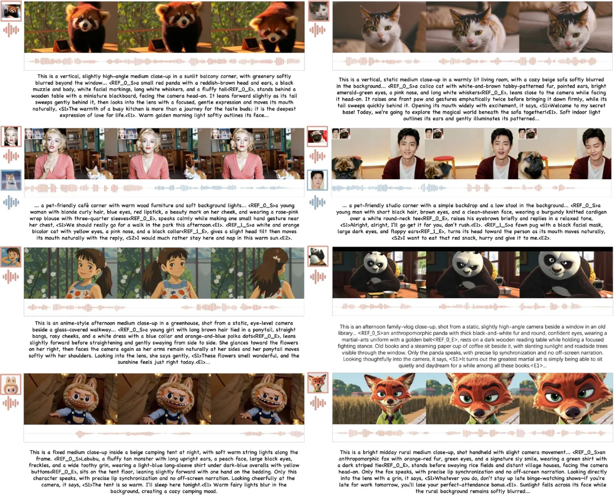

Figure B: Cross-domain personalization.

### Text-reference disentanglement.

Figure C starts from an _init_ generation that matches the reference ID,
scene, and outfit, then edits the prompt left to right: _change
expression_, _change scene_, and _change outfit_. The reference anchors
identity. Text controls which attributes are rewritten and which are
maintained.

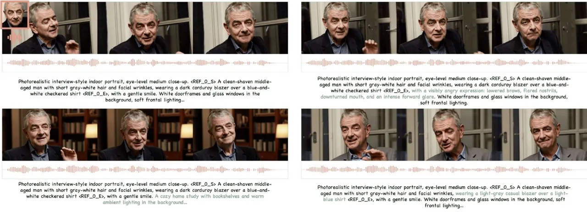

Figure C: Fixed reference, prompt edits (L$`\rightarrow`$R): init
generation; change expression; change scene; change scene+outfit.

### Spatiotemporal multi-view consistency.

Figure D compares one-shot injection with spatial packing and temporal
expansion. A single reference image provides limited identity evidence.
It lacks multi-view appearance and short-term dynamics such as
expression change. Spatial packing aggregates complementary viewpoints
for view-robust identity, while temporal expansion injects ordered
frames that capture dynamic appearance cues over time.

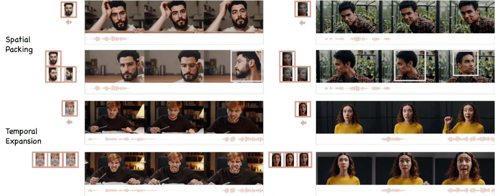

Figure D: Spatiotemporal multi-view references.

### Single-subject personalized generation

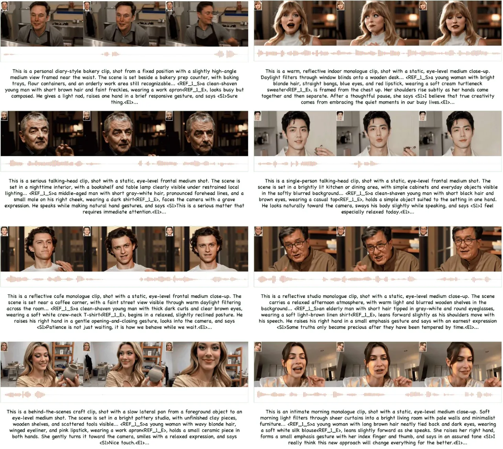

Figure E: Qualitative results of single-subject personalized joint
audio-video generation.

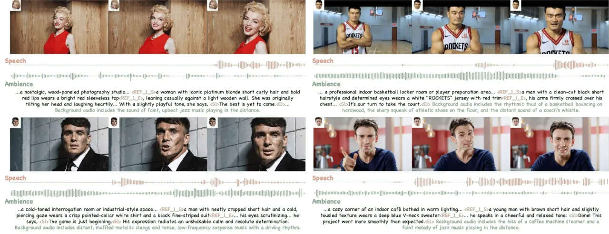

Figure F: Responding to audio descriptions in the prompt, the model
jointly synthesizes identity-preserving speech and ambient sounds that
stay consistent with the video.

Figure E presents additional results for single-subject personalized
joint audio-video generation. These results verify that our model
consistently preserves both facial appearance and vocal timbre across
diverse prompts and contexts. Figure F further shows that the model
follows audio descriptions in the prompt and generates speech together
with environmental sounds that remain harmonious with the video.

### Multi-subject personalized generation

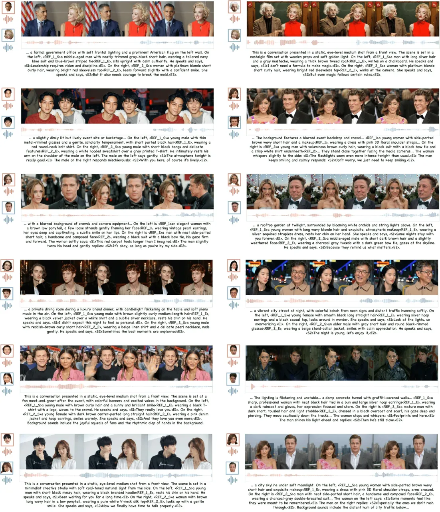

Figure G: Qualitative results of multi-subject personalized joint
audio-video generation.

We further evaluate multi-subject scenarios. As shown in Figure G, our
approach preserves the unique characteristics of each subject while
maintaining high visual fidelity.

## Limitations

High-quality identity-labeled audio-visual pairs remain scarce relative
to unimodal corpora. The multi-stage curriculum mitigates modality
imbalance but cannot invent missing joint diversity, so rare accents,
crowded multi-party dialogue, and atypical cameras stay
underrepresented. Filtering for lip-sync, pose, and speaker purity
further biases training toward clean studio-like clips. End-to-end R2AV
prioritizes appearance-voice binding and audio-visual coherence, so we
do not claim to match cascade systems whose speech comes from oracle TTS
on ground-truth transcripts. Finally, training uses short real-human
clips from $`4`$ to $`10`$ seconds. Minute-scale or streaming generation
is not validated. Even though Figure B shows encouraging cross-domain
generalization, cartoon and animal results remain zero-shot relative to
the real-human training distribution.

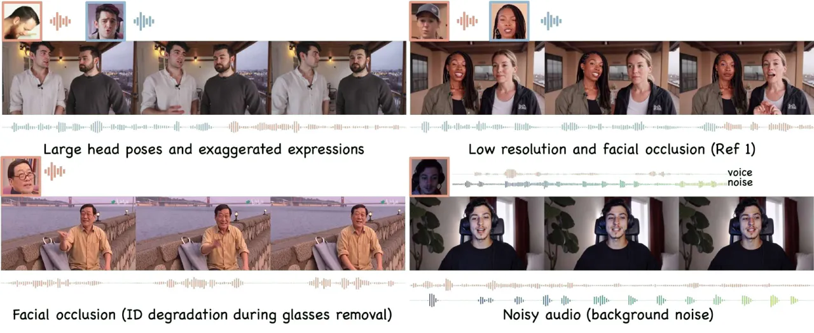

Figure H: Failure cases: large head pose, heavy facial occlusion,
extreme expression/pose, and noisy reference audio.

These biases surface when references leave that clean regime (Figure H).
Large head pose and heavy occlusion thin identity cues, extreme
expression or motion can break lip-expression consistency, and noisy or
cross-talk voice references weaken timbre cloning, with intermittent
speaker collapse in multi-subject clips. Spatio-temporal multi-view
references help on hard pose but do not remove these cases.
