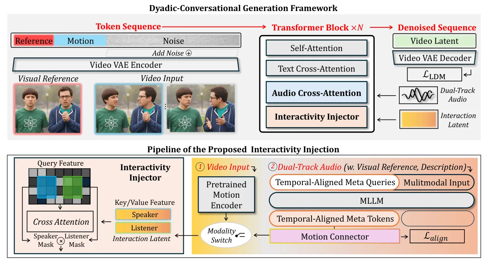
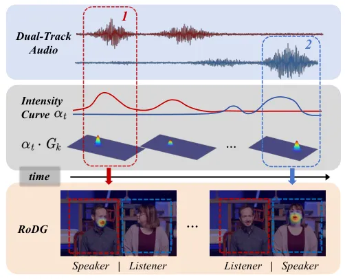
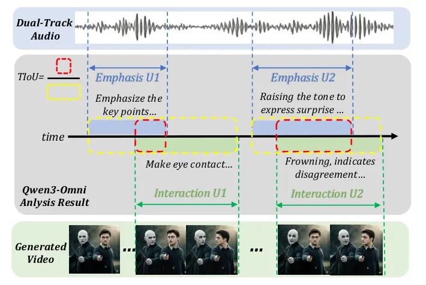
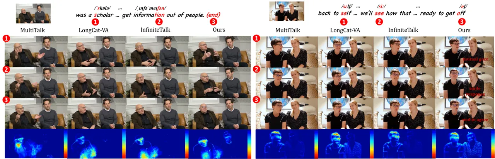
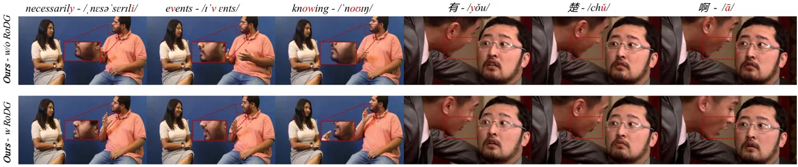
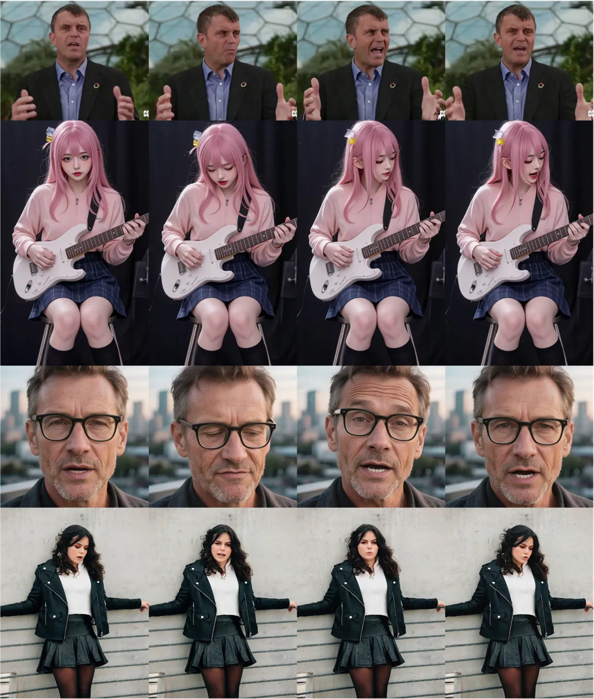

# InterDyad: Interactive Dyadic Speech-to-Video Generation by Querying Intermediate Visual GuidanceThanks: $`\dagger`$ Corresponding authors

Dongwei Pan Affiliation: Baidu Inc.
E-mail <%7Bpandongwei,wangkaisiyuan,zhouhang09%7D@baidu.com>    Longwei
Guo Affiliation: Baidu Inc.
E-mail <%7Bpandongwei,wangkaisiyuan,zhouhang09%7D@baidu.com>    Jiazhi
Guan Affiliation: Baidu Inc.
E-mail <%7Bpandongwei,wangkaisiyuan,zhouhang09%7D@baidu.com>    Luying
Huang Affiliation: Baidu Inc.
E-mail <%7Bpandongwei,wangkaisiyuan,zhouhang09%7D@baidu.com>    Yiding
Li Affiliation: Baidu Inc.
E-mail <%7Bpandongwei,wangkaisiyuan,zhouhang09%7D@baidu.com>    Haojie
Liu Affiliation: Baidu Inc.
E-mail <%7Bpandongwei,wangkaisiyuan,zhouhang09%7D@baidu.com>    Haocheng
Feng Affiliation: Baidu Inc.
E-mail <%7Bpandongwei,wangkaisiyuan,zhouhang09%7D@baidu.com>    Wei He
Affiliation: Baidu Inc.
E-mail <%7Bpandongwei,wangkaisiyuan,zhouhang09%7D@baidu.com>   
Kaisiyuan Wang^(†) Affiliation: Baidu Inc.
E-mail <%7Bpandongwei,wangkaisiyuan,zhouhang09%7D@baidu.com>    Hang
Zhou^(†) Affiliation: Baidu Inc.
E-mail <%7Bpandongwei,wangkaisiyuan,zhouhang09%7D@baidu.com>

###### Abstract

Despite progress in speech-to-video synthesis, existing methods often
struggle to capture cross-individual dependencies and provide
fine-grained control over reactive behaviors in dyadic settings. To
address these challenges, we propose InterDyad, a framework that enables
naturalistic interactive dynamics synthesis via querying structural
motion guidance. Specifically, we first design an Interactivity Injector
that achieves video reenactment based on identity-agnostic motion priors
extracted from reference videos. Building upon this, we introduce a
MetaQuery-based modality alignment mechanism to bridge the gap between
conversational audio and these motion priors. By leveraging a Multimodal
Large Language Model (MLLM), our framework is able to distill linguistic
intent from audio to dictate the precise timing and appropriateness of
reactions. To further improve lip-sync quality under extreme head poses,
we propose Role-aware Dyadic Gaussian Guidance (RoDG) for enhanced
lip-synchronization and spatial consistency. Finally, we introduce a
dedicated evaluation suite with novelly designed metrics to quantify
dyadic interaction. Comprehensive experiments demonstrate that InterDyad
significantly outperforms state-of-the-art methods in producing natural
and contextually grounded two-person interactions. Please refer to our
project page for demo videos:
 [https://interdyad.github.io/](https://interdyad.github.io/).

![[Uncaptioned
image]](arxiv-2603-23132--b9c3c4442b7e.figures/figure-1.webp)

Figure 1: Dyadic-Conversational Video Generated by InterDyad. Our method
generates visual-audio synchronized conversational videos conditioned on
a single reference frame of two subjects and dual-track driving audio,
either replicating interaction patterns from a reference video (yellow
results) or synthesizing plausible interactions directly from the
driving audio (blue results).

## 1 Introduction

The rapid advancement of video generation foundation models \[43, 23,
54, 9\] has led to significant milestones in producing high-fidelity
single-person animations \[11, 52, 25, 4\] from speech audio,
revolutionizing applications including education, financial services,
and digital entertainment. This progress naturally extends toward
multi-person co-presence scenarios, such as talk shows or situational
comedies, where the challenge lies in synthesizing multiple interacting
digital humans within a unified canvas to create cohesive multimedia
experiences.

To extend generative capacity from individual to multiple subjects,
several methods \[24, 52, 20, 57, 4, 21, 38, 41\] have explored diverse
audio-to-character binding strategies to achieve precise correspondence
control. Concurrently, large-scale multimodal generative models \[28,
35, 16, 34\] have also demonstrated the ability to synthesize
multi-person communication scenes by jointly generating audio and visual
contents. Despite these advancements, current paradigms primarily focus
on synchronization between dual-stream audio and individual motion
primitives (e.g., lip and limb dynamics), they largely overlook the
underlying interpersonal correlations between acoustic cues and
character interactions. Consequently, these models fail to capture the
reactive non-verbal dynamics essential for realistic multi-person
synthesis, leading to not coherent results.

Our objective is to develop a cost-effective dyadic human video
generation framework that synthesizes two characters engaging in
coherent, interactive behaviors with the driving speech. However,
several challenges exist in achieving such a goal: 1) A straightforward
idea is to drive dyadic interactions by manual text prompts. However, a
fundamental discrepancy exists between static linguistic descriptions
and the dynamic rhythmic nuances of speech. This reliance on high-level
text inherently lacks the temporal precision required to trigger subtle
reactive behaviors, such as a timely nod synchronized with a speaker’s
emphasis. While scaling datasets with dense linguistic annotations could
theoretically enhance control, the requirement for such granular
labeling presents a significant scalability bottleneck due to the
prohibitive manual overhead. 2) Predicting interactive dynamics directly
from speech audio is complicated by the inherent cross-modality
discrepancy. The absence of an explicit bridge between a speaker’s audio
and a listener’s response hinders the direct prediction of reactive
movements, which consequently results in the difficulty of learning
temporal synchrony essential for natural interaction. 3) Natural
interaction necessitates frequent head rotations and mutual gaze,
leading to large-angle profile views. Such extreme poses often result in
the degradation of lip-sync accuracy and facial identity, as standard
Speech-to-Video Generation backbones are typically optimized for
near-frontal or limited-range motion.

To cope with the aforementioned issues, we present InterDyad,
Interactive Dyadic Speech-to-Video Generation by Querying Intermediate
Visual Guidance Framework. Our key insight is to construct a bridge
between speech audio and dyadic interactive dynamics by leveraging
identity-agnostic motion representations derived from interactivity
reference videos.

Specifically, we propose a two-stage training procedure designed to
eliminate cross-modal discrepancy. In the first stage, we introduce a
video reenactment branch named Interactivity Injector that characterizes
interactive dynamics by extracting motion latents as primary driving
signals for interactions. By integrating these visual-based motion
priors into a pretrained audio-conditional video generation backbone, we
achieve explicit dyadic pose control without compromising audio-visual
synchronization. This stage ensures our model can prioritize
high-fidelity, natural motion synthesis independently of the
complexities involved in direct audio-to-video mapping.

In the second stage, we leverage MetaQuery \[31\] as Modality Alignment
to bridge the remaining gap between the speaker’s audio and the
pre-established motion space. By using MetaQuery as a learnable
interface, we effectively map the speech signals into the motion space
optimized in the first stage. Specifically, we employ a Multimodal Large
Language Model (MLLM) to distill linguistic intent from the speaker’s
audio. This design ensures that reactive behaviors—such as responsive
postural shifts—are synthesized with superior temporal synchrony and
contextual groundedness. To maintain high-fidelity synthesis under the
resulting extreme perspectives, we propose Role-aware Dyadic Gaussian
Guidance (RoDG), which implements a controllable Gaussian distribution
to adaptively prioritize audio-conditioned CFG within the oral region.
By imposing a spatially-weighted emphasis on acoustic-visual
synchronization, this strategy ensures robust lip-sync accuracy even
during significant postural transitions.

Our contributions are summarized as: 1) We propose InterDyad, a
Dyadic-Conversational Generation Framework that enables explicit
orchestration of interaction patterns through the Interactivity Injector
and the MetaQuery-based Modality Alignment mechanism. By leveraging
MetaQueries to translate conversational audio into interaction priors,
this design effectively bridges the modality gap and enables characters
to exhibit contextually grounded non-verbal reactions. 2) We optimize
dyadic interaction quality via Role-aware Dyadic Gaussian Guidance
(RoDG), which adaptively intensifies speaker-specific acoustic
constraints to ensure precise lip-synchronization and reactive
coordination. 3) We design a dedicated evaluation suite for dyadic
interactivity, introducing metrics to quantify interaction in spatio &
temporal coordination, with extensive experiments validating our
framework’s superiority.

## 2 Related Work

### 2.1 Audio-driven Video Generation for Multi-person Scenes

Speech-driven human video generation has gradually shifted from
two-stage motion–rendering pipelines to diffusion-based end-to-end
synthesis conditioned on audio and appearance \[15, 48, 12, 40, 11, 4,
10, 26\]. Recent methods extend this paradigm to multi-person scenarios
by exploring different strategies for audio-to-character binding and
spatial conditioning. For multi-speaker S2V, MultiTalk \[24\] introduces
Label Rotary Position Embedding (L-RoPE) to associate identities with
their corresponding audio streams. Building upon this,
InfiniteTalk \[52\] proposes a sparse-frame reference mechanism to
address consistency and enable coherent video dubbing for long-duration
sequences. Subsequently, LongCat-Video-Avatar \[39\] ensures natural
body behaviors by disentangling audio signals from motion dynamics
during extended synthesis. Additionally, some other works  \[57, 26,
47\] enhance robustness in complex identity binding and large-scale
animation through identity-aware attention, diverse motion conditions,
or layout-aware masks. In parallel with the evolution toward Unified
Audio-Visual Generation, multimodal generative models such as
MoVA \[35\] and related unified audio-visual generators \[28, 34, 16,
13, 14\] further demonstrate the ability to synthesize synchronized
multi-person audiovisual content through joint token generation.
However, these visual/audio-visual generators primarily emphasize
synchronization and identity alignment, lacking explicit designs for
complex interactive dynamics. In contrast, our framework enables direct
cross-modal steering for dyadic interaction patterns through an
Interactivity Injector and a MetaQuery-based Modality Alignment
mechanism, ensuring both interactivity and precise coordination.

### 2.2 Interactivity Control and Listener-aware Generation

Listener-aware generation aims to synthesize non-verbal feedback
conditioned on speaker signals \[58\]. To this end, INFP \[60\] adopts a
two-stage design that maps dual-track audio to a learned motion latent
space, enabling automatic transitions between speaking and listening
states; DiTaiListener \[36\] leverages video diffusion with a
segment-based design to enhance listener response consistency
conditioned on the speaker’s facial motions. Beyond offline synthesis,
empowered by recent advancements in autoregressive video diffusion that
tackle error accumulation for minute-scale and real-time generation \[3,
7, 18, 27\], recent works have explored streaming conversational avatars
for real-time interaction \[52, 44, 22\]. Specifically, Live
Avatar \[19\] enables prompt-driven behavior transitions under strict
latency budgets by optimizing inference pipelines. However, most
existing conversation synthesis systems \[30, 32, 50\] are restricted to
split-screen or frontal settings, which only account for individual
behaviors in isolation. While recent advancements have made strides in
capturing holistic human motions—such as GestureHYDRA \[51\], which
utilizes a hybrid modality Diffusion Transformer and retrieval-augmented
generation for semantic co-speech gesture synthesis—achieving explicit
interaction guidance and modeling the joint interaction between speaker
and listener in shared-canvas video scenes remains formidable. Motivated
by these challenges, InterDyad introduces a unified framework
integrating reference-driven interaction control with MLLM-based
reasoning for coherent dyadic video synthesis.

## 3 Method

Given a visual reference image $`I`$ containing two subjects denoted by
$`k\in\{1,2\}`$, dual-track audio streams
$`\mathbf{a}=\{\mathbf{a}_{1},\mathbf{a}_{2}\}`$, and a text prompt
$`c_{\text{text}}`$, our primary objective is to synthesize a sequence
of dyadic video frames $`\mathbf{V}=\{v_{1},v_{2},\dots,v_{T}\}`$. The
generated video must ensure that both characters maintain strict
identity consistency, precise audio-lip synchronization, and
contextually appropriate inter-agent dynamics. As illustrated in Fig. 2,
we propose InterDyad, a Dyadic-Conversational Generation Framework
designed for end-to-end video synthesis conditioned on dual-person
dialogue input.

### 3.1 Preliminaries

#### Video Foundation Model.

We build our framework upon a flow-based Diffusion Transformer
(DiT) \[43\]. During training, given a visual reference $`I`$ and a
target video $`\mathbf{V}`$, a VAE \[43\] encodes them into a
spatio-temporal latent
$`\mathbf{z}_{0}\in\mathbb{R}^{C\times T\times H\times W}`$. Conditions
including text $`c_{\text{text}}`$, image $`c_{\text{img}}`$ and audio
embeddings $`c_{\text{audio}}`$ are formulated as a joint condition set
$`\mathbf{c}=\{c_{\text{text}},c_{\text{img}},c_{\text{audio}}\}`$. The
DiT learns a target velocity field $`\mathbf{v}_{t}`$ by minimizing the
flow matching objective:

```math
\mathcal{L}_{\text{LDM}}=\mathbb{E}_{\mathbf{z}_{0},\mathbf{z}_{1},t}\left[\|\mathbf{v}_{t}(\mathbf{z}_{t},t,\mathbf{c})-(\mathbf{z}_{0}-\mathbf{z}_{1})\|_{2}^{2}\right], \tag{1}
```

where $`\mathbf{z}_{t}=t\mathbf{z}_{0}+(1-t)\mathbf{z}_{1}`$
interpolates between the data $`\mathbf{z}_{0}`$ and initial noise
$`\mathbf{z}_{1}\sim\mathcal{N}(0,\mathbf{I})`$ at timestep
$`t\sim\mathcal{U}(0,1)`$. For long-duration generation, we employ a
multi-clip inference strategy, utilizing motion latents as temporal
anchors and $`I`$ as a global anchor to ensure temporal consistency and
identity preservation.

#### Speech-Driven Two-Person Generation.

Generating dyadic videos requires processed dual-track audio streams
($`\mathbf{a}_{1},\mathbf{a}_{2}`$). Following InfiniteTalk \[52\], we
adopt Audio Cross-Attention equipped with Label Rotary Position
Embedding (L-RoPE) \[24\] for precise audio-spatial alignment. L-RoPE
modulates the queries $`\mathbf{q}_{m}`$ and keys $`\mathbf{k}_{n}`$
using identity-specific spatial labels $`l`$:

```math
\hat{\mathbf{q}}_{m}=\mathbf{q}_{m}e^{il_{m}\theta_{\text{base}}},\quad\hat{\mathbf{k}}_{n}=\mathbf{k}_{n}e^{il_{n}\theta_{\text{base}}}, \tag{2}
```

where $`i`$ is the imaginary unit, $`m,n`$ denote token indices, and
$`\theta_{\text{base}}`$ is a base angle. By assigning distinct label
ranges to the visual tokens of Person 1 and Person 2 via spatial masks,
and matching them with corresponding audio embeddings, this mechanism
strictly binds acoustic features to their respective spatial latents.



Figure 2: Overview of our InterDyad framework. Top: The overall
architecture is constructed by sequentially stacking Transformer blocks
and trained via denoising to synthesize dyadic conversational videos
with synchronized audio-visual human dynamics and coherent inter-subject
interactions. Bottom: We illustrate the interactivity injection
mechanism, which leverages switchable multimodal inputs to enable rich
and controllable synthesis of interactive motion patterns.

### 3.2 Dyadic-Conversational Generation Framework

Current speech-to-video paradigms typically treat dyadic interaction as
an implicit byproduct of joint generation, which often yields “passive”
characters lacking fine-grained reactive behaviors. To bridge the gap
between static co-presence and authentic interaction, we propose a
framework that enables explicit orchestration of interaction patterns.
Central to our approach is the formal definition of conversational roles
within the shared canvas: for each interaction cycle, we assign the
participants as the Speaker ($`S`$) and the Listener ($`L`$). This
role-based formulation allows us to explicitly model the
cross-individual dependency where the listener’s non-verbal feedback is
dynamically conditioned on the speaker’s cues. As illustrated in the
bottom part of Fig. 2, our framework operates through a dual-mechanism
design tailored to the core challenges of dyadic synthesis. To address
the challenge of modeling stochastic cross-individual dependencies, we
first introduce Interactivity Injector for the direct injection of
behavioral priors. By treating interaction as a steerable modality, this
module extracts Interaction Patterns from Video Inputs to prescribe
specific states and subtle reactive behaviors (e.g., postural shifts or
head nods) to either participant. To inherently support direct,
cross-modal guidance from conversational audio while bridging modality
discrepancies, we further incorporate a Modality Alignment mechanism
that leverages an intermediary MetaQuery to derive context-aware
interaction patterns from the Dual-Track Audio, fostering more natural
and frequent interactivity between Speaker and Listener.

#### Interactivity Injector.

To achieve explicit guidance over dyadic interactions, we introduce the
Interactivity Injector, which enables the framework to steer non-verbal
speaker-listener behaviors directly via video inputs as visual
reference. Unlike conventional dyadic generation \[24, 52, 39, 11\],
where interaction states are often treated as implicit latent features
entangled within the synthesis process, our module extracts high-level
interaction patterns from a reference video input and injects them as
prior-driven modulations into the synthesis process.

Following LIA \[45, 46\] and Wan-Animate \[5\], we employ a pre-trained
motion encoder to extract identity-agnostic interaction latent
$`\mathbf{m}_{k}`$ for Speaker and Listener $`k\in\{S,L\}`$ from
reference videos. This ensures the captured dynamics are strictly
decoupled from appearance, providing steerable interaction priors for
the synthesis. To avoid modal conflicts between reference lip movements
and target audio, we apply a Lips-Masking Strategy: the oral regions are
masked before encoding. This ensures the extracted priors—such as head
tilts and nods—focus exclusively on non-verbal dynamics, preventing
interference with audio-driven lip synchronization.

To integrate the extracted interaction latent of both Speaker and
Listener into the diffusion backbone while maintaining strict identity
binding, we implement a straightforward yet effective Spatial-Masking
Cross-Attention Mechanism. This operation ensures that the behavioral
cues for each participant are localized to their respective spatial
coordinates, preventing feature leakage between the Speaker and
Listener. Specifically, we adaptively track the spatial localization of
each individual to generate binary masks $`\mathbf{M}_{k}\in\{0,1\}`$
for both the Speaker and Listener $`k\in\{S,L\}`$. These masks act as
spatial constraints within the attention layers. The injection is
formulated as:

```math
\mathbf{z}_{\text{inter}}=\sum_{k\in{S,L}}\mathbf{M}_{k}\odot\text{Softmax}\left(\frac{\mathbf{Q}(\mathbf{K}_{k})^{\top}}{\sqrt{d}}\right)\mathbf{V}_{k}, \tag{3}
```

where $`\mathbf{Q}`$ is derived from the video latents
$`\mathbf{z}_{t}`$, and $`\mathbf{K}_{k},\mathbf{V}_{k}`$ are projected
from the interaction latent $`\mathbf{m}_{k}`$ of person $`k`$. By
restricting the attention influence within $`\mathbf{M}_{k}`$, we force
a direct correspondence between reference dynamics and target
identities. This mechanism allows for fine-grained control by enabling
the injection of specific interaction patterns from a reference video
during inference.

#### Modality Alignment with MetaQueries.

While the injection module enables explicit steering, synthesizing
contextually appropriate interaction states remains a significant
challenge due to the stochastic many-to-many mapping between
conversational audio and non-verbal interaction of dyadic speakers. To
address this, we introduce a Modality Alignment module to translate
acoustic contexts into synchronized motion dynamics as intermediate
guidance, enabling to derive interaction patterns from dual-track audio.

Specifically, we leverage a frozen pre-trained MLLM (Qwen3-Omni \[49\])
as a multimodal encoder to extract context-aware interaction priors.
Beyond the dual-track conversational audio $`a_{k}`$, we provide the
visual reference $`I`$ and text description $`\mathbf{c}_{\text{text}}`$
as additional inputs to the encoder. This allows the model to perceive
the initial spatial relationship and identity-specific
traits(Speaker/Listener) from the first frame, while grounding the
interactive intent in the provided linguistic context. To bridge the gap
between these high-level multimodal cues and interaction patterns, we
adopt the Meta-Queries \[31\] paradigm by introducing a set of learnable
query tokens. Unlike the original formulation that utilizes a unordered
query set, we structure these tokens as a Temporal-Aligned Meta-Query
Sequence $`\mathcal{Q}\in\mathbb{R}^{N\times D}`$. In our
implementation, we enforce a strict one-to-one correspondence between
the $`N`$ query tokens and the $`N`$ acoustic frames within each
training crop, ensuring that each query token is anchored to a specific
temporal position. The interaction-specific hidden states, sliced from
the MLLM backbone’s output at the meta-query positions, are subsequently
refined by a Temporal Connector Network comprising: (i) 1D-Convolutional
layers for local neighbor-frame modeling; (ii) Transformer Encoder
layers for long-range dependency capture; and (iii) a Linear layer for
dimension modulation. The connector outputs the predicted dyadic
interaction patterns $`\hat{\mathbf{m}}`$. To ensure both motion
fidelity and kinematic smoothness, we optimize the modality alignment
module via a joint objective function:

```math
\mathcal{L}_{\text{align}}=\|\mathbf{m}-\hat{\mathbf{m}}\|_{2}^{2}+\|\Delta\mathbf{m}-\Delta\hat{\mathbf{m}}\|_{2}^{2}, \tag{4}
```

where $`\mathbf{m}`$ represents the ground-truth interaction patterns,
and $`\Delta`$ denotes the temporal difference operator. The first term,
MSE loss ensures point-wise alignment, while the second term, the
temporal loss, enforces temporal coherence and mitigates motion jitter.
By optimizing this cross-modality mapping, our framework achieves
explicit guidance over dyadic interactions directly from dual-track
audio inputs, effectively deriving high-fidelity interactive patterns to
steer the subsequent diffusion process.

### 3.3 Dyadic Conversational Inference

#### Role-Aware Dyadic Gaussian Guidance (RoDG).

A distinct difficulty in dyadic synthesis arises from frequent head
rotations and mutual gaze, which lead to extreme profile views. Under
these severe perspective shifts, the visual integrity of the oral region
is often compromised, causing standard generation backbones to struggle
with lip-synchronization accuracy.

To address this, we extend the dynamic guidance paradigm from
OmniSync \[33\] and propose Role-aware Dyadic Gaussian Guidance, which
implements a role-adaptive optimization strategy during inference (as
visualized in Fig. 4). Specifically, during each denoising step, we
detect the active Speaker $`S`$ and the Listener $`L`$ based on
VAD-estimated speech activity from the two audio tracks, which is also
used to derive a frame-wise boosting intensity curve
$`\boldsymbol{\alpha}=\{\alpha_{t}\}_{t=1}^{T}`$. We then spatially
localize the audio guidance by constructing identity-specific 2D
Gaussian maps $`\mathbf{G}_{k}`$ for each person $`k\in\{1,2\}`$. The
speaker’s map is activated with a peak centered at the lip location
$`\mu_{\text{lip},S}`$, while the listener’s map is set to zero to
prevent audio guidance from leaking to the non-speaking mouth region.
The audio Classifier-Free Guidance (CFG) scale $`w_{a}`$ is then
spatially modulated as:

```math
w_{a}(\mathbf{x},t)=w_{\text{base}}+\alpha_{t}\cdot\sum_{k\in{1,2}}\mathbb{I}(k=S_{t})\cdot\mathbf{G}_{k}(\mathbf{x};\mu_{\text{lip},k},\sigma), \tag{5}
```

where $`\mathbb{I}(\cdot)`$ is an indicator function for speaker
activation, $`w_{\text{base}}`$ is the baseline scale, $`\sigma`$
controls the refinement radius, and $`\alpha_{t}`$ is the VAD-derived
frame-wise boosting intensity at frame $`t`$. By concentrating the
intensified acoustic conditioning precisely on the speaker’s oral region
while bypassing the listener, this mechanism ensures robust lip
reconstruction from audio cues even under degraded visual signals.

### 3.4 Dyadic Interactivity Evaluation

To quantitatively evaluate the nuanced coordination and mutual influence
within two-person conversational scenes, we propose a comprehensive
evaluation suite, specifically designed to capture dyadic interactivity
across two complementary dimensions: temporal synchrony and spatial
vitality.

#### Dyadic Interaction Temporal Synchrony (DI-Sync).

The DI-Sync(Fig.  4) metric quantifies the causal coordination between
the speaker’s verbal cues and the listener’s non-verbal responses.
Unlike frame-level lip-sync metrics, DI-Sync focuses on high-level
interaction timing. We leverage a Multimodal Large Language Model
(Qwen3-Omni \[49\]) to extract the temporal segments of prosodic
emphasis from the audio ($`\mathcal{T}_{\text{audio}}`$) and the
corresponding reactive behaviors from the generated video
($`\mathcal{T}_{\text{video}}`$). DI-Sync is formulated as the Temporal
Intersection over Union (TIoU) with a social latency compensation
$`\delta`$:

```math
\text{DI-Sync}=\frac{|\mathcal{T}_{\text{audio}}\cap\text{Shift}(\mathcal{T}_{\text{video}},\delta)|}{|\mathcal{T}_{\text{audio}}\cup\text{Shift}(\mathcal{T}_{\text{video}},\delta)|} \tag{6}
```

where $`\text{Shift}(\cdot,\delta)`$ aligns the listener’s response by
compensating for the natural human reaction delay. Following the
empirical observation of social latency, $`\delta`$ is set to $`0.5s`$
in our experiments. A higher DI-Sync indicates superior temporal
intelligence in responding to conversational stimuli.

#### Dyadic Interaction Saliency (DI-Sali).

Extending AnyTalker’s \[57\] listener-centric intensity metric, we
propose DI-Sali to evaluate the holistic engagement of dyadic scenes.
Unlike isolated listener metrics, DI-Sali captures co-motion dynamics by
aggregating inter-frame landmark displacements from both Speaker ($`S`$)
and Listener ($`L`$), specifically targeting the signal-rich ocular and
periorbital regions:

```math
\text{DI-Sali}=\frac{1}{T-1}\sum_{t=1}^{T-1}\left(\Delta E_{S}(t,t+1)+\Delta E_{L}(t,t+1)\right) \tag{7}
```

where $`\Delta E`$ denotes the mean Euclidean distance of eye-related
landmarks. By measuring the interactive pair’s collective movement,
DI-Sali effectively quantifies the spatial vitality and mutual
involvement of the generated conversation.



Figure 3: RoDG. RoDG uses dual-track VAD to assign Speaker and Listener
over time, boosting audio guidance on the speaker’s lip Gaussian while
suppressing the listener to avoid cross-talk.



Figure 4: DI-Sync. Audio union of prosodic emphasis and Video union of
reactive behaviors are extracted by MLLM, then Temporal Intersection of
Union(TIoU) are calculated.

## 4 Experiments

### 4.1 Datasets

We establish a large-scale, high-fidelity dyadic interaction dataset
through a cascaded curation pipeline. From an extensive pool of
in-the-wild videos, we first apply heuristic thresholds to filter out
clips with low resolution and severe camera jitter. Next, we employ
DWPose \[53\] to robustly isolate 4M dyadic candidates. To build
strictly aligned audio-visual pairs, we perform synchronization
processing to retain the full dyadic video sequences alongside the
isolated acoustic tracks of each individual. Crucially, to ensure the
dataset captures rich inter-agent dynamics rather than static talking
heads, we enforce a subsequent DWPose-driven large-motion filter,
refining the pool to 3M clips. After a final clarity check, we obtain
700,000 high-quality videos, all standardized to at least 720P, 25 FPS,
and 3-10 seconds in length. A test set of 100 diverse cases is randomly
sampled for evaluation. Further details are provided in the
Supplementary Material.

### 4.2 Experimental Settings

#### Implementation Details.

We adopt Wan2.1-I2V-14B \[43\] as our foundational video diffusion
model. Following the generation paradigm of InfiniteTalk \[52\], we
utilize Wav2Vec \[1\] for audio embedding and generate 81-frame video
chunks conditioned on a context window of 9 images. To leverage robust
generative priors, we use the pretrained motion encoder from
Wan-Animate \[5\], and initialize the cross-attention layer in
Interactivity Injector also from Wan-Animate. The entire framework is
optimized through a streamlined two-stage training paradigm:

Stage 1: Modality Alignment. We exclusively train the Modality Alignment
module to bridge the gap between audio modal and interaction patterns.
Utilizing the temporal-aligned Meta-Queries \[31\], this stage distills
context-aware interaction priors from the frozen Qwen3-Omni \[49\]
encoder. This phase establishes a robust mapping from conversational
cues to motion space, converging in $`12`$ hours with $`6,000`$
iterations.

Stage 2: End-to-End DiT Fine-Tuning. We jointly optimize the
Interactivity Injector and the Audio Cross-Attention. This stage forces
the model to integrate interaction patterns with precise identity
binding via the Identity-Aware Cross-Attention mechanism. This
end-to-end process requires approximately 2 days to complete $`10,000`$
iterations.

#### Comparison methods.

We compare with representative speech-to-video generation methods,
including MultiTalk\[24\], InfiniteTalk\[52\], and
LongCat-Video-Avatar\[39\]. For each baseline, we follow the official
inference settings and use the same prompts and evaluation protocol
whenever applicable.

#### Evaluation Metrics.

We comprehensively assess our framework across three core dimensions:

Visual & Identity Quality: We report Fréchet Video Distance (FVD) \[42\]
and Fréchet Inception Distance (FID) \[17\] to evaluate the visual
fidelity of the generated frames. To measure Identity Consistency
(ID-Cons) in dyadic scenarios, we first extract the highest-confidence
face regions for both individuals from the ground-truth video as
references. We then compute the ArcFace \[8\] similarity score between
these reference crops and the faces detected in the generated frames,
verifying the strict preservation of the subjects’ facial appearances.

Audio-Visual Synchronization: We utilize Sync-C, Sync-D scores to
rigorously measure the accuracy of audio-driven lip movements.

Interactivity Reciprocity (Ours): To measure the interaction dynamics
between speaker and listener, we propose two new metrics. Dyadic
Interaction Temporal Synchrony (DI-Sync) measures the causal timing
alignment between the active speaker’s audio cues and the listener’s
non-verbal reactions. Dyadic Interaction Saliency (DI-Sali) evaluates
the co-motion dynamics by integrating inter-frame displacements from
both the Speaker and the Listener.

### 4.3 Evaluation Results

#### Quantitative Comparison.

We evaluate our method against state-of-the-art baselines on our curated
dyadic conversational dataset. As shown in Tab. 1, our approach
demonstrates competitive or better performance across most dimensions.
In terms of visual fidelity, our method improves upon existing
frameworks, yielding better scores in both FID and FVD. While
InfiniteTalk achieves a slightly higher ID-Cons score, this difference
can be attributed to the enhanced interactivity produced by our
framework. Specifically, our method generates more natural and dynamic
behaviors, frequently resulting in challenging poses such as
side-profile views, which inherently complicate face recognition and
identity preservation metrics. This increased level of dynamic
engagement is quantitatively supported by our higher scores on the
proposed interactivity metrics. Furthermore, generating accurate lip
movements in dyadic scenarios is challenging due to face-to-face spatial
orientations. Nevertheless, our framework shows strong audio-visual
alignment, achieving better Sync-C and Sync-D scores \[6\] than the
baselines.

Regarding the proposed interactivity metrics, our method shows clear
improvements. Because existing baselines typically lack dedicated
interaction modules, they often produce static or less responsive
listener behaviors. By explicitly modeling interaction dynamics via the
Modality Alignment mechanism, our approach attains higher DI-Sync and
DI-Sali scores compared to the evaluated baselines. This supports the
effectiveness of our framework in generating more natural, temporally
synchronized, and contextually appropriate reciprocal reactions in
two-person conversations.

| Method              | Visual & Identity  |                    |                      | Synchronization     |                       | Interactivity (Ours) |                      |
| ------------------- | ------------------ | ------------------ | -------------------- | ------------------- | --------------------- | -------------------- | -------------------- |
|                     | FID $`\downarrow`$ | FVD $`\downarrow`$ | ID-Cons $`\uparrow`$ | Sync-C $`\uparrow`$ | Sync-D $`\downarrow`$ | DI-Sync $`\uparrow`$ | DI-Sali $`\uparrow`$ |
| MultiTalk \[24\]    | 49.6047            | 477.6189           | 0.5275               | 3.2253              | 5.8941                | 0.2333               | 0.8889               |
| InfiniteTalk \[52\] | 46.3762            | 440.6732           | 0.6418               | 3.0446              | 5.5412                | 0.2371               | 0.8560               |
| LongCat-VA \[39\]   | 45.4698            | 548.8332           | 0.6059               | 3.1985              | 5.7200                | 0.2417               | 1.1145               |
| Ours                | 38.3260            | 415.5064           | 0.6310               | 3.3067              | 4.1786                | 0.2747               | 1.2349               |

Table 1: Quantitative comparison on our curated dyadic conversational
dataset. LongCat-VA denotes LongCat-Video-Avatar. “$`\uparrow`$”
indicates higher is better, and “$`\downarrow`$” indicates lower is
better. Best results are bolded, and the second best are underlined.

#### Qualitative Comparison.

To further evaluate visual fidelity and inter-subject dynamics, we
present qualitative comparisons between InterDyad and existing
baselines, as illustrated in Fig. 5. When analyzing the generated
sequential frames, we specifically focus on the interaction and mutual
engagement between the two participants. Because existing methods lack
explicit interaction modeling, they typically struggle to capture
co-motion dynamics, often producing static, independent subjects when
rendering two agents within the same scene. In contrast, driven by our
Cross-Modality Visual Guidance, our framework consistently generates
natural, contextually grounded interactions. For instance, as shown on
the left of Fig. 5, only our method enables the listener to turn his
head toward the active speaker. Similarly, on the right, our framework
uniquely produces natural side-profile nodding in response to the
speaker’s cues. Furthermore, to intuitively visualize this dynamic
engagement, we provide accumulated motion heatmaps in the bottom row of
Fig. 5. These heatmaps track the overall motion intensity of the
characters over time, clearly demonstrating that the listener’s reaction
intensity in InterDyad is substantially stronger and more active
compared to the other baselines. Overall, InterDyad ensures that
listener responses are both frequent and triggered at the appropriate
semantic moments, significantly enhancing the expressiveness of the
dyadic interaction while preserving precise lip synchronization during
active speech. Additional dynamic results are provided in the
supplementary demo video.



Figure 5: Qualitative comparison with existing baselines. The figure
illustrates the generated inter-subject dynamics from different methods,
where the numbers in red dots indicate three different timestep.
Accumulated motion heatmaps are provided in the bottom row to visualize
reaction intensity.

### 4.4 Ablation Study

To thoroughly validate the effectiveness of our framework, we conduct
ablation studies focusing on the architectural designs for dyadic
interaction and the proposed inference optimization strategy.

Architectures for Dyadic Interaction. We evaluate the core components of
our multimodal interaction module using the proposed DI-Sync and DI-Sali
metrics, as showed in Tab. 2. First, when we remove the Interactivity
Injection Module during the inference stage, the framework loses its
direct control over behaviors. It reduces the overall sense of
interaction, making the communication between the two agents feel less
harmonious and results in a noticeable drop in both DI-Sync and DI-Sali
scores. Second, to validate the necessity of MLLM-driven semantic
reasoning, we replace our Modality Alignment module with a simple
Audio-to-Motion MLP encoder. While this standard network can capture
basic audio features, it struggles to understand the deeper context of
the conversation and leading to a decline in the DI-Sync and DI-Sali
metrics.

| Configuration               | Interactivity (Ours) |                      |
| --------------------------- | -------------------- | -------------------- |
|                             | DI-Sync $`\uparrow`$ | DI-Sali $`\uparrow`$ |
| w/o Interactivity Injection | 0.2041               | 0.7500               |
| w/o MLLM Modality Alignment | 0.2220               | 0.7800               |
| Ours                        | 0.2747               | 1.2349               |

Table 2: Ablation study on the core architectural designs. Best results
are bolded.

Inference Optimization Strategy. We further assess the impact of
Role-aware Dyadic Gaussian Guidance (RoDG) on visual quality and
audio-visual synchronization. In dyadic scenarios, extreme profile views
often severely degrade lip-synchronization. By focusing the audio
guidance directly on the active speaker’s lip area using VAD, RoDG
strengthens the lip generation. It is worth noting that standard
quantitative metrics (e.g., Sync-C and Sync-D) are inherently less
reliable for extreme side-profile views. Therefore, we conduct the
lip-sync evaluation of these severe perspective shifts in a qualitative
comparison manner. Specifically, we construct a specific hard-case set
comprising 20 reference videos with challenging large-angle side
profiles. Our results in Fig. 6 consistently exhibit accurate and robust
lip movements under such extreme cases, which demonstrates the
effectiveness of this training-free strategy. Please see the dynamic
results provided in our supplementary demo video.



Figure 6: Effect of RoDG on large-angle profile views. Compared to the
baseline without RoDG, our full method ensures robust and accurate lip
reconstruction for the active speaker under severe perspective shifts.

## 5 Discussion and Conclusion

#### Limitation.

While InterDyad enables explicit orchestration of high-fidelity dyadic
interactions, some limitations remain. First, the framework is currently
optimized for two-person scenarios and does not yet support multi-party
conversations involving complex turn-taking among three or more
participants. We leave the extension to multi-person settings for future
work.

#### Conclusion.

In this paper, we present InterDyad, a novel dyadic-conversational
generation framework that bridges the gap between dual-track audio and
realistic dyadic interaction patterns in shared-canvas scenes. By
introducing the Interactivity Injector and MetaQuery-based Modality
Alignment, our approach transcends traditional implicit generation,
enabling the explicit orchestration of context-aware non-verbal
behaviors from either reference videos or conversational audio. To
ensure high-fidelity synthesis under extreme poses, we further propose
RoDG to adaptively optimize lip-synchronization and coordination.
Furthermore, we establish a dedicated evaluation suite with DI-Sync and
DI-Sali metrics to quantify dyadic interactivity. Extensive experiments
demonstrate that InterDyad significantly advances the state-of-the-art
in synthesizing coherent, synchronized, and contextually grounded
two-person interactions, paving the way for more immersive multi-person
digital human experiences.

## References

- \[1\] A. Baevski, H. Zhou, A. Mohamed, and M. Auli (2020) Wav2vec 2.0:
  a framework for self-supervised learning of speech representations.
  External Links: 2006.11477, [Link](https://arxiv.org/abs/2006.11477)
  Cited by: §4.2.
- \[2\] S. Beliaev, Y. Rebryk, and B. Ginsburg (2020) TalkNet:
  fully-convolutional non-autoregressive speech synthesis model. arXiv
  preprint arXiv:2005.05514. Cited by: §6.
- \[3\] B. Chen, D. Martí Monsó, Y. Du, M. Simchowitz, R. Tedrake,
  and V. Sitzmann (2024) Diffusion forcing: next-token prediction meets
  full-sequence diffusion. Advances in Neural Information Processing
  Systems 37, pp. 24081–24125. Cited by: §2.2.
- \[4\] Y. Chen, S. Liang, Z. Zhou, Z. Huang, Y. Ma, J. Tang, Q. Lin, Y.
  Zhou, and Q. Lu (2025) Hunyuanvideo-avatar: high-fidelity audio-driven
  human animation for multiple characters. arXiv preprint
  arXiv:2505.20156. Cited by: §1, §1, §2.1.
- \[5\] G. Cheng, X. Gao, L. Hu, S. Hu, M. Huang, C. Ji, J. Li, D.
  Meng, J. Qi, P. Qiao, Z. Shen, Y. Song, K. Sun, L. Tian, F. Wang, G.
  Wang, Q. Wang, Z. Wang, J. Xiao, S. Xu, B. Zhang, P. Zhang, X.
  Zhang, Z. Zhang, J. Zhou, and L. Zhuo (2025) Wan-animate: unified
  character animation and replacement with holistic replication.
  External Links: 2509.14055, [Link](https://arxiv.org/abs/2509.14055)
  Cited by: §3.2, §4.2.
- \[6\] J. S. Chung and A. Zisserman (2016) Out of time: automated lip
  sync in the wild. In Asian conference on computer vision, pp. 251–263.
  Cited by: §4.3.
- \[7\] J. Cui, J. Wu, M. Li, T. Yang, X. Li, R. Wang, A. Bai, Y. Ban,
  and C. Hsieh (2025) Self-forcing++: towards minute-scale high-quality
  video generation. arXiv preprint arXiv:2510.02283. Cited by: §2.2.
- \[8\] J. Deng, J. Guo, J. Yang, N. Xue, I. Kotsia, and S.
  Zafeiriou (2022) ArcFace: additive angular margin loss for deep face
  recognition. IEEE Transactions on Pattern Analysis and Machine
  Intelligence 44 (10), pp. 5962–5979. External Links: ISSN 1939-3539,
  [Link](http://dx.doi.org/10.1109/TPAMI.2021.3087709),
  [Document](https://dx.doi.org/10.1109/tpami.2021.3087709) Cited by:
  §4.2, §7.1.
- \[9\] W. Fan, C. Si, J. Song, Z. Yang, Y. He, L. Zhuo, Z. Huang, Z.
  Dong, J. He, D. Pan, et al. (2025) Vchitect-2.0: parallel transformer
  for scaling up video diffusion models. arXiv preprint
  arXiv:2501.08453. Cited by: §1.
- \[10\] Q. Gan, R. Yang, J. Zhu, S. Xue, and S. Hoi (2025) OmniAvatar:
  efficient audio-driven avatar video generation with adaptive body
  animation. External Links: 2506.18866,
  [Link](https://arxiv.org/abs/2506.18866) Cited by: §2.1.
- \[11\] X. Gao, L. Hu, S. Hu, M. Huang, C. Ji, D. Meng, J. Qi, P.
  Qiao, Z. Shen, Y. Song, K. Sun, L. Tian, G. Wang, Q. Wang, Z. Wang, J.
  Xiao, S. Xu, B. Zhang, P. Zhang, X. Zhang, Z. Zhang, J. Zhou, and L.
  Zhuo (2025) Wan-s2v: audio-driven cinematic video generation. External
  Links: 2508.18621, [Link](https://arxiv.org/abs/2508.18621) Cited by:
  §1, §2.1, §3.2, §7.1, Table 4.
- \[12\] J. Guan, K. Wang, Z. Xu, Q. Yang, Y. Sun, S. He, B. Liang, Y.
  Cao, Y. Li, H. Feng, et al. (2025) Audcast: audio-driven human video
  generation by cascaded diffusion transformers. In Proceedings of the
  IEEE/CVF Conference on Computer Vision and Pattern Recognition,
  pp. 10678–10689. Cited by: §2.1.
- \[13\] J. Guan, Z. Xu, H. Zhou, K. Wang, S. He, Z. Zhang, B. Liang, H.
  Feng, E. Ding, J. Liu, et al. (2024) Resyncer: rewiring style-based
  generator for unified audio-visually synced facial performer. In
  European Conference on Computer Vision, pp. 348–367. Cited by: §2.1.
- \[14\] J. Guan, Z. Zhang, H. Zhou, T. Hu, K. Wang, D. He, H. Feng, J.
  Liu, E. Ding, Z. Liu, et al. (2023) Stylesync: high-fidelity
  generalized and personalized lip sync in style-based generator. In
  Proceedings of the IEEE/CVF Conference on Computer Vision and Pattern
  Recognition, pp. 1505–1515. Cited by: §2.1.
- \[15\] J. Guo, D. Zhang, X. Liu, Z. Zhong, Y. Zhang, P. Wan, and D.
  Zhang (2024) Liveportrait: efficient portrait animation with stitching
  and retargeting control. arXiv preprint arXiv:2407.03168. Cited by:
  §2.1.
- \[16\] Y. HaCohen, B. Brazowski, N. Chiprut, Y. Bitterman, A.
  Kvochko, A. Berkowitz, D. Shalem, D. Lifschitz, D. Moshe, E. Porat, et
  al. (2026) LTX-2: efficient joint audio-visual foundation model. arXiv
  preprint arXiv:2601.03233. Cited by: §1, §2.1.
- \[17\] M. Heusel, H. Ramsauer, T. Unterthiner, B. Nessler, and S.
  Hochreiter (2017) Gans trained by a two time-scale update rule
  converge to a local nash equilibrium. Advances in neural information
  processing systems 30. Cited by: §4.2, §7.1.
- \[18\] X. Huang, Z. Li, G. He, M. Zhou, and E. Shechtman (2025) Self
  forcing: bridging the train-test gap in autoregressive video
  diffusion. arXiv preprint arXiv:2506.08009. Cited by: §2.2.
- \[19\] Y. Huang, H. Guo, F. Wu, S. Zhang, S. Huang, Q. Gan, L. Liu, S.
  Zhao, E. Chen, J. Liu, and S. Hoi (2025) Live avatar: streaming
  real-time audio-driven avatar generation with infinite length.
  External Links: 2512.04677, [Link](https://arxiv.org/abs/2512.04677)
  Cited by: §2.2.
- \[20\] Y. Huang, W. Wang, S. Zhao, T. Xu, L. Liu, and E. Chen (2025)
  Bind-your-avatar: multi-talking-character video generation with
  dynamic 3d-mask-based embedding router. arXiv preprint
  arXiv:2506.19833. Cited by: §1.
- \[21\] J. Jiang, W. Zeng, Z. Zheng, J. Yang, C. Liang, W. Liao, H.
  Liang, Y. Zhang, and M. Gao (2025) Omnihuman-1.5: instilling an active
  mind in avatars via cognitive simulation. arXiv preprint
  arXiv:2508.19209. Cited by: §1.
- \[22\] T. Ki, S. Jang, J. Jo, J. Yoon, and S. J. Hwang (2026) Avatar
  forcing: real-time interactive head avatar generation for natural
  conversation. arXiv preprint arXiv:2601.00664. Cited by: §2.2.
- \[23\] W. Kong, Q. Tian, Z. Zhang, R. Min, Z. Dai, J. Zhou, J.
  Xiong, X. Li, B. Wu, J. Zhang, et al. (2024) Hunyuanvideo: a
  systematic framework for large video generative models. arXiv preprint
  arXiv:2412.03603. Cited by: §1.
- \[24\] Z. Kong, F. Gao, Y. Zhang, Z. Kang, X. Wei, X. Cai, G. Chen,
  and W. Luo (2025) Let them talk: audio-driven multi-person
  conversational video generation. External Links: 2505.22647,
  [Link](https://arxiv.org/abs/2505.22647) Cited by: §1, §2.1, §3.1,
  §3.2, §4.2, Table 1, §7.1, Table 4.
- \[25\] X. Li, P. Xie, Y. Ren, Q. Gan, C. Zhang, F. Kong, X. Yin, B.
  Peng, and Z. Yuan (2025) InfinityHuman: towards long-term audio-driven
  human. arXiv preprint arXiv:2508.20210. Cited by: §1.
- \[26\] G. Lin, J. Jiang, J. Yang, Z. Zheng, C. Liang, et al. (2025)
  OmniHuman-1: rethinking the scaling-up of one-stage conditioned human
  animation models. In Proceedings of the IEEE/CVF International
  Conference on Computer Vision (ICCV), Note: Highlight Cited by: §2.1.
- \[27\] K. Liu, W. Hu, J. Xu, Y. Shan, and S. Lu (2025) Rolling
  forcing: autoregressive long video diffusion in real time. arXiv
  preprint arXiv:2509.25161. Cited by: §2.2.
- \[28\] C. Low, W. Wang, and C. Katyal (2025) Ovi: twin backbone
  cross-modal fusion for audio-video generation. External Links:
  2510.01284, [Link](https://arxiv.org/abs/2510.01284) Cited by: §1,
  §2.1.
- \[29\] R. Meng, X. Zhang, Y. Li, and C. Ma (2025) Echomimicv2: towards
  striking, simplified, and semi-body human animation. In Proceedings of
  the Computer Vision and Pattern Recognition Conference, pp. 5489–5498.
  Cited by: §7.1.
- \[30\] E. Ng, J. Romero, T. Bagautdinov, S. Bai, T. Darrell, A.
  Kanazawa, and A. Richard (2024) From audio to photoreal embodiment:
  synthesizing humans in conversations. In Proceedings of the IEEE/CVF
  conference on computer vision and pattern recognition, pp. 1001–1010.
  Cited by: §2.2.
- \[31\] X. Pan, S. N. Shukla, A. Singh, Z. Zhao, S. K. Mishra, J.
  Wang, Z. Xu, J. Chen, K. Li, F. Juefei-Xu, J. Hou, and S. Xie (2025)
  Transfer between modalities with metaqueries. External Links:
  2504.06256, [Link](https://arxiv.org/abs/2504.06256) Cited by: §1,
  §3.2, §4.2.
- \[32\] S. Park, C. Kim, H. Rha, M. Kim, J. Hong, J. Yeo, and Y.
  Ro (2024) Let’s go real talk: spoken dialogue model for face-to-face
  conversation. In Proceedings of the 62nd Annual Meeting of the
  Association for Computational Linguistics (Volume 1: Long Papers),
  pp. 16334–16348. Cited by: §2.2.
- \[33\] Z. Peng, J. Liu, H. Zhang, X. Liu, S. Tang, P. Wan, D.
  Zhang, H. Liu, and J. He (2025) Omnisync: towards universal lip
  synchronization via diffusion transformers. arXiv preprint
  arXiv:2505.21448. Cited by: §3.3.
- \[34\] T. Seedance, H. Chen, S. Chen, X. Chen, Y. Chen, Y. Chen, Z.
  Chen, F. Cheng, T. Cheng, X. Cheng, et al. (2025) Seedance 1.5 pro: a
  native audio-visual joint generation foundation model. arXiv preprint
  arXiv:2512.13507. Cited by: §1, §2.1.
- \[35\] SII-OpenMOSS Team, D. Yu, M. Chen, Q. Chen, Q. Luo, Q. Wu, Q.
  Cheng, R. Li, T. Liang, W. Zhang, W. Tu, X. Peng, Y. Gao, Y. Huo, Y.
  Zhu, Y. Luo, Y. Zhang, Y. Song, Z. Xu, Z. Zhang, C. Yang, C. Chang, C.
  Zhou, H. Chen, H. Ma, J. Li, J. Tong, J. Liu, K. Chen, S. Li, S.
  Wang, W. Jiang, Z. Fei, Z. Ning, C. Li, C. Li, Z. He, Z. Huang, X.
  Chen, and X. Qiu (2026) MOVA: towards scalable and synchronized
  video-audio generation. Note: Technical report. Corresponding authors:
  Xie Chen and Xipeng Qiu. Project leaders: Qinyuan Cheng and Tianyi
  Liang. External Links: 2602.08794,
  [Document](https://dx.doi.org/10.48550/arXiv.2602.08794),
  [Link](https://arxiv.org/abs/2602.08794) Cited by: §1, §2.1.
- \[36\] M. Siniukov, D. Chang, M. Tran, H. Gong, A. Chaubey, and M.
  Soleymani (2025) Ditailistener: controllable high fidelity listener
  video generation with diffusion. In Proceedings of the IEEE/CVF
  International Conference on Computer Vision, pp. 11991–12001. Cited
  by: §2.2.
- \[37\] M. Z. S. Siyuan Hu\* (2026) WhisperVideo. Zenodo. External
  Links: [Link](https://github.com/showlab/whisperVideo) Cited by: §6.
- \[38\] K. Team, J. Chen, Y. Ding, Z. Fang, K. Gai, Y. Gao, K. He, J.
  Hua, B. Jiang, M. Lao, et al. (2025) Klingavatar 2.0 technical report.
  arXiv preprint arXiv:2512.13313. Cited by: §1.
- \[39\] M. L. Team, X. Cai, Q. Huang, Z. Kang, H. Li, S. Liang, L.
  Ma, S. Ren, X. Wei, R. Xie, et al. (2025) Longcat-video technical
  report. arXiv preprint arXiv:2510.22200. Cited by: §2.1, §3.2, §4.2,
  Table 1, §7.1, Table 4.
- \[40\] L. Tian, Q. Wang, B. Zhang, and L. Bo (2024) Emo: emote
  portrait alive generating expressive portrait videos with audio2video
  diffusion model under weak conditions. In European Conference on
  Computer Vision, pp. 244–260. Cited by: §2.1.
- \[41\] S. Tu, Y. Pan, Y. Huang, X. Han, Z. Xing, Q. Dai, C. Luo, Z.
  Wu, and Y. Jiang (2025) Stableavatar: infinite-length audio-driven
  avatar video generation. arXiv preprint arXiv:2508.08248. Cited by:
  §1.
- \[42\] T. Unterthiner, S. Van Steenkiste, K. Kurach, R. Marinier, M.
  Michalski, and S. Gelly (2018) Towards accurate generative models of
  video: a new metric & challenges. arXiv preprint arXiv:1812.01717.
  Cited by: §4.2, §7.1.
- \[43\] T. Wan, A. Wang, B. Ai, B. Wen, C. Mao, C. Xie, D. Chen, F.
  Yu, H. Zhao, J. Yang, J. Zeng, J. Wang, J. Zhang, J. Zhou, J. Wang, J.
  Chen, K. Zhu, K. Zhao, K. Yan, L. Huang, M. Feng, N. Zhang, P. Li, P.
  Wu, R. Chu, R. Feng, S. Zhang, S. Sun, T. Fang, T. Wang, T. Gui, T.
  Weng, T. Shen, W. Lin, W. Wang, W. Wang, W. Zhou, W. Wang, W. Shen, W.
  Yu, X. Shi, X. Huang, X. Xu, Y. Kou, Y. Lv, Y. Li, Y. Liu, Y. Wang, Y.
  Zhang, Y. Huang, Y. Li, Y. Wu, Y. Liu, Y. Pan, Y. Zheng, Y. Hong, Y.
  Shi, Y. Feng, Z. Jiang, Z. Han, Z. Wu, and Z. Liu (2025) Wan: open and
  advanced large-scale video generative models. External Links:
  2503.20314, [Link](https://arxiv.org/abs/2503.20314) Cited by: §1,
  §3.1, §4.2.
- \[44\] L. Wang, Y. Zhu, Z. Ge, Y. Zheng, L. Zhang, T. Hu, S. Qin, M.
  Luo, J. Zhang, X. Chen, et al. (2026) FlowAct-r1: towards interactive
  humanoid video generation. arXiv preprint arXiv:2601.10103. Cited by:
  §2.2.
- \[45\] Y. Wang, D. Yang, F. Bremond, and A. Dantcheva (2022) Latent
  image animator: learning to animate images via latent space
  navigation. arXiv preprint arXiv:2203.09043. Cited by: §3.2.
- \[46\] Y. Wang, D. Yang, F. Bremond, and A. Dantcheva (2024) Lia:
  latent image animator. IEEE Transactions on Pattern Analysis and
  Machine Intelligence 46 (12), pp. 10829–10844. Cited by: §3.2.
- \[47\] Z. Wang, J. Yang, J. Jiang, C. Liang, G. Lin, Z. Zheng, C.
  Yang, and D. Lin (2025) Interacthuman: multi-concept human animation
  with layout-aligned audio conditions. arXiv preprint arXiv:2506.09984.
  Cited by: §2.1.
- \[48\] H. Wei, Z. Yang, and Z. Wang (2024) Aniportrait: audio-driven
  synthesis of photorealistic portrait animation. arXiv preprint
  arXiv:2403.17694. Cited by: §2.1.
- \[49\] J. Xu, Z. Guo, H. Hu, Y. Chu, X. Wang, J. He, Y. Wang, X.
  Shi, T. He, X. Zhu, et al. (2025) Qwen3-omni technical report. arXiv
  preprint arXiv:2509.17765. Cited by: §3.2, §3.4, §4.2.
- \[50\] Y. Yan, Z. Zhou, Z. Wang, J. Gao, and X. Yang (2024)
  Dialoguenerf: towards realistic avatar face-to-face conversation video
  generation. Visual Intelligence 2 (1), pp. 24. Cited by: §2.2.
- \[51\] Q. Yang, L. Huang, K. Wang, J. Guan, S. He, F. Li, H. Zhou, L.
  Yu, Y. Li, H. Feng, et al. (2025) GestureHYDRA: semantic co-speech
  gesture synthesis via hybrid modality diffusion transformer and
  cascaded-synchronized retrieval-augmented generation. In Proceedings
  of the IEEE/CVF International Conference on Computer Vision,
  pp. 12615–12625. Cited by: §2.2.
- \[52\] S. Yang, Z. Kong, F. Gao, M. Cheng, X. Liu, Y. Zhang, Z.
  Kang, W. Luo, X. Cai, R. He, and X. Wei (2025) InfiniteTalk:
  audio-driven video generation for sparse-frame video dubbing. External
  Links: 2508.14033, [Link](https://arxiv.org/abs/2508.14033) Cited by:
  §1, §1, §2.1, §2.2, §3.1, §3.2, §4.2, §4.2, Table 1, §7.1, Table 4.
- \[53\] Z. Yang, A. Zeng, C. Yuan, and Y. Li (2023) Effective
  whole-body pose estimation with two-stages distillation. In
  Proceedings of the IEEE/CVF International Conference on Computer
  Vision, pp. 4210–4220. Cited by: §4.1, §6.
- \[54\] Z. Yang, J. Teng, and W. Z. et al. (2025) CogVideoX:
  text-to-video diffusion models with an expert transformer. In ICLR,
  Cited by: §1.
- \[55\] J. Zhang, J. Zhu, Z. Gan, D. Luo, C. Lin, F. Xu, X. Peng, J.
  Hu, Y. Liu, Y. Hong, et al. (2025) Soul: breathe life into digital
  human for high-fidelity long-term multimodal animation. arXiv preprint
  arXiv:2512.13495. Cited by: §7.1.
- \[56\] Z. Zhang, L. Li, Y. Ding, and C. Fan (2021) Flow-guided
  one-shot talking face generation with a high-resolution audio-visual
  dataset. In Proceedings of the IEEE/CVF conference on computer vision
  and pattern recognition, pp. 3661–3670. Cited by: §7.1.
- \[57\] Z. Zhong, Y. Ji, Z. Kong, Y. Liu, J. Wang, J. Feng, L. Liu, X.
  Wang, Y. Li, Y. She, et al. (2025) Anytalker: scaling multi-person
  talking video generation with interactivity refinement. arXiv preprint
  arXiv:2511.23475. Cited by: §1, §2.1, §3.4.
- \[58\] M. Zhou, Y. Bai, W. Zhang, T. Yao, T. Zhao, and T. Mei (2022)
  Responsive listening head generation: a benchmark dataset and
  baseline. In European conference on computer vision, pp. 124–142.
  Cited by: §2.2.
- \[59\] H. Zhu, W. Wu, W. Zhu, L. Jiang, S. Tang, L. Zhang, Z. Liu,
  and C. C. Loy (2022) CelebV-hq: a large-scale video facial attributes
  dataset. In European conference on computer vision, pp. 650–667. Cited
  by: §7.1.
- \[60\] Y. Zhu, L. Zhang, Z. Rong, T. Hu, S. Liang, and Z. Ge (2025)
  INFP: audio-driven interactive head generation in dyadic
  conversations. In Proceedings of the IEEE/CVF Conference on Computer
  Vision and Pattern Recognition, pp. 10667–10677. Cited by: §2.2.
- \[61\] Z. Zhu, W. Wu, and M. Z. Shou (2025) Multi-human interactive
  talking dataset. arXiv preprint arXiv:2508.03050. Cited by: §6.

InterDyad: Interactive Dyadic Speech-to-Video Generation by Querying
Intermediate Visual Guidance  
Supplementary Material

## 6 Data Curation

We curate a large-scale, high-fidelity dyadic interaction dataset from
extensive in-the-wild video repositories. The following sections detail
our cascaded pipeline—spanning heuristic filtering, dyadic
identification, and motion-aware optimization—designed to ensure both
data quality and rich inter-agent dynamics.

#### Heuristic Quality Filtering.

To ensure the high fidelity of the source material, we implement a
multi-stage filtering protocol. Firstly, we filter for videos with a
resolution of at least 720P and a frame rate of at least 25 FPS. To
maintain temporal consistency, we retain clips with a duration
$`T\in[T_{min},T_{max}]`$, where $`T_{min}=3\text{s}`$ and
$`T_{max}=10\text{s}`$; sequences exceeding this range are truncated to
the initial $`10\text{s}`$ window. For camera stability, we compute the
global motion vector and reject clips where the camera jitter score
$`s_{jitter}<\tau_{s}`$ or the average optical flow
$`\mathbf{V}_{opt}>\tau_{v}`$. For video quality, we enforce a clarity
constraint based on a frame-wise scoring mechanism, discarding sequences
where the mean clarity $`\bar{C}<\tau_{c}`$. This stage ensures that the
input to our framework is free from severe motion blur and acquisition
noise.

#### Dyadic Interaction Identification.

We isolate dyadic candidates through a rigorous spatial-consistency
check with DWPose detection \[53\]. A video is classified as a "dyadic
interaction" only if it satisfies the following criteria: 1) Detection
Co-occurrence: Exactly two body bounding boxes must be detected in at
least $`R_{body}`$ of the total frames, and two facial bounding boxes in
at least $`R_{face}`$ of the frames. 2) Semantic Constraints: We employ
a body-type classifier to filter for specific subjects (e.g., upper-body
or full-body portraits), ensuring the interaction is centered on human
agents rather than cluttered backgrounds. To ensure rich non-verbal
expressiveness, we utilize DWPose to calculate the mean velocity of body
keypoints, retaining only clips where the maximum velocity of hands or
head $`\mathbf{V}_{motion}`$ exceeds $`\tau_{m}`$. This step effectively
filters out static "talking head" sequences, ensuring the dataset
contains high-quality interactive gestures and dynamic postures.

#### Audio-Visual Alignment and Dynamic-Aware Segment Extraction.

Following the pipeline of the MIT dataset \[61\] , we employ
WhisperV \[37\] to segment raw videos into individual shots and track
facial trajectories to ensure temporal consistency. Subsequently, we use
TalkNet \[2\] to extract speaker-specific scores, which serve as
spatial-temporal anchors to precisely align acoustic features with
visual bounding boxes for each individual.

The final dataset comprises approximately $`700,000`$ high-quality
clips, all standardized to a minimum resolution of $`720`$P at $`25`$
FPS, with durations ranging from $`3`$ to $`10`$ seconds.

| Symbol       | Description                                     | Value/Standard |
| ------------ | ----------------------------------------------- | -------------- |
| $`\tau_{s}`$ | Minimum threshold for camera stability          | 3.66           |
| $`\tau_{v}`$ | Maximum threshold for camera motion/flow        | 6.0            |
| $`\bar{C}`$  | Mean clarity score of a video sequence          | -              |
| $`\tau_{c}`$ | Minimum threshold for visual clarity            | 0.95           |
| $`R_{body}`$ | Frame ratio requirement for dual body detection | 80%            |
| $`R_{face}`$ | Frame ratio requirement for dual face detection | 30%            |
| $`\tau_{m}`$ | Threshold for velocity of hands or head         | 0.12           |

Table 3: Summary of Notations and Thresholds for Dataset Curation.

## 7 Supplementary Experiments

### 7.1 Mono Speech-to-Video Generation



Figure 7: Qualitative results of our method on the single-person
dataset. Each row represents a distinct conversation case, while columns
show selected frames at different time steps to illustrate temporal
progression. Our model consistently generates high-fidelity facial
details and natural head motions that are precisely synchronized with
the input audio across various subjects and expressive states.

| Method              | Visual & Identity  |                    |                      | Synchronization     |                       |
| ------------------- | ------------------ | ------------------ | -------------------- | ------------------- | --------------------- |
|                     | FID $`\downarrow`$ | FVD $`\downarrow`$ | ID-Cons $`\uparrow`$ | Sync-C $`\uparrow`$ | Sync-D $`\downarrow`$ |
| MultiTalk \[24\]    | 34.3847            | 345.4332           | 0.6811               | 8.5122              | 2.1538                |
| InfiniteTalk \[52\] | 33.1035            | 329.2524           | 0.8260               | 8.5060              | 1.7574                |
| LongCat-VA \[39\]   | 49.1042            | 491.3213           | 0.7332               | 7.7535              | 1.5684                |
| Wan-S2V \[11\]      | 57.8167            | 585.7959           | 0.7093               | 7.3267              | 6.0978                |
| Ours                | 33.0428            | 340.4103           | 0.7916               | 8.5386              | 1.4962                |

Table 4: Quantitative comparison on our single-person dataset.
LongCat-VA denotes LongCat-Video-Avatar. “$`\uparrow`$” indicates higher
is better, and “$`\downarrow`$” indicates lower is better. Best results
are bolded, and the second best are underlined.

Test Datasets and Metrics. To evaluate the generalization of our method,
we construct a test set of 250 cases by randomly sampling from four
benchmark datasets: HDTF \[56\], CelebV-HQ \[59\], EMTD \[29\], and the
Soul \[55\] dataset. This combination covers a wide spectrum of facial
dynamics, body movements, and expressive talking styles. Consistent with
the main paper, we evaluate visual fidelity using Fréchet Video Distance
(FVD) \[42\] and Fréchet Inception Distance (FID) \[17\], measure
lip-sync accuracy via Sync-C and Sync-D scores, and verify ID-Cons by
computing ArcFace \[8\] similarity between generated and reference
facial crops. For comparison, we adopt the baseline methods used in the
main paper, including MultiTalk \[24\], InfiniteTalk \[52\], and
LongCat-VA \[39\]. Furthermore, we extend our comparison to include
Wan-S2V \[11\], a state-of-the-art mono S2V framework.

Quantitative and Qualitative Analysis. As shown in Tab. 4, our approach
achieves highly competitive performance across all dimensions. In terms
of spatial visual quality, our method attains the best FID score,
indicating superior frame-level synthesis. Our model consistently ranks
among the top performers, demonstrating its effectiveness for
high-fidelity talking head generation.

As evidenced by the qualitative examples in Fig. 7, our method generates
sharp facial textures and maintains consistent identity features.
Although InfiniteTalk achieves slightly higher ID-Cons and a better FVD
score, our method remains a strong contender, ranking second in both
metrics. This performance gap can be attributed to our framework’s
prioritization of motion expressiveness; as illustrated by the temporal
sequences in Fig. 7, our model produces vivid, natural head dynamics,
whereas baselines with more conservative motions often benefit from
higher temporal stability at the cost of realism.

Furthermore, our framework excels in audio-visual alignment, achieving
state-of-the-art results in both Sync-C and Sync-D. The temporal frame
sequences in Fig. 7 demonstrate that our model produces precise and
diverse lip shapes accurately synchronized with the driving audio. This
confirms our method’s capability to translate complex audio signals into
realistic movements while maintaining naturalness. Additional dynamic
results are provided on the supplementary project page.

## 8 Ethical Considerations

Our research aims to enhance the realism of audio-driven dyadic
interaction synthesis. While recognizing the potential of this
technology, we also acknowledge its dual-use risks and hereby state our
ethical stance:

Prevention of Misuse and Impersonation: Similar to other human animation
methodologies, this framework carries a risk of malicious exploitation.
As the technology can model natural, reactive interpersonal dynamics,
synthetic content may become increasingly difficult to distinguish from
authentic footage. We strictly oppose any use of this framework to
generate or manipulate an individual’s likeness without their explicit
consent.

Preservation of Social Trust: The proliferation of high-fidelity
synthetic media challenges the authenticity of digital identity. If used
to fabricate conversations or collaborative scenarios that never
occurred, such technology could cause reputational harm and undermine
public trust in visual media.

Commitment to Responsible Research: This work is intended to advance
creative industries, education, and accessibility. We support the
development of robust content detection technologies to mitigate
potential abuse. We urge all users to adhere to professional ethical
standards, respect privacy and portrait rights, and strictly avoid
applying this technology for deceptive or misleading purposes.
