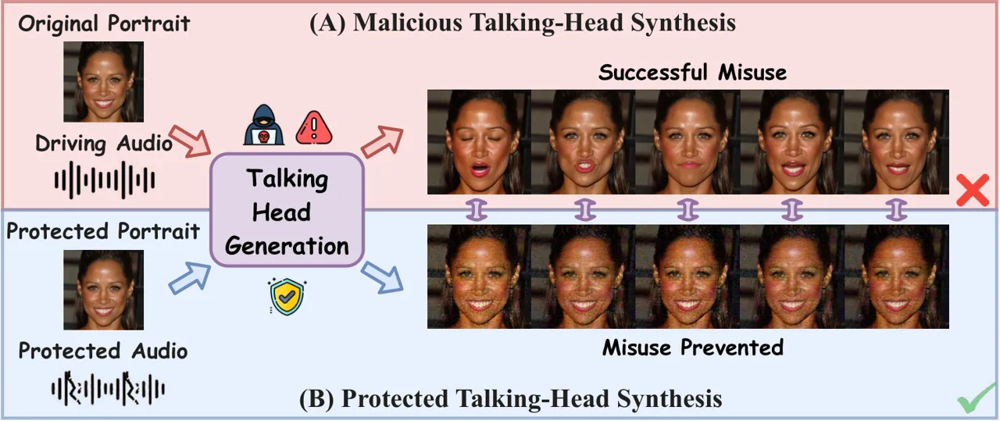
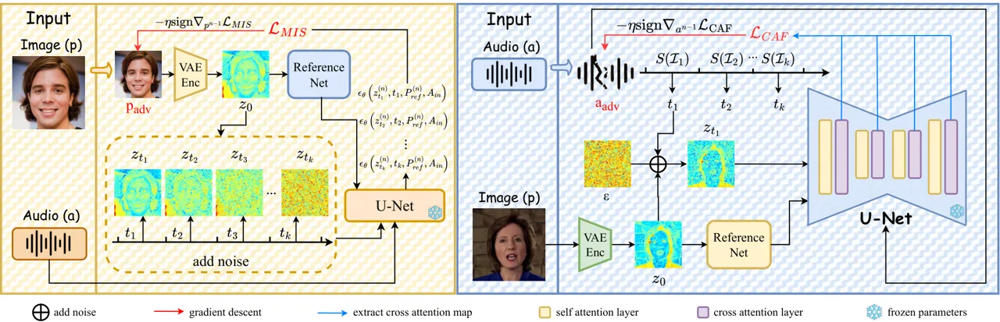
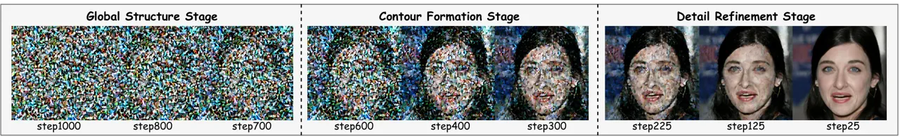
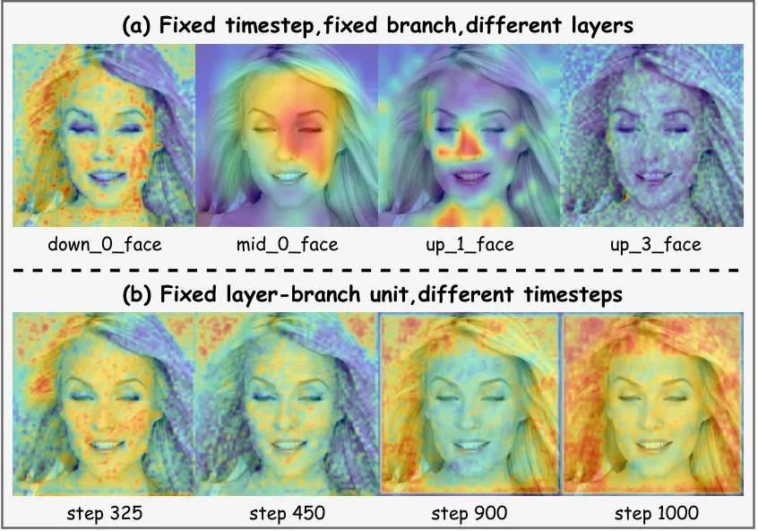
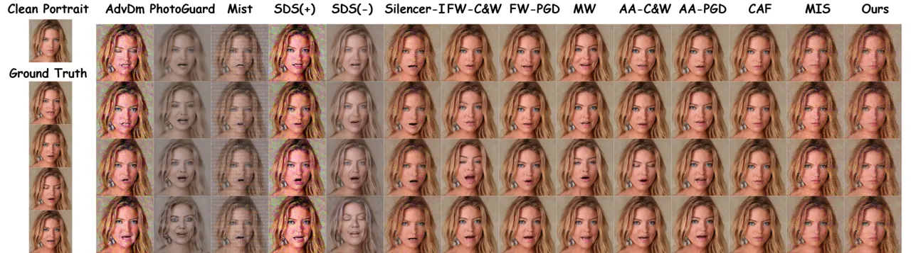

# SyncBreaker: Stage-Aware Multimodal Adversarial Attacks on Audio-Driven Talking Head GenerationThanks: Corresponding authors: Sirui Zhao and Tong Xu.

Wenli Zhang¹  Xianglong Shi¹  Sirui Zhao^(1,∗)  Xinqi Chen¹,  
Guo Cheng²  Yifan Xu¹  Tong Xu^(1,∗)  Yong Liao¹ Address: ¹University of
Science and Technology of China  
²Beijing University of Technology Email address: [siruit@ustc.edu.cn,
tongxu@ustc.edu.cn](mailto:siruit@ustc.edu.cn,%20tongxu@ustc.edu.cn)

###### Abstract.

Diffusion-based audio-driven talking-head generation enables realistic
portrait animation, but also introduces risks of misuse, such as fraud
and misinformation. Existing protection methods are largely limited to a
single modality, and neither image-only nor audio-only attacks can
effectively suppress speech-driven facial dynamics. To address this gap,
we propose SyncBreaker, a stage-aware multimodal protection framework
that jointly perturbs portrait and audio inputs under modality-specific
perceptual constraints. Our key contributions are twofold. First, for
the image stream, we introduce nullifying supervision with
Multi-Interval Sampling (MIS) across diffusion stages to steer the
generation toward the static reference portrait by aggregating guidance
from multiple denoising intervals. Second, for the audio stream, we
propose Cross-Attention Fooling (CAF), which suppresses
interval-specific audio-conditioned cross-attention responses. Both
streams are optimized independently and combined at inference time to
enable flexible deployment. We evaluate SyncBreaker in a white-box
proactive protection setting. Extensive experiments demonstrate that
SyncBreaker more effectively degrades lip synchronization and facial
dynamics than strong single-modality baselines, while preserving input
perceptual quality and remaining robust under purification. Code:
https://github.com/kitty384/SyncBreaker.

###### Key words and phrases: 

Audio-Driven Talking-Head Generation, Adversarial Attack, Multimodal
Protection, Diffusion Models, Proactive Protection

## 1. Introduction

Audio-driven talking-head generation animates a static portrait with a
driving audio clip to produce a realistic speaking video. This
technology has found broad applications in digital human, film
production, and virtual assistants, among others. Recent advances in
generative modeling \[7, 20, 51, 44\] have significantly improved
identity preservation, facial dynamics, and lip–speech alignment,
pushing synthesized results toward unprecedented realism. The growing
realism of talking-head synthesis, however, introduces new risks of
misuse. Fabricated videos can be generated from a portrait image and
audio clip, threatening individual privacy and public trust, especially
in scenarios like deepfake-based fraud and misinformation. To counter
such threats, developing proactive protection mechanisms is essential.
One promising direction is to introduce adversarial perturbations to
model inputs, which can disrupt the generation process and hinder
malicious talking-head synthesis.

Mainstream talking-head generation systems are now predominantly built
on diffusion architectures, conditioning on both a reference portrait
and a driving audio clip. While adversarial protection has been explored
for diffusion-based generative models \[26, 27, 40, 52\], existing
methods are largely designed for image generation or editing tasks. When
applied to talking-head synthesis, they primarily degrade visual quality
but fail to effectively suppress facial motion generation.
Silencer \[11\] represents a notable effort targeting the reference
portrait, aiming to induce static-mouth outputs. However, the driving
audio still provides strong motion cues, so lip movements and other
facial dynamics are often preserved. More importantly, most prior work
focuses only on the visual input, i.e., the reference portrait, while
paying little attention to the audio modality, even though audio is the
primary driver of facial dynamics. Attacking audio is not
straightforward either. Existing audio attacks \[10, 3, 22, 33, 37\] are
mainly developed for automatic speech recognition (ASR) and do not
effectively interfere with the motion synthesis process in talking-head
generation. Consequently, no existing solution effectively disrupts the
audio-driven motion synthesis process that lies at the heart of this
task.



Figure 1. Overview of the proposed framework.

To address these limitations, specifically the neglect of audio modality
and the ineffectiveness of single-modal attacks, we propose SyncBreaker,
a stage-aware multimodal adversarial attack framework for proactive
protection against malicious talking-head synthesis. As illustrated in
Fig. 1, SyncBreaker applies separately optimized perturbations to the
reference portrait and the driving audio, then feeds the protected
inputs to the target generation model to disrupt facial motion
synthesis. Specifically, SyncBreaker decomposes multimodal protection
into two coordinated streams. The image stream employs Multi-Interval
Sampling (MIS)-based nullifying supervision, where timesteps are sampled
from multiple diffusion-stage intervals to steer denoising toward a
static reference portrait. The audio stream introduces Cross-Attention
Fooling (CAF), which flattens audio-conditioned spatial responses by
targeting interval-specific layer–branch unit sets, thereby weakening
speech-to-motion guidance. The perturbations are optimized separately
under modality-specific perceptual constraints and combined at inference
time, destabilizing generated outputs and hindering the synthesis of
facial dynamics while preserving input naturalness.

Our contributions are summarized as follows:

- •
  We propose SyncBreaker, a novel stage-aware multimodal adversarial
  protection framework that reformulates proactive defense for
  audio-driven talking-head generation as coordinated perturbation
  learning over portrait and audio inputs. By jointly attacking both
  conditioning modalities, SyncBreaker effectively suppresses malicious
  synthesis while preserving input naturalness.
- •
  We develop two synergistic attack streams to disrupt generation. The
  image stream introduces a Multi-Interval Sampling (MIS)-based
  nullifying loss that aggregates supervision across denoising stages
  and steers outputs toward static reconstructions. In parallel, the
  audio stream employs Cross-Attention Fooling (CAF) to suppress
  interval-specific cross-attention responses.
- •
  Extensive experiments on CelebA-HQ—LibriSpeech and HDTF demonstrate
  that SyncBreaker consistently outperforms strong image-only and
  audio-only baselines, substantially degrading lip synchronization and
  facial dynamics while maintaining high perceptual quality of protected
  inputs and strong robustness under purification defenses.

## 2. Related Work

### 2.1. Audio-driven Talking-Head Generation

Audio-driven talking-head generation has progressed rapidly,
transitioning from intermediate motion representations to end-to-end
generative models. Early frameworks favored explicit motion modeling.
ATVGNet \[4\] was among the early works to adopt a cascaded framework
from audio to keypoints and then to images, exploring the cross-modal
mapping from speech to facial motion. MakeItTalk \[58\] achieves facial
animation for arbitrary identities through landmark representations and
identity disentanglement.  \[57\] introduces external pose signals to
enable pose-controllable talking-face generation. AD-NeRF \[16\]
introduces dynamic NeRF into this task to enhance the 3D representation
capability. Subsequently, SadTalker \[54\] models facial expressions and
head motions with 3D motion coefficients, while AniPortrait \[47\]
combines 3D facial meshes, landmarks, and diffusion models to improve
visual quality and temporal consistency.

With the development of diffusion models, end-to-end frameworks have
gradually become an important research direction. DiffTalk \[42\] and
EMO \[44\] are representative of this trend. They generate talking
videos with diffusion models and reduce the reliance on explicit 3D
modeling. Hallo \[50\] improves generation quality and stability through
hierarchical audio-driven visual synthesis, and Hallo2 \[6\] further
extends this line to long-duration and high-resolution scenarios.
VASA-1 \[51\] emphasizes high naturalness and real-time performance.
Loopy \[20\] focuses on modeling long-term motion dependencies.
LetsTalk \[53\] employs a latent diffusion transformer to model
audio-conditioned video generation, while FantasyTalking \[45\] improves
motion realism through a two-stage audio-visual alignment strategy and
coherent motion synthesis. Sonic \[19\] emphasizes global audio
perception and motion control, while ConsistTalk \[29\] focuses on
temporal consistency in diffusion-based talking-head generation. In
addition, EAT \[12\] and EdTalk \[43\] improve the expressiveness and
controllability of talking-head synthesis from the perspectives of
emotion-controllable generation and disentangled modeling, respectively.
In this work, we use Hallo as the pre-trained talking-head model.

### 2.2. Adversarial Attacks

#### 2.2.1. Adversarial Attacks in the Image Domain

Adversarial attacks \[31, 14, 2, 8, 9, 13, 24, 30, 49, 56\] in the image
domain were originally developed to reveal the susceptibility of deep
models to small input perturbations. More recently, similar ideas have
been adopted for proactive protection against LDM-based editing and
mimicry. Existing studies \[40, 26, 52, 27\] typically add imperceptible
perturbations to input images to corrupt the conditioning cues extracted
by diffusion models, thereby degrading downstream tasks such as image
editing, style and content mimicry, and other image-conditioned
generation tasks. These methods differ in both their optimization
strategies and the components they target. AdvDM \[26\], for example,
generates adversarial examples by estimating gradients of the diffusion
objective through Monte Carlo sampling over latent variables and
maximizing the model loss to disrupt conditional generation.
PhotoGuard \[40\] protects images through encoder-level and
diffusion-level attacks that manipulate latent representations and the
denoising process. Mist \[27\] combines semantic and textural losses to
improve the transferability and robustness of protective perturbations
across tasks. Diff-Protect \[52\] incorporates score-distillation-based
optimization into image protection and identifies the encoder as a key
vulnerability in latent diffusion models.

Despite their effectiveness in image editing and image-conditioned
generation, these methods are not specifically designed for audio-driven
talking-head synthesis. In this setting, they tend to degrade visual
quality without reliably disrupting speech-driven facial dynamics,
especially lip motion. Silencer \[11\] is one of the few methods
proposed to address this problem. It introduces a two-stage portrait
protection framework that combines a nullifying objective for
suppressing audio-driven animation with a latent anti-purification
mechanism for improved robustness. Nevertheless, suppression remains
incomplete, and residual speech-correlated mouth dynamics are still
observable in many cases.



Figure 2. Overview of SyncBreaker. The image stream employs MIS-based
Nullifying Loss to redirect the generation objective from synchronized
speaking frames to a static reference image across multiple diffusion
stages. The audio stream uses CAF to disrupt audio-visual
cross-attention and break the alignment between the audio condition and
key facial regions. The two streams are optimized separately and
combined at inference time.

#### 2.2.2. Adversarial Attacks in the Audio Domain

Existing audio adversarial attacks have mainly been studied in automatic
speech recognition (ASR) \[17, 36\], where small perturbations are added
to speech signals to cause recognition errors or attacker-specified
transcriptions. Carlini and Wagner \[3\] were the first to
systematically demonstrate targeted attacks on end-to-end speech
recognition systems, showing that DeepSpeech \[17\] can be forced to
output any desired phrase while keeping the adversarial audio highly
similar to the original input. Qin et al. \[35\] improved
imperceptibility by incorporating psychoacoustic masking constraints and
further enhanced robustness under physical playback by simulating
environmental distortions. Du et al. proposed SirenAttack \[10\],
extending adversarial attacks to a broader class of end-to-end acoustic
systems and demonstrating effectiveness as well as transferability in
both white-box and black-box settings. As large-scale speech foundation
models have emerged, recent work has also examined the adversarial
vulnerability of newer ASR systems such as Whisper \[36\]. Olivier and
Raj \[33\] found that although Whisper is relatively robust to random
noise and distribution shifts, this robustness does not extend to
adversarial perturbations: even small, carefully designed perturbations
can substantially degrade recognition performance or induce target
transcriptions. Raina et al. proposed Muting Whisper \[37\], which
learns a universal short audio prefix that causes Whisper to emit the
end-of-text token prematurely, thereby terminating transcription early
across different inputs and tasks. Despite their effectiveness, these
methods are primarily designed for ASR and therefore do not adequately
address the challenges of audio-driven talking-head generation, where
the goal is not to alter linguistic transcription but to disrupt
speech-driven facial motion.



Figure 3. Visualization of denoising results across different diffusion
stages, including the global structure stage, contour formation stage,
and detail refinement stage.



Figure 4. Audio-conditioned cross-attention maps. (a) At a fixed
timestep and branch, different U-Net layers show distinct patterns. (b)
For a fixed layer-branch unit, patterns vary across timesteps, with some
similarity.



Figure 5. Qualitative comparison of videos generated from inputs
protected by all compared attack methods.

## 3. Method

We present SyncBreaker, a multimodal proactive protection framework for
diffusion-based talking-head generation. Fig. 2 illustrates how the
proposed multimodal attack paradigm is instantiated in SyncBreaker.
Specifically, the framework operates on both the reference image and the
driving audio under modality-specific attack designs derived from the
unified paradigm. In the following, we first define the multimodal
attack paradigm, and then describe the two modality-specific methods.

### 3.1. Multimodal Attack Paradigm

We consider a white-box proactive protection setting, where the defender
has access to the architecture and parameters of the target talking-head
generation model during perturbation optimization. Let $`M`$ denote the
victim talking-head generation model, which takes a reference image
$`P_{ref}`$ and driving audio $`A_{in}`$ as inputs and produces an
output video $`V_{out}`$:

```math
\displaystyle V_{out}=M(A_{in},P_{ref}), \tag{1}
```

The goal of the multimodal attack is to introduce imperceptible
perturbations into both the reference image and the driving audio so as
to disrupt speech-driven facial dynamics in the generated video.
Specifically, let $`\delta_{p}`$ and $`\delta_{a}`$ denote the
perturbations added to the reference image and the driving audio,
respectively. The perturbed inputs are defined as:

```math
\displaystyle P^{\prime}_{ref} \displaystyle=P_{ref}+\delta_{p}, \tag{2}
```

```math
\displaystyle A^{\prime}_{in} \displaystyle=A_{in}+\delta_{a}, \tag{3}
```

and the corresponding model output is:

```math
\displaystyle V^{\prime}_{out}=M(A^{\prime}_{in},P^{\prime}_{ref}). \tag{4}
```

Under this formulation, the attack objective is to disrupt speech-driven
facial dynamics while constraining perturbation magnitude in both
modalities to preserve imperceptibility. Accordingly, the multimodal
attack can be written as:

```math
\displaystyle\min_{\delta_{p},\delta_{a}}\quad\mathcal{L}_{adv}+\lambda_{p}\mathcal{R}_{p}(\delta_{p})+\lambda_{a}\mathcal{R}_{a}(\delta_{a}), \tag{5}
```

where $`\mathcal{L}_{adv}`$ denotes the adversarial objective for
disrupting speech-driven facial dynamics,
$`\mathcal{R}_{p}(\delta_{p})`$ and $`\mathcal{R}_{a}(\delta_{a})`$
denote the constraints on image and audio perturbations, respectively,
and $`\lambda_{p}`$ and $`\lambda_{a}`$ control the trade-off between
attack effectiveness and imperceptibility.

In diffusion-based talking-head generation \[50, 6, 7\], the reference
image and the driving audio play fundamentally different roles: the
former provides a static appearance prior for identity and visual
consistency, whereas the latter supplies dynamic motion cues that drive
speech-driven facial dynamics through cross-attention. These differences
are difficult to capture with a single unified objective. Therefore, the
multimodal attack is further instantiated as two modality-specific
subproblems:

```math
\displaystyle\delta_{p}^{*} \displaystyle=\arg\min_{\delta_{p}}\;\mathcal{L}_{p}\quad\text{s.t. }\mathcal{R}_{p}(\delta_{p})\leq\epsilon_{p}, \tag{6}
```

```math
\displaystyle\delta_{a}^{*} \displaystyle=\arg\min_{\delta_{a}}\;\mathcal{L}_{a}\quad\text{s.t. }\mathcal{R}_{a}(\delta_{a})\leq\epsilon_{a}. \tag{7}
```

Here, $`\mathcal{L}_{p}`$ and $`\mathcal{L}_{a}`$ denote the attack
objectives for the image and audio modalities, respectively, and
$`\epsilon_{p}`$ and $`\epsilon_{a}`$ are the corresponding perturbation
budgets. Such a decomposition allows each modality-specific perturbation
to maintain independent attack effectiveness, while also better matching
practical dissemination scenarios in which portrait images and driving
audio may be distributed or reused independently. In the full multimodal
setting, the optimized perturbations $`\delta_{p}`$ and $`\delta_{a}`$
are jointly applied at inference time to disrupt speech-driven facial
dynamics in the generated video.

### 3.2. MIS-based Nullifying Loss

In LDM-based talking-head generation, the reference image and driving
audio jointly condition the denoising network to recover the result from
noisy latent variables. Let $`P_{ref}`$ denote the reference image,
$`A_{in}`$ the driving audio, and $`\epsilon_{\theta}(\cdot)`$ the
denoising network.

In the proactive protection setting, the target speaking frame
corresponding to the driving audio is unavailable. Consequently, image
perturbation optimization cannot rely on ground-truth supervision as in
standard diffusion training. Instead, nullifying loss \[11\] uses the
reference image itself as a static recovery target, encouraging the
denoising process to reconstruct a still portrait rather than generate
audio-driven speaking motions.

Specifically, at the $`n`$-th iteration, the current protected reference
image $`P_{ref}^{(n)}`$ is first encoded into the latent space:

```math
\displaystyle z_{0}^{(n)}=E\!\left(P_{ref}^{(n)}\right), \tag{8}
```

where $`E(\cdot)`$ denotes the VAE encoder. Given a sampled timestep
$`t`$, the forward diffusion process adds Gaussian noise
$`\epsilon\sim\mathcal{N}(0,I)`$ to $`z_{0}^{(n)}`$, yielding:

```math
\displaystyle z_{t}^{(n)}=\sqrt{\bar{\alpha}_{t}}\,z_{0}^{(n)}+\sqrt{1-\bar{\alpha}_{t}}\,\epsilon, \tag{9}
```

where $`\bar{\alpha}_{t}=\prod_{s=1}^{t}\alpha_{s}`$ denotes the
cumulative product of the diffusion noise schedule. The nullifying loss
is then defined as:

```math
\displaystyle\mathcal{L}_{N}(t)=\left\|\epsilon-\epsilon_{\theta}\!\left(z_{t}^{(n)},\,t,\,P_{ref}^{(n)},\,A_{in}\right)\right\|_{2}^{2}, \tag{10}
```

Minimizing this loss drives the denoising trajectory away from
audio-driven motions and toward the static reference portrait.

Furthermore, we observe that different denoising stages are responsible
for recovering different types of visual content. As illustrated in
Fig. 3, the early stages mainly determine the subject location, overall
composition, and coarse structure, middle stages progressively establish
clearer facial geometry and contours, and late stages further restore
fine-grained textures and local visual details. These stage-wise
differences suggest that different denoising stages capture
complementary visual information.

However, Silencer \[11\] samples only one timestep from a fixed interval
during optimization, limiting supervision to a narrow stage of the
denoising process. To address this issue, we introduce a Multi-Interval
Sampling (MIS) strategy, which samples timesteps from multiple intervals
and applies nullifying supervision to leverage complementary information
from different denoising stages.

Let $`\{\mathcal{I}_{k}\}_{k=1}^{K}`$ denote a set of timestep
intervals. For each interval $`\mathcal{I}_{k}`$, we independently
sample:

```math
\displaystyle t_{k}\sim\mathcal{U}(\mathcal{I}_{k}),\qquad\epsilon_{k}\sim\mathcal{N}(0,I),\qquad k=1,\dots,K, \tag{11}
```

and construct the corresponding noisy latent as:

```math
\displaystyle z_{t_{k}}^{(n)}=\sqrt{\bar{\alpha}_{t_{k}}}\,z_{0}^{(n)}+\sqrt{1-\bar{\alpha}_{t_{k}}}\,\epsilon_{k}, \tag{12}
```

The MIS objective for the image stream is given by:

```math
\displaystyle\mathcal{L}_{MIS}=\sum_{k=1}^{K}\lambda_{k}\,\mathbb{E}_{\begin{subarray}{c}t_{k}\sim\mathcal{U}(\mathcal{I}_{k})\\
\epsilon_{k}\sim\mathcal{N}(0,I)\end{subarray}}\left[\left\|\epsilon_{k}-\epsilon_{\theta}\!\left(z_{t_{k}}^{(n)},\,t_{k},\,P_{ref}^{(n)},\,A_{in}\right)\right\|_{2}^{2}\right], \tag{13}
```

where $`\lambda_{k}`$ denotes the weight associated with the $`k`$-th
timestep interval. During optimization, one timestep is sampled from
each interval per iteration to compute nullifying supervision.

Compared with single-interval nullifying loss, MIS aggregates
optimization signals from multiple denoising stages, enabling the
perturbation to jointly influence global structure, facial contours, and
fine details. This stronger stage-wise coverage improves the ability of
the protected reference image to suppress audio-driven facial dynamics
and steer generation toward a static portrait. Visually, this is
typically reflected in weaker lip synchronization and reduced facial
dynamics, including expression changes and blinking.

During optimization, we iteratively update the reference image using
Projected Gradient Descent (PGD):

```math
\displaystyle P_{ref}^{(n+1)}=\Pi_{\mathcal{B}_{\infty}(P_{ref}^{(0)},\,\tau)}\left(P_{ref}^{(n)}-\eta_{p}\cdot\mathrm{sign}\bigl(\nabla_{P_{ref}^{(n)}}\mathcal{L}_{MIS}\bigr)\right), \tag{14}
```

where $`\eta_{p}`$ denotes the step size, $`\tau`$ denotes the
perturbation budget, and $`\Pi(\cdot)`$ denotes the projection operator.
Here, $`\mathcal{B}_{\infty}(P_{ref}^{(0)},\,\tau)`$ denotes the
$`L_{\infty}`$ ball centered at the reference image $`P_{ref}^{(0)}`$
with radius $`\tau`$.

|                   |          |                         |                      |                 |                    |                   |                      |                      |                 |                    |                   |
| ----------------- | -------- | ----------------------- | -------------------- | --------------- | ------------------ | ----------------- | -------------------- | -------------------- | --------------- | ------------------ | ----------------- |
| Method            | Modality | CelebA-HQ — LibriSpeech |                      |                 |                    |                   | HDTF                 |                      |                 |                    |                   |
|                   |          | V-PSNR$`\downarrow`$    | V-SSIM$`\downarrow`$ | FID$`\uparrow`$ | Sync$`\downarrow`$ | M-LMD$`\uparrow`$ | V-PSNR$`\downarrow`$ | V-SSIM$`\downarrow`$ | FID$`\uparrow`$ | Sync$`\downarrow`$ | M-LMD$`\uparrow`$ |
| AdvDm \[26\]      | V        | 20.46                   | 0.42                 | 181.90          | 5.33               | 4.03              | 21.39                | 0.44                 | 215.68          | 5.81               | 3.12              |
| PhotoGuard \[40\] | V        | 12.29                   | 0.48                 | 74.87           | 5.98               | 5.53              | 17.16                | 0.64                 | 107.19          | 6.61               | 3.17              |
| Mist \[27\]       | V        | 19.39                   | 0.56                 | 209.44          | 4.87               | 4.50              | 21.04                | 0.61                 | 256.21          | 4.78               | 3.36              |
| SDS(+) \[52\]     | V        | 20.31                   | 0.41                 | 161.74          | 5.52               | 3.98              | 21.21                | 0.42                 | 186.35          | 6.06               | 3.29              |
| SDS(-) \[52\]     | V        | 18.61                   | 0.59                 | 54.51           | 5.95               | 4.08              | 20.04                | 0.66                 | 79.80           | 6.35               | 2.99              |
| Silencer-I \[11\] | V        | 21.86                   | 0.50                 | 176.32          | 3.30               | 5.46              | 24.69                | 0.62                 | 166.92          | 3.16               | 3.43              |
| FW-C&W  \[33\]    | A        | 23.15                   | 0.74                 | 5.78            | 3.63               | 4.26              | 35.66                | 0.94                 | 1.86            | 6.64               | 1.17              |
| FW-PGD \[33\]     | A        | 25.09                   | 0.78                 | 4.62            | 5.20               | 3.23              | 31.21                | 0.91                 | 2.56            | 5.89               | 1.79              |
| MW \[37\]         | A        | 21.99                   | 0.71                 | 6.78            | 6.05               | 2.99              | 28.05                | 0.88                 | 3.32            | 7.07               | 2.44              |
| AA-C&W \[22\]     | A        | 25.67                   | 0.79                 | 4.25            | 5.25               | 2.88              | 33.59                | 0.93                 | 1.96            | 6.50               | 1.38              |
| AA-PGD \[22\]     | A        | 24.39                   | 0.77                 | 4.75            | 3.70               | 3.97              | 31.65                | 0.92                 | 2.41            | 5.50               | 1.86              |
| CAF               | A        | 22.76                   | 0.72                 | 8.60            | 1.85               | 4.60              | 29.31                | 0.89                 | 3.69            | 2.50               | 2.38              |
| MIS               | V        | 20.05                   | 0.46                 | 203.96          | 2.82               | 5.65              | 23.03                | 0.57                 | 203.74          | 2.84               | 3.83              |
| Ours              | AV       | 19.98                   | 0.46                 | 210.43          | 0.85               | 6.26              | 22.98                | 0.56                 | 204.28          | 1.07               | 3.68              |
| Ground Truth      | –        | $`\infty`$              | 1                    | –               | 6.01               | 0                 | $`\infty`$           | 1                    | –               | 6.96               | 0                 |

Table 1. Quantitative comparisons with state-of-the-art methods on two
test protocols: (1) CelebA-HQ images paired with LibriSpeech audio, and
(2) HDTF dataset. Metrics marked with ”$`\uparrow`$” indicate that
higher values are better, while those marked with ”$`\downarrow`$”
indicate that lower values are better. Best results are highlighted in
bold, while second-best results are underlined.

### 3.3. Cross-Attention Fooling

Rather than altering audio semantics, CAF targets the injection path of
the audio condition in the denoising network by weakening
audio-conditioned cross-attention, thereby reducing the control of the
audio signal over facial motion generation.

Hallo \[50\] injects audio conditions through cross-attention modules at
multiple U-Net layers, where each injection location contains three
branches: lip, expression, and pose. We treat each layer-branch unit as
a basic object for analyzing audio-conditioned cross-attention. As shown
in Fig. 4, the cross-attention responses vary across both U-Net layers
and diffusion timesteps. Even within the same branch, different U-Net
layers exhibit distinct spatial patterns, while for a fixed layer-branch
unit, the response pattern changes over timesteps and remains similar
over certain timestep ranges. This suggests that audio-conditioned
cross-attention has both layer-wise variation and stage-wise structure
during denoising. Motivated by this observation, we partition the
denoising process into multiple timestep intervals according to
response-pattern similarity. Let $`\{\mathcal{I}_{k}\}_{k=1}^{K}`$
denote the set of timestep intervals. For each interval
$`\mathcal{I}_{k}`$, we define a corresponding target layer-branch set
$`S(\mathcal{I}_{k})`$, where each unit $`(\ell,b)`$ denotes a
cross-attention unit selected for that interval.

At the $`n`$-th iteration, we first randomly select a timestep interval
$`\mathcal{I}_{k}`$ and sample a timestep:

```math
\displaystyle t\sim\mathcal{U}(\mathcal{I}_{k}), \tag{15}
```

Since no real speaking frame strictly corresponding to the driving audio
is available in the proactive protection setting, we cannot obtain the
noisy latent corresponding to the real generated result at timestep
$`t`$. As in the nullifying loss, we use the current reference image
$`P_{ref}^{(n)}`$ to construct the noisy latent input. The difference
lies in the objective: the nullifying loss uses this latent to impose
static nullifying supervision, whereas CAF uses it to probe and suppress
audio-conditioned cross-attention responses. Specifically:

```math
\displaystyle z_{0}^{(n)}=E\!\left(P_{ref}^{(n)}\right),\qquad z_{t}^{(n)}=\sqrt{\bar{\alpha}_{t}}\,z_{0}^{(n)}+\sqrt{1-\bar{\alpha}_{t}}\,\epsilon, \tag{16}
```

where $`E(\cdot)`$ denotes the VAE encoder and
$`\epsilon\sim\mathcal{N}(0,I)`$. Using this latent, we extract the
cross-attention maps produced at timestep $`t`$ by the layer-branch
units in the target set $`S(\mathcal{I}_{k})`$, denoted as:

```math
\displaystyle\left\{A_{t}^{(\ell,b)}\right\}_{(\ell,b)\in S(\mathcal{I}_{k})}, \tag{17}
```

When audio conditioning strongly influences facial motion, the
corresponding cross-attention maps usually tend to be spatially
concentrated on motion-relevant regions. To weaken this guidance effect,
we reduce their spatial variance and define the CAF loss as:

```math
\displaystyle\mathcal{L}_{CAF}=\frac{1}{|S(\mathcal{I}_{k})|}\sum_{(\ell,b)\in S(\mathcal{I}_{k})}\mathrm{Var}\!\left(A_{t}^{(\ell,b)}\right), \tag{18}
```

where $`\mathrm{Var}(\cdot)`$ denotes the variance computed over the
spatial elements of the corresponding attention map. Minimizing this
loss drives the attention responses from highly concentrated
distributions toward flatter spatial distributions, thereby weakening
the alignment between audio features and facial motion regions, as well
as the guidance of the audio condition over facial motion.

We do not jointly optimize multiple timesteps in each iteration.
Instead, the audio is updated by randomly selecting one interval and
sampling one timestep from it. This is because the cross-attention
responses at all layers need to be retained during the denoising
process, from which the target layer-branch units for the current
timestep interval are selected for loss computation. Introducing
multiple timesteps simultaneously would require retaining the
cross-attention responses, gradient information, and computation graphs
for all of them at once, resulting in substantial memory overhead.
Random interval sampling therefore offers a more practical trade-off
between attack effectiveness and optimization efficiency.

Finally, we iteratively update the input audio using PGD:

```math
\displaystyle A_{in}^{(n+1)}=\Pi_{\mathcal{C}_{a}}\left(A_{in}^{(n)}-\eta_{a}\cdot\mathrm{sign}\bigl(\nabla_{A_{in}^{(n)}}\mathcal{L}_{CAF}\bigr)\right), \tag{19}
```

where $`\eta_{a}`$ is the step size, $`\Pi(\cdot)`$ denotes the
projection operator, and $`\mathcal{C}_{a}`$ denotes the feasible set
determined by the distortion constraint.

|                   |                           |                           |
| ----------------- | ------------------------- | ------------------------- |
| Method            | CelebA-HQ                 | HDTF                      |
|                   | I-PSNR/I-SSIM$`\uparrow`$ | I-PSNR/I-SSIM$`\uparrow`$ |
| AdvDm \[26\]      | 27.30/0.59                | 27.29/0.56                |
| PhotoGuard \[40\] | 27.29/0.57                | 27.41/0.55                |
| Mist \[27\]       | 26.79/0.57                | 26.86/0.55                |
| SDS(+) \[52\]     | 27.55/0.62                | 27.58/0.59                |
| SDS(-) \[52\]     | 28.53/0.62                | 28.48/0.59                |
| Silencer-I \[11\] | 29.91/0.70                | 29.96/0.66                |
| MIS               | 29.56/0.69                | 29.59/0.66                |

Table 2. Quantitative comparisons of adversarial image quality on
CelebA-HQ and HDTF.

|               |                      |                      |
| ------------- | -------------------- | -------------------- |
| Method        | LibriSpeech          | HDTF                 |
|               | SNR/PESQ$`\uparrow`$ | SNR/PESQ$`\uparrow`$ |
| FW-C&W \[33\] | 3.94/1.02            | 4.62/1.08            |
| FW-PGD \[33\] | 17.22/1.21           | 18.11/1.57           |
| MW \[37\]     | –/–                  | –/–                  |
| AA-C&W \[22\] | 22.40/1.58           | 19.30/2.10           |
| AA-PGD \[22\] | 1.08/1.02            | 5.37/1.08            |
| CAF           | 24.86/1.63           | 26.53/2.45           |

Table 3. Quantitative comparisons of adversarial audio quality on
LibriSpeech and HDTF.

| Method            | JPEG \[41\]                 |                 |                    |                   | Resize \[48\]               |                 |                    |                   | DiffPure \[32\]             |                 |                    |                   | DiffShortcut \[28\]         |                 |                    |                   |
| ----------------- | --------------------------- | --------------- | ------------------ | ----------------- | --------------------------- | --------------- | ------------------ | ----------------- | --------------------------- | --------------- | ------------------ | ----------------- | --------------------------- | --------------- | ------------------ | ----------------- |
|                   | I-PSNR/I-SSIM$`\downarrow`$ | FID$`\uparrow`$ | Sync$`\downarrow`$ | M-LMD$`\uparrow`$ | I-PSNR/I-SSIM$`\downarrow`$ | FID$`\uparrow`$ | Sync$`\downarrow`$ | M-LMD$`\uparrow`$ | I-PSNR/I-SSIM$`\downarrow`$ | FID$`\uparrow`$ | Sync$`\downarrow`$ | M-LMD$`\uparrow`$ | I-PSNR/I-SSIM$`\downarrow`$ | FID$`\uparrow`$ | Sync$`\downarrow`$ | M-LMD$`\uparrow`$ |
| AdvDm \[26\]      | 28.39/0.66                  | 150.69          | 5.43               | 3.59              | 10.86/0.26                  | 218.20          | 5.92               | 2.88              | 28.49/0.76                  | 38.56           | 6.01               | 2.74              | 18.88/0.49                  | 65.14           | 5.92               | 3.43              |
| PhotoGuard \[40\] | 28.42/0.66                  | 50.90           | 6.09               | 3.29              | 10.97/0.31                  | 212.96          | 5.84               | 2.68              | 27.54/0.74                  | 40.66           | 5.94               | 2.85              | 18.89/0.46                  | 68.41           | 5.85               | 3.36              |
| Mist \[27\]       | 27.70/0.64                  | 147.98          | 5.64               | 3.93              | 10.82/0.28                  | 216.38          | 5.71               | 3.00              | 27.55/0.75                  | 38.55           | 6.12               | 2.89              | 18.65/0.47                  | 70.32           | 5.86               | 3.36              |
| SDS(+) \[52\]     | 28.31/0.67                  | 134.52          | 5.69               | 3.67              | 10.77/0.25                  | 218.10          | 5.86               | 2.88              | 28.47/0.76                  | 37.60           | 6.05               | 2.86              | 18.69/0.48                  | 65.31           | 5.95               | 3.31              |
| SDS(-) \[52\]     | 28.97/0.65                  | 44.25           | 5.94               | 3.38              | 10.88/0.31                  | 200.62          | 5.90               | 2.77              | 28.23/0.75                  | 38.55           | 5.91               | 2.89              | 18.97/0.47                  | 65.10           | 5.87               | 3.34              |
| Silencer-I \[11\] | 30.76/0.75                  | 94.02           | 4.76               | 4.04              | 10.93/0.31                  | 213.72          | 5.80               | 2.89              | 28.50/0.76                  | 37.62           | 5.96               | 2.73              | 18.71/0.48                  | 62.40           | 5.83               | 3.33              |
| MIS               | 30.29/0.73                  | 168.79          | 3.24               | 5.38              | 8.84/0.19                   | 264.61          | 5.61               | 7.58              | 28.32/0.75                  | 37.63           | 5.92               | 2.91              | 18.47/0.47                  | 71.73           | 5.89               | 3.42              |
| Ours              | 30.29/0.73                  | 170.54          | 0.90               | 6.16              | 8.84/0.19                   | 267.94          | 1.52               | 7.99              | 28.32/0.75                  | 42.44           | 1.92               | 4.90              | 18.47/0.47                  | 76.45           | 1.60               | 4.97              |

Table 4. Quantitative comparison of different image attack methods under
four purifiers.

| Method        | Spectral Gating \[39\] |                 |                    |                   | Spectral Subtraction \[1\] |                 |                    |                   | DiffWave \[23\]        |                 |                    |                   | WavePurifier \[15\]    |                 |                    |                   |
| ------------- | ---------------------- | --------------- | ------------------ | ----------------- | -------------------------- | --------------- | ------------------ | ----------------- | ---------------------- | --------------- | ------------------ | ----------------- | ---------------------- | --------------- | ------------------ | ----------------- |
|               | SNR/PESQ$`\downarrow`$ | FID$`\uparrow`$ | Sync$`\downarrow`$ | M-LMD$`\uparrow`$ | SNR/PESQ$`\downarrow`$     | FID$`\uparrow`$ | Sync$`\downarrow`$ | M-LMD$`\uparrow`$ | SNR/PESQ$`\downarrow`$ | FID$`\uparrow`$ | Sync$`\downarrow`$ | M-LMD$`\uparrow`$ | SNR/PESQ$`\downarrow`$ | FID$`\uparrow`$ | Sync$`\downarrow`$ | M-LMD$`\uparrow`$ |
| FW-C&W \[33\] | 2.45/1.06              | 5.04            | 4.12               | 3.74              | -2.94/1.04                 | 5.6             | 3.63               | 4.05              | 5.95/1.08              | 5.38            | 3.93               | 3.99              | 1.07/1.04              | 6.24            | 3.55               | 4.25              |
| FW-PGD \[33\] | 2.97/1.12              | 4.18            | 5.07               | 3.03              | -2.79/1.17                 | 4.53            | 4.92               | 3.43              | 12.05/1.39             | 4.5             | 4.74               | 3.27              | 1.20/1.11              | 4.35            | 4.96               | 3.29              |
| MW \[37\]     | —                      | 6.13            | 5.03               | 3.30              | —                          | 6.85            | 5.91               | 3.30              | —                      | 6.86            | 4.80               | 3.73              | —                      | 6.82            | 5.35               | 3.52              |
| AA-C&W \[22\] | 2.71/1.13              | 4.43            | 5.05               | 3.04              | -2.85/1.27                 | 4.2             | 5.41               | 3.04              | 11.57/1.37             | 4.69            | 4.68               | 3.31              | 1.09/1.12              | 4.55            | 5.03               | 3.17              |
| AA-PGD \[22\] | 2.25/1.05              | 4.88            | 3.33               | 4.09              | -2.81/1.03                 | 5.79            | 2.66               | 4.40              | 2.42/1.02              | 5.88            | 3.44               | 4.18              | 0.95/1.03              | 5.79            | 2.75               | 4.72              |
| CAF           | 2.94/1.18              | 4.21            | 5.01               | 2.87              | -2.58/1.33                 | 3.97            | 5.44               | 2.56              | 12.12/1.41             | 4.47            | 4.64               | 4.00              | 1.12/1.16              | 4.36            | 5.11               | 3.06              |
| Ours          | 2.94/1.18              | 205.95          | 2.37               | 5.88              | -2.58/1.33                 | 205.31          | 2.56               | 5.73              | 12.12/1.41             | 204.54          | 2.13               | 5.98              | 1.12/1.16              | 204.80          | 2.40               | 5.23              |

Table 5. Quantitative comparison of different audio attack methods under
four purifiers.

| Interval     | V-PSNR$`\downarrow`$ | V-SSIM$`\downarrow`$ | FID$`\uparrow`$ | Sync$`\downarrow`$ | M-LMD$`\uparrow`$ |
| ------------ | -------------------- | -------------------- | --------------- | ------------------ | ----------------- |
| \[0,100\]    | 19.87                | 0.44                 | 210.32          | 3.19               | 5.42              |
| \[200,300\]  | 21.86                | 0.50                 | 176.32          | 3.30               | 5.46              |
| \[500,600\]  | 20.63                | 0.51                 | 142.54          | 3.95               | 4.88              |
| \[700,800\]  | 20.68                | 0.51                 | 154.30          | 4.71               | 4.21              |
| \[900,1000\] | 20.12                | 0.48                 | 179.05          | 3.36               | 5.43              |
| MIS          | 20.05                | 0.46                 | 203.96          | 2.82               | 5.65              |

Table 6. Quantitative comparison of single-interval variants and MIS for
the image-stream timestep setting.

| Layer  | V-PSNR$`\downarrow`$ | V-SSIM$`\downarrow`$ | FID$`\uparrow`$ | Sync$`\downarrow`$ | M-LMD$`\uparrow`$ |
| ------ | -------------------- | -------------------- | --------------- | ------------------ | ----------------- |
| down_0 | 23.10                | 0.74                 | 6.94            | 2.06               | 4.46              |
| mid_0  | 22.84                | 0.73                 | 6.46            | 2.72               | 4.47              |
| up_1   | 22.49                | 0.72                 | 7.07            | 2.84               | 4.34              |
| CAF    | 22.76                | 0.72                 | 8.60            | 1.85               | 4.60              |

Table 7. Quantitative comparison of different layers within the same
branch under the $`[700,1000]`$ interval.

## 4. Experiments

### 4.1. Experimental Setup

#### 4.1.1. Implementation Details

We use the public Hallo \[50\] implementation at 25 FPS, with 16 kHz
audio and $`512\times 512`$ reference portraits. Hallo serves as the
white-box victim model. All attacks run for 100 iterations. Image
perturbations use an $`\ell_{\infty}`$ budget of $`16/255`$, consistent
with all image baselines. Audio perturbations generated by CAF satisfy
the peak-amplitude constraint

```math
\displaystyle dB_{x}(\delta)=20\log_{10}\left(\frac{\|\delta\|_{\infty}}{\|x\|_{\infty}}\right)\leq-30\,\mathrm{dB}, \tag{20}
```

as defined in \[3\]. This optimization constraint differs from the
energy-based SNR reported as an input-fidelity metric. The audio
baselines retain their default parameter settings, with their iteration
counts uniformly set to 100.

Baselines and Datasets. Image baselines include AdvDM \[26\],
PhotoGuard \[40\], Mist \[27\], the SDS(+) and SDS(-) variants \[52\],
and Silencer-I \[11\]. Audio baselines include the C&W and PGD variants
of Fooling Whisper \[33\], Muting Whisper \[37\], and the C&W and PGD
variants of ASRAdversarialAttacks \[22\]. We denote them FW-C&W, FW-PGD,
MW, AA-C&W, and AA-PGD.

We construct two test protocols from three public datasets. The first
pairs 50 CelebA-HQ \[21\] portraits with 50 LibriSpeech \[34\] audio
clips. The second uses 50 HDTF \[55\] clips, taking the first frame of
each clip as the reference portrait and retaining its original audio.
Following Silencer \[11\], this evaluation scale is comparable to that
commonly used in talking-head generation studies.

| Interval     | V-PSNR$`\downarrow`$ | V-SSIM$`\downarrow`$ | FID$`\uparrow`$ | Sync$`\downarrow`$ | M-LMD$`\uparrow`$ |
| ------------ | -------------------- | -------------------- | --------------- | ------------------ | ----------------- |
| \[0,100\]    | 23.46                | 0.74                 | 5.85            | 3.03               | 4.05              |
| \[400,600\]  | 23.45                | 0.74                 | 6.24            | 2.52               | 4.21              |
| \[900,1000\] | 22.71                | 0.73                 | 6.52            | 2.53               | 4.56              |
| CAF          | 22.76                | 0.72                 | 8.60            | 1.85               | 4.60              |

Table 8. Quantitative comparison across different timestep intervals for
the mid_0_lip layer-branch unit.

#### 4.1.2. Metrics

Input fidelity is measured using I-PSNR and I-SSIM \[46\] for portraits
and SNR and PESQ \[38\] for time-aligned audio. These audio metrics are
omitted for prefix-based MW because prepending a segment breaks waveform
alignment and makes pointwise comparison invalid. Output disruption is
measured by V-PSNR, V-SSIM, and FID \[18\] against videos generated from
clean inputs. The first two quantify frame-level departure, while FID
captures the distribution gap between clean and protected-input
generations. SyncNet confidence \[25, 5\] measures lip–speech alignment,
whereas M-LMD \[4\] measures mouth-motion inconsistency. Stronger
attacks lower V-PSNR, V-SSIM, and Sync while raising FID and M-LMD.

### 4.2. Privacy Protection

Table 1 shows that MIS and CAF disrupt different aspects of generation.
MIS perturbs the reference portrait, which provides appearance and
identity cues, and therefore causes larger changes in V-PSNR, V-SSIM,
and FID, reaching FID 203.96/203.74 on CelebA-HQ–LibriSpeech/HDTF. CAF
perturbs the driving audio, whose primary role is to guide facial
motion. It consequently changes visual quality less but directly weakens
local motion guidance, achieving the lowest Sync among audio baselines
at 1.85/2.50. Combined, MIS and CAF yield FID 210.43/204.28, Sync
0.85/1.07, and M-LMD 6.26/3.68, jointly degrading appearance and
speech-driven motion.

Despite this output disruption, the protected inputs remain perceptually
close to the originals. Tables 2 and 3 report MIS I-PSNR/I-SSIM of
29.56/0.69 and 29.59/0.66, and CAF SNR/PESQ of 24.86/1.63 and
26.53/2.45, on CelebA-HQ–LibriSpeech and HDTF, respectively. Fig. 5
shows the corresponding generated videos.

### 4.3. Anti-Purification Experiments

To test preprocessing defenses, we purify protected portraits or audio
before generation. We evaluate JPEG \[41\], Resize \[48\],
DiffPure \[32\], and DiffShortcut \[28\] for portraits, and Spectral
Gating \[39\], Spectral Subtraction \[1\], DiffWave \[23\], and
WavePurifier \[15\] for audio. For single-stream evaluation, only the
protected modality is purified. MIS pairs a purified protected portrait
with clean audio, whereas CAF pairs a clean portrait with purified
protected audio.

Image purification. Robustness requires the purified portrait to remain
distinct from the clean input, reflected by low I-PSNR/I-SSIM, while
still yielding low Sync and high FID/M-LMD. As shown in Table 4, MIS is
strongest under JPEG and Resize. Under DiffPure and DiffShortcut, it is
slightly weaker than some baselines, likely because those methods
introduce larger facial distortions that purification does not fully
remove.

Audio purification. Table 5 reports SNR/PESQ relative to clean audio and
the output metrics after purification. Very noisy ASR attacks can appear
robust when purification removes useful speech together with noise,
passively lowering Sync or raising M-LMD by weakening mouth motion. The
low SNR/PESQ values of FW-C&W \[33\] and AA-PGD \[22\] in Table 3
indicate this failure mode. CAF behaves more consistently relative to
methods with more controlled distortion, such as FW-PGD \[33\] and
AA-C&W \[22\].

Mixed-stream evaluation. The Ours rows are mixed-stream evaluations
rather than isolated tests that both streams survive purification. In
Table 4, a purified MIS portrait is paired with CAF audio, so gains over
standalone CAF indicate residual MIS effects after image purification.
In Table 5, a MIS portrait is paired with purified CAF audio, so lower
Sync and higher M-LMD than standalone MIS indicate residual CAF effects
after audio purification.

### 4.4. Ablation Study

MIS. MIS samples one timestep from each of $`[0,100]`$, $`[100,200]`$,
$`[300,400]`$, and $`[900,1000]`$ per update, ensuring that every
selected stage contributes to the update. Table 6 shows that no single
interval dominates across metrics. High-noise timesteps affect global
structure, intermediate intervals shape facial geometry, and low-noise
timesteps refine lip details and textures. These complementary effects
explain why MIS achieves stronger synchronization disruption, with Sync
2.82 and M-LMD 5.65, while retaining competitive visual degradation.

CAF. Tables 7 and 8 isolate layer and timestep choices, respectively.
The former fixes the interval and varies the U-Net layer, while the
latter fixes a layer–branch unit and varies the interval. The resulting
differences confirm that attention responses depend jointly on layer and
denoising stage. Interval-specific target sets outperform the fixed
selections and yield the best CAF result, with Sync 1.85 and FID 8.60.

## 5. Limitation and Conclusion

In this paper, we proposed SyncBreaker, a multimodal proactive
protection framework for audio-driven talking-head generation.
SyncBreaker combined image-stream MIS-based nullifying supervision with
audio-stream CAF loss to jointly weaken speech-driven facial dynamics
from both visual and acoustic conditioning pathways. Extensive
experiments showed that the multimodal protective perturbations
generated by our method effectively degraded facial dynamics,
particularly audio-lip synchronization, while preserving the high
perceptual quality of the protected inputs.

Our current study is limited to the white-box setting. Evaluating the
transferability to unseen talking-head generation models in black-box
scenarios remains an important direction for future work. We also plan
to extend SyncBreaker to a wider range of portrait animation frameworks
and more realistic deployment settings.

## References

- \[1\] S. Boll (1979) Suppression of acoustic noise in speech using
  spectral subtraction. IEEE Transactions on Acoustics, Speech, and
  Signal Processing 27 (2), pp. 113–120. External Links:
  [Document](https://dx.doi.org/10.1109/TASSP.1979.1163209) Cited by:
  Table 5, §4.3.
- \[2\] N. Carlini and D. Wagner (2017) Towards evaluating the
  robustness of neural networks. External Links: 1608.04644,
  [Link](https://arxiv.org/abs/1608.04644) Cited by: §2.2.1.
- \[3\] N. Carlini and D. Wagner (2018) Audio adversarial examples:
  targeted attacks on speech-to-text. In 2018 IEEE Security and Privacy
  Workshops (SPW), Vol. , pp. 1–7. External Links:
  [Document](https://dx.doi.org/10.1109/SPW.2018.00009) Cited by: §1,
  §2.2.2, §4.1.1.
- \[4\] L. Chen, R. K. Maddox, Z. Duan, and C. Xu (2019) Hierarchical
  Cross-Modal Talking Face Generation With Dynamic Pixel-Wise Loss . In
  2019 IEEE/CVF Conference on Computer Vision and Pattern Recognition
  (CVPR), Vol. , Los Alamitos, CA, USA, pp. 7824–7833. External Links:
  ISSN , [Document](https://dx.doi.org/10.1109/CVPR.2019.00802),
  [Link](https://doi.ieeecomputersociety.org/10.1109/CVPR.2019.00802)
  Cited by: §2.1, §4.1.2.
- \[5\] J. S. Chung and A. Zisserman (2016) Out of time: automated lip
  sync in the wild. In Workshop on Multi-view Lip-reading, ACCV, Cited
  by: §4.1.2.
- \[6\] J. Cui, H. Li, Y. Yao, H. Zhu, H. Shang, K. Cheng, H. Zhou, S.
  Zhu, and J. Wang (2024) Hallo2: long-duration and high-resolution
  audio-driven portrait image animation. External Links: 2410.07718,
  [Link](https://arxiv.org/abs/2410.07718) Cited by: §2.1, §3.1.
- \[7\] J. Cui, H. Li, Y. Zhan, H. Shang, K. Cheng, Y. Ma, S. Mu, H.
  Zhou, J. Wang, and S. Zhu (2024) Hallo3: highly dynamic and realistic
  portrait image animation with video diffusion transformer. External
  Links: 2412.00733 Cited by: §1, §3.1.
- \[8\] Y. Dong, F. Liao, T. Pang, H. Su, J. Zhu, X. Hu, and J.
  Li (2018) Boosting adversarial attacks with momentum. External Links:
  1710.06081, [Link](https://arxiv.org/abs/1710.06081) Cited by: §2.2.1.
- \[9\] Y. Dong, T. Pang, H. Su, and J. Zhu (2019) Evading defenses to
  transferable adversarial examples by translation-invariant attacks. In
  2019 IEEE/CVF Conference on Computer Vision and Pattern Recognition
  (CVPR), Vol. , pp. 4307–4316. External Links:
  [Document](https://dx.doi.org/10.1109/CVPR.2019.00444) Cited by:
  §2.2.1.
- \[10\] T. Du, S. Ji, J. Li, Q. Gu, T. Wang, and R. Beyah (2020)
  SirenAttack: generating adversarial audio for end-to-end acoustic
  systems. In Proceedings of the 15th ACM Asia Conference on Computer
  and Communications Security, ASIA CCS ’20, New York, NY, USA,
  pp. 357–369. External Links: ISBN 9781450367509,
  [Link](https://doi.org/10.1145/3320269.3384733),
  [Document](https://dx.doi.org/10.1145/3320269.3384733) Cited by: §1,
  §2.2.2.
- \[11\] Y. Gan, J. Miao, Y. Wang, and Y. Yang (2025) Silence is golden:
  leveraging adversarial examples to nullify audio control in ldm-based
  talking-head generation. In Proceedings of the Computer Vision and
  Pattern Recognition Conference, pp. 13434–13444. Cited by: §1, §2.2.1,
  §3.2, §3.2, Table 1, Table 2, Table 4, §4.1.1, §4.1.1.
- \[12\] Y. Gan, Z. Yang, X. Yue, L. Sun, and Y. Yang (2023) Efficient
  emotional adaptation for audio-driven talking-head generation. In 2023
  IEEE/CVF International Conference on Computer Vision (ICCV), Vol. ,
  pp. 22577–22588. External Links:
  [Document](https://dx.doi.org/10.1109/ICCV51070.2023.02069) Cited by:
  §2.1.
- \[13\] L. Gao, Q. Zhang, J. Song, X. Liu, and H. T. Shen (2020)
  Patch-wise attack for fooling deep neural network. In Computer Vision
  – ECCV 2020: 16th European Conference, Glasgow, UK, August 23–28,
  2020, Proceedings, Part XXVIII, Berlin, Heidelberg, pp. 307–322.
  External Links: ISBN 978-3-030-58603-4,
  [Link](https://doi.org/10.1007/978-3-030-58604-1_19),
  [Document](https://dx.doi.org/10.1007/978-3-030-58604-1%5F19) Cited
  by: §2.2.1.
- \[14\] I. J. Goodfellow, J. Shlens, and C. Szegedy (2015) Explaining
  and harnessing adversarial examples. External Links: 1412.6572,
  [Link](https://arxiv.org/abs/1412.6572) Cited by: §2.2.1.
- \[15\] H. Guo, G. Wang, B. Chen, Y. Wang, X. Zhang, X. Chen, Q. Yan,
  and L. Xiao (2024) WavePurifier: purifying audio adversarial examples
  via hierarchical diffusion models. pp. 1268–1282. External Links:
  [Document](https://dx.doi.org/10.1145/3636534.3690692) Cited by: Table
  5, §4.3.
- \[16\] Y. Guo, K. Chen, S. Liang, Y. Liu, H. Bao, and J. Zhang (2021)
  AD-nerf: audio driven neural radiance fields for talking head
  synthesis. In 2021 IEEE/CVF International Conference on Computer
  Vision (ICCV), Vol. , pp. 5764–5774. External Links:
  [Document](https://dx.doi.org/10.1109/ICCV48922.2021.00573) Cited by:
  §2.1.
- \[17\] A. Hannun, C. Case, J. Casper, B. Catanzaro, G. Diamos, E.
  Elsen, R. Prenger, S. Satheesh, S. Sengupta, A. Coates, and A. Y.
  Ng (2014) Deep speech: scaling up end-to-end speech recognition.
  External Links: 1412.5567, [Link](https://arxiv.org/abs/1412.5567)
  Cited by: §2.2.2.
- \[18\] M. Heusel, H. Ramsauer, T. Unterthiner, B. Nessler, and S.
  Hochreiter (2017) GANs trained by a two time-scale update rule
  converge to a local nash equilibrium. In Proceedings of the 31st
  International Conference on Neural Information Processing Systems,
  NIPS’17, Red Hook, NY, USA, pp. 6629–6640. External Links: ISBN
  9781510860964 Cited by: §4.1.2.
- \[19\] X. Ji, X. Hu, Z. Xu, J. Zhu, C. Lin, Q. He, J. Zhang, D.
  Luo, Y. Chen, Q. Lin, Q. Lu, and C. Wang (2025) Sonic: shifting focus
  to global audio perception in portrait animation. External Links:
  2411.16331, [Link](https://arxiv.org/abs/2411.16331) Cited by: §2.1.
- \[20\] J. Jiang, C. Liang, J. Yang, G. Lin, T. Zhong, and Y.
  Zheng (2025) Loopy: taming audio-driven portrait avatar with long-term
  motion dependency. External Links: 2409.02634,
  [Link](https://arxiv.org/abs/2409.02634) Cited by: §1, §2.1.
- \[21\] T. Karras, T. Aila, S. Laine, and J. Lehtinen (2017)
  Progressive growing of gans for improved quality, stability, and
  variation. arXiv preprint arXiv:1710.10196. Cited by: §4.1.1.
- \[22\] H. A. Khan (2023) ASRAdversarialAttacks: adversarial attacks
  for automatic speech recognition. Note: GitHub repository External
  Links: [Link](https://github.com/hammaad2002/ASRAdversarialAttacks)
  Cited by: §1, Table 1, Table 1, Table 3, Table 3, Table 5, Table 5,
  §4.1.1, §4.3.
- \[23\] N. L. Kühne, A. H. F. Kitchena, M. S. Jensen, M. S. L.
  Brøndt, M. Gonzalez, C. Biscio, and Z. Tan (2025) Detecting and
  defending against adversarial attacks on automatic speech recognition
  via diffusion models. In ICASSP 2025 - 2025 IEEE International
  Conference on Acoustics, Speech and Signal Processing (ICASSP), Vol. ,
  pp. 1–5. External Links:
  [Document](https://dx.doi.org/10.1109/ICASSP49660.2025.10890611) Cited
  by: Table 5, §4.3.
- \[24\] A. Kurakin, I. Goodfellow, and S. Bengio (2017) Adversarial
  examples in the physical world. External Links: 1607.02533,
  [Link](https://arxiv.org/abs/1607.02533) Cited by: §2.2.1.
- \[25\] C. Li, C. Zhang, W. Xu, J. Lin, J. Xie, W. Feng, B. Peng, C.
  Chen, and W. Xing (2024) LatentSync: taming audio-conditioned latent
  diffusion models for lip sync with syncnet supervision. arXiv preprint
  arXiv:2412.09262. Cited by: §4.1.2.
- \[26\] C. Liang, X. Wu, Y. Hua, J. Zhang, Y. Xue, T. Song, Z. Xue, R.
  Ma, and H. Guan (2023) Adversarial example does good: preventing
  painting imitation from diffusion models via adversarial examples. In
  Proceedings of the 40th International Conference on Machine
  Learning, A. Krause, E. Brunskill, K. Cho, B. Engelhardt, S. Sabato,
  and J. Scarlett (Eds.), Proceedings of Machine Learning Research, Vol.
  202, pp. 20763–20786. External Links:
  [Link](https://proceedings.mlr.press/v202/liang23g.html) Cited by: §1,
  §2.2.1, Table 1, Table 2, Table 4, §4.1.1.
- \[27\] C. Liang and X. Wu (2023) Mist: towards improved adversarial
  examples for diffusion models. External Links: 2305.12683,
  [Link](https://arxiv.org/abs/2305.12683) Cited by: §1, §2.2.1, Table
  1, Table 2, Table 4, §4.1.1.
- \[28\] Y. Liu, R. Chen, and L. Sun (2024) Investigating and defending
  shortcut learning in personalized diffusion models. arXiv preprint
  arXiv:2406.18944. Cited by: Table 4, §4.3.
- \[29\] Z. Liu, J. Lu, R. Lu, C. Liang, and S. Wang (2025) ConsistTalk:
  intensity controllable temporally consistent talking head generation
  with diffusion noise search. External Links: 2511.06833,
  [Link](https://arxiv.org/abs/2511.06833) Cited by: §2.1.
- \[30\] Y. Long, Q. Zhang, B. Zeng, L. Gao, X. Liu, J. Zhang, and J.
  Song (2022) Frequency domain model augmentation for adversarial
  attack. In European Conference on Computer Vision, Cited by: §2.2.1.
- \[31\] A. Madry, A. Makelov, L. Schmidt, D. Tsipras, and A.
  Vladu (2018) Towards deep learning models resistant to adversarial
  attacks. In International Conference on Learning Representations,
  External Links: [Link](https://openreview.net/forum?id=rJzIBfZAb)
  Cited by: §2.2.1.
- \[32\] W. Nie, B. Guo, Y. Huang, C. Xiao, A. Vahdat, and A.
  Anandkumar (2022) Diffusion models for adversarial purification. In
  Proceedings of the 39th International Conference on Machine
  Learning, K. Chaudhuri, S. Jegelka, L. Song, C. Szepesvari, G. Niu,
  and S. Sabato (Eds.), Proceedings of Machine Learning Research, Vol.
  162, pp. 16805–16827. External Links:
  [Link](https://proceedings.mlr.press/v162/nie22a.html) Cited by: Table
  4, §4.3.
- \[33\] R. Olivier and B. Raj (2023) There is more than one kind of
  robustness: fooling whisper with adversarial examples. In Interspeech
  2023, pp. 4394–4398. External Links:
  [Document](https://dx.doi.org/10.21437/Interspeech.2023-1105), ISSN
  2958-1796 Cited by: §1, §2.2.2, Table 1, Table 1, Table 3, Table 3,
  Table 5, Table 5, §4.1.1, §4.3.
- \[34\] V. Panayotov, G. Chen, D. Povey, and S. Khudanpur (2015)
  Librispeech: an asr corpus based on public domain audio books. In 2015
  IEEE International Conference on Acoustics, Speech and Signal
  Processing (ICASSP), Vol. , pp. 5206–5210. External Links:
  [Document](https://dx.doi.org/10.1109/ICASSP.2015.7178964) Cited by:
  §4.1.1.
- \[35\] Y. Qin, N. Carlini, G. Cottrell, I. Goodfellow, and C.
  Raffel (2019) Imperceptible, robust, and targeted adversarial examples
  for automatic speech recognition. In Proceedings of the 36th
  International Conference on Machine Learning, K. Chaudhuri and R.
  Salakhutdinov (Eds.), Proceedings of Machine Learning Research, Vol.
  97, pp. 5231–5240. External Links:
  [Link](https://proceedings.mlr.press/v97/qin19a.html) Cited by:
  §2.2.2.
- \[36\] A. Radford, J. W. Kim, T. Xu, G. Brockman, C. McLeavey, and I.
  Sutskever (2022) Robust speech recognition via large-scale weak
  supervision. External Links: 2212.04356,
  [Link](https://arxiv.org/abs/2212.04356) Cited by: §2.2.2.
- \[37\] V. Raina, R. Ma, C. McGhee, K. Knill, and M. Gales (2024)
  Muting whisper: a universal acoustic adversarial attack on speech
  foundation models. In Proceedings of the 2024 Conference on Empirical
  Methods in Natural Language Processing, Y. Al-Onaizan, M. Bansal,
  and Y. Chen (Eds.), Miami, Florida, USA, pp. 7549–7565. External
  Links: [Link](https://aclanthology.org/2024.emnlp-main.430/),
  [Document](https://dx.doi.org/10.18653/v1/2024.emnlp-main.430) Cited
  by: §1, §2.2.2, Table 1, Table 3, Table 5, §4.1.1.
- \[38\] A. W. Rix, J. G. Beerends, M. P. Hollier, and A. P.
  Hekstra (2001) Perceptual evaluation of speech quality (pesq)-a new
  method for speech quality assessment of telephone networks and codecs.
  In Proceedings of the Acoustics, Speech, and Signal Processing, 200.
  on IEEE International Conference - Volume 02, ICASSP ’01, USA,
  pp. 749–752. External Links: ISBN 0780370414,
  [Link](https://doi.org/10.1109/ICASSP.2001.941023),
  [Document](https://dx.doi.org/10.1109/ICASSP.2001.941023) Cited by:
  §4.1.2.
- \[39\] T. Sainburg and A. Zorea (2024) Noisereduce: domain general
  noise reduction for time series signals. External Links: 2412.17851,
  [Link](https://arxiv.org/abs/2412.17851) Cited by: Table 5, §4.3.
- \[40\] H. Salman, A. Khaddaj, G. Leclerc, A. Ilyas, and A.
  Madry (2023) Raising the cost of malicious ai-powered image editing.
  arXiv preprint arXiv:2302.06588. Cited by: §1, §2.2.1, Table 1, Table
  2, Table 4, §4.1.1.
- \[41\] P. Sandoval-Segura, J. Geiping, and T. Goldstein (2023) JPEG
  compressed images can bypass protections against ai editing. External
  Links: 2304.02234, [Link](https://arxiv.org/abs/2304.02234) Cited by:
  Table 4, §4.3.
- \[42\] S. Shen, W. Zhao, Z. Meng, W. Li, Z. Zhu, J. Zhou, and J.
  Lu (2023) DiffTalk: Crafting Diffusion Models for Generalized
  Audio-Driven Portraits Animation . In 2023 IEEE/CVF Conference on
  Computer Vision and Pattern Recognition (CVPR), Vol. , Los Alamitos,
  CA, USA, pp. 1982–1991. External Links: ISSN ,
  [Document](https://dx.doi.org/10.1109/CVPR52729.2023.00197),
  [Link](https://doi.ieeecomputersociety.org/10.1109/CVPR52729.2023.00197)
  Cited by: §2.1.
- \[43\] S. Tan, B. Ji, M. Bi, and Y. Pan (2025) Edtalk: efficient
  disentanglement for emotional talking head synthesis. In European
  Conference on Computer Vision, pp. 398–416. Cited by: §2.1.
- \[44\] L. Tian, Q. Wang, B. Zhang, and L. Bo (2024) EMO: emote
  portrait alive - generating expressive portrait videos with
  audio2video diffusion model under weak conditions. External Links:
  2402.17485 Cited by: §1, §2.1.
- \[45\] M. Wang, Q. Wang, F. Jiang, Y. Fan, Y. Zhang, Y. Qi, K. Zhao,
  and M. Xu (2025) FantasyTalking: realistic talking portrait generation
  via coherent motion synthesis. arXiv preprint arXiv:2504.04842. Cited
  by: §2.1.
- \[46\] Z. Wang, A.C. Bovik, H.R. Sheikh, and E.P. Simoncelli (2004)
  Image quality assessment: from error visibility to structural
  similarity. IEEE Transactions on Image Processing 13 (4), pp. 600–612.
  External Links: [Document](https://dx.doi.org/10.1109/TIP.2003.819861)
  Cited by: §4.1.2.
- \[47\] H. Wei, Z. Yang, and Z. Wang (2024) AniPortrait: audio-driven
  synthesis of photorealistic portrait animations. External Links:
  2403.17694 Cited by: §2.1.
- \[48\] C. Xie, J. Wang, Z. Zhang, Z. Ren, and A. Yuille (2018)
  Mitigating adversarial effects through randomization. In International
  Conference on Learning Representations, Cited by: Table 4, §4.3.
- \[49\] C. Xie, Z. Zhang, Y. Zhou, S. Bai, J. Wang, Z. Ren, and A. L.
  Yuille (2019) Improving transferability of adversarial examples with
  input diversity. In 2019 IEEE/CVF Conference on Computer Vision and
  Pattern Recognition (CVPR), Vol. , pp. 2725–2734. External Links:
  [Document](https://dx.doi.org/10.1109/CVPR.2019.00284) Cited by:
  §2.2.1.
- \[50\] M. Xu, H. Li, Q. Su, H. Shang, L. Zhang, C. Liu, J. Wang, Y.
  Yao, and S. zhu (2024) Hallo: hierarchical audio-driven visual
  synthesis for portrait image animation. External Links: 2406.08801
  Cited by: §2.1, §3.1, §3.3, §4.1.1.
- \[51\] S. Xu, G. Chen, Y. Guo, J. Yang, C. Li, Z. Zang, Y. Zhang, X.
  Tong, and B. Guo (2024) VASA-1: lifelike audio-driven talking faces
  generated in real time. In Proceedings of the 38th International
  Conference on Neural Information Processing Systems, NIPS ’24, Red
  Hook, NY, USA. External Links: ISBN 9798331314385 Cited by: §1, §2.1.
- \[52\] H. Xue, C. Liang, X. Wu, and Y. Chen (2023) Toward effective
  protection against diffusion-based mimicry through score distillation.
  In The Twelfth International Conference on Learning Representations,
  Cited by: §1, §2.2.1, Table 1, Table 1, Table 2, Table 2, Table 4,
  Table 4, §4.1.1.
- \[53\] H. Zhang, Z. Liang, R. Fu, B. Liu, Z. Wen, X. Liu, J. Tao,
  and Y. Liang (2025) Efficient long-duration talking video synthesis
  with linear diffusion transformer under multimodal guidance. External
  Links: 2411.16748, [Link](https://arxiv.org/abs/2411.16748) Cited by:
  §2.1.
- \[54\] W. Zhang, X. Cun, X. Wang, Y. Zhang, X. Shen, Y. Guo, Y. Shan,
  and F. Wang (2022) SadTalker: learning realistic 3d motion
  coefficients for stylized audio-driven single image talking face
  animation. arXiv preprint arXiv:2211.12194. Cited by: §2.1.
- \[55\] Z. Zhang, L. Li, Y. Ding, and C. Fan (2021) Flow-guided
  one-shot talking face generation with a high-resolution audio-visual
  dataset. In 2021 IEEE/CVF Conference on Computer Vision and Pattern
  Recognition (CVPR), Vol. , pp. 3660–3669. External Links:
  [Document](https://dx.doi.org/10.1109/CVPR46437.2021.00366) Cited by:
  §4.1.1.
- \[56\] Z. Zhao, Z. Liu, and M. Larson (2020) Towards large yet
  imperceptible adversarial image perturbations with perceptual color
  distance. In 2020 IEEE/CVF Conference on Computer Vision and Pattern
  Recognition (CVPR), Vol. , pp. 1036–1045. External Links:
  [Document](https://dx.doi.org/10.1109/CVPR42600.2020.00112) Cited by:
  §2.2.1.
- \[57\] H. Zhou, Y. Sun, W. Wu, C. C. Loy, X. Wang, and Z. Liu (2021)
  Pose-controllable talking face generation by implicitly modularized
  audio-visual representation. In Proceedings of the IEEE Conference on
  Computer Vision and Pattern Recognition (CVPR), Cited by: §2.1.
- \[58\] Y. Zhou, X. Han, E. Shechtman, J. Echevarria, E. Kalogerakis,
  and D. Li (2020) MakeItTalk: speaker-aware talking-head animation. ACM
  Trans. Graph. 39 (6). External Links: ISSN 0730-0301,
  [Link](https://doi.org/10.1145/3414685.3417774),
  [Document](https://dx.doi.org/10.1145/3414685.3417774) Cited by: §2.1.
