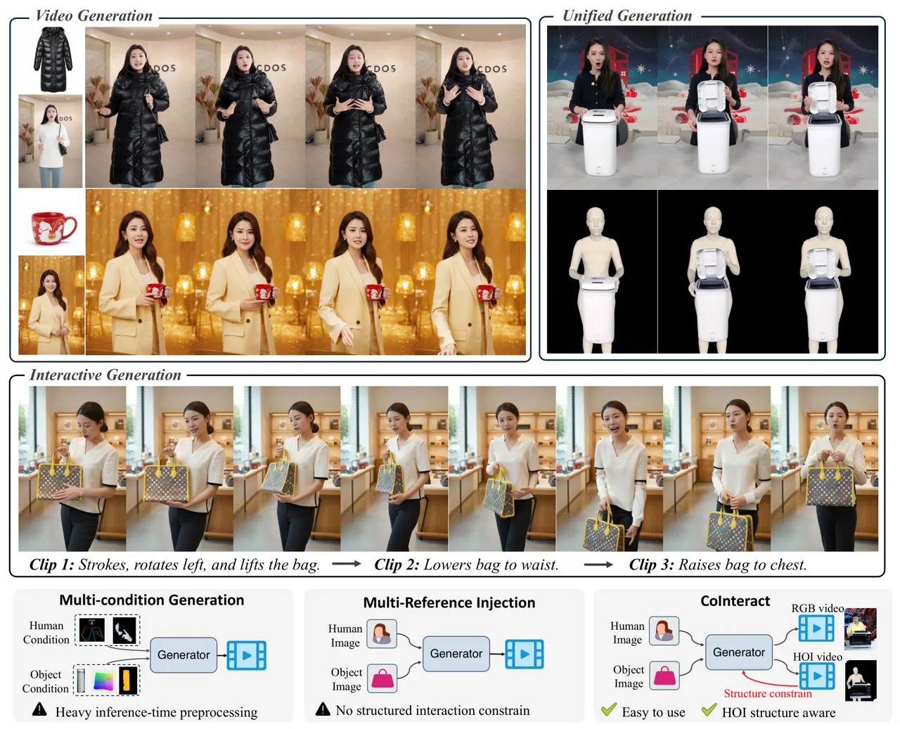
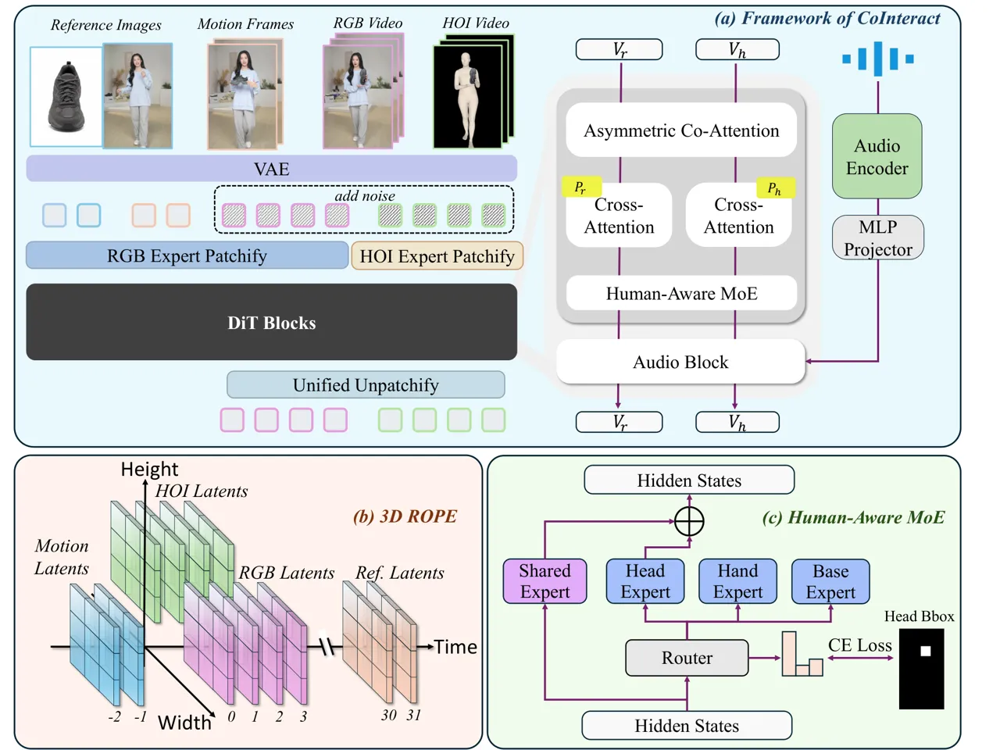
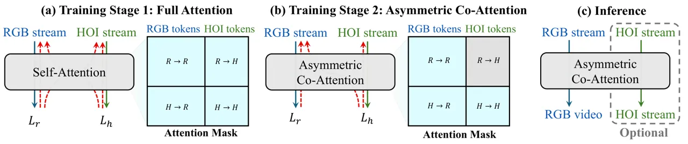
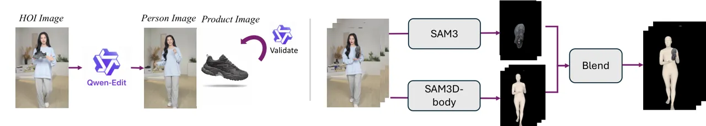
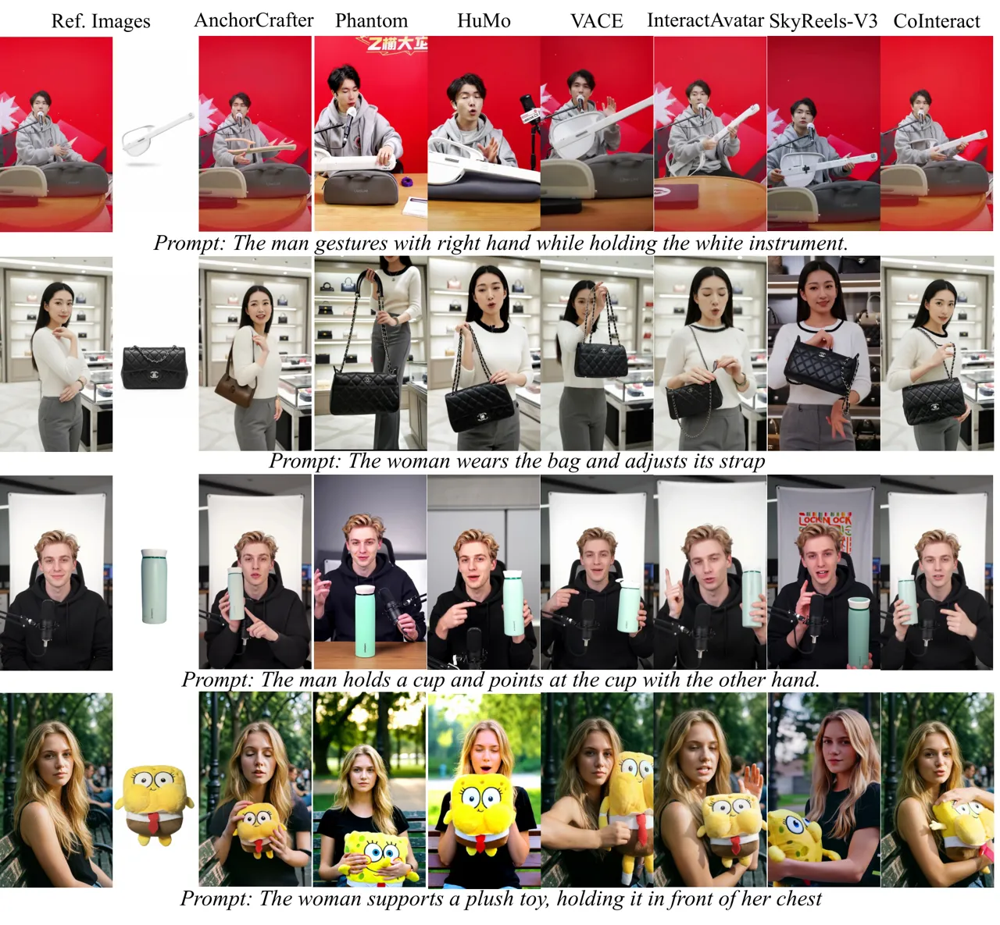
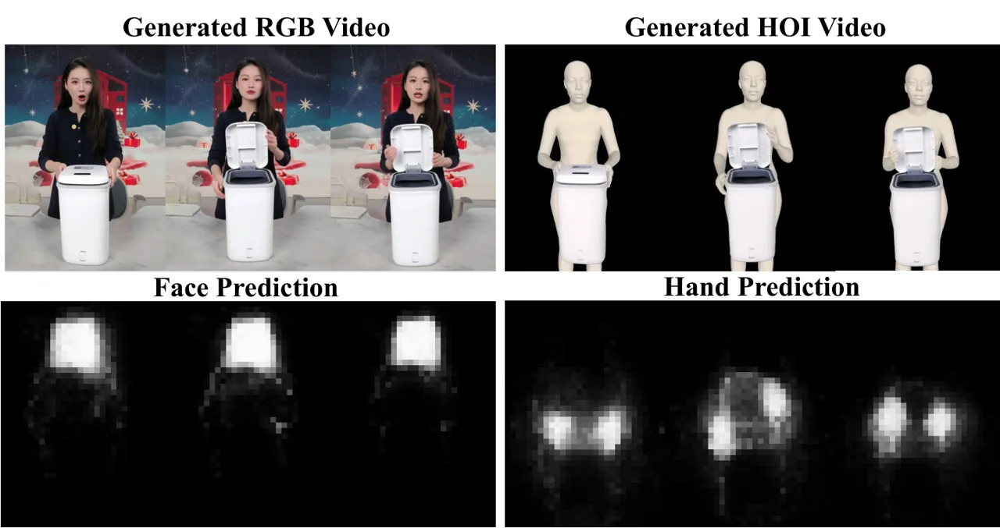
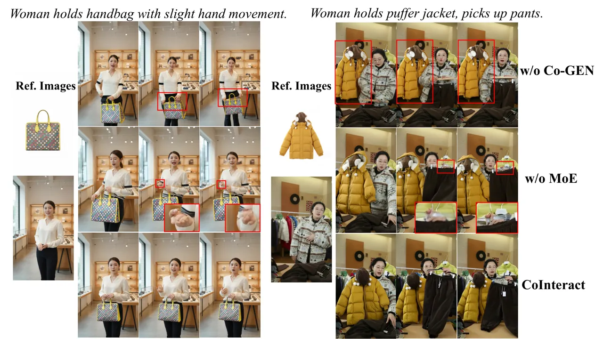

# CoInteract: Physically-Consistent Human-Object Interaction Video Synthesis via Spatially-Structured Co-Generation

Xiangyang Luo^(∗†) Affiliation: Tsinghua University, Alibaba Group   
Xiaozhe Xin^(∗‡) Affiliation: Tsinghua University, Alibaba Group    Tao
Feng    Xu Guo    Meiguang Jin Affiliation: Tsinghua University, Alibaba
Group    Junfeng Ma
Affiliation: [https://xinxiaozhe12345.github.io/CoInteract_Project/](https://xinxiaozhe12345.github.io/CoInteract_Project/)
Affiliation: Tsinghua University, Alibaba Group

###### Abstract

Synthesizing human–object interaction (HOI) videos has broad practical
value in e-commerce, digital advertising, and virtual marketing.
However, current diffusion models, despite their photorealistic
rendering capability, still frequently fail on (i) the structural
stability of sensitive regions such as hands and faces and (ii)
physically plausible contact (e.g., avoiding hand–object
interpenetration). We present CoInteract, an end-to-end framework for
HOI video synthesis conditioned on a person reference image, a product
reference image, text prompts, and speech audio. CoInteract introduces
two complementary designs embedded into a Diffusion Transformer (DiT)
backbone. First, we propose a Human-Aware Mixture-of-Experts (MoE) that
routes tokens to lightweight, region-specialized experts via spatially
supervised routing, improving fine-grained structural fidelity with
minimal parameter overhead. Second, we propose Spatially-Structured
Co-Generation, a dual-stream training paradigm that jointly models an
RGB appearance stream and an auxiliary HOI structure stream to inject
interaction geometry priors. During training, the HOI stream attends to
RGB tokens and its supervision regularizes shared backbone weights; at
inference, the HOI branch is removed for zero-overhead RGB generation.
Experimental results demonstrate that CoInteract significantly
outperforms existing methods in structural stability, logical
consistency, and interaction realism.

###### Keywords: 

Diffusion Model, Human Centric Video Generation, Human Object
Interaction

^(†)^(†)footnotetext: ^(∗) Equal contribution. ^(†) Work done during
internship at Alibaba Group. ^(‡) Corresponding author.

## 1 Introduction



Figure 1: Given two reference images, a text prompt, and audio,
CoInteract generates high-fidelity HOI videos. Bottom: Comparison of
generation paradigms. Unlike existing methods that rely on heavy
inference-time preprocessing and lack structured interaction
constraints, CoInteract implements a unified, end-to-end generation
framework that is both easy to use and inherently aware of HOI
structures.

Driven by the remarkable progress in video generation \[42, 20\],
speech-driven avatar generation \[52, 59, 57, 50\] has achieved
unprecedented photorealism, which has opened up vast possibilities for
digital humans in e-commerce \[38, 23, 22\], virtual assistance \[31,
11\], and remote education \[47, 46\]. However, as demand shifts from
passive speaking to active product demonstration, Human-Object
Interaction (HOI) video synthesis has emerged as the next critical
frontier, requiring coordinated hand movements, precise object
manipulation, and strict physical plausibility beyond what existing
talking-avatar generation methods provide.

As shown in Fig. 1, prior work on HOI video synthesis can be broadly
grouped into two paradigms. (i) Multi-condition generation. These
methods extract per-frame human poses and object conditions to guide
generation \[51, 26, 43\], but the required preprocessing and
domain-specific signals often limit robustness and generalization. (ii)
Multi-reference generation. Another line conditions a generative model
on person/product references, either by directly synthesizing videos
from multiple references \[5, 17, 21\] or by compositing references via
image editing and then performing speech-to-video generation \[48, 10,
54\]. While more flexible, these approaches typically lack explicit
mechanisms to enforce interaction structure—_e.g_. interaction geometry
and physically plausible hand poses—often leading to implausible
human–object interaction.

We argue that this limitation is rooted in the RGB-centric nature of
current diffusion backbones. As also observed in recent studies \[53,
49\], models trained purely on pixel-level supervision have no built-in
notion of 3D hand-object spatial relationships or body structure, and
must rely on appearance cues alone to infer interaction, which leads to
two recurring failure modes: (1) structural collapse in hands and faces,
where fingers merge or facial features blur, and (2) physical violations
such as human-object interpenetration, where hands pass through product
surfaces due to the lack of explicit object boundary awareness.

To address these challenges, we argue that a model must not only "see"
pixels but also "understand" the underlying structural and interaction
relationships. In this paper, we present CoInteract, an end-to-end
framework that introduces a Spatially-Structured Co-Generation paradigm
for physically-consistent HOI video synthesis. Our core philosophy is to
embed human structural priors and HOI physical constraints directly into
the Diffusion Transformer (DiT) backbone, transforming it from a pure
appearance generator into a structure-aware interaction engine. The
technical contribution of CoInteract is twofold. First, we propose a
Human-Aware Mixture-of-Experts (MoE) to improve hand and face quality.
Using face and hand bounding boxes as supervision, a lightweight router
learns to dispatch tokens to region-specialized experts that enhance
structural fidelity with only a marginal increase in parameters. Second,
we introduce a dual-stream co-generation paradigm to enforce physical
plausibility. An auxiliary HOI structure stream—where the human body is
reduced to a silhouette while the object retains its RGB appearance—is
jointly trained with the RGB stream within a shared DiT backbone. This
forces the backbone to learn spatial and interaction relationships
rather than relying on appearance cues alone. During training, the HOI
stream attends to RGB tokens and its supervision regularizes the shared
backbone; at inference, we keep only the RGB stream. Extensive
experiments demonstrate that CoInteract consistently outperforms
existing methods in interaction plausibility, structural stability, and
identity preservation. Our contributions are summarized as follows:

- •
  We propose CoInteract, a novel end-to-end framework for speech-driven
  HOI video synthesis that embeds human structural priors and
  interaction geometry constraints directly into the DiT backbone,
  ensuring both physical plausibility and structural consistency without
  relying on external preprocessing or post-processing.
- •
  We introduce a Human-Aware Mixture-of-Experts (MoE) that uses spatial
  supervision to guide lightweight specialized experts for hands and
  faces. This targeted processing ensures high structural fidelity and
  effectively reduces the artifacts commonly seen in these critical
  regions, with minimal additional parameters.
- •
  We develop a Spatially-Structured Co-Generation paradigm using an
  asymmetric co-attention mask to embed physical interaction rules into
  the DiT. This approach forces the model to respect geometric
  constraints and substantially reduces hand-object interpenetration,
  while ensuring zero additional computational cost at inference.

## 2 Related Works

### 2.1 Video Diffusion Models

Video diffusion models \[42, 20, 21, 13, 1\] have evolved rapidly from
image diffusion to temporally coherent video synthesis. Early
methods \[13, 1\] extend image priors with temporal modules but often
suffer from flickering and drift. Subsequent works \[40, 41\] improve
consistency via patch- or view-based designs. Recent state-of-the-art
approaches \[42, 21\] predominantly adopt DiT-style backbones \[33\] to
model spatiotemporal tokens with global attention.

Despite strong visual quality, RGB-centric video diffusion models remain
fragile in complex human–object interaction (HOI) scenarios \[27\],
where supervision provides weak constraints on contact geometry and body
topology. This often manifests as hand/face distortions and contact
violations such as interpenetration. To introduce additional structural
cues, recent works explore multi-stream co-generation by jointly
predicting auxiliary modalities (e.g., depth or flow) alongside RGB \[4,
14\], or by explicitly injecting geometric constraints during
training \[49\]. However, these methods target general video synthesis
and do not explicitly address HOI-specific challenges such as stable
hand articulation under occlusion and physically plausible grasping. Our
work focuses on HOI and injects interaction-structure supervision and
region-specific specialization into a shared DiT backbone.

### 2.2 Audio-driven Human Animation

Audio-driven human animation has achieved impressive results for talking
heads and avatars, emphasizing lip synchronization and identity
preservation \[34, 62, 59, 45, 31, 50, 57\]. Beyond faces, co-speech
gesture generation maps speech to plausible body/hand motion, where
diffusion models are effective in capturing one-to-many motion
variability \[54, 10, 24, 9, 12\]. However, most prior work focuses on
human-only motion and does not explicitly enforce hand–object contact
constraints in rendered videos.

Recent studies recognize that hands and faces require dedicated
treatment. CyberHost \[25\] introduces region attention with learnable
latent features to refine hand/face synthesis, and
Make-Your-Anchor \[16\] applies post-hoc face enhancement. These
approaches typically act as external add-ons that are decoupled from the
generative backbone. In contrast, we embed a Human-Aware
Mixture-of-Experts (MoE) directly into DiT blocks to specialize capacity
for hands/faces _within_ the generation process, and further introduce
HOI-structured supervision to improve physically plausible interactions.

### 2.3 Human–Object Interaction Video Generation

HOI video synthesis requires jointly modeling human motion, object
manipulation, and physically plausible contact. Existing approaches can
be roughly grouped into two paradigms.

(i) Multi-condition generation. These methods augment diffusion models
with explicit pose and object-related structural controls \[51, 43,
26\]. For instance, AnchorCrafter \[51\] conditions on human pose and
multi-view object features, while ByteLoom \[26\] introduces geometric
priors (e.g., relative coordinate maps) to improve spatial alignment.
While effective, such approaches rely on heavy preprocessing and
external signals, and often do not internalize HOI constraints within
the backbone.

(ii) Multi-reference generation. Another line injects identity and
product references without explicit geometry conditions. This includes
direct multi-reference video synthesis \[5, 17, 21, 61\] and two-stage
pipelines that composite references via image editing \[48, 2\] before
speech-to-video generation \[54, 10, 44, 9\]. Despite flexibility, these
methods often lack HOI-specific structural supervision, leading to
unstable hand articulation and implausible contact.

CoInteract addresses these limitations by formulating HOI synthesis as
_spatially-structured co-generation_: it jointly trains an RGB stream
with an auxiliary HOI structure stream to inject interaction geometry
priors, and uses a Human-Aware MoE to stabilize structurally sensitive
regions, while enabling zero-overhead inference by removing the
auxiliary HOI branch.

## 3 Method



Figure 2: Overview of CoInteract. (a) The framework jointly generates
RGB and HOI streams within a shared DiT backbone equipped with a
Human-Aware MoE. An asymmetric co-attention mask enforces
interaction-structure supervision during training; the HOI branch is
removed at inference. $`\mathbf{V}_{r,h}`$ and $`\mathbf{P}_{r,h}`$
denote the hidden states and prompts of the RGB and HOI streams,
respectively. (b) 3D RoPE assigns distinct spatiotemporal coordinates to
motion, RGB, reference, and HOI latents. (c) The Human-Aware MoE employs
a spatially supervised router to dispatch head and hand tokens to
specialized experts.

As illustrated in Fig. 2, we present CoInteract, an end-to-end framework
for speech-driven human–object interaction (HOI) video synthesis. Given
dual reference images (character identity $`\mathcal{I}_{ref}`$ and
product $`\mathcal{I}_{prod}`$) together with motion frames
$`\mathcal{V}_{mot}`$ that preserve temporal continuity \[58, 10, 30\],
our goal is to synthesize HOI videos that are both structurally stable
and physically plausible. Unlike conventional video diffusion models
that operate purely in RGB space, CoInteract explicitly injects
interaction structure and body-level consistency into a shared Diffusion
Transformer (DiT) backbone.

### 3.1 Unified RGB–HOI Co-Generation

Standard diffusion-based video models learn RGB-dominated spatiotemporal
priors without explicit supervision on interaction geometry. While
effective for general synthesis, they provide weak constraints for
contact topology and occlusion ordering, often producing HOI artifacts
such as hand–object interpenetration and unstable hand articulation.

To address this, we introduce a unified co-generation paradigm
(Fig. 2(a)) in which an RGB appearance stream $`\mathbf{z}_{r}`$ and an
auxiliary HOI structure stream $`\mathbf{z}_{h}`$ are jointly trained
within a single DiT backbone. The key insight is to train with a
_texture-stripped_ HOI structure stream that preserves interaction
geometry (mesh projection with fused object masks) while removing
appearance cues, thereby guiding shared weights toward physically
consistent representations.

##### HOI structure stream.

We construct an auxiliary HOI structure stream as a silhouette-like
3-channel rendering obtained by projecting the recovered human mesh to
the image plane and fusing the projected object mask. This produces a
pixel-aligned structural target that highlights interaction boundaries
while discarding RGB texture.

##### Tokenization and shared backbone.

The two streams are tokenized by _modality-specific_ patch embedding
layers (with the same patch size) and then fed into shared DiT blocks.
The HOI stream uses a fixed descriptive prompt template to provide
consistent semantic conditioning. Within each DiT block, the two streams
share all transformer parameters but employ stream-specific modulation
parameters (scale and shift in adaptive layer normalization), enabling a
single backbone to specialize feature statistics for appearance versus
structure without duplicating the full model.

##### Joint flow-matching objective.

We optimize the model with a joint flow-matching objective supervising
both streams:

```math
\mathcal{L}_{flow}=\mathcal{L}_{r}+\lambda_{h}\mathcal{L}_{h}. \tag{1}
```

```math
\displaystyle\mathcal{L}_{r} \displaystyle=\mathbb{E}_{t,\mathbf{z}_{0},\mathbf{z}_{1}}\!\left[\left\|\mathbf{v}_{r}-\mathbf{v}_{\theta}(\mathbf{z}_{r,t},t,\mathbf{c})\right\|_{2}^{2}\right], \tag{2}
```

```math
\displaystyle\mathcal{L}_{h} \displaystyle=\mathbb{E}_{t,\mathbf{z}_{0},\mathbf{z}_{1}}\!\left[\left\|\mathbf{v}_{h}-\mathbf{v}_{\theta}(\mathbf{z}_{h,t},t,\mathbf{c})\right\|_{2}^{2}\right].
```

where $`\mathbf{v}`$ denotes the target velocity field, $`t`$ is the
diffusion timestep, and $`\mathbf{c}`$ denotes conditioning (text,
audio, dual reference images, and motion latents). We set
$`\lambda_{h}=1`$ unless otherwise stated.

#### Multi-Modal Coordinate Assignment via 3D RoPE

To seamlessly integrate heterogeneous modalities—ranging from historical
motion and static references to dual-stream generative latents—we assign
each token a 3D coordinate $`(h,w,t)`$ encoded by 3D Rotary Positional
Encoding (3D RoPE). As illustrated in Fig. 2(b), our coordinate
assignment enforces the following inductive biases:

- •
  Spatial coordinates for dual streams. To preserve pixel-level
  correspondence between RGB and HOI, we concatenate the two streams
  along the width dimension, assigning distinct horizontal
  coordinates—_e.g_. $`w\in[0,W]`$ for RGB and $`w\in[-W,0]`$ for
  HOI—while sharing identical height and time indices. This allows the
  model to learn cross-stream alignment through relative positional
  distances.
- •
  Temporal causality and reference anchoring. We explicitly structure
  the temporal axis to distinguish between motion context, generated
  video, and identity reference:
  1.  1.  Historical motion ($`t<0`$). Past motion frames are assigned
          negative temporal indices (e.g., $`t\in\{-N,\dots,-1\}`$), placing
          them logically before the current generation window to encourage
          causal motion continuity.
  2.  2.  Reference anchoring ($`t\gg T`$). Static reference images are
          mapped to a far-field temporal location (e.g., $`t=30,31`$) with a
          significant offset, encouraging the model to treat them as global
          identity anchors rather than adjacent frames.

Formally, the position of any token $`x`$ is encoded as:

```math
\text{Pos}(x_{i,j,k})=\text{RoPE}_{3D}(h_{i},w^{\prime}_{j},t_{k}), \tag{3}
```

where $`w^{\prime}_{j}`$ accounts for the virtual width shift in the HOI
stream. This unified mapping encourages the attention mechanism to
respect structural and temporal relationships across all inputs.

#### Two-Stage Asymmetric Co-Attention



Figure 3: Two-stage training and inference (DiT blocks omitted for
clarity). Stage 1 uses full attention to establish coupling between the
RGB and HOI streams. Stage 2 applies an asymmetric co-attention mask,
enabling removal of the HOI branch at inference for efficiency.
$`\mathcal{L}_{r}`$ and $`\mathcal{L}_{h}`$ denote the flow-matching
losses for the RGB and HOI streams, respectively, and red dashed arrows
indicate gradient flow into shared DiT parameters.

To inject interaction-structure supervision while maintaining inference
efficiency, we adopt a two-stage training strategy with an Asymmetric
Co-Attention mechanism (Fig. 3). In Stage 1, standard bidirectional
attention is applied across both streams for rapid convergence, allowing
the model to learn global dependencies between appearance and
interaction structure. In Stage 2, we enforce an asymmetric attention
mask. Let $`\mathcal{T}_{r}`$ and $`\mathcal{T}_{h}`$ denote the token
sets for the RGB and HOI streams, respectively, and let rows correspond
to queries and columns to keys. The mask $`\mathbf{M}`$ is defined as:

```math
\mathbf{M}_{i,j}=\begin{cases}1,&\text{if }i\in\mathcal{T}_{r},\;j\in\mathcal{T}_{r},\\
1,&\text{if }i\in\mathcal{T}_{h},\;j\in\mathcal{T}_{r}\cup\mathcal{T}_{h},\\
0,&\text{otherwise.}\end{cases} \tag{4}
```

Under this mask, RGB queries attend only to RGB tokens, making the RGB
pathway independent of the HOI branch and thus removable at inference
with _zero_ overhead. HOI queries, conversely, attend to both streams,
leveraging cleaner RGB features to predict interaction structure.
Crucially, $`\mathcal{L}_{h}`$ backpropagates through the
HOI$`\leftarrow`$RGB cross-attention into the _shared_ DiT parameters;
since the RGB stream reuses the same parameters at inference, this
transfers interaction-structure supervision to the RGB generator even
when the HOI branch is removed.

### 3.2 Human-Aware Mixture-of-Experts

While structured co-generation injects interaction priors into the
backbone, hands and faces may still exhibit artifacts due to their
high-frequency detail and articulation complexity. We therefore
incorporate a Human-Aware Mixture-of-Experts (MoE) module \[37, 8\] that
routes tokens to region-specialized experts via a spatially supervised
router $`\mathcal{R}`$ (Fig. 2(c)). We include a _Shared_ expert that
reuses the original DiT FFN as a shortcut path, and three lightweight
experts (_Head_, _Hand_, _Base_) implemented as small FFNs, introducing
a modest parameter overhead. This enables dedicated capacity for
anatomically sensitive regions, improving hand sharpness and face
identity consistency without degrading general synthesis quality.

##### Spatially supervised routing.

To prevent router optimization from interfering with the DiT
representation learning, we apply a stop-gradient operation
$`sg[\cdot]`$ to hidden states before routing. The routing probability
for token $`x_{i}`$ is computed as:

```math
G(x_{i})=\text{Softmax}(\mathcal{W}_{g}\cdot sg[\mathbf{h}_{i}]). \tag{5}
```

Using face and hand bounding boxes, the router assigns tokens inside the
corresponding regions to $`\mathcal{E}_{head}`$ or
$`\mathcal{E}_{hand}`$, while remaining tokens are processed by the base
expert. We enforce specialization via a cross-entropy routing loss:

```math
\mathcal{L}_{route}=-\sum_{i}\sum_{k\in\{head,hand,base\}}\mathbb{1}(y_{i}=k)\log(G(x_{i})_{k}), \tag{6}
```

where $`y_{i}`$ is the ground-truth region label and
$`\mathbb{1}(\cdot)`$ is the indicator function. The total training
objective is:

```math
\mathcal{L}_{total}=\mathcal{L}_{flow}+\eta\mathcal{L}_{route}. \tag{7}
```

### 3.3 Data Curation and Representation



Figure 4: Preprocessing pipeline for constructing paired RGB and
HOI-structure training data.

To facilitate structure-aware training, we transform raw HOI videos into
paired RGB and HOI-structure representations (Fig. 4). We first decouple
entities using Qwen-Edit \[48\] to create independent person and product
references, followed by a validation module that filters mismatched
(source image, person, object) triplets. For geometric supervision, we
use SAM3 \[3\] to obtain object masks and SAM3D-body \[55\] to recover a
human mesh, which is then projected to the image plane. We fuse the
projected human rendering with the object mask to form a
texture-stripped HOI structure stream $`\mathbf{V}_{h}`$. Since this HOI
stream is geometry-focused, the model is encouraged to learn spatial and
_interaction_ relationships rather than exploiting appearance shortcuts.
Finally, both RGB video $`\mathbf{V}_{r}`$ and HOI stream
$`\mathbf{V}_{h}`$ are encoded into a shared latent space via a
pre-trained VAE for dual-stream training. Additionally, we use
off-the-shelf detectors \[29, 36\] to obtain face and hand bounding
boxes, which provide explicit supervision for the MoE router during
training.

## 4 Experiments

### 4.1 Training Details

Dataset. We curate a large-scale HOI video dataset following
Section 3.3, comprising 40 hours of product demonstration and
live-streaming videos. After quality filtering, 12K high-quality clips
are retained with paired RGB–HOI representations, hand/face bounding
boxes, and silhouette masks. A held-out test set of 50 clips covers
diverse product categories and unseen identities.

Implementation Details. CoInteract is initialized from WanS2V \[10\].
The Human-Aware MoE consists of four experts: one Shared expert that
reuses the original DiT FFN, and three lightweight experts (Head, Hand,
Base) each implemented as a light FFN with hidden dimension 256. The
router is a two-layer MLP trained with spatial supervision. AdamW \[19\]
is used with learning rate $`1\times 10^{-4}`$ and cosine annealing.
Training proceeds in two stages: full bidirectional self-attention with
5K iterations, followed by asymmetric co-attention with 2K iterations.
Loss weights are $`\lambda_{h}=1`$ and $`\eta=1`$. The HOI branch is
discarded at inference, incurring zero additional cost. As for inference
settings, we set CFG with 5, inference steps with 40, and generate
videos at 480p resolution.

### 4.2 Quantitative Comparison

Baselines. We compare CoInteract against AnchorCrafter \[51\],
Phantom \[28\], Humo \[5\], InteractAvatar \[60\], SkyReels-V3 \[21\],
and VACE \[17\]. All methods use identical reference images and audio
inputs. Since InteractAvatar does not natively support separate
injection of identity and product references, we first use
Qwen-Image \[48\] to composite both references into a single image
before feeding it to the model; its results therefore partly benefit
from the image editing model’s compositing capability. For
AnchorCrafter, we follow the authors’ preprocessing pipeline to prepare
per-frame pose and object annotations for all test samples.

Evaluation Metrics. We evaluate from four complementary aspects.

Video Quality. AES$`\uparrow`$ measures perceptual aesthetics via the
LAION aesthetic predictor \[35\]. IQ$`\uparrow`$ uses MUSIQ \[18\] for
frame-level perceptual quality. Smooth$`\uparrow`$ computes CLIP cosine
similarity between consecutive frames. All three metrics are computed
via VBench \[15\].

Human–Object Interaction. Standardized benchmarks for evaluating HOI
video quality remain scarce; we therefore rely primarily on two
automatic metrics alongside a perceptual user study (Sec. 4.4).
VLM-QA$`\uparrow`$ employs Gemini-3-Pro \[39\], one of the most capable
video perception models, to assess HOI plausibility. We design a
structured questionnaire of 50 binary (0/1) questions that probe
interaction rationality; the per-video score is the fraction of positive
responses, averaged over the test set. HQ$`\uparrow`$ (Hand Quality)
computes the mean confidence of hand keypoints detected by
DWPose \[56\], averaged over all frames in the generated video. Higher
scores indicate more structurally plausible and clearly rendered hands.

Reference Consistency. DINO$`{}_{\textit{id}}`$$`\uparrow`$ measures
DINOv2 \[32\] cosine similarity between the identity reference
$`\mathcal{I}_{ref}`$ and generated character crops.
DINO$`{}_{\textit{obj}}`$$`\uparrow`$ measures DINOv2 similarity between
the product reference $`\mathcal{I}_{prod}`$ and generated object
regions. FaceSim$`\uparrow`$ computes ArcFace \[7\] cosine similarity
between reference face embeddings and generated face embeddings averaged
across frames.

Audio-Visual Alignment. Sync$`{}_{\textit{conf}}`$$`\uparrow`$ is the
lip-sync confidence score \[6\].

Results. Table 1 presents quantitative comparisons. CoInteract achieves
the best or competitive results across most metrics. In particular, it
obtains the highest VLM-QA (0.72) and HQ (0.724), confirming superior
interaction plausibility and hand structural stability. It also leads in
identity preservation (DINO$`{}_{\text{id}}`$: 0.671, FaceSim: 0.696)
and temporal coherence (Smooth: 0.9951). Phantom and Humo score slightly
higher on AES, partly because they tend to hallucinate novel backgrounds
that happen to look aesthetically pleasing but deviate from the input
reference (see Fig. 5); CoInteract instead faithfully preserves the
reference scene, which trades marginal aesthetic scores for stronger
consistency.

| Method                | Video Quality |       |        | HOI    |       | Reference              |                         |         | Audio                    |
| --------------------- | ------------- | ----- | ------ | ------ | ----- | ---------------------- | ----------------------- | ------- | ------------------------ |
|                       | AES           | IQ    | Smooth | VLM-QA | HQ    | DINO$`{}_{\text{id}}`$ | DINO$`{}_{\text{obj}}`$ | FaceSim | Sync$`{}_{\text{conf}}`$ |
| AnchorCrafter \[51\]  | 0.448         | 0.643 | 0.9743 | 0.22   | 0.596 | 0.538                  | 0.453                   | 0.487   | —                        |
| Phantom \[28\]        | 0.579         | 0.724 | 0.9916 | 0.50   | 0.650 | 0.654                  | 0.595                   | 0.593   | —                        |
| Humo \[5\]            | 0.565         | 0.741 | 0.9919 | 0.56   | 0.664 | 0.643                  | 0.629                   | 0.618   | 5.71                     |
| VACE \[17\]           | 0.530         | 0.733 | 0.9904 | 0.46   | 0.627 | 0.623                  | 0.635                   | 0.647   | —                        |
| InteractAvatar \[60\] | 0.528         | 0.722 | 0.9938 | 0.62   | 0.696 | 0.658                  | 0.608                   | 0.681   | 5.82                     |
| SkyReels-V3 \[21\]    | 0.563         | 0.720 | 0.9861 | 0.44   | 0.626 | 0.637                  | 0.564                   | 0.569   | —                        |
| CoInteract            | 0.554         | 0.749 | 0.9951 | 0.72   | 0.724 | 0.671                  | 0.624                   | 0.696   | 5.87                     |

Table 1: Quantitative comparison on the HOI video generation test set.
Bold indicates the best result; underline indicates the second best; “—”
indicates unsupported.



Figure 5: Qualitative comparison with existing methods, CoInteract
preserves higher interaction fidelity and better adheres to the input
prompts. (Zoom in for details.)

### 4.3 Qualitative Results

Fig. 5 presents qualitative comparisons across diverse scenarios.
CoInteract consistently produces videos with coherent hand articulation,
natural product grasping, and faithful prompt adherence. Other baselines
exhibit varying degrees of deficiency in HOI plausibility, prompt
compliance, and background consistency—common failure modes include
hand-object interpenetration, inconsistent product appearance, and
background deviation from the reference. AnchorCrafter performs
noticeably better on the last two cases, which correspond to objects in
its training set; on the first two unseen-object cases, it suffers from
identity drift and unnatural interaction boundaries, revealing limited
generalization. InteractAvatar benefits from Qwen-Image compositing,
which provides a strong initial frame with correct object placement;
however, as generation progresses, it still produces HOI plausibility
issues such as unnatural grasping poses (e.g., last row). In contrast,
CoInteract maintains physically plausible interaction and structural
stability throughout the full sequence.

#### Visualization of HOI branch and Human-Aware MoE

To further investigate CoInteract’s internal mechanisms, we visualize
the dual-stream generation and MoE routing behavior in Fig. 6. The HOI
stream maintains precise spatio-temporal synchronization with the RGB
stream, providing a consistent geometric scaffold that mitigates
hand-object interpenetration even during drastic motions such as opening
a bin lid. The routing heatmaps confirm that the router accurately
isolates face and hand tokens and dispatches them to specialized
experts, maintaining high-frequency structural fidelity even under rapid
movement.



Figure 6: Visualization of Dual-Stream Co-generation and MoE Routing.
The top rows display the generated RGB video and the corresponding
auxiliary HOI representation, demonstrating precise spatio-temporal
alignment and structural consistency during complex interactions (e.g.,
opening a bin). The bottom rows show the routing heatmaps for face and
hand experts from the MoE router.

### 4.4 User Study

We conducted a perceptual user study with 24 evaluators recruited via
crowd-sourcing. Each evaluator was shown 10 randomly sampled test cases.
For each case, all methods were provided with identical inputs, and the
resulting videos were presented in a blind randomized order. Evaluators
were asked to rank the methods (lower is better) according to three
criteria: Object Consistency, Human/Background Consistency, and
Interaction Plausibility.

| Criterion                   | AnchorCrafter | Phantom | Humo | VACE | InteractAvatar | SkyReels-V3 | CoInteract |
| --------------------------- | ------------- | ------- | ---- | ---- | -------------- | ----------- | ---------- |
| Obj. Consist.$`\downarrow`$ | 6.08          | 4.13    | 4.42 | 3.54 | 3.08           | 4.58        | 2.17       |
| Hum/BG$`\downarrow`$        | 6.28          | 4.38    | 4.21 | 3.46 | 2.92           | 4.83        | 1.92       |
| Interact.$`\downarrow`$     | 6.55          | 4.29    | 3.92 | 3.58 | 3.33           | 4.54        | 1.79       |

Table 2: User study (mean rank, lower is better).

Table 2 reports the mean rank. CoInteract achieves the best (lowest)
mean rank across all criteria, with the largest advantage on Interaction
Plausibility, consistent with our HOI-focused design.

### 4.5 Ablation Study

|                |               |       |        |        |       |                        |                         |         |                          |                |
| -------------- | ------------- | ----- | ------ | ------ | ----- | ---------------------- | ----------------------- | ------- | ------------------------ | -------------- |
| Variant        | Video Quality |       |        | HOI    |       | Reference              |                         |         | Audio                    |                |
|                | AES           | IQ    | Smooth | VLM-QA | HQ    | DINO$`{}_{\text{id}}`$ | DINO$`{}_{\text{obj}}`$ | FaceSim | Sync$`{}_{\text{conf}}`$ | Infer. Cost    |
| w/o MoE        | 0.541         | 0.736 | 0.993  | 0.66   | 0.658 | 0.659                  | 0.611                   | 0.662   | 5.64                     | $`1.00\times`$ |
| w/o Co-Gen     | 0.536         | 0.753 | 0.991  | 0.48   | 0.706 | 0.664                  | 0.597                   | 0.678   | 5.86                     | $`1.04\times`$ |
| w/o Asym. Mask | 0.548         | 0.742 | 0.994  | 0.76   | 0.738 | 0.668                  | 0.618                   | 0.689   | 5.81                     | $`4.13\times`$ |
| Full Model     | 0.554         | 0.749 | 0.995  | 0.72   | 0.724 | 0.671                  | 0.624                   | 0.696   | 5.87                     | $`1.04\times`$ |

Table 3: Ablation study on core components.



Figure 7: Qualitative comparison of ablation variants. The absence of
unified HOI co-generation yields interactions that lack physical
plausibility. Conversely, removing the Human-Aware MoE induces
structural collapse and artifacts in high-frequency regions like hands.
(Zoom in for details.)

We systematically ablate each core component via four model variants:
(1) w/o MoE, replacing the Human-Aware MoE with a standard FFN to
disable expert specialization; (2) w/o Co-Gen, removing the HOI stream
entirely to reduce the model to a single-stream RGB baseline without
structural supervision; (3) w/o Asym. Mask, replacing the Stage-2
asymmetric co-attention mask with standard bidirectional self-attention,
requiring the HOI branch to be retained at inference; and (4) Full
Model, the complete CoInteract. All variants share identical training
configurations.

Quantitative results are reported in Table 3. Removing MoE (row 1)
notably degrades HQ ($`0.724\!\to\!0.658`$) and FaceSim
($`0.696\!\to\!0.662`$), confirming its role in fine-grained structural
fidelity. Removing the HOI stream (row 2) causes the largest drop in
VLM-QA ($`0.72\!\to\!0.48`$, $`-`$33.3%), demonstrating that the
auxiliary stream is essential for internalizing physical interaction
constraints. Retaining the HOI branch at inference (row 3) slightly
surpasses the full model on VLM-QA (0.76) and HQ (0.738), as expected
from direct structural guidance; however, it inflates inference cost to
$`4.13\times`$ due to the doubled token count. The MoE introduces only a
$`1.04\times`$ overhead relative to the MoE-free baseline, confirming
its minimal impact on inference efficiency. Our asymmetric strategy
trades marginal interaction gains for a dramatic efficiency improvement
at near-zero additional inference cost. Qualitative results in Fig. 7
corroborate these findings: removing co-generation yields physically
implausible interactions, while removing MoE leads to hand collapse and
blurred facial details.

## 5 Conclusion

This paper presents CoInteract, a structure-aware framework for
speech-driven human-object interaction (HOI) video synthesis that
prioritizes structural integrity and physical consistency. The framework
introduces a Human-Aware Mixture-of-Experts (MoE) to enhance the
fidelity of hands and faces through a spatially-supervised routing
policy. Furthermore, the Spatially-Structured Co-Generation paradigm,
utilizing an asymmetric co-attention mask, allows the model to learn
physical interaction priors during training. This architecture
effectively reduces hand-object interpenetration and geometric
misalignment while maintaining a zero-overhead inference path. Extensive
experiments demonstrate that CoInteract consistently outperforms
existing methods in interaction plausibility and structural stability,
advancing the quality of HOI video generation.

## References

- \[1\] A. Blattmann, T. Dockhorn, S. Kulal, D. Mendelevitch, M.
  Kilian, D. Lorenz, Y. Levi, Z. English, V. Voleti, A. Letts, et
  al. (2023) Stable video diffusion: scaling latent video diffusion
  models to large datasets. arXiv preprint arXiv:2311.15127. Cited by:
  §2.1.
- \[2\] H. Cai, S. Cao, R. Du, P. Gao, S. Hoi, Z. Hou, S. Huang, D.
  Jiang, X. Jin, L. Li, et al. (2025) Z-image: an efficient image
  generation foundation model with single-stream diffusion transformer.
  arXiv preprint arXiv:2511.22699. Cited by: §2.3.
- \[3\] N. Carion, L. Gustafson, Y. Hu, S. Debnath, R. Hu, D. Suris, C.
  Ryali, K. V. Alwala, H. Khedr, A. Huang, et al. (2025) Sam 3: segment
  anything with concepts. arXiv preprint arXiv:2511.16719. Cited by:
  §3.3.
- \[4\] H. Chefer, U. Singer, A. Zohar, Y. Kirstain, A. Polyak, Y.
  Taigman, L. Wolf, and S. Sheynin (2025) Videojam: joint
  appearance-motion representations for enhanced motion generation in
  video models. arXiv preprint arXiv:2502.02492. Cited by: §2.1.
- \[5\] L. Chen, T. Ma, J. Liu, B. Li, Z. Chen, L. Liu, X. He, G. Li, Q.
  He, and Z. Wu (2025) Humo: human-centric video generation via
  collaborative multi-modal conditioning. arXiv preprint
  arXiv:2509.08519. Cited by: §1, §2.3, §4.2, Table 1.
- \[6\] J. S. Chung and A. Zisserman (2016) Out of time: automated lip
  sync in the wild. In Asian Conference on Computer Vision, pp. 251–263.
  Cited by: §4.2.
- \[7\] J. Deng, J. Guo, N. Xue, and S. Zafeiriou (2019) ArcFace:
  additive angular margin loss for deep face recognition. In Proceedings
  of the IEEE/CVF Conference on Computer Vision and Pattern Recognition,
  pp. 4690–4699. Cited by: §4.2.
- \[8\] Z. Fei, M. Fan, C. Yu, D. Li, and J. Huang (2024) Scaling
  diffusion transformers to 16 billion parameters. arXiv preprint
  arXiv:2407.11633. Cited by: §3.2.
- \[9\] Q. Gan, R. Yang, J. Zhu, S. Xue, and S. Hoi (2025) Omniavatar:
  efficient audio-driven avatar video generation with adaptive body
  animation. arXiv preprint arXiv:2506.18866. Cited by: §2.2, §2.3.
- \[10\] X. Gao, L. Hu, S. Hu, M. Huang, C. Ji, D. Meng, J. Qi, P.
  Qiao, Z. Shen, Y. Song, et al. (2025) Wan-s2v: audio-driven cinematic
  video generation. arXiv preprint arXiv:2508.18621. Cited by: §1, §2.2,
  §2.3, §3, §4.1.
- \[11\] X. Guo, F. Ye, X. Li, P. Tu, P. Zhang, Q. Sun, S. Zhao, X. Hou,
  and Q. He (2026) DreamID-v: bridging the image-to-video gap for
  high-fidelity face swapping via diffusion transformer. arXiv preprint
  arXiv:2601.01425. Cited by: §1.
- \[12\] X. Guo, F. Ye, Q. Sun, L. Chen, B. Li, P. Zhang, J. Liu, S.
  Zhao, Q. He, and X. Hou (2026) DreamID-omni: unified framework for
  controllable human-centric audio-video generation. arXiv preprint
  arXiv:2602.12160. Cited by: §2.2.
- \[13\] Y. Guo, C. Yang, A. Rao, Z. Liang, Y. Wang, Y. Qiao, M.
  Agrawala, D. Lin, and B. Dai (2023) Animatediff: animate your
  personalized text-to-image diffusion models without specific tuning.
  arXiv preprint arXiv:2307.04725. Cited by: §2.1.
- \[14\] J. Huang, Y. Zhang, X. He, Y. Gao, Z. Cen, B. Xia, Y. Zhou, X.
  Tao, P. Wan, and J. Jia (2025) UnityVideo: unified multi-modal
  multi-task learning for enhancing world-aware video generation. arXiv
  preprint arXiv:2512.07831. Cited by: §2.1.
- \[15\] Z. Huang, Y. He, J. Yu, F. Zhang, C. Si, Y. Jiang, Y. Zhang, T.
  Wu, Q. Jin, N. Chanpaisit, et al. (2024) Vbench: comprehensive
  benchmark suite for video generative models. In Proceedings of the
  IEEE/CVF Conference on Computer Vision and Pattern Recognition,
  pp. 21807–21818. Cited by: §4.2.
- \[16\] Z. Huang, F. Tang, Y. Zhang, X. Cun, J. Cao, J. Li, and T.
  Lee (2024) Make-your-anchor: a diffusion-based 2d avatar generation
  framework. In Proceedings of the IEEE/CVF Conference on Computer
  Vision and Pattern Recognition (CVPR), Cited by: §2.2.
- \[17\] Z. Jiang, Z. Han, C. Mao, J. Zhang, Y. Pan, and Y. Liu (2025)
  Vace: all-in-one video creation and editing. In Proceedings of the
  IEEE/CVF International Conference on Computer Vision, pp. 17191–17202.
  Cited by: §1, §2.3, §4.2, Table 1.
- \[18\] J. Ke, Q. Wang, Y. Wang, P. Milanfar, and F. Yang (2021) MUSIQ:
  multi-scale image quality transformer. In Proceedings of the IEEE/CVF
  International Conference on Computer Vision, pp. 5148–5157. Cited by:
  §4.2.
- \[19\] D. P. Kingma and J. Ba (2014) Adam: a method for stochastic
  optimization. arXiv preprint arXiv:1412.6980. Cited by: §4.1.
- \[20\] W. Kong, Q. Tian, Z. Zhang, R. Min, Z. Dai, J. Zhou, J.
  Xiong, X. Li, B. Wu, J. Zhang, et al. (2024) Hunyuanvideo: a
  systematic framework for large video generative models. arXiv preprint
  arXiv:2412.03603. Cited by: §1, §2.1.
- \[21\] D. Li, Z. Fei, T. Li, Y. Dou, Z. Chen, J. Yang, M. Fan, J.
  Xu, J. Wang, B. Gu, et al. (2026) SkyReels-v3 technique report. arXiv
  preprint arXiv:2601.17323. Cited by: §1, §2.1, §2.3, §4.2, Table 1.
- \[22\] X. Li, Q. Sun, P. Zhang, F. Ye, Z. Liao, W. Feng, S. Zhao,
  and Q. He (2025) Anydressing: customizable multi-garment virtual
  dressing via latent diffusion models. In 2025 IEEE/CVF Conference on
  Computer Vision and Pattern Recognition (CVPR), pp. 23723–23733. Cited
  by: §1.
- \[23\] Z. Liao, X. Liu, W. Qin, Q. Li, Q. Wang, P. Wan, D. Zhang, L.
  Zeng, and P. Feng (2025) Humanaesexpert: advancing a multi-modality
  foundation model for human image aesthetic assessment. arXiv preprint
  arXiv:2503.23907. Cited by: §1.
- \[24\] G. Lin, J. Jiang, J. Yang, Z. Zheng, C. Liang, Y. Zhang, and J.
  Liu (2025) Omnihuman-1: rethinking the scaling-up of one-stage
  conditioned human animation models. In Proceedings of the IEEE/CVF
  International Conference on Computer Vision, pp. 13847–13858. Cited
  by: §2.2.
- \[25\] G. Lin, J. Zheng, J. Yang, Z. Zheng, C. Liang, Y. Zhang, and J.
  Liu (2025) CyberHost: taming audio-driven avatar diffusion model with
  region codebook attention. arXiv preprint arXiv:2409.01876. Cited by:
  §2.2.
- \[26\] B. Liu, X. Gong, Z. Zhao, Z. Song, Y. Lu, S. Wu, J. Zhang, S.
  Banerjee, and H. Zhang (2025) ByteLoom: weaving geometry-consistent
  human-object interactions through progressive curriculum learning.
  arXiv preprint arXiv:2512.22854. Cited by: §1, §2.3.
- \[27\] K. Liu, Q. Liu, X. Liu, J. Li, Y. Zhang, J. Luo, X. He, and W.
  Liu (2025) Hoigen-1m: a large-scale dataset for human-object
  interaction video generation. In Proceedings of the Computer Vision
  and Pattern Recognition Conference, pp. 24001–24010. Cited by: §2.1.
- \[28\] L. Liu, T. Ma, B. Li, Z. Chen, J. Liu, G. Li, S. Zhou, Q. He,
  and X. Wu (2025) Phantom: subject-consistent video generation via
  cross-modal alignment. In Proceedings of the IEEE/CVF International
  Conference on Computer Vision, pp. 14951–14961. Cited by: §4.2, Table
  1.
- \[29\] C. Lugaresi, J. Tang, H. Nash, C. McClanahan, E. Uboweja, M.
  Hays, F. Zhang, C. Chang, M. G. Yong, J. Lee, et al. (2019) Mediapipe:
  a framework for building perception pipelines. arXiv preprint
  arXiv:1906.08172. Cited by: §3.3.
- \[30\] X. Luo, Q. Li, X. Liu, W. Qin, M. Yang, M. Wang, P. Wan, D.
  Zhang, K. Gai, and S. Huang (2026) Filmweaver: weaving consistent
  multi-shot videos with cache-guided autoregressive diffusion. In
  Proceedings of the AAAI Conference on Artificial Intelligence, Vol.
  40, pp. 7689–7697. Cited by: §3.
- \[31\] X. Luo, Y. Zhu, Y. Liu, L. Lin, C. Wan, Z. Cai, Y. Li, and S.
  Huang (2025) Canonswap: high-fidelity and consistent video face
  swapping via canonical space modulation. In Proceedings of the
  IEEE/CVF International Conference on Computer Vision, pp. 10064–10074.
  Cited by: §1, §2.2.
- \[32\] M. Oquab, T. Darcet, T. Moutakanni, H. Vo, M. Szafraniec, V.
  Khalidov, P. Fernandez, D. Haziza, F. Massa, A. El-Nouby, et
  al. (2024) DINOv2: learning robust visual features without
  supervision. Transactions on Machine Learning Research. Cited by:
  §4.2.
- \[33\] W. Peebles and S. Xie (2023) Scalable diffusion models with
  transformers. In Proceedings of the IEEE/CVF international conference
  on computer vision, pp. 4195–4205. Cited by: §2.1.
- \[34\] K. Prajwal, R. Mukhopadhyay, V. P. Namboodiri, and C.
  Jawahar (2020) A lip sync expert is all you need for speech to lip
  generation in the wild. In Proceedings of the 28th ACM international
  conference on multimedia, pp. 484–492. Cited by: §2.2.
- \[35\] C. Schuhmann, R. Beaumont, R. Vencu, C. Gordon, R. Wightman, M.
  Cherti, T. Coombes, A. Katta, C. Mullis, M. Wortsman, et al. (2022)
  LAION-5b: an open large-scale dataset for training next generation
  image-text models. Advances in Neural Information Processing Systems
  35, pp. 25278–25294. Cited by: §4.2.
- \[36\] D. Shan, J. Geng, M. Shu, and D. F. Fouhey (2020) Understanding
  human hands in contact at internet scale. In Proceedings of the
  IEEE/CVF conference on computer vision and pattern recognition,
  pp. 9869–9878. Cited by: §3.3.
- \[37\] M. Shi, Z. Yuan, H. Yang, X. Wang, M. Zheng, X. Tao, W.
  Zhao, W. Zheng, J. Zhou, J. Lu, et al. (2025) Diffmoe: dynamic token
  selection for scalable diffusion transformers. arXiv preprint
  arXiv:2503.14487. Cited by: §3.2.
- \[38\] L. Sun and Y. Tang (2024) Avatar effect of ai-enabled virtual
  streamers on consumer purchase intention in e-commerce livestreaming.
  Journal of Consumer Behaviour 23 (6), pp. 2999–3010. Cited by: §1.
- \[39\] G. Team, R. Anil, S. Borgeaud, J. Alayrac, J. Yu, R. Sorber, J.
  Schalkwyk, A. M. Dai, A. Hauth, K. Millican, et al. (2024) Gemini: a
  family of highly capable multimodal models. arXiv preprint
  arXiv:2312.11805. Cited by: §4.2.
- \[40\] V. Voleti, C. Yao, M. Boss, A. Letts, D. Pankratz, D.
  Tochilkin, C. Laforte, R. Rombach, and V. Jampani (2024) Sv3d: novel
  multi-view synthesis and 3d generation from a single image using
  latent video diffusion. In European Conference on Computer Vision,
  pp. 439–457. Cited by: §2.1.
- \[41\] C. Wan, X. Luo, H. Luo, Z. Cai, Y. Song, Y. Zhao, Y. Bai, F.
  Wang, Y. He, and Y. Gong (2024) Grid: omni visual generation. arXiv
  preprint arXiv:2412.10718. Cited by: §2.1.
- \[42\] T. Wan, A. Wang, B. Ai, B. Wen, C. Mao, C. Xie, D. Chen, F.
  Yu, H. Zhao, J. Yang, et al. (2025) Wan: open and advanced large-scale
  video generative models. arXiv preprint arXiv:2503.20314. Cited by:
  §1, §2.1.
- \[43\] L. Wang, Z. Xia, T. Hu, P. Wang, P. Wei, Z. Zheng, M. Zhou, Y.
  Zhang, and M. Gao (2025) Dreamactor-h1: high-fidelity human-product
  demonstration video generation via motion-designed diffusion
  transformers. arXiv preprint arXiv:2506.10568. Cited by: §1, §2.3.
- \[44\] M. Wang, Q. Wang, F. Jiang, Y. Fan, Y. Zhang, Y. Qi, K. Zhao,
  and M. Xu (2025) Fantasytalking: realistic talking portrait generation
  via coherent motion synthesis. In Proceedings of the 33rd ACM
  International Conference on Multimedia, pp. 9891–9900. Cited by: §2.3.
- \[45\] S. Wang, L. Li, Y. Ding, C. Fan, and X. Yu (2021) Audio2head:
  audio-driven one-shot talking-head generation with natural head
  motion. arXiv preprint arXiv:2107.09293. Cited by: §2.2.
- \[46\] P. Wonggom, C. Kourbelis, P. Newman, H. Du, and R. A.
  Clark (2019) Effectiveness of avatar-based technology in patient
  education for improving chronic disease knowledge and self-care
  behavior: a systematic review. JBI evidence synthesis 17 (6),
  pp. 1101–1129. Cited by: §1.
- \[47\] P. Wonggom, P. Nolan, R. A. Clark, T. Barry, C. Burdeniuk, K.
  Nesbitt, K. O’Toole, and H. Du (2020) Effectiveness of an avatar
  educational application for improving heart failure patients’
  knowledge and self-care behaviors: a pragmatic randomized controlled
  trial. Journal of advanced nursing 76 (9), pp. 2401–2415. Cited by:
  §1.
- \[48\] C. Wu, J. Li, J. Zhou, J. Lin, K. Gao, K. Yan, S. Yin, S.
  Bai, X. Xu, Y. Chen, et al. (2025) Qwen-image technical report. arXiv
  preprint arXiv:2508.02324. Cited by: §1, §2.3, §3.3, §4.2.
- \[49\] H. Wu, D. Wu, T. He, J. Guo, Y. Ye, Y. Duan, and J. Bian (2025)
  Geometry forcing: marrying video diffusion and 3d representation for
  consistent world modeling. arXiv preprint arXiv:2507.07982. Cited by:
  §1, §2.1.
- \[50\] Y. Xie, T. Feng, X. Zhang, X. Luo, Z. Guo, W. Yu, H. Chang, F.
  Ma, and F. R. Yu (2025) Pointtalk: audio-driven dynamic lip point
  cloud for 3d gaussian-based talking head synthesis. In Proceedings of
  the AAAI Conference on Artificial Intelligence, Vol. 39,
  pp. 8753–8761. Cited by: §1, §2.2.
- \[51\] Z. Xu, Z. Huang, J. Cao, Y. Zhang, X. Cun, Q. Shuai, Y.
  Wang, L. Bao, and F. Tang (2026) AnchorCrafter: animate cyber-anchors
  selling your products via human-object interacting video generation.
  IEEE Transactions on Visualization and Computer Graphics. Cited by:
  §1, §2.3, §4.2, Table 1.
- \[52\] H. Xue, X. Luo, Z. Hu, X. Zhang, X. Xiang, Y. Dai, J. Liu, Z.
  Zhang, M. Li, J. Yang, et al. (2025) Human motion video generation: a
  survey. IEEE Transactions on Pattern Analysis and Machine
  Intelligence. Cited by: §1.
- \[53\] H. Xue, Q. Chen, Z. Wang, X. Huang, E. Shechtman, J. Xie,
  and Y. Chen (2025) MoGAN: improving motion quality in video diffusion
  via few-step motion adversarial post-training. arXiv preprint
  arXiv:2511.21592. Cited by: §1.
- \[54\] S. Yang, Z. Kong, F. Gao, M. Cheng, X. Liu, Y. Zhang, Z.
  Kang, W. Luo, X. Cai, R. He, et al. (2025) Infinitetalk: audio-driven
  video generation for sparse-frame video dubbing. arXiv preprint
  arXiv:2508.14033. Cited by: §1, §2.2, §2.3.
- \[55\] X. Yang, D. Kukreja, D. Pinkus, A. Sagar, T. Fan, J. Park, S.
  Shin, J. Cao, J. Liu, N. Ugrinovic, et al. (2026) SAM 3d body: robust
  full-body human mesh recovery. arXiv preprint arXiv:2602.15989. Cited
  by: §3.3.
- \[56\] Z. Yang, A. Zeng, C. Yuan, and Y. Li (2023) Effective
  whole-body pose estimation with two-stages distillation. In
  Proceedings of the IEEE/CVF International Conference on Computer
  Vision, pp. 4210–4220. Cited by: §4.2.
- \[57\] H. Yu, Z. Qu, Q. Yu, J. Chen, Z. Jiang, Z. Chen, S. Zhang, J.
  Xu, F. Wu, C. Lv, et al. (2024) Gaussiantalker: speaker-specific
  talking head synthesis via 3d gaussian splatting. In Proceedings of
  the 32nd ACM International Conference on Multimedia, pp. 3548–3557.
  Cited by: §1, §2.2.
- \[58\] L. Zhang and M. Agrawala (2025) Packing input frame context in
  next-frame prediction models for video generation. arXiv preprint
  arXiv:2504.12626. Cited by: §3.
- \[59\] W. Zhang, X. Cun, X. Wang, Y. Zhang, X. Shen, Y. Guo, Y. Shan,
  and F. Wang (2023) Sadtalker: learning realistic 3d motion
  coefficients for stylized audio-driven single image talking face
  animation. In Proceedings of the IEEE/CVF conference on computer
  vision and pattern recognition, pp. 8652–8661. Cited by: §1, §2.2.
- \[60\] Y. Zhang, Z. Zhou, Z. Yu, Z. Huang, T. Hu, S. Liang, G.
  Zhang, Z. Peng, S. Li, Y. Chen, et al. (2026) Making avatars interact:
  towards text-driven human-object interaction for controllable talking
  avatars. arXiv preprint arXiv:2602.01538. Cited by: §4.2, Table 1.
- \[61\] D. Zhou, G. Liu, H. Yang, J. Li, J. Lin, X. Huang, Y. Liu, X.
  Gao, C. Chen, S. Wen, et al. (2026) OmniShow: unifying multimodal
  conditions for human-object interaction video generation. arXiv
  preprint arXiv:2604.11804. Cited by: §2.3.
- \[62\] Y. Zhou, X. Han, E. Shechtman, J. Echevarria, E. Kalogerakis,
  and D. Li (2020) Makelttalk: speaker-aware talking-head animation. ACM
  Transactions On Graphics (TOG) 39 (6), pp. 1–15. Cited by: §2.2.
