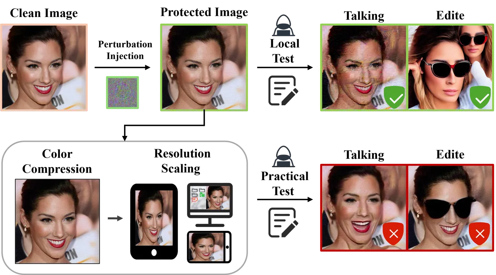
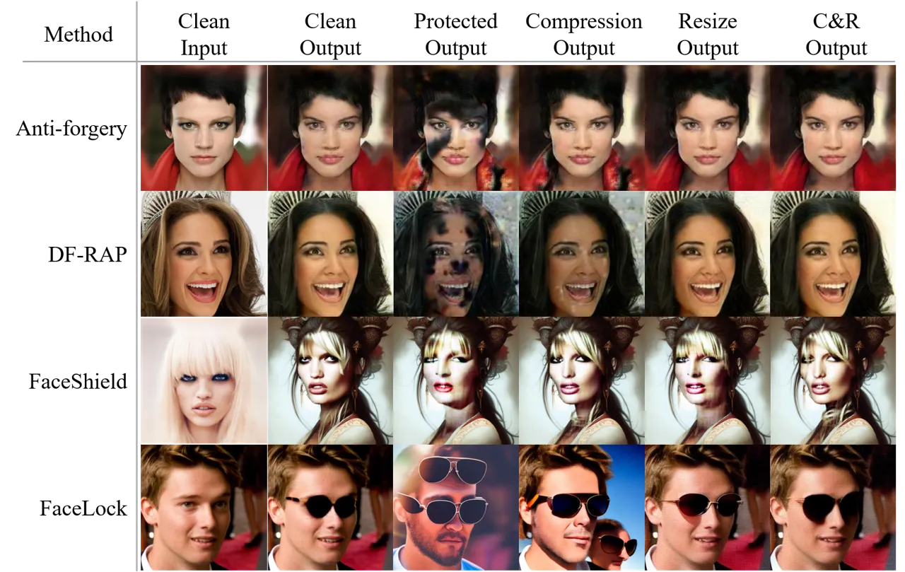
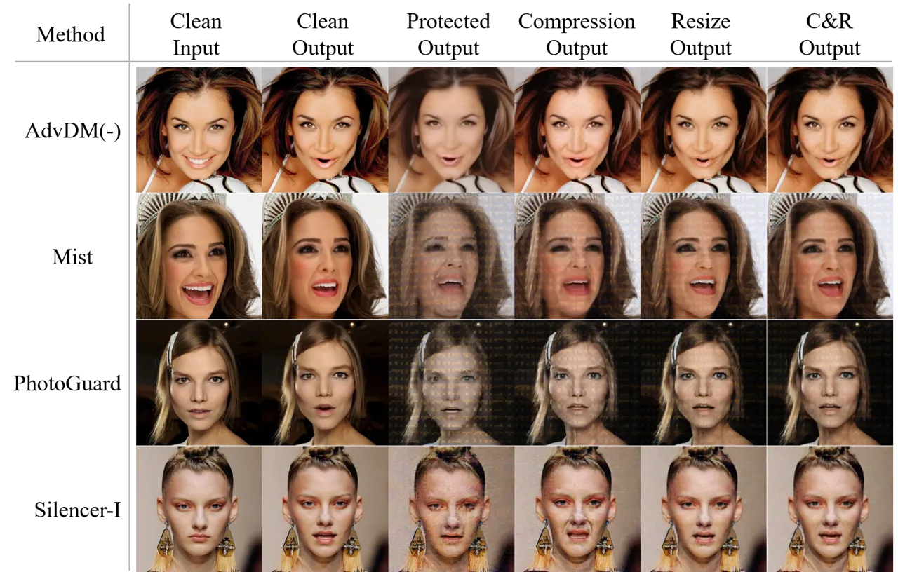
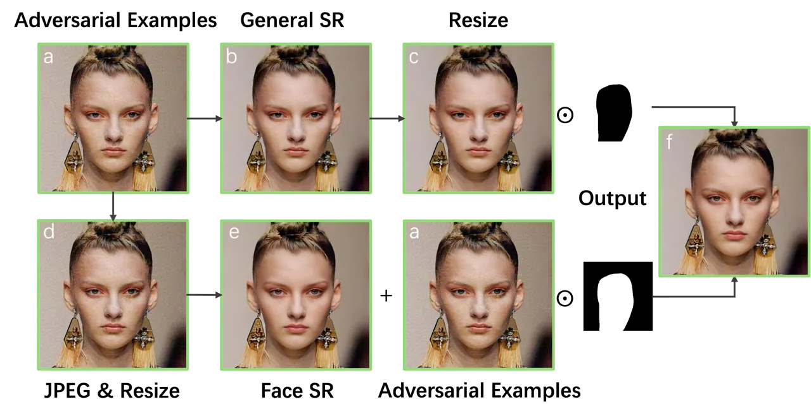
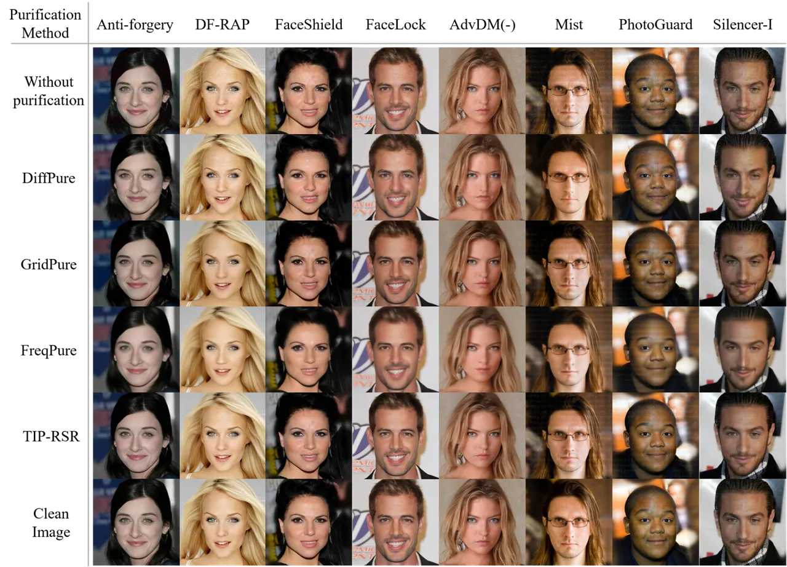
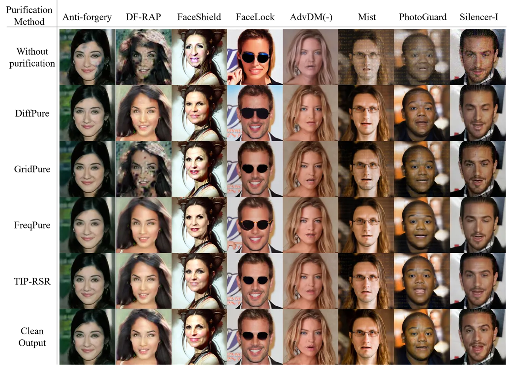
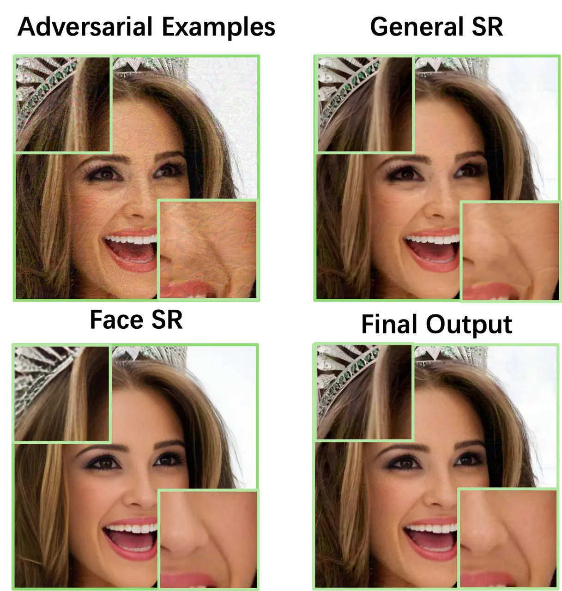
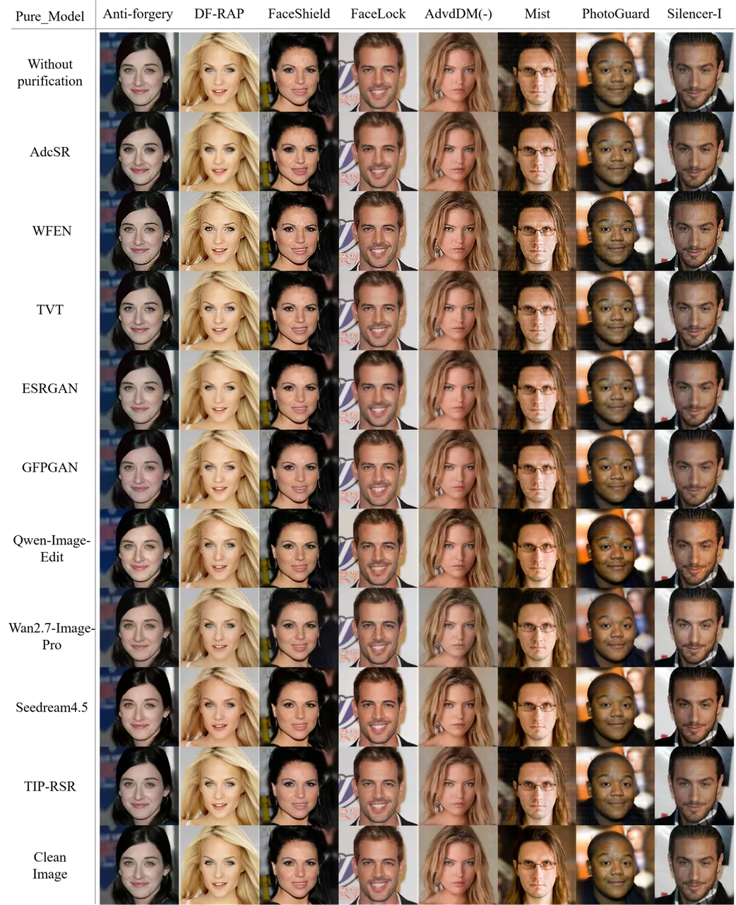

# Do Protective Perturbations Really Protect Portrait Privacy under Real-world Image Transformations?

Conference: Proceedings of the 34th ACM International Conference on
Multimedia; November 10–14, 2026; Rio de Janeiro, Brazil.Proceedings of
the 34th ACM International Conference on Multimedia (MM ’26), November
10–14, 2026, Rio de Janeiro,
BrazilISBN: 979-8-4007-2213-4/2026/11DOI: [10.1145/3767308.3836342](https://doi.org/10.1145/3767308.3836342)CCS: Security
and privacy Privacy protectionsCCS: Computing methodologies Computer
vision

Rui-Qing Sun Note: Both authors contributed equally to this research.
Affiliation: Beijing Institute of Technology, Beijing, China email:
<3120245673@bit.edu.cn> , Xingshan Yao Affiliation: Beijing Institute of
Technology, Beijing, China email: <3120245900@bit.edu.cn> , Zhijing Wu
Note: Corresponding author. Affiliation: Beijing Institute of
Technology, Beijing, China email: <wuzhijing.joyce@gmail.com> , Tian Lan
Affiliation: Beijing Institute of Technology, Beijing, China email:
<lantiangmftby@gmail.com> , Chen-Hao Cui Affiliation: Beijing Institute
of Technology, Beijing, China email: <djxx208cch@163.com> , Hui-Yang
Zhao Affiliation: Beijing Institute of Technology, Beijing, China email:
<1953542921@qq.com> , Jia-Ling Shi Affiliation: Beijing Institute of
Technology, Beijing, China email: <1120220612@bit.edu.cn> , Chen Yang
Affiliation: Beijing Institute of Technology, Beijing, China email:
<yangchen666@bit.edu.cn> and Xian-Ling Mao Affiliation: Beijing
Institute of Technology, Beijing, China email: <maoxl@bit.edu.cn>

© cc

###### Abstract.

Proactive defense methods protect portrait images from unauthorized
editing or talking face generation (TFG) by introducing pixel-level
protective perturbations, and have already attracted increasing
attention for privacy protection. In real-world use, images inevitably
undergo sequences of benign operations during display across devices and
subsequent dissemination, such as resizing and color compression, which
directly alter pixel values. Existing studies and robustness defenses
have mainly examined individual transformations in isolation, while the
effects of sequentially composed transformations remain underexplored.
To address this gap, we systematically evaluate whether representative
proactive defenses against unauthorized image editing using GANs and
diffusion models, as well as unauthorized talking face generation,
remain effective under sequential image transformations. The evaluated
methods span both general purpose and portrait specific defenses and are
assessed through qualitative and quantitative evaluation. Experimental
results indicate that defense methods based on pixel-level perturbations
struggle to withstand sequences of common image transformations, posing
a risk of defense failure in real-world applications. To further
demonstrate that this vulnerability can be exploited at low cost, we
introduced Transformation-Induced Purification via Region-wise
Super-Resolution (TIP-RSR), a simple training-free purification
framework that combines sequential image transformations with
off-the-shelf restoration models. TIP-RSR can efficiently purify
protective perturbations while preserving image fidelity and requiring
substantially less computation than existing diffusion-based
purification methods. These findings expose a practical vulnerability in
current proactive portrait defenses and highlight the need to explicitly
account for the effects of sequential real-world transformations when
designing future protection mechanisms. Our code is publicly available
at https://github.com/Richen7418/TIP-RSR.

###### Keywords: 

Portrait Privacy Protection; Adversarial Purification; Super-Resolution

^(†)^(†)cc-license: by

## 1. Introduction

The rapid advancement of generative adversarial networks (GANs) and
diffusion models has substantially accelerated the development of
AI-generated content (AIGC) technologies, such as image editing and
talking face generation (TFG) (Xu et al., 2024; Brooks et al., 2023;
Chen et al., 2020; Choi et al., 2018). While these advances demonstrate
remarkable technical capabilities, they also substantially increase the
risk of malicious misuse, including fraud, political manipulation, and
the dissemination of misinformation.



Figure 1. Impact of real-world image transformations on defense
performance. Talking-face samples are generated by Hallo (Xu et al.,
2024), while edited images are produced by InstructPix2Pix (Brooks et
al., 2023) with the prompt “Let the person wear sunglasses.”

To mitigate these risks, a variety of defense techniques have been
proposed and can be broadly categorized into passive detection and
proactive defense (Deng et al., 2025). Passive detection methods attempt
to identify whether facial content has been edited or forged by training
generative content detectors (Zheng et al., 2024). In contrast,
proactive defense methods proactively interfere with the generation
process by injecting imperceptible protective perturbations into images,
causing the synthesized outputs to degrade (Gan et al., 2025; Qu et al.,
2024; Wang et al., 2025). By preventing privacy abuse at the source,
proactive defense has therefore attracted increasing attention. Recent
studies demonstrate that such perturbations can effectively prevent
generative models from modifying facial attributes or identity (Jeong et
al., 2025; Wang et al., 2025), or from synthesizing talking portrait
videos using TFG models (Gan et al., 2025; Sun et al., 2025) under
controlled evaluation settings. Some studies also have investigated how
image compression during dissemination on online social network
platforms affects the effectiveness of proactive defenses (Qu et al.,
2024; Zhang et al., 2025).

However, existing studies generally evaluate image transformations
separately and therefore overlook the cumulative effects of
transformation sequences. In practical use, an image may first be
resized through interpolation to fit displays with different resolutions
and screen dimensions, and then compressed or reencoded during
transmission, sharing, or storage. Because most existing defenses are
not designed to withstand such sequences and remain highly sensitive to
their combined effects, even benign user actions, such as taking a
screenshot for sharing or archiving, may unintentionally weaken the
protection, as illustrated in Fig. 1. Similar degradation can also
result from color compression in mobile imaging pipelines, processing
applied by different platforms, and conversion between storage formats,
all of which irreversibly alter pixel values and image statistics.
Consequently, evaluations limited to isolated transformations may
substantially overestimate robustness in practical deployment and
ultimately give users a false sense of security.

In this work, we systematically evaluate the effectiveness of
representative proactive defenses after protected portrait images
undergo common real-world transformations, either individually or in
sequential combinations. Our study considers two representative
application scenarios: (i) protecting portrait images against malicious
facial attribute manipulation and (ii) preventing portrait images from
being exploited for TFG. To ensure broad coverage, we evaluate a diverse
set of defense methods with publicly available implementations for AIGC
systems built on GANs and diffusion models, including both general
purpose and portrait specific approaches. The evaluation covers both
widely cited methods and recently proposed approaches representing the
current state of the art. Extensive experiments show that protective
perturbations often fail to reliably prevent portrait editing or talking
face synthesis under common transformations, such as resizing and color
compression, whether applied individually or in sequence. Notably, this
vulnerability persists even for methods specifically (Qu et al., 2024;
Xue et al., 2023) optimized to improve robustness to the corresponding
transformations in isolation.

To further raise awareness of these risks within the community, we
propose a simple yet effective training-free purification method, termed
Transformation-Induced Purification via Region-wise Super-Resolution
(TIP-RSR), by exploiting the above vulnerabilities. The proposed
approach adopts differentiated purification strategies for facial
regions and background areas in portrait images. Experimental results
show that TIP-RSR can efficiently remove protective perturbations while
maximally preserving the structural integrity and visual fidelity of the
original image. These findings underscore the urgent need to revisit the
robustness assumptions of existing protection methods and to explore
more resilient solutions for mitigating privacy abuse risks posed by
modern AIGC technologies.

Our contributions are summarized as follows:

- •
  We systematically evaluate the effectiveness of representative
  proactive defense methods, including widely used and recent
  approaches, under resizing and JPEG compression, both individually and
  in sequence.
- •
  We demonstrate that common real-world transformations can
  significantly degrade the effectiveness of protective perturbations,
  causing existing methods to fail to reliably prevent portrait editing
  and TFG in practice.
- •
  We introduce TIP-RSR, a training-free purification approach that
  effectively removes protective perturbations from protected images
  while preserving most of the original structural information, exposing
  previously overlooked vulnerabilities in current protection methods.

## 2. Related Works

### 2.1. Talking Face Generation

Generating realistic talking portrait videos conditioned on a given
audio signal and a target portrait image is a core task in TFG, and has
attracted considerable attention due to its broad practical
applications. Early works primarily focused on synthesizing lip
movements that are highly synchronized with the input audio, achieving
notable success in scenarios such as video translation and dubbing
(Prajwal et al., 2020; KR et al., 2019). More recently, the development
of diffusion models has substantially advanced the TFG field (Liu et
al., 2024; Huang et al., 2025). The Hallo (Xu et al., 2024) series
introduces hierarchical audio-driven visual synthesis modules along with
data augmentation strategies, enabling high-resolution,
pose-controllable, and long-duration talking portrait video generation.
Loopy (Jiang et al., 2025) exploits long-term motion dependencies to
synthesize vivid talking portrait videos with subtle facial details,
without relying on explicit motion constraints or predefined templates.
Ditto (Li et al., 2025) further improves diffusion-based TFG frameworks
by enabling streaming processing, real-time inference, and low
first-frame latency.

### 2.2. Image Editing

In the field of AIGC, image editing has been widely recognized as a task
of significant practical importance. Early studies were predominantly
built upon GAN-based frameworks, enabling the manipulation of specific
visual attributes such as hair color, skin tone, and even facial
identity (Choi et al., 2018; Chen et al., 2020). More recently, the
rapid development of multimodal large-scale models has made it possible
to directly edit images according to natural language instructions. For
example, InstructPix2Pix (Brooks et al., 2023) leverages multiple large
models to construct bimodal paired data, enabling instruction-following
image editing guided by human-written instructions. HiDream-I1 (Cai et
al., 2025) adopts a sparse Diffusion Transformer architecture together
with a dynamic mixture-of-experts design, achieving a favorable
trade-off between computational efficiency and image generation quality.
Qwen-Image (Wu et al., 2025) further improves visual consistency and
semantic coherence between edited images and their originals through
comprehensive data engineering, progressive learning strategies,
enhanced multi-task training paradigms, and scalable infrastructure
optimizations. While these advances in image editing and TFG
substantially improve controllability, fidelity, and usability, they
also exacerbate ethical and societal risks, particularly raising
concerns about privacy violations and the misuse of AIGC.

### 2.3. Proactive Defense

To protect personal images from potential misuse by TFG and image
editing models, several recent studies have explored perturbation-based
protection by injecting imperceptible noise to disrupt the generation
process. FaceLock (Wang et al., 2025) integrates a facial recognition
model as an adversary into the diffusion loop, inducing substantial
visual discrepancies between edited outputs and the original images.
DF-RAP (Qu et al., 2024) explicitly incorporates compression operations
commonly used on online social network platforms, thereby improving the
robustness of image editing defenses under practical deployment
conditions. The Silencer (Gan et al., 2025) series aims to silence
speech generation by applying protective perturbations to the input
images, achieving effective defense against TFG methods. Despite their
effectiveness, these approaches generally overlook the fact that images
may undergo sequences of benign transformations, such as resolution
changes and color compression, during real-world dissemination, which
can significantly undermine the reliability of such protections in
practice.

## 3. Evaluation of Protective Perturbation

In this section, we systematically assess the robustness of
representative proactive defenses under common real-world image
transformations. Our evaluation covers both facial image editing and
TFG, considering transformations applied individually and in sequence.

### 3.1. Dataset and Selected Models

Our evaluation focuses on two key application scenarios: facial
attribute editing and TFG. To ensure that the evaluation metrics more
accurately reflect the effectiveness of defense methods, we adopt the
CelebA-HQ (Karras et al., 2018) dataset, as it is explicitly used in the
original papers of the evaluated methods, thereby minimizing potential
interference introduced by out-of-domain data. Considering the
substantial computational cost of large-scale evaluation, following the
work of Ditto (Li et al., 2025), we select a subset of the CelebA-HQ
dataset consisting of the first 100 facial images. For GAN-based facial
attribute editing experiments, we employ DF-RAP (Qu et al., 2024) and
Anti-Forgery (Wang et al., 2022) as representative proactive defense
methods to protect portrait images against StarGAN-based attacks (Choi
et al., 2018). Notably, DF-RAP explicitly accounts for the influence of
online social network platforms, making it particularly suitable for
evaluating defense robustness under realistic dissemination conditions.
For diffusion-based experiments, we adopt two recently released,
publicly available defense methods, FaceLock (Wang et al., 2025) and
FaceShield (Jeong et al., 2025), to protect portrait images against
attacks performed using InstructPix2Pix (Brooks et al., 2023) and
IP-Adapter (Ye et al., 2023). For TFG attacks, we evaluate a set of
general-purpose defense methods, including AdvDM(-) (Xue et al., 2023),
Mist (Liang and Wu, 2023), and PhotoGuard (Salman et al., 2023),
together with the task-specific defense Silencer-I (Gan et al., 2025).
All methods are applied to protect portrait images against attacks
generated by Hallo (Xu et al., 2024).

### 3.2. Evaluation Metrics

To investigate how common image processing operations affect protective
perturbations, we apply three representative transformations to
adversarially protected samples: JPEG compression with a quality factor
of 75, image resizing, and a combination of JPEG compression followed by
resizing. The transformed images are then used as inputs for both image
editing and TFG tasks. Following DF-RAP (Qu et al., 2024), qualitative
and quantitative analyses are conducted by comparing the generated
results with those obtained using undefended clean images as inputs.

Across our evaluations, we employ SSIM, PSNR, FID (Heusel et al., 2017),
and identity similarity (ID-S) where applicable. SSIM and PSNR measure
structural and pixel-level fidelity, while FID evaluates
distribution-level visual quality. ID-S measures facial identity
consistency and is computed as the cosine similarity between face
embeddings extracted from corresponding image pairs using a pretrained
face recognition model, where a higher score indicates greater identity
similarity. For image editing, we additionally report LPIPS (Zhang et
al., 2018) and BRISQUE (Mittal et al., 2011) to assess perceptual
similarity and image quality, respectively. For TFG, Sync-C (Chung and
Zisserman, 2016) and M-LMD (Chen et al., 2019) are further adopted to
evaluate audio-visual synchronization and lip-motion consistency,
respectively.

### 3.3. Experimental Results

Experimental results show that existing defense methods struggle to
remain effective under common image transformations, especially when
multiple operations are applied sequentially. As shown in Tables 1
and 2, C&R processing makes both edited images and TFG outputs
substantially closer to those generated from clean inputs. For image
editing, all evaluated defenses exhibit higher SSIM and PSNR and lower
LPIPS, while FID and BRISQUE vary across methods. For TFG, visual
fidelity and lip motion consistency improve consistently, as reflected
by higher SSIM, PSNR, and Sync-C and lower FID and M-LMD. Additional
quantitative results for settings involving resize-only and JPEG-only
transformations are provided in Tables 9 and Table 8 in the Appendix.

Qualitative results show that existing defense models tend to lose their
effectiveness after undergoing scale variations, and this degradation
becomes more pronounced when scale changes are combined with JPEG
compression (C&R), as illustrated in Fig. 2 and Fig. 3. The evaluation
results further suggest that common real-world image processing
operations should be explicitly considered during model design, which
otherwise may result in overestimated defense performance and a false
sense of security for users. DF-RAP exhibits relatively stronger
robustness to JPEG compression because its design explicitly accounts
for compression operations commonly applied by online social network
platforms. However, this targeted robustness does not generalize to the
C&R setting, where compression and resizing are applied sequentially.
Such targeted modeling strategies remain inherently fragile. For
instance, they struggle to defend against joint attacks under the C&R
setting, where compression and resizing are applied in combination. This
observation suggests that explicitly modeling a single image
transformation in isolation may not constitute a robust solution. This
behavior can be attributed to the nature of image transformations in
real-world dissemination, which typically preserve perceptually salient
content while altering visually less significant image details. Since
many proactive defenses similarly rely on imperceptible perturbations
embedded in such image details, these perturbations can be readily
disrupted during transformation, thereby weakening or even nullifying
the intended protection.

| Type    | Method       | SSIM$`\uparrow`$ | PSNR$`\uparrow`$ | FID$`\downarrow`$ | LPIPS$`\downarrow`$ | BRISQUE$`\downarrow`$ |
| ------- | ------------ | ---------------- | ---------------- | ----------------- | ------------------- | --------------------- |
| Defense | Anti-Forgery | 0.8422           | 23.94            | 39.33             | 0.1993              | 23.99                 |
|         | DF-RAP       | 0.5130           | 12.93            | 139.6             | 0.4611              | 29.20                 |
|         | FaceShield   | 0.8709           | 21.78            | 45.56             | 0.1026              | 27.21                 |
|         | FaceLock     | 0.5202           | 16.57            | 56.34             | 0.3830              | 7.302                 |
| C&R     | Anti-Forgery | 0.8924           | 28.25            | 31.04             | 0.1600              | 28.31                 |
|         | DF-RAP       | 0.8813           | 27.37            | 32.54             | 0.1640              | 28.53                 |
|         | FaceShield   | 0.8835           | 22.20            | 50.95             | 0.0979              | 34.63                 |
|         | FaceLock     | 0.6015           | 17.33            | 56.61             | 0.3491              | 5.213                 |

Table 1. Image editing results before and after C&R processing. C&R
denotes JPEG compression ($`Q=75`$) followed by $`0.5\times`$ Lanczos
down-sampling. "$`\uparrow`$": higher is better. "$`\downarrow`$": lower
is better.

| Type    | Method     | SSIM$`\uparrow`$ | PSNR$`\uparrow`$ | FID$`\downarrow`$ | Sync-C$`\uparrow`$ | M-LMD$`\downarrow`$ |
| ------- | ---------- | ---------------- | ---------------- | ----------------- | ------------------ | ------------------- |
| Defense | AdvDM(-)   | 0.5425           | 15.98            | 110.6             | 6.773              | 18.58               |
|         | Mist       | 0.5304           | 18.39            | 277.8             | 6.049              | 19.90               |
|         | PhotoGuard | 0.5384           | 18.25            | 272.9             | 6.037              | 17.81               |
|         | Silencer-I | 0.4693           | 19.42            | 241.2             | 4.131              | 19.54               |
| C&R     | AdvDM(-)   | 0.7090           | 22.63            | 75.67             | 6.889              | 9.834               |
|         | Mist       | 0.6494           | 21.77            | 125.5             | 6.841              | 10.66               |
|         | PhotoGuard | 0.6499           | 21.85            | 127.4             | 6.801              | 10.34               |
|         | Silencer-I | 0.6973           | 22.57            | 78.46             | 6.761              | 9.590               |

Table 2. TFG results before and after C&R processing. C&R denotes JPEG
compression ($`Q=75`$) followed by $`0.5\times`$ Lanczos down-sampling.



Figure 2. Qualitative results of image editing under different
transformation settings. C&R denotes JPEG compression ($`Q=75`$)
followed by $`0.5\times`$ Lanczos down-sampling.



Figure 3. Qualitative results of TFG under different transformation
settings. C&R denotes JPEG compression ($`Q=75`$) followed by
$`0.5\times`$ Lanczos down-sampling.

## 4. Purification Method

In this section, we first formulate the purification objective for face
manipulation and then introduce TIP-RSR, a training-free framework
motivated by the sensitivity of protective perturbations to common image
transformations. TIP-RSR combines transformation-induced perturbation
suppression with region-wise super-resolution to restore image quality
while preserving facial structure.

### 4.1. Problem Formulation

Both facial attribute editing and TFG can be formulated as face
manipulation tasks. Given an original face image $`x`$ and a trained
manipulation model $`M`$, the former aims to transform $`x`$ into a
manipulated output $`y`$ by modifying a set of reference conditions
$`r`$, such as lip color or target identity. In contrast, the latter
generates a high-fidelity talking portrait video $`y`$ by conditioning
on an input audio signal $`a`$ while preserving the identity information
extracted from $`x`$. Accordingly, the objective of face manipulation
can be described as follows:

```math
y=\begin{cases}M(x,r),&\text{image editing;}\\
M(x,a),&\text{TFG.}\end{cases} \tag{1}
```

The formula can be simplified to:

```math
y=\mathcal{M}(x). \tag{2}
```

Proactive defense methods generate adversarial examples
$`\hat{x}=x+\eta`$ by injecting imperceptible perturbations $`\eta`$
into an original face image $`x`$. The perturbation $`\eta`$ is
optimized to maximize a distance metric $`D`$ between the outputs of a
manipulation model $`\mathcal{M}`$ given $`x`$ and $`\hat{x}`$, subject
to an $`\ell_{\infty}`$-norm constraint
$`\|\eta\|_{\infty}\leq\epsilon`$ to preserve imperceptibility:

```math
\displaystyle\max_{\eta}\quad \displaystyle D\big(\mathcal{M}(x),\mathcal{M}(x+\eta)\big), \tag{3}
```

```math
\displaystyle\|\eta\|_{\infty}\leq\epsilon. \tag{4}
```

Purification methods aim to remove protective perturbations from an
adversarial example $`\hat{x}`$ and recover an image aligned with the
original image $`x`$. The objective of purification can be formulated as
minimizing the discrepancy between the purified image and the original
image:

```math
\min_{x^{\prime}}\;D(x,x^{\prime}). \tag{5}
```

Applying image transformations to an adversarial example $`\hat{x}`$,
particularly down-sampling or compression, inevitably introduces
irreversible modifications to pixel values, including the injected
perturbations. As demonstrated in Section 3, such transformations can
render the original adversarial perturbations ineffective. In contrast,
natural images typically exhibit redundancy and strong correlations
among neighboring pixels (Torralba and Oliva, 2003; Wang et al., 2004),
where important features and structures are often replicated across
spatial regions, making critical information less susceptible to severe
degradation. Although simple down-sampling alone is sufficient to
invalidate most defense mechanisms, it typically cannot fully suppress
residual protective perturbations and inevitably comes at the cost of
reduced image resolution. Consequently, these residual artifacts may
still degrade the output quality of the manipulation model
$`\mathcal{M}`$, as further illustrated in Fig. 2 and Fig. 3.

To improve the visual quality of compressed images, a naive approach is
to apply existing general super-resolution (SR) models to adversarial
examples $`\hat{x}`$. However, most existing SR models are trained on
low-resolution samples synthesized from high-resolution images via
down-sampling, JPEG compression, or additive Gaussian or Poisson noise
(Yi et al., 2025; Wang et al., 2021b; Chen et al., 2025; Lin et al.,
2024; Agustsson and Timofte, 2017). As a result, directly applying
off-the-shelf SR models to adversarial examples often fails to
completely remove protective perturbations and may even introduce
high-frequency artifacts on facial regions, as shown in Fig. 8
(Appendix).

### 4.2. TIP-RSR

Training or fine-tuning an SR model specifically tailored to protective
perturbations is a feasible alternative. Nevertheless, constructing
paired datasets of clean images and adversarial examples incurs
substantial computational overhead. Moreover, protective perturbations
introduced by different protection methods follow distinct distributions
due to their heterogeneous optimization objectives and strategies.
Consequently, the training cost required for such customized SR models
is typically prohibitive in practical purification scenarios.
Diffusion-based purification methods provide another line of solutions
by injecting a small amount of noise during the forward diffusion
process and recovering clean images through an iterative reverse
denoising procedure (Nie et al., 2022; Pei et al., 2025). Although these
approaches avoid making explicit assumptions about the perturbation
distribution, the step-wise reverse generation process introduces
non-negligible computational overhead.



Figure 4. Overview of TIP-RSR.

| Method   | Anti-Forgery     |                  |                   |                     |                       | DF-RAP           |                  |                   |                     |                       | FaceShield       |                  |                   |                     |                       | FaceLock         |                  |                   |                     |                       |
| -------- | ---------------- | ---------------- | ----------------- | ------------------- | --------------------- | ---------------- | ---------------- | ----------------- | ------------------- | --------------------- | ---------------- | ---------------- | ----------------- | ------------------- | --------------------- | ---------------- | ---------------- | ----------------- | ------------------- | --------------------- |
|          | SSIM$`\uparrow`$ | PSNR$`\uparrow`$ | FID$`\downarrow`$ | LPIPS$`\downarrow`$ | BRISQUE$`\downarrow`$ | SSIM$`\uparrow`$ | PSNR$`\uparrow`$ | FID$`\downarrow`$ | LPIPS$`\downarrow`$ | BRISQUE$`\downarrow`$ | SSIM$`\uparrow`$ | PSNR$`\uparrow`$ | FID$`\downarrow`$ | LPIPS$`\downarrow`$ | BRISQUE$`\downarrow`$ | SSIM$`\uparrow`$ | PSNR$`\uparrow`$ | FID$`\downarrow`$ | LPIPS$`\downarrow`$ | BRISQUE$`\downarrow`$ |
| DiffPure | 0.7879           | 28.22            | 45.05             | 0.2429              | 11.88                 | 0.7729           | 28.01            | 45.57             | 0.2509              | 10.09                 | 0.7386           | 27.25            | 54.85             | 0.2267              | 11.58                 | 0.7334           | 27.21            | 52.87             | 0.2329              | 11.87                 |
| GridPure | 0.8302           | 26.26            | 63.89             | 0.2255              | 32.78                 | 0.7405           | 26.06            | 95.08             | 0.3697              | 43.98                 | 0.8335           | 26.93            | 55.25             | 0.1455              | 44.06                 | 0.8057           | 26.75            | 58.19             | 0.1589              | 28.91                 |
| FreqPure | 0.8195           | 28.99            | 80.07             | 0.2782              | 47.47                 | 0.8100           | 28.86            | 80.87             | 0.2832              | 47.66                 | 0.7705           | 27.95            | 87.76             | 0.2459              | 48.51                 | 0.7638           | 27.84            | 90.12             | 0.2556              | 50.52                 |
| TIP-RSR  | 0.9109           | 31.39            | 30.46             | 0.1282              | 18.35                 | 0.8930           | 31.15            | 35.65             | 0.1605              | 20.54                 | 0.9099           | 31.48            | 29.58             | 0.1033              | 22.62                 | 0.8532           | 29.87            | 42.89             | 0.1493              | 14.85                 |

Table 3. Quality of purified protected images for image editing
defenses. Bold and underlined values indicate the best and second best
results, respectively.

| Method   | AdvDM(-)         |                  |                   |                     |                       | Mist             |                  |                   |                     |                       | PhotoGuard       |                  |                   |                     |                       | Silencer-I       |                  |                   |                     |                       | Time(s) |
| -------- | ---------------- | ---------------- | ----------------- | ------------------- | --------------------- | ---------------- | ---------------- | ----------------- | ------------------- | --------------------- | ---------------- | ---------------- | ----------------- | ------------------- | --------------------- | ---------------- | ---------------- | ----------------- | ------------------- | --------------------- | ------- |
|          | SSIM$`\uparrow`$ | PSNR$`\uparrow`$ | FID$`\downarrow`$ | LPIPS$`\downarrow`$ | BRISQUE$`\downarrow`$ | SSIM$`\uparrow`$ | PSNR$`\uparrow`$ | FID$`\downarrow`$ | LPIPS$`\downarrow`$ | BRISQUE$`\downarrow`$ | SSIM$`\uparrow`$ | PSNR$`\uparrow`$ | FID$`\downarrow`$ | LPIPS$`\downarrow`$ | BRISQUE$`\downarrow`$ | SSIM$`\uparrow`$ | PSNR$`\uparrow`$ | FID$`\downarrow`$ | LPIPS$`\downarrow`$ | BRISQUE$`\downarrow`$ |         |
| DiffPure | 0.7280           | 27.05            | 56.95             | 0.2388              | 14.15                 | 0.7131           | 26.34            | 66.08             | 0.2673              | 13.23                 | 0.7116           | 26.31            | 67.75             | 0.2704              | 13.47                 | 0.7311           | 27.18            | 55.26             | 0.2313              | 11.03                 | 16.96   |
| GridPure | 0.8224           | 26.52            | 56.07             | 0.1605              | 54.41                 | 0.7883           | 24.99            | 94.25             | 0.3008              | 34.67                 | 0.7875           | 24.96            | 91.81             | 0.3036              | 36.66                 | 0.8332           | 26.81            | 58.05             | 0.1568              | 42.01                 | 408.1   |
| FreqPure | 0.7533           | 27.54            | 91.16             | 0.2634              | 52.74                 | 0.7460           | 26.84            | 109.9             | 0.3057              | 49.46                 | 0.7440           | 26.78            | 112.2             | 0.3104              | 49.95                 | 0.7612           | 27.86            | 88.93             | 0.2494              | 48.88                 | 75.93   |
| TIP-RSR  | 0.8599           | 30.98            | 30.92             | 0.1185              | 33.02                 | 0.8096           | 28.77            | 68.80             | 0.2581              | 20.80                 | 0.8080           | 28.74            | 65.75             | 0.2577              | 22.32                 | 0.8671           | 30.77            | 32.54             | 0.1368              | 24.24                 | 1.256   |

Table 4. Quality and runtime of purified protected images for TFG
defenses.

| Method   | Anti-Forgery     |                  |                   |                     |                  | DF-RAP           |                  |                   |                     |                  | FaceShield       |                  |                   |                     |                  | FaceLock         |                  |                   |                     |                  |
| -------- | ---------------- | ---------------- | ----------------- | ------------------- | ---------------- | ---------------- | ---------------- | ----------------- | ------------------- | ---------------- | ---------------- | ---------------- | ----------------- | ------------------- | ---------------- | ---------------- | ---------------- | ----------------- | ------------------- | ---------------- |
|          | SSIM$`\uparrow`$ | PSNR$`\uparrow`$ | FID$`\downarrow`$ | LPIPS$`\downarrow`$ | ID-S$`\uparrow`$ | SSIM$`\uparrow`$ | PSNR$`\uparrow`$ | FID$`\downarrow`$ | LPIPS$`\downarrow`$ | ID-S$`\uparrow`$ | SSIM$`\uparrow`$ | PSNR$`\uparrow`$ | FID$`\downarrow`$ | LPIPS$`\downarrow`$ | ID-S$`\uparrow`$ | SSIM$`\uparrow`$ | PSNR$`\uparrow`$ | FID$`\downarrow`$ | LPIPS$`\downarrow`$ | ID-S$`\uparrow`$ |
| DiffPure | 0.8120           | 26.39            | 49.27             | 0.2329              | 0.7401           | 0.8016           | 25.86            | 52.92             | 0.2430              | 0.7362           | 0.9206           | 26.27            | 24.44             | 0.0525              | 0.6989           | 0.6348           | 18.78            | 53.80             | 0.2998              | 0.5663           |
| GridPure | 0.8606           | 26.41            | 41.11             | 0.1829              | 0.8452           | 0.5645           | 14.71            | 119.0             | 0.4478              | 0.4172           | 0.9016           | 24.23            | 27.45             | 0.0654              | 0.5799           | 0.7093           | 21.09            | 40.92             | 0.2246              | 0.7548           |
| FreqPure | 0.8412           | 26.74            | 58.89             | 0.2262              | 0.7503           | 0.8351           | 26.33            | 60.00             | 0.2307              | 0.7476           | 0.9005           | 24.40            | 31.60             | 0.0663              | 0.6264           | 0.6633           | 19.35            | 70.22             | 0.3247              | 0.4827           |
| TIP-RSR  | 0.9031           | 28.96            | 25.25             | 0.1288              | 0.8657           | 0.8761           | 26.72            | 29.69             | 0.1579              | 0.8553           | 0.9323           | 25.81            | 21.18             | 0.0493              | 0.6257           | 0.7122           | 21.70            | 34.46             | 0.2223              | 0.7761           |

Table 5. Quality of image editing results generated from purified
protected images.

| Method   | AdvDM(-)         |                  |                   |                  |                     | Mist             |                  |                   |                  |                     | PhotoGuard       |                  |                   |                  |                     | Silencer-I       |                  |                   |                  |                     |
| -------- | ---------------- | ---------------- | ----------------- | ---------------- | ------------------- | ---------------- | ---------------- | ----------------- | ---------------- | ------------------- | ---------------- | ---------------- | ----------------- | ---------------- | ------------------- | ---------------- | ---------------- | ----------------- | ---------------- | ------------------- |
|          | SSIM$`\uparrow`$ | PSNR$`\uparrow`$ | FID$`\downarrow`$ | ID-S$`\uparrow`$ | M-LMD$`\downarrow`$ | SSIM$`\uparrow`$ | PSNR$`\uparrow`$ | FID$`\downarrow`$ | ID-S$`\uparrow`$ | M-LMD$`\downarrow`$ | SSIM$`\uparrow`$ | PSNR$`\uparrow`$ | FID$`\downarrow`$ | ID-S$`\uparrow`$ | M-LMD$`\downarrow`$ | SSIM$`\uparrow`$ | PSNR$`\uparrow`$ | FID$`\downarrow`$ | ID-S$`\uparrow`$ | M-LMD$`\downarrow`$ |
| DiffPure | 0.6759           | 21.24            | 71.86             | 0.6161           | 11.13               | 0.6607           | 21.04            | 81.79             | 0.6152           | 10.94               | 0.6601           | 21.03            | 83.00             | 0.6129           | 10.93               | 0.6727           | 21.21            | 70.04             | 0.6276           | 11.00               |
| GridPure | 0.6935           | 21.02            | 40.69             | 0.8392           | 10.30               | 0.6491           | 19.91            | 119.2             | 0.7475           | 11.00               | 0.6487           | 19.86            | 119.8             | 0.7380           | 11.32               | 0.6742           | 21.01            | 41.86             | 0.8380           | 9.493               |
| FreqPure | 0.6678           | 20.18            | 80.11             | 0.5973           | 14.12               | 0.6624           | 20.23            | 107.0             | 0.5993           | 13.47               | 0.6567           | 20.07            | 110.5             | 0.5917           | 13.94               | 0.6724           | 20.43            | 75.77             | 0.6133           | 13.57               |
| TIP-RSR  | 0.7274           | 22.57            | 40.97             | 0.8253           | 10.31               | 0.6660           | 21.58            | 92.00             | 0.7953           | 10.24               | 0.6700           | 21.64            | 89.85             | 0.7931           | 10.32               | 0.7105           | 22.50            | 41.77             | 0.8328           | 9.452               |

Table 6. Quality of TFG results generated from purified protected
images.

Motivated by the observations in Section 3, we propose the training-free
TIP-RSR framework, as illustrated in Fig. 4. TIP-RSR exploits the
sensitivity of protective perturbations to common image transformations
while using off-the-shelf super-resolution models to restore image
quality. Specifically, we first apply JPEG compression $`J(\cdot)`$
followed by down-sampling $`Down(\cdot)`$ to the adversarial image
$`\hat{x}`$, thereby suppressing protective perturbations, as shown in
Fig. 4(d). A face-specific SR model is then applied to restore facial
details. Following GridPure (Zhao et al., 2024), the restored result is
combined with a small proportion of the adversarial image to preserve
fine-grained structural information. Meanwhile, a general-purpose SR
model is applied to $`\hat{x}`$ and subsequently resized to the target
resolution to provide a structure-preserving restoration of the
remaining image content, as shown in Fig. 4(b,c). Finally, the outputs
of the two restoration branches are combined using a semantic face mask
to obtain the purified image, as illustrated in Fig. 4(f). The overall
purification process is formulated as follows:

```math
x_{f}=(1-\lambda)\cdot\mathrm{SR}_{f}\!\left(\mathrm{Down}(J(\hat{x}))\right)+\lambda\cdot\hat{x}, \tag{6}
```

```math
x_{g}=\mathrm{Down}\!\left(\mathrm{SR}_{g}(\hat{x})\right), \tag{7}
```

```math
x^{\prime}=\mathrm{Mask}\odot x_{f}+(1-\mathrm{Mask})\odot x_{g}. \tag{8}
```

where $`\mathrm{Mask}`$ denotes a semantic segmentation mask used to
distinguish facial regions from background regions,
$`\mathrm{SR}_{f}(\cdot)`$ and $`\mathrm{SR}_{g}(\cdot)`$ represent the
face-specific and general-purpose SR models, respectively, $`x_{f}`$ and
$`x_{g}`$ denote their corresponding outputs, and $`x^{\prime}`$ denotes
the final purified image.

Following common practice, we adopt Lanczos interpolation for image
resizing and set the JPEG quality factor to 75. The weighting parameter
$`\lambda`$ is fixed to 0.2. The segmentation mask $`\mathrm{Mask}`$ is
generated using BiSeNet (Yu et al., 2018). To balance purification
effectiveness and computational efficiency, we employ a lightweight
general SR model, ESRGAN (Wang et al., 2018), for background regions and
a lightweight face-specific SR model, GFPGAN (Wang et al., 2021a), for
facial regions. All model parameters are adopted directly from publicly
available projects, and no additional training or fine-tuning is
performed. A comparison with SOTA super-resolution models is provided in
Appendix.

### 4.3. Experimental Results

#### 4.3.1. Settings and Baselines

The experiments were conducted on a server running Ubuntu 22.04.4 LTS,
equipped with two Intel(R) Xeon(R) Gold 6133 CPUs clocked at 2.50 GHz
and one NVIDIA GeForce RTX 4090 GPU with 24 GB of memory. We select
existing publicly available purification methods, including DiffPure
(Nie et al., 2022), GridPure (Zhao et al., 2024), and FreqPure (Pei et
al., 2025), as diffusion-based baselines. Comparisons with recent
super-resolution models are provided in the appendix. We perform
quantitative evaluation using the metrics introduced in Section 3.

#### 4.3.2. Performance Analysis of TIP-RSR

Experimental results demonstrate that TIP-RSR consistently outperforms
existing purification methods across a wide range of evaluation metrics.
As shown in Tables 3 and 4, TIP-RSR achieves the best performance among
nearly all defense settings in terms of SSIM, PSNR, FID, and LPIPS.
These results indicate that TIP-RSR is able to effectively suppress
adversarial perturbations while largely preserving structural fidelity
and perceptual quality of the input images. It is worth noting that
TIP-RSR performs worse than DiffPure on the BRISQUE metric. This
behavior can be attributed to the fusion of super-resolved images with
adversarial samples at a fixed ratio, which introduces a mild
distribution shift from natural images. Nevertheless, qualitative
results confirm that this design leads to improved perceptual quality,
as illustrated in Fig. 5. In contrast, images purified by DiffPure tend
to appear overly smooth, resulting in noticeable loss of fine-grained
details.



Figure 5. Qualitative comparison of purified images.



Figure 6. Qualitative results of image editing and talking face
generation after image purification.

The primary goal of image purification is to suppress defense-oriented
perturbations while preserving the visual and identity information
required by downstream generative models. As shown in Tables 5 and 6,
TIP-RSR achieves a favorable trade-off between perturbation removal,
visual fidelity, and identity preservation across both image editing and
TFG tasks. For image editing, TIP-RSR achieves the best SSIM scores
across all four defense settings and the best PSNR scores in three out
of four cases. It also consistently obtains the lowest FID and LPIPS
values, indicating that the purified images provide more faithful visual
guidance for subsequent editing. Moreover, TIP-RSR achieves the highest
ID-S on Anti-Forgery, DF-RAP, and FaceLock, while remaining competitive
on FaceShield, demonstrating that the purification process largely
preserves facial identity information in addition to improving visual
quality. For TFG, TIP-RSR consistently achieves the best SSIM and PSNR
scores across all evaluated defenses, indicating improved visual
fidelity of the generated video frames. It also achieves the best or
second-best performance in FID and ID-S across all settings, showing
that the purified portraits retain both distribution-level visual
quality and identity consistency. In terms of motion quality, TIP-RSR
obtains the best M-LMD results on Mist, PhotoGuard, and Silencer-I, and
the second-best result on AdvDM(-), further demonstrating that effective
purification does not compromise lip-motion consistency. Overall, these
results suggest that TIP-RSR can reliably weaken protective
perturbations while preserving the visual and identity cues required for
downstream generation. Moreover, the results highlight that purification
models lacking explicit facial structural priors may struggle to fully
eliminate protective perturbations. As illustrated in Fig. 6, although
GridPure yields visually appealing results for some defense settings, it
fails to effectively remove perturbations introduced by DF-RAP,
resulting in persistently degraded editing quality.

Finally, we evaluate the computational efficiency of TIP-RSR. Compared
with the evaluated purification baselines, TIP-RSR exhibits
substantially lower processing cost. As shown in Table 4, TIP-RSR
requires only 1.256 seconds on average to process a single image, making
it approximately 13.5× faster than DiffPure. This efficiency stems from
its feed-forward restoration pipeline, which avoids the iterative or
multi-step denoising procedures used by diffusion-based baselines. Such
efficiency highlights the strong potential of TIP-RSR for real-time
applications. More importantly, the low purification cost further
underscores the necessity of accounting for common real-world image
transformations when designing defense models, as neglecting these
factors may significantly overestimate their practical robustness.

#### 4.3.3. Ablation Study

We conduct an ablation study to validate the effectiveness of our
proposed TIP-RSR pipeline. Specifically, we compare it against three
core baseline components: (1) ESRGAN applied directly to the adversarial
image; (2) GFPGAN applied to the C&R version of the adversarial image;
(3) ESRGAN+GFPGAN, a mask-based fusion of the two outputs.

| Method        | FaceLock         |                  |                   |                     | Silencer-I       |                  |                   |                     |
| ------------- | ---------------- | ---------------- | ----------------- | ------------------- | ---------------- | ---------------- | ----------------- | ------------------- |
|               | SSIM$`\uparrow`$ | PSNR$`\uparrow`$ | FID$`\downarrow`$ | LPIPS$`\downarrow`$ | SSIM$`\uparrow`$ | PSNR$`\uparrow`$ | FID$`\downarrow`$ | LPIPS$`\downarrow`$ |
| ESRGAN        | 0.7860           | 28.55            | 65.25             | 0.1768              | 0.8635           | 31.09            | 51.23             | 0.1673              |
| GFPGAN        | 0.8193           | 29.31            | 37.32             | 0.1395              | 0.8253           | 29.18            | 32.52             | 0.1273              |
| ESRGAN+GFPGAN | 0.8467           | 29.49            | 46.33             | 0.1549              | 0.8610           | 30.29            | 35.59             | 0.1413              |
| TIP-RSR       | 0.8532           | 29.87            | 42.89             | 0.1493              | 0.8671           | 30.77            | 32.54             | 0.1368              |

Table 7. Ablation study of TIP-RSR. The full pipeline achieves a
favorable trade-off across metrics on both FaceLock and Silencer-I.

As shown in Table 7, our full TIP-RSR method consistently achieves the
best or second-best performance across all key metrics—including SSIM,
PSNR, FID, and LPIPS—on both the FaceLock and Silencer-I adversarial
defenses. This demonstrates that TIP-RSR effectively integrates and
surpasses the individual contributions of its constituent modules.
Critically, TIP-RSR outperforms the ESRGAN+GFPGAN baseline across all
reported metrics on both defenses, although both approaches combine
outputs from the two SR branches. The improvement mainly comes from the
fusion strategy in the face branch, which retains a controlled
proportion of information from the protected image to preserve fine
grained details before the final semantic mask fusion. This helps
preserve high-frequency structural cues that may be lost after JPEG
compression and resizing, yielding a better balance between perturbation
suppression and detail fidelity. These results validate the proposed
fusion design over a straightforward combination of the two SR outputs
using a semantic mask.

## 5. Conclusion

In this work, we evaluate proactive defenses for portrait images under
individual transformations and their sequential combinations, using
image editing and TFG as representative attacks. We show that JPEG
compression and resizing, especially in sequence, can substantially
weaken protective perturbations and restore generation quality, exposing
a practical robustness gap. We further introduce TIP-RSR, a purification
framework that requires no training and combines transformation-induced
perturbation suppression with region-wise super resolution. TIP-RSR
removes diverse protective perturbations while preserving visual
structure and identity information, and is approximately 13.5$`\times`$
faster than DiffPure. Our findings call for defenses that remain
reliable throughout realistic image processing pipelines.

###### Acknowledgements.

This work was supported by the National Key Research and Development
Program of China (No. 2024YFF0908200), the National Natural Science
Foundation of China (No. 62572056, 62302040), the Beijing Institute of
Technology Research Fund Program for Young Scholars, and the Young Elite
Scientists Sponsorship Program of the Beijing High Innovation Plan (No.
20250798).

## References

- Agustsson and Timofte (2017) E. Agustsson and R. Timofte Ntire 2017
  challenge on single image super-resolution: dataset and study. In
  Proceedings of the IEEE conference on computer vision and pattern
  recognition workshops, pp. 126–135. Cited by: §4.1.
- Brooks et al. (2023) T. Brooks, A. Holynski, and A. A. Efros
  Instructpix2pix: learning to follow image editing instructions. In
  Proceedings of the IEEE/CVF conference on computer vision and pattern
  recognition, pp. 18392–18402. Cited by: Figure 1, §1, §2.2, §3.1.
- Cai et al. (2025) Q. Cai, Y. Li, Y. Pan, T. Yao, and T. Mei
  HiDream-i1: an open-source high-efficient image generative foundation
  model. In Proceedings of the 33rd ACM International Conference on
  Multimedia, pp. 13636–13639. Cited by: §2.2.
- Chen et al. (2025) B. Chen, G. Li, R. Wu, X. Zhang, J. Chen, J. Zhang,
  and L. Zhang Adversarial diffusion compression for real-world image
  super-resolution. In Proceedings of the Computer Vision and Pattern
  Recognition Conference, pp. 28208–28220. Cited by: Table 11, §4.1.
- Chen et al. (2019) L. Chen, R. K. Maddox, Z. Duan, and C. Xu
  Hierarchical cross-modal talking face generation with dynamic
  pixel-wise loss. In Proceedings of the IEEE/CVF conference on computer
  vision and pattern recognition, pp. 7832–7841. Cited by: §3.2.
- Chen et al. (2020) R. Chen, X. Chen, B. Ni, and Y. Ge Simswap: an
  efficient framework for high fidelity face swapping. In Proceedings of
  the 28th ACM international conference on multimedia, pp. 2003–2011.
  Cited by: §1, §2.2.
- Choi et al. (2018) Y. Choi, M. Choi, M. Kim, J. Ha, S. Kim, and J.
  Choo Stargan: unified generative adversarial networks for multi-domain
  image-to-image translation. In Proceedings of the IEEE conference on
  computer vision and pattern recognition, pp. 8789–8797. Cited by: §1,
  §2.2, §3.1.
- Chung and Zisserman (2016) J. S. Chung and A. Zisserman Out of time:
  automated lip sync in the wild. In Asian conference on computer
  vision, pp. 251–263. Cited by: §3.2.
- Deng et al. (2025) J. Deng, C. Lin, Z. Zhao, S. Liu, Z. Peng, Q. Wang,
  and C. Shen A survey of defenses against ai-generated visual media:
  detection, disruption, and authentication. ACM Computing Surveys 58
  (5), pp. 1–35. Cited by: §1.
- Gan et al. (2025) Y. Gan, J. Miao, Y. Wang, and Y. Yang Silence is
  golden: leveraging adversarial examples to nullify audio control in
  ldm-based talking-head generation. In Proceedings of the Computer
  Vision and Pattern Recognition Conference, pp. 13434–13444. Cited by:
  Table 10, Table 10, §1, §2.3, §3.1.
- Heusel et al. (2017) M. Heusel, H. Ramsauer, T. Unterthiner, B.
  Nessler, and S. Hochreiter Gans trained by a two time-scale update
  rule converge to a local nash equilibrium. Advances in neural
  information processing systems 30. Cited by: §3.2.
- Huang et al. (2025) Y. Huang, H. Guo, F. Wu, S. Zhang, S. Huang, Q.
  Gan, L. Liu, S. Zhao, E. Chen, J. Liu, et al. Live avatar: streaming
  real-time audio-driven avatar generation with infinite length. arXiv
  preprint arXiv:2512.04677. Cited by: §2.1.
- Jeong et al. (2025) J. Jeong, S. In, S. Kim, H. Shin, J. Jeong, S. H.
  Yoon, J. Chung, and S. Kim Faceshield: defending facial image against
  deepfake threats. In Proceedings of the IEEE/CVF International
  Conference on Computer Vision, pp. 10364–10374. Cited by: §1, §3.1.
- Jiang et al. (2025) J. Jiang, C. Liang, J. Yang, G. Lin, T. Zhong,
  and Y. Zheng Loopy: taming audio-driven portrait avatar with long-term
  motion dependency. In Proceedings of the Thirteenth International
  Conference on Learning Representations, Cited by: §2.1.
- Karras et al. (2018) T. Karras, T. Aila, S. Laine, and J. Lehtinen
  Progressive growing of gans for improved quality, stability, and
  variation. In International Conference on Learning Representations,
  Cited by: §3.1.
- KR et al. (2019) P. KR, R. Mukhopadhyay, J. Philip, A. Jha, V.
  Namboodiri, and C. Jawahar Towards automatic face-to-face translation.
  In Proceedings of the 27th ACM international conference on multimedia,
  pp. 1428–1436. Cited by: §2.1.
- Li et al. (2025) T. Li, R. Zheng, M. Yang, J. Chen, and M. Yang Ditto:
  motion-space diffusion for controllable realtime talking head
  synthesis. In Proceedings of the 33rd ACM International Conference on
  Multimedia, pp. 9704–9713. Cited by: §2.1, §3.1.
- Li et al. (2024) W. Li, H. Guo, X. Liu, K. Liang, J. Hu, Z. Ma, and J.
  Guo Efficient face super-resolution via wavelet-based feature
  enhancement network. In Proceedings of the 32nd ACM international
  conference on multimedia, pp. 4515–4523. Cited by: Table 11.
- Liang and Wu (2023) C. Liang and X. Wu Mist: towards improved
  adversarial examples for diffusion models. arXiv preprint
  arXiv:2305.12683. Cited by: §3.1.
- Lin et al. (2024) X. Lin, J. He, Z. Chen, Z. Lyu, B. Dai, F. Yu, Y.
  Qiao, W. Ouyang, and C. Dong Diffbir: toward blind image restoration
  with generative diffusion prior. In European conference on computer
  vision, pp. 430–448. Cited by: §4.1.
- Liu et al. (2024) Y. Liu, K. Zhang, Y. Li, Z. Yan, C. Gao, R. Chen, Z.
  Yuan, Y. Huang, H. Sun, J. Gao, et al. Sora: a review on background,
  technology, limitations, and opportunities of large vision models.
  arXiv preprint arXiv:2402.17177. Cited by: §2.1.
- Mittal et al. (2011) A. Mittal, A. K. Moorthy, and A. C. Bovik
  Blind/referenceless image spatial quality evaluator. In 2011
  conference record of the forty fifth asilomar conference on signals,
  systems and computers (ASILOMAR), pp. 723–727. Cited by: §3.2.
- Nie et al. (2022) W. Nie, B. Guo, Y. Huang, C. Xiao, A. Vahdat, and A.
  Anandkumar Diffusion models for adversarial purification. In
  International Conference on Machine Learning, pp. 16805–16827. Cited
  by: §4.2, §4.3.1.
- Pei et al. (2025) G. Pei, K. Ma, Y. Sun, Q. Xu, and Q. Huang
  Diffusion-based adversarial purification from the perspective of the
  frequency domain. In Forty-second International Conference on Machine
  Learning, External Links:
  [Link](https://openreview.net/forum?id=Bm706VlAtU) Cited by: §4.2,
  §4.3.1.
- Prajwal et al. (2020) K. Prajwal, R. Mukhopadhyay, V. P. Namboodiri,
  and C. Jawahar A lip sync expert is all you need for speech to lip
  generation in the wild. In Proceedings of the 28th ACM international
  conference on multimedia, pp. 484–492. Cited by: §2.1.
- Qu et al. (2024) Z. Qu, Z. Xi, W. Lu, X. Luo, Q. Wang, and B. Li
  Df-rap: a robust adversarial perturbation for defending against
  deepfakes in real-world social network scenarios. IEEE Transactions on
  Information Forensics and Security 19, pp. 3943–3957. Cited by: §1,
  §1, §2.3, §3.1, §3.2.
- Salman et al. (2023) H. Salman, A. Khaddaj, G. Leclerc, A. Ilyas,
  and A. Madry Raising the cost of malicious ai-powered image editing.
  In International Conference on Machine Learning, pp. 29894–29918.
  Cited by: §3.1.
- Sun et al. (2025) R. Sun, X. Yao, T. Lan, H. Zhao, J. Shi, C. Cui, Z.
  Wu, C. Yang, and X. Mao Efficient and robust video defense framework
  against 3d-field personalized talking face. arXiv preprint
  arXiv:2512.21019. Cited by: §1.
- Torralba and Oliva (2003) A. Torralba and A. Oliva Statistics of
  natural image categories. Network: computation in neural systems 14
  (3), pp. 391. Cited by: §4.1.
- Wang et al. (2025) H. Wang, Y. Zhang, R. Bai, Y. Zhao, S. Liu, and Z.
  Tu Edit away and my face will not stay: personal biometric defense
  against malicious generative editing. In Proceedings of the Computer
  Vision and Pattern Recognition Conference, pp. 23806–23816. Cited by:
  §1, §2.3, §3.1.
- Wang et al. (2022) R. Wang, Z. Huang, Z. Chen, L. Liu, J. Chen, and L.
  Wang Anti-forgery: towards a stealthy and robust deepfake disruption
  attack via adversarial perceptual-aware perturbations. arXiv preprint
  arXiv:2206.00477. Cited by: §3.1.
- Wang et al. (2021a) X. Wang, Y. Li, H. Zhang, and Y. Shan Towards
  real-world blind face restoration with generative facial prior. In
  Proceedings of the IEEE/CVF conference on computer vision and pattern
  recognition, pp. 9168–9178. Cited by: Table 11, §4.2.
- Wang et al. (2021b) X. Wang, L. Xie, C. Dong, and Y. Shan Real-esrgan:
  training real-world blind super-resolution with pure synthetic data.
  In Proceedings of the IEEE/CVF international conference on computer
  vision, pp. 1905–1914. Cited by: §4.1.
- Wang et al. (2018) X. Wang, K. Yu, S. Wu, J. Gu, Y. Liu, C. Dong, Y.
  Qiao, and C. Change Loy Esrgan: enhanced super-resolution generative
  adversarial networks. In Proceedings of the European conference on
  computer vision (ECCV) workshops, pp. 0–0. Cited by: Table 11, §4.2.
- Wang et al. (2004) Z. Wang, A. C. Bovik, H. R. Sheikh, and E. P.
  Simoncelli Image quality assessment: from error visibility to
  structural similarity. IEEE transactions on image processing 13 (4),
  pp. 600–612. Cited by: §4.1.
- Wu et al. (2025) C. Wu, J. Li, J. Zhou, J. Lin, K. Gao, K. Yan, S.
  Yin, S. Bai, X. Xu, Y. Chen, et al. Qwen-image technical report. arXiv
  preprint arXiv:2508.02324. Cited by: §2.2.
- Xu et al. (2024) M. Xu, H. Li, Q. Su, H. Shang, L. Zhang, C. Liu, J.
  Wang, Y. Yao, and S. Zhu Hallo: hierarchical audio-driven visual
  synthesis for portrait image animation. arXiv preprint
  arXiv:2406.08801. Cited by: Figure 1, §1, §2.1, §3.1.
- Xue et al. (2023) H. Xue, C. Liang, X. Wu, and Y. Chen Toward
  effective protection against diffusion-based mimicry through score
  distillation. In The Twelfth International Conference on Learning
  Representations, Cited by: Table 10, Table 10, Table 10, Table 10,
  Table 10, Table 10, §1, §3.1.
- Ye et al. (2023) H. Ye, J. Zhang, S. Liu, X. Han, and W. Yang
  IP-adapter: text compatible image prompt adapter for text-to-image
  diffusion models. Cited by: §3.1.
- Yi et al. (2025) Q. Yi, S. Li, R. Wu, L. Sun, Y. Wu, and L. Zhang
  Fine-structure preserved real-world image super-resolution via
  transfer vae training. In Proceedings of the IEEE/CVF international
  conference on computer vision, pp. 12415–12426. Cited by: Table 11,
  §4.1.
- Yu et al. (2018) C. Yu, J. Wang, C. Peng, C. Gao, G. Yu, and N. Sang
  Bisenet: bilateral segmentation network for real-time semantic
  segmentation. In Proceedings of the European conference on computer
  vision (ECCV), pp. 325–341. Cited by: §4.2.
- Zhang et al. (2018) R. Zhang, P. Isola, A. A. Efros, E. Shechtman,
  and O. Wang The unreasonable effectiveness of deep features as a
  perceptual metric. In Proceedings of the IEEE conference on computer
  vision and pattern recognition, pp. 586–595. Cited by: §3.2.
- Zhang et al. (2025) Y. Zhang, W. Lin, Z. Tian, G. Min, J. Xu, and Y.
  Xu Robust and unstigmatized imperceptible perturbations for rendering
  face manipulation ineffective. IEEE Transactions on Information
  Forensics and Security 20 (), pp. 7966–7981. External Links:
  [Document](https://dx.doi.org/10.1109/TIFS.2025.3592565) Cited by: §1.
- Zhao et al. (2024) Z. Zhao, J. Duan, K. Xu, C. Wang, R. Zhang, Z.
  Du, Q. Guo, and X. Hu Can protective perturbation safeguard personal
  data from being exploited by stable diffusion?. In Proceedings of the
  IEEE/CVF Conference on Computer Vision and Pattern Recognition,
  pp. 24398–24407. Cited by: §4.2, §4.3.1.
- Zheng et al. (2024) C. Zheng, C. Lin, Z. Zhao, H. Wang, X. Guo, S.
  Liu, and C. Shen Breaking semantic artifacts for generalized
  ai-generated image detection. Advances in Neural Information
  Processing Systems 37, pp. 59570–59596. Cited by: §1.

## Appendix A Protective Perturbations Degrade under Real-world Image Transformations

To further analyze the robustness of proactive defenses under practical
deployment conditions, we separately evaluate two common post-defense
image transformations: JPEG compression and image resizing. In this
setting, Defense denotes directly using the protected image as input for
generation, while JPEG(Q=75) and Resizing(0.5$`\times`$) denote applying
JPEG compression or resizing to the protected image before feeding it
into the downstream generator.

| Setting                 | Method       | SSIM $`\uparrow`$ | PSNR$`\uparrow`$ | FID$`\downarrow`$ | LPIPS$`\downarrow`$ | BRISQUE$`\downarrow`$ |
| ----------------------- | ------------ | ----------------- | ---------------- | ----------------- | ------------------- | --------------------- |
| Defense                 | Anti-Forgery | 0.8422            | 23.94            | 39.33             | 0.1993              | 23.99                 |
|                         | DF-RAP       | 0.5130            | 12.93            | 139.6             | 0.4611              | 29.20                 |
|                         | FaceShield   | 0.8709            | 21.78            | 45.56             | 0.1026              | 27.21                 |
|                         | FaceLock     | 0.5202            | 16.57            | 56.34             | 0.3830              | 7.302                 |
| JPEG(Q=75)              | Anti-Forgery | 0.8939            | 28.04            | 26.83             | 0.1504              | 24.31                 |
|                         | DF-RAP       | 0.6762            | 16.35            | 72.21             | 0.3056              | 27.77                 |
|                         | FaceShield   | 0.8943            | 22.76            | 37.63             | 0.0868              | 35.59                 |
|                         | FaceLock     | 0.5192            | 16.27            | 57.08             | 0.3905              | 7.527                 |
| Resizing(0.5$`\times`$) | Anti-Forgery | 0.8928            | 28.30            | 31.66             | 0.1598              | 28.31                 |
|                         | DF-RAP       | 0.8526            | 25.62            | 42.55             | 0.2023              | 27.56                 |
|                         | FaceShield   | 0.8717            | 21.83            | 45.67             | 0.1021              | 27.60                 |
|                         | FaceLock     | 0.6246            | 20.21            | 50.59             | 0.3234              | 4.167                 |

Table 8. Effect of JPEG compression and resizing applied after
protection on generated image quality in image editing tasks.

| Setting                 | Method     | SSIM$`\uparrow`$ | PSNR$`\uparrow`$ | FID$`\downarrow`$ | Sync$`\uparrow`$ | M-LMD$`\downarrow`$ |
| ----------------------- | ---------- | ---------------- | ---------------- | ----------------- | ---------------- | ------------------- |
| Defense                 | AdvDM(-)   | 0.5425           | 15.98            | 110.6             | 6.773            | 18.58               |
|                         | Mist       | 0.5304           | 18.39            | 277.8             | 6.049            | 19.90               |
|                         | PhotoGuard | 0.5384           | 18.25            | 272.9             | 6.037            | 17.81               |
|                         | Silencer-I | 0.4693           | 19.42            | 241.2             | 4.131            | 19.54               |
| JPEG(Q=75)              | AdvDM(-)   | 0.6448           | 20.09            | 60.25             | 6.747            | 13.72               |
|                         | Mist       | 0.5734           | 20.47            | 178.3             | 6.470            | 12.82               |
|                         | PhotoGuard | 0.5788           | 20.48            | 177.2             | 6.468            | 13.01               |
|                         | Silencer-I | 0.6048           | 21.11            | 109.1             | 6.342            | 10.87               |
| Resizing(0.5$`\times`$) | AdvDM(-)   | 0.7002           | 22.43            | 89.75             | 6.899            | 10.46               |
|                         | Mist       | 0.6283           | 21.30            | 155.2             | 6.737            | 11.04               |
|                         | PhotoGuard | 0.6296           | 21.31            | 155.4             | 6.750            | 11.07               |
|                         | Silencer-I | 0.6703           | 21.69            | 94.20             | 6.684            | 10.65               |

Table 9. Effect of JPEG compression and resizing applied after
protection on generated video quality in talking face generation (TFG)
tasks.

As shown in Tables 8 and 9, applying JPEG compression or resizing to
protected images generally improves the generation quality in both image
editing and talking face generation (TFG) tasks. Specifically, SSIM and
PSNR tend to increase, while FID, LPIPS, and M-LMD decrease for most
defense methods, indicating that the generated results become closer to
those obtained from clean inputs. However, the extent of degradation
varies across different defenses. Some methods maintain relatively
stronger robustness against a single transformation, while others
experience a substantial reduction in defensive effectiveness.

These results demonstrate that common post-processing operations can
weaken perturbation-based proactive defenses even when applied
individually. JPEG compression and resizing modify pixel-level
perturbations while largely preserving the semantic content of the
image, making them capable of partially suppressing protective
perturbations. More importantly, these observations motivate the
investigation of sequential transformation pipelines, where multiple
common operations may jointly amplify perturbation degradation and
further compromise the robustness of existing defenses.

## Appendix B Quantitative Results on Multiple Defenses

To further evaluate the cross-defense effectiveness of TIP-RSR, we test
it against four additional proactive defense methods with different
optimization strategies and perturbation patterns. The goal of this
experiment is not merely to improve image quality, but to investigate
whether TIP-RSR can generalize across different protective perturbations
and consistently recover higher-quality images from defended inputs.

As shown in Table 10, after applying TIP-RSR, the purified images
exhibit improved reconstruction quality across all evaluated defenses,
as reflected by higher SSIM and PSNR and lower FID and LPIPS in most
cases. These improvements indicate that TIP-RSR can effectively suppress
protective perturbations introduced by different defense mechanisms
while recovering visual information closer to that of clean images.

These results demonstrate that TIP-RSR is not tailored to a specific
defense mechanism, but instead shows strong transferability across
multiple perturbation-based protection methods. Although different
defenses employ distinct optimization objectives and perturbation
patterns, TIP-RSR consistently reduces their impact on image quality
after purification. This cross-defense generalization highlights the
potential vulnerability of existing proactive defenses when facing
simple yet effective transformation-based purification pipelines.

| Setting | Method                        | SSIM$`\uparrow`$ | PSNR$`\uparrow`$ | FID$`\downarrow`$ | LPIPS$`\downarrow`$ | BRISQUE$`\downarrow`$ |
| ------- | ----------------------------- | ---------------- | ---------------- | ----------------- | ------------------- | --------------------- |
| Defense | AdvDM(+)(Xue et al., 2023)    | 0.5878           | 27.36            | 125.1             | 0.4029              | 17.42                 |
|         | SDS(-)(Xue et al., 2023)      | 0.6172           | 28.56            | 56.12             | 0.2108              | 51.99                 |
|         | SDS(+)(Xue et al., 2023)      | 0.6180           | 27.61            | 132.1             | 0.4055              | 13.73                 |
|         | Silencer-II(Gan et al., 2025) | 0.6098           | 25.91            | 183.1             | 0.4360              | 12.04                 |
| TIP-RSR | AdvDM(+)(Xue et al., 2023)    | 0.7844           | 27.97            | 90.28             | 0.2570              | 8.808                 |
|         | SDS(-)(Xue et al., 2023)      | 0.8551           | 31.04            | 40.59             | 0.1496              | 34.13                 |
|         | SDS(+)(Xue et al., 2023)      | 0.7607           | 27.22            | 106.3             | 0.2712              | 7.837                 |
|         | Silencer-II(Gan et al., 2025) | 0.7165           | 26.62            | 122.5             | 0.3348              | 25.31                 |

Table 10. Cross-defense evaluation of TIP-RSR on multiple
perturbation-based proactive defense methods.

## Appendix C Motivation for Region-wise Fusion in TIP-RSR

The design of TIP-RSR is motivated by the different restoration
requirements of facial and non-facial regions. GFPGAN provides a useful
example of such a region-wise restoration strategy: its practical
inference pipeline focuses on restoring facial regions with a
face-specific restoration model, while a general-purpose background
upsampler can be used to enhance non-facial regions. The restored faces
are then pasted back onto the upsampled background. This design is
particularly suitable for portrait images, where facial regions contain
semantically important details that benefit from face-specific priors,
whereas background regions are better preserved by general image
restoration methods.

However, directly applying the GFPGAN pipeline to our protected images
reveals an important limitation. In TIP-RSR, JPEG compression followed
by down-sampling is first applied to the protected image to suppress
protective perturbations. Although these transformations are effective
at weakening the perturbations, they also inevitably remove
high-frequency structural information. When the transformed image is
subsequently processed by the GFPGAN pipeline, the background
restoration branch operates on an already degraded image, resulting in
the loss of fine-grained structural details in non-facial regions. As
illustrated in Fig. 7, structures and textures in the background can
become noticeably blurred after this process, even though the facial
region is effectively restored.

This observation motivates us to treat facial and non-facial regions
differently. For facial regions, we first apply JPEG compression and
down-sampling before GFPGAN, exploiting the sensitivity of protective
perturbations to these transformations and the strong facial priors of
GFPGAN to restore facial details. In contrast, background perturbations
are often manifested as unnatural high-frequency artifacts. Applying a
general-purpose SR model directly to the original protected image can
effectively suppress such artifacts while better preserving the
structural information of the background. Therefore, we employ ESRGAN as
the general SR branch and apply it directly to the protected image
without the preliminary JPEG compression and down-sampling. Finally, we
combine the two restoration results according to a semantic face mask,
using the face-specific branch for facial regions and the general SR
branch for non-facial regions. In this way, TIP-RSR avoids unnecessarily
degrading background structures while retaining the strong facial
restoration capability of GFPGAN. The resulting region-wise fusion
provides a better balance between protective perturbation removal and
structural fidelity, which motivates the overall design of TIP-RSR.



Figure 7. Motivation for the region-wise fusion strategy in TIP-RSR. The
GFPGAN-based pipeline restores facial details after
transformation-induced perturbation suppression but may degrade
non-facial structures. Direct ESRGAN restoration better preserves
background details, motivating the proposed face/background region-wise
fusion.

## Appendix D Analysis of Super-Resolution Model Selection

To justify the model design in TIP-RSR, we compare several
representative super-resolution (SR) models for adversarial image
purification under the Silencer-I defense setting. The purpose of this
experiment is not to identify the best-performing SR model on generic
restoration benchmarks, but to investigate which models are more
suitable for our purification objective. Different from conventional SR
tasks, adversarial image purification requires a balance between
recovering visual details, mitigating residual perturbation artifacts,
preserving identity-related facial structures, and maintaining
computational efficiency for downstream generation.

As shown in Table 11, SR models with stronger restoration capability on
standard benchmarks do not necessarily achieve better performance in the
adversarial purification setting. Although TVT, a recently proposed SR
model, achieves competitive reconstruction quality, its inference time
exceeds 27 seconds per image, which introduces substantial computational
overhead for our training-free purification pipeline. In contrast,
ESRGAN and GFPGAN provide a better balance between restoration quality
and efficiency. Specifically, ESRGAN achieves the highest SSIM and PSNR
scores, demonstrating stronger structural preservation capability, while
GFPGAN obtains the best FID and LPIPS results, indicating superior
perceptual quality and facial detail restoration.

These results provide the empirical basis for our SR model selection.
Rather than selecting models solely based on recency or performance on
generic SR benchmarks, we prioritize their behavior under adversarial
purification and computational efficiency. ESRGAN and GFPGAN exhibit
complementary advantages in the evaluated metrics while maintaining
substantially lower inference costs than more computationally intensive
alternatives such as TVT. We therefore adopt ESRGAN and GFPGAN in
TIP-RSR, providing an effective balance between restoration quality and
computational efficiency.

| SR Model                   | SSIM$`\uparrow`$ | PSNR$`\uparrow`$ | FID$`\downarrow`$ | LPIPS$`\downarrow`$ | BRISQUE$`\downarrow`$ | Time(s)$`\downarrow`$ |
| -------------------------- | ---------------- | ---------------- | ----------------- | ------------------- | --------------------- | --------------------- |
| AdcSR(Chen et al., 2025)   | 0.7559           | 28.53            | 55.21             | 0.2033              | 14.87                 | 4.95                  |
| WFEN(Li et al., 2024)      | 0.7547           | 26.68            | 111.4             | 0.3120              | 45.98                 | 0.40                  |
| TVT(Yi et al., 2025)       | 0.8198           | 30.09            | 49.68             | 0.1844              | 19.58                 | 27.7                  |
| ESRGAN(Wang et al., 2018)  | 0.8635           | 31.09            | 51.23             | 0.1673              | 21.15                 | 0.78                  |
| GFPGAN(Wang et al., 2021a) | 0.8288           | 29.63            | 38.27             | 0.1477              | 27.49                 | 0.71                  |

Table 11. Comparison of representative super-resolution models for
adversarial image purification under the Silencer-I defense setting.
Bold and underline indicate the best and second-best results,
respectively.

## Appendix E Comparison with Vision Foundation Models (VFMs) for Image Purification

To further investigate whether large-scale vision foundation models
(VFMs) provide additional advantages for adversarial image purification,
we compare TIP-RSR with several representative VFMs accessed through
their official APIs. Unlike TIP-RSR, these models are developed for
general-purpose image generation or editing and benefit from large-scale
training data and model capacity. This comparison aims to examine
whether such generative capabilities translate into improved
purification performance under protective perturbations.

As shown in Table 12, TIP-RSR achieves competitive or superior
purification performance compared with VFMs while requiring
substantially fewer parameters and no additional training. Specifically,
TIP-RSR obtains the highest SSIM and PSNR scores, demonstrating stronger
structural fidelity after purification. Meanwhile, VFMs such as
Seedream4.5 achieve competitive perceptual quality in terms of FID and
LPIPS, suggesting that large-scale generative models can produce
visually plausible outputs. However, foundation models are powerful
generators, but purification is not equivalent to generation. While VFMs
benefit from strong generative priors and can synthesize visually
plausible content, adversarial purification requires preserving original
structures and identity-related information rather than generating
visually realistic alternatives.Therefore, large-scale generative
capability does not necessarily translate into superior purification
performance.

Moreover, compared with API-based VFMs that rely on large-scale model
architectures and external inference resources, TIP-RSR only requires
lightweight off-the-shelf restoration models without additional training
or optimization. With approximately 0.1B parameters, TIP-RSR provides a
more efficient and accessible purification solution while maintaining
competitive reconstruction quality.

Qualitative comparisons in Fig. 8 further demonstrate this advantage.
Compared with VFM-based purification, TIP-RSR better preserves
fine-grained structures and facial details, producing outputs closer to
the original content. These observations suggest that effective
purification does not necessarily require large-scale generative models,
and lightweight, carefully designed restoration pipelines can already
pose practical challenges to existing perturbation-based protection
methods.

Overall, these findings highlight a fundamental vulnerability of current
proactive defense methods: their robustness can be significantly
weakened by simple, efficient, and widely accessible purification
techniques, raising concerns about their reliability under real-world
deployment conditions.

| VFMs             | SSIM$`\uparrow`$ | PSNR$`\uparrow`$ | FID$`\downarrow`$ | LPIPS$`\downarrow`$ | BRISQUE$`\downarrow`$ | Params(B)   |
| ---------------- | ---------------- | ---------------- | ----------------- | ------------------- | --------------------- | ----------- |
| Qwen-Image-Edit  | 0.6719           | 23.26            | 54.41             | 0.2334              | 12.53                 | 20          |
| Wan2.7-Image-Pro | 0.7824           | 26.13            | 38.91             | 0.1838              | 5.45                  | –           |
| Seedream4.5      | 0.8391           | 27.58            | 25.81             | 0.1338              | 11.06                 | $`\sim`$12  |
| TIP-RSR          | 0.8671           | 30.77            | 32.54             | 0.1368              | 24.24                 | $`\sim`$0.1 |

Table 12. Comparison of TIP-RSR with vision foundation models (VFMs) for
adversarial image purification.



Figure 8. Qualitative comparison of TIP-RSR and vision foundation models
(VFMs) for adversarial image purification. TIP-RSR better preserves
structural details and facial information after purification.
