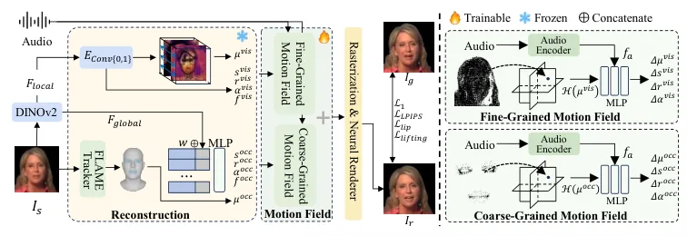
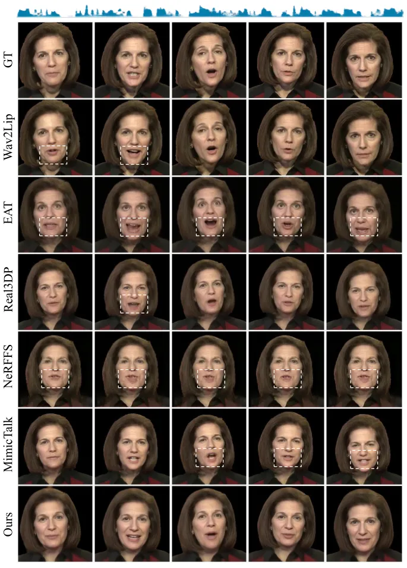
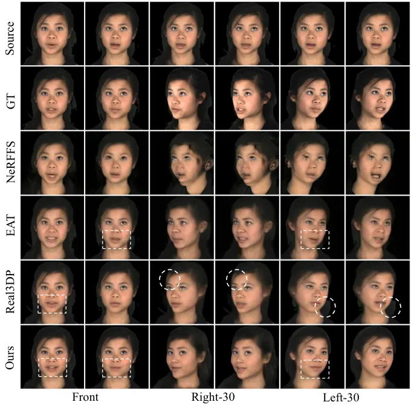
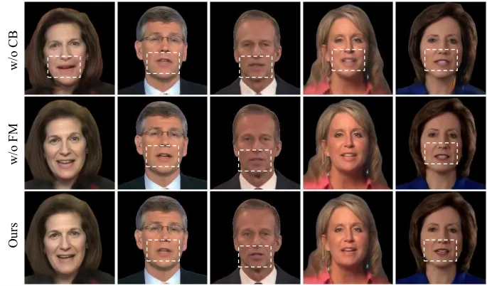

Jia Xiao Li Liu Hu Yu

# SDTalk: Structured Facial Priors and Dual-Branch Motion Fields for Generalizable Gaussian Talking Head Synthesis

Peng    Zhen    Jia    Xueliang    Zhenzhen    Lingyun

###### Abstract

High-quality, real-time talking head synthesis remains a fundamental
challenge in computer vision. Existing reconstruction- and
rendering-based methods typically rely on identity-specific models,
limiting cross-identity generalization. To address this issue, we
propose SDTalk, a one-shot 3D Gaussian Splatting (3DGS)-based framework
that generalizes to unseen identities without personalized training or
fine-tuning. Our framework comprises two modules with a two-stage
training strategy. In the first stage, we incorporate structured facial
priors into the reconstruction module and separately predict 3DGS
parameters for visible and occluded regions, enabling complete head
reconstruction from a single image. In the second stage, we introduce a
dual-branch motion field to model coarse and fine facial dynamics,
improving detail fidelity and lip synchronization. Experiments
demonstrate that SDTalk surpasses existing methods in both visual
quality and inference efficiency. The code is available at
[https://github.com/MSA-LMC/SDGTalk](https://github.com/MSA-LMC/SDGTalk).

###### keywords

Talking Head Synthesis, 3D Gaussian Splatting, Motion Field

^(†)^(†)address: ¹ Hefei University of Technology, Hefei, China  
² University of Science and Technology of China, Hefei, China
^(†)^(†)email: jiali@hfut.edu.cn

## 1 Introduction

Talking head synthesis has broad application prospects in film
production, human-computer interaction, and virtual reality. This task
is to synthesize realistic, temporally coherent facial videos
conditioned on driving audio or other control signals.

Existing methods can be categorized into identity-agnostic and
identity-specific paradigms according to whether they rely on target
identity information. The identity-agnostic paradigm focuses on learning
the mapping from audio to facial motion, commonly adopting generative
architectures such as GANs \[1\] and Diffusion Models \[2\], and
training on large-scale, multi-identity video datasets to improve
generalization to new identities. These methods \[1, 2\] emphasize lip
synchronization and cross-identity inference, but generally suffer from
limited output image quality, difficulty preserving identity traits, and
low generation efficiency.



Figure 1: Overview of SDTalk. Our approach consists of two main modules:
a reconstruction module and a motion field module. Given a source image
$`I_{s}`$ and its corresponding audio, the reconstruction module
leverages a learned structured facial prior to obtain the Gaussian head.
The motion field then predicts point-wise deformations conditioned on
the audio features $`f_{a}`$. Finally, a rasterizer and a neural
renderer synthesizes the final talking head $`I_{r}`$. During inference,
the reconstruction module is executed only once, after which
audio-driven animation is achieved solely through the motion field
module.

By contrast, identity-specific approaches are based on 3D reconstruction
techniques represented by Neural Radiance Fields (NeRF) \[3\] and 3D
Gaussian Splatting (3DGS) \[4\]. NeRF-based methods \[5, 6\] generally
require long optimization due to the expensive cost of vanilla NeRF.
More recent research \[7, 8\] leverages 3DGS to replace implicit
volumetric representations with explicit Gaussian models, substantially
improving training speed and rendering efficiency; such approaches \[7,
9\] can reduce training time to the hour level while maintaining
high-quality synthesis and achieving real-time inference performance.

Although reconstruction and rendering (RAR)-based methods better
preserve target identity characteristics and thereby mitigate some
limitations of generative model-based approaches, they still face
significant challenges. On the one hand, acquiring high-quality training
video data for specific identities is difficult; on the other hand,
training identity-specific models from scratch for new identities often
requires substantial time. To overcome these challenges, some
works \[10, 11\] adopt a pretraining and adaptation (PAA) paradigm: the
pretraining stage learns universal motion priors from multi-identity
data, and the adaptation stage fine-tunes the model to new identities.
This strategy partially reduces adaptation time and decreases the
required video samples to only a few seconds, but still requires a
dedicated fine-tuning step for each new identity.

In this paper, we propose SDTalk, a one-shot talking head generation
method based on 3DGS that generalizes to new identities without
personalized fine-tuning. As shown in Fig. 1, the framework comprises
two main components: a reconstruction module and a motion field module.
First, due to insufficient geometric information from a single image,
direct reconstruction often results in structural deficiencies, making
it difficult to recover internal details such as teeth. To address this,
we introduce structured facial priors in the reconstruction module,
leveraging the geometric priors of the FLAME \[12\] mesh to predict
Gaussian parameters for occluded facial regions, while employing a
dual-lifting method \[13\] to precisely fit geometry and texture for
visible regions, thereby reconstructing a complete Gaussian head.
Second, we design dual-branch motion fields: a coarse-grained branch
captures global facial motion trends, while a fine-grained branch models
local high-frequency details. This design improves lip synchronization
and visual fidelity.

## 2 Proposed Method

### 2.1 Preliminaries

3D Gaussian Splatting (3DGS) \[4\] represents a 3D scene as an explicit
collection of anisotropic Gaussian primitives. Each Gaussian primitive
is parameterized by a set of attributes, including a 3D mean
$`\mu\in\mathbb{R}^{3}`$, a scale vector $`s\in\mathbb{R}^{3}`$, a
rotation quaternion $`r\in\mathbb{R}^{4}`$, an opacity scalar
$`\alpha\in\mathbb{R}`$, and a $`Z`$-dimensional color feature vector
$`f\in\mathbb{R}^{Z}`$. Accordingly, a Gaussian primitive
$`\mathcal{G}`$ is defined as:

```math
\mathcal{G}=\{\mu,s,r,\alpha,f\}, \tag{1}
```

Each Gaussian primitive defines a spatial basis function of the form:

```math
G(\mathbf{x})=e^{-\frac{1}{2}(x-\mu)^{T}\Sigma^{-1}(x-\mu)}, \tag{2}
```

where $`x\in\mathbb{R}^{3}`$ denotes a 3D point in space. The covariance
matrix $`\Sigma`$ is constructed from the scale vector $`s`$ and the
rotation quaternion $`r`$, encoding the anisotropic shape and
orientation of the Gaussian.

### 2.2 Structured Facial Priors

Since a static facial image contains limited information, directly
reconstructing a Gaussian head from it often results in structural
deficiencies. For example, when the mouth is closed in the input image,
the reconstruction typically lacks Gaussian primitives corresponding to
internal details such as teeth and the oral cavity. To address this
issue, we introduce structured facial priors into the reconstruction
module and employ two complementary branches to reconstruct an
animatable Gaussian head for visible and occluded regions: i) a visible
branch that precisely fits observable surface geometry and texture, and
ii) a completion branch that leverages the priors to predict internal
structures. We employ DINOv2 \[14\] to extract local features
$`F_{local}`$ and global features $`F_{global}`$ from the source image
$`I_{s}`$, which serve as conditional information for the two branches,
respectively.

Visible branch. For the visible facial regions, we follow prior
work \[13\] and adopt a dual-lifting method for reconstruction.
Specifically, we initialize a feature plane in 3D space and determine
the coordinates $`p_{s}`$ and normal vectors $`n_{s}`$ for each point on
the plane. Convolutional networks $`E_{Conv\{0,1\}}`$ are then used to
predict the pixel-wise offsets relative to the feature plane as well as
the Gaussian parameters excluding position, denoted as
$`G_{s,r,\alpha,f}^{vis}`$. Based on the predicted offsets, positions,
and normal vector, we compute the positions of 3D Gaussians
$`\mathcal{G}_{\mu}^{vis}`$. This process can be formulated as:

```math
\displaystyle\mathcal{G}_{\mu}^{vis} \displaystyle=[p_{s}\pm E_{Conv\{0,1\}}(F_{local})\cdot n_{s}] \tag{3}
```

```math
\displaystyle=\{\mu^{vis}\},
```

```math
\displaystyle\mathcal{G}_{s,r,\alpha,f}^{vis} \displaystyle=[E_{Conv0}(F_{local}),E_{Conv1}(F_{local})] \tag{4}
```

```math
\displaystyle=\{s^{vis},r^{vis},\alpha^{vis},f^{vis}\}.
```

Completion branch. For occluded facial regions, directly regressing the
Gaussian parameters is challenging; therefore, we leverage the geometric
priors of the FLAME \[12\] mesh. We utilize the FLAME mesh of the source
image and select the vertices in the mouth and eye regions as the
candidate set for completion. Specifically, each vertex $`v_{i}`$ is
assigned a learnable weight $`w_{i}`$ and concatenated with the global
feature $`F_{global}`$. An MLP then predicts Gaussian parameters
excluding position, and use the position of the FLAME mesh vertices
$`\mathcal{G}_{\mu}^{occ}=\{\mu^{occ}\}`$. This process can be expressed
as:

```math
\displaystyle\mathcal{G}_{s,r,\alpha,f}^{occ} \displaystyle=\mathrm{MLP}(w\oplus F_{global}) \tag{5}
```

```math
\displaystyle=\{s^{occ},r^{occ},\alpha^{occ},f^{occ}\}.
```

where $`\oplus`$ denotes the concatenation operation.

Finally, the Gaussian primitives generated from the visible and occluded
pathways are merged to reconstruct the complete Gaussian head
$`\mathcal{G}=\mathcal{G}^{vis}\cup\mathcal{G}^{occ}`$.
Following \[13\], we predict 32-dimensional color embeddings and
synthesize the final image using a neural renderer.

### 2.3 Dual-Branch Motion Fields

In audio-driven facial animation, the core challenge is learning a
robust mapping from speech to lip motion. Existing 3DGS-based
methods \[11\] are trained on limited identities, restricting their
ability to capture diverse speech–lip correspondences and generalize
effectively. We instead leverage large-scale multi-identity data to
learn cross-identity mappings, improving robustness and lip
synchronization.

Unlike prior work \[9\] that represents the entire head with a single
Gaussian field, our method adopts a decoupled design. The visible branch
produces a dense head representation $`\mathcal{G}^{vis}`$ (175,232
primitives), while the completion branch $`\mathcal{G}^{occ}`$ contains
only 1,920 primitives and focuses on eye and mouth regions. To address
this structural asymmetry, we introduce a dual-branch motion field,
consisting of a coarse field for global dynamics and a fine field for
local high-frequency details.

Both branches share the same network architecture. In the following, we
use the coarse-grained motion field as an illustrative example. Our
framework is similar to prior 3DGS-based methods \[7\]. Specifically,
the positions $`\mu`$ are first encoded using a tri-plane hash encoder
$`\mathcal{H}`$ and then concatenated with the audio feature $`f_{a}`$.
The representation is decoded by an MLP to predict point-wise
deformation $`\delta_{D}`$:

```math
\delta_{D}=\mathrm{MLP}(\mathcal{H}(\mu)\oplus f_{a})=\{\Delta\mu,\Delta s,\Delta r,\Delta\alpha\}, \tag{6}
```

where $`\Delta\mu`$, $`\Delta s`$, $`\Delta r`$, and $`\Delta\alpha`$
represent the deformation offsets for position, scale, rotation, and
opacity, respectively. Finally, the Gaussian primitive parameters are
updated as:

```math
\mathcal{G}=\{\mu+\Delta\mu,s+\Delta s,r+\Delta r,\alpha+\Delta\alpha,f\}. \tag{7}
```

By leveraging hierarchical motion decomposition, our method ensures
stable global dynamics while enhancing the fidelity of local details,
thereby producing more natural, fine-grained, and robust audio-driven
facial animation.

### 2.4 Training Details

We adopt a two-stage training strategy to first establish stable facial
representations and then learn motion fields for expressive talking head
synthesis.

Stage 1. In this stage, the framework does not include the motion field
module. All modules are trained except the frozen DINOv2 \[14\]. The
completion branch uses the FLAME mesh fitted to the ground-truth image
$`I_{g}`$. We employ an L1 loss $`\mathcal{L}_{1}`$ and an LPIPS loss
$`\mathcal{L}_{LPIPS}`$ between the rendered image $`I_{r}`$ and the
ground-truth image $`I_{g}`$ to supervise appearance reconstruction. In
addition, following prior work \[13\], we incorporate a lifting distance
loss:

```math
\displaystyle\mathcal{L}_{lifting} \displaystyle=\|P_{FLAME}-P_{vis}\|, \tag{8}
```

```math
\displaystyle P_{vis} \displaystyle=\left\{\arg\min_{\mu^{vis}\in\mathcal{G}^{vis}}\|p-\mu^{vis}\|\,\middle|\,p\in P_{FLAME}\right\},
```

where $`P_{FLAME}`$ denotes the FLAME mesh vertices fitted from the
ground-truth image, $`P_{vis}`$ represents the nearest Gaussian point
$`\mu^{vis}\in\mathcal{G}^{vis}`$ for each vertex $`p\in P_{FLAME}`$,
and $`\mathcal{G}^{vis}`$ is the set of Gaussian points reconstructed
from visible regions of $`I_{s}`$. The overall training objective in
Stage 1 is given by:

```math
\mathcal{L}_{S1}=\mathcal{L}_{1}+\lambda_{l}\mathcal{L}_{LPIPS}+\lambda_{f}\mathcal{L}_{lifting}. \tag{9}
```

Stage 2. In this stage, parameters from the previous stage are frozen,
and only the motion field module is optimized. The completion branch
uses the FLAME mesh fitted to the source image. To improve lip
synchronization, we apply a lip loss $`\mathcal{L}_{lip}`$, where the
lip region is localized by facial landmarks \[15\] and optimized using
an L1 loss. The training objective in Stage 2 is defined as:

```math
\mathcal{L}_{S2}=\mathcal{L}_{1}+\lambda_{l}\mathcal{L}_{LPIPS}+\lambda_{f}\mathcal{L}_{lifting}+\lambda_{p}\mathcal{L}_{lip}, \tag{10}
```

where $`\lambda_{l}`$, $`\lambda_{f}`$, and $`\lambda_{p}`$ are the
weights to balance the losses.



Figure 2: Qualitative comparison across different methods. “Real3DP” and
“NeRFFS” refer to Real3DPortrait \[16\] and NeRFFaceSpeech \[17\],
respectively. Key regions are highlighted by boxes.

## 3 Experiments and Results Analysis

### 3.1 Experimental Settings

Dataset. We train our model on the HDTF \[18\] dataset, all videos are
cropped and resized to $`512\times 512`$, with camera poses and FLAME
parameters estimated using a facial-tracking pipeline and background
regions removed. For evaluation, we follow a cross-identity protocol in
which test identities are strictly excluded from the training set. In
addition, we evaluate our method on the MEAD \[19\] dataset to further
validate its generalization performance across datasets.

Implementation Details. Our method is implemented in PyTorch. Both
stages were optimized using the Adam optimizer with a learning rate of
$`1.0\times 10^{-4}`$, and each stage was trained for 200,000
iterations. Experiments were run on a single NVIDIA RTX 4090 GPU, and
the entire training procedure took approximately 32 GPU hours. Audio
features are extracted using HuBERT model \[20\].

Baselines. We compare our approach to methods from several paradigms.
For zero-shot methods, we include Wav2Lip \[1\]. For one-shot methods,
we compare to EAT \[21\], Real3DPortrait \[16\], and
NeRFFaceSpeech \[17\]. We also include MimicTalk \[10\], which follows
PAA paradigm.

Evaluation Metrics. We assess image quality using Peak Signal-to-Noise
Ratio (PSNR), Learned Perceptual Image Patch Similarity (LPIPS) \[22\],
and Structural Similarity Index (SSIM). Lip synchronization is evaluated
using LMD \[23\] and the SyncNet confidence score (Sync-C) \[24\].

### 3.2 Quantitative Results



Figure 3: Qualitative comparison of talking head synthesis across
different methods on the MEAD \[19\] dataset.

| Methods          | Config | PSNR$`\uparrow`$ | LPIPS$`\downarrow`$ | SSIM$`\uparrow`$ | LMD$`\downarrow`$ | Sync-C$`\uparrow`$ | FPS$`\uparrow`$ |
| ---------------- | ------ | ---------------- | ------------------- | ---------------- | ----------------- | ------------------ | --------------- |
| Wav2Lip \[1\]    | ZS     | -                | -                   | -                | 2.40              | 8.58               | 23              |
| EAT \[21\]       | OS     | 19.22            | 0.31                | 0.55             | 10.83             | 7.91               | 8               |
| Real3DP \[16\]   | OS     | 21.51            | 0.21                | 0.72             | 4.61              | 6.70               | 7               |
| NeRFFS \[17\]    | OS     | 19.15            | 0.26                | 0.61             | 18.68             | 3.46               | 1               |
| MimicTalk \[10\] | PAA    | 22.43            | 0.14                | 0.75             | 4.38              | 5.45               | 19              |
| Ours             | OS     | 24.03            | 0.13                | 0.80             | 3.47              | 6.85               | 45              |

Table 1: Quantitative comparison on the HDTF \[18\] dataset. “ZS”, “OS”,
and “PAA” denote zero-shot, one-shot, and pretraining-and-adaptation,
respectively. The best results are highlighted in bold, and the second
best are underlined.

| Methods        | PSNR$`\uparrow`$ | LPIPS$`\downarrow`$ | SSIM$`\uparrow`$ | LMD$`\downarrow`$ | Sync-C$`\uparrow`$ |
| -------------- | ---------------- | ------------------- | ---------------- | ----------------- | ------------------ |
| NeRFFS \[17\]  | 26.26            | 0.13                | 0.80             | 5.01              | 4.83               |
| EAT \[21\]     | 25.59            | 0.19                | 0.77             | 4.33              | 7.72               |
| Real3DP \[16\] | 26.43            | 0.13                | 0.85             | 2.68              | 7.62               |
| Ours           | 27.78            | 0.08                | 0.90             | 3.34              | 6.81               |

Table 2: Quantitative results under fixed head pose.

| Methods        | PSNR$`\uparrow`$ | LPIPS$`\downarrow`$ | SSIM$`\uparrow`$ | LMD$`\downarrow`$ | Sync-C$`\uparrow`$ |
| -------------- | ---------------- | ------------------- | ---------------- | ----------------- | ------------------ |
| NeRFFS \[17\]  | 14.65            | 0.37                | 0.56             | 26.61             | 5.27               |
| EAT \[21\]     | 19.85            | 0.28                | 0.63             | 9.61              | 7.19               |
| Real3DP \[16\] | 19.91            | 0.29                | 0.68             | 3.25              | 6.78               |
| Ours           | 21.17            | 0.20                | 0.75             | 2.83              | 5.41               |

Table 3: Quantitative results under diverse head poses.

Table 1 reports the quantitative evaluation results on the HDTF \[18\]
dataset. In general, our method outperforms other approaches in all
image quality metrics. Specifically, although EAT \[21\] and
Real3DPortrait \[16\] achieve relatively high scores on lip
synchronization metrics, they are constrained by limited visual fidelity
and lower inference speed, making it difficult to simultaneously satisfy
both high-quality and real-time requirements. MimicTalk \[10\] relies on
identity-specific fine-tuning, which limits its generalization and ease
of deployment. By contrast, our method enables real-time inference and
achieves the most balanced performance across all evaluation metrics.
Tables 2 and 3 present quantitative comparisons on the MEAD \[19\]
dataset compared with other one-shot methods. Under different head
poses, our approach consistently outperforms competing models in terms
of image quality, demonstrating its strong generalization ability and
robustness across various scenarios.

### 3.3 Qualitative Evaluation

We qualitatively compare synthesized sequences across methods in terms
of visual fidelity and lip synchronization (Fig. 2, Fig. 3).
Wav2Lip \[1\], which performs localized mouth-region synthesis, often
introduces boundary discontinuities and seam artifacts, compromising
global facial consistency. NeRFFaceSpeech \[17\] suffers from
accumulated inversion errors, leading to unstable reconstructions.
EAT \[21\] and Real3DPortrait \[16\] fail to preserve high-frequency
facial details, resulting in over-smoothed appearances. In contrast, our
method generates more coherent results with better structural and
textural preservation. Under large pose variations, although all methods
degrade, ours maintains clearer contours and more consistent lip motion,
demonstrating superior robustness.

### 3.4 Ablation Study

| Methods | PSNR$`\uparrow`$ | LPIPS$`\downarrow`$ | SSIM$`\uparrow`$ | LMD$`\downarrow`$ | Sync-C$`\uparrow`$ |
| ------- | ---------------- | ------------------- | ---------------- | ----------------- | ------------------ |
| w/o CB  | 22.99            | 0.15                | 0.78             | 3.31              | 5.79               |
| w/o FM  | 23.81            | 0.13                | 0.80             | 3.52              | 6.48               |
| Ours    | 24.03            | 0.13                | 0.80             | 3.47              | 6.85               |

Table 4: Ablation study results. “CB” and “FM” denote the completion
branch and the fine-grained motion field.



Figure 4: Visualization results of the ablation study. Key regions are
highlighted by dashed bounding boxes.

We perform ablation studies to evaluate each component, with
quantitative results in Table 4 and qualitative comparisons in Fig. 4.
Removing the completion branch degrades mouth-region quality due to the
limited information from a single reference image, hindering the
recovery of fine details such as teeth and the oral cavity. Using only
the coarse motion field further reduces visual quality and lip
synchronization accuracy, highlighting the necessity of the dual-branch
motion field design.

## 4 Conclusions

In this paper, we propose a novel one-shot 3DGS-based talking head
synthesis method, SDTalk, which significantly improves both visual
quality and inference speed. The method addresses the limited
information in a single reference image by reconstructing the visible
and occluded facial regions separately, and enhances motion modeling by
employing dual-branch motion fields that hierarchically decompose facial
dynamics. The effectiveness of the proposed method is validated through
both quantitative and qualitative experimental results.

## 5 Generative AI Use Disclosure

Generative AI tools were used solely for language editing and polishing
of this manuscript. All research ideas, methodological design,
experiments, and analysis were conducted by the authors. No generative
AI tools were used to produce the scientific content, experimental
results, or core technical contributions of this work. All (co-)authors
take full responsibility for the content of the paper and consent to its
submission.

## References

- \[1\] K. R. Prajwal, R. Mukhopadhyay, V. P. Namboodiri, and C.V.
  Jawahar (2020) A lip sync expert is all you need for speech to lip
  generation in the wild. In Proceedings of the 28th ACM International
  Conference on Multimedia, MM ’20, New York, NY, USA, pp. 484–492.
  External Links: ISBN 9781450379885,
  [Link](https://doi.org/10.1145/3394171.3413532),
  [Document](https://dx.doi.org/10.1145/3394171.3413532) Cited by: §1,
  §3.1, §3.3, Table 1.
- \[2\] S. Shen, W. Zhao, Z. Meng, W. Li, Z. Zhu, J. Zhou, and J.
  Lu (2023) Difftalk: crafting diffusion models for generalized
  audio-driven portraits animation. In Proceedings of the IEEE/CVF
  conference on computer vision and pattern recognition, pp. 1982–1991.
  Cited by: §1.
- \[3\] B. Mildenhall, P. P. Srinivasan, M. Tancik, J. T. Barron, R.
  Ramamoorthi, and R. Ng (2021) Nerf: representing scenes as neural
  radiance fields for view synthesis. Communications of the ACM 65 (1),
  pp. 99–106. Cited by: §1.
- \[4\] B. Kerbl, G. Kopanas, T. Leimkühler, and G. Drettakis (2023) 3D
  gaussian splatting for real-time radiance field rendering.. ACM Trans.
  Graph. 42 (4), pp. 139–1. Cited by: §1, §2.1.
- \[5\] Y. Guo, K. Chen, S. Liang, Y. Liu, H. Bao, and J. Zhang (2021)
  Ad-nerf: audio driven neural radiance fields for talking head
  synthesis. In Proceedings of the IEEE/CVF international conference on
  computer vision, pp. 5784–5794. Cited by: §1.
- \[6\] X. Liu, Z. Liu, and C. Bi (2025) NeRF-3dtalker: neural radiance
  field with 3d prior aided audio disentanglement for talking head
  synthesis. In ICASSP 2025-2025 IEEE International Conference on
  Acoustics, Speech and Signal Processing (ICASSP), pp. 1–5. Cited by:
  §1.
- \[7\] J. Li, J. Zhang, X. Bai, J. Zheng, X. Ning, J. Zhou, and L.
  Gu (2024) Talkinggaussian: structure-persistent 3d talking head
  synthesis via gaussian splatting. In European Conference on Computer
  Vision, pp. 127–145. Cited by: §1, §2.3.
- \[8\] K. Deng, D. Zheng, J. Xie, J. Wang, W. Xie, L. Shen, and S.
  Song (2025) DEGSTalk: decomposed per-embedding gaussian fields for
  hair-preserving talking face synthesis. In ICASSP 2025-2025 IEEE
  International Conference on Acoustics, Speech and Signal Processing
  (ICASSP), pp. 1–5. Cited by: §1.
- \[9\] K. Cho, J. Lee, H. Yoon, Y. Hong, J. Ko, S. Ahn, and S.
  Kim (2024) Gaussiantalker: real-time high-fidelity talking head
  synthesis with audio-driven 3d gaussian splatting. arXiv preprint
  arXiv:2404.16012. Cited by: §1, §2.3.
- \[10\] Z. Ye, T. Zhong, Y. Ren, Z. Jiang, J. Huang, R. Huang, J.
  Liu, J. He, C. Zhang, Z. Wang, et al. (2024) MimicTalk: mimicking a
  personalized and expressive 3d talking face in minutes. Advances in
  neural information processing systems 37, pp. 1829–1853. Cited by: §1,
  §3.1, §3.2, Table 1.
- \[11\] J. Li, J. Zhang, X. Bai, J. Zheng, J. Zhou, and L. Gu (2025)
  InsTaG: learning personalized 3d talking head from few-second video.
  In Proceedings of the Computer Vision and Pattern Recognition
  Conference, pp. 10690–10700. Cited by: §1, §2.3.
- \[12\] T. Li, T. Bolkart, M. J. Black, H. Li, and J. Romero (2017)
  Learning a model of facial shape and expression from 4d scans.. ACM
  Trans. Graph. 36 (6), pp. 194–1. Cited by: §1, §2.2.
- \[13\] X. Chu and T. Harada (2024) Generalizable and animatable
  gaussian head avatar. Advances in Neural Information Processing
  Systems 37, pp. 57642–57670. Cited by: §1, §2.2, §2.2, §2.4.
- \[14\] M. Oquab, T. Darcet, T. Moutakanni, H. V. Vo, M. Szafraniec, V.
  Khalidov, P. Fernandez, D. Haziza, F. Massa, A. El-Nouby, R. Howes, P.
  Huang, H. Xu, V. Sharma, S. Li, W. Galuba, M. Rabbat, M. Assran, N.
  Ballas, G. Synnaeve, I. Misra, H. Jegou, J. Mairal, P. Labatut, A.
  Joulin, and P. Bojanowski (2023) DINOv2: learning robust visual
  features without supervision. Cited by: §2.2, §2.4.
- \[15\] A. Bulat and G. Tzimiropoulos (2017) How far are we from
  solving the 2d & 3d face alignment problem?(and a dataset of 230,000
  3d facial landmarks). In Proceedings of the IEEE international
  conference on computer vision, pp. 1021–1030. Cited by: §2.4.
- \[16\] Z. Ye, T. Zhong, Y. Ren, J. Yang, W. Li, J. Huang, Z. Jiang, J.
  He, R. Huang, J. Liu, et al. (2024) Real3D-portrait: one-shot
  realistic 3d talking portrait synthesis. arXiv preprint
  arXiv:2401.08503. Cited by: Figure 2, §3.1, §3.2, §3.3, Table 1, Table
  2, Table 3.
- \[17\] S. C. Gihoon Kim and J. Noh (2024) NeRFFaceSpeech: one-shot
  audio-driven 3d talking head synthesis via generative prior. Cited by:
  Figure 2, §3.1, §3.3, Table 1, Table 2, Table 3.
- \[18\] Z. Zhang, L. Li, Y. Ding, and C. Fan (2021) Flow-guided
  one-shot talking face generation with a high-resolution audio-visual
  dataset. In Proceedings of the IEEE/CVF conference on computer vision
  and pattern recognition, pp. 3661–3670. Cited by: §3.1, §3.2, Table 1.
- \[19\] K. Wang, Q. Wu, L. Song, Z. Yang, W. Wu, C. Qian, R. He, Y.
  Qiao, and C. C. Loy (2020) Mead: a large-scale audio-visual dataset
  for emotional talking-face generation. In European conference on
  computer vision, pp. 700–717. Cited by: Figure 3, §3.1, §3.2.
- \[20\] W. Hsu, B. Bolte, Y. H. Tsai, K. Lakhotia, R. Salakhutdinov,
  and A. Mohamed (2021) Hubert: self-supervised speech representation
  learning by masked prediction of hidden units. IEEE/ACM transactions
  on audio, speech, and language processing 29, pp. 3451–3460. Cited by:
  §3.1.
- \[21\] Y. Gan, Z. Yang, X. Yue, L. Sun, and Y. Yang (2023) Efficient
  emotional adaptation for audio-driven talking-head generation. In
  Proceedings of the IEEE/CVF International Conference on Computer
  Vision (ICCV), pp. 22634–22645. Cited by: §3.1, §3.2, §3.3, Table 1,
  Table 2, Table 3.
- \[22\] R. Zhang, P. Isola, A. A. Efros, E. Shechtman, and O.
  Wang (2018) The unreasonable effectiveness of deep features as a
  perceptual metric. In Proceedings of the IEEE conference on computer
  vision and pattern recognition, pp. 586–595. Cited by: §3.1.
- \[23\] L. Chen, Z. Li, R. K. Maddox, Z. Duan, and C. Xu (2018) Lip
  movements generation at a glance. In Proceedings of the European
  conference on computer vision (ECCV), pp. 520–535. Cited by: §3.1.
- \[24\] J. S. Chung and A. Zisserman (2016) Lip reading in the wild. In
  Asian conference on computer vision, pp. 87–103. Cited by: §3.1.
