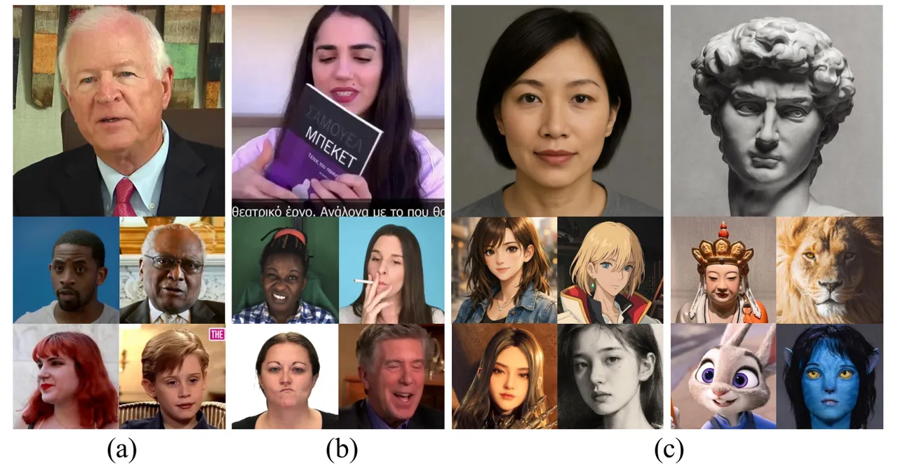
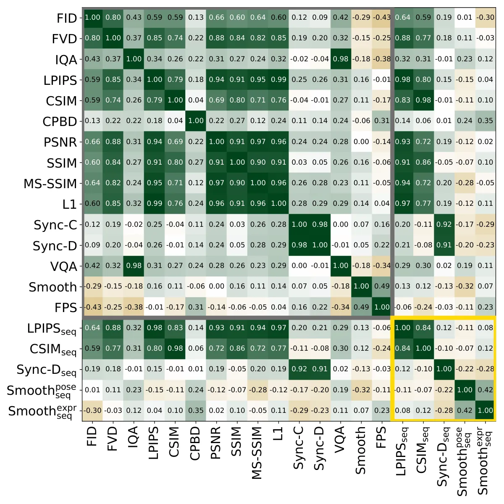
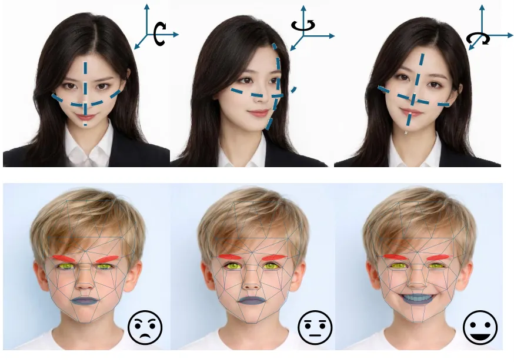
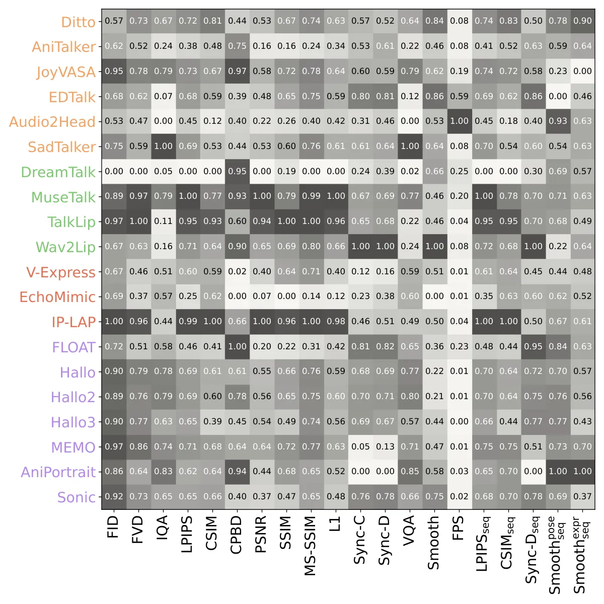

# Temporally-Aligned Evaluation for Audio-Driven Talking Head Generation

Zhicheng Zhang Email: <zhicheng.zhang2@unsw.edu.au> Affiliation: School
of Business, University of New South Wales (UNSW), Australia    Lei Wang
Email: <l.wang4@griffith.edu.au> Affiliation: School of Engineering and
Built Environment, Griffith University, Australia
Affiliation: Data61/CSIRO, Australia    Yu Zhang
Email: <m.yuzhang@unsw.edu.au> Affiliation: School of Business,
University of New South Wales (UNSW), Australia    Yongsheng Gao
Email: <yongsheng.gao@griffith.edu.au> Affiliation: School of
Engineering and Built Environment, Griffith University, Australia

###### Abstract

Audio-driven talking-head generation has advanced rapidly, yet existing
evaluation protocols mainly rely on frame-wise metrics that assume
strict temporal correspondence between generated and reference videos.
This assumption does not match speech-driven facial motion, which
naturally includes slight timing shifts, different speaking speeds, and
stylistic variations. As a result, conventional metrics may treat
harmless timing differences as quality errors, making it harder to
fairly compare methods and understand their trade-offs. In this work, we
argue that evaluation of dynamic generative models should be formulated
as a sequence-alignment problem rather than independent frame
comparison. We introduce a unified sequence-level reformulation that
integrates Soft Dynamic Time Warping into established evaluation
pipelines. By aligning feature trajectories while preserving temporal
order, the proposed framework provides robustness to bounded temporal
misalignments without altering the underlying perceptual, identity, or
synchronization encoders. We show that frame-wise evaluation can be
viewed as a special case under rigid alignment, while sequence-level
alignment provides improved stability, lower sensitivity to timing
differences, and clearer separation between modeling paradigms. Building
on this principled formulation, we conduct a large-scale benchmark of 20
methods across seven datasets spanning canonical, in-the-wild, and
style-diverse scenarios under standardized protocols. Extensive
experiments show that temporally aligned metrics are more robust to
timing differences, provide more consistent results across datasets, and
better reveal systematic trade-offs between modeling paradigms, such as
synchronization versus realism and expressiveness versus stability. By
redefining talking-head evaluation as trajectory-level alignment, this
work highlights temporal correspondence as an essential principle for
evaluating dynamic generative models and provides a solid foundation for
future research in audio-driven facial animation.

###### keywords

Audio-driven talking heads, audio-to-video synthesis, temporal
evaluation, sequence lignment, perceptual similarity, identity
preservation, motion realism.

^(†)^(†)equal-contributors: Zhicheng Zhang and Lei Wang contributed
equally to this work and are co-first
authors.^(†)^(†)equal-contributors: Zhicheng Zhang and Lei Wang
contributed equally to this work and are co-first authors.

## 1 Introduction

Audio-driven talking-head generation has progressed rapidly in recent
years, fueled by advances in generative modeling Shen et al. (2023); Wei
et al. (2024); Zhang et al. (2023); Croitoru et al. (2023); Xing et al.
(2024), motion representation learning Li et al. (2025a); Fan et al.
(2022); Wang et al. (2021), and audio-visual alignment Prajwal et al.
(2020); Zhou et al. (2019); Chung and Zisserman (2016b). Contemporary
approaches can synthesize photorealistic facial animations from speech
with high lip-sync accuracy and expressive dynamics, enabling
applications in virtual avatarsFan et al. (2022); Wang et al. (2021);
Thies et al. (2020), digital dubbingZhou et al. (2020); Har and Javier
(2026), telepresenceJin et al. (2020); Christoff et al. (2023), and
interactive mediaZhu et al. (2025); Yan et al. (2024).

Despite these advances, progress in the field remains difficult to
assess in a principled and consistent mannerBai et al. (2025); Zhen et
al. (2023); Gowda et al. (2023). Existing studies typically evaluate
models on isolated datasets, adopt heterogeneous preprocessing
pipelines, and report results under inconsistent metric
configurationsZhang et al. (2021); Chung et al. (2018); Wang et al.
(2020). More fundamentally, widely used evaluation metrics, such as
Learned Perceptual Image Patch Similarity (LPIPS)Zhang et al. (2018a);
Snell et al. (2017) for perceptual similarity, Cosine Similarity
(CSIM)Deng et al. (2019) for identity preservation, SyncNet-based
synchronization scoresChung and Zisserman (2016a), and
interpolation-based motion smoothnessHuang et al. (2024), share a common
structural limitation: they operate under rigid frame-wise alignment
assumptionsPetitjean et al. (2011).



Figure 1: Comparison of datasets across columns: existing benchmarks
with diverse real identities (1st); our Wild dataset with occlusions,
exaggerated motions, and dynamic expressions (2nd); our Avatar dataset
including AI-generated photorealistic and 3D faces, animated characters,
2D cartoons, sculptures, artistic portraits, sketch-style renderings,
animals, and humanoids (3rd-4th columns).

Specifically, these metrics compute similarity between temporally
corresponding frame pairs and aggregate the results by simple averaging.
This formulation implicitly assumes that generated and reference videos
are strictly synchronized, have equal length, maintain stable identity,
and exhibit consistent audio-visual correspondence. However, in
practical audio-driven generation, even high-quality models may
introduce slight temporal phase shifts, rhythm variations, pose changes,
or local articulation delays. While such variations are often
perceptually acceptable, they can disproportionately distort frame-level
evaluation scores. As a result, current metrics may reflect sensitivity
to temporal misalignment rather than intrinsic generation qualityCuturi
and Blondel (2017).

This structural issue becomes increasingly problematic as the field
diversifies into multiple modeling paradigms, including lip-centric
pipelinesMa et al. (2023); Zhang et al. (2024); Wang et al. (2023);
Prajwal et al. (2020), motion-space disentangled frameworksLi et al.
(2025b); Liu et al. (2024); Cao et al. (2024); Tan et al. (2024); Wang
et al. (2021); Zhang et al. (2023), multi-condition fusion
strategiesWang et al. (2024); Chen et al. (2025); Zhong et al. (2023),
and holistic full-motion architecturesKi et al. (2025); Xu et al.
(2024); Cui et al. (2024); Cui et al. (2025); Zheng et al. (2024); Wei
et al. (2024); Ji et al. (2025). Without temporally robust evaluation,
it remains unclear which paradigms truly excel in realism,
synchronization, identity stability, or motion naturalness, and which
trade-offs are intrinsic to their design.

Although several metrics incorporate limited temporal modeling, they do
not address the structural misalignment problem inherent in
frame-constrained evaluation. For example, Fréchet Video Distance (FVD)
evaluates distributional similarity using spatiotemporal features
extracted from pretrained video recognition networks. While FVD captures
global temporal statistics, it operates at the distribution level rather
than establishing explicit alignment between generated and reference
sequences. Consequently, it cannot distinguish perceptually acceptable
phase shifts from genuine motion inconsistencies.

Similarly, some works adopt sliding-window averaging, short temporal
smoothing, or local aggregation strategies to reduce frame-level noise.
These approaches mitigate high-frequency fluctuations but still assume
fixed temporal correspondence and cannot accommodate non-linear timing
variations. Cross-correlation-based synchronization metrics partially
account for temporal offsets by measuring alignment peaks across short
windows; however, they lack monotonic alignment constraints and are
limited to specific modalities such as lip synchronization. In contrast,
audio-driven talking-head generation involves structured, monotonic
temporal evolution governed by speech dynamics. Evaluation therefore
requires a mechanism that preserves temporal order while allowing
elastic alignment under perceptually tolerable timing variations. This
observation motivates our reformulation of talking-head evaluation as
sequence-level trajectory alignment, rather than distribution matching
or local smoothing.

|                               |        |                                                                   |       |                                |
| ----------------------------- | ------ | ----------------------------------------------------------------- | ----- | ------------------------------ |
| Method                        | Venue  | GitHub                                                            | Stars | Hierarchical semantic taxonomy |
| 2025                          |        |                                                                   |       |                                |
| Ditto Li et al. (2025b)       | ACM MM | [Code](https://github.com/antgroup/ditto-talkinghead)             | 805   |                                |
| EchoMimic Chen et al. (2025)  | AAAI   | [Code](https://github.com/antgroup/echomimic)                     | 4200  |                                |
| FLOAT Ki et al. (2025)        | ICCV   | [Code](https://github.com/deepbrainai-research/float)             | 474   |                                |
| Hallo3 Cui et al. (2025)      | CVPR   | [Code](https://github.com/fudan-generative-vision/hallo3)         | 1440  |                                |
| Sonic Ji et al. (2025)        | CVPR   | [Code](https://github.com/jixiaozhong/Sonic)                      | 3200  |                                |
| Hallo2 Cui et al. (2024)      | ICLR   | [Code](https://github.com/fudan-generative-vision/hallo2)         | 3741  |                                |
| 2024                          |        |                                                                   |       |                                |
| Hallo Xu et al. (2024)        | arXiv  | [Code](https://github.com/fudan-generative-vision/hallo)          | 8600  |                                |
| AniPortrait Wei et al. (2024) | arXiv  | [Code](https://github.com/scutzzj/aniportrait)                    | 5018  |                                |
| MuseTalk Zhang et al. (2024)  | arXiv  | [Code](https://github.com/tmelyralab/musetalk)                    | 5900  |                                |
| V-Express Wang et al. (2024)  | arXiv  | [Code](https://github.com/tencent-ailab/V-Express/)               | 2430  |                                |
| AniTalker Liu et al. (2024)   | ACM MM | [Code](https://github.com/x-lance/anitalker)                      | 1600  |                                |
| MEMO Zheng et al. (2024)      | arXiv  | [Code](https://github.com/memoavatar/memo.git)                    | 1118  |                                |
| JoyVASA Cao et al. (2024)     | arXiv  | [Code](https://github.com/jdh-algo/JoyVASA)                       | 870   |                                |
| EDTalk Tan et al. (2024)      | ECCV   | [Code](https://github.com/tanshuai0219/EDTalk?tab=readme-ov-file) | 469   |                                |
| 2023                          |        |                                                                   |       |                                |
| SadTalker Zhang et al. (2023) | CVPR   | [Code](https://github.com/winfredy/sadtalker)                     | 13905 |                                |
| DreamTalk Ma et al. (2023)    | arXiv  | [Code](https://github.com/ali-vilab/dreamtalk)                    | 1834  |                                |
| IP-LAP Zhong et al. (2023)    | CVPR   | [Code](https://github.com/Weizhi-Zhong/IP_LAP)                    | 740   |                                |
| TalkLip Wang et al. (2023)    | CVPR   | [Code](https://github.com/sxjdwang/talklip)                       | 428   |                                |
| 2022–2020                     |        |                                                                   |       |                                |
| Audio2Head Wang et al. (2021) | IJCAI  | [Code](https://github.com/wangsuzhen/Audio2Head)                  | 353   |                                |
| Wav2Lip Prajwal et al. (2020) | ACM MM | [Code](https://github.com/Rudrabha/Wav2Lip)                       | 13000 |                                |

Table 1: Overview of representative audio-driven talking-head generation
methods and their public implementations. For each method, we report the
publication venue and year, the availability of official GitHub code,
and the number of GitHub stars (collected Jun 01, 2026), providing a
consolidated view of methodological coverage and practical adoption. The
hierarchical semantic taxonomy in the last column was built via
unsupervised hierarchical clustering of paper titles and abstracts using
TF-IDF representations and Ward linkage. The horizontal axis denotes
linkage distance, reflecting semantic dissimilarity between methods.
This taxonomy offers a structured view of how existing approaches differ
in motion modeling, conditioning mechanisms, and system-level design.

In this work, we identify rigid frame-wise alignment as a fundamental
bottleneck in talking-head evaluation and propose a unified temporal
reformulation of existing metrics. Instead of treating evaluation as
independent frame comparisons, we reinterpret it as sequence-level
trajectory matching in feature space. Concretely, we introduce a Soft
Dynamic Time Warping (Soft-DTW) based alignment mechanism that preserves
temporal order while allowing flexible correspondence between generated
and reference sequences. Importantly, this reformulation does not alter
feature encoders. The modification occurs solely at the metric level,
transforming frame-wise averaging into temporally aligned sequence
matching. In addition, we redesign motion smoothness evaluation by
shifting from pixel-space interpolation errors to explicit semantic
motion trajectory modeling using disentangled head pose and expression
features, further enhancing interpretability and robustness.

Built upon this unified temporal evaluation framework, we conduct a
large-scale benchmark of 20 high-impact pretrained methods across seven
datasets under standardized protocols. Our analysis reveals consistent
paradigm-level trade-offs and demonstrates that temporally aware metrics
provide more stable, discriminative, and practically meaningful
comparisons. By establishing temporal alignment as a first-class
principle in evaluation, this work provides a fair and robust foundation
for future research in audio-driven talking-head generation.

Our contributions are threefold:

1.  i.
    A unified temporal reformulation of evaluation metrics. We identify
    rigid frame-wise alignment as a structural limitation in existing
    talking-head evaluation protocols and reformulate perceptual
    similarity (LPIPS), identity preservation (CSIM), and audio-visual
    synchronization (SyncNet) as sequence-level trajectory matching
    problems using Soft-DTW. This modification introduces temporal
    robustness without altering feature encoders.
2.  ii.
    Semantic motion trajectory modeling for expression naturalness. We
    redesign motion smoothness evaluation by replacing
    interpolation-based pixel reconstruction errors with explicit
    semantic motion features extracted from a motion encoder,
    disentangling rigid head pose and non-rigid expression deformation.
    Combined with Soft-DTW alignment, this formulation provides
    interpretable and temporally robust motion evaluation.
3.  iii.
    A standardized large-scale benchmark with paradigm-level insights.
    We evaluate 20 high-impact audio-driven talking-head models across
    seven canonical and real-world datasets under unified protocols. Our
    temporally aware metrics reveal consistent paradigm-specific
    trade-offs across realism, synchronization, identity stability, and
    motion naturalness, offering actionable guidance for model design
    and deployment.

## 2 Related Work

Surveys and reviews. Several studies Zhang et al. (2026) summarize the
landscape of audio-driven talking-head generation, reviewing
architectures, motion representations, and disentanglement strategies.
While useful for method selection, these surveys are largely qualitative
and descriptive, lacking quantitative, cross-dataset evaluation or
temporal alignment considerations. As a result, they cannot reveal
systematic trade-offs between paradigms under realistic generation
conditions.

Existing evaluations and benchmarks. A few works Shen et al. (2023);
Zhang et al. (2023) perform benchmarking using metrics such as LPIPS,
Fréchet Inception Distance (FID), PSNR, CSIM, or SyncNet-based lip-sync
scores on one or two datasets. Although informative, these studies are
limited in scope, covering a small subset of methods, datasets, and
evaluation dimensions. Most metrics assume strict frame-wise alignment,
ignoring minor phase shifts, rhythm variations, or temporal dynamics
that are perceptually acceptable yet critical for faithful video
assessment. Moreover, prior evaluations rarely integrate multiple
semantic dimensions (_e.g_., perceptual quality, identity,
synchronization, motion smoothness) into a single, interpretable
framework, making it difficult to compare paradigms, quantify
trade-offs, or assess robustness across datasets and styles.

Datasets. Evaluation quality critically depends on dataset diversity and
preprocessing. Widely used 2D talking-head datasets, including HDTF
Zhang et al. (2021), VoxCeleb2 Chung et al. (2018), CelebV-HQ Zhu et al.
(2022), MEAD Wang et al. (2020), and RAVDESS Livingstone and Russo
(2018), are often employed selectively, with heterogeneous
preprocessing, limited subsets, and insufficient style, pose, or
lighting variations. Smaller domain-shift datasets Cui et al. (2025); Li
et al. (2025b); Chen et al. (2025) mainly support qualitative
validation. To address these limitations, we construct a comprehensive
benchmark spanning seven datasets, including two curated subsets (see
Fig. 1): (i) Wild, emphasizing challenging real-world conditions,
occlusions, expressive speech, and diverse head motion; and (ii) Avatar,
covering AI-generated photorealistic, 2D/3D animated, artistic, and
non-human faces. This strategy enables cross-dataset and cross-style
evaluation, revealing robustness and generalization trends beyond
conventional laboratory conditions.

Evaluation metrics. Previous metrics are fragmented and mostly
frame-constrained. Perceptual measures (LPIPS, IQA, FID, FVD, VQA, CPBD)
assess visual realism, while pixel-level metrics (PSNR, SSIM, MS-SSIM,
L1) quantify reconstruction fidelity. Identity preservation (CSIM),
audio-visual synchronization (Sync-C/D), motion naturalness (Smooth),
and computational efficiency (FPS) are evaluated independently, often
with limited temporal awareness. Our framework unifies all metrics under
a Soft-DTW-based, sequence-level alignment approach, accounting for
minor temporal misalignments, sequence length variations, and rhythm
differences. This produces temporally-aware, interpretable, and
comparable scores across all semantic dimensions.

## 3 Benchmark Design and Construction

We construct a benchmark for audio-driven talking-head generation to
enable fair and reproducible comparison of methods across diverse
datasets and scenarios.

### 3.1 Method Selection and Paradigm Taxonomy

Method selection criteria. We conduct a systematic survey of
audio-driven 2D talking-head generation methods published between 2020
and 2025, focusing specifically on the audio-to-video setting. An
initial pool of 117 candidate methods Zhang et al. (2026) was collected
from arXiv and major peer-reviewed venues. To ensure reproducibility and
fair cross-method comparison, we apply explicit filtering criteria along
three dimensions: publication quality, public accessibility of source
code, and availability of pretrained checkpoints. Restricting inclusion
to methods with released implementations enables consistent
re-evaluation under a unified preprocessing, inference, and metric
pipeline, minimizing discrepancies arising from undocumented
reimplementations. This criterion prioritizes transparency and
experimental verifiability over popularity or citation count, ensuring
that all evaluated models can be independently reproduced under
identical conditions. After filtering, 20 representative methods remain,
summarized in Table 1. These methods span diverse architectural
paradigms and modeling strategies, forming a reproducible and
standardized foundation for our paradigm-level benchmark analysis.

Motion-modeling paradigm taxonomy. We organize audio-driven talking-head
methods according to their motion modeling philosophy, reflecting the
core assumptions each approach makes about representing and generating
facial dynamics. While architectural choices, training protocols, and
auxiliary objectives vary widely, these underlying principles provide a
more meaningful axis for comparison than surface-level components.
Specifically, motion-space disentangled methods explicitly decompose
facial motion into interpretable components, such as 3D coefficients,
latent motion bases, or dense motion fields Li et al. (2025b); Liu et
al. (2024); Wang et al. (2021); Zhang et al. (2023), enhancing
controllability, identity preservation, and cross-identity transfer.
Lip-centric methods prioritize accurate audio-lip synchronization by
modeling mouth dynamics as the primary driver Ma et al. (2023); Zhang et
al. (2024); Wang et al. (2023); Prajwal et al. (2020), often achieving
high lip accuracy at the expense of full-face realism or temporal
coherence. Multi-condition fusion methods integrate audio with
additional signals such as identity embeddings, landmarks, emotions, or
pose parameters Wang et al. (2024); Chen et al. (2025); Zhong et al.
(2023), improving expressiveness and generalization, though
cross-dataset robustness and temporal consistency are less frequently
evaluated. Finally, holistic full-motion methods map audio (and optional
conditioning inputs) directly to complete spatiotemporal facial motion
without explicit structural factorization Ki et al. (2025); Xu et al.
(2024); Cui et al. (2024); Zheng et al. (2024); Wei et al. (2024),
producing coherent expressions and smooth dynamics, but may be more
susceptible to subtle synchronization errors or identity drift.

Semantic clustering validation. To examine whether our taxonomy reflects
intrinsic structure within the literature rather than subjective
grouping, we perform unsupervised semantic analysis (see Table 1, last
column). Specifically, TF-IDF representations are constructed from the
title and abstract of each selected paper, followed by hierarchical
clustering using Ward linkage Hondru et al. (2025). This procedure
groups methods based solely on textual semantic similarity without
manual supervision. The resulting dendrogram reveals two high-level
semantic divisions: one centered on motion representation and
disentanglement, and the other on generation pipelines and system-level
modeling. These divisions further decompose into four primary clusters
that align closely with the four paradigms identified above. The
correspondence between manual paradigm identification and unsupervised
semantic clustering provides empirical support for the proposed
taxonomy, reducing subjective bias and reinforcing its structural
validity.

### 3.2 Dataset Selection and Construction

At the dataset level, we adopt two complementary design principles:
literature relevance and robustness coverage. We identify the five most
frequently used public benchmarks for 2D audio-driven talking-head
generation, HDTF, VoxCeleb2, CelebV-HQ, MEAD, and RAVDESS, and construct
standardized evaluation subsets under unified preprocessing protocols.
This ensures compatibility with prior work while enabling controlled and
reproducible cross-method comparison.

For HDTF, VoxCeleb2, and CelebV-HQ, we select 100 videos per dataset,
with VoxCeleb2 restricted to high-quality interview recordings to reduce
uncontrolled compression artifacts. For RAVDESS, both speaking and
singing scenarios are included, selecting at least two videos per
identity to yield 100 videos. For MEAD, 47 identities are sampled with a
minimum of two videos per identity, again resulting in 100 videos. All
videos are trimmed to 4-10 seconds to emphasize dynamic facial motion
while preserving identity diversity. For each sample, the initial frame
and corresponding audio track are extracted, and audio is resampled to
16 kHz to ensure consistent input conditions. Following common practices
in prior works Wang et al. (2023); Chung and Zisserman (2016b); Zhou et
al. (2021), we ensure that evaluation results are comparable across
methods while focusing on dynamic aspects critical to talking-head
generation. The selected subsets balance coverage of motion variability
and computational feasibility, without relying on the full test set,
which may include excessively long, static, or low-quality sequences
unsuitable for robust analysis. While these canonical benchmarks are
widely adopted, they primarily consist of frontal, well-lit, human
subjects captured under relatively controlled recording conditions. Such
characteristics, although beneficial for training and in-domain
evaluation, may underrepresent challenging motion dynamics, occlusions,
cross-style variation, and distribution shifts encountered in real-world
deployment. Consequently, paradigm-level robustness and generalization
behavior may remain insufficiently characterized under standard
benchmark settings.

To address this limitation, we construct two additional evaluation
subsets specifically designed to stress robustness and
out-of-distribution generalization. The Wild subset (60 videos)
emphasizes scenarios with rapid head motion, occlusions, diverse
speaking and singing styles, and strong emotional expressions. These
conditions amplify temporal variability and motion amplitude, providing
a more stringent test of dynamic stability and synchronization
robustness. The Avatar subset (40 videos) includes photorealistic
AI-generated faces, 2D and 3D animated characters, artistic avatars and
sculptures, sketch-style renderings, and non-human subjects. This subset
intentionally introduces substantial appearance distribution shifts to
evaluate cross-style transferability and feature-level robustness. This
two-level dataset design, combining canonical benchmarks with
robustness-oriented subsets, enables systematic evaluation under both
controlled and distribution-shifted conditions. It facilitates analysis
of paradigm-specific behavior not only in terms of in-domain performance
but also under challenging motion, expression, and appearance
variations. Such design is particularly important for temporally-aware
evaluation, as distribution shifts often exacerbate temporal instability
and alignment sensitivity that remain obscured under conventional
in-domain benchmarks.



Figure 2: Spearman rank correlation matrix computed from normalized
metric scores averaged across datasets. Each method is ranked per
metric, and the correlation measures monotonic agreement. Frame-level
metrics show strong correlation, while sequence-level metrics are less
correlated, highlighting complementary temporal evaluation. The gray
bounding box corresponds to conventional frame-level metrics, whereas
the gold bounding box highlights the proposed Soft-DTW-based
sequence-level metrics.

Figure 3: Ranking consistency between frame-level and sequence-level
metrics. Each point represents a method, with the $`x`$-axis showing
average rank across original metrics (LPIPS, CSIM, Sync-D, Smooth) and
the $`y`$-axis showing average rank across sequence-level counterparts.
Lower ranks (closer to 1) indicate better performance. The dashed
diagonal indicates perfect agreement; points above (below) show methods
that improve (decline) under sequence-level evaluation. Points are
color-coded by paradigm, highlighting both overall correlations and
paradigm-specific shifts due to temporal alignment.

### 3.3 Evaluation Framework

Evaluating audio-driven talking-head generation requires metrics that
capture both visual and temporal aspects. We adopt a unified,
sequence-aware framework combining complementary metrics with
standardized testing protocols.

Metric taxonomy and design rationale. Audio-driven talking-head
generation involves multiple quality aspects, which we capture using six
complementary metric categories.

_Perceptual visual quality_ captures how realistic and visually
convincing generated content appears. Metrics such as FID and FVD
measure distributional similarity at image and video levels,
respectively, quantifying global realism. LPIPS evaluates perceptual
similarity between generated and reference frames in learned feature
spaces. Image Quality Assessment (IQA) and Video Quality Assessment
(VQA) assess perceptual quality at image and video scales, while
Cumulative Probability of Blur Detection (CPBD) estimates perceptual
sharpness. Together, these metrics provide a multi-scale, perceptually
grounded assessment of visual fidelity, reflecting human judgments of
realism and image quality. _Pixel-level reconstruction fidelity_
evaluates low-level signal consistency between generated and
ground-truth frames. Metrics such as PSNR, SSIM, MS-SSIM, and L1 capture
structural and numerical reconstruction accuracy. While they do not
necessarily align with perceptual realism, they remain essential for
understanding model performance in preserving fine-grained details and
structural consistency.

_Identity preservation_ is critical in talking-head generation to
prevent semantic drift over time. CSIM measures cosine similarity in a
high-dimensional face embedding space, quantifying whether the generated
sequence maintains the subject’s identity consistently across frames.
This semantic-level evaluation complements visual fidelity metrics,
ensuring that identity is preserved even in the presence of expressive
or extreme motions. _Audio-visual synchronization_ assesses cross-modal
alignment between speech signals and lip motion. Sync confidence
(Sync-C) and Sync distance (Sync-D) quantify temporal coherence between
audio and visual streams, capturing a defining characteristic of
audio-driven methods. Accurate synchronization is necessary for
perceptual realism and intelligibility, particularly in dialogue or
singing scenarios. _Expression and motion naturalness_ evaluates the
plausibility of temporal dynamics. The Smooth metric measures continuity
and stability in pose and expression trajectories, emphasizing
biomechanical realism and natural evolution of motion. This category
focuses on temporal dynamics that are not captured by appearance-based
or pixel-level metrics, highlighting differences in modeling strategies
for motion generation. _Computational efficiency_ reflects practical
deployment considerations. FPS measures inference speed, providing
insight into real-time capability and resource requirements, which is
critical for applications ranging from virtual avatars to telepresence.

### 3.4 Temporally-Aware Evaluation Metrics

Rethinking evaluation. While existing metrics capture complementary
aspects of video quality, they assume strict frame-to-frame
correspondence. This makes them overly sensitive to small temporal
offsets, phase shifts, or speaking-rate variations, which can distort
comparisons and obscure meaningful differences between methods. These
observations suggest that evaluation for talking-head generation should
satisfy two fundamental properties: (i) _temporal order preservation_,
ensuring that motion remains causally consistent; and (ii) _temporal
elasticity_, allowing flexible alignment under perceptually tolerable
timing variations. Conventional frame-wise metrics satisfy neither
property. We now present our temporally-aware evaluation metrics.

From frame alignment to trajectory alignment. Conventional frame-wise
metrics assume strict temporal correspondence and equal sequence
lengths. Given a generated video
$`\mathbf{X}=\{\mathbf{x}_{t}\}_{t=1}^{T}`$ and a reference video
$`\mathbf{Y}=\{\mathbf{y}_{t}\}_{t=1}^{T}`$, frame-wise evaluation
computes the average feature distance:

```math
\text{Dist}_{\text{frame}}(\mathbf{X},\mathbf{Y})=\frac{1}{T}\sum_{t=1}^{T}d\big(\phi(\mathbf{x}_{t}),\phi(\mathbf{y}_{t})\big), \tag{1}
```

where $`\phi(\cdot)`$ is a task-specific feature extractor (_e.g_.,
perceptual, identity, synchronization, or motion embeddings) and
$`d(\cdot,\cdot)`$ is a feature-space distance, typically the squared
$`\ell_{2}`$ norm. While simple, this formulation is highly sensitive to
minor temporal offsets, phase shifts, or rhythm variations commonly
encountered in generated talking-head videos.

To overcome these limitations, we treat each video as a trajectory in
feature space and compute a sequence-level similarity using
Soft-DTW Cuturi and Blondel (2017). Let
$`\mathbf{F}=\{\phi(\mathbf{x}_{t})\}_{t=1}^{T}`$,
$`\mathbf{G}=\{\phi(\mathbf{y}_{s})\}_{s=1}^{S}`$ denote the feature
sequences of the generated and reference videos. Soft-DTW computes a
differentiable, globally-aligned distance between sequences:

```math
\!\!\!\!\text{Soft-DTW}_{\gamma}(\mathbf{F},\mathbf{G})\!=\!-\gamma\log\!\sum_{\pi\in\Pi}\!\exp\!\Bigg(\!\!\!-\!\frac{1}{\gamma}\!\!\sum_{(t,s)\in\pi}\!\!d(\mathbf{F}_{t},\mathbf{G}_{s})\!\!\Bigg), \tag{2}
```

where $`\Pi`$ is the set of all monotonic alignment paths, and
$`\gamma>0`$ controls the trade-off between strict alignment
($`\gamma\to 0`$) and flexible matching ($`\gamma`$ large). By
considering all possible monotonic alignments, Soft-DTW is robust to
minor temporal misalignments, capturing global temporal coherence and
sequence-level structure across the video.

To ensure comparability across sequences of different lengths, we define
a normalized distance:

```math
\text{Dist}_{\text{seq}}(\mathbf{X},\mathbf{Y})=\frac{\text{Soft-DTW}_{\gamma}(\mathbf{F},\mathbf{G})}{T_{\max}}, \tag{3}
```

where $`T_{\max}=\max(T,S)`$. This formulation treats each video as a
continuous trajectory in feature space, preserving temporal order while
allowing non-linear alignment. This sequence-level perspective drives
our evaluation framework.



Figure 4: Head pose and expression control representation. The top row
shows head pose variations via three rotations: pitch (up-down about the
lateral axis), yaw (left-right about the vertical axis), and roll
(in-plane about the longitudinal axis). The bottom row illustrates
expression control using a 63-dimensional latent keypoint representation
(21 3D keypoints) for modeling non-rigid facial deformation. Red regions
mainly affect eyebrow motion, while blue regions control mouth
expressions. Adjusting keypoints enables diverse facial expressions.

Dimension-specific instantiations. Within this unified framework,
different evaluation aspects correspond to different feature extractors
$`\phi(\cdot)`$. For _visual perceptual quality_, $`\phi`$ maps each
frame to LPIPS feature embeddings extracted from pretrained perceptual
networksZhang et al. (2018b). Sequence alignment in this embedding space
measures global perceptual consistency while tolerating minor temporal
phase shifts. For _identity preservation_, $`\phi`$ corresponds to
$`\ell_{2}`$-normalized facial embeddings from a pretrained face
recognition model (_e.g_., InsightFaceDeng et al. (2019)). Trajectory
alignment captures identity stability across time, mitigating
sensitivity to transient pose changes or occasional detection noise. For
_audio-visual synchronization_, $`\phi`$ produces paired audio and
visual embeddings from a pretrained synchronization network (_e.g_.,
SyncNetChung and Zisserman (2016b)). Soft-DTW alignment between audio
and visual embedding sequences quantifies global audiovisual coherence
under variable speaking rates and small asynchronies. For _expression
and motion naturalness_, we decompose facial motion into two separate
feature trajectories: rigid head pose and non-rigid expression
deformation (see Fig. 4). Specifically, for each video frame, a
70-dimensional motion feature vector is extracted from the motion
encoderGuo et al. (2024):

1.  i.
    Head pose motion (7D): The first seven dimensions model global rigid
    head movement, consisting of three rotation angles (pitch, yaw,
    roll; 3D), one global scaling factor (1D), and a 3D translation
    vector $`\mathbf{t}=(t_{x},t_{y},t_{z})`$ representing spatial
    displacement. These parameters form a 7D rigid transformation
    capturing 3D orientation, scale, and position relative to the
    camera.
2.  ii.
    Expression deformation (63D): The remaining 63 dimensions encode
    non-rigid facial deformations via 21 keypoints, each with 3D
    coordinates $`(X,Y,Z)`$. These keypoints span facial regions
    including the forehead, eyebrows, cheeks, eyes, nose, mouth, chin,
    and neck, providing an interpretable representation of expression
    dynamics such as eyebrow raising, lip protrusion, eye gaze shifts,
    and head or neck motion.

Let the pose trajectories be
$`\mathbf{P}=\{\phi_{\text{pose}}(\mathbf{x}_{t})\}_{t=1}^{T}`$ and
$`\mathbf{P}^{\text{ref}}=\{\phi_{\text{pose}}(\mathbf{y}_{s})\}_{s=1}^{S}`$,
and the expression trajectories be
$`\mathbf{K}=\{\phi_{\text{expr}}(\mathbf{x}_{t})\}_{t=1}^{T}`$ and
$`\mathbf{K}^{\text{ref}}=\{\phi_{\text{expr}}(\mathbf{y}_{s})\}_{s=1}^{S}`$,
representing the pose and expression sequences extracted from the
generated video $`\mathbf{X}`$ and reference video $`\mathbf{Y}`$,
respectively. Each trajectory is independently aligned using Soft-DTW:

```math
\displaystyle\text{Dist}^{\text{pose}}_{\text{seq}}(\mathbf{X},\mathbf{Y}) \displaystyle=\frac{\text{Soft-DTW}_{\gamma}(\mathbf{P},\mathbf{P}^{\text{ref}})}{T_{\max}}, \tag{4}
```

```math
\displaystyle\text{Dist}^{\text{expr}}_{\text{seq}}(\mathbf{X},\mathbf{Y}) \displaystyle=\frac{\text{Soft-DTW}_{\gamma}(\mathbf{K},\mathbf{K}^{\text{ref}})}{T_{\max}}. \tag{5}
```

Separating pose and expression allows interpretable evaluation of global
head motion and fine-grained facial dynamics while remaining robust to
frame rate variations, minor temporal offsets, and local jitter. This
trajectory-level analysis provides physically meaningful,
temporally-aware measures of motion smoothness and expression
naturalness.

(a) CSIM

(b) LPIPS

(c) Sync-D

(d) Smooth$`{}^{\text{pose}}`$

(e) Smooth$`{}^{\text{expr}}`$

Figure 5: Comparison of baseline and Soft-DTW variants under different
$`\gamma`$ values across multiple evaluation metrics. Since the metrics
exhibit different numerical scales, all values are normalized by their
mean for fair comparison. Original denotes the metric computed without
Soft-DTW alignment.

By unifying heterogeneous frame-wise metrics into a trajectory-alignment
framework, our approach shifts evaluation from isolated frames to
full-sequence analysis, better reflecting perceptual realism in
talking-head videos. In essence, temporally-aware trajectory alignment
provides a principled foundation for evaluating dynamic generation. Fig.
2 shows the Spearman rank correlation matrix, computed from normalized
metric scores averaged across the seven datasets. Each method is ranked
per metric, and the correlation measures monotonic agreement, with
higher values indicating more consistent rankings across methods.
Sequence-level metrics show weaker correlations with frame-level
metrics, highlighting their complementary evaluation of temporal
dynamics.

(a) FID$`\downarrow`$

(b) FVD$`\downarrow`$

(c) LPIPS$`\downarrow`$

(d) IQA$`\uparrow`$

(e) VQA$`\uparrow`$

(f) CPBD$`\uparrow`$

(g) PSNR$`\uparrow`$

(h) SSIM$`\uparrow`$

(i) MS-SSIM$`\uparrow`$

(j) L1$`\downarrow`$

(k) CSIM$`\uparrow`$

(l) Sync-C$`\uparrow`$

(m) Sync-D$`\downarrow`$

(n) Smooth$`\uparrow`$

(o) FPS$`\uparrow`$

(p) LPIPS$`{}_{\mathrm{seq}}\downarrow`$

(q) CSIM$`{}_{\mathrm{seq}}\downarrow`$

(r) Sync-D$`{}_{\mathrm{seq}}\downarrow`$

(s) Smooth$`{}_{\mathrm{seq}}^{\mathrm{pose}}\downarrow`$

(t) Smooth$`{}_{\mathrm{seq}}^{\mathrm{expr}}\downarrow`$

Figure 6: Dataset-wise radar plots comparing four paradigm categories
across 20 metrics. All subfigures share a common legend. Metrics cover
distributional fidelity (FID, FVD), perceptual quality (LPIPS, IQA, VQA,
CPBD), pixel-level reconstruction (PSNR, SSIM, MS-SSIM, L1), identity
preservation (CSIM), audio-visual synchronization (Sync-C, Sync-D),
motion naturalness (Smooth), computational efficiency (FPS), and our new
temporally-aware evaluation metrics. Lower-is-better metrics are plotted
with inverted radial axes so that larger enclosed areas consistently
indicate better performance.

### 3.5 Theoretical Properties of Sequence-Level Alignment

Building on the Soft-DTW formulation above, we formalize key theoretical
properties of sequence-level alignment. Sequence-level similarity is
computed via Soft-DTW over monotonic alignment paths $`\Pi`$ in Eq. 2,
where each path $`\pi`$ satisfies
$`(i,j)\!\to\!(i^{\prime},j^{\prime})\!\implies\!i^{\prime}\geq i,j^{\prime}\geq j`$.

###### Proposition 1 (Frame-wise metric as a special case).

If $`\Pi`$ is restricted to the identity path
$`\pi_{\mathrm{diag}}=\{(t,t)\}_{t=1}^{T}`$, then

```math
\text{Dist}_{\text{seq}}(\mathbf{X},\mathbf{Y})=\frac{1}{T}\sum_{t=1}^{T}d(\mathbf{F}_{t},\mathbf{G}_{t})=\text{Dist}_{\text{frame}}(\mathbf{X},\mathbf{Y}). \tag{6}
```

###### Proof.

With only the identity path, the soft-min reduces to a single sum along
the diagonal. Normalization by $`T`$ recovers exactly the frame-wise
distance. ∎

Frame-wise evaluation corresponds to the special case where each frame
is aligned strictly with its counterpart in the reference sequence;
Soft-DTW generalizes this by allowing flexible, monotonic alignments
across the entire sequence.

###### Proposition 2 (Monotonicity and temporal order preservation).

All paths $`\pi\in\Pi`$ satisfy $`(i^{\prime},j^{\prime})\geq(i,j)`$.

###### Proof.

By definition, admissible Soft-DTW paths cannot violate monotonicity. ∎

Sequence-level alignment preserves the causal order of frames while
accommodating minor temporal shifts.

###### Proposition 3 (Bounded sensitivity to temporal shifts).

Suppose $`\mathbf{G}`$ is a temporally shifted version of $`\mathbf{F}`$
with shift $`\delta`$, $`|\delta|\leq\Delta`$, _i.e_.,
$`\mathbf{G}_{s}=\mathbf{F}_{s+\delta}`$ (with boundary handling as
needed). Then the optimal alignment path deviates from the identity
diagonal by at most $`\Delta`$, and

```math
\big|\text{Dist}_{\text{seq}}(\mathbf{F},\mathbf{G})-\text{Dist}_{\text{seq}}(\mathbf{F},\mathbf{F})\big|=\mathcal{O}(\Delta\cdot\bar{d}), \tag{7}
```

where $`\bar{d}`$ is the typical frame-level distance magnitude.

###### Proof.

Each frame in $`\mathbf{G}`$ can align to a frame within $`\Delta`$
indices of its corresponding $`\mathbf{F}`$ frame. The Soft-DTW sum
along the optimal path thus accumulates a bounded deviation proportional
to $`\Delta\cdot\bar{d}`$. In contrast, frame-wise metrics accumulate
misalignment over all $`T`$ frames. ∎

Soft-DTW tolerates small temporal variations without losing sensitivity
to meaningful structural changes.

These propositions show that Soft-DTW generalizes frame-wise metrics by
preserving temporal order, allowing flexible alignment, and limiting
sensitivity to local shifts, providing a principled foundation for
temporally-aware evaluation of audio-driven talking-head generation.
Fig. 3 compares method rankings between frame- and sequence-level
metrics. Many points lie off the diagonal, showing that temporal
evaluation uncovers strengths, weaknesses, and paradigm-specific shifts
overlooked by conventional frame-level metrics, highlighting the value
of our Soft-DTW-based sequence-aware framework. Below, we present
ablation studies and full results.

## 4 Results and Analysis

### 4.1 Sensitivity Analysis to the Soft-DTW Temperature

The Soft-DTW temperature $`\gamma`$ controls the elasticity of temporal
alignment, interpolating between hard optimal alignment and smooth
aggregation over multiple alignment paths (Eq. 2). As $`\gamma\to 0`$,
Soft-DTW converges to classical DTW, recovering rigid optimal alignment,
whereas larger $`\gamma`$ values produce increasingly smooth,
trajectory-level matching. We evaluate $`\gamma`$ on CSIM, LPIPS,
Sync-D, Smooth$`{}_{\text{pose}}^{\text{seq}}`$, and
Smooth$`{}_{\text{expr}}^{\text{seq}}`$ across both Wild and Avatar
datasets, and compare against the original frame-wise baseline (Fig. 5).
For fair comparison across metrics, all values are normalized by their
mean.

Robustness across $`\gamma`$. As shown in the grouped violin plots,
sequence-level evaluation remains highly stable over a broad range of
$`\gamma`$, particularly for $`\gamma\in[10^{-4},0.05]`$. The metric
distributions largely overlap within this regime, indicating that the
temporally-aware formulation is not sensitive to precise temperature
selection. This demonstrates that the alignment mechanism is
well-conditioned.

Frame-wise _vs_. sequence-level. Across all metrics, the rigid
frame-wise baseline consistently deviates from the aligned variants,
with larger discrepancies observed on Avatar. This gap suggests that
frame-wise evaluation is more sensitive to temporal misalignment,
especially under distribution shifts where phase offsets and motion
variability are more pronounced. The stabilization effect is most
evident for synchronization and motion-related metrics. Soft-DTW
alignment mitigates sensitivity to local phase offsets while preserving
temporal order, consistent with the bounded-shift property in
Proposition 3. In contrast, appearance-based metrics such as LPIPS
exhibit smaller variation across $`\gamma`$, reflecting their weaker
dependence on temporal alignment. Notably, the proposed pose- and
expression-based trajectory metrics remain nearly invariant to
$`\gamma`$, indicating that disentangled motion alignment is
structurally robust. We now systematically evaluate 20 methods across
seven benchmarks. For each dataset, methods are grouped by modeling
paradigm (see Table 1, last column), and each metric, including the
proposed temporally-aware ones, is averaged across all methods within
the same paradigm. These per-dataset, per-paradigm averages are used to
generate the radar plots in Fig. 6. For clarity, lower-is-better metrics
are plotted with inverted radial axes, so larger enclosed areas
consistently indicate better performance. Fig. 7 shows a unified
comparison of methods under normalized evaluation metrics.

### 4.2 Paradigm-Level Performance

Paradigm-level performance is highly stable and closely aligned with
design intent. No single paradigm dominates across all dimensions;
instead, each exhibits consistent, specialized strengths. Lip-centric
methods reliably excel in synchronization and pixel-level
reconstruction, multi-condition fusion approaches lead in identity
preservation, motion-space disentanglement improves short-term
smoothness and efficiency, and holistic full-motion pipelines deliver
superior perceptual realism and structured temporal coherence. This
specialization-driven behavior persists across all canonical datasets,
underscoring the importance of paradigm-aware evaluation rather than
relying on isolated metrics or single-method comparisons. In the
following, we present a detailed analysis.

Perceptual quality. Holistic full-motion and multi-condition fusion
paradigms achieve larger radar regions in FID and FVD ($`\downarrow`$),
indicating stronger global realism and temporal coherence. Their
advantage stems from modeling long-range facial dynamics and integrating
multiple conditioning signals. In contrast, lip-centric and motion-space
disentangled approaches exhibit smaller yet stable regions, suggesting
that optimizing localized articulation or explicit motion factors does
not necessarily improve overall distributional alignment. A divergence
appears between LPIPS and LPIPS$`{}_{\text{seq}}`$ ($`\downarrow`$). At
the frame level (LPIPS), lip-centric methods perform better, reflecting
sharper and perceptually closer local reconstructions. However, at the
sequence level (LPIPS$`{}_{\text{seq}}`$), multi-condition fusion
becomes competitive or superior, indicating improved temporal perceptual
consistency when multiple signals are jointly modeled. IQA and VQA
($`\uparrow`$) consistently favor holistic full-motion methods, followed
by multi-condition fusion. These paradigms produce videos that appear
more natural and temporally coherent to human observers. Lip-centric and
motion-space disentangled models lag behind, reinforcing that global
temporal modeling contributes more to perceived realism than localized
optimization.

Pixel-level reconstruction. Pixel-based metrics (PSNR, SSIM, MS-SSIM
$`\uparrow`$; L1 $`\downarrow`$) consistently favor lip-centric methods.
This indicates that focusing on the speaking region improves frame-wise
reconstruction fidelity relative to ground truth. However, these gains
do not translate into superior perceptual or distributional quality,
highlighting the known gap between pixel accuracy and human perception.

Identity preservation. Multi-condition fusion achieves the highest CSIM
and CSIM$`{}_{\text{seq}}`$ ($`\uparrow`$) across datasets,
demonstrating that explicitly fusing identity-related cues is most
effective for preserving speaker identity over time. Lip-centric and
holistic full-motion paradigms are comparatively weaker. The similar
behavior of CSIM and CSIM$`{}_{\text{seq}}`$ suggests that identity
consistency is largely stable across temporal scales.

Audio-visual synchronization. Synchronization shows the clearest
paradigm separation. Lip-centric methods dominate Sync-C ($`\uparrow`$)
and Sync-D ($`\downarrow`$), confirming that explicit mouth-focused
optimization directly benefits lip-audio alignment. Other paradigms show
smaller yet consistent regions, indicating reasonable but less precise
alignment. Interestingly, Sync-D$`{}_{\text{seq}}`$ shows reduced
separation across paradigms, suggesting that sequence-level aggregation
mitigates transient frame-level misalignment and narrows apparent
performance gaps.

Motion naturalness. For the frame-level Smooth metric ($`\uparrow`$),
motion-space disentangled methods generally perform best, indicating
reduced short-term jitter due to explicit motion factorization. On
Avatar, lip-centric methods also achieve strong smoothness, likely
because synthetic and non-human subjects reduce the need for globally
coherent biomechanical modeling, allowing localized articulation control
to yield temporally stable trajectories. In contrast,
Smooth$`{}_{\text{seq}}^{\text{pose}}`$ and
Smooth$`{}_{\text{seq}}^{\text{expr}}`$ ($`\downarrow`$) favor holistic
full-motion methods, while motion-space disentanglement performs weaker.
This discrepancy suggests that disentanglement improves local stability
but may disrupt long-range temporal structure, whereas holistic modeling
better preserves coherent pose and expression trajectories over time.

Computational efficiency. FPS ($`\uparrow`$) reveals the expected
complexity trade-off: motion-space disentangled methods are the most
efficient, followed by lip-centric, holistic full-motion, and finally
multi-condition fusion approaches, which incur additional computational
overhead from multi-signal integration.



Figure 7: Normalized performance comparison. Each column corresponds to
a quantitative metric and each row to a method. Methods are grouped by
paradigm using color-coded labels. For each metric, scores are min-max
normalized across methods to the range \[0, 1\], where higher values
indicate better performance. Metrics in which lower values denote better
quality (_e.g_., FID, LPIPS) are inverted to ensure consistent
interpretation. The figure provides a unified view of cross-metric
consistency and paradigm-level performance trends. Darker colors
indicate better performance.

### 4.3 Robustness to Dataset Difficulty and Diversity

We next analyze paradigm behavior under distribution shift by comparing
canonical benchmarks with Wild and Avatar.

Distribution shift. On Wild, which introduces real-world variability
such as occlusion, motion blur, lighting inconsistency, and
unconstrained head movement, absolute scores slightly fluctuate across
metrics but paradigm hierarchies remain stable. No paradigm experiences
disproportionate degradation in synchronization, identity preservation,
or perceptual quality. The radar patterns show gradual contraction
rather than structural reshaping, indicating that real-world difficulty
stresses robustness uniformly without altering the relative strengths
established on canonical datasets. This suggests that existing paradigms
encode stable inductive biases that generalize under realistic noise and
motion variability.

Avatar produces a qualitatively different shift. By introducing stylized
avatars, animated characters, sketches, sculptures, and non-human faces,
it departs from photorealistic human statistics while not necessarily
increasing noise. Under this stylistic diversity, perceptual and
expression-related metrics (IQA, VQA, CPBD, CSIM) tend to increase
across paradigms, while distributional metrics such as FID and FVD show
moderate decreases. This divergence reflects a decoupling between
perceptual sharpness and distributional alignment: stylized or synthetic
faces are often visually clean and expressionally exaggerated, improving
perceptual measures, yet their appearance statistics deviate from
real-video feature distributions, enlarging Fréchet distances.

Importantly, synchronization metrics remain comparatively stable under
both Wild and Avatar. The radar plots show minimal structural change
along Sync-C and Sync-D axes across datasets, indicating that
audio-visual alignment is largely independent of appearance realism or
stylistic variation. This stability reinforces that synchronization is
governed primarily by articulation modeling rather than by global visual
statistics.

Difficulty _vs_. diversity. Across all seven datasets, paradigm ordering
remains consistent. Performance shifts are gradual and axis-specific
rather than disruptive. Real-world difficulty primarily affects
robustness to noise and motion variance, leading to uniform contraction
across metrics. Stylistic diversity, in contrast, selectively amplifies
perceptual expressiveness while stressing distributional alignment,
without degrading synchronization. These distinct effects demonstrate
that dataset difficulty and dataset diversity probe fundamentally
different generalization mechanisms.

Cross-dataset robustness. Cross-dataset evaluation shows that robustness
is structured rather than uniform. Each paradigm retains its
characteristic strengths under both forms of distribution shift, and no
catastrophic failure is observed. This consistency indicates that
lip-focused optimization, motion disentanglement, multi-condition
fusion, and holistic temporal modeling encode durable inductive biases
rather than brittle dataset-specific heuristics. Evaluating
audio-to-video systems under both difficulty-driven and diversity-driven
shifts therefore provides a more faithful assessment of generalization
than relying on a single notion of harder data.

### 4.4 Metric-Level Trade-Off Analysis and Interactions

The radar patterns indicate that evaluation metrics do not behave
independently; instead, they form structured trade-offs that reflect
fundamentally different notions of quality. Interpreting results
therefore requires understanding how these metrics interact rather than
considering them in isolation.

Pixel _vs_. perceptual. A primary divergence arises between pixel-level
reconstruction metrics (PSNR, SSIM, MS-SSIM, L1) and perceptual or
distributional metrics (FID, FVD, IQA, VQA). Lip-centric methods
consistently achieve superior reconstruction fidelity, yet they do not
dominate perceptual realism. Conversely, holistic full-motion pipelines
improve FID/FVD and human-perceived quality without maximizing pixel
alignment. This confirms that reconstruction metrics reward precise
frame-wise similarity, whereas perceptual and distributional metrics
evaluate plausibility, coherence, and realism at a higher semantic
level. High pixel accuracy does not guarantee perceptual naturalness,
and vice versa.

Frame _vs_. sequence. A second interaction emerges between frame-level
and sequence-level metrics. Pairs such as LPIPS _vs_.
LPIPS$`{}_{\text{seq}}`$, Sync-D _vs_. Sync-D$`{}_{\text{seq}}`$, and
Smooth _vs_. Smooth$`{}_{\text{seq}}^{\text{pose}}`$ /
Smooth$`{}_{\text{seq}}^{\text{expr}}`$ reveal systematic scale effects.
Frame-level metrics are sensitive to instantaneous artifacts, including
blur, lip misalignment, or short-term jitter. Sequence-level
counterparts aggregate temporal information and emphasize trajectory
consistency and long-range coherence. The reduced paradigm separation
observed in Sync-D$`{}_{\text{seq}}`$ and LPIPS$`{}_{\text{seq}}`$
suggests that temporal aggregation mitigates transient deviations, but
it may also obscure short-lived instability. These findings demonstrate
that frame-level precision and sequence-level structure capture
complementary aspects of motion quality.

Sync$`\neq`$realism. Synchronization metrics further illustrate metric
decoupling. Lip-centric approaches dominate Sync-C and Sync-D,
confirming that explicit articulation modeling enhances audio-visual
alignment. However, this advantage does not automatically translate to
stronger perceptual realism or global motion naturalness. Accurate
lip-audio correspondence can coexist with limited global coherence,
indicating that synchronization alone is not a sufficient proxy for
holistic video quality. Identity preservation metrics
(CSIM/CSIM$`{}_{\text{seq}}`$) show yet another independent axis.
Multi-condition fusion consistently achieves stronger identity
consistency, while motion-space disentanglement primarily improves
short-term smoothness and efficiency. The limited overlap between these
strengths indicates that identity stability, motion regularity, and
perceptual realism are governed by different architectural mechanisms
and cannot be inferred from one another.

Quality _vs_. speed. Higher perceptual realism and identity preservation
are typically achieved by paradigms that incorporate global temporal
modeling or multi-signal fusion, at the cost of reduced FPS. Conversely,
lighter disentangled models achieve higher efficiency while sacrificing
holistic coherence. This quality-efficiency balance highlights that
evaluation should remain application-aware.

The metric landscape reflects multiple orthogonal quality dimensions:
reconstruction fidelity, perceptual realism, synchronization accuracy,
identity stability, temporal coherence, and computational efficiency. No
single metric subsumes the others, and improvements along one axis
frequently coincide with compromises along another. Robust evaluation of
talking head generation therefore requires a multi-dimensional
perspective that explicitly acknowledges these interactions and
trade-offs rather than relying on isolated indicators.

### 4.5 Guidelines, Limitations, and Future Benchmarks

Future method design. Beyond comparative ranking, our benchmark reveals
structural insights into how audio-driven talking-head systems should be
evaluated and designed. A central finding is the consistent divergence
between frame-level and sequence-level metrics. Several methods that
achieve strong per-frame reconstruction or synchronization scores
exhibit noticeable instability when assessed with temporally-aware
measures. By explicitly quantifying long-range coherence and motion
smoothness, the proposed sequence-level metrics expose trajectory
inconsistencies that remain invisible under conventional frame-wise
evaluation. This observation suggests a necessary shift in evaluation
priority: temporal coherence should be treated as a primary objective
rather than an emergent byproduct of frame optimization. Future
architectures are therefore encouraged to incorporate explicit temporal
modeling mechanisms such as memory-based designs, trajectory-level
regularization, or coherence-aware loss formulations, and to optimize
directly for sequence stability.

Our paradigm-level analysis further clarifies complementary strengths
across modeling strategies. Lip-centric approaches consistently achieve
superior synchronization accuracy, confirming the effectiveness of
localized articulation modeling. However, strong lip alignment alone
does not guarantee globally coherent facial dynamics or perceptual
realism. In contrast, holistic full-motion pipelines demonstrate
stronger perceptual quality and smoother dynamics, highlighting the
importance of modeling global spatiotemporal structure. These findings
indicate that hybrid designs integrating localized articulation
expertise with global temporal modeling may provide a principled path
toward balanced performance. The behavior of multi-condition fusion
methods across canonical datasets and our curated Wild and Avatar
subsets reveals another important principle: structured conditioning
improves robustness. Explicitly integrating complementary signals,
_e.g_., audio, identity, pose, and geometry, enhances identity
preservation and mitigates performance degradation under distribution
shifts. When viewed together with temporally-aware evaluation, this
suggests that next-generation systems should be both temporally coherent
and distributionally resilient. Importantly, our 15-metric analysis
shows that reconstruction fidelity, perceptual realism, synchronization
accuracy, motion smoothness, identity preservation, and computational
efficiency form partially independent evaluation axes. Improvements
along one dimension frequently coincide with degradation along others.
The introduction of temporally-aware metrics makes these trade-offs more
transparent, discouraging over-optimization of narrow frame-level
objectives. Future development should therefore adopt multi-objective or
evaluation-aware optimization strategies that explicitly balance
competing criteria.

Limitations and future benchmarks. While our benchmark establishes a
unified and temporally-aware evaluation protocol, several limitations
remain. First, all methods are evaluated using publicly available
pretrained models without additional fine-tuning, ensuring fairness and
reproducibility but not reflecting adaptation capacity. Incorporating
standardized fine-tuning protocols could enable assessment of both
generalization and adaptability. Second, although we evaluate five
canonical datasets alongside two curated subsets capturing real-world
difficulty and stylistic diversity, additional stress factors such as
extreme head poses, heavy occlusions, conversational dynamics,
multi-speaker interaction, and cross-lingual audio, remain
underexplored. Extending benchmarks along these axes would further
disentangle robustness to structural complexity versus distributional
variation. Third, despite using 15 complementary metrics and introducing
sequence-level temporally-aware measures, automated evaluation cannot
fully capture subjective perceptual quality or communicative
expressiveness. Large-scale human preference studies or downstream
task-based evaluations would provide valuable complementary
perspectives. Finally, our taxonomy reflects current 2D paradigm
families. As diffusion-based, 3D-aware, and multimodal generative
approaches mature, the benchmark should evolve accordingly. The proposed
framework (metric standardization, temporally-aware sequence evaluation,
paradigm grouping, and cross-dataset robustness analysis) provides a
scalable foundation for integrating emerging architectures. By
formalizing paradigm-level comparison and elevating temporal coherence
to a first-class evaluation principle, this benchmark moves beyond
fragmented reporting toward principled, multi-dimensional assessment. We
hope it serves not only as a fair comparative resource, but also as a
design compass for developing temporally coherent, identity-consistent,
and robust talking-head generation systems.

## 5 Conclusion

We present a unified, evaluation-driven benchmark for audio-driven
talking-head generation, addressing inconsistent protocols, fragmented
datasets, and heterogeneous reporting. We curate 20 representative
methods, organize them by paradigm, and evaluate them across five
canonical benchmarks plus new Wild and Avatar subsets for fair,
structured comparison. Our framework integrates 15 complementary metrics
covering fidelity, perceptual quality, identity, synchronization,
motion, and efficiency, and introduces sequence-level metrics capturing
long-range coherence and trajectory consistency.

Empirically, we show that lip-centric methods tend to achieve stronger
synchronization and pixel-level reconstruction, multi-condition fusion
improves identity preservation and balanced robustness, motion-space
disentanglement enhances short-term smoothness and efficiency, and
holistic full-motion pipelines deliver superior perceptual realism and
long-range temporal coherence. These paradigm characteristics remain
largely stable under both real-world difficulty and stylistic diversity
shifts, highlighting the presence of durable inductive biases rather
than dataset-specific advantages. Beyond ranking methods, our study
exposes fundamental interactions among metrics, such as reconstruction
fidelity versus perceptual realism, and frame-level precision versus
sequence-level structure, demonstrating that no single metric or
paradigm fully captures video quality. By consolidating evaluation
protocols, introducing temporally-aware measures, and analyzing
cross-dataset robustness, this benchmark establishes a principled
foundation for future research in audio-to-video generation.

#### Acknowledgments

Zhicheng Zhang is supported by the UNSW University International
Postgraduate Award (UIPA). This work is supported in part by the
Australian Research Council (ARC) under Industrial Transformation
Research Hub Grant IH180100002. This work is also supported by the
National Computational Merit Allocation Scheme (NCMAS 2026, NCMAS 2025),
with computational resources provided by NCI Australia, an NCRIS-enabled
capability supported by the Australian Government.

## References

- Bai et al. (2025) X. Bai, X. He, M. Ma, X. Wang, W. Jiang, T. Du,
  and Z. Huang A survey on audio-driven talking face generation. In 2025
  IEEE 6th International Seminar on Artificial Intelligence, Networking
  and Information Technology (AINIT), pp. 1–6. Cited by: §1.
- Cao et al. (2024) X. Cao, G. Wang, S. Shi, J. Zhao, Y. Yao, J. Fei,
  and M. Gao JoyVASA: portrait and animal image animation with
  diffusion-based audio-driven facial dynamics and head motion
  generation. arXiv preprint arXiv:2411.09209. Cited by: Table 1, §1.
- Chen et al. (2025) Z. Chen, J. Cao, Z. Chen, Y. Li, and C. Ma
  Echomimic: lifelike audio-driven portrait animations through editable
  landmark conditions. In Proceedings of the AAAI Conference on
  Artificial Intelligence, Vol. 39, pp. 2403–2410. Cited by: Table 1,
  §1, §2, §3.1.
- Christoff et al. (2023) N. Christoff, N. N. Neshov, K. Tonchev, and A.
  Manolova Application of a 3d talking head as part of telecommunication
  ar, vr, mr system: systematic review. Electronics 12 (23), pp. 4788.
  Cited by: §1.
- Chung et al. (2018) J. S. Chung, A. Nagrani, and A. Zisserman
  Voxceleb2: deep speaker recognition. arXiv preprint arXiv:1806.05622.
  Cited by: §1, §2.
- Chung and Zisserman (2016a) J. S. Chung and A. Zisserman Lip reading
  in the wild. In BMVC, Cited by: §1.
- Chung and Zisserman (2016b) J. S. Chung and A. Zisserman Out of time:
  automated lip sync in the wild. In Asian conference on computer
  vision, pp. 251–263. Cited by: §1, §3.2, §3.4.
- Croitoru et al. (2023) F. Croitoru, V. Hondru, R. T. Ionescu, and M.
  Shah Diffusion models in vision: a survey. IEEE transactions on
  pattern analysis and machine intelligence 45 (9), pp. 10850–10869.
  Cited by: §1.
- Cui et al. (2024) J. Cui, H. Li, Y. Yao, H. Zhu, H. Shang, K.
  Cheng, H. Zhou, S. Zhu, and J. Wang Hallo2: long-duration and
  high-resolution audio-driven portrait image animation. arXiv preprint
  arXiv:2410.07718. Cited by: Table 1, §1, §3.1.
- Cui et al. (2025) J. Cui, H. Li, Y. Zhan, H. Shang, K. Cheng, Y.
  Ma, S. Mu, H. Zhou, J. Wang, and S. Zhu Hallo3: highly dynamic and
  realistic portrait image animation with video diffusion transformer.
  In Proceedings of the Computer Vision and Pattern Recognition
  Conference, pp. 21086–21095. Cited by: Table 1, §1, §2.
- Cuturi and Blondel (2017) M. Cuturi and M. Blondel Soft-dtw: a
  differentiable loss function for time-series. In International
  conference on machine learning, pp. 894–903. Cited by: §1, §3.4.
- Deng et al. (2019) J. Deng, J. Guo, N. Xue, and S. Zafeiriou Arcface:
  additive angular margin loss for deep face recognition. In Proceedings
  of the IEEE/CVF conference on computer vision and pattern recognition,
  pp. 4690–4699. Cited by: §1, §3.4.
- Fan et al. (2022) Y. Fan, Z. Lin, J. Saito, W. Wang, and T. Komura
  Faceformer: speech-driven 3d facial animation with transformers. In
  Proceedings of the IEEE/CVF conference on computer vision and pattern
  recognition, pp. 18770–18780. Cited by: §1.
- Gowda et al. (2023) S. N. Gowda, D. Pandey, and S. N. Gowda From
  pixels to portraits: a comprehensive survey of talking head generation
  techniques and applications. arXiv preprint arXiv:2308.16041. Cited
  by: §1.
- Guo et al. (2024) J. Guo, D. Zhang, X. Liu, Z. Zhong, Y. Zhang, P.
  Wan, and D. Zhang Liveportrait: efficient portrait animation with
  stitching and retargeting control. arXiv preprint arXiv:2407.03168.
  Cited by: §3.4.
- Har and Javier (2026) F. Har and D. R. C. Javier HeyGen’s ai video
  platform for english language teaching. The Asian Journal of Applied
  Linguistics 10 (1), pp. 1313–1313. Cited by: §1.
- Hondru et al. (2025) V. Hondru, F. A. Croitoru, S. Minaee, R. T.
  Ionescu, and N. Sebe Masked image modeling: a survey. International
  Journal of Computer Vision 133 (10), pp. 7154–7200. Cited by: §3.1.
- Huang et al. (2024) Z. Huang, Y. He, J. Yu, F. Zhang, C. Si, Y.
  Jiang, Y. Zhang, T. Wu, Q. Jin, N. Chanpaisit, et al. Vbench:
  comprehensive benchmark suite for video generative models. In
  Proceedings of the IEEE/CVF Conference on Computer Vision and Pattern
  Recognition, pp. 21807–21818. Cited by: §1.
- Ji et al. (2025) X. Ji, X. Hu, Z. Xu, J. Zhu, C. Lin, Q. He, J.
  Zhang, D. Luo, Y. Chen, Q. Lin, et al. Sonic: shifting focus to global
  audio perception in portrait animation. In Proceedings of the Computer
  Vision and Pattern Recognition Conference, pp. 193–203. Cited by:
  Table 1, §1.
- Jin et al. (2020) A. Jin, Q. Deng, and Z. Deng A live speech-driven
  avatar-mediated three-party telepresence system: design and
  evaluation. PRESENCE: Virtual and Augmented Reality 29, pp. 113–139.
  Cited by: §1.
- Ki et al. (2025) T. Ki, D. Min, and G. Chae Float: generative motion
  latent flow matching for audio-driven talking portrait. In Proceedings
  of the IEEE/CVF International Conference on Computer Vision,
  pp. 14699–14710. Cited by: Table 1, §1, §3.1.
- Li et al. (2025a) J. Li, J. Zhang, X. Bai, J. Zheng, J. Zhou, and L.
  Gu InsTaG: learning personalized 3d talking head from few-second
  video. In Proceedings of the Computer Vision and Pattern Recognition
  Conference, pp. 10690–10700. Cited by: §1.
- Li et al. (2025b) T. Li, R. Zheng, M. Yang, J. Chen, and M. Yang
  Ditto: motion-space diffusion for controllable realtime talking head
  synthesis. In Proceedings of the 33rd ACM International Conference on
  Multimedia, pp. 9704–9713. Cited by: Table 1, §1, §2, §3.1.
- Liu et al. (2024) T. Liu, F. Chen, S. Fan, C. Du, Q. Chen, X. Chen,
  and K. Yu Anitalker: animate vivid and diverse talking faces through
  identity-decoupled facial motion encoding. In Proceedings of the 32nd
  ACM International Conference on Multimedia, pp. 6696–6705. Cited by:
  Table 1, §1, §3.1.
- Livingstone and Russo (2018) S. R. Livingstone and F. A. Russo The
  ryerson audio-visual database of emotional speech and song (ravdess):
  a dynamic, multimodal set of facial and vocal expressions in north
  american english. PloS one 13 (5), pp. e0196391. Cited by: §2.
- Ma et al. (2023) Y. Ma, S. Zhang, J. Wang, X. Wang, Y. Zhang, and Z.
  Deng Dreamtalk: when expressive talking head generation meets
  diffusion probabilistic models. arXiv preprint arXiv:2312.09767 2 (3).
  Cited by: Table 1, §1, §3.1.
- Petitjean et al. (2011) F. Petitjean, A. Ketterlin, and P. Gançarski A
  global averaging method for dynamic time warping, with applications to
  clustering. Pattern recognition 44 (3), pp. 678–693. Cited by: §1.
- Prajwal et al. (2020) K. Prajwal, R. Mukhopadhyay, V. P. Namboodiri,
  and C. Jawahar A lip sync expert is all you need for speech to lip
  generation in the wild. In Proceedings of the 28th ACM international
  conference on multimedia, pp. 484–492. Cited by: Table 1, §1, §1,
  §3.1.
- Shen et al. (2023) S. Shen, W. Zhao, Z. Meng, W. Li, Z. Zhu, J. Zhou,
  and J. Lu Difftalk: crafting diffusion models for generalized talking
  head synthesis. arXiv preprint arXiv:2301.03786 2 (4), pp. 5. Cited
  by: §1, §2.
- Snell et al. (2017) J. Snell, K. Ridgeway, R. Liao, B. D. Roads, M. C.
  Mozer, and R. S. Zemel Learning to generate images with perceptual
  similarity metrics. In 2017 IEEE international conference on image
  processing (ICIP), pp. 4277–4281. Cited by: §1.
- Tan et al. (2024) S. Tan, B. Ji, M. Bi, and Y. Pan Edtalk: efficient
  disentanglement for emotional talking head synthesis. In European
  Conference on Computer Vision, pp. 398–416. Cited by: Table 1, §1.
- Thies et al. (2020) J. Thies, M. Elgharib, A. Tewari, C. Theobalt,
  and M. Nießner Neural voice puppetry: audio-driven facial reenactment.
  In European conference on computer vision, pp. 716–731. Cited by: §1.
- Wang et al. (2024) C. Wang, K. Tian, J. Zhang, Y. Guan, F. Luo, F.
  Shen, Z. Jiang, Q. Gu, X. Han, and W. Yang V-express: conditional
  dropout for progressive training of portrait video generation. arXiv
  preprint arXiv:2406.02511. Cited by: Table 1, §1, §3.1.
- Wang et al. (2023) J. Wang, X. Qian, M. Zhang, R. T. Tan, and H. Li
  Seeing what you said: talking face generation guided by a lip reading
  expert. In Proceedings of the IEEE/CVF Conference on Computer Vision
  and Pattern Recognition, pp. 14653–14662. Cited by: Table 1, §1, §3.1,
  §3.2.
- Wang et al. (2020) K. Wang, Q. Wu, L. Song, Z. Yang, W. Wu, C.
  Qian, R. He, Y. Qiao, and C. C. Loy Mead: a large-scale audio-visual
  dataset for emotional talking-face generation. In European conference
  on computer vision, pp. 700–717. Cited by: §1, §2.
- Wang et al. (2021) S. Wang, L. Li, Y. Ding, C. Fan, and X. Yu
  Audio2head: audio-driven one-shot talking-head generation with natural
  head motion. arXiv preprint arXiv:2107.09293. Cited by: Table 1, §1,
  §1, §3.1.
- Wei et al. (2024) H. Wei, Z. Yang, and Z. Wang Aniportrait:
  audio-driven synthesis of photorealistic portrait animation. arXiv
  preprint arXiv:2403.17694. Cited by: Table 1, §1, §1, §3.1.
- Xing et al. (2024) Z. Xing, Q. Feng, H. Chen, Q. Dai, H. Hu, H. Xu, Z.
  Wu, and Y. Jiang A survey on video diffusion models. ACM Computing
  Surveys 57 (2), pp. 1–42. Cited by: §1.
- Xu et al. (2024) M. Xu, H. Li, Q. Su, H. Shang, L. Zhang, C. Liu, J.
  Wang, Y. Yao, and S. Zhu Hallo: hierarchical audio-driven visual
  synthesis for portrait image animation. arXiv preprint
  arXiv:2406.08801. Cited by: Table 1, §1, §3.1.
- Yan et al. (2024) Y. Yan, Z. Zhou, Z. Wang, J. Gao, and X. Yang
  Dialoguenerf: towards realistic avatar face-to-face conversation video
  generation. Visual Intelligence 2 (1), pp. 24. Cited by: §1.
- Zhang et al. (2018a) R. Zhang, P. Isola, A. A. Efros, E. Shechtman,
  and O. Wang The unreasonable effectiveness of deep features as a
  perceptual metric. In CVPR, Cited by: §1.
- Zhang et al. (2018b) R. Zhang, P. Isola, A. A. Efros, E. Shechtman,
  and O. Wang The unreasonable effectiveness of deep features as a
  perceptual metric. In Proceedings of the IEEE conference on computer
  vision and pattern recognition, pp. 586–595. Cited by: §3.4.
- Zhang et al. (2023) W. Zhang, X. Cun, X. Wang, Y. Zhang, X. Shen, Y.
  Guo, Y. Shan, and F. Wang Sadtalker: learning realistic 3d motion
  coefficients for stylized audio-driven single image talking face
  animation. In Proceedings of the IEEE/CVF conference on computer
  vision and pattern recognition, pp. 8652–8661. Cited by: Table 1, §1,
  §1, §2, §3.1.
- Zhang et al. (2024) Y. Zhang, L. Minhao, Z. Chen, B. Wu, C. Zhan, Y.
  He, J. HUANG, W. Zhou, et al. Musetalk: real-time high quality lip
  synchronization with latent space inpainting. Cited by: Table 1, §1,
  §3.1.
- Zhang et al. (2026) Z. Zhang, L. Wang, Y. Gao, and Y. Zhang
  Talking-head generation in practice. In The Second International
  Workshop on Transformative Insights in Multifaceted Evaluation at The
  Web Conference 2026, External Links:
  [Link](https://openreview.net/forum?id=ns3TgZYQTZ) Cited by: §2, §3.1.
- Zhang et al. (2021) Z. Zhang, L. Li, Y. Ding, and C. Fan Flow-guided
  one-shot talking face generation with a high-resolution audio-visual
  dataset. In Proceedings of the IEEE/CVF conference on computer vision
  and pattern recognition, pp. 3661–3670. Cited by: §1, §2.
- Zhen et al. (2023) R. Zhen, W. Song, Q. He, J. Cao, L. Shi, and J. Luo
  Human-computer interaction system: a survey of talking-head
  generation. Electronics 12 (1), pp. 218. Cited by: §1.
- Zheng et al. (2024) L. Zheng, Y. Zhang, H. Guo, J. Pan, Z. Tan, J.
  Lu, C. Tang, B. An, and S. Yan Memo: memory-guided diffusion for
  expressive talking video generation. arXiv preprint arXiv:2412.04448.
  Cited by: Table 1, §1, §3.1.
- Zhong et al. (2023) W. Zhong, C. Fang, Y. Cai, P. Wei, G. Zhao, L.
  Lin, and G. Li Identity-preserving talking face generation with
  landmark and appearance priors. In Proceedings of the IEEE/CVF
  Conference on Computer Vision and Pattern Recognition, pp. 9729–9738.
  Cited by: Table 1, §1, §3.1.
- Zhou et al. (2019) H. Zhou, Y. Liu, Z. Liu, P. Luo, and X. Wang
  Talking face generation by adversarially disentangled audio-visual
  representation. In Proceedings of the AAAI conference on artificial
  intelligence, Vol. 33, pp. 9299–9306. Cited by: §1.
- Zhou et al. (2021) H. Zhou, Y. Sun, W. Wu, C. C. Loy, X. Wang, and Z.
  Liu Pose-controllable talking face generation by implicitly
  modularized audio-visual representation. In Proceedings of the
  IEEE/CVF conference on computer vision and pattern recognition,
  pp. 4176–4186. Cited by: §3.2.
- Zhou et al. (2020) Y. Zhou, X. Han, E. Shechtman, J. Echevarria, E.
  Kalogerakis, and D. Li Makelttalk: speaker-aware talking-head
  animation. ACM Transactions On Graphics (TOG) 39 (6), pp. 1–15. Cited
  by: §1.
- Zhu et al. (2022) H. Zhu, W. Wu, W. Zhu, L. Jiang, S. Tang, L.
  Zhang, Z. Liu, and C. C. Loy CelebV-hq: a large-scale video facial
  attributes dataset. In European conference on computer vision,
  pp. 650–667. Cited by: §2.
- Zhu et al. (2025) Y. Zhu, L. Zhang, Z. Rong, T. Hu, S. Liang, and Z.
  Ge INFP: audio-driven interactive head generation in dyadic
  conversations. In Proceedings of the IEEE/CVF Conference on Computer
  Vision and Pattern Recognition, pp. 10667–10677. Cited by: §1.
