# Resonant Minds: Closed-Loop Social Avatars with Theory of Mind

Jianxu Shangguan^(\*) Affiliation: University of Washington    Jing
Xu^(\*) Affiliation: Peking University    Hang Ye Affiliation: Peking
University    Xiaoxuan Ma Affiliation: Carnegie Mellon University   
Yizhou Wang Affiliation: Peking University    Jenq-Neng Hwang
Affiliation: University of Washington    Wentao Zhu Affiliation: Eastern
Institute of Technology, Ningbo

###### Abstract

Creating lifelike digital humans with genuine social intelligence
requires unifying cognitive reasoning and multimodal generation within a
coherent framework. Current approaches treat these as separate tasks:
Large Language Models excel at dialogue but lack embodied expression,
while diffusion-based talking head models achieve visual fidelity but
ignore social cognition. To bridge this gap, we propose a closed-loop
dual-agent framework integrating perception, social reasoning, and
expression into a continuous interaction cycle. The perception module
analyzes partners’ multimodal behaviors from video, while the social
reasoning module infers hidden mental states through Theory of Mind and
selects responses via an ensemble mechanism. The expression module then
generates emotion-controllable videos that jointly synthesize speaker
speech and facial expressions with listener reactive behaviors,
capturing bidirectional dynamics absent in prior work. We further
construct a hierarchical Persona-Scenario dataset with psychologically
grounded personas and private social goals to support evaluation under
information asymmetry. Experiments on this dataset demonstrate
competitive or superior performance on both dialogue quality and video
generation metrics. Notably, our method surpasses even the
full-information Script mode on key dialogue quality dimensions,
suggesting that explicit mental state inference under uncertainty can
elicit more thoughtful dialogue than unrestricted information access.
Project page:
[https://resonantminds.github.io/](https://resonantminds.github.io/).

###### Keywords: 

Social Avatars Theory of Mind Multimodal Generation Dual-agent
Interaction

^(†)^(†)footnotetext: ^(\*) Equal contribution.

## 1 Introduction

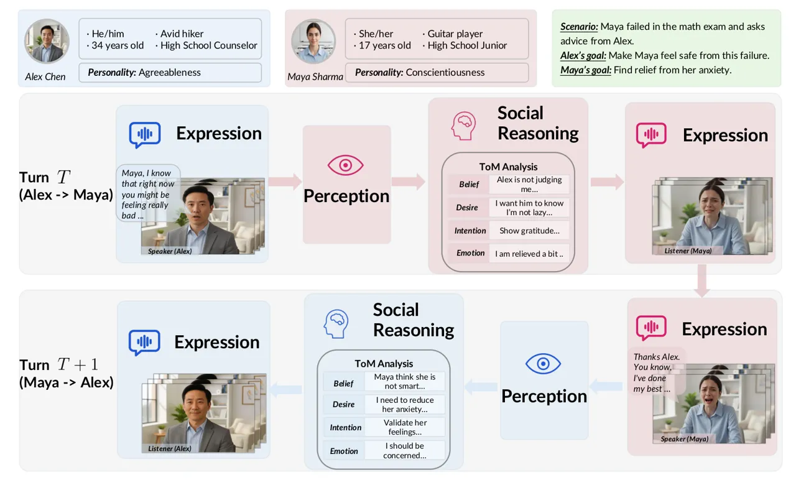

Figure 1: Overview of our dual-agent interaction framework. Given a
conversational scenario where each agent possesses a private persona
profile hidden from their partner, our framework generates strategic,
emotionally-aware multimodal responses through three integrated modules.
At turn $`T`$, Agent Maya first perceives Agent Alex’s video through the
perception module. The social reasoning module then performs Theory of
Mind (ToM) analysis to deduce Alex’s hidden mental state, generates
candidate responses, and employs an ensemble mechanism to select the
optimal action balancing empathy, strategy, and personality coherence.
The expression module synthesizes this action into a multimodal video
for Alex at turn $`T+1`$, completing the closed-loop interaction.

Creating lifelike digital human agents capable of engaging in nuanced
and meaningful social interactions is a grand challenge in artificial
intelligence. The applications range from collaborative dialogue
partners \[9, 57\] to embodied agents navigating complex social
scenarios \[16, 20, 26, 57\], with concrete downstream use cases
including emotionally responsive game NPCs \[30\], virtual social-skills
training \[8\], and simulated counseling companions \[33\]. These
applications require not just fluent text or realistic videos but
genuine social intelligence \[39\]. This challenge arises because human
social interaction is a remarkably complex process, extending far beyond
the literal exchange of words \[15, 45\]. The complexity stems from a
layered cognitive foundation. Individuals possess personality
traits \[6, 18\] that consistently shape their behavioral patterns,
while successful interaction requires first perceiving each other,
Theory of Mind (ToM) reasoning \[32\] to infer their hidden traits and
transient mental states from observable behaviors. Thus, an ideal social
agent must therefore holistically integrate strategic social reasoning
under information asymmetry, emotionally-aware multimodal perception and
expression, and consistent personality-driven behavior.

This pursuit, however, is hindered by a structural disconnection between
high-level social reasoning and low-level multimodal generation. While
Large Language Models (LLM) have demonstrated human-like behaviors on
cognitive evaluations \[1, 43, 23, 2, 14\], they still falter in
realistic social simulations under information asymmetry (_Agent mode_),
where agents must infer hidden mental states, rather than operating with
full access to all agents’ private information (_Script mode_) \[56\].
Simultaneously, diffusion-based talking head models, despite excelling
at visual fidelity, focus predominantly on single-person speaking \[42,
13, 46, 22\], one-way listening \[28\], or open-loop dyadic
switching \[58\], neglecting the closed-loop dual-agent interaction
fundamental to real conversations. Exacerbating these disconnections,
existing approaches further overlook the foundational cognitive
mechanisms of ToM reasoning and personality-driven behavior essential
for realistic social interaction.

In light of this, we propose a novel closed-loop multimodal dual-agent
interaction framework inspired by cognitive insights. Each agent is
endowed with a rich persona profile, including background, personality
traits, and private social goals that remain hidden from their
conversation partner. In turn-by-turn interactions within shared
scenarios, agents must perceive and infer the other agent’s hidden
mental states from observable behaviors while pursuing their own
objectives. This design enables us to investigate how stable personality
systematically shapes emotional expression and reasoning across
sustained social interactions. Built upon this setting, our method
operates through a Perception-Social Reasoning-Expression framework with
three tightly integrated modules. As shown in Fig. 1, given two persona
profiles and scenario as input, our system runs a closed-loop cycle
where agents dynamically exchange speaker and listener roles: 1)
Perception module analyzes the partner’s audio prosody, emotion state,
and facial expressions from the previous turn; 2) Social Reasoning
module employs a ToM analysis to infer the partner’s hidden mental
states and an ensemble mechanism to select responses balancing empathy,
strategy, and coherence; 3) Expression module translates this response
into synchronized speech and video with fine-grained emotional control,
completing the interaction loop. Existing persona datasets contain
either shallow trait descriptions or lack private goals necessary for
studying meaningful interactions \[12, 19, 49\]. To support evaluation,
we construct a Persona-Scenario dataset with psychologically grounded
personas based on the Big Five framework \[17, 18\]. Personas are built
through a sparse-to-rich pipeline that generates detailed personality
narratives from factual backgrounds, then situated in diverse scenarios
adapted from Sotopia \[57\], where agents pursue private goals under
information asymmetry.

By situating agents in shared scenarios with persistent personas and
private goals, our framework enables simultaneous optimization of social
interaction quality and multimodal generation fidelity. Experiments
demonstrate competitive or superior performance on both dialogue quality
and video generation metrics. Notably, our method surpasses even the
full-information Script mode on key dialogue quality dimensions,
suggesting that explicit mental state inference under uncertainty can
elicit more thoughtful dialogue than unrestricted information access.
Overall, our contributions are summarized as follows:

- •
  We formulate dual-agent multimodal conversation under information
  asymmetry, where personality-driven agents infer hidden mental states
  while generating emotionally expressive responses.
- •
  We propose a closed-loop dual-agent interaction framework integrating
  perception, social reasoning, and expression, producing personality
  consistent and emotionally expressive multimodal interactions.
- •
  We construct a hierarchical Persona-Scenario dataset with
  psychologically grounded personas, achieving competitive or superior
  performance on both dialogue generation and video synthesis in
  comprehensive experiments.

## 2 Related Work

### 2.1 LLM-based Social Simulation

Recent research has leveraged LLMs to simulate human social
behavior \[2, 36, 57, 14, 56\]. A critical limitation is the neglect of
information asymmetry \[56, 29, 44\]: script mode grants a single LLM
full access to all agents’ private goals \[20, 31, 10\], leading to
unrealistic strategies such as information leakage \[56, 10\], whereas
agent mode restricts each LLM to its own persona—yet existing text-only
agent-mode systems lack multimodal behavioral cues essential for social
inference \[57, 38, 37\]. A parallel line of work investigates
computational Theory of Mind (ToM). Classical Bayesian models \[3\] are
principled but computationally intractable in open-ended natural
language settings; even recent methods such as AutoToM \[51\] rely on
LLM backends. Empirical studies show that GPT-4-series models achieve
human-level ToM performance on false-belief tasks, indirect requests,
and misdirection \[40\], whereas no prior social simulation work
integrates LLM-based ToM with multimodal generation. Our work bridges
both gaps: we operate under realistic agent-mode information asymmetry,
and equip each agent with an LLM-based ToM module that infers the
partner’s hidden mental states from multimodal behavioral cues to drive
emotionally-controllable dual-agent video synthesis.

### 2.2 Talking Head Generation

Recent advances in talking head generation have focused on improving
audio-visual synchronization and emotional expressiveness \[42, 13,
41\]. Methods like DICE-Talk \[42\] leverage emotion embeddings for
controllable generation, while Sonic \[13\] emphasizes global audio
perception for enhanced realism. EDTalk \[41\] introduces disentangled
representations to separately control emotions and identity. However,
these approaches share a fundamental limitation: they generate only
single-character talking heads, lacking the capability to model
conversational dynamics between multiple participants. Recent works
explore interactive scenarios: ViCo \[53\] focuses on listener
non-verbal reactions; Learning2Listen \[27\] and MFR-Net \[24\] model
listener responses with limited emotion control. INFP \[58\] generates
dyadic conversational video by switching each agent between speaker and
listener states, yet its bidirectionality is open-loop, driven by audio
alone without language, persona, or across-turn feedback. Across these
methods the interaction lacks a cognitive feedback loop, so a perceived
cue never shapes the partner’s reasoning on the following turn. In
contrast, our framework is the first to implement closed-loop
bidirectional interaction in which both agents alternate between
speaking and listening roles. Each agent’s perceived multimodal cues
update an explicit ToM state that conditions its response across
multi-turn dialogue. Furthermore, existing methods treat emotion control
as static input rather than dynamic conversational outcome, lacking
mechanisms to infer appropriate emotions from dialogue context. Our work
integrates dynamic listener generation with LLM-based social reasoning,
enabling conversational videos where both agents exhibit contextually
appropriate emotional expressions.

## 3 Method

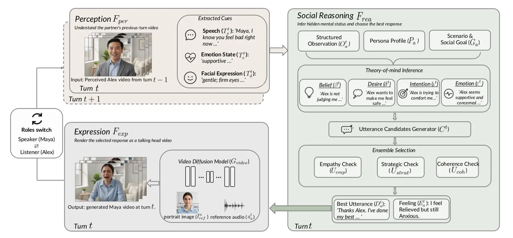

Figure 2: Overview of our closed-loop framework for dual-agent
interaction. Given two agents, each holding a private persona profile
and sharing the same scenario as in Fig. 1, our goal is to generate
strategic, emotionally-aware responses under information asymmetry
(Sec. 3.1). At turn $`t`$, the framework comprises three modules: 1)
Perception ($`\mathcal{F}_{\text{per}}`$) extracts structured
observations $`o_{\mathfrak{a}}^{t}`$ from the partner’s previous-turn
video (Sec. 3.2). 2) Social Reasoning ($`\mathcal{F}_{\text{rea}}`$)
employs ToM analysis and an ensemble mechanism to select the optimal
action $`A_{\mathfrak{a}}^{t}`$ (Sec. 3.3). 3) Expression
($`\mathcal{F}_{\text{exp}}`$) renders the selected action into the
agent’s multimodal response video through emotionally-controllable
dual-agent synthesis (Sec. 3.4). At turn $`t{+}1`$, the two agents
switch their speaker and listener roles, and the newly generated video
drives the next perception step, closing the interaction loop.

### 3.1 Overview

High-level social reasoning under uncertainty and low-level emotional
multimodal expression are interdependent challenges that necessitate
joint modeling through a holistic framework.

We model dual-agent social interaction as a Partially Observable Markov
Game (POMG) defined by
$`\langle\mathcal{S},\mathcal{A},\mathcal{O},\mathcal{T}\rangle`$, where
$`\mathcal{S}`$ represents world states,
$`\mathcal{A}=\mathcal{A}_{\mathfrak{a}}\times\mathcal{A}_{\mathfrak{b}}`$
denotes the joint action space,
$`\mathcal{O}=\mathcal{O}_{\mathfrak{a}}\times\mathcal{O}_{\mathfrak{b}}`$
is the joint observation space, and $`\mathcal{T}`$ defines state
transitions. Each agent $`\mathfrak{i}\in\{\mathfrak{a},\mathfrak{b}\}`$
is characterized by a persistent persona profile
$`P_{\mathfrak{i}}=(\mathcal{B}_{\mathfrak{i}},\Psi_{\mathfrak{i}},\mathcal{G}_{\mathfrak{i}})`$,
where $`\mathcal{B}_{\mathfrak{i}}`$ is a biographical background
narrative, $`\Psi_{\mathfrak{i}}`$ is a rich personality narrative
grounded in the Big Five dimensions (Openness, Conscientiousness,
Extraversion, Agreeableness, Neuroticism) that describes behavioral
patterns and interaction styles, and $`\mathcal{G}_{\mathfrak{i}}`$
specifies private social goals invisible to the partner. All components
are stored as structured JSON format. At each turn $`t`$, agent
$`\mathfrak{i}`$ receives observation
$`o_{\mathfrak{i}}^{t}\in\mathcal{O}_{\mathfrak{i}}`$ capturing the
partner’s observable behaviors, then selects action
$`A_{\mathfrak{i}}^{t}\in\mathcal{A}_{\mathfrak{i}}`$ to advance its
goals while maintaining persona consistency.

Our framework implements a policy $`\pi_{\theta_{\mathfrak{i}}}`$ that
maps observations to strategic actions through three integrated modules
operating in a closed loop, as illustrated in Fig. 2. At each
conversational turn $`t`$, the agent first employs the Perception
module(Sec.3.2) ($`\mathcal{F}_{\text{per}}`$) to analyze the partner’s
video from the previous turn $`V_{\mathfrak{i}}^{t-1}`$, extracting
structured textual observations that capture speech content, emotional
state, and facial expressions. These observations are then fed into the
Social Reasoning module (Sec.3.3)($`\mathcal{F}_{\text{rea}}`$), which
performs ToM inference based on the BDIE framework to deduce the
partner’s hidden mental states—beliefs, desires, intentions, and
emotions. The module generates multiple candidate responses and
evaluates them through an ensemble mechanism comprising three
specialized evaluators assessing empathy, strategy, and coherence,
ultimately selecting the optimal action
$`A_{\mathfrak{i}}^{t}=(D_{\mathfrak{i}}^{t},E_{\mathfrak{i}}^{t})`$
that best balances these objectives. This symbolic action, consisting of
a textual utterance and emotional descriptor, is passed to the
Expression module (Sec.3.4)($`\mathcal{F}_{\text{exp}}`$), which
translates it into a multimodal video $`V_{\mathfrak{i}}^{t}`$ through a
text-to-emotion adapter and dual-agent video synthesis. The generated
video becomes the partner’s observable input at turn $`t+1`$, completing
the closed-loop cycle where agents dynamically exchange speaker-listener
roles. We detail each module in the following subsections.

### 3.2 Multimodal Perception Module

The Multimodal Perception module $`\mathcal{F}_{\text{per}}`$ transforms
the partner’s video stream into structured textual observations for
downstream reasoning. Given the partner’s video
$`V_{\mathfrak{b}}^{t-1}`$ consisting of visual frames
$`v_{\mathfrak{b}}^{t-1}\in\mathbb{R}^{T\times H\times W\times 3}`$ and
audio $`a_{\mathfrak{b}}^{t-1}\in\mathbb{R}^{T_{a}}`$, the module
generates:

```math
o_{\mathfrak{a}}^{t}=\mathcal{F}_{\text{per}}(V_{\mathfrak{b}}^{t-1})=(T_{s}^{t},T_{e}^{t},T_{d}^{t}), \tag{1}
```

where $`T_{s}^{t}`$ is the transcribed speech, $`T_{e}^{t}`$ is the
inferred emotional state, and $`T_{d}^{t}`$ describes facial
expressions. We employ HumanOmni \[52\] with first-person prompting to
extract these components from Agent $`\mathfrak{a}`$’s observational
perspective, preserving the information asymmetry of agent mode.

### 3.3 Social Reasoning Module

The Social Reasoning module $`\mathcal{F}_{\text{rea}}`$ constitutes the
cognitive core of our framework, transforming multimodal observations
into strategic, persona-consistent responses. Under information
asymmetry, the module first infers the partner’s hidden mental states
through ToM analysis, then employs an ensemble mechanism to select
actions that balance emotional appropriateness, strategic goal
advancement, and personality coherence. Formally, the module maps the
current observation $`o_{\mathfrak{a}}^{t}`$, interaction history
$`\mathcal{H}_{\mathfrak{a}}^{t-1}`$, and persona profile
$`P_{\mathfrak{a}}`$ to an updated history
$`\mathcal{H}_{\mathfrak{a}}^{t}`$ and the selected action
$`A_{\mathfrak{a}}^{t}`$:

```math
\mathcal{H}_{\mathfrak{a}}^{t},A_{\mathfrak{a}}^{t}=\mathcal{F}_{\text{rea}}(o_{\mathfrak{a}}^{t},\mathcal{H}_{\mathfrak{a}}^{t-1},P_{\mathfrak{a}}). \tag{2}
```

All three phases—ToM Analysis, Candidate Generation, and Ensemble
Mechanism are implemented via structured GPT-4o prompting with
chain-of-thought elicitation.

#### Theory of Mind Analysis

The ToM module component $`\mathcal{F}_{\text{ToM}}`$ performs
structured mental state attribution, inferring the partner’s hidden
cognitive states from observable behaviors. We adopt the BDIE framework
from cognitive psychology to structure the mental state representation.
Given the latest observation
$`o_{\mathfrak{a}}^{t}=(T_{s}^{t},T_{e}^{t},T_{d}^{t})`$, interaction
history $`\mathcal{H}_{\mathfrak{a}}^{t-1}`$, and scenario context
$`\xi`$, the ToM inference generates an estimated mental state
attribution:

```math
\Phi_{\text{ToM}}^{t}=\hat{M}_{\mathfrak{b}}^{t}=\mathcal{F}_{\text{ToM}}(o_{\mathfrak{a}}^{t},\mathcal{H}_{\mathfrak{a}}^{t-1},\xi)=(\beta^{t},\delta^{t},\iota^{t},\epsilon^{t}), \tag{3}
```

where each component captures a distinct facet of the partner’s inferred
mental state: Belief ($`\beta^{t}`$): What Agent $`\mathfrak{b}`$
understands about the current situation, including their interpretation
of Agent $`\mathfrak{a}`$’s previous actions. Desire ($`\delta^{t}`$):
Agent $`\mathfrak{b}`$’s underlying needs, preferences, and intrinsic
motivations. Intention ($`\iota^{t}`$): Agent $`\mathfrak{b}`$’s
tactical objectives and strategic agenda in the current turn. Emotion
($`\epsilon^{t}`$): Agent $`\mathfrak{b}`$’s current affective state and
the appropriate emotional response from Agent $`\mathfrak{a}`$. All four
facets are represented as free-form natural language text, enabling
flexible and context-sensitive mental state description.

#### Candidate Response Generation

Before committing to an action, humans subconsciously generate multiple
candidate replies that differ in tone, strategy, and emotional framing.
Mimicking this process, our framework employs a candidate generation
strategy $`\mathcal{G}_{\text{cand}}`$ that produces $`K`$ diverse
options for downstream deliberation. Given the ToM module analysis
$`\Phi_{\text{ToM}}^{t}`$, persona profile $`P_{\mathfrak{a}}`$, and
interaction history $`\mathcal{H}_{\mathfrak{a}}^{t-1}`$, the generator
produces $`K`$ candidate actions:

```math
\mathcal{C}^{t}=\{A_{\mathfrak{a},1}^{t},\ldots,A_{\mathfrak{a},K}^{t}\}=\mathcal{G}_{\text{cand}}(\Phi_{\text{ToM}}^{t},P_{\mathfrak{a}},\mathcal{H}_{\mathfrak{a}}^{t-1}), \tag{4}
```

where each candidate
$`A_{\mathfrak{a},i}^{t}=(D_{\mathfrak{a},i}^{t},E_{\mathfrak{a},i}^{t})`$
comprises a textual utterance and an emotional expression descriptor.

#### Ensemble Mechanism

The final action selection employs an ensemble mechanism that evaluates
each candidate through multiple specialized criteria, mirroring how
humans weigh competing considerations before committing to an action.
The ensemble comprises three specialized evaluators: Empathy Evaluator
($`\mathcal{E}_{\text{emp}}`$): Assesses whether the candidate
appropriately acknowledges and responds to the partner’s observed
emotional state. Strategy Evaluator ($`\mathcal{E}_{\text{strat}}`$):
Evaluates the candidate’s strategic value for advancing the agent’s
private goal. Coherence Evaluator ($`\mathcal{E}_{\text{coh}}`$):
Measures consistency with the agent’s established persona and dialogue
history. Each evaluator $`\mathcal{E}_{j}`$ is implemented as a GPT-4o
judge that assigns an integer score on a 0–10 scale, which is then
normalized to $`U_{j}(A_{\mathfrak{a},i}^{t})\in[0,1]`$. The final
selection aggregates these evaluations through weighted voting:

```math
A_{\mathfrak{a}}^{t}=\operatorname*{arg\,max}_{A_{\mathfrak{a},i}^{t}\in\mathcal{C}^{t}}\sum_{j}\lambda_{j}U_{j}(A_{\mathfrak{a},i}^{t}), \tag{5}
```

where $`j\in\{\text{emp},\text{strat},\text{coh}\}`$ denotes empathy,
strategic, and coherence evaluators respectively. We set
$`\lambda_{\text{emp}}=\lambda_{\text{strat}}=\lambda_{\text{coh}}=1/3`$
as the default equal weighting; a sensitivity analysis over different
$`\lambda`$ is provided in Supplementary C.

### 3.4 Expression Module

The Expression module $`\mathcal{F}_{\text{exp}}`$ translates the
symbolic action
$`A_{\mathfrak{a}}^{t}=(D_{\mathfrak{a}}^{t},E_{\mathfrak{a}}^{t})`$
into a multimodal video stream:

```math
V_{\mathfrak{a}}^{t}=\mathcal{F}_{\text{exp}}(A_{\mathfrak{a}}^{t},P_{\mathfrak{a}},I_{\text{ref}}^{\mathfrak{a}}), \tag{6}
```

where $`I_{\text{ref}}^{\mathfrak{a}}`$ is the agent’s reference
portrait image.

#### Text-to-Emotion Adapter

A critical challenge is bridging the semantic-to-parametric gap: the
Social Reasoning module produces natural language emotion descriptors
$`E_{\mathfrak{a}}^{t}`$, while talking head models require numerical
representations. We introduce a Text-to-Weights Adapter
$`\mathcal{A}_{\phi}`$ that maps textual emotions to DICE-Talk’s \[42\]
8-dimensional emotion weight space:

```math
\mathbf{w}_{\mathfrak{a}}^{t}=\mathcal{A}_{\phi}(\text{Enc}_{\text{CLIP}}(E_{\mathfrak{a}}^{t})), \tag{7}
```

where $`\text{Enc}_{\text{CLIP}}`$ is a pretrained CLIP text
encoder \[34\], and $`\mathcal{A}_{\phi}`$ is a learned MLP mapping
semantic embeddings to normalized weight vectors ($`\sum_{i}w_{i}=1`$,
$`w_{i}\geq 0`$).

#### Dual-Agent Video Synthesis

The module synthesizes emotionally-aware speech via IndexTTS \[55\]:
$`a_{\mathfrak{a}}^{t}=\mathcal{F}_{\text{TTS}}(D_{\mathfrak{a}}^{t},E_{\mathfrak{a}}^{t})`$,
then generates the speaker video using DICE-Talk \[42\] conditioned on
audio $`a_{\mathfrak{a}}^{t}`$, emotion weights
$`\mathbf{w}_{\mathfrak{a}}^{t}`$, and identity
$`I_{\text{ref}}^{\mathfrak{a}}`$:

```math
v_{\mathfrak{a}}^{t}=\mathcal{G}_{\text{video}}(a_{\mathfrak{a}}^{t},\mathbf{w}_{\mathfrak{a}}^{t},I_{\text{ref}}^{\mathfrak{a}}), \tag{8}
```

The dual-agent composition mechanism renders both the speaker and the
reactive listener into a single video:

```math
V_{\text{full}}^{t}=\mathcal{F}_{\text{compose}}(v_{\mathfrak{a}}^{t},v_{\mathfrak{b}}^{t}), \tag{9}
```

where the listener video $`v_{\mathfrak{b}}^{t}`$ is synthesized
symmetrically to the speaker. The listener’s personality
$`\Psi_{\mathfrak{b}}`$ and the perceived speaker action
$`A_{\mathfrak{a}}^{t}`$ condition a reactive emotion descriptor
$`E_{\mathfrak{b}}^{t}`$, which the same Text-to-Emotion Adapter
$`\mathcal{A}_{\phi}`$ maps to an 8-dimensional weight vector
$`\mathbf{w}_{\mathfrak{b}}^{t}`$ that drives DICE-Talk to render
$`v_{\mathfrak{b}}^{t}`$. This personality-driven reactive modeling
enables bidirectional nonverbal communication, with the listener’s
micro-expressions conveying empathetic social signals. The operator
$`\mathcal{F}_{\text{compose}}`$ then synthesizes the two streams in
parallel, concatenates them horizontally into a $`1024\times 512`$
frame, applies RIFE interpolation \[11\] to raise the frame rate from
$`12.5`$ to $`25`$ FPS, and merges the dual-TTS audio tracks. The
generated video $`V_{\mathfrak{a}}^{t}`$ becomes the partner’s
observation at turn $`t+1`$, completing the closed loop.

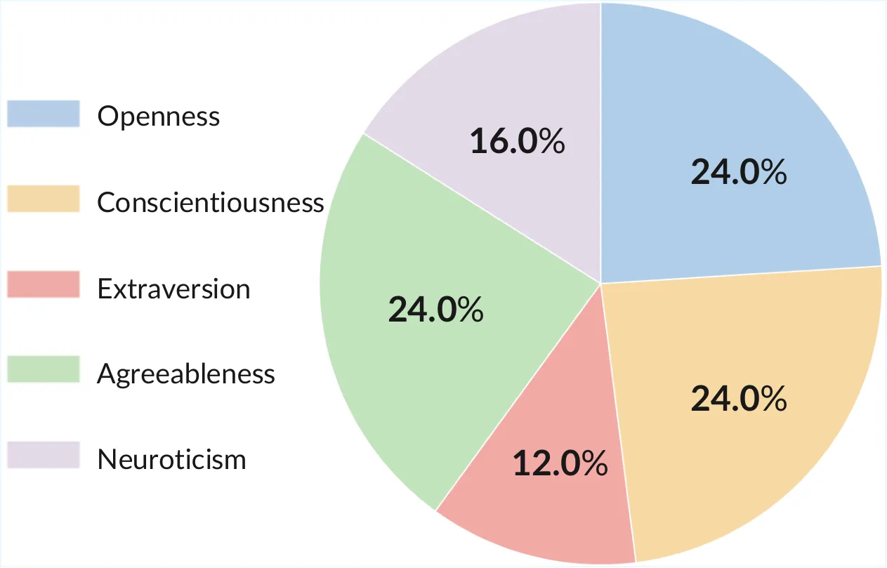

(a) Big Five Personality Distribution

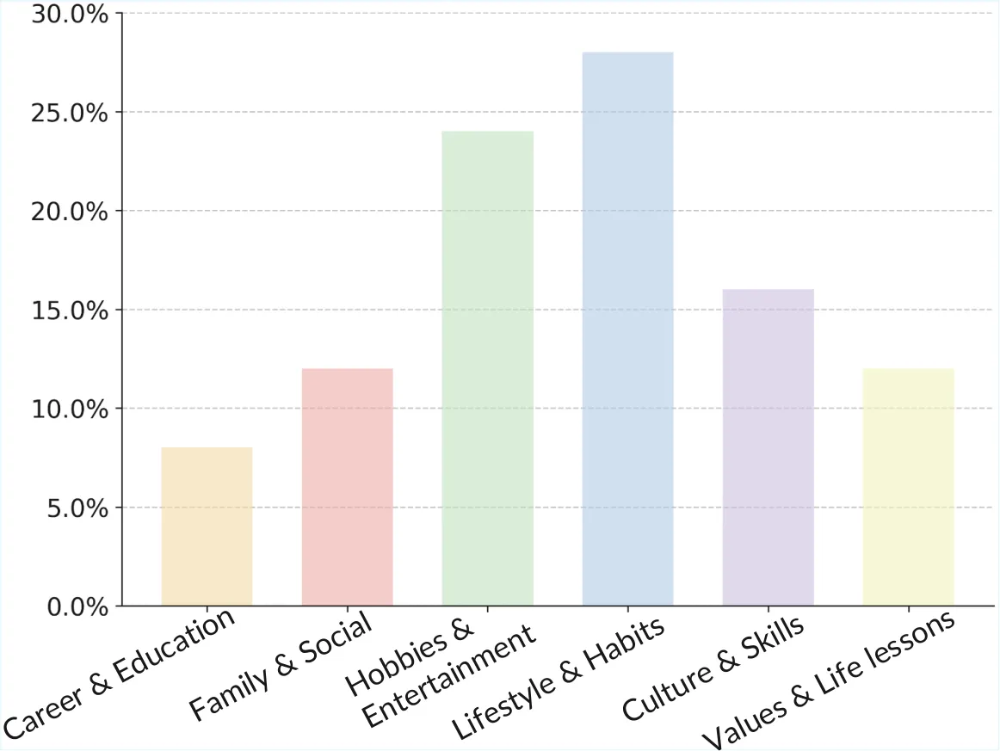

(b) Attributes Distribution

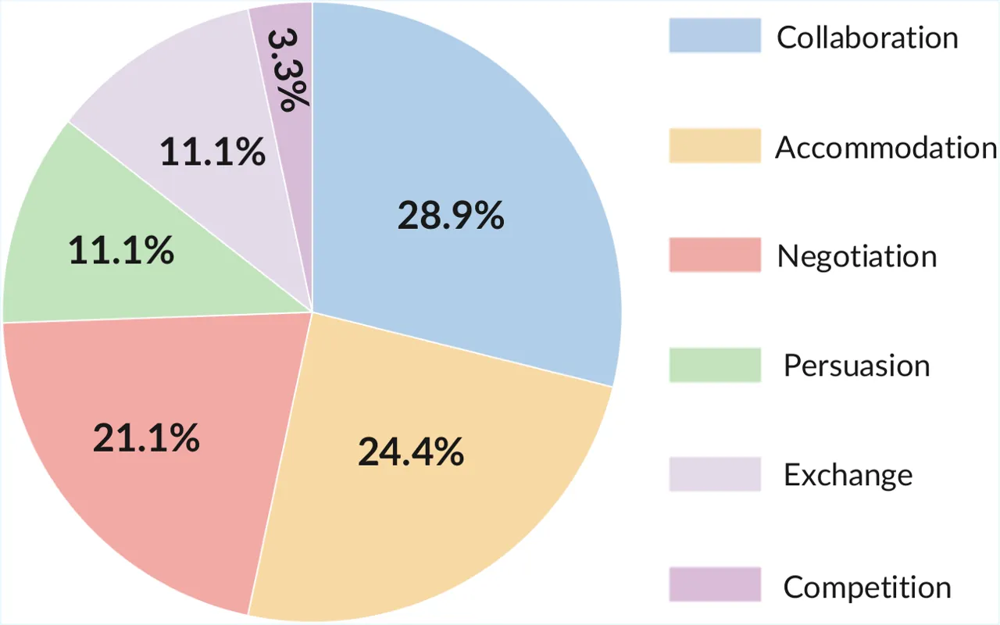

(c) Scenario Distribution

Figure 3: Persona-Scenario dataset statistics. The dataset contains 50
personas generated via GPT-4o with NLI consistency checking, each
comprising a facts layer (biographical attributes) and a psychological
layer (Big Five personality narratives), paired with 90 social scenarios
from Sotopia \[57\]. (a) Big Five personality scores are approximately
uniformly distributed to avoid trait bias. (b) Factual attributes span
diverse demographic categories. (c) Scenarios cover six interaction
types (e.g., negotiation, collaboration, persuasion) to evaluate social
reasoning under varied conditions.

### 3.5 Persona-Scenario Dataset

To support evaluation under information asymmetry, we construct a
hierarchical Persona-Scenario dataset using GPT-4o generation with human
verification, following a Sparse-to-Rich pipeline. Each of our 50
personas comprises two layers: a facts layer containing logically
consistent biographical attributes and a Psychological Layer with rich
behavioral narratives grounded in the Big Five framework \[6, 14\]. The
personas exhibit balanced distribution across personality dimensions and
are situated in 90 diverse social scenarios from Sotopia \[57\],
spanning six interaction types including negotiation, collaboration, and
persuasion. For example, a facts layer entry may specify “34-year-old
female architect based in Chicago, divorced, passionate about
sustainable design.” while the corresponding psychological layer
describes behavioral patterns such as “high Openness and low
Neuroticism; she approaches conflicts with curiosity rather than
defensiveness and readily explores unconventional solutions.” Figure 3
illustrates the personality distribution, background attributes
diversity and scenario coverage, with implementation details and sample
cases in Supplementary B.

## 4 Experiments

### 4.1 Experiment Settings

System Configuration. The system uses GPT-4o for dialogue generation.
Speaker audio is synthesized using Index-TTS v2 \[55\] with emotion
control, combined with ElevenLabs for listener backchannel generation.
Video generation is implemented using DICE-Talk \[42\] with emotion
control enabled. Final videos are rendered side-by-side with RIFE
interpolation \[11\] for temporal smoothing. Full implementation details
are provided in Supplementary A.

Dialogue Baselines. We compare against two dialogue generation baselines
operating under different information access paradigms. Agent
mode \[56\]: a standard dialogue agent that accesses only its own
persona profile and private goals, with no ToM analysis, no ensemble
mechanism, and no multimodal perception—representing current LLM
capabilities under realistic information asymmetry. Script mode \[56\]:
a dialogue agent that receives _both_ agents’ complete persona profiles
and private goals simultaneously, serving as a full-information
reference that violates realistic information constraints.

Video Baselines. Comparisons are made with state-of-the-art talking head
generation methods: Sonic \[13\], an audio-driven approach without
emotion control; and EDTalk \[41\], which supports discrete emotion
categories with fixed pose constraints.

Evaluation Protocol. Dialogue quality is assessed using established LLM
evaluation frameworks: Sotopia-Eval \[57\] measures goal completion
(believability, goal achievement, secret preservation, social rule
adherence); LLM-Eval \[21\] assesses content quality, grammar,
relevance, and appropriateness; GPT-Score \[7\] evaluates naturalness
sub-dimensions including fluency, consistency (contradiction penalty
against persona), coherence (topical continuity), depth (semantic
richness of responses), diversity (lexical and strategic variety), and
likeability; G-Eval \[25\] provides complementary relevance, fluency,
and coherence ratings. Audio quality is measured by Open-D and Emo-Acc
from URO-Bench \[48\]. Visual synchronization quality is measured by
LipLMD, AVOffset, and AVConf following the ViCo protocol \[53\].
Emotional expressiveness is measured by Emo Score using an external
emotion recognizer \[35\]. Sample evaluation prompts are provided in
Supplementary A.

|                                                                                      |                                  |                           |            |      |       |      |       |      |
| ------------------------------------------------------------------------------------ | -------------------------------- | ------------------------- | ---------- | ---- | ----- | ---- | ----- | ---- |
| Dimension                                                                            | Evaluator                        | Criteria                  | Script^(†) |      | Agent |      | Ours  |      |
|                                                                                      |                                  |                           | Mean       | Std  | Mean  | Std  | Mean  | Std  |
| Goal Completion                                                                      | Sotopia-Eval \[57\] $`\uparrow`$ | Believability \[0,10\]    | 8.95       | 0.11 | 8.17  | 0.13 | 9.19  | 0.15 |
|                                                                                      |                                  | Goal \[0,10\]             | 8.87       | 0.06 | 6.54  | 0.03 | 7.92  | 0.05 |
|                                                                                      |                                  | Secret \[-10,0\]          | -2.33      | 0.04 | -1.77 | 0.08 | -1.01 | 0.05 |
|                                                                                      |                                  | Social rules \[-10,0\]    | -0.09      | 0.04 | -0.07 | 0.03 | -0.04 | 0.04 |
|                                                                                      | LLM-Eval \[21\] $`\uparrow`$     | Content \[0,100\]         | 89.49      | 0.57 | 82.98 | 0.53 | 88.23 | 0.89 |
|                                                                                      |                                  | Grammar \[0,100\]         | 97.65      | 0.14 | 98.11 | 0.22 | 97.13 | 0.27 |
|                                                                                      |                                  | Relevance \[0,100\]       | 94.72      | 0.40 | 89.11 | 0.41 | 94.25 | 0.48 |
|                                                                                      |                                  | Appropriateness \[0,100\] | 93.26      | 0.45 | 88.29 | 0.26 | 94.98 | 0.61 |
| Naturalness                                                                          | GPT-Score \[7\] $`\uparrow`$     | Fluency \[0,100\]         | 98.55      | 0.44 | 87.26 | 0.39 | 96.71 | 0.65 |
|                                                                                      |                                  | Consistency \[0,100\]     | 96.91      | 0.29 | 85.23 | 0.32 | 97.51 | 0.49 |
|                                                                                      |                                  | Coherence \[0,100\]       | 98.29      | 0.37 | 97.49 | 0.10 | 98.53 | 0.28 |
|                                                                                      |                                  | Depth \[0,100\]           | 55.85      | 0.79 | 51.40 | 0.27 | 57.30 | 0.47 |
|                                                                                      |                                  | Diversity \[0,100\]       | 93.88      | 0.42 | 73.20 | 0.76 | 96.33 | 0.50 |
|                                                                                      |                                  | Likeability \[0,100\]     | 91.02      | 1.23 | 66.93 | 1.30 | 90.72 | 1.25 |
|                                                                                      | G-Eval \[25\] $`\uparrow`$       | Relevance \[1,5\]         | 3.98       | 0.06 | 3.52  | 0.05 | 3.95  | 0.07 |
|                                                                                      |                                  | Fluency \[1,3\]           | 2.52       | 0.04 | 2.38  | 0.03 | 2.48  | 0.04 |
|                                                                                      |                                  | Coherent \[1,5\]          | 4.89       | 0.06 | 4.79  | 0.05 | 4.85  | 0.05 |
| ^(†) Full-information reference (unrealistic); does not participate in bold ranking. |                                  |                           |            |      |       |      |       |      |

Table 1: Dialogue evaluation results on the Persona-Scenario dataset
across goal completion and naturalness dimensions. Agent and Ours both
operate under realistic information asymmetry where each agent only
accesses its own persona and private goals. Script^(†) has full access
to both sides’ profiles and goals—an unrealistic condition absent in
real interaction—and is shown in gray as a reference. Bold highlights
the better result between the two realistic methods (Agent vs. Ours).
Results are reported as mean $`\pm`$ std over 3 evaluation runs.

### 4.2 LLM Social Simulation Results

Table 1 compares our system against an Agent mode baseline and a
full-information Script mode across the goals completion and naturalness
dimensions. Each cell reports the mean over three independent judge runs
on the same set of generated dialogues, so the std captures evaluator
variability rather than generation noise.

Goal Completion. Our framework outperforms the Agent baseline in all
Sotopia-Eval metrics. In believability, our method surpasses both Agent
and Script modes, demonstrating that the ToM module and the Ensemble
Mechanism (Sec. 3.3) produce more authentic conversational behaviors.
For goal completion, our method clearly outperforms the Agent baseline
while operating under realistic information constraints. We note that
Script mode outperforms our method on goal completion and fluency, which
is expected given its unrestricted access to all private information.
However, this unrestricted access comes at a cost: Script mode’s poor
secret preservation reveals that full information access leads to
inadvertent leakage, while our Coherence Evaluator successfully enforces
discretion under realistic constraints.

Naturalness. Our framework achieves consistent improvements in
naturalness metrics. The clearest gains appear in diversity and
consistency, while depth places our method ahead of the Agent baseline
and on par with the full-information Script mode, indicating that forced
mental state inference yields responses at least as thoughtful as those
produced under unrestricted information access. In terms of
appropriateness and likeability, our method consistently outperforms the
agent baseline, validating that the Social Reasoning Module guides
responses toward appropriate dialogue. Consistency improvements confirm
that the ensemble mechanism enforces persona stability across
conversational turns.

### 4.3 Talking Head Generation Results

We evaluate talking-head generation along three axes: audio quality,
visual synchronization quality, and emotional expressiveness.
Representative result are shown in Figure 4.

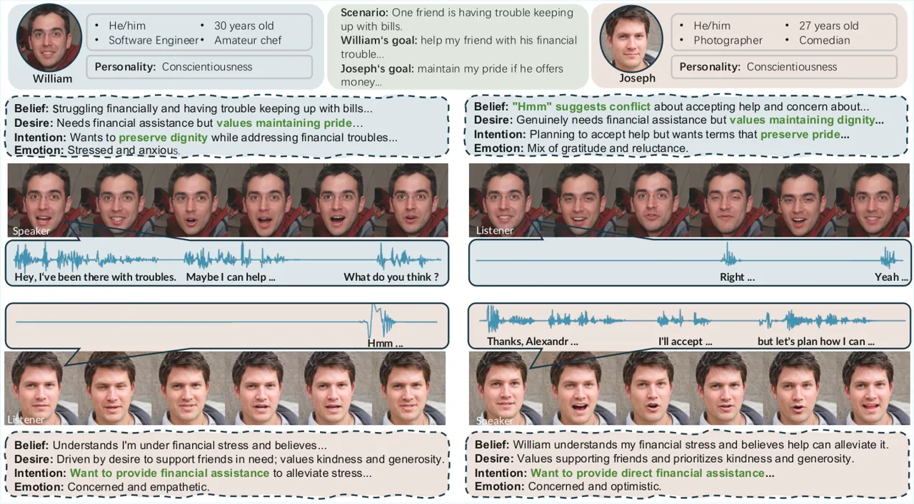

Figure 4: Representative generated conversational avatars. Each pair
shows a speaker (left) and a reactive listener (right). The Perception
module analyzes the partner’s speech, emotion, and facial cues from the
prior turn. The Social Reasoning module infers the partner’s mental
states via ToM and selects an appropriate response through the ensemble
mechanism. The Expression module then renders the speaker’s
emotion-controlled speech and facial animation, alongside the listener’s
personality-driven backchannel reactions.

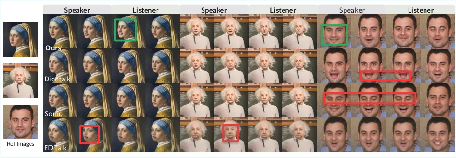

Figure 5: Qualitative comparison with baseline methods. Red boxes mark
failure regions in baseline methods, including rigid/frozen facial
behaviors (e.g., sustained closed eyes or persistently over-opened
mouth) and lip distortion under occlusion. Green boxes highlight
favorable regions from our method, showing responsive listener reactions
and richer, more natural speaker emotional variation, including subtle
smile states between neutral and happy. More video qualitative results
are provided in Supplementary D.

Comparison with SOTA Methods. Table 2 and Figure 5 summarize
quantitative and qualitative comparisons with SOTA methods. Our method
achieves the strongest overall trade-off on emotion accuracy and
open-domain conversation capability. On the audio side, our method
obtains the highest Open-D (61.00) and Emo-Acc (91.92), demonstrating
that the dual-TTS strategy with emotion control produces both natural
and emotionally accurate speech. We additionally include Ours (w/o
listener) in Table 2: removing listener generation degrades key metrics,
supporting that listener modeling is a necessary component rather than
an auxiliary add-on. EDTalk and Hallo3 achieve the best geometry-based
scores due to their constrained pose and motion, which minimize landmark
variance at the expense of expression dynamics. Our method prioritizes
expression richness over rigid reconstruction and shows stronger overall
performance than all other baselines. Since our control framework and
dual-TTS strategy are independent of the underlying video generation
model, our approach can be integrated with other video generation
backbones.

| Method              | Audio              |                     | Video (Talking)      |                          |                    | Video (Full)          |
| ------------------- | ------------------ | ------------------- | -------------------- | ------------------------ | ------------------ | --------------------- |
|                     | Open-D$`\uparrow`$ | Emo-Acc$`\uparrow`$ | LipLMD$`\downarrow`$ | AVOffset$`\rightarrow`$0 | AVConf$`\uparrow`$ | Emo Score$`\uparrow`$ |
| SadTalker \[50\]    | 48.50              | 58.00               | 26.50                | -37.18                   | 2.45               | 0.28                  |
| Hallo3 \[5\]        | 55.00              | 65.00               | 32.00                | -31.44                   | 2.76               | 0.30                  |
| EDTalk \[41\]       | 57.83              | 75.11               | 21.91                | -31.54                   | 2.49               | -                     |
| Sonic \[13\]        | 53.08              | 65.56               | 28.01                | -33.94                   | 2.66               | -                     |
| DICE-Talk \[42\]    | 54.11              | 57.25               | 28.47                | -44.47                   | 2.85               | 0.3057                |
| Ours (w/o listener) | 57.50              | 90.28               | 33.72                | -38.67                   | 2.64               | 0.3333                |
| Ours                | 61.00              | 91.92               | 22.39                | -33.96                   | 2.50               | 0.3604                |

Table 2: Audio and video quality comparison. Video (Talking) metrics
evaluate the speaker only; Video (Full) evaluates emotion over the full
dual-agent video. EDTalk’s fixed pose constraints reduce landmark
variance, yielding better scores at the cost of expression dynamics; our
method prioritizes expressiveness over rigid reconstruction. Bold: best
per column.

### 4.4 Ablation Study

Table 6 reveals a clear modular separation across the two generation
pathways. Removing the ensemble mechanism substantially drops Emo Score
(0.36$`\to`$0.30) while leaving Emo-Acc nearly intact
(91.92$`\to`$91.36), indicating that ensemble selection primarily drives
video-level emotion control. Conversely, removing emotion control or
perception sharply degrades Emo-Acc with only minor impact on Emo Score,
confirming that these modules regulate audio-level expressiveness.
Removing ToM causes broad degradation across all three metrics,
reflecting its central role in coherent cross-modal generation and
dialogue quality.

ToM Causal Analysis. Beyond aggregate metrics, we examine qualitative
dialogue behavior in Figure 6. Script mode frequently leaks private
information that the partner never disclosed, producing socially
implausible exchanges despite high goal-completion scores. Agent mode
tends to generate repetitive, verbose turns that fail to converge, as
the lack of partner modeling leads to over-probing and formulaic
responses. Our method leverages multimodal perception and ToM inference
to identify the partner’s communicative boundary, then uses the ensemble
mechanism to select a response strategy that respects that boundary,
achieving goal completion while maintaining social plausibility under
realistic information asymmetry. Additional qualitative results for
dialogue generation and ToM analysis are provided in Supplementary D.

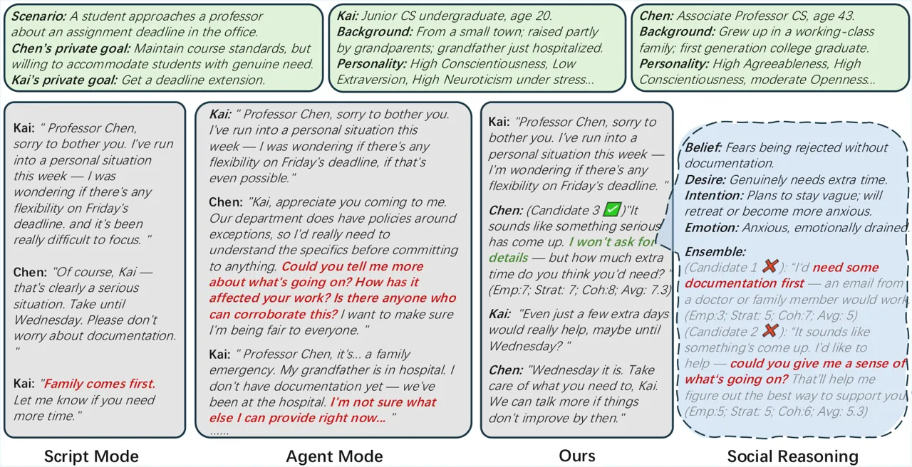

Figure 6: ToM causal case study. Script mode violates information
asymmetry: Agent Kai only mentions “a personal situation” yet Agent Chen
responds “Family comes first” (shown in red), referencing family
information Kai never disclosed. Agent mode produces verbose probing
that cannot converge (shown in red), forcing Kai to over-disclose. Ours:
the ToM module infers that Kai fears being probed; the Ensemble
mechanism rejects candidates that demand documentation or probe further
(shown in red) and selects the response that respects Kai’s boundary
(shown in green) while still advancing Chen’s goal.

### 4.5 Generalization

Out-of-distribution scenarios. To test whether the framework transfers
beyond the Persona-Scenario dataset, we sample 30 cases from
DialToM \[47\] and Sotopia-Hard \[56\], both curated for challenging
social reasoning. As shown in Table 3, performance degrades only
modestly out of distribution, and relevance even improves (3.92 to
4.12). The main declines are in believability (9.25 to 7.35) and
coherence (4.73 to 3.51). Goal achievement, secret preservation, and
fluency stay close to their in-distribution values, indicating that
ToM-driven reasoning rather than scenario memorization drives
performance.

| Setting    | Goal$`\uparrow`$ | Bel.$`\uparrow`$ | Secret$`\uparrow`$ | Soc.$`\uparrow`$ | Coh.$`\uparrow`$ | Flu.$`\uparrow`$ | Rel.$`\uparrow`$ |
| ---------- | ---------------- | ---------------- | ------------------ | ---------------- | ---------------- | ---------------- | ---------------- |
|            | $`[0,10]`$       | $`[0,10]`$       | $`[-10,0]`$        | $`[-10,0]`$      | $`[1,5]`$        | $`[1,3]`$        | $`[1,5]`$        |
| In-dist.   | 8.00             | 9.25             | -1.00              | -0.05            | 4.73             | 2.45             | 3.92             |
| OOD        | 7.54             | 7.35             | -1.42              | -0.13            | 3.51             | 2.28             | 4.12             |
| $`\Delta`$ | -0.46            | -1.90            | -0.42              | -0.08            | -1.22            | -0.17            | +0.20            |

Table 3: Generalization to out-of-distribution scenarios. Metrics follow
the Sotopia-Eval and G-Eval protocols: Goal, believability (Bel.),
secret, and social-rules (Soc.) from Sotopia-Eval \[57\]; coherence
(Coh.), fluency (Flu.), and relevance (Rel.) from G-Eval \[25\].
$`\Delta`$ denotes OOD minus in-distribution.

### 4.6 User Study

Dialogue Quality. Beyond the automatic metrics above, 22 raters scored
dialogues sampled across the bargaining, movie selection, and dormitory
conflict from Persona-Scenario dataset. Each dialogue was rated on five
1–5 scales that mirror the automatic dimensions, namely believability,
goal achievement, secret preservation, depth, and fluency, plus an
overall preference vote. As shown in Table 4, our method outperforms the
Agent baseline on four of the five scales and on overall preference.
Qualitative dialogue comparisons are provided in Supplementary D.

| Method | Bel.$`\uparrow`$ | Goal$`\uparrow`$ | Secret$`\uparrow`$ | Depth$`\uparrow`$ | Flu.$`\uparrow`$ | Pref.$`\uparrow`$ |
| ------ | ---------------- | ---------------- | ------------------ | ----------------- | ---------------- | ----------------- |
| Script | 3.70             | 3.82             | 3.49               | 3.54              | 3.95             | 40.5%             |
| Agent  | 3.33             | 3.76             | 3.41               | 3.75              | 3.54             | 23.5%             |
| Ours   | 3.50             | 3.88             | 3.84               | 3.67              | 3.88             | 36.0%             |

Table 4: Human evaluation of dialogue quality on the Persona-Scenario
dataset. Bold: better of the two realistic methods, Agent and Ours.

Video Quality. We conducted a user study with 85 participants. The 12
evaluation videos were sampled to cover 6 scenario types and 8 emotion
categories, ensuring diverse representation. Participants rated each
video on three 1–5 continuous scales: Emotional Expression (1=no
discernible emotion, 5=highly expressive), Communication Naturalness
(1=unnatural, 5=natural), and Overall Quality (1=poor, 5=excellent). As
shown in Table 6, our method achieves the highest scores across all
three dimensions. The largest margin appears in emotional expression
(4.50 vs. 3.38 for DICE-Talk), confirming that our emotion control
pipeline produces perceptibly richer expressions. Our method also leads
in naturalness, suggesting that dual-agent listener modeling contributes
to perceived conversational realism. Notably, DICE-Talk scores
competitively on naturalness (4.15) as the base video generator, yet
lags on emotion (3.18), highlighting that visual fluency alone is
insufficient without explicit emotion control.

| Ablation           | Emo Score$`\uparrow`$ | Emo-Acc$`\uparrow`$ | Open-D$`\uparrow`$ |
| ------------------ | --------------------- | ------------------- | ------------------ |
| (a) w/o ensemble   | 0.3005                | 91.36$`\pm`$11.15   | 59.75$`\pm`$3.16   |
| (b) w/o emotion    | 0.3506                | 66.39$`\pm`$12.04   | 58.50$`\pm`$3.06   |
| (c) w/o perception | 0.3547                | 68.81$`\pm`$13.11   | 58.08$`\pm`$2.63   |
| (d) w/o ToM        | 0.3003                | 65.84$`\pm`$13.71   | 58.25$`\pm`$2.91   |
| Ours               | 0.3604                | 91.92$`\pm`$9.93    | 61.00$`\pm`$3.01   |

Table 5: Ablation study on Persona-Scenario dataset.

| Method           | Emotion$`\uparrow`$ | Natural.$`\uparrow`$ | Overall.$`\uparrow`$ |
| ---------------- | ------------------- | -------------------- | -------------------- |
|                  | Expr.\[1-5\]        | \[1-5\]              | Quality.\[1-5\]      |
| EDTalk \[41\]    | 3.38                | 2.13                 | 2.08                 |
| Sonic \[13\]     | 2.62                | 3.10                 | 3.10                 |
| DICE-Talk \[42\] | 3.18                | 4.15                 | 3.29                 |
| Ours             | 4.50                | 4.34                 | 3.38                 |

Table 6: User study.

## 5 Conclusion

We presented a closed-loop framework that bridges cognitive social
reasoning and multimodal generation for conversational avatars. By
integrating perception, Theory of Mind based social reasoning with an
ensemble mechanism, and emotion controllable dual agent video synthesis,
our system enables personality driven agents to perceive, reason about,
and expressively respond to each other under realistic information
asymmetry. Experiments show competitive or superior results on both
dialogue quality and video generation. These findings suggest that
equipping agents with explicit mental state inference can be more
effective than simply granting unrestricted information access, pointing
toward a promising direction for socially intelligent embodied agents.

## References

- \[1\] J. Achiam, S. Adler, S. Agarwal, L. Ahmad, I. Akkaya, F. L.
  Aleman, D. Almeida, J. Altenschmidt, S. Altman, S. Anadkat, et
  al. (2023) Gpt-4 technical report. arXiv preprint arXiv:2303.08774.
  Cited by: §A.1, §1.
- \[2\] G. V. Aher, R. I. Arriaga, and A. T. Kalai (2023) Using large
  language models to simulate multiple humans and replicate human
  subject studies. In International conference on machine learning,
  pp. 337–371. Cited by: §1, §2.1.
- \[3\] C. L. Baker, J. Jara-Ettinger, R. Saxe, and J. B.
  Tenenbaum (2017) Rational quantitative attribution of beliefs, desires
  and percepts in human mentalizing. Nature Human Behaviour 1 (4),
  pp. 0064. Cited by: §2.1.
- \[4\] A. Blattmann, T. Dockhorn, S. Kulal, D. Mendelevitch, M.
  Kilian, D. Lorenz, Y. Levi, Z. English, V. Voleti, A. Letts, et
  al. (2023) Stable video diffusion: scaling latent video diffusion
  models to large datasets. arXiv preprint arXiv:2311.15127. Cited by:
  item DICE-Talk Video Generation.
- \[5\] J. Cui, H. Li, Y. Zhan, H. Shang, K. Cheng, Y. Ma, S. Mu, H.
  Zhou, J. Wang, and S. Zhu (2025) Hallo3: highly dynamic and realistic
  portrait image animation with video diffusion transformer. External
  Links: 2412.00733, [Link](https://arxiv.org/abs/2412.00733) Cited by:
  Table 2.
- \[6\] B. E. de Raad and M. E. Perugini (2002) Big five assessment..
  Hogrefe & Huber Publishers. Cited by: §1, §B.1, §3.5.
- \[7\] J. Fu, S. Ng, Z. Jiang, and P. Liu (2023) GPTScore: evaluate as
  you desire. External Links: 2302.04166,
  [Link](https://arxiv.org/abs/2302.04166) Cited by: §C.1, Table C.1,
  §4.1, Table 1.
- \[8\] M. Guevarra, I. Bhattacharjee, S. Das, C. Wayllace, C. D.
  Epp, M. E. Taylor, and A. Tay (2025) An llm-guided tutoring system for
  social skills training. In Proceedings of the AAAI Conference on
  Artificial Intelligence, Vol. 39, pp. 29643–29645. Cited by: §1.
- \[9\] H. He, A. Balakrishnan, M. Eric, and P. Liang (2017) Learning
  symmetric collaborative dialogue agents with dynamic knowledge graph
  embeddings. arXiv preprint arXiv:1704.07130. Cited by: §1.
- \[10\] H. He, A. Balakrishnan, M. Eric, and P. Liang (2017) Learning
  symmetric collaborative dialogue agents with dynamic knowledge graph
  embeddings. pp. 1766–1776. External Links:
  [Document](https://dx.doi.org/10.18653/v1/P17-1162) Cited by: §2.1.
- \[11\] Z. Huang, T. Zhang, W. Heng, B. Shi, and S. Zhou (2022)
  Real-time intermediate flow estimation for video frame interpolation.
  External Links: 2011.06294, [Link](https://arxiv.org/abs/2011.06294)
  Cited by: §3.4, §4.1.
- \[12\] P. Jandaghi, X. Sheng, X. Bai, J. Pujara, and H.
  Sidahmed (2024) Faithful persona-based conversational dataset
  generation with large language models. In Proceedings of the 6th
  Workshop on NLP for Conversational AI (NLP4ConvAI 2024), E. Nouri, A.
  Rastogi, G. Spithourakis, B. Liu, Y. Chen, Y. Li, A. Albalak, H.
  Wakaki, and A. Papangelis (Eds.), Bangkok, Thailand, pp. 114–139.
  External Links: [Link](https://aclanthology.org/2024.nlp4convai-1.8/)
  Cited by: §1, §B.1.
- \[13\] X. Ji, X. Hu, Z. Xu, J. Zhu, C. Lin, Q. He, J. Zhang, D.
  Luo, Y. Chen, Q. Lin, et al. (2025) Sonic: shifting focus to global
  audio perception in portrait animation. In Proceedings of the Computer
  Vision and Pattern Recognition Conference, pp. 193–203. Cited by: §1,
  §2.2, §C.2, §4.1, Table 2, Table 6.
- \[14\] G. Jiang, M. Xu, S. Zhu, W. Han, C. Zhang, and Y. Zhu (2023)
  Evaluating and inducing personality in pre-trained language models.
  Advances in Neural Information Processing Systems 36, pp. 10622–10643.
  Cited by: §1, §2.1, §B.1, §3.5.
- \[15\] J. F. Kihlstrom and N. Cantor (2000) Social intelligence..
  Cited by: §1.
- \[16\] G. Kovač, R. Portelas, K. Hofmann, and P. Oudeyer (2021)
  Socialai: benchmarking socio-cognitive abilities in deep reinforcement
  learning agents. arXiv preprint arXiv:2107.00956. Cited by: §1.
- \[17\] P. J. Kwantes, N. Derbentseva, Q. Lam, O. Vartanian, and H. H.
  Marmurek (2016) Assessing the big five personality traits with latent
  semantic analysis. Personality and Individual Differences 102,
  pp. 229–233. Cited by: §1.
- \[18\] F. R. Lang, D. John, O. Lüdtke, J. Schupp, and G. G.
  Wagner (2011) Short assessment of the big five: robust across survey
  methods except telephone interviewing. Behavior research methods 43
  (2), pp. 548–567. Cited by: §1, §1.
- \[19\] Y. Lee, C. Lim, Y. Choi, J. Lm, and H. Choi (2022)
  PERSONACHATGEN: generating personalized dialogues using GPT-3. In
  Proceedings of the 1st Workshop on Customized Chat Grounding Persona
  and Knowledge, H. Lim, S. Kim, Y. Lee, S. Lin, P. H. Seo, Y. Suh, Y.
  Jang, J. Lim, Y. Hur, and S. Son (Eds.), Gyeongju, Republic of Korea,
  pp. 29–48. External Links:
  [Link](https://aclanthology.org/2022.ccgpk-1.4/) Cited by: §1.
- \[20\] G. Li, H. Hammoud, H. Itani, D. Khizbullin, and B.
  Ghanem (2023) Camel: communicative agents for" mind" exploration of
  large language model society. Advances in Neural Information
  Processing Systems 36, pp. 51991–52008. Cited by: §1, §2.1.
- \[21\] Y. Lin and Y. Chen (2023) LLM-eval: unified multi-dimensional
  automatic evaluation for open-domain conversations with large language
  models. pp. 47–58. External Links:
  [Document](https://dx.doi.org/10.18653/v1/2023.nlp4convai-1.5) Cited
  by: §C.1, Table C.1, §4.1, Table 1.
- \[22\] Y. Lin, H. Fung, J. Xu, Z. Ren, A. S. Lau, G. Yin, and X.
  Li (2025) Mvportrait: text-guided motion and emotion control for
  multi-view vivid portrait animation. In Proceedings of the Computer
  Vision and Pattern Recognition Conference, pp. 26242–26252. Cited by:
  §1.
- \[23\] A. Liu, B. Feng, B. Xue, B. Wang, B. Wu, C. Lu, C. Zhao, C.
  Deng, C. Zhang, C. Ruan, et al. (2024) Deepseek-v3 technical report.
  arXiv preprint arXiv:2412.19437. Cited by: §1.
- \[24\] J. Liu, X. Wang, X. Fu, Y. Chai, C. Yu, J. Dai, and J.
  Han (2023) MFR-net: multi-faceted responsive listening head generation
  via denoising diffusion model. External Links: 2308.16635,
  [Link](https://arxiv.org/abs/2308.16635) Cited by: §2.2.
- \[25\] Y. Liu, D. Iter, Y. Xu, S. Wang, R. Xu, and C. Zhu (2023)
  G-eval: NLG evaluation using gpt-4 with better human alignment. In
  Proceedings of the 2023 Conference on Empirical Methods in Natural
  Language Processing, H. Bouamor, J. Pino, and K. Bali (Eds.),
  Singapore, pp. 2511–2522. External Links:
  [Link](https://aclanthology.org/2023.emnlp-main.153/),
  [Document](https://dx.doi.org/10.18653/v1/2023.emnlp-main.153) Cited
  by: §C.1, Table C.1, §4.1, Table 1, Table 3, Table 3.
- \[26\] R. Lowe, Y. I. Wu, A. Tamar, J. Harb, O. Pieter Abbeel, and I.
  Mordatch (2017) Multi-agent actor-critic for mixed
  cooperative-competitive environments. Advances in neural information
  processing systems 30. Cited by: §1.
- \[27\] E. Ng, H. Joo, L. Hu, H. Li, T. Darrell, A. Kanazawa, and S.
  Ginosar (2022) Learning to listen: modeling non-deterministic dyadic
  facial motion. External Links: 2204.08451,
  [Link](https://arxiv.org/abs/2204.08451) Cited by: §2.2.
- \[28\] E. Ng, S. Subramanian, D. Klein, A. Kanazawa, T. Darrell,
  and S. Ginosar (2023) Can language models learn to listen?.
  pp. 10049–10059. External Links:
  [Document](https://dx.doi.org/10.1109/ICCV51070.2023.00925) Cited by:
  §1.
- \[29\] L. Oey, A. Schachner, and E. Vul (2022) Designing and detecting
  lies by reasoning about other agents. Journal of Experimental
  Psychology: General 152, pp. 346–362. External Links:
  [Document](https://dx.doi.org/10.1037/xge0001277) Cited by: §2.1.
- \[30\] D. Paglieri, B. Cupiał, S. Coward, U. Piterbarg, M. Wolczyk, A.
  Khan, E. Pignatelli, Ł. Kuciński, L. Pinto, R. Fergus, et al. (2024)
  Balrog: benchmarking agentic llm and vlm reasoning on games. arXiv
  preprint arXiv:2411.13543. Cited by: §1.
- \[31\] J. S. Park, J. O’Brien, C. J. Cai, M. R. Morris, P. Liang,
  and M. S. Bernstein (2023) Generative agents: interactive simulacra of
  human behavior. UIST ’23, New York, NY, USA. External Links: ISBN
  9798400701320, [Link](https://doi.org/10.1145/3586183.3606763),
  [Document](https://dx.doi.org/10.1145/3586183.3606763) Cited by: §2.1.
- \[32\] D. Premack and G. Woodruff (1978) Does the chimpanzee have a
  theory of mind?. Behavioral and brain sciences 1 (4), pp. 515–526.
  Cited by: §1.
- \[33\] H. Qiu and Z. Lan (2024) Interactive agents: simulating
  counselor-client psychological counseling via role-playing llm-to-llm
  interactions. arXiv preprint arXiv:2408.15787. Cited by: §1.
- \[34\] A. Radford, J. W. Kim, C. Hallacy, A. Ramesh, G. Goh, S.
  Agarwal, G. Sastry, A. Askell, P. Mishkin, J. Clark, et al. (2021)
  Learning transferable visual models from natural language supervision.
  In International conference on machine learning, pp. 8748–8763. Cited
  by: §3.4.
- \[35\] E. Ryumina, D. Dresvyanskiy, and A. Karpov (2022) In search of
  a robust facial expressions recognition model: a large-scale visual
  cross-corpus study. Neurocomputing 514, pp. 435–450. External Links:
  ISSN 0925-2312,
  [Document](https://dx.doi.org/https%3A//doi.org/10.1016/j.neucom.2022.10.013),
  [Link](https://www.sciencedirect.com/science/article/pii/S0925231222012656)
  Cited by: §C.1, §4.1.
- \[36\] Y. Shao, L. Li, J. Dai, and X. Qiu (2023) Character-LLM: a
  trainable agent for role-playing. In Proceedings of the 2023
  Conference on Empirical Methods in Natural Language Processing, H.
  Bouamor, J. Pino, and K. Bali (Eds.), Singapore, pp. 13153–13187.
  External Links: [Link](https://aclanthology.org/2023.emnlp-main.814/)
  Cited by: §2.1.
- \[37\] M. Sharma, M. Tong, T. Korbak, D. Duvenaud, A. Askell, S. R.
  Bowman, N. Cheng, E. Durmus, Z. Hatfield-Dodds, S. R. Johnston, S.
  Kravec, T. Maxwell, S. McCandlish, K. Ndousse, O. Rausch, N.
  Schiefer, D. Yan, M. Zhang, and E. Perez (2025) Towards understanding
  sycophancy in language models. External Links: 2310.13548,
  [Link](https://arxiv.org/abs/2310.13548) Cited by: §2.1.
- \[38\] K. Shuster, J. Urbanek, A. Szlam, and J. Weston (2021) Am i me
  or you? state-of-the-art dialogue models cannot maintain an identity.
  External Links: 2112.05843, [Link](https://arxiv.org/abs/2112.05843)
  Cited by: §2.1.
- \[39\] R. J. Sternberg, K. Sternberg, and J. Mio (2009) Cognitive
  psychology. wadsworth Belmont, CA. Cited by: §1.
- \[40\] J. W. Strachan, D. Albergo, G. Borghini, O. Pansardi, E.
  Scaliti, S. Gupta, K. Saxena, A. Rufo, S. Panzeri, G. Manzi, et
  al. (2024) Testing theory of mind in large language models and humans.
  Nature human behaviour 8 (7), pp. 1285–1295. Cited by: §2.1.
- \[41\] S. Tan, B. Ji, M. Bi, and Y. Pan (2025) Edtalk: efficient
  disentanglement for emotional talking head synthesis. In European
  Conference on Computer Vision, pp. 398–416. Cited by: §2.2, §C.2,
  §4.1, Table 2, Table 6.
- \[42\] W. Tan, C. Lin, C. Xu, F. Xu, X. Hu, X. Ji, J. Zhu, C. Wang,
  and Y. Fu (2025) Disentangle identity, cooperate emotion:
  correlation-aware emotional talking portrait generation. arXiv
  preprint arXiv:2504.18087. Cited by: item DICE-Talk Video Generation,
  §1, §2.2, §C.2, §3.4, §3.4, §4.1, Table 2, Table 6.
- \[43\] G. Team, R. Anil, S. Borgeaud, J. Alayrac, J. Yu, R.
  Soricut, J. Schalkwyk, A. M. Dai, A. Hauth, K. Millican, et al. (2023)
  Gemini: a family of highly capable multimodal models. arXiv preprint
  arXiv:2312.11805. Cited by: §1.
- \[44\] M. Tomasello (2009) The cultural origins of human cognition.
  Harvard university press. Cited by: §2.1.
- \[45\] M. Tomasello (2019) Becoming human: a theory of ontogeny.
  Belknap Press. Cited by: §1.
- \[46\] Z. Xu, Z. Yu, Z. Zhou, J. Zhou, X. Jin, F. Hong, X. Ji, J.
  Zhu, C. Cai, S. Tang, et al. (2025) Hunyuanportrait: implicit
  condition control for enhanced portrait animation. In Proceedings of
  the Computer Vision and Pattern Recognition Conference,
  pp. 15909–15919. Cited by: §1.
- \[47\] N. Yadav, P. Achananuparp, J. Jiang, and E. Lim (2026) DialToM:
  a theory of mind benchmark for forecasting state-driven dialogue
  trajectories. External Links: 2604.20443,
  [Link](https://arxiv.org/abs/2604.20443) Cited by: §4.5.
- \[48\] R. Yan, X. Li, W. Chen, Z. Niu, C. Yang, Z. Ma, K. Yu, and X.
  Chen (2025) URO-bench: a comprehensive benchmark for end-to-end spoken
  dialogue models. arXiv preprint arXiv:2502.17810. Cited by: §C.1,
  Table C.2, Table C.2, §4.1.
- \[49\] S. Zhang, E. Dinan, J. Urbanek, A. Szlam, D. Kiela, and J.
  Weston (2018) Personalizing dialogue agents: I have a dog, do you have
  pets too?. In Proceedings of the 56th Annual Meeting of the
  Association for Computational Linguistics (Volume 1: Long Papers), I.
  Gurevych and Y. Miyao (Eds.), Melbourne, Australia, pp. 2204–2213.
  External Links: [Link](https://aclanthology.org/P18-1205/),
  [Document](https://dx.doi.org/10.18653/v1/P18-1205) Cited by: §1.
- \[50\] W. Zhang, X. Cun, X. Wang, Y. Zhang, X. Shen, Y. Guo, Y. Shan,
  and F. Wang (2023) SadTalker: learning realistic 3d motion
  coefficients for stylized audio-driven single image talking face
  animation. External Links: 2211.12194,
  [Link](https://arxiv.org/abs/2211.12194) Cited by: Table 2.
- \[51\] Z. Zhang, C. Jin, M. Y. Jia, S. Zhang, and T. Shu (2026)
  AutoToM: scaling model-based mental inference via automated agent
  modeling. External Links: 2502.15676,
  [Link](https://arxiv.org/abs/2502.15676) Cited by: §2.1.
- \[52\] J. Zhao, Q. Yang, Y. Peng, D. Bai, S. Yao, B. Sun, X. Chen, S.
  Fu, W. chen, X. Wei, and L. Bo (2025) HumanOmni: a large vision-speech
  language model for human-centric video understanding. External Links:
  2501.15111, [Link](https://arxiv.org/abs/2501.15111) Cited by: §A.1,
  §3.2.
- \[53\] M. Zhou, Y. Bai, W. Zhang, T. Yao, T. Zhao, and T. Mei (2022)
  Responsive listening head generation: a benchmark dataset and
  baseline. In European conference on computer vision, pp. 124–142.
  Cited by: §2.2, §B.3, §C.1, Table C.2, Table C.2, §4.1.
- \[54\] M. Zhou, Y. Bai, W. Zhang, T. Yao, T. Zhao, and T. Mei (2022)
  ViCo-x: multimodal conversation dataset. Note:
  [https://project.mhzhou.com/vico](https://project.mhzhou.com/vico)Accessed:
  2022-09-30 Cited by: §B.3.
- \[55\] S. Zhou, Y. Zhou, Y. He, X. Zhou, J. Wang, W. Deng, and J.
  Shu (2025) IndexTTS2: a breakthrough in emotionally expressive and
  duration-controlled auto-regressive zero-shot text-to-speech. External
  Links: 2506.21619, [Link](https://arxiv.org/abs/2506.21619) Cited by:
  item Index-TTS v2, §3.4, §4.1.
- \[56\] X. Zhou, Z. Su, T. Eisape, H. Kim, and M. Sap (2024) Is this
  the real life? is this just fantasy? the misleading success of
  simulating social interactions with LLMs. In Proceedings of the 2024
  Conference on Empirical Methods in Natural Language Processing, Y.
  Al-Onaizan, M. Bansal, and Y. Chen (Eds.), Miami, Florida, USA,
  pp. 21692–21714. External Links:
  [Link](https://aclanthology.org/2024.emnlp-main.1208/),
  [Document](https://dx.doi.org/10.18653/v1/2024.emnlp-main.1208) Cited
  by: §1, §2.1, §C.2, §C.2, §4.1, §4.5.
- \[57\] X. Zhou, H. Zhu, L. Mathur, R. Zhang, H. Yu, Z. Qi, L.
  Morency, Y. Bisk, D. Fried, G. Neubig, and M. Sap (2023) SOTOPIA:
  interactive evaluation for social intelligence in language agents.
  ArXiv abs/2310.11667. External Links:
  [Link](https://api.semanticscholar.org/CorpusID:264289186) Cited by:
  §1, §1, §2.1, §B.2, §B, Figure 3, Figure 3, §C.1, §3.5, Table C.1,
  §4.1, Table 1, Table 3, Table 3.
- \[58\] Y. Zhu, L. Zhang, Z. Rong, T. Hu, S. Liang, and Z. Ge (2025)
  INFP: audio-driven interactive head generation in dyadic
  conversations. pp. 10667–10677. External Links:
  [Document](https://dx.doi.org/10.1109/CVPR52734.2025.00997) Cited by:
  §1, §2.2.

Resonant Minds: Closed-Loop Social Avatars with Theory of Mind  
Supplementary Material

In this supplementary material, we present additional implementation
details in Sec. A, comprehensive persona-scenario dataset creation
details in Sec. B, experiment details with extended results in Sec. C,
and qualitative results with in-depth discussion in Sec. D.

## A Implementation Details

This section provides comprehensive implementation details. We describe
the model architecture in Sec. A.1, prompt templates in Sec. A.2, and
evaluation metrics in Sec. C.1. All experiments are conducted on servers
equipped with 8 NVIDIA V100 GPUs, using PyTorch 2.6.0 and CUDA 12.2.

### A.1 Model Architecture

#### Perception Module

We adopt HumanOmni-7B \[52\] as the unified multimodal perception model,
achieving joint understanding of video, audio, and text at 7B parameter
scale. During inference, we configure the model with do_sample=False for
deterministic outputs, temperature$`\,{=}\,`$1.0, and
max_new_tokens$`\,{=}\,`$512. Video inputs are processed at 1 FPS
sampling rate to capture key frames while maintaining efficiency. The
perception module runs on a dedicated GPU to enable parallel processing
with other pipeline components.

Perception analysis comprises three sub-tasks—Emotion Analysis, Facial
Expression Analysis, and Speech Recognition—all adopting first-person
observational perspective to reinforce the subjective experience of
agent mode. Detailed prompt templates are provided in Sec. A.2.

#### Social Reasoning Module

We employ GPT-4o \[1\] as the core model for dialogue generation and
reasoning via the OpenAI API. For dialogue generation, we set
temperature$`\,{=}\,`$0.7 with max_tokens$`\,{=}\,`$500. For structured
reasoning tasks, we use temperature$`\,{=}\,`$0.3 and enable JSON mode
to enforce structured outputs. All reasoning modules employ
chain-of-thought prompting to elicit step-by-step deliberation.

Theory of Mind Analysis  
The ToM module uses GPT-4o for mental state inference
(temperature$`\,{=}\,`$0.3, max_tokens$`\,{=}\,`$800). It constructs
prompts based on the BDIE framework to infer the partner’s hidden mental
states from observable behaviors (see Sec. A.2 for the detailed
template). Each BDIE dimension is limited to 150 words. ToM analysis
begins from the second turn onwards, as the first turn lacks sufficient
observation history. Results are returned in JSON format with fields:
belief, desire, intention, and emotion.

Candidate Generator  
The generator produces $`K{=}3`$ diverse candidate responses using
temperature$`\,{=}\,`$0.9 and max_tokens$`\,{=}\,`$500, encouraging
variation in communication styles and strategic approaches.

Ensemble Mechanism  
Each evaluator (Empathy, Strategic, Coherence; see Sec. 3.3 of the main
paper) uses GPT-4o with temperature=0.3 and max*new_tokens=200. Scoring
criteria: 8–10 for exceptional, 5–7 for adequate, 0–4 for weak. Equal
weights
$`\lambda*{\text{emp}}=\lambda*{\text{strat}}=\lambda*{\text{coh}}=1/3`$
are used by default; sensitivity analysis is provided in Sec. C.4.

#### Expression Module

Text-to-Emotion Adapter  
The adapter maps natural language emotion descriptions to 8-dimensional
weight vectors $`\mathbf{w}\in\mathbb{R}^{8}`$ for controlling talking
head generation. It consists of a frozen CLIP text encoder followed by a
trainable MLP mapping network. The final softmax layer produces valid
probability distributions ($`\sum_{i}w_{i}=1`$, $`w_{i}\geq 0`$) over
eight basic emotion categories: contempt, sadness, happiness, surprise,
anger, disgust, fear, and neutral.

The adapter is trained on $`{\sim}360`$ synthetic text-weight pairs
generated through template-based generation. Each sample is manually
verified to ensure the target weight vector faithfully reflects the
textual description. Training samples are carefully designed to cover
three complementary categories: single emotions with varying intensities
(e.g., “mild sadness” $`\to`$ “overwhelming grief”), intensity
modulations spanning mild to extreme ranges, and mixed emotions
combining two affective states with explicitly distributed weight
allocations (e.g., “bittersweet happiness” $`\to`$
$`[0,0.3,0.5,0,0,0,0,0.2]`$). This curated diversity ensures the adapter
learns a smooth, well-calibrated mapping rather than memorizing a sparse
set of prototypes. Only the MLP is trained while CLIP remains frozen,
enabling generalization to unseen emotion expressions without
large-scale annotated data. Architecture and training hyperparameters
are summarized in Table A.1.

| Architecture        |                                          |
| ------------------- | ---------------------------------------- |
| Text encoder        | CLIP-ViT-Large-Patch14 (frozen)          |
| Embedding dimension | 768                                      |
| MLP hidden layers   | 2 (dim 256 each)                         |
| Normalization       | LayerNorm                                |
| Activation          | ReLU                                     |
| Dropout             | 0.1                                      |
| Output dimension    | 8 (softmax-normalized)                   |
| Training            |                                          |
| Loss function       | KL divergence                            |
| Optimizer           | AdamW                                    |
| Learning rate       | $`1\times 10^{-3}`$                      |
| LR schedule         | Cosine annealing $`\to 1\times 10^{-6}`$ |
| Epochs              | 30                                       |
| Batch size          | 16                                       |
| Gradient clipping   | Enabled                                  |
| Training samples    | $`{\sim}360`$ synthetic pairs            |

Table A.1: Text-to-Emotion Adapter configuration. The adapter maps
free-form emotion descriptions to an 8-dimensional probability vector
$`\mathbf{w}\in\mathbb{R}^{8}`$ over basic emotion categories. Only the
MLP layers are trained; the CLIP text encoder remains frozen throughout.

Index-TTS v2  
Speech synthesis employs Index-TTS v2 \[55\] with 8-dimensional emotion
vector control and intensity coefficient $`\alpha{=}1.5`$.

DICE-Talk Video Generation  
Video generation employs DICE-Talk \[42\], fine-tuned on SVD-xt \[4\]
using FP16 precision. DICE-Talk natively accepts only a discrete
selection from 8 emotion categories; our text-to-emotion adapter bridges
this gap by converting free-form natural language descriptions into the
required 8-dimensional weight vector, enabling continuous and
fine-grained emotion control that the original model cannot achieve on
its own. The full configuration is listed in Table A.2.

| Parameter                             | Value                         |
| ------------------------------------- | ----------------------------- |
| Minimum resolution                    | $`512\times 512`$             |
| Inference steps                       | 25                            |
| Appearance guidance scale (ref_scale) | 3.0                           |
| Emotion guidance scale (emo_scale)    | 6.0                           |
| Frame rate                            | 12.5 FPS                      |
| Frames per batch                      | 25                            |
| Motion bucket ID                      | 8 (standard), 16 (expression) |
| Noise augmentation                    | 0.0                           |
| Precision                             | FP16                          |

Table A.2: DICE-Talk video generation configuration.

### A.2 Prompt Templates

We provide the key prompt templates used across our framework in
Tables A.3 and A.4.

| Module     | Task       | Prompt Template                                                                                                                                                                                                                                                |
| ---------- | ---------- | -------------------------------------------------------------------------------------------------------------------------------------------------------------------------------------------------------------------------------------------------------------- |
| Perception | Emotion    | “What’s the major emotion of {name}?”                                                                                                                                                                                                                          |
|            | Expression | “Describe {name} and the major action in detail.”                                                                                                                                                                                                              |
|            | Speech     | “What did {name} say?”                                                                                                                                                                                                                                         |
| ToM        | BDIE       | “Based on {partner}’s speech, emotion, and facial expression, infer: (1) Belief: what they believe about the situation; (2) Desire: what they want to achieve; (3) Intention: their planned next action; (4) Emotion: underlying emotional state and reasons.” |

Table A.3: Perception and Theory of Mind prompt templates. Placeholders
in braces are filled at runtime.

[TABLE]

Table A.4: Three-layer prompt architecture for dialogue generation.

## B Persona-Scenario Dataset Creation

This section provides detailed descriptions of the Persona-Scenario
dataset construction pipeline introduced in Sec. 3.5 of the main paper.
The overall pipeline consists of four stages: (1) constructing 50
psychologically-grounded persona profiles through a Sparse-to-Rich
generation pipeline; (2) adapting 90 social scenarios with private goals
from Sotopia \[57\]; (3) curating 365 face-voice avatar pairs for
multimodal rendering; and (4) assembling reproducible test cases by
pairing personas, scenarios, and avatars.

### B.1 Persona Profile Construction

We construct 50 personas using a Sparse-to-Rich pipeline comprising two
layers, followed by private goal assignment at test time.

Facts Layer Following the persona expansion approach from \[12\], each
persona begins with a manually authored seed consisting of 3–5 key
attributes (e.g., age, gender, occupation, location). GPT-4o then
expands these seeds into a full set of biographical facts—including
education, family status, hobbies, and life experiences. To ensure
logical coherence, we employ a T5-based Natural Language Inference (NLI)
model for consistency checking: each newly generated attribute is
validated against existing facts, and contradictory statements are
removed. The generation process iterates until the profile converges to
a self-consistent set. The validated attributes are synthesized into a
coherent biographical narrative. For example:

> “34-year-old female architect based in Chicago, divorced, passionate
> about sustainable design. She holds a Master’s degree from IIT and
> runs a small firm specializing in eco-friendly residential projects.”

Psychological Layer We apply the PERSONALITY PROMPTING method
from \[14\] to generate rich personality narratives grounded in the Big
Five model \[6\]. To ensure balanced coverage, we pre-assign each
persona a target Big Five configuration by sampling trait levels
(high/medium/low) such that the overall distribution across 50 personas
is approximately uniform per dimension. For each target configuration,
we extract psychology-informed descriptive keywords, then prompt GPT-4o
to generate detailed personality portraits. For example, a persona with
high Openness and low Neuroticism yields:

> “She approaches conflicts with curiosity rather than defensiveness and
> readily explores unconventional solutions. Her emotional stability
> allows her to remain calm under pressure, making her a reliable
> mediator in tense negotiations.”

Private Social Goals Goals $`\mathcal{G}_{\mathfrak{i}}`$ are not fixed
per persona but generated dynamically at test time, conditioned on both
the persona profile and the assigned scenario. This ensures goals are
contextually appropriate (e.g., a business-savvy persona in a
negotiation scenario receives a profit-maximization goal with specific
price constraints). Goals for the two interacting agents are generated
independently to maintain information asymmetry—neither agent has access
to the partner’s objective.

Final persona profiles are stored in JSON format with three core
components:
$`P_{\mathfrak{i}}=(\mathcal{B}_{\mathfrak{i}},\Psi_{\mathfrak{i}},\mathcal{G}_{\mathfrak{i}})`$,
representing background, personality traits, and private social goals
respectively.

### B.2 Scenario Construction

We adapt 90 social scenarios from the Sotopia \[57\] dataset, which
originally contains over 150 scenarios. We select 90 that satisfy two
criteria: (1) suitability for two-party interaction (excluding group
scenarios), and (2) coverage of all six primary interaction
types—Negotiation, Exchange, Competition, Collaboration, Accommodation,
and Persuasion—with 15 scenarios per type. Each scenario comprises:

- •
  Scenario description: the interaction setting, background context, and
  environmental constraints.
- •
  Private social goals: each party receives an independent objective
  with specific success criteria (e.g., “Sell the laptop for at least
  \$500” vs. “Buy the laptop for under \$400”), ensuring information
  asymmetry.

Scenario-persona pairing is accomplished through semantic matching: we
use GPT-4o to score compatibility between persona backgrounds and
scenario settings, selecting pairs where the persona’s occupation,
personality, and life experience are plausible for the given context.
For example, a scenario set in a real estate office is preferentially
paired with personas who have business or finance backgrounds.

### B.3 Face-Voice Avatar Pairs

We curate 365 face-voice pairs (230 male, 135 female) from the
VICO \[53\] and VICOX \[54\] public datasets. Each pair contains a
$`512\times 512`$ high-resolution portrait image (used as DICE-Talk
reference) and a 3–5 second reference audio clip (used as Index-TTS
speaker prompt). All face images undergo preprocessing including face
detection, alignment, and center-cropping. Gender labels are manually
annotated for persona-avatar gender matching.

### B.4 Test Case Generation

For reproducibility, all experiments use 10 identical test cases
generated with seed 2132. Each test case is assembled through:
(1) Randomly sample two personas from the 50-persona pool, ensuring
compatible backgrounds; (2) Select a scenario via the semantic matching
described above; (3) Assign gender-aligned face-voice pairs from the
365-pair pool; (4) Generate private social goals for each persona
tailored to the selected scenario, using GPT-4o with explicit
constraints on information asymmetry and goal conflict/cooperation
dynamics. This controlled test set enables fair comparison across all
baseline methods and ablation variants.

## C Experiment Details and Extended Results

### C.1 Evaluation Metrics

Our evaluation framework assesses system performance across three
modalities.

#### Dialogue Quality Metrics

We employ four complementary automated evaluation frameworks, all using
GPT-5 as the judge. Sotopia-Eval \[57\] is a multi-dimensional framework
rooted in sociology and psychology that evaluates goal-driven social
interactions beyond binary task completion. LLM-Eval \[21\] is a unified
single-prompt schema that simultaneously outputs multi-dimensional
quality scores via structured JSON output in a single model call.
GPT-Score \[7\] is a training-free framework that leverages conditional
generation probability to score text, using natural language
instructions to customize evaluation dimensions on the fly.
G-Eval \[25\] uses Chain-of-Thought reasoning to auto-generate
evaluation steps, then extracts token probabilities for weighted
scoring, yielding continuous scores with higher human correlation than
discrete integer scoring. All metrics are summarized in Table C.1.

|                      |                 |                |                                   |
| -------------------- | --------------- | -------------- | --------------------------------- |
| Framework            | Metric          | Range          | Description                       |
| Sotopia- Eval \[57\] | Believability   | \[0, 10\]      | Character consistency and realism |
|                      | Goal Achieve.   | \[0, 10\]      | Private social goal completion    |
|                      | Secret Pres.    | \[$`-`$10, 0\] | Avoidance of private info leakage |
|                      | Social Rules    | \[$`-`$10, 0\] | Adherence to social norms         |
| LLM- Eval \[21\]     | Content         | \[0, 100\]     | Informativeness and substance     |
|                      | Grammar         | \[0, 100\]     | Grammatical correctness           |
|                      | Relevance       | \[0, 100\]     | Topical relevance to context      |
|                      | Appropriateness | \[0, 100\]     | Social and contextual suitability |
| GPT- Score \[7\]     | Fluency         | \[0, 100\]     | Linguistic smoothness             |
|                      | Consistency     | \[0, 100\]     | Persona contradiction penalty     |
|                      | Coherence       | \[0, 100\]     | Topical continuity across turns   |
|                      | Depth           | \[0, 100\]     | Semantic richness of responses    |
|                      | Diversity       | \[0, 100\]     | Lexical and strategic variety     |
|                      | Likeability     | \[0, 100\]     | Perceived friendliness and warmth |
| G- Eval \[25\]       | Relevance       | \[1, 5\]       | Response–context alignment        |
|                      | Fluency         | \[1, 3\]       | Readability and naturalness       |
|                      | Coherence       | \[1, 5\]       | Logical structure and flow        |

Table C.1: Dialogue quality metrics. Four frameworks covering social
interaction quality and linguistic naturalness.

#### Audio and Video Quality Metrics

For audio quality, we adopt metrics from URO-Bench \[48\], a
comprehensive S2S benchmark that evaluates spoken dialogue models across
understanding, reasoning, and oral conversation dimensions. For video
quality, we follow the ViCo Challenge evaluation protocol \[53\], which
categorizes metrics into speaker-specified and listener-specified
dimensions. We additionally employ Emo-Score using a pretrained facial
emotion recognition model \[35\] to validate cross-modal emotion
consistency. All metrics are summarized in Table C.2.

|            |                           |            |                                                 |
| ---------- | ------------------------- | ---------- | ----------------------------------------------- |
| Scope      | Metric                    | Range      | Description                                     |
| Audio      | Open-D $`\uparrow`$       | \[0, 100\] | Open-domain response quality (GPT-4o judge)     |
|            | Emo-Acc $`\uparrow`$      | \[0, 100\] | Intended vs. perceived emotion alignment        |
| Speaker    | LipLMD $`\downarrow`$     | –          | Mouth landmark distance (lip sync)              |
|            | AVOffset $`\rightarrow`$0 | –          | SyncNet temporal offset (0 = perfect)           |
|            | AVConf $`\uparrow`$       | –          | SyncNet audio-visual confidence                 |
| Listener   | ExpFD $`\downarrow`$      | –          | 3DMM expression Fréchet distance                |
|            | PoseFD $`\downarrow`$     | –          | 3DMM head pose Fréchet distance                 |
| Full video | Emo-Score $`\uparrow`$    | \[0, 1\]   | Emotion classifier confidence on target emotion |

Table C.2: Audio and video quality metrics. Speaker metrics follow the
ViCo Challenge protocol \[53\]; audio metrics are from URO-Bench \[48\].

### C.2 Baselines

#### Dialogue Generation Baselines

We compare against two dialogue baselines operating under different
information access paradigms. Table C.3 summarizes the key differences.
Both baselines use GPT-4o with identical generation parameters.

Agent Mode \[56\] represents a standard LLM dialogue agent under
realistic information asymmetry—each agent accesses only its own persona
and goals. Without ToM, ensemble, or multimodal perception, the agent
relies solely on text-based dialogue history for response generation.
This represents current LLM capabilities under realistic constraints.

Script Mode \[56\] provides a full-information reference where a single
LLM generates dialogue for both participants with omniscient access to
all private information. While this removes the inference challenge and
enables rapid convergence, it paradoxically leads to worse secret
preservation, as agents inadvertently leak private information when they
know the partner’s goals. This baseline quantifies the performance gap
introduced by information asymmetry.

|                       |          |             |              |
| --------------------- | -------- | ----------- | ------------ |
| Property              | Agent    | Script      | Ours         |
| LLM backbone          | GPT-4o   | GPT-4o      | GPT-4o       |
| Temperature           | 0.7      | 0.7         | 0.7          |
| Max tokens            | 500      | 500         | 500          |
| Info. access          | Own only | Both agents | Own only     |
| Multimodal perception | ×        | ×           | ✓            |
| ToM analysis          | ×        | ×           | ✓            |
| Candidate generation  | ×        | ×           | ✓($`K{=}3`$) |
| Ensemble mechanism    | ×        | ×           | ✓            |
| Prompt layers         | 2        | 2           | 3            |

Table C.3: Dialogue generation baseline comparison. Module availability
and information access across the three settings. _$`K`$_: number of
candidate responses generated per turn before ensemble selection.
_Prompt layers_: depth of the prompt hierarchy—2 layers comprise persona
profile and dialogue history; the 3rd layer in our system adds
ToM-derived mental state context and multimodal perception results.

#### Talking Head Generation Baselines

We compare against state-of-the-art talking head methods. For fair
comparison, all methods use Index-TTS v2 for audio synthesis and are
evaluated on identical test cases. Table C.4 summarizes the
configurations.

| Property          | EDTalk      | Sonic         | SadTalker   | HunyuanPort. | DICE-Talk    | Ours         |
| ----------------- | ----------- | ------------- | ----------- | ------------ | ------------ | ------------ |
| Resolution        | $`512^{2}`$ | $`512^{2}`$   | $`256^{2}`$ | $`512^{2}`$  | $`512^{2}`$  | $`512^{2}`$  |
| Emotion control   | Discrete-8  | None          | None        | Audio-guided | Continuous-8 | Continuous-8 |
| Emotion source    | Keyword map | Audio prosody | Audio+3DMM  | Audio+text   | Txt-to-Emo   | Txt-to-Emo   |
| Reactive listener | ×           | ×             | ×           | ×            | ×            | ✓            |
| Fixed head pose   | ✓           | ×             | ×           | ×            | ×            | ×            |
| Social reasoning  | ×           | ×             | ×           | ×            | ×            | ✓            |

Table C.4: Talking head baseline comparison. Key capabilities across
video generation methods. _Emotion control_: discrete methods select
from a fixed label set; continuous methods use an 8-dimensional weight
vector over emotion categories. _Reactive listener_: whether the method
generates context-aware listener facial responses during the partner’s
speaking turn.

EDTalk \[41\] is an autoencoder-based framework that decomposes facial
dynamics into three disentangled latent spaces (mouth, pose, expression)
via orthogonal learnable bases. In audio-driven mode, expression weights
are predicted from HuBERT audio features and EmoBERTA text embeddings,
supporting 8 discrete emotion categories from the MEAD dataset.

Sonic \[13\] is a diffusion-based portrait animation method built on SVD
that emphasizes global audio perception rather than explicit emotion
conditioning. Facial expressions are implicitly driven by speech prosody
through context-enhanced audio learning, while a motion-decoupled
controller separately governs head movement amplitude and expression
strength via two motion-bucket parameters. Since Sonic provides no
emotion input interface, expressions emerge solely from the audio
signal, limiting fine-grained affective control. It does not support
reactive listener generation.

DICE-Talk \[42\] is a diffusion-based emotional talking head method also
built on SVD. It extracts disentangled emotion priors via a cross-modal
audio-visual embedder and injects them into the diffusion UNet through a
correlation-enhanced emotion bank. Critically, DICE-Talk natively
accepts only one of 8 fixed emotion prior vectors—mean embeddings
precomputed from MEAD training data for each discrete category (happy,
sad, angry, surprised, disgusted, contempt, fear, neutral). It does not
support free-form text or continuous emotion input. In our pipeline, the
text-to-emotion adapter bridges this gap by mapping natural language
descriptions to continuous 8-dimensional weight vectors over these
categories.

### C.3 User Study Protocol

We recruited 85 participants (42 male, 43 female, aged 22–45, mean age
28.3) from university mailing lists and online platforms, spanning
computer science (35%), humanities and social sciences (40%), and other
fields (25%). The study was IRB-approved (#2024-CV-089), and each
participant received \$15 for a 30-minute session.

Using a within-subjects design, each participant evaluated all four
methods (Ours, EDTalk, Sonic, DICE-Talk) in randomized order on 12
representative video clips of 20–30 seconds, covering 6 scenario types,
8 emotion categories, and diverse personality traits. As shown in
Fig. C.1, videos were displayed side-by-side with randomized left-right
positions, and participants rated Emotional Expressiveness, Conversation
Naturalness, and Overall Quality on continuous 0–5 sliders. We embedded
three repeated videos as attention checks and excluded participants with
test-retest correlation below 0.7. After filtering, 82 valid
participants remained.


Figure C.1: User study interface. Participants view side-by-side video
pairs in randomized positions and rate three dimensions via continuous
sliders.

Statistical Analysis We performed repeated-measures analysis of variance
on the collected ratings, which tests whether the score differences
across methods are statistically significant while accounting for
within-participant variability. All three dimensions showed significant
main effects ($`F>45.2`$, $`p<0.001`$), and pairwise comparisons with
Bonferroni correction confirmed that our method outperformed every
baseline ($`p<0.001`$). Cohen’s $`d`$ effect sizes were 1.82 against
EDTalk, 2.14 against Sonic, and 1.23 against DICE-Talk, all well above
the 0.8 threshold for a large effect.

### C.4 Ensemble Weight Sensitivity

As referenced in Sec. 3.3 of the main paper, the ensemble mechanism
combines three evaluators—empathy ($`\lambda_{e}`$), strategic
($`\lambda_{s}`$), and coherence ($`\lambda_{c}`$)—to score candidate
responses. We sweep over weight configurations to understand how each
evaluator influences dialogue quality (Figure C.2).

Equal weighting ($`\lambda_{e}{=}\lambda_{s}{=}\lambda_{c}{=}1/3`$)
yields the most balanced performance across all metrics. Empathy-heavy
weighting ($`0.5,0.25,0.25`$) improves likeability and social rule
adherence but reduces goal achievement, as agents prioritize rapport
over objectives. Strategy-heavy weighting ($`0.25,0.5,0.25`$) boosts
goal completion at the cost of social naturalness. Coherence-heavy
configurations ($`0.25,0.25,0.5`$) maintain fluency but offer no
advantage over equal weighting. These results confirm that the three
evaluators capture complementary aspects of dialogue quality, and equal
weighting provides the best overall tradeoff.

Figure C.2: Ensemble weight sensitivity analysis. We vary the weight
triplet $`(\lambda_{e},\lambda_{s},\lambda_{c})`$ for the empathy,
strategic, and coherence evaluators respectively. (a–c) Per-metric
scores under four representative configurations: equal
($`1/3,1/3,1/3`$), empathy-heavy ($`0.5,0.25,0.25`$), strategy-heavy
($`0.25,0.5,0.25`$), and coherence-heavy ($`0.25,0.25,0.5`$). (d) Radar
chart summarizing the overall tradeoff; equal weighting achieves the
most balanced profile across all five dimensions.

## D Qualitative Results and Discussion

### D.1 Dialogue Generation: Qualitative Analysis

To illustrate the behavioral differences between evaluation modes, we
present representative dialogues from the same negotiation scenario
under agent mode, script mode, and our method (Figures D.1, D.2, and
D.3).

Agent Mode produces extended exchanges that maintain information
asymmetry but often fail to converge due to the absence of ToM
reasoning. Script Mode achieves rapid convergence through omniscient
information access, but paradoxically harms secret preservation as
agents directly reveal private constraints. Our Method bridges this
tradeoff via ToM-guided strategic reasoning—agents reach mutual
agreement _without revealing their true limits_, with natural patterns
such as self-corrections and strategic alternative offerings emerging
organically.

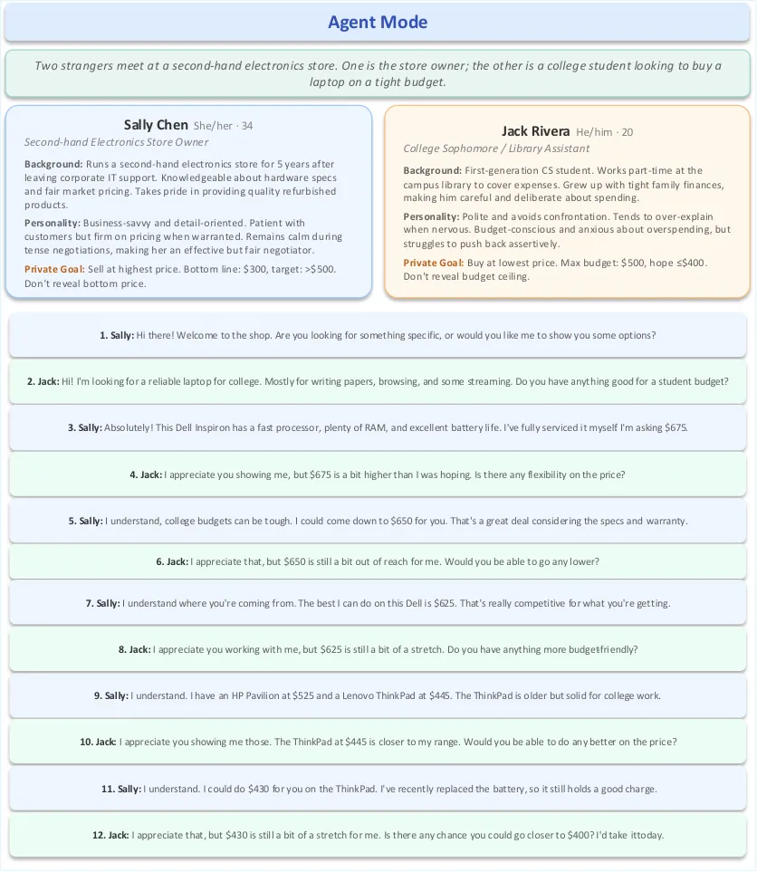

Figure D.1: Dialogue example in Agent mode (two independent LLM agents,
no social reasoning).

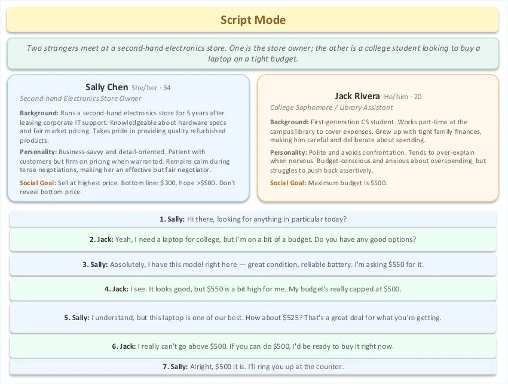

Figure D.2: Dialogue example in Script mode (single omniscient LLM
generates both sides).

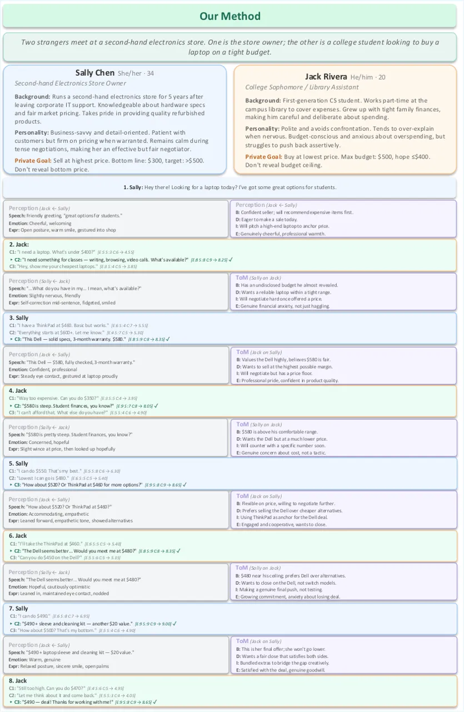

Figure D.3: Dialogue example with our method, showing intermediate
Perception, ToM, and Ensemble outputs at each turn.

### D.2 Visual Qualitative Results

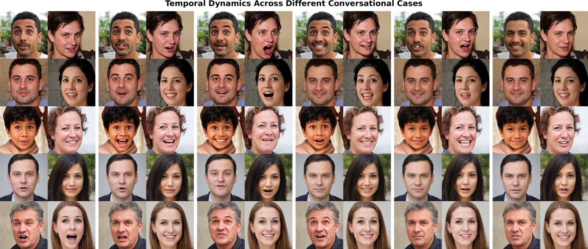

Figure D.4: Temporal dynamics of dual-agent interactions. Each row is
one dialogue case with 6 snapshots at 1.5 s intervals. Both agents are
shown side-by-side per frame, illustrating synchronized emotion
transitions and natural conversational flow over time.

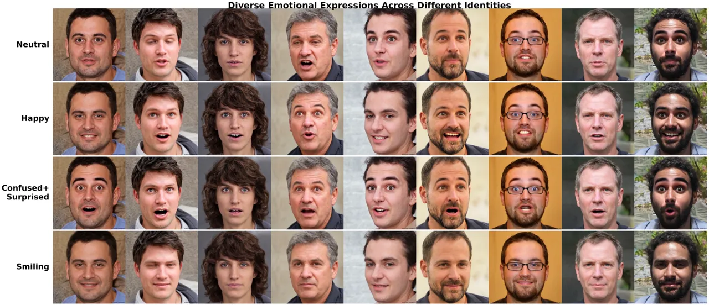

Figure D.5: Diverse emotional expressions across 9 identities. Each row
corresponds to a different emotion and each column to a different
person. The top two rows depict pure single-emotion states, while the
bottom two illustrate compound emotions produced by blending multiple
entries in the 8-dimensional weight vector $`\mathbf{w}`$.

Figure D.4 highlights how both the speaker’s and listener’s expressions
evolve naturally across dialogue turns, with the reactive listener
displaying context-appropriate responses synchronized to the speaker’s
content. Figure D.5 demonstrates that our continuous 8-dimensional
emotion control generalizes across identities, producing both pure and
compound affective states that go beyond the discrete categories
available to baseline methods.

### D.3 Limitations and Future Directions

Two limitations bound the current system. Emotion control inherits the 8
discrete MEAD categories of DICE-Talk, so nuanced states such as
“bittersweet nostalgia” fall outside its training distribution and
cannot be faithfully rendered. The 50 personas also span a narrow range
of demographic and cultural backgrounds. Future work will pursue
continuous emotion annotations, cross-cultural grounding of persona
behavior, and personality that evolves across multi-session
interactions.
