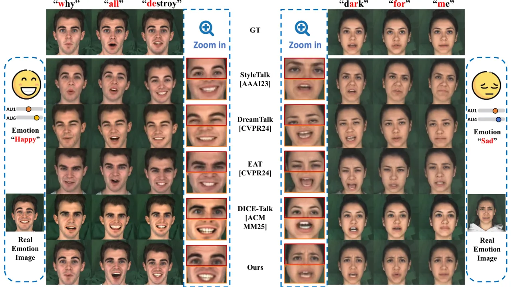

# EmoZone-Talker: Regional Semantic Control of Audio-Driven 3DGS Talking Heads via Facial Action Units

Conference: Proceedings of the 34th ACM International Conference on
Multimedia; November 10–14, 2026; Rio de Janeiro, Brazil.Proceedings of
the 34th ACM International Conference on Multimedia (MM ’26), November
10–14, 2026, Rio de Janeiro,
BrazilISBN: 979-8-4007-2213-4/2026/11DOI: [10.1145/3767308.3835650](https://doi.org/10.1145/3767308.3835650)CCS: Computing
methodologies Computer vision

Tingting Chen Note: Equal contribution. Affiliation: China University of
Petroleum (East China), Qingdao, China email: <2217010215@s.upc.edu.cn>
, Shaojun Wang Affiliation: China University of Petroleum (East China),
Qingdao, China email: <2307010404@s.upc.edu.cn> , Huaye Zhang
Affiliation: China University of Petroleum (East China), Qingdao, China
email: <2306030225@s.upc.edu.cn> , Diqiong Jiang Note: Corresponding
author. Affiliation: China University of Petroleum (East China),
Qingdao, China email: <djiang@upc.edu.cn> and Chenglizhao Chen
Affiliation: China University of Petroleum (East China), Qingdao, China
email: <cclz123@163.com>

© cc

![The figure presents a structured comparison of facial expression
control across multiple conditions. The left panel shows isolated
manipulation of specific facial regions, where changes are localized to
brows, cheeks, or nose without affecting other areas, indicating spatial
disentanglement. Intensity increases progressively across columns,
demonstrating continuous control rather than discrete switching. The
upper-right panel combines audio input with multiple control signals,
showing that simultaneous activation of different facial components
results in coherent and non-conflicting expressions. The lower-right
panel illustrates temporal progression across frames, where facial
configurations evolve smoothly between distinct emotional states while
preserving identity consistency and avoiding abrupt changes. Visual
indicators highlight that different regions respond independently yet
remain coordinated over
time.](arxiv-2606-15848--7b6ea6f2d217.figures/figure-1.webp)

Figure 1. Fine-grained AU control with temporal coherence. (a)
Individual AU editing with controllable intensity. (b) Coordinated
synthesis under conflicting AU cues. (c) Smooth transitions between
affective states with reduced jitter.The figure presents a structured
comparison of facial expression control across multiple conditions. The
left panel shows isolated manipulation of specific facial regions, where
changes are localized to brows, cheeks, or nose without affecting other
areas, indicating spatial disentanglement. Intensity increases
progressively across columns, demonstrating continuous control rather
than discrete switching. The upper-right panel combines audio input with
multiple control signals, showing that simultaneous activation of
different facial components results in coherent and non-conflicting
expressions. The lower-right panel illustrates temporal progression
across frames, where facial configurations evolve smoothly between
distinct emotional states while preserving identity consistency and
avoiding abrupt changes. Visual indicators highlight that different
regions respond independently yet remain coordinated over time.

###### Abstract.

3D Gaussian Splatting (3DGS) supports high-fidelity talking head
synthesis, but fine-grained regional expression control remains
difficult when speech-driven motion and explicit Action Unit (AU)
controls affect overlapping facial regions. Frame-level AU trajectories
may also contain high-frequency noise that produces unstable
deformation. We present EmoZone-Talker, an AU-conditioned framework that
treats these issues as spatial responsibility allocation and temporal
conditioning. Synergy Zones with Prioritized Attention Bias (SZ-PAB)
introduces soft region-aware priors that bias audio toward articulation
regions and AUs toward upper-face regions while retaining a learnable
transition zone. The Channel-Independent Temporal AU Encoder (CIT-AE)
applies learnable local temporal filtering before multimodal fusion.
Integrated with 3D Gaussian deformation, these components improve
measured AU controllability and temporal stability while maintaining
rendering quality and lip synchronization. The method uses editable AU
trajectories as external controls rather than inferring emotion from
audio alone. Code is available on
[https://github.com/HMQH/Emozone-Talker](https://github.com/HMQH/Emozone-Talker).

###### Keywords: 

3D Gaussian Splatting, Talking Head Synthesis, AU-Conditioned Expression
Control, Facial Action Units

^(†)^(†)cc-license: by-nc-nd

## 1. Introduction

Audio-driven talking head synthesis has attracted sustained attention
due to its broad applications in virtual avatars, human–computer
interaction, filmmaking, and digital content creation. Recent advances
in Neural Radiance Fields (NeRF), explicit dynamic geometry, and 3D
Gaussian Splatting (3DGS) have substantially improved rendering
fidelity, geometric consistency, and inference efficiency (Guo et al.,
2021; Zhang et al., 2024; Cho et al., 2024; Li et al., 2024). However,
most existing systems primarily focus on speech-driven realism and lip
synchronization, while providing limited support for editable and
region-specific facial expression control.

Existing approaches commonly enhance expressiveness through global
emotion labels, style embeddings, text prompts, reference signals, or
continuous affect representations (Gan et al., 2023; Tan et al., 2023;
Wang and Fu, 2025; Cha et al., 2025). Although these interfaces are
effective for holistic emotional modulation, they provide limited access
to individual facial actions, their spatial locations, and their
activation intensities. In contrast, Action Units (AUs), defined by the
Facial Action Coding System (FACS) (Friesen and Ekman, 1978; Donato
et al., 1999), represent localized and semantically meaningful facial
actions. Continuous AU intensities therefore provide a more
interpretable and editable interface for fine-grained expression
control.

Introducing explicit AU controls turns audio-driven facial animation
into a multi-source control problem, in which speech and AU signals may
exert competing influences over overlapping facial regions. Audio
primarily drives the lips, jaw, and surrounding articulation-related
areas, whereas AUs may also affect the cheeks, nasolabial folds, and
mouth corners. Without explicit regional responsibility assignment,
implicit multimodal fusion may suppress the requested AU response or
disturb speech-driven articulation. Second, frame-level AU trajectories
extracted by facial analysis tools often contain short-term
fluctuations. Directly injecting such trajectories into a deformation
network may amplify the noise and produce visible temporal jitter.

Recent methods do not fully address these issues. TalkingGaussian (Li
et al., 2024) improves structural persistence and uses AUs as auxiliary
training signals, but does not expose them as explicit editable
controls. EmoTalkingGaussian (Cha et al., 2025) introduces continuous
valence–arousal conditioning, but its control remains holistic rather
than region-specific. EmoDiffTalk (Liu et al., 2025) incorporates AU
information into an editable diffusion-based framework, yet still relies
on implicit conditioning without explicitly assigning modality
preference across overlapping facial regions. Therefore, achieving
localized AU control while maintaining stable temporal dynamics and
accurate articulation remains challenging.

To address these problems, we propose _EmoZone-Talker_, an
AU-conditioned 3DGS framework for editable regional expression control.
The model accepts continuous AU trajectories as external control
signals, which can be extracted from reference videos, interpolated from
user-specified keyframes or sliders, or generated by an external
text/emotion-to-AU model. It does not infer expressions from audio
alone. Our Synergy Zones with Prioritized Attention Bias (SZ-PAB)
introduces soft facial-zone priors into cross-modal attention, biasing
audio toward articulation-related regions and AUs toward upper-face
regions while retaining a flexible synergy zone. We further introduce a
Channel-Independent Temporal AU Encoder (CIT-AE), which applies
channel-wise local temporal modeling before multimodal fusion to reduce
high-frequency AU fluctuations. The resulting audio and AU features
jointly condition spatially varying 3D Gaussian deformations.

The main contributions of this work are as follows:

- •
  We formulate AU-conditioned talking head synthesis as editable
  regional control under overlapping speech and expression influences,
  and identify spatial interference and noisy temporal AU conditioning
  as two key failure modes.
- •
  We propose SZ-PAB, which introduces soft facial-zone priors into
  cross-modal attention to improve region-level AU controllability while
  retaining audio-driven articulation and cross-region flexibility.
- •
  We introduce CIT-AE, a channel-wise local temporal encoder whose
  outputs are combined into a shared AU embedding, reducing AU-driven
  temporal jitter before 3D Gaussian deformation.

## 2. Related Work

![The diagram depicts the internal data flow and interactions between
components in a multi-branch system. Inputs include video frames, audio
signals, and structured control parameters that are encoded into
separate feature representations. These features are aligned and fused
through attention-based mechanisms, where query, key, and value
projections integrate modality-specific information. A region-aware
attention process assigns different importance to facial areas, guided
by a predefined semantic partition and bias maps that emphasize regions
such as the upper face or the mouth. Deformation parameters are then
predicted and applied to a set of primitive representations to generate
rendered outputs. A parallel temporal modeling pathway processes
sequences of control signals using sliding windows and channel-wise
operations to capture local temporal dependencies and ensure smooth
transitions. Additionally, an auxiliary consistency branch compares
predicted control signals with reference targets, enforcing alignment
through reconstruction and classification losses. The overall structure
highlights the separation of spatial control, temporal modeling, and
supervision signals, while maintaining coordinated information flow
across modules.](arxiv-2606-15848--7b6ea6f2d217.figures/figure-2.webp)

Figure 2. Overview of EmoZone-Talker. Audio, AU, and tri-plane features
jointly predict Gaussian deformations. SZ-PAB applies region-aware
attention bias, CIT-AE stabilizes AU dynamics, and AU-consistency
supervision preserves expression fidelity.The diagram depicts the
internal data flow and interactions between components in a multi-branch
system. Inputs include video frames, audio signals, and structured
control parameters that are encoded into separate feature
representations. These features are aligned and fused through
attention-based mechanisms, where query, key, and value projections
integrate modality-specific information. A region-aware attention
process assigns different importance to facial areas, guided by a
predefined semantic partition and bias maps that emphasize regions such
as the upper face or the mouth. Deformation parameters are then
predicted and applied to a set of primitive representations to generate
rendered outputs. A parallel temporal modeling pathway processes
sequences of control signals using sliding windows and channel-wise
operations to capture local temporal dependencies and ensure smooth
transitions. Additionally, an auxiliary consistency branch compares
predicted control signals with reference targets, enforcing alignment
through reconstruction and classification losses. The overall structure
highlights the separation of spatial control, temporal modeling, and
supervision signals, while maintaining coordinated information flow
across modules.

### 2.1. Audio-Driven Talking Head Synthesis

Audio-driven talking head synthesis has progressed from 2D pipelines to
3DMM-, NeRF-, and 3DGS-based methods. Early 2D approaches, such as
MakeItTalk (Zhou et al., 2020) and SadTalker (Zhang et al., 2023), use
explicit intermediate representations for controllability but lack
rendering quality and 3D consistency. NeRF-based methods improve
realism, view consistency, temporal stability, and lip synchronization
by mapping audio to dynamic radiance fields (Guo et al., 2021; Ye
et al., 2023b; Ye et al., 2023a; Tang et al., 2025; Li et al., 2023;
Peng et al., 2024). More recently, 3DGS enables high-fidelity real-time
rendering. GaussianTalker (Cho et al., 2024) predicts audio-driven
Gaussian deformation, while TalkingGaussian (Li et al., 2024) introduces
smooth deformation and auxiliary AU supervision.

### 2.2. Emotion-Conditioned Talking Head Generation

Emotion- and style-conditioned systems use labels, embeddings,
references, or diffusion guidance to enhance expressiveness (Ji et al.,
2021; Ji et al., 2022; Ma et al., 2023a; Gan et al., 2023; Tian et al.,
2024). DICE-Talk (Tan et al., 2025) models identity and emotion, while
EmoTalk3D (He et al., 2024) and EmoTalkingGaussian (Cha et al., 2025)
extend emotion control to 3D synthesis. These interfaces primarily
describe holistic affect rather than editable local actions.

### 2.3. Fine-Grained Expression Control via Action Units

Action Units (AUs) decompose facial expressions into localized,
semantically meaningful activations (Friesen and Ekman, 1978). They
complement higher-level interfaces such as text-guided style control (Ma
et al., 2025b), multimodal coarse-to-fine control (Chen et al., 2025),
and timeline-based motion control (Ma et al., 2025a) by exposing
continuous intensity and region-specific editing. AU-based methods use
landmarks, two-stage synthesis, or diffusion to control facial
motion (Chang et al., 2025; Lyu et al., 2026; Liu et al., 2025; Xie
et al., 2026). Our focus is narrower: explicit regional responsibility
and temporal stabilization for editable AU trajectories in a real-time,
per-identity 3DGS deformation model.

## 3. Method

### 3.1. Overview

Our model maps audio, AU, camera, and canonical tri-plane features to
frame-specific Gaussian offsets and renders the deformed Gaussians
(Fig. 2). The editable control is a 5D continuous intensity vector
comprising AU1 (Inner Brow Raiser), AU2 (Outer Brow Raiser), AU4 (Brow
Lowerer), AU6 (Cheek Raiser), and AU9 (Nose Wrinkler), each on a 0–5
scale. These AUs cover representative upper- and mid-face actions; AU6
is also challenging because cheek motion can affect the mouth corners.

At inference time, AU trajectories can be extracted from reference
videos, interpolated from sparse user keyframes or sliders, or supplied
by an external text/emotion-to-AU front-end. They are editable controls,
not expressions inferred by our model from audio alone. CIT-AE
stabilizes the trajectories, SZ-PAB biases audio–AU fusion by region,
and the auxiliary AU branch supervises whether rendered frames reflect
the requested controls.

#### Gaussian deformation data flow.

We represent the canonical subject as a set of 3D Gaussians (Kerbl
et al., 2023; Cho et al., 2024; Li et al., 2024),

```math
\mathcal{G}_{\mathrm{can}}=\{g_{i}\}_{i=1}^{N},\quad g_{i}=(\mu_{i},s_{i},r_{i},\alpha_{i},SH_{i}), \tag{1}
```

where position $`\mu_{i}`$, scale $`s_{i}`$, rotation $`r_{i}`$, opacity
$`\alpha_{i}`$, and spherical-harmonic coefficients $`SH_{i}`$ describe
geometry and appearance. For every Gaussian center, a multi-resolution
tri-plane field supplies a spatial feature

```math
\mathbf{f}_{i}=\Phi(\mu_{i})\in\mathbb{R}^{d_{f}}. \tag{2}
```

These features form the transformer queries. The temporal audio encoder,
CIT-AE, and camera encoder produce $`\mathbf{E}_{audio}`$,
$`\mathbf{E}_{AU}`$, and $`\mathbf{E}_{cam}`$, respectively, which form
the condition tokens:

```math
Q=\mathbf{F}_{spatial},\qquad K,V=\operatorname{Concat}(\mathbf{E}_{audio},\mathbf{E}_{AU},\mathbf{E}_{cam}). \tag{3}
```

SZ-PAB adds its region-dependent bias inside cross-attention. The fused
feature of each Gaussian is decoded into frame-specific offsets

```math
\Delta\mathcal{G}_{t}=\{\Delta\mu_{t},\Delta r_{t},\Delta s_{t},\Delta\alpha_{t},\Delta SH_{t}\}, \tag{4}
```

which are applied to $`\mathcal{G}_{\mathrm{can}}`$ before
differentiable rasterization. Thus the AU trajectory directly conditions
Gaussian deformation rather than serving only as an auxiliary label. The
five selected AUs cover complementary brow, cheek, and nose actions
while avoiding direct duplication of the speech-driven jaw and lip
controls; AU6 deliberately retains cheek–mouth coupling as a stress case
for the soft regional prior.

### 3.2. Synergy Zones with Prioritized Attention Bias (SZ-PAB)

Audio-driven facial animation can be formulated as AU-conditioned face
generation:

```math
y=f(x_{audio},x_{AU}), \tag{5}
```

where speech drives articulation, and AUs explicitly control facial
expressions. A key challenge is cross-modal interference, as both
signals affect overlapping facial regions, leading to ambiguous and
entangled control. To address this, we introduce SZ-PAB, which imposes a
region-wise inductive bias over cross-modal interactions. Specifically,
we encourage a structured factorization of the generation process:

```math
p(y|x_{audio},x_{AU})\approx\prod_{r}p(y_{r}|x_{audio}^{(r)},x_{AU}^{(r)}), \tag{6}
```

so that different facial regions preferentially respond to
modality-specific signals. To instantiate this factorization, we
introduce a region-wise decomposition that encourages region-dependent
modality preference across facial regions. This factorization serves as
a motivating approximation rather than assuming strict independence
among facial regions.

#### Synergy Zone Partitioning.

Using landmarks detected on the canonical frame, we define an
audio-dominant zone $`\mathcal{Z}_{A}`$ (mouth), an expression-dominant
zone $`\mathcal{Z}_{E}`$ (upper face), and a synergy zone
$`\mathcal{Z}_{S}`$ (transition regions). The boundaries remain fixed
during training and inference:

```math
L(\mu_{i})\in\{\mathcal{Z}_{A},\mathcal{Z}_{E},\mathcal{Z}_{S}\}. \tag{7}
```

This partition is a soft structural prior for modality preference rather
than a strict anatomical decomposition.

#### Prioritized Attention Bias.

We incorporate this prior into cross-attention via a learnable bias:

```math
\text{Attn}(Q,K,V)=\text{softmax}\left(\frac{QK^{\top}}{\sqrt{d}}+B\right)V, \tag{8}
```

where $`B`$ is a learnable region-dependent bias. It encourages modality
preference without masking either modality: $`\mathcal{Z}_{A}`$ favors
audio tokens, $`\mathcal{Z}_{E}`$ favors AU tokens, and
$`\mathcal{Z}_{S}`$ remains a flexible transition region. Learned
attention can therefore preserve cross-zone facial coupling while
reducing interference.

#### Region-Aware Regularization.

To further stabilize region-wise attention allocation, we introduce
Region-Aware Attention Regularization (RAAR), which enforces modality
preference at the region level. Let $`\alpha_{i,j}`$ denote the
attention weight from Gaussian $`i`$ to token $`j`$. We compute the
average attention response of each region to different modalities. For
example, the upper-face response to audio tokens is defined as:

```math
\bar{\alpha}^{audio}_{upper}=\frac{1}{|\mathcal{Z}_{E}|}\sum_{i\in\mathcal{Z}_{E}}\sum_{j\in\text{audio}}\alpha_{i,j} \tag{9}
```

Based on these statistics, we impose a margin-based constraint:

```math
\mathcal{L}_{RAAR}=\mathcal{L}_{upper}+\mathcal{L}_{mouth}, \tag{10}
```

where $`\mathcal{L}_{upper}`$ encourages AU attention to dominate over
audio in the upper-face region, while $`\mathcal{L}_{mouth}`$ enforces
the opposite preference in the mouth region using hinge-style losses
with margin $`m`$. This design reinforces region-consistent modality
preference while maintaining flexibility during training.

### 3.3. Channel-Independent Temporal AU Encoder (CIT-AE)

Frame-level AU signals can be modeled as noisy temporal observations:

```math
\mathbf{a}_{t}=\mathbf{s}_{t}+\boldsymbol{\epsilon}_{t}, \tag{11}
```

where $`\mathbf{s}_{t}`$ denotes the underlying expression dynamics and
$`\boldsymbol{\epsilon}_{t}`$ represents high-frequency measurement
noise. Direct conditioning on $`\mathbf{a}_{t}`$ can introduce jitter.
CIT-AE therefore applies learnable local temporal filtering before
multimodal fusion. For each frame $`t`$, it constructs a center-aligned
temporal window:

```math
\mathbf{A}_{t}=[\mathbf{a}_{t-h},\dots,\mathbf{a}_{t},\dots,\mathbf{a}_{t+h-1}]\in\mathbb{R}^{T\times K}, \tag{12}
```

Rather than mixing channels within the temporal operator, CIT-AE
processes the sequence of each AU $`k`$ with a dedicated one-dimensional
convolution:

```math
\mathbf{h}^{(k)}_{t}=\operatorname{Conv1D}^{(k)}(\mathbf{A}^{(k)}_{t}), \tag{13}
```

where $`\mathbf{A}^{(k)}_{t}\in\mathbb{R}^{T}`$ is the local trajectory
for channel $`k`$. The response aligned to the center frame is retained,

```math
\tilde{a}^{(k)}_{t}=\mathbf{h}^{(k)}_{t}[\mathrm{center}], \tag{14}
```

and the channel responses are then concatenated and projected by a
shared AU encoder:

```math
\tilde{\mathbf{a}}_{t}=[\tilde{a}^{(1)}_{t},\ldots,\tilde{a}^{(K)}_{t}]\in\mathbb{R}^{K},\qquad\mathbf{E}_{AU}=\operatorname{Enc}_{AU}(\tilde{\mathbf{a}}_{t}). \tag{15}
```

This ordering separates per-channel temporal filtering from subsequent
cross-channel coordination: each AU first retains its own local
dynamics, and only the resulting center responses enter the shared
representation used by the deformation transformer. CIT-AE is therefore
not an audio–AU temporal disentanglement module; its scoped role is to
reduce noisy AU fluctuations before joint deformation prediction.

![ The columns show selected frames aligned to speech content, with each
frame labeled by a timestamp and the corresponding phoneme or word
segment to indicate the intended audio-visual synchronization. Each row
presents self-reconstruction results from a different method under the
same speaking condition, enabling direct visual comparison across
models. The red boxes highlight the mouth region and emphasize
articulation errors at critical phonetic moments, especially when an
open-vowel sound should produce a clearly open mouth. In some competing
methods, the lip motion is inconsistent with the audio, such as
insufficient mouth opening or a nearly closed mouth during vowel
production, whereas the proposed method maintains more accurate and
temporally coherent articulation. The two subjects on the left and right
further illustrate that this behavior is evaluated across different
identities, helping show robustness to speaker variation. The
frame-to-frame progression also reveals differences in motion smoothness
and continuity, which are important for assessing realistic talking-face
generation.](arxiv-2606-15848--7b6ea6f2d217.figures/figure-3.webp)

Figure 3. Qualitative comparison in the self-reconstruction scenario,
where each subject is driven by their own speech. The regions
highlighted by red solid boxes indicate mismatched lip articulation. The
columns show selected frames aligned to speech content, with each frame
labeled by a timestamp and the corresponding phoneme or word segment to
indicate the intended audio-visual synchronization. Each row presents
self-reconstruction results from a different method under the same
speaking condition, enabling direct visual comparison across models. The
red boxes highlight the mouth region and emphasize articulation errors
at critical phonetic moments, especially when an open-vowel sound should
produce a clearly open mouth. In some competing methods, the lip motion
is inconsistent with the audio, such as insufficient mouth opening or a
nearly closed mouth during vowel production, whereas the proposed method
maintains more accurate and temporally coherent articulation. The two
subjects on the left and right further illustrate that this behavior is
evaluated across different identities, helping show robustness to
speaker variation. The frame-to-frame progression also reveals
differences in motion smoothness and continuity, which are important for
assessing realistic talking-face generation.

### 3.4. Joint AU Detection and Face Alignment (JAA)-Based AU Supervision

Introducing AU conditions does not guarantee that the rendered motion
faithfully reflects the intended expression semantics, as the
deformation network may underutilize AU signals or entangle them with
dominant audio features. To address this, we introduce a JAA-based
supervision branch that explicitly enforces AU consistency during
training.

For each frame, we obtain target AU labels $`\mathbf{a}^{gt}_{t}`$ using
a pre-trained AU detector (Baltrusaitis et al., 2018). Given the
rendered frame $`\hat{I}_{t}`$, we estimate its AU responses using a
pre-trained JAA network (Shao et al., 2018), which serves as an external
AU estimator for measuring expression consistency:

```math
\hat{\mathbf{a}}_{t}=\Psi_{JAA}(\hat{I}_{t}). \tag{16}
```

We then define an AU consistency loss:

```math
\mathcal{L}_{\text{AU}}=\|\hat{\mathbf{a}}_{t}-\mathbf{a}^{\text{gt}}_{t}\|_{1}. \tag{17}
```

This supervision encourages the model to produce expression-consistent
facial responses while maintaining photorealism. Notably, the JAA branch
is only used during training and introduces no additional inference
cost. It can be viewed as an expression-aware perceptual constraint that
provides semantic supervision beyond pixel-level reconstruction.



Figure 4. Qualitative comparison under the same audio and target
emotion, using each method’s native control interface.The figure
organizes results by emotion category, with the left panel corresponding
to a “happy” target expression and the right panel to a “sad” target
expression, each driven by the same input speech content indicated above
the frames. For each subject, multiple methods are compared row-wise,
including several baselines and the proposed approach, while the ground
truth sequence is provided for reference. Zoomed-in regions focus on the
eye and mouth areas, highlighting subtle expression details such as eye
narrowing, eyebrow movement, and lip curvature that are critical for
conveying affect. The annotated action units (e.g., AU1, AU4, AU6)
illustrate the facial muscle activations associated with each emotion,
providing an interpretable link between visual appearance and expression
semantics. It can be observed that some methods fail to consistently
reproduce the intended emotional cues, either exaggerating or weakening
key facial movements, whereas the proposed method better captures both
global expression consistency and fine-grained local details.
Additionally, the comparison with real emotion images at the sides
offers a visual reference for natural expression intensity and
distribution, enabling a more comprehensive assessment of realism and
emotional fidelity.

### 3.5. Training Objectives

The overall training objective combines reconstruction fidelity, lip
synchronization, AU consistency, and region-aware regularization:

```math
\mathcal{L}_{\text{total}}=\mathcal{L}_{\text{rec}}+\lambda_{\text{sync}}\mathcal{L}_{\text{sync}}+\lambda_{\text{AU}}\mathcal{L}_{\text{AU}}+\lambda_{\text{RAAR}}\mathcal{L}_{\text{RAAR}}. \tag{18}
```

Here, $`\mathcal{L}_{\text{rec}}`$ enforces photometric and perceptual
consistency, $`\mathcal{L}_{\text{sync}}`$ ensures speech-lip alignment
using SyncNet (Chung and Zisserman, 2016), $`\mathcal{L}_{\text{AU}}`$
enforces expression semantics via JAA-based supervision, and
$`\mathcal{L}_{\text{RAAR}}`$ regularizes region-wise attention
allocation. We empirically set $`\lambda_{\text{sync}}=0.1`$,
$`\lambda_{\text{AU}}=0.05`$, and $`\lambda_{\text{RAAR}}=0.01`$ in all
experiments.

Together, these losses optimize rendering fidelity, speech–lip
alignment, regional expression control, and temporal coherence.

## 4. Experiments

### 4.1. Experimental Setting

#### Datasets.

We evaluate self-reconstruction on the neutral subset containing Obama,
May, Lieu, and Macron, following TalkingGaussian (Li et al., 2024). We
further evaluate AU-conditioned generation on MEAD (Wang et al., 2020),
which contains 60 speakers performing eight emotion categories at three
intensity levels. Emotion labels are used only to organize this
evaluation; the proposed model is driven by the corresponding continuous
AU trajectories. Videos use a 10:1 training/test split (Cho et al.,
2024; Li et al., 2024), $`256\times 256`$ resolution, 25 FPS, and 16 kHz
audio. JAANet supplies training supervision, whereas
OpenFace (Baltrusaitis et al., 2018) is used for evaluation to reduce
evaluator–optimizer coupling. The RAVDESS examples test qualitative
transfer only and are not included in the quantitative claims.

#### Implementation Details.

Our model is implemented in PyTorch and optimized using Adam (Kingma and
Ba, 2015). Training consists of a coarse stage followed by a fine stage
for lip and depth refinement. The learning rate decays exponentially
from $`1\times 10^{-4}`$ to $`1\times 10^{-5}`$. 3D Gaussian
densification (Cho et al., 2024) is performed every 100 iterations
between 1k and 7k steps.

#### Evaluation Metrics.

We report PSNR and SSIM (Wang et al., 2004; Horé and Ziou, 2010) for
reconstruction, LPIPS (Zhang et al., 2018) for perceptual distance,
landmark distance (LMD) (Chen et al., 2019) for facial geometry, and
identity similarity (CSIM) (Schroff et al., 2015). Lip synchronization
is measured by both SyncNet confidence and lip-sync error distance
(Sync/LSE-D) (Chung and Zisserman, 2016); higher Sync and lower LSE-D
are preferred. AUE-U/L are mean absolute errors between target and
detected AU intensities in the upper and lower facial groups. AU-Jerk is
the mean magnitude of the second-order temporal difference of the
detected AU trajectory, so it measures frame-to-frame stability rather
than expression correctness by itself. E-Score uses a pretrained
AffectNet classifier (Mollahosseini et al., 2019). Because AU
supervision and AU metrics both rely on detectors, AUE and AU-Jerk
remain proxy measurements of detector agreement. We therefore interpret
them jointly with rendering, synchronization, qualitative, and
user-study evidence.

#### Comparisons.

Self-reconstruction baselines are ER-NeRF (Li et al., 2023),
GaussianTalker (Cho et al., 2024), and TalkingGaussian (Li et al.,
2024). MEAD baselines are StyleTalk (Ma et al., 2023a), EAT (Gan et al.,
2023), DreamTalk (Ma et al., 2023b), and DICE-Talk (Tan et al., 2025).
They receive coarse emotion controls, whereas ours receives AU
trajectories. The cross-interface comparison tests practical
controllability; Table 2 isolates architectural gains under matched AU
controls.

#### Evaluation Protocol.

The three evaluation settings answer complementary
questions.Self-reconstruction evaluates whether the additional AU
pathway preserves rendering fidelity, facial geometry, identity, and
speech–lip synchronization. The MEAD control comparison evaluates the
practical capability of complete systems under their native control
interfaces, but does not by itself isolate architectural improvements.
We therefore use matched-input ablations, in which all variants receive
the same AU trajectories, to separately examine the effects of SZ-PAB,
CIT-AE, and continuous AU intensities. This separation prevents gains
from a stronger control interface from being directly attributed to a
specific architectural component.

### 4.2. Quantitative Results

#### Self-Reconstruction.

Table 1 shows that our method has the lowest AUE-U on both datasets
while retaining competitive Sync and the lowest MEAD LSE-D. On the
neutral subset, AUE-U decreases from the second-best 0.206 to 0.156; on
MEAD it decreases from 0.163 to 0.145. The method also obtains the
lowest LMD on both sets, while LPIPS is not consistently best. This
mixed pattern supports improved AU realization and geometry without
claiming uniform superiority in every aspect of appearance. The MEAD
LSE-D of 6.93, together with Sync 5.228, indicates that the added AU
pathway does not remove usable lip synchronization. Runtime is 110.5
FPS, compared with 116.5 FPS for GaussianTalker, 105 FPS for
TalkingGaussian, and 34.7 FPS for ER-NeRF.

#### MEAD Control.

Table 4 reports the MEAD emotion-conditioned setting. Our AU-controlled
model obtains an E-Score of 0.653 and CSIM of 0.841, compared with 0.552
and 0.651 for the strongest listed baseline values in the corresponding
columns. The neutral/non-neutral split shows that the difference is not
confined to only one subset. However, the baselines receive
category-level emotion controls while ours receives continuous AU
trajectories. The table therefore demonstrates the practical capability
of the complete control interface in this setting; it does not isolate
the contribution of SZ-PAB or CIT-AE. Those architectural effects are
assessed in Table 2 using matched AU inputs.

### 4.3. Qualitative Results

|                 |                  |                  |                     |                   |                  |                  |                                     |                  |                  |                     |                   |                  |                     |                  |                                     |
| --------------- | ---------------- | ---------------- | ------------------- | ----------------- | ---------------- | ---------------- | ----------------------------------- | ---------------- | ---------------- | ------------------- | ----------------- | ---------------- | ------------------- | ---------------- | ----------------------------------- |
| Method          | Neutral Dataset  |                  |                     |                   |                  |                  |                                     | MEAD             |                  |                     |                   |                  |                     |                  |                                     |
|                 | PSNR$`\uparrow`$ | SSIM$`\uparrow`$ | LPIPS$`\downarrow`$ | LMD$`\downarrow`$ | Sync$`\uparrow`$ | CSIM$`\uparrow`$ | AUE-U$`\downarrow`$/L$`\downarrow`$ | PSNR$`\uparrow`$ | SSIM$`\uparrow`$ | LPIPS$`\downarrow`$ | LMD$`\downarrow`$ | Sync$`\uparrow`$ | LSE-D$`\downarrow`$ | CSIM$`\uparrow`$ | AUE-U$`\downarrow`$/L$`\downarrow`$ |
| ER-NeRF         | 33.059           | 0.935            | 0.027               | 2.269             | 5.554            | 0.930            | 0.271/0.228                         | 31.156           | 0.931            | 0.033               | 2.649             | 4.492            | 8.07                | 0.864            | 0.355/0.376                         |
| GaussianTalker  | 33.023           | 0.939            | 0.033               | 2.306             | 5.741            | 0.946            | 0.256/0.228                         | 31.952           | 0.946            | 0.047               | 2.410             | 4.823            | 7.21                | 0.913            | 0.338/0.330                         |
| TalkingGaussian | 33.637           | 0.940            | 0.026               | 2.013             | 5.919            | 0.945            | 0.206/0.223                         | 32.769           | 0.942            | 0.029               | 2.074             | 4.794            | 7.54                | 0.914            | 0.163/0.314                         |
| Ours            | 34.732           | 0.952            | 0.030               | 1.951             | 5.849            | 0.956            | 0.156/0.199                         | 33.940           | 0.957            | 0.038               | 1.852             | 5.228            | 6.93                | 0.944            | 0.145/0.258                         |

Table 1. Self-reconstruction results. Best and second-best values are
bold and underlined.

|        |           |           |           |                   |                      |                   |                      |                      |                        |
| ------ | --------- | --------- | --------- | ----------------- | -------------------- | ----------------- | -------------------- | -------------------- | ---------------------- |
| Config | AU Cond   | SZ-PAB    | CIT-AE    | PSNR $`\uparrow`$ | LPIPS $`\downarrow`$ | Sync $`\uparrow`$ | AUE-U $`\downarrow`$ | AUE-L $`\downarrow`$ | AU-Jerk $`\downarrow`$ |
| \(A\)  | \-        | \-        | \-        | 32.879            | 0.042                | 5.741             | 0.309                | 0.314                | 0.137                  |
| \(B\)  | $`\surd`$ | \-        | \-        | 31.795            | 0.046                | 5.378             | 0.324                | 0.358                | 0.153                  |
| \(C\)  | $`\surd`$ | $`\surd`$ | \-        | 33.947            | 0.037                | 5.569             | 0.152                | 0.235                | 0.126                  |
| \(D\)  | $`\surd`$ | \-        | $`\surd`$ | 33.921            | 0.039                | 5.571             | 0.305                | 0.276                | 0.098                  |
| Ours   | $`\surd`$ | $`\surd`$ | $`\surd`$ | 33.960            | 0.034                | 5.712             | 0.143                | 0.231                | 0.095                  |

Table 2. Ablation study of architecture components under matched AU
inputs.

|                      |                      |                        |                   |
| -------------------- | -------------------- | ---------------------- | ----------------- |
| Representation       | AUE-U $`\downarrow`$ | AU-Jerk $`\downarrow`$ | Sync $`\uparrow`$ |
| Binary activation    | 0.281                | 0.101                  | 5.654             |
| Continuous intensity | 0.143                | 0.095                  | 5.712             |

Table 3. Ablation study of AU representations under matched AU inputs.

#### Self-Reconstruction.

Figure 3 highlights selected articulation mismatches. In the shown
frames, ours more closely follows the reference lip shape.

#### Emotion Control.

Figure 4 compares complete systems under the same audio and target
emotion but different control interfaces. The AU-driven examples show
clearer brow, cheek, and nose changes while retaining articulation. This
qualitative evidence is subject to the interface difference in Sec. 4.1.

### 4.4. Ablation Study


Figure 5. SZ-PAB ablation across AU1, AU2, AU4, AU6, and AU9. Blue boxes
highlight the corresponding regional responses.Regional AU responses
with and without SZ-PAB.


Figure 6. Temporal Stability Analysis under Stress Testing.AU
trajectories with and without CIT-AE under noisy inputs.


Figure 7. CIT-AE ablation. Without CIT-AE, activations become erratic
(red) and temporally blurred (orange).The top row shows the full model
maintaining stable and consistent facial expressions across frames. The
bottom row shows the variant without CIT-AE, with erratic upper-face
activations and temporal blur in the mouth region under noisy AU inputs.

|           |                      |                      |                          |                   |
| --------- | -------------------- | -------------------- | ------------------------ | ----------------- |
| Method    | E-Score $`\uparrow`$ | Neutral $`\uparrow`$ | Non-neutral $`\uparrow`$ | CSIM $`\uparrow`$ |
| StyleTalk | 0.383                | 0.392                | 0.378                    | 0.632             |
| EAT       | 0.552                | 0.368                | 0.613                    | 0.616             |
| DreamTalk | 0.526                | 0.585                | 0.501                    | 0.606             |
| DICE-Talk | 0.311                | 0.329                | 0.305                    | 0.651             |
| Ours      | 0.653                | 0.601                | 0.685                    | 0.841             |

Table 4. Quantitative comparison on emotion-conditioned generation on
MEAD.

Tables 2 and 3 report matched-input ablations of the architecture and AU
representation, respectively; Figures 5–7 provide complementary
qualitative and temporal analyses.

#### Effect of regional attention bias.

Comparing configurations (B) and (C), SZ-PAB reduces AUE-U from 0.324 to
0.152 under identical AU trajectories, corresponding to a relative
reduction of approximately 53%. PSNR also increases from 31.795 to
33.947. Figure 5 shows the corresponding qualitative pattern: without
SZ-PAB, brow and cheek responses are visibly weaker in the selected
examples, whereas the soft regional prior makes the requested upper-face
changes easier to observe. These results support improved regional
responsibility allocation under matched inputs, rather than anatomically
independent motion or a hard separation between speech and expression.

#### Effect of temporal modeling.

Comparing configuration (C) with the full model, CIT-AE reduces AU-Jerk
from 0.126 to 0.095, while AUE-U changes from 0.152 to 0.143. Under
injected AU noise, the jitter reduction is 61% with CIT-AE versus 19%
without it (Fig. 6); the resulting trajectories preserve the broad
intensity trend while suppressing more high-frequency variation.
Figure 7 provides a complementary frame-level view of the resulting
artifacts. These results support learnable local AU filtering before
multimodal deformation, rather than perfect temporal control under every
transition.

#### Complementary effects of components.

As shown in Table 3, continuous AU intensities outperform binary
activations under the same architecture: AUE-U decreases from 0.281 to
0.143 and AU-Jerk from 0.101 to 0.095, while Sync increases from 5.654
to 5.712. This supports retaining the 0–5 intensity interface rather
than thresholding each AU into a binary state. In the architecture
ablation shown in Table 2, adding raw AU conditioning alone degrades
PSNR, Sync, and both regional AUE measures, indicating that naïve AU
integration may introduce cross-modal interference. SZ-PAB primarily
improves regional AU accuracy, whereas CIT-AE primarily reduces temporal
jitter. Their combination achieves the lowest AUE-U, AUE-L, and AU-Jerk,
together with the best rendering and synchronization results in the
controlled architecture ablation. These results indicate that SZ-PAB and
CIT-AE address complementary spatial and temporal failure modes and are
most effective when used jointly.

### 4.5. User Study

|           |         |         |          |          |             |
| --------- | ------- | ------- | -------- | -------- | ----------- |
| Method    | Quality | Emotion | Lip Sync | Identity | Naturalness |
| StyleTalk | 3.38    | 2.68    | 3.65     | 2.34     | 2.98        |
| EAT       | 3.62    | 3.24    | 3.62     | 3.53     | 3.19        |
| DreamTalk | 3.45    | 3.19    | 3.65     | 3.65     | 3.47        |
| DICE-Talk | 3.12    | 2.82    | 3.45     | 2.47     | 3.21        |
| Ours      | 4.33    | 3.89    | 3.67     | 4.67     | 4.28        |

Table 5. Mean user-study ratings on five dimensions.

To complement our quantitative evaluation, we conducted a user study to
assess the perceptual quality of emotion-conditioned generation. We
recruited 20 participants (10 males, 10 females) who were not involved
in this research. For each test case, participants viewed videos
generated by our method and four competing emotional talking head
methods (StyleTalk (Ma et al., 2023a), EAT (Gan et al., 2023),
DreamTalk (Ma et al., 2023b), DICE-Talk (Tan et al., 2025)) in
randomized order. They were asked to rate each video on a 5-point Likert
scale (1 = poor, 5 = excellent) across five dimensions: overall quality,
emotion accuracy, lip synchronization, identity preservation, and
expression naturalness.

#### Results.

Table 5 reports the highest mean score for ours in each rated dimension.
The largest margins appear in identity preservation and expression
naturalness, while the lip-sync means are close (3.67 for ours versus
3.65 for StyleTalk and DreamTalk). This pattern is consistent with the
quantitative evidence that AU control can improve expression realization
without producing a large lip-sync advantage. We report means because
per-participant responses and confidence intervals are not available in
the current study; the results should not be interpreted as a
significance test.

## 5. Conclusion

We presented EmoZone-Talker, an AU-conditioned framework for regional
expression control in audio-driven 3DGS talking heads. The model accepts
editable continuous AU trajectories and maps them, together with audio
and camera conditions, to spatially varying Gaussian deformations.
SZ-PAB introduces soft spatial responsibility priors, while CIT-AE
applies channel-wise local filtering before shared multimodal
deformation. Controlled ablations, temporal stress tests, and
complementary perceptual, rendering, and synchronization evaluations
show improved AU realization and temporal stability while retaining
competitive visual quality and lip synchronization.

#### Limitation

The fixed canonical zones are approximate soft priors. Strong AU6
activation can affect the mouth corners, and AU1/AU2 share forehead
musculature, so facial actions are neither anatomically independent nor
perfectly confined to one zone. The learned attention may compensate for
some coupling, but the current partition cannot adapt its boundary to
subject-specific geometry. AUE and AU-Jerk are detector-based proxies
and can inherit errors from OpenFace or JAANet; the qualitative RAVDESS
examples likewise do not establish broad cross-dataset robustness. The
renderer does not explicitly model teeth or tongue, which can limit oral
detail under large mouth openings. Future work should investigate
adaptive zones, uncertainty-aware AU supervision, broader perceptual
evaluation, and explicit oral geometry.

###### Acknowledgements.

This work is supported by the Shandong Natural Science Foundation
Outstanding Young Scientist Fund (Grant No. ZR2024YQ071) and the
Independent Innovation Research Program for Science and Engineering
(Grant No. 25CX06081A).

## References

- Baltrusaitis et al. (2018) Tadas Baltrusaitis, Amir Zadeh, Yao Chong
  Lim, and Louis-Philippe Morency. 2018. OpenFace 2.0: Facial Behavior
  Analysis Toolkit. In _13th IEEE International Conference on Automatic
  Face & Gesture Recognition, FG 2018, Xi’an, China, May 15-19, 2018_.
  IEEE Computer Society, 59–66.
  [doi:10.1109/FG.2018.00019](https://doi.org/10.1109/FG.2018.00019)
- Cha et al. (2025) Junuk Cha, Seongro Yoon, Valeriya Strizhkova,
  François Brémond, and Seungryul Baek. 2025. EmoTalkingGaussian:
  Continuous Emotion-conditioned Talking Head Synthesis. _CoRR_
  abs/2502.00654 (2025). arXiv:2502.00654
  [doi:10.48550/ARXIV.2502.00654](https://doi.org/10.48550/ARXIV.2502.00654)
- Chang et al. (2025) Shao-Yu Chang, Jingyi Xu, Hieu Le, and Dimitris
  Samaras. 2025. Talking Head Generation via AU-Guided Landmark
  Prediction. _CoRR_ abs/2509.19749 (2025). arXiv:2509.19749
  [doi:10.48550/ARXIV.2509.19749](https://doi.org/10.48550/ARXIV.2509.19749)
- Chen et al. (2025) Hejia Chen, Haoxian Zhang, Shoulong Zhang,
  Xiaoqiang Liu, Sisi Zhuang, Pengfei Wan, Di Zhang, and Shuai Li. 2025.
  Cafe-Talk: Generating 3D Talking Face Animation with Multimodal
  Coarse- and Fine-Grained Control. In _International Conference on
  Learning Representations_.
- Chen et al. (2019) Lele Chen, Ross K. Maddox, Zhiyao Duan, and
  Chenliang Xu. 2019. Hierarchical Cross-Modal Talking Face Generation
  With Dynamic Pixel-Wise Loss. In _IEEE Conference on Computer Vision
  and Pattern Recognition, CVPR 2019, Long Beach, CA, USA, June 16-20,
  2019_. Computer Vision Foundation / IEEE, 7832–7841.
  [doi:10.1109/CVPR.2019.00802](https://doi.org/10.1109/CVPR.2019.00802)
- Cho et al. (2024) Kyusun Cho, Joungbin Lee, Heeji Yoon, Yeobin Hong,
  Jaehoon Ko, Sangjun Ahn, and Seungryong Kim. 2024. GaussianTalker:
  Real-Time Talking Head Synthesis with 3D Gaussian Splatting. In
  _Proceedings of the 32nd ACM International Conference on Multimedia_
  (Melbourne VIC, Australia) _(MM ’24)_. Association for Computing
  Machinery, New York, NY, USA, 10985–10994.
  [doi:10.1145/3664647.3681627](https://doi.org/10.1145/3664647.3681627)
- Chung and Zisserman (2016) Joon Son Chung and Andrew Zisserman. 2016.
  Out of Time: Automated Lip Sync in the Wild. In _Computer Vision -
  ACCV 2016 Workshops - ACCV 2016 International Workshops, Taipei,
  Taiwan, November 20-24, 2016, Revised Selected Papers, Part II_
  _(Lecture Notes in Computer Science)_, Chu-Song Chen, Jiwen Lu, and
  Kai-Kuang Ma (Eds.). Springer, 251–263.
  [doi:10.1007/978-3-319-54427-4_19](https://doi.org/10.1007/978-3-319-54427-4_19)
- Donato et al. (1999) Gianluca Donato, Marian Stewart Bartlett,
  Joseph C. Hager, Paul Ekman, and Terrence J. Sejnowski. 1999.
  Classifying Facial Actions. _IEEE Trans. Pattern Anal. Mach. Intell._
  21, 10 (1999), 974–989.
  [doi:10.1109/34.799905](https://doi.org/10.1109/34.799905)
- Friesen and Ekman (1978) E Friesen and Paul Ekman. 1978. Facial action
  coding system: a technique for the measurement of facial movement.
  _Palo Alto_ 3, 2 (1978), 5.
- Gan et al. (2023) Yuan Gan, Zongxin Yang, Xihang Yue, Lingyun Sun, and
  Yi Yang. 2023. Efficient Emotional Adaptation for Audio-Driven
  Talking-Head Generation. In _IEEE/CVF International Conference on
  Computer Vision, ICCV 2023, Paris, France, October 1-6, 2023_. IEEE,
  22577–22588.
  [doi:10.1109/ICCV51070.2023.02069](https://doi.org/10.1109/ICCV51070.2023.02069)
- Guo et al. (2021) Yudong Guo, Keyu Chen, Sen Liang, Yong-Jin Liu,
  Hujun Bao, and Juyong Zhang. 2021. AD-NeRF: Audio Driven Neural
  Radiance Fields for Talking Head Synthesis. In _2021 IEEE/CVF
  International Conference on Computer Vision, ICCV 2021, Montreal, QC,
  Canada, October 10-17, 2021_. IEEE, 5764–5774.
  [doi:10.1109/ICCV48922.2021.00573](https://doi.org/10.1109/ICCV48922.2021.00573)
- He et al. (2024) Qianyun He, Xinya Ji, Yicheng Gong, Yuanxun Lu,
  Zhengyu Diao, Linjia Huang, Yao Yao, Siyu Zhu, Zhan Ma, Songcen Xu,
  Xiaofei Wu, Zixiao Zhang, Xun Cao, and Hao Zhu. 2024. EmoTalk3D:
  High-Fidelity Free-View Synthesis of Emotional 3D Talking Head. In
  _Computer Vision - ECCV 2024 - 18th European Conference, Milan, Italy,
  September 29-October 4, 2024, Proceedings, Part LVII_ _(Lecture Notes
  in Computer Science)_, Ales Leonardis, Elisa Ricci, Stefan Roth, Olga
  Russakovsky, Torsten Sattler, and Gül Varol (Eds.). Springer, 55–72.
  [doi:10.1007/978-3-031-72998-0_4](https://doi.org/10.1007/978-3-031-72998-0_4)
- Horé and Ziou (2010) Alain Horé and Djemel Ziou. 2010. Image Quality
  Metrics: PSNR vs. SSIM. In _20th International Conference on Pattern
  Recognition, ICPR 2010, Istanbul, Turkey, 23-26 August 2010_. IEEE
  Computer Society, 2366–2369.
  [doi:10.1109/ICPR.2010.579](https://doi.org/10.1109/ICPR.2010.579)
- Ji et al. (2022) Xinya Ji, Hang Zhou, Kaisiyuan Wang, Qianyi Wu, Wayne
  Wu, Feng Xu, and Xun Cao. 2022. EAMM: One-Shot Emotional Talking Face
  via Audio-Based Emotion-Aware Motion Model. In _ACM SIGGRAPH 2022
  Conference Proceedings_ (Vancouver, BC, Canada) _(SIGGRAPH ’22)_.
  Association for Computing Machinery, New York, NY, USA, Article 61,
  10 pages.
  [doi:10.1145/3528233.3530745](https://doi.org/10.1145/3528233.3530745)
- Ji et al. (2021) Xinya Ji, Hang Zhou, Kaisiyuan Wang, Wayne Wu,
  Chen Change Loy, Xun Cao, and Feng Xu. 2021. Audio-Driven Emotional
  Video Portraits. In _IEEE Conference on Computer Vision and Pattern
  Recognition, CVPR 2021, virtual, June 19-25, 2021_. Computer Vision
  Foundation / IEEE, 14080–14089.
  [doi:10.1109/CVPR46437.2021.01386](https://doi.org/10.1109/CVPR46437.2021.01386)
- Kerbl et al. (2023) Bernhard Kerbl, Georgios Kopanas, Thomas
  Leimkühler, and George Drettakis. 2023. 3D Gaussian Splatting for
  Real-Time Radiance Field Rendering. _ACM Transactions on Graphics
  (ToG)_ 42, 4 (2023), 1–14.
- Kingma and Ba (2015) Diederik P. Kingma and Jimmy Ba. 2015. Adam: A
  Method for Stochastic Optimization. In _3rd International Conference
  on Learning Representations, ICLR 2015, San Diego, CA, USA, May 7-9,
  2015, Conference Track Proceedings_, Yoshua Bengio and Yann LeCun
  (Eds.).
  [http://arxiv.org/abs/1412.6980](http://arxiv.org/abs/1412.6980)
- Li et al. (2024) Jiahe Li, Jiawei Zhang, Xiao Bai, Jin Zheng, Xin
  Ning, Jun Zhou, and Lin Gu. 2024. TalkingGaussian:
  Structure-Persistent 3D Talking Head Synthesis via Gaussian Splatting.
  In _Computer Vision - ECCV 2024 - 18th European Conference, Milan,
  Italy, September 29-October 4, 2024, Proceedings, Part X_ _(Lecture
  Notes in Computer Science)_, Ales Leonardis, Elisa Ricci, Stefan Roth,
  Olga Russakovsky, Torsten Sattler, and Gül Varol (Eds.). Springer,
  127–145.
  [doi:10.1007/978-3-031-72684-2_8](https://doi.org/10.1007/978-3-031-72684-2_8)
- Li et al. (2023) Jiahe Li, Jiawei Zhang, Xiao Bai, Jun Zhou, and Lin
  Gu. 2023. Efficient Region-Aware Neural Radiance Fields for
  High-Fidelity Talking Portrait Synthesis. In _IEEE/CVF International
  Conference on Computer Vision, ICCV 2023, Paris, France, October 1-6,
  2023_. IEEE, 7534–7544.
  [doi:10.1109/ICCV51070.2023.00696](https://doi.org/10.1109/ICCV51070.2023.00696)
- Liu et al. (2025) Chang Liu, Tianjiao Jing, Chengcheng Ma, XuanQi
  Zhou, Zhengxuan Lian, Qin Jin, Hongliang Yuan, and Shi-Sheng
  Huang. 2025. EmoDiffTalk:Emotion-aware Diffusion for Editable 3D
  Gaussian Talking Head. _CoRR_ abs/2512.05991 (2025). arXiv:2512.05991
  [doi:10.48550/ARXIV.2512.05991](https://doi.org/10.48550/ARXIV.2512.05991)
- Lyu et al. (2026) Jiayi Lyu, Leigang Qu, Wenjing Zhang, Hanyu Jiang,
  Kai Liu, Zhenglin Zhou, Xiaobo Xia, Jian Xue, and Tat-Seng Chua. 2026.
  AUHead: Realistic Emotional Talking Head Generation via Action Units
  Control. _CoRR_ abs/2602.09534 (2026). arXiv:2602.09534
  [doi:10.48550/ARXIV.2602.09534](https://doi.org/10.48550/ARXIV.2602.09534)
- Ma et al. (2025a) Yifeng Ma, Jinwei Qi, Chaonan Ji, Peng Zhang, Bang
  Zhang, Zhidong Deng, and Liefeng Bo. 2025a. Exploring Timeline Control
  for Facial Motion Generation. In _Proceedings of the IEEE/CVF
  Conference on Computer Vision and Pattern Recognition_. 1940–1950.
- Ma et al. (2025b) Yifeng Ma, Suzhen Wang, Yu Ding, Bowen Ma, Tangjie
  Lv, Changjie Fan, Zhipeng Hu, Zhidong Deng, and Xin Yu. 2025b.
  TalkCLIP: Talking Head Generation with Text-Guided Expressive Speaking
  Styles. _IEEE Transactions on Multimedia_ 27 (2025), 6335–6346.
- Ma et al. (2023a) Yifeng Ma, Suzhen Wang, Zhipeng Hu, Changjie Fan,
  Tangjie Lv, Yu Ding, Zhidong Deng, and Xin Yu. 2023a. StyleTalk:
  One-Shot Talking Head Generation with Controllable Speaking Styles. In
  _Thirty-Seventh AAAI Conference on Artificial Intelligence, AAAI 2023,
  Thirty-Fifth Conference on Innovative Applications of Artificial
  Intelligence, IAAI 2023, Thirteenth Symposium on Educational Advances
  in Artificial Intelligence, EAAI 2023, Washington, DC, USA, February
  7-14, 2023_, Brian Williams, Yiling Chen, and Jennifer Neville (Eds.).
  AAAI Press, 1896–1904.
  [doi:10.1609/AAAI.V37I2.25280](https://doi.org/10.1609/AAAI.V37I2.25280)
- Ma et al. (2023b) Yifeng Ma, Shiwei Zhang, Jiayu Wang, Xiang Wang,
  Yingya Zhang, and Zhidong Deng. 2023b. DreamTalk: When Expressive
  Talking Head Generation Meets Diffusion Probabilistic Models. _CoRR_
  abs/2312.09767 (2023). arXiv:2312.09767
  [doi:10.48550/ARXIV.2312.09767](https://doi.org/10.48550/ARXIV.2312.09767)
- Mollahosseini et al. (2019) Ali Mollahosseini, Behzad Hassani, and
  Mohammad H. Mahoor. 2019. AffectNet: A Database for Facial Expression,
  Valence, and Arousal Computing in the Wild. _IEEE Trans. Affect.
  Comput._ 10, 1 (2019), 18–31.
  [doi:10.1109/TAFFC.2017.2740923](https://doi.org/10.1109/TAFFC.2017.2740923)
- Peng et al. (2024) Ziqiao Peng, Wentao Hu, Yue Shi, Xiangyu Zhu,
  Xiaomei Zhang, Hao Zhao, Jun He, Hongyan Liu, and Zhaoxin Fan. 2024.
  SyncTalk: The Devil is in the Synchronization for Talking Head
  Synthesis. In _IEEE/CVF Conference on Computer Vision and Pattern
  Recognition, CVPR 2024, Seattle, WA, USA, June 16-22, 2024_. IEEE,
  666–676.
  [doi:10.1109/CVPR52733.2024.00070](https://doi.org/10.1109/CVPR52733.2024.00070)
- Schroff et al. (2015) Florian Schroff, Dmitry Kalenichenko, and James
  Philbin. 2015. FaceNet: A unified embedding for face recognition and
  clustering. In _IEEE Conference on Computer Vision and Pattern
  Recognition, CVPR 2015, Boston, MA, USA, June 7-12, 2015_. IEEE
  Computer Society, 815–823.
  [doi:10.1109/CVPR.2015.7298682](https://doi.org/10.1109/CVPR.2015.7298682)
- Shao et al. (2018) Zhiwen Shao, Zhilei Liu, Jianfei Cai, and Lizhuang
  Ma. 2018. Deep adaptive attention for joint facial action unit
  detection and face alignment. In _Proceedings of the European
  conference on computer vision (ECCV)_. 705–720.
- Tan et al. (2023) Shuai Tan, Bin Ji, and Ye Pan. 2023. EMMN: Emotional
  Motion Memory Network for Audio-driven Emotional Talking Face
  Generation. In _IEEE/CVF International Conference on Computer Vision,
  ICCV 2023, Paris, France, October 1-6, 2023_. IEEE, 22089–22099.
  [doi:10.1109/ICCV51070.2023.02024](https://doi.org/10.1109/ICCV51070.2023.02024)
- Tan et al. (2025) Weipeng Tan, Chuming Lin, Chengming Xu, FeiFan Xu,
  Xiaobin Hu, Xiaozhong Ji, Junwei Zhu, Chengjie Wang, and Yanwei
  Fu. 2025. Disentangle Identity, Cooperate Emotion: Correlation-Aware
  Emotional Talking Portrait Generation. In _Proceedings of the 33rd ACM
  International Conference on Multimedia_ (Dublin, Ireland) _(MM ’25)_.
  Association for Computing Machinery, New York, NY, USA, 9987–9995.
  [doi:10.1145/3746027.3755286](https://doi.org/10.1145/3746027.3755286)
- Tang et al. (2025) Jiaxiang Tang, Kaisiyuan Wang, Hang Zhou, Xiaokang
  Chen, Dongliang He, Tianshu Hu, Jingtuo Liu, Ziwei Liu, Gang Zeng, and
  Jingdong Wang. 2025. Real-Time Neural Radiance Talking Portrait
  Synthesis via Audio-Spatial Decomposition. _Int. J. Comput. Vis._ 133,
  9 (2025), 6362–6373.
  [doi:10.1007/S11263-025-02481-9](https://doi.org/10.1007/S11263-025-02481-9)
- Tian et al. (2024) Linrui Tian, Qi Wang, Bang Zhang, and Liefeng
  Bo. 2024. EMO: Emote Portrait Alive Generating Expressive Portrait
  Videos with Audio2Video Diffusion Model Under Weak Conditions. In
  _Computer Vision - ECCV 2024 - 18th European Conference, Milan, Italy,
  September 29-October 4, 2024, Proceedings, Part LXXXIII_ _(Lecture
  Notes in Computer Science)_, Ales Leonardis, Elisa Ricci, Stefan Roth,
  Olga Russakovsky, Torsten Sattler, and Gül Varol (Eds.). Springer,
  244–260.
  [doi:10.1007/978-3-031-73010-8_15](https://doi.org/10.1007/978-3-031-73010-8_15)
- Wang et al. (2020) Kaisiyuan Wang, Qianyi Wu, Linsen Song, Zhuoqian
  Yang, Wayne Wu, Chen Qian, Ran He, Yu Qiao, and Chen Change Loy. 2020.
  MEAD: A Large-Scale Audio-Visual Dataset for Emotional Talking-Face
  Generation. In _Computer Vision - ECCV 2020 - 16th European
  Conference, Glasgow, UK, August 23-28, 2020, Proceedings, Part XXI_
  _(Lecture Notes in Computer Science)_, Andrea Vedaldi, Horst Bischof,
  Thomas Brox, and Jan-Michael Frahm (Eds.). Springer, 700–717.
  [doi:10.1007/978-3-030-58589-1_42](https://doi.org/10.1007/978-3-030-58589-1_42)
- Wang and Fu (2025) Wenqing Wang and Yun Fu. 2025. EmoGene:
  Audio-Driven Emotional 3D Talking-Head Generation. In _19th IEEE
  International Conference on Automatic Face and Gesture Recognition, FG
  2025, Tampa/Clearwater, FL, USA, May 26-30, 2025_. IEEE, 1–10.
  [doi:10.1109/FG61629.2025.11099460](https://doi.org/10.1109/FG61629.2025.11099460)
- Wang et al. (2004) Zhou Wang, Alan C. Bovik, Hamid R. Sheikh, and
  Eero P. Simoncelli. 2004. Image quality assessment: from error
  visibility to structural similarity. _IEEE Trans. Image Process._ 13,
  4 (2004), 600–612.
  [doi:10.1109/TIP.2003.819861](https://doi.org/10.1109/TIP.2003.819861)
- Xie et al. (2026) Shaoyang Xie, Xiaofeng Cong, Baosheng Yu, Zhipeng
  Gui, Jie Gui, Yuan Yan Tang, and James Tin-Yau Kwok. 2026. Toward
  Fine-Grained Facial Control in 3D Talking Head Generation.
  arXiv:2602.09736 \[cs.CV\]
- Ye et al. (2023a) Zhenhui Ye, Jinzheng He, Ziyue Jiang, Rongjie Huang,
  Jiawei Huang, Jinglin Liu, Yi Ren, Xiang Yin, Zejun Ma, and Zhou Zhao.
  2023a. GeneFace++: Generalized and Stable Real-Time Audio-Driven 3D
  Talking Face Generation. _CoRR_ abs/2305.00787 (2023).
  arXiv:2305.00787
  [doi:10.48550/ARXIV.2305.00787](https://doi.org/10.48550/ARXIV.2305.00787)
- Ye et al. (2023b) Zhenhui Ye, Ziyue Jiang, Yi Ren, Jinglin Liu,
  Jinzheng He, and Zhou Zhao. 2023b. GeneFace: Generalized and
  High-Fidelity Audio-Driven 3D Talking Face Synthesis. In _The Eleventh
  International Conference on Learning Representations, ICLR 2023,
  Kigali, Rwanda, May 1-5, 2023_. OpenReview.net.
  [https://openreview.net/forum?id=YfwMIDhPccD](https://openreview.net/forum?id=YfwMIDhPccD)
- Zhang et al. (2018) Richard Zhang, Phillip Isola, Alexei A. Efros, Eli
  Shechtman, and Oliver Wang. 2018. The Unreasonable Effectiveness of
  Deep Features as a Perceptual Metric. In _2018 IEEE Conference on
  Computer Vision and Pattern Recognition, CVPR 2018, Salt Lake City,
  UT, USA, June 18-22, 2018_. Computer Vision Foundation / IEEE Computer
  Society, 586–595.
  [doi:10.1109/CVPR.2018.00068](https://doi.org/10.1109/CVPR.2018.00068)
- Zhang et al. (2023) Wenxuan Zhang, Xiaodong Cun, Xuan Wang, Yong
  Zhang, Xi Shen, Yu Guo, Ying Shan, and Fei Wang. 2023. SadTalker:
  Learning Realistic 3D Motion Coefficients for Stylized Audio-Driven
  Single Image Talking Face Animation. In _IEEE/CVF Conference on
  Computer Vision and Pattern Recognition, CVPR 2023, Vancouver, BC,
  Canada, June 17-24, 2023_. IEEE, 8652–8661.
  [doi:10.1109/CVPR52729.2023.00836](https://doi.org/10.1109/CVPR52729.2023.00836)
- Zhang et al. (2024) Zicheng Zhang, Ruobing Zheng, Bonan Li, Congying
  Han, Tianqi Li, Meng Wang, Tiande Guo, Jingdong Chen, Ziwen Liu, and
  Ming Yang. 2024. Learning Dynamic Tetrahedra for High-Quality Talking
  Head Synthesis. In _IEEE/CVF Conference on Computer Vision and Pattern
  Recognition, CVPR 2024, Seattle, WA, USA, June 16-22, 2024_. IEEE,
  5209–5219.
  [doi:10.1109/CVPR52733.2024.00498](https://doi.org/10.1109/CVPR52733.2024.00498)
- Zhou et al. (2020) Yang Zhou, Xintong Han, Eli Shechtman, Jose
  Echevarria, Evangelos Kalogerakis, and Dingzeyu Li. 2020. MakeltTalk:
  speaker-aware talking-head animation. _ACM Trans. Graph._ 39, 6,
  Article 221 (Nov. 2020), 15 pages.
  [doi:10.1145/3414685.3417774](https://doi.org/10.1145/3414685.3417774)
