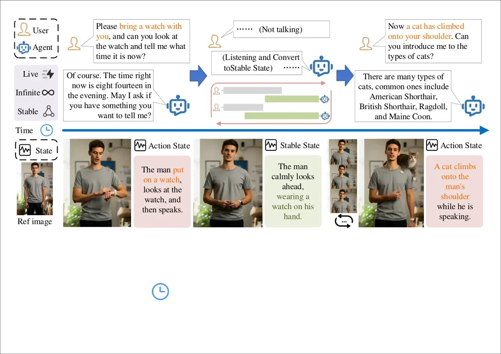
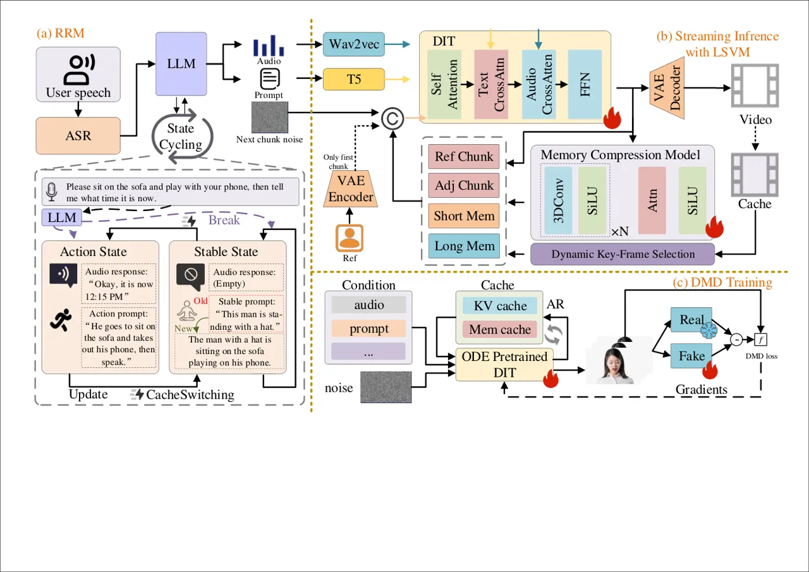
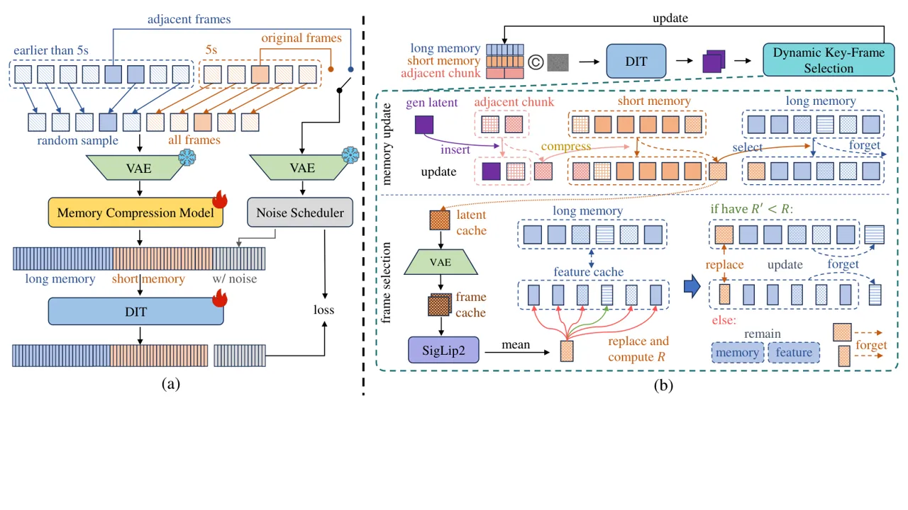
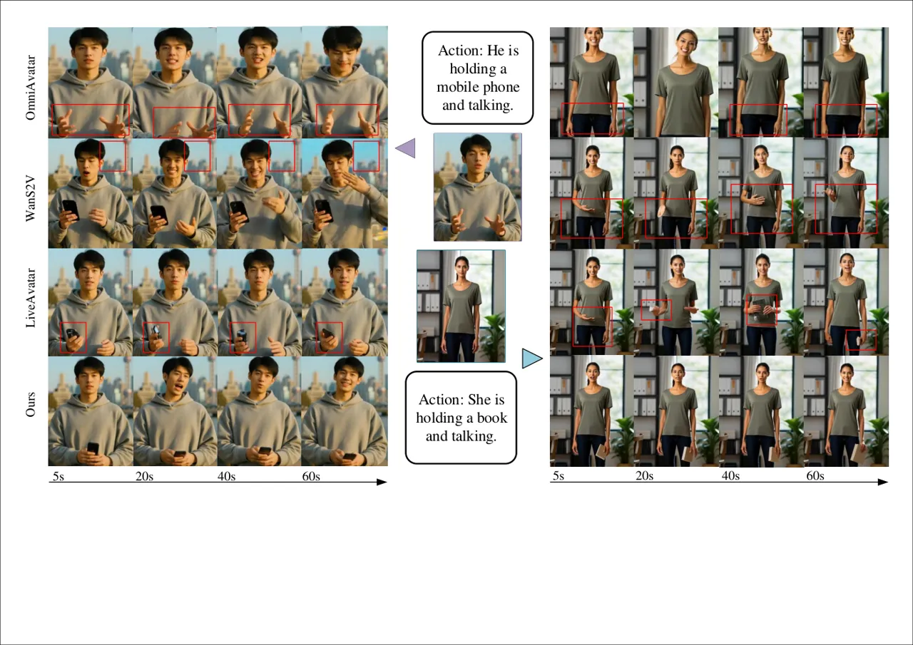
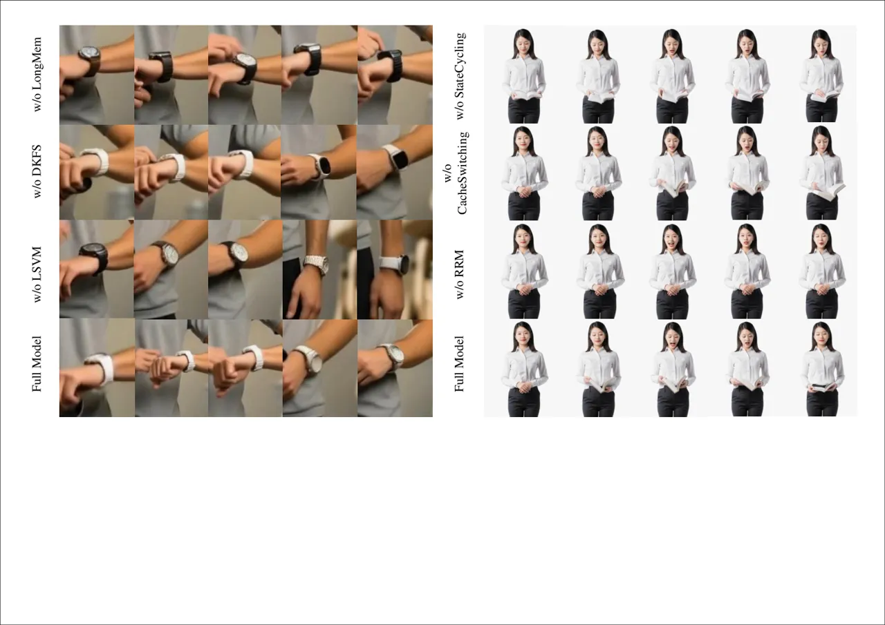

# InteractiveAvatar: Real-Time Streaming Video Generation for Consistent and Intent-Aware Avatars

Quanyue Song^(∗†) Affiliation: State Key Laboratory of Human-Machine
Hybrid Augmented Intelligence, Institute of Artificial Intelligence and
Robotics, Xi’an Jiaotong University, China Affiliation: China Telecom
Artificial Intelligence Technology (Beijing) Co., Ltd., China    Yishan
He^(†) Affiliation: China Telecom Artificial Intelligence Technology
(Beijing) Co., Ltd., China    Yanfei Zhang Affiliation: China Telecom
Artificial Intelligence Technology (Beijing) Co., Ltd., China    Shihao
Cheng^(∗) Affiliation: China Telecom Artificial Intelligence Technology
(Beijing) Co., Ltd., China Affiliation: State Key Laboratory of
Information Engineering in Surveying, Mapping and Remote Sensing, Wuhan
University, China    Zhixiang He Affiliation: China Telecom Artificial
Intelligence Technology (Beijing) Co., Ltd., China    Zhizhi Guo^(✉)
Affiliation: China Telecom Artificial Intelligence Technology (Beijing)
Co., Ltd., China    Chi Zhang Affiliation: Institute of Artificial
Intelligence (TeleAI), China Telecom, China    Xuelong Li
Affiliation: Institute of Artificial Intelligence (TeleAI), China
Telecom, China    Caigui Jiang^(✉) Affiliation: State Key Laboratory of
Human-Machine Hybrid Augmented Intelligence, Institute of Artificial
Intelligence and Robotics, Xi’an Jiaotong University, China

###### Abstract

Recent diffusion-based models have enabled realistic audio-driven avatar
generation in real-time streaming. However, existing approaches struggle
to maintain visual temporal consistency and fail to explicitly perceive
user intent in complex interactive streaming scenarios. To address these
challenges, we propose InteractiveAvatar, a real-time infinite-streaming
video generation framework that supports visually consistent avatar
video generation and intent-aware interactions. With autoregressive
distillation, InteractiveAvatar achieves real-time str-eaming generation
of human avatars over arbitrarily long durations. For visual
consistency, we introduce a Long-Short Visual Memory (LSVM) mechanism
that flexibly compresses historical visual information into compact
tokens, preserving both short-range coherence and long-term consistency.
To generate avatars with speeches and actions aligned with user intent,
we propose a Reasoning-Reaction Module (RRM), which incorporates a
State-Cycling strategy and a Cache-Switching mechanism. Extensive
experimental results over diverse scenarios demonstrate that our method
achieves state-of-the-art visual consistency in long-duration
generation, while enabling complex user-avatar interaction in real time.

###### Keywords: 

Real-Time Video Generation Audio-Driven Avatar Diffusion Model

^(†)^(†)footnotetext: ^(∗) Work done during an internship at China
Telecom Artificial Intelligence Technology (Beijing) Co.,
Ltd.^(†)^(†)footnotetext: ^(†) Equal contribution.^(†)^(†)footnotetext:
^(✉) Corresponding author.

## 1 Introduction

With the development of diffusion-based models for audio-driven avatar
generation, it has become possible to synthesize videos with accurate
lip synchronization, highly realistic and visually appealing
appearances \[1, 16, 34, 4\]. Furthermore, recent advances \[42, 20,
26\] show promising results in real-time streaming diffusion generation
of human avatars. However, existing approaches \[46, 14, 38, 26, 33\]
show limitations in user-avatar interaction and visual consistency in
streaming generation. These methods are typically restricted to simple
interactive scenarios, such as speaking or listening synchronously with
the audio, which is limited in understanding the user intent and
maintaining consistency in more complicated scenarios. These limitations
highlight two fundamental obstacles that continue to hinder the
development of truly realistic and interactive human avatars.

The first challenge lies in maintaining temporal consistency during
long-duration video generation. In interactive scenarios with sustained
user engagement, visual content evolves continuously, resulting in
substantial scene variations and increased complexity. Most existing
real-time streaming methods \[14, 26\] employ causal attention, limiting
the model’s receptive field to a few previously generated chunks along
with reference image. When the generated content gradually diverges from
this initial reference, inconsistencies tend to emerge between adjacent
chunks, causing significant temporal drift and the degradation of
long-range video consistency.

The second challenge concerns the user-avatar interaction. Beyond
generating verbal responses, a realistic avatar is expected to perform
actions that are semantically aligned with the user’s intent. For
instance, when a user asks "Can you check what time it is on the
watch?", the avatar should glance at a watch while verbally providing
the time. Existing approaches \[38, 33\], however, predominantly follow
an audio-driven paradigm, using response speech generated by large
language models to animate lip movements and synthesizing limited
actions or gestures based on coarse audio-motion correlations learned
from training data. This design overlooks explicit modeling of user
intent, making it difficult to generate fine-grained and intent-aware
actions such as checking time using a watch, thereby limiting the
realism of interactive behavior.



Figure 1: We propose InteractiveAvatar, a real-time streaming
audio-driven avatar generation framework that enables intent-aware
interaction. InteractiveAvatar interprets user intent to generate
contextually relevant actions throughout the dialogue while maintaining
long-range visual consistency.

To address these challenges, we propose InteractiveAvatar (see Fig. 1).
InteractiveAvatar introduces a real-time interactive generation
paradigm, in which the avatar can respond to users by not only producing
speech, but also performing intent-aligned actions and adaptively
updating the surrounding scene, while maintaining strong visual
consistency over long-duration video generation. Specifically, our
framework incorporates a Long-Short Visual Memory (LSVM) mechanism and a
Reasoning-Reaction Module (RRM) into the real-time streaming diffusion
generation.

The LSVM mechanism maintains temporal consistency in streaming
generation by jointly modeling short-term and long-term visual
information. The short-term memory preserves recently generated frames
to ensure coherent transitions and local continuity, while the long-term
memory retains representative visual states that capture critical
information throughout the entire generation process. We propose a
Dynamic Key-Frame Selection strategy, which flexibly transfers visually
important content from the short-term memory to the long-term memory
during inference, enabling the model to preserve essential global
information and prevent temporal drift over long-duration generation.

The RRM enhances the realism of user-avatar interaction by leveraging a
large language model for intent understanding and state management.
Given user input, it infers the underlying intent and generates
corresponding verbal responses and action instructions to guide avatar
synthesis. To ensure a natural interaction flow, we design a
State-Cycling strategy that enables smooth transitions between listening
and execution states. Additionally, memory augmentation is incorporated
to maintain consistency between avatar behavior and scene evolution. We
further introduce a Cache-Switching mechanism to accelerate action
execution and scene transitions, thereby reducing perceived latency
during interaction.

By integrating these two components with streaming generation approach,
InteractiveAvatar enables real-time synthesis of highly consistent and
interactive human avatars. We evaluate InteractiveAvatar across multiple
user-instruction scenarios to assess its responsiveness and generation
quality. Both qualitative and quantitative results demonstrate that
InteractiveAvatar achieves real-time avatar generation while maintaining
strong visual consistency over long-duration video sequences, as well as
supporting realistic and complex user-avatar interactions.

Contributions of our InteractiveAvatar are listed below:

- •
  We propose InteractiveAvatar, a novel real-time streaming audio-driven
  avatar generation framework that supports long-duration video
  synthesis with strong visual consistency and intent-aware user-avatar
  interaction.
- •
  We introduce a Long-Short Visual Memory mechanism that flexibly
  preserves historical visual representations, enabling the model to
  maintain attention to past content and significantly improving visual
  coherence in long-duration generation.
- •
  We design a Reasoning-Reaction Module equipped with a State-Cycling
  strategy and a Cache-Switching mechanism, enabling intent-aware
  interaction and efficient command execution with reduced latency.

## 2 Related Work

### 2.1 Audio-Driven Avatar Generation

Audio-driven avatar generation aims to synthesize realistic human videos
conditioned on speech while preserving identity and motion consistency.
Early methods, such as Wav2Lip \[23\], focus primarily on accurate lip
synchronization but fail to model head and body movements. Later
two-staged animators \[46, 40\] improve controllability on expressions
and head movements by first predicting latent motion representations
from audio and further rendering avatar expressions and head motions
using these latent representations, yet these methods are still
constrained by predefined motion priors and lack of natural body
movements. More recently, diffusion-based frameworks, particularly
DiT-style architectures \[34, 16, 3, 7, 27, 2, 10, 21\], have
significantly improved audio-driven avatar generation in visual fidelity
and naturalness. However, their iterative denoising process incurs
substantial computational overhead, hindering real-time streaming and
long-term consistency in interactive scenarios. Moreover, most methods
rely solely on audio signals, limiting their ability to model high-level
user intent.

### 2.2 Streaming Video Generation

Typical bidirectional attention-based video diffusion generators \[2,
31\] suffer from low computational efficiency, limited video duration,
and poor temporal stability. To address these problems, recent
works \[14, 38, 26\] distill bidirectional diffusion transformers into
causal autoregressive architectures for streaming inference. For
example, CausVid \[42\] introduces block-causal attention with
distribution matching distillation. And Self-Forcing \[13\] further
mitigate train-test mismatches by conditioning on previously generated
frames during training and further improve long-horizon stability. Other
approaches \[8, 41\] explore rolling-window denoising, attention sinks,
or KV-recache strategies to reduce temporal drift and error
accumulation. Despite these advances, existing methods mainly rely on a
limited number of previously generated chunks and focus mainly on local
temporal context. This limitation prevents effective modeling of
long-range information across the generation horizon, resulting in
degraded long-range consistency and temporal drift.

### 2.3 Interactive Avatar Generation

Interactive avatar generation aims to create avatars capable of engaging
in natural and responsive user interactions. Early methods \[49, 23,
11\] rely on generating actions conditioned from audio cues, where a
speech model drives lip movements and simple gestures. The generated
results are largely depend on acoustic cues, with synchronized but
simple gestures. Recent works \[20, 9\] on interactive avatars have
explored audio-driven streaming diffusion to enable responsive
user-avatar interactions. However, these methods lack multi-turn
conversational memory or action-level reasoning. More recent
studies \[33, 22, 35\] have incorporated limited “listening states” or
predefined actions to simulate interaction, yet they cannot maintain
long-term context or produce intent-aware behaviors. In contrast, our
approach integrates a human-imitating reasoning module with
memory-enhanced diffusion-based video synthesis, enables real-time,
context-aware, and temporally consistent interactive avatar behavior,
bridging the gap between simple reactive systems and fully intent-aware
digital humans.



Figure 2: Overview of InteractiveAvatar, which consists of (a) The
Reasoning-Reaction Module (RRM) performs intent-aware interaction with
user; (b) Streaming Inference with Long-Short Visual Memory (LSVM)
mechanism to enhance the visual consistency; and (c) DMD training for
real-time streaming generation.

## 3 Method

As illustrated in Figure 2, given an avatar reference image and user
speech input, InteractiveAvatar aims to generate a real-time video that
animates the avatar to naturally respond to the user. The speech signal
is first transcribed into text via an automatic speech recognition (ASR)
system. The transcribed text is then processed by the Reasoning-Reaction
Module (RRM) to produce intent-aware verbal and action instructions
(Sec. 3.3). Conditioned on these outputs, a streaming video generation
model with Long-Short Visual Memory (LSVM) mechanism synthesizes
temporally coherent video frames in real time (Sec. 3.2). Finally, the
model is trained using self-forcing for autoregressive distillation to
enable stable, efficient generation (Sec. 3.4), producing intent-aware,
temporally consistent avatar videos.

### 3.1 Preliminaries

#### Diffusion Transformer

We build our method upon a Diffusion Transformer (DiT). A pre-trained
VAE encodes input data $`x`$ into latent representations $`z=E(x)`$.
During forward diffusion, Gaussian noise is progressively added to
obtain $`z_{t}=\sqrt{\alpha_{t}}z+\sqrt{1-\alpha_{t}}\epsilon`$. The DiT
model $`\epsilon_{\theta}(z_{t},t,c)`$ predicts the injected noise at
timestep $`t`$ conditioned on signal $`c`$. Training minimizes the mean
squared error between predicted and true noise:

```math
\mathcal{L}=\mathbb{E}_{t,z_{t},c,\epsilon}\left[\|\epsilon_{\theta}(z_{t},t,c)-\epsilon\|_{2}^{2}\right] \tag{1}
```

We adopt Wan2.2 5B \[31\] as the base model, which employs a causal 3D
VAE for spatiotemporal representation learning \[19, 44, 18\]. Text
conditioning is obtained via T5 \[24\] embeddings and injected through
cross-attention, while timestep information is incorporated via learned
modulation parameters.

#### Distribution Matching Distillation

Distribution Matching Distillation (DMD) distills a pre-trained teacher
diffusion model into a few-step student generator by aligning their
intermediate noisy distributions \[42\]. Let $`G_{\theta}(z)`$ be the
student generator with $`\hat{x}=G_{\theta}(z)`$ and
$`z\sim\mathcal{N}(0,I)`$. Denote by $`p_{\theta,t}(x_{t})`$ and
$`p_{\text{data},t}(x_{t})`$ the student-induced and teacher-induced
distributions at time step $`t`$, respectively. DMD minimizes the
reverse KL divergence:

```math
\mathcal{L}_{\text{DMD}}=\mathbb{E}_{t}\left[D_{\text{KL}}\big(p_{\theta,t}\,\|\,p_{\text{data},t}\big)\right]. \tag{2}
```

Its gradient can be written as:

```math
\nabla_{\theta}\mathcal{L}_{\text{DMD}}=-\mathbb{E}_{t,z}\left[\left(s_{\text{real}}(x_{t},t)-s_{\text{fake},\phi}(x_{t},t)\right)^{\top}\frac{\partial G_{\theta}(z)}{\partial\theta}\right] \tag{3}
```

where $`x_{t}=\Psi(\hat{x},t)`$, and $`s_{\text{real}}`$ and
$`s_{\text{fake},\phi}`$ denote the teacher and student score functions.
Training alternates between updating $`s_{\text{fake},\phi}`$ and
optimizing $`G_{\theta}`$. For multi-step distillation, a student
rollout is first constructed, and a random intermediate state is used to
stabilize training. In our approach, we adopt DMD to distill the
diffusion model into a few-step generator, enabling real-time video
generation.

### 3.2 Long-Short Visual Memory

Preserving key information from previous frames is essential for
temporal coherence and visual consistency in long-duration video
generation. However, storing all historical frames is computationally
expensive and impractical for streaming generation. Inspired by \[45\]
on memory compression and efficient context modeling, we propose
Long-Short Visual Memory (LSVM) mechanism (Fig. 3). To effectively
capture both global appearance characteristics and recent visual
dynamics, we decompose the memory into long-term memory and short-term
memory. The short-term memory maintains dense representations of
recently generated frames to ensure local temporal coherence, while the
long-term memory stores compact representations of globally salient
visual states to stabilize overall appearance consistency. A Key-Frame
Selection strategy is introduced to determine when short-term memory
entries should be promoted to long-term memory, as well as when outdated
long-term memory elements should be discarded, enabling adaptive memory
updating during streaming generation.



Figure 3: LSVM Mechanism.(a) During training, long-term memory frames
are randomly sampled, while short-term memory retains all recent frames.
(b) During inference, Dynamic Key-Frame Selection adaptively updates
memory to retain critical visual information.

#### Long-Short Memory Compression

We apply a lightweight compression model $`\mathcal{C}(\cdot)`$ to
obtain compact memory tokens. The architecture of $`\mathcal{C}(\cdot)`$
is similar to \[45\], consisting of a sequence of convolutional layers
followed by attention modules. Given the generated video latent frames
$`z_{t}`$, the compact memory tokens can be represented as:

```math
m_{t}=\mathcal{C}(z_{t}) \tag{4}
```

where the temporal compression ratio is set to $`1`$, ensuring no
temporal downsampling during streaming generation. This design avoids
temporal merging across latents, which simplifies latent-wise separation
and update during streaming generation.

We maintain two memory buffers: a short-term memory $`\mathcal{M}_{s}`$
and a long-term memory $`\mathcal{M}_{l}`$. The short-term memory stores
recent compressed tokens within a fixed window of size $`K`$ to
preserving local continuity:

```math
\mathcal{M}_{s}=\{m_{t-K+1},\dots,m_{t}\} \tag{5}
```

The long-term memory maintains a compact set of globally representative
tokens with fixed capacity $`N`$:

```math
\mathcal{M}_{l}=\{\tilde{m}_{1},\dots,\tilde{m}_{N}\} \tag{6}
```

We first concatenate the compressed long-term and short-term memory
tokens into a unified history representation
$`\Phi(H)=\text{Concat}(\mathcal{M}_{l},\mathcal{M}_{s})`$, where
$`\mathcal{M}_{s}`$ contains the recent $`K`$ short-term tokens and
$`\mathcal{M}_{l}`$ contains the $`N`$ long-term representative tokens.
This design enables the model to jointly capture local temporal
continuity and global long-range dependencies.

During training, we randomly sample a video segment
$`H=\{z_{1},\dots,z_{T}\}`$. The last $`K`$ consecutive frames (we set
the length to 5s) of the segment are treated as the short-term memory
source $`\Omega_{s}`$, while from the preceding history $`i<t-K+1`$, we
randomly sample a fixed number of frame indices $`\Omega_{l}`$ to
construct the long-term memory:

```math
\mathcal{M}_{l}=\{m_{i}\mid i\in\Omega_{l},;i<t-K+1\} \tag{7}
```

To train the reconstruction capability, we sample a set of frame indices
$`\Omega`$ from the full segment $`H`$ as diffusion targets. Depending
on the temporal location of each sampled frame, we apply different
strategies. For sampled indices within the short-term memory, we
randomly keep the subset $`\Omega`$ unchanged and mask all remaining
frames. For sampled indices within the long-term range, we preserve the
frame that is temporally closest to $`\Omega`$ as an anchor frame and
mask all remaining frames, as it preserves similar semantic content
while providing a slightly different observation for denoising. This
design encourages the long-term memory to capture not only pixel-level
content but also consistent scene elements.

All masked frames are corrupted using a noise-as-mask strategy. After
masking, we clone the clean frames $`\{z_{i}\mid i\in\Omega\}`$ as the
diffusion targets. The diffusion model is then trained to reconstruct
these target frames at arbitrary temporal positions conditioned on the
compressed memory representation $`\Phi(H)`$. This objective can be
written as:

```math
\mathbb{E}_{H,\Omega,c,\epsilon,t_{i}}||(\epsilon-H_{\Omega})-G_{\theta}\big((H_{\Omega})_{t_{i}},t_{i},c,\Phi(H)\big)||_{2}^{2} \tag{8}
```

where $`H_{\Omega}`$ denotes the selected clean target frames,
$`\epsilon_{i}\sim\mathcal{N}(0,I)`$ correspond to sampled noise levels
and $`\Phi(H)`$ is the concatenated long-short memory representation.

By randomly sampling reconstruction targets from both short-term and
long-term regions, the model is compelled to encode the entire history
in a balanced manner, preserving fine-grained details and global visual
consistency essential for stable streaming autoregressive generation.

#### Dynamic Key-Frame Selection

To maintain a compact yet semantically representative long-term memory,
we introduce a Dynamic Key-Frame Selection (DKFS) strategy during
inference.

The short-term memory $`\mathcal{M}_{s}`$ is implemented as a
fixed-length first-in-first-out (FIFO) queue of size $`K`$. At
initialization, all entries are filled with the compressed
representation of the first frame
$`\mathcal{M}_{s}^{(0)}=\{m_{1},\dots,m_{1}\}`$. During streaming
generation, each newly generated latent frame $`z_{t}`$ is compressed
into $`m_{t}=\mathcal{C}(z_{t})`$ and appended to $`\mathcal{M}_{s}`$,
while the oldest token is removed
$`\mathcal{M}_{s}\leftarrow\text{Push}(\mathcal{M}_{s},m_{t})`$.
Whenever a token $`m_{\text{out}}`$ is popped from $`\mathcal{M}_{s}`$,
the corresponding frame becomes a candidate for long-term memory update.

For each popped frame, we retrieve its corresponding real image frames
and feed them into SigLIP2 \[28\] to obtain semantic feature vectors.
The features are averaged to produce a single semantic descriptor:

```math
\mathbf{s}_{\text{cand}}=\frac{1}{n}\sum_{j=1}^{n}f_{\text{SigLIP2}}(I_{j}) \tag{9}
```

where $`{I}_{j}^{n}`$ are the associated real frames and
$`f_{\text{SigLIP2}}(\cdot)`$ denotes the feature extractor.

The long-term memory $`\mathcal{M}_{l}`$ is a fixed-capacity buffer of
size $`N`$, initialized by repeating the first frame
$`\mathcal{M}_{l}^{(0)}=\{\tilde{m}_{1},\dots,\tilde{m}_{1}\}`$. Frames
selected for long-term memory are inserted in chronological order,
ensuring temporal interpretability. To decide whether a candidate frame
should be retained in $`\mathcal{M}_{l}`$, we evaluate its contribution
to global semantic diversity. Let
$`\{\mathbf{s}_{1},\dots,\mathbf{s}_{N}\}`$ denote the current semantic
feature set of the long-term memory. For each memory entry
$`\mathbf{s}_{i}`$, we compute its mean cosine similarity to all other
entries and then compute the global redundancy score:

```math
\bar{\rho}_{i}=\frac{1}{N-1}\sum_{j\neq i}\text{cos}\big(\mathbf{s}_{i},\mathbf{s}_{j}\big),\quad R=\frac{1}{N}\sum_{i=1}^{N}\bar{\rho}_{i} \tag{10}
```

If replacing a slot in $`\mathcal{M}_{l}`$ with the candidate feature
$`\mathbf{s}_{\text{cand}}`$ leads to a lower redundancy score
$`R^{\prime}<R`$, the candidate frame is retained and inserted into
long-term memory. Otherwise, it is forgot.

This strategy encourages the long-term memory to maintain semantically
diverse and globally representative key frames. Instead of storing
frames uniformly over time, the memory adaptively preserves frames that
introduce novel semantic content, thereby maximizing coverage of
distinct scenes, identities, and objects across long video streams.

### 3.3 Reasoning-Reaction Module

To enable interactive and controllable avatar behaviors under streaming
generation, we introduce a Reasoning-Reaction Module (RRM), which
leverages a Large Language Model (LLM) \[39\] for intent understanding
and state management. The RRM serves as an information reasoning and
response center that bridges multimodal user input and diffusion-based
visual generation. It consists of two core components: State-Cycling
strategy and a Cache-Switching mechanism.

#### State-Cycling Strategy

Under the State-Cycling strategy, when a user provides speech input, the
audio is first transcribed into text and then fed into the LLM together
with the current stable state. The LLM outputs two states: an action
state, which includes the action prompt $`p^{\text{act}}`$ and the
response audio $`a^{\text{resp}}`$, and a stable state, which contains
the stable-state prompt $`p^{\text{stable}}`$. The $`p^{\text{act}}`$
describes the motion to be executed (e.g., standing up or sitting down),
the $`a^{\text{resp}}`$ contains the spoken reply, and the
$`p^{\text{stable}}`$ represents the static visual condition after the
action is completed (e.g., the person is sitting calmly). Formally,
given user text $`x_{t}`$ and previous stable-state prompt
$`p^{\text{stable}}_{t-1}`$, the LLM produces

```math
(p^{\text{act}}_{t},a^{\text{resp}}_{t},p^{\text{stable}}_{t})=\mathrm{LLM}(x_{t},\mathcal{S}_{t-1}) \tag{11}
```

During generation, the diffusion model is conditioned on
$`(p^{\text{act}}_{t},a^{\text{resp}}_{t})`$ while the response audio is
active, where the audio drives lip synchronization and the action prompt
guides body motion and pose transitions. Once the response audio
finishes, the audio condition is set to empty and the conditioning
prompt is replaced by $`p^{\text{stable}}_{t}`$. The system then
continues generation using only the stable-state prompt, ensuring that
the character remains visually consistent without unnecessary motion
drift. The model stays in this stable state until a new user instruction
arrives and the LLM produces the next action, forming a cyclic process
of reasoning, reaction, and stabilization.

#### Cache-Switching Mechanism

To reduce latency under streaming generation, we introduce a
Cache-Switching mechanism for prompt-conditioned key-value (KV) cache.
Due to the autoregressive setup, previously adjacent generated chunks
are computed based on earlier prompts. When the action prompt switches
to a new one $`p^{\text{act}}_{t}`$, these cached KV become inconsistent
with the updated instruction.

To accelerate adaptation to a new prompt, when the action prompt
switches, we re-encode the updated text condition and recompute the
prompt-conditioned KV tensors of the previously adjacent chunks using
the new prompt. These updated KV cache are then used for subsequent
attention. Let $`\mathcal{K}_{\text{old}}`$ denote the cached latent
frame KV tensors under the previous prompt $`p^{\text{act}}_{t-1}`$ and
$`\mathcal{K}_{\text{new}}`$ those recomputed using
$`p^{\text{act}}_{t}`$. The update is written as

```math
\mathcal{K}\leftarrow\mathrm{Replace}(\mathcal{K}_{\text{old}},\mathcal{K}_{\text{new}}), \tag{12}
```

where only the affected chunks are refreshed. This Cache-Switching
mechanism enables efficient realignment with updated action prompts,
thereby reducing latency during streaming generation.

### 3.4 Autoregressive Distillation Adaption

We adapt a pretrained diffusion backbone into a stable and efficient
real-time streaming generation model through a four-stage training
pipeline. First, we train an image-audio-to-video (AI2V) model based on
bidirectional attention on the large-scale audio-visual data,
establishing strong speech-driven video generation capability. Second,
we pretrain the proposed memory compression module
$`\mathcal{C}(\cdot)`$ on the video reconstruction task so that it can
efficiently and adaptively compress visual tokens. Third, we perform ODE
initialization by training the model with block-wise causal attention to
approximate the bidirectional teacher’s ODE trajectories. The causal
attention mask is set as in \[41\] during training for both acceleration
and high fidelity, along with the optimization of the long short memory
compression module. Finally, we apply Self-Forcing DMD training to
distill the diffusion model, together with the LSVM, into a few-step
autoregressive generator by minimizing the reverse KL divergence between
their induced noisy distribution, enabling stable rollout with
substantially reduced sampling steps for real-time inference.

## 4 Experiments

### 4.1 Experimental Setup

Our framework is built upon the Wan 2.2 5B \[31\] model as the backbone.
All training and inference are conducted at the resolution of 576p(e.g.
1024x576 in the aspect ratio of 16:9), generating 3 latent per chunk in
the streaming setting. Training is performed on 64 NVIDIA H100 GPUs,
with 50K steps in Stage 1, 30K steps in Stage 2, and 20K steps in Stage
3 and Stage 4. We employ Fully Sharded Data Parallel (FSDP) \[48\] with
hybrid sharding to reduce memory consumption while enhancing efficiency.
The learning rate is set to 1e-5 for the student branch and 2e-6 for the
fake score branch. For inference, to enable real-time streaming
interation, we first implement kv caching to avoid recomputing
key-values of the generated chunks. We also use the pipeline
parallelism \[20\] for further acceleration by deploying the DiT and VAE
model on different GPU devices. With these optimizations, we provide an
end-to-end latency breakdown to better understand the system bottleneck.
Specifically, the DiT module takes approximately 450 ms, the lightweight
VAE decoding requires about 50 ms, the LLM audio response accounts for
around 1600 ms, and other overhead contributes roughly 450 ms. Taken
together, the overall Time-to-First-Frame(TTFF), is approximately 2.6s.

### 4.2 Dataset

We curate a large-scale audio-visual dataset consisting of approximately
3 million high-quality clips after filtering \[15\]. The dataset is
composed of three complementary subsets. The first subset focuses on
speech-driven talking-head videos, including HDTF \[47\], VFHQ \[37\],
VoxCeleb2 \[5\], CelebV-Text \[43\], and AVSpeech \[47\], which provide
high-resolution facial videos with diverse identities and rich speech
content for accurate lip synchronization and fine-grained facial motion
modeling. The second subset consists of movie and TV-show data primarily
collected from OpenHumanVid \[17\], capturing complex scenes, expressive
performances, and temporal dynamics to improve realism and robustness.
The third subset consists of our proprietary conversational dataset,
featuring long-duration speaking segments accompanied by rich and
diverse body movements. This subset emphasizes sustained speech,
expressive gestures, and natural head-shoulder dynamics, providing
strong temporal continuity and interaction cues for streaming
generation.

### 4.3 Metrics

We evaluate our model from two perspectives: video quality and
consistency. For video quality, we assess final video’s perceptual
quality using Q-align (IQA) \[36\] and aesthetic appeal (ASE).
Distribution-level fidelity is measured by FID \[12\] for frame-wise
realism and FVD \[30\] for overall spatio-temporal coherence. For video
consistency, we measure audio-visual synchronization using SynC and
SynD \[6\], capturing the correspondence between lip movements and input
audio. Object-level temporal consistency (OBJ) is evaluated with Gemini,
while identity preservation across frames (ID) is measured using
DINOv3 \[25\], as avatar videos involve full-body appearance and
clothing beyond facial identity. Finally, we use VideoCLIP-XLv2 \[32\]
to assesses the alignment between the generated video and the input text
prompt (TV), reflecting the effectiveness of semantic control. In
addition, we compare the generation speed (FPS) of different models to
evaluate real-time performance and streaming efficiency.

### 4.4 Results

We compare InteractiveAvatar against current state-of-the-art
open-sourced audio-driven avatar generation approaches, including
StableAvatar \[29\], OmniAvatar \[10\], HYAvatar \[2\], Hallo3 \[7\],
EchoMimicV3 \[21\], WanS2V \[31\] and LiveAvatar \[14\]. We selected 500
videos as our testset and set up interactive scenarios, ranging from
simple short to complex long video interactions, with action switches at
designated times. For non-real-time models, inference is performed in
batches, referencing the last few frames of the previous batch to
construct long videos. Quantitative results on relevant objective
metrics are presented in Tab. 1.



Figure 4: Qualitative comparisons with state-of-the-art methods. Our
method exhibits better visual consistency and following of action
instructions.

| Model        | Video Quality    |                  |                    |                    | Consistency       |                     |                  |                 |                 | Speed            |
| ------------ | ---------------- | ---------------- | ------------------ | ------------------ | ----------------- | ------------------- | ---------------- | --------------- | --------------- | ---------------- |
|              | IQA $`\uparrow`$ | ASE $`\uparrow`$ | FID $`\downarrow`$ | FVD $`\downarrow`$ | SynC $`\uparrow`$ | SynD $`\downarrow`$ | OBJ $`\uparrow`$ | ID $`\uparrow`$ | TV $`\uparrow`$ | FPS $`\uparrow`$ |
| StableAvatar | 3.91             | 3.82             | 79.7               | 654.1              | 3.57              | 10.27               | 79.5             | 4.41            | 25.34           | 0.69             |
| OmniAvatar   | 3.77             | 3.87             | 94.1               | 831.9              | 4.94              | 7.87                | 82.8             | 4.38            | 24.57           | 0.17             |
| HYAvatar     | 3.81             | 3.93             | 76.5               | 632.6              | 4.78              | 8.11                | 78.9             | 4.46            | 25.61           | 0.09             |
| Hallo3       | 3.57             | 3.29             | 112.5              | 1127.6             | 4.21              | 9.74                | 75.1             | 4.31            | 24.92           | 0.28             |
| EchoMimicV3  | 3.96             | 3.89             | 85.2               | 773.9              | 3.89              | 10.09               | 80.3             | 4.45            | 25.56           | 0.81             |
| WanS2V       | 3.76             | 3.68             | 88.4               | 793.5              | 4.54              | 8.95                | 82.6             | 4.49            | 25.14           | 0.26             |
| LiveAvatar   | 3.94             | 3.91             | 83.9               | 672.7              | 4.91              | 8.17                | 76.9             | 4.53            | 25.78           | 21.94            |
| Ours         | 3.87             | 3.89             | 80.2               | 701.4              | 4.86              | 7.91                | 85.2             | 4.51            | 25.93           | 26.68            |

Table 1: Quantitative comparison with state-of-the-art methods. Best in
bold and second best underlined. Experiments are conducted using the
H100 GPU.

In terms of video quality, while it does not achieve the best IQA, ASE,
FID and FVD scores, InteractiveAvatar maintains reasonable visual
fidelity, indicating its ability to generate avatars with consistent and
plausible appearance. Regarding temporal and semantic consistency,
InteractiveAvatar demonstrates clear advantages. It achieves the highest
OBJ and TV, and competitive ID score, indicating strong object
consistency across frames, robust identity preservation, and stable
temporal variation throughout the video. Moreover, our model maintains
accurate lip synchronization and exhibits improved alignment to user
instructions compared with other baselines. These results highlight that
InteractiveAvatar can generate videos that are not only visually
coherent over time but also faithful to both content and user intent.
Moreover, by leveraging the lightweight 5B model, InteractiveAvatar
reduces hardware requirements while achieving higher inference speed and
faster than all other baselines.

Qualitative visualizations further compare our method with
OmniAvatar \[10\], WanS2V \[31\] and LiveAvatar \[14\] in Fig. 4. In the
two demonstrated scenarios, OmniAvatar fails to follow the action
instructions and exhibits abrupt camera angle changes. WanS2V shows
noticeable quality degradation over time in the first scenario and fails
to follow action instructions in the second. LiveAvatar successfully
triggers the specified objects according to the action instructions, but
the objects’ shapes and colors change rapidly during inference,
resulting in low object consistency. In contrast, our method follows the
input action instructions while maintaining high consistency for both
objects and avatars throughout the interaction.

### 4.5 Ablation Studies



Figure 5: Qualitative ablation of InteractiveAvatar. Ablation studies
show that our Full model maintains the best visual consistency and
enables more realistic interactions.

We conduct ablation studies to analyze the impact of each component in
our framework by systematically modifying or removing key modules, as
summarized in Table 2. We evaluate both consistency-related metrics
(OBJ, ID, TV) and inference speed (FPS).

|                    |                  |                 |                 |                  |
| ------------------ | ---------------- | --------------- | --------------- | ---------------- |
| Method             | OBJ $`\uparrow`$ | ID $`\uparrow`$ | TV $`\uparrow`$ | FPS $`\uparrow`$ |
| w/o LongMem        | 82.6             | 4.43            | 25.91           | 28.92            |
| w/o DKFS           | 83.1             | 4.45            | 25.85           | 26.83            |
| w/o LSVM           | 78.4             | 4.38            | 25.87           | 30.04            |
| w/o StateCycling   | 84.1             | 4.46            | 25.42           | 26.68            |
| w/o CacheSwitching | 84.5             | 4.47            | 25.76           | 26.75            |
| w/o RRM            | 83.8             | 4.46            | 24.89           | 26.75            |
| w/o DMD            | \-               | \-              | \-              | 1.27             |
| Ours               | 85.2             | 4.51            | 25.93           | 26.68            |

Table 2: Ablation on the LSVM, RRM and DMD.

For the ablation study of the LSVM module, we design a scenario where
the avatar wears a watch during interaction. Removing the long-term
memory token (w/o LongMem) degrades object and identity consistency,
demonstrating the necessity of long-range temporal modeling. Replacing
Dynamic Key-Frame Selection with random sampling (w/o DKFS) causes
slight distortions in the watch face, highlighting the advantage of
informed memory updates. Removing the entire LSVM module (w/o LSVM)
leads to a significant drop in OBJ, confirming its importance for visual
consistency, though FPS increases due to reduced computation. As shown
in Fig. 5, only the full model reliably preserves the watch’s shape and
color.

For the Reasoning-Reaction Module (RRM), removing the State Cycling
strategy and using a fixed action prompt (w/o StateCycling) causes the
model to repeatedly execute a single action, reducing interaction
realism. Disabling Cache-Switching (w/o CacheSwitching) increases
response latency to prompt changes, which can cause delays or failures
in the onset of prompt-related motions, making actions such as picking
up and opening a book noticeably slower. Removing the entire RRM (w/o
RRM) and reverting to a default prompt prevents the avatar from
understanding user intent, resulting in only verbal responses without
corresponding actions. These results demonstrate the necessity of
dynamic state control and intent-aware reasoning. In contrast, our full
model achieves natural interaction with low latency.

Finally, inference speed drops dramatically without DMD distillation
(w/o DMD), verifying that DMD is essential for real-time performance. We
do not report other metrics for the w/o DMD setting, as the model fails
to achieve long video generation. When inference is performed by using
the last frame of the previous segment as the first frame of the next
segment, the video quality progressively degrades after multiple
segments.

## 5 Conclusion

In this work, we present InteractiveAvatar, a novel real-time streaming
diffusion framework that bridges the gap between high-quality avatar
generation and realistic, intent-aware human-avatar interaction by
jointly addressing two core challenges, long visual consistency and
interactive responsiveness. Specifically, the proposed LSVM mechanism
effectively mitigates temporal drift during extended streaming
generation, preserving both local coherence and global identity
consistency. Meanwhile, the RRM empowers the avatar to interpret user
intent and generate coordinated speech and actions. In summary,
InteractiveAvatar achieves real-time, long-duration, and intent-aware
avatar generation, providing a practical foundation for next-generation
immersive and intelligent digital humans.

#### Limitations and Future work

Due to the limited memory capacity and key-frame selection strategy,
long videos or large motions, especially those that deviate
significantly from the reference frame, may degrade as early latents are
discarded, or some generated objects may gradually disappear. In
addition, objects absent from the first frame may appear abruptly when
mentioned in the instruction, which is partly determined by the base
model capability. Although prompt design can help smooth object
emergence, this remains challenging. In future work, we aim to train
end-to-end generative models with larger-scale data and computation to
achieve smoother and more natural avatar interaction.

## Acknowledgements

We thank our colleagues for their assistance with data processing, and
the anonymous reviewers for their suggestive comments. This paper is
supported by NSFC under grant No. 62495092, No.62125305 and Natural
Science Basic Research Plan in Shaanxi Province of China (No.
2025SYS-SYSZD-023).

## References

- \[1\] H. An, W. Hu, S. Huang, S. Huang, R. Li, Y. Liang, J. Shao, Y.
  Song, Z. Wang, C. Yuan, et al. (2025) Ai flow: perspectives,
  scenarios, and approaches (2025). arXiv preprint arXiv:2506.12479.
  Cited by: §1.
- \[2\] Y. Chen, S. Liang, Z. Zhou, Z. Huang, Y. Ma, J. Tang, Q. Lin, Y.
  Zhou, and Q. Lu (2025) Hunyuanvideo-avatar: high-fidelity audio-driven
  human animation for multiple characters. arXiv preprint
  arXiv:2505.20156. Cited by: §2.1, §2.2, §4.4.
- \[3\] Z. Chen, J. Cao, Z. Chen, Y. Li, and C. Ma (2025) Echomimic:
  lifelike audio-driven portrait animations through editable landmark
  conditions. In Proceedings of the AAAI Conference on Artificial
  Intelligence, Vol. 39, pp. 2403–2410. Cited by: §2.1.
- \[4\] S. Cheng, J. Zhang, Q. Song, S. Liu, Z. Guo, X. Zhang, C.
  Zhang, X. Li, and Z. Tu (2026) Unison: harmonizing motion, speech, and
  sound for human-centric audio-video generation. External Links:
  2605.08729, [Link](https://arxiv.org/abs/2605.08729) Cited by: §1.
- \[5\] J. S. Chung, A. Nagrani, and A. Zisserman (2018) VoxCeleb2: deep
  speaker recognition. In INTERSPEECH, Cited by: §4.2.
- \[6\] J. S. Chung and A. Zisserman (2016) Out of time: automated lip
  sync in the wild. In Asian conference on computer vision, pp. 251–263.
  Cited by: §4.3.
- \[7\] J. Cui, H. Li, Y. Zhan, H. Shang, K. Cheng, Y. Ma, S. Mu, H.
  Zhou, J. Wang, and S. Zhu (2025) Hallo3: highly dynamic and realistic
  portrait image animation with video diffusion transformer. In
  Proceedings of the Computer Vision and Pattern Recognition Conference,
  pp. 21086–21095. Cited by: §2.1, §4.4.
- \[8\] J. Cui, J. Wu, M. Li, T. Yang, X. Li, R. Wang, A. Bai, Y. Ban,
  and C. Hsieh (2025) Self-forcing++: towards minute-scale high-quality
  video generation. arXiv preprint arXiv:2510.02283. Cited by: §2.2.
- \[9\] Y. Ding, X. Hu, Z. Guo, C. Zhang, and Y. Wang (2025) Mtvcrafter:
  4d motion tokenization for open-world human image animation. arXiv
  preprint arXiv:2505.10238. Cited by: §2.3.
- \[10\] Q. Gan, R. Yang, J. Zhu, S. Xue, and S. Hoi (2025) Omniavatar:
  efficient audio-driven avatar video generation with adaptive body
  animation. arXiv preprint arXiv:2506.18866. Cited by: §2.1, §4.4,
  §4.4.
- \[11\] S. Ginosar, A. Bar, G. Kohavi, C. Chan, A. Owens, and J.
  Malik (2019) Learning individual styles of conversational gesture. In
  Proceedings of the IEEE/CVF conference on computer vision and pattern
  recognition, pp. 3497–3506. Cited by: §2.3.
- \[12\] M. Heusel, H. Ramsauer, T. Unterthiner, B. Nessler, and S.
  Hochreiter (2017) Gans trained by a two time-scale update rule
  converge to a local nash equilibrium. Advances in neural information
  processing systems 30. Cited by: §4.3.
- \[13\] X. Huang, Z. Li, G. He, M. Zhou, and E. Shechtman (2025) Self
  forcing: bridging the train-test gap in autoregressive video
  diffusion. arXiv preprint arXiv:2506.08009. Cited by: §2.2.
- \[14\] Y. Huang, H. Guo, F. Wu, S. Zhang, S. Huang, Q. Gan, L. Liu, S.
  Zhao, E. Chen, J. Liu, et al. (2025) Live avatar: streaming real-time
  audio-driven avatar generation with infinite length. arXiv preprint
  arXiv:2512.04677. Cited by: §1, §1, §2.2, §4.4, §4.4.
- \[15\] W. Jiang, Y. Zhang, S. Zheng, S. Liu, and S. Yan (2024) Data
  augmentation in human-centric vision. Vicinagearth 1 (1), pp. 8. Cited
  by: §4.2.
- \[16\] Z. Kong, F. Gao, Y. Zhang, Z. Kang, X. Wei, X. Cai, G. Chen,
  and W. Luo (2025) Let them talk: audio-driven multi-person
  conversational video generation. arXiv preprint arXiv:2505.22647.
  Cited by: §1, §2.1.
- \[17\] H. Li, M. Xu, Y. Zhan, S. Mu, J. Li, K. Cheng, Y. Chen, T.
  Chen, M. Ye, J. Wang, et al. (2024) OpenHumanVid: a large-scale
  high-quality dataset for enhancing human-centric video generation.
  arXiv preprint arXiv:2412.00115. Cited by: §4.2.
- \[18\] X. Li, S. Wang, S. Zeng, Y. Wu, and Y. Yang (2024) A survey on
  llm-based multi-agent systems: workflow, infrastructure, and
  challenges. Vicinagearth 1 (1), pp. 9. Cited by: §3.1.
- \[19\] X. Li (2022) Positive-incentive noise. IEEE Transactions on
  Neural Networks and Learning Systems 35 (6), pp. 8708–8714. Cited by:
  §3.1.
- \[20\] C. Low and W. Wang (2025) Talkingmachines: real-time
  audio-driven facetime-style video via autoregressive diffusion models.
  arXiv preprint arXiv:2506.03099. Cited by: §1, §2.3, §4.1.
- \[21\] R. Meng, Y. Wang, W. Wu, R. Zheng, Y. Li, and C. Ma (2025)
  Echomimicv3: 1.3 b parameters are all you need for unified multi-modal
  and multi-task human animation. arXiv preprint arXiv:2507.03905. Cited
  by: §2.1, §4.4.
- \[22\] E. Ng, H. Joo, L. Hu, H. Li, T. Darrell, A. Kanazawa, and S.
  Ginosar (2022) Learning to listen: modeling non-deterministic dyadic
  facial motion. In Proceedings of the IEEE/CVF conference on computer
  vision and pattern recognition, pp. 20395–20405. Cited by: §2.3.
- \[23\] K. Prajwal, R. Mukhopadhyay, V. P. Namboodiri, and C.
  Jawahar (2020) A lip sync expert is all you need for speech to lip
  generation in the wild. In Proceedings of the 28th ACM international
  conference on multimedia, pp. 484–492. Cited by: §2.1, §2.3.
- \[24\] C. Raffel, N. Shazeer, A. Roberts, K. Lee, S. Narang, M.
  Matena, Y. Zhou, W. Li, and P. J. Liu (2020) Exploring the limits of
  transfer learning with a unified text-to-text transformer. Journal of
  machine learning research 21 (140), pp. 1–67. Cited by: §3.1.
- \[25\] O. Siméoni, H. V. Vo, M. Seitzer, F. Baldassarre, M. Oquab, C.
  Jose, V. Khalidov, M. Szafraniec, S. Yi, M. Ramamonjisoa, F. Massa, D.
  Haziza, L. Wehrstedt, J. Wang, T. Darcet, T. Moutakanni, L.
  Sentana, C. Roberts, A. Vedaldi, J. Tolan, J. Brandt, C. Couprie, J.
  Mairal, H. Jégou, P. Labatut, and P. Bojanowski (2025) DINOv3.
  External Links: 2508.10104, [Link](https://arxiv.org/abs/2508.10104)
  Cited by: §4.3.
- \[26\] Z. Sun, Z. Peng, Y. Ma, Y. Chen, Z. Zhou, Z. Zhou, G. Zhang, Y.
  Zhang, Y. Zhou, Q. Lu, et al. (2025) StreamAvatar: streaming diffusion
  models for real-time interactive human avatars. arXiv preprint
  arXiv:2512.22065. Cited by: §1, §1, §2.2.
- \[27\] L. Tian, Q. Wang, B. Zhang, and L. Bo (2024) Emo: emote
  portrait alive generating expressive portrait videos with audio2video
  diffusion model under weak conditions. In European Conference on
  Computer Vision, pp. 244–260. Cited by: §2.1.
- \[28\] M. Tschannen, A. Gritsenko, X. Wang, M. F. Naeem, I.
  Alabdulmohsin, N. Parthasarathy, T. Evans, L. Beyer, Y. Xia, B.
  Mustafa, et al. (2025) Siglip 2: multilingual vision-language encoders
  with improved semantic understanding, localization, and dense
  features. arXiv preprint arXiv:2502.14786. Cited by: §3.2.
- \[29\] S. Tu, Y. Pan, Y. Huang, X. Han, Z. Xing, Q. Dai, C. Luo, Z.
  Wu, and Y. Jiang (2025) StableAvatar: infinite-length audio-driven
  avatar video generation. External Links: 2508.08248,
  [Link](https://arxiv.org/abs/2508.08248) Cited by: §4.4.
- \[30\] T. Unterthiner, S. Van Steenkiste, K. Kurach, R. Marinier, M.
  Michalski, and S. Gelly (2018) Towards accurate generative models of
  video: a new metric & challenges. arXiv preprint arXiv:1812.01717.
  Cited by: §4.3.
- \[31\] T. Wan, A. Wang, B. Ai, B. Wen, C. Mao, C. Xie, D. Chen, F.
  Yu, H. Zhao, J. Yang, et al. (2025) Wan: open and advanced large-scale
  video generative models. arXiv preprint arXiv:2503.20314. Cited by:
  §2.2, §3.1, §4.1, §4.4, §4.4.
- \[32\] J. Wang, C. Wang, K. Huang, J. Huang, and L. Jin (2024)
  VideoCLIP-xl: advancing long description understanding for video clip
  models. External Links: 2410.00741,
  [Link](https://arxiv.org/abs/2410.00741) Cited by: §4.3.
- \[33\] L. Wang, Y. Zhu, Z. Ge, Y. Zheng, L. Zhang, T. Hu, S. Qin, M.
  Luo, J. Zhang, X. Chen, et al. (2026) FlowAct-r1: towards interactive
  humanoid video generation. arXiv preprint arXiv:2601.10103. Cited by:
  §1, §1, §2.3.
- \[34\] M. Wang, Q. Wang, F. Jiang, Y. Fan, Y. Zhang, Y. Qi, K. Zhao,
  and M. Xu (2025) Fantasytalking: realistic talking portrait generation
  via coherent motion synthesis. In Proceedings of the 33rd ACM
  International Conference on Multimedia, pp. 9891–9900. Cited by: §1,
  §2.1.
- \[35\] Y. Wang, Y. Fan, X. Wang, G. Yu, and F. Wang (2025)
  Diffusion-based realistic listening head generation via hybrid motion
  modeling. In Proceedings of the Computer Vision and Pattern
  Recognition Conference, pp. 15885–15895. Cited by: §2.3.
- \[36\] H. Wu, Z. Zhang, W. Zhang, C. Chen, L. Liao, C. Li, Y. Gao, A.
  Wang, E. Zhang, W. Sun, et al. (2023) Q-align: teaching lmms for
  visual scoring via discrete text-defined levels. arXiv preprint
  arXiv:2312.17090. Cited by: §4.3.
- \[37\] L. Xie, X. Wang, H. Zhang, C. Dong, and Y. Shan (2022) VFHQ: a
  high-quality dataset and benchmark for video face super-resolution. In
  The IEEE Conference on Computer Vision and Pattern Recognition
  Workshops (CVPRW), Cited by: §4.2.
- \[38\] Y. Xie, T. Gu, Z. Li, C. Zhang, G. Song, X. Zhao, C. Liang, J.
  Jiang, H. Xu, and L. Luo (2025) X-streamer: unified human world
  modeling with audiovisual interaction. arXiv preprint
  arXiv:2509.21574. Cited by: §1, §1, §2.2.
- \[39\] J. Xu, Z. Guo, H. Hu, Y. Chu, X. Wang, J. He, Y. Wang, X.
  Shi, T. He, X. Zhu, et al. (2025) Qwen3-omni technical report. arXiv
  preprint arXiv:2509.17765. Cited by: §3.3.
- \[40\] S. Xu, G. Chen, Y. Guo, J. Yang, C. Li, Z. Zang, Y. Zhang, X.
  Tong, and B. Guo (2024) Vasa-1: lifelike audio-driven talking faces
  generated in real time. Advances in Neural Information Processing
  Systems 37, pp. 660–684. Cited by: §2.1.
- \[41\] S. Yang, W. Huang, R. Chu, Y. Xiao, Y. Zhao, X. Wang, M. Li, E.
  Xie, Y. Chen, Y. Lu, et al. (2025) Longlive: real-time interactive
  long video generation. arXiv preprint arXiv:2509.22622. Cited by:
  §2.2, §3.4.
- \[42\] T. Yin, Q. Zhang, R. Zhang, W. T. Freeman, F. Durand, E.
  Shechtman, and X. Huang (2025) From slow bidirectional to fast
  autoregressive video diffusion models. In Proceedings of the IEEE/CVF
  Conference on Computer Vision and Pattern Recognition,
  pp. 22963–22974. Cited by: §1, §2.2, §3.1.
- \[43\] J. Yu, H. Zhu, L. Jiang, C. C. Loy, W. Cai, and W. Wu (2023)
  CelebV-Text: a large-scale facial text-video dataset. In CVPR, Cited
  by: §4.2.
- \[44\] H. Zhang, S. Huang, Y. Guo, and X. Li (2025) Variational
  positive-incentive noise: how noise benefits models. IEEE Transactions
  on Pattern Analysis and Machine Intelligence. Cited by: §3.1.
- \[45\] L. Zhang, S. Cai, M. Li, C. Zeng, B. Lu, A. Rao, S. Han, G.
  Wetzstein, and M. Agrawala (2025) Pretraining frame preservation in
  autoregressive video memory compression. arXiv preprint
  arXiv:2512.23851. Cited by: §3.2, §3.2.
- \[46\] W. Zhang, X. Cun, X. Wang, Y. Zhang, X. Shen, Y. Guo, Y. Shan,
  and F. Wang (2023) Sadtalker: learning realistic 3d motion
  coefficients for stylized audio-driven single image talking face
  animation. In Proceedings of the IEEE/CVF conference on computer
  vision and pattern recognition, pp. 8652–8661. Cited by: §1, §2.1.
- \[47\] Z. Zhang, L. Li, Y. Ding, and C. Fan (2021) Flow-guided
  one-shot talking face generation with a high-resolution audio-visual
  dataset. In Proceedings of the IEEE/CVF Conference on Computer Vision
  and Pattern Recognition, pp. 3661–3670. Cited by: §4.2.
- \[48\] Y. Zhao, A. Gu, R. Varma, L. Luo, C. Huang, M. Xu, L.
  Wright, H. Shojanazeri, M. Ott, S. Shleifer, et al. (2023) Pytorch
  fsdp: experiences on scaling fully sharded data parallel. arXiv
  preprint arXiv:2304.11277. Cited by: §4.1.
- \[49\] Y. Zhou, X. Han, E. Shechtman, J. Echevarria, E. Kalogerakis,
  and D. Li (2020) Makelttalk: speaker-aware talking-head animation. ACM
  Transactions On Graphics (TOG) 39 (6), pp. 1–15. Cited by: §2.3.
