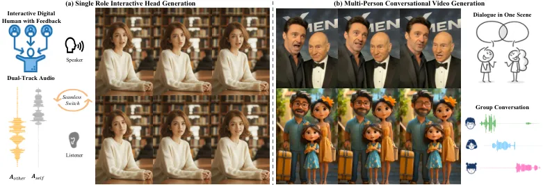
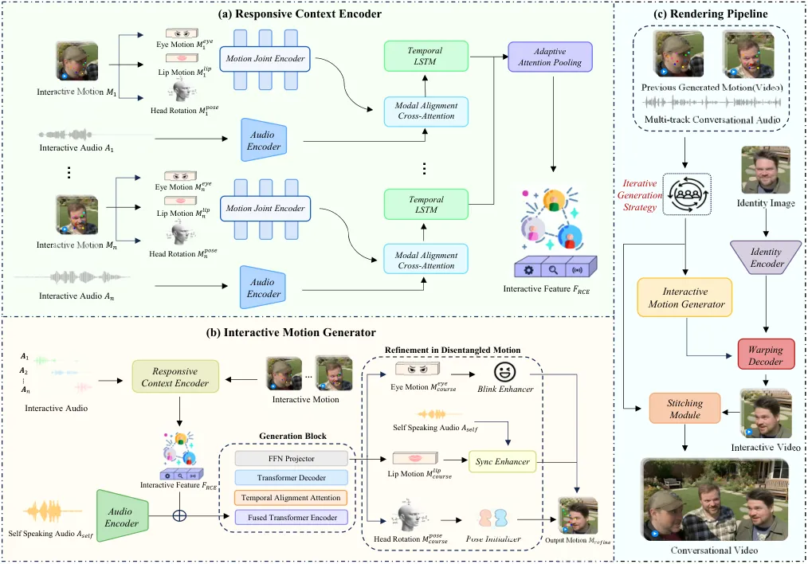
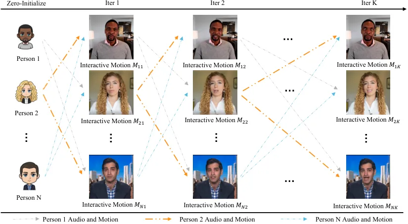
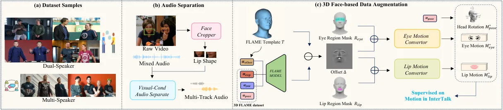
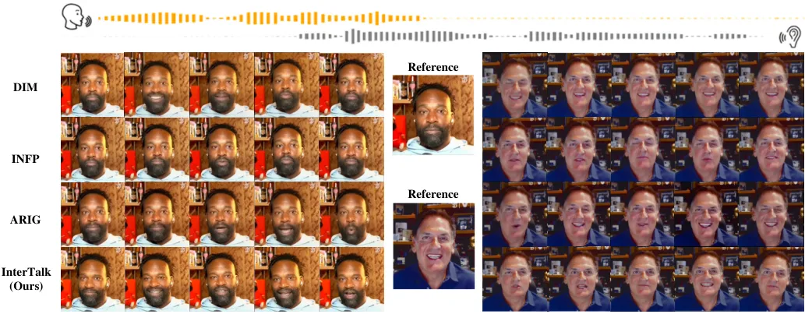
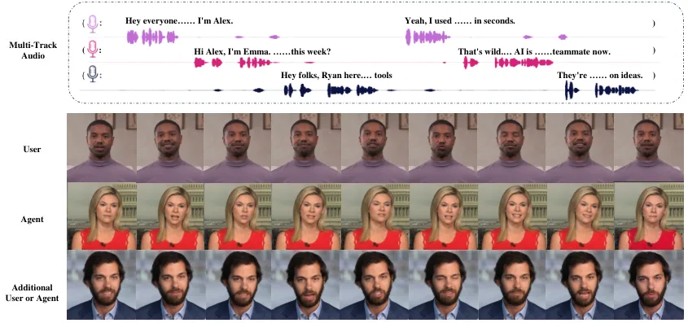
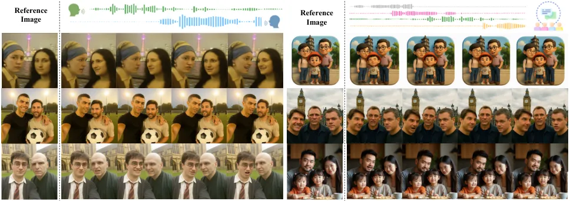
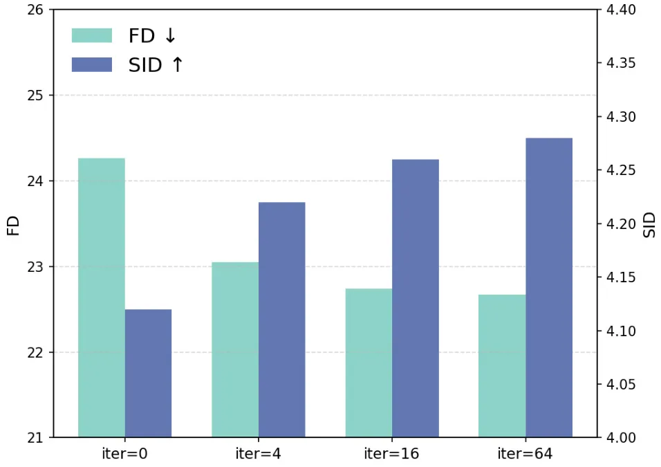

# Towards Flexible, Natural, Efficient Interaction for Conversational Talking Face Generation

Baiqin Wang Affiliation: MAIS, Institute of Automation, Chinese Academy
of Sciences Affiliation: School of Artificial Intelligence, University
of Chinese Academy of Sciences    Sen Chen Affiliation: MAIS, Institute
of Automation, Chinese Academy of Sciences Affiliation: School of
Artificial Intelligence, University of Chinese Academy of Sciences   
Jiankuo Zhao Affiliation: MAIS, Institute of Automation, Chinese Academy
of Sciences Affiliation: School of Artificial Intelligence, University
of Chinese Academy of Sciences    Xiangyu Liu Affiliation: MAIS,
Institute of Automation, Chinese Academy of Sciences Affiliation: School
of Artificial Intelligence, University of Chinese Academy of Sciences   
Zhen Lei Affiliation: MAIS, Institute of Automation, Chinese Academy of
Sciences Affiliation: School of Artificial Intelligence, University of
Chinese Academy of Sciences Affiliation: CAIR, HKISI, Chinese Academy of
Sciences  ⁴ SCSE, FIE, M.U.S.T E-mail [{wangbaiqin2024, zhen.lei,
xiangyu.zhu}@ia.ac.cn](mailto:%7Bwangbaiqin2024,%20zhen.lei,%20xiangyu.zhu%7D@ia.ac.cn)
   Xiangyu Zhu ^(†)^(†)thanks: Corresponding author. Affiliation: MAIS,
Institute of Automation, Chinese Academy of Sciences Affiliation: School
of Artificial Intelligence, University of Chinese Academy of Sciences

###### Abstract

Conversational talking face generation has recently attracted increasing
attention, aiming to synthesize interactive talking videos where
characters speak, listen, and respond dynamically to each other. This
task presents three core challenges: 1) Flexibility: enabling
multi-round dialogues with an arbitrary number of participants; 2)
Naturalness: maintaining coherent motion and appropriate non-verbal
feedback throughout the interaction; and 3) Efficiency: achieving
real-time generation and low computation overhead for long-term
continuous online conversation. Despite recent advances, existing
methods still fall short in balancing all three requirements. To bridge
this gap, we introduce InterTalk, a novel and efficient framework
designed for highly interactive conversational talking face generation.
Built upon a motion-based architecture, InterTalk supports real-time
conversation synthesis. Our method achieves strong flexibility by
explicitly modeling multi-round conversational dynamics among each
participant, eliminating constraints on their numbers. To enhance
interactivity, we incorporate motion feedback from multiple participants
and introduce an iterative generation strategy for more natural
behaviors. Besides, we disentangle motion into several facial
components, enabling targeted refinements for natural response such as
precise lip-sync and realistic eye-blinking. Finally, we construct a new
multi-person conversational dataset and enrich it with 3D face-based
data augmentation. Extensive experiments demonstrate that InterTalk
achieves superior interaction quality while maintaining real-time
performance at 30 FPS. Project page:
https://bq-wang0511.github.io/InterTalk/

###### Keywords: 

Talking Face Interaction Efficiency Conversation



Figure 1: Illustration of InterTalk. InterTalk generates conversational
talking face with flexible and natural interactions in real-time. (a)
For a single participant, it generates an interactive talking face
capable of multi-round dialogues with seamless role switching. (b) For
multiple participants, it produces coherent talking-face videos within a
shared scene, capturing realistic group interactions.

## 1 Introduction

Talking face generation aims to create expressive facial animations with
lip movements synchronized to speech. While existing methods \[32, 3,
12, 30, 10\] mainly focus on only speaking scenarios, there remains
great potential in interactive conversational talking faces between
participants \[35, 11, 14\]. Unlike single-speaker generation, this task
emphasizes fluid interactions among characters, including non-verbal
feedback such as nods or subtle expression changes. Realistic
conversational agents can significantly enhance user engagement in
applications such as online education, remote meetings and emotionally
digital companions.

In this paper, we identify three key requirements for conversational
talking face generation. Flexibility demands the ability to model
multi-round conversations between numerous participants. Naturalness
calls for coherent interactions, including smooth articulation by
speakers and timely non-verbal feedback from listeners, along with
seamless transitions between characters. Efficiency demands real-time
performance with low computational cost, which is critical for long-term
continues applications like virtual companion. These aspects
collectively form the foundation for advancing conversational talking
face generation.

Current approaches for conversational talking face generation can be
broadly divided into two categories. The first category explicitly
models conversational dynamics to improve efficiency and interactivity
but still faces several limitations. Some methods \[26, 31\] generate
speaker and listener motions separately, requiring manual role switching
which hinders multi-round conversations, while others, like INFP \[35\],
rely on dual-track audio but focus on single-character scenes without
feedback from others, resulting in isolated motions and weak
responsiveness, confined to single-role scenarios. Additionally, their
lip-sync accuracy remains restricted by limited conversational data. The
second leverages video generation models \[2, 20, 29\] to synthesize
multi-person conversation videos in an end-to-end manner, such as
MultiTalk \[14\], which adopts Wan 2.1 \[29\] as its backbone. However,
these methods are computationally intensive and rely on extremely
large-scale training datasets, which is not suitable for application
that requires high throughput generation including companion digital
human and live-streaming. In summary, existing works struggle to
simultaneously fulfill the three essential requirements of flexibility,
naturalness, and efficiency.

To achieve these objectives, we propose InterTalk, a framework designed
for both single-role and multi-person conversational scenarios as shown
in Fig. 1. For the single-role interactive head generation, InterTalk
provides coherent non-verbal feedback and seamlessly transitions between
speaking and listening states. When it comes to multi-person scenarios,
our method supports dialogue generation for an arbitrary number of
participants within a shared scene for group conversation. Built on a
paradigm that explicitly models interaction dynamics, InterTalk first
incorporates a Responsive Context Encoder (RCE) to integrate all
participants’ motion and audio cues into a unified interactive latent
representation. This representation is then utilized by the Interactive
Motion Generator (IMG) to produce Flexible multi-round conversational
motions for each participant. To enhance interactivity, our framework
incorporates motion feedback from all participants and adopts an
Iterative Generation Strategy that progressively refines each
participant’s motion, ensuring Natural and lifelike multi-party
interactions. Moreover, as different facial components exhibit distinct
behavioral patterns—for instance, lip motion closely correlates with
audio while eye movement is more constrained—we Disentangle Facial
Motion into several components and model them separately. This design
yields more natural behaviors and provides fine-grained control, where
lip-sync accuracy is enhanced by a sync-enhancer module trained on
single-speaker data, and an eye-blinking enhancer together with a
head-pose initializer further improve visual realism. With an efficient
rendering pipeline, InterTalk synthesizes multi-participant talking
videos in Real-Time with low computation overhead.

Given the absence of publicly available interaction data involving
multiple participants, we introduce a newly collected multi-person
talking face dataset to bridge this gap. To further enhance the
diversity and scale of the training data, we employ a 3D Face-based Data
Augmentation that converts 3D FLAME \[16\] coefficients into implicit
keypoint, which provides additional supervisory signals on motions
during model training.

In summary, our contributions are as follows:

- •
  We propose InterTalk, a novel and efficient framework that generating
  multi-round conversational videos with an arbitrary number of
  participants, which simultaneously satisfies three key requirements of
  Flexibility, Naturalness, and Efficiency in conversational talking
  face generation.
- •
  To enhance the interactivity, we incorporate motion feedback and
  introduce an Iterative Generation Strategy that enables each
  character’s motion to faithfully reflect feedback from others. We also
  Disentangle Facial Motion into distinct components, leveraging their
  distinct patterns to achieve more natural interactions and
  fine-grained controllability.
- •
  We construct a new multi-person conversational dataset and further
  enhance training through a 3D Face-based Data Augmentation, which
  converts 3D facial coefficients into implicit keypoints for effective
  supervision.
- •
  Extensive experiments demonstrate that InterTalk achieves
  state-of-the-art performance in conversational talking face
  generation, delivering flexible, natural, and efficient interactions
  between participants.

## 2 Related Work

### 2.1 Single-person Talking Face Generation

Talking-face generation has made remarkable progress in recent years.
Early methods such as Wav2Lip \[22\] adopt GAN-based architectures \[8\]
to synchronize lip motion with audio, but only modify the mouth region
while keeping head pose and expressions fixed. More recently, several
approaches \[12, 3, 5\] leverage powerful video diffusion models to
synthesize temporally coherent and fluid talking videos, yet their heavy
computational cost limits real-time deployment. Apart from them, several
works  \[32, 30\] adopt a two-stage generation strategy, first producing
an intermediate representation—such as facial landmarks or implicit
keypoints  \[10\] —and then rendering the final output conditioned on an
identity image. This design achieves a strong balance between efficiency
and flexibility.

In addition to speaking-oriented methods, a number of approaches focus
on listening-head generation, which aims to produce non-verbal
reactions—such as head nods or smiling expressions—driven by the speech
of other speakers. For example, L2L \[18\] employs a codebook-based
model to generate listening motions, while ELP \[25\] incorporates
emotional cues derived from speech content. DIM \[26\] can transition
between talking and listening states but cannot generate both states
simultaneously, which limits its applicability for interactive head
generation.

### 2.2 Conversational Talking Face Generation

Unlike single-person scenarios, conversational talking face generation
focuses on modeling interactions among participants. Differing from
early methods \[18, 25, 26\] that rely on manual role switching between
speakers and listeners, INFP \[35\] is the first approach to generate
interactive talking videos from dual audio streams, synthesizing motions
conditioned on both speech and feedback without explicit role switching.
ARIG \[11\] further extends it through an auto-regressive model. While
these methods enable long multi-turn dialogues, they still suffer from
limited partner-feedback modeling and remain constrained to
single-person animation. Some 3D facial animation approaches, such as
DualTalk \[21\] also attempt to model dialogues with motion feedback,
but their mesh-based generation restricts their applicability to 2D
video synthesis.

For multi-person video animation, recent works increasingly employ video
generation models to synthesize multi-character conversations. For
example, MultiTalk \[14\] adopts Wan 2.1 \[29\] as its backbone with a
human-binding strategy to produce multi-person animations, but it cannot
scale beyond two participants. Emerging systems such as Veo3 \[9\] and
Sora2 \[19\] achieve impressive audio-visual joint generation but are
computationally costly, remain closed sourced, and require massive data,
which cannot be adopted for high-throughput application like companion.
In contrast, our method explicitly models interactions among
multi-participants and achieves efficient real-time animation.

## 3 Method

Our proposed framework InterTalk aims to generate conversational talking
face that achieve flexibility, naturalness, and efficiency
simultaneously. As illustrated in Fig. 2, we first apply a Responsive
Context Encoder (RCE) to captures interactive cues from the environment,
including the speech and motion feedback of other participants during
conversation. An Interactive Motion Generator (IMG) then leverages these
interaction features together with the self audio to generate
corresponding motions. Finally, the Rendering Pipeline synthesizes
talking videos for each participant based on the generated motions and
composites them into a cohesive multi-person conversational scene. Each
component plays a vital role and their detailed designs are described in
the following sections.

### 3.1 Responsive Context Encoder

The RCE integrates environmental information into a highly interactive
representation, providing feature $`F_{\text{RCE}}`$ for motion
generation in the IMG. Its overall process can be expressed as:

```math
F_{\text{RCE}}=\text{RCE}\!\left(\{A_{i},M_{i}\}_{i=1}^{N}\right), \tag{1}
```

where $`A_{i}`$ and $`M_{i}`$ denote the audio and motion inputs of the
$`i`$-th participant, and $`N`$ is the total number of participants. For
each participant $`i`$, this module encodes both audio and motion inputs
into a unified latent space. Specifically, the audio stream of
participant $`i`$ is encoded using Wav2Vec 2.0 \[1\] to obtain a robust
speech representation $`F_{\text{a}}^{i}`$. Meanwhile, the motion input
is disentangled into several facial components—lip motion
$`M_{i}^{\text{lip}}`$, eyes motion $`M_{i}^{\text{eye}}`$, and head
pose motion $`M_{i}^{\text{pose}}`$ —each encoded separately and then
combined into a comprehensive motion representation $`F_{\text{m}}^{i}`$
to better capture non-verbal feedback within conversations. The encoding
process is defined as:

```math
F_{\text{a}}^{i}=\text{Enc}_{\text{a}}(A_{i}),\quad F_{\text{m}}^{i}=\text{Enc}_{\text{m}}(M_{i}^{\text{lip}},M_{i}^{\text{eye}},M_{i}^{\text{pose}}). \tag{2}
```

After obtaining the audio and motion features of each participant, we
apply a cross-attention mechanism to align and fuse them across
modalities, bridging the gap between the two feature domains. To further
enhance temporal coherence, a bi-directional LSTM \[24\] is subsequently
applied to capture both past and future conversational dynamics to get
$`i`$-th participants interactive context feature
$`F_{\text{RCE}}^{i}`$. The overall process for the $`i`$-th participant
is formulated as:

```math
F_{\text{RCE}}^{i}=\text{biLSTM}\!\left(\text{CrossAttn}(F_{\text{a}}^{i},F_{\text{m}}^{i})\right). \tag{3}
```

Note that the context window covers only about 3 seconds rather than a
significant future buffer, which is suitable for practical deployment.
Finally, the RCE aggregates interactive features across all participants
via adaptive attention pooling. Specifically, the reference feature
$`\bar{F}=\frac{1}{N}\sum_{i=1}^{N}F_{\text{RCE}}^{i}`$ is obtained by
averaging all participant features, while attention weights are computed
based on each participant’s similarity to this reference and dimension
$`d`$ of $`F_{\text{RCE}}^{i}`$, yielding higher weights for features
closer to the conversational context. The process can be formulated as:

```math
\displaystyle\alpha_{i}=\text{Softmax}\!\left(\frac{{F_{\text{RCE}}^{i}}^{\!\top}\bar{F}}{\sqrt{d}}\right),F_{\text{RCE}}=\sum_{i=1}^{N}\alpha_{i}F_{\text{RCE}}^{i}. \tag{4}
```

In this way, the RCE produces a unified interactive context feature
$`F_{\text{RCE}}`$ that effectively captures cross-participant
dependencies and provides global conversational context for downstream
motion generation.



Figure 2: Framework of InterTalk. InterTalk consists of three key
components: a Responsive Context Encoder (RCE) that integrates
environmental elements into an interactive feature representation; an
Interactive Motion Generator (IMG) that produces fluid conversational
motions; and a Rendering Pipeline that animates each participant to
synthesise the final talking-face videos.

### 3.2 Interactive Motion Generator

After obtaining interactive features $`F_{\text{RCE}}`$ from the RCE,
the IMG generates temporally coherent and context-aware facial motions
conditioned on both the self speaker’s audio and environmental
interaction cues. The overall process can be formulated as:

```math
M_{\text{refine}}=\text{IMG}\!\left(A_{\text{self}},F_{\text{RCE}}\right), \tag{5}
```

where $`A_{\text{self}}`$ denotes the self speaking audio, which is
encoded into $`F_{a}`$ using the same audio encoder as in the RCE to
ensure feature-space consistency. The $`F_{a}`$ is combined with the
interactive feature $`F_{\text{RCE}}`$ from Eqn. 1 before being fed into
the motion generation network to produce $`M_{\text{coarse}}`$. It can
be formulated as:

```math
M_{\text{coarse}}=\text{GenBlock}\!\left(F_{\text{RCE}}+F_{a}\right). \tag{6}
```

The generation network comprises four sequential blocks. A fused
Transformer Encoder \[28\] first integrates audio and interactive
features within a unified latent space. Next, a temporal alignment
attention module, adapted from FaceFormer \[7\], applies a causal mask
to ensure temporal consistency and prevent future-frame leakage. A
Transformer decoder then captures long-range dependencies and contextual
transitions, followed by a feed-forward layer that projects the learned
representations into subspaces of different facial components—lip, eye,
and head pose—for targeted motion refinement.

Refinement on Disentangled Motion. We apply three modules to refine the
decomposed motion from the coarse motion $`M_{\text{coarse}}`$. To
improve lip-sync accuracy beyond the limitations of conversational data,
we train a lightweight sync-enhancer on a large-scale single-speaker
dataset. This module takes speech audio $`A_{\text{self}}`$ and initial
lip motion $`M_{\text{coarse}}^{\text{lip}}`$ as input and predicts
local deformations for refined synchronization. It is trained
independently after other modules are pretrained, ensuring compatibility
with the full system. We further incorporate a Blink-Enhancer that
regulates blink frequency $`f`$ and noise $`z`$ to produce natural
eyelid closures. In addition, a Pose-Initializer adjusts the initial
head orientation according to the relative facial position
$`(x_{\text{self}},y_{\text{self}})`$, maintaining mutual gaze alignment
at the start of the interaction. The refinement process can be
formulated as:

```math
\left\{\begin{aligned} M_{\text{refine}}^{\text{eye}}&=\text{BlinkEnhancer}(M_{\text{coarse}}^{\text{eye}},f,z),\\
M_{\text{refine}}^{\text{lip}}&=\text{SyncEnhancer}(M_{\text{coarse}}^{\text{lip}},A_{\text{self}}),\\
M_{\text{refine}}^{\text{pose}}&=\text{PoseInitializer}(M_{\text{coarse}}^{\text{pose}},x_{\text{self}},y_{\text{self}}).\end{aligned}\right. \tag{7}
```

We then combine these refined components to obtain the final output
$`M_{\text{refine}}`$. Further details on the target-specific
enhancement are provided in the supplementary material.

### 3.3 Rendering Pipeline

While most prior approaches focus on generating a single speaker \[32,
30, 35, 11\], our rendering pipeline synthesizes coherent conversational
videos with multiple participants. We adopt 3D implicit keypoints as
intermediate representations, extracted through three modules: a pose
estimator computing rotation $`R`$, translation $`t`$, and scale $`s`$;
an expression estimator predicting deformation $`\delta`$; and a
canonical keypoint detector extracting canonical keypoints $`K_{c}`$
from reference images $`I_{ref}`$. The original keypoints $`K_{ori}`$
are obtained as:

```math
\displaystyle K_{ori}=s\cdot(K_{c}\cdot R+\delta)+t. \tag{8}
```

The refined motion $`M_{\text{refine}}`$ is decomposed into rotation
$`R_{d}`$ and expression deformation $`\delta_{d}`$, which are then
applied to transform $`K_{ori}`$ into the driven implicit keypoints
$`K_{d}`$. The process can be formulated as:

```math
\displaystyle M_{\text{refine}}\Rightarrow\{R_{d},\delta_{d}\},K_{d}=s\cdot(K_{c}\cdot R_{d}+\delta_{d})+t. \tag{9}
```

For each participant, the region is cropped from $`I_{ref}`$ and encoded
into an appearance embedding $`f_{a}`$ via an identity encoder. A
warping decoder fuses $`f_{a}`$ with the motion sequence $`K_{d}`$
predicted by the IMG to estimate a dense warping flow field. This flow
is then applied to $`f_{a}`$ to generate the final rendered frame with
accurate alignment and natural motion:

```math
I_{res}=\text{Decoder}\!\left(\text{Warp}(f_{a},K_{ori},K_{d})\right). \tag{10}
```

Finally, we introduce a stitching module that spatially aligns and
blends individual renderings. It refines local misalignment via
fine-grained keypoint deformations and uses a spatial blending mask for
smooth transitions. This allows InterTalk to seamlessly composite all
animated participants into the original scene, producing visually
coherent multi-participant animations. Further details are provided in
the supplementary material.

### 3.4 Training and Inference

Loss Function. We use the L2 loss $`\mathcal{L}_{\text{rec}}`$ and
velocity loss $`\mathcal{L}_{\text{vel}}`$ as supervision on motion,
which can be formulated as:

```math
\mathcal{L}_{\text{motion}}=\lambda_{\text{rec}}\mathcal{L}_{\text{rec}}+\lambda_{\text{vel}}\mathcal{L}_{\text{vel}}. \tag{11}
```

This loss ensures motion fidelity and temporal smoothness across frames.
In addition, the sync-enhancer is trained on single-person talking-face
data with a synchronization loss $`\mathcal{L}_{\text{sync}}`$ \[22\] to
refine the lip–audio alignment between speech and facial motion. Further
training details and explanations are provided in the supplementary
material.

Iterative Generation Strategy. During inference, the model can only
utilize motion feedback from previously generated participants rather
than all individuals, which may compromise interactive dynamics. To
mitigate this limitation, we introduce an iterative motion generation
strategy that progressively incorporates feedback across cycles. As
illustrated in Fig. 3, we sequentially generate motions by using the
outputs from the previous iteration as inputs for the current one,
continuously updating a shared motion buffer. Through several
iterations, each participant’s motion gradually incorporates feedback
from others, resulting in more responsive and natural interactions
without delay. Formally, let $`M_{ij}`$ denote the motion of the
$`i`$-th participant at iteration $`j`$. The iterative process can be
defined as:

```math
M_{ij}=\text{IMG}\!\left(A_{i},\,\text{RCE}\!\left(M_{(j-1)}^{\neg i},A_{(j-1)}^{\neg i}\right)\right), \tag{12}
```

where $`A_{i}`$ represents the audio feature of the $`i`$-th
participant, and RCE encodes the interaction context from the previous
iteration’s motions $`M_{(j-1)}^{\neg i}`$ and audio features
$`A_{(j-1)}^{\neg i}`$ of all other participants except themselves
($`\neg i`$). The initial feedback motions $`M_{i0}`$ and audio features
$`A_{0}^{\neg i}`$ are zero-initialized at the start of inference.
During the iterative process, the three target-refinement modules in IMG
are disabled. Since the IMG is lightweight and computationally
efficient, this strategy introduces negligible overhead compared with
the overall runtime, preserving real-time generation capability.



Figure 3: Iterative Generation Strategy. By progressively updating
motions through multiple iterations, the final results accurately
capture mutual feedback among all participants.

Video Dubbing and Single-role Generation. Our method can be extended to
video inputs by processing each frame as $`K_{ori}`$, enabling video
dubbing with interactive conversations while preserving natural body
motion and background changes. For single-role interactive head
generation, we disable pose initialization and iterative generation
strategy, directly animating from multi-track audio and motion feedback
when available.

## 4 Data Construction

Existing public datasets for interactive talking faces remain limited in
quality and conversational depth. For instance, ViCo \[34\] focuses on
single-round dialog, while DualTalk \[21\] provides only 3D FLAME \[16\]
coefficients. Moreover, most multi-person datasets concatenate separate
single-speaker recordings instead of capturing participants in a shared
scene. To overcome these issues, we build a new multi-person
conversational dataset and enrich it with 3D data by converting FLAME
coefficients into motions for our framework.

2D Data Collection. As shown in Fig. 4(a), we collect multi-speaker
conversation videos from the Internet and manually segment them to
ensure that each clip includes at least two participants continuously
appearing in the same scene. After cleaning, the dataset contains 143
identities and 205 clips. To separate individual audio tracks from mixed
recordings, we employ a visual-audio separation network \[15\] that
leverages lip movements to infer each speaker’s voice as illustrated in
Fig. 4(b). Additional TTS-based audio segments are synthesized to
enhance diversity during evaluation.



Figure 4: Dataset Information. (a) Samples from InterTalk dataset.(b)
The processing pipeline for collected videos and multi-track audio
separation. (c) 3D face-based data augmentation strategy using 3D
conversation datasets, generating motions from FLAME coefficients.

3D Face-based Data Augmentation. To further enhance conversational
diversity and interactive learning, we propose a 3D face-based
augmentation strategy that integrates DualTalk’s \[21\] 3D face data
into training. As shown in Fig. 4(c), the 3D FLAME \[16\] coefficients
are converted into motion signals through two converter networks trained
on a 2D talking-face dataset \[33\], where the FLAME parameters are
annotated using EMOCA \[6\]. Specifically, we reconstruct a 3D mesh
using the jaw pose $`\alpha_{\text{jaw}}`$ and expression
$`\alpha_{\text{exp}}`$, while keeping the other FLAME coefficients
$`\alpha_{\text{other}}`$ identical to the template mesh $`T`$. The
vertex offsets $`\Delta`$ are then obtained by subtraction, formulated
as:

```math
\Delta=\text{FLAME}(\alpha_{\text{exp}},\alpha_{\text{jaw}},\alpha_{\text{other}})-T. \tag{13}
```

Afterward, we apply eye and lip region masks $`R_{\text{eye}}`$ and
$`R_{\text{lip}}`$ to extract localized expressions, which are fed into
corresponding converters to generate motion features as:

```math
M_{c}^{*}=\text{Convertor}_{c}\bigl(R_{c}(\Delta)\bigr),\quad c\in\{\text{eye},\text{lip}\}. \tag{14}
```

Head-pose information is directly mapped to the motion
$`M_{\text{pose}}^{*}`$. This converted dataset further enhances the
realism and fluidity of conversational behavior, improving both
inter-participant responsiveness and motion coherence.

| Method          | Sync-C $`\uparrow`$ | Sync-D $`\downarrow`$ | FID $`\downarrow`$ | NIQE $`\downarrow`$ | FVD $`\downarrow`$ |
| --------------- | ------------------- | --------------------- | ------------------ | ------------------- | ------------------ |
| SadTalker\[32\] | 7.15                | 7.93                  | 40.75              | 46.30               | 291.66             |
| Hallo2\[5\]     | 7.53                | 7.97                  | 33.15              | 14.25               | 205.60             |
| EchoMimic\[3\]  | 5.94                | 9.11                  | 28.13              | 13.42               | 284.38             |
| Sonic\[12\]     | 8.26                | 6.88                  | 34.41              | 13.88               | 204.55             |
| Ours            | 8.30                | 6.91                  | 23.07              | 13.29               | 178.73             |

Table 1: Quantitative results with state-of-the-art talking face
generation methods on HDTF\[33\] dataset.

## 5 Experiments

### 5.1 Experimental Settings

Implementation Details. We preprocess the dataset by converting videos
to 25 fps and resampling audio at 16kHz. The RCE and IMG modules are
trained using the Adam optimizer \[13\] with a learning rate of
$`1\times 10^{-4}`$. The components of the rendering pipleline are
initialized from LivePortrait \[10\] to leverage its robust rendering
quality. Training is performed on eight RTX 4090 GPUs for three days.
During inference, each participant is animated in parallel across
multiple GPUs to achieve faster generation speed. Our method produces
512×512 resolution outputs before stitching them back into the original
frame. Additional implementation details are provided in the
supplementary material.

Metrics. We evaluate our method across various scenarios, covering both
speaking and interactive aspects. For speaking evaluation, we assess lip
synchrony using Sync-C and Sync-D from SyncNet \[4\], image quality with
FID \[23\] and NIQE \[17\] for reference and no-reference assessment,
and temporal consistency with FVD \[27\]. For interactive evaluation, we
extract 3D FLAME \[16\] coefficients from generated videos and perform
quantitative analysis using multiple metrics, including Fréchet Distance
(FD), Paired Fréchet Distance (P-FD), Mean Squared Error (MSE),
Similarity Index for Diversity (SID), and Residual Pearson Correlation
Coefficient (rPCC). We further report generation speed in frames per
second (fps) to measure system efficiency.

### 5.2 Comparison



Figure 5: Comparison of Interactive Head Generation. Two identities are
sampled from the DyConv \[35\] dataset proposed by INFP, which is not
publicly available and therefore lacks ground-truth results.

Talking Face Generation. We first evaluate our method on general single
person talking face generation using metrics that assess image quality
and lip synchronization. To adapt our framework on this task, we set the
interactive audio and motion feedback inputs to zero. We compare our
approach with four advanced baselines, including SadTalker \[32\],
EchoMimic \[3\], Hallo2 \[5\], and Sonic \[12\] on the HDTF \[33\]
dataset. As shown in Tab. 1, our method demonstrates superior
performance in both video quality and lip synchronization. We achieve
better FID and NIQE scores owing to the robust rendering pipeline, and
obtain the best SyncNet score, slightly outperforming Sonic thanks to
the integration of the sync-enhancer within the IMG. The higher FVD
score further indicates that our method achieves better temporal
consistency. The qualitative results are demonstrated in supplementary.



Figure 6: Interactive Head Generation. Our method generates highly
responsive interactive agent avatars and supports additional user motion
inputs or agent outputs from multi-track audio, as InterTalk handles an
arbitrary number of participants.

| Methods        | FD $`\downarrow`$ |      | RPCC $`\downarrow`$ |      | SID$`\uparrow`$ |      | MSE$`\downarrow`$ |      |
| -------------- | ----------------- | ---- | ------------------- | ---- | --------------- | ---- | ----------------- | ---- |
|                | exp               | pose | exp                 | pose | exp             | pose | exp               | pose |
| DIM\[26\]      | 23.88             | 0.06 | 0.06                | 0.03 | 3.71            | 2.35 | 0.70              | 0.02 |
| INFP\[35\]     | 18.63             | 0.07 | -                   | -    | 4.78            | 3.92 | 0.51              | 0.01 |
| ARIG\[11\]     | 18.39             | 0.05 | 0.05                | 0.01 | 4.82            | 3.94 | -                 | -    |
| DualTalk\[21\] | 22.27             | 0.04 | 0.07                | 0.03 | 4.36            | 3.84 | 0.58              | 0.01 |
| Ours           | 18.33             | 0.04 | 0.05                | 0.01 | 4.85            | 4.07 | 0.48              | 0.01 |

Table 2: Quantitative results with state-of-the-art interactive head
generation methods on ViCo\[34\] dataset.

Interactive Head Generation. We evaluate our method against existing
other interactive head generation approaches, including DIM \[26\],
INFP \[35\], and ARIG \[11\]. For quantitative evaluation, we conduct
experiments on the ViCo \[34\] dataset for listening-head generation and
adopt the metrics reported in the original papers due to the lack of
official implementations. As shown in Tab. 2, our method achieves
superior accuracy and diversity, demonstrating its clear advantage in
interactive head generation. In terms of visual results, since INFP and
ARIG have not released their source code, we compare our results using
demo videos available on their project pages. As shown in Fig. 5, our
approach produces natural and expressive head movements with sharper
facial details and better identity preservation. In contrast, DIM and
INFP display relatively rigid expressions, while ARIG maintains an
almost static head pose. In comparison, our method generates more
context-aware gestures—such as gentle nods and natural
smiles——demonstrating strong responsiveness during interaction.
Furthermore, as shown in Fig. 6, our method generates lifelike virtual
agents that respond naturally to users. Since it supports an arbitrary
number of participants, both the number of output agents and input users
are unrestricted, enabling applications like multi-participants remote
meeting.

Conversations with Multi-Participants. Due to the scarcity of publicly
available multi-person conversation video and related methods, we
evaluate our approach on our collected dataset with MultiTalk \[14\], as
it is the only open source method for multi-person talking face
generation. Our method outperforms MultiTalk on nearly all metrics
except SID, likely due to the stronger generalization ability of large
video-generation models. Moreover, our approach achieves real-time FPS,
while MultiTalk requires lengthy inference.

As shown in Fig. 7, our method not only generates natural and engaging
interactions between participants but also produces multi-participant
conversational videos without any restricted on the number of
participants. Additional visual comparisons with MultiTalk are provided
in the supplementary material. In summary, our method demonstrates
strong interactive capability and high efficiency in conversational
talking-face generation.



Figure 7: InterTalk for Multi-person Conversation. Our method supports
diverse input styles and imposes no constraints on the number of
participants, while producing highly interactive and realistic
conversational behaviors.

|                                   |                     |                  |                    |                 |                 |
| --------------------------------- | ------------------- | ---------------- | ------------------ | --------------- | --------------- |
| Methods                           | Sync-C $`\uparrow`$ | FD$`\downarrow`$ | RPCC$`\downarrow`$ | SID$`\uparrow`$ | FPS$`\uparrow`$ |
| MultiTalk \[14\]                  | 7.94                | 41.74            | 0.24               | 5.14            | 0.61            |
| Ours                              | 8.30                | 22.67            | 0.09               | 4.28            | 31.23           |
| w/o Motion Feedback in RCE        | 8.13                | 29.72            | 0.15               | 2.71            | 31.85           |
| w/o Iterative Generation Strategy | 8.25                | 24.26            | 0.11               | 4.12            | 34.67           |
| w/o Disentanglement on Motion     | 7.58                | 25.17            | 0.11               | 3.85            | 31.56           |
| w/o Data Augmentation             | 7.01                | 38.67            | 0.20               | 1.95            | 31.23           |

Table 3: Quantitative comparisons and ablation study on multi-person
conversation generation on InterTalk Dataset.

### 5.3 Ablation Study

As shown in Tab. 3, we conduct an ablation study on four key components:
the motion feedback in RCE, the iterative generation strategy, the
disentanglement on motion refinement in IMG, and the 3D face-based data
augmentation. Removing motion feedback in RCE leads to a noticeable drop
in interaction quality, as reflected by the interaction matrix on the
FLAME coefficients. Introducing the iterative generation strategy
significantly improves interaction performance with only a minor
decrease in speed, as the model progressively refines motions to reduce
response delays instead of relying solely on previously generated
frames. The disentanglement allows the sync-enhancer to further boost
Sync-C scores for lip synchronization by leveraging a large-scale
single-speaker talking-face dataset to compensate for the limited
diversity of conversational data. Moreover, the 3D face-based data
augmentation greatly enhances interactive performance. Overall, the
results show that each component contributes effectively to the
framework.

As shown in Fig. 8, we analyze how FD and SID vary with different
iteration numbers in the iterative generation strategy. The results
demonstrate that this strategy progressively improves both motion
realism and diversity. Specifically, the FD steadily decreases with more
iterations, indicating that the generated motion distribution becomes
increasingly similar to real motion data. At the same time, the SID
rises across iterations, demonstrating that the iterative refinement
enhances motion variability and expressiveness. These results confirm
the effectiveness of our iterative generation strategy in producing
natural and diverse conversational behaviors.

### 5.4 User Study



Figure 8: Variation of FD and SID across iterations.

| Methods       | Lip-sync | Interaction | Motion      | Visual  |
| ------------- | -------- | ----------- | ----------- | ------- |
|               | Accuracy | Fluency     | Naturalness | Realism |
| DIM \[26\]    | 1.13     | 1.24        | 1.19        | 1.07    |
| INFP \[35\]   | 2.93     | 3.85        | 3.21        | 3.59    |
| ARIG \[11\]   | 3.87     | 2.59        | 2.13        | 2.48    |
| Ours (Single) | 4.03     | 3.96        | 4.55        | 4.12    |

Table 4: User study on Interactive Head Generation. Best results are
highlighted in bold.

To evaluate perceptual quality, we conducted a user study on interactive
head generation following the MOE protocol with 23 participants. As
shown in Tab. 8, each method was rated on four aspects: lip-sync
accuracy, interaction fluency, motion naturalness, and visual
realism—using a 1–5 Likert scale where higher scores indicate better
quality. Our method outperforms all baselines across every metric,
demonstrating clear advantages in both realism and interactivity.
Participants consistently preferred our results, praising the smoothness
of facial motion and the natural transitions in interactive responses.
In particular, our approach achieved the highest scores in motion
naturalness and interaction fluency, verifying the effectiveness of our
iterative generation strategy. Furthermore, the superior lip-sync
accuracy highlights the strength of our sync enhancer module in
producing temporally aligned mouth movements. These results collectively
confirm that InterTalk delivers the most lifelike and engaging
interactive head generation among all compared methods.

## 6 Conclusion

In this paper, we present InterTalk, a novel and efficient framework for
highly interactive conversational talking-face generation without
constraints on the number of participants. The framework employs a
Responsive Context Encoder (RCE) to encode audio and motion feedback
into interactive features, ensuring flexibility. An Interactive Motion
Generator (IMG) then synthesizes conversational motions with
disentangled refinement, while a Rendering Pipeline animates multiple
participants in real-time. We further incorporate an iterative
generation strategy that refines motion feedback across participants,
promoting coherent and responsive interactions. To address the scarcity
of multi-person conversational data, we construct a new dataset and
introduce a 3D face-based data augmentation strategy to enhance
training. Extensive experiments demonstrate that InterTalk achieves
flexible, natural, and efficient performance in interactive
conversational talking face generation.

## Acknowledgments

This work was supported in part by the New Generation Artificial
Intelligence-National Science and Technology Major Project (No.
2025ZD0123501), Beijing Natural Science Foundation L242092, Chinese
National Natural Science Foundation Projects 92570119, 62276254,
U23B2054, the Science and Technology Development Fund of Macau Project
0140/2024/AGJ, and InnoHK program.

## References

- \[1\] A. Baevski, Y. Zhou, A. Mohamed, and M. Auli (2020) Wav2vec 2.0:
  a framework for self-supervised learning of speech representations.
  Advances in neural information processing systems 33, pp. 12449–12460.
  Cited by: §3.1.
- \[2\] A. Blattmann, T. Dockhorn, S. Kulal, D. Mendelevitch, M.
  Kilian, D. Lorenz, Y. Levi, Z. English, V. Voleti, A. Letts, et
  al. (2023) Stable video diffusion: scaling latent video diffusion
  models to large datasets. arXiv preprint arXiv:2311.15127. Cited by:
  §1.
- \[3\] Z. Chen, J. Cao, Z. Chen, Y. Li, and C. Ma (2025) Echomimic:
  lifelike audio-driven portrait animations through editable landmark
  conditions. In Proceedings of the AAAI Conference on Artificial
  Intelligence, Vol. 39, pp. 2403–2410. Cited by: §1, §2.1, Table 1,
  §5.2.
- \[4\] J. S. Chung and A. Zisserman (2016) Out of time: automated lip
  sync in the wild. In Workshop on Multi-view Lip-reading, ACCV, Cited
  by: §5.1.
- \[5\] J. Cui, H. Li, Y. Yao, H. Zhu, H. Shang, K. Cheng, H. Zhou, S.
  Zhu, and J. Wang (2024) Hallo2: long-duration and high-resolution
  audio-driven portrait image animation. arXiv preprint
  arXiv:2410.07718. Cited by: §2.1, Table 1, §5.2.
- \[6\] R. Daněček, M. J. Black, and T. Bolkart (2022) Emoca: emotion
  driven monocular face capture and animation. In Proceedings of the
  IEEE/CVF Conference on Computer Vision and Pattern Recognition,
  pp. 20311–20322. Cited by: §4.
- \[7\] Y. Fan, Z. Lin, J. Saito, W. Wang, and T. Komura (2022)
  Faceformer: speech-driven 3d facial animation with transformers. In
  Proceedings of the IEEE/CVF conference on computer vision and pattern
  recognition, pp. 18770–18780. Cited by: §3.2.
- \[8\] I. J. Goodfellow, J. Pouget-Abadie, M. Mirza, B. Xu, D.
  Warde-Farley, S. Ozair, A. Courville, and Y. Bengio (2014) Generative
  adversarial nets. Advances in neural information processing systems 27. Cited by: §2.1.
- \[9\] Google (2025) Veo 3. Note:
  [https://aistudio.google.com/models/veo-3](https://aistudio.google.com/models/veo-3)
  External Links: [Link](https://aistudio.google.com/models/veo-3) Cited
  by: §2.2.
- \[10\] J. Guo, D. Zhang, X. Liu, Z. Zhong, Y. Zhang, P. Wan, and D.
  Zhang (2024) Liveportrait: efficient portrait animation with stitching
  and retargeting control. arXiv preprint arXiv:2407.03168. Cited by:
  §1, §2.1, §5.1.
- \[11\] Y. Guo, X. Liu, C. Zhen, P. Yan, and X. Wei (2025) ARIG:
  autoregressive interactive head generation for real-time
  conversations. arXiv preprint arXiv:2507.00472. Cited by: §1, §2.2,
  §3.3, §5.2, Table 2, Table 4.
- \[12\] X. Ji, X. Hu, Z. Xu, J. Zhu, C. Lin, Q. He, J. Zhang, D.
  Luo, Y. Chen, Q. Lin, et al. (2025) Sonic: shifting focus to global
  audio perception in portrait animation. In Proceedings of the Computer
  Vision and Pattern Recognition Conference, pp. 193–203. Cited by: §1,
  §2.1, Table 1, §5.2.
- \[13\] D. P. Kingma and J. Ba (2014) Adam: a method for stochastic
  optimization. arXiv preprint arXiv:1412.6980. Cited by: §5.1.
- \[14\] Z. Kong, F. Gao, Y. Zhang, Z. Kang, X. Wei, X. Cai, G. Chen,
  and W. Luo (2025) Let them talk: audio-driven multi-person
  conversational video generation. arXiv preprint arXiv:2505.22647.
  Cited by: §1, §1, §2.2, §5.2, Table 3.
- \[15\] K. Li, R. Yang, F. Sun, and X. Hu (2024) IIANet: an intra-and
  inter-modality attention network for audio-visual speech separation.
  In Proceedings of the 41st International Conference on Machine
  Learning, pp. 29181–29200. Cited by: §4.
- \[16\] T. Li, T. Bolkart, Michael. J. Black, H. Li, and J.
  Romero (2017) Learning a model of facial shape and expression from 4D
  scans. ACM Transactions on Graphics, (Proc. SIGGRAPH Asia) 36 (6),
  pp. 194:1–194:17. External Links:
  [Link](https://doi.org/10.1145/3130800.3130813) Cited by: §1, §4, §4,
  §5.1.
- \[17\] A. Mittal, R. Soundararajan, and A. C. Bovik (2012) Making a
  “completely blind” image quality analyzer. IEEE Signal processing
  letters 20 (3), pp. 209–212. Cited by: §5.1.
- \[18\] E. Ng, H. Joo, L. Hu, H. Li, T. Darrell, A. Kanazawa, and S.
  Ginosar (2022) Learning to listen: modeling non-deterministic dyadic
  facial motion. In Proceedings of the IEEE/CVF Conference on Computer
  Vision and Pattern Recognition, pp. 20395–20405. Cited by: §2.1, §2.2.
- \[19\] OpenAI (2024) Sora: creating video from text. Note:
  [https://sora.chatgpt.com](https://sora.chatgpt.com)Accessed:
  2024-11-05 External Links: [Link](https://sora.chatgpt.com) Cited by:
  §2.2.
- \[20\] W. Peebles and S. Xie (2023) Scalable diffusion models with
  transformers. In Proceedings of the IEEE/CVF international conference
  on computer vision, pp. 4195–4205. Cited by: §1.
- \[21\] Z. Peng, Y. Fan, H. Wu, X. Wang, H. Liu, J. He, and Z.
  Fan (2025) Dualtalk: dual-speaker interaction for 3d talking head
  conversations. In Proceedings of the Computer Vision and Pattern
  Recognition Conference, pp. 21055–21064. Cited by: §2.2, §4, §4, Table 2.
- \[22\] K. Prajwal, R. Mukhopadhyay, V. P. Namboodiri, and C.
  Jawahar (2020) A lip sync expert is all you need for speech to lip
  generation in the wild. In Proceedings of the 28th ACM international
  conference on multimedia, pp. 484–492. Cited by: §2.1, §3.4.
- \[23\] M. Seitzer (2020) pytorch-fid: FID Score for PyTorch. Note:
  Version
  0.3.0[https://github.com/mseitzer/pytorch-fid](https://github.com/mseitzer/pytorch-fid)
  Cited by: §5.1.
- \[24\] A. Sherstinsky (2020) Fundamentals of recurrent neural network
  (rnn) and long short-term memory (lstm) network. Physica D: Nonlinear
  Phenomena 404, pp. 132306. Cited by: §3.1.
- \[25\] L. Song, G. Yin, Z. Jin, X. Dong, and C. Xu (2023) Emotional
  listener portrait: neural listener head generation with emotion. In
  Proceedings of the IEEE/CVF International Conference on Computer
  Vision, pp. 20839–20849. Cited by: §2.1, §2.2.
- \[26\] M. Tran, D. Chang, M. Siniukov, and M. Soleymani (2024) Dim:
  dyadic interaction modeling for social behavior generation. In
  European Conference on Computer Vision, pp. 484–503. Cited by: §1,
  §2.1, §2.2, §5.2, Table 2, Table 4.
- \[27\] T. Unterthiner, S. Van Steenkiste, K. Kurach, R. Marinier, M.
  Michalski, and S. Gelly (2019) FVD: a new metric for video generation.
  Cited by: §5.1.
- \[28\] A. Vaswani, N. Shazeer, N. Parmar, J. Uszkoreit, L.
  Jones, A. N. Gomez, Ł. Kaiser, and I. Polosukhin (2017) Attention is
  all you need. Advances in neural information processing systems 30.
  Cited by: §3.2.
- \[29\] T. Wan, A. Wang, B. Ai, B. Wen, C. Mao, C. Xie, D. Chen, F.
  Yu, H. Zhao, J. Yang, et al. (2025) Wan: open and advanced large-scale
  video generative models. arXiv preprint arXiv:2503.20314. Cited by:
  §1, §2.2.
- \[30\] B. Wang, X. Zhu, F. Shen, H. Xu, and Z. Lei (2025) PC-talk:
  precise facial animation control for audio-driven talking face
  generation. arXiv preprint arXiv:2503.14295. Cited by: §1, §2.1, §3.3.
- \[31\] D. Wang, B. Dai, Y. Deng, and B. Wang (2024) Disentangling
  planning, driving and rendering for photorealistic avatar agents. In
  European Conference on Computer Vision, pp. 137–147. Cited by: §1.
- \[32\] W. Zhang, X. Cun, X. Wang, Y. Zhang, X. Shen, Y. Guo, Y. Shan,
  and F. Wang (2023) Sadtalker: learning realistic 3d motion
  coefficients for stylized audio-driven single image talking face
  animation. In Proceedings of the IEEE/CVF conference on computer
  vision and pattern recognition, pp. 8652–8661. Cited by: §1, §2.1,
  §3.3, Table 1, §5.2.
- \[33\] Z. Zhang, L. Li, Y. Ding, and C. Fan (2021) Flow-guided
  one-shot talking face generation with a high-resolution audio-visual
  dataset. In Proceedings of the IEEE/CVF conference on computer vision
  and pattern recognition, pp. 3661–3670. Cited by: Table 1, Table 1,
  §4, §5.2.
- \[34\] M. Zhou, Y. Bai, W. Zhang, T. Yao, T. Zhao, and T. Mei (2022)
  Responsive listening head generation: a benchmark dataset and
  baseline. In European conference on computer vision, pp. 124–142.
  Cited by: §4, §5.2, Table 2, Table 2.
- \[35\] Y. Zhu, L. Zhang, Z. Rong, T. Hu, S. Liang, and Z. Ge (2025)
  INFP: audio-driven interactive head generation in dyadic
  conversations. In Proceedings of the Computer Vision and Pattern
  Recognition Conference, pp. 10667–10677. Cited by: §1, §1, §2.2, §3.3,
  Figure 5, Figure 5, §5.2, Table 2, Table 4.
