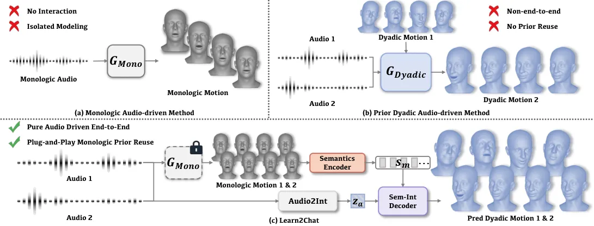
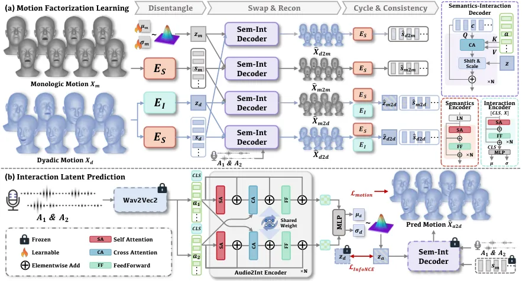
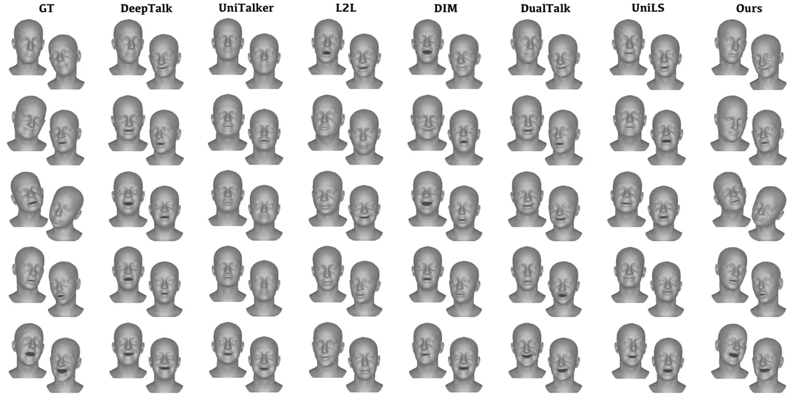
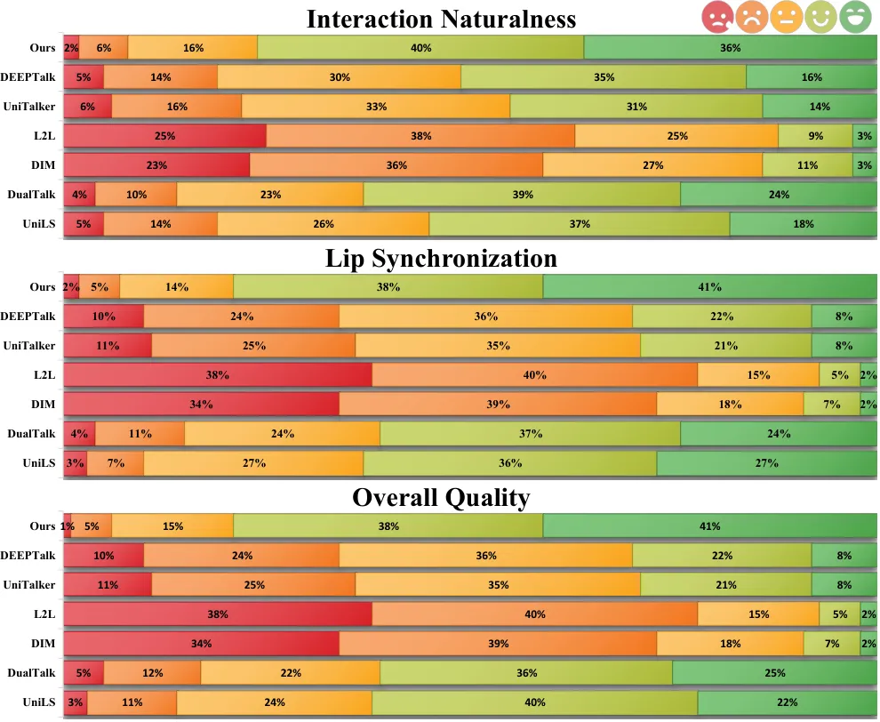

# Learn2Chat: Rethinking Dyadic Talking Heads via Interaction-Modulated Monologic PriorsThanks:  Zikai Huang, Xuemiao Xu, Haoxin Yang, and Yihong Lin are with the School of Computer Science and Engineering, and Siyue Chen is with the School of Design, South China University of Technology, Guangdong, China. Xuemiao Xu is also with Guangdong Engineering Center for Large Model and GenAI Technology, and also with State Key Laboratory of Subtropical Building and Urban Science, Ministry of Education Key Laboratory of Big Data and Intelligent Robot. E-mail: zikaihuang0428@gmail.com; victoria38yue@gmail.com; harxis@outlook.com; amcsyihonglin@gmail.com; xuemx@scut.edu.cn. Cheng Xu and Shengfeng He are with the School of Computing and Information Systems, Singapore Management University. Email: cschengxu@gmail.com; shengfenghe@smu.edu.sg.

Zikai Huang    Siyue Chen    Xuemiao Xu    Haoxin Yang    Cheng Xu   
Yihong Lin Affiliation: and Shengfeng He, 

###### Abstract

Dyadic conversational motion generation is essential for realistic
interactive digital humans. Existing approaches typically model
conversational behaviors within unified dyadic generators. However, such
holistic formulations tend to couple self-speech-driven motion with
partner-responsive social feedback, leaving the interaction-specific
component implicit and underutilizing the speech-motion correspondence
already learned by pretrained monologic motion models. We propose
Learn2Chat, a unified framework that models dyadic motion as interaction
modulation over pretrained monologic motion priors. This design
separates intrinsic speech-driven motion from social interaction effects
and enables more structured interaction modeling. Specifically, we
introduce a Monologic-Anchored Motion Factorization scheme that
leverages the semantic motion manifold learned from monologic data to
disentangle audio-driven motion dynamics from interaction-induced
modulation, yielding clean interaction representations from dyadic
sequences. On top of this representation space, a Cross-Attentive
Interaction Latent Prediction module maps paired speech signals to
interaction latents through cross-branch attention and interaction
alignment. During inference, the predicted interaction latents modulate
canonical monologic motion to generate coherent and synchronized dyadic
behaviors in a data-efficient manner. Extensive experiments on the
DualTalk benchmark demonstrate that Learn2Chat achieves state-of-the-art
performance across both quantitative metrics and perceptual evaluations.
Moreover, the framework is model-agnostic and seamlessly integrates with
diverse pretrained monologic motion backbones, highlighting the
effectiveness of prior reuse and interaction adaptation for scalable
conversational motion generation. More visual results are available on
the [project page](https://zikaihuangscut.github.io/Learn2Chat/).

###### Index Terms: 

Dyadic Motion Generation, Audio-driven Facial Animation, Digital Humans



Fig. 1: Comparison of existing audio-driven head motion generation
paradigms. Monologic methods (a) ignore interaction dynamics, while
existing dyadic approaches (b) either require auxiliary motion inputs or
entangle speech and interaction signals through holistic learning. In
contrast, Learn2Chat reformulates dyadic generation as interaction
modulation over canonical monologic motion, enabling realistic and
temporally coherent synthesis. The framework is plug-and-play and
converts pretrained monologic backbones to the dyadic setting.

## I Introduction

Generating conversational motions is essential for building lifelike
interactive digital humans, with broad applications in
telepresence \[27, 23\], virtual assistants \[4\], and autonomous social
agents \[15\]. Recent audio-driven motion generation methods have
achieved remarkable fidelity in monologic settings (Fig. 1(a)), where
facial movements and head motions are primarily driven by the speaker’s
own speech. Extending these advances to dyadic interaction, however,
remains fundamentally challenging. Unlike monologic speech,
conversations are inherently reciprocal: speakers continuously adjust
their motions according to both their own utterances and their
interlocutor’s behaviors, producing temporally coordinated and socially
adaptive motion patterns.

Existing dyadic motion generation methods can be broadly categorized
into two paradigms. Early approaches rely on motion-conditioned
generation, where conversational motion is synthesized by explicitly
conditioning on the partner’s motion signals \[24, 38, 28\]. Although
effective, such methods require access to ground-truth partner motion
and are therefore unsuitable for fully autonomous audio-driven
applications. More recently, UniLS \[7\] eliminates this dependency by
generating dyadic motions from paired audio streams through end-to-end
learning. Despite their differences in input modality and supervision,
both paradigms share a common formulation: conversational behaviors are
acquired by learning a dedicated dyadic generator from paired
conversational data.

Meanwhile, monologic motion generation has witnessed rapid
progress \[11, 44, 29, 17, 10\]. Trained on large speech-motion corpora,
these models have learned effective self-speech-to-motion correspondence
and can produce expressive facial and head motions from the speaker’s
own speech. This capability is directly relevant to dyadic generation,
since a substantial part of conversational motion remains governed by
the speaker’s own utterance. Therefore, pretrained monologic models can
provide more than a generic motion prior: they offer a
self-speech-conditioned canonical motion reference, describing the
motion already explained by the speaker’s own speech.

This motivates a different view of dyadic motion generation.
Conversational interaction does not replace the intrinsic speech-driven
motion encoded in monologic models. Instead, it modulates how this
motion should be expressed under different social contexts. In this
view, dyadic motion can be regarded as canonical monologic motion
enriched by interaction-induced adaptation, instead of an entirely new
motion generation target. The central challenge is therefore to separate
the motion already explained by the speaker’s own speech from the
interaction-specific modulation introduced by dyadic context. Without
such a separation, intrinsic speech-driven motion and partner-responsive
feedback remain entangled in a single dyadic generator, which may
obscure the interaction-specific component and weaken the reuse of
pretrained monologic priors.

To address this challenge, we propose Learn2Chat, a framework that
extends pretrained monologic audio-driven models to dyadic conversations
through interaction modulation. Specifically, we propose a
Monologic-Anchored Motion Factorization scheme that distills interaction
representations while preserving reusable speech-driven motion priors.
To infer interaction directly from paired speech streams, we further
introduce a Cross-Attentive Interaction Latent Predictor, which predicts
interaction latents through cross-branch attention and interaction
alignment. During inference, the predicted interaction latents modulate
canonical monologic motion trajectories, enabling synchronized dyadic
motion generation from paired audio alone. Extensive experiments on the
DualTalk benchmark demonstrate that Learn2Chat achieves state-of-the-art
performance across both quantitative metrics and perceptual evaluations.
More importantly, our framework is model-agnostic and seamlessly
compatible with diverse pretrained monologic motion backbones,
highlighting a new paradigm for scalable conversational motion
generation through prior reuse and interaction adaptation.

In summary, our contributions are threefold:

- •
  We propose a new formulation of dyadic motion generation as
  interaction modulation over pretrained monologic speech-motion priors,
  shifting the focus from unified speak-listen generation to modeling
  the interaction-induced adaptation beyond the motion already explained
  by the speaker’s own speech. This encourages an explicit separation
  between intrinsic speech-driven motion and interaction-induced social
  feedback, thereby reducing signal conflation and learning ambiguity in
  holistic modeling.
- •
  We introduce Learn2Chat, a unified framework for dyadic motion
  generation. It employs a Monologic-Anchored Motion Factorization
  scheme to distill clean interaction representations from dyadic
  motion, together with a Cross-Attentive Interaction Latent Predictor
  that maps paired speech streams to interaction latents for modulating
  canonical monologic motions.
- •
  We demonstrate that Learn2Chat achieves state-of-the-art performance
  on the DualTalk dataset across quantitative and perceptual
  evaluations, while remaining model-agnostic and seamlessly compatible
  with existing monologic motion backbones.

## II Related Work

Monologic Audio-driven 3D Head Generation. Audio-driven 3D talking head
generation has advanced rapidly in recent years. Most existing
approaches focus on monologic settings, where head motion is determined
solely by the speaker’s own audio \[9, 37, 45, 18, 11, 44, 29, 17, 10,
8, 6, 30, 32\]. Early methods relied on explicit phoneme-to-viseme
mappings constructed from handcrafted rules or graph-based matching \[9,
37, 45\]. With the rise of deep learning, data-driven audio-to-motion
modeling has become dominant. For instance, VOCA \[8\] regresses 3D
facial motion using CNNs, while FaceFormer \[11\] employs Transformers
to capture long-range temporal dependencies. CodeTalker \[44\] further
introduces discrete latent representations via VQ-VAE to learn coupled
audio–motion structures. More recently, diffusion-based approaches such
as FaceDiffuser \[35\] improve motion realism and diversity. Despite
their success, these methods focus on single-speaker scenarios and do
not explicitly model conversational interaction. In contrast, our method
leverages pretrained monologic motion priors while explicitly modeling
interaction signals, enabling coherent dyadic generation.

Dyadic Interaction Generation. Modeling dyadic interaction has recently
gained increasing attention in conversational avatar research \[25, 24,
38, 28, 7\]. Early approaches often distinguish speaker and listener
roles and train role-specific modules \[24, 38\], which typically
require role annotations and limit generalization across conversational
settings. More recent work seeks unified bidirectional modeling without
explicit role supervision \[28, 7\]. For example, DualTalk \[28\]
conditions generation on both participants’ audio along with the
partner’s motion to capture conversational coordination. Related studies
also explore contextual reaction modeling \[26, 42, 47\], though they
often emphasize short-term responses and may struggle to maintain
temporally coherent behaviors over longer interactions. Recent work
UniLS \[7\] further advances this direction by removing dependence on
partner motion and enabling fully audio-driven dyadic generation.
Notably, UniLS adopts a two-stage training strategy, where the first
stage learns an audio-independent motion prior from large-scale motion
sequences, and the second stage aligns paired speech signals with this
learned motion representation for dyadic synthesis. While this strategy
improves optimization stability, the learned prior primarily captures
general motion dynamics without explicitly encoding speech-conditioned
semantic correspondence. As a result, interaction modeling and
speech-driven motion generation are still learned jointly within a
unified latent space during dyadic training, without an explicit
factorization between intrinsic speech-motion mapping and interaction
effects.

Instead of learning dyadic behavior as a unified generative model, we
directly reuse a pretrained speech-conditioned motion model and keep its
speech-motion mapping fixed. Dyadic interaction is then modeled as a
separate module that modifies the generated motion conditioned on
conversational context, rather than being entangled with motion
generation itself. This leads to a clean separation between
speech-driven motion generation and interaction modeling, enabling
interaction to be learned independently as a lightweight add-on over a
frozen monologic generator, rather than being absorbed into a jointly
trained dyadic model.

Content-Style Disentanglement in Motion Modeling. Disentangling content
and style has been widely studied in motion generation to improve
controllability and transferability. A common formulation separates
motion into content factors that capture structural or semantic
information and style factors that encode performer-specific or
affective variations. In audio-driven head animation, prior work
disentangles speech content from speaker identity \[5, 34, 40, 13, 19,
39\] or emotional expression \[36, 30, 20, 22\]. In full-body motion
synthesis, content typically represents action semantics while style
models identity or emotional characteristics \[1, 33, 43, 46, 16, 41,
31\]. Some work further integrates multimodal cues such as speech to
generate stylized co-speech gestures and expressive body motion \[14, 2,
21, 12\]. Unlike these approaches, which focus on stylistic variation,
we introduce a monologic-anchored factorization scheme that leverages
pretrained monologic motion priors to separate speech-driven motion
semantics from partner-conditioned interaction signals, enabling
accurate modeling of conversational interaction for dyadic motion
generation.

## III Method

### III-A Problem Formulation and Overview

Let $`(\mathbf{A}_{1},\mathbf{A}_{2})\in\mathbb{R}^{T\times D_{a}}`$
denote the audio streams of two interlocutors in a dyadic conversation.
Our goal is to synthesize temporally coherent and realistic dyadic 3D
head-motion sequences
$`(\mathbf{x}^{1}_{d},\mathbf{x}^{2}_{d})\in\mathbb{R}^{T\times D_{x}}`$.
We assume access to a pretrained monologic audio-driven head-motion
generator $`G_{\text{mono}}:\mathbf{A}\mapsto\mathbf{x}_{m}`$ that
produces speech-driven motion for a single speaker. Applying
$`G_{\text{mono}}`$ independently to each audio stream yields
speech-aligned base motions:

```math
\mathbf{x}_{m}^{1}=G_{\text{mono}}(\mathbf{A}_{1}),\qquad\mathbf{x}_{m}^{2}=G_{\text{mono}}(\mathbf{A}_{2}). \tag{1}
```

Rather than learning a new end-to-end mapping from dual-speaker audio to
dyadic motion from scratch, we reformulate dyadic generation as
interaction modulation over these monologic bases. Specifically, a
Monologic-Anchored Motion Factorization learning scheme learns a
disentangled representation in which speech-driven semantics are
decoupled from interaction patterns, while a Cross-Attentive Interaction
Latent Prediction module predicts the interaction latent directly from
$`(\mathbf{A}_{1},\mathbf{A}_{2})`$. As illustrated in Fig. 2, we infer
an interaction latent $`\mathbf{z}`$ from
$`(\mathbf{A}_{1},\mathbf{A}_{2})`$ and generate the final motions via:

```math
\hat{\mathbf{x}}^{i}_{d}=D\!\big(E_{S}(\mathbf{x}_{m}^{i}),\mathbf{z}^{i},\mathbf{A}_{i}\big),\qquad i\in\{1,2\}, \tag{2}
```

where $`E_{S}(\cdot)`$ encodes speech-driven motion semantics and
$`D(\cdot,\cdot,\cdot)`$ is an audio-conditioned decoder that injects
interaction patterns over canonical monologic priors via $`\mathbf{z}`$,
modulating semantic dynamics to produce coherent interpersonal
coordination while preserving speech alignment.



Fig. 2: Overview of Learn2Chat. Learn2Chat reformulates dyadic head
motion generation as interaction modulation of pretrained monologic
motion priors. (a) The Monologic-Anchored Motion Factorization Learning
explicitly disentangles speech-driven semantics from interaction. (b)
The Cross-Attentive Interaction Latent Prediction module infers
interaction latent from dual-speaker audio via a dual-stream encoder,
enabling plug-and-play dyadic synthesis without retraining the monologic
generator.

### III-B Monologic-Anchored Motion Factorization

We learn a monologic-anchored factorization that decomposes motion into
(i) a shared semantic component capturing speech-driven dynamics and
(ii) an interaction component capturing partner-conditioned modulation.
Concretely, both monologic and dyadic motion sequences are mapped into a
common semantic space by a shared encoder $`E_{S}`$. Interaction is
modeled asymmetrically: dyadic motions use a dedicated interaction
encoder $`E_{I}`$ to infer partner-induced deviations, whereas monologic
motions are associated with a learnable “neutral-interaction” prior.
This design anchors interaction learning to the robust semantic manifold
provided by monologic priors and explicitly isolates partner-induced
variation.

Semantics Encoder. Given monologic motion $`\mathbf{x}_{m}`$ and dyadic
motion $`\mathbf{x}_{d}`$, we construct a shared semantics encoder
$`E_{S}(\cdot)`$ that maps both inputs into a common latent space:

```math
\mathbf{s}_{m}=E_{S}(\mathbf{x}_{m}),\qquad\mathbf{s}_{d}=E_{S}(\mathbf{x}_{d}), \tag{3}
```

where $`\mathbf{s}\in\mathbb{R}^{T\times D_{s}}`$ represents
speech-driven motion semantics. To reduce interaction-induced leakage at
the input level, we first apply layer normalization to the motion
sequence before feeding it into the temporal encoder. This normalization
mitigates scale and amplitude variations that are often associated with
interaction intensity, thereby encouraging the encoder to focus on
temporally structured motion semantics rather than magnitude-based
stylistic cues. The semantics encoder is implemented as a
Transformer-based temporal model that captures long-range dependencies
in motion trajectories. Parameter sharing across monologic and dyadic
inputs enforces domain invariance and prevents the encoder from
specializing to a specific interaction regime. Consequently, the learned
semantics embedding captures motion patterns that are consistent across
both settings, aligning with our interpretation of speech-driven base
motion.

Interaction Encoder. We model interaction as a stochastic latent
variable. For dyadic motion, a Transformer encoder $`E_{I}(\cdot)`$
predicts the parameters of a Gaussian distribution:

```math
(\boldsymbol{\mu}_{d},\boldsymbol{\sigma}_{d})=E_{I}(\mathbf{x}_{d}), \tag{4}
```

and samples the dyadic interaction latent via reparameterization:

```math
\mathbf{z}_{d}=\boldsymbol{\mu}_{d}+\boldsymbol{\sigma}_{d}\odot\boldsymbol{\epsilon},\qquad\boldsymbol{\epsilon}\sim\mathcal{N}(\mathbf{0},\mathbf{I}). \tag{5}
```

A KL regularizer encourages the posterior toward a standard normal
prior:

```math
\mathcal{L}_{\text{KL}}=D_{\text{KL}}\!\left(\mathcal{N}\!\left(\boldsymbol{\mu}_{d},(\boldsymbol{\sigma}_{d})^{2}\right)\middle\|\,\mathcal{N}\!\left(\mathbf{0},\mathbf{I}\right)\right). \tag{6}
```

Monologic motion does not employ a data-driven interaction encoder.
Instead, we introduce a learnable Gaussian prior
$`\mathbf{z}_{m}\sim\mathcal{N}(\mu_{m},(\sigma_{m})^{2})`$, where
$`\mu_{m}`$ and $`\sigma_{m}`$ are trainable parameters. This asymmetry
reflects the modeling assumption that dyadic motion contains
interaction-induced modulation, whereas monologic motion represents an
interaction-neutral baseline. By parameterizing the monologic
interaction state as a compact learnable distribution, interaction
variation is explicitly anchored to cross-domain discrepancy rather than
arbitrary intra-domain decomposition.

Semantics-Interaction Decoder. Given a semantics embedding
$`\mathbf{s}\in\mathbb{R}^{T\times D_{s}}`$, corresponding audio
$`\mathbf{A}`$, and an interaction latent
$`\mathbf{z}\in\mathbb{R}^{D_{z}}`$, the decoder reconstructs motion
$`\hat{\mathbf{x}}=D(\mathbf{s},\mathbf{z},\mathbf{A})`$, where
$`\hat{\mathbf{x}}\in\mathbb{R}^{T\times D_{x}}`$. The decoder comprises
stacked Transformer blocks equipped with Adaptive Layer Normalization
(AdaLN). In each block, the hidden state attends to pretrained Wav2Vec2
features $`\mathbf{a}\in\mathbb{R}^{T\times D_{a}}`$ through
cross-attention, while AdaLN conditions the normalization affine
parameters on $`\mathbf{z}`$:

```math
\mathbf{s}^{\prime}=\mathbf{h}+\text{AdaLN}\!\Big(\text{CA}\big(\mathbf{Q}=\mathbf{h},\,\mathbf{K}=\mathbf{a},\,\mathbf{V}=\mathbf{a}\big),\,\mathbf{z}\Big). \tag{7}
```

Conditioning normalization on $`\mathbf{z}`$ enables global modulation
of motion dynamics without altering the attention operator, thereby
preserving speech-driven structure while injecting interaction-specific
adjustments.

Training Objective for Motion Factorization. To explicitly disentangle
speech-driven semantics from interaction-induced modulation, we design a
_unified factorization loss_ based on cross-domain recombination and
cycle-consistent re-encoding. Specifically, we construct four
recombinations with different semantics-interaction pairings to
explicitly supervise the factorization of semantics and interaction:

```math
\displaystyle\hat{\mathbf{x}}_{m2m}=D(\mathbf{s}_{m},\mathbf{z}_{m}), \displaystyle\hat{\mathbf{x}}_{m2d}=D(\mathbf{s}_{m},\mathbf{z}_{d}), \tag{8}
```

```math
\displaystyle\hat{\mathbf{x}}_{d2m}=D(\mathbf{s}_{d},\mathbf{z}_{m}), \displaystyle\hat{\mathbf{x}}_{d2d}=D(\mathbf{s}_{d},\mathbf{z}_{d}).
```

_Reconstruction Loss._ Domain-consistent reconstructions enforce
fidelity to the original motion:

```math
\mathcal{L}_{\text{rec}}=\|\hat{\mathbf{x}}_{m2m}-\mathbf{x}_{m}\|_{2}+\|\hat{\mathbf{x}}_{d2d}-\mathbf{x}_{d}\|_{2}. \tag{9}
```

This term ensures that semantics and interaction jointly preserve
complete motion information.

_Swap Loss._ To explicitly attribute cross-domain discrepancy to the
interaction latent, we supervise swapped combinations:

```math
\mathcal{L}_{\text{swap}}=\|\hat{\mathbf{x}}_{m2d}-\mathbf{x}_{d}\|_{2}+\|\hat{\mathbf{x}}_{d2m}-\mathbf{x}_{m}\|_{2}. \tag{10}
```

This objective compels the interaction latent to encode
interaction-dependent modulation sufficient to transform monologic
motion into dyadic motion and vice versa.

_Cycle Consistency._ We further enforce factorization consistency by
re-encoding synthesized motions. Semantics consistency is imposed on all
four outputs:

```math
\mathcal{L}_{\text{sem-cyc}}=\sum_{i\in\{m2m,m2d,d2m,d2d\}}\|E_{S}(\hat{\mathbf{x}}_{i})-\mathbf{s}^{\text{src}(i)}\|_{2}, \tag{11}
```

where $`\text{src}(i)`$ denotes the original semantics source. Since the
interaction encoder is trained only on dyadic motion, interaction cycle
consistency is enforced for dyadic-interaction outputs:

```math
\mathcal{L}_{\text{int-cyc}}=\|E_{I}(\hat{\mathbf{x}}_{m2d})-\mathbf{z}_{d}\|_{2}+\|E_{I}(\hat{\mathbf{x}}_{d2d})-\mathbf{z}_{d}\|_{2}. \tag{12}
```

These constraints prevent information leakage between semantics and
interaction representations.

Overall objective. The final factorization loss is therefore defined as:

```math
\mathcal{L}_{\text{fact}}=\mathcal{L}_{\text{rec}}+\lambda_{\text{swap}}\mathcal{L}_{\text{swap}}+\lambda_{\text{sem}}\mathcal{L}_{\text{sem-cyc}}+\lambda_{\text{int}}\mathcal{L}_{\text{int-cyc}}+\lambda_{\text{KL}}\mathcal{L}_{\text{KL}}. \tag{13}
```

This unified factorization objective yields a latent space in which
dyadic interaction is represented by latents that are decoupled from
speech-driven semantics.

### III-C Cross-Attentive Dual-Audio Interaction Latent Prediction

With the factorized motion representation learned above, we further
learn a variational mapping from dual-speaker audio to the interaction
manifold via a Cross-Attentive Dual-Audio Interaction Latent Prediction
module.

Audio-to-Interaction Encoder. Let
$`\mathbf{a}_{1},\mathbf{a}_{2}\in\mathbb{R}^{T\times D_{a}}`$ denote
Wav2Vec2 features extracted from the two audio streams. In dyadic
conversations, interaction is not a unary property attributable to
either speaker alone; instead, it emerges from their mutual coordination
and feedback. To capture such bidirectional dependency, we adopt a
symmetric dual-stream Transformer with shared weights, in which
intra-stream temporal modeling and inter-stream coupling are
disentangled by design. Concretely, at each Transformer block, the two
streams are updated in parallel as

```math
\displaystyle\mathbf{h}_{1}^{\prime} \displaystyle=\mathbf{h}_{1}+\text{SA}(\mathbf{h}_{1})+\text{CA}(\mathbf{Q}=\mathbf{h}_{1},\mathbf{K}=\mathbf{h}_{2},\mathbf{V}=\mathbf{h}_{2}), \tag{14}
```

```math
\displaystyle\mathbf{h}_{2}^{\prime} \displaystyle=\mathbf{h}_{2}+\text{SA}(\mathbf{h}_{2})+\text{CA}(\mathbf{Q}=\mathbf{h}_{2},\mathbf{K}=\mathbf{h}_{1},\mathbf{V}=\mathbf{h}_{1}).
```

Here, SA captures the temporal evolution within each speaker (e.g.,
prosodic dynamics and long-range acoustic structure), while CA
explicitly conditions each stream on its interlocutor, encoding
reciprocal coupling. This architectural separation prevents holistic
entanglement of within-speaker dynamics and cross-speaker interaction
cues, and encourages the model to represent interaction as relational
modulation rather than independent temporal patterns. We prepend a
learnable \[CLS\] token to each stream to aggregate global
conversational context. After $`L`$ layers, the \[CLS\] embeddings are
projected to Gaussian parameters, from which the audio-conditioned
interaction latent $`\mathbf{z}_{a}`$ is sampled via reparameterization
to match the stochastic interaction formulation learned in the motion
space.

Training Objective for Interaction Latent Prediction. During training,
we freeze the motion factorization model (i.e., $`E_{S}`$, $`E_{I}`$,
and $`D`$) learned in the previous step. Given a monologic semantics
embedding $`\mathbf{s}_{m}`$ and the predicted audio interaction latent
$`\mathbf{z}_{a}`$, we generate dyadic motion as

```math
\hat{\mathbf{x}}_{a\to d}=D(\mathbf{s}_{m},\mathbf{z}_{a}). \tag{15}
```

Motion Reconstruction Loss. We supervise the generated motion against
the ground-truth dyadic motion:

```math
\mathcal{L}_{\text{motion}}=\|\hat{\mathbf{x}}_{a\to d}-\mathbf{x}_{d}\|_{2}. \tag{16}
```

This term ensures that the predicted interaction latent induces motion
modulation consistent with the dyadic interaction dynamics observed in
data.

Cross-modal Interaction Alignment Loss. To avoid degenerate solutions
where the audio encoder explains dyadic motion solely through
reconstruction while drifting away from the intended interaction
manifold, we explicitly align audio-derived interaction embeddings with
motion-derived dyadic interaction embeddings using a contrastive InfoNCE
loss:

```math
\mathcal{L}_{\text{InfoNCE}}=-\log\frac{\exp(\text{sim}(\mathbf{z}_{a}^{i},\mathbf{z}_{d}^{i})/\tau)}{\sum_{j}\exp(\text{sim}(\mathbf{z}_{a}^{i},\mathbf{z}_{d}^{j})/\tau)}, \tag{17}
```

where $`\text{sim}(\cdot,\cdot)`$ denotes cosine similarity and $`\tau`$
is a temperature parameter. This contrastive objective aligns the
audio-conditioned interaction distribution with the interaction manifold
distilled from dyadic motions, enforcing latent-level consistency such
that interaction inferred from audio corresponds to the same modulation
variable used to transform canonical monologic motions.

Overall objective. The final objective of interaction latent prediction
is as:

```math
\mathcal{L}_{\text{pred}}=\mathcal{L}_{\text{motion}}+\lambda_{\text{InfoNCE}}\mathcal{L}_{\text{InfoNCE}}. \tag{18}
```

During inference, the inferred interaction latent $`\mathbf{z}_{a}`$ is
combined with monologic semantics $`\mathbf{s}_{m}`$ to generate dyadic
motion via the decoder, enabling fully audio-driven dyadic generation
while remaining plug-and-play compatible with different monologic
models.

## IV Experiment

### IV-A Settings

Dataset. We evaluate Learn2Chat on the DualTalk dataset \[28\], a
benchmark tailored for audio-driven dyadic head motion generation.
DualTalk contains over 50 hours of multi-round conversations spanning
more than 1,000 identities, with isolated audio streams and
corresponding FLAME parameters \[18\]. It covers diverse interaction
scenarios where speaker–listener roles naturally alternate over time. We
follow the official data split and report results on both the standard
test set and the out-of-distribution (OOD) set to assess generalization.

Metrics. Following prior protocols \[24, 38, 28\], we adopt a
comprehensive suite of quantitative metrics that measure motion
fidelity, prediction accuracy, diversity, and interpersonal temporal
coherence. Specifically, motion fidelity is measured by Fréchet Distance
(FD) and Paired Fréchet Distance (P-FD). Prediction accuracy is
evaluated by Mean Squared Error (MSE) between generated and ground-truth
motion parameters. Motion diversity is quantified by SI for Diversity
(SID). Inter-speaker temporal coordination is assessed using the
residual Pearson Correlation Coefficient (rPCC). For more implementation
details, we kindly refer readers to the supplementary material.

[TABLE]

TABLE I: Comparison of our method with existing approaches on the
DualTalk dataset test set. Bold indicates best result. $`\downarrow`$
means lower is better, $`\uparrow`$ means higher is better.

[TABLE]

TABLE II: Comparison of our method with existing approaches on the
DualTalk dataset OOD set. Bold indicates best result. $`\downarrow`$
means lower is better, $`\uparrow`$ means higher is better.

|             |       |            |            |                 |             |
| ----------- | ----- | ---------- | ---------- | --------------- | ----------- |
| Methods     | Ours  | L2L \[24\] | DIM \[38\] | DualTalk \[28\] | UniLS \[7\] |
| \# Params/M | 48.13 | 18.47      | 114.93     | 638.82          | 421.3       |

TABLE III: Number of trainable parameters with dyadic methods. Our model
strides for a favorable balance between performance and efficiency.

### IV-B Comparison with State-of-the-art Methods

We compare Learn2Chat with representative state-of-the-art approaches
for audio-driven head motion generation in conversational settings. The
baselines can be grouped into two categories:

Monologic audio-driven methods. The first group consists of monologic
generators that synthesize head motion from a single audio stream,
including FaceFormer \[11\], CodeTalker \[44\], SelfTalk \[29\],
DEEPTalk \[17\], and UniTalker \[10\]. These methods are designed for
single-speaker settings and do not explicitly model interpersonal
interaction. For a fair comparison, we retrain these models on DualTalk
using the same data split and training protocol. At inference, each
participant is synthesized independently from its corresponding audio
stream. For methods whose results are directly reported under the
DualTalk evaluation setup (FaceFormer \[11\], CodeTalker \[44\], and
SelfTalk \[29\]), we additionally include the published numbers when
directly comparable.

Dyadic interaction methods. The second group consists of dyadic
interaction models, including L2L \[24\], DIM \[38\], DualTalk \[28\],
and the recent audio-only framework UniLS \[7\]. These methods differ in
their inference protocols. L2L, DIM, and DualTalk require the partner’s
motion as an auxiliary condition during inference, whereas UniLS
directly generates both participants’ motions from paired audio streams
without requiring motion inputs.

To ensure a fair comparison under the audio-only deployment setting
considered in this work, we adapt only the motion-conditioned methods by
replacing the required partner motion with monologic base motions
generated by a pretrained monologic model $`G_{\text{mono}}`$.
Specifically, we employ two representative monologic generators,
DEEPTalk \[17\] and UniTalker \[10\], using their publicly released
pretrained checkpoints to generate the motion conditions. This protocol
removes the dependency on unavailable ground-truth partner motions while
preserving the original inference pipeline of these methods as closely
as possible. In contrast, UniLS is evaluated using its original
audio-only inference protocol without modification. All baselines are
retrained on the DualTalk dataset using the same training split,
preprocessing pipeline, and evaluation protocol for a consistent
comparison.

Table I and Table II summarize the quantitative results on the DualTalk
test and OOD splits. Across both evaluation settings and under different
monologic backbones, Learn2Chat consistently achieves the best overall
performance. Notably, the gains are reflected in motion fidelity,
interaction coherence, and temporal coordination, and remain stable
under distribution shifts, demonstrating the robustness of our
interaction-modulation formulation.

#### IV-B1 Comparison with Monologic Methods

Monologic baselines generate each participant independently and
therefore lack explicit modeling of interpersonal feedback.
Consequently, they underperform Learn2Chat across all metrics and motion
components. In particular, FD and P-FD are consistently higher,
indicating a clear distributional gap between independently generated
motions and real dyadic behaviors. Inter-speaker coordination is
especially weak, as evidenced by substantially worse rPCC. While MSE is
relatively less degraded than distributional and coordination metrics,
it remains consistently inferior to Learn2Chat, suggesting that
independent synthesis does not reliably improve even frame-level
parameter accuracy. Moreover, although some methods yield non-trivial
SID, the absence of structured interaction modeling limits this
variability from manifesting as meaningful conversational diversity.
Overall, these results confirm that monologic generation alone is
insufficient for realistic dyadic head motion synthesis.

#### IV-B2 Comparison with Dyadic Interaction Methods

We compare with representative dyadic interaction methods, which can be
broadly categorized into motion-conditioned approaches and end-to-end
audio-driven approaches. Motion-conditioned methods, including
L2L \[24\], DIM \[38\], and DualTalk \[28\], generate conversational
motion by explicitly conditioning on the partner’s motion signal. When
adapted to the audio-only setting by replacing ground-truth partner
motion with monologic base motions, these methods exhibit consistent
degradation across FD, P-FD, MSE, and rPCC, indicating a strong reliance
on high-fidelity motion supervision and limited robustness under
realistic deployment conditions. Although SID can appear relatively
higher in some cases, it is often accompanied by noticeable temporal
jitter and inconsistent motion trajectories, suggesting that such gains
are primarily driven by increased stochastic variation rather than
improved interaction modeling. In contrast, UniLS \[7\] removes the
dependency on partner motion and simultaneously learns dyadic motions
from paired audio streams. However, this joint learning strategy
entangles motion generation and interaction modeling within a unified
latent space and requires large-scale dyadic training data, which can
make optimization less stable under limited-data scenarios. In our
experiments, this is also reflected in performance degradation compared
to strong motion-conditioned baselines such as DualTalk \[28\],
suggesting that coupling motion and interaction learning may not be
optimal when training data is constrained. Our approach benefits from
explicitly reusing pretrained monologic speech-motion priors, providing
a more stable and transferable motion foundation, which leads to
improved motion fidelity and more reliable cross-speaker coordination,
especially under OOD evaluation. Overall, motion-conditioned methods
struggle with missing motion supervision, while end-to-end dyadic models
are data-hungry and tend to entangle motion and interaction learning. In
comparison, Learn2Chat achieves more robust performance by leveraging
prior reuse and decoupling interaction modeling from motion generation
through structured adaptation over a pretrained monologic motion space.
We further compare the number of trainable parameters among different
dyadic methods, as summarized in Table III. Although our model contains
slightly more parameters than L2L \[24\], it achieves substantially
better performance. In contrast to DIM \[38\], DualTalk \[28\] and
UniLS \[7\], our approach is significantly more parameter-efficient,
requiring less than 42%, 8% and 11% of their trainable parameters,
respectively. These results demonstrate a favorable balance between
effectiveness and efficiency.



Fig. 3: Qualitative comparison of generated dyadic head motion sequences
across different methods. Our approach produces more natural and
interaction-coherent behaviors that better align with real
conversational dynamics.

#### IV-B3 Qualitative Comparison

Fig. 3 provides a qualitative comparison. Compared with existing
methods, Learn2Chat produces more natural motions with improved
interaction coherence, better reflecting realistic conversational
dynamics and cross-speaker temporal coordination. More visual results
are available on the [project
page](https://zikaihuangscut.github.io/Learn2Chat/).



Fig. 4: User study on lip synchronization, interaction naturalness, and
overall quality. Our method consistently outperforms the compared
methods across all evaluation criteria.

|         |                          |                   |      |      |                     |      |      |                    |      |      |                  |      |      |                     |      |      |
| ------- | ------------------------ | ----------------- | ---- | ---- | ------------------- | ---- | ---- | ------------------ | ---- | ---- | ---------------- | ---- | ---- | ------------------- | ---- | ---- |
|         |                          | FD $`\downarrow`$ |      |      | P-FD $`\downarrow`$ |      |      | MSE $`\downarrow`$ |      |      | SID $`\uparrow`$ |      |      | rPCC $`\downarrow`$ |      |      |
| Methods |                          | exp               | jaw  | pose | exp                 | jaw  | pose | exp                | jaw  | pose | exp              | jaw  | pose | exp                 | jaw  | pose |
|         | Ours                     | 14.95             | 1.83 | 5.78 | 15.96               | 1.93 | 5.97 | 4.60               | 1.16 | 2.19 | 3.12             | 2.25 | 1.38 | 6.59                | 1.34 | 2.58 |
|         | w/o Motion Factorization | 24.53             | 3.20 | 6.47 | 25.27               | 3.27 | 6.55 | 6.01               | 1.51 | 2.63 | 2.63             | 2.56 | 1.12 | 10.28               | 1.99 | 4.00 |
| Test    | w Single-Stream Encoder  | 19.42             | 2.11 | 6.70 | 18.51               | 2.23 | 6.79 | 5.34               | 1.31 | 2.37 | 2.74             | 2.56 | 1.01 | 8.07                | 1.69 | 3.14 |
|         | Ours                     | 22.34             | 2.51 | 6.00 | 23.41               | 2.61 | 6.20 | 6.24               | 0.60 | 2.42 | 2.79             | 2.09 | 1.36 | 7.72                | 1.46 | 2.31 |
|         | w/o Motion Factorization | 26.57             | 3.12 | 8.15 | 27.30               | 3.19 | 8.03 | 6.98               | 1.61 | 2.93 | 2.43             | 1.74 | 0.89 | 9.42                | 1.73 | 4.83 |
| OOD     | w Single-Stream Encoder  | 24.91             | 2.93 | 6.88 | 27.15               | 3.05 | 7.02 | 6.48               | 1.50 | 2.76 | 2.58             | 1.93 | 1.20 | 9.06                | 1.78 | 3.01 |

TABLE IV: Ablation study on motion factorization and interaction latent
prediction design. The results demonstrate the effectiveness of the
proposed monologic-anchored motion factorization and cross-attentive
Interaction latent prediction module.

|         |                                      |                   |      |      |                     |      |      |                    |      |      |                  |      |      |                     |      |      |
| ------- | ------------------------------------ | ----------------- | ---- | ---- | ------------------- | ---- | ---- | ------------------ | ---- | ---- | ---------------- | ---- | ---- | ------------------- | ---- | ---- |
|         |                                      | FD $`\downarrow`$ |      |      | P-FD $`\downarrow`$ |      |      | MSE $`\downarrow`$ |      |      | SID $`\uparrow`$ |      |      | rPCC $`\downarrow`$ |      |      |
| Methods |                                      | exp               | jaw  | pose | exp                 | jaw  | pose | exp                | jaw  | pose | exp              | jaw  | pose | exp                 | jaw  | pose |
|         | Ours(Recon)                          | 7.44              | 0.40 | 2.51 | 8.16                | 0.45 | 2.48 | 2.80               | 0.56 | 0.86 | 3.66             | 2.75 | 2.21 | 3.31                | 0.57 | 1.84 |
|         | w/o $`\mathcal{L}_{rec}`$            | 8.92              | 0.58 | 2.97 | 9.61                | 0.62 | 2.95 | 3.64               | 0.72 | 1.09 | 3.21             | 2.40 | 1.88 | 4.12                | 0.73 | 2.21 |
|         | w/o $`\mathcal{L}_{\text{swap}}`$    | 8.37              | 0.49 | 2.83 | 9.25                | 0.54 | 2.79 | 3.18               | 0.63 | 0.98 | 3.48             | 2.61 | 2.02 | 3.78                | 0.69 | 2.05 |
|         | w/o $`\mathcal{L}_{\text{sem-cyc}}`$ | 8.17              | 0.47 | 2.72 | 8.93                | 0.51 | 2.70 | 3.09               | 0.60 | 0.92 | 3.42             | 2.64 | 2.05 | 3.59                | 0.65 | 1.98 |
|         | w/o $`\mathcal{L}_{\text{int-cyc}}`$ | 8.26              | 0.47 | 2.79 | 9.04                | 0.53 | 2.75 | 3.12               | 0.62 | 0.95 | 3.30             | 2.56 | 1.99 | 3.60                | 0.70 | 2.07 |
| Test    | w/o $`\mathcal{L}_{\text{KL}}`$      | 7.68              | 0.41 | 2.56 | 8.36                | 0.46 | 2.53 | 2.88               | 0.58 | 0.88 | 3.74             | 2.81 | 2.29 | 3.44                | 0.60 | 1.91 |
|         | Ours(Recon)                          | 8.01              | 0.46 | 3.07 | 8.71                | 0.51 | 3.12 | 3.00               | 0.60 | 1.11 | 3.68             | 2.74 | 2.10 | 3.75                | 0.63 | 2.04 |
|         | w/o $`\mathcal{L}_{rec}`$            | 9.84              | 0.61 | 3.64 | 10.66               | 0.64 | 3.58 | 3.92               | 0.79 | 1.34 | 3.18             | 2.28 | 1.79 | 4.63                | 0.81 | 2.47 |
|         | w/o $`\mathcal{L}_{\text{swap}}`$    | 9.22              | 0.55 | 3.41 | 10.10               | 0.60 | 3.35 | 3.58               | 0.72 | 1.22 | 3.39             | 2.42 | 1.86 | 4.24                | 0.75 | 2.32 |
|         | w/o $`\mathcal{L}_{\text{sem-cyc}}`$ | 8.94              | 0.52 | 3.29 | 9.78                | 0.57 | 3.22 | 3.41               | 0.68 | 1.15 | 3.44             | 2.45 | 1.93 | 4.02                | 0.72 | 2.24 |
|         | w/o $`\mathcal{L}_{\text{int-cyc}}`$ | 9.05              | 0.53 | 3.35 | 9.92                | 0.59 | 3.28 | 3.47               | 0.70 | 1.18 | 3.29             | 2.38 | 1.90 | 4.10                | 0.76 | 2.30 |
| OOD     | w/o $`\mathcal{L}_{\text{KL}}`$      | 8.24              | 0.47 | 3.13 | 8.94                | 0.52 | 3.18 | 3.09               | 0.62 | 1.14 | 3.78             | 2.85 | 2.23 | 3.88                | 0.67 | 2.12 |

TABLE V: Ablations on the monologic-anchored motion factorization
learning scheme. Reconstruction performance under different loss
configurations, validating the necessity of each component for effective
semantics-interaction disentanglement and demonstrating their
complementary contributions to stable representation learning.

To assess the perceptual quality of the generated head motions, we
conduct a user study comparing our method with several baseline
approaches. The evaluation focuses on three aspects of conversational
animation: lip synchronization, interaction naturalness, and overall
motion quality. We randomly select a set of 20 conversational audio
clips from the Test / OOD split of the DualTalk dataset \[28\] and
generate the corresponding head motion sequences using our method and
the baseline models. All sequences are rendered with the same 3D head
model, lighting, and camera configuration to ensure consistent visual
conditions. Each clip contains the full interaction between two speakers
and lasts around 20 $`\sim`$ 30 seconds to ensure sufficient context for
evaluation. For each trial, participants watch video clips generated by
different methods for the same conversation segment. The presentation
order is randomized to avoid ordering bias. Participants independently
rate each clip according to three criteria. Lip synchronization measures
how well the head motion aligns with the rhythm and articulation of
speech. Interaction naturalness evaluates whether the two speakers
exhibit realistic conversational coordination. Overall quality reflects
the general realism and visual plausibility of the animation. All
ratings are collected using a five point Likert scale, where 1 indicates
poor quality and 5 indicates excellent quality. A total of 25
participants with normal or corrected to normal vision took part in the
study. The results in Fig. 4 show that our method consistently receives
higher scores across all evaluation criteria, with the most noticeable
improvement in interaction naturalness and overall quality. Compared
with monologic methods (DEEPTalk \[17\], UniTalker \[10\]), our method
shows significant improvements in interaction naturalness while
preserving decent lip synchronization, which can be attributed to our
explicit modeling of interaction dynamics and the disentangled
representation learning that captures the underlying semantics of speech
and interaction. For some dyadic methods like L2L \[24\] and DIM \[38\],
without extra input of interlocutor’s motion as an anchor, the generated
head motions struggle to capture interaction dynamics and shows
significant degradation across all criteria. DualTalk \[28\] performs
better than other non-end-to-end dyadic baselines, but still falls short
of our method in both motion fidelity and coordination quality.
UniLS \[7\] provides a strong end-to-end audio-driven baseline. However,
with limited dyadic training data, its joint modeling of motion
generation and interaction within a unified latent space tends to
entangle speech-driven motion semantics with interaction cues, which may
limit explicit modeling of interaction structure and lead to less
precise coordination compared to our approach. This outcome indicates
that the proposed framework produces more realistic and coordinated
conversational head motions than the compared methods.

### IV-C Ablation Study

In this section, we conduct in-depth ablations to validate the
contribution of our key design choices.

Effectiveness of the Interaction-Modulated Framework. We examine the
necessity of interaction modulation by removing the motion factorization
stage (w/o Motion Factorization) and learning the audio-to-interaction
mapping directly. As shown in Table IV, this variant consistently
degrades motion fidelity and inter-speaker coordination. This indicates
that, without an explicit factorized interaction space anchored by
monologic priors, the model is prone to conflating speech-driven
dynamics with partner-conditioned modulation, leading to unstable and
less coherent conversational behaviors. In contrast, learning an
interaction latent that modulates canonical monologic motions provides a
structured pathway to encode interpersonal cues while preserving speech
alignment.

Effectiveness of Monologic-Anchored Motion Factorization Learning
Scheme. We next ablate the objectives used to learn the proposed
monologic-anchored factorization, isolating the contribution of each
loss term. Since this factorization defines the disentangled
semantics-interaction space used for interaction modulation, its
reconstruction quality directly reflects how well interaction is
separated from speech-driven motion. As shown in Table V, removing
$`\mathcal{L}_{rec}`$ causes the most severe degradation, confirming
that domain-consistent reconstruction is essential to preserve motion
information while stabilizing the decomposition. Excluding
$`\mathcal{L}_{swap}`$ mainly worsens FD/P-FD, validating its role in
enforcing cross-domain recombination and attributing domain discrepancy
to the interaction latent. Removing $`\mathcal{L}_{sem\mbox{-}cyc}`$ or
$`\mathcal{L}_{int\mbox{-}cyc}`$ yields moderate drops, indicating that
cycle-consistency constraints help suppress information leakage and
improve robustness. Finally, ablating $`\mathcal{L}_{KL}`$ slightly
degrades FD/P-FD and rPCC while inflating SID, suggesting that
distribution regularization encourages a compact interaction manifold
and reduces noise-induced variability.

Effectiveness of Cross-Attentive Interaction Latent Prediction Module.
We further validate the cross-attentive interaction latent prediction
module by replacing the proposed dual-stream encoder with a
single-stream variant (w Single-Stream Encoder) that concatenates the
two speakers’ audio features and feeds them into a shared encoder. As
shown in Table IV, this replacement leads to a pronounced performance
drop, particularly on coordination-related metrics. This supports our
design choice that dual-stream cross-attention is critical for capturing
bidirectional acoustic dependencies and predicting interaction as
relational coupling, rather than conflating within-speaker temporal
dynamics with cross-speaker cues in a single entangled stream.

## V Limitations and Future Work

A current limitation is that the framework focuses on head motion and
models interaction primarily through audio signals. Future work will
explore extending the approach to richer conversational behaviors, such
as full-body gestures, gaze dynamics, and multimodal conversational
cues, toward more comprehensive and socially aware interactive avatars.

## VI Conclusion

We present Learn2Chat, a unified framework for audio-driven dyadic head
motion generation that models conversational behavior as interaction
modulation over pretrained monologic motion priors. By explicitly
separating speech-driven motion dynamics from partner-conditioned
interaction signals, Learn2Chat alleviates the signal conflation
inherent in holistic dyadic learning and produces temporally stable,
synchronized conversational motions. The framework distills clean
interaction representations from dyadic motion via a monologic-anchored
factorization scheme and predicts interaction latents directly from
paired audio through cross-attentive coupling. Experiments on the
DualTalk benchmark demonstrate consistent improvements over prior
methods in motion fidelity, diversity, and inter-speaker coordination.

## References

- \[1\] S. Orts-Escolano, C. Rhemann, S. Fanello, W. Chang, A.
  Kowdle, Y. Degtyarev, D. Kim, P. L. Davidson, S. Khamis, M. Dou, et
  al. (2016) Holoportation: virtual 3d teleportation in real-time. In
  Proceedings of the 29th annual symposium on user interface software
  and technology, pp. 741–754. Cited by: §I.
- \[2\] S. Lombardi, J. Saragih, T. Simon, and Y. Sheikh (2018) Deep
  appearance models for face rendering. ACM Transactions on Graphics
  (ToG) 37 (4), pp. 1–13. Cited by: §I.
- \[3\] J. Cassell (2001) Embodied conversational agents: representation
  and intelligence in user interfaces. AI magazine 22 (4), pp. 67–67.
  Cited by: §I.
- \[4\] H. Hasenfuss (2020) Reshaping thinking for shape-shifting
  technology: adapting a mas agent design to encourage user engagement.
  In International Conference on Computer-Human Interaction Research and
  Applications, pp. 32–53. Cited by: §I.
- \[5\] E. Ng, H. Joo, L. Hu, H. Li, T. Darrell, A. Kanazawa, and S.
  Ginosar (2022) Learning to listen: modeling non-deterministic dyadic
  facial motion. In Proceedings of the IEEE/CVF conference on computer
  vision and pattern recognition, pp. 20395–20405. Cited by: §I, §II,
  §IV-A, §IV-B2, §IV-B3, §IV-B, TABLE I, TABLE I, TABLE II, TABLE II,
  TABLE III, §I-A.
- \[6\] M. Tran, D. Chang, M. Siniukov, and M. Soleymani (2024) Dim:
  dyadic interaction modeling for social behavior generation. In
  European Conference on Computer Vision, pp. 484–503. Cited by: §I,
  §II, §IV-A, §IV-B2, §IV-B3, §IV-B, TABLE I, TABLE I, TABLE II, TABLE
  II, TABLE III, §I-A.
- \[7\] Z. Peng, Y. Fan, H. Wu, X. Wang, H. Liu, J. He, and Z.
  Fan (2025) Dualtalk: dual-speaker interaction for 3d talking head
  conversations. In Proceedings of the Computer Vision and Pattern
  Recognition Conference, pp. 21055–21064. Cited by: §I, §II, §IV-A,
  §IV-A, §IV-B2, §IV-B3, §IV-B, TABLE I, TABLE I, TABLE II, TABLE II,
  TABLE III, §I-A.
- \[8\] X. Chu, R. Liu, Y. Huang, Y. Liu, Y. Peng, and B. Zheng (2025)
  UniLS: end-to-end audio-driven avatars for unified listening and
  speaking. arXiv preprint arXiv:2512.09327. Cited by: §I, §II, §IV-B2,
  §IV-B3, §IV-B, TABLE I, TABLE II, TABLE III.
- \[9\] Y. Fan, Z. Lin, J. Saito, W. Wang, and T. Komura (2022)
  Faceformer: speech-driven 3d facial animation with transformers. In
  Proceedings of the IEEE/CVF conference on computer vision and pattern
  recognition, pp. 18770–18780. Cited by: §I, §II, §IV-B, TABLE I, TABLE
  II.
- \[10\] J. Xing, M. Xia, Y. Zhang, X. Cun, J. Wang, and T. Wong (2023)
  Codetalker: speech-driven 3d facial animation with discrete motion
  prior. In Proceedings of the IEEE/CVF Conference on Computer Vision
  and Pattern Recognition, pp. 12780–12790. Cited by: §I, §II, §IV-B,
  TABLE I, TABLE II.
- \[11\] Z. Peng, Y. Luo, Y. Shi, H. Xu, X. Zhu, H. Liu, J. He, and Z.
  Fan (2023) Selftalk: a self-supervised commutative training diagram to
  comprehend 3d talking faces. In Proceedings of the 31st ACM
  International Conference on Multimedia, pp. 5292–5301. Cited by: §I,
  §II, §IV-B, TABLE I, TABLE II.
- \[12\] J. Kim, J. Cho, J. Park, S. Hwang, D. E. Kim, G. Kim, and Y.
  Yu (2025) Deeptalk: dynamic emotion embedding for probabilistic
  speech-driven 3d face animation. In Proceedings of the AAAI conference
  on artificial intelligence, Vol. 39, pp. 4275–4283. Cited by: §I, §II,
  §IV-B3, §IV-B, §IV-B, TABLE I, TABLE II, TABLE I, TABLE I, TABLE II,
  TABLE II, §I-A.
- \[13\] X. Fan, J. Li, Z. Lin, W. Xiao, and L. Yang (2024) Unitalker:
  scaling up audio-driven 3d facial animation through a unified model.
  In European Conference on Computer Vision, pp. 204–221. Cited by: §I,
  §II, §IV-B3, §IV-B, §IV-B, TABLE I, TABLE II, TABLE I, TABLE I, TABLE
  II, TABLE II, §I-A.
- \[14\] P. Edwards, C. Landreth, E. Fiume, and K. Singh (2016) Jali: an
  animator-centric viseme model for expressive lip synchronization. ACM
  Transactions on graphics (TOG) 35 (4), pp. 1–11. Cited by: §II.
- \[15\] S. L. Taylor, M. Mahler, B. Theobald, and I. Matthews (2012)
  Dynamic units of visual speech. In Proceedings of the 11th ACM
  SIGGRAPH/Eurographics conference on Computer Animation, pp. 275–284.
  Cited by: §II.
- \[16\] Y. Xu, A. W. Feng, S. Marsella, and A. Shapiro (2013) A
  practical and configurable lip sync method for games. In Proceedings
  of Motion on Games, pp. 131–140. Cited by: §II.
- \[17\] T. Li, T. Bolkart, M. J. Black, H. Li, and J. Romero (2017)
  Learning a model of facial shape and expression from 4d scans.. ACM
  Trans. Graph. 36 (6), pp. 194–1. Cited by: §II, §IV-A, §I-A.
- \[18\] D. Cudeiro, T. Bolkart, C. Laidlaw, A. Ranjan, and M. J.
  Black (2019) Capture, learning, and synthesis of 3d speaking styles.
  In Proceedings of the IEEE/CVF conference on computer vision and
  pattern recognition, pp. 10101–10111. Cited by: §II.
- \[19\] P. Chen, X. Wei, M. Lu, Y. Zhu, N. Yao, X. Xiao, and H.
  Chen (2023) Diffusiontalker: personalization and acceleration for
  speech-driven 3d face diffuser. arXiv preprint arXiv:2311.16565. Cited
  by: §II.
- \[20\] Z. Peng, H. Wu, Z. Song, H. Xu, X. Zhu, J. He, H. Liu, and Z.
  Fan (2023) Emotalk: speech-driven emotional disentanglement for 3d
  face animation. In Proceedings of the IEEE/CVF international
  conference on computer vision, pp. 20687–20697. Cited by: §II, §II.
- \[21\] K. Shen, H. Xia, G. Geng, G. Geng, S. Xia, and Z. Ding (2024)
  Deitalk: speech-driven 3d facial animation with dynamic emotional
  intensity modeling. In Proceedings of the 32nd ACM international
  conference on multimedia, pp. 10506–10514. Cited by: §II.
- \[22\] S. Stan, K. I. Haque, and Z. Yumak (2023) Facediffuser:
  speech-driven 3d facial animation synthesis using diffusion. In
  Proceedings of the 16th ACM SIGGRAPH Conference on Motion, Interaction
  and Games, pp. 1–11. Cited by: §II.
- \[23\] E. Ng, J. Romero, T. Bagautdinov, S. Bai, T. Darrell, A.
  Kanazawa, and A. Richard (2024) From audio to photoreal embodiment:
  synthesizing humans in conversations. In Proceedings of the IEEE/CVF
  conference on computer vision and pattern recognition, pp. 1001–1010.
  Cited by: §II.
- \[24\] E. Ng, S. Subramanian, D. Klein, A. Kanazawa, T. Darrell,
  and S. Ginosar (2023) Can language models learn to listen?. In
  Proceedings of the IEEE/CVF International Conference on Computer
  Vision, pp. 10083–10093. Cited by: §II.
- \[25\] H. Wu, Z. Peng, X. Zhou, Y. Cheng, J. He, H. Liu, and Z.
  Fan (2024) Vgg-tex: a vivid geometry-guided facial texture estimation
  model for high fidelity monocular 3d face reconstruction. arXiv
  preprint arXiv:2409.09740. Cited by: §II.
- \[26\] M. Zhou, Y. Bai, W. Zhang, T. Yao, T. Zhao, and T. Mei (2022)
  Responsive listening head generation: a benchmark dataset and
  baseline. In European conference on computer vision, pp. 124–142.
  Cited by: §II.
- \[27\] Y. Chai, T. Shao, Y. Weng, and K. Zhou (2022) Personalized
  audio-driven 3d facial animation via style-content disentanglement.
  IEEE Transactions on Visualization and Computer Graphics 30 (3),
  pp. 1803–1820. Cited by: §II.
- \[28\] W. Song, X. Wang, S. Zheng, S. Li, A. Hao, and X. Hou (2024)
  TalkingStyle: personalized speech-driven 3d facial animation with
  style preservation. IEEE Transactions on Visualization and Computer
  Graphics. Cited by: §II.
- \[29\] D. Wang, Y. Deng, Z. Yin, H. Shum, and B. Wang (2023)
  Progressive disentangled representation learning for fine-grained
  controllable talking head synthesis. In Proceedings of the IEEE/CVF
  Conference on Computer Vision and Pattern Recognition,
  pp. 17979–17989. Cited by: §II.
- \[30\] H. Fu, Z. Wang, K. Gong, K. Wang, T. Chen, H. Li, H. Zeng,
  and W. Kang (2024) Mimic: speaking style disentanglement for
  speech-driven 3d facial animation. In Proceedings of the AAAI
  conference on artificial intelligence, Vol. 38, pp. 1770–1777. Cited
  by: §II.
- \[31\] X. Liang, Y. Fan, Q. Yang, X. Wang, W. Gao, and G. Li (2025)
  DGTalker: disentangled generative latent space learning for
  audio-driven gaussian talking heads. In Proceedings of the IEEE/CVF
  International Conference on Computer Vision, pp. 11079–11088. Cited
  by: §II.
- \[32\] B. Wang, Y. Xu, H. Zhao, H. Zhang, and Z. Zhang (2025) PTalker:
  personalized speech-driven 3d talking head animation via style
  disentanglement and modality alignment. In Proceedings of the 33rd ACM
  International Conference on Multimedia, pp. 10334–10342. Cited by:
  §II.
- \[33\] S. Tan, B. Ji, M. Bi, and Y. Pan (2024) Edtalk: efficient
  disentanglement for emotional talking head synthesis. In European
  Conference on Computer Vision, pp. 398–416. Cited by: §II.
- \[34\] C. Liu, Q. Lin, Z. Zeng, and Y. Pan (2024) Emoface:
  audio-driven emotional 3d face animation. In 2024 IEEE Conference
  Virtual Reality and 3D User Interfaces (VR), pp. 387–397. Cited by:
  §II.
- \[35\] Q. Liu, H. Kim, and G. Bharaj (2024) Content and style aware
  audio-driven facial animation. arXiv preprint arXiv:2408.07005. Cited
  by: §II.
- \[36\] K. Aberman, Y. Weng, D. Lischinski, D. Cohen-Or, and B.
  Chen (2020) Unpaired motion style transfer from video to animation.
  ACM Transactions On Graphics (TOG) 39 (4), pp. 64–1. Cited by: §II.
- \[37\] W. Song, X. Jin, S. Li, C. Chen, A. Hao, X. Hou, N. Li, and H.
  Qin (2024) Arbitrary motion style transfer with multi-condition motion
  latent diffusion model. In Proceedings of the IEEE/CVF Conference on
  Computer Vision and Pattern Recognition, pp. 821–830. Cited by: §II.
- \[38\] Z. Wu, S. Mao, C. Zhang, Y. Wang, and M. Zeng (2024)
  Contrastive disentanglement for self-supervised motion style transfer.
  Multimedia Tools and Applications 83 (27), pp. 70523–70544. Cited by:
  §II.
- \[39\] L. Zhong, Y. Xie, V. Jampani, D. Sun, and H. Jiang (2024)
  Smoodi: stylized motion diffusion model. In European conference on
  computer vision, pp. 405–421. Cited by: §II.
- \[40\] B. Kim, J. Kim, H. J. Chang, and J. Y. Choi (2024) Most: motion
  style transformer between diverse action contents. In Proceedings of
  the IEEE/CVF Conference on Computer Vision and Pattern Recognition,
  pp. 1705–1714. Cited by: §II.
- \[41\] Y. Wang, H. Mo, and C. Gao (2025) DiFusion: flexible stylized
  motion generation using digest-and-fusion scheme. IEEE Transactions on
  Visualization and Computer Graphics. Cited by: §II.
- \[42\] M. Petrovich, O. Litany, U. Iqbal, M. J. Black, G. Varol, X.
  Bin Peng, and D. Rempe (2024) Multi-track timeline control for
  text-driven 3d human motion generation. In Proceedings of the IEEE/CVF
  Conference on Computer Vision and Pattern Recognition, pp. 1911–1921.
  Cited by: §II.
- \[43\] S. Ghorbani, Y. Ferstl, D. Holden, N. F. Troje, and M.
  Carbonneau (2023) ZeroEGGS: zero-shot example-based gesture generation
  from speech. In Computer Graphics Forum, Vol. 42, pp. 206–216. Cited
  by: §II.
- \[44\] T. Ao, Q. Gao, Y. Lou, B. Chen, and L. Liu (2022) Rhythmic
  gesticulator: rhythm-aware co-speech gesture synthesis with
  hierarchical neural embeddings. ACM Transactions on Graphics (TOG) 41
  (6), pp. 1–19. Cited by: §II.
- \[45\] H. Liu, N. Iwamoto, Z. Zhu, Z. Li, Y. Zhou, E. Bozkurt, and B.
  Zheng (2022) Disco: disentangled implicit content and rhythm learning
  for diverse co-speech gestures synthesis. In Proceedings of the 30th
  ACM international conference on multimedia, pp. 3764–3773. Cited by:
  §II.
- \[46\] C. Fu, Y. Wang, J. Zhang, Z. Jiang, X. Mao, J. Wu, W. Cao, C.
  Wang, Y. Ge, and Y. Liu (2024) Mambagesture: enhancing co-speech
  gesture generation with mamba and disentangled multi-modality fusion.
  In Proceedings of the 32nd ACM International Conference on Multimedia,
  pp. 10794–10803. Cited by: §II.
- \[47\] A. Baevski, Y. Zhou, A. Mohamed, and M. Auli (2020) Wav2vec
  2.0: a framework for self-supervised learning of speech
  representations. Advances in neural information processing systems 33,
  pp. 12449–12460. Cited by: §I-A.

|                                                                              |                                                                                                                                                                                                                                      |
| ---------------------------------------------------------------------------- | ------------------------------------------------------------------------------------------------------------------------------------------------------------------------------------------------------------------------------------ |
| ![[Uncaptioned image]](arxiv-2607-10313--8dad95d9df71.figures/figure-5.webp) | Zikai Huang is currently pursuing a Ph.D. degree in the School of Computer Science and Engineering, South China University of Technology. His research interests include computer vision, computer graphics and multimodal learning. |

|                                                                              |                                                                                                                                                                                                              |
| ---------------------------------------------------------------------------- | ------------------------------------------------------------------------------------------------------------------------------------------------------------------------------------------------------------ |
| ![[Uncaptioned image]](arxiv-2607-10313--8dad95d9df71.figures/figure-6.webp) | Siyue Chen is currently an undergraduate student in the School of Design, South China University of Technology. Her research interests include 3D vision, mechanistic interpretability, and language models. |

|                                                                              |                                                                                                                                                                                                                                                                                                                                                                                                                                                                                                                                                                                    |
| ---------------------------------------------------------------------------- | ---------------------------------------------------------------------------------------------------------------------------------------------------------------------------------------------------------------------------------------------------------------------------------------------------------------------------------------------------------------------------------------------------------------------------------------------------------------------------------------------------------------------------------------------------------------------------------- |
| ![[Uncaptioned image]](arxiv-2607-10313--8dad95d9df71.figures/figure-7.webp) | Xuemiao Xu received the BS and MS degrees in computer science and engineering from South China University of Technology, in 2002 and 2005, respectively, and the PhD degree in computer science and engineering from The Chinese University of Hong Kong in 2009. She is currently a professor with the School of Computer Science and Engineering, South China University of Technology. Her research interests include object detection, tracking, recognition, and image, video understanding and synthesis, particularly their applications in the intelligent transportation. |

|                                                                              |                                                                                                                                                                                                                                                                         |
| ---------------------------------------------------------------------------- | ----------------------------------------------------------------------------------------------------------------------------------------------------------------------------------------------------------------------------------------------------------------------- |
| ![[Uncaptioned image]](arxiv-2607-10313--8dad95d9df71.figures/figure-8.webp) | Haoxin Yang received his Ph.D. degree from the School of Computer Science & Engineering, South China University of Technology. He obtained his B.Sc. and M.Sc. degrees from South China Agricultural University and Shenzhen University in 2019 and 2022, respectively. |

|                                                                              |                                                                                                                                                                                                                                                                                                                                                                                                                                |
| ---------------------------------------------------------------------------- | ------------------------------------------------------------------------------------------------------------------------------------------------------------------------------------------------------------------------------------------------------------------------------------------------------------------------------------------------------------------------------------------------------------------------------ |
| ![[Uncaptioned image]](arxiv-2607-10313--8dad95d9df71.figures/figure-9.webp) | Cheng Xu received his Ph.D. degree in computer science and technology from South China University of Technology, China, in 2023. He is currently a Research Scientist at Singapore Management University. Prior to this, he was a Post-Doctoral Fellow at The Hong Kong Polytechnic University from 2023 to 2026. His research interests primarily include human-centric visual representation, understanding, and generation. |

|                                                                               |                                                                                                                                                                                                                                                                                                                           |
| ----------------------------------------------------------------------------- | ------------------------------------------------------------------------------------------------------------------------------------------------------------------------------------------------------------------------------------------------------------------------------------------------------------------------- |
| ![[Uncaptioned image]](arxiv-2607-10313--8dad95d9df71.figures/figure-10.webp) | Yihong Lin received the B.Sc. and M.Sc. degrees from South China University of Technology in 2022 and 2025, respectively. He is currently pursuing the Ph.D. degree with the School of Computer Science and Engineering at the same university. His research interests include 3D reconstruction and generative modeling. |

|                                                                               |                                                                                                                                                                                                                                                                                                                                                                                                                                                                                                                                                                                                                                                                                                                                                                                                                                                                    |
| ----------------------------------------------------------------------------- | ------------------------------------------------------------------------------------------------------------------------------------------------------------------------------------------------------------------------------------------------------------------------------------------------------------------------------------------------------------------------------------------------------------------------------------------------------------------------------------------------------------------------------------------------------------------------------------------------------------------------------------------------------------------------------------------------------------------------------------------------------------------------------------------------------------------------------------------------------------------ |
| ![[Uncaptioned image]](arxiv-2607-10313--8dad95d9df71.figures/figure-11.webp) | Shengfeng He (Senior Member, IEEE) is an associate professor in the School of Computing and Information Systems at Singapore Management University. He earned his B.Sc. and M.Sc. from Macau University of Science and Technology (2009, 2011) and a Ph.D. from City University of Hong Kong (2015). His research focuses on computer vision and generative models. He has received awards including the Google Research Award (2024), PerCom 2024 Best Paper Award, and the Lee Kong Chian Fellowship (2024, 2026). He is a senior IEEE member and a distinguished CCF member. He serves as the Associate Editor-in-Chief of Neurocomputing, lead guest editor for IJCV, and associate editor for IEEE TPAMI. He is a senior area chair for NeurIPS, an area chair for CVPR, NeurIPS, ICLR, ICML, AAAI, IJCAI, and the Conference Chair of Pacific Graphics 2026. |

## Learn2Chat: Rethinking Dyadic Talking Heads via Interaction-Modulated Monologic Priors - Supplementary Materials -

[TABLE]

TABLE I: Evaluation on listener motion generation. Learn2Chat
consistently improves listener motion fidelity and diversity over
monologic baselines on the Test/OOD set, demonstrating responsive and
context-aware interaction behaviors.

[TABLE]

TABLE II: Cross-backbone generalization of Learn2Chat. Ours(\[A\]@\[B\])
denotes training with backbone A and inference with backbone B on the
Test/OOD set. The stable performance across different backbone
combinations demonstrates that the learned interaction modulation is
transferable and backbone-agnostic.

In this supplementary material, we provide additional implementation
details of Learn2Chat in Section I, including motion and audio
representations as well as training configurations. We further present
additional analyses of role-specific interaction behaviors in Section II
and evaluate the cross-backbone generalization capability of Learn2Chat
in Section III, demonstrating the effectiveness of the learned
interaction modulation across different pretrained monologic motion
models.

## I Implementation Details

### I-A Motion and Audio Representation

Following prior works \[24, 38, 28, 17\], we represent 3D head motion
using the FLAME model \[18\], which provides a widely adopted parametric
representation for facial and head dynamics. To better model the
dynamics of neck pose movements, we predict the relative rotation of the
neck pose with respect to the first frame of the sequence, rather than
the absolute rotation. When inferencing the head motion, we can
reconstruct the absolute neck pose by accumulating the predicted
relative rotations over time base on the initial neck pose. This
formulation enables consistent modeling of head motion trajectories
across different sequences. For audio representation, we extract speech
features using the pretrained Wav2Vec2.0 model \[3\]. These features
capture high-level speech characteristics and have been demonstrated to
be effective for audio-driven motion generation in previous
studies \[10, 28, peng2024synctalk, sun2025vividtalk, he2024emotalk3d,
wang2025emotivetalk\].

### I-B Training Details

All experiments are implemented in PyTorch 2.4.1 and trained on 4 NVIDIA
4090D GPUs. We adopt the AdamW optimizer \[loshchilov2017decoupled\]
with a learning rate of 1e-4 and a batch size of 64. During training,
motion sequences are sampled using a fixed non-overlap temporal window
of 200 frames with a frame rate of 25 fps. The training process follows
a two-stage strategy. We first pretrain the Semantics Encoder and
Semantics-Interaction Decoder to establish a robust disentangled
representation that effectively captures the underlying semantics of
speech and interaction dynamics. This pretraining phase is crucial for
ensuring that the subsequent interaction modeling can effectively
leverage the learned representations and is trained for 3000 epochs.
After the pretraining phase, we fix the parameters of the Semantics
Encoder and Semantics-Interaction Decoder to preserve the learned
disentangled representations. We then proceed to train the
Audio-to-Interaction Encoder for an additional 1000 epochs.

To balance the training of different loss components, we adopt an
automatic weighted mechanism \[liebel2018auxiliary, chen2025clip\]. The
adaptive loss weight for each loss term is defined as follows:

```math
\lambda_{i}=\frac{1}{2\omega_{i}^{2}}\mathcal{L}_{i}+\log(1+\omega_{i}), \tag{1}
```

where $`\omega_{i}`$ denotes a learnable weight parameter for each loss
term $`\mathcal{L}_{i}`$. The adaptive loss weight strategy allows the
model to automatically balance the contributions of different loss
components during training, leading to improved convergence and better
overall performance.

## II Analysis of Listener Behavior

To further analyze the granularity of learned interaction behaviors, we
utilize separate audio tracks to infer speaker and listener roles and
report role-specific evaluation metrics. As shown in Table I, our method
consistently improves performance on listener-role motion generation
compared with monologic baselines. These improvements indicate that the
model is able to generate responsive and context-aware listener motions
rather than defaulting to static or purely speech-driven behaviors
during non-speaking intervals. In particular, the gains in both motion
fidelity and diversity suggest that listener-side motions are
dynamically modulated by conversational context, reflecting more
adaptive interaction-aware generation.

## III Generalization Across Monologic Backbones

We further evaluate the generalization capability of Learn2Chat across
different monologic motion predictors. As shown in Table II, we train
Learn2Chat with one pretrained monologic generator and replace it with
another at inference time. The results remain stable across different
backbone combinations, demonstrating that the learned interaction
modulation is not tied to a specific monologic model. This suggests that
Learn2Chat operates on a transferable speech-semantic motion space and
can effectively adapt interaction modeling across different pretrained
motion priors without retraining.

## References

- \[1\] K. Aberman, Y. Weng, D. Lischinski, D. Cohen-Or, and B.
  Chen (2020) Unpaired motion style transfer from video to animation.
  ACM Transactions On Graphics (TOG) 39 (4), pp. 64–1. Cited by: §II.
- \[2\] T. Ao, Q. Gao, Y. Lou, B. Chen, and L. Liu (2022) Rhythmic
  gesticulator: rhythm-aware co-speech gesture synthesis with
  hierarchical neural embeddings. ACM Transactions on Graphics (TOG) 41
  (6), pp. 1–19. Cited by: §II.
- \[3\] A. Baevski, Y. Zhou, A. Mohamed, and M. Auli (2020) Wav2vec 2.0:
  a framework for self-supervised learning of speech representations.
  Advances in neural information processing systems 33, pp. 12449–12460.
  Cited by: §I-A.
- \[4\] J. Cassell (2001) Embodied conversational agents: representation
  and intelligence in user interfaces. AI magazine 22 (4), pp. 67–67.
  Cited by: §I.
- \[5\] Y. Chai, T. Shao, Y. Weng, and K. Zhou (2022) Personalized
  audio-driven 3d facial animation via style-content disentanglement.
  IEEE Transactions on Visualization and Computer Graphics 30 (3),
  pp. 1803–1820. Cited by: §II.
- \[6\] P. Chen, X. Wei, M. Lu, Y. Zhu, N. Yao, X. Xiao, and H.
  Chen (2023) Diffusiontalker: personalization and acceleration for
  speech-driven 3d face diffuser. arXiv preprint arXiv:2311.16565. Cited
  by: §II.
- \[7\] X. Chu, R. Liu, Y. Huang, Y. Liu, Y. Peng, and B. Zheng (2025)
  UniLS: end-to-end audio-driven avatars for unified listening and
  speaking. arXiv preprint arXiv:2512.09327. Cited by: §I, §II, §IV-B2,
  §IV-B3, §IV-B, TABLE I, TABLE II, TABLE III.
- \[8\] D. Cudeiro, T. Bolkart, C. Laidlaw, A. Ranjan, and M. J.
  Black (2019) Capture, learning, and synthesis of 3d speaking styles.
  In Proceedings of the IEEE/CVF conference on computer vision and
  pattern recognition, pp. 10101–10111. Cited by: §II.
- \[9\] P. Edwards, C. Landreth, E. Fiume, and K. Singh (2016) Jali: an
  animator-centric viseme model for expressive lip synchronization. ACM
  Transactions on graphics (TOG) 35 (4), pp. 1–11. Cited by: §II.
- \[10\] X. Fan, J. Li, Z. Lin, W. Xiao, and L. Yang (2024) Unitalker:
  scaling up audio-driven 3d facial animation through a unified model.
  In European Conference on Computer Vision, pp. 204–221. Cited by: §I,
  §II, §IV-B3, §IV-B, §IV-B, TABLE I, TABLE II, TABLE I, TABLE I, TABLE
  II, TABLE II, §I-A.
- \[11\] Y. Fan, Z. Lin, J. Saito, W. Wang, and T. Komura (2022)
  Faceformer: speech-driven 3d facial animation with transformers. In
  Proceedings of the IEEE/CVF conference on computer vision and pattern
  recognition, pp. 18770–18780. Cited by: §I, §II, §IV-B, TABLE I, TABLE
  II.
- \[12\] C. Fu, Y. Wang, J. Zhang, Z. Jiang, X. Mao, J. Wu, W. Cao, C.
  Wang, Y. Ge, and Y. Liu (2024) Mambagesture: enhancing co-speech
  gesture generation with mamba and disentangled multi-modality fusion.
  In Proceedings of the 32nd ACM International Conference on Multimedia,
  pp. 10794–10803. Cited by: §II.
- \[13\] H. Fu, Z. Wang, K. Gong, K. Wang, T. Chen, H. Li, H. Zeng,
  and W. Kang (2024) Mimic: speaking style disentanglement for
  speech-driven 3d facial animation. In Proceedings of the AAAI
  conference on artificial intelligence, Vol. 38, pp. 1770–1777. Cited
  by: §II.
- \[14\] S. Ghorbani, Y. Ferstl, D. Holden, N. F. Troje, and M.
  Carbonneau (2023) ZeroEGGS: zero-shot example-based gesture generation
  from speech. In Computer Graphics Forum, Vol. 42, pp. 206–216. Cited
  by: §II.
- \[15\] H. Hasenfuss (2020) Reshaping thinking for shape-shifting
  technology: adapting a mas agent design to encourage user engagement.
  In International Conference on Computer-Human Interaction Research and
  Applications, pp. 32–53. Cited by: §I.
- \[16\] B. Kim, J. Kim, H. J. Chang, and J. Y. Choi (2024) Most: motion
  style transformer between diverse action contents. In Proceedings of
  the IEEE/CVF Conference on Computer Vision and Pattern Recognition,
  pp. 1705–1714. Cited by: §II.
- \[17\] J. Kim, J. Cho, J. Park, S. Hwang, D. E. Kim, G. Kim, and Y.
  Yu (2025) Deeptalk: dynamic emotion embedding for probabilistic
  speech-driven 3d face animation. In Proceedings of the AAAI conference
  on artificial intelligence, Vol. 39, pp. 4275–4283. Cited by: §I, §II,
  §IV-B3, §IV-B, §IV-B, TABLE I, TABLE II, TABLE I, TABLE I, TABLE II,
  TABLE II, §I-A.
- \[18\] T. Li, T. Bolkart, M. J. Black, H. Li, and J. Romero (2017)
  Learning a model of facial shape and expression from 4d scans.. ACM
  Trans. Graph. 36 (6), pp. 194–1. Cited by: §II, §IV-A, §I-A.
- \[19\] X. Liang, Y. Fan, Q. Yang, X. Wang, W. Gao, and G. Li (2025)
  DGTalker: disentangled generative latent space learning for
  audio-driven gaussian talking heads. In Proceedings of the IEEE/CVF
  International Conference on Computer Vision, pp. 11079–11088. Cited
  by: §II.
- \[20\] C. Liu, Q. Lin, Z. Zeng, and Y. Pan (2024) Emoface:
  audio-driven emotional 3d face animation. In 2024 IEEE Conference
  Virtual Reality and 3D User Interfaces (VR), pp. 387–397. Cited by:
  §II.
- \[21\] H. Liu, N. Iwamoto, Z. Zhu, Z. Li, Y. Zhou, E. Bozkurt, and B.
  Zheng (2022) Disco: disentangled implicit content and rhythm learning
  for diverse co-speech gestures synthesis. In Proceedings of the 30th
  ACM international conference on multimedia, pp. 3764–3773. Cited by:
  §II.
- \[22\] Q. Liu, H. Kim, and G. Bharaj (2024) Content and style aware
  audio-driven facial animation. arXiv preprint arXiv:2408.07005. Cited
  by: §II.
- \[23\] S. Lombardi, J. Saragih, T. Simon, and Y. Sheikh (2018) Deep
  appearance models for face rendering. ACM Transactions on Graphics
  (ToG) 37 (4), pp. 1–13. Cited by: §I.
- \[24\] E. Ng, H. Joo, L. Hu, H. Li, T. Darrell, A. Kanazawa, and S.
  Ginosar (2022) Learning to listen: modeling non-deterministic dyadic
  facial motion. In Proceedings of the IEEE/CVF conference on computer
  vision and pattern recognition, pp. 20395–20405. Cited by: §I, §II,
  §IV-A, §IV-B2, §IV-B3, §IV-B, TABLE I, TABLE I, TABLE II, TABLE II,
  TABLE III, §I-A.
- \[25\] E. Ng, J. Romero, T. Bagautdinov, S. Bai, T. Darrell, A.
  Kanazawa, and A. Richard (2024) From audio to photoreal embodiment:
  synthesizing humans in conversations. In Proceedings of the IEEE/CVF
  conference on computer vision and pattern recognition, pp. 1001–1010.
  Cited by: §II.
- \[26\] E. Ng, S. Subramanian, D. Klein, A. Kanazawa, T. Darrell,
  and S. Ginosar (2023) Can language models learn to listen?. In
  Proceedings of the IEEE/CVF International Conference on Computer
  Vision, pp. 10083–10093. Cited by: §II.
- \[27\] S. Orts-Escolano, C. Rhemann, S. Fanello, W. Chang, A.
  Kowdle, Y. Degtyarev, D. Kim, P. L. Davidson, S. Khamis, M. Dou, et
  al. (2016) Holoportation: virtual 3d teleportation in real-time. In
  Proceedings of the 29th annual symposium on user interface software
  and technology, pp. 741–754. Cited by: §I.
- \[28\] Z. Peng, Y. Fan, H. Wu, X. Wang, H. Liu, J. He, and Z.
  Fan (2025) Dualtalk: dual-speaker interaction for 3d talking head
  conversations. In Proceedings of the Computer Vision and Pattern
  Recognition Conference, pp. 21055–21064. Cited by: §I, §II, §IV-A,
  §IV-A, §IV-B2, §IV-B3, §IV-B, TABLE I, TABLE I, TABLE II, TABLE II,
  TABLE III, §I-A.
- \[29\] Z. Peng, Y. Luo, Y. Shi, H. Xu, X. Zhu, H. Liu, J. He, and Z.
  Fan (2023) Selftalk: a self-supervised commutative training diagram to
  comprehend 3d talking faces. In Proceedings of the 31st ACM
  International Conference on Multimedia, pp. 5292–5301. Cited by: §I,
  §II, §IV-B, TABLE I, TABLE II.
- \[30\] Z. Peng, H. Wu, Z. Song, H. Xu, X. Zhu, J. He, H. Liu, and Z.
  Fan (2023) Emotalk: speech-driven emotional disentanglement for 3d
  face animation. In Proceedings of the IEEE/CVF international
  conference on computer vision, pp. 20687–20697. Cited by: §II, §II.
- \[31\] M. Petrovich, O. Litany, U. Iqbal, M. J. Black, G. Varol, X.
  Bin Peng, and D. Rempe (2024) Multi-track timeline control for
  text-driven 3d human motion generation. In Proceedings of the IEEE/CVF
  Conference on Computer Vision and Pattern Recognition, pp. 1911–1921.
  Cited by: §II.
- \[32\] K. Shen, H. Xia, G. Geng, G. Geng, S. Xia, and Z. Ding (2024)
  Deitalk: speech-driven 3d facial animation with dynamic emotional
  intensity modeling. In Proceedings of the 32nd ACM international
  conference on multimedia, pp. 10506–10514. Cited by: §II.
- \[33\] W. Song, X. Jin, S. Li, C. Chen, A. Hao, X. Hou, N. Li, and H.
  Qin (2024) Arbitrary motion style transfer with multi-condition motion
  latent diffusion model. In Proceedings of the IEEE/CVF Conference on
  Computer Vision and Pattern Recognition, pp. 821–830. Cited by: §II.
- \[34\] W. Song, X. Wang, S. Zheng, S. Li, A. Hao, and X. Hou (2024)
  TalkingStyle: personalized speech-driven 3d facial animation with
  style preservation. IEEE Transactions on Visualization and Computer
  Graphics. Cited by: §II.
- \[35\] S. Stan, K. I. Haque, and Z. Yumak (2023) Facediffuser:
  speech-driven 3d facial animation synthesis using diffusion. In
  Proceedings of the 16th ACM SIGGRAPH Conference on Motion, Interaction
  and Games, pp. 1–11. Cited by: §II.
- \[36\] S. Tan, B. Ji, M. Bi, and Y. Pan (2024) Edtalk: efficient
  disentanglement for emotional talking head synthesis. In European
  Conference on Computer Vision, pp. 398–416. Cited by: §II.
- \[37\] S. L. Taylor, M. Mahler, B. Theobald, and I. Matthews (2012)
  Dynamic units of visual speech. In Proceedings of the 11th ACM
  SIGGRAPH/Eurographics conference on Computer Animation, pp. 275–284.
  Cited by: §II.
- \[38\] M. Tran, D. Chang, M. Siniukov, and M. Soleymani (2024) Dim:
  dyadic interaction modeling for social behavior generation. In
  European Conference on Computer Vision, pp. 484–503. Cited by: §I,
  §II, §IV-A, §IV-B2, §IV-B3, §IV-B, TABLE I, TABLE I, TABLE II, TABLE
  II, TABLE III, §I-A.
- \[39\] B. Wang, Y. Xu, H. Zhao, H. Zhang, and Z. Zhang (2025) PTalker:
  personalized speech-driven 3d talking head animation via style
  disentanglement and modality alignment. In Proceedings of the 33rd ACM
  International Conference on Multimedia, pp. 10334–10342. Cited by:
  §II.
- \[40\] D. Wang, Y. Deng, Z. Yin, H. Shum, and B. Wang (2023)
  Progressive disentangled representation learning for fine-grained
  controllable talking head synthesis. In Proceedings of the IEEE/CVF
  Conference on Computer Vision and Pattern Recognition,
  pp. 17979–17989. Cited by: §II.
- \[41\] Y. Wang, H. Mo, and C. Gao (2025) DiFusion: flexible stylized
  motion generation using digest-and-fusion scheme. IEEE Transactions on
  Visualization and Computer Graphics. Cited by: §II.
- \[42\] H. Wu, Z. Peng, X. Zhou, Y. Cheng, J. He, H. Liu, and Z.
  Fan (2024) Vgg-tex: a vivid geometry-guided facial texture estimation
  model for high fidelity monocular 3d face reconstruction. arXiv
  preprint arXiv:2409.09740. Cited by: §II.
- \[43\] Z. Wu, S. Mao, C. Zhang, Y. Wang, and M. Zeng (2024)
  Contrastive disentanglement for self-supervised motion style transfer.
  Multimedia Tools and Applications 83 (27), pp. 70523–70544. Cited by:
  §II.
- \[44\] J. Xing, M. Xia, Y. Zhang, X. Cun, J. Wang, and T. Wong (2023)
  Codetalker: speech-driven 3d facial animation with discrete motion
  prior. In Proceedings of the IEEE/CVF Conference on Computer Vision
  and Pattern Recognition, pp. 12780–12790. Cited by: §I, §II, §IV-B,
  TABLE I, TABLE II.
- \[45\] Y. Xu, A. W. Feng, S. Marsella, and A. Shapiro (2013) A
  practical and configurable lip sync method for games. In Proceedings
  of Motion on Games, pp. 131–140. Cited by: §II.
- \[46\] L. Zhong, Y. Xie, V. Jampani, D. Sun, and H. Jiang (2024)
  Smoodi: stylized motion diffusion model. In European conference on
  computer vision, pp. 405–421. Cited by: §II.
- \[47\] M. Zhou, Y. Bai, W. Zhang, T. Yao, T. Zhao, and T. Mei (2022)
  Responsive listening head generation: a benchmark dataset and
  baseline. In European conference on computer vision, pp. 124–142.
  Cited by: §II.
