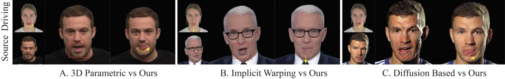
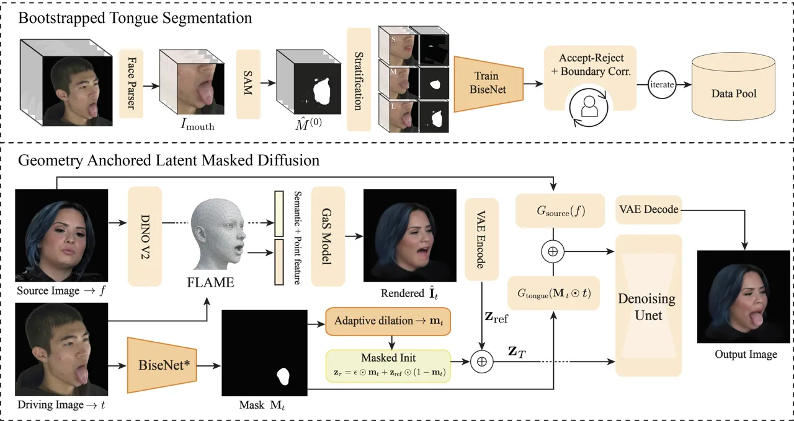
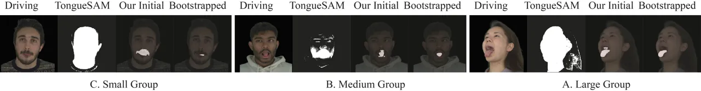
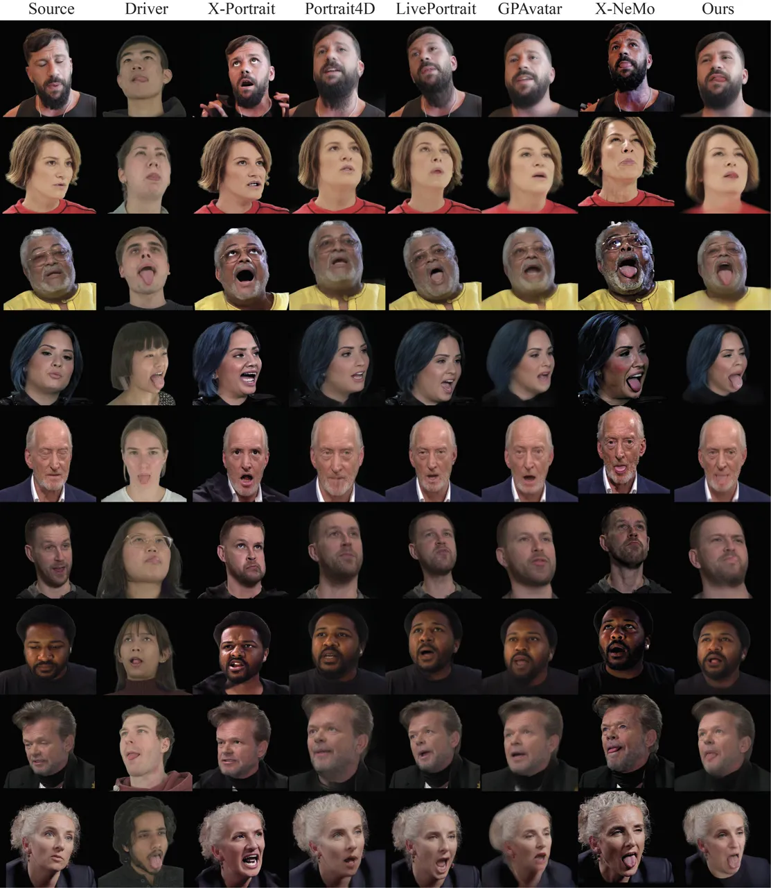
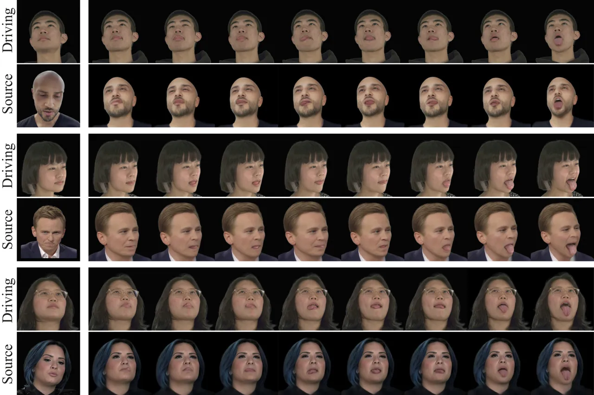

# TongueReenact: Geometry-Anchored Tongue Synthesis for Face Reenactment

MD Wahiduzzaman Khan Affiliation: University of Technology Sydney,
Australia E-mail [arnobk511@gmail.com,
mingshan.jia@uts.edu.au,](mailto:arnobk511@gmail.com,%20mingshan.jia@uts.edu.au,)
   Mingshan Jia Affiliation: University of Technology Sydney, Australia
E-mail [arnobk511@gmail.com,
mingshan.jia@uts.edu.au,](mailto:arnobk511@gmail.com,%20mingshan.jia@uts.edu.au,)
   Xiaolin Zhang ^(†)^(†)thanks: Corresponding author.
Affiliation: Shandong University of Science and Technology, China
E-mail <solli.zhang@gmail.com>    En Yu Affiliation: University of
Technology Sydney, Australia E-mail [arnobk511@gmail.com,
mingshan.jia@uts.edu.au,](mailto:arnobk511@gmail.com,%20mingshan.jia@uts.edu.au,)
   Kaska Musial-Gabrys E-mail [en.yu-1@uts.edu.au,
musial.katarzyna@gmail.com](mailto:en.yu-1@uts.edu.au,%20musial.katarzyna@gmail.com)
Affiliation: University of Technology Sydney, Australia
E-mail [arnobk511@gmail.com,
mingshan.jia@uts.edu.au,](mailto:arnobk511@gmail.com,%20mingshan.jia@uts.edu.au,)

###### Abstract

Modern face reenactment systems achieve impressive pose and expression
transfer using geometry-driven representations. However, they largely
ignore tongue dynamics, leading to anatomically inconsistent mouth
interiors during speech and expressive motions. We introduce the first
framework for cross-identity tongue dynamics transfer in face
reenactment. We propose a foundation-model-assisted bootstrapping
pipeline that produces a dedicated tongue segmentation model for
in-the-wild reenactment without curated annotations. We further
introduce a spatially constrained latent masked diffusion model for
realistic tongue synthesis, with adaptive mask dilation for seamless
mouth boundary transitions. Extensive experiments demonstrate
improvements of more than two times over all baselines on every
tongue-specific metric. We additionally propose a VLM-based evaluation
protocol that replicates expert annotation at scale, confirming
perceptual superiority across all ablation variants.

###### Keywords: 

Face Reenactment Tongue Synthesis Latent Diffusion Gaussian Splatting
Generative Face Models

## 1 Introduction

Animatable head avatar synthesis and face reenactment have made
substantial strides in recent years. Geometry-aware representations such
as 3D Gaussian splatting \[12, 7\] and large-scale generative priors
\[6, 29\] now enable high-fidelity identity preservation with precise
control over pose and expression. Despite this progress, a fundamental
aspect of natural facial communication remains largely unaddressed,
_i.e_., the tongue. During speech, the tongue is the primary
articulator, shaping phonemes and driving visible oral dynamics. During
expressive actions such as laughter, disgust, or surprise, it can
dominate the visible oral region entirely. Yet nearly all existing
reenactment and avatar systems either model the oral interior as a
textureless void or leave it entirely unconstrained \[4, 19, 29\]. This
neglect is not coincidental, as the tongue is a uniquely transient
structure, fully concealed at rest, intermittently exposed during
speech, and suddenly dominant in extreme expressions, making it
fundamentally resistant to the static parametric modeling applied to the
rest of the face. Addressing this overlooked challenge is the central
motivation of our work.



Figure 1: Existing face reenactment methods across three dominant
paradigms fail to transfer tongue dynamics from the driving identity to
the source identity. 3D parametric \[4, 6\], implicit warping \[8\], and
diffusion-based \[29\] methods all produce tongueless mouth regions (red
box) despite a clearly visible driving tongue, whereas our method
successfully synthesizes accurate tongue articulation (yellow arrow)
across all three scenarios.

Existing face reenactment and portrait animation methods fall broadly
into three families: 3D parametric approaches, implicit warping methods,
and generative animation frameworks. 3D parametric methods rely on
parametric priors such as 3DMM \[1\] or FLAME \[16\] to drive facial
motion through explicit deformation fields, offering strong structural
consistency and pose controllability. However, these parametric models
are fundamentally constrained by their mesh topology, as the oral
interior is an open void in the mesh with no vertices, no surface, and
no geometry representing the tongue whatsoever. No amount of expression
parameter tuning can synthesize a structure that does not exist in the
underlying representation. Implicit warping methods \[8\] transfer
motion by mapping source pixels to new locations using learned keypoint
fields. Warping is a transformation, not a generation, and can only
rearrange pixels that already exist in the source frame. If the source
identity exhibits no visible tongue, no warping operation can synthesize
one. Generative animation methods \[29, 25\] animate portraits by
generating new appearance conditioned on motion from the driving video.
However, these models have no explicit mechanism to identify tongue
presence or transfer tongue dynamics from the driving identity.
Synthesis is therefore inconsistent, either hallucinating incorrect
tongue content or collapsing the mouth interior to a blurred cavity,
regardless of what the driving frame exhibits. The core difficulty,
shared by all three families, is not simply a lack of attention. It is
the absence of any dedicated training data pairing tongue appearance
with facial geometry, making the tongue an effectively invisible
structure to every existing pipeline. Figure 1 demonstrates this failure
across all three paradigms.

In this paper, we present the first framework for cross-identity tongue
dynamics transfer in face reenactment. Given a source frame and a
driving video, our method transfers both facial motion and tongue
articulation onto the source identity. The central insight of our work
is that tongue synthesis cannot be treated as a generic inpainting
problem. The tongue must be spatially grounded to the source face
geometry, which itself changes with every driving frame. To address
this, we propose a two-stage framework that explicitly decouples
geometric alignment from generative tongue synthesis. In the first
stage, a Gaussian splatting backbone \[3\] conditioned on FLAME \[16\]
parameters transfers the driving identity’s pose and expression onto the
source identity, producing a geometrically grounded tongue-absent
render. In the second stage, a latent masked diffusion model \[21\]
synthesizes tongue appearance within this render, guided by dual
conditioning signals from both the source geometry and the driving
tongue appearance. A critical enabler of both stages is a dedicated
tongue segmentation model we train from scratch via a
foundation-model-assisted bootstrapping pipeline. No dedicated tongue
segmentation pipeline existed for in-the-wild reenactment prior to this
work. We construct it by combining SAM \[13\] with face parsing priors
to generate pseudo-labels across diverse tongue dynamics, iteratively
refining and expanding the training corpus until the model generalizes
reliably across identities, expressions, and partial occlusions.

The core novelty of our synthesis stage is that both the spatial
constraint and the facial reference are dynamically grounded to the
driving identity at every frame. The mouth region targeted for synthesis
updates with the driving pose and expression, and the facial reference
anchoring all non-mouth regions updates accordingly. This dynamic
coupling ensures that tongue synthesis is never a free hallucination. It
is geometrically constrained to preserve the source identity’s
appearance and the driving identity’s facial structure, frame by frame.
A practical challenge is that a tight segmentation mask produces visible
boundary discontinuities between the synthesized tongue and the
surrounding lips and teeth. We address this with adaptive latent mask
dilation, which proportionally expands the active generation region
based on the spatial extent of the mask, providing sufficient boundary
context for seamless transitions.

Evaluating tongue synthesis poses an additional difficulty. Standard
automated metrics such as FID and IoU measure distributional and
geometric properties but are blind to whether the synthesized tongue
looks natural, is correctly positioned within the mouth, or matches the
articulation of the driving identity. Human evaluation is the gold
standard for such perceptual judgments, but manual annotation at the
scale required for ablation studies is prohibitively expensive. We
therefore introduce a VLM-based human evaluation protocol that bridges
this gap, fine-tuning a vision-language model on expert annotations to
replicate human perceptual judgment at scale.

We summarize our contributions as follows:

- •
  Bootstrapped Tongue Segmentation Pipeline. No dedicated tongue
  segmentation model existed for in-the-wild face reenactment prior to
  this work. We introduce a bootstrapped pipeline leveraging prompted
  segmentation and face parsing priors, producing a model that
  generalizes across identities, expressions, and partial occlusions.
- •
  Geometry-Anchored Latent Masked Diffusion. We introduce a spatially
  constrained tongue synthesis mechanism where the mouth mask and facial
  reference are dynamically grounded to the driving identity at every
  denoising step. We further propose adaptive latent mask dilation for
  smooth boundary transitions, eliminating discontinuities between the
  synthesized tongue and surrounding mouth regions.
- •
  VLM-Based Tongue Quality Evaluation. We propose an automated
  perceptual evaluation methodology for tongue synthesis, training a
  vision-language model on expert annotations to assess tongue quality,
  positioning, and naturalness at scale, filling a gap left by standard
  face reenactment metrics.

## 2 Related Work

### 2.1 Face Reenactment

Face reenactment aims to transfer the head pose and facial expression of
a driving subject onto a source identity while preserving appearance.
Warping-based methods estimate 2D motion fields from 3DMM
coefficients \[1\] or implicit keypoints \[8\], achieving scalable
reenactment but failing under occluded geometry. NeRF-based
approaches \[6\] lift reenactment into 3D but remain impractical due to
slow rendering. GPAvatar \[4\] reconstructs animatable avatars in a
single forward pass via a point-based expression field driven by 3DMM
vertices. Diffusion-based methods \[29, 25\] demonstrate zero-shot
portrait animation from implicit motion descriptors with reduced
identity leakage. Despite these advances, none of the above methods
model the tongue as a distinct anatomical element, leaving
cross-identity tongue dynamics transfer entirely unaddressed.

### 2.2 3D Gaussian Splatting for Facial Avatars

3D Gaussian Splatting (3DGS) \[12\] provides an explicit, differentiable
scene representation supporting real-time rendering at NeRF-level
fidelity. Several works rig Gaussian primitives to FLAME meshes for
controllable head avatars \[19, 30, 7\]. GAGAvatar \[3\], which forms
the reenactment backbone of our method, generalizes this to unseen
identities in a single forward pass by combining DINOv2 appearance
features with FLAME-derived geometric controls. A fundamental limitation
shared by all Gaussian-based methods is that primitives are conditioned
on observed source pixels. If the source identity exhibits no visible
tongue, no primitive can represent tongue geometry, making tongue
transfer impossible within a pure Gaussian splatting framework. Our
method addresses this by coupling the Gaussian stage with a
geometry-anchored latent masked diffusion stage.

### 2.3 Diffusion-based Face Synthesis and Inpainting

Latent diffusion models \[21\] have become the dominant paradigm for
high-fidelity image synthesis. Controllable animation frameworks \[31,
10\] inject structural guidance from parametric body models via
dedicated encoders. For spatially constrained synthesis, RePaint \[18\]
and BrushNet \[11\] demonstrate that iterative recomposition of masked
regions during the reverse diffusion process yields coherent inpainting.
Our geometry-anchored diffusion extends this principle, _i.e_., rather
than applying the mask only at initialization, we recompose the
reference latent against the denoised estimate at every DDIM \[23\]
step, with the mask itself grounded in our driving-frame segmentation
model rather than a user-supplied prior.

### 2.4 Tongue and Oral Region Segmentation

General face parsing methods such as BiSeNet \[27\] segment facial
components including lips and mouth interior, but datasets such as
CelebAMask-HQ do not annotate the tongue as a distinct class. Segment
Anything Model \[13\] enables zero-shot prompted segmentation, with
domain-specific adaptations such as TongueSAM \[2\] for clinical
imagery. However, none of these generalize to the diverse lighting,
extreme expressions, and cross-identity variation in reenactment
datasets. We address this gap by constructing a bootstrapped annotation
pipeline using SAM with face-parser-guided prompting over
NERSemble \[14\], training a lightweight BiSeNet model that operates
reliably on driving frames regardless of identity or head pose.

## 3 Preliminaries

##### FLAME Parametric Head Model.

FLAME \[16\] is a statistical 3D head model that represents facial
geometry through three low-dimensional parameter sets: shape
$`\bm{\beta}\in\mathbb{R}^{|\beta|}`$, pose
$`\bm{\theta}\in\mathbb{R}^{|\theta|}`$, and expression
$`\bm{\psi}\in\mathbb{R}^{|\psi|}`$. Given these parameters, the model
outputs a mesh of $`N=5{,}023`$ vertices:

```math
\mathbf{V}=\mathrm{FLAME}(\bm{\beta},\bm{\theta},\bm{\psi})\in\mathbb{R}^{N\times 3}. \tag{1}
```

The expression parameters $`\bm{\psi}`$ directly encode articulations of
the jaw, lips, and surrounding musculature, providing a compact and
semantically meaningful geometric prior for mouth region localization.

##### 3D Gaussian Splatting.

3D Gaussian Splatting \[12\] represents a scene as a collection of
anisotropic Gaussian primitives, each defined by a center position
$`\bm{\mu}\in\mathbb{R}^{3}`$, a covariance matrix $`\bm{\Sigma}`$,
opacity $`\alpha`$, and spherical harmonic color coefficients. The scene
is rendered by projecting the Gaussians onto the image plane and
alpha-compositing them in depth order, yielding a fully differentiable
rasterization pipeline that supports real-time rendering without the
per-ray integration cost of NeRF-based methods.

##### Latent Diffusion Models.

Latent diffusion models \[21\] operate in the compressed latent space of
a pretrained VAE. An encoder $`\mathcal{E}`$ maps an image
$`\mathbf{x}`$ to a latent $`\mathbf{z}=s\cdot\mathcal{E}(\mathbf{x})`$,
and a decoder $`\mathcal{D}`$ reconstructs the image as
$`\hat{\mathbf{x}}=\mathcal{D}(\mathbf{z})`$, where $`s`$ is a fixed
scaling factor. A denoising UNet $`\epsilon_{\phi}`$ learns to reverse a
Gaussian noise process conditioned on guidance signals, and at inference
the DDIM \[23\] scheduler produces a deterministic trajectory from noise
$`\mathbf{z}_{T}\sim\mathcal{N}(\mathbf{0},\mathbf{I})`$ to a clean
latent $`\mathbf{z}_{0}`$ in $`S`$ steps.

## 4 Methodology

Figure 2 provides an overview of our pipeline. A
foundation-model-assisted bootstrapping pipeline first produces a
dedicated tongue segmentation model (Section 4.1), upon which the core
two-stage framework is built. A Gaussian splatting backbone produces a
geometry-grounded render of the source identity, which is passed to a
geometry-anchored latent masked diffusion model for tongue
synthesis (Section 4.2).



Figure 2: Overview of our pipeline. Top: Bootstrapped tongue
segmentation training. A face parser localizes the mouth region,
producing a mouth crop $`I_{\text{mouth}}`$. SAM generates pseudo-labels
($`\hat{M}^{(0)}`$), and masks are stratified into Small (S), Medium
(M), and Large (L) groups. Human-in-the-loop refinement produces the
training data for iterative BiSeNet\* training. Bottom: At inference,
the source image $`f`$ is reenacted via Gaussian splatting (GaS)
conditioned on driving FLAME parameters, producing
$`\hat{\mathbf{I}}_{t}`$. The driving image $`t`$ is segmented by
BiSeNet\* (bootstrapped) to yield mask $`\mathbf{M}_{t}`$, which is
adaptively dilated to produce $`\mathbf{m}_{t}`$ before masked latent
initialization, yielding $`\mathbf{z}_{T}`$. The reference latent
$`\mathbf{z}_{\mathrm{ref}}`$ is encoded from $`\hat{\mathbf{I}}_{t}`$.
A denoising UNet with dual guidance from $`G_{\text{source}}`$ and
$`G_{\text{tongue}}`$ synthesizes the final output.

### 4.1 Bootstrapped Tongue Segmentation

We introduce a bootstrapped tongue segmentation pipeline that produces
reliable tongue masks for in-the-wild reenactment frames without
requiring manually curated annotations.

#### Prompted Pseudo-Labeling

For each frame $`I\in\mathbb{R}^{H\times W\times 3}`$ in a multi-subject
video dataset, we apply a pretrained face parsing model \[15\] to obtain
a semantic label map $`\mathcal{P}(I)\in\mathbb{R}^{H\times W}`$. We
isolate the mouth label and compute a tight axis-aligned bounding box
$`\mathcal{B}(I)`$ to crop the mouth region $`I_{\text{mouth}}`$. We
then run an object detector \[2\] to localize the tongue and obtain a
bounding box prompt $`\mathcal{B}_{\text{det}}`$, which is passed to
SAM \[13\] to produce an initial pseudo-label:

```math
\hat{M}^{(0)}=\operatorname{SAM}(I_{\text{mouth}},\,\mathcal{B}_{\text{det}}). \tag{2}
```

Frames with no confident detection are discarded as tongue-absent. Among
the remaining frames, the candidate with the highest confidence mask is
selected as the representative annotation for that timestamp.



Figure 3: Tongue segmentation comparisons across three exposure groups
(Small, Medium, Large). For each group we show the driving image, the
TongueSAM baseline, our initial SAM-based pseudo-label, and the final
bootstrapped BiSeNet\* prediction. TongueSAM consistently produces
erroneous full-face regions, while our bootstrapped model accurately
isolates the tongue across all exposure levels.

#### Stratified Bootstrapping

SAM pseudo-labels $`\hat{M}^{(0)}`$ contain characteristic errors due to
domain shift, including leakage onto lips and teeth, fragmentation under
occlusion, and false positives on saturated oral tissue. To ensure
balanced coverage of diverse tongue dynamics, we stratify frames by
visible tongue area

```math
A(M)=\sum_{x,y}M_{x,y}, \tag{3}
```

and assign each mask to one of three exposure categories:

```math
\operatorname{Category}(M)=\begin{cases}\text{Small}&\text{if }A(M)<\tau_{1},\\
\text{Medium}&\text{if }\tau_{1}\leq A(M)<\tau_{2},\\
\text{Large}&\text{if }A(M)\geq\tau_{2},\end{cases} \tag{4}
```

where $`\tau_{1}`$ and $`\tau_{2}`$ uniformly partition the observed
range of mask areas. Within each category, pseudo-labels undergo two
refinement stages: an accept/reject pass discarding masks with clear
anatomical inconsistencies, followed by manual boundary correction for
masks that are topologically correct but geometrically imprecise. The
resulting refined set $`\mathcal{D}^{(0)}`$ forms the seed training
dataset.

We train a BiSeNet \[27\] segmentation model $`\mathcal{F}_{\theta}`$
(BiSeNet\*) on $`\mathcal{D}^{(0)}`$. BiSeNet is chosen for its
bilateral architecture: the Detail Branch preserves boundary fidelity
while the Semantic Branch captures higher-level context, making it well
suited to thin, irregular, and partially occluded tongue regions. We
optimize using OHEM-CE loss \[22\] on both the primary and auxiliary
heads:

```math
\mathcal{L}_{\text{seg}}=\mathcal{L}_{\text{OHEM}}\bigl(\mathcal{F}_{\theta}(I),\,M\bigr)+\sum_{i=1}^{N_{\text{aux}}}\mathcal{L}_{\text{OHEM}}\bigl(\mathcal{F}_{\theta}^{(i)}(I),\,M\bigr), \tag{5}
```

where $`M`$ is the refined pseudo-label and $`N_{\text{aux}}`$ is the
number of auxiliary heads. The trained model
$`\mathcal{F}^{(0)}_{\theta}`$ is applied to an extended set
$`\mathcal{V}^{\text{ext}}`$ of NERSemble subjects and synthetically
generated VFHQ frames, broadening identity and appearance diversity.
These candidates undergo the same accept/reject and boundary correction
refinement to produce $`\mathcal{D}^{(1)}`$, and an updated model
$`\mathcal{F}^{(1)}_{\theta}`$ is trained on
$`\mathcal{D}^{(0)}\cup\mathcal{D}^{(1)}`$. We iterate this loop until
segmentation quality on held-out subjects stabilizes, measured via mask
boundary consistency and inter-rater agreement (Algorithm 1, Phase 1).
Qualitative results are shown in Figure 3.

### 4.2 Geometry-Anchored Latent Masked Diffusion

The reenacted render $`\hat{\mathbf{I}}_{t}`$ provides accurate identity
and pose but contains no tongue. We propose a geometry-anchored latent
masked diffusion scheme. The generative process is confined exclusively
to the mouth region, as determined by the driving-frame segmentation
mask. All other regions are anchored to the reenacted reference latent
at every denoising step.

#### Gaussian-Guided Reenactment

Cross-identity tongue transfer requires synthesizing tongue appearance
at the precise spatial location dictated by the driving identity’s
facial geometry. We use a Gaussian splatting model \[3\] to transfer the
driving identity’s FLAME \[16\] shape, pose, and expression parameters
onto the source identity, producing a geometrically grounded render
$`\hat{\mathbf{I}}_{t}`$. Since this render is conditioned solely on the
source identity’s pixels, which exhibit no visible tongue, the mouth
region becomes a well-defined inpainting target for the stage that
follows.

Our trained BiSeNet\* (Section 4.1) simultaneously operates on each
driving frame $`t`$, producing a binary tongue segmentation mask
$`\mathbf{M}_{t}\in\{0,1\}^{H\times W}`$. We extract the driving mouth
crop as

```math
\mathbf{I}_{\mathrm{mouth},t}=\mathbf{t}\odot\mathbf{M}_{t}, \tag{6}
```

where $`\odot`$ denotes element-wise multiplication. Together,
$`\hat{\mathbf{I}}_{t}`$ and $`\mathbf{I}_{\mathrm{mouth},t}`$ form a
complementary conditioning signal: the former specifies where the mouth
is on the source identity, and the latter specifies what the tongue
looks like.

#### Adaptive Mask Initialization

The binary mask $`\mathbf{M}_{t}`$ from BiSeNet\* is spatially expanded
through an adaptive dilation procedure. Rather than a fixed-radius
dilation, we compute the bounding box of the active mask region and
scale the expansion proportionally to its spatial extent:

```math
r=\max\!\left(r_{\min},\;\Bigl\lfloor\rho\cdot\tfrac{1}{2}(h_{\mathrm{box}}+w_{\mathrm{box}})\Bigr\rfloor\right), \tag{7}
```

where $`h_{\mathrm{box}}`$ and $`w_{\mathrm{box}}`$ are the bounding box
dimensions, $`\rho`$ is the expansion ratio, and $`r_{\min}`$ ensures
minimal mouth coverage for frames with small tongue exposure. The
dilation yields a smooth expanded mask
$`\tilde{\mathbf{M}}_{t}\in[0,1]^{H\times W}`$, which is downsampled to
the VAE latent resolution:

```math
\mathbf{m}_{t}=\mathrm{Downsample}\!\left(\tilde{\mathbf{M}}_{t};\;\tfrac{H}{8}\times\tfrac{W}{8}\right). \tag{8}
```

Expanding in image space before downsampling avoids aliasing artifacts
at latent-resolution boundaries.

The reenacted render $`\hat{\mathbf{I}}_{t}`$ is encoded by the frozen
VAE encoder \[21\] to obtain the reference latent:

```math
\mathbf{z}_{\mathrm{ref}}=s\cdot\mathcal{E}(\hat{\mathbf{I}}_{t}), \tag{9}
```

where $`s=0.18215`$ is the standard VAE scaling factor. The initial
latent is constructed as a region-wise composition of pure noise within
the mouth region and the reference latent outside it:

```math
\mathbf{z}_{T}^{(t)}=\bm{\epsilon}\odot\mathbf{m}_{t}+\mathbf{z}_{\mathrm{ref}}\odot(1-\mathbf{m}_{t}),\qquad\bm{\epsilon}\sim\mathcal{N}(\mathbf{0},\mathbf{I}). \tag{10}
```

This confines generative uncertainty to where tongue synthesis is
required, while anchoring the non-mouth region from the outset.

#### Geometry-Anchored Denoising

After each DDIM \[23\] step produces an intermediate latent
$`\hat{\mathbf{z}}_{\tau-1}`$, we recompose it against the reference:

```math
\mathbf{z}_{\tau-1}^{(t)}=\hat{\mathbf{z}}_{\tau-1}\odot\mathbf{m}_{t}+\mathbf{z}_{\mathrm{ref}}\odot(1-\mathbf{m}_{t}). \tag{11}
```

This recomposition is applied at every step, continuously enforcing that
the non-mouth region remains anchored to $`\mathbf{z}_{\mathrm{ref}}`$
throughout the reverse process. Since $`\mathbf{m}_{t}`$ is derived from
the driving identity’s geometry, the spatial constraint is geometrically
precise rather than heuristic, which is the key distinction from generic
latent inpainting.

The denoising UNet is conditioned on two complementary signals. The
reenacted render $`\hat{\mathbf{I}}_{t}`$ is processed by a guidance
encoder \[31\] to produce structural features encoding the source
identity’s head pose and facial geometry. The driving mouth crop
$`\mathbf{I}_{\mathrm{mouth},t}`$ is processed by a second guidance
encoder to produce appearance features encoding the driving identity’s
tongue texture and articulation. The two feature maps are summed and
injected into the UNet at each spatial resolution level. Additionally,
CLIP \[20\] image embeddings from $`\hat{\mathbf{I}}_{t}`$ provide
global identity conditioning through the image prompt mechanism of the
diffusion backbone \[21\]. The complete inference procedure is
summarized in Algorithm 1 (Phase 2).

 

Algorithm 1: Cross-Identity Tongue Dynamics Transfer

 

1: $`\mathcal{V}^{\text{NER}}`$, $`\mathcal{V}^{\text{ext}}`$,
$`\mathcal{P}`$, SAM

2: BiSeNet\*

3: 1: Bootstrapped Segmentation Training

4: for each $`I\in\mathcal{V}^{\text{NER}}`$ do

5:    $`I_{\mathrm{mouth}}\leftarrow\mathcal{P}(I)`$

6:
   $`\hat{M}^{(0)}\leftarrow\operatorname{SAM}(I_{\mathrm{mouth}},\mathcal{B}_{\text{det}})`$

7:    Stratify $`A(M)`$ $`\rightarrow`$ S / M / L

8: end for

9: Refine $`\rightarrow\mathcal{D}^{(0)}`$; train
$`\mathcal{F}^{(0)}_{\theta}`$

10: $`k\leftarrow 1`$

11: repeat

12:    $`\mathcal{F}^{(k-1)}_{\theta}`$ on $`\mathcal{V}^{\text{ext}}`$
$`\rightarrow`$ refine $`\mathcal{D}^{(k)}`$

13:
   $`\mathcal{V}^{\text{ext}}\mathrel{+}=\text{GaS}(f,\text{FLAME}(t))`$

14:    Train $`\mathcal{F}^{(k)}_{\theta}`$ on
$`\mathcal{D}^{(k-1)}\cup\mathcal{D}^{(k)}`$

15:    $`k\mathrel{+}=1`$

16: until quality stabilizes

17: BiSeNet\* $`\leftarrow\mathcal{F}^{(k-1)}_{\theta}`$

1: $`f`$, $`\{t\}`$, BiSeNet\*, $`\epsilon_{\phi}`$

2: $`\{O_{t}\}`$

3: 2: Tongue Synthesis

4: for each driving frame $`t`$ do

5:    $`\hat{\mathbf{I}}_{t}\leftarrow\text{GaS}(f,\text{FLAME}(t))`$

6:    $`\mathbf{M}_{t}\leftarrow\text{BiSeNet*}(t)`$

7:    $`\mathbf{m}_{t}\leftarrow\text{AdDilate}(\mathbf{M}_{t})`$

8:
   $`\mathbf{z}_{\mathrm{ref}}\leftarrow s\cdot\mathcal{E}(\hat{\mathbf{I}}_{t})`$

9:
   $`\mathbf{z}_{T}\leftarrow\bm{\epsilon}\odot\mathbf{m}_{t}+\mathbf{z}_{\mathrm{ref}}\odot(1-\mathbf{m}_{t})`$

10:
   $`\mathbf{c}\leftarrow G^{\text{src}}(f)+G^{\text{tng}}(\mathbf{I}_{\mathrm{mouth},t})`$

11:    for $`\tau=T,\ldots,1`$ do

12:
    $`\hat{\mathbf{z}}_{\tau-1}\leftarrow\epsilon_{\phi}(\mathbf{z}_{\tau},\tau,\mathbf{c})`$

13:
    $`\mathbf{z}_{\tau-1}\leftarrow\hat{\mathbf{z}}_{\tau-1}\odot\mathbf{m}_{t}`$

14:         $`+\mathbf{z}_{\mathrm{ref}}\odot(1-\mathbf{m}_{t})`$

15:    end for

16:    $`O_{t}\leftarrow\text{VAE-Dec}(\mathbf{z}_{0})`$

17: end for

18: return $`\{O_{t}\}`$;

 

## 5 Experiments

### 5.1 Implementation Details

We train BiSeNet \[27\] with two output classes (background and tongue)
for 50,000 iterations using SGD with momentum, learning rate
$`10^{-3}`$, weight decay $`5\times 10^{-4}`$, and linear warmup over
1,000 iterations. Input resolution is $`512\times 512`$ with batch size
4, multi-scale augmentation in $`[0.75,2.0]`$, and FP16 precision.
Training data consists of NERSemble and synthetically generated VFHQ
frames from our bootstrapped pipeline. For reenactment, we use the
pretrained Gaussian splatting backbone \[3\] without modification. The
diffusion model is initialized from the Stable Diffusion image
variations checkpoint \[21\], with the VAE and CLIP encoder frozen.
Guidance encoders and the denoising UNet are trained on NERSemble for
85,000 iterations, batch size 8 at $`512\times 512`$, using Adam
($`lr{=}10^{-5}`$, $`\beta_{1}{=}0.9`$, $`\beta_{2}{=}0.999`$, weight
decay $`10^{-2}`$), noise offset 0.05, SNR $`\gamma{=}5.0`$, and
zero-SNR training \[17\] with a scaled linear $`\beta`$ schedule
($`T{=}1{,}000`$ steps). Guidance encoders are trained from scratch with
320 output embedding channels. At inference we use 20 DDIM \[23\] steps,
$`\rho{=}0.3`$, and $`r_{\min}{=}5`$ pixels. All experiments are run on
a single NVIDIA A40 (48 GB).



Figure 4: Qualitative comparison of cross-identity face reenactment
across nine source–driving pairs. Our method consistently synthesizes
visible and anatomically plausible tongue dynamics transferred from the
driving identity, whereas X-Portrait \[25\], Portrait4D \[6\],
LivePortrait \[8\], GPAvatar \[4\], and X-NeMo \[29\] fail to reproduce
tongue articulation despite the driving frame exhibiting a clearly
visible tongue.

### 5.2 Evaluation Setup

We evaluate on 9,000 cross-identity source-driving pairs from
VFHQ \[24\], comparing against five state-of-the-art face reenactment
methods: GPAvatar \[4\], Portrait4D \[6\], LivePortrait \[8\],
X-NeMo \[29\], and X-Portrait \[25\], each run using their official
implementations. We evaluate tongue transfer fidelity using four
dedicated metrics: LPIPS in the tongue region \[28\], Tongue Presence
(fraction of frames containing a detectable tongue), Tongue IoU
(normalized intersection-over-union between generated and driving tongue
masks), and Tongue Area Similarity (ratio of generated to driving tongue
mask area). Arrows indicate the direction of improvement.

### 5.3 Comparison with State-of-the-Art

Table 1 reports quantitative results against all baselines. Our method
achieves the best performance across all four tongue transfer metrics,
with a Tongue IoU of 0.3582 and Tongue Area Similarity of 0.4338, more
than double the nearest competitor, confirming substantially more
accurate tongue dynamics transfer. Tongue Presence of 0.7891 further
demonstrates that our method reliably synthesizes visible tongue
articulation where existing methods frequently produce none.

| Metric                              | Ours   | X-NeMo | GPAvatar | LivePortrait | Portrait4D | X-Portrait |
| ----------------------------------- | ------ | ------ | -------- | ------------ | ---------- | ---------- |
| LPIPS (tongue) $`\downarrow`$       | 0.2306 | 0.3937 | 0.2890   | 0.3454       | 0.2591     | 0.4209     |
| Tongue Presence $`\uparrow`$        | 0.7891 | 0.7367 | 0.4274   | 0.5986       | 0.5102     | 0.5067     |
| Tongue IoU $`\uparrow`$             | 0.3582 | 0.1400 | 0.1387   | 0.1603       | 0.1918     | 0.1508     |
| Tongue Area Similarity $`\uparrow`$ | 0.4338 | 0.1180 | 0.0713   | 0.1255       | 0.0818     | 0.1330     |

Table 1: Comparative quantitative results. Best results are shown in
bold. Arrows indicate the desired direction of each metric.

### 5.4 Ablation Study

Table 2 analyzes the contribution of each component. We evaluate three
variants: removing adaptive mask dilation (w/o Dilation), removing the
reenactment stage (w/o Reenactment), and removing the driving mouth crop
conditioning (w/o Tongue).

Removing adaptive dilation causes a notable drop in tongue transfer
metrics (Tongue IoU from 0.3956 to 0.2619, Tongue Area Similarity from
0.4779 to 0.1890), confirming that proportional mask expansion is
necessary for sufficient generative freedom around the mouth boundary.
Removing the reenactment stage causes tongue transfer to collapse
(Tongue IoU 0.2355), demonstrating that the geometry-grounded render is
essential for spatially anchoring the synthesis region. Removing tongue
conditioning causes the most severe degradation across all metrics,
confirming that $`\mathbf{I}_{\mathrm{mouth},t}`$ is the primary source
of tongue appearance information.

##### Identity Preservation.

Our method faithfully preserves identity across all non-synthesized
facial regions, as confirmed by masking the mouth region prior to
ArcFace \[5\] feature extraction, which reduces the identity gap between
the full model and w/o Tongue variant to just 0.0007 (0.4840 vs.
0.4833). The small unmasked gap of 0.0239 (0.5293 vs. 0.5532) is
entirely localized to the synthesized mouth area, an expected
consequence of generating content that is entirely absent in the source
frame.

| Metric                              | Full (Ours) | w/o Dilation | w/o Reenactment | w/o Tongue |
| ----------------------------------- | ----------- | ------------ | --------------- | ---------- |
| LPIPS (tongue) $`\downarrow`$       | 0.2089      | 0.2793       | 0.2604          | 0.2884     |
| Tongue Presence $`\uparrow`$        | 0.8851      | 0.5776       | 0.7315          | 0.4397     |
| Tongue IoU $`\uparrow`$             | 0.3956      | 0.2619       | 0.2355          | 0.1216     |
| Tongue Area Similarity $`\uparrow`$ | 0.4779      | 0.1890       | 0.2694          | 0.0631     |

Table 2: Ablation study analyzing the contribution of each component.
Best results are shown in bold.

### 5.5 Temporal Consistency

A key concern with diffusion-based synthesis is temporal flickering, as
frame-by-frame generation can produce inconsistent motion across a
sequence. We verify that our geometry-anchored denoising suppresses this
by comparing temporal consistency between our full model and a variant
without tongue synthesis over generated video sequences. Table 3 reports
T-LPIPS (perceptual similarity between consecutive frames), flow jitter
(variance of inter-frame flow magnitude), and flow magnitude, all
evaluated on the mouth region. Our full model achieves substantially
lower flow jitter (0.218543 vs. 0.622901) and flow magnitude (0.513165
vs. 1.254073), confirming that geometry-anchored denoising produces
smooth and stable tongue motion. Lower T-LPIPS further confirms that
tongue synthesis does not compromise temporal coherence.

| Metric                        | With Tongue | Without Tongue |
| ----------------------------- | ----------- | -------------- |
| T-LPIPS $`\downarrow`$        | 0.0149      | 0.0291         |
| Flow Jitter $`\downarrow`$    | 0.2185      | 0.6229         |
| Flow Magnitude $`\downarrow`$ | 0.5132      | 1.2541         |

Table 3: Temporal consistency metrics. Lower values indicate improved
smoothness and stability.

### 5.6 VLM-Based Perceptual Evaluation

Standard automated metrics do not capture perceptual tongue quality as
judged by a human observer. We therefore fine-tune Qwen3-VL \[26\] on
100 expert-annotated frames to replicate human judgement across four
criteria: tongue quality (0–5 scale), tongue positioning (binary), best
tongue, and best overall reenactment. The fine-tuned model is applied to
the remaining 1,000 frames, yielding 1,100 evaluated frames in total.
Full annotation details and fine-tuning procedure are provided in the
supplementary material. As shown in Table 4, the full model achieves a
mean tongue quality rating of 3.07, is selected as best tongue in 99.9%
of frames and best overall in 100% of frames, with correct tongue
positioning in 100% of cases. All ablation variants collapse near zero
across all criteria, confirming that tongue conditioning, adaptive
dilation, and geometry-anchored reenactment are each individually
necessary for perceptually acceptable tongue synthesis.

| Method       | Avg. Rating | Best Tongue (%) | Best Overall (%) | Positioning (%) |
| ------------ | ----------- | --------------- | ---------------- | --------------- |
| Full Model   | 3.07        | 99.9            | 100.0            | 100.0           |
| w/o Tongue   | 0.73        | 0.0             | 0.0              | 1.9             |
| w/o Dilation | 1.36        | 0.1             | 0.0              | 41.0            |
| w/o Reenact  | 1.09        | 0.0             | 0.0              | 1.6             |

Table 4: VLM-based perceptual evaluation. Bold indicates best result.

## 6 Conclusion

We present a framework for cross-identity tongue dynamics transfer, a
capability absent from all existing face reenactment methods. Our
bootstrapped tongue segmentation pipeline produces reliable tongue masks
without manually curated annotations. These masks drive a
geometry-anchored latent masked diffusion model that synthesizes natural
tongue dynamics from one identity onto another. The diffusion stage is
designed to couple with any geometry-faithful reenactment backbone,
making the approach broadly extensible beyond the specific model used
here. Experiments on VFHQ demonstrate that our method outperforms all
baselines across every tongue-specific metric, while preserving identity
faithfully in all non-synthesized facial regions.

##### Limitations.

As the diffusion stage is designed to generalize across reenactment
backbones, tongue synthesis quality may vary slightly with the choice of
reenactment backbone. Identity preservation in the synthesized mouth
area remains slightly reduced, an inherent trade-off of generative
synthesis over content entirely absent in the source frame.

## References

- \[1\] V. Blanz and T. Vetter (2023) A morphable model for the
  synthesis of 3d faces. In Seminal Graphics Papers: Pushing the
  Boundaries, Volume 2, pp. 157–164. Cited by: §1, §2.1.
- \[2\] S. Cao, Q. Wu, and L. Ma (2023) TongueSAM: an universal tongue
  segmentation model based on sam with zero-shot. In 2023 IEEE
  international conference on bioinformatics and biomedicine (BIBM),
  pp. 4520–4526. Cited by: §1, §2.4, §4.1.
- \[3\] X. Chu and T. Harada (2024) Generalizable and animatable
  gaussian head avatar. Advances in Neural Information Processing
  Systems 37, pp. 57642–57670. Cited by: §1, §2.2, §4.2, §5.1.
- \[4\] X. Chu, Y. Li, A. Zeng, T. Yang, L. Lin, Y. Liu, and T.
  Harada (2024) GPAvatar: generalizable and precise head avatar from
  image (s). arXiv preprint arXiv:2401.10215. Cited by: Figure 1, Figure
  1, §1, §2.1, Figure 4, Figure 4, §5.2.
- \[5\] J. Deng, J. Guo, N. Xue, and S. Zafeiriou (2019) Arcface:
  additive angular margin loss for deep face recognition. In Proceedings
  of the IEEE/CVF conference on computer vision and pattern recognition,
  pp. 4690–4699. Cited by: §5.4.
- \[6\] Y. Deng, D. Wang, X. Ren, X. Chen, and B. Wang (2024)
  Portrait4d: learning one-shot 4d head avatar synthesis using synthetic
  data. In Proceedings of the IEEE/CVF Conference on Computer Vision and
  Pattern Recognition, pp. 7119–7130. Cited by: Figure 1, Figure 1, §1,
  §2.1, Figure 4, Figure 4, §5.2.
- \[7\] H. Dhamo, Y. Nie, A. Moreau, J. Song, R. Shaw, Y. Zhou, and E.
  Pérez-Pellitero (2024) Headgas: real-time animatable head avatars via
  3d gaussian splatting. In European Conference on Computer Vision,
  pp. 459–476. Cited by: §1, §2.2.
- \[8\] J. Guo, D. Zhang, X. Liu, Z. Zhong, Y. Zhang, P. Wan, and D.
  Zhang (2024) Liveportrait: efficient portrait animation with stitching
  and retargeting control. arXiv preprint arXiv:2407.03168. Cited by:
  Figure 1, Figure 1, §1, §2.1, Figure 4, Figure 4, §5.2.
- \[9\] E. J. Hu, Y. Shen, P. Wallis, Z. Allen-Zhu, Y. Li, S. Wang, L.
  Wang, W. Chen, et al. (2022) Lora: low-rank adaptation of large
  language models.. Iclr 1 (2), pp. 3. Cited by: §2.2.
- \[10\] L. Hu (2024) Animate anyone: consistent and controllable
  image-to-video synthesis for character animation. In Proceedings of
  the IEEE/CVF conference on computer vision and pattern recognition,
  pp. 8153–8163. Cited by: §2.3.
- \[11\] X. Ju, X. Liu, X. Wang, Y. Bian, Y. Shan, and Q. Xu (2024)
  Brushnet: a plug-and-play image inpainting model with decomposed
  dual-branch diffusion. In European Conference on Computer Vision,
  pp. 150–168. Cited by: §2.3.
- \[12\] B. Kerbl, G. Kopanas, T. Leimkühler, G. Drettakis, et
  al. (2023) 3d gaussian splatting for real-time radiance field
  rendering.. ACM Trans. Graph. 42 (4), pp. 139–1. Cited by: §1, §2.2,
  §3.
- \[13\] A. Kirillov, E. Mintun, N. Ravi, H. Mao, C. Rolland, L.
  Gustafson, T. Xiao, S. Whitehead, A. C. Berg, W. Lo, et al. (2023)
  Segment anything. In Proceedings of the IEEE/CVF international
  conference on computer vision, pp. 4015–4026. Cited by: §1, §2.4,
  §4.1.
- \[14\] T. Kirschstein, S. Qian, S. Giebenhain, T. Walter, and M.
  Nießner (2023) Nersemble: multi-view radiance field reconstruction of
  human heads. ACM Transactions on Graphics (TOG) 42 (4), pp. 1–14.
  Cited by: §1, §2.4.
- \[15\] C. Lee, Z. Liu, L. Wu, and P. Luo (2020) Maskgan: towards
  diverse and interactive facial image manipulation. In Proceedings of
  the IEEE/CVF conference on computer vision and pattern recognition,
  pp. 5549–5558. Cited by: §4.1.
- \[16\] T. Li, T. Bolkart, M. J. Black, H. Li, and J. Romero (2017)
  Learning a model of facial shape and expression from 4d scans.. ACM
  Trans. Graph. 36 (6), pp. 194–1. Cited by: §1, §1, §3, §4.2.
- \[17\] S. Lin, B. Liu, J. Li, and X. Yang (2024) Common diffusion
  noise schedules and sample steps are flawed. In Proceedings of the
  IEEE/CVF winter conference on applications of computer vision,
  pp. 5404–5411. Cited by: §5.1.
- \[18\] A. Lugmayr, M. Danelljan, A. Romero, F. Yu, R. Timofte, and L.
  Van Gool (2022) Repaint: inpainting using denoising diffusion
  probabilistic models. In Proceedings of the IEEE/CVF conference on
  computer vision and pattern recognition, pp. 11461–11471. Cited by:
  §2.3.
- \[19\] S. Qian, T. Kirschstein, L. Schoneveld, D. Davoli, S.
  Giebenhain, and M. Nießner (2024) Gaussianavatars: photorealistic head
  avatars with rigged 3d gaussians. In Proceedings of the IEEE/CVF
  Conference on Computer Vision and Pattern Recognition,
  pp. 20299–20309. Cited by: §1, §2.2.
- \[20\] A. Radford, J. W. Kim, C. Hallacy, A. Ramesh, G. Goh, S.
  Agarwal, G. Sastry, A. Askell, P. Mishkin, J. Clark, et al. (2021)
  Learning transferable visual models from natural language supervision.
  In International conference on machine learning, pp. 8748–8763. Cited
  by: §4.2.
- \[21\] R. Rombach, A. Blattmann, D. Lorenz, P. Esser, and B.
  Ommer (2022) High-resolution image synthesis with latent diffusion
  models. In Proceedings of the IEEE/CVF conference on computer vision
  and pattern recognition, pp. 10684–10695. Cited by: §1, §2.3, §3,
  §4.2, §4.2, §5.1.
- \[22\] A. Shrivastava, A. Gupta, and R. Girshick (2016) Training
  region-based object detectors with online hard example mining. In
  Proceedings of the IEEE conference on computer vision and pattern
  recognition, pp. 761–769. Cited by: §4.1.
- \[23\] J. Song, C. Meng, and S. Ermon (2020) Denoising diffusion
  implicit models. arXiv preprint arXiv:2010.02502. Cited by: §2.3, §3,
  §4.2, §5.1.
- \[24\] L. Xie, X. Wang, H. Zhang, C. Dong, and Y. Shan (2022) Vfhq: a
  high-quality dataset and benchmark for video face super-resolution. In
  Proceedings of the IEEE/CVF Conference on Computer Vision and Pattern
  Recognition, pp. 657–666. Cited by: §5.2.
- \[25\] Y. Xie, H. Xu, G. Song, C. Wang, Y. Shi, and L. Luo (2024)
  X-portrait: expressive portrait animation with hierarchical motion
  attention. In ACM SIGGRAPH 2024 conference papers, pp. 1–11. Cited by:
  §1, §2.1, Figure 4, Figure 4, §5.2.
- \[26\] A. Yang, A. Li, B. Yang, B. Zhang, B. Hui, B. Zheng, B. Yu, C.
  Gao, C. Huang, C. Lv, et al. (2025) Qwen3 technical report. arXiv
  preprint arXiv:2505.09388. Cited by: §2.2, §5.6.
- \[27\] C. Yu, J. Wang, C. Peng, C. Gao, G. Yu, and N. Sang (2018)
  Bisenet: bilateral segmentation network for real-time semantic
  segmentation. In Proceedings of the European conference on computer
  vision (ECCV), pp. 325–341. Cited by: §2.4, §4.1, §5.1.
- \[28\] R. Zhang, P. Isola, A. A. Efros, E. Shechtman, and O.
  Wang (2018) The unreasonable effectiveness of deep features as a
  perceptual metric. In Proceedings of the IEEE conference on computer
  vision and pattern recognition, pp. 586–595. Cited by: §5.2.
- \[29\] X. Zhao, H. Xu, G. Song, Y. Xie, C. Zhang, X. Li, L. Luo, J.
  Suo, and Y. Liu (2025) X-nemo: expressive neural motion reenactment
  via disentangled latent attention. arXiv preprint arXiv:2507.23143.
  Cited by: Figure 1, Figure 1, §1, §1, §2.1, Figure 4, Figure 4, §5.2.
- \[30\] Z. Zhou, F. Ma, H. Fan, Z. Yang, and Y. Yang (2024) Headstudio:
  text to animatable head avatars with 3d gaussian splatting. In
  European Conference on Computer Vision, pp. 145–163. Cited by: §2.2.
- \[31\] S. Zhu, J. L. Chen, Z. Dai, Z. Dong, Y. Xu, X. Cao, Y. Yao, H.
  Zhu, and S. Zhu (2024) Champ: controllable and consistent human image
  animation with 3d parametric guidance. In European Conference on
  Computer Vision, pp. 145–162. Cited by: §2.3, §4.2.

Supplementary Material for TongueReenact:  
Geometry-Anchored Tongue Synthesis for Face Reenactment

## 1 Extended Tongue Segmentation Evaluation

We report comprehensive segmentation metrics comparing TongueSAM \[2\],
our initial seed model, and our final bootstrapped BiSeNet\* across
6,344 evaluation frames from NERSemble \[14\]. Tables 5 and 6 report
performance on tongue-present frames. Table 7 reports hallucination
behavior on tongue-absent frames.

TongueSAM achieves near-zero precision, producing predicted masks
10–115$`\times`$ larger than ground truth depending on the exposure
group. While TongueSAM achieves the highest recall, this is a
consequence of extreme over-segmentation rather than accurate detection,
as confirmed by area ratios of 10–115$`\times`$ ground truth. Our
bootstrapped BiSeNet\* trades recall for substantially higher precision
and IoU, yielding masks that are geometrically accurate rather than
over-inclusive. Our initial model substantially improves localization
across all groups but overestimates mask area in the Medium group (ratio
3.07), reflecting domain shift on partially visible tongue frames. The
final bootstrapped BiSeNet\* achieves the best IoU and precision across
all groups, with area ratios closest to 1.0, and suppresses
hallucination on tongue-absent frames to 18%, compared to 100% for both
TongueSAM and our initial model.

| Metric                 | TongueSAM | Our Initial | Bootstrapped |
| ---------------------- | --------- | ----------- | ------------ |
| IoU $`\uparrow`$       | 0.104     | 0.597       | 0.640        |
| Precision $`\uparrow`$ | 0.105     | 0.653       | 0.783        |
| Recall $`\uparrow`$    | 0.895     | 0.872       | 0.727        |
| F1 $`\uparrow`$        | 0.156     | 0.711       | 0.730        |
| Area Ratio $`\to 1`$   | 54.46     | 1.842       | 0.979        |

Table 5: Overall segmentation metrics on tongue-present frames
($`N=3{,}131`$).

| Group                  | Metric                 | TongueSAM | Our Initial | Bootstrapped |
| ---------------------- | ---------------------- | --------- | ----------- | ------------ |
| Small ($`N=959`$)      | IoU $`\uparrow`$       | 0.103     | 0.724       | 0.752        |
|                        | Precision $`\uparrow`$ | 0.104     | 0.784       | 0.866        |
|                        | Recall $`\uparrow`$    | 0.889     | 0.902       | 0.843        |
|                        | F1 $`\uparrow`$        | 0.159     | 0.828       | 0.842        |
|                        | Area Ratio $`\to 1`$   | 28.42     | 1.216       | 1.015        |
| Medium ($`N=1{,}148`$) | IoU $`\uparrow`$       | 0.010     | 0.345       | 0.376        |
|                        | Precision $`\uparrow`$ | 0.010     | 0.367       | 0.599        |
|                        | Recall $`\uparrow`$    | 0.855     | 0.848       | 0.474        |
|                        | F1 $`\uparrow`$        | 0.021     | 0.488       | 0.484        |
|                        | Area Ratio $`\to 1`$   | 115.15    | 3.068       | 0.899        |
| Large ($`N=1{,}024`$)  | IoU $`\uparrow`$       | 0.210     | 0.760       | 0.832        |
|                        | Precision $`\uparrow`$ | 0.211     | 0.852       | 0.911        |
|                        | Recall $`\uparrow`$    | 0.945     | 0.870       | 0.902        |
|                        | F1 $`\uparrow`$        | 0.304     | 0.851       | 0.901        |
|                        | Area Ratio $`\to 1`$   | 10.81     | 1.052       | 1.034        |

Table 6: Per-group segmentation metrics on tongue-present frames.

| Group                   | TongueSAM | Our Initial | Bootstrapped |
| ----------------------- | --------- | ----------- | ------------ |
| Medium ($`N=12`$)       | 35,470    | 1,500       | 0.42         |
| Large ($`N=12`$)        | 65,606    | 2,241       | 85.2         |
| Overall ($`N=3{,}213`$) | 56,189    | 1,577       | 343          |

Table 7: Mean predicted mask area (pixels) on tongue-absent frames.
Lower values indicate fewer false positives. Group-level counts are
small ($`N=12`$) and should be interpreted accordingly.

## 2 VLM-Based Evaluation Details

### 2.1 Annotation Protocol

Expert annotators evaluated 100 frames across four ablation variants:
Full Model, w/o Tongue, w/o Dilation, and w/o Reenactment. For each
frame, annotators were presented with the source image, the driving
image, and the four generated outputs side by side. Annotations covered
four criteria:

- •
  Tongue Quality. Rated on a 0–5 scale, where 0 indicates no visible
  tongue.
- •
  Tongue Positioning. A binary judgement of whether the tongue is
  correctly positioned relative to the driving frame.
- •
  Best Tongue. Which variant produces the best tongue result.
- •
  Best Overall. Which variant produces the best overall reenactment.

### 2.2 Fine-Tuning Setup

We fine-tune Qwen3-VL-8B-Instruct \[26\] on the 100 annotated frames
using LoRA \[9\]. The annotated set is split 80/20 into training and
validation. Each training sample consists of six images: the source
identity, the driving frame, and the four generated outputs, paired with
the structured annotation as the target response.

LoRA is applied with rank $`r=64`$, scaling factor $`\alpha=128`$, and
dropout 0.05. The multimodal LLM head is trained jointly with the LoRA
adapters. Training runs for 10 epochs with an effective batch size of 16
(per-device batch size 2, gradient accumulation 8), learning rate
$`2\times 10^{-4}`$ with a cosine schedule and warmup ratio 0.03, weight
decay 0.01, and maximum sequence length 2,048 tokens, using bf16
precision on a single NVIDIA A40 GPU.

### 2.3 Inference Procedure

The fine-tuned model is applied to the remaining 1,000 frames using
greedy decoding with a maximum of 512 new tokens. Each inference call
receives the same six-image prompt as training. The model outputs a
structured JSON response containing tongue quality ratings, positioning
judgements, best tongue, and best overall selections for all four
variants. Outputs are parsed directly from the JSON response; malformed
outputs are flagged and excluded from aggregation.

## 3 Qualitative Video Inference Results

Figure 5 shows consecutive frame strips from three source-driving pairs.
Our method transfers tongue dynamics smoothly across frames while
preserving the source identity’s facial structure and head pose
throughout each sequence.



Figure 5: Consecutive frame strips from three source-driving pairs. For
each pair, the driving sequence (top) and our generated output on the
source identity (bottom) are shown across eight frames. Our method
produces temporally smooth tongue dynamics that faithfully follow the
driving identity’s articulation while preserving the source identity
across all non-synthesized facial regions.
