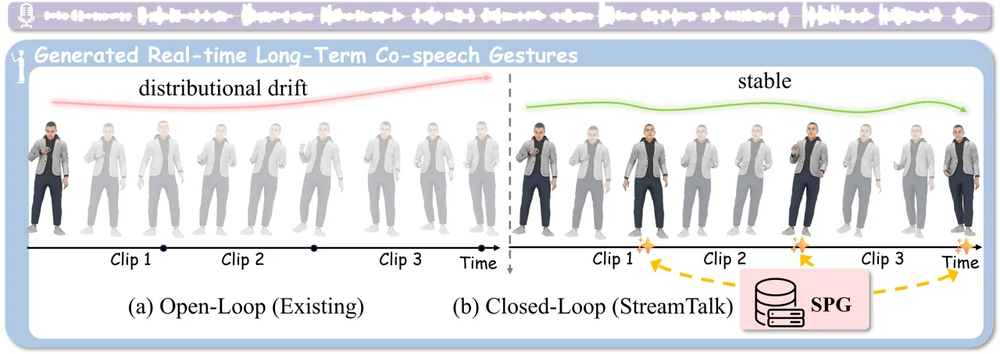
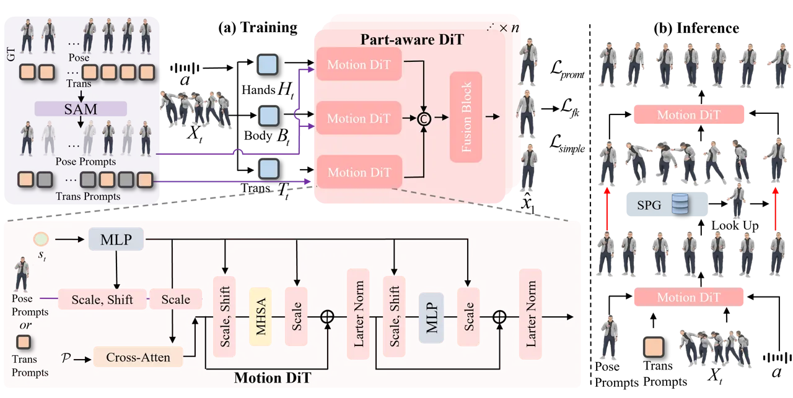
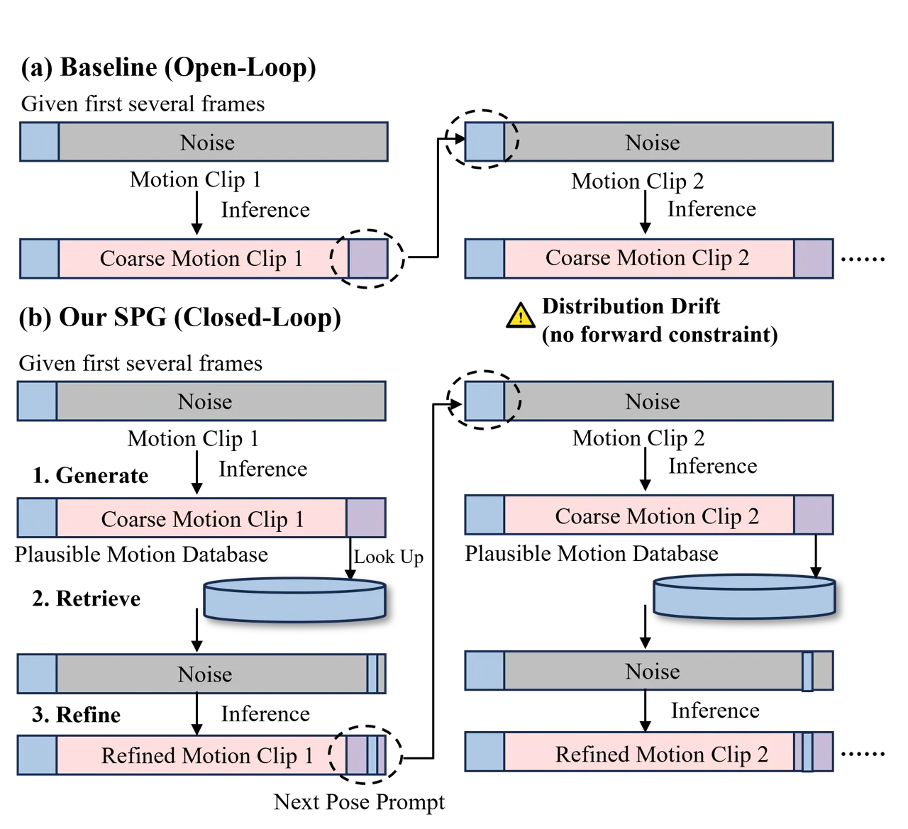
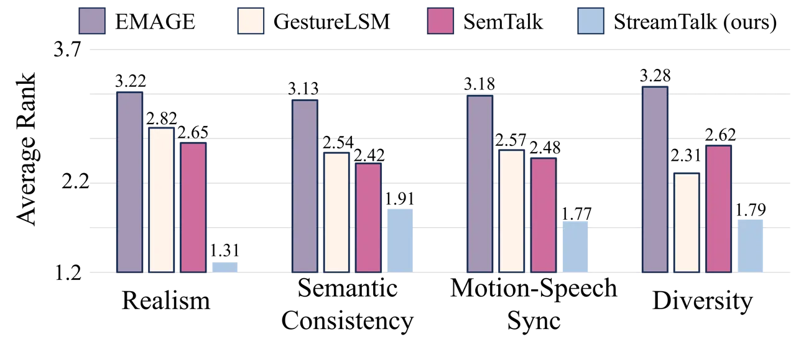
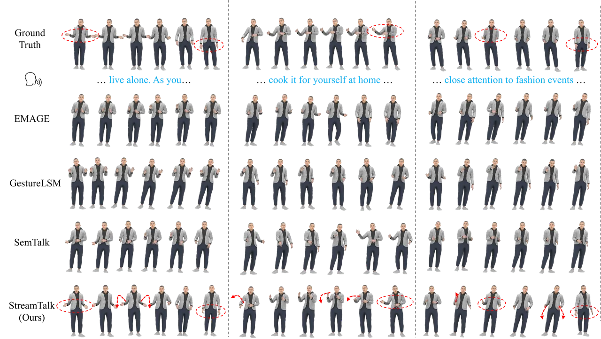
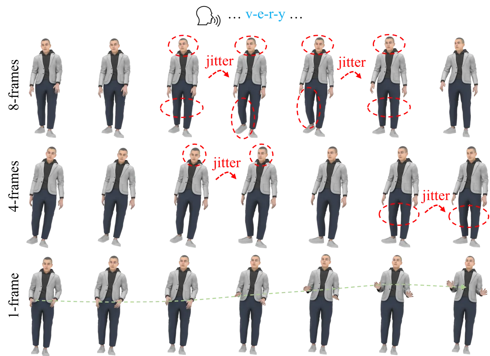
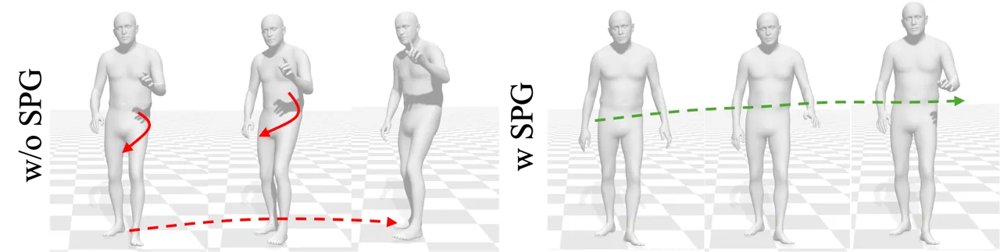
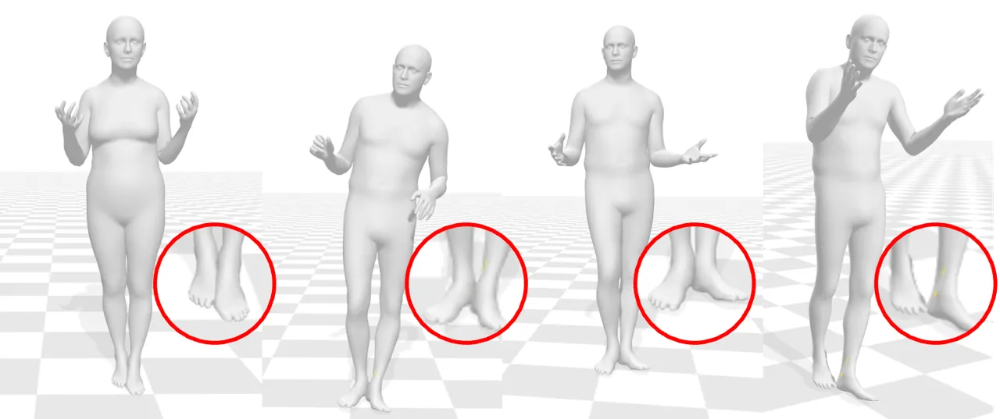

# StreamTalk: Streaming Co-Speech Gesture Generation with Key-Pose Anchoring

Xiangyue Zhang ^(†)^(†)thanks: Equal contribution. Affiliation: The
University of Tokyo    Jianfang Li^(⋆) Affiliation: Alibaba Group   
Jiaxu Zhang Affiliation: Nanyang Technological University    Kaixing
Yang Affiliation: Renmin University of China    Steven Hoi
Affiliation: Alibaba Group

###### Abstract

Real-time co-speech gesture generation requires producing 3D motion clip
by clip as speech streams in. Existing methods are fundamentally
_open-loop_: each clip is synthesized conditioned only on past context,
with no mechanism to verify or correct trajectory plausibility. Small
per-clip errors therefore compound silently, causing the well-known
drift problem—motion that gradually deviates from natural distributions
over minute-scale horizons. We make a key observation: drift stems not
from poor local motion quality—modern diffusion models already produce
convincing short clips—but from the absence of _forward constraints_
that tell each clip where it should arrive. Supplying even a single
plausible key pose at a clip’s tail as a “destination anchor” is
sufficient to suppress drift dramatically. Building on this insight, we
propose StreamTalk, a _closed-loop_ streaming framework that introduces
a periodic generate–retrieve–refine feedback cycle. At inference,
Streaming Pose-Guided Generation (SPG) first produces a coarse clip,
retrieves a plausible tail key pose from a speaker-specific motion
database, and refines the clip with this anchor before passing it to the
next window. To enable the model to exploit such sparse anchors
effectively, we introduce Stochastic Anchor Masking (SAM) during
training, which independently masks random pose and translation frames
so the model learns to inpaint complete motion from partial boundary
conditions. A part-aware DiT architecture further disentangles hand,
body, and translation streams to prevent global displacement from
interfering with local articulation. Extensive experiments on the BEAT2
benchmark demonstrate that StreamTalk achieves state-of-the-art motion
quality (FGD), significantly suppresses long-horizon drift compared to
open-loop baselines, and runs in real time at 76 FPS—enabling practical
minute-scale streaming co-speech gesture generation. Project page:
[https://xiangyue-zhang.github.io/StreamTalk/](https://xiangyue-zhang.github.io/StreamTalk/).

###### Keywords: 

Motion Generation Co-speech gesture generation Streaming motion
synthesis Closed-loop generation



Figure 1: (a) Existing open-loop streaming methods generate each clip
conditioned only on past context. Without forward constraints, small
errors accumulate across clips, causing _distributional drift_—motion
that progressively departs from the natural pose distribution. (b)
StreamTalk introduces closed-loop streaming generation: our Streaming
Pose-Guided Generation (SPG) module retrieves a plausible key pose from
a motion database at each clip boundary and uses it as a destination
anchor, keeping the generated motion stable over long horizons.

## 1 Introduction

Generating natural 3D co-speech gestures is essential for virtual
presenters, telepresence avatars, and interactive game characters \[55,
64, 30, 1\]. In all of these applications, speech arrives as a
continuous stream—users speak in real time, and the corresponding body
motion must be produced immediately, clip by clip, rather than after the
entire utterance is available. This _streaming_ requirement rules out
offline methods that assume access to the full audio and fundamentally
shapes the design of the generator.

As illustrated in Fig. 1(a), existing streaming approaches, whether
built on VQ-VAE tokenizers \[36, 22, 62, 4, 35, 21\] or diffusion
models \[7, 50, 2, 45, 12, 29\], share a common _open-loop_ pattern:
each clip is synthesized conditioned only on past context (typically the
tail frames of the previous clip), and the result is directly forwarded
as the seed for the next clip. The critical weakness of this design is
the absence of any verification or correction mechanism: once a clip is
produced, small errors in pose or trajectory are locked in and
propagated to all subsequent clips. Over minute-scale horizons, these
errors compound into _distributional drift_—the generated motion
progressively departs from the natural pose distribution, producing
unnatural trajectories and rhythmic desynchronization. Increasing the
overlap between clips or extending the context window can smooth local
boundaries, but neither addresses the root cause: an open-loop system
has no way to pull a drifting trajectory back toward the plausible
distribution.

A closer examination reveals that drift is _not_ a local quality
problem—modern diffusion models already produce convincing short clips.
The real bottleneck is the lack of a _forward constraint_: each clip
knows where it starts (from the previous clip’s tail) but has no
information about where it should arrive. Without a plausible
destination, the generator is free to wander in any direction that
locally satisfies the audio condition. We find that supplying even a
_single_ plausible key pose at the clip’s tail—a “destination anchor”
retrieved from a speaker-specific motion database—is sufficient to
suppress drift dramatically. The resulting motion maintains stable
quality over long horizons, whereas open-loop variants show progressive
degradation. Conversely, inserting too many anchors per clip _hurts_
quality, confirming that drift is a direction problem rather than a
per-frame error accumulation: the model needs one waypoint to aim for,
not a dense correction grid.

Building on this insight, we propose StreamTalk, a _closed-loop_
streaming framework for co-speech gesture generation (Fig. 1(b)). At
inference, our Streaming Pose-Guided Generation (SPG) module implements
a _generate–retrieve–refine_ feedback cycle at each clip boundary: a
coarse clip is first produced, its tail pose is matched against a
speaker-specific motion database to retrieve the nearest key pose as a
destination anchor, and the clip is then refined with this anchor before
being forwarded to the next window. This discrete-time
feedback—operating at clip boundaries rather than frame-by-frame—strikes
a balance between correction frequency and computational efficiency,
analogous to periodic recalibration in navigation systems. To enable the
model to exploit such sparse anchors effectively, we introduce
Stochastic Anchor Masking (SAM) during training: pose and translation
frames are independently masked at random, so the model learns to
_inpaint_ complete motion from partial boundary conditions—exactly the
capability SPG requires at inference. A part-aware DiT architecture
further separates hand, body, and translation streams, preventing global
displacement from interfering with local articulation learning.

Our contributions are as follows:

- •
  We identify _distributional drift_ as an inherent consequence of
  open-loop streaming architectures and trace its root cause to the
  absence of forward constraints. We propose _closed-loop_ streaming
  generation as a principled solution, where retrieval-based feedback
  periodically anchors the generation trajectory back to the plausible
  distribution.
- •
  We instantiate this paradigm in StreamTalk: SPG closes the loop
  through a generate–retrieve–refine cycle at each clip boundary, while
  SAM trains the model to inpaint motion from sparse anchors so that it
  can fully exploit the retrieved key poses. A single destination anchor
  per clip is sufficient for effective correction.
- •
  Extensive experiments on the BEAT2 benchmark demonstrate
  state-of-the-art motion quality, significantly suppressed long-horizon
  drift compared to open-loop baselines, and real-time inference speed,
  enabling practical minute-scale streaming co-speech gesture
  generation.

## 2 Related Work

Co-speech Gesture Generation. Contemporary co-speech gesture models fall
into two families. *VQ-VAE methods* \[15, 52, 22, 26, 62, 63, 4\] encode
motion into discrete tokens decoded autoregressively, while *diffusion
methods* \[50, 7, 2, 11, 70, 25, 61, 2\] produce smoother local motion
via continuous denoising. Recent work also studies personalized speakers
and human-centric audio-video avatars \[59, 9, 34\], which are
complementary to our focus on long-horizon online motion stability.
Crucially, _both families operate in open-loop fashion when streaming_:
each clip is generated from past context alone without trajectory
verification, so per-clip errors accumulate into long-term drift.
DiffSHEG \[7\] applies inpainting for boundary smoothing, but its
manually designed masks cannot prevent global trajectory divergence.
StreamTalk addresses this by _closing the loop_: a retrieved key pose
serves as a forward constraint that corrects the trajectory after each
clip.

Long-term Motion Generation. Autoregressive rolling \[19, 51, 33\]
conditions each window on the previous output but is inherently
open-loop. Segment-wise blending \[3, 37, 17, 72\] fuses overlapping
segments offline, which is too costly for real-time streaming. Recent
work scales to longer horizons via memory compression \[65\], score
distillation \[72\], causal latent diffusion \[42\], or retrieval
augmentation \[27\]. While these designs slow drift, they remain
open-loop. StreamTalk instead uses retrieval as _feedback correction_:
the retrieved tail pose serves as a destination anchor for clip
refinement, closing the loop.

Broader Human-Centric Motion and Multimodal Modeling. Human motion
research also spans motion style transfer and fine-grained
motion-language retrieval \[6, 5\], controllable text-to-motion
generation \[68, 38, 39\], topology-agnostic character animation and
retargeting \[67, 56, 57\], and music-driven dance generation or
retrieval \[35, 45, 47, 44, 46, 49, 48\]. Other lines study
skeleton-based action understanding and multimodal benchmarks beyond
human gesture synthesis \[66, 69, 60, 40, 10, 41\]. These works broaden
the modeling tools for structured motion and multimodal perception, but
most target offline generation, retrieval, recognition, or non-speech
interaction. StreamTalk instead targets chunk-level online co-speech
gesture generation, where each generated window must remain plausible
before future speech or future motion is available.

## 3 Method

### 3.1 Overview

We formulate streaming co-speech gesture generation as _sequential
motion inpainting_. At each time window, the model receives two boundary
conditions—head frames inherited from the previous clip and a tail key
pose retrieved from a plausible motion database—and inpaints the frames
in between. Chaining these inpainting steps produces an arbitrarily long
motion sequence while the retrieved tail anchor periodically corrects
the generation trajectory, closing the loop that conventional streaming
methods leave open.

Speech and Motion Representation. The input speech is encoded by a WavLM
encoder \[8\] into frame-level embeddings
$`\mathbf{w}\!\in\!\mathbb{R}^{L\times 1024}`$. Following
DiffSHEG \[7\], a 4-layer Transformer regresses facial features
$`\mathbf{f}`$ from $`\mathbf{w}`$, and both are concatenated to form
audio–facial features
$`\mathbf{a}=\text{Concat}(\mathbf{w},\mathbf{f})`$. The target motion
$`\mathbf{x}\!\in\!\mathbb{R}^{L\times(55\times 6+3)}`$ follows the
SMPL-X convention \[31\] with 6D joint rotations \[71\] and root
translation.

Generative backbone. We adopt the flow-matching objective \[20\], where
the model $`f_{\theta}`$ directly predicts the clean motion
$`\mathbf{x}_{1}`$ from a linearly interpolated sample
$`\mathbf{x}_{t}=(1-t)\mathbf{x}_{0}+t\mathbf{x}_{1}`$,
$`t\sim\mathcal{U}(0,1)`$. Training and loss details are given in
Sec. 3.4 and 3.5.



Figure 2: Architecture of StreamTalk. (a) Training. SAM independently
masks random pose and translation frames from ground-truth motion to
form sparse Pose and Trans prompts. The noised sequence
$`\mathbf{X}_{t}`$ is split into hands $`\mathbf{H}_{t}`$, body
$`\mathbf{B}_{t}`$, and translation $`\mathbf{T}_{t}`$ and processed by
a Part-aware DiT with three branches; outputs are fused to predict
$`\hat{\mathbf{X}}_{1}`$. This teaches the model to _inpaint_ complete
motion from partial boundary conditions. (b) Inference. SPG forms a
closed-loop _generate–retrieve–refine_ cycle: each clip is first
generated, then its tail is matched against a speaker-specific motion
database to retrieve a plausible key pose anchor; the clip is refined
with this anchor before its tail frames seed the next window.

### 3.2 Part-aware DiT

Rather than processing all joints in a single stream, the Part-aware DiT
decomposes motion into three branches—_Hands_ ($`\mathbf{H}_{t}`$),
_Body_ ($`\mathbf{B}_{t}`$), and _Translation_ ($`\mathbf{T}_{t}`$)—each
implemented as a residual Transformer block with FiLM-style \[32\]
scale–shift modulation conditioned on the style vector:

```math
s_{t}=\text{Concat}\!\big(\text{MLP}(\text{PID}),\;\text{MLP}(t)\big). \tag{1}
```

A cross-attention layer links each branch-specific feature
$`\mathcal{P}\in\{H_{t},B_{t},T_{t}\}`$ with the corresponding prompt
(pose or translation), and multi-head self-attention captures temporal
dependencies within each part. The three branch outputs are concatenated
and fused through a lightweight attention-based fusion block that
enables controlled cross-part coordination. This disentangled design
serves two purposes. First, it prevents global displacement from
corrupting local articulation learning (see ablation in Sec. 4.3).
Second, it is a prerequisite for SPG (Sec. 3.3): because SPG retrieves
only _pose_ anchors from the database (translation is context-dependent
and cannot be borrowed across clips), the model must be able to accept
pose and translation prompts through separate channels.

### 3.3 Streaming Pose-Guided Generation (SPG)

SPG is the core inference mechanism that transforms streaming generation
from an open-loop to a closed-loop process. As illustrated in Figure 3.3
and Algorithm 1, each 60-frame clip is produced through a
_generate–retrieve–refine_ cycle.



Figure 3: Open-loop vs. closed-loop inference. (a) Open-loop errors
accumulate into drift. (b) SPG closes the loop with a retrieved
destination anchor.

Input: Audio $`\mathbf{a}`$, pose prompt $`\mathbf{P}_{\!prompt}`$, step
size $`N`$, condition $`r`$

Output: Generated motion $`\mathbf{x}_{1}`$

$`\mathbf{x}_{0}\sim\mathcal{N}(0,I)`$; $`\mathbf{x}_{t}\leftarrow\mathbf{x}_{0}`$; $`h\leftarrow 1/N`$; $`\mathrm{stages}\leftarrow[\mathbf{x}_{0}]`$

\[3pt\] 1. Generate (forward integration):

for _$`i=0`$ to $`N`$_ do

     $`\mathbf{x}_{1}\leftarrow f_{\theta}(\mathbf{x}_{t},\,i\!\cdot\!h,\,P_{prompt},\,\mathbf{a},\,r)`$

     $`\mathbf{x}_{t}\leftarrow\mathbf{x}_{0}\,(1\!-\!(i{+}1)h)+\mathbf{x}_{1}\,(i{+}1)h`$; append
$`\mathbf{x}_{t}`$ to stages

2. Retrieve (key-pose feedback):
   $`P_{prompt}\leftarrow\mathrm{Retrieve}(P_{prompt},\,\mathbf{x}_{1},\,\text{database})`$

\[3pt\] 3. Refine (corrective integration):
$`\mathbf{x}_{t}\leftarrow\mathrm{stages}[\lfloor N/2\rfloor]`$

for _$`i=\lfloor N/2\rfloor`$ to $`N`$_ do

     $`\mathbf{x}_{1}\leftarrow f_{\theta}(\mathbf{x}_{t},\,i\!\cdot\!h,\,P_{prompt},\,\mathbf{a},\,r)`$

     $`\mathbf{x}_{t}\leftarrow\mathbf{x}_{0}\,(1\!-\!(i{+}1)h)+\mathbf{x}_{1}\,(i{+}1)h`$

return _$`\mathbf{x}_{1}`$_

Algorithm 1 Closed-Loop Inference with SPG

Generate. Starting from Gaussian noise
$`\mathbf{x}_{0}\!\sim\!\mathcal{N}(0,I)`$, the Part-aware DiT
integrates the flow-matching ODE over $`N`$ steps to produce a coarse
clip $`\hat{\mathbf{x}}_{1}`$, conditioned on the audio–facial feature
$`\mathbf{a}`$, the style vector $`s_{t}`$, and the current pose prompt
(the tail frames of the previous clip). All intermediate states
$`\{\mathbf{x}_{ih}\}`$ are cached for the refinement stage.

Retrieve. The coarse clip is then verified against a _plausible motion
database_. This database is constructed offline from the training set:
for each speaker, we extract all per-frame pose vectors (joint rotations
only, excluding root translation) and store them indexed by speaker ID.
Translation is deliberately excluded because global trajectory is
context-dependent—a pose observed during walking cannot be meaningfully
transplanted to a stationary scene—whereas local articulation patterns
(hand shapes, arm configurations) are largely trajectory-invariant and
can be safely borrowed across clips. The database is lightweight and
constructed efficiently from training data. Per-speaker databases are
maintained independently to preserve individual motion styles. When
speaker identity is unavailable at inference, a global database merging
all speakers is used as a fallback.

Before matching, both the generated tail and all database candidates are
projected into _joint space_ via forward kinematics (FK). Comparing in
joint space rather than rotation space is critical: small angular errors
in proximal joints (e.g., shoulder) cascade into large positional errors
at distal joints (e.g., fingertips) along the kinematic chain, so
rotation-space distances underestimate perceptually salient
discrepancies. Joint-space matching captures the actual spatial
deviation perceived by viewers. We select the nearest candidate whose
joint-space distance falls below a threshold $`\theta_{p}`$ and use it
to replace the tail key-pose frame in $`\hat{\mathbf{x}}_{1}`$,
restoring the original translation and global rotation:

```math
P_{prompt}\leftarrow\text{Retrieve}(P_{prompt},\,\hat{\mathbf{x}}_{1},\,\text{database}). \tag{2}
```

A single tail key pose is sufficient: drift is a _direction_ problem—the
model needs one waypoint to aim for, not a dense correction grid. We
validate this design choice in Sec. 4.3.

Refine. With the updated prompt, the model re-integrates from the cached
midpoint $`\mathbf{x}_{N/2}`$ rather than from scratch, halving the cost
of the refinement pass. The refined clip’s tail frames are then
forwarded as the pose prompt for the next window, completing the
feedback loop.

### 3.4 Stochastic Anchor Masking (SAM)

SPG requires the model to generate complete motion conditioned on sparse
boundary anchors—a handful of visible head frames plus a single
retrieved tail key pose. Standard training, where the model always sees
the full ground-truth prompt, does not prepare it for this partially
observed input. SAM bridges this gap by introducing the same
sparse-anchor pattern during training, so the model learns to _inpaint_
motion from partial boundary conditions—exactly the capability SPG
exploits at inference. In essence, SAM is a _training-inference
alignment mechanism_: it ensures that the sparse-anchor pattern the
model sees during training matches what SPG provides at inference,
preventing train-test mismatch.

Concretely, given ground-truth motion $`\mathbf{X}_{1}`$, SAM decomposes
each frame into joint rotations $`\mathbf{P}`$ (pose) and root
translation $`\mathbf{T}`$, then applies two _independent_ stochastic
binary masks $`\mathbf{M}_{p}`$ and $`\mathbf{M}_{t}`$ to form sparse
pose prompts
$`P_{\mathit{prompt}}\!=\!\mathbf{M}_{p}\!\odot\!\mathbf{P}`$ and
translation prompts
$`T_{\mathit{prompt}}\!=\!\mathbf{M}_{t}\!\odot\!\mathbf{T}`$. As shown
in Figure 2(a), pose prompts feed into the Body and Hands branches,
while translation prompts feed into the Translation branch.

The masks are independent because pose and translation follow different
temporal rhythms in natural motion—a speaker may gesticulate while
standing still, or walk without moving the hands. Independent masking
lets the model learn these two rhythms separately. It also mirrors the
SPG design: at inference, SPG retrieves only pose anchors (not
translation), so the model must handle the case where pose frames are
partially revealed but translation frames are not.

### 3.5 Training Objective

The model $`f_{\theta}`$ is trained to predict the clean motion
$`\mathbf{X}_{1}`$ from the interpolated sample $`\mathbf{X}_{t}`$ under
audio–facial condition $`\mathbf{a}`$, style vector $`s_{t}`$, and the
SAM-generated prompts. The primary loss is the flow-matching regression:

```math
\mathcal{L}_{\text{simple}}=\mathbb{E}\big[\|f_{\theta}(\mathbf{X}_{t},P_{prompt},\mathbf{a},s_{t},T_{prompt})-\mathbf{X}_{1}\|_{2}^{2}\big]. \tag{3}
```

To preserve anatomical structure, a forward-kinematics \[14\] loss
matches the 3D joint positions computed from SMPL-X rotations, following
\[58\]:

```math
\mathcal{L}_{fk}=\frac{1}{L}\sum_{t}\big\|\mathrm{FK}(\mathbf{X}_{1})-\mathrm{FK}(\hat{\mathbf{X}}_{1}^{(t)})\big\|_{2}^{2}, \tag{4}
```

where $`\hat{\mathbf{X}}_{1}^{(t)}`$ is the model prediction at flow
step $`t`$. A prompt consistency term aligns the prediction with the
visible anchors:

```math
\displaystyle\mathcal{L}_{prompt} \displaystyle=\frac{1}{L}\sum_{t}\Big(\|\mathbf{M}_{p}^{(t)}\odot(\hat{\mathbf{P}}^{(t)}-\mathbf{P}_{\text{prompt}}^{(t)})\|_{2}^{2} \tag{5}
```

```math
\displaystyle+\|\mathbf{M}_{t}^{(t)}\odot(\hat{\mathbf{T}}^{(t)}-\mathbf{T}_{\text{prompt}}^{(t)})\|_{2}^{2}\Big).
```

The total objective is:

```math
\mathcal{L}=\mathcal{L}_{simple}+\lambda_{fk}\mathcal{L}_{fk}+\lambda_{prompt}\mathcal{L}_{prompt}, \tag{6}
```

where $`\lambda_{fk}`$ and $`\lambda_{prompt}`$ balance the structural
and prompt consistency terms.

## 4 Experiments

### 4.1 Experimental Setup

Datasets. We train and evaluate on the BEAT2 dataset \[22\], which
provides high-quality SMPL-X-based 3D motion synchronized with audio
from 25 speakers. We follow the official train/validation/test split.
Following \[27\], we report results under both the _1-Speaker_ setting
(speaker “Scott”) and the _All-Speakers_ setting to assess
generalization across identities.

Implementation Details. Training is conducted on four NVIDIA V100 GPUs
(16 GB) for 1,000 epochs with batch size 128, taking approximately 31
hours. We use the ADAM optimizer with learning rate $`1\times 10^{-4}`$.
Following \[22, 62\], each clip contains 60 frames. For streaming
generation, the first 8 frames initialize the sequence; thereafter the
last 8 frames of each clip serve as the pose prompt for the next, with
speech segmented using an 8-frame overlap. Loss weights are set to
$`\lambda_{fk}=1`$ and $`\lambda_{prompt}=0.1`$. The denoising step size
is $`N\!=\!10`$; one key pose ($`n\!=\!1`$) is selected from the tail
frames for SPG.

Speaker Identity as Input. Following standard practice in co-speech
gesture generation \[22, 62, 7, 25\], speaker identity (ID) is provided
as input to condition the model on individual motion styles. All
baseline methods also use speaker ID as a style variable. This is not
information leakage but a standard setup: in practical applications
(virtual avatars, telepresence), the speaker is known and consistent
throughout the session.

Plausible Motion Database Construction. For the 1-Speaker setting
(Speaker “Scott”), the database contains 156,977 pose frames extracted
from the training set, occupying only 16.6 MB in memory. For the
All-Speakers setting, per-speaker databases are maintained independently
to preserve individual motion styles. Since speaker identity is a
standard input (see above), SPG retrieves key poses from the target
speaker’s database partition at inference—this is a fair comparison, as
baseline methods also condition on speaker ID to generate
speaker-specific motion. When speaker identity is unavailable at
inference (e.g., unseen speakers in zero-shot settings), SPG falls back
to a global database merging all training speakers.

Metrics. We evaluate generated motion with five metrics. _Fréchet
Gesture Distance_ (FGD) \[54\] measures distributional similarity
between generated and real motions. *Diversity* \[16\] is the average L1
distance among different generated samples. _Beat Consistency_
(BC) \[18\] measures temporal alignment between motion and speech beats.
_Velocity distance_ (VEL) and _Acceleration distance_ (ACC) are the L2
distances between the velocity and acceleration magnitude histograms of
generated and ground-truth motions, capturing dynamic fidelity.

1 Speaker  
Method FGD$`\downarrow`$ BC$`\rightarrow`$ DIV$`\rightarrow`$ GT – 0.703
11.97 CaMN \[23\] 0.664 0.677 10.86 ReMoDiffuse \[58\] 0.702 0.824 12.46
DSG \[50\] 0.881 0.724 11.49 Audio2Photoreal \[28\] 1.02 0.550
$`\displaystyle 12.47`$ LivelySpeaker \[70\] 1.180 0.666 11.28 Habibie
et al. \[13\] 0.904 0.772 8.213 TalkSHOW \[52\] 0.621 0.695 13.47
DiffSHEG \[7\] 0.899 $`\displaystyle 0.714`$ 11.91 AMUSE \[12\] 1.211
0.832 14.93 EMAGE \[22\] 0.551 0.772 13.06 MambaTalk \[43\] 0.537 0.781
13.05 SynTalker \[4\] 0.641 0.736 12.72 HoloGest \[11\] 0.534 0.795
14.15 RAG-GESTURE \[27\] 0.808 0.734 $`\displaystyle 11.97`$ PyraMotion
\[53\] 0.461 0.742 13.24 SemGes \[24\] 0.447 - - EchoMask \[63\] 0.462
0.774 13.37 GestureLSM \[25\] $`\displaystyle 0.409`$
$`\displaystyle 0.714`$ 13.42 SemTalk \[62\] 0.428 0.777 12.91
StreamTalk (Ours) $`\displaystyle 0.383`$ $`\displaystyle 0.704`$ 13.18

All Speakers  
Method FGD$`\downarrow`$ BC$`\rightarrow`$ DIV$`\rightarrow`$ GT – 0.477
7.29 CaMN \[23\] 0.512 0.200 5.58 ReMoDiffuse \[58\] 1.120 0.218 5.06
DSG \[50\] 1.174 0.734 11.12 Audio2Photoreal \[28\] 0.849 0.326
$`\displaystyle 6.24`$ EMAGE \[22\] 0.692 0.284 6.06 HoloGest \[11\]
0.646 0.803 13.53 EchoMask \[63\] 0.566 $`\displaystyle 0.495`$ 9.30
RAG-GESTURE \[27\] 0.487 $`\displaystyle 0.514`$ 9.94 SemTalk \[62\]
$`\displaystyle 0.356`$ 0.841 8.41 StreamTalk (Ours)
$`\displaystyle 0.293`$ 0.616 $`\displaystyle 7.27`$



Figure 4: User study results. StreamTalk ranks first across all four
perceptual criteria.

Table 1: Comparison with state-of-the-art methods on BEAT2. StreamTalk
achieves the best FGD under both settings, with particularly strong
generalization across speakers.

### 4.2 Comparison with State of the Art

Quantitative Comparison. As shown in Table 1, StreamTalk achieves
state-of-the-art FGD under both evaluation settings. In the _1-Speaker_
setting, StreamTalk obtains the lowest FGD, surpassing all prior methods
including GestureLSM \[25\] and SemTalk \[62\], while attaining the
closest BC to the ground truth. Notably, diffusion-based methods
(DiffSHEG, DSG, GestureLSM) and VQ-VAE methods (EMAGE, SemTalk,
SynTalker) both suffer from open-loop drift in streaming settings;
StreamTalk’s closed-loop correction benefits both paradigms, as it
operates on the output trajectory rather than any specific backbone.

In the more challenging _All-Speakers_ setting, StreamTalk outperforms
all baselines on FGD, while the Diversity score nearly matches the
ground truth. This indicates that SPG’s retrieval-based anchoring does
not suppress motion variety—the database provides a plausible
_direction_ rather than a rigid template, leaving the flow-matching
backbone free to generate diverse motions within the corrected
trajectory. These results confirm that the closed-loop design
generalizes well across speaker identities.



Figure 5: Qualitative comparison on BEAT2 \[22\]. Each column shows
gestures aligned with the same speech segment. StreamTalk (bottom)
produces smoother, more expressive, and rhythm-aligned gestures with
consistent arm spacing, while baselines exhibit motion freezing,
desynchronized gestures, or loss of spatial consistency. Red dashed
ellipses highlight regions where StreamTalk better preserves rhythmic
articulation and continuity.

Qualitative Comparison. We highly recommend readers watch the
supplementary demo video. As shown in Figure 5, StreamTalk produces
fluid, temporally coherent gestures that follow prosodic rhythm and
maintain balanced arm spacing. EMAGE \[22\] tends to produce repetitive,
low-amplitude arm swings that lose expressiveness after the first few
seconds, a symptom of VQ-VAE codebook collapse under streaming
conditions. GestureLSM \[25\] generates locally smooth clips but
exhibits visible spatial drift at clip boundaries—the arms gradually
shift upward or sideways, breaking the natural resting pose envelope.
SemTalk \[62\] preserves semantic coherence for short segments but
suffers from pose freezing during pauses or low-energy speech, where the
model defaults to a near-static mean pose rather than producing subtle
idle motion. In contrast, StreamTalk maintains consistent motion
amplitude, smooth inter-clip transitions, and natural idle behavior
throughout the entire sequence, owing to the periodic trajectory
correction provided by SPG.

User Study. Twenty-seven participants evaluated 15 shuffled video
segments ($`{\sim}`$60 s each), yielding over 400 rated samples. For
each segment, outputs from EMAGE, GestureLSM, SemTalk, and StreamTalk
were presented in random order and ranked on realism, rhythm
consistency, motion–speech synchrony, and diversity. As shown in
Figure 1, StreamTalk receives the highest overall preference, with
statistically significant gains in realism and rhythm consistency under
the Wilcoxon signed-rank test ($`p<10^{-3}`$).

### 4.3 Ablation Studies

Does Closing the Loop Help? Table 2(a) isolates the contributions of SAM
and SPG under both evaluation settings. On the _1-Speaker_ setting,
adding SAM alone slightly increases FGD, which is expected: SAM is a
_training-inference alignment mechanism_ whose value is realized only
when paired with SPG’s sparse anchors at inference. Adding SPG alone
already improves FGD via trajectory correction; combining both yields
the best result with a substantial reduction from the baseline. Under
the _All-Speakers_ setting, the same complementary pattern holds:
combining SAM and SPG achieves the best FGD, confirming that the
closed-loop design generalizes across speaker identities.

|                   | 1-Speaker (Speaker-2) |                   |                    | All Speakers      |                   |                    |
| ----------------- | --------------------- | ----------------- | ------------------ | ----------------- | ----------------- | ------------------ |
| Method            | FGD$`\downarrow`$     | BC$`\rightarrow`$ | Div$`\rightarrow`$ | FGD$`\downarrow`$ | BC$`\rightarrow`$ | Div$`\rightarrow`$ |
| GT                | –                     | 0.703             | 11.97              | –                 | 0.477             | 7.29               |
| StreamTalk (base) | 0.478                 | 0.716             | 12.30              | 0.391             | 0.621             | 7.21               |
| + SAM             | 0.503                 | 0.747             | 13.72              | 0.379             | 0.613             | 7.31               |
| + SPG             | 0.455                 | 0.695             | 14.24              | 0.353             | 0.607             | 7.49               |
| + SAM & SPG       | 0.383                 | 0.704             | 13.18              | 0.293             | 0.616             | 7.27               |

(a) Component ablation across both evaluation settings.

| Method     | VEL$`\downarrow`$ | ACC$`\downarrow`$ |
| ---------- | ----------------- | ----------------- |
| GT         | 0.0               | 0.0               |
| EMAGE      | 2.40e2            | 4.03e2            |
| GestureLSM | 2.33e2            | 4.30e2            |
| SemTalk    | 2.28e2            | 3.58e2            |
| Ours       | 2.15e2            | 2.33e2            |

(b) VEL & ACC distances.

| Variant                 | FGD$`\downarrow`$ | BC$`\rightarrow`$ | Div$`\rightarrow`$ |
| ----------------------- | ----------------- | ----------------- | ------------------ |
| GT                      | –                 | 0.703             | 11.97              |
| Random anchor           | 0.673             | 0.743             | 13.12              |
| Retrieved anchor        | 0.503             | 0.747             | 12.57              |
| Retrieved + Linear ref. | 0.471             | 0.753             | 12.31              |
| Retrieved + Our ref.    | 0.383             | 0.704             | 13.11              |

(c) Anchor source and refinement strategy.

Table 2: Ablation and analysis. (a) Component ablation on 1-Speaker and
All Speakers. (b) VEL/ACC distances. (c) Anchor source and refinement
strategy.

| Position | Number | FGD$`\downarrow`$ | BC$`\rightarrow`$ | Div$`\rightarrow`$ |
| -------- | ------ | ----------------- | ----------------- | ------------------ |
| –        | –      | –                 | 0.703             | 11.97              |
| random   | 8      | 0.601             | 0.759             | 13.51              |
| random   | 4      | 0.540             | 0.716             | 13.43              |
| random   | 1      | 0.426             | 0.715             | 13.05              |
| middle   | 8      | 0.643             | 0.720             | 13.24              |
| middle   | 4      | 0.574             | 0.664             | 13.03              |
| middle   | 1      | 0.408             | 0.693             | 13.55              |
| tail     | 8      | 0.575             | 0.773             | 13.31              |
| tail     | 4      | 0.443             | 0.700             | 13.15              |
| tail     | 1      | 0.383             | 0.704             | 13.18              |

(a) Key pose number and position ablation.

| Backbone | FGD$`\downarrow`$ | BC$`\rightarrow`$ | Div$`\rightarrow`$ | Params |
| -------- | ----------------- | ----------------- | ------------------ | ------ |
| GT       | –                 | 0.703             | 11.97              | –      |
| 1-branch | 0.612             | 0.664             | 12.31              | 70.0 M |
| 2-branch | 0.562             | 0.692             | 13.68              | 71.0 M |
| 3-branch | 0.478             | 0.716             | 12.30              | 71.2 M |

(b) Part-aware DiT architecture ablation.

|         | \# Frames |
| ------- | --------- |
| w/o SPG | 387       |
| w/ SPG  | 39        |

(c) Self-intersection counts.

Table 3: Key pose and architecture analysis on Speaker-2. (a) A single
tail key pose yields the best quality. (b) The 3-branch design
outperforms single-branch with minimal parameter overhead.
(c) Self-intersection frame counts.



Figure 6: Effect of key pose count. Using 8 or 4 anchors introduces
visible jitter (red), while a single key pose produces smoother motion.

(a) FGD over time.

(b) Joint trajectory comparison.

Figure 7: Long-horizon stability and refinement analysis.
(a) Sliding-window FGD across $`{\sim}`$1,800 frames: all baseline
methods show upward FGD drift over time, while w/ SPG remains the lowest
and most stable. (b) Joint trajectory of different refinement
strategies: No Refinement and Linear Refinement exhibit noticeable
jitter, while SPG produces a smooth trajectory closer to the ground
truth. Black arrows indicate jittering points.

Long-Horizon Stability. The closed-loop advantage becomes more
pronounced over longer sequences. Figure 7(a) plots sliding-window FGD
across $`{\sim}`$1,800 frames ($`{\sim}`$60 s). All baseline methods
exhibit a clear upward FGD trend over time, indicating that open-loop
generation—regardless of backbone architecture—accumulates
distributional drift as the sequence grows. In contrast, w/ SPG remains
the lowest and most stable throughout the entire sequence, confirming
that the periodic key-pose feedback effectively suppresses drift
accumulation. Figure 8 provides a visual comparison: without SPG, the
generated motion shows visible spatial drift and abrupt corrections,
while SPG maintains smooth, consistent trajectories. Table 2(b) further
shows that StreamTalk achieves the smallest velocity and acceleration
histogram distances to GT among all compared methods, indicating more
faithful motion dynamics.

Beyond distributional metrics, we examine physical plausibility via
self-intersection analysis. As shown in Figure 8 and Table 3(c),
open-loop generation produces a significant number of frames with
self-intersection artifacts (e.g., arm interpenetration). SPG
dramatically reduces this by an order of magnitude, because the
retrieved key poses are drawn from anatomically valid training data,
effectively guiding the generation toward physically plausible
configurations.



(a) w/o SPG vs. w/ SPG.



(b) Self-intersection.

Figure 8: SPG visual analysis. (a) Without SPG, motion shows spatial
drift and abrupt corrections; with SPG, trajectories remain smooth.
(b) Self-intersection artifacts are dramatically reduced by SPG.

Key Pose Design. Table 3(a) studies how the number and temporal
placement of key poses affect generation quality. A consistent trend
emerges: fewer anchors yield better FGD across all placement strategies.
With 60-frame clips where the first 8 frames are already fixed as pose
prompts, injecting multiple additional anchors over-constrains the
model, forcing it to satisfy several hard cues simultaneously and
producing unnatural transitions. Using more anchors consistently
degrades FGD, with both 8-anchor and 4-anchor settings performing
significantly worse than the single-anchor baseline. This confirms that
drift is a _direction_ problem rather than per-frame error accumulation:
the model needs one waypoint to aim for, not a dense correction grid.
Figure 4.3 visualizes this: 8 or 4 anchors introduce visible jitter,
while 1 key pose yields smooth motion.

Regarding placement, tail-frame anchors outperform middle and random
placements. Middle-frame anchors may regularize within a clip but cannot
prevent drift at clip boundaries, which is where error accumulation
occurs in streaming generation. Tail-frame anchors directly stabilize
the transition to the next window, aligning with the closed-loop design
of SPG.

Is the Gain from the Database or from Closing the Loop? Table 2(c)
dissects anchor quality and refinement strategy. Replacing retrieved
anchors with randomly sampled database poses _substantially worsens_
FGD, confirming that arbitrary poses actively hurt generation. Given
retrieved anchors, we compare three strategies: no refinement (directly
inserting the anchor), linear refinement (linearly interpolating between
the generated and anchor poses for smooth blending), and our
flow-matching-based refinement. Both the no-refinement and
linear-refinement baselines underperform our refinement by a clear
margin, demonstrating that the gain stems from the combination of
nearest-neighbor retrieval and the corrective re-integration from the
cached midpoint. Figure 7(b) confirms this visually: no refinement shows
pronounced jitter, linear refinement retains discontinuities, whereas
our refinement produces a smooth trajectory tracking the ground truth.

Part-aware Architecture. Table 3(b) compares single-branch, two-branch,
and three-branch DiT variants. The three-branch design (Hands / Body /
Translation) improves FGD over the single-branch baseline with minimal
parameter overhead, confirming that separating global displacement from
local articulation benefits motion quality. It is also a structural
prerequisite for SPG, which retrieves pose anchors while leaving
translation context-dependent.

### 4.4 Efficiency Analysis

| GPU / DB frames-memory      | Init.   | FK      | Retr.   | Ref.    | FPS | RT  |
| --------------------------- | ------- | ------- | ------- | ------- | --- | --- |
| V100-16G / 156,977-16.6 MB  | 0.460 s | 0.006 s | 0.033 s | 0.230 s | 76  | yes |
| 5$`\times`$ / 784k-83 MB    | 0.460 s | 0.006 s | 0.132 s | 0.230 s | 67  | yes |
| 10$`\times`$ / 1.57M-166 MB | 0.460 s | 0.006 s | 0.331 s | 0.230 s | 54  | yes |
| 20$`\times`$ / 3.14M-332 MB | 0.460 s | 0.006 s | 0.792 s | 0.230 s | 36  | yes |

Table 4: Hardware and database scaling for one 60-frame, 2s online
chunk. StreamTalk remains real time even with a 20$`\times`$ database.

Table 4.4 reports the per-chunk latency on an NVIDIA V100 16GB GPU. The
initial generation and refinement passes are fixed-cost neural inference
for a 60-frame chunk, and FK adds only 0.006 s. Exact nearest-neighbor
retrieval is the only term that scales with the database size. At the
default per-speaker database size, the FK and retrieval overhead is
0.039 s, while refinement costs roughly half of the initial pass because
it starts from the cached midpoint. When the database is expanded by
20$`\times`$ to 3.14M frames and 332 MB, StreamTalk still runs at 36
FPS, which is above the real-time requirement for a 2s chunk. In
practice, a target-speaker database preserves a known speaker style,
while a global database provides a fallback when target clips are
unavailable. For larger deployments, indexed nearest-neighbor search can
replace exact search without changing the generation pipeline.

## 5 Conclusion

We have presented StreamTalk, a closed-loop framework for streaming
co-speech gesture generation. By formulating clip-wise generation as
sequential motion inpainting, StreamTalk introduces a retrieval-based
feedback signal—Streaming Pose-Guided Generation (SPG)—that periodically
anchors each clip to the plausible motion manifold, transforming the
conventional open-loop streaming pipeline into a closed-loop one.
Stochastic Anchor Masking (SAM) bridges the training–inference gap by
teaching the model to inpaint complete motion from the same sparse
boundary conditions that SPG provides at inference. A Part-aware DiT
further disentangles pose from translation, enabling SPG to retrieve
pose anchors without borrowing context-dependent global trajectories.
Experiments on BEAT2 demonstrate state-of-the-art FGD under both
single-speaker and multi-speaker settings, with long-horizon stability
analysis confirming that SPG effectively suppresses the drift
accumulation inherent in open-loop methods.

## Acknowledgments

This work was supported by the Alibaba Research Intern Program and the
Young Scientists Fund of the National Natural Science Foundation of
China under Grant No. 624B2110.

## References

- \[1\] S. Alexanderson, R. Nagy, J. Beskow, and G. E. Henter (2023)
  Listen, denoise, action! audio-driven motion synthesis with diffusion
  models. ACM Transactions on Graphics (TOG) 42 (4), pp. 1–20. Cited by:
  §1.
- \[2\] T. Ao, Z. Zhang, and L. Liu (2023) Gesturediffuclip: gesture
  diffusion model with clip latents. ACM Transactions on Graphics (TOG)
  42 (4), pp. 1–18. Cited by: §1, §2.
- \[3\] N. Athanasiou, M. Petrovich, M. J. Black, and G. Varol (2022)
  Teach: temporal action composition for 3d humans. In 2022
  International Conference on 3D Vision (3DV), pp. 414–423. Cited by:
  §2.
- \[4\] B. Chen, Y. Li, Y. Ding, T. Shao, and K. Zhou (2024) Enabling
  synergistic full-body control in prompt-based co-speech motion
  generation. In Proceedings of the 32nd ACM International Conference on
  Multimedia, pp. 6774–6783. Cited by: §1, §2, Table 1.
- \[5\] H. Chen, G. Lyu, C. Xu, J. Yan, X. Yang, and C. Deng (2026)
  Beyond global alignment: fine-grained motion-language retrieval via
  pyramidal shapley-taylor learning. arXiv preprint arXiv:2601.21904.
  Cited by: §2.
- \[6\] H. Chen, C. Xu, J. Yan, and C. Deng (2025) AStF: motion style
  transfer via adaptive statistics fusor. In Proceedings of the 33rd ACM
  International Conference on Multimedia, pp. 5557–5566. Cited by: §2.
- \[7\] J. Chen, Y. Liu, J. Wang, A. Zeng, Y. Li, and Q. Chen (2024)
  Diffsheg: a diffusion-based approach for real-time speech-driven
  holistic 3d expression and gesture generation. In Proceedings of the
  IEEE/CVF Conference on Computer Vision and Pattern Recognition,
  pp. 7352–7361. Cited by: §1, §2, §3.1, §4.1, Table 1.
- \[8\] S. Chen, C. Wang, Z. Chen, Y. Wu, S. Liu, Z. Chen, J. Li, N.
  Kanda, T. Yoshioka, X. Xiao, et al. (2022) Wavlm: large-scale
  self-supervised pre-training for full stack speech processing. IEEE
  Journal of Selected Topics in Signal Processing 16 (6), pp. 1505–1518.
  Cited by: §3.1.
- \[9\] S. Cheng, J. Zhang, Q. Song, S. Liu, Z. Guo, X. Zhang, C.
  Zhang, X. Li, and Z. Tu (2026) Unison: harmonizing motion, speech, and
  sound for human-centric audio-video generation. External Links:
  2605.08729, [Link](https://arxiv.org/abs/2605.08729) Cited by: §2.
- \[10\] S. Cheng, J. Zhang, Y. Liu, A. Xiao, and Z. Tu (2025) OwlSight:
  a robust illumination adaptation framework for dark video human action
  recognition. IEEE Transactions on Circuits and Systems for Video
  Technology 36 (4), pp. 4550–4564. External Links:
  [Document](https://dx.doi.org/10.1109/TCSVT.2025.3632359) Cited by:
  §2.
- \[11\] Y. Cheng and S. Huang (2025) HoloGest: decoupled diffusion and
  motion priors for generating holisticly expressive co-speech gestures.
  arXiv preprint arXiv:2503.13229. Cited by: §2, Table 1, Table 1.
- \[12\] K. Chhatre, N. Athanasiou, G. Becherini, C. Peters, M. J.
  Black, T. Bolkart, et al. (2024) Emotional speech-driven 3d body
  animation via disentangled latent diffusion. In Proceedings of the
  IEEE/CVF Conference on Computer Vision and Pattern Recognition,
  pp. 1942–1953. Cited by: §1, Table 1.
- \[13\] I. Habibie, W. Xu, D. Mehta, L. Liu, H. Seidel, G.
  Pons-Moll, M. Elgharib, and C. Theobalt (2021) Learning speech-driven
  3d conversational gestures from video. In Proceedings of the 21st ACM
  International Conference on Intelligent Virtual Agents, pp. 101–108.
  Cited by: Table 1.
- \[14\] P. M. Isaacs and M. F. Cohen (1987) Controlling dynamic
  simulation with kinematic constraints. ACM SIGGRAPH Computer Graphics
  21 (4), pp. 215–224. Cited by: §3.5.
- \[15\] D. Lee, C. Kim, S. Kim, M. Cho, and W. Han (2022)
  Autoregressive image generation using residual quantization. In
  Proceedings of the IEEE/CVF conference on computer vision and pattern
  recognition, pp. 11523–11532. Cited by: §2.
- \[16\] J. Li, D. Kang, W. Pei, X. Zhe, Y. Zhang, Z. He, and L.
  Bao (2021) Audio2gestures: generating diverse gestures from speech
  audio with conditional variational autoencoders. In Proceedings of the
  IEEE/CVF International Conference on Computer Vision, pp. 11293–11302.
  Cited by: §4.1.
- \[17\] R. Li, Y. Zhang, Y. Zhang, H. Zhang, J. Guo, Y. Zhang, Y. Liu,
  and X. Li (2024) Lodge: a coarse to fine diffusion network for long
  dance generation guided by the characteristic dance primitives. In
  Proceedings of the IEEE/CVF Conference on Computer Vision and Pattern
  Recognition, pp. 1524–1534. Cited by: §2.
- \[18\] R. Li, S. Yang, D. A. Ross, and A. Kanazawa (2021) Ai
  choreographer: music conditioned 3d dance generation with aist++. In
  Proceedings of the IEEE/CVF international conference on computer
  vision, pp. 13401–13412. Cited by: §4.1.
- \[19\] Z. Li, Y. Zhou, S. Xiao, C. He, Z. Huang, and H. Li (2017)
  Auto-conditioned recurrent networks for extended complex human motion
  synthesis. arXiv preprint arXiv:1707.05363. Cited by: §2.
- \[20\] Y. Lipman, R. T. Chen, H. Ben-Hamu, M. Nickel, and M. Le (2022)
  Flow matching for generative modeling. arXiv preprint
  arXiv:2210.02747. Cited by: §3.1.
- \[21\] H. Liu, N. Iwamoto, Z. Zhu, Z. Li, Y. Zhou, E. Bozkurt, and B.
  Zheng (2022) Disco: disentangled implicit content and rhythm learning
  for diverse co-speech gestures synthesis. In Proceedings of the 30th
  ACM international conference on multimedia, pp. 3764–3773. Cited by:
  §1.
- \[22\] H. Liu, Z. Zhu, G. Becherini, Y. Peng, M. Su, Y. Zhou, X.
  Zhe, N. Iwamoto, B. Zheng, and M. J. Black (2024) EMAGE: towards
  unified holistic co-speech gesture generation via expressive masked
  audio gesture modeling. In Proceedings of the IEEE/CVF Conference on
  Computer Vision and Pattern Recognition, pp. 1144–1154. Cited by: §1,
  §2, Figure 5, Figure 5, §4.1, §4.1, §4.1, §4.2, Table 1, Table 1.
- \[23\] H. Liu, Z. Zhu, N. Iwamoto, Y. Peng, Z. Li, Y. Zhou, E.
  Bozkurt, and B. Zheng (2022) Beat: a large-scale semantic and
  emotional multi-modal dataset for conversational gestures synthesis.
  In European conference on computer vision, pp. 612–630. Cited by:
  Table 1, Table 1.
- \[24\] L. Liu, E. Ghaleb, A. Ozyurek, and Z. Yumak (2025) SemGes:
  semantics-aware co-speech gesture generation using semantic coherence
  and relevance learning. In Proceedings of the IEEE/CVF International
  Conference on Computer Vision, pp. 13963–13973. Cited by: Table 1.
- \[25\] P. Liu, L. Song, J. Huang, H. Liu, and C. Xu (2025) GestureLSM:
  latent shortcut based co-speech gesture generation with
  spatial-temporal modeling. arXiv preprint arXiv:2501.18898. Cited by:
  §2, §4.1, §4.2, §4.2, Table 1.
- \[26\] Y. Liu, Q. Cao, Y. Wen, H. Jiang, and C. Ding (2024) Towards
  variable and coordinated holistic co-speech motion generation. In
  Proceedings of the IEEE/CVF Conference on Computer Vision and Pattern
  Recognition, pp. 1566–1576. Cited by: §2.
- \[27\] M. H. Mughal, R. Dabral, M. C. Scholman, V. Demberg, and C.
  Theobalt (2025) Retrieving semantics from the deep: an rag solution
  for gesture synthesis. In Proceedings of the Computer Vision and
  Pattern Recognition Conference, pp. 16578–16588. Cited by: §2, §4.1,
  Table 1, Table 1.
- \[28\] E. Ng, J. Romero, T. Bagautdinov, S. Bai, T. Darrell, A.
  Kanazawa, and A. Richard (2024) From audio to photoreal embodiment:
  synthesizing humans in conversations. In IEEE Conference on Computer
  Vision and Pattern Recognition, Cited by: Table 1, Table 1.
- \[29\] E. Ng, S. Zhang, Z. Chen, M. Zollhoefer, and A. Richard (2026)
  SARAH: spatially aware real-time agentic humans. arXiv preprint
  arXiv:2602.18432. Cited by: §1.
- \[30\] Y. Pan, S. Tan, S. Cheng, Q. Lin, Z. Zeng, and K.
  Mitchell (2024) Expressive talking avatars. IEEE Transactions on
  Visualization and Computer Graphics. Cited by: §1.
- \[31\] G. Pavlakos, V. Choutas, N. Ghorbani, T. Bolkart, A. A.
  Osman, D. Tzionas, and M. J. Black (2019) Expressive body capture: 3d
  hands, face, and body from a single image. In Proceedings of the
  IEEE/CVF conference on computer vision and pattern recognition,
  pp. 10975–10985. Cited by: §3.1.
- \[32\] E. Perez, F. Strub, H. De Vries, V. Dumoulin, and A.
  Courville (2018) Film: visual reasoning with a general conditioning
  layer. In Proceedings of the AAAI conference on artificial
  intelligence, Vol. 32. Cited by: §3.2.
- \[33\] Y. Shafir, G. Tevet, R. Kapon, and A. H. Bermano (2023) Human
  motion diffusion as a generative prior. arXiv preprint
  arXiv:2303.01418. Cited by: §2.
- \[34\] Q. Song, Y. He, Y. Zhang, S. Cheng, Z. He, Z. Guo, C. Zhang, X.
  Li, and C. Jiang (2026) InteractiveAvatar: real-time streaming video
  generation for consistent and intent-aware avatars. External Links:
  2606.22905, [Link](https://arxiv.org/abs/2606.22905) Cited by: §2.
- \[35\] X. Tang, Z. Peng, Y. Hu, J. He, H. Liu, et al. (2026)
  Megadance: mixture-of-experts architecture for genre-aware 3d dance
  generation. Advances in Neural Information Processing Systems 38,
  pp. 10947–10969. Cited by: §1, §2.
- \[36\] A. Van Den Oord O. Vinyals et al. (2017) Neural discrete
  representation learning. Advances in neural information processing
  systems 30. Cited by: §1.
- \[37\] W. Wang, X. Zhe, Q. Ke, D. Kang, T. Li, R. Chen, and L.
  Bao (2022) Neural marionette: a transformer-based multi-action human
  motion synthesis system. arXiv preprint arXiv:2209.13204. Cited by:
  §2.
- \[38\] X. Wang, Z. Kang, and Y. Mu (2025) Text-controlled motion
  mamba: text-instructed temporal grounding of human motion. IEEE
  Transactions on Image Processing 34, pp. 7079–7092. Cited by: §2.
- \[39\] X. Wang, K. Xu, F. Li, C. Sheng, J. Yu, and Y. Mu (2026)
  Generating attribute-aware human motions from textual prompt. In
  Proceedings of the AAAI Conference on Artificial Intelligence, Vol.
  40, pp. 10216–10224. Cited by: §2.
- \[40\] X. Wang, X. Xu, and Y. Mu (2023) Neural koopman pooling:
  control-inspired temporal dynamics encoding for skeleton-based action
  recognition. In 2023 IEEE/CVF Conference on Computer Vision and
  Pattern Recognition (CVPR), pp. 10597–10607. Cited by: §2.
- \[41\] A. Xiao, S. Cheng, Y. Xu, Y. Ren, H. Chen, and N. Yokoya (2026)
  GeoMMBench and geommagent: toward expert-level multimodal intelligence
  in geoscience and remote sensing. In Proceedings of the IEEE/CVF
  Conference on Computer Vision and Pattern Recognition,
  pp. 34843–34853. Cited by: §2.
- \[42\] L. Xiao, S. Lu, H. Pi, K. Fan, L. Pan, Y. Zhou, Z. Feng, X.
  Zhou, S. Peng, and J. Wang (2025) Motionstreamer: streaming motion
  generation via diffusion-based autoregressive model in causal latent
  space. In Proceedings of the IEEE/CVF International Conference on
  Computer Vision, pp. 10086–10096. Cited by: §2.
- \[43\] Z. Xu, Y. Lin, H. Han, S. Yang, R. Li, Y. Zhang, and X.
  Li (2024) Mambatalk: efficient holistic gesture synthesis with
  selective state space models. Advances in Neural Information
  Processing Systems 37, pp. 20055–20080. Cited by: Table 1.
- \[44\] K. Yang, X. Tang, R. Diao, H. Liu, J. He, and Z. Fan (2024)
  Codancers: music-driven coherent group dance generation with
  choreographic unit. In Proceedings of the 2024 International
  Conference on Multimedia Retrieval, pp. 675–683. Cited by: §2.
- \[45\] K. Yang, X. Tang, Z. Peng, X. Zhang, P. Wang, J. He, and H.
  Liu (2025) FlowerDance: meanflow for efficient and refined 3d dance
  generation. arXiv preprint arXiv:2511.21029. Cited by: §1, §2.
- \[46\] K. Yang, X. Tang, H. Wu, B. Qin, H. Liu, J. He, and Z.
  Fan (2025) Cohedancers: enhancing interactive group dance generation
  through music-driven coherence decomposition. In Proceedings of the
  33rd ACM International Conference on Multimedia, pp. 6663–6671. Cited
  by: §2.
- \[47\] K. Yang, X. Zhou, X. Tang, R. Diao, H. Liu, J. He, and Z.
  Fan (2024) Beatdance: a beat-based model-agnostic contrastive learning
  framework for music-dance retrieval. In Proceedings of the 2024
  International Conference on Multimedia Retrieval, pp. 11–19. Cited by:
  §2.
- \[48\] K. Yang, J. Zhu, X. Tang, Z. Peng, X. Zhang, C. Chen, P.
  Wang, J. Wu, X. Chu, H. Liu, et al. (2026) OmniDance: multimodal
  driven dance video generation with large-scale internet data. arXiv
  preprint arXiv:2606.30019. Cited by: §2.
- \[49\] K. Yang, J. Zhu, X. Tang, Z. Peng, X. Zhang, P. Wang, J. Wu, X.
  Chu, H. Liu, and J. He (2026) MACE-dance: motion-appearance cascaded
  experts for music-driven dance video generation. In Proceedings of the
  Special Interest Group on Computer Graphics and Interactive Techniques
  Conference Conference Papers, pp. 1–12. Cited by: §2.
- \[50\] S. Yang, Z. Wu, M. Li, Z. Zhang, L. Hao, W. Bao, M. Cheng,
  and L. Xiao (2023) DiffuseStyleGesture: stylized audio-driven
  co-speech gesture generation with diffusion models. arXiv e-prints,
  pp. arXiv–2305. Cited by: §1, §2, Table 1, Table 1.
- \[51\] Z. Yang, B. Su, and J. Wen (2023) Synthesizing long-term human
  motions with diffusion models via coherent sampling. In Proceedings of
  the 31st ACM International Conference on Multimedia, pp. 3954–3964.
  Cited by: §2.
- \[52\] H. Yi, H. Liang, Y. Liu, Q. Cao, Y. Wen, T. Bolkart, D. Tao,
  and M. J. Black (2023) Generating holistic 3d human motion from
  speech. In Proceedings of the IEEE/CVF Conference on Computer Vision
  and Pattern Recognition, pp. 469–480. Cited by: §2, Table 1.
- \[53\] Z. Yin, Y. H. Tsui, and P. Hui (2025) PyraMotion: attentional
  pyramid-structured motion integration for co-speech 3d gesture
  synthesis. In The Thirty-ninth Annual Conference on Neural Information
  Processing Systems, Cited by: Table 1.
- \[54\] Y. Yoon, B. Cha, J. Lee, M. Jang, J. Lee, J. Kim, and G.
  Lee (2020) Speech gesture generation from the trimodal context of
  text, audio, and speaker identity. ACM Transactions on Graphics (TOG)
  39 (6), pp. 1–16. Cited by: §4.1.
- \[55\] F. Zhang, Z. Wang, X. Lyu, S. Zhao, M. Li, W. Geng, N. Ji, H.
  Du, F. Gao, H. Wu, et al. (2024) Speech-driven personalized gesture
  synthetics: harnessing automatic fuzzy feature inference. IEEE
  Transactions on Visualization and Computer Graphics 30 (10),
  pp. 6984–6996. Cited by: §1.
- \[56\] J. Zhang, S. Huang, Z. Tu, X. Chen, X. Zhan, G. Yu, and Y.
  Shan (2024) TapMo: shape-aware motion generation of skeleton-free
  characters. In International Conference on Learning Representations,
  Cited by: §2.
- \[57\] J. Zhang, J. Weng, D. Kang, F. Zhao, S. Huang, X. Zhe, L.
  Bao, Y. Shan, J. Wang, and Z. Tu (2023) Skinned motion retargeting
  with residual perception of motion semantics and geometry. In
  Proceedings of the IEEE/CVF Conference on Computer Vision and Pattern
  Recognition, pp. 13864–13872. Cited by: §2.
- \[58\] M. Zhang, X. Guo, L. Pan, Z. Cai, F. Hong, H. Li, L. Yang,
  and Z. Liu (2023) Remodiffuse: retrieval-augmented motion diffusion
  model. In Proceedings of the IEEE/CVF International Conference on
  Computer Vision, pp. 364–373. Cited by: §3.5, Table 1, Table 1.
- \[59\] X. Zhang, Y. Cai, K. Li, K. Yang, Y. Zhou, Z. Li, X. Chu, J.
  Zhang, and H. Liu (2026) PersonaGesture: single-reference co-speech
  gesture personalization for unseen speakers. arXiv preprint
  arXiv:2605.06064. Cited by: §2.
- \[60\] X. Zhang, Y. Jia, J. Zhang, Y. Yang, and Z. Tu (2025) Robust 2d
  skeleton action recognition via decoupling and distilling 3d latent
  features. IEEE Transactions on Circuits and Systems for Video
  Technology 35 (10), pp. 10410–10422. Cited by: §2.
- \[61\] X. Zhang, J. Li, J. Ren, and J. Zhang (2025) Mitigating error
  accumulation in co-speech motion generation via global rotation
  diffusion and multi-level constraints. arXiv preprint
  arXiv:2511.10076. Cited by: §2.
- \[62\] X. Zhang, J. Li, J. Zhang, Z. Dang, J. Ren, L. Bo, and Z.
  Tu (2025) SemTalk: holistic co-speech motion generation with
  frame-level semantic emphasis. In Proceedings of the IEEE/CVF
  International Conference on Computer Vision, pp. 13761–13771. Cited
  by: §1, §2, §4.1, §4.1, §4.2, §4.2, Table 1, Table 1.
- \[63\] X. Zhang, J. Li, J. Zhang, J. Ren, L. Bo, and Z. Tu (2025)
  EchoMask: speech-queried attention-based mask modeling for holistic
  co-speech motion generation. In Proceedings of the 33rd ACM
  International Conference on Multimedia, pp. 10827–10836. Cited by: §2,
  Table 1, Table 1.
- \[64\] Z. Zhang, T. Ao, Y. Zhang, Q. Gao, C. Lin, B. Chen, and L.
  Liu (2024) Semantic gesticulator: semantics-aware co-speech gesture
  synthesis. ACM Transactions on Graphics (TOG) 43 (4), pp. 1–17. Cited
  by: §1.
- \[65\] Z. Zhang, A. Liu, Q. Chen, F. Chen, I. Reid, R. Hartley, B.
  Zhuang, and H. Tang (2024) Infinimotion: mamba boosts memory in
  transformer for arbitrary long motion generation. arXiv preprint
  arXiv:2407.10061. Cited by: §2.
- \[66\] Z. Zhang, W. Cai, Q. Liu, and Y. Wang (2025) SkeletonX:
  data-efficient skeleton-based action recognition via cross-sample
  feature aggregation. IEEE Transactions on Multimedia. Cited by: §2.
- \[67\] Z. Zhang, Y. Cui, Q. Liu, and Y. Wang (2026) Semantic-aware
  motion encoding for topology-agnostic character animation. arXiv
  preprint arXiv:2605.27055. Cited by: §2.
- \[68\] Z. Zhang, B. Kong, Q. Liu, and Y. Wang (2025) Towards robust
  and controllable text-to-motion via masked autoregressive diffusion.
  In Proceedings of the 33rd ACM International Conference on Multimedia,
  pp. 9326–9335. Cited by: §2.
- \[69\] Z. Zhang, H. Zhou, Q. Liu, and Y. Wang (2025) SkeletonMix: a
  mixup-based data augmentation framework for skeleton-based action
  recognition. In ICASSP 2025 - 2025 IEEE International Conference on
  Acoustics, Speech and Signal Processing, pp. 1–5. Cited by: §2.
- \[70\] Y. Zhi, X. Cun, X. Chen, X. Shen, W. Guo, S. Huang, and S.
  Gao (2023) Livelyspeaker: towards semantic-aware co-speech gesture
  generation. In Proceedings of the IEEE/CVF International Conference on
  Computer Vision, pp. 20807–20817. Cited by: §2, Table 1.
- \[71\] Y. Zhou, C. Barnes, J. Lu, J. Yang, and H. Li (2019) On the
  continuity of rotation representations in neural networks. In
  Proceedings of the IEEE/CVF conference on computer vision and pattern
  recognition, pp. 5745–5753. Cited by: §3.1.
- \[72\] W. Zhuo, F. Ma, and H. Fan (2025) Infinidreamer: arbitrarily
  long human motion generation via segment score distillation. In
  Proceedings of the IEEE/CVF International Conference on Computer
  Vision, pp. 14688–14698. Cited by: §2.
