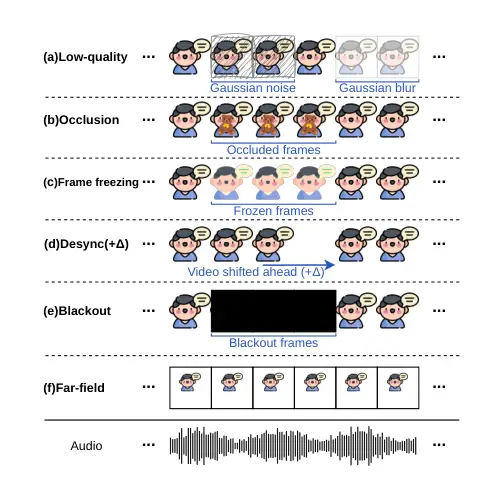
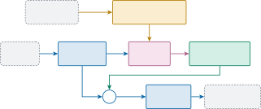
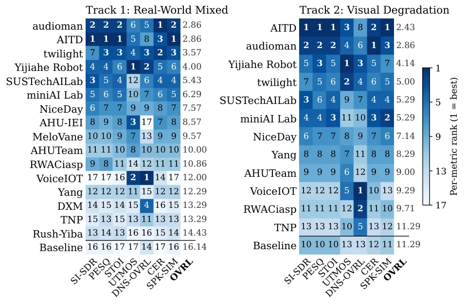

# The ISCSLP 2026 Real-World Audio-Visual Speech Enhancement Challenge: A Benchmark with Natural Mixtures and Degraded Video

Kai Li^(1,∗), Wenze Ren^(2,∗), Junjie Li^(3,∗), Chien-yu Huang⁴, Cheng
Yu⁵, Peijun Yang⁶, Haibin Wu² Szu-Wei Fu⁷, Wen-Chin Huang⁸, Hsin-Min
Wang⁹, Xiaolin Hu¹, Ming Li¹⁰, Yu Tsao^(9,†), DeLiang Wang¹⁰
^(†)^(†)thanks: ^(\*)Equal contribution. ^(†)Corresponding author

###### Abstract

Audio-visual speech enhancement (AVSE) uses a target speaker’s visible
articulation to recover that speaker’s voice from overlapped speech. Yet
most evaluation protocols rely on synthetic mixtures and reliable video.
The ISCSLP 2026 Real-World AVSE Challenge addresses both gaps. Track 1
combines naturally recorded two-talker mixtures, which lack a clean
reference, with reference-available remixes of the same speakers;
Track 2 additionally degrades the target video in five ways and adds 3-m
far-field recordings. Sixteen and twelve teams were ranked on
speaker-disjoint test data by rank averaging over waveform fidelity,
predicted quality, transcription accuracy, and speaker similarity. On
Track 1 remixes, the best system reaches 12.7 dB SI-SDR and 0.85 STOI,
but natural recordings remain harder: even the lowest CER rises from
9.0% to 14.7%. The leading systems use video mainly for speaker
attribution rather than signal reconstruction, and the top two lose
under 0.5 dB SI-SDR on Track 2. UTMOS and DNSMOS rank systems
differently from the other metrics, so no single metric captures
target-speech recovery. We release the baselines, evaluator, and
official results.

###### Index Terms: 

audio-visual speech enhancement, speech separation, real-world
robustness, visual degradation, challenge

^(†)^(†)address: ¹Tsinghua University ²National Taiwan University ³The
Hong Kong Polytechnic University ⁴Carnegie Mellon University ⁵Ohio State
University ⁶Wuhan University ⁷NVIDIA ⁸Nagoya University ⁹Academia Sinica
¹⁰The Chinese University of Hong Kong, Shenzhen

## 1 Introduction

Audio-visual speech enhancement (AVSE) recovers a target speaker’s voice
from a mixture using the speaker’s face or lip video in addition to the
audio \[10, 27, 7, 11\]. Because visible articulation is immune to
acoustic interference, it provides a cue that remains informative under
speaker overlap and strong noise. This principle underlies spectrogram
masking, time-domain separation, and cross-modal consistency methods
\[1, 33, 9, 24\]. Two-stage pipelines first separate the audio and then
identify the target stream by audio-visual synchronization or face-voice
similarity \[25\]. More recent developments include brain-inspired
cross-modal architectures, intra- and inter-modality attention, and
efficient time-frequency modeling \[16, 17, 22\]. See \[18\] for a
survey.

Evaluation, however, has not kept pace with modeling. Most protocols
additively mix separately recorded sources and pair the mixture with
clean visual tracks, yielding a known target waveform but omitting
speaker interaction, room response, ambient noise, and capture
artifacts. On the acoustic side, the AVSE Challenge moved to real-world
videos with added speech or noise \[4\], and the MISP 2023 Challenge
turned to spontaneous far-field conversations \[34\]. On the visual
side, the target face may in practice be occluded, blurred, frozen,
misaligned, distant, missing, or of low resolution; models robust to
audio-visual misalignment \[13\] and recent systems for missing or
low-quality video \[21, 5, 15, 14\] address such conditions, yet no
benchmark has treated visual corruption as a controlled variable. No
reproducible protocol has combined the two, evaluating naturally mixed
audio with unreliable visual evidence; the REAL-TSE Challenge \[31\] is
closest in spirit but conditions on an enrollment utterance rather than
video.

The ISCSLP 2026 Real-World AVSE Challenge addresses this gap. Given a
monaural mixture and the target speaker’s video, systems are evaluated
on naturally recorded two-talker mixtures alongside reference-available
remixes of the same speakers (Track 1) and under controlled degradation
of the target video (Track 2). The official results yield three
findings: (i) natural recordings remain harder than remixes of the same
speakers, even for the best systems; (ii) the leading systems use video
primarily for speaker attribution rather than signal reconstruction; and
(iii) non-intrusive quality predictors rank systems differently from
fidelity, transcription, and speaker-similarity metrics. The protocol,
evaluator, and results are available on the challenge website¹¹ 1
[https://real-world-avse.github.io/](https://real-world-avse.github.io/)
and in the baseline repository²² 2
[https://github.com/Real-World-AVSE/Baseline](https://github.com/Real-World-AVSE/Baseline).

## 2 Challenge Description

### 2.1 Task Definition and Tracks

Let $`x(t)`$ denote the observed monaural mixture and $`v_{k}(\tau)`$
the visual stream of the target speaker $`k`$, where $`t`$ and $`\tau`$
index audio and video time, respectively. The system estimates the
target waveform as

```math
\hat{s}_{k}(t)=f_{\theta}\bigl(x(t),v_{k}(\tau)\bigr), \tag{1}
```

where $`f_{\theta}`$ is the AVSE function with trainable parameters
$`\theta`$.

The benchmark comprises two tracks:

- •
  Track 1: Real-World Mixed Scenarios. The principal condition is
  naturally recorded two-talker speech, which preserves the joint
  effects of overlap, room acoustics, ambient sound, and recording
  chain. Reference-available remixes of the same speakers are included
  as a controlled anchor.
- •
  Track 2: Visual Degradation. The target video of the Track 1 clips is
  degraded in five ways while the audio is left unchanged, and
  additional 3-m far-field recordings from the same sessions are added
  (Sec. 2.2).

### 2.2 Dataset Description

|       | Development |       |       | Test  |       |       |
| ----- | ----------- | ----- | ----- | ----- | ----- | ----- |
| Track | Mix         | Remix | Items | Mix   | Remix | Items |
| 1     | 1,242       | 900   | 4,284 | 2,472 | 1,785 | 8,514 |
| 2     | 1,527       | 1,098 | 5,250 | 2,820 | 2,121 | 9,882 |

Table 1: Released challenge data. Mix and Remix are clip counts per
scene, and each clip yields two target items, one per speaker. Track 2
also includes the far-field recordings.



Figure 1: Track 2 conditions. In (a)–(e), only the target-speaker video
$`v_{k}(\tau)`$ in Eq. (1) is perturbed, offline, while the audio
$`x(t)`$ (bottom row) stays unchanged; in (d), the video may lead
($`+\Delta`$, shown) or lag ($`-\Delta`$) the audio. Condition (f) is a
real far-field recording at about 3 m, which changes both $`x(t)`$ and
$`v_{k}(\tau)`$.

Table 1 lists the released clips and target items \[36\]. The audio is
16-kHz mono; face videos are 256$`\times`$256 pixels at 25 fps with
optional facial-landmark files. The corpus contains seven groups of two
speakers, three for development and four for test, so the splits are
speaker-disjoint. Each split has two scenes. In the *mix* scene, both
speakers are recorded together and no isolated target exists. In the
*remix* scene, two separately recorded single-speaker segments are added
at an SNR sampled from $`-5`$ to $`5`$ dB, and the target source is kept
as a reference. Remix thus supports clean-waveform metrics, whereas mix
retains the natural recording condition and is scored with
reference-free metrics only (Sec. 2.3); gains on remix should not come
at the expense of mix.

Fig. 1 illustrates the six Track 2 conditions: five perturbations³³ 3
[https://github.com/Real-World-AVSE/Baseline/tree/main/look2hear/datas/visual_perturb](https://github.com/Real-World-AVSE/Baseline/tree/main/look2hear/datas/visual_perturb)
of the target-speaker video that leave the audio unchanged, (a)–(e), and
one additional recording condition, (f):

- •
  _Low-quality video_: Gaussian noise or blur applied to a contiguous
  segment.
- •
  _Occlusion_: a random object image overlaid on a facial landmark
  region, typically the mouth.
- •
  _Frame freezing_: one frame repeated over an interval while the audio
  continues.
- •
  _Audio-video desynchronization_: the video shifted ahead of or behind
  the audio, with the frame count preserved.
- •
  _Blackout_: a contiguous block of frames replaced with all-black
  frames.
- •
  _Far-field recording_: additional real recordings at approximately
  3 m; unlike the above, this is not an offline video modification and
  alters both modalities.

### 2.3 Evaluation Protocol

| Metric  | Reference             | Scene     | Backend      |
| ------- | --------------------- | --------- | ------------ |
| SI-SDR  | Clean target waveform | Remix     | torchmetrics |
| PESQ    | Clean target waveform | Remix     | torchmetrics |
| STOI    | Clean target waveform | Remix     | torchmetrics |
| UTMOS   | No                    | Remix&Mix | UTMOSv2      |
| DNSMOS  | No                    | Remix&Mix | ONNX         |
| CER     | Transcript            | Remix&Mix | Fun-ASR      |
| SPK-SIM | Enrollment voiceprint | Remix&Mix | WeSpeaker    |

Table 2: Evaluation metrics: required reference, scenes scored, and
backend.

Table 2 lists the metrics and the reference each requires.
SI-SDR \[12\], PESQ \[26\], and STOI \[29\] need the clean target and
are therefore computed on the _remix_ scene only. UTMOSv2 \[3\] and
DNSMOS \[23\] predict quality without a reference, Fun-ASR \[2\]
provides character error rate (CER) against organizer-provided
transcripts, and WeSpeaker embeddings provide enrollment-based speaker
similarity \[30\]; these four are computed on both scenes. All summary
metrics are arithmetic means over target items; speaker similarity is
the cosine similarity between the enhanced-speech embedding and a
per-speaker centroid built from clean remix sources. The official
leaderboard score is

```math
\mathrm{OVRL}=\frac{1}{|\mathcal{M}|}\sum_{m\in\mathcal{M}}r_{m}, \tag{2}
```

where $`r_{m}`$ is the rank of a team on metric $`m`$ within the
selected scope, with CER ranked in ascending order and all other metrics
in descending order. DNS-P808, DNS-SIG, and DNS-BAK are displayed for
reference⁴⁴ 4 [https://avse.renwenze.com/](https://avse.renwenze.com/)
but excluded from the average; only DNS-OVRL enters it.

## 3 Baseline system and Participants

### 3.1 Baseline system



Figure 2: Official AV-ConvTasNet baseline architecture.

The official baseline is AV-ConvTasNet \[33\], a two-stream
target-speaker separator that extends Conv-TasNet \[19\] with a visual
conditioning branch (Fig. 2). The audio branch retains the Conv-TasNet
design: a learned filterbank encodes the mixture waveform into a latent
representation, a non-causal temporal convolutional separator estimates
a mask over this representation, and a learned decoder reconstructs the
target waveform from the masked representation. The visual branch is a
frozen ResNet-34 lip-reading encoder with a 3D convolutional stem that
maps normalized $`88\times 88`$ lip crops of the target speaker to
512-dimensional features. We concatenate these features with the
audio-branch bottleneck features and project them to a fusion dimension
of $`F=256`$, so the mask is estimated from both modalities. All other
hyperparameters follow the released repository.

We generate training mixtures on the fly. For Track 1, two
single-speaker VoxCeleb2 utterances \[8\] are combined into a
two-speaker remix at each iteration. For Track 2, we retain the same
audio pipeline and additionally subject the target video to online
visual perturbations, namely occlusion, low resolution, frame freezing,
dropped frames, and audio-visual desynchronization. In both cases, the
model is trained with a negative SI-SDR objective on the target speaker
\[12\] using Adam at an initial learning rate of $`10^{-3}`$ with a
ReduceLROnPlateau scheduler, and a separate checkpoint is released for
each track. Because the training mixtures are simulated from VoxCeleb2
rather than drawn from the challenge recordings, this recipe should be
treated as a reproducible starting point rather than a simulation of the
official evaluation distribution.

### 3.2 Participants

The challenge attracted registrations from 51 teams. Of these, 16 teams
from both academia and industry submitted enhanced audio to the Track 1
leaderboard, and 12 of them also submitted to the Track 2 leaderboard.
Each team is represented by its best entry, i.e., the submission with
the lowest OVRL, and the complete leaderboard is available on the
challenge website. Below, we describe the three highest-ranked systems
that submitted system descriptions, namely audioman, AITD, and Yijiahe
Robot; twilight, which ranks third on Track 1 and fourth on Track 2, did
not submit a description and is therefore not covered. Sec. 4 compares
these systems with the remaining entries and the official baseline.

### 3.3 Top-Ranked Systems

All three systems replace the time-domain baseline with time-frequency
backbones, train on simulated reverberant and noisy mixtures, and
optimize metric-oriented objectives beyond SI-SDR; they differ mainly in
how they use video.

AITD. Video never enters signal reconstruction. A blind STFT-domain
dual-path Transformer, trained on audio-only corpora, first with PIT
SI-SNR and then with perceptual (UTMOS, PESQ, WavLM \[6\]) losses, and
finally fine-tuned on the Track 1 development set, produces two
anonymous streams. An AVSelector built on partially fine-tuned auto-AVSR
\[20\] encoders scores each stream against the lip video and assigns
identities by bipartite matching; visual augmentation during its
training makes the assignment robust to degraded video.

audioman. The only fully audio-visual separator among the three
described systems fuses AV-HuBERT \[28\] features of both speakers into
a SIR-progressive TF-GridNet that emits two coarse estimates, one per
input video, with only competing speech removed. A second TF-GridNet
\[32\] then refines both from the mixture under reconstruction,
over-suppression, differentiable PESQ, and adversarial losses. Because
refinement trades waveform fidelity for predicted quality, the coarse
and refined estimates are linearly blended with a development-selected
weight. Training uses VoxCeleb2 and MISP 2023 with RIRs and noise, plus
visual degradation and modality dropout for Track 2.

Yijiahe Robot. DAVE separates with an audio-only TIGER \[35\] backbone
and, like AITD, uses video only for attribution, through a weighted vote
over voiceprint similarity, lip-sync detectors, and lip-keypoint motion.
It is trained on a large simulated corpus derived from meeting
recordings, official-protocol remixes of the development set, and
EchoSet \[35\], with PIT SI-SDR plus differentiable surrogates for CER,
speaker similarity, STOI, PESQ, and UTMOSv2. A scene classifier applies
GAN denoising and loudness normalization only to clips detected as
natural mixtures, leaving the remix scene untouched.

## 4 Results and Analysis



Figure 3: Official test-set leaderboard. Each cell shows an entry’s rank
on one metric, and OVRL averages the seven ranks as in Eq. (2), so lower
is better. The baseline in the bottom row is ranked together with the
teams.

|         |               |                                |                      |                   |                     |                                         |                  |                  |                   |                      |                   |                     |
| ------- | ------------- | ------------------------------ | -------------------- | ----------------- | ------------------- | --------------------------------------- | ---------------- | ---------------- | ----------------- | -------------------- | ----------------- | ------------------- |
|         |               | Mix scene (no clean reference) |                      |                   |                     | Remix scene (clean reference available) |                  |                  |                   |                      |                   |                     |
|         | System        | UTMOS$`\uparrow`$              | DNS-OVRL$`\uparrow`$ | CER$`\downarrow`$ | SPK-SIM$`\uparrow`$ | SI-SDR$`\uparrow`$                      | PESQ$`\uparrow`$ | STOI$`\uparrow`$ | UTMOS$`\uparrow`$ | DNS-OVRL$`\uparrow`$ | CER$`\downarrow`$ | SPK-SIM$`\uparrow`$ |
| Track 1 | audioman      | 2.024                          | 1.802                | 0.147             | 0.734               | 10.699                                  | 2.933            | 0.841            | 2.143             | 1.874                | 0.090             | 0.771               |
|         | AITD          | 2.072                          | 1.664                | 0.183             | 0.751               | 12.716                                  | 3.000            | 0.852            | 2.139             | 1.742                | 0.092             | 0.794               |
|         | Yijiahe Robot | 2.652                          | 2.225                | 0.189             | 0.696               | 10.232                                  | 2.717            | 0.817            | 2.921             | 1.742                | 0.146             | 0.768               |
|         | Baseline      | 0.730                          | 1.467                | 1.059             | 0.334               | $`-5.925`$                              | 1.137            | 0.304            | 0.926             | 1.420                | 0.979             | 0.320               |
| Track 2 | audioman      | 2.045                          | 1.731                | 0.175             | 0.728               | 10.223                                  | 2.888            | 0.830            | 2.159             | 1.798                | 0.112             | 0.766               |
|         | AITD          | 2.092                          | 1.638                | 0.183             | 0.748               | 12.255                                  | 2.939            | 0.844            | 2.178             | 1.713                | 0.114             | 0.785               |
|         | Yijiahe Robot | 2.648                          | 2.241                | 0.234             | 0.678               | 8.933                                   | 2.615            | 0.789            | 2.922             | 1.708                | 0.201             | 0.745               |
|         | Baseline      | 1.097                          | 1.166                | 1.094             | 0.401               | $`-1.689`$                              | 1.304            | 0.502            | 1.104             | 1.262                | 0.998             | 0.389               |

Table 3: Test-set results of the three described systems and the
official baseline on Track 1 (Real-World Mixed) and Track 2 (Visual
Degradation). The mix scene has no clean reference, so SI-SDR (dB),
PESQ, and STOI are available on the remix scene only. Best value per
column within each track in bold.

### 4.1 Overall Results

Fig. 3 shows the per-metric ranks and the resulting OVRL score of every
entry, and Table 3 shows the absolute scores of the three systems
described in Sec. 3.3 and the official baseline. The same four teams
occupy the first four positions on both tracks: audioman and AITD tie on
Track 1 (OVRL 2.86), and AITD leads Track 2 (2.43) ahead of audioman
(2.86). The baseline, trained only on simulated VoxCeleb2 mixtures, does
not transfer to the challenge recordings: it ranks last on Track 1 and
ties for last on Track 2, with a remix SI-SDR of $`-5.925`$ dB and a CER
above 1.0, indicating that the total number of ASR errors exceeds the
number of reference characters.

By contrast, AITD reaches 12.72 dB SI-SDR and 0.85 STOI on the Track 1
remix scene, and audioman achieves the lowest CER on both scenes of both
tracks: 9.0% on remix and 14.7% on mix for Track 1, and 11.2% and 17.5%
for Track 2.

Natural recordings nevertheless remain harder than remixes of the same
speakers. Across all three systems and both tracks, CER is higher, and
SPK-SIM is lower on the mix scene than on the remix scene; on Track 1,
AITD’s CER doubles from 9.2% to 18.3%. The mix and remix clips are
different recordings, so this comparison is not exact, but the direction
is the same for every system on both tracks. Even the best system still
makes about one error in every seven characters on naturally recorded
overlap (14.7% CER on Track 1), so the real-world condition is far from
solved.

### 4.2 Role of Video under Visual Degradation

The leading systems use video mainly to decide which output belongs to
the target, not to reconstruct the signal. AITD and Yijiahe Robot
separate the two voices with an audio-only model and use the video only
afterwards, to pick the target speaker’s output. AITD, in which video
never enters reconstruction, ranks first among all teams on SI-SDR,
PESQ, STOI, and SPK-SIM on both tracks. Audioman, the only one of the
three that fuses visual features into the separator, leads on CER. Thus,
with two talkers, a strong audio-only separator and a reliable visual
selector are enough to achieve the best fidelity scores. This does not
show that audio-visual fusion is worse, since the systems also differ in
training data and loss functions.

Visual degradation therefore costs little. From Track 1 to Track 2,
SI-SDR decreases by 0.46 dB for AITD and 0.48 dB for audioman, STOI
decreases by less than 0.012, and CER increases by 0.8 and 2.5 points;
Yijiahe Robot loses more ($`-1.30`$ dB SI-SDR, $`+4.9`$ CER points).
When the video fails, the main risk is a wrong speaker assignment, not
worse separation, and both systems prepare for it in training: AITD
augments the video seen by its selector, and audioman applies modality
dropout and visual corruption.

This comparison is not a paired ablation: the Track 2 test set is larger
(Table 1), its far-field items change both the audio and the video, and
teams could submit track-specific systems. For example, the baseline
scores 4.2 dB higher in SI-SDR on Track 2 than on Track 1, which
reflects the different checkpoints and test items, not a benefit of
degraded video. With this caveat, Track 2 mainly tests whether a system
still picks the right speaker when the video is degraded, not whether
video still helps separation. Whether video helps separation under more
challenging conditions, such as those involving more talkers or similar
voices, remains an open question.

### 4.3 Disagreement among Metrics

Fig. 3 shows that SI-SDR, PESQ, STOI, CER, and SPK-SIM rank the teams in
nearly the same order: AITD and audioman, for example, are in the top
three on all five metrics on both tracks. UTMOS and DNS-OVRL rank the
teams differently. On Track 1, VoiceIOT ranks first on DNS-OVRL and
second on UTMOS but last, below the baseline, on SI-SDR, PESQ, and
SPK-SIM; on Track 2, VoiceIOT and RWACiasp hold the top two DNS-OVRL
positions while ranking eleventh or twelfth on SI-SDR, PESQ, and STOI.
The two predictors also disagree: AHU-IEI ranks third on UTMOS and last
on DNS-OVRL on Track 1.

Non-intrusive predictors reward outputs that sound clean whether or not
the target’s content and identity are preserved, so aggressive
suppression or resynthesis can raise them. For example, on the Track 1
mix scene, the baseline’s DNS-OVRL is within 0.2 of AITD’s (1.47 vs.
1.66), although its output is untranscribable (CER 106% vs. 18%). The
described systems show the same effect: Yijiahe Robot applies GAN
denoising only to clips detected as natural mixtures, and only on the
mix scene is its DNS-OVRL higher than those of audioman and AITD (2.23
vs. 1.80 and 1.66 on Track 1), even though its CER is the highest and
its SPK-SIM the lowest of the three.

This matters most in the mix scene, which has no clean reference: there,
UTMOS and DNS-OVRL should be interpreted only alongside CER and SPK-SIM,
which check that the target’s content and identity are preserved. The
rank average limits the influence of any single metric: VoiceIOT
finishes twelfth on Track 1 despite two top-two placements.

## 5 Conclusion

We presented the ISCSLP 2026 Real-World AVSE Challenge, to our knowledge
the first reproducible benchmark that evaluates AVSE on naturally
recorded two-talker mixtures and under controlled degradation of the
target video. It provides speaker-disjoint data, a rank-averaged score
over fidelity, predicted quality, transcription, and speaker similarity,
and a public baseline, evaluator, and leaderboard. Results from 16 and
12 teams yield three findings. First, natural recordings remain harder
than remixes of the same speakers: even for the best system, CER rises
from 9.0% on remixes to 14.7% on natural recordings. Second, the leading
systems use video mainly for speaker attribution rather than signal
reconstruction, and the two top-ranked systems lose less than 0.5 dB
SI-SDR from Track 1 to Track 2. Third, UTMOS and DNSMOS rank systems
differently from the other metrics, so predicted quality should be
interpreted alongside CER and speaker similarity, especially when no
clean reference exists.

In future editions, we plan to add more talkers and similar voices, in
conditions where visual selection alone may not suffice. We also plan to
pair clean and degraded versions of the same clips so each degradation
can be measured directly, and to run listening tests to calibrate the
learned quality predictors.

## 6 Generative AI Use Disclosure

Generative AI was used only for language polishing; the authors take
full responsibility for all content. AI tools did not contribute to the
substantive scientific content.

## References

- \[1\] T. Afouras et al. (2018) The conversation: deep audio-visual
  speech enhancement. In Proc. Interspeech, Cited by: §1.
- \[2\] K. An et al. (2025) Fun-ASR technical report. arXiv preprint
  arXiv:2509.12508. Cited by: §2.3.
- \[3\] K. Baba et al. (2024) The T05 system for the VoiceMOS challenge
  2024: transfer learning from deep image classifier to naturalness MOS
  prediction of high-quality synthetic speech. In Proc. SLT, Cited by:
  §2.3.
- \[4\] A. L. A. Blanco et al. (2023) AVSE Challenge: audio-visual
  speech enhancement challenge. In Proc. SLT, Cited by: §1.
- \[5\] H. Chen et al. (2025) HPCNet: hybrid pixel and contour network
  for audio-visual speech enhancement with low-quality video. IEEE
  Journal of Selected Topics in Signal Processing. Cited by: §1.
- \[6\] S. Chen et al. (2022) WavLM: large-scale self-supervised
  pre-training for full stack speech processing. IEEE Journal of
  Selected Topics in Signal Processing. Cited by: §3.3.
- \[7\] S. Chuang et al. (2022) Improved lite audio-visual speech
  enhancement. IEEE Trans. Audio, Speech, Language Process.. Cited by:
  §1.
- \[8\] J. S. Chung et al. (2018) VoxCeleb2: deep speaker recognition.
  In Proc. Interspeech, Cited by: §3.1.
- \[9\] R. Gao and K. Grauman (2021) VisualVoice: audio-visual speech
  separation with cross-modal consistency. In Proc. CVPR, Cited by: §1.
- \[10\] J. Hou et al. (2018) Audio-visual speech enhancement using
  multimodal deep convolutional neural networks. IEEE Trans. on Emerging
  Topics in Computational Intelligence. Cited by: §1.
- \[11\] Kalkhorani et al. (2025) AV-CrossNet: an audiovisual complex
  spectral mapping network for speech separation by leveraging narrow-
  and cross-band modeling. IEEE Journal of Selected Topics in Signal
  Processing. Cited by: §1.
- \[12\] J. Le Roux et al. (2019) SDR–half-baked or well done?. In Proc.
  ICASSP, Cited by: §2.3, §3.1.
- \[13\] J. Lee et al. (2021) Looking into your speech: learning
  cross-modal affinity for audio-visual speech separation. In Proc.
  CVPR, Cited by: §1.
- \[14\] J. Li et al. (2025) MoMuSE: momentum multi-modal target speaker
  extraction for real-time scenarios with impaired visual cues. In Proc.
  ICME, Cited by: §1.
- \[15\] J. Li et al. (2026) MeMo: attentional momentum for real-time
  audio-visual target speaker extraction under impaired visual
  conditions. IEEE Trans. Audio, Speech, Language Process.. Cited by:
  §1.
- \[16\] K. Li et al. (2024) An audio-visual speech separation model
  inspired by cortico-thalamo-cortical circuits. IEEE Trans. on Pattern
  Analysis and Machine Intelligence. Cited by: §1.
- \[17\] K. Li et al. (2024) IIANet: an intra- and inter-modality
  attention network for audio-visual speech separation. In Proc. ICML,
  Cited by: §1.
- \[18\] K. Li et al. (2025) Advances in speech separation: techniques,
  challenges, and future trends. arXiv preprint arXiv:2508.10830. Cited
  by: §1.
- \[19\] Y. Luo and N. Mesgarani (2019) Conv-TasNet: surpassing ideal
  time-frequency magnitude masking for speech separation. IEEE Trans.
  Audio, Speech, Language Process.. Cited by: §3.1.
- \[20\] P. Ma et al. (2023) Auto-avsr: audio-visual speech recognition
  with automatic labels. In Proc. ICASSP, Cited by: §3.3.
- \[21\] T. Pan et al. (2024) RAVSS: robust audio-visual speech
  separation in multi-speaker scenarios with missing visual cues. In
  Proc. ACM Multimedia, Cited by: §1.
- \[22\] S. Pegg et al. (2024) RTFS-Net: recurrent time-frequency
  modelling for efficient audio-visual speech separation. In Proc. ICLR,
  Cited by: §1.
- \[23\] C. K. A. Reddy et al. (2022) Dnsmos p.835: a non-intrusive
  perceptual objective speech quality metric to evaluate noise
  suppressors. In Proc. ICASSP, Cited by: §2.3.
- \[24\] W. Ren K. Li et al. (2025) BAV-MossFormer2: enhanced
  MossFormer2 for binaural audio-visual speech enhancement. In 4th
  Cogmhear AVSEC, Cited by: §1.
- \[25\] W. Ren et al. (2024) Robust audio-visual speech enhancement:
  correcting misassignments in complex environments with advanced
  post-processing. In Proc. O-COCOSDA, Cited by: §1.
- \[26\] A.W. Rix et al. (2001) Perceptual evaluation of speech quality
  (PESQ)-a new method for speech quality assessment of telephone
  networks and codecs. In Proc. ICASSP, Cited by: §2.3.
- \[27\] M. Sadeghi et al. (2020) Audio-visual speech enhancement using
  conditional variational auto-encoders. IEEE Trans. Audio, Speech,
  Language Process.. Cited by: §1.
- \[28\] B. Shi et al. (2022) Learning audio-visual speech
  representation by masked multimodal cluster prediction. In Proc. ICLR,
  Cited by: §3.3.
- \[29\] C. H. Taal et al. (2011) An algorithm for intelligibility
  prediction of time-frequency weighted noisy speech. IEEE Trans. Audio,
  Speech, Language Process.. Cited by: §2.3.
- \[30\] H. Wang et al. (2023) WeSpeaker: a research and production
  oriented speaker embedding learning toolkit. In Proc. ICASSP, Cited
  by: §2.3.
- \[31\] S. Wang et al. (2026) SLT 2026 REAL-TSE Challenge: real-world
  target speaker extraction from conversational recordings. Cited by:
  §1.
- \[32\] Z. Wang et al. (2023) TF-gridnet: integrating full- and
  sub-band modeling for speech separation. IEEE Trans. Audio, Speech,
  Language Process.. Cited by: §3.3.
- \[33\] J. Wu et al. (2019) Time domain audio visual speech separation.
  In Proc. ASRU, Cited by: §1, §3.1.
- \[34\] S. Wu et al. (2024) The multimodal information based speech
  processing (MISP) 2023 challenge: audio-visual target speaker
  extraction. In Proc. ICASSP, Cited by: §1.
- \[35\] M. Xu et al. (2025) TIGER: time-frequency interleaved gain
  extraction and reconstruction for efficient speech separation. In
  Proc. ICLR, External Links:
  [Link](https://openreview.net/forum?id=rzx3vcvlzj) Cited by: §3.3.
- \[36\] P. Yang et al. (2026) Identity-faithful audio-visual target
  speaker extraction with QIANGDA and VOXBLINK2-AVSE. Cited by: §2.2.
