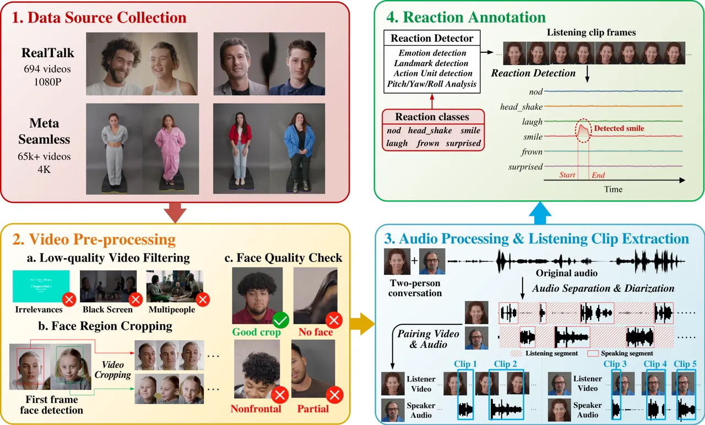
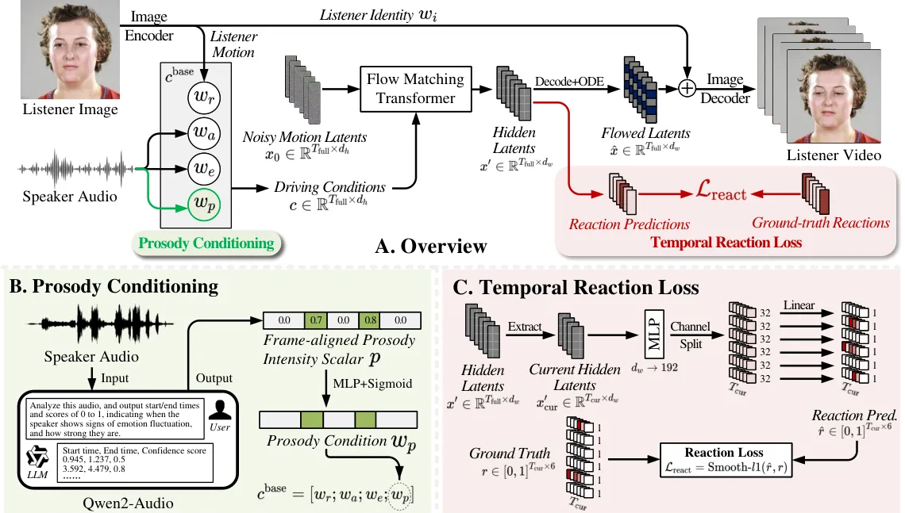
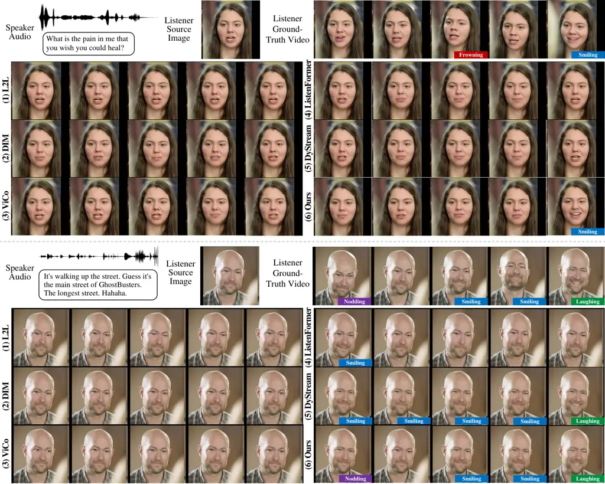
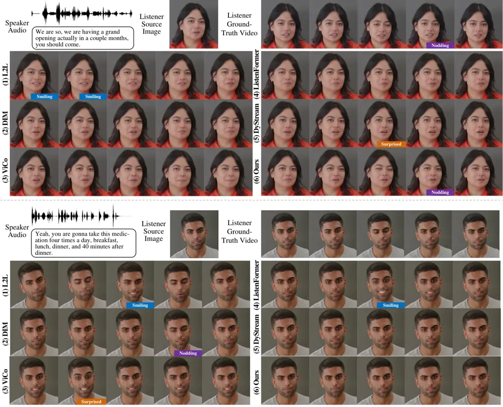

# GLARE: Generating Listening Heads with Appropriate Reactions

Zikai Liao    Yumin Suh    Yi Ouyang    Yi-Lun Lee    Yi-Hsuan Tsai   
Zhaozheng Yin    Department of Computer Science    Stony Brook
University    Atmanity Inc

###### Abstract

While talking head generation has advanced rapidly, generating natural
listener behavior in dyadic conversations, which know when to react, how
to react, and with what type of response, remains underexplored.
Existing dyadic datasets lack fine-grained listener reaction
annotations, and prevailing evaluation metrics inherited from
talking-head and video generation measure visual realism rather than
whether a listener reacted appropriately. We address these gaps along
three aspects. First, we curate a listening-head-specific dataset built
from RealTalk and Seamless Interaction, comprising approximately 147
hours of paired speaker–listener videos with 64,557 event-level reaction
annotations across six categories: nodding, head shaking, smiling,
laughing, frowning, and surprised. Second, we introduce an audio-driven
baseline built on a flow-matching transformer, namely GLARE, with
prosody conditioning derived from Qwen2-Audio and a temporal reaction
loss that explicitly supervises frame-wise reactions. Third, we propose
a reaction-oriented evaluation protocol that jointly measures reaction
occurrence (R-F1), temporal alignment (R-tIoU), asymmetric temporal
deviation (R-ATD), and reaction-region visual quality (R-FID), giving a
more behaviorally grounded assessment than visual-quality-only metrics.
Experiment results show consistent gains over prior listening-head
methods in both visual fidelity and reaction-level metrics, suggesting
that reaction-aware data, modeling, and evaluation are critical for
natural listening behavior. The code, annotation pipeline, and processed
dataset will be released at
[https://github.com/lzk901372/glare](https://github.com/lzk901372/glare).

## 1 Introduction

Recent advances in talking head generation have greatly improved lip
synchronization, identity preservation, and photorealistic
rendering \[14; 22; 32; 16; 18; 43; 12; 47\]. Most existing methods,
however, focus on animating the speaker. In face-to-face conversation,
the listener is equally important: non-verbal behaviors, such as brief
reactions like smiling and nodding, convey attention, agreement,
hesitation, and affective engagement \[41\]. The timing and type of
these reactions strongly affect perceived naturalness, since visually
plausible motions can still appear unnatural when reactions are absent,
mistimed, or inconsistent with the conversational context \[24; 25; 9\].

Listening head generation has recently emerged as a distinct task.
ViCo \[46\] introduced an early benchmark, while subsequent works
explored non-deterministic listener motion, language-aware responses,
emotion conditioning, improved sequence modeling, and real-time dyadic
interaction \[25; 26; 35; 20; 47; 15\]. Despite this progress,
reaction-aware listening head generation remains limited by two key
bottlenecks. First, existing datasets are not designed around
fine-grained listener reactions. ViCo provides task-specific supervision
but is limited in scale, while larger dyadic resources such as
RealTalk \[12\], Seamless Interaction \[1\], and SpeakerVid-5M \[44\]
offer rich conversational videos without event-level annotations of
reaction type, timing, and duration. As a result, current data provide
insufficient supervision for modeling when a listener should react, what
reaction should occur, and how the reaction should unfold over time.

Second, existing evaluation protocols mainly rely on metrics inherited
from talking-head or video generation, such as reconstruction fidelity,
perceptual realism, and motion quality. These metrics are useful for
measuring global visual quality, but they do not explicitly assess
whether generated listener reactions are type-consistent, temporally
aligned with conversational cues, or visually realistic within reaction
segments. This is particularly important because listener feedback is
inherently multi-valid: an appropriate response may not exactly match a
single reference timestamp, yet its type, timing, and quality should
still be evaluated in a reaction-aware manner \[9\].

To address these limitations, we revisit listening head generation from
the perspectives of data, modeling, and evaluation. We curate a
listening-head-specific dataset from RealTalk and Seamless Interaction
by extracting aligned speaker-listener portrait pairs and annotating
listener reactions as categorized temporal events. The resulting dataset
contains approximately 147 hours of paired video data and 64,557
reaction instances. Based on this dataset, we introduce an audio-driven
listening head generation method GLARE with prosody conditioning and a
temporal reaction loss, enabling the model to better capture
speaker-side cues and generate appropriate listener reactions at the
right moment. We further propose reaction-centric evaluation metrics
that measure reaction occurrence, temporal alignment, asymmetric timing
deviation, and reaction-region visual quality.

Our main contributions are as follows:

1.  1.  We curate a listening-head dataset built from dyadic conversational
        videos, with aligned video-audio pairs and event-level annotations
        of listener reactions, comprising approximately 147 hours of video
        data and 64,557 reaction instances.
2.  2.  We introduce an audio-driven reacting listener, namely GLARE, for
        listening head generation, equipped with a dedicated prosody
        conditioning mechanism and a temporal reaction loss.
3.  3.  We propose reaction-oriented evaluation metrics for listening head
        generation that jointly measures visual fidelity, reaction accuracy,
        and temporal alignment, enabling finer-grained assessment of
        conversational appropriateness with extensive experiments comparing
        existing methods.

## 2 Related Works

#### Listening head generation.

Listening head generation synthesizes non-verbal listener behaviors
conditioned on speaker-side conversational cues. ViCo \[45\] first
established responsive listening head generation as a benchmark, and
Learning2Listen \[25\] modeled listener motion as a non-deterministic
distribution to reflect the multi-valid nature of dyadic interaction.
Later methods improved listener synthesis with emotion
conditioning \[35\], non-autoregressive sequence modeling \[20\],
diffusion-based generation \[38\], dyadic interaction modeling \[41\],
and real-time multimodal interaction \[47; 15\]. However, most existing
methods optimize holistic motion realism, diversity, or speaker-listener
synchrony, without explicitly modeling listener reactions as categorized
and temporally localized events. Our work instead focuses on generating
reactions with appropriate type, timing and duration.

#### Interactive conversation datasets.

Dyadic conversation datasets provide important resources for modeling
social interaction. Early corpora such as RECOLA \[33\] and NoXi \[5\]
support affective and feedback behavior analysis, while ViCo \[45\]
introduced a task-specific benchmark for responsive listening heads.
Larger resources such as RealTalk \[12\], Seamless \[1\], and
SpeakerVid-5M \[44\] provide more diverse conversational videos, but
they are not designed around fine-grained listener reaction events. In
contrast, our dataset constructs aligned speaker-listener clips with
explicit event-level annotations of reaction type, timing, and duration.

#### Evaluation methods.

Listener generation is commonly evaluated using backchannel prediction
metrics, such as precision, recall, F1, tolerance windows, and
subjective appropriateness judgments \[23; 10\], or visual generation
metrics such as FID \[34\], FVD \[39\], and LPIPS \[42\]. These metrics
measure feedback timing or global visual quality, but do not jointly
assess whether a generated listener reacts with the correct type, at the
correct moment, and with realistic reaction-specific motion. Recent
reaction generation benchmarks emphasize appropriateness, diversity,
synchrony, and realism \[36; 37\]. Our evaluation further treats
reactions as categorized temporal events and measures reaction
occurrence, temporal alignment, asymmetric timing deviation, and
reaction-region quality.

## 3 Dataset Curation



Figure 1: Overview of our data curation pipeline: Step 1, we leverage
conversational data from the RealTalk and Seamless datasets; Step 2,
videos are cropped into facial regions; Step 3, we apply audio
separation and diarization to disentangle listening and speaking
segments in each conversation with timestamps, and pair speaker audio
clips with corresponding listener clips; and Step 4, we define the
reaction classes and detect reactions in each paired clip, resulting in
multi-class frame-wise reaction annotations.

Our goal is to construct a listening-head-specific dataset that supports
not only audio-driven listener head generation, but also fine-grained
modeling and evaluation of listener reactions. To this end, we curate
dyadic conversational videos into temporally aligned speaker–listener
pairs and further annotate the listener’s visible reactions as
categorized temporal events. The overall pipeline is shown in Fig. 1.
Starting from RealTalk \[11\] and Seamless Interaction \[1\], we obtain
107,149 speaker audio/listener-video pairs, corresponding to
approximately 147 hours of data.

### 3.1 Speaker–Listener Clip Construction

As shown in Fig.1 (2) and (3), we first process the raw dyadic videos to
obtain high-quality portrait clips for both conversational participants.
Since the original videos may contain scene transitions, black frames,
irrelevant content, multiple visible people, severe occlusions, or
unstable face crops, visual quality filtering is performed before clip
extraction. For retained videos, each participant is cropped into a
portrait-centered video and an additional manual face-quality check is
conducted to remove clips with missing, partial, or poorly framed faces.
This step ensures that the resulting listener videos contain stable
facial regions suitable for motion generation and reaction annotation.

We then parse the speaking and listening roles over time. For RealTalk,
where the two speakers may be mixed in the original audio, we perform
audio separation, denoising, and speaker diarization to estimate
participant-level speech activity. For Seamless Interaction, we use the
provided high-quality audio streams and diarization results, with
timestamp correction when necessary. Based on the resulting
speech-activity timelines, each dyadic conversation is decomposed into
speaker-dominant intervals. For each interval, we pair the active
speaker’s audio with the temporally synchronized portrait video of the
other participant, who is treated as the listener. This produces paired
training examples in the form of speaker audio and listener video, while
preserving the conversational timing between the two participants.

Implementation details of speaker-listener clip reconstruction,
including filtering criteria, face-crop procedure, diarization
correction, and quality-control procedures, are provided in Appendix A.

### 3.2 Reaction Taxonomy and Annotation

A central objective of our dataset is to explicitly capture listener
reactions that are semantically meaningful and temporally localized. We
focus on six common reaction categories: nodding, head shaking, smiling,
laughing, frowning, and surprised, which are visually recognizable and
frequently associated with conversational feedback and affective
responses \[25; 46; 12\]. Compared with micro-behaviors (e.g., eye
blinking or gaze shifts), and background motions (e.g., subtle pose
adjustments), these reactions have four desirable properties: they
convey clear communicative or affective intent, are visually
recognizable and are strongly correlated with the conversational
context. These properties make them suitable targets for reaction-aware
listener generation and reaction-centric evaluation.

As shown in Fig.1 (4), to annotate listener reactions at scale, we
design a visual reaction detector to the cropped listener videos. For a
listener clip with $`T`$ frames, the detector outputs a dense reaction
score vector $`\mathbf{r}\in[0,1]^{T\times 6}`$, where each channel
corresponds to one of the six reaction categories. The detector combines
head-motion cues, facial landmark dynamics, facial expression cues, and
temporal smoothing to estimate frame-wise reaction confidence.
Continuous high-confidence regions are then converted into event-level
annotations $`A=\{(y_{i},r_{i},t_{s,i},t_{e,i})\}_{i=1}^{N}`$, where
$`y_{i}\in\mathcal{Y}`$ is the event type from the six reaction classes,
$`r_{i}`$ is the frame-wise reaction score within $`[t_{s,i},t_{e,i}]`$,
and $`t_{s,i}`$ and $`t_{e,i}`$ are the start and end times. Each final
event is assigned a single type, and cross-class overlaps are resolved
by keeping the dominant reaction. The resulting annotations therefore
provide both sparse temporal boundaries for event-level evaluation and
dense frame-wise scores for reaction-aware training supervision.

We further conduct manual verification to remove unreliable detections
and improve annotation quality. The final curated dataset contains
64,557 reaction instances in total. The distribution across reaction
categories is summarized in Table 1. Smiling and head shaking are the
most frequent reaction types, while surprised reactions occur less
often, reflecting their relatively sparse and context-specific nature in
natural conversations. The detailed detector design, including
class-specific visual cues, smoothing strategies, event merging rules,
and thresholds, can be referred to Appendix B.

|               |         |              |         |          |          |           |        |
| ------------- | ------- | ------------ | ------- | -------- | -------- | --------- | ------ |
| Reaction type | nodding | head shaking | smiling | laughing | frowning | surprised | Total  |
| Count         | 10,230  | 12,790       | 15,767  | 8,320    | 9,986    | 7,464     | 64,557 |

Table 1: Statistics of the annotated listener reactions in our curated
dataset.

## 4 Methodology of GLARE



Figure 2: Overview of our Prosody-conditioned Reacting Listener GLARE.
Given speaker audio, a listener reference image, and temporal context,
our model predicts listener motion latents using a conditional flow
matching transformer (FMT). We further introduce prosody conditioning to
capture speaker-side temporal prosodic variations, and a temporal
reaction loss to explicitly supervise frame-wise listener reactions. The
resulting motion latents are decoded into listener video frames.

### 4.1 Preliminaries

We present the overview of our listener GLARE in Fig. 2.A. Similar to
FLOAT \[17\], given a listener source image $`S`$ and a speaker audio
segment $`a`$, the goal is to synthesize a listener motion-latent
trajectory that can be decoded into listener video frames. We use
LIA \[40\] as a frozen image autoencoder to extract listener reference
motion latent
$`w_{r}\in\mathbb{R}^{(T_{\text{prev}}+T_{\text{cur}})\times d_{r}}`$¹¹
1 $`d_{r}`$, $`d_{a}`$, $`d_{e}`$, $`d_{p}`$, $`d_{w}`$ are channel
dimension of $`w_{r}`$, $`w_{a}`$, $`w_{e}`$, $`w_{p}`$ and $`x`$.
$`d_{h}`$ is the hidden dimension of FMT. and identity latent $`w_{i}`$
from $`S`$, and use Wav2Vec2 \[2\] to encode $`a`$ into audio latents
$`w_{a}\in\mathbb{R}^{(T_{\text{prev}}+T_{\text{cur}})\times d_{a}}`$¹.
Note that we utilize $`T_{\text{prev}}+T_{\text{cur}}`$ frames of audio
for generation, where $`T_{\text{cur}}`$ denotes current frames for
listener motion generation, $`T_{\text{prev}}`$ indicate previous frames
of audio context. Additionally, an emotion encoder \[30\] is used to
encode the audio into an emotion latent
$`w_{e}\in\mathbb{R}^{(T_{\text{prev}}+T_{\text{cur}})\times d_{e}}`$¹
to represent speaker emotions. $`w_{r}`$, $`w_{a}`$, and $`w_{e}`$,
along with $`w_{p}`$ (introduced in Sec 4.2), jointly construct the
driving condition $`c`$. We then use $`c`$ is to modulate noisy latents
$`x=[x^{\text{ref}};x^{\text{prev}};x^{\text{cur}}]\in\mathbb{R}^{T_{\text{full}}\times d_{w}}`$¹
covering
$`T_{\text{full}}=T_{\text{ref}}+T_{\text{prev}}+T_{\text{cur}}`$
frames, where $`T_{\text{ref}}`$ is reference listener frames providing
more listener-side contexts. We adopt a DiT-style transformer \[29\] to
predict the vector fields via flow matching \[19; 17\]. The vector
fields will be further solved into listener flowed latent $`\hat{x}`$,
which will be integrated with listener identity latent $`w_{i}`$ and
decoded into video frames.

### 4.2 Prosody Conditioning

While conventional audio-driven listener generation mainly relies on
low-level acoustic representations, listener reactions are often
triggered by fine-grained speaker-side temporal cues, such as emphasis,
affective fluctuation, and non-monotone prosodic changes. To make the
driving condition more sensitive to such conversational cues, we
introduce a prosody conditioning branch, where we further extract a
frame-aligned prosodic intensity timeline using Qwen2-Audio-7B-Instruct
\[8\] in addition to $`w_{r}`$, $`w_{a}`$, and $`w_{e}`$. The full
prompt template is given in Appendix C.2.

Specifically, as shown in Fig. 2.B, we use the Audio LLM \[8\] to
analyze the audio prosody and obtain timestamps indicating prosodic
fluctuations, which will be further processed into a frame-aligned
prosody intensity scalar
$`p\in[0,1]^{(T_{\text{prev}}+T_{\text{cur}})\times 1}`$ for each
sample, where larger values indicate stronger prosodic or temporal
affective variation in the speaker’s speech. The scalar prosody signal
is then projected to a compact latent representation
$`w_{p}\in\mathbb{R}^{(T_{\text{prev}}+T_{\text{cur}})\times d_{p}}`$¹
using a simple MLP and Sigmoid layer. We then integrate $`w_{p}`$ into
driving conditions by channel-wise concatenation
$`c^{\text{base}}=[w_{r};w_{a};w_{e};w_{p}]\in\mathbb{R}^{T_{\text{Full}}\times d_{c}}`$,
where $`t`$ denotes a specific frame, and
$`d_{c}=d_{r}+d_{a}+d_{e}+d_{p}`$. The $`c^{\text{base}}`$ is then
projected from $`d_{c}`$ to $`d_{h}`$¹ as the final driving conditions
$`c`$.

### 4.3 Temporal Reaction Loss

A key limitation of purely reconstruction-based listener generation is
that the model may produce visually plausible motions while failing to
align with conversationally meaningful reactions. To explicitly
encourage temporally accurate listener behaviors, we introduce a
temporal reaction loss based on frame-wise reaction annotations.

We consider six listener reaction categories according to our defintions
in Sec. 3.2. As shown in Fig. 2.C, let
$`x^{\prime}_{\text{cur}}\in\mathbb{R}^{T_{\text{cur}}\times d_{w}}`$
denote the transformer hidden latents for current frames, we first map
each hidden token to an intermediate representation
$`z=\mathrm{MLP}(x^{\prime}_{\text{cur}})\in\mathbb{R}^{T_{\text{cur}}\times 192}`$.
We then factorize $`z`$ into six class-specific subspaces, each with 32
channels, where
$`z_{t}\rightarrow\{z_{t}^{(k)}\}_{k=1}^{6},\ z_{t}^{(k)}\in\mathbb{R}^{32},\ t=1,\dots,T_{\text{cur}}`$.
Each reaction subspace is reduced to a time-specific latent
$`\hat{r}\in[0,1]^{T_{\text{cur}}\times 6}`$ with a class-specific
linear layer, followed by a sigmoid activation. With the annotated
frame-wise reaction target $`r\in[0,1]^{T_{\text{cur}}\times 6}`$, we
apply Smooth-L1 supervision:

```math
\mathcal{L}_{\text{react}}=\frac{1}{T_{\text{cur}}}\sum_{t=1}^{T_{\text{cur}}}\mathrm{SmoothL1}(\hat{r}_{t},r_{t}). \tag{1}
```

This loss encourages the hidden motion representation to preserve
reaction-aware temporal structure, improving not only the visual
fidelity of listener motion but also the timing and type consistency of
generated reactions.

### 4.4 Training Objective and Inference

The overall training objective is

```math
\mathcal{L}=\mathcal{L}_{\text{fm}}+\lambda_{\text{vel}}\mathcal{L}_{\text{vel}}+\lambda_{\text{react}}\mathcal{L}_{\text{react}}. \tag{2}
```

Here, $`\mathcal{L}_{\text{fm}}`$ is the flow-matching loss on the
predicted vector field, $`\mathcal{L}_{\text{vel}}`$ is the temporal
velocity consistency regularizer \[17\], and
$`\mathcal{L}_{\text{react}}`$ is the proposed temporal reaction loss.
At inference time, the model takes the listener reference image,
previous listener motion context, and speaker audio as input. The FMT
predicts conditional vector fields, which are integrated with an ODE
solver to obtain current listener motion latents. These motion latents
are then decoded into video frames.

## 5 Reaction-Centric Evaluation Metrics

Conventional evaluation metrics for talking-head or listening-head
generation mainly focus on global visual fidelity, perceptual
similarity, motion diversity, or distributional realism, which are
insufficient for evaluating listener-specific behaviors. In particular,
they fail to capture whether appropriate reactions are generated at the
right moments, whether their temporal extents are accurate, and whether
the visual quality of these reactions is satisfactory. To address these
limitations, we propose a set of reaction-centric evaluation metrics
that explicitly measure the reaction type correctness, temporal
alignment, and visual quality of generated listener reactions.

For each generated listener video, we apply the reaction detector
described in Sec. 3.2 to obtain a set of predicted reaction events
$`\widehat{\mathcal{A}}=\{(\widehat{y}_{i},\widehat{t}_{s,i},\widehat{t}_{e,i})\}_{i=1}^{\widehat{N}}`$,
where $`\widehat{y}_{i}`$ is the predicted reaction type and
$`\widehat{t}_{s,i},\widehat{t}_{e,i}`$ are the predicted start and end
timestamps. The ground-truth reaction annotations are denoted as
$`\mathcal{A}=\{(y_{j},t_{s,i},t_{e,i})\}_{j=1}^{N}`$. A predicted event
$`\widehat{a}_{i}`$ matches a ground-truth event $`a_{j}`$ only if they
have the same reaction type and their temporal Intersection-over-Union
(tIoU) exceeds a threshold $`\tau`$ (i.e., $`\widehat{y}_{i}=y_{j}`$,
and $`\mathrm{tIoU}(\widehat{a}_{i},a_{j})\geq\tau`$. We set
$`\tau=0.5`$ in all experiments). The tIoU is defined as

```math
\text{tIoU}(\widehat{a}_{i},a_{j})=\frac{\left[\min(\widehat{t}_{e,i},t_{e,j})-\max(\widehat{t}_{s,i},t_{s,j})\right]_{+}}{\max(\widehat{t}_{e,i},t_{e,j})-\min(\widehat{t}_{s,i},t_{s,j})}. \tag{3}
```

Matching is performed in a one-to-one manner by selecting the prediction
with the highest temporal IoU for each ground-truth event, and the
resulting matched set is denoted as $`\mathcal{M}`$.

Reaction F1 (R-F1) score. R-F1 evaluates the occurance and matching
quality of generated reactions across six categories. Matched pairs are
treated as true positives, unmatched predictions as false positives, and
unmatched ground-truth events as false negatives. We compute

```math
\text{R-F1}=\frac{2\cdot\text{Precision}\cdot\text{Recall}}{\text{Precision}+\text{Recall}}, \tag{4}
```

where precision and recall are computed from event-level matches. A
higher R-F1 indicates better reaction occurrence and type consistency.

Reaction temporal IoU (R-tIoU). R-tIoU measures the temporal
localization accuracy of matched reaction events. It is computed as the
average temporal IoU over all matched pairs:

```math
\text{R-tIoU}=\frac{1}{|\mathcal{M}|}\sum_{(\widehat{a},a)\in\mathcal{M}}\text{tIoU}(\widehat{a},a). \tag{5}
```

A higher R-tIoU indicates that the generated reactions better match the
ground-truth reaction intervals in both onset and offset.

Reaction asymmetric temporal deviation (R-ATD). Temporal overlap alone
does not distinguish different types of timing errors. In dyadic
interaction, prematurely generated listener reactions are often more
disruptive than slightly delayed reactions, since early feedback may
appear to anticipate the speaker before the relevant cue occurs. We
therefore define Reaction Asymmetric Temporal Deviation, denoted as
R-ATD. For a matched pair $`(\widehat{a},a)`$, we compute normalized
deviations in start time, end time, and duration:

```math
\delta_{s}=\frac{\widehat{t}_{s}-t_{s}}{\Delta t},\hskip 17.00024pt\delta_{e}=\frac{\widehat{t}_{e}-t_{e}}{\Delta t},\hskip 17.00024pt\delta_{\Delta t}=\frac{\widehat{\Delta t}-\Delta t}{\Delta t}, \tag{6}
```

where $`\Delta t=t_{e}-t_{s}`$ and
$`\widehat{\Delta t}=\widehat{t}_{e}-\widehat{t}_{s}`$. We then apply an
asymmetric penalty function $`\phi`$ and calculate R-ATD as follows

```math
\text{R-ATD}=\frac{1}{|\mathcal{M}|}\sum_{(\widehat{a},a)\in\mathcal{M}}\left[\phi(\delta_{s};\alpha,\beta)+\phi(\delta_{e};\alpha,\beta)+\phi(\delta_{d};\alpha,\beta)\right]\ ,\ \text{where}\ \phi(\delta;\alpha,\beta)=\begin{cases}\alpha|\delta|,&\delta<0\\
\beta|\delta|,&\delta\geq 0\end{cases}, \tag{7}
```

We use asymmetric weights with $`\alpha>\beta`$ to place stronger
penalties on negative deviations, which correspond to premature or
truncated reactions, while allowing greater tolerance for slightly
delayed or temporally extended reactions. Lower R-ATD indicates better
temporal alignment and fewer premature or duration-inaccurate reactions.

Reaction Fréchet distance (R-FID). R-FID evaluates the visual quality of
generated reaction regions. Instead of computing FID over all video
frames, which can be dominated by neutral listening frames, we compute
the standard Fréchet distance only on frames inside reaction intervals.
Generated reaction frames are collected from predicted reaction
segments, while real reaction frames are collected from ground-truth
reaction annotations. Lower R-FID indicates that the generated reaction
frames better match the visual distribution of real listener reactions.

Together, R-F1, R-tIoU, R-ATD, and R-FID provide complementary
measurements of reaction correctness, temporal localization, asymmetric
timing deviation, and reaction-region realism. Although multiple
reactions may be plausible for the same context, our evaluation only
compares against the ground truth, serving as a reference rather than an
absolute measure of reaction plausibility. Additional implementation
details, including one-to-one matching, aggregation, empty-case
handling, R-ATD penalization with $`\alpha`$ and $`\beta`$, and R-FID
computation, are provided in Appendix D.

## 6 Experiments

### 6.1 Experiment Settings

Implementation details. We implement our listening-head generator with a
latent flow-matching transformer and train it with mixed precision using
Accelerate on 4$`\times`$L40s GPUs. We use AdamW (lr=5e-4), gradient
clipping (1.0), cosine decay with warmup, batch size 256, and train for
650 epochs. The default temporal setup is 25 FPS, and audio is sampled
at 16 kHz. Input frames are resized to 512$`\times`$512 and normalized
to $`[-1,1]`$. We split the train/test set into a ratio 9:1. The
pretrained motion autoencoder \[40\] and audio LLM \[8\] are kept
frozen. More details can be found in Appendix C.1.

Evaluation metrics. We use Fréchet Inception Distance (FID) \[34\] and
16-frame Fréchet Video Distance (FVD) \[39\] to assess image and video
generation quality; Peak Signal-to-Noise Ratio (PSNR) for measuring
pixel fidelity; Structural Similarity Index (SSIM) for perceived change
in structural information; Variation (Var) \[25\] for motion diversity
and richness; Learned Perceptual Image Patch Similarity (LPIPS) \[42\]
for measuring perceptual distance; Residual Pearson Correlation
Coefficient (rPCC) to measure the correlation between motions of speaker
and listener; DI-Sync \[27\] to quantify the causal coordination between
the speaker’s verbal cues and the listener’s non-verbal responses. We
also use metrics proposed in Sec. 5 (i.e., R-F1, R-tIoU, R-ATD, and
R-FID) to specifically evaluate the accuracy and generation quality of
reactions.

Comparison methods. We choose L2L \[25\], DIM \[38\], ViCo \[46\],
ListenFormer \[20\], and DyStream \[6\] for comparison. All methods are
trained and tested using our dataset, respectively.

### 6.2 Experiment Results

Quantitative comparison with SOTA methods. We compare our method with
prior approaches on the RealTalk and Seamless in Table 2 (The bold are
the best, while the underlined are the second best). On RealTalk, our
method achieves the best overall performance across most metrics,
improving both visual quality and reaction modeling. Lower FID/FVD and
LPIPS indicate better perceptual realism and temporal coherence, while
higher DI-Sync, R-F1, and R-tIoU, together with lower R-ATD, show more
accurate and temporally aligned listener reactions. On the more
challenging Seamless subset, our method maintains strong visual fidelity
and consistently improves reaction-related metrics, especially R-F1,
R-tIoU, and R-FID. Although DyStream obtains slightly higher Var, our
method provides a better balance between motion diversity, reaction
accuracy, and visual quality.

|          |              |                   |                   |                    |                    |                  |                      |                     |                      |                   |                     |                      |                      |
| -------- | ------------ | ----------------- | ----------------- | ------------------ | ------------------ | ---------------- | -------------------- | ------------------- | -------------------- | ----------------- | ------------------- | -------------------- | -------------------- |
| Dataset  | Method       | PSNR $`\uparrow`$ | SSIM $`\uparrow`$ | FID $`\downarrow`$ | FVD $`\downarrow`$ | Var $`\uparrow`$ | LPIPS $`\downarrow`$ | rPCC $`\downarrow`$ | DI-Sync $`\uparrow`$ | R-F1 $`\uparrow`$ | R-tIoU $`\uparrow`$ | R-ATD $`\downarrow`$ | R-FID $`\downarrow`$ |
| RealTalk | L2L          | 14.684            | 0.575             | 45.782             | 202.798            | 1.885            | 0.637                | 0.323               | 0.182                | 0.454             | 0.505               | 78.265               | 24.683               |
|          | DIM          | 16.223            | 0.495             | 37.717             | 188.266            | 2.765            | 0.585                | 0.289               | 0.190                | 0.576             | 0.551               | 133.082              | 22.971               |
|          | ViCo         | 14.932            | 0.602             | 44.089             | 185.040            | 2.560            | 0.579                | 0.261               | 0.178                | 0.429             | 0.572               | 92.454               | 26.105               |
|          | ListenFormer | 17.454            | 0.582             | 36.173             | 165.290            | 1.625            | 0.525                | 0.256               | 0.221                | 0.334             | 0.650               | 73.379               | 23.097               |
|          | DyStream     | 17.894            | 0.611             | 37.416             | 147.537            | 2.802            | 0.467                | 0.248               | 0.208                | 0.535             | 0.694               | 63.171               | 15.337               |
|          | Ours         | 17.972            | 0.601             | 35.697             | 142.454            | 2.916            | 0.454                | 0.227               | 0.245                | 0.594             | 0.704               | 57.388               | 15.192               |
| Seamless | L2L          | 11.634            | 0.456             | 36.287             | 245.885            | 1.481            | 0.542                | 0.372               | 0.192                | 0.409             | 0.554               | 112.938              | 35.697               |
|          | DIM          | 12.856            | 0.391             | 29.885             | 289.695            | 2.180            | 0.411                | 0.398               | 0.172                | 0.296             | 0.501               | 157.302              | 34.379               |
|          | ViCo         | 12.830            | 0.458             | 34.932             | 230.037            | 2.021            | 0.449                | 0.385               | 0.165                | 0.389             | 0.523               | 140.344              | 37.926               |
|          | ListenFormer | 13.824            | 0.464             | 28.662             | 210.474            | 1.287            | 0.472                | 0.361               | 0.212                | 0.369             | 0.511               | 128.705              | 35.266               |
|          | DyStream     | 13.664            | 0.464             | 31.755             | 209.876            | 2.452            | 0.409                | 0.329               | 0.202                | 0.414             | 0.553               | 110.808              | 30.774               |
|          | Ours         | 14.245            | 0.473             | 27.288             | 193.281            | 2.447            | 0.371                | 0.301               | 0.205                | 0.460             | 0.582               | 102.113              | 28.857               |

Table 2: Quantitative comparison of state-of-the-art methods on the
RealTalk and Seamless datasets

Per-class reaction evaluation comparison with DyStream. Table 3 further
reports per-class reaction evaluation. The results reveal some
category-dependent difficulties: large-amplitude reactions such as
laughing are easier to detect and temporally align, while subtle motions
such as nodding and head shaking are more sensitive to timing errors.
Surprised remains the most challenging category due to its ambiguity and
sparsity, whereas smiling achieves more balanced performance benefiting
from its larger data scale. Overall, Seamless yields consistently lower
scores than RealTalk, reflecting its greater diversity and complexity.

|          |              |             |                   |       |                     |       |                      |         |                      |        |
| -------- | ------------ | ----------- | ----------------- | ----- | ------------------- | ----- | -------------------- | ------- | -------------------- | ------ |
| Dataset  | Reaction     | Data Amount | R-F1 $`\uparrow`$ |       | R-tIoU $`\uparrow`$ |       | R-ATD $`\downarrow`$ |         | R-FID $`\downarrow`$ |        |
|          |              |             | Dystream          | Ours  | Dystream            | Ours  | Dystream             | Ours    | Dystream             | Ours   |
| RealTalk | nodding      | 3033        | 0.562             | 0.602 | 0.672               | 0.686 | 66.168               | 60.375  | 15.114               | 14.680 |
|          | head shaking | 3588        | 0.521             | 0.581 | 0.655               | 0.652 | 67.447               | 61.894  | 15.626               | 15.316 |
|          | smiling      | 4804        | 0.554             | 0.633 | 0.718               | 0.753 | 60.396               | 54.882  | 14.883               | 14.371 |
|          | laughing     | 2397        | 0.569             | 0.656 | 0.735               | 0.769 | 57.026               | 48.189  | 16.005               | 15.697 |
|          | frowning     | 2745        | 0.511             | 0.549 | 0.705               | 0.707 | 61.518               | 54.793  | 15.010               | 15.024 |
|          | surprised    | 1860        | 0.503             | 0.540 | 0.679               | 0.658 | 66.515               | 64.233  | 15.397               | 16.007 |
| Seamless | nodding      | 7197        | 0.426             | 0.476 | 0.535               | 0.548 | 114.168              | 110.223 | 30.294               | 27.908 |
|          | head shaking | 9202        | 0.405             | 0.450 | 0.515               | 0.522 | 116.043              | 110.930 | 31.054               | 28.445 |
|          | smiling      | 10963       | 0.438             | 0.501 | 0.582               | 0.617 | 104.982              | 96.309  | 30.038               | 28.638 |
|          | laughing     | 5923        | 0.455             | 0.515 | 0.595               | 0.636 | 100.529              | 91.165  | 31.645               | 29.887 |
|          | frowning     | 7241        | 0.392             | 0.424 | 0.564               | 0.601 | 107.388              | 98.237  | 29.885               | 27.424 |
|          | surprised    | 5604        | 0.373             | 0.409 | 0.528               | 0.575 | 121.848              | 106.038 | 31.744               | 30.856 |

Table 3: Per-class reaction comparison between Dystream and our method
with proposed metrics

Qualitative comparisons on RealTalk. Fig. 3 shows two representative
qualitative results on RealTalk, where we uniformly sample the same set
of frames for each method to compare. Existing methods often generate
static listeners (L2L, DIM, ViCo) or reactions with inaccurate timing
(ListenFormer, DyStream). In contrast, our method produces more
expressive and contextually consistent reactions that better match the
ground truth in both type and timing, demonstrating improved modeling of
listener reactions. Qualitative results of Seamless are provided in
Appendix E.1.



Figure 3: Qualitative comparison of our approach with state-of-the-art
methods on the RealTalk dataset. Reaction labels are displayed at frames
where reactions are detected. Our method generates more natural
listening motions and reactions that are more temporally aligned with
the ground truths than other methods.

Human evaluation and reaction appropriateness. We conduct a human
evaluation to assess the naturalness, contextual appropriateness, and
timing plausibility of generated reactions. We sample 100 generated
videos from the RealTalk test set (15.94s on average), containing 165
reaction events. We recruit 23 participants (4 undergraduate, 13
master’s, and 6 PhD students; mean age 23; 18 male and 5 female). Given
the speaker audio and transcript used as model context, participants
evaluate each detected reaction event, including its type and start/end
times, using three binary criteria: whether the motion appears natural,
the reaction is appropriate to the speaker context, and it occurs at
plausible time. This yields $`165\times 23=3{,}795`$
reaction-participant annotations. We compute the Human Agreement Rate
(HAR) for each criterion as the proportion of reactions judged
positively (e.g.,
$`\mathrm{HAR}_{\text{naturalness}}=\#\text{natural judgments}\ /\ \#\text{all judgments}`$),
where higher HAR indicates better alignment with human judgment. The 165
events comprise 41 nodding, 14 head-shaking, 29 smiling, 35 laughing, 26
frowning, and 20 surprised reactions. Table 4 reports
participant-averaged HAR for each reaction type, with the overall score
computed as the average across the six categories.

|              |                      |                            |                     |
| ------------ | -------------------- | -------------------------- | ------------------- |
| Reaction     | Reaction Naturalness | Contextual Appropriateness | Timing Plausibility |
| nodding      | 0.954                | 0.975                      | 0.982               |
| head shaking | 0.969                | 0.914                      | 0.937               |
| smiling      | 0.897                | 0.868                      | 0.944               |
| laughing     | 0.852                | 0.836                      | 0.955               |
| frowning     | 0.902                | 0.874                      | 0.884               |
| surprised    | 0.824                | 0.898                      | 0.905               |
| Overall      | 0.899                | 0.894                      | 0.935               |

Table 4: Human evaluation results across different reaction categories.

As shown in Table 4, our method achieves high HARs of 89.9%, 89.4%, and
93.5% for reaction naturalness, contextual appropriateness, and timing
plausibility, respectively. The strong timing score supports the
effectiveness of our temporal modeling. More expressive reactions, such
as laughing and surprised, remain more challenging due to complex facial
dynamics, while the relatively lower contextual appropriateness of
laughter highlights its dependence on subtle semantic and social cues,
including humor, emotion, and interpersonal interaction.

### 6.3 Ablation Study

We conduct our ablation studies on RealTalk dataset. More ablation
studies, including speaker audio length, prosody channel projection, and
reaction loss type, are included in appendix E.2

Module effectiveness. We ablate the effectiveness of the prosody
conditioning mechanism and temporal reaction loss in Table 5(a). It can
be seen that, adding the prosody condition improves visual quality and
motion dynamics (e.g., PSNR, FVD, Var), but brings limited gains on
reaction-related metrics and even degrades temporal precision (R-ATD),
indicating that prosodic cues alone are insufficient for accurate
reaction modeling. In contrast, the reaction loss yields substantial
improvements across various metrics (DI-Sync, R-F1, R-tIoU) and
significantly reduces R-ATD and R-FID, demonstrating its key role in
learning temporally aligned and semantically correct reactions.
Combining both modules achieves the best overall performance, showing
that prosody provides complementary temporal cues on top of explicit
reaction supervision.

Reaction loss coefficient $`\lambda_{\text{react}}`$. Table 5(b) shows
that increasing the reaction loss coefficient $`\lambda_{\text{react}}`$
from a small value (0.01) to a moderate range (0.05–0.1) consistently
improves both visual quality and reaction-related metrics, indicating
that stronger supervision helps the model learn more accurate and
temporally aligned behaviors. However, further increasing
$`\lambda_{\text{react}}`$ (e.g., $`\geq`$ 0.2) leads to degraded
performance in both generation quality and reaction accuracy, suggesting
that overly strong supervision disrupts the balance between the two
objectives. Overall, $`\lambda_{\text{react}}`$=0.05 achieves the best
trade-off across metrics.

Effectiveness of prosody conditioning. We further analyze the effect of
prosody conditioning at the reaction level in Table 6, reporting
percentage changes for clarity. Prosody conditioning consistently
improves R-F1 across all reaction types, with the largest gain for
laughing, suggesting that speaker prosodic changes provide useful cues
for reaction expressiveness. However, it does not consistently improve
temporal metrics: most reaction categories show degraded R-tIoU and
R-ATD. This is likely because prosody reflects the speaker’s affective
state but does not explicitly determine whether or when a listener
should react; relying too strongly on prosodic changes may therefore
trigger reactions too immediately, whereas real conversational responses
also depend heavily on semantic and contextual cues. Our temporal
reaction loss complements prosody conditioning by explicitly supervising
reaction occurrence and timing.

|               |               |                   |                   |                    |                    |                  |                      |                     |                      |                   |                     |                      |                      |
| ------------- | ------------- | ----------------- | ----------------- | ------------------ | ------------------ | ---------------- | -------------------- | ------------------- | -------------------- | ----------------- | ------------------- | -------------------- | -------------------- |
| Modules       |               | Metrics           |                   |                    |                    |                  |                      |                     |                      |                   |                     |                      |                      |
| Prosody Cond. | Reaction Loss | PSNR $`\uparrow`$ | SSIM $`\uparrow`$ | FID $`\downarrow`$ | FVD $`\downarrow`$ | Var $`\uparrow`$ | LPIPS $`\downarrow`$ | rPCC $`\downarrow`$ | DI-Sync $`\uparrow`$ | R-F1 $`\uparrow`$ | R-tIoU $`\uparrow`$ | R-ATD $`\downarrow`$ | R-FID $`\downarrow`$ |
| –             | –             | 13.113            | 0.534             | 43.286             | 188.044            | 1.862            | 0.749                | 0.283               | 0.178                | 0.404             | 0.599               | 89.984               | 23.706               |
| ✓             | –             | 14.071            | 0.558             | 40.798             | 159.745            | 2.206            | 0.659                | 0.274               | 0.194                | 0.481             | 0.574               | 100.342              | 20.603               |
| –             | ✓             | 17.212            | 0.586             | 36.635             | 145.858            | 2.896            | 0.477                | 0.252               | 0.236                | 0.579             | 0.695               | 55.657               | 17.885               |
| ✓             | ✓             | 17.973            | 0.601             | 35.691             | 142.456            | 2.913            | 0.454                | 0.227               | 0.245                | 0.594             | 0.704               | 57.386               | 15.192               |

(a) Ablation study of the prosody conditioning and the temporal reaction
loss

|                     |                   |                   |                    |                    |                  |                      |                     |                      |                   |                     |                      |                      |
| ------------------- | ----------------- | ----------------- | ------------------ | ------------------ | ---------------- | -------------------- | ------------------- | -------------------- | ----------------- | ------------------- | -------------------- | -------------------- |
| Reaction Loss Coef. | Metrics           |                   |                    |                    |                  |                      |                     |                      |                   |                     |                      |                      |
|                     | PSNR $`\uparrow`$ | SSIM $`\uparrow`$ | FID $`\downarrow`$ | FVD $`\downarrow`$ | Var $`\uparrow`$ | LPIPS $`\downarrow`$ | rPCC $`\downarrow`$ | DI-Sync $`\uparrow`$ | R-F1 $`\uparrow`$ | R-tIoU $`\uparrow`$ | R-ATD $`\downarrow`$ | R-FID $`\downarrow`$ |
| 0.01                | 15.446            | 0.573             | 37.034             | 178.878            | 1.848            | 0.502                | 0.232               | 0.196                | 0.572             | 0.606               | 78.672               | 17.976               |
| 0.05                | 17.973            | 0.601             | 35.691             | 142.456            | 2.913            | 0.454                | 0.227               | 0.245                | 0.594             | 0.704               | 57.386               | 15.192               |
| 0.1                 | 17.904            | 0.632             | 36.147             | 144.895            | 2.901            | 0.447                | 0.230               | 0.223                | 0.613             | 0.711               | 64.790               | 16.326               |
| 0.2                 | 17.566            | 0.610             | 36.032             | 149.286            | 2.744            | 0.471                | 0.245               | 0.230                | 0.602             | 0.684               | 69.131               | 15.875               |
| 0.5                 | 15.297            | 0.595             | 39.115             | 163.477            | 2.331            | 0.502                | 0.248               | 0.205                | 0.582             | 0.695               | 77.437               | 15.548               |
| 1                   | 15.132            | 0.560             | 42.855             | 169.964            | 1.948            | 0.545                | 0.261               | 0.210                | 0.549             | 0.663               | 78.551               | 17.036               |

(b) Effect of varying the temporal reaction loss coefficient
$`\lambda_{\text{react}}`$

Table 5: Ablation of the proposed components and sensitivity to the
reaction loss coefficient

## 7 Conclusion

In this paper, we present a reaction-centric framework for listening
head generation that addresses the limitations of existing methods in
modeling conversationally appropriate listener behaviors. Built upon
dyadic conversational videos from the RealTalk and Seamless datasets, we
curate a new dataset consisting of aligned speaker-listener pairs and
corresponding fine-grained event-level reaction annotations. We then
propose an audio-driven baseline with prosody conditioning and a
temporal reaction loss to explicitly guide reaction-aware motion
generation. We further introduce reaction-oriented evaluation metrics
specifically designed to assess reaction occurrence, temporal alignment,
and visual quality, complementing conventional generation metrics.
Experiments on both RealTalk and Seamless show that our method improves
visual fidelity, motion naturalness, and, more importantly, reaction
accuracy and temporal alignment over existing approaches. These results
suggest that explicit reaction supervision and reaction-specific
evaluation are important steps toward more natural and context-aware
listening head generation.

|              |                |                   |                     |                      |                      |
| ------------ | -------------- | ----------------- | ------------------- | -------------------- | -------------------- |
| Reactions    | Prosody Cond.  | R-F1 $`\uparrow`$ | R-tIoU $`\uparrow`$ | R-ATD $`\downarrow`$ | R-FID $`\downarrow`$ |
| nodding      | $`\times`$     | 0.422             | 0.626               | 84.732               | 23.284               |
|              | $`\checkmark`$ | 0.474 (+12.32%)   | 0.583               | 97.428 (+14.98%)     | 21.032               |
| head shaking | $`\times`$     | 0.398             | 0.584               | 91.645               | 24.226               |
|              | $`\checkmark`$ | 0.441 (+10.08%)   | 0.539               | 103.763 (+13.22%)    | 21.445               |
| smiling      | $`\times`$     | 0.421             | 0.640               | 82.519               | 22.571               |
|              | $`\checkmark`$ | 0.517 (+22.80%)   | 0.595               | 93.314 (+13.08%)     | 19.164               |
| laughing     | $`\times`$     | 0.447             | 0.649               | 79.884               | 22.063               |
|              | $`\checkmark`$ | 0.578 (+29.31%)   | 0.671 (+3.39%)      | 89.726 (+12.32%)     | 18.437               |
| frowning     | $`\times`$     | 0.362             | 0.560               | 96.438               | 25.482               |
|              | $`\checkmark`$ | 0.426 (+17.68%)   | 0.511               | 108.582 (+12.59%)    | 21.683               |
| surprised    | $`\times`$     | 0.381             | 0.535               | 104.686              | 24.610               |
|              | $`\checkmark`$ | 0.448 (+17.59%)   | 0.549 (+2.62%)      | 109.219 (+4.33%)     | 21.857               |

Table 6: Effect of prosody conditioning on different reaction
categories.

## References

- Agrawal et al. (2025) V. Agrawal, A. Akinyemi, K. Alvero, M.
  Behrooz, J. Buffalini, F. M. Carlucci, J. Chen, J. Chen, Z. Chen, S.
  Cheng, et al. Seamless interaction: dyadic audiovisual motion modeling
  and large-scale dataset. arXiv preprint arXiv:2506.22554. Cited by:
  §A.1, §1, §2, §3.
- Baevski et al. (2020) A. Baevski, Y. Zhou, A. Mohamed, and M. Auli
  Wav2vec 2.0: a framework for self-supervised learning of speech
  representations. Advances in neural information processing systems 33,
  pp. 12449–12460. Cited by: §4.1.
- Bredin (2023) H. Bredin pyannote.audio 2.1 speaker diarization
  pipeline: principle, benchmark, and recipe. In Proc. INTERSPEECH 2023,
  Cited by: §A.3.
- Bulat and Tzimiropoulos (2017) A. Bulat and G. Tzimiropoulos How far
  are we from solving the 2d & 3d face alignment problem? (and a dataset
  of 230,000 3d facial landmarks). In International Conference on
  Computer Vision, Cited by: §A.2.
- Cafaro et al. (2017) A. Cafaro, J. Wagner, T. Baur, S. Dermouche, M.
  Torres Torres, C. Pelachaud, E. André, and M. Valstar The noxi
  database: multimodal recordings of mediated novice-expert
  interactions. In Proceedings of the 19th ACM International Conference
  on Multimodal Interaction, pp. 350–359. Cited by: §2.
- Chen and Liu (2025) B. Chen and H. Liu DyStream: streaming dyadic
  talking heads generation via flow matching-based autoregressive model.
  arXiv preprint arXiv:2512.24408. Cited by: §6.1.
- Cheong et al. (2021) J. H. Cheong, T. Xie, S. Byrne, and L. J. Chang
  Py-feat: python facial expression analysis toolbox. arXiv preprint
  arXiv:2104.03509. Cited by: §B.3.
- Chu et al. (2024) Y. Chu, J. Xu, Q. Yang, H. Wei, X. Wei, Z. Guo, Y.
  Leng, Y. Lv, J. He, J. Lin, C. Zhou, and J. Zhou Qwen2-audio technical
  report. arXiv preprint arXiv:2407.10759. Cited by: §C.2, §4.2, §4.2,
  §6.1.
- de Kok and Heylen (2012a) I. de Kok and D. K. Heylen A survey on
  evaluation metrics for backchannel prediction models. In
  Interdisciplinary Workshop on Feedback Behaviors in Dialog, Stevenson,
  Washington, USA: Proceedings of the Interdisciplinary Workshop on
  Feedback Behaviors in Dialog, pp. 15–18. Cited by: §1, §1.
- de Kok and Heylen (2012b) I. de Kok and D. K. J. Heylen A survey on
  evaluation metrics for backchannel prediction models. In Proceedings
  of the Interdisciplinary Workshop on Feedback Behaviors in Dialog,
  pp. 15–18. Cited by: §2.
- Geng et al. (2023a) S. Geng, R. Teotia, P. Tendulkar, S. Menon, and C.
  Vondrick Affective faces for goal-driven dyadic communication. arXiv
  preprint arXiv:2301.10939. Cited by: §A.1, §3.
- Geng et al. (2023b) S. Geng, R. Teotia, P. Tendulkar, S. Menon, and C.
  Vondrick Affective faces for goal-driven dyadic communication. arXiv
  preprint arXiv:2301.10939. Cited by: §1, §1, §2, §3.2.
- Goodfellow et al. (2013) I. J. Goodfellow, D. Erhan, P. L. Carrier, A.
  Courville, M. Mirza, B. Hamner, W. Cukierski, Y. Tang, D. Thaler, D.
  Lee, et al. Challenges in representation learning: a report on three
  machine learning contests. In International conference on neural
  information processing, pp. 117–124. Cited by: §B.3.
- Grassal et al. (2022) P. Grassal, M. Prinzler, T. Leistner, C.
  Rother, M. Nießner, and J. Thies Neural head avatars from monocular
  rgb videos. In Proceedings of the IEEE/CVF conference on computer
  vision and pattern recognition, pp. 18653–18664. Cited by: §1.
- Guo et al. (2025) Y. Guo, X. Liu, C. Zhen, P. Yan, and X. Wei Arig:
  autoregressive interactive head generation for real-time
  conversations. In Proceedings of the IEEE/CVF International Conference
  on Computer Vision, pp. 12956–12965. Cited by: §1, §2.
- Ji et al. (2021) X. Ji, H. Zhou, K. Wang, W. Wu, C. C. Loy, X. Cao,
  and F. Xu Audio-driven emotional video portraits. In Proceedings of
  the IEEE/CVF conference on computer vision and pattern recognition,
  pp. 14080–14089. Cited by: §1.
- Ki et al. (2025) T. Ki, D. Min, and G. Chae Float: generative motion
  latent flow matching for audio-driven talking portrait. In Proceedings
  of the IEEE/CVF International Conference on Computer Vision,
  pp. 14699–14710. Cited by: §C.1, §4.1, §4.4.
- Liang et al. (2022) B. Liang, Y. Pan, Z. Guo, H. Zhou, Z. Hong, X.
  Han, J. Han, J. Liu, E. Ding, and J. Wang Expressive talking head
  generation with granular audio-visual control. In Proceedings of the
  IEEE/CVF conference on computer vision and pattern recognition,
  pp. 3387–3396. Cited by: §1.
- Lipman et al. (2022) Y. Lipman, R. T. Chen, H. Ben-Hamu, M. Nickel,
  and M. Le Flow matching for generative modeling. arXiv preprint
  arXiv:2210.02747. Cited by: §4.1.
- Liu et al. (2024) M. Liu, J. Wang, X. Qian, and H. Li Listenformer:
  responsive listening head generation with non-autoregressive
  transformers. In Proceedings of the 32nd ACM International Conference
  on Multimedia, pp. 7094–7103. Cited by: §1, §2, §6.1.
- Lugaresi et al. (2019) C. Lugaresi, J. Tang, H. Nash, C.
  McClanahan, E. Uboweja, M. Hays, F. Zhang, C. Chang, M. G. Yong, J.
  Lee, et al. Mediapipe: a framework for building perception pipelines.
  arXiv preprint arXiv:1906.08172. Cited by: §B.2, §B.2.
- Ma et al. (2024) H. Ma, T. Zhang, S. Sun, X. Yan, K. Han, and X. Xie
  Cvthead: one-shot controllable head avatar with vertex-feature
  transformer. In Proceedings of the IEEE/CVF Winter Conference on
  Applications of Computer Vision, pp. 6131–6141. Cited by: §1.
- Morency et al. (2008) L. Morency, I. de Kok, and J. Gratch Predicting
  listener backchannels: a probabilistic multimodal approach. In
  International Workshop on Intelligent Virtual Agents, pp. 176–190.
  Cited by: §2.
- Murray et al. (2022) M. Murray, N. Walker, A. Nanavati, P.
  Alves-Oliveira, N. Filippov, A. Sauppe, B. Mutlu, and M. Cakmak
  Learning backchanneling behaviors for a social robot via data
  augmentation from human-human conversations. In Conference on robot
  learning, pp. 513–525. Cited by: §1.
- Ng et al. (2022) E. Ng, H. Joo, L. Hu, H. Li, T. Darrell, A. Kanazawa,
  and S. Ginosar Learning to listen: modeling non-deterministic dyadic
  facial motion. In Proceedings of the IEEE/CVF conference on computer
  vision and pattern recognition, pp. 20395–20405. Cited by: §1, §1, §2,
  §3.2, §6.1, §6.1.
- Ng et al. (2023) E. Ng, S. Subramanian, D. Klein, A. Kanazawa, T.
  Darrell, and S. Ginosar Can language models learn to listen?. In
  Proceedings of the IEEE/CVF International Conference on Computer
  Vision, pp. 10083–10093. Cited by: §1.
- Pan et al. (2026) D. Pan, L. Guo, J. Guan, L. Huang, Y. Li, H. Liu, H.
  Feng, W. He, K. Wang, and H. Zhou InterDyad: interactive dyadic
  speech-to-video generation by querying intermediate visual guidance.
  arXiv preprint arXiv:2603.23132. Cited by: §6.1.
- Pariente et al. (2020) M. Pariente, S. Cornell, J. Cosentino, S.
  Sivasankaran, E. Tzinis, J. Heitkaemper, M. Olvera, F. Stöter, M.
  Hu, J. M. Martín-Doñas, D. Ditter, A. Frank, A. Deleforge, and E.
  Vincent Asteroid: the PyTorch-based audio source separation toolkit
  for researchers. In Proc. Interspeech, Cited by: §A.3.
- Peebles and Xie (2023) W. Peebles and S. Xie Scalable diffusion models
  with transformers. In Proceedings of the IEEE/CVF international
  conference on computer vision, pp. 4195–4205. Cited by: §4.1.
- Pepino et al. (2021) L. Pepino, P. Riera, and L. Ferrer Emotion
  recognition from speech using wav2vec 2.0 embeddings. arXiv preprint
  arXiv:2104.03502. Cited by: §4.1.
- Plaquet and Bredin (2023) A. Plaquet and H. Bredin Powerset
  multi-class cross entropy loss for neural speaker diarization. In
  Proc. INTERSPEECH 2023, Cited by: §A.3.
- Prajwal et al. (2020) K. Prajwal, R. Mukhopadhyay, V. P. Namboodiri,
  and C. Jawahar A lip sync expert is all you need for speech to lip
  generation in the wild. In Proceedings of the 28th ACM international
  conference on multimedia, pp. 484–492. Cited by: §1.
- Ringeval et al. (2013) F. Ringeval, A. Sonderegger, J. Sauer, and D.
  Lalanne Introducing the recola multimodal corpus of remote
  collaborative and affective interactions. In 2013 10th IEEE
  International Conference and Workshops on Automatic Face and Gesture
  Recognition, pp. 1–8. Cited by: §2.
- Seitzer (2020) M. Seitzer pytorch-fid: FID Score for PyTorch. Note:
  Version
  0.3.0[https://github.com/mseitzer/pytorch-fid](https://github.com/mseitzer/pytorch-fid)
  Cited by: §D.5, §2, §6.1.
- Song et al. (2023) L. Song, G. Yin, Z. Jin, X. Dong, and C. Xu
  Emotional listener portrait: neural listener head generation with
  emotion. In Proceedings of the IEEE/CVF international conference on
  computer vision, pp. 20839–20849. Cited by: §1, §2.
- Song et al. (2023) S. Song et al. Multiple appropriate facial reaction
  generation in dyadic interaction settings: what, why and how?. arXiv
  preprint arXiv:2302.06514. Cited by: §2.
- Song et al. (2024) S. Song, M. Spitale, C. Luo, C. Palmero, G.
  Barquero, H. Zhu, S. Escalera, M. Valstar, T. Baur, F. Ringeval, et
  al. REACT 2024: the second multiple appropriate facial reaction
  generation challenge. In 2024 IEEE 18th International Conference on
  Automatic Face and Gesture Recognition (FG), pp. 1–5. Cited by: §2.
- Tran et al. (2024) M. Tran, D. Chang, M. Siniukov, and M. Soleymani
  Dim: dyadic interaction modeling for social behavior generation. In
  European Conference on Computer Vision, pp. 484–503. Cited by: §2,
  §6.1.
- Unterthiner et al. (2018) T. Unterthiner, S. Van Steenkiste, K.
  Kurach, R. Marinier, M. Michalski, and S. Gelly Towards accurate
  generative models of video: a new metric & challenges. arXiv preprint
  arXiv:1812.01717. Cited by: §2, §6.1.
- Wang et al. (2022) Y. Wang, D. Yang, F. Bremond, and A. Dantcheva
  Latent image animator: learning to animate images via latent space
  navigation. arXiv preprint arXiv:2203.09043. Cited by: §C.1, §4.1,
  §6.1.
- Wang et al. (2025) Y. Wang, Y. Fan, X. Wang, G. Yu, and F. Wang
  Diffusion-based realistic listening head generation via hybrid motion
  modeling. In Proceedings of the Computer Vision and Pattern
  Recognition Conference, pp. 15885–15895. Cited by: §1, §2.
- Zhang et al. (2018) R. Zhang, P. Isola, A. A. Efros, E. Shechtman,
  and O. Wang The unreasonable effectiveness of deep features as a
  perceptual metric. In Proceedings of the IEEE conference on computer
  vision and pattern recognition, pp. 586–595. Cited by: §2, §6.1.
- Zhang et al. (2023) W. Zhang, X. Cun, X. Wang, Y. Zhang, X. Shen, Y.
  Guo, Y. Shan, and F. Wang Sadtalker: learning realistic 3d motion
  coefficients for stylized audio-driven single image talking face
  animation. In Proceedings of the IEEE/CVF conference on computer
  vision and pattern recognition, pp. 8652–8661. Cited by: §1.
- Zhang et al. (2025) Y. Zhang, Z. Li, D. Wang, J. Zhang, D. Zhou, Z.
  Yin, X. Dai, G. Yu, and X. Li Speakervid-5m: a large-scale
  high-quality dataset for audio-visual dyadic interactive human
  generation. arXiv preprint arXiv:2507.09862. Cited by: §1, §2.
- Zhou et al. (2022a) M. Zhou, Y. Bai, W. Zhang, T. Yao, T. Zhao, and T.
  Mei Responsive listening head generation: a benchmark dataset and
  baseline. In European conference on computer vision, pp. 124–142.
  Cited by: §2, §2.
- Zhou et al. (2022b) M. Zhou, Y. Bai, W. Zhang, T. Yao, T. Zhao, and T.
  Mei Responsive listening head generation: a benchmark dataset and
  baseline. In European conference on computer vision, pp. 124–142.
  Cited by: §1, §3.2, §6.1.
- Zhu et al. (2025) Y. Zhu, L. Zhang, Z. Rong, T. Hu, S. Liang, and Z.
  Ge INFP: audio-driven interactive head generation in dyadic
  conversations. In Proceedings of the IEEE/CVF Conference on Computer
  Vision and Pattern Recognition, pp. 10667–10677. Cited by: §1, §1, §2.

## Appendix

## Appendix A Dataset Construction and Annotation Details

### A.1 Raw Data Sources

Our dataset is constructed from two dyadic conversational video
resources, RealTalk \[11\] and Seamless Interaction \[1\]. Both datasets
provide high-quality two-person conversational videos, while Seamless
Interaction offers a substantially larger collection of dyadic
audiovisual recordings with high-resolution videos and cleaner audios.
Since neither dataset is originally organized around listening-head
generation with temporally localized listener reaction annotations, we
further process the raw videos into aligned speaker-audio/listener-video
pairs and annotate listener reactions at the event level.

|                      |               |                        |                                                              |
| -------------------- | ------------- | ---------------------- | ------------------------------------------------------------ |
| Source               | Raw scale     | Resolution             | Role in our dataset                                          |
| RealTalk             | 694 videos    | 1080P                  | Dyadic conversational footage for speaker–listener pairing   |
| Seamless Interaction | 65k+ videos   | 4K                     | Large-scale dyadic audiovisual data for diverse interactions |
| Curated dataset      | 107,149 pairs | 512$`\times`$512 crops | 147 hours with 64,557 reaction instances                     |

Table 7: Summary of the raw data sources and the final curated
listening-head dataset.

### A.2 Video Filtering and Face-Crop Quality Control

The raw videos contain several types of content that are unsuitable for
listening head generation, including abrupt scene transitions, blackout
frames, irrelevant scenes, severe occlusion, unstable viewpoints, and
cases where more than two people appear in the visible region. To remove
these samples efficiently, we uniformly sample frames from each video at
2.5-second intervals and perform a thumbnail-based inspection. Videos
with frequent scene changes, missing faces, severe visual artifacts, or
excessive participant overlap are discarded. We then conduct a second
verification pass on the retained videos to further remove visually
unstable or semantically irrelevant clips.

For each retained dyadic video, we separately crop the two participants
into portrait-centered videos. We use Face-Alignment \[4\] to detect the
facial region in the first frame where a valid face is observed, enlarge
the detected bounding box by a scale factor of 1.5, and apply the
resulting crop to the full video. The enlargement preserves contextual
head motion and avoids overly tight crops that would remove meaningful
listener reactions. After cropping, we re-run face detection and
landmark localization on the cropped videos to identify low-quality
samples. A cropped video is discarded if it contains missing face
detections, partial faces, abnormal facial aspect ratios, unstable face
proportions, or strong non-frontal views that prevent reliable motion
extraction and reaction annotation.

### A.3 Audio Processing and Speaker–Listener Pairing

For RealTalk, the raw audio contain mixed speech from both participants.
We first apply the Asteroid toolkit \[28\] for source separation and
then perform audio denoising to improve the quality of each separated
stream. The separated streams are manually checked to remove severe
separation failures. We then use PyAnnote \[31; 3\] to estimate
speech-activity boundaries for each participant. These boundaries define
the time intervals in which one participant is treated as the active
speaker and the other participant is treated as the listener.

For Seamless Interaction, the audio streams are generally cleaner and
often already separated, with small portion of them including noises. We
use the provided audio and diarization information when reliable, and
apply PyAnnote-based timestamp correction when the provided boundaries
are inaccurate. After obtaining participant-level speech-activity
timelines, we decompose each dyadic conversation into a sequence of
speaker-dominant intervals. For each interval, we pair the active
speaker’s audio with the temporally synchronized cropped video of the
other participant (listener). This produces paired samples of the form
$`(a^{\text{speaker}},V^{\text{listener}})`$, where
$`a^{\text{speaker}}`$ denotes the speaker audio and
$`V^{\text{listener}}`$ denotes the listener video.

### A.4 Clip-Level Filtering

After video-audio pairing, we remove clips with invalid speaker audio,
extremely short effective speech duration, missing listener frames, or
unreliable face crops. We also discard segments where the listener face
is not visibly clear for a substantial part of the clip. The remaining
samples are temporally aligned at 25 FPS for video and 16 kHz for audio.
This filtering step ensures that each training sample contains a valid
speaker signal and a stable listener portrait sequence, which are both
required for audio-driven listening head generation.

### A.5 Data License, Privacy, and Release Policy

We use Seamless Interaction under its CC-BY-NC 4.0 license and RealTalk
under the terms of its public dataset release. Both datasets contain
real human conversational videos and may include identifiable faces,
voices, and conversational content. We do not collect new recordings or
directly recruit participants, and we rely on the consent and release
procedures of the original dataset creators. To minimize privacy and
copyright risks, we only release the annotation pipeline as well as the
processed dataset, without redistributing raw videos, audio, image
frames, cropped faces, transcripts, or any media segments. We also
verified at the time of submission that the datasets remain publicly
available and are not listed as deprecated by NeurIPS.

## Appendix B Reaction Detector Details

### B.1 Frame-Wise Reaction Representation

For each cropped listener video with $`T`$ frames, the reaction detector
outputs a dense frame-wise score map $`\mathbf{r}\in[0,1]^{T\times K}`$,
where $`K=6`$ corresponds to nodding, head shaking, smiling, laughing,
frowning, and surprised. The $`k`$-th channel $`r^{(k)}_{t}`$ represents
the confidence that reaction type $`k`$ occurs at frame $`t`$. We
convert the dense scores into event-level annotations by thresholding
each channel, extracting connected temporal components, removing
isolated short detections, and merging adjacent components separated by
short gaps. Each retained component is stored as an event
$`(y_{i},r_{i},t_{s,i},t_{e,i})`$, where $`y_{i}`$ is the reaction
class, $`r_{i}`$ is the score vector, and $`s_{i},e_{i}`$ are the start
and end frames.

Formally, for reaction class $`k`$, we define that the reaction score
for a frame at time $`t`$ is 0 if the reaction detection confidence is
lower than the corresponding threshold $`\theta_{k}`$:

```math
r^{(k)}_{t}=\mathbf{0}\left[r^{(k)}_{t}\leq\theta_{k}\right], \tag{8}
```

where $`\theta_{k}=0.5`$ is a fixed threshold for all six classes. The
dense reaction scores are used as supervision for the temporal reaction
loss, while the event-level annotations are used for reaction-centric
evaluation.

It is noteworthy that event-level annotations are single-label. If
candidate events from different reaction classes overlap in time, we
keep the event with the highest averaged confidence score over the
overlapping region, while discarding or trimming lower-confidence
candidates. Ambiguous overlaps without a clear dominant visual cue are
removed during manual verification to ensure a single event type
$`y_{i}`$.

### B.2 Head-Motion-Based Reactions

We detect nodding and head shaking mainly from landmark-based
head-motion trajectories \[21\]. A Face Alignment Network predicts
facial landmarks for each valid frame. For nodding, we compute a
vertical head-center coordinate as a weighted combination of stable
facial landmarks, including the nose tip, chin, and outer eyebrow
corners. We normalize this coordinate by a face-scale estimate derived
from jaw width and the nose–chin distance, which reduces sensitivity to
crop size and identity-specific face shape. Missing detections are
forward-filled from the most recent valid estimate, and remaining short
gaps are linearly interpolated.

Let $`c^{y}_{t}`$ denote the estimated vertical head-center coordinate
and $`s_{t}`$ denote the face scale at frame $`t`$. We use the
normalized vertical trajectory

```math
y_{t}=\frac{c^{y}_{t}-\mathrm{median}_{\tau}(c^{y}_{\tau})}{s_{t}+\epsilon}, \tag{9}
```

where $`\epsilon`$ is a small constant for numerical stability. The
trajectory is smoothed with a Savitzky–Golay filter using an
approximately 0.1-second temporal window. We then compute velocity and
acceleration by discrete differentiation scaled by the video frame rate.
Candidate nodding segments are generated from peak/valley patterns and
velocity zero-crossings. A segment is retained only if it contains both
upward and downward extrema, lies within a valid duration range, and
exceeds a normalized amplitude floor.

Each retained nod candidate receives a strength score based on its
normalized amplitude, velocity range, acceleration range, temporal
smoothness, and closeness to a nominal nodding period of approximately
0.5 seconds. Overlapping candidates are merged, and each final interval
is converted into a dense frame-wise confidence using a center-peaked
temporal weighting. Specifically, or a detected interval
$`[t_{s,i},t_{e,i}]`$ with score $`q_{i}`$, we assign

```math
r^{(\mathrm{nod})}_{t}=\max_{i:t\in[t_{s,i},t_{e,i}]}q_{i}\cdot g_{i}(t), \tag{10}
```

where $`g_{i}(t)`$ is a normalized center-peaked window over the
interval. This produces both sparse event boundaries and dense reaction
intensities.

Head shaking is detected using an analogous procedure, but the primary
motion signal is the normalized horizontal head-center trajectory
together with yaw-related dynamics. Candidate head-shaking intervals are
identified by alternating left-right extrema, horizontal velocity
zero-crossings, and sufficient normalized horizontal amplitude. The same
smoothing, duration filtering, candidate scoring, and event merging
strategy is applied. More technical details can be referred to \[21\].

### B.3 Expression-Based Reactions

Smiling, laughing, frowning, and surprised reactions are detected from
facial expression cues. We combine landmark dynamics, facial action-unit
responses, and emotion predictions from facial expression analysis
tools \[7; 13\]. The detector produces per-frame class confidence scores
and then applies temporal smoothing and connected-component extraction
to obtain event-level annotations. Table 8 summarizes the main visual
cues used for each reaction class.

|            |                                                                                                          |                                                                                                   |                                                               |
| ---------- | -------------------------------------------------------------------------------------------------------- | ------------------------------------------------------------------------------------------------- | ------------------------------------------------------------- |
| Reaction   | Primary visual cues                                                                                      | Temporal rule                                                                                     | Post-processing                                               |
| Nodding    | Vertical head-center displacement, pitch-related dynamics, velocity and acceleration patterns            | Peak/valley cycles with vertical zero-crossings and sufficient normalized amplitude               | Smooth scores, me-rge overlapping intervals, threshold at 0.5 |
| Head shake | Horizontal head-center displacement, yaw-related dynamics, horizontal velocity and acceleration patterns | Alternating left-right extrema with horizontal zero-crossings and sufficient normalized amplitude | Smooth scores and merge adjacent intervals                    |
| Smiling    | Happy-expression confidence, smile-related action units, lip-corner movement                             | Sustained high smile confidence over consecutive frames                                           | Remove isolated p-eaks and merge sh-ort gaps                  |
| Laughing   | Smile confidence, mouth opening, high-intensity happy-expression cues, stronger facial dynamics          | Sustained expression with lar-ger mouth/facial motion than ordinary smiling                       | Merge nearby high-conf-idence intervals                       |
| Frowning   | Negative-expression confidence, Brow-lowering cues (AU04), mouth-corner depression cues                  | Sustained negative facial expression over a short temporal window                                 | Remove brief neutral fluctuations                             |
| Surprised  | Surprise-expression confidence, eyebrow raising, eye opening, mouth opening                              | Short high-confidence peaks or short sustained surprise intervals                                 | Allow shorter eve-nts than other expression classes           |

Table 8: Summary of the visual cues used by the reaction detector. The
thresholds and duration constraints are fixed per class during
annotation and are not tuned separately for different methods.

The expression-based scores are temporally smoothed before thresholding.
This reduces false positives caused by single-frame expression
estimation noise while preserving reaction onsets and offsets. Although
multiple reaction cues may be activated within the same temporal region,
the final event-level annotations are single-label and temporally
non-overlapping across reaction classes. We first extract class-specific
candidate intervals and then resolve cross-class overlaps by retaining
the candidate with the highest averaged confidence score and the
clearest visual evidence. Lower-confidence overlapping candidates are
suppressed, and ambiguous cases are removed during manual verification.
This design avoids assigning multiple event types to the same listener
behavior.

### B.4 Manual Verification

After automatic detection, we manually inspect the detected reaction
events to improve annotation reliability. During verification, we remove
events caused by tracking failure, scene change, face occlusion,
unstable crops, non-listening behavior, or expression ambiguity. We also
discard events whose visual evidence is too weak to support the assigned
reaction label. This verification step is applied after the detector has
produced candidate intervals, so the final annotations retain the
temporal consistency of the automatic detector while reducing obvious
false positives.

## Appendix C Model and Training Details

### C.1 Architecture and Optimization

We build our baseline upon the FLOAT \[17\] architecture and adapt its
input formulation to the listening-head generation setting. In our
preliminary experiments, directly applying FLOAT resulted in overly
static listener motion with minimal motion. We hypothesize that this is
because speaker audio provides only weak and indirect cues for listener
head motion, unlike standard audio-driven talking-head generation where
speech and facial motion are tightly synchronized. To mitigate this
issue, we introduce a reference clip $`T_{\text{ref}}`$ as an additional
context input, together with the previous motion frames
$`T_{\text{prev}}`$. This modified FLOAT serves as our baseline, which
corresponds to the first row of Table 5(a). During training, we sample a
video clip of length $`T_{\text{total}}`$ and divide it into
$`[T_{\text{prev}}+T_{\text{cur}}\mid T_{\text{ref}}]`$. We then feed
the segments in the order
$`[T_{\text{ref}}\mid T_{\text{prev}}+T_{\text{cur}}]`$. This allows the
model to use a reference segment as an additional context, while being
consistent with the inference setting where the reference clip may be
non-contiguous with the generated sequence. The loss is computed only on
the generated $`T_{\text{cur}}`$ frames. For a fair and simple
comparison, during inference, we use one fixed video clip as
$`T_{\text{ref}}`$ across all experiments.

We report the implementation details in Table 9. The LIA motion
autoencoder \[40\] is initialized from pretrained checkpoints and kept
frozen. During training, we optimize the conditional flow-matching
transformer, audio projection layers, prosody projection branch, and
auxiliary reaction head. All input video frames are resized to
512$`\times`$512 and normalized to \[-1,1\]. The video frame rate is 25
FPS and the audio sampling rate is 16 kHz. We use a 9:1 train/test split
and report results separately on RealTalk and Seamless. We train our
baseline with 650 epochs using 4 Nvidia L40s GPUs.

|                                                        |                          |
| ------------------------------------------------------ | ------------------------ |
| Item                                                   | Setting                  |
| Training precision                                     | Mixed precision          |
| Distributed training                                   | Accelerate               |
| GPUs                                                   | 4$`\times`$L40s          |
| Optimizer                                              | AdamW                    |
| Learning rate                                          | $`5\times 10^{-4}`$      |
| Learning-rate schedule                                 | Cosine decay with warmup |
| Gradient clipping                                      | 1.0                      |
| Batch size                                             | 256                      |
| Training epochs                                        | 650                      |
| Video frame rate                                       | 25 FPS                   |
| Audio sampling rate                                    | 16 kHz                   |
| Image resolution                                       | $`512\times 512`$        |
| Image normalization                                    | $`[-1,1]`$               |
| Train/test split                                       | 9:1                      |
| Motion autoencoder                                     | Pretrained LIA, frozen   |
| FMT attention heads                                    | 8                        |
| Attention window length                                | 2                        |
| $`d_{r}`$                                              | 512                      |
| $`d_{a}`$                                              | 512                      |
| $`d_{e}`$                                              | 7                        |
| $`d_{h}`$                                              | 1024                     |
| $`d_{w}`$                                              | 512                      |
| $`d_{p}`$                                              | 4                        |
| Prosody projection dimension                           | 4                        |
| Reaction loss coefficient $`\lambda_{\mathrm{react}}`$ | 0.05                     |
| Velocity loss coefficient $`\lambda_{\mathrm{vel}}`$   | 1.0                      |
| ODE solver                                             | Euler                    |
| Number of function evaluations                         | 10                       |

Table 9: Implementation details of our final model.

### C.2 Prosody Extraction and Frame Alignment

We extract speaker-side prosodic fluctuation cues using
Qwen2-Audio-7B-Instruct \[8\]. For each speaker audio segment, we prompt
the audio LLM to return temporal intervals and confidence scores
indicating prosodic or affective fluctuation. The prompt template is:

![](data:image/svg+xml;base64,PHN2ZyBpZD0iQTMuU1MyLnAyLnBpYzEiIGNsYXNzPSJsdHhfcGljdHVyZSIgaGVpZ2h0PSI3NTQuNjgiIG92ZXJmbG93PSJ2aXNpYmxlIiB2ZXJzaW9uPSIxLjEiIHZpZXdib3g9IjAgMCA0NzcuMzggNzU0LjY4IiB3aWR0aD0iNDc3LjM4Ij48ZyBzdHlsZT0iLS1sdHgtc3Ryb2tlLWNvbG9yOiMwMDAwMDA7LS1sdHgtZmlsbC1jb2xvcjojMDAwMDAwOyIgZmlsbD0iIzAwMDAwMCIgc3Ryb2tlPSIjMDAwMDAwIiBzdHJva2Utd2lkdGg9IjAuNHB0IiB0cmFuc2Zvcm09InRyYW5zbGF0ZSgwLDc1NC42OCkgbWF0cml4KDEgMCAwIC0xIDAgMCkiPjxnIHN0eWxlPSItLWx0eC1maWxsLWNvbG9yOiMzMzMzMzM7IiBmaWxsPSIjMzMzMzMzIiBmaWxsLW9wYWNpdHk9IjEuMCI+PHBhdGggc3R5bGU9InN0cm9rZTpub25lIiBkPSJNIDAgMCBMIDAgNzU0LjY4IEwgNDc3LjM4IDc1NC42OCBMIDQ3Ny4zOCAwIFoiIC8+PC9nPjxnIHN0eWxlPSItLWx0eC1maWxsLWNvbG9yOiNGMkYyRjI7IiBmaWxsPSIjRjJGMkYyIiBmaWxsLW9wYWNpdHk9IjEuMCI+PHBhdGggc3R5bGU9InN0cm9rZTpub25lIiBkPSJNIDAuNjkgMC42OSBMIDAuNjkgNzUzLjk4IEwgNDc2LjY4IDc1My45OCBMIDQ3Ni42OCAwLjY5IFoiIC8+PC9nPjxnIGZpbGwtb3BhY2l0eT0iMS4wIiB0cmFuc2Zvcm09Im1hdHJpeCgxLjAgMC4wIDAuMCAxLjAgMjAuMzggMTUuNTgpIj48Zm9yZWlnbm9iamVjdCBzdHlsZT0iLS1sdHgtZm8td2lkdGg6MzAuMDZlbTstLWx0eC1mby1oZWlnaHQ6NTIuNTFlbTstLWx0eC1mby1kZXB0aDowLjIyZW07Zm9udC1zaXplOjEwcHQ7IiBoZWlnaHQ9IjcyOS42OCIgb3ZlcmZsb3c9InZpc2libGUiIHRyYW5zZm9ybT0ibWF0cml4KDEgMCAwIC0xIDAgNzI2LjYpIiB3aWR0aD0iNDE1Ljk1Ij48c3BhbiBjbGFzcz0ibHR4X2ZvcmVpZ25vYmplY3RfY29udGFpbmVyIj48c3BhbiBjbGFzcz0ibHR4X2ZvcmVpZ25vYmplY3RfY29udGVudCI+CjxzcGFuIGlkPSJBMy5TUzIucDIucGljMS4xIiBjbGFzcz0ibHR4X2lubGluZS1ibG9jayBsdHhfbWluaXBhZ2UgbHR4X2FsaWduX2JvdHRvbSIgc3R5bGU9IndpZHRoOjMwLjA2ZW07Ij4KPHNwYW4gaWQ9IkEzLlNTMi5wMi5waWMxLjEuMSIgY2xhc3M9Imx0eF9wIj48c3BhbiBpZD0iQTMuU1MyLnAyLnBpYzEuMS4xLjEiIGNsYXNzPSJsdHhfdGV4dCBsdHhfZm9udF90eXBld3JpdGVyIiBzdHlsZT0iLS1sdHgtZmctY29sb3I6IzAwMDAwMDsiPllvdSBhcmUgYW4gZXhwZXJ0IGluIHNwZWVjaCBwcm9zb2R5IGFuYWx5c2lzLgo8L3NwYW4+PC9zcGFuPgo8c3BhbiBpZD0iQTMuU1MyLnAyLnBpYzEuMS4yIiBjbGFzcz0ibHR4X3AiPjxzcGFuIGlkPSJBMy5TUzIucDIucGljMS4xLjIuMSIgY2xhc3M9Imx0eF90ZXh0IGx0eF9mb250X3R5cGV3cml0ZXIiIHN0eWxlPSItLWx0eC1mZy1jb2xvcjojMDAwMDAwOyI+WW91IHdpbGwgYmUgZ2l2ZW4gYW4gYXVkaW8gc2VnbWVudCBjb250YWluaW5nIG9uZSBzcGVha2VyLiBEZXRlY3Qgb25seSB0aGUgdGltZSBpbnRlcnZhbHMgd2hlcmUgdGhlIHNwZWFrZXIgc2hvd3MgYSBjbGVhciBhbmQgbG9jYWxpemVkIHByb3NvZGljIGZsdWN0dWF0aW9uLiBBIHByb3NvZGljIGZsdWN0dWF0aW9uIG1lYW5zIGEgbm90aWNlYWJsZSBjaGFuZ2UgaW4gdm9jYWwgZGVsaXZlcnksIHN1Y2ggYXMgaW5jcmVhc2VkIHBpdGNoLCBpbmNyZWFzZWQgbG91ZG5lc3MsIHN0cm9uZ2VyIHN0cmVzcywgc2hhcnBlciBlbXBoYXNpcywgZmFzdGVyIG9yIHNsb3dlciBzcGVha2luZyByYXRlLCB1bnVzdWFsIHJoeXRobSwgaGVzaXRhdGlvbiwgZXhjaXRlbWVudCwgc3VycHJpc2UsIG9yIG90aGVyIGFmZmVjdGl2ZSB2b2NhbCB2YXJpYXRpb24uIEZvY3VzIG9ubHkgb24gYWNvdXN0aWMgYW5kIHByb3NvZGljIGN1ZXMsIG5vdCBvbiB0aGUgc2VtYW50aWMgbWVhbmluZyBvZiB0aGUgc3Bva2VuIHdvcmRzLgo8L3NwYW4+PC9zcGFuPgo8c3BhbiBpZD0iQTMuU1MyLnAyLnBpYzEuMS4zIiBjbGFzcz0ibHR4X3AiPjxzcGFuIGlkPSJBMy5TUzIucDIucGljMS4xLjMuMSIgY2xhc3M9Imx0eF90ZXh0IGx0eF9mb250X3R5cGV3cml0ZXIiIHN0eWxlPSItLWx0eC1mZy1jb2xvcjojMDAwMDAwOyI+Rm9yIGVhY2ggZGV0ZWN0ZWQgcHJvc29kaWMgZXZlbnQsIG91dHB1dCBpdHMgc3RhcnQgdGltZSwgZW5kIHRpbWUsIGFuZCBpbnRlbnNpdHkgc2NvcmUuIFRoZSBpbnRlbnNpdHkgc2NvcmUgbXVzdCBiZSBiZXR3ZWVuIDAgYW5kIDEgYW5kIHNob3VsZCByZXByZXNlbnQgdGhlIHNhbGllbmNlIG9mIHRoZSBwcm9zb2RpYyBjaGFuZ2U6Cjwvc3Bhbj48L3NwYW4+CjxzcGFuIGlkPSJBMy5TUzIucDIucGljMS4xLjQiIGNsYXNzPSJsdHhfcCI+PHNwYW4gaWQ9IkEzLlNTMi5wMi5waWMxLjEuNC4xIiBjbGFzcz0ibHR4X3RleHQgbHR4X2ZvbnRfdHlwZXdyaXRlciIgc3R5bGU9Ii0tbHR4LWZnLWNvbG9yOiMwMDAwMDA7Ij4tIDAuNTAtMC42MDogd2VhayBidXQgbm90aWNlYWJsZTsKPC9zcGFuPjwvc3Bhbj4KPHNwYW4gaWQ9IkEzLlNTMi5wMi5waWMxLjEuNSIgY2xhc3M9Imx0eF9wIj48c3BhbiBpZD0iQTMuU1MyLnAyLnBpYzEuMS41LjEiIGNsYXNzPSJsdHhfdGV4dCBsdHhfZm9udF90eXBld3JpdGVyIiBzdHlsZT0iLS1sdHgtZmctY29sb3I6IzAwMDAwMDsiPi0gMC42MC0wLjgwOiBjbGVhcjsKPC9zcGFuPjwvc3Bhbj4KPHNwYW4gaWQ9IkEzLlNTMi5wMi5waWMxLjEuNiIgY2xhc3M9Imx0eF9wIj48c3BhbiBpZD0iQTMuU1MyLnAyLnBpYzEuMS42LjEiIGNsYXNzPSJsdHhfdGV4dCBsdHhfZm9udF90eXBld3JpdGVyIiBzdHlsZT0iLS1sdHgtZmctY29sb3I6IzAwMDAwMDsiPi0gMC44MC0xLjAwOiBzdHJvbmcgb3IgaGlnaGx5IHNhbGllbnQuCjwvc3Bhbj48L3NwYW4+CjxzcGFuIGlkPSJBMy5TUzIucDIucGljMS4xLjciIGNsYXNzPSJsdHhfcCI+PHNwYW4gaWQ9IkEzLlNTMi5wMi5waWMxLjEuNy4xIiBjbGFzcz0ibHR4X3RleHQgbHR4X2ZvbnRfdHlwZXdyaXRlciIgc3R5bGU9Ii0tbHR4LWZnLWNvbG9yOiMwMDAwMDA7Ij5EZXRlY3Rpb24gcnVsZXM6Cjwvc3Bhbj48L3NwYW4+CjxzcGFuIGlkPSJBMy5TUzIucDIucGljMS4xLjgiIGNsYXNzPSJsdHhfcCI+PHNwYW4gaWQ9IkEzLlNTMi5wMi5waWMxLjEuOC4xIiBjbGFzcz0ibHR4X3RleHQgbHR4X2ZvbnRfdHlwZXdyaXRlciIgc3R5bGU9Ii0tbHR4LWZnLWNvbG9yOiMwMDAwMDA7Ij4tIE9ubHkgb3V0cHV0IGV2ZW50cyB3aXRoIGludGVuc2l0eSBzY29yZSAmZ3Q7PSAwLjUwLgo8L3NwYW4+PC9zcGFuPgo8c3BhbiBpZD0iQTMuU1MyLnAyLnBpYzEuMS45IiBjbGFzcz0ibHR4X3AiPjxzcGFuIGlkPSJBMy5TUzIucDIucGljMS4xLjkuMSIgY2xhc3M9Imx0eF90ZXh0IGx0eF9mb250X3R5cGV3cml0ZXIiIHN0eWxlPSItLWx0eC1mZy1jb2xvcjojMDAwMDAwOyI+LSBEbyBub3Qgb3V0cHV0IHVuY2VydGFpbiBvciBhbWJpZ3VvdXMgZXZlbnRzLgo8L3NwYW4+PC9zcGFuPgo8c3BhbiBpZD0iQTMuU1MyLnAyLnBpYzEuMS4xMCIgY2xhc3M9Imx0eF9wIj48c3BhbiBpZD0iQTMuU1MyLnAyLnBpYzEuMS4xMC4xIiBjbGFzcz0ibHR4X3RleHQgbHR4X2ZvbnRfdHlwZXdyaXRlciIgc3R5bGU9Ii0tbHR4LWZnLWNvbG9yOiMwMDAwMDA7Ij4tIERvIG5vdCBzcGxpdCBvbmUgY29udGludW91cyBwcm9zb2RpYyBmbHVjdHVhdGlvbiBpbnRvIG1hbnkgc2hvcnQgaW50ZXJ2YWxzLgo8L3NwYW4+PC9zcGFuPgo8c3BhbiBpZD0iQTMuU1MyLnAyLnBpYzEuMS4xMSIgY2xhc3M9Imx0eF9wIj48c3BhbiBpZD0iQTMuU1MyLnAyLnBpYzEuMS4xMS4xIiBjbGFzcz0ibHR4X3RleHQgbHR4X2ZvbnRfdHlwZXdyaXRlciIgc3R5bGU9Ii0tbHR4LWZnLWNvbG9yOiMwMDAwMDA7Ij4tIE1lcmdlIG5laWdoYm9yaW5nIGludGVydmFscyBpZiB0aGV5IGFyZSBwYXJ0IG9mIHRoZSBzYW1lIHByb3NvZGljIGV2ZW50Lgo8L3NwYW4+PC9zcGFuPgo8c3BhbiBpZD0iQTMuU1MyLnAyLnBpYzEuMS4xMiIgY2xhc3M9Imx0eF9wIj48c3BhbiBpZD0iQTMuU1MyLnAyLnBpYzEuMS4xMi4xIiBjbGFzcz0ibHR4X3RleHQgbHR4X2ZvbnRfdHlwZXdyaXRlciIgc3R5bGU9Ii0tbHR4LWZnLWNvbG9yOiMwMDAwMDA7Ij4tIE5vIGludGVydmFsIG92ZXJsYXBwaW5nLgo8L3NwYW4+PC9zcGFuPgo8c3BhbiBpZD0iQTMuU1MyLnAyLnBpYzEuMS4xMyIgY2xhc3M9Imx0eF9wIj48c3BhbiBpZD0iQTMuU1MyLnAyLnBpYzEuMS4xMy4xIiBjbGFzcz0ibHR4X3RleHQgbHR4X2ZvbnRfdHlwZXdyaXRlciIgc3R5bGU9Ii0tbHR4LWZnLWNvbG9yOiMwMDAwMDA7Ij4tIFByZWZlciBjb25jaXNlIGludGVydmFscyB0aGF0IGNvdmVyIHRoZSBtYWluIGZsdWN0dWF0aW9uIHJhdGhlciB0aGFuIGxvbmcgc2VnbWVudHMgd2l0aCBuZXV0cmFsIHNwZWVjaC4KPC9zcGFuPjwvc3Bhbj4KPHNwYW4gaWQ9IkEzLlNTMi5wMi5waWMxLjEuMTQiIGNsYXNzPSJsdHhfcCI+PHNwYW4gaWQ9IkEzLlNTMi5wMi5waWMxLjEuMTQuMSIgY2xhc3M9Imx0eF90ZXh0IGx0eF9mb250X3R5cGV3cml0ZXIiIHN0eWxlPSItLWx0eC1mZy1jb2xvcjojMDAwMDAwOyI+T3V0cHV0IGZvcm1hdDoKPC9zcGFuPjwvc3Bhbj4KPHNwYW4gaWQ9IkEzLlNTMi5wMi5waWMxLjEuMTUiIGNsYXNzPSJsdHhfcCI+PHNwYW4gaWQ9IkEzLlNTMi5wMi5waWMxLjEuMTUuMSIgY2xhc3M9Imx0eF90ZXh0IGx0eF9mb250X3R5cGV3cml0ZXIiIHN0eWxlPSItLWx0eC1mZy1jb2xvcjojMDAwMDAwOyI+LSBFYWNoIGxpbmUgbXVzdCBiZTogc3RhcnRfdGltZSwgZW5kX3RpbWUsIGludGVuc2l0eV9zY29yZQo8L3NwYW4+PC9zcGFuPgo8c3BhbiBpZD0iQTMuU1MyLnAyLnBpYzEuMS4xNiIgY2xhc3M9Imx0eF9wIj48c3BhbiBpZD0iQTMuU1MyLnAyLnBpYzEuMS4xNi4xIiBjbGFzcz0ibHR4X3RleHQgbHR4X2ZvbnRfdHlwZXdyaXRlciIgc3R5bGU9Ii0tbHR4LWZnLWNvbG9yOiMwMDAwMDA7Ij4tIEFsbCBudW1iZXJzIG11c3QgdXNlIGV4YWN0bHkgdHdvIGRlY2ltYWwgcGxhY2VzLgo8L3NwYW4+PC9zcGFuPgo8c3BhbiBpZD0iQTMuU1MyLnAyLnBpYzEuMS4xNyIgY2xhc3M9Imx0eF9wIj48c3BhbiBpZD0iQTMuU1MyLnAyLnBpYzEuMS4xNy4xIiBjbGFzcz0ibHR4X3RleHQgbHR4X2ZvbnRfdHlwZXdyaXRlciIgc3R5bGU9Ii0tbHR4LWZnLWNvbG9yOiMwMDAwMDA7Ij4tIFVzZSBzZWNvbmRzIGFzIHRoZSB0aW1lIHVuaXQuCjwvc3Bhbj48L3NwYW4+CjxzcGFuIGlkPSJBMy5TUzIucDIucGljMS4xLjE4IiBjbGFzcz0ibHR4X3AiPjxzcGFuIGlkPSJBMy5TUzIucDIucGljMS4xLjE4LjEiIGNsYXNzPSJsdHhfdGV4dCBsdHhfZm9udF90eXBld3JpdGVyIiBzdHlsZT0iLS1sdHgtZmctY29sb3I6IzAwMDAwMDsiPi0gRG8gbm90IG91dHB1dCBhbnkgZXhwbGFuYXRpb24sIGxhYmVsLCBtYXJrZG93biwgYnVsbGV0IHBvaW50LCBvciBleHRyYSB0ZXh0Lgo8L3NwYW4+PC9zcGFuPgo8c3BhbiBpZD0iQTMuU1MyLnAyLnBpYzEuMS4xOSIgY2xhc3M9Imx0eF9wIj48c3BhbiBpZD0iQTMuU1MyLnAyLnBpYzEuMS4xOS4xIiBjbGFzcz0ibHR4X3RleHQgbHR4X2ZvbnRfdHlwZXdyaXRlciIgc3R5bGU9Ii0tbHR4LWZnLWNvbG9yOiMwMDAwMDA7Ij4tIElmIG5vIHZhbGlkIGV2ZW50IGlzIGRldGVjdGVkLCBvdXRwdXQgZXhhY3RseToKPC9zcGFuPjwvc3Bhbj4KPHNwYW4gaWQ9IkEzLlNTMi5wMi5waWMxLjEuMjAiIGNsYXNzPSJsdHhfcCI+PHNwYW4gaWQ9IkEzLlNTMi5wMi5waWMxLjEuMjAuMSIgY2xhc3M9Imx0eF90ZXh0IGx0eF9mb250X3R5cGV3cml0ZXIiIHN0eWxlPSItLWx0eC1mZy1jb2xvcjojMDAwMDAwOyI+TlVMTAo8L3NwYW4+PC9zcGFuPgo8c3BhbiBpZD0iQTMuU1MyLnAyLnBpYzEuMS4yMSIgY2xhc3M9Imx0eF9wIj48c3BhbiBpZD0iQTMuU1MyLnAyLnBpYzEuMS4yMS4xIiBjbGFzcz0ibHR4X3RleHQgbHR4X2ZvbnRfdHlwZXdyaXRlciIgc3R5bGU9Ii0tbHR4LWZnLWNvbG9yOiMwMDAwMDA7Ij5FeGFtcGxlOgo8L3NwYW4+PC9zcGFuPgo8c3BhbiBpZD0iQTMuU1MyLnAyLnBpYzEuMS4yMiIgY2xhc3M9Imx0eF9wIj48c3BhbiBpZD0iQTMuU1MyLnAyLnBpYzEuMS4yMi4xIiBjbGFzcz0ibHR4X3RleHQgbHR4X2ZvbnRfdHlwZXdyaXRlciIgc3R5bGU9Ii0tbHR4LWZnLWNvbG9yOiMwMDAwMDA7Ij4yLjM0LCAzLjI5LCAwLjc4Cjwvc3Bhbj48L3NwYW4+CjxzcGFuIGlkPSJBMy5TUzIucDIucGljMS4xLjIzIiBjbGFzcz0ibHR4X3AiPjxzcGFuIGlkPSJBMy5TUzIucDIucGljMS4xLjIzLjEiIGNsYXNzPSJsdHhfdGV4dCBsdHhfZm9udF90eXBld3JpdGVyIiBzdHlsZT0iLS1sdHgtZmctY29sb3I6IzAwMDAwMDsiPjUuNjksIDcuMjksIDAuOTIKPC9zcGFuPjwvc3Bhbj4KPHNwYW4gaWQ9IkEzLlNTMi5wMi5waWMxLjEuMjQiIGNsYXNzPSJsdHhfcCI+PHNwYW4gaWQ9IkEzLlNTMi5wMi5waWMxLjEuMjQuMSIgY2xhc3M9Imx0eF90ZXh0IGx0eF9mb250X3R5cGV3cml0ZXIiIHN0eWxlPSItLWx0eC1mZy1jb2xvcjojMDAwMDAwOyI+QW5hbHl6ZSB0aGUgYXVkaW8gbm93IGFuZCBvdXRwdXQgb25seSB0aGUgZm9ybWF0dGVkIHJlc3VsdHMuCjwvc3Bhbj48L3NwYW4+Cjwvc3Bhbj48L3NwYW4+PC9zcGFuPjwvZm9yZWlnbm9iamVjdD48L2c+PC9nPjwvc3ZnPg==)

The output is parsed into a set of triplets
$`\{(t_{s,j},t_{e,j},c_{j})\}_{j=1}^{M}`$, where $`t_{s,j}`$ and
$`t_{e,j}`$ are start and end times in seconds and $`c_{j}\in[0,1]`$ is
the confidence score. We convert these sparse intervals into a
frame-aligned scalar sequence
$`p\in[0,1]^{(T_{\mathrm{prev}}+T_{\mathrm{cur}})\times 1}`$ by
assigning each video frame the confidence score of its corresponding
interval covering that frame:

```math
p_{t}=c_{j},\ \text{where}\ \ j:\,s_{j}\leq t/f_{\mathrm{fps}}<e_{j} \tag{11}
```

where $`f_{\mathrm{fps}}=25`$. If no interval covers frame $`t`$, we set
$`p_{t}=0`$. The scalar prosody sequence is then projected into a
compact latent representation through an MLP followed by a sigmoid
activation:

```math
w_{p,t}=\sigma\left(\mathrm{MLP}(p_{t})\right),\quad w_{p,t}\in\mathbb{R}^{4}. \tag{12}
```

The projected prosody condition is concatenated with the listener motion
context $`w_{r}`$, speaker audio features $`w_{a}`$, and speaker emotion
features $`w_{e}`$ for $`c^{\text{base}}`$.

## Appendix D Evaluation Protocol Details

### D.1 Event Extraction and Time Representation

For each generated listener video, we apply the fixed reaction detector
used in dataset construction to obtain predicted reaction events
$`\widehat{\mathcal{A}}=\{(\widehat{y}_{i},\widehat{t}_{s,i},\widehat{t}_{e,i})\}_{i=1}^{\widehat{N}}`$.
The ground-truth event set
$`\mathcal{A}=\{(y_{j},t_{s,j},t_{e,j})\}_{j=1}^{N}`$ is obtained from
the manually verified reaction annotations in our curated dataset. All
methods are evaluated with the same detector, class thresholds, temporal
post-processing rules, and matching protocol. We represent reaction
intervals as half-open temporal intervals $`[t_{s},t_{e})`$, using frame
indices at 25 FPS for implementation. Equivalent timestamps in seconds
produce the same temporal IoU because all timing errors are normalized
by interval lengths.

### D.2 One-to-One Class-Aware Matching

Matching is performed independently for each reaction class to ensure
that predicted events are only compared with ground-truth events of the
same semantic category. For class $`k`$, let
$`\widehat{\mathcal{A}}_{k}=\{\widehat{a}_{i}\in\widehat{\mathcal{A}}:\widehat{y}_{i}=k\}`$
and $`\mathcal{A}_{k}=\{a_{j}\in\mathcal{A}:y_{j}=k\}`$. We first
construct a candidate pair set

```math
\mathcal{C}_{k}=\{(\widehat{a}_{i},a_{j}):\widehat{a}_{i}\in\widehat{\mathcal{A}}_{k},\ a_{j}\in\mathcal{A}_{k},\ \mathrm{tIoU}(\widehat{a}_{i},a_{j})\geq\tau\}. \tag{13}
```

The candidate pairs are sorted by temporal IoU in descending order. We
then greedily accept a candidate pair if neither its predicted event nor
its ground-truth event has been matched before. This gives a one-to-one
matched set $`\mathcal{M}_{k}`$ for class $`k`$. The final matched set
is the union over all reaction classes:

```math
\mathcal{M}=\bigcup_{k=1}^{6}\mathcal{M}_{k}. \tag{14}
```

This matching strategy prevents one predicted reaction from explaining
multiple ground-truth reactions, and also prevents multiple predicted
reactions from being matched to the same ground-truth event.

### D.3 Event-Level Aggregation

We aggregate true positives (TP), false positives (FP), and false
negatives (FN) over the dataset evaluation set for computing P
(precision) and R (recall) before computing R-F1. Specifically, we
compute TP, FP, and FN for class $`k`$ as

```math
\text{TP}_{k}=|\mathcal{M}_{k}|,\quad\text{FP}_{k}=|\widehat{\mathcal{A}_{k}}|-|\mathcal{M}_{k}|,\quad\text{FN}_{k}=|\mathcal{A}_{k}|-|\mathcal{M}_{k}|. \tag{15}
```

Precision, recall and R-F1 are then computed as

```math
\text{P}_{k}=\frac{\text{TP}_{k}}{\text{TP}_{k}+\text{FP}_{k}},\quad\text{R}_{k}=\frac{\text{TP}_{k}}{\text{TP}_{k}+\text{FN}_{k}},\quad\text{R-F1}_{k}=\frac{2\text{P}_{k}\text{R}_{k}}{\text{P}_{k}+\text{R}_{k}} \tag{16}
```

Note that the final R-F1 for class $`k`$ is averaged by $`N_{k}`$ paired
samples, and the overall R-F1 across all reaction classes is calculated
by averaging the sum of R-F1 for each class. If a clip contains neither
predicted nor ground-truth reactions, it contributes no TP, FP, or FN.
If the denominator of precision or recall is zero after evalset-level
aggregation, the corresponding value is set to zero. R-tIoU and R-ATD
are computed over matched pairs after aggregation. If no matched pair
exists for an evaluated set, R-tIoU is set to zero and R-ATD is not
reported for that set; this case does not occur in our reported
experiments.

### D.4 R-ATD Penalization

For each matched pair $`(\widehat{a},a)\in\mathcal{M}`$, where
$`\widehat{a}=(\widehat{y},\widehat{t}_{s},\widehat{t}_{e})`$ and
$`a=(y,t_{s},t_{e})`$, we compute the ground-truth duration
$`\Delta t=t_{e}-t_{s}`$ and the predicted duration
$`\widehat{\Delta t}=\widehat{t}_{e}-\widehat{t}_{s}`$. The normalized
deviations are

```math
\delta_{s}=\frac{\widehat{s}-s}{\Delta t},\qquad\delta_{e}=\frac{\widehat{e}-e}{\Delta t},\qquad\delta_{\Delta t}=\frac{\widehat{\Delta t}-\Delta t}{\Delta t}. \tag{17}
```

The penalty function is asymmetric:

```math
\phi(\delta;\alpha,\beta)=\begin{cases}\alpha|\delta|,&\delta<0,\\
\beta|\delta|,&\delta\geq 0.\end{cases} \tag{18}
```

We set $`\alpha=2`$ and $`\beta=0.5`$ in all experiments. We argue that
in real-world conversational scenarios, it is unnatural if a listener
reaction should not occur prior to speaker finishing its contexts.
Therfore, negative start-time deviation corresponds to a reaction that
starts earlier than the ground-truth reaction, which is penalized more
strongly because premature listener feedback is often perceived as
unnatural.

The same asymmetric form is applied to end-time and duration deviations
for consistency: similarly, we expect the listener to have sufficient
time for its reaction, so we penalize more if the reaction ends earlier
than it should be. We also suggest that a reaction is considered better
if it has sufficient time for expression, so we apply more penalty on
reactions shorter than they should be.

|            |           |                      |                      |                             |        |
| ---------- | --------- | -------------------- | -------------------- | --------------------------- | ------ |
| $`\alpha`$ | $`\beta`$ | $`\phi(\delta_{s})`$ | $`\phi(\delta_{e})`$ | $`\phi(\delta_{\Delta t})`$ | R-ATD  |
| 2.0        | 0.5       | 22.864               | 17.312               | 17.212                      | 57.388 |
| 1.0        | 1.0       | 18.120               | 14.615               | 14.315                      | 47.050 |
| 0.5        | 2.0       | 22.436               | 19.238               | 18.563                      | 60.237 |

Table 10: R-ATD using different pairs of $`\alpha`$ and $`\beta`$.

We conduct a sensitivity analysis on $`\alpha`$ and $`\beta`$ in Table
10 to examine how different temporal preferences affect the reported
R-ATD values. The numbers are reported on the RealTalk dataset. The
symmetric setting $`(\alpha=1,\beta=1)`$ yields a lower numerical R-ATD
because it does not impose additional penalty on premature or truncated
reactions. In contrast, our default setting $`(\alpha=2,\beta=0.5)`$
intentionally assigns larger costs to negative deviations, which better
reflects our evaluation preference that reactions starting too early,
ending too early, or being too short are more disruptive in dyadic
interaction.

### D.5 R-FID Computation

R-FID \[34\] is computed at the evaluation-dataset level. For generated
videos, we collect frames inside the union of predicted reaction
intervals:

```math
\Omega_{\mathrm{gen}}=\bigcup_{\widehat{a}_{i}\in\widehat{\mathcal{A}}}[\widehat{s}_{i},\widehat{e}_{i}). \tag{19}
```

For ground-truth videos, we collect frames inside the union of annotated
reaction intervals:

```math
\Omega_{\mathrm{real}}=\bigcup_{a_{j}\in\mathcal{A}}[s_{j},e_{j}). \tag{20}
```

If multiple reaction intervals overlap, the corresponding frame is
counted once. We then extract visual features from generated frames in
$`\Omega_{\mathrm{gen}}`$ and real frames in $`\Omega_{\mathrm{real}}`$
using the same feature extractor as standard FID. Let
$`(\mu_{\mathrm{gen}},\Sigma_{\mathrm{gen}})`$ and
$`(\mu_{\mathrm{real}},\Sigma_{\mathrm{real}})`$ denote the mean and
covariance of generated and real reaction-frame features, respectively.
R-FID is computed as

```math
\mathrm{R\text{-}FID}=\|\mu_{\mathrm{gen}}-\mu_{\mathrm{real}}\|_{2}^{2}+\mathrm{Tr}\left(\Sigma_{\mathrm{gen}}+\Sigma_{\mathrm{real}}-2(\Sigma_{\mathrm{gen}}\Sigma_{\mathrm{real}})^{1/2}\right). \tag{21}
```

For per-class R-FID, we apply the same procedure after filtering both
predicted and ground-truth events by reaction class. Pooling reaction
frames at the dataset level avoids unstable estimates, especially
because listener reactions are sparse.

## Appendix E Additional Experiment Results

### E.1 Qualitative Results on Seamless Dataset



Figure 4: Qualitative comparisons between our baseline and other
state-of-the-art methods on Seamless dataset. Reaction labels are
displayed when a reaction is detected at the corresponding frame. Our
method generates more natural listening motions and reactions that are
more temporally aligned with ground truths than other comparisons.

Fig. 4 presents additional qualitative comparisons on the Seamless
dataset, illustrating both the realism and temporal alignment of
generated listener behaviors. We show two representative conversational
scenarios with different speakers and listener identities.

Similar to observations illustrated in Fig. 3 for RealTalk, clear
differences can be seen that the comparison methods often produce overly
static or weak facial dynamics, with limited variation across frames. As
a result, these methods frequently fail to trigger meaningful listener
reactions even when strong conversational cues are present in the
speaker audio. Most importantly, they sometimes output reactions that
are relatively not so appropriate or closely associated with the given
contexts.

Our method, on the other hand, produces more expressive and contextually
appropriate listener behaviors. In the first example, where the speaker
exhibits a clear emphasis in speech, our model generates a well-timed
nodding response that closely aligns with the ground-truth reaction,
while other methods either miss the reaction or produce weaker and less
consistent motion. In the second example, our method captures a subtle
smiling response that emerges naturally along the conversational flow,
whereas competing methods either delay the response or generate less
coherent facial expressions. Notably, our reactions are not only more
visible, but also better synchronized with the speaker’s prosodic cues.

Overall, these qualitative results demonstrate that our approach
improves both the type correctness and temporal alignment of listener
reactions, leading to more natural, expressive, and coherent
conversational behaviors compared to prior methods.

### E.2 More Ablation Studies

Due to space limit in the main paper, here we present three more
ablation studies, including input speaker audio length, prosody channel
projection, and temporal reaction loss type.

Input speaker audio length. Different length of input audio from speaker
can provide different amount of contexts. Table 11 shows that increasing
speaker’s audio length generally improves performance, as longer
temporal context provides richer cues for both motion generation and
reaction prediction. Performance improves notably from 2s to 10s across
most metrics, including visual quality (PSNR, FVD) and reaction accuracy
(DI-Sync, R-F1, R-tIoU). However, further increasing the length (e.g.,
20s or 50s) brings marginal gains or even slight degradation, likely due
to increased temporal redundancy and modeling difficulty. Overall, 10s
achieves the best balance between sufficient context and stable
modeling.

|                  |                   |                   |                    |                    |                  |                      |                     |                      |                   |                     |                      |                      |
| ---------------- | ----------------- | ----------------- | ------------------ | ------------------ | ---------------- | -------------------- | ------------------- | -------------------- | ----------------- | ------------------- | -------------------- | -------------------- |
| Audio Length (s) | Metrics           |                   |                    |                    |                  |                      |                     |                      |                   |                     |                      |                      |
|                  | PSNR $`\uparrow`$ | SSIM $`\uparrow`$ | FID $`\downarrow`$ | FVD $`\downarrow`$ | Var $`\uparrow`$ | LPIPS $`\downarrow`$ | rPCC $`\downarrow`$ | DI-Sync $`\uparrow`$ | R-F1 $`\uparrow`$ | R-tIoU $`\uparrow`$ | R-ATD $`\downarrow`$ | R-FID $`\downarrow`$ |
| 2                | 16.684            | 0.584             | 37.780             | 164.74             | 2.686            | 0.496                | 0.212               | 0.224                | 0.577             | 0.678               | 68.697               | 17.126               |
| 3                | 16.987            | 0.592             | 36.158             | 152.08             | 2.874            | 0.492                | 0.236               | 0.242                | 0.588             | 0.684               | 64.563               | 16.554               |
| 5                | 17.371            | 0.599             | 35.796             | 144.32             | 2.952            | 0.466                | 0.201               | 0.237                | 0.596             | 0.695               | 60.285               | 15.724               |
| 10               | 17.973            | 0.601             | 35.691             | 142.456            | 2.913            | 0.454                | 0.227               | 0.245                | 0.594             | 0.704               | 57.386               | 15.192               |
| 20               | 17.884            | 0.597             | 35.824             | 147.67             | 2.949            | 0.444                | 0.233               | 0.240                | 0.590             | 0.712               | 58.597               | 16.055               |
| 50               | 17.592            | 0.589             | 36.319             | 145.34             | 2.940            | 0.449                | 0.248               | 0.235                | 0.592             | 0.707               | 62.446               | 15.893               |

Table 11: Effect of audio length on model performance.

Prosody Channel Projection. In our architecture, we project the channel
dimension from 1 of frame-aligned prosodic intensity scalar $`p`$ into 4
of prosody condition $`w_{\tilde{p}}`$. We ablate this channel
projection in Table 12. The results show that introducing a learnable
channel projection for the prosodic intensity signal consistently
improves performance compared to using the raw scalar (channel=1),
indicating the benefit of increasing representation capacity for prosody
conditioning. As the channel dimension increases from 1 to 4, we observe
steady gains in both generation quality (e.g., lower FVD, LPIPS, and
rPCC) and reaction-related metrics (e.g., higher R-tIoU and lower
R-ATD), suggesting improved temporal alignment and more accurate
reaction dynamics. However, further increasing the channel dimension to
8 does not bring consistent improvements and slightly degrades several
metrics, implying diminishing returns and potential
over-parameterization. Overall, projecting the prosodic signal to a
moderate channel size (4) achieves the best trade-off between
expressiveness and stability, and is thus adopted in our final model.

|                |                   |                   |                    |                    |                  |                      |                     |                      |                   |                     |                      |                      |
| -------------- | ----------------- | ----------------- | ------------------ | ------------------ | ---------------- | -------------------- | ------------------- | -------------------- | ----------------- | ------------------- | -------------------- | -------------------- |
| Channel number | Metrics           |                   |                    |                    |                  |                      |                     |                      |                   |                     |                      |                      |
|                | PSNR $`\uparrow`$ | SSIM $`\uparrow`$ | FID $`\downarrow`$ | FVD $`\downarrow`$ | Var $`\uparrow`$ | LPIPS $`\downarrow`$ | rPCC $`\downarrow`$ | DI-Sync $`\uparrow`$ | R-F1 $`\uparrow`$ | R-tIoU $`\uparrow`$ | R-ATD $`\downarrow`$ | R-FID $`\downarrow`$ |
| 1              | 17.797            | 0.596             | 35.704             | 148.925            | 2.783            | 0.475                | 0.235               | 0.242                | 0.602             | 0.689               | 70.474               | 16.345               |
| 2              | 18.021            | 0.603             | 35.832             | 144.796            | 2.928            | 0.457                | 0.234               | 0.233                | 0.582             | 0.695               | 60.178               | 16.502               |
| 4              | 17.973            | 0.601             | 35.691             | 142.456            | 2.913            | 0.454                | 0.227               | 0.245                | 0.594             | 0.704               | 57.386               | 15.192               |
| 8              | 18.792            | 0.584             | 35.989             | 145.776            | 2.862            | 0.460                | 0.230               | 0.247                | 0.582             | 0.699               | 59.404               | 15.220               |
| 16             | 18.464            | 0.581             | 35.794             | 146.435            | 2.848            | 0.457                | 0.211               | 0.250                | 0.556             | 0.704               | 58.691               | 15.348               |

Table 12: Ablation study on channel dimension projection for prosodic
condition.

|                |                   |                   |                    |                    |                  |                      |                     |                      |                   |                     |                      |                      |
| -------------- | ----------------- | ----------------- | ------------------ | ------------------ | ---------------- | -------------------- | ------------------- | -------------------- | ----------------- | ------------------- | -------------------- | -------------------- |
| Channel number | Metrics           |                   |                    |                    |                  |                      |                     |                      |                   |                     |                      |                      |
|                | PSNR $`\uparrow`$ | SSIM $`\uparrow`$ | FID $`\downarrow`$ | FVD $`\downarrow`$ | Var $`\uparrow`$ | LPIPS $`\downarrow`$ | rPCC $`\downarrow`$ | DI-Sync $`\uparrow`$ | R-F1 $`\uparrow`$ | R-tIoU $`\uparrow`$ | R-ATD $`\downarrow`$ | R-FID $`\downarrow`$ |
| BCE            | 17.695            | 0.597             | 35.702             | 159.266            | 2.884            | 0.461                | 0.240               | 0.249                | 0.598             | 0.712               | 59.185               | 17.996               |
| Smooth L1      | 17.973            | 0.601             | 35.691             | 142.454            | 2.913            | 0.454                | 0.227               | 0.245                | 0.594             | 0.704               | 57.386               | 15.192               |

Table 13: Ablation study on reaction loss type.

Reaction Loss Type. We use Smooth-L1 for computing the reaction loss,
and we ablate this loss function with BCE loss, where results are
reported in Table 13. While BCE achieves slightly better scores on
detection-oriented metrics such as DI-Sync, R-F1, and R-tIoU, Smooth-L1
improves generation quality (e.g., lower FVD, LPIPS, and rPCC) as well
as temporal deviation metrics (R-ATD and R-FID). This suggests that
Smooth-L1 provides a more stable and regression-friendly supervision
signal for continuous frame-wise reaction intensities, leading to better
temporal consistency and overall motion quality. Therefore, we adopt
Smooth-L1 as the default reaction loss.

## Appendix F Discussion of Limitations and Future Works

Despite the improvements achieved in reaction-aware listening head
generation, several limitations remain.

Reaction subjectiveness. Listener reactions are inherently multi-valid
and subjective: given the same conversational cue, different listeners
may exhibit different reaction types, timings, or intensities. Our
current evaluation follows a single-reference ground-truth setting: the
goal is to measure whether the generated listener reaction is consistent
with the observed human reaction in the dataset. Therefore, R-F1,
R-tIoU, R-ATD, and R-FID should be interpreted as reference-consistency
metrics rather than absolute judgments that only one reaction is
socially appropriate.

Complexity of listener’s behaviors. Our work focuses on a set of
explicit actual reactions (e.g., nodding, smiling), while listener
behavior, more broadly, also includes micro-behaviors (e.g., subtle gaze
or facial changes) and baseline dynamics (e.g., natural head motion and
posture drift showing the person is not stationary). These components
are more continuous and harder to annotate, and are not explicitly
modeled in our current framework.

Multimodal attributes. Listener behavior is influenced by factors beyond
audio prosody, such as language semantics, personality, and
conversational context, which are only partially captured in our current
model. Extending toward richer multimodal understanding and more
comprehensive modeling of listener motion remains an important direction
for future work.

Preference learning. We choose supervised temporal reaction modeling
instead of reinforcement learning because our goal is to explicitly
inject reaction-related temporal supervision into the generation
process. The curated dataset provides frame-level reaction annotations,
which allow direct optimization of reaction occurrence and temporal
consistency. Applying reinforcement learning would require designing a
reward function that accurately reflects human judgments of reaction
appropriateness, but will theoretically optimize listener’s behaviors
based on human preferences. Therefore, introducing reinforcement
learning will likely further improve listener’s generation quality.

Full-duplex and multi-party scenarios. Our GLARE is currently designed
to handle listener’s motion with reaction generation in conversations
with only one speaker, not directly targeting full-duplex or multi-party
scenarios, despite being more real-world but complicated at the same
time. However, we believe it can be extended to adapt to above tasks.
For example, one can adopt any existing full-duplex module to decide
when the avatar should speak or listen, in which the corresponding
speaking-head module or GLARE would produce facial motion generation
based on the switching policy. Furthermore, an interaction-level
arbitrator can be introduced to determine the conversational state of
each participant in multi-party scenarios, including who is speaking,
who is listening, and when state transitions occur. The corresponding
speaking or listening generation module can then be activated according
to the current interaction state. These would be our future research
directions.

## Appendix G Broader Impact

This work aims to improve the naturalness and appropriateness of
listener behavior in conversational agents, with potential applications
in virtual assistants, social robots, telepresence, and human-computer
interaction systems. By enabling more responsive and context-aware
listener reactions, our approach may contribute to more engaging and
human-like interactions.

At the same time, improved generation of realistic listener behaviors
may introduce risks related to synthetic media, such as creating
misleading or deceptive conversational content. In addition, listener
reactions can implicitly convey agreement or emotional alignment, which
may be misinterpreted or misused in certain contexts. We emphasize that
this work is intended for research purposes, and responsible deployment
should include appropriate safeguards such as clear disclosure of
synthetic content, adherence to dataset licensing terms, and
consideration of fairness and diversity in conversational behaviors.
