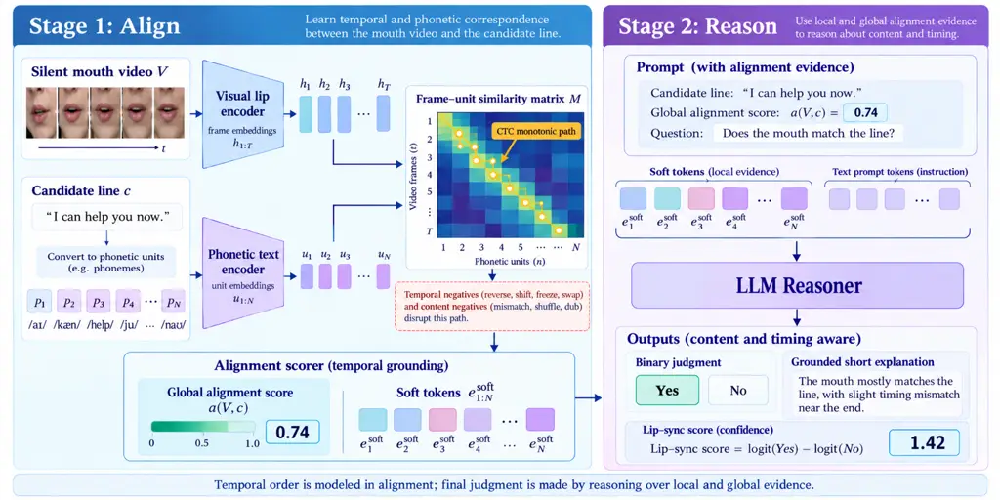

# Align Then Reason: A Multimodal Lip-Sync Judge for Dubbing

Rui Liu ^(†)^(†)thanks: Work done during an internship at Netflix.
Affiliation: University of Maryland, College Park    Bhavin Jawade
Affiliation: Netflix    Haoqi Li Affiliation: Netflix    Shivam Mehta
Affiliation: Netflix    Karan Saxena Affiliation: Netflix    Yinghong
Lan Affiliation: Netflix    Cameron R. Wolfe Affiliation: Netflix

###### Abstract

Dubbing quality control requires a reference-free judge that can
determine whether a candidate text line matches a speaker’s visible
articulation in both content and timing, using only silent video and
text because dubbed audio may not yet exist. Existing visual speech
recognizers and video-language models are poorly suited to this setting:
even when fine-tuned to recover spoken content from lip motion, they
remain largely insensitive to temporal errors. We introduce Align Then
Reason (atr), a multilingual lip-sync judge that first establishes a
monotonic alignment between frame-level lip representations and the
phonetic units of the candidate line, then reasons over this alignment
to make the final judgment. An alignment scorer provides the LLM with
both local evidence for each phonetic unit and a calibrated global
alignment score, enabling it to reason jointly about content and timing.
On a seven-language benchmark, our method improves mean AUC over the
corresponding Qwen3.5 SFT baselines by $`59.4\%`$, $`50.2\%`$, and
$`50.8\%`$ with 2B, 4B, and 9B reasoners, respectively. The gains
generalize across LLM families, reaching mean AUC improvements of
$`45.9\%`$ and $`46.6\%`$ over the best baseline for LLaMA-3.1-8B and
Mistral-7B, respectively. They also transfer across datasets to three
unseen MuAViC languages. Furthermore, we evaluate on two downstream
tasks built from real dubbing lines. On dub-line reranking, atr-9B
outperforms the best lip-reading baseline by $`52.0\%`$, while on
script-to-clip assignment, atr-9B improves over the best lip-reading
baseline by $`17.7\%`$.

|     |
| --- |
|     |

## 1 Introduction

Dubbing (Federico et al., 2020; Brannon et al., 2023; Chaume, 2020)
increasingly relies on generative systems to translate, rewrite, and
synthesize speech at scale. Yet producing a linguistically plausible
translated line is not sufficient: the line must also agree with the
visible articulation of the speaker. A poor dub may preserve the
intended meaning but begin too early, lag behind the mouth, or contain
phonetic content that is incompatible with the observed lip motion.
Detecting such failures manually is costly and difficult to scale,
motivating a lip-sync judge that can score candidate lines before speech
synthesis.

This setting is more constrained than conventional audio-visual
synchronization (Korbar et al., 2018; Iashin et al., 2024; Javed et al.,
2025). At review time, the candidate dubbed audio may not yet exist, so
the judge needs to operate from only a silent video $`V`$ and a
candidate text line $`c`$. A useful judge must therefore answer a
cross-modal question: _does this candidate text agree with what the
mouth appears to be saying, and does that agreement unfold in the
correct temporal order?_ This requires sensitivity to two complementary
failure modes, including content and temporal. Content errors occur when
the candidate line is incompatible with the visible articulation,
whereas temporal errors occur when otherwise compatible speech is
misaligned or presented in an incorrect temporal order. The judge should
additionally generalize across languages, as for dubbing, we may need to
translate to many different languages.

However, achieving such a lip-sync judge is challenging. Previous visual
speech recognition models (Shi et al., 2022; Ma et al., 2023; Yeo et
al., 2024; Cappellazzo et al., 2025) are designed to infer a transcript
from visual speech rather than score an arbitrary candidate line against
a video. Audio-visual synchronization models (Chung and Zisserman, 2016;
Javed et al., 2025) explicitly measure temporal correspondence between
mouth motion and speech, but require an audio stream and do not
condition on candidate text. Large video-language models (Bai et al., 2025) can in principle condition jointly on video and text, but temporal
reasoning is not guaranteed by multimodal pretraining alone (Liu et al.,
2024; Li et al., 2025a; Qi et al., 2025). Prior analyses have shown that
strong performance on common video-language benchmarks can often be
obtained with weak or even absent temporal modeling, revealing
substantial atemporal and single-frame biases (Buch et al., 2022; Lei et
al., 2023). These limitations are especially consequential for lip-sync
judgment, where the candidate text can remain identical while only the
ordering or timing of the mouth motion changes. Our experiments show
that this problem persists when existing models are employed as lip-sync
judges. When we hold the candidate text fixed and reverse, shift or
freeze the video frames, video-language models (e.g., Qwen3.5 (Bai et
al., 2025)) from 2B to 9B remain close to chance. These results indicate
that recognizing visual or linguistic content does not by itself provide
the fine-grained temporal correspondence required for lip-sync quality
control.



Figure 1: Overview of Align Then Reason (atr). _Stage 1 (Align):_ the
silent mouth video is encoded into frame embeddings $`\mathbf{h}_{1:T}`$
and the candidate line into phonetic-unit embeddings
$`\mathbf{u}_{1:N}`$. Their similarity $`M_{t,n}`$ is scored by CTC
whose labels are the _positions_ of the units in the line, so only a
monotonic path through $`M`$ (highlighted) scores well, and reordering,
shifting, or freezing the frames breaks it. Trained with content and
temporal negatives, the scorer emits a calibrated global score
$`a(V,c)`$ and per-unit soft tokens
$`\mathbf{e}^{\mathrm{soft}}_{1:N}`$. _Stage 2 (Reason):_ the soft
tokens are prepended to a prompt containing $`a(V,c)`$ and the line, and
an LLM answers whether the mouth matches the line; the difference of its
Yes and No logits is the lip-sync score.

To address these limitations, we propose Align Then Reason (ATR). We
first formulate lip-sync judgment as monotonic cross-modal alignment
between frame-level visual lip representations and phonetic
representations of the candidate line. Given a video and candidate text,
we convert the text into a sequence of phonetic units and construct a
frame-by-unit similarity matrix. A compatible pair should admit a strong
monotonic path through this matrix, whereas content substitutions and
temporal perturbations disrupt that path. We score this structure using
a candidate-dependent CTC (Graves et al., 2006) formulation and train
the alignment model with complementary content and temporal negatives.
Temporal order is therefore encoded directly in the scoring structure.
By representing text phonetically rather than with a language-specific
output vocabulary, the same alignment mechanism can also be generalized
across languages. A single alignment score, however, necessarily
compresses the evidence from the entire utterance. We therefore
introduce an LLM reasoner on top of the alignment scorer. For each
candidate line, the scorer provides two complementary forms of evidence:
per-phonetic-unit soft tokens that summarize local visual-phonetic
correspondence and a calibrated scalar that summarizes global whole-line
monotonic alignment. The soft tokens are supplied directly as continuous
embeddings before the ordinary text-token embeddings, while the
calibrated scalar is included in the textual prompt. The reasoner is
trained on genuine and incorrect candidate lines paired with the same
video and produces both a binary judgment and a short grounded
explanation. Its Yes and No logits difference is used as the final
lip-sync score.

We evaluate the proposed judge along complementary dimensions designed
to separate content discrimination, temporal sensitivity, multilingual
generalization, and downstream usefulness. Across a seven-language
benchmark, our method boosts mean AUC over corresponding Qwen3.5 SFT
baselines by $`59.4\%`$, $`50.2\%`$, and $`50.8\%`$ at the 2B, 4B, and
9B reasoner scales, respectively. These performance gains generalize
across different LLM families, outperforming the top baseline by
$`45.9\%`$ on LLaMA-3.1-8B (Grattafiori et al., 2024) and $`46.6\%`$ on
Mistral-7B (Jiang et al., 2023), while also successfully transferring to
three unseen MuAViC languages (Anwar et al., 2023). Finally, on two
downstream applications constructed from real dubbing lines, atr-9B
surpasses the strongest lip-reading baseline by $`52.0\%`$ on dub-line
reranking and $`17.7\%`$ on script-to-clip assignment. Together, these
results validate a effective judge: explicit monotonic alignment
provides strong temporal grounding, while the LLM reasoner improves
content discrimination and produces an interpretable final judgment. In
summary, our key contributions are as follows:

- •
  We identify and measure a structural gap between existing models and
  reference-free text–video lip-sync judgment: autoregressive
  visual-speech and video-language models are insensitive to temporal
  orders.
- •
  We propose a temporally grounded multilingual lip-sync judge that
  decouples temporal tracking from semantic evaluation. By coupling a
  candidate-conditioned CTC scorer to an LLM via per-unit soft tokens
  and a calibrated global score, we directly anchor LLM reasoning in
  fine-grained alignment dynamics.
- •
  Across seven languages, multiple LLM backbones, and unseen datasets,
  our approach improves mean AUC by up to $`59.4\%`$ over baselines and
  outperforms the top lip-reading models on downstream dubbing tasks by
  up to $`52.0\%`$.

## 2 Approach

### 2.1 Problem Formulation

We consider dubbing lip-sync quality evaluation from a silent video and
a candidate text line. Given a video $`V=\{v_{t}\}_{t=1}^{T}`$ and a
candidate line $`c`$, our goal is to estimate how well the content and
timing of $`c`$ agree with the observed mouth movements. No dubbed audio
and no reference transcript are available at inference time. Our
lip-sync judge operates in two stages (Figure 1). First, a cross-modal
monotonic alignment scorer learns to align visual lip motion with the
phonetic units of a candidate line and produces local and global
alignment evidence. Second, an LLM reasoner consumes the candidate text
together with this alignment evidence and predicts whether the mouth
movements match the line.

### 2.2 Cross-Modal Monotonic Alignment

Lip-sync quality requires both content agreement and temporal
consistency: the observed articulations should correspond to the
phonetic content of the candidate line and occur in the same order. We
therefore formulate the first stage as monotonic alignment between video
frames and candidate-dependent phonetic units. Given $`V`$ and $`c`$, a
visual lip encoder produces frame-level embeddings $`\mathbf{h}_{1:T}`$,
with $`\mathbf{h}_{t}\in\mathbb{R}^{d}`$, while a phonetic text encoder
converts $`c`$ into a sequence of $`N`$ phonetic units and produces
embeddings $`\mathbf{u}_{1:N}`$, with
$`\mathbf{u}_{n}\in\mathbb{R}^{d}`$. Their frame-to-unit compatibility
is measured by cosine similarity,
$`M_{t,n}=\mathbf{h}_{t}^{\top}\mathbf{u}_{n}/(\|\mathbf{h}_{t}\|\|\mathbf{u}_{n}\|)`$.

#### Monotonic alignment scorer.

Some frames carry no speech (pauses, closed mouth, transitions), so we
add a blank state with a learned scalar logit $`b`$. The emission logits
are $`E_{t,0}=b`$ for the blank and $`E_{t,n}=M_{t,n}`$ for
$`n=1,\ldots,N`$. A softmax over $`k=0,\ldots,N`$ yields the frame-level
emission probabilities $`p_{t,k}`$, the probability that frame $`t`$
corresponds to text unit $`k`$.

We use Connectionist Temporal Classification (CTC) (Graves et al., 2006)
to enforce monotonicity. Unlike conventional CTC, whose labels
correspond to entries in a fixed character or phoneme vocabulary, our
alignment labels are positions within the current candidate line: label
$`n`$ denotes the $`n`$-th phonetic unit of $`c`$. The target sequence
is therefore $`\mathbf{y}_{c}=(1,2,\ldots,N)`$. We define the alignment
score as the length-normalized CTC log-likelihood

```math
s_{\mathrm{align}}(V,c)=\frac{1}{N}\log\sum_{\bm{\pi}\in\mathcal{B}^{-1}(\mathbf{y}_{c})}\prod_{t=1}^{T}p_{t,\pi_{t}}, \tag{1}
```

where $`\bm{\pi}`$ is a frame-level CTC path and $`\mathcal{B}`$ is the
standard CTC collapse operator. This construction allows a phonetic unit
to span multiple consecutive frames and permits blank frames between
units, while requiring the candidate units to appear in their original
order. Consequently, the score reflects both phonetic compatibility and
temporal progression.

#### Contrastive alignment training.

We train the two encoders such that a genuine video-text pair receives a
higher alignment score than corrupted alternatives. For a genuine pair,
let $`s^{+}=s_{\mathrm{align}}(V,c^{+})`$, and let $`s_{x}^{-}`$ denote
the score of a negative example of type $`x`$. We use the smooth margin
loss $`h(\Delta)=\log(1+\exp(1-\Delta))`$, where
$`\Delta=s^{+}-s_{x}^{-}`$. Two families of negatives target the two
failure modes. _Content negatives_
$`\mathcal{C}=\{\texttt{mismatch},\texttt{shuffle},\texttt{dub}\}`$ keep
the video and change the text: another clip’s line of similar length,
the true line with its words permuted. The dub translation serves as a
natural content negative. These negatives encourage sensitivity to
linguistic correspondence. _Temporal negatives_
$`\mathcal{R}=\{\texttt{reverse},\texttt{shift},\texttt{freeze},\texttt{swap}\}`$
keep the text and corrupt the video: reversing the frames, circularly
shifting them, holding one frame for a span, or exchanging the halves,
encouraging the model to distinguish correct temporal alignment from
visually similar but temporally inconsistent sequences. The
alignment-training objective is

```math
\displaystyle\mathcal{L}_{\mathrm{align}}={} \displaystyle\frac{1}{|\mathcal{C}|}\sum_{x\in\mathcal{C}}\mathbb{E}\!\left[h\!\left(s^{+}-s_{x}^{-}\right)\right]+\frac{1}{|\mathcal{R}|}\sum_{x\in\mathcal{R}}\mathbb{E}\!\left[h\!\left(s^{+}-s_{x}^{-}\right)\right]+\mathcal{L}_{\mathrm{aux}}, \tag{2}
```

#### Auxiliary phonetic supervision.

The contrastive objective constrains pairwise alignment scores but does
not directly require the visual embeddings to preserve fine-grained
phonetic information. We therefore attach a phoneme-recognition head to
the same frame embeddings: a linear map $`A`$ produces logits over a
global phoneme vocabulary plus blank, and given the phoneme sequence
$`\mathbf{z}`$ of the true transcript, the auxiliary loss is standard
CTC,
$`\mathcal{L}_{\mathrm{aux}}=-\log\sum_{\bm{\pi}\in\mathcal{B}^{-1}(\mathbf{z})}\prod_{t=1}^{T}\operatorname{softmax}(A\mathbf{h}_{t})_{\pi_{t}}`$.
The phoneme targets come from the true transcript and are used only
during training, so, as in auxiliary modality learning (Liu et al.,
2025a; Liu et al., 2026c), they shape the visual representation without
being needed at inference.

### 2.3 LLM Reasoner

The alignment score is a strong structured signal, but it reduces the
whole line to a single number. This makes it hard to tell why a line
fails or to distinguish the correct line from another well-aligned but
incorrect one. We therefore use a language model that takes the
candidate text together with two views of the scorer’s evidence:
per-unit representations that preserve local alignment information and a
calibrated global score for the whole clip.

#### Local evidence: soft tokens.

For each candidate unit $`n`$ we summarize the frames that best match
it. From the similarity matrix $`M`$ we compute frame-normalized
attention weights
$`\alpha_{t,n}=\exp(M_{t,n})/\sum_{t^{\prime}}\exp(M_{t^{\prime},n})`$,
the visual summary
$`\bar{\mathbf{h}}_{n}=\sum_{t}\alpha_{t,n}\mathbf{h}_{t}`$, and the
strongest local match $`\rho_{n}=\max_{t}M_{t,n}`$. The evidence for
unit $`n`$ is
$`\mathbf{x}_{n}=[\mathbf{u}_{n}\mid\bar{\mathbf{h}}_{n}\mid\rho_{n}]\in\mathbb{R}^{2d+1}`$,
where $`\mathbf{u}_{n}`$ says which sound is being tested,
$`\bar{\mathbf{h}}_{n}`$ summarizes the mouth frames aligned to it, and
$`\rho_{n}`$ says how well its best frame matches. A trainable
projection with layer normalization maps each $`\mathbf{x}_{n}`$ to the
language model’s hidden size,
$`\mathbf{e}^{\mathrm{soft}}_{n}=\operatorname{LN}(P\mathbf{x}_{n}+\mathbf{b}_{P})\in\mathbb{R}^{d_{\mathrm{LM}}}`$.
We call these _soft tokens_: they occupy token positions but are vectors
produced by the scorer, not vocabulary entries. They are concatenated in
front of the prompt’s token embeddings,
$`\mathbf{E}_{\mathrm{in}}=[\mathbf{e}^{\mathrm{soft}}_{1:N},E_{\mathrm{LM}}(\omega_{1:M})]`$,
and processed as one sequence.

#### Global evidence: calibrated scalar.

The soft tokens carry local matches; $`s_{\mathrm{align}}(V,c)`$ carries
the globally normalized monotonic fit of the whole line. To put it on a
stable scale we estimate its mean $`\mu_{s}`$ and standard deviation
$`\sigma_{s}`$ over genuine pairs in a held-out calibration split and
define the calibrated scalar
$`a(V,c)=\operatorname{sigmoid}\big((s_{\mathrm{align}}(V,c)-\mu_{s})/\sigma_{s}\big)`$,
which is written into the prompt as a two-decimal number (template in
Appendix B).

#### Reasoner training.

Training examples are grouped by video so that each genuine line is
contrasted with wrong lines for the _same_ mouth sequence: for each
training video $`V_{i}`$ we form the positive $`(V_{i},c_{i}^{+})`$ and
$`K`$ content negatives $`\{(V_{i},c_{i,j}^{-})\}_{j=1}^{K}`$. The
positive is supervised with Yes and each negative with No, followed by a
short explanation naming the part of the line (early, middle, or late)
that contains the weakest unit $`n^{*}=\arg\min_{n}\rho_{n}`$, or
stating that the match is consistent throughout. Let $`e^{+}`$ and
$`\{e_{j}^{-}\}`$ be the reasoner inputs of the group. Teacher-forced
language-model cross-entropy $`\mathcal{L}_{\mathrm{LM}}(e)`$ supervises
both the binary Yes/No decision and the corresponding grounded
explanation with the following loss:
$`\mathcal{L}_{\mathrm{reasoner}}=\frac{1}{1+K}\sum_{e\in\{e^{+},e_{1}^{-},\ldots,e_{K}^{-}\}}\mathcal{L}_{\mathrm{LM}}(e).`$

#### Final score.

At inference time, the complete lip-sync judge applies the two trained
components sequentially to an input pair $`(V,c)`$. The frozen alignment
scorer first computes the candidate-specific soft tokens
$`\{\mathbf{e}^{\mathrm{soft}}_{n}\}_{n=1}^{N}`$ and the calibrated
global alignment score $`a(V,c)`$. These signals are combined with the
candidate-text prompt and passed to the LLM reasoner. The final lip-sync
score is the logit difference between the Yes and No answer tokens:
$`s_{\mathrm{judge}}(V,c)=\ell_{\mathrm{Y}}(V,c)-\ell_{\mathrm{N}}(V,c)=\log\frac{P(\mathrm{Yes}\mid V,c)}{P(\mathrm{No}\mid V,c)}.`$
A larger $`s_{\mathrm{judge}}(V,c)`$ indicates stronger agreement
between the candidate line and the observed mouth movements.

## 3 Experiments

### 3.1 Experimental Setup

#### Data construction.

We construct a dataset from on-screen dialogue segments, where each
sample consists of a talking-face video, a source-language transcript,
and a dub line. The dataset contains approximately 50K multilingual
training samples and 2,100 test samples. The test benchmark is balanced
across seven languages including English, Spanish, French, Japanese,
Korean, Brazilian Portuguese, and Turkish.

For each sample, we construct two content negatives: mismatch (a
length-matched source line from another sample in the same language), a
word-order shuffle. The dub translation serves as a natural content
negative. We also generate four temporal negatives by reversing,
circularly shifting, freezing, or swapping halves of the visual frames
while keeping the text fixed. We use Auto-AVSR (Ma et al., 2023) as the
visual encoder and XPhoneBERT (Nguyen et al., 2023) as the text encoder.
Additional architectural and training details are provided in
Appendix A.

#### Baselines and evaluation.

We compare against a broad set of baselines spanning visual speech
recognition and vision-language models. For visual speech recognition,
we employ several models as judges: Auto-AVSR (Ma et al., 2023) scores
each candidate using its CTC log-likelihood, while the autoregressive
models AV-HuBERT (Shi et al., 2022), LLaMA-AVSR (Cappellazzo et al.,
2025), and VSP-LLM (Yeo et al., 2024) use the candidate’s conditional
log-likelihood under the decoder. We also evaluate Qwen3.5
vision-language models at 2B, 4B, and 9B scales (Bai et al., 2025), both
zero-shot and after SFT to predict the spoken line from the video. To
test whether our method generalizes across reasoners, we further
evaluate atr with different LLM backbones, including Qwen3.5,
LLaMA-3.1-8B (Grattafiori et al., 2024), and Mistral-7B (Jiang et al.,
2023).

Our primary evaluation metric is pooled AUC for each corruption axis.
Genuine video-text pairs are treated as positives and their corrupted
counterparts as negatives; AUC measures how well the model separates
genuine from corrupted pairs across the full test set. We additionally
report paired accuracy, which measures whether each genuine pair scores
higher than its corresponding corruption.

### 3.2 Main Results

We evaluate performance on the seven-language benchmark across seven
distinct corruption types, categorized into content corruptions
(mismatch, shuffle, dub) and temporal corruptions (reverse, shift,
freeze, swap), as defined in Section 3.1. Performance is measured by
pooled AUC (higher is better). In the absence of reference answers, AUC
quantifies whether the judge correctly assigns a higher alignment score
to genuine positive pairs than to corrupted negative pairs.

As shown in Table 1, existing baselines exhibit a pronounced performance
gap compared to atr across both content and temporal axes. Among the
baseline models, Qwen3.5 benefits substantially SFT on content
corruptions: scaling from 2B to 9B parameters improves its AUC on
mismatch, shuffle, and dub to $`0.730`$, $`0.737`$, and $`0.743`$,
respectively. However, its performance on temporal corruptions remains
near chance level, with AUCs across all four temporal axes hovering
between $`0.510`$ and $`0.520`$. Autoregressive speech recognizers
suffer from a similar temporal blind spot. While Auto-AVSR captures some
temporal signal ($`0.582`$–$`0.670`$ AUC), it still falls far short of
atr. In English-only evaluations (Table 7, Appendix C), Auto-AVSR
achieves competitive mismatch performance, but atr-9B substantially
outperforms it and all other baselines across the remaining six
evaluation axes.

|                    |          |         |       |          |       |        |       |       |
| ------------------ | -------- | ------- | ----- | -------- | ----- | ------ | ----- | ----- |
|                    | Content  |         |       | Temporal |       |        |       |       |
| Method             | Mismatch | Shuffle | Dub   | Reverse  | Shift | Freeze | Swap  | Mean  |
| Auto-AVSR          | 0.602    | 0.599   | 0.507 | 0.670    | 0.582 | 0.609  | 0.620 | 0.598 |
| AV-HuBERT          | 0.500    | 0.578   | 0.520 | 0.513    | 0.506 | 0.501  | 0.508 | 0.518 |
| LLaMA-AVSR         | 0.472    | 0.793   | 0.484 | 0.531    | 0.513 | 0.500  | 0.521 | 0.545 |
| VSP-LLM            | 0.481    | 0.764   | 0.508 | 0.524    | 0.507 | 0.511  | 0.517 | 0.545 |
| Qwen3.5-2B Base    | 0.515    | 0.448   | 0.570 | 0.503    | 0.499 | 0.503  | 0.501 | 0.506 |
| Qwen3.5-4B Base    | 0.527    | 0.477   | 0.586 | 0.500    | 0.498 | 0.500  | 0.501 | 0.513 |
| Qwen3.5-9B Base    | 0.537    | 0.479   | 0.605 | 0.502    | 0.500 | 0.503  | 0.502 | 0.518 |
| Qwen3.5-2B SFT     | 0.632    | 0.604   | 0.685 | 0.502    | 0.501 | 0.502  | 0.503 | 0.561 |
| Qwen3.5-4B SFT     | 0.696    | 0.739   | 0.750 | 0.510    | 0.505 | 0.505  | 0.510 | 0.602 |
| Qwen3.5-9B SFT     | 0.730    | 0.737   | 0.743 | 0.520    | 0.513 | 0.510  | 0.519 | 0.610 |
| atr (Qwen3.5-2B)   | 0.782    | 0.967   | 0.821 | 0.945    | 0.909 | 0.905  | 0.932 | 0.894 |
| atr (Qwen3.5-4B)   | 0.784    | 0.960   | 0.841 | 0.955    | 0.926 | 0.916  | 0.944 | 0.904 |
| atr (Qwen3.5-9B)   | 0.786    | 0.974   | 0.862 | 0.964    | 0.931 | 0.970  | 0.952 | 0.920 |
| atr (LLaMA-3.1-8B) | 0.771    | 0.976   | 0.812 | 0.924    | 0.900 | 0.931  | 0.918 | 0.890 |
| atr (Mistral-7B)   | 0.767    | 0.969   | 0.836 | 0.956    | 0.914 | 0.872  | 0.945 | 0.894 |

Table 1: Performance on the seven-language benchmark measured by pooled
AUC ($`\uparrow`$). Existing speech recognition and vision-language
baselines struggle on temporal corruptions, staying near chance
($`0.50`$). In contrast, atr achieves balanced, high accuracy across all
seven evaluation axes and multiple LLM backbones, reaching a mean AUC of
$`0.920`$ with Qwen3.5-9B, a $`50.8\%`$ relative improvement over the
best baseline ($`0.610`$).

In contrast, atr demonstrates consistently strong discrimination across
all seven axes and across diverse LLM backbones. When paired with
Qwen3.5-9B, atr achieves $`0.786`$, $`0.974`$, and $`0.862`$ AUC on the
three content corruptions, and $`0.964`$, $`0.931`$, $`0.970`$, and
$`0.952`$ AUC on the four temporal corruptions, yielding a leading
overall mean AUC of $`0.920`$. Compared to the strongest baseline mean
($`0.610`$), this represents a $`50.8\%`$ relative improvement
($`+0.310`$ absolute AUC). These performance gains are robust across
different LLM backbones: atr maintains mean AUCs between $`0.890`$ and
$`0.920`$ across Qwen3.5, LLaMA-3.1-8B, and Mistral-7B. Multi-seed
experiments (Appendix D) further confirm the statistical stability of
these gains.

|                    |          |         |       |          |       |        |       |       |
| ------------------ | -------- | ------- | ----- | -------- | ----- | ------ | ----- | ----- |
|                    | Content  |         |       | Temporal |       |        |       |       |
| Method             | Mismatch | Shuffle | Dub   | Reverse  | Shift | Freeze | Swap  | Mean  |
| Auto-AVSR          | 0.624    | 0.751   | 0.509 | 0.956    | 0.892 | 0.710  | 0.897 | 0.763 |
| AV-HuBERT          | 0.496    | 0.639   | 0.519 | 0.524    | 0.541 | 0.514  | 0.519 | 0.536 |
| LLaMA-AVSR         | 0.471    | 0.874   | 0.496 | 0.607    | 0.596 | 0.463  | 0.612 | 0.588 |
| VSP-LLM            | 0.480    | 0.900   | 0.534 | 0.597    | 0.534 | 0.518  | 0.585 | 0.593 |
| Qwen3.5-9B Base    | 0.553    | 0.456   | 0.595 | 0.522    | 0.499 | 0.552  | 0.499 | 0.525 |
| Qwen3.5-9B SFT     | 0.752    | 0.799   | 0.780 | 0.601    | 0.595 | 0.565  | 0.623 | 0.674 |
| Claude Opus 5      | 0.588    | 0.990   | 0.676 | 0.485    | 0.731 | 0.946  | 0.740 | 0.737 |
| Gemini 3.1 Pro     | 0.561    | 0.973   | 0.681 | 0.580    | 0.598 | 0.690  | 0.749 | 0.690 |
| GPT-5.6-terra      | 0.654    | 0.900   | 0.592 | 0.540    | 0.603 | 0.695  | 0.716 | 0.671 |
| GPT-5.6-luna       | 0.481    | 0.880   | 0.578 | 0.540    | 0.728 | 0.724  | 0.662 | 0.656 |
| GPT-5.6-sol        | 0.613    | 0.931   | 0.632 | 0.616    | 0.739 | 0.852  | 0.694 | 0.725 |
| atr (Qwen3.5-2B)   | 0.778    | 0.973   | 0.827 | 0.977    | 0.980 | 0.917  | 0.978 | 0.919 |
| atr (Qwen3.5-4B)   | 0.768    | 0.971   | 0.847 | 0.980    | 0.984 | 0.929  | 0.984 | 0.923 |
| atr (Qwen3.5-9B)   | 0.781    | 0.978   | 0.864 | 0.989    | 0.988 | 0.987  | 0.986 | 0.939 |
| atr (LLaMA-3.1-8B) | 0.771    | 0.983   | 0.812 | 0.965    | 0.969 | 0.946  | 0.965 | 0.916 |
| atr (Mistral-7B)   | 0.777    | 0.980   | 0.840 | 0.995    | 0.994 | 0.905  | 0.994 | 0.926 |

Table 2: Paired accuracy ($`\uparrow`$) on the seven-language benchmark.
Baseline speech recognizers and frontier models degrade significantly
under temporal corruptions, demonstrating insensitivity to fine-grained
timing. atr consistently achieves superior accuracy across all content
and temporal axes regardless of the underlying LLM backbone.

To complement the pooled AUC metric, Table 2 reports paired accuracy
across the seven-language macro-average. We additionally evaluate
state-of-the-art frontier models, including Claude Opus 5 (Anthropic,
2026), Gemini 3.1 Pro (Google DeepMind, 2026), and GPT-5.6 variants
(OpenAI, 2026). While frontier models demonstrate strong capabilities on
coarse content corruptions (e.g., reaching up to $`0.990`$ accuracy on
shuffle), their performance drops sharply on temporal corruptions,
averaging between $`0.656`$ and $`0.737`$ overall. In contrast, atr
maintains paired accuracies exceeding $`0.916`$ across all model
variants, highlighting its superior temporal sensitivity.

### 3.3 Generalization Testing

#### Generalization across datasets and languages.

To test cross-dataset and cross-lingual generalization, we evaluate on
the MuAViC dataset (Anwar et al., 2023) across German, Arabic, and
Russian, three languages absent from our training set. The evaluation
protocol incorporates the same corruption suite, excluding dub as MuAViC
lacks dubbing tracks. Table 3 summarizes the results. Auto-AVSR fails on
content corruptions for Arabic and Russian ($`0.546`$–$`0.552`$ AUC).
Meanwhile, the Qwen3.5-9B Base model remains near chance
($`0.501`$–$`0.502`$ AUC) across all temporal corruptions. Without
retraining on MuAViC, atr-9B outperforms Qwen3.5-9B Base by $`+0.237`$
mean AUC ($`+46.1\%`$ improvement). As described in Section 2, the
reasoner ingests a score derived from globally normalized monotonic
alignment, calibrated on genuine pairs. When evaluating out-of-domain
data, domain shifts in raw scalar distributions can cause genuine pairs
to fall outside the expected decision bounds. To address this without
model fine-tuning, we refit only two scalar normalization parameters
($`\mu_{s}`$ and $`\sigma_{s}`$) on a held-out set of 300
target-language genuine samples, requiring no parameter updates. This
recalibration restores sensitivity across all temporal axes, notably
raising freeze performance from $`0.572`$ to $`0.937`$ AUC. Overall,
recalibrated atr-9B reaches a mean AUC of $`0.875`$, representing a
$`+0.361`$ absolute gain ($`+70.2\%`$ improvement) over the Qwen3.5-9B
Base model and a $`+0.297`$ absolute gain ($`+51.4\%`$ improvement) over
Auto-AVSR.

| Method                | Mismatch | Shuffle | Reverse | Shift | Freeze | Swap  | Mean  |
| --------------------- | -------- | ------- | ------- | ----- | ------ | ----- | ----- |
| Auto-AVSR             | 0.546    | 0.552   | 0.635   | 0.555 | 0.601  | 0.580 | 0.578 |
| Qwen3.5-9B Base       | 0.580    | 0.498   | 0.501   | 0.501 | 0.502  | 0.501 | 0.514 |
| atr-9B                | 0.661    | 0.930   | 0.790   | 0.763 | 0.572  | 0.787 | 0.751 |
| atr-9B (recalibrated) | 0.707    | 0.946   | 0.927   | 0.827 | 0.937  | 0.905 | 0.875 |

Table 3: Generalization on MuAViC across three unseen languages (German,
Arabic, and Russian). No model weights are updated. Out-of-the-box
atr-9B achieves $`0.751`$ mean AUC. Adjusting the two normalization
constants ($`\mu_{s},\sigma_{s}`$) for recalibration lifts the mean AUC
to $`0.875`$, outperforming Auto-AVSR by $`+51.4\%`$ relatively.

#### Generalization across LLM backbones.

To evaluate flexibility across underlying architectures, we benchmark
atr across diverse open-source LLMs. Beyond the Qwen3.5 family, atr
transfers effectively to LLaMA-3.1-8B ($`0.890`$ mean AUC, $`0.916`$
paired accuracy) and Mistral-7B ($`0.894`$ mean AUC, $`0.926`$ paired
accuracy), as shown in Tables 1 and 2. These consistent gains
demonstrate that the proposed reasoning framework generalizes robustly
across different LLM architectures.

### 3.4 Ablation Studies

In this section, we conduct ablation studies to evaluate the individual
contributions of our core design choices, including auxiliary phonetic
supervision, the LLM reasoner, soft tokens, and the calibrated scalar.
The results are summarized in Table 4.

#### Effects of auxiliary phonetic supervision.

The contrastive alignment objective constrains relative pair scores but
does not explicitly require the visual representation to preserve
fine-grained phonetic information. Auxiliary phonetic supervision
provides this additional constraint by encouraging the lip features to
retain distinctions between speech sounds. Removing it reduces the mean
AUC from $`0.920`$ to $`0.898`$, with the largest degradation on the
content axes, confirming that phonetic supervision primarily strengthens
content discrimination.

#### Effects of the LLM reasoner.

While the alignment scorer alone effectively captures temporal
alignment, it struggles significantly with content comprehension.
Introducing the LLM reasoner substantially improves performance on the
content-oriented metrics while preserving the model’s strong temporal
reasoning capabilities.

#### Effects of soft tokens.

Removing the soft tokens lowers mean AUC from $`0.920`$ to $`0.872`$,
particularly on content mismatches. The soft tokens provide local
alignment evidence for individual phonetic units, complementing the
global scalar that summarizes the overall monotonic fit. Together, the
two signals provide the reasoner with both local evidence about _which_
units match and global evidence about _how well_ the full sequence
aligns.

#### Effects of the calibrated scalar.

Removing the calibrated global score causes the largest degradation,
reducing mean AUC from $`0.920`$ to $`0.672`$ and sharply weakening
temporal discrimination. This follows from the model design: the
video-dependent components of each soft token pool over frames and
therefore do not explicitly preserve temporal order. In contrast, the
global alignment score is computed from the monotonic alignment path and
directly captures sequence order. Removing this signal therefore drives
performance on reverse, shift, and swap close to chance. Freeze remains
more detectable because it changes the frame content itself rather than
only reordering frames.

|                             |          |         |       |          |       |        |       |       |
| --------------------------- | -------- | ------- | ----- | -------- | ----- | ------ | ----- | ----- |
|                             | Content  |         |       | Temporal |       |        |       |       |
| Method                      | Mismatch | Shuffle | Dub   | Reverse  | Shift | Freeze | Swap  | Mean  |
| atr-9B                      | 0.786    | 0.974   | 0.862 | 0.964    | 0.931 | 0.970  | 0.952 | 0.920 |
|    w/o phonetic supervision | 0.751    | 0.944   | 0.793 | 0.961    | 0.921 | 0.965  | 0.949 | 0.898 |
|    w/o LLM reasoner         | 0.695    | 0.757   | 0.701 | 0.970    | 0.935 | 0.971  | 0.962 | 0.856 |
|    w/o soft tokens          | 0.683    | 0.932   | 0.748 | 0.953    | 0.905 | 0.942  | 0.940 | 0.872 |
|    w/o calibrated scalar    | 0.671    | 0.927   | 0.724 | 0.525    | 0.534 | 0.805  | 0.517 | 0.672 |

Table 4: Ablations on core components of atr (Macro AUC $`\uparrow`$).
Phonetic supervision and the LLM reasoner are critical for content
understanding, while soft tokens provide local alignment evidence. The
calibrated scalar is essential for temporal sensitivity; removing it
causes the largest degradation (reducing mean AUC to 0.672). The full
model achieves the best overall performance.

### 3.5 Downstream Evaluation

We further evaluate whether the learned alignment signal transfers
beyond synthetic corruptions to two downstream dubbing tasks built from
real candidate lines: _dub-line reranking_ and _script-to-clip
assignment_. The first tests whether the model can distinguish subtle
phonetic differences among semantically equivalent lines, while the
second tests whether it can recover the correct correspondence between
real script lines and video clips.

| Method                 | Top-1$`\uparrow`$ | MRR$`\uparrow`$ |
| ---------------------- | ----------------- | --------------- |
| Chance                 | 0.250             | 0.521           |
| Isochrony (length fit) | 0.237             | 0.494           |
| Auto-AVSR              | 0.315             | 0.558           |
| AV-HuBERT              | 0.244             | 0.510           |
| LLaMA-AVSR             | 0.316             | 0.575           |
| VSP-LLM                | 0.309             | 0.572           |
| atr-9B                 | 0.479             | 0.684           |

Table 5: Dub-line reranking. Each clip is paired with its professional
dub line and three meaning-preserving, length-matched paraphrases; the
model must rank the professional line first. The alignment scorer
achieves $`0.479`$ Top-1 accuracy, outperforming the strongest
lip-reading baseline ($`0.316`$) by $`52\%`$ relative. MRR denotes mean
reciprocal rank.

#### Dub-line reranking.

For each of the 2100 test samples, we pair the professional dub line
with three LLM-generated paraphrases that preserve its meaning and
remain within $`\pm 15\%`$ of its length. The model scores all four
candidates and must rank the professional line first, making chance
Top-1 accuracy $`0.250`$. This is the selection step of a pipeline that
samples several candidate lines, with the judge acting as a verifier,
analogous to test-time scaling for LLMs, which samples multiple
candidates and decides how to allocate and aggregate them (Zheng et al.,
2026a; Dai et al., 2026b; Zheng et al., 2026b). As shown in Table 5, the
atr-9B achieves $`0.479`$ Top-1 accuracy, compared with $`0.316`$ for
the strongest lip-reading baseline, a $`52\%`$ relative improvement.

#### Script-to-clip assignment.

We next evaluate whether the judge can recover which real script line
belongs to which shot. For the in-domain evaluation, we construct
five-way assignment problems by sampling five clips from the same title
and language and shuffling their five professional dub lines. The judge
scores all $`25`$ clip–line pairs, after which we solve a maximum-weight
one-to-one matching so that each line is assigned exactly once. We
report both per-clip accuracy and Exact Block accuracy, which requires
all five assignments in a block to be correct; chance performance is
$`0.200`$ and $`0.008`$, respectively. As shown in Table 6, atr-9B
achieves $`0.746`$ per-clip accuracy and $`0.522`$ Exact Block accuracy,
outperforming Auto-AVSR by $`17.7\%`$ relative in per-clip accuracy and
by $`0.139`$ absolute in Exact Block accuracy. It also exceeds the
strong length-matching heuristic by $`0.090`$ absolute in per-clip
accuracy.

For MuAViC, the evaluation is naturally constructed from pairs of clips
and candidate lines, yielding a two-way assignment problem rather than
the five-way blocks used in-domain. Under one-to-one matching with two
items, assignments are either both correct or both swapped, making
per-clip and exact-block accuracy equivalent; we therefore report only
per-clip accuracy. atr (Qwen3.5-9B) achieves 0.704 compared with 0.598
for Auto-AVSR, an improvement of 17.7%. Unlike dub-line reranking, where
fine-grained phonetic alignment is most useful, script-to-clip
assignment benefits more from the full reasoner because candidate lines
differ substantially in content, allowing it to combine local alignment
evidence with global semantic consistency.

|                        | In-domain (5-way)    |                         | MuAViC (2-way)       |
| ---------------------- | -------------------- | ----------------------- | -------------------- |
| Method                 | Per-clip$`\uparrow`$ | Exact Block$`\uparrow`$ | Per-clip$`\uparrow`$ |
| Chance                 | 0.200                | 0.008                   | 0.500                |
| Isochrony (length fit) | 0.656                | 0.397                   | 0.500                |
| Auto-AVSR              | 0.634                | 0.383                   | 0.598                |
| AV-HuBERT              | 0.365                | 0.081                   | 0.548                |
| LLaMA-AVSR             | 0.396                | 0.134                   | 0.571                |
| VSP-LLM                | 0.354                | 0.096                   | 0.556                |
| atr-2B                 | 0.724                | 0.483                   | 0.683                |
| atr-9B                 | 0.746                | 0.522                   | 0.704                |

Table 6: Script-to-clip assignment. In-domain, we form five-clip blocks
from the same title and language and match their five shuffled
professional lines one-to-one; Per-clip measures individual assignments,
while Exact Block requires all five to be correct. atr-9B achieves
$`0.746`$ per-clip accuracy, improving over Auto-AVSR by $`17.7\%`$. On
MuAViC, where the available evaluation naturally forms two-way clip–line
pairs, atr reaches $`0.704`$ versus $`0.598`$ for Auto-AVSR.

## 4 Related Work

#### Dubbing.

Prior dubbing systems mainly enforce audiovisual coherence through
duration, prosody, and isochrony constraints (Federico et al., 2020; Tam
et al., 2022). These signals capture timing structure but not whether a
candidate line is phonetically compatible with the observed
articulation. In contrast, we score candidate text directly against
silent lip motion before audio synthesis, using multilingual phonetic
representations (Nguyen et al., 2023) to support a shared judge across
languages.

#### Visual speech recognition.

Visual speech recognition models recover text from lip motion through
audio–visual representation learning, large-scale transcription, or
LLM-based decoding (Shi et al., 2022; Ma et al., 2023; Yeo et al., 2024;
Cappellazzo et al., 2025). Lip-sync metrics based on SyncNet instead
align mouth motion with audio (Chung and Zisserman, 2016; Prajwal et
al., 2020), while visual forced alignment localizes a known transcript
in silent video (Kim et al., 2023). None directly addresses
reference-free scoring of an arbitrary candidate line from silent video:
recognizers optimize transcription, synchronization methods require
audio, and forced alignment assumes frame-level localization targets.
Our method instead learns candidate-conditioned visual–phonetic
alignment without alignment labels, using monotonic CTC to score both
content compatibility and temporal order.

#### LLMs as judges.

LLMs and vision-language models are increasingly used as learned
evaluators and reward models (Zheng et al., 2023; Liu et al., 2026e),
and non-textual evidence can be injected into a language model through
continuous prefix representations (Tsimpoukelli et al., 2021; Lester et
al., 2021). However, video-language models often exhibit weak temporal
reasoning (Buch et al., 2022; Lei et al., 2023; Liu et al., 2024; Li et
al., 2025a), and multimodal reasoning remains brittle when the visual
input is degraded or perceptually ambiguous (Liu et al., 2026f; Liu et
al., 2025b). We therefore do not rely on the LLM to infer temporal
correspondence directly from video. Instead, a monotonic alignment
scorer provides structured local evidence and a calibrated global score,
while the LLM performs higher-level content reasoning over these
signals. This separates temporal grounding from semantic judgment, in
the spirit of decoupling visual perception from language reasoning (Li
et al., 2025b), and makes the calibration of the scorer’s output part of
the interface between the two stages (Guo et al., 2017), much as
uncertainty-aware guidance weights a teacher signal by its calibrated
reliability under domain shift (Liu et al., 2026b).

## 5 Conclusions

We introduce Align Then Reason, a reference-free multilingual lip-sync
judge designed to evaluate whether candidate text matches a speaker’s
visual lip movements in both content and timing without requiring
reference audio. By coupling frame-level visual phonetic alignment with
LLM reasoning, our approach overcomes the temporal insensitivity in
video-language models and script limitations in standard visual speech
recognizers. Extensive evaluations across a seven-language benchmark
demonstrate significant performance gains across diverse model families,
achieving up to a 50.8% mean AUC improvement with a 9B reasoner,
alongside strong zero-shot generalization to unseen languages.
Crucially, its superior performance on downstream tasks, outperforming
top lip-reading baselines by 52.0% on dub-line reranking and 17.7% on
script-to-clip assignment, highlights the effectiveness of our approach.
Our reasoner is trained with supervised fine-tuning; reinforcement
learning, which has recently strengthened reasoning in LLMs and
multimodal models (Zheng et al., 2026d; Dai et al., 2026a; Liu et al.,
2026a; Liu et al., 2026d), is a natural next step for training the
judge. More broadly, systems that improve themselves without human
review depend on a reliable automatic evaluator (Zheng et al., 2026b;
Zheng et al., 2026c), and atr could serve as that signal for rewriting
dub lines.

## References

- Anthropic (2026) Anthropic Claude opus 5. External Links:
  [Link](https://www.anthropic.com/news/claude-opus-5) Cited by: §3.2.
- Anwar et al. (2023) M. Anwar, B. Shi, V. Goswami, W. Hsu, J. Pino,
  and C. Wang Muavic: a multilingual audio-visual corpus for robust
  speech recognition and robust speech-to-text translation. arXiv
  preprint arXiv:2303.00628. Cited by: §1, §3.3.
- Bai et al. (2025) S. Bai, Y. Cai, R. Chen, K. Chen, X. Chen, Z.
  Cheng, L. Deng, W. Ding, C. Gao, C. Ge, et al. Qwen3-VL technical
  report. arXiv preprint arXiv:2511.21631. Cited by: §1, §3.1.
- Brannon et al. (2023) W. Brannon, Y. Virkar, and B. Thompson Dubbing
  in practice: a large scale study of human localization with insights
  for automatic dubbing. Transactions of the Association for
  Computational Linguistics 11, pp. 419–435. Cited by: §1.
- Buch et al. (2022) S. Buch, C. Eyzaguirre, A. Gaidon, J. Wu, L.
  Fei-Fei, and J. C. Niebles Revisiting the “video” in video-language
  understanding. In 2022 IEEE/CVF Conference on Computer Vision and
  Pattern Recognition (CVPR), pp. 2907–2917. Cited by: §1, §4.
- Cappellazzo et al. (2025) U. Cappellazzo, M. Kim, H. Chen, P. Ma, S.
  Petridis, D. Falavigna, A. Brutti, and M. Pantic Large language models
  are strong audio-visual speech recognition learners. In ICASSP
  2025-2025 IEEE International Conference on Acoustics, Speech and
  Signal Processing (ICASSP), pp. 1–5. Cited by: §1, §3.1, §4.
- Chaume (2020) F. Chaume Audiovisual translation: dubbing. Routledge.
  Cited by: §1.
- Chung and Zisserman (2016) J. S. Chung and A. Zisserman Out of time:
  automated lip sync in the wild. In Asian conference on computer
  vision, pp. 251–263. Cited by: §1, §4.
- Dai et al. (2026a) R. Dai, L. Song, H. Liu, Z. Liang, D. Yu, H. Mi, Z.
  Tu, R. Liu, T. Zheng, H. Zhu, et al. Cde: curiosity-driven exploration
  for efficient reinforcement learning in large language models. In
  International Conference on Learning Representations, Vol. 2026,
  pp. 59123–59144. Cited by: §5.
- Dai et al. (2026b) R. Dai, T. Zheng, R. Liu, C. Huang, and H. Zhu
  Small rl controller, large language model: rl-guided adaptive sampling
  for test-time scaling. arXiv preprint arXiv:2606.03102. Cited by:
  §3.5.
- Federico et al. (2020) M. Federico, R. Enyedi, R. Barra-Chicote, R.
  Giri, U. Isik, A. Krishnaswamy, and H. Sawaf From speech-to-speech
  translation to automatic dubbing. In Proceedings of the 17th
  International Conference on Spoken Language Translation, Online,
  pp. 257–264. External Links:
  [Document](https://dx.doi.org/10.18653/v1/2020.iwslt-1.31) Cited by:
  §1, §4.
- Google DeepMind (2026) Google DeepMind Gemini 3.1 Pro: Model Card and
  Developer Guide. External Links:
  [Link](https://deepmind.google/technologies/gemini/) Cited by: §3.2.
- Grattafiori et al. (2024) A. Grattafiori, A. Dubey, A. Jauhri, A.
  Pandey, A. Kadian, A. Al-Dahle, A. Letman, A. Mathur, A. Schelten, A.
  Vaughan, et al. The llama 3 herd of models. arXiv preprint
  arXiv:2407.21783. Cited by: §1, §3.1.
- Graves et al. (2006) A. Graves, S. Fernández, F. Gomez, and J.
  Schmidhuber Connectionist temporal classification: labelling
  unsegmented sequence data with recurrent neural networks. In
  Proceedings of the 23rd international conference on Machine learning,
  pp. 369–376. Cited by: §1, §2.2.
- Guo et al. (2017) C. Guo, G. Pleiss, Y. Sun, and K. Q. Weinberger On
  calibration of modern neural networks. In Proceedings of the 34th
  International Conference on Machine Learning, Proceedings of Machine
  Learning Research, Vol. 70, pp. 1321–1330. Cited by: §4.
- Hu et al. (2022) E. J. Hu, Y. Shen, P. Wallis, Z. Allen-Zhu, Y. Li, S.
  Wang, L. Wang, and W. Chen LoRA: low-rank adaptation of large language
  models. In International Conference on Learning Representations, Cited
  by: Appendix A.
- Iashin et al. (2024) V. Iashin, W. Xie, E. Rahtu, and A. Zisserman
  Synchformer: efficient synchronization from sparse cues. In ICASSP
  2024-2024 IEEE International Conference on Acoustics, Speech and
  Signal Processing (ICASSP), pp. 5325–5329. Cited by: §1.
- Javed et al. (2025) M. Javed, Z. Zhang, F. H. Dahri, A. A. Laghari, M.
  Krajčík, and A. Almadhor Audio–visual synchronization and lip movement
  analysis for real-time deepfake detection. International Journal of
  Computational Intelligence Systems 18 (1), pp. 170. Cited by: §1, §1.
- Jiang et al. (2023) A. Q. Jiang, A. Sablayrolles, A. Mensch, C.
  Bamford, D. S. Chaplot, D. de las Casas, F. Bressand, G. Lengyel, G.
  Lample, L. Saulnier, et al. Mistral 7b. arXiv preprint
  arXiv:2310.06825. Cited by: §1, §3.1.
- Kim et al. (2023) M. Kim, C. W. Kim, and Y. M. Ro Deep visual forced
  alignment: learning to align transcription with talking face video. In
  Proceedings of the AAAI Conference on Artificial Intelligence, Cited
  by: §4.
- Korbar et al. (2018) B. Korbar, D. Tran, and L. Torresani Cooperative
  learning of audio and video models from self-supervised
  synchronization. Advances in Neural Information Processing Systems 31.
  Cited by: §1.
- Lei et al. (2023) J. Lei, T. Berg, and M. Bansal Revealing single
  frame bias for video-and-language learning. In Proceedings of the 61st
  Annual Meeting of the Association for Computational Linguistics
  (Volume 1: Long Papers), pp. 487–507. Cited by: §1, §4.
- Lester et al. (2021) B. Lester, R. Al-Rfou, and N. Constant The power
  of scale for parameter-efficient prompt tuning. In Proceedings of the
  2021 Conference on Empirical Methods in Natural Language Processing,
  Online and Punta Cana, Dominican Republic, pp. 3045–3059. External
  Links: [Document](https://dx.doi.org/10.18653/v1/2021.emnlp-main.243)
  Cited by: §4.
- Li et al. (2025a) L. Li, Y. Liu, L. Yao, P. Zhang, C. An, L. Wang, X.
  Sun, L. Kong, and Q. Liu Temporal reasoning transfer from text to
  video. In International Conference on Learning Representations, Cited
  by: §1, §4.
- Li et al. (2025b) Z. Li, W. Yu, C. Huang, Z. Liang, R. Liu, F. Liu, J.
  Che, D. Yu, J. Boyd-Graber, H. Mi, et al. Self-rewarding
  vision-language model via reasoning decomposition. arXiv preprint
  arXiv:2508.19652. Cited by: §4.
- Liu et al. (2026a) H. Liu, D. Yu, S. Lu, Y. Zhou, R. Liu, Z. Liang, H.
  Mi, C. Wei, and D. Yu Save the good prefix: precise error penalization
  via process-supervised rl to enhance llm reasoning. In Findings of the
  Association for Computational Linguistics: ACL 2026, pp. 35450–35477.
  Cited by: §5.
- Liu et al. (2026b) R. Liu, P. Gao, Y. Shen, M. Lin, and P. Tokekar
  Adaptive conformal guidance for learning under uncertainty. In
  International Conference on Learning Representations, Vol. 2026,
  pp. 6168–6192. Cited by: §4.
- Liu et al. (2026c) R. Liu, Y. Shen, P. Gao, P. Tokekar, and M. C. Lin
  Caml: collaborative auxiliary modality learning for multi-agent
  systems. Advances in Neural Information Processing Systems 38,
  pp. 144064–144087. Cited by: §2.2.
- Liu et al. (2025a) R. Liu, Z. Wang, P. Gao, Y. Shen, P. Tokekar,
  and M. Lin Mmcd: multi-modal collaborative decision-making for
  connected autonomy with knowledge distillation. In 2025 IEEE/RSJ
  International Conference on Intelligent Robots and Systems (IROS),
  pp. 5970–5977. Cited by: §2.2.
- Liu et al. (2026d) R. Liu, D. Yu, L. Ke, H. Liu, Y. Zhou, Z. Liang, H.
  Mi, P. Tokekar, and D. Yu Stable and efficient single-rollout rl for
  multimodal reasoning. In Proceedings of the IEEE/CVF Conference on
  Computer Vision and Pattern Recognition, pp. 12009–12018. Cited by:
  §5.
- Liu et al. (2026e) R. Liu, D. Yu, Z. Liang, Y. Shi, T. Zheng, R.
  Dai, H. Mi, P. Tokekar, et al. DeltaRubric: generative multimodal
  reward modeling via joint planning and verification. arXiv preprint
  arXiv:2605.09269. Cited by: §4.
- Liu et al. (2026f) R. Liu, D. Yu, H. Liu, Y. Shi, T. Zheng, R. Dai, H.
  Mi, P. Tokekar, et al. Reinforcing multimodal reasoning against visual
  degradation. arXiv preprint arXiv:2605.09262. Cited by: §4.
- Liu et al. (2025b) R. Liu, D. Yu, T. Zheng, R. Dai, Z. Li, W. Yu, Z.
  Liang, L. Song, H. Mi, P. Tokekar, et al. Dual-uncertainty guided
  policy learning for multimodal reasoning. arXiv preprint
  arXiv:2510.01444. Cited by: §4.
- Liu et al. (2024) Y. Liu, S. Li, Y. Liu, Y. Wang, S. Ren, L. Li, S.
  Chen, X. Sun, and L. Hou TempCompass: do video LLMs really understand
  videos?. In Findings of the Association for Computational Linguistics:
  ACL 2024, pp. 8731–8772. Cited by: §1, §4.
- Loshchilov and Hutter (2019) I. Loshchilov and F. Hutter Decoupled
  weight decay regularization. In International Conference on Learning
  Representations, Cited by: Appendix A.
- Ma et al. (2023) P. Ma, A. Haliassos, A. Fernandez-Lopez, H. Chen, S.
  Petridis, and M. Pantic Auto-avsr: audio-visual speech recognition
  with automatic labels. In 2023 IEEE International Conference on
  Acoustics, Speech and Signal Processing (ICASSP), External Links:
  [Document](https://dx.doi.org/10.1109/ICASSP49357.2023.10096889) Cited
  by: Appendix A, §1, §3.1, §3.1, §4.
- Nguyen et al. (2023) L. T. Nguyen, T. Pham, and D. Q. Nguyen
  XPhoneBERT: A Pre-trained Multilingual Model for Phoneme
  Representations for Text-to-Speech. In Interspeech 2023,
  pp. 5506–5510. External Links:
  [Document](https://dx.doi.org/10.21437/Interspeech.2023-444), ISSN
  2958-1796 Cited by: Appendix A, §3.1, §4.
- OpenAI (2026) OpenAI GPT-5.6: frontier intelligence that scales with
  your ambition. Note:
  [https://openai.com/index/gpt-5-6/](https://openai.com/index/gpt-5-6/)
  Cited by: §3.2.
- Prajwal et al. (2020) K. R. Prajwal, R. Mukhopadhyay, V. P.
  Namboodiri, and C. V. Jawahar A lip sync expert is all you need for
  speech to lip generation in the wild. In Proceedings of the 28th ACM
  International Conference on Multimedia, pp. 484–492. Cited by: §4.
- Qi et al. (2025) D. Qi, D. Guo, H. Yuan, H. Zhao, M. Hu, L. Yang,
  and S. Li Improve temporal reasoning in multimodal large language
  models via video contrastive decoding. In Advances in Neural
  Information Processing Systems, Vol. 38. Cited by: §1.
- Shi et al. (2022) B. Shi, W. Hsu, K. Lakhotia, and A. Mohamed Learning
  audio-visual speech representation by masked multimodal cluster
  prediction. arXiv preprint arXiv:2201.02184. Cited by: §1, §3.1, §4.
- Tam et al. (2022) D. Tam, S. M. Lakew, Y. Virkar, P. Mathur, and M.
  Federico Isochrony-Aware Neural Machine Translation for Automatic
  Dubbing. In Interspeech 2022, pp. 1776–1780. External Links:
  [Document](https://dx.doi.org/10.21437/Interspeech.2022-11136), ISSN
  2958-1796 Cited by: §4.
- Tsimpoukelli et al. (2021) M. Tsimpoukelli, J. Menick, S.
  Cabi, S. M. A. Eslami, O. Vinyals, and F. Hill Multimodal few-shot
  learning with frozen language models. In Advances in Neural
  Information Processing Systems, Vol. 34. Cited by: §4.
- Yeo et al. (2024) J. Yeo, S. Han, M. Kim, and Y. M. Ro Where visual
  speech meets language: VSP-LLM framework for efficient and
  context-aware visual speech processing. In Findings of the Association
  for Computational Linguistics: EMNLP 2024, Miami, Florida, USA,
  pp. 11391–11406. External Links:
  [Document](https://dx.doi.org/10.18653/v1/2024.findings-emnlp.666)
  Cited by: §1, §3.1, §4.
- Zheng et al. (2023) L. Zheng, W. Chiang, Y. Sheng, S. Zhuang, Z.
  Wu, Y. Zhuang, Z. Lin, Z. Li, D. Li, E. P. Xing, H. Zhang, J. E.
  Gonzalez, and I. Stoica Judging LLM-as-a-judge with MT-bench and
  chatbot arena. In Advances in Neural Information Processing Systems,
  Datasets and Benchmarks Track, Cited by: §4.
- Zheng et al. (2026a) T. Zheng, C. Huang, R. Dai, Y. He, R. Liu, X.
  Ni, H. Bao, K. Wang, H. Zhu, J. Huang, et al. Parallel-probe: towards
  efficient parallel thinking via 2d probing. arXiv preprint
  arXiv:2602.03845. Cited by: §3.5.
- Zheng et al. (2026b) T. Zheng, H. Liu, C. Huang, H. Bao, S. Zhang, R.
  Liu, R. Dai, R. Chen, C. Liu, T. Xiong, et al. LLMs improving llms:
  agentic discovery for test-time scaling. arXiv preprint
  arXiv:2605.08083. Cited by: §3.5, §5.
- Zheng et al. (2026c) T. Zheng, X. Wu, Z. Zhang, Z. He, C. Zhang, B.
  Coleman, R. Wei, D. Bai, H. Liu, R. Liu, et al. Dream-rsi: recursive
  self-improvement through evolving worlds. arXiv preprint
  arXiv:2609.14858. Cited by: §5.
- Zheng et al. (2026d) T. Zheng, H. Zhang, W. Yu, X. Wang, H. Xing, R.
  Dai, R. Liu, H. Bao, C. Huang, H. Huang, et al. Parallel-r1: towards
  parallel thinking via reinforcement learning. In International
  Conference on Learning Representations, Vol. 2026, pp. 121144–121166.
  Cited by: §5.

## Appendix A Experimental Setup

Given a video, we use Auto-AVSR \[Ma et al., 2023\] as the visual
encoder to produce a 768-d feature for each frame. A temporal lip
adapter then maps these features into the alignment space using layer
normalization and a linear projection to 512 dimensions, followed by a
two-layer temporal Transformer with eight attention heads and a
2048-dimensional feed-forward layer. A final layer normalization and
linear projection yield a 256-dimensional lip embedding
$`\ell_{t}\in\mathbb{R}^{256}`$ for each frame $`t`$.

For text, we convert each candidate line into phonetic units and encode
them with XPhoneBERT \[Nguyen et al., 2023\], producing 768-d
representations. A linear projection maps them into the same
256-dimensional alignment space. We adapt the LLM reasoner with LoRA
\[Hu et al., 2022\], using rank 16 and $`\alpha=32`$. All models are
trained with AdamW \[Loshchilov and Hutter, 2019\] using a learning rate
of $`3\times 10^{-4}`$, weight decay of $`0.01`$, and batch size 32.

## Appendix B Reasoner Prompt

The soft tokens $`\mathbf{e}^{\mathrm{soft}}_{1:N}`$ are prepended to
the embeddings of the following prompt, in which $`a(V,c)`$ is rendered
with two decimals:

> Alignment confidence: $`a(V,c)`$.  
> Candidate line: $`c`$  
> Question: Do the mouth movements match the candidate line?  
> Answer:

During training the answer is Yes or No followed by the grounded
explanation; at inference we read the logits of the two answer tokens at
the answer position.

## Appendix C English-Only and Per-Language Results

Because speech recognition baselines such as Auto-AVSR were trained
primarily on English speech corpora, we report English-only performance
separately in Table 7. On English data, Auto-AVSR serves as a
competitive content baseline, achieving the highest performance on
mismatch ($`0.784`$ AUC). However, atr-9B substantially outperforms
Auto-AVSR and all other baselines across the remaining six evaluation
axes, achieving strong results on content corruptions (shuffle
$`0.989`$, dub $`0.971`$) and temporal corruptions ($`0.940`$–$`0.979`$
AUC).

Table 8 breaks down performance across individual languages for three
representative corruptions. These results highlight why baseline
performance degrades on the full seven-language macro-benchmark:
Auto-AVSR drops to chance level ($`0.50`$ AUC) on Japanese (ja) and
Korean (ko) due to tokenizer and vocabulary constraints on non-Latin
scripts, while its temporal discrimination remains weak across
non-English languages ($`0.57`$–$`0.67`$ AUC). In contrast, our
alignment scorer demonstrates robust cross-lingual generalizability,
maintaining strong content discrimination ($`0.63`$–$`0.78`$ AUC) and
near-ceiling temporal sensitivity ($`\geq 0.96`$ AUC) across all seven
languages.

|                 | Content  |         |       | Temporal |       |        |       |
| --------------- | -------- | ------- | ----- | -------- | ----- | ------ | ----- |
| Method          | Mismatch | Shuffle | Dub   | Reverse  | Shift | Freeze | Swap  |
| Auto-AVSR       | 0.784    | 0.817   | 0.946 | 0.896    | 0.639 | 0.714  | 0.825 |
| AV-HuBERT       | 0.544    | 0.864   | 0.964 | 0.584    | 0.512 | 0.527  | 0.545 |
| LLaMA-AVSR      | 0.587    | 0.930   | 0.505 | 0.599    | 0.531 | 0.521  | 0.546 |
| VSP-LLM         | 0.562    | 0.927   | 0.477 | 0.598    | 0.533 | 0.549  | 0.575 |
| Qwen3.5-9B Base | 0.483    | 0.535   | 0.737 | 0.502    | 0.502 | 0.506  | 0.498 |
| Qwen3.5-9B SFT  | 0.756    | 0.787   | 0.740 | 0.524    | 0.511 | 0.512  | 0.514 |
| atr-9B          | 0.765    | 0.989   | 0.971 | 0.979    | 0.940 | 0.958  | 0.973 |

Table 7: English-only evaluation measured by pooled AUC ($`\uparrow`$).
Recognizer baselines were trained primarily on English data. While
Auto-AVSR achieves strong content performance on English (winning
mismatch), atr-9B outperforms all baselines across the remaining six
content and temporal axes.

|          | Mismatch  |        | Reverse   |        | Freeze    |        |
| -------- | --------- | ------ | --------- | ------ | --------- | ------ |
| Language | Auto-AVSR | Scorer | Auto-AVSR | Scorer | Auto-AVSR | Scorer |
| en       | 0.78      | 0.63   | 0.90      | 0.98   | 0.71      | 0.96   |
| es       | 0.60      | 0.72   | 0.65      | 0.96   | 0.65      | 0.97   |
| fr       | 0.57      | 0.67   | 0.64      | 0.97   | 0.64      | 0.97   |
| ja       | 0.50      | 0.73   | 0.57      | 0.97   | 0.46      | 0.99   |
| ko       | 0.50      | 0.78   | 0.60      | 0.98   | 0.54      | 0.97   |
| pt-BR    | 0.61      | 0.70   | 0.67      | 0.97   | 0.64      | 0.97   |
| tr       | 0.65      | 0.64   | 0.66      | 0.96   | 0.62      | 0.97   |

Table 8: Per-language AUC comparison between Auto-AVSR and our alignment
scorer on three representative axes. Auto-AVSR degrades to chance level
on non-Latin scripts (Japanese and Korean) due to tokenization
constraints and shows weak temporal sensitivity on non-English
languages. Our alignment scorer maintains consistent effectiveness
across all seven languages, remaining near ceiling ($`\geq 0.96`$ AUC)
on temporal corruptions.

## Appendix D Statistical Significance

To evaluate statistical significance of our results, we train all LLM
reasoner backbones across three different random seeds. Table 9 reports
the mean AUC and standard deviation for the seven-language benchmark,
zero-shot MuAViC, and recalibrated MuAViC.

Across all reasoner architectures, atr demonstrates consistently low
variance on the seven-language benchmark (e.g., $`0.910\pm 0.015`$ for
Qwen3.5-9B and $`0.895\pm 0.012`$ for LLaMA-3.1-8B). On the
out-of-domain MuAViC evaluation, initial uncalibrated scores exhibit
higher variance due to domain shifts in scalar distributions
($`0.778\pm 0.060`$ for Qwen3.5-9B). Normalizing the scalar via
two-parameter recalibration reduces variance while significantly
boosting mean accuracy ($`0.852\pm 0.033`$). These results confirm that
performance gains are statistically sound and robust across random
initializations.

| Model Backbone     | Seven-Language Macro | MuAViC (Zero-Shot) | MuAViC (Recalibrated) |
| ------------------ | -------------------- | ------------------ | --------------------- |
| atr (Qwen3.5-2B)   | $`0.884\pm 0.018`$   | $`0.746\pm 0.074`$ | $`0.815\pm 0.041`$    |
| atr (Qwen3.5-4B)   | $`0.895\pm 0.023`$   | $`0.748\pm 0.070`$ | $`0.802\pm 0.073`$    |
| atr (Qwen3.5-9B)   | $`0.910\pm 0.015`$   | $`0.778\pm 0.060`$ | $`0.852\pm 0.033`$    |
| atr (LLaMA-3.1-8B) | $`0.895\pm 0.012`$   | $`0.711\pm 0.018`$ | $`0.832\pm 0.011`$    |
| atr (Mistral-7B)   | $`0.900\pm 0.020`$   | $`0.777\pm 0.085`$ | $`0.821\pm 0.045`$    |

Table 9: Multi-seed evaluation reporting mean AUC and standard deviation
across three random training seeds. Performance gains remain stable
across diverse LLM reasoner backbones on the 7-language benchmark,
out-of-domain MuAViC dataset, and recalibrated MuAViC evaluation.
