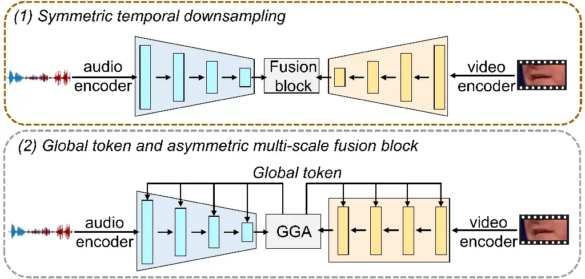
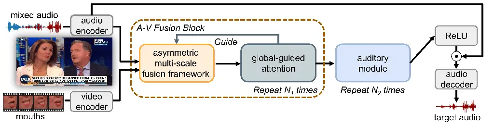
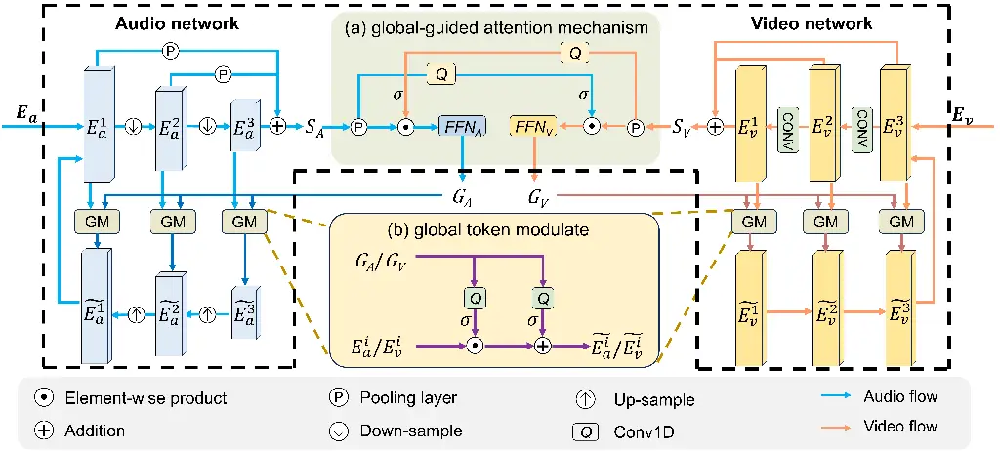
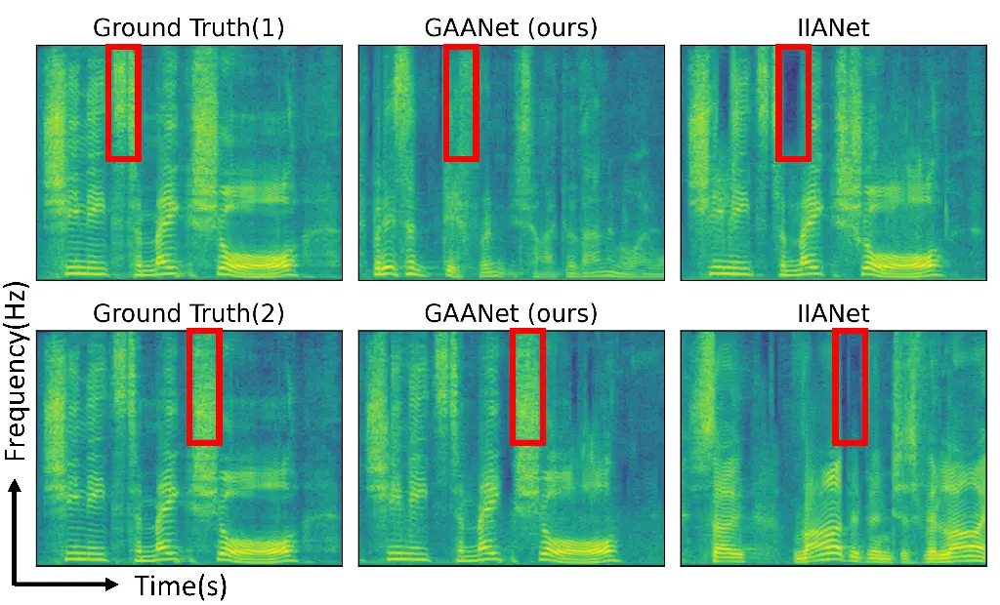
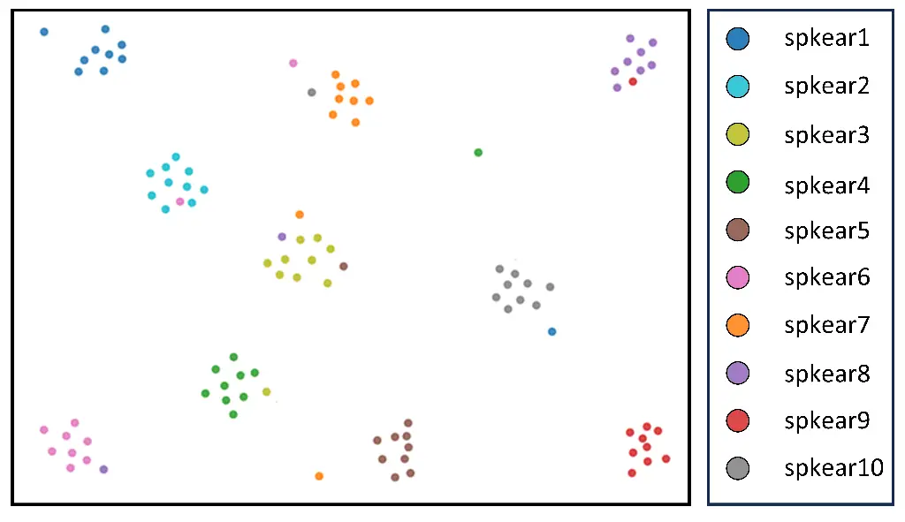

# GAANet: Global-guided Asymmetric Attention Network for Audio-Visual Speech Separation Thanks:  This work is supported by the National Natural Science Foundation of China under Grants 62501224 and 62576130, and by the Fundamental Research Funds for the Central Universities under Grants JZ2025HGQA0139 and JZ2025HGTA0160. This work is supported by the National Key R&D Program of China (NO.2024YFB3311600), the Natural Science Foundation of China (62272144), the Anhui Provincial Natural Science Foundation (2408085J040), the Major Project of the Anhui Provincial Science and Technology Breakthrough Program (202423k09020001), and the Fundamental Research Funds for the Central Universities (JZ2024AHST0337). The computation is completed on the HPC Platform of Hefei University of Technology. Corresponding author:[xujingyuan@hfut.edu.cn](mailto:xujingyuan@hfut.edu.cn)

Zhiyuan Zhang¹, Jingyuan Xu^(1\*), Yiming Tang¹, Liu Liu¹, Dan Guo¹
Affiliation: ¹School of Computer Science and Information Engineering,
Hefei University of Technology, Hefei, Anhui 230601, China  
[zhiyuan.dizzy@outlook.com](mailto:zhiyuan.dizzy@outlook.com),
[xujingyuan@hfut.edu.cn](mailto:xujingyuan@hfut.edu.cn),
[tym608@163.com](mailto:tym608@163.com),
[liuliu@hfut.edu.cn](mailto:liuliu@hfut.edu.cn),
[guodan@hfut.edu.cn](mailto:guodan@hfut.edu.cn)

###### Abstract

Multi-scale design is crucial for efficient audio-visual speech
separation, yet effectively modeling multi-scale information for
audio-visual feature fusion remains challenging. We argue that the
limited capacity of existing approaches primarily arises from: 1)
treating features from different modalities in the same manner, and 2)
overlooking the role of global features. To address these issues, we
propose a Global-guided Asymmetric Attention Network (GAANet). Our model
introduces two core innovations: first, an asymmetric multi-scale fusion
framework that allows audio and visual streams to extract and interact
with features at their respective optimal temporal resolutions, removing
the need for symmetric temporal downsampling; second, a global-guided
attention mechanism that compresses each modality into a compact global
token with a temporal dimension of one, which then provides high-level
semantic cues to guide both intra- and inter-modal fusion across scales.
Experiments on LRS2 and VoxCeleb2 demonstrate that GAANet achieves
state-of-the-art performance, reaching 16.5 dB SI-SNRi on LRS2 and 14.0
dB on VoxCeleb2, while maintaining a lightweight computational profile
with only 3.3M parameters and 19.8G MACs. These results highlight the
strong potential of asymmetric temporal modeling and global guidance for
efficient and robust multimodal fusion. The source code is publicly
accessible at
[https://github.com/redizzy/GAANet](https://github.com/redizzy/GAANet).

###### Index Terms: 

Speech separation, Asymmetric multi-scale fusion, Global-guided
attention, Audio-visual learning

^(†)^(†)aftertitle:

## I Introduction

Audio-visual speech separation (AVSS) aims to recover a target speaker’s
voice from a mixture by jointly leveraging acoustic signals and visual
cues such as lip movements. Inspired by the human ability to use visual
information to understand speech in noisy environments, AVSS has become
an important research direction for challenging multi-speaker or low-SNR
conditions. Recent studies have shown that multi-scale modeling is
crucial for AVSS \[9, 11, 26, 17\], as it enables the integration of
information across different temporal scales for effective separation.
However, most existing multi-scale AVSS methods perform cross-modal
fusion under matched temporal resolutions, without explicitly accounting
for the distinct temporal characteristics of audio and visual streams.



Fig. 1: Illustration of 1) Existing multi-scale methods with symmetric
fusion framework and 2) our proposed GAANet with asymmetric multi-scale
fusion framework and global-token guidance.

Recent AVSS systems typically adopt symmetric multi-scale fusion
frameworks \[9, 11\], where audio and visual features are downsampled to
matching temporal resolutions before cross-modal interaction. However,
audio and visual streams exhibit different temporal behaviors: audio
features are sampled at a much higher temporal resolution and contain
rapidly varying fine-grained patterns, whereas visual lip movements
evolve more slowly and convey relatively stable semantic cues \[11\].
This temporal asymmetry between the two modalities is not explicitly
captured in symmetric fusion designs.

Beyond modeling temporal asymmetry, audio-visual speech separation
inherently requires reasoning beyond local temporal correspondences.
While audio and visual features evolve over time, key semantic factors
such as speaker identity, articulation patterns, and target dominance
remain largely consistent within an utterance. To this end, we introduce
compact global tokens with a singleton temporal dimension ($`T{=}1`$) to
summarize each modality into a time-invariant semantic descriptor.
Rather than modeling temporal dynamics, these global tokens provide
consistent cross-modal context across temporal scales, enabling coherent
guidance for both intra-modal refinement and inter-modal fusion.

Motivated by these insights, we propose the Global-guided Asymmetric
Attention Network (GAANet) for audio-visual speech separation. As
illustrated in Fig.1, GAANet departs from the conventional symmetric
temporal downsampling pipeline and adopts an asymmetric multi-scale
fusion framework, where the audio encoder generates a multi-level
temporal hierarchy while the video encoder preserves a fixed temporal
resolution. These audio and visual features are integrated through an
asymmetric fusion block that aggregates information across audio scales
and aligns it with the video pathway without enforcing matched temporal
rates. Built upon this structure, a global-guided attention (GGA)
mechanism compresses each modality into a compact global token with
temporal dimension $`1`$. The two global tokens interact to form
time-invariant cross-modal context, which is then broadcast back to all
scales to guide the corresponding audio and visual features. In this
way, GAANet provides coherent global guidance for both intra-modal
refinement and inter-modal fusion throughout the entire multi-scale
hierarchy.

Our main contributions are summarized as follows:

- •
  We propose GAANet, a Global-guided Asymmetric Attention Network for
  AVSS, which explicitly exploits the intrinsic temporal asymmetry
  between audio and visual modalities for multi-scale fusion.
- •
  We develop an asymmetric multi-scale fusion framework that builds a
  temporal hierarchy for audio while preserving the visual temporal
  resolution, and further introduce a global-guided attention mechanism
  that forms compact global tokens ($`T{=}1`$) to provide time-invariant
  guidance for intra-/inter-modal fusion across scales.
- •
  GAANet achieves competitive performance on the LRS2 and VoxCeleb2
  benchmarks with a lightweight computational profile, demonstrating an
  effective accuracy–efficiency trade-off.

## II Related Work

Audio-visual speech separation (AVSS) improves robustness in challenging
acoustic conditions by leveraging lip motion as a complementary,
noise-invariant cue. Early AVSS systems primarily combine CNN-based
visual encoders with audio encoders to extract modality-specific
features \[25, 4\]. Subsequent works incorporate cross-modal attention
or Transformer-based fusion to strengthen audio-visual alignment \[7,
21, 16\]. Beyond single-scale designs—typically operating at either
coarse \[4\] or fine temporal resolutions \[9\]—recent studies explore
multi-scale architectures to capture interactions between fast acoustic
dynamics and slower visual motions \[9, 15, 11\]. To address realistic
multi-speaker settings, a recent framework performs simultaneous
separation of multiple speakers within a single process and remains
robust to missing visual cues \[19\]. In parallel, diffusion-based AVSS
models introduce generative denoising processes with cross-attention
fusion \[8\], while Transformer-style designs further refine
audio-visual alignment through chunk-wise processing, hierarchical
attention, and specialized positional encoding \[18\]. Together, these
developments outline major methodological directions in contemporary
AVSS research.

Attention is a central mechanism for selective information processing in
both human cognition and machine perception \[22, 13, 12\]. In
audio-visual speech separation, attention-based architectures such as
dual-path Transformers and their variants effectively model long-range
dependencies and refine hierarchical representations \[23, 10, 6\].
Building on these advances, AVSS systems increasingly adopt attention
modules to align audio and visual features \[7, 21, 16\]. Recent work
also explores time-frequency modeling with global attention and early
audio-visual fusion \[5\].

Building upon these advances in multi-scale modeling and
attention-driven audio-visual fusion, we further extend this line of
research by introducing the Global-guided Asymmetric Attention Network
(GAANet). Our design departs from conventional symmetric temporal
hierarchies and standard attention formulations by incorporating
modality-specific temporal structures together with compact global
guidance, enabling more coherent and flexible cross-scale fusion for
AVSS.



Fig. 2: Overview of GAANet, which consists of an audio encoder, a video
encoder, an A-V Fusion Block combining the asymmetric multi-scale fusion
framework and the global-guided attention mechanism, a lightweight
auditory refinement module, and an audio decoder.Here, “$`\odot`$”
denotes the element-wise product.

## III Proposed Model

### III-A Overall Pipeline

GAANet targets audio-visual speech separation by leveraging the
lip-region video frames of the target speaker. Given a mixture waveform
$`\mathbf{S}\in\mathbb{R}^{1\times T_{a}}`$ and lip ROI frames
$`\mathbf{V}\in\mathbb{R}^{H\times W\times T_{v}}`$, the goal is to
estimate the clean target waveform $`\widehat{\mathbf{A}}`$. The overall
pipeline is illustrated in Fig. 2.

First, the mixture audio and the lip video are processed by two encoders
to produce the initial representations $`E_{a}`$ and $`E_{v}`$. The
audio encoder consists of a 1D convolutional layer that transforms the
waveform into frame-level embeddings
$`E_{a}\in\mathbb{R}^{N_{a}\times T^{\prime}_{a}}`$, while the video
encoder follows the same design as \[11\] and extracts spatiotemporal
lip embeddings $`E_{v}\in\mathbb{R}^{N_{v}\times T_{v}}`$.

Second, the features are fed into a unified A-V Fusion Block, which
integrates our two architectural innovations: the asymmetric multi-scale
fusion framework and the global-guided attention mechanism. Each
iteration of this block performs multi-scale audio-visual fusion and
computes global semantic tokens that modulate both modalities. The A-V
Fusion Block is repeated $`N_{1}`$ times with shared parameters,
progressively enhancing the cross-modal alignment. The detailed
structure of the A-V Fusion Block is illustrated in Fig. 3.

Finally, the fused audio representation is refined by a lightweight
auditory module, which is repeated $`N_{2}`$ times to stabilize and
polish the auditory features. The output of the auditory module is
passed through a ReLU activation to produce the mask $`\mathbf{M}`$, and
the masked embedding is decoded through transposed convolutions to
reconstruct the target waveform $`\widehat{\mathbf{A}}`$.

### III-B Asymmetric Multi-Scale Fusion Framework

As illustrated in Fig. 3, GAANet constructs modality-specific
multi-scale temporal hierarchies of depth $`D`$ from audio features
$`E_{a}`$ and visual features $`E_{v}`$ produced by the front-end
encoders, and aggregates them into cumulative multi-scale auditory and
visual representations $`S_{A}`$ and $`S_{V}`$.

Audio pathway. The audio stream is processed by 1D convolutional blocks
along the temporal dimension, each applying a kernel size 5 and stride 2
convolution, layer normalization, and a PReLU activation. This produces
the multi-scale hierarchy and its cumulative representation:

```math
\displaystyle\{\,E_{a}^{i}\in\mathbb{R}^{N_{a}^{i}\times(T^{\prime}_{a}/2^{\,i-1})}\mid i=1,\ldots,D\}, \tag{1}
```

```math
\displaystyle S_{A}=\sum_{i=1}^{D-1}p_{i}(E_{a}^{i})+E_{a}^{D},
```

where each pooling operator $`p_{i}(\cdot)`$ adapts the intermediate
feature $`E_{a}^{i}`$ to the scale of the deepest representation
$`E_{a}^{D}`$.

Visual pathway. To avoid losing temporal details during downsampling,
the visual hierarchy is designed to preserve the original temporal
resolution at every stage. Unlike the audio pathway, the visual pathway
maintains a fixed temporal resolution across all stages, applying no
downsampling;instead, each refinement step expands the receptive field
through convolution so that higher-level visual cues can be aggregated
without reducing temporal fidelity. Concretely, the visual stream is
processed by $`D`$ temporal refinement blocks, each composed of a 1D
convolution (kernel size 5, stride 1), layer normalization, and a PReLU
activation, producing a multi-level visual representation:

```math
\displaystyle\{\,E_{v}^{i}\in\mathbb{R}^{N_{v}^{i}\times T_{v}}\mid i=1,\ldots,D\}, \tag{2}
```

```math
\displaystyle S_{V}=\sum_{i=1}^{D}E_{v}^{i}.
```

Both $`S_{A}`$ and $`S_{V}`$ are then forwarded to the subsequent fusion
stage.



Fig. 3: Architecture of one iteration of the proposed A-V Fusion Block.
In a single iteration, the audio and visual multi-scale features are
first processed by the asymmetric multi-scale fusion framework to
produce the cumulative representations $`S_{A}`$ and $`S_{V}`$. The
global-guided attention mechanism (a) then generates modality-specific
global tokens $`G_{A}`$ and $`G_{V}`$, which are used in (b) to modulate
features across all scales via global token modulation. The refined
multi-scale audio and visual features are finally consolidated and
passed to the next iteration. This figure illustrates the case of
$`D=3`$.

### III-C Global-Guided Attention Mechanism

The cumulative multi-scale audio and visual features $`S_{A}`$ and
$`S_{V}`$ produced by the asymmetric multi-scale fusion framework serve
as the inputs to the global-guided attention module. As illustrated in
Fig. 3, temporal average pooling is first applied to obtain compact
global descriptors:

```math
\overline{S_{A}}=\text{AvgPool}_{t}(S_{A}),\qquad\overline{S_{V}}=\text{AvgPool}_{t}(S_{V}). \tag{3}
```

To enable cross-modal semantic conditioning at the global level, the two
descriptors modulate each other through lightweight convolutional
gating. Specifically, the visual descriptor $`\overline{S_{V}}`$ is
passed through a 1D convolution $`Q_{a}(\cdot)`$ with kernel size 3,
followed by a sigmoid activation $`\sigma(\cdot)`$, which produces a
gating vector used to modulate the audio descriptor:

```math
G_{A,0}=\overline{S_{A}}+\overline{S_{A}}\odot\sigma(Q_{a}(\overline{S_{V}})). \tag{4}
```

Symmetrically, the audio descriptor $`\overline{S_{A}}`$ is processed by
a 1D convolution $`Q_{v}(\cdot)`$ (kernel size 5) to modulate visual
features:

```math
G_{V,0}=\overline{S_{V}}+\overline{S_{V}}\odot\sigma(Q_{v}(\overline{S_{A}})). \tag{5}
```

Finally, two modality-specific feed-forward networks are applied to
produce the global audio and visual tokens:

```math
G_{A}=\text{FFN}_{A}(G_{A,0}),\qquad G_{V}=\text{FFN}_{V}(G_{V,0}). \tag{6}
```

Here, $`\text{FFN}(\cdot)`$ denotes a feed-forward network composed of
three convolutional layers followed by a global layer normalization
(GLN) module, providing nonlinear transformation and stabilization for
the global representations.

### III-D Multi-Scale Fusion and Reconstruction

GAANet performs multi-scale audio–visual fusion across $`D`$ levels, as
illustrated in Fig. 3. As described in Section III-C, the global-guided
attention (GGA) mechanism takes the cumulative features $`S_{A}`$ and
$`S_{V}`$ as input and produces modality-specific global tokens
$`G_{A}`$ and $`G_{V}`$. These global tokens inject global semantic
priors back into all fusion stages.

At each scale $`i`$, the audio feature $`E_{a}^{i}`$ and the visual
feature $`E_{v}^{i}`$ are modulated by their corresponding global tokens
through a gated residual formulation:

```math
\displaystyle\widetilde{E}_{a}^{i} \displaystyle=E_{a}^{i}+E_{a}^{i}\odot\sigma(Q_{a}(G_{A})), \tag{7}
```

```math
\displaystyle\widetilde{E}_{v}^{i} \displaystyle=E_{v}^{i}+E_{v}^{i}\odot\sigma(Q_{v}(G_{V})).
```

This global token modulation enriches each scale with global semantics,
making fused representations more consistent across modalities. The
global token generation and multi-scale modulation process is visualized
in Fig. 3.

Following the global token modulation, the refined multi-scale audio
features $`\{\widetilde{E}_{a}^{i}\}`$ are fused through a customized
upsampling procedure that concentrates information from all scales into
the finest-resolution feature $`\widetilde{E}_{a}^{1}`$, which then
serves as the audio input for the next fusion iteration. For the visual
pathway, the refined features $`\{\widetilde{E}_{v}^{i}\}`$ undergo a
customized consolidation process that similarly concentrates multi-scale
information into the finest-resolution feature
$`\widetilde{E}_{v}^{1}`$, which is used as the visual input for the
next iteration. The detailed implementation of these operations and
auditory module is provided in the supplementary material.

## IV Experiment configurations

### IV-A Datasets

Our experimental setup follows previous research\[11\] on the standard
LRS2 \[1\] and VoxCeleb2 \[3\] datasets. The data was prepared as
follows: audio segments were 2 seconds at 16 kHz; mixtures were created
by randomly blending two speakers’ audio at SNRs from -5 dB to 5 dB; and
the synchronized lip frames were 88×88 grayscale images at 25 FPS. We
employed the standard dataset split \[11\].

### IV-B Model configurations

The GAANet model was implemented in PyTorch \[20\] and trained using the
Adam optimizer with an initial learning rate of 0.001. We adopted a
learning rate scheduling strategy that reduced the rate by 50% after 20
epochs without improvement in validation loss, and applied early
stopping after 30 epochs. Gradient clipping was employed with a maximum
L2-norm of 5, and the model was optimized using the scale-invariant
signal-to-noise ratio (SI-SNR) as the training objective.

Following the design described in Section III-B, GAANet adopts a
multi-scale hierarchy of depth $`D=4`$. The A-V fusion block is iterated
$`N_{1}=4`$ times with shared parameters, while the auditory refinement
module is further unrolled for $`N_{2}=12`$ iterations. All experiments
were conducted with a batch size of 3 on 8 GeForce RTX 4090 GPUs.

| Methods             | LRS2    |       |      | VoxCeleb2 |      |      | Params (M) | MACs (G) |
| ------------------- | ------- | ----- | ---- | --------- | ---- | ---- | ---------- | -------- |
|                     | SI-SNRi | SDRi  | PESQ | SI-SNRi   | SDRi | PESQ |            |          |
| AVConvTasNet \[25\] | 12.5    | 12.8  | 2.69 | 9.2       | 9.8  | 2.17 | 16.5       | 23.8     |
| LWTNet \[2\]        | \-      | 10.8  | \-   | \-        | \-   | \-   | 69.4       | \-       |
| VisualVoice \[4\]   | 11.5    | 11.8  | 2.78 | 9.3       | 10.2 | 2.45 | 77.8       | 9.7      |
| CaffNet-C \[7\]     | \-      | 10.0  | 1.15 | \-        | 7.6  | \-   | \-         | \-       |
| AVLiT-8 \[15\]      | 12.8    | 13.1  | 2.56 | 9.4       | 9.9  | 2.23 | 5.8        | 18.2     |
| AVSepChain \[18\]   | 15.3    | 15.7  | 3.26 | 13.6      | 14.2 | 2.72 | 33.1       | \-       |
| CTCNet\[9\]         | 14.3    | 14.6  | 3.08 | 11.9      | 13.1 | 3.00 | 7.0        | 167.1    |
| IIANet\[11\]        | 16.0    | 16.2  | 3.23 | 13.6      | 14.3 | 3.12 | 3.1        | 18.6     |
| GAANet(ours)        | 16.5    | 16.64 | 3.28 | 14.0      | 14.7 | 3.15 | 3.3        | 19.8     |

TABLE I: Separation results of different AVSS methods on LRS2 and
VoxCeleb2 datasets. These metrics represent the average values for all
speakers in each test set, where larger SI-SNRi, SDRi and PESQ values
are better. ”-” denotes results not reported in the original paper.
Bolds indicate the best.

### IV-C Evaluation metrics

To evaluate the performance of our model, we employed the
scale-invariant signal-to-noise ratio improvement (SI-SNRi) and
signal-to-distortion ratio improvement (SDRi), which are widely adopted
in speech separation studies \[11, 24\]. These metrics are defined as
follows:

```math
\displaystyle\text{SI-SNRi} \displaystyle=\text{SI-SNR}(\mathbf{s},\hat{\mathbf{s}})-\text{SI-SNR}(\mathbf{s},\mathbf{x}), \tag{8}
```

```math
\displaystyle\text{SDRi} \displaystyle=\text{SDR}(\mathbf{s},\hat{\mathbf{s}})-\text{SDR}(\mathbf{s},\mathbf{x}),
```

where $`\mathbf{x}\in\mathbb{R}^{1\times T_{a}}`$ denotes the mixture
audio, $`\mathbf{s}\in\mathbb{R}^{1\times T_{a}}`$ the original clean
source, and $`\hat{\mathbf{s}}\in\mathbb{R}^{1\times T_{a}}`$ the
estimated source. SI-SNRi and SDRi measure the improvement in separation
quality relative to the original mixture.

In addition, we incorporated the Perceptual Evaluation of Speech Quality
(PESQ) \[14\] to assess the perceived quality and intelligibility of the
separated speech, thereby providing a more comprehensive evaluation of
the model’s performance.

## V Results

### V-A Comparisons with State-of-the-Art Methods

Table I summarizes the performance and efficiency of GAANet compared
with representative audio-visual speech separation models on LRS2 and
VoxCeleb2.

Separation Performance. As shown in Table I, GAANet achieves an SI-SNRi
of 16.5 dB and an SDRi of 16.64 dB on LRS2, exceeding the strongest
prior method. On VoxCeleb2, GAANet also attains the top results with
14.0 dB SI-SNRi and 14.7 dB SDRi. The consistent improvements across
datasets demonstrate the superior performance and strong generalization
of the proposed asymmetric fusion strategy and global-guided attention
mechanisms.

Model Complexity and Efficiency. GAANet contains 3.3M parameters and
19.8G MACs, providing a compact architecture with manageable
computational requirements. The model runs efficiently in practice,
making it suitable for deployment while still delivering strong
separation performance.

### V-B Ablation Study

We assess the individual effects of the global-guided attention (GGA)
and the asymmetric multi-scale fusion (AMF) framework. Removing both
components results in an SI-SNRi of 15.5 dB. Introducing only GGA
increases the score to 16.2 dB, whereas using only AMF yields 15.9 dB,
indicating that GGA contributes a relatively stronger improvement when
applied in isolation. When both components are integrated, GAANet
achieves the highest SI-SNRi of 16.5 dB, demonstrating that the two
mechanisms are complementary and jointly enhance separation performance.

| GGA | AMF | SI-SNRi(dB) | SDRi(dB) | MACs (G) | Params (M) |
| --- | --- | ----------- | -------- | -------- | ---------- |
| ✗   | ✗   | 15.5        | 15.65    | 18.4     | 3.1        |
| ✓   | ✗   | 16.2        | 16.31    | 19.6     | 3.3        |
| ✗   | ✓   | 15.9        | 16.31    | 19.1     | 3.2        |
| ✓   | ✓   | 16.5        | 16.64    | 19.8     | 3.3        |

TABLE II: Ablation study on the global-guided attention (GGA) and
asymmetric multi-scale fusion (AMF) framework on the LRS2 dataset.

### V-C Qualitative Analysis

Qualitative Spectrogram Comparison. We provide representative
spectrogram examples in Fig. 4 to qualitatively examine the
time–frequency behavior of different methods on the LRS2 dataset.The red
boxes indicate regions with notable discrepancies among the compared
outputs.Overall, the spectrograms produced by GAANet exhibit patterns
that are more consistent with the clean target speechMore qualitative
examples are provided in the supplementary material.



Fig. 4: Time–frequency representations of two mixtures from the LRS2
dataset. For each example (1) and (2), we show the ground-truth
spectrogram, the output of GAANet, and IIANet. The red boxes highlight
regions in which IIANet retains noticeable interference or loses
harmonic structure, whereas GAANet recovers more target-consistent
spectral patterns.



Fig. 5: t-SNE visualization of the global audio tokens $`G_{A}`$. We
randomly select 10 target speakers from the test set. Each point
corresponds to one $`G_{A}`$ embedding, and colors indicate different
target speakers.

Discriminative Property of Global Audio Tokens. To examine whether the
global audio token $`G_{A}`$ exhibits discriminative speaker-related
properties consistent with our design motivation, we visualize the
learned $`G_{A}`$ representations using t-SNE. The global tokens (with
temporal dimension $`T{=}1`$) are extracted from multiple test
utterances and projected into a two-dimensional space. As shown in
Fig. 5, most $`G_{A}`$ tokens corresponding to the same target speakers
are located relatively close to each other, while tokens from different
speakers tend to occupy more separated regions in the embedding space,
although some overlap is observed. This suggests that $`G_{A}`$ captures
speaker-related global characteristics that are largely consistent
across an utterance, making it suitable for utterance-level semantic
guidance.

### V-D Impact of Iteration Number and Multi-Scale Depth

We analyze the effect of two key hyperparameters in GAANet: the number
of refinement iterations $`N_{1}`$ and the multi-scale depth $`D`$. As
shown in Table III, increasing $`N_{1}`$ from 1 to 4 (with $`D=4`$)
progressively improves the SI-SNRi from 15.2 dB to 16.5 dB,
demonstrating the benefit of repeated global-guided refinement. However,
the performance saturates at $`N_{1}=4`$, as $`N_{1}=5`$ yields no
further gain while increasing MACs, indicating that four iterations
already provide sufficient enhancement with minimal redundancy.

When varying the depth $`D`$ (with $`N_{1}=4`$), expanding the hierarchy
from three to four scales improves the SI-SNRi (16.2 dB $`\rightarrow`$
16.5 dB), suggesting that an additional temporal level enhances
cross-scale fusion. Further increasing the depth to $`D=5`$ does not
improve performance and instead increases the computational cost. These
results show that the configuration $`N_{1}=4`$, $`D=4`$ achieves the
best trade-off between separation quality and efficiency, and is
therefore adopted as the default setting. Additional experiments
analyzing the impact of $`N_{2}`$ are provided in the supplementary
material.

|                                     |           |       |              |          |            |
| ----------------------------------- | --------- | ----- | ------------ | -------- | ---------- |
| Setting                             | $`N_{1}`$ | $`D`$ | SI-SNRi (dB) | MACs (G) | Params (M) |
| _Varying $`N_{1}`$ (fixed $`D=4`$)_ |           |       |              |          |            |
| A                                   | 1         | 4     | 15.2         | 18.1     | 3.3        |
| B                                   | 2         | 4     | 15.7         | 18.7     | 3.3        |
| C                                   | 3         | 4     | 16.1         | 19.2     | 3.3        |
| D                                   | 4         | 4     | 16.5         | 19.8     | 3.3        |
| E                                   | 5         | 4     | 16.5         | 20.4     | 3.3        |
| _Varying $`D`$ (fixed $`N_{1}=4`$)_ |           |       |              |          |            |
| F                                   | 4         | 3     | 16.2         | 19.1     | 3.3        |
| G                                   | 4         | 4     | 16.5         | 19.8     | 3.3        |
| H                                   | 4         | 5     | 16.4         | 21.0     | 3.3        |

TABLE III: Impact of the iteration number $`N_{1}`$ and multi-scale
depth $`D`$ on the LRS2 dataset.

## VI Conclusion and Discussion

We presented GAANet, a simple yet effective AVSS framework.GAANet
overcomes the limitations of symmetric temporal fusion by introducing an
asymmetric multi-scale design that respects the distinct temporal
characteristics of audio and visual signals. A compact global token
provides coherent semantic guidance across fusion stages, leading to
stronger audio-visual alignment and more stable feature integration.
Extensive experiments demonstrate superior separation performance with a
lightweight computational footprint, highlighting GAANet’s practicality
for real-world multimodal speech separation.

## References

- \[1\] T. Afouras, J. S. Chung, and A. Zisserman (2018) The
  conversation: deep audio-visual speech enhancement. arXiv preprint
  arXiv:1804.04121. Cited by: §IV-A.
- \[2\] T. Afouras, A. Owens, J. S. Chung, and A. Zisserman (2020)
  Self-supervised learning of audio-visual objects from video. In
  European Conference on Computer Vision, pp. 208–224. Cited by: TABLE
  I.
- \[3\] J. S. Chung, A. Nagrani, and A. Zisserman (2018) Voxceleb2: deep
  speaker recognition. arXiv preprint arXiv:1806.05622. Cited by: §IV-A.
- \[4\] R. Gao and K. Grauman (2021) Visualvoice: audio-visual speech
  separation with cross-modal consistency. In 2021 IEEE/CVF Conference
  on Computer Vision and Pattern Recognition (CVPR), pp. 15490–15500.
  Cited by: §II, TABLE I.
- \[5\] V. A. Kalkhorani, C. Yu, A. Kumar, K. Tan, B. Xu, and D.
  Wang (2025) AV-crossnet: an audiovisual complex spectral mapping
  network for speech separation by leveraging narrow-and cross-band
  modeling. IEEE Journal of Selected Topics in Signal Processing. Cited
  by: §II.
- \[6\] T. Kuo, Y. Liao, K. Li, B. Hong, and X. Hu (2022) Inferring
  mechanisms of auditory attentional modulation with deep neural
  networks. Neural Computation 34 (11), pp. 2273–2293. Cited by: §II.
- \[7\] J. Lee, S. Chung, S. Kim, H. Kang, and K. Sohn (2021) Looking
  into your speech: learning cross-modal affinity for audio-visual
  speech separation. In Proceedings of the IEEE/CVF Conference on
  Computer Vision and Pattern Recognition, pp. 1336–1345. Cited by: §II,
  §II, TABLE I.
- \[8\] S. Lee, C. Jung, Y. Jang, J. Kim, and J. S. Chung (2024) Seeing
  through the conversation: audio-visual speech separation based on
  diffusion model. In ICASSP 2024-2024 IEEE International Conference on
  Acoustics, Speech and Signal Processing (ICASSP), pp. 12632–12636.
  Cited by: §II.
- \[9\] K. Li, F. Xie, H. Chen, K. Yuan, and X. Hu (2024) An
  audio-visual speech separation model inspired by
  cortico-thalamo-cortical circuits. IEEE Transactions on Pattern
  Analysis and Machine Intelligence 46 (10), pp. 6637–6651. Cited by:
  §I, §I, §II, TABLE I.
- \[10\] K. Li, R. Yang, and X. Hu (2022) An efficient encoder-decoder
  architecture with top-down attention for speech separation. arXiv
  preprint arXiv:2209.15200. Cited by: §II.
- \[11\] K. Li, R. Yang, F. Sun, and X. Hu (2023) Iianet: an intra-and
  inter-modality attention network for audio-visual speech separation.
  arXiv preprint arXiv:2308.08143. Cited by: §I, §I, §II, §III-A, §IV-A,
  §IV-C, TABLE I.
- \[12\] Z. Li, D. Guo, J. Zhou, J. Zhang, and M. Wang (2024)
  Object-aware adaptive-positivity learning for audio-visual question
  answering. In Proceedings of the AAAI Conference on Artificial
  Intelligence, Vol. 38, pp. 3306–3314. Cited by: §II.
- \[13\] Z. Li, J. Zhou, J. Zhang, S. Tang, K. Li, and D. Guo (2025)
  Patch-level sounding object tracking for audio-visual question
  answering. In Proceedings of the AAAI Conference on Artificial
  Intelligence, Vol. 39, pp. 5075–5083. Cited by: §II.
- \[14\] A. E. Mahdi (2007) Voice quality measurement in modern
  telecommunication networks. In 2007 14th International Workshop on
  Systems, Signals and Image Processing and 6th EURASIP Conference
  focused on Speech and Image Processing, Multimedia Communications and
  Services, Vol. , pp. 25–32. External Links:
  [Document](https://dx.doi.org/10.1109/IWSSIP.2007.4381087) Cited by:
  §IV-C.
- \[15\] H. Martel, J. Richter, K. Li, X. Hu, and T. Gerkmann (2023)
  Audio-visual speech separation in noisy environments with a
  lightweight iterative model. arXiv preprint arXiv:2306.00160. Cited
  by: §II, TABLE I.
- \[16\] J. F. Montesinos, V. S. Kadandale, and G. Haro (2022) Vovit:
  low latency graph-based audio-visual voice separation transformer. In
  European Conference on Computer Vision, pp. 310–326. Cited by: §II,
  §II.
- \[17\] Z. Mu, X. Yang, and W. Zhu (2023) Multi-dimensional and
  multi-scale modeling for speech separation optimized by discriminative
  learning. In ICASSP 2023-2023 IEEE International Conference on
  Acoustics, Speech and Signal Processing (ICASSP), pp. 1–5. Cited by:
  §I.
- \[18\] Z. Mu and X. Yang (2024) Separate in the speech chain:
  cross-modal conditional audio-visual target speech extraction. arXiv
  preprint arXiv:2404.12725. Cited by: §II, TABLE I.
- \[19\] T. Pan, J. Liu, B. Wang, J. Tang, and G. Wu (2024) RAVSS:
  robust audio-visual speech separation in multi-speaker scenarios with
  missing visual cues. In Proceedings of the 32nd ACM International
  Conference on Multimedia, pp. 4748–4756. Cited by: §II.
- \[20\] A. Paszke, S. Gross, F. Massa, A. Lerer, J. Bradbury, G.
  Chanan, T. Killeen, Z. Lin, N. Gimelshein, L. Antiga, et al. (2019)
  Pytorch: an imperative style, high-performance deep learning library.
  Advances in neural information processing systems 32. Cited by: §IV-B.
- \[21\] A. Rahimi, T. Afouras, and A. Zisserman (2022) Reading to
  listen at the cocktail party: multi-modal speech separation. In
  Proceedings of the IEEE/CVF Conference on Computer Vision and Pattern
  Recognition, pp. 10493–10502. Cited by: §II, §II.
- \[22\] W. X. Schneider (2013) Selective visual processing across
  competition episodes: a theory of task-driven visual attention and
  working memory. Philosophical Transactions of the Royal Society B:
  Biological Sciences 368 (1628), pp. 20130060. Cited by: §II.
- \[23\] C. Subakan, M. Ravanelli, S. Cornell, M. Bronzi, and J.
  Zhong (2021) Attention is all you need in speech separation. In ICASSP
  2021-2021 IEEE International Conference on Acoustics, Speech and
  Signal Processing (ICASSP), pp. 21–25. Cited by: §II.
- \[24\] E. Vincent, R. Gribonval, and C. Févotte (2006) Performance
  measurement in blind audio source separation. IEEE transactions on
  audio, speech, and language processing 14 (4), pp. 1462–1469. Cited
  by: §IV-C.
- \[25\] J. Wu, Y. Xu, S. Zhang, L. Chen, M. Yu, L. Xie, and D.
  Yu (2019) Time domain audio visual speech separation. In 2019 IEEE
  automatic speech recognition and understanding workshop (ASRU),
  pp. 667–673. Cited by: §II, TABLE I.
- \[26\] Y. Zhao, C. Luo, Z. Zha, and W. Zeng (2021) Multi-scale group
  transformer for long sequence modeling in speech separation. In
  Proceedings of the Twenty-Ninth International Conference on
  International Joint Conferences on Artificial Intelligence,
  pp. 3251–3257. Cited by: §I.
