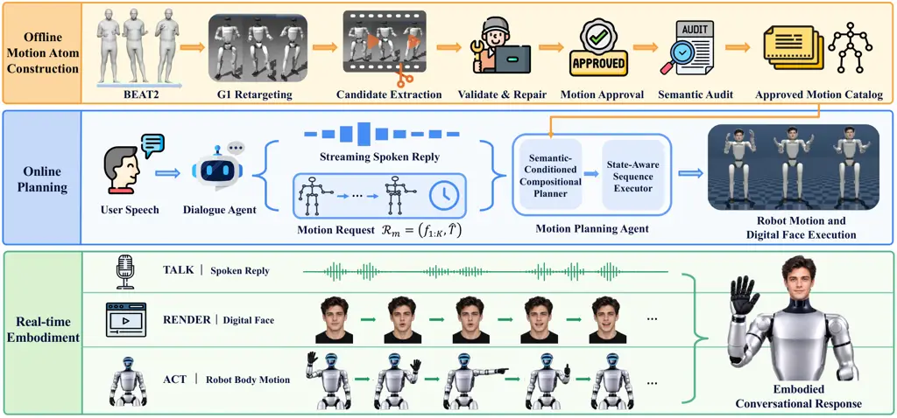
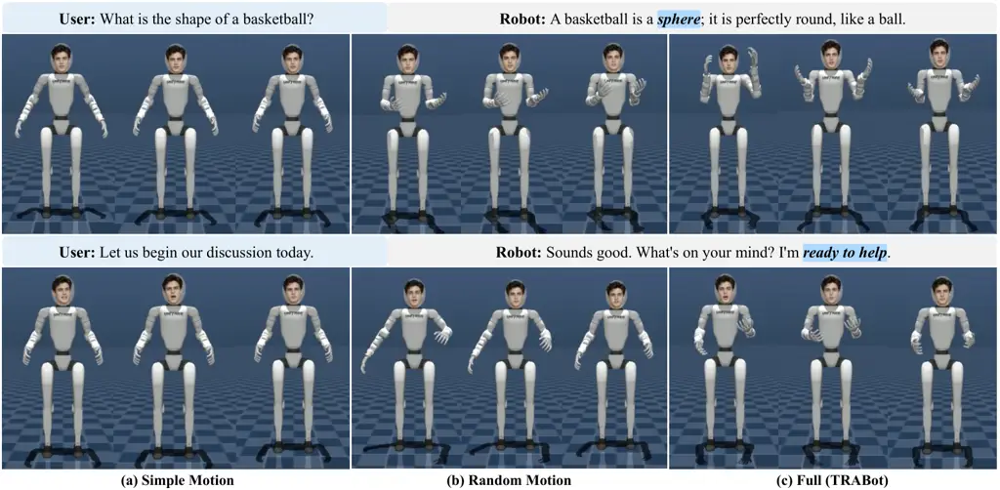

# Talk, Render, Act: Integrating Social Gesture and Digital Face with Synchronized Speech for Conversational Humanoid Robot Thanks: Jin Jiang, Kun Li, Jiancong Ma, and Shengcai Liao are with the College of Computing and Artificial Intelligence (CCAI), United Arab Emirates University (UAEU), Al Ain, Abu Dhabi, United Arab Emirates.Thanks: Corresponding author: Shengcai Liao (email: scliao@ieee.org).

Jin Jiang Affiliation: United Arab Emirates University (UAEU)    Kun Li
Affiliation: United Arab Emirates University (UAEU)    Jiancong Ma
Affiliation: United Arab Emirates University (UAEU)    Shengcai Liao

###### Abstract

Expressive humanoid interaction requires speech, facial animation, and
body gestures to form a coherent response. However, many full-body
humanoid robots produce speech and gestures without a visually
expressive face, while talking-face animation and robot gesture
generation are typically developed separately. We present Talk, Render,
Act (TRABot), an agent-based framework comprising specialized agents for
motion-atom construction, dialogue generation, motion planning, and
facial animation. First, to produce natural and semantically meaningful
gestures, we construct Robot-Ready Semantic Motion Atoms by segmenting
long-form, G1-retargeted BEAT2 motion into units with natural gesture
boundaries, human-verified communicative functions, and feasible
trajectories. Second, to preserve semantic order and coordinate body
motion with the spoken response, we introduce a Semantic-Conditioned
Compositional Planner. Given an ordered semantic function sequence and
an estimated response duration, the planner selects approved atoms to
realize the longest feasible action sequence while accounting for
transitions and neutral recovery. Finally, we deploy a Streaming
Face-Speech-Body Integration system on a physical G1 humanoid, combining
streaming dialogue audio, audio-driven facial animation, and
semantically planned body motion in a unified real-time interaction
loop. Quantitative and qualitative experiments demonstrate that TRAbot
achieves the best overall performance among all compared conditions in
terms of naturalness, expressiveness, and multimodal coherence.

## I Introduction

Human face-to-face communication relies on the coordination of verbal
and nonverbal behaviors. Speech conveys linguistic content, whereas
facial movements and body gestures provide complementary cues for
affective expression, emphasis, and deictic reference \[1, 2, 3\].
Consequently, expressive humanoid interaction requires speech, facial
animation, and body motion to be coordinated semantically and temporally
\[4, 5, 6\].

Recent advances have substantially improved the individual components of
embodied interaction. Speech-driven talking-face models generate
articulatory and expressive facial motion from audio \[7, 8, 9, 10,
11\]. Social robots such as Furhat and Haru combine dialogue with
expressive facial displays, gaze, or platform-specific physical
behaviors \[12, 13, 4\]. These systems demonstrate the value of facial
embodiment, but they do not provide the expressive motion of a full-body
humanoid. Conversely, co-speech gesture methods generate semantically or
rhythmically appropriate body motion for virtual agents and robots \[2,
6\]. Recent work further enables streaming, semantically aligned
gestures on physical humanoids \[14\], but focuses on speech and body
motion without a continuously animated talking face. Holistic animation
methods jointly model facial and bodily behavior for digital humans,
including real-time interactive generation \[15, 5, 16\]. Such systems
operate in a shared virtual representation and do not address
robot-specific motion feasibility or state-dependent execution. Taken
together, these approaches leave the coordination of streaming speech,
an audio-driven digital face, and semantically planned humanoid motion
within a unified conversational system insufficiently explored.

A direct combination of existing components does not fully resolve this
problem because facial and bodily behaviors involve different
representations and time scales. Facial animation can be generated frame
by frame from streaming audio. Humanoid body motion must instead be
organized into semantically meaningful actions, validated for the target
embodiment, connected from the current robot state, and composed within
the duration of a spoken response. Dialogue generation operates at the
level of communicative intent and reply duration, whereas motion
execution requires concrete trajectories that satisfy these constraints.
These differences motivate an agent-based architecture in which each
agent performs a distinct generation or decision process and
communicates through explicit semantic and temporal variables.

We present Talk, Render, Act (TRABot), an agent-based framework
comprising one offline agent and three online agents. The offline Motion
Atom Construction Agent transforms long-form, G1-retargeted BEAT2 motion
\[17\] into Robot-Ready Semantic Motion Atoms with natural gesture
boundaries, human-verified communicative functions, and feasible
trajectories. The resulting atoms provide inspectable and reusable robot
actions while establishing a semantic interface between dialogue
generation and motion planning.

During interaction, the Dialogue Agent generates a spoken reply together
with an ordered function sequence and an estimated response duration.
The Motion Planning Agent implements our Semantic-Conditioned
Compositional Planner, which selects approved atoms to realize the
longest feasible action sequence within the available response duration
while accounting for transitions and neutral recovery. A state-aware
executor recomputes each transition from the robot state reached during
execution. In parallel, the Facial Animation Agent generates facial
motion from the same streaming audio used for speech playback. The
Streaming Face-Speech-Body Integration system executes the resulting
speech, facial animation, and body motion concurrently within a unified
real-time interaction loop. This organization preserves the
modality-specific processing required by facial rendering and robot
execution while coordinating all three modalities through a shared
spoken response.

The main contributions of this work are threefold.

- •
  We construct Robot-Ready Semantic Motion Atoms by segmenting
  long-form, G1-retargeted BEAT2 motion into units with natural gesture
  boundaries, human-verified communicative functions, and feasible
  trajectories.
- •
  We introduce a Semantic-Conditioned Compositional Planner that maps an
  ordered function sequence and a response-duration estimate to the
  longest feasible action sequence while accounting for transitions,
  neutral recovery, and the current robot state.
- •
  We develop a Streaming Face-Speech-Body Integration System that
  coordinates dialogue audio, audio-driven facial animation, and
  semantically planned humanoid motion through specialized agents in a
  unified real-time interaction loop.

## II Related Work

### II-A Co-Speech Gesture Generation for Embodied Agents

Co-speech gesture generation has progressed from manually specified
behavior rules to data-driven motion synthesis \[18, 19, 20, 21\]. Yoon
et al. learned a mapping from speech transcripts to gesture sequences
and demonstrated real-time execution on a NAO robot \[6\]. Gesticulator
subsequently combined semantic and acoustic speech representations to
generate joint rotations that capture both content-related and rhythmic
gestures \[2\]. Other approaches incorporate speaker identity and
multimodal speech context to model individual gesturing styles \[22\],
or represent motion using discrete gesture tokens to better capture the
one-to-many relationship between speech and movement \[23\].
Context-aware systems have further conditioned robot gestures on
nonverbal cues from an interaction partner \[24\]. Although these
methods improve the appropriateness, diversity, and responsiveness of
generated motion, they primarily focus on the articulated body and
commonly treat facial behavior as a separate component.

### II-B Facial and Holistic Animation

Speech-driven facial animation has traditionally focused on accurate
articulation and plausible full-face motion. MeshTalk separates
audio-correlated articulation from weakly correlated behavior such as
blinks and eyebrow movements \[10\], while FaceFormer exploits
long-range speech context through autoregressive attention \[9\].
CodeTalker instead maps speech to a learned discrete motion prior to
alleviate the over-smoothing associated with direct motion
regression \[11\]. Recent work has further advanced speech-driven facial
animation toward greater photorealism, expressiveness, and real-time
performance. SyncTalk combines explicit synchronization control with
neural radiance-field rendering to improve the alignment of speech, lip
motion, facial expression, and head pose \[25\]. EMO adopts direct
audio-to-video diffusion without relying on intermediate 3D models or
facial landmarks \[26\], while FLOAT performs flow matching in a learned
motion latent space for expressive and temporally consistent portrait
animation \[27\]. Teller supports real-time streaming generation through
autoregressive motion modeling \[28\]. SoulX-FlashHead and LiveAvatar
further enable long-duration facial animation from streaming audio \[7,
8\]. Although these methods produce high-quality facial motion, they do
not address its coordination with actions executed by a separately
embodied physical robot.

### II-C Multimodal Expressive Behavior for Social Robots

The coordination of verbal and nonverbal behavior has a long history in
embodied-agent systems. BEAT transforms linguistic input into
synchronized speech, gaze, facial displays, and gestures using explicit
behavioral rules \[1\]. For hybrid physical-digital embodiments, Gomez
et al. coordinate Haru’s mechanical motion and digital displays through
animator-authored multimodal expressions \[13\]. More recent systems use
language models to reduce manual behavior authoring. FurChat combines
LLM-generated dialogue with facial expressions on the Furhat
robot \[12\], while Expressive Furhat generates context-dependent facial
gestures and gaze behavior in real time \[29\]. On Haru, Wang et al. use
conversational and affective cues to select expressive speech styles and
pre-authored physical behaviors \[4\].

LLMs have also been used to generate robot behavior more directly. GenEM
translates natural-language descriptions of social behavior into
parameterized control programs composed from available robot
skills \[30\]. Galatolo and Winkle attach robot-specific behavior heads
to a language model, enabling simultaneous generation of text and
high-level communicative intentions that are mapped to facial
expressions on Furhat or bodily gestures on Pepper \[31\]. Most closely
related, Nichols et al. generate synchronized timelines for vocal,
facial, and bodily expression on the Haru robot from a shared semantic
analysis of dialogue \[32\]. Building on these complementary directions,
our work considers a hybrid embodiment in which robot actions and
digital facial animation are generated as composable outputs of a shared
agent. Our focus is on preserving semantic and temporal coherence
between the two channels while satisfying the distinct execution
requirements of physical actuation and facial rendering.

## III Methodology

### III-A TRABot Overview and Agent Interfaces



Fig. 1: Overview of TRABot. Offline Motion Atom Construction Agent
converts G1-retargeted BEAT2 motion into an approved catalog of
Robot-Ready Semantic Motion Atoms. Online the Dialogue Agent generates
streaming reply audio and a semantic motion request. The Motion Planning
Agent composes approved atoms and constructs state-dependent
transitions, while the Facial Animation Agent generates facial frames
from the same audio stream. The Streaming Face-Speech-Body Integration
System executes speech, facial animation, and robot body motion
concurrently.

TRABot comprises one offline agent and three online agents connected
through explicit semantic and temporal interfaces. The offline Motion
Atom Construction Agent converts long-form, G1-retargeted BEAT2 motion
into an approved catalog of Robot-Ready Semantic Motion Atoms. During
interaction, the Dialogue Agent generates streaming reply audio together
with a semantic motion request

```math
\mathcal{R}_{m}=(f_{1:K},\hat{T}), \tag{1}
```

where $`f_{1:K}`$ is the ordered sequence of communicative functions
produced by the dialogue model, and $`\hat{T}`$ is its estimated reply
duration.

The local catalog $`\mathcal{C}=\{a_{i}\}_{i=1}^{N}`$ contains only
approved motion atoms. For online planning, each atom is represented as

```math
a_{i}=(\phi_{i},Q_{i},d_{i},h_{i}), \tag{2}
```

where $`\phi_{i}`$ is its human-audited communicative function,
$`Q_{i}`$ is the executable joint trajectory, $`d_{i}`$ is its duration,
and $`h_{i}`$ denotes its handedness (left, right, or bilateral). The
boundary poses used for transition planning are obtained directly from
the trajectory:

```math
q_{i}^{\mathrm{in}}=Q_{i}(0),\qquad q_{i}^{\mathrm{out}}=Q_{i}(d_{i}). \tag{3}
```

Given $`\mathcal{R}_{m}`$, the measured robot state $`q`$, and the
remaining motion budget $`B(\hat{T})`$, the Motion Planning Agent
applies the Semantic-Conditioned Compositional Planner to select the
longest budget-feasible atom sequence. Its State-Aware Sequence Executor
constructs transitions from the current state and replans the remaining
functions after each executed atom. In parallel, the Facial Animation
Agent converts the streaming reply audio into facial frames. The
Streaming Face-Speech-Body Integration System presents the resulting
speech, facial animation, and body motion concurrently. Fig. 1
summarizes the complete pipeline.

### III-B Robot-Ready Semantic Motion Atoms

The offline Motion Atom Construction Agent converts long-form,
G1-retargeted BEAT2 motion into a catalog of naturally bounded,
feasible, and semantically verified motion atoms.

#### III-B1 Motion Representation and Preprocessing

We use BEAT2 conversational motion retargeted to the 29-DoF G1 kinematic
convention. The floating root remains at its reference pose, and the 14
arm joints form the controlled motion space. Sequences with inconsistent
joint layouts or invalid numerical values are rejected before further
processing.

To identify stable gesture boundaries while preserving the executable
motion, we maintain separate representations for boundary detection and
robot execution. A copy of each sequence is resampled to 25 Hz and
filtered with a three-frame median filter followed by the symmetric
binomial kernel $`[1,4,6,4,1]/16`$ for boundary detection, while the
original 30 Hz trajectory is retained for constructing executable motion
atoms.

#### III-B2 Adaptive extraction and natural boundaries

The preprocessing stage provides two synchronized representations of
each recording: a smoothed 25 Hz signal for detecting motion and the
original 30 Hz trajectory for constructing executable atoms. We first
use the detection signal to identify coarse regions of intentional
movement.

Because motion magnitude varies substantially across speakers and
recordings, the agent estimates activity relative to each recording
rather than using a global velocity threshold. For the 14 controlled arm
joints, we use equal weighting and normalize each joint velocity by its
kinematic range $`r_{j}=q_{j}^{\max}-q_{j}^{\min}`$ obtained from the G1
model. For frame $`t`$, the resulting activity energy is

```math
E_{t}=\sqrt{\frac{1}{14}\sum_{j=1}^{14}\left(\frac{\dot{q}_{t,j}}{r_{j}}\right)^{2}}. \tag{4}
```

This normalization prevents joints with larger ranges of motion from
dominating the activity signal.

Rather than applying a fixed activity threshold to every recording, we
estimate its motion floor, dynamic range, and background variation from
its own energy distribution. Let $`P_{p}(E)`$ denote the $`p`$-th
percentile of the frame-wise energy values $`\{E_{t}\}_{t=1}^{T}`$. We
define

```math
b=P_{20}(E),\qquad\Delta=P_{95}(E)-b, \tag{5}
```

where $`b`$ approximates the low-activity energy floor and $`\Delta`$
describes the usable motion range of the recording. To estimate
background variation without being affected by high-energy gesture
strokes, we retain only the samples below the median energy,

```math
\mathcal{E}_{\mathrm{quiet}}=\{E_{t}\mid E_{t}\leq P_{50}(E)\}, \tag{6}
```

and compute their robust scale as

```math
\sigma=1.4826\,\operatorname{median}_{e\in\mathcal{E}_{\mathrm{quiet}}}\left|e-\operatorname{median}(\mathcal{E}_{\mathrm{quiet}})\right|. \tag{7}
```

Here, $`\sigma`$ measures the amount of residual motion or retargeting
noise present during relatively quiet portions of the recording.

Using these recording-specific statistics, we define separate onset and
offset thresholds:

```math
\displaystyle\theta_{\mathrm{on}} \displaystyle=b+\operatorname{clip}\!\left(\max(\kappa_{\mathrm{on}}\sigma,\alpha_{\mathrm{on}}\Delta),\alpha_{\mathrm{on}}\Delta,\beta_{\mathrm{on}}\Delta\right), \tag{8}
```

```math
\displaystyle\theta_{\mathrm{off}} \displaystyle=b+\operatorname{clip}\!\left(\max(\kappa_{\mathrm{off}}\sigma,\alpha_{\mathrm{off}}\Delta),\alpha_{\mathrm{off}}\Delta,\beta_{\mathrm{off}}\Delta\right),
```

where $`\operatorname{clip}(x,l,u)`$ restricts $`x`$ to the interval
$`[l,u]`$. The coefficients $`\kappa_{\mathrm{on}}`$ and
$`\kappa_{\mathrm{off}}`$ determine the sensitivity to the estimated
background noise, while $`\alpha_{\mathrm{on}}`$ and
$`\alpha_{\mathrm{off}}`$ define lower bounds relative to the
recording’s dynamic range. The coefficients $`\beta_{\mathrm{on}}`$ and
$`\beta_{\mathrm{off}}`$ prevent the thresholds from becoming
excessively high. These coefficients are fixed hyperparameters shared by
all recordings, and only $`b`$, $`\Delta`$, and $`\sigma`$ adapt to the
current sequence. The higher onset threshold requires a clear increase
above both the background noise and the recording’s motion floor before
starting an Atom. The lower offset threshold allows an ongoing gesture
to pass through a brief slowdown without being split into multiple
segments.

To further suppress short fluctuations, an interval becomes active only
after $`E_{t}`$ remains above $`\theta_{\mathrm{on}}`$ for 0.12 s and
ends after it remains below $`\theta_{\mathrm{off}}`$ for 0.16 s.
Inactive gaps shorter than 0.12 s are merged. A displaced stationary
hold remains within the gesture when a retraction follows within 1.0 s.
Recordings with $`\Delta<4\sigma`$ are rejected as low-signal sequences.

Threshold crossings provide coarse activity intervals, but they do not
necessarily coincide with natural gesture boundaries. In particular,
directly cutting at a threshold crossing can remove part of the
preparation or retraction phase. We therefore refine each provisional
endpoint by searching up to 0.32 s backward from each provisional onset
and up to 0.32 s forward from each provisional offset for a locally
stable pose. Candidate boundaries are evaluated using

```math
C_{t}^{\mathrm{bdry}}=\lambda_{E}\bar{E}_{t}+\lambda_{A}\bar{A}_{t}+\lambda_{P}\bar{P}_{t}, \tag{9}
```

where $`\bar{E}_{t}`$, $`\bar{A}_{t}`$, and $`\bar{P}_{t}`$ are
normalized motion energy, acceleration energy, and local pose variation.
$`\lambda_{E}`$, $`\lambda_{A}`$, and $`\lambda_{P}`$ are fixed
boundary-cost weights shared across all recordings. Low values indicate
that the robot is moving slowly, with little acceleration, near a stable
pose. An endpoint with cost above $`0.50`$ is rejected. Intervals longer
than $`4`$ s are split only at feasible low-cost valleys using dynamic
programming with a duration penalty, and every resulting segment must
have a duration between 0.4 s and 4 s. This refinement favors locally
stable poses and avoids cutting through the stroke of a gesture.

|                 |                                            |                            |
| --------------- | ------------------------------------------ | -------------------------- |
| Category        | Communicative functions                    | Common family              |
| emphasis        | emphasize                                  | beat                       |
| enumeration     | enumerate                                  | beat / metaphoric          |
| contrast        | contrast_compare                           | metaphoric                 |
| reference       | refer_self, refer_other, refer_external    | deictic                    |
| depiction       | depict_size_shape, depict_direction_motion | iconic                     |
| turn management | turn_open, turn_yield                      | beat / metaphoric / emblem |
| social          | greet_farewell, thank, affirm, deny        | emblem                     |
| stance          | certainty, uncertainty, enthusiasm         | metaphoric / emblem        |

TABLE I: Planner-facing communicative vocabulary. Communicative
functions are used as online planning labels, whereas common gesture
families are inherited from the original BEAT2 annotations and retained
as offline metadata.

#### III-B3 Feasibility validation and repair

A motion segment that appears plausible in the source data may become
infeasible after retargeting because of joint-limit violations,
excessive derivatives, or unexpected contacts. We therefore validate
every candidate in the target G1 configuration before it becomes
eligible for Motion Approval. Joint positions must remain at least
$`0.05`$ rad inside the configured limits, while peak velocity,
acceleration, and jerk are constrained to $`7`$ rad/s, $`120`$ rad/s²,
and $`2200`$ rad/s³, respectively. During a fixed-root MuJoCo rollout,
we additionally reject contacts that are absent from the neutral
configuration or become more than $`2`$ mm deeper, excluding the
expected foot and ankle contacts.

A candidate that passes this gate proceeds to Motion Approval, whereas a
failed candidate enters a deterministic repair search. We generate a
finite set of repair variants using combinations of limb-wise amplitude
scaling, endpoint-preserving smoothing, and temporal stretching.
Amplitude scaling reduces excessive joint excursions, smoothing
suppresses local trajectory fluctuations, and temporal stretching
addresses the remaining dynamic violations.

For each spatially repaired variant, we compute the safety-adjusted
temporal stretch required by its derivative peaks. Let $`v_{j}^{\max}`$,
$`a_{j}^{\max}`$, and $`j_{j}^{\max}`$ denote the maximum velocity,
acceleration, and jerk of joint $`j`$, and let $`v_{j}^{\mathrm{lim}}`$,
$`a_{j}^{\mathrm{lim}}`$, and $`j_{j}^{\mathrm{lim}}`$ denote their
corresponding limits. The stretch factor is

```math
s=1.02\max_{j}\left\{1,\,\frac{v_{j}^{\max}}{v_{j}^{\mathrm{lim}}},\,\left(\frac{a_{j}^{\max}}{a_{j}^{\mathrm{lim}}}\right)^{1/2},\,\left(\frac{j_{j}^{\max}}{j_{j}^{\mathrm{lim}}}\right)^{1/3}\right\}. \tag{10}
```

Uniform stretching by $`s`$ reduces velocity, acceleration, and jerk by
factors of $`s`$, $`s^{2}`$, and $`s^{3}`$, respectively, while $`1.02`$
provides a small numerical margin.

Every repaired variant is passed through the complete validation
procedure again. Among the feasible alternatives, we retain the variant
that best preserves the original trajectory shape, apex, endpoints, and
duration. Recipes requiring $`s>3`$ or producing an atom longer than
$`10`$ s are discarded. These checks establish kinematic and contact
feasibility in the fixed-base MuJoCo setting.

#### III-B4 Semantic Verification and Catalog Construction

Feasibility alone does not ensure that a segment is a meaningful
standalone gesture. We therefore first conduct a human motion audit to
remove candidates that are incomplete, visually implausible, or lack
clear communicative value. Only the approved candidates proceed to
semantic annotation.

For each retained atom, we apply Qwen3-VL-8B \[33\] to propose one of
the 17 runtime functions in Table I using the robot-rendered motion,
source context, and aligned transcript. A second human audit confirms or
corrects the proposal and removes atoms whose meaning remains ambiguous.
Consequently, each catalog entry pairs a feasible trajectory with a
human-verified communicative function, and the resulting catalog
supplies the approved candidates used by the online Motion Planning
Agent.

1: Motion request $`\mathcal{R}_{m}=(f_{1:K},\hat{T})`$ and Approved
Motion Atom Catalog $`\mathcal{C}`$

2: Execution of a budget-feasible Atom prefix followed by neutral
recovery

3: $`k\leftarrow 1`$ $`\triangleright`$ index of the first unexecuted
function

4: while $`k\leq K`$ do

5:   Measure the current robot state $`q`$

6:   $`B_{\mathrm{rem}}\leftarrow`$ current remaining budget from
$`B(\hat{T})`$

7:   if $`B_{\mathrm{rem}}\leq 0`$ then

8:    break

9:   end if

10:   Use dynamic programming to find the largest $`L^{\star}`$

11:    satisfying Eq. (12) for $`f_{k:K}`$ from state $`q`$ within
$`B_{\mathrm{rem}}`$

12:   if $`L^{\star}=0`$ then

13:    break

14:   end if

15:   Use beam search with width 32 to select a feasible

16:    sequence $`A_{L^{\star}}`$ for $`f_{k:k+L^{\star}-1}`$

17:   Let $`a_{i_{1}}`$ be the first Atom in $`A_{L^{\star}}`$

18:   Construct $`q_{b}(t)`$ from $`q`$ to $`q_{i_{1}}^{\mathrm{in}}`$
using Eqs. (13)–(14)

19:   Prepare the neutral-recovery motion following $`a_{i_{1}}`$

20:   Execute the minimum-jerk transition $`q_{b}(t)`$

21:   Execute Atom $`a_{i_{1}}`$ $`\triangleright`$ commit only the
first Atom

22:   Mark $`f_{k}`$ as completed

23:   $`k\leftarrow k+1`$

24: end while

25: if $`k>1`$ then

26:   Execute the most recently prepared neutral-recovery motion

27: end if

Algorithm 1 Semantic-Conditioned Motion Planning and State-Aware
Execution

### III-C Semantic-Conditioned Compositional Planner

The online Motion Planning Agent contains the Semantic-Conditioned
Compositional Planner and the State-Aware Sequence Executor.

#### III-C1 Semantic Motion Request

For each spoken reply, the Dialogue Agent produces the response content
and the semantic motion request $`\mathcal{R}m`$ defined in Eq. (1). The
ordered functions specify what the body motion should communicate, while
atom selection and transition construction remain within the Motion
Planning Agent. This separation allows the same reply-level semantics to
be grounded according to the available Approved Motion Atoms and the
current robot state. The estimated reply duration $`\hat{T}`$ is
converted into a motion budget $`B(\hat{T})`$. If the semantic request
is received after speech has started, only the remaining budget is used
for planning. The function sequence may also be empty, in which case the
reply is produced without a body gesture.

#### III-C2 Budget-Constrained Atom Composition

For each requested function $`f_{k}`$, the planner retrieves the
approved atoms whose verified label matches $`f_{k}`$. Selecting atoms
by their individual durations alone is insufficient because an
executable sequence must also include the transition from the current
robot state, transitions between consecutive atoms, and the final return
to the neutral pose.

Let $`A_{L}=(a_{i_{1}},a_{i_{2}},\ldots,a_{i_{L}})`$ denote a sequence
selected for the first $`L`$ requested functions. Its complete execution
cost from the measured state $`q`$ is defined as

```math
\begin{split}J(A_{L};q)={}&C_{\mathrm{tr}}(q,a_{i_{1}})+\sum_{k=1}^{L}d_{i_{k}}\\
&+\sum_{k=1}^{L-1}C_{\mathrm{tr}}(a_{i_{k}},a_{i_{k+1}})+C_{\mathrm{ret}}(a_{i_{L}})+G,\end{split} \tag{11}
```

where $`d_{i_{k}}`$ is the duration of an Atom, $`C_{\mathrm{tr}}`$
denotes transition duration, $`C_{\mathrm{ret}}`$ denotes
neutral-recovery duration, and $`G`$ is a timing margin. The
Semantic-Conditioned Compositional Planner selects the longest feasible
action sequence that preserves the requested function order and can be
completed within the available budget:

```math
\displaystyle\max_{L,A_{L}} \displaystyle L \tag{12}
```

```math
\displaystyle\mathrm{s.t.} \displaystyle\phi_{i_{k}}=f_{k},\qquad k=1,\ldots,L,
```

```math
\displaystyle J(A_{L};q)\leq B(\hat{T}),
```

where $`\phi_{i_{k}}`$ is the audited function label of atom
$`a_{i_{k}}`$.

|      |                                                                                      |                                                                                               |
| ---- | ------------------------------------------------------------------------------------ | --------------------------------------------------------------------------------------------- |
| Case | User utterance                                                                       | Planned communicative-function sequence                                                       |
| 1    | Introduce artificial intelligence to me.                                             | turn_open $`\rightarrow`$ emphasize $`\rightarrow`$ depict_size_shape $`\rightarrow`$ neutral |
| 2    | Nice to meet you. Bye-bye.                                                           | greet_farewell $`\rightarrow`$ neutral                                                        |
| 3    | What are three ways to relax?                                                        | enumerate $`\rightarrow`$ enumerate $`\rightarrow`$ enumerate $`\rightarrow`$ neutral         |
| 4    | Do you like swimming?                                                                | refer_self $`\rightarrow`$ deny $`\rightarrow`$ turn_yield $`\rightarrow`$ neutral            |
| 5    | What is the shape of a basketball?                                                   | depict_size_shape $`\rightarrow`$ certainty $`\rightarrow`$ neutral                           |
| 6    | Which way does the sun move across the sky?                                          | depict_direction_motion $`\rightarrow`$ neutral                                               |
| 7    | Coffee or tea—which is better?                                                       | contrast_compare $`\rightarrow`$ uncertainty $`\rightarrow`$ neutral                          |
| 8    | I really like your idea. It is very helpful.                                         | thank $`\rightarrow`$ neutral                                                                 |
| 9    | I review my notes every evening. Should I continue?                                  | affirm $`\rightarrow`$ emphasize $`\rightarrow`$ neutral                                      |
| 10   | I am planning a short trip. What should we discuss first?                            | enumerate $`\rightarrow`$ refer_external $`\rightarrow`$ neutral                              |
| 11   | Let us begin our discussion today.                                                   | turn_open $`\rightarrow`$ neutral                                                             |
| 12   | My roommate used my laptop without asking, and we argued. How should I talk to them? | refer_self $`\rightarrow`$ refer_other $`\rightarrow`$ neutral                                |

TABLE II: The 12 dialogue cases used in the end-to-end evaluation and
their planned communicative-function sequences. Arrows indicate
execution order, and the terminal neutral state denotes recovery after
motion execution.

The planner first uses dynamic programming to determine the maximum
number $`L^{\star}`$ of consecutively requested functions that can be
realized within the motion budget. It then applies a deterministic beam
search with a width of 32 to select an atom sequence for these
$`L^{\star}`$ functions. Candidate sequences are ranked by smaller
unused budget, fewer repetitions of recently executed atoms, and lower
imbalance among left-, right-, and bilateral gestures. Because this
ranking is performed only among sequences of length $`L^{\star}`$,
semantic coverage and function order remain unchanged.

#### III-C3 State-aware transitions and execution

A sequence planned from catalog endpoints alone may become inconsistent
with the robot state reached during execution. The State-Aware Sequence
Executor therefore does not commit the complete sequence open loop.
Instead, it executes one atom at a time, observes the resulting robot
state, and replans the unexecuted semantic atoms.

Before each Atom, the executor connects the measured state $`q_{0}`$ to
the atom’s initial pose $`q_{1}`$ using a minimum-jerk trajectory:

```math
\displaystyle q_{b}(t) \displaystyle=q_{0}+s(t/T_{b})(q_{1}-q_{0}), \tag{13}
```

```math
\displaystyle s(u) \displaystyle=10u^{3}-15u^{4}+6u^{5},\qquad u=t/T_{b}.
```

By limiting the bridge velocity to $`1`$ rad/s, its duration satisfies

```math
T_{b}\geq 1.875\max_{j\in\mathcal{J}}|q_{1,j}-q_{0,j}|, \tag{14}
```

where $`1.875`$ is the maximum derivative of the normalized minimum-jerk
polynomial and $`\mathcal{J}`$ denotes the set of controlled joints.
This interpolation has zero velocity and acceleration at both endpoints,
providing a smooth connection without modifying the approved atom
itself.

After each atom, the executor reads the resulting state and replans the
remaining functions under the updated budget. The requested order is
fixed, whereas atom selection and transition construction can change at
every action boundary. When a visible gesture is required despite
insufficient budget, an optional force-first mode executes the
lowest-cost atom matching $`f_{1}`$, completes neutral recovery, and
discards the remaining functions. This mode is handled separately from
the budget-feasible solution in Eq. (12).

Algorithm 1 summarizes the semantic-conditioned planning and state-aware
execution procedure. Only the first Atom of each planned sequence is
executed; the remaining functions are replanned from the measured robot
state and updated motion budget.

### III-D Streaming Face-Speech-Body Integration

TRABot integrates the three online agents into a unified real-time
interaction loop with a physical G1 humanoid. For each user turn, the
Dialogue Agent produces a streaming spoken reply and the semantic motion
request $`\mathcal{R}_{m}`$. The reply audio provides both the speech
output and a shared temporal reference for facial and bodily behavior.

The Facial Animation Agent, implemented with SoulX-FlashHead \[7\],
converts the incoming audio stream into facial frames during speech
playback. In parallel, the Motion Planning Agent applies the
Semantic-Conditioned Compositional Planner to select an ordered sequence
of approved motion atoms from $`\mathcal{R}_{m}`$. Its State-Aware
Sequence Executor constructs transitions from the current robot state
and executes the resulting trajectories on the physical G1. Finally,
speech playback, facial rendering, and body execution proceed
concurrently as a unified embodied response. The shared audio stream
aligns facial animation with speech, while the ordered communicative
functions and reply-derived motion budget coordinate body motion with
the spoken response. This organization preserves the specialized
generation mechanism of each modality while coordinating them at the
level of a shared dialogue reply, enabling the agent to talk, render
facial behavior, and perform compositional gestures during real-time
interaction.

## IV Experiments

### IV-A Experimental Setup

Evaluation Metrics. To evaluate the temporal alignment between the
generated action sequence and the accompanying audio, we define Binary
BAS as the proportion of emphasized speech intervals within which at
least one gesture apex occurs. Following the Gaussian nearest-beat
formulation of \[34\] and its adaptation to audio-to-motion generation
by \[35\], we compute Gaussian BAS with $`\sigma=0.30\mathrm{s}`$.
Higher scores indicate stronger temporal alignment between speech
emphasis and gesture apexes.

Implementation Details. The online dialogue system uses Gemini 3.1 Flash
Live \[36\] to generate streaming reply audio together with the ordered
communicative functions and estimated reply duration.
SoulX-FlashHead \[7\] generates facial animation from the returned
audio, while Qwen3-VL-8B-Instruct \[33\] is used only for offline Motion
Atom annotation. The embodiment follows the 29-DoF G1 joint convention,
with 14 upper-body joints controlled for conversational gestures.
Executable trajectories retain the original 30-Hz retargeted motion,
while body rendering and facial presentation operate at 25 FPS. For
adaptive activity detection, we set
$`(\kappa_{\mathrm{on}},\kappa_{\mathrm{off}})=(3,1.5)`$,
$`(\alpha_{\mathrm{on}},\alpha_{\mathrm{off}})=(0.20,0.08)`$, and
$`(\beta_{\mathrm{on}},\beta_{\mathrm{off}})=(0.55,0.25)`$. Boundary
refinement uses
$`(\lambda_{E},\lambda_{A},\lambda_{P})=(0.60,0.20,0.20)`$ and a 0.32-s
search window. Candidate durations are restricted to $`[0.4,4]`$ s.
Validation uses a 0.05-rad joint-limit margin and velocity,
acceleration, and jerk limits of $`7`$ rad/s, $`120`$ rad/s², and
$`2200`$ rad/s³, respectively. For online planning, we use
$`B(\hat{T})=3\hat{T}`$, a guard interval of $`G=0.35`$ s, and a bridge
velocity limit of $`1`$ rad/s.



Fig. 2: Qualitative visualizations of action-speech alignment from the
user study. Each row shows a user utterance, the robot’s spoken reply,
and body-motion keyframes under Simple Motion, Random Motion, and Full
(TRABot). Blue-highlighted words or phrases indicate the speech content
corresponding to the displayed actions.

### IV-B End-to-End System Evaluation

##### Overall performance

We evaluate the complete system over the 12 dialogue turns listed in
Table II, which shows the user utterance and the planned
communicative-function sequence for each reply. For each turn, we
measure the delays from the onset of reply audio to the first facial
frame and the beginning of body motion, the temporal overlap between
speech and body motion, and whether all requested modalities complete
without failure. All results are reported as average values. As reported
in Table III, speech and body motion overlap for 84.72% of their
execution, and 100% of dialogue turns complete without failure. These
results demonstrate that TRABot reliably coordinates speech, facial
animation, and body motion during real-time interaction.

|                                 |                                 |                                      |                                            |
| ------------------------------- | ------------------------------- | ------------------------------------ | ------------------------------------------ |
| Face offset (ms) $`\downarrow`$ | Body offset (ms) $`\downarrow`$ | Speech–body overlap (%) $`\uparrow`$ | Completed without failure (%) $`\uparrow`$ |
| 37.5                            | $`-666.6`$                      | 84.72                                | 100                                        |

TABLE III: Overall system performance on 12 utterances.

|                   |                         |                           |
| ----------------- | ----------------------- | ------------------------- |
| Method            | Binary BAS $`\uparrow`$ | Gaussian BAS $`\uparrow`$ |
| Simple Motion     | 0.297 $`\pm`$ 0.206     | 0.210 $`\pm`$ 0.129       |
| Random Motion     | 0.281 $`\pm`$ 0.197     | 0.190 $`\pm`$ 0.145       |
| Ours (Full model) | 0.308 $`\pm`$ 0.141     | 0.225 $`\pm`$ 0.130       |

TABLE IV: Beat alignment score (12 utterances per condition). Binary BAS
counts postural apexes inside model-independent emphasis windows;
Gaussian BAS uses $`\sigma=0.30`$ s.

##### Quantitative results

As shown in Table IV, our full model achieves the highest mean scores
for both Binary BAS ($`0.308`$) and Gaussian BAS ($`0.225`$). It
improves over Simple Motion by $`0.011`$ and $`0.015`$, and over Random
Motion by $`0.027`$ and $`0.035`$, respectively. These consistent gains,
together with the lower Binary BAS variability, suggest better temporal
alignment between speech emphasis and gesture apexes.

##### User study

We conduct a user study with 20 participants to evaluate the perceived
benefit of the complete framework. Five conditions are compared: speech
only (Speech); speech with audio-driven facial animation (Speech+Face);
speech and face with body motion randomly composed from a small set of
simple actions without using our Motion Atom Construction pipeline
(Simple Motion); speech and face with body motion randomly composed from
our approved motion atoms (Random Motion); and the complete system with
semantic-conditioned compositional planner (Full). The random condition
uses the same motion catalog and the same amount of body motion as our
full method, but does not use the communicative functions of the reply.
Thus, Simple Motion evaluates the benefit of constructing robot-ready
Motion Atoms, whereas Random Motion isolates the contribution of
semantic-conditioned motion planning.

|               |                      |                      |                        |                             |                             |
| ------------- | -------------------- | -------------------- | ---------------------- | --------------------------- | --------------------------- |
| Condition     | Natural $`\uparrow`$ | Express $`\uparrow`$ | Coherence $`\uparrow`$ | Gesture-speech $`\uparrow`$ | Preference (%) $`\uparrow`$ |
| Speech        | 1.0958               | 1.1042               | 1.0958                 | N/A                         | 0.83                        |
| Speech+Face   | 2.1042               | 2.0958               | 2.0833                 | N/A                         | 0.42                        |
| Simple Motion | 3.1458               | 3.1333               | 3.1583                 | 3.1458                      | 0.42                        |
| Random Motion | 3.8667               | 3.9083               | 3.8708                 | 3.8625                      | 13.75                       |
| Full model    | 4.7875               | 4.7583               | 4.7917                 | 4.7708                      | 84.58                       |

TABLE V: User study results on different conditions (12 utterances per
condition). Mean within-turn rank (1 = worst, 5 = best).

|                   |                                      |                                  |
| ----------------- | ------------------------------------ | -------------------------------- |
| Method            | Planned Atoms per reply $`\uparrow`$ | Unused budget (s) $`\downarrow`$ |
| Random Match      | 1.451                                | 2.376                            |
| Ours (Full model) | 1.705                                | 0.993                            |

TABLE VI: Evaluation on 200 fixed replies.

In practice, each participant is required to evaluate 12 dialogue turns.
For each turn, participants separately rank the five conditions in terms
of naturalness, expressiveness, multimodal coherence, and gesture–speech
correspondence, and then select their overall preferred condition. As
reported in Table V, adding facial animation changes perceived
naturalness/expressiveness from 1.0958/1.1042 to 2.1042/2.0958.
Semantic-conditioned planning improves gesture-speech correspondence
from 3.8625 under random motion to 4.7708. Full was selected in 203 of
the 240 participant-turn decisions (84.58%). These results further
demonstrate the benefit of integrating facial animation with
semantic-conditioned motion planning.

##### Qualitative analysis

Figure 2 visualizes representative examples from the user study and
compares action–speech alignment across the three conditions. In each
example, the blue-highlighted word or phrase in the robot’s reply
identifies the semantic content to which the displayed body action
should correspond. Whereas Simple Motion and Random Motion can produce
actions that are weakly related or unrelated to the highlighted speech,
the Full TRABot system generates actions that more clearly reflect its
meaning. These examples qualitatively illustrate the improved semantic
correspondence between spoken content and robot body motion.

### IV-C Automatic Planner Evaluation

We evaluate planning effectiveness on 200 fixed replies to
social-dialogue questions. The reply, ordered functions, and estimated
duration $`\hat{T}`$ are frozen before evaluation. Both planners then
run fully offline using the same Motion Atom Catalog and budget
$`B=3\hat{T}`$, including transition, neutral-recovery, and guard costs.
Random Match greedily samples a feasible function-matched atom and is
averaged over 50 trials per reply. Full model searches for the longest
feasible ordered-function prefix. As shown in Table VI, Full model
increases the mean number of planned Motion Atoms per reply by 17.5% and
reduces unused budget by 58.2% relative to Random Match, demonstrating
higher communicative-function coverage and more efficient budget
utilization under the same motion constraints.

## V Conclusion

We presented TRABot, an agent-based framework for real-time
face-speech-body interaction on a humanoid robot. First, TRABot
constructs a catalog of robot-ready Motion Atoms with validated
trajectories and human-audited communicative functions. Second, its
semantic-conditioned planner composes these atoms according to the
communicative intent and duration of each reply while accounting for
transition costs and the current robot state. Third, the framework
integrates the planned body motions with streaming speech and
audio-driven facial animation to support real-time multimodal dialogue.
The complete system achieved the strongest beat-alignment scores and
received the highest rankings across all user-study criteria. These
results demonstrate that semantic motion composition provides an
effective interface between conversational intent and executable
multimodal robot behavior. A current limitation is that the diversity of
generated body behavior is bounded by the coverage of the existing
Motion Atom catalog.

## Acknowledgments

Illustrations in Fig. 1 were generated by ChatGPT.

## References

- \[1\] J. Cassell, H. H. Vilhjálmsson, and T. Bickmore (2001) BEAT: the
  behavior expression animation toolkit. In Proceedings of the 28th
  Annual Conference on Computer Graphics and Interactive Techniques,
  pp. 477–486. Cited by: §I, §II-C.
- \[2\] T. Kucherenko, P. Jonell, S. van Waveren, G. E. Henter, S.
  Alexanderson, I. Leite, and H. Kjellström (2020) Gesticulator: a
  framework for semantically-aware speech-driven gesture generation. In
  Proceedings of the 2020 International Conference on Multimodal
  Interaction, pp. 242–250. Cited by: §I, §I, §II-A.
- \[3\] M. Salem, S. Kopp, I. Wachsmuth, K. Rohlfing, and F.
  Joublin (2012) Generation and evaluation of communicative robot
  gesture. International Journal of Social Robotics 4, pp. 201–217.
  Cited by: §I.
- \[4\] Z. Wang, P. Reisert, E. Nichols, and R. Gomez (2024) Ain’t
  misbehavin’—using LLMs to generate expressive robot behavior in
  conversations with the tabletop robot Haru. In Companion of the
  ACM/IEEE International Conference on Human-Robot Interaction,
  pp. 1105–1109. Cited by: §I, §I, §II-C.
- \[5\] S. Hogue, C. Zhang, Y. Tian, and X. Guo (2025) Joint co-speech
  gesture and expressive talking face generation using diffusion with
  adapters. In Proceedings of the IEEE/CVF Winter Conference on
  Applications of Computer Vision, pp. 4163–4172. Cited by: §I, §I.
- \[6\] Y. Yoon, W. Ko, M. Jang, J. Lee, J. Kim, and G. Lee (2019)
  Robots learn social skills: end-to-end learning of co-speech gesture
  generation for humanoid robots. In International Conference on
  Robotics and Automation, pp. 4303–4309. Cited by: §I, §I, §II-A.
- \[7\] T. Yu, Q. Qiao, L. Shen, K. Zhou, J. Hu, et al. (2026)
  SoulX-flashhead: oracle-guided generation of infinite real-time
  streaming talking heads. arXiv preprint arXiv:2602.07449. Cited by:
  §I, §II-B, §III-D, §IV-A.
- \[8\] Y. Huang, H. Guo, F. Wu, S. Zhang, S. Huang, Q. Gan, L. Liu, S.
  Zhao, E. Chen, J. Liu, and S. Hoi (2026) Live Avatar: Streaming
  Real-time Audio-Driven Avatar Generation with Infinite Length. In
  European Conference on Computer Vision, Cited by: §I, §II-B.
- \[9\] Y. Fan, Z. Lin, J. Saito, W. Wang, and T. Komura (2022)
  FaceFormer: speech-driven 3D facial animation with transformers. In
  Proceedings of the IEEE/CVF Conference on Computer Vision and Pattern
  Recognition, pp. 18770–18780. Cited by: §I, §II-B.
- \[10\] A. Richard, M. Zollhöfer, Y. Wen, F. de la Torre, and Y.
  Sheikh (2021) MeshTalk: 3D face animation from speech using
  cross-modality disentanglement. In Proceedings of the IEEE/CVF
  International Conference on Computer Vision, pp. 1173–1182. Cited by:
  §I, §II-B.
- \[11\] J. Xing, M. Xia, Y. Zhang, X. Cun, J. Wang, and T. Wong (2023)
  CodeTalker: speech-driven 3D facial animation with discrete motion
  prior. In Proceedings of the IEEE/CVF Conference on Computer Vision
  and Pattern Recognition, pp. 12780–12790. Cited by: §I, §II-B.
- \[12\] N. Cherakara, F. Varghese, S. Shabana, N. Nelson, et al. (2023)
  FurChat: an embodied conversational agent using LLMs, combining open
  and closed-domain dialogue with facial expressions. In the Special
  Interest Group on Discourse and Dialogue, pp. 588–592. Cited by: §I,
  §II-C.
- \[13\] R. Gomez, D. Szapiro, L. Merino, and K. Nakamura (2020) A
  holistic approach in designing tabletop robot’s expressivity. In IEEE
  International Conference on Robotics and Automation, pp. 1970–1976.
  Cited by: §I, §II-C.
- \[14\] Z. Wang, Z. Ren, P. Shi, Z. Wang, C. Lin, T. Wang, Z. Qi, L.
  Zhao, H. Wang, and L. Yi (2026) RoboGesture: Real-Time
  Semantic-aligned Co-Speech Gestures Generation for Humanoid
  Interaction. In European Conference on Computer Vision, Cited by: §I.
- \[15\] J. Chen, Y. Liu, J. Wang, A. Zeng, Y. Li, and Q. Chen (2024)
  DiffSHEG: a diffusion-based approach for real-time speech-driven
  holistic 3D expression and gesture generation. In Proceedings of the
  IEEE/CVF Conference on Computer Vision and Pattern Recognition,
  pp. 7352–7361. Cited by: §I.
- \[16\] M. H. Mughal, R. Dabral, V. Demberg, and C. Theobalt (2026)
  MIBURI: Towards Expressive Interactive Gesture Synthesis. In IEEE/CVF
  Conference on Computer Vision and Pattern Recognition,
  pp. 40031–40041. Cited by: §I.
- \[17\] H. Liu, Z. Zhu, G. Becherini, Y. Peng, M. Su, Y. Zhou, X.
  Zhe, N. Iwamoto, B. Zheng, and M. J. Black (2024) Emage: towards
  unified holistic co-speech gesture generation via expressive masked
  audio gesture modeling. In IEEE/CVF Conference on Computer Vision and
  Pattern Recognition, pp. 1144–1154. Cited by: §I.
- \[18\] M. H. Mughal, R. Dabral, I. Habibie, L. Donatelli, M.
  Habermann, and C. Theobalt (2024) ConvoFusion: multi-modal
  conversational diffusion for co-speech gesture synthesis. In
  Proceedings of the IEEE/CVF Conference on Computer Vision and Pattern
  Recognition, Vol. , pp. 1388–1398. Cited by: §II-A.
- \[19\] H. Cheng, T. Wang, G. Shi, Z. Zhao, and Y. Fu (2025) HOP:
  heterogeneous topology-based multimodal entanglement for co-speech
  gesture generation. In Proceedings of the IEEE/CVF Conference on
  Computer Vision and Pattern Recognition, Vol. , pp. 906–916. Cited by:
  §II-A.
- \[20\] Q. Yang, L. Huang, K. Wang, J. Guan, S. He, F. Li, H. Zhou, L.
  Yu, Y. Li, H. Feng, and H. Xie (2025) GestureHYDRA: semantic co-speech
  gesture synthesis via hybrid modality diffusion transformer and
  cascaded-synchronized retrieval-augmented generation. In Proceedings
  of the IEEE/CVF International Conference on Computer Vision, Vol. ,
  pp. 12615–12625. Cited by: §II-A.
- \[21\] L. Liu, E. Ghaleb, A. Özyurek, and Z. Yumak (2025) SemGes:
  semantics-aware co-speech gesture generation using semantic coherence
  and relevance learning. In Proceedings of the IEEE/CVF International
  Conference on Computer Vision, Vol. , pp. 13963–13973. Cited by:
  §II-A.
- \[22\] Y. Yoon, B. Cha, J. Lee, M. Jang, J. Lee, J. Kim, and G.
  Lee (2020) Speech gesture generation from the trimodal context of
  text, audio, and speaker identity. ACM Transactions on Graphics 39
  (6), pp. 222:1–222:16. Cited by: §II-A.
- \[23\] S. Lu, Y. Yoon, and A. Feng (2023) Co-speech gesture synthesis
  using discrete gesture token learning. In IEEE/RSJ International
  Conference on Intelligent Robots and Systems, pp. 9808–9815. Cited by:
  §II-A.
- \[24\] T. V. T. Nguyen, V. Schmuck, and O. Çeliktutan (2023)
  Gesticulating with NAO: real-time context-aware co-speech gesture
  generation for human-robot interaction. In Companion Publication of
  the 25th International Conference on Multimodal Interaction,
  pp. 112–114. Cited by: §II-A.
- \[25\] Z. Peng, W. Hu, Y. Shi, X. Zhu, X. Zhang, H. Zhao, J. He, H.
  Liu, and Z. Fan (2024) SyncTalk: the devil is in the synchronization
  for talking head synthesis. In Proceedings of the IEEE/CVF Conference
  on Computer Vision and Pattern Recognition, Vol. , pp. 666–676. Cited
  by: §II-B.
- \[26\] L. Tian, Q. Wang, B. Zhang, and L. Bo (2024) EMO: emote
  portrait alive—generating expressive portrait videos with Audio2Video
  diffusion model under weak conditions. In Computer Vision – ECCV 2024,
  Lecture Notes in Computer Science, Vol. 15141, pp. 244–260. Cited by:
  §II-B.
- \[27\] T. Ki, D. Min, and G. Chae (2025) FLOAT: generative motion
  latent flow matching for audio-driven talking portrait. In Proceedings
  of the IEEE/CVF International Conference on Computer Vision, Vol. ,
  pp. 14699–14710. Cited by: §II-B.
- \[28\] D. Zhen, S. Yin, S. Qin, H. Yi, Z. Zhang, S. Liu, G. Qi, and M.
  Tao (2025) Teller: real-time streaming audio-driven portrait animation
  with autoregressive motion generation. In Proceedings of the IEEE/CVF
  Conference on Computer Vision and Pattern Recognition, Vol. ,
  pp. 21075–21085. Cited by: §II-B.
- \[29\] G. A. Abbo, R. Janssens, S. Van de Vreken, and T.
  Belpaeme (2026) Expressive Furhat: generating real-time facial
  expressions for human-robot dialogue with LLMs. In ACM/IEEE
  International Conference on Human-Robot Interaction, pp. 456–460.
  Cited by: §II-C.
- \[30\] K. Mahadevan, J. Chien, N. Brown, Z. Xu, C. Parada, et
  al. (2024) Generative expressive robot behaviors using large language
  models. In Proceedings of the ACM/IEEE International Conference on
  Human-Robot Interaction, pp. 482–491. Cited by: §II-C.
- \[31\] A. Galatolo and K. Winkle (2025) Simultaneous text and gesture
  generation for social robots with small language models. Frontiers in
  Robotics and AI 12, pp. 1581024. Cited by: §II-C.
- \[32\] E. Nichols, M. Mejia Tobar, and R. Gomez (2026) Holistic
  LLM-based expressive behavior generation for robots. In Companion
  Proceedings of the 21st ACM/IEEE International Conference on
  Human-Robot Interaction, pp. 809–813. Cited by: §II-C.
- \[33\] S. Bai, Y. Cai, R. Chen, K. Chen, X. Chen, Z. Cheng, L.
  Deng, W. Ding, C. Gao, C. Ge, et al. (2025) Qwen3-vl technical report.
  arXiv preprint arXiv:2511.21631. Cited by: §III-B4, §IV-A.
- \[34\] R. Li, S. Yang, D. A. Ross, and A. Kanazawa (2021) AI
  choreographer: music conditioned 3d dance generation with aist++. In
  Proceedings of the IEEE/CVF International Conference on Computer
  Vision, pp. 13401–13412. Cited by: §IV-A.
- \[35\] Z. Zhou and B. Wang (2023) UDE: a unified driving engine for
  human motion generation. In Proceedings of the IEEE/CVF Conference on
  Computer Vision and Pattern Recognition, pp. 5632–5641. Cited by:
  §IV-A.
- \[36\] G. Team R. Anil et al. (2023) Gemini: a family of highly
  capable multimodal models. arXiv preprint arXiv:2312.11805. Cited by:
  §IV-A.
