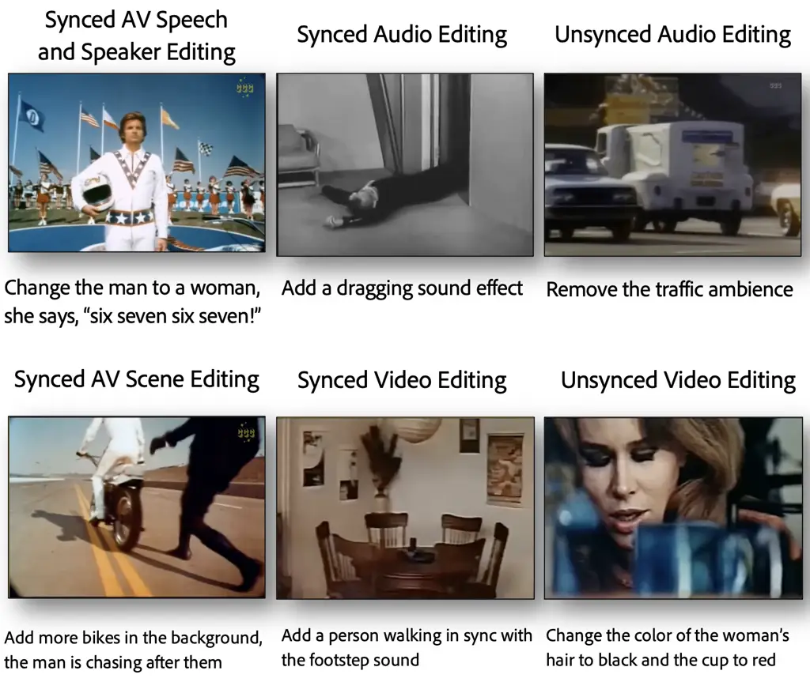
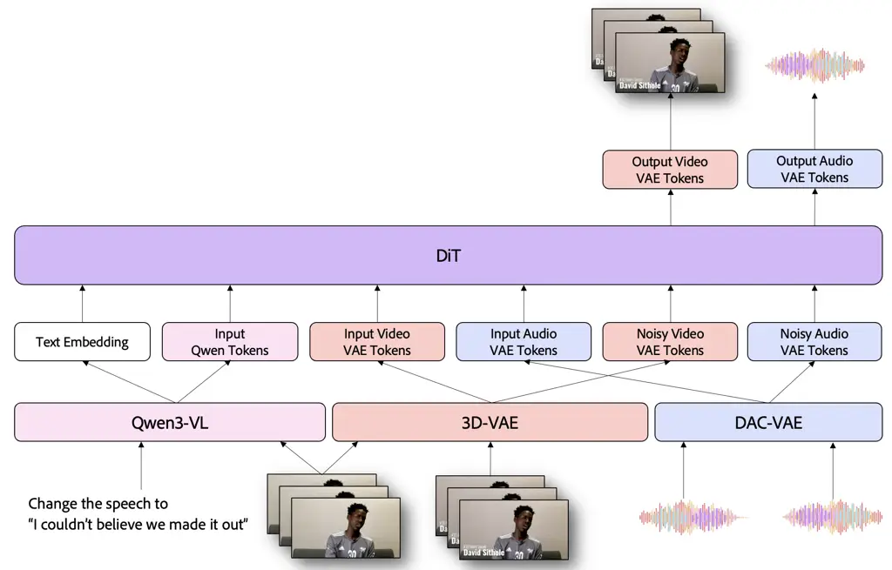
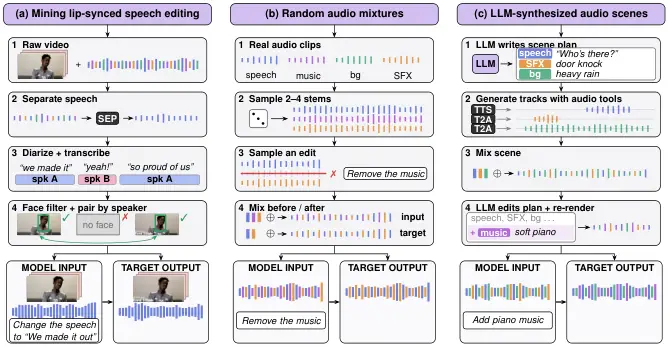
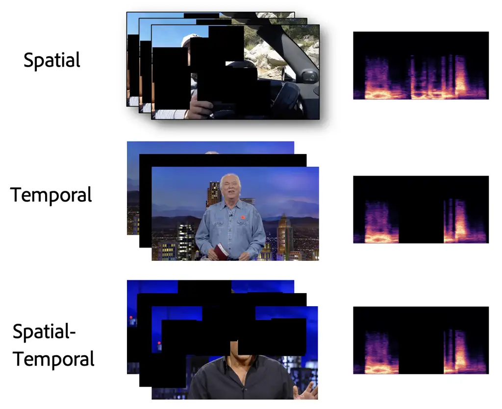
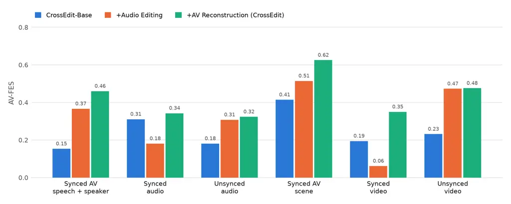
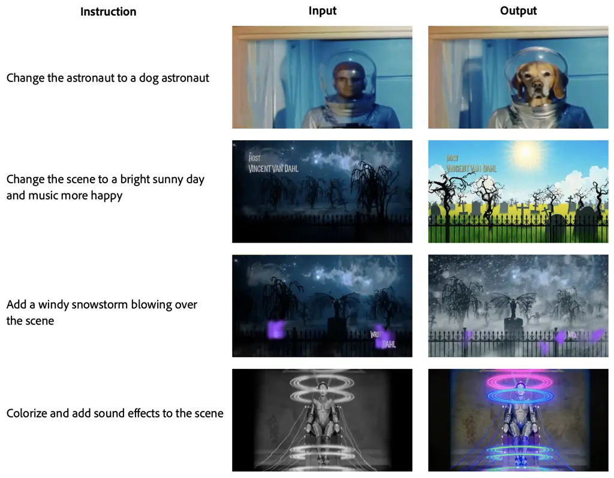
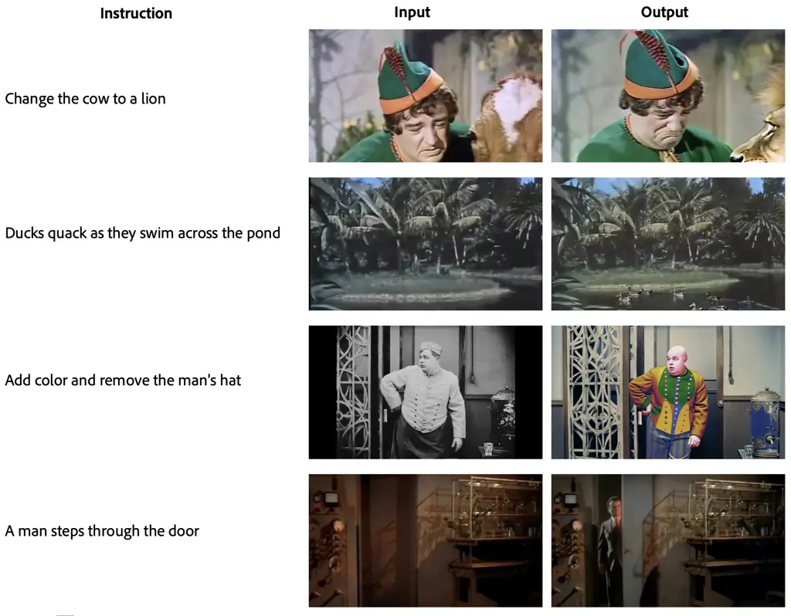
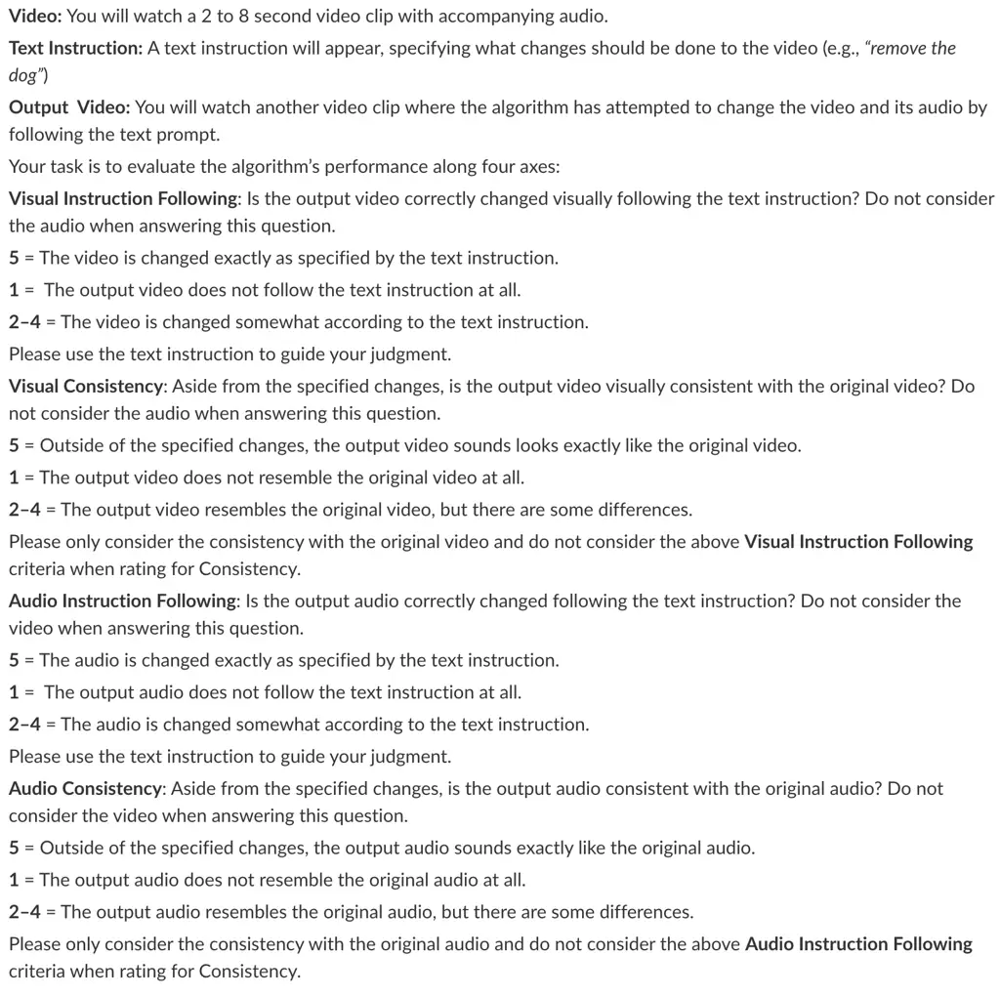
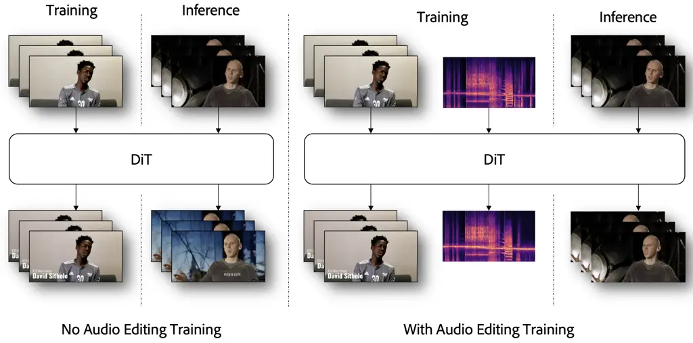

# CrossEdit: Cross-Modal Training Enables Rich Audio-Visual Editing

William Chen ^(†)^(†)thanks: Equal Contribution. \$†\$ Work done while
at Adobe. Email: [williamchen@cmu.edu](mailto:)    Prem Seetharaman
Email: [seethara@adobe.com](mailto:)    Ke Chen    Oriol Nieto    Kevin
Duarte    Siddarth Srinivasan Iyer    Mamshad Nayeem Rizve    Zhiwen Cao
   Shinji Watanabe    Yuanjun Xiong    Jiaming Zhang    Zeyu Jin   
Justin Salamon    Adobe Research    Carnegie Mellon University

###### Abstract

Multimedia editing requires generative models to interpret complex,
compositional instructions and modify only the desired elements across
modalities, a capability largely beyond existing systems. Current
approaches are typically limited to simple, single-attribute edits
within one modality, since diverse, high-quality editing pairs are hard
to obtain, especially for cross-modal tasks where aligned audiovisual
(AV) data is scarce. We present CrossEdit, a unified omni-modal editing
model for images, audio, and video that performs AV movie scene edits
zero-shot through cross-modal transfer. Our key observation is that
complex instruction-following, once learned in any modality, generalizes
to others. We exploit the additive nature of acoustic signals to
procedurally generate large-scale audio editing pairs with compositional
instructions, and show that fine-tuning on this synthetic data and
self-supervised AV masked reconstruction, alongside a targeted set of
curated cross-modal tasks, induces instruction-following that transfers
zero-shot to unseen modality and instruction combinations. To evaluate
this capability, we release CrossEditBench, a human-annotated benchmark
of AV edits on movie scenes, and propose AV-FES, a metric that jointly
scores instruction following and consistency. We show that our proposed
techniques improve performance on zero-shot AV movie scene editing,
while maintaining or improving performance on lip-synced speech editing
and standard image, video, and audio editing benchmarks. Demos are
available at
[https://wanchichen.github.io/crossedit/](https://wanchichen.github.io/crossedit/).

|     |
| --- |
|     |

## 1 Introduction

Recent advances in multi-modal generative models have enabled the
synthesis of images, video, and audio from natural language descriptions
(Wang et al., 2023a; Tian et al., 2026; Chen et al., 2026; Deng et al.,
2025; Zhou et al., 2025; Shi et al., 2024; Evans et al., 2025; Hung
et al., 2024), with rapidly improving fidelity and controllability. Yet
generation is only half the story. In practice, it is unlikely that a
generative model will produce exactly what a user desires in a single
attempt — natural language is inherently ambiguous, and creative
workflows are inherently iterative. Users will inevitably wish to modify
some aspects of generated media while preserving others. This is most
difficult for audio-visual (AV) content, where an edit such as adding a
motorbike to a street scene must change both picture and sound, keep
them synchronized, and leave everything else untouched.

Existing editing models, however, remain largely siloed by modality
(Chen et al., 2026; Wang et al., 2023b; Ellis et al., 2025; Lan et al.,
2025; Peng et al., 2024), and the few multi-modal systems support only
simple, single-attribute edits (e.g., “make her hair blue”). The
bottleneck is data: editing pairs are easy to construct for atomic,
single-modality edits, but AV-to-AV (AV2AV) pairs with compositional
instructions rarely occur naturally and are expensive to curate.

We present CrossEdit, an omni-modal editing model that can edit real
movie scenes from free-form instructions (Figure 1) zero-shot, without
ever being trained on such data. Our work rests on two hypotheses: (1)
complex instruction-following is modality-agnostic, so once learned in
one modality it transfers to others; and (2) masked AV reconstruction
can serve as a self-supervised AV2AV editing task. We operationalize the
first hypothesis by exploiting an asymmetry between auditory and visual
signals. Acoustic signals are physically additive (mixing waveforms
yields a valid audio scene), so large-scale pairs of complex
instructions and simulated mixtures can be easily generated, whereas
visual compositing lacks this physical fidelity. We hypothesize that
these synthetic audio editing pairs, combined with a core set of curated
cross-modal tasks (such as masked AV reconstruction), can better
generalize complex instruction-following capabilities across modalities.

To evaluate zero-shot AV2AV movie scene editing, we introduce
CrossEditBench, a human-annotated benchmark of edits on real movie
scenes that require jointly reasoning over the instruction, video, and
audio, and AV-FES, a novel metric that directly evaluates editing
performance with a single interpretable score. Our results show that our
proposed techniques allow the model to better perform AV2AV movie scene
editing without any training data for the task, while maintaining, if
not improving, performance on trained tasks such as video and image
editing.



Figure 1: Instruction types in CrossEditBench that CrossEdit must handle
zero-shot. Models must implicitly determine which modalities to edit and
what to synchronize across audio and video.

## 2 Related Work

#### Multi-modal foundation models.

Unifying images (Zhai et al., 2022; Ho et al., 2020; Song et al., 2021;
Salimans & Ho, 2022), video (Chen et al., 2024a), audio (Radford et al.,
2023; Pratap et al., 2023; Chen et al., 2024b; Chen et al., 2025b; Valle
et al., 2025), and text (Brown et al., 2020; Jaech et al., 2024; Yang
et al., 2025) within a single model has drawn significant attention
(Team et al., 2025; Bai et al., 2025b; Chu et al., 2024; Tian et al.,
2025b; Chen et al., 2026; Deng et al., 2025; Zhou et al., 2025). Most
work pairs visual or audio generation with text (Tian et al., 2025b;
Deng et al., 2025; Zhou et al., 2025; Tian et al., 2025a; Tian et al.,
2026; Liao et al., 2025), and any-to-any models (Luo et al., 2026; Tang
et al., 2024; Li et al., 2025) typically cannot output multiple
modalities simultaneously. Seedance 2.0 (Seedance et al., 2026),
LTX-2 (HaCohen et al., 2026), and UniAVGen (Zhang et al., 2025) achieve
synchronized AV synthesis via dual-stream diffusion transformers, but
can only generate, not edit.

#### Instruction-based media editing.

Editing has been explored within each modality: for images, via
synthetic editing triplets (Brooks et al., 2023; Zhang et al., 2023;
Geng et al., 2024; Zhao et al., 2024; Wei et al., 2025b); for video, via
temporal consistency mechanisms on image diffusion models (Wu et al.,
2023a; Geyer et al., 2023; Qi et al., 2023) and, more recently, large
editing datasets (Wu et al., 2025c; Bai et al., 2025a; He et al., 2025;
Wei et al., 2025a; Ju et al., 2026); and for audio, via mixtures of
real-world signals for a preset list of supported operations (Wang
et al., 2023b; Ellis et al., 2025; Huang et al., 2023), later extended
with LLM-generated instructions (Lan et al., 2025; Chen et al., 2026).
Early AV2AV works relied on cascaded pipelines (Ishii et al., 2025;
Polyak et al., 2024; Zheng et al., 2025) or sampling tricks applied to
uni-modal models (Lin et al., 2026). End-to-end AV editing has only
emerged recently, but concurrent works target narrower settings. For
example, SpongeBob (Liang et al., 2026) and InstructAV2AV (Zheng et al., 2026) only perform simpler instructions that are doable via inpainting,
such as addition and removal. Spongebob requires per-modality captions,
an object mask, and a reference image, so the user rather than the model
decides what changes in each modality; its code, weights, and benchmark
are also unreleased. Both train on paired AV editing data for their
target tasks and are AV-only, whereas CrossEdit is omni-modal and edits
real movie scenes from free-form instructions zero-shot. Most recently,
MiniMax H3 (MiniMax, 2026) unifies generation and editing of images,
audio, and video within a single model. To our knowledge, CrossEdit is
the first work to show that instruction-based AV2AV scene editing can be
acquired zero-shot through cross-modal transfer of instruction
following.

|                                    |                                          |           |     |       |
| ---------------------------------- | ---------------------------------------- | --------- | --- | ----- |
| Task                               | Example Instruction                      | Pre-train | SFT | Eval. |
| Editing                            |                                          |           |     |       |
| General image editing (I2I)        | “Make her hair blue”                     | ✓         | ✓   | §5.3  |
| General video editing (V2V)        | “Turn the car red”                       | ✓         | ✓   | §5.2  |
| Speech editing^(†) (A2A)           | “Change the speech to ‘See you soon”’    | ✓         | ✓   | –     |
| Complex audio editing (A2A)        | “Remove the music; make the rain louder” | ✗         | ✓   | §D    |
| Lip-synced speech editing (AV2AV)  | “Change the speech to ‘We made it out”’  | ✓         | ✓   | §5.1  |
| Masked inpainting (AV2AV)          | “Inpaint this video”                     | ✗         | ✓   | –     |
| Generation (no AV input)           |                                          |           |     |       |
| Text-to-X (T2I, T2V, T2A)          | “A dog barking in the rain”              | ✓         | ✓   | –     |
| Animation ({I,A,IA}2{V,AV})        | “A person talking”                       | ✓         | ✓   | –     |
| Zero-shot tasks (all AV2AV)        |                                          |           |     |       |
| Synced AV speech + speaker editing | “Change the man to a woman, she says…”   | ✗         | ✗   | §4    |
| Synced audio editing               | “Add a dragging sound effect”            | ✗         | ✗   | §4    |
| Unsynced audio editing             | “Remove the traffic ambience”            | ✗         | ✗   | §4    |
| Synced AV scene editing            | “Add more bikes in the background”       | ✗         | ✗   | §4    |
| Synced video editing               | “Add a person walking to the footsteps”  | ✗         | ✗   | §4    |
| Unsynced video editing             | “Change the woman’s hair to black”       | ✗         | ✗   | §4    |

Table 1: Training and Evaluation tasks for CrossEdit. Unlike trained
lip-synced speech editing, zero-shot speech + speaker edits also change
who is speaking. ^(†)Voice cloning only.

## 3 Training for Cross-Modal Transfer

Built on a shared backbone (Section 3.1), CrossEdit acquires zero-shot
AV scene editing from three data sources: mined lip-synced speech
editing pairs (Section 3.2), synthetic audio editing pairs with complex
instructions (Section 3.3), and AV masked reconstruction (Section 3.4).

### 3.1 Architecture

Let $`\mathcal{M}=\{\mathcal{I},\mathcal{A},\mathcal{V}\}`$ denote the
image ($`\mathcal{I}=\mathbb{R}^{H\times W\times 3}`$), audio
($`\mathcal{A}=\mathbb{R}^{T_{a}\times 2}`$), and video
($`\mathcal{V}=\mathbb{R}^{T_{v}\times H\times W\times 3}`$) spaces. We
model omni-modal editing as $`p_{\theta}(\hat{Y}\mid Y,X)`$, where $`X`$
is a natural language instruction, and $`Y=(y_{1},\ldots,y_{n})`$ and
$`\hat{Y}=(\hat{y}_{1},\ldots,\hat{y}_{k})`$ are input and output
sequences whose elements each belong to some modality
$`m\in\mathcal{M}`$, with their number and modalities varying across
examples. We parameterize $`p_{\theta}`$ with flow matching (Lipman
et al., 2023) on latent representations of $`\hat{Y}`$. Using the linear
interpolant $`\hat{Y}_{t}=(1-t)\hat{Y}_{0}+t\epsilon`$, where
$`\hat{Y}_{0}`$ is the clean target,
$`\epsilon\sim\mathcal{N}(0,\mathbf{I})`$, and $`t\in[0,1]`$, we train a
velocity field $`v_{\theta}`$ to regress $`\epsilon-\hat{Y}_{0}`$:

```math
\mathcal{L}=\mathbb{E}_{(Y,X,\hat{Y}_{0}),\epsilon,t}\left[\left\|v_{\theta}(\hat{Y}_{t},t,Y,X)-(\epsilon-\hat{Y}_{0})\right\|^{2}\right]. \tag{1}
```

We independently replace $`Y`$ and $`X`$ with a null token
$`\varnothing`$ at random during training, enabling classifier-free
guidance (CFG) (Ho & Salimans, 2021) (Appendix B.3). At inference, we
initialize $`\hat{Y}_{1}\sim\mathcal{N}(0,\mathbf{I})`$ and integrate
from $`t=1`$ to $`t=0`$ with an ODE solver.

In practice, $`p_{\theta}`$ is a DiT (Peebles & Xie, 2023) MoE (Shazeer
et al., 2017; Peng et al., 2026) (3B active, 12B total parameters).
Pre-trained VAEs (Kingma & Welling, 2014; Polyak et al., 2024; Kumar
et al., 2023) encode audio (48kHz stereo $`\rightarrow`$ 256-dim. at
40Hz) and visuals (images and video). The visual VAE supports variable
resolutions, mapping e.g. 512px to 48-dim. 32$`\times`$32 latents at a
fixed framerate (24 FPS $`\rightarrow`$ 6 FPS). Following Wu et al.
(2025a), text, images, and video also receive clean semantic embeddings
from a pre-trained Qwen3-VL (Bai et al., 2025b).



Figure 2: Architecture of CrossEdit when encoding AV data. For
simplicity, we omit images, which are treated as a special case of
single-frame video.

### 3.2 Mining Lip-Synced Speech Editing Pairs

To teach lip-synced speech editing, we mine pairs in which the same
on-screen speaker says different sentences from in-the-wild,
commercially usable or licensed videos. These cover only speech content
edits, not scene edits (Section 3.5). For each video, we (1) remove
non-speech audio with a language-queried source separation model (Liu
et al., 2022; Wen et al., 2026); (2) segment and transcribe it with a
speaker diarization model similar to Bredin et al. (2020), yielding
transcripts, speaker labels, and time segments; (3) run face detection
and tracking (Deng et al., 2020), discarding segments where a face is
missing or goes off-screen; and (4) group retained segments by speaker
to form before/after pairs. Filtering discards $`\sim`$96% of the source
data, but since each speaker yields many pairs, the overall yield is
$`\sim`$20% (e.g., 100K clips yield 20K pairs).

### 3.3 Audio Editing Data Synthesis

Mined data alone is small, biased toward clean speech, and often
inconsistent between input and output (e.g., differing background
noise). We therefore complement it with synthetic audio editing data
from two sources: (1) random mixtures of 2–4 audio files, each from one
of four classes (speech, music, background, sound effect), following
Kumar et al. (2026), which give acoustically plausible but semantically
incoherent scenes of real audio; and (2) scenes synthesized by a
tool-calling LLM equipped with generative audio models, following Chen
et al. (2026), which yield more natural audio scenes that are more
similar to that found in the real world, but with synthetically
generated audio. Combining both sources yields a large-scale dataset of
compositional instructions that overcomes the weaknesses of the mined
data and helps the model generalize to unseen acoustic scenes; as we
show in Section 4, the instruction following it teaches also transfers
to AV movie scene editing.



Figure 3: Editing data sources. (a) Our pipeline for mining lip-synced
speech editing pairs. (b) Random audio mixtures and (c) Synthetic audio
scenes provide audio editing pairs.

### 3.4 Audio-Visual Masked Reconstruction

While mined and synthetic pairs teach instruction following, neither
requires the model to generate new visual content within an existing AV
scene, and we find them insufficient for complex scene edits (Figure 1).
Inspired by video generation (Voleti et al., 2022) and cross-modal
representation learning (Shi et al., 2022; Hsu & Shi, 2022; Gong et al.,
2022), we frame AV masking as a self-supervised AV2AV editing task
(Figure 4). Each AV sample receives one of three maskings: temporal,
masking a random span of frames (and, 50% of the time, its audio);
spatial, applying $`s\sim\mathcal{U}\{0,S\}`$ masks of
200$`\times`$200px to all frames, with $`S{=}12`$ for our 540p videos;
or spatio-temporal, applying both. The model must reconstruct the
unmasked clip given the instruction “inpaint this video”.

### 3.5 Training

Given the scarcity of editing data, we start from an internal DiT
checkpoint pre-trained on the tasks in Table 1, which we call
CrossEdit-Base¹¹ 1 Pre-training includes the mined lip-synced speech
editing pairs (Section 3.2) but not the synthetic audio data
(Section 3.3) or masked reconstruction (Section 3.4).. CrossEdit-Base is
a performant omni-modal editing model on its own, but it cannot
consistently perform our target task of AV2AV movie scene editing. We
add the synthetic audio editing and masked reconstruction data and
fine-tune for 10K steps to obtain CrossEdit (data details, training
settings, and inference hyperparameters in Appendix B.2).

Our central goal is to perform AV2AV editing of complex movie scenes
without any AV2AV training data for those types of instructions. Table 1
lists every task CrossEdit sees during pre-training (aka CrossEdit-Base)
and supervised fine-tuning (SFT). In all of its training, CrossEdit sees
only two AV2AV instruction types: lip-synced speech editing
(Section 3.2) and masked inpainting (Section 3.4). The instructions in
Figure 1 (adding objects, removing ambience, changing speaker
attributes) appear only in single-modality editing data (I2I, V2V, A2A),
so AV2AV editing with them is zero-shot: it requires transferring
instruction following learned in other modalities. Section 4 evaluates
these zero-shot AV edits, and Section 5 checks that our techniques
maintain or improve trained-task performance.

## 4 Zero-Shot Audio-Visual Scene Editing

We now evaluate our central claim that cross-modal training enables AV
movie scene editing without AV scene editing data, using our proposed
benchmark (Section 4.1) and metric (Section 4.2).

### 4.1 CrossEditBench

As no public benchmark exists for instruction-based AV movie scene
editing, we release CrossEditBench: 100 clips from the evaluation split
of OSSL (Kim et al., 2025), which is built from public domain movies,
each annotated by humans with an edit instruction. Annotators also
specify what should change in each modality (e.g., “add a cow and remove
the music” $`\rightarrow`$ audio: \[add cow mooing, remove music\];
video: \[add cow\]), which we release for future fine-grained
evaluation.

Instructions vary along two axes (Figure 1): which modality the edit
targets and whether it must be synchronized across modalities. An
unsynced edit must leave the other modality untouched (removing traffic
ambience must not alter the video), while a synced edit must align with
it (an added dragging sound must start and stop with the on-screen
motion). This yields six categories (Table 1): unsynced audio, synced
audio, unsynced video, synced video, synced AV scene, and synced AV
speech and speaker editing. As none of them appear in AV2AV training
data (Section 3.5), CrossEditBench directly measures zero-shot transfer.
More examples are in Appendix C.1.



Figure 4: AV masked reconstruction schemes. All use the instruction
“Inpaint this video”.

### 4.2 AV-FES: Audio-Visual Faithful Edit Score

Existing automatic metrics for AV editing score the edited output in
isolation from the input or instruction and often remain disjoint across
modalities (Girdhar et al., 2023; Lin et al., 2026; Zheng et al., 2025;
Liang et al., 2026). Editing, as a highly conditional task, requires
comparing the output against both the instruction and the input. AV-FES
is grounded in two fundamental sub-scores often used in uni-modal
editing evaluations, Instruction Following and Consistency (Chen et al.,
2026; Guo et al., 2025; Ma et al., 2026), with respect to the text
instruction and input media. While both are often evaluated on a 5-point
Likert scale by a judge, such as a human annotator or LLM, the two axes
pull in opposite directions. Leaving the input untouched maximizes
consistency, while re-synthesizing the whole clip is the easiest way to
satisfy the instruction. This makes it difficult to evaluate editing
systems: how does one weigh gains in one sub-score against losses in the
other?

We observed that this relationship is similar to the sub-scores of the
commonly used $`F_{1}`$ metric: Precision (akin to Consistency) and
Recall (parallel to Instruction Following). Motivated by this analogy,
we therefore combine the two judge axes into a single score, the
Audio-Visual Faithful Edit Score (AV-FES), computed separately for the
video (V-FES) and audio (A-FES) modalities and averaged. For each input
clip $`Y`$ with instruction $`X`$, an LLM judge rates a system output
$`\hat{Y}`$ on instruction following with respect to $`X`$,
$`\mathrm{Ins}_{m}(\hat{Y})\in\{1,\dots,5\}`$, and consistency with
respect to $`Y`$, $`\mathrm{Cons}_{m}(\hat{Y})\in\{1,\dots,5\}`$, for
each modality $`m\in\{\mathcal{V},\mathcal{A}\}`$. We also rate the
unedited input $`Y`$ itself under the same instruction, yielding
$`\mathrm{Ins}_{m}(Y)`$: the score a system obtains by doing nothing.

#### Instruction Gain.

We first calculate the gain $`g_{m}(\hat{Y})`$, which quantifies the
amount of achievable improvement the system obtained over the unedited
input in Instruction Following:

```math
g_{m}(\hat{Y})\;=\;\operatorname{clip}_{[0,1]}\!\left(\frac{\mathrm{Ins}_{m}(\hat{Y})-\mathrm{Ins}_{m}(Y)}{5-\mathrm{Ins}_{m}(Y)}\right), \tag{2}
```

so $`g_{m}=0`$ for any output the judge rates no better than the input
(copying), and $`g_{m}=1`$ when the output reaches the maximum score.
Normalizing by the per-clip headroom $`5-\mathrm{Ins}_{m}(Y)`$ makes
clips comparable regardless of how much the judge credits the untouched
input.

#### Consistency.

To make the sub-scores comparable, we then map the Consistency rating to
the unit interval,
$`c_{m}(\hat{Y})\;=\;\frac{\mathrm{Cons}_{m}(\hat{Y})-1}{4}`$, so that
ratings of 5 and 1 map to 1 and 0.

#### Faithful Edit Score.

The per-modality FES is the harmonic mean of gain and consistency:

```math
\text{FES}_{m}(\hat{Y})\;=\;\frac{2\,g_{m}(\hat{Y})\,c_{m}(\hat{Y})}{g_{m}(\hat{Y})+c_{m}(\hat{Y})}, \tag{3}
```

with $`\text{FES}_{m}(\hat{Y})=0`$ when
$`g_{m}(\hat{Y})=c_{m}(\hat{Y})=0`$. A straight-through copy of the
input would score near $`0`$ since $`g_{m}\approx 0`$, whereas a full
re-synthesis that happens to satisfy the instruction is dragged down by
a low $`c_{m}`$. With V-FES $`=\text{FES}_{\mathcal{V}}`$ and A-FES
$`=\text{FES}_{\mathcal{A}}`$, the overall score for AV editing is their
average:

```math
\text{AV-FES}(\hat{Y})\;=\;\tfrac{1}{2}\left(\text{FES}_{\mathcal{V}}(\hat{Y})+\text{FES}_{\mathcal{A}}(\hat{Y})\right). \tag{4}
```

All scores are computed per clip. AV-FES therefore rewards edits for
each modality individually while penalizing unintended changes within a
single metric. Additional details are in Appendix C.3.

### 4.3 Results

Setup: We evaluate CrossEdit’s ability to edit entire AV scenes in a
zero-shot manner (Section 3.5) using CrossEditBench (Section 4.1). We
report AV-FES using Gemini 3.1 Pro (Section 4.2) and AV alignment via
ImageBind score (Girdhar et al., 2023). We compare to two concurrent
end-to-end models, (InstructAV2AV (Zheng et al., 2026) and the
production-grade, 33B-parameter MiniMax H3 (MiniMax, 2026)), modular
cascades (Lucy Edit (Decart AI, 2025) (V2V) + HY-Video-Foley XL/XXL
(Shan et al., 2025) (V2AV) and VACE (V2V) + Coherent (VA2A) (Jiang
et al., 2025; Ishii et al., 2025)), an agentic system (AVI-EDIT (Zheng
et al., 2025)), and zero-shot delta denoising (AvED (Lin et al., 2026)).
Subjective test details are in Appendix C.2.

Results: CrossEdit achieves the highest AV-FES, V-FES, and A-FES, driven
by the strongest instruction following in both modalities (Table 2). It
outperforms both concurrent end-to-end models, including MiniMax H3
(AV-FES 0.30 vs. 0.23) despite being under half its size (12B vs. 33B
parameters), which is competitive on video (V-FES 0.24 vs. 0.26) but
under-edits the audio (audio instruction following 2.77 vs. 3.70);
InstructAV2AV trails on both modalities (AV-FES 0.20). Cascades lack
cross-modal context, so the audio stage re-synthesizes the soundtrack
and audio consistency collapses. AvED stays close to the input,
attaining the highest ImageBind score but among the lowest gains, while
AVI-EDIT degrades the video. CrossEdit also improves over CrossEdit-Base
on every FES score (Section 4.4). Finally, our conclusions are robust to
the choice of judge: Qwen3-Omni (Xu et al., 2025) correlates with Gemini
at 0.90 (Pearson and Spearman) on system-level AV-FES, and both judges’
rankings closely match human ratings (AV-FES Pearson 0.92 and 0.96),
albeit over only 4–5 shared systems (Appendix C.4). Example outputs are
in Appendix C.1.

|                   |          |                     |                    |           |      |       |                    |           |      |       |                        |
| ----------------- | -------- | ------------------- | ------------------ | --------- | ---- | ----- | ------------------ | --------- | ---- | ----- | ---------------------- |
|                   |          | Overall             | Visual             |           |      |       | Audio              |           |      |       | Alignment              |
|                   |          |                     |                    | subscores |      |       |                    | subscores |      |       |                        |
|                   | Type     | AV-FES $`\uparrow`$ | V-FES $`\uparrow`$ | Gain      | Ins. | Cons. | A-FES $`\uparrow`$ | Gain      | Ins. | Cons. | ImageBind $`\uparrow`$ |
| Input Video       |          | –                   | –                  | –         | 2.81 | 3.97  | –                  | –         | 2.19 | 3.95  | 19.79                  |
| LucyEdit + HY-XL  | cascade  | 0.16                | 0.12               | 0.12      | 2.88 | 3.76  | 0.19               | 0.25      | 2.79 | 2.27  | 9.81                   |
| LucyEdit + HY-XXL | cascade  | 0.16                | 0.12               | 0.12      | 2.88 | 3.76  | 0.20               | 0.29      | 2.89 | 2.15  | 13.20                  |
| VACE + Coherent   | cascade  | 0.19                | 0.12               | 0.14      | 3.16 | 3.44  | 0.26               | 0.34      | 3.12 | 2.49  | 13.22                  |
| AvED              | sampling | 0.12                | 0.09               | 0.10      | 2.81 | 3.20  | 0.14               | 0.13      | 2.49 | 3.93  | 19.38                  |
| AVI-EDIT          | agentic  | 0.17                | 0.08               | 0.10      | 2.42 | 2.35  | 0.25               | 0.27      | 2.93 | 3.65  | 15.45                  |
| InstructAV2AV     | e2e      | 0.20                | 0.15               | 0.15      | 2.85 | 3.03  | 0.24               | 0.26      | 2.85 | 3.20  | 16.08                  |
| MiniMax H3        | e2e      | 0.23                | 0.24               | 0.23      | 3.14 | 3.38  | 0.22               | 0.22      | 2.77 | 3.70  | 18.90                  |
| CrossEdit-Base    | e2e      | 0.26                | 0.20               | 0.24      | 2.88 | 2.00  | 0.31               | 0.39      | 3.15 | 3.52  | 14.30                  |
| CrossEdit         | e2e      | 0.30                | 0.26               | 0.28      | 3.59 | 2.81  | 0.33               | 0.35      | 3.70 | 3.84  | 16.29                  |

Table 2: CrossEditBench AV zero-shot scene editing results. Gray columns
are the modality-specific FES subscores. Improvements due to our
proposed techniques are underlined.

### 4.4 Ablation of Training Methods

Table 3 reports human ratings, and the FES computed from them, as each
training component is added. CrossEdit-Base attempts edits but often
alters unrelated content, giving the lowest visual consistency of all
systems. Adding synthetic audio editing data, which contains no visual
content, improves instruction following in both modalities as well as
visual consistency, raising AV-FES from 0.26 to 0.35, consistent with
cross-modal transfer. AV masked reconstruction further improves all four
axes, reaching 0.43. The cascades best preserve the video but barely
follow visual instructions and overwrite the original soundtrack (AV-FES
0.11–0.14). On lip-synced speech editing, audio editing data likewise
improves visual consistency (Appendix C.2).

Figure 5 breaks down human-rated AV-FES by type. CrossEdit improves over
CrossEdit-Base in every category, with the largest gains on synced AV
scene edits (0.41 to 0.62), speech+speaker edits (0.15 to 0.46), and
unsynced video edits (0.23 to 0.48). Audio editing data alone helps most
on edits that mainly require following the instruction, but hurts synced
audio and synced video edits (0.31 to 0.18 and 0.19 to 0.06), where the
new content must be generated in time with the other modality. Adding AV
masked reconstruction recovers and surpasses CrossEdit-Base on both
(0.34 and 0.35), consistent with its role of teaching the model to
generate content that fits the existing scene.

|                                            |                     |                    |           |                 |                 |                    |           |                 |                 |
| ------------------------------------------ | ------------------- | ------------------ | --------- | --------------- | --------------- | ------------------ | --------- | --------------- | --------------- |
|                                            | Overall             | Visual             |           |                 |                 | Audio              |           |                 |                 |
|                                            |                     |                    | subscores |                 |                 |                    | subscores |                 |                 |
|                                            | AV-FES $`\uparrow`$ | V-FES $`\uparrow`$ | Gain      | Ins.            | Cons.           | A-FES $`\uparrow`$ | Gain      | Ins.            | Cons.           |
| Input                                      | –                   | –                  | –         | 2.75$`\pm`$0.24 | 4.71$`\pm`$0.11 | –                  | –         | 2.29$`\pm`$0.25 | 4.68$`\pm`$0.11 |
| LucyEdit + HY-XL                           | 0.11                | 0.14               | 0.12      | 2.61$`\pm`$0.25 | 3.93$`\pm`$0.20 | 0.08               | 0.16      | 2.17$`\pm`$0.20 | 1.74$`\pm`$0.20 |
| LucyEdit + HY-XXL                          | 0.14                | 0.17               | 0.15      | 2.74$`\pm`$0.21 | 3.58$`\pm`$0.20 | 0.12               | 0.17      | 2.22$`\pm`$0.20 | 1.95$`\pm`$0.21 |
| CrossEdit-Base                             | 0.26                | 0.25               | 0.34      | 2.85$`\pm`$0.20 | 2.37$`\pm`$0.19 | 0.27               | 0.32      | 2.89$`\pm`$0.21 | 2.80$`\pm`$0.21 |
|      + Audio Editing                       | 0.35                | 0.35               | 0.43      | 3.31$`\pm`$0.21 | 2.94$`\pm`$0.18 | 0.35               | 0.46      | 3.25$`\pm`$0.21 | 2.81$`\pm`$0.19 |
|     + AV Masked Reconstruction (CrossEdit) | 0.43                | 0.42               | 0.47      | 3.48$`\pm`$0.18 | 3.21$`\pm`$0.18 | 0.44               | 0.47      | 3.44$`\pm`$0.18 | 3.44$`\pm`$0.20 |

Table 3: Ablation on zero-shot AV scene editing with human ratings (344
per system; Ins. and Cons. with 95% CIs). Improvements over
CrossEdit-Base are underlined.



Figure 5: Human-rated AV-FES on CrossEditBench, by instruction category.

## 5 Retaining Omni-Modal Performance

Having shown that cross-modal training enables zero-shot AV scene
editing, we verify that it does not come at the expense of the
lip-synced speech editing, image editing, and video editing tasks
CrossEdit was trained on. We note that we primarily focus on the
comparison betwee CrossEdit and CrossEdit-Base, with other models shown
for reference. Results on audio editing are in Appendix D.

### 5.1 Lip-Synced Speech Editing

Setup: We use an internal set of 600 IMDB celebrity interviews. Given a
new spoken sentence, the model must regenerate the audio and video with
correspondingly synchronized lip movements and facial expressions
(Figure 2). We measure WER and WavLM (Chen et al., 2022) speaker
similarity (SPK) to the input; DINO (Oquab et al., 2024) similarity to
the input and across frames; AV sync via LSE-D and LSE-C (Chung &
Zisserman, 2017); and human ratings (Appendix C.2). As no public
end-to-end system exists, we compare to cascades of F5-TTS (Chen et al.,
2025c) with HuMo (Chen et al., 2025a) or StableAvatar (Tu et al., 2025),
which animate the first input frame.

Results: Our SFT improves speaker similarity, video input consistency,
and LSE-D, with minor gains in temporal consistency (Table 4). F5-TTS
remains stronger on WER and SPK as a dedicated TTS system, but the
cascades cannot preserve the input video, and human raters strongly
prefer both CrossEdit models, especially for video consistency.
Qualitatively, SFT mainly improves preservation of the input’s visual
background (Figure 9 in Appendix C.6), reflected in higher video
consistency. Our ablation (Table 8) attributes most of this gain to the
audio editing data: we hypothesize that simulated audio editing pairs
teach the model to edit only what is necessary.

|                 |                    |                  |                   |                    |                      |                    |                   |                    |                   |                    |
| --------------- | ------------------ | ---------------- | ----------------- | ------------------ | -------------------- | ------------------ | ----------------- | ------------------ | ----------------- | ------------------ |
|                 | Speech             |                  | Video             |                    | Sync                 |                    | Human Ratings     |                    |                   |                    |
|                 |                    |                  |                   |                    |                      |                    | Audio             |                    | Video             |                    |
|                 | WER $`\downarrow`$ | SPK $`\uparrow`$ | Time $`\uparrow`$ | Input $`\uparrow`$ | LSE-D $`\downarrow`$ | LSE-C $`\uparrow`$ | Ins. $`\uparrow`$ | Cons. $`\uparrow`$ | Ins. $`\uparrow`$ | Cons. $`\uparrow`$ |
| Input           | \-                 | \-               | \-                | \-                 | \-                   | \-                 | 3.29              | 4.39               | 3.29              | 4.50               |
| F5-TTS          | 7.5                | 89.3             | \-                | \-                 | \-                   | \-                 | \-                | \-                 | \-                | \-                 |
| \+ HuMo         | \-                 | \-               | 99.1              | 67.4               | 9.12                 | 5.88               | 3.30              | 2.97               | 2.60              | 2.10               |
| \+ StableAvatar | \-                 | \-               | 97.5              | 42.0               | 12.45                | 2.13               | 3.21              | 2.88               | 2.17              | 1.78               |
| CrossEdit-Base  | 10.3               | 86.9             | 99.1              | 90.0               | 9.00                 | 5.87               | 3.98              | 3.81               | 4.05              | 4.22               |
| CrossEdit       | 10.9               | 88.5             | 99.2              | 92.1               | 8.92                 | 5.64               | 3.96              | 3.82               | 4.02              | 4.42               |

Table 4: Lip-synced speech editing results. Improvements due to our
techniques are underlined.

### 5.2 Video Editing

Setup: We evaluate on EditVerseBench (Ju et al., 2026) with
GPT-4o-judged editing quality (Hurst et al., 2024), PickScore, text
alignment, and CLIP/DINO temporal consistency. Our goal is to retain
CrossEdit-Base’s performance: dedicated video editing models (InsV2V
(Cheng et al., 2024), Lucy Edit (Decart AI, 2025), and EditVerse (Ju
et al., 2026)) are included as reference points.

Results: Rather than merely retaining video editing performance, our
training improves 5 of 6 metrics over CrossEdit-Base (Table 5), and
CrossEdit remains in the range of dedicated models such as Lucy Edit. We
hypothesize that the synthetic audio data exposes the model to more
diverse instructions.

|                |                              |                         |                    |                    |                   |                   |
| -------------- | ---------------------------- | ----------------------- | ------------------ | ------------------ | ----------------- | ----------------- |
|                | VLM Judge                    | Quality                 | Text Align.        |                    | Temporal Cons.    |                   |
|                | Editing Quality $`\uparrow`$ | Pick Score $`\uparrow`$ | Frame $`\uparrow`$ | Video $`\uparrow`$ | CLIP $`\uparrow`$ | DINO $`\uparrow`$ |
| InsV2V         | 5.21                         | 19.39                   | 24.99              | 22.54              | 97.15             | 96.57             |
| Lucy Edit      | 5.89                         | 19.67                   | 26.00              | 23.11              | 98.49             | 98.38             |
| EditVerse      | 7.65                         | 20.07                   | 26.73              | 23.93              | 98.56             | 98.40             |
| CrossEdit-Base | 6.86                         | 19.42                   | 23.10              | 20.10              | 98.00             | 96.90             |
| CrossEdit      | 6.85                         | 19.82                   | 25.21              | 22.26              | 98.43             | 97.52             |

Table 5: Video editing on EditVerseBench. Improvements from our
techniques are underlined.

### 5.3 Image Editing

Setup: We use ImgEdit (Ye et al., 2026), which scores 9 editing
categories with a GPT-4o judge. As with video, our goal is to retain
CrossEdit-Base’s performance; open SOTA image editing models (Wu et al.,
2025b; Wu et al., 2025a; Lin et al., 2025; Deng et al., 2025) are
included only as reference points.

Results: Adding audio data and AV masked reconstruction slightly
improves the overall score over CrossEdit-Base (3.69 to 3.72), with
large gains in the Action, Adjust, Hybrid, and Remove categories
(Table 6). Both remain competitive with dedicated image models of
similar or larger size.

|                |        |      |        |         |         |        |            |       |        |        |         |
| -------------- | ------ | ---- | ------ | ------- | ------- | ------ | ---------- | ----- | ------ | ------ | ------- |
|                | Param. | Add  | Adjust | Extract | Replace | Remove | Background | Style | Hybrid | Action | Overall |
| BAGEL          | 14B    | 3.56 | 3.31   | 1.70    | 3.30    | 2.62   | 3.24       | 4.49  | 2.38   | 4.17   | 3.20    |
| UniWorld-V1    | 12B    | 3.82 | 3.64   | 2.27    | 3.47    | 3.24   | 2.99       | 4.21  | 2.96   | 2.74   | 3.26    |
| OmniGen2       | 7B     | 3.57 | 3.06   | 1.77    | 3.74    | 3.20   | 3.57       | 4.81  | 2.52   | 4.68   | 3.44    |
| Qwen-Image     | 20B    | 4.38 | 4.16   | 3.43    | 4.66    | 4.14   | 4.38       | 4.81  | 3.82   | 4.69   | 4.27    |
| CrossEdit-Base | 12B    | 4.37 | 4.06   | 1.48    | 3.61    | 3.43   | 3.88       | 4.54  | 3.22   | 4.48   | 3.69    |
| CrossEdit      | 12B    | 4.20 | 4.29   | 1.74    | 3.61    | 4.32   | 2.82       | 4.44  | 3.57   | 4.96   | 3.72    |

Table 6: Image editing results on ImgEdit (1–5, higher is better).
Dedicated image editing models are shown for reference, with scores from
Wu et al. (2025a)

## 6 Conclusion

We presented CrossEdit, an omni-modal editing model that edits real
movie scenes from free-form instructions zero-shot, enabled by two
complementary techniques: cross-modal transfer of instruction following
from synthetic audio editing data, and AV masked reconstruction as a
self-supervised editing task. We also introduced CrossEditBench and the
AV-FES metric for evaluating instruction-based AV movie scene editing.
CrossEdit outperforms cascaded, sampling-based, agentic, and SOTA
end-to-end models on these tasks while maintaining or improving
performance on lip-synced speech, image, and video editing.

### AI use statement

In this work, we used generative AI tools to generate synthetic
datasets, refine hypotheses, design or provide feedback on research
methodology or experiments, implement methods, support qualitative and
thematic data analysis, and to interpret results.

We have not used generative AI tools to help develop theoretical models
or conceptual frameworks, formulate mathematical claims, provide
critical ingredients for proving mathematical claims, assist in the
writing of proofs, assist with translation, or clean and reformat
dataset.

Additionally, we used generative AI tools to create or modify scientific
figures or images, create or edit software code, create artifacts, draft
parts of a research paper, search for information, edit a research paper
to improve readability, and identify relevant literature.

We have reviewed all AI-assisted work. LLM-generated code, figures, and
writing were verified and tested (if applicable) for correctness. We
take responsibility for the final content of this work, including text,
claims or artifacts produced with the aid of generative AI.

### Ethics statement

This research can help reduce the barrier to entry for creative uses of
multimedia, as professional video and audio editing software can be
complex to use. It can also reduce the cost of media production, as
editing can be used in place of reshoots. On the other hand, such
technologies can affect the labor market or even be used for malicious
causes. For example, the lip-synced speech editing capabilities of
CrossEdit can often result in outputs that are indistinguishable from
real videos, which can then be used for fraud, impersonation, or libel.
We condemn any use of our research for these causes. Due to the risks of
this technology, we do not plan on open-sourcing any code or pre-trained
checkpoints.

While most of our evaluations are conducted on data that reflects
real-world use cases of multi-media editing models (interviews, movie
clips, etc.), it does not consider all possible scenarios. For example,
we did not test our models on noisy home-made videos with reverberant
audio, as those are difficult to obtain annotations for and score. We
also only trained and tested the model on short video clips up to 10
seconds long. While it could theoretically work since it was trained on
audio up to 30 seconds long, long-form AV editing remains an open
challenging task.

### Reproducibility statement

Due to the risks of this technology for making realistic deepfakes and
the proprietary nature of the code and training data, the model
checkpoints will not be publicly released in their current form. To
support reproduction, we describe every component needed to re-implement
and evaluate CrossEdit:

- •
  Model: the formulation, flow-matching objective, and architecture
  (Section 3.1, Appendix A), and classifier-free guidance and sampling
  hyperparameters (Appendix B.3).
- •
  Training data: the lip-synced speech editing mining pipeline and its
  yield (Section 3.2), audio editing data synthesis (Section 3.3), and
  AV masked reconstruction (Section 3.4, Appendix B.1).
- •
  Training: pre-training tasks, SFT data mixture, optimizer, learning
  rate, and compute (Table 1, Appendix B.2, Table 7).
- •
  Evaluation: CrossEditBench construction (Section 4.1, Appendix C.1);
  the AV-FES definition, including edge cases (Section 4.2,
  Appendix C.3); judge models, rubric, and agreement across judges
  (Figure 8, Appendix C.4); the human evaluation protocol
  (Appendix C.2); and the lip-synced speech editing and audio editing
  test sets and metrics (Section 5.1, Appendices C.6 and D).

We will release the annotated CrossEditBench evaluation set, annotator
instructions, judge prompts, and model outputs on the demo page.

## References

- Bai et al. (2025a) Qingyan Bai, Qiuyu Wang, Hao Ouyang, Hanlin Wang,
  Wen Wang, Ka Leong Cheng, Shuailei Ma, Yanhong Zeng, Yue Yu, Zichen
  Liu, Yinghao Xu, Yujun Shen, and Qifeng Chen. Ditto: Scaling
  instruction-based video editing with a high-quality synthetic dataset,
  2025a. URL
  [https://openreview.net/forum?id=qUJZX8LwMp](https://openreview.net/forum?id=qUJZX8LwMp).
- Bai et al. (2025b) Shuai Bai, Yuxuan Cai, Ruizhe Chen, Keqin Chen,
  Xionghui Chen, Zesen Cheng, Lianghao Deng, Wei Ding, Chang Gao,
  Chunjiang Ge, et al. Qwen3-vl technical report. _arXiv preprint
  arXiv:2511.21631_, 2025b.
- Bredin et al. (2020) Hervé Bredin, Ruiqing Yin, Juan Manuel Coria,
  Gregory Gelly, Pavel Korshunov, Marvin Lavechin, Diego Fustes, Hadrien
  Titeux, Wassim Bouaziz, and Marie-Philippe Gill. Pyannote.audio:
  Neural building blocks for speaker diarization. In _ICASSP_, pp.
  7124–7128, 2020. doi: 10.1109/ICASSP40776.2020.9052974.
- Brooks et al. (2023) Tim Brooks, Aleksander Holynski, and Alexei A
  Efros. Instructpix2pix: Learning to follow image editing instructions.
  In _Proceedings of the IEEE/CVF conference on computer vision and
  pattern recognition_, pp. 18392–18402, 2023.
- Brown et al. (2020) Tom Brown, Benjamin Mann, Nick Ryder, Melanie
  Subbiah, Jared D Kaplan, Prafulla Dhariwal, Arvind Neelakantan, Pranav
  Shyam, Girish Sastry, Amanda Askell, Sandhini Agarwal, Ariel
  Herbert-Voss, Gretchen Krueger, Tom Henighan, Rewon Child, Aditya
  Ramesh, Daniel Ziegler, Jeffrey Wu, Clemens Winter, Chris Hesse, Mark
  Chen, Eric Sigler, Mateusz Litwin, Scott Gray, Benjamin Chess, Jack
  Clark, Christopher Berner, Sam McCandlish, Alec Radford, Ilya
  Sutskever, and Dario Amodei. Language models are few-shot learners. In
  _Proc. NeurIPS_, volume 33, pp. 1877–1901, 2020.
- Chen et al. (2024a) Boyuan Chen, Diego Martí Monsó, Yilun Du, Max
  Simchowitz, Russ Tedrake, and Vincent Sitzmann. Diffusion forcing:
  Next-token prediction meets full-sequence diffusion. _Advances in
  Neural Information Processing Systems_, 37:24081–24125, 2024a.
- Chen et al. (2025a) Liyang Chen, Tianxiang Ma, Jiawei Liu, Bingchuan
  Li, Zhuowei Chen, Lijie Liu, Xu He, Gen Li, Qian He, and Zhiyong Wu.
  Humo: Human-centric video generation via collaborative multi-modal
  conditioning. _arXiv preprint arXiv:2509.08519_, 2025a.
- Chen et al. (2022) Sanyuan Chen, Chengyi Wang, Zhengyang Chen, Yu Wu,
  Shujie Liu, Zhuo Chen, Jinyu Li, Naoyuki Kanda, Takuya Yoshioka, Xiong
  Xiao, Jian Wu, Long Zhou, Shuo Ren, Yanmin Qian, Yao Qian, Jian Wu,
  Michael Zeng, Xiangzhan Yu, and Furu Wei. WavLM: Large-scale
  self-supervised pre-training for full stack speech processing. _IEEE
  JSTSP_, 2022. doi: 10.1109/JSTSP.2022.3188113.
- Chen et al. (2024b) William Chen, Wangyou Zhang, Yifan Peng, Xinjian
  Li, Jinchuan Tian, Jiatong Shi, Xuankai Chang, Soumi Maiti, Karen
  Livescu, and Shinji Watanabe. Towards robust speech representation
  learning for thousands of languages. In Yaser Al-Onaizan, Mohit
  Bansal, and Yun-Nung Chen (eds.), _Proceedings of the 2024 Conference
  on Empirical Methods in Natural Language Processing_, pp. 10205–10224,
  Miami, Florida, USA, November 2024b. Association for Computational
  Linguistics. doi: 10.18653/v1/2024.emnlp-main.570. URL
  [https://aclanthology.org/2024.emnlp-main.570/](https://aclanthology.org/2024.emnlp-main.570/).
- Chen et al. (2025b) William Chen, Jinchuan Tian, Yifan Peng, Brian
  Yan, Chao-Han Huck Yang, and Shinji Watanabe. OWLS: Scaling laws for
  multilingual speech recognition and translation models. In
  _Forty-second International Conference on Machine Learning_, 2025b.
  URL
  [https://openreview.net/forum?id=xnPW7yYomF](https://openreview.net/forum?id=xnPW7yYomF).
- Chen et al. (2026) William Chen, Prem Seetharaman, Rithesh Kumar,
  Oriol Nieto, Shinji Watanabe, Justin Salamon, and Zeyu Jin. Audiochat:
  Unified audio storytelling, editing, and understanding with
  transfusion forcing. _arXiv preprint arXiv:2602.17097_, 2026.
- Chen et al. (2025c) Yushen Chen, Zhikang Niu, Ziyang Ma, Keqi Deng,
  Chunhui Wang, JianZhao JianZhao, Kai Yu, and Xie Chen. F5-TTS: A
  fairytaler that fakes fluent and faithful speech with flow matching.
  In Wanxiang Che, Joyce Nabende, Ekaterina Shutova, and Mohammad Taher
  Pilehvar (eds.), _Proceedings of the 63rd Annual Meeting of the
  Association for Computational Linguistics (Volume 1: Long Papers)_,
  pp. 6255–6271, Vienna, Austria, July 2025c. Association for
  Computational Linguistics. ISBN 979-8-89176-251-0. doi:
  10.18653/v1/2025.acl-long.313. URL
  [https://aclanthology.org/2025.acl-long.313/](https://aclanthology.org/2025.acl-long.313/).
- Cheng et al. (2024) Jiaxin Cheng, Tianjun Xiao, and Tong He.
  Consistent video-to-video transfer using synthetic dataset. In _The
  Twelfth International Conference on Learning Representations_, 2024.
  URL
  [https://openreview.net/forum?id=IoKRezZMxF](https://openreview.net/forum?id=IoKRezZMxF).
- Chu et al. (2024) Yunfei Chu, Jin Xu, Qian Yang, Haojie Wei, Xipin
  Wei, Zhifang Guo, Yichong Leng, Yuanjun Lv, Jinzheng He, Junyang Lin,
  et al. Qwen2-audio technical report. _arXiv preprint
  arXiv:2407.10759_, 2024.
- Chung & Zisserman (2017) Joon Son Chung and Andrew Zisserman. Out of
  time: Automated lip sync in the wild. In Chu-Song Chen, Jiwen Lu, and
  Kai-Kuang Ma (eds.), _Computer Vision – ACCV 2016 Workshops_, pp.
  251–263, Cham, 2017. Springer International Publishing. ISBN
  978-3-319-54427-4.
- Decart AI (2025) Decart AI. Lucy edit: Open-weight text-guided video
  editing, 2025. URL
  [https://d2drjpuinn46lb.cloudfront.net/Lucy_Edit\_\_High_Fidelity_Text_Guided_Video_Editing.pdf](https://d2drjpuinn46lb.cloudfront.net/Lucy_Edit__High_Fidelity_Text_Guided_Video_Editing.pdf).
- Deng et al. (2025) Chaorui Deng, Deyao Zhu, Kunchang Li, Chenhui Gou,
  Feng Li, Zeyu Wang, Shu Zhong, Weihao Yu, Xiaonan Nie, Ziang Song,
  et al. Emerging properties in unified multimodal pretraining. _arXiv
  preprint arXiv:2505.14683_, 2025.
- Deng et al. (2020) Jiankang Deng, Jia Guo, Evangelos Ververas, Irene
  Kotsia, and Stefanos Zafeiriou. Retinaface: Single-shot multi-level
  face localisation in the wild. In _Proceedings of the IEEE/CVF
  conference on computer vision and pattern recognition_, pp.
  5203–5212, 2020.
- Ellis et al. (2025) Daniel P. W. Ellis, Eduardo Fonseca, Ron J. Weiss,
  Kevin Wilson, Scott Wisdom, Hakan Erdogan, John R. Hershey, Aren
  Jansen, R. Channing Moore, and Manoj Plakal. Recomposer:
  Event-roll-guided generative audio editing, 2025. URL
  [https://arxiv.org/abs/2509.05256](https://arxiv.org/abs/2509.05256).
- Evans et al. (2025) Zach Evans, Julian D. Parker, CJ Carr, Zack
  Zukowski, Josiah Taylor, and Jordi Pons. Stable audio open. In _ICASSP
  2025 - 2025 IEEE International Conference on Acoustics, Speech and
  Signal Processing (ICASSP)_, pp. 1–5, 2025. doi:
  10.1109/ICASSP49660.2025.10888461.
- Geng et al. (2024) Zigang Geng, Binxin Yang, Tiankai Hang, Chen Li,
  Shuyang Gu, Ting Zhang, Jianmin Bao, Zheng Zhang, Houqiang Li, Han Hu,
  et al. Instructdiffusion: A generalist modeling interface for vision
  tasks. In _Proceedings of the IEEE/CVF Conference on computer vision
  and pattern recognition_, pp. 12709–12720, 2024.
- Geyer et al. (2023) Michal Geyer, Omer Bar-Tal, Shai Bagon, and Tali
  Dekel. Tokenflow: Consistent diffusion features for consistent video
  editing. _arXiv preprint arXiv:2307.10373_, 2023.
- Girdhar et al. (2023) Rohit Girdhar, Alaaeldin El-Nouby, Zhuang Liu,
  Mannat Singh, Kalyan Vasudev Alwala, Armand Joulin, and Ishan Misra.
  Imagebind: One embedding space to bind them all. In _Proceedings of
  the IEEE/CVF Conference on Computer Vision and Pattern Recognition
  (CVPR)_, pp. 15180–15190, June 2023.
- Gong et al. (2022) Yuan Gong, Andrew Rouditchenko, Alexander H Liu,
  David Harwath, Leonid Karlinsky, Hilde Kuehne, and James Glass.
  Contrastive audio-visual masked autoencoder. _arXiv preprint
  arXiv:2210.07839_, 2022.
- Guo et al. (2025) Yuxin Guo, Teng Wang, Yuying Ge, Shijie Ma, Yixiao
  Ge, Wei Zou, and Ying Shan. Audiostory: Generating long-form narrative
  audio with large language models. _arXiv preprint
  arXiv:2508.20088_, 2025.
- HaCohen et al. (2026) Yoav HaCohen, Benny Brazowski, Nisan Chiprut,
  Yaki Bitterman, Andrew Kvochko, Avishai Berkowitz, Daniel Shalem,
  Daphna Lifschitz, Dudu Moshe, Eitan Porat, et al. Ltx-2: Efficient
  joint audio-visual foundation model. _arXiv preprint
  arXiv:2601.03233_, 2026.
- He et al. (2025) Haoyang He, Jie Wang, Jiangning Zhang, Zhucun Xue,
  Xingyuan Bu, Qiangpeng Yang, Shilei Wen, and Lei Xie. Openve-3m: A
  large-scale high-quality dataset for instruction-guided video editing.
  _arXiv preprint arXiv:2512.07826_, 2025.
- Ho & Salimans (2021) Jonathan Ho and Tim Salimans. Classifier-free
  diffusion guidance. In _NeurIPS 2021 Workshop on Deep Generative
  Models and Downstream Applications_, 2021. URL
  [https://openreview.net/forum?id=qw8AKxfYbI](https://openreview.net/forum?id=qw8AKxfYbI).
- Ho et al. (2020) Jonathan Ho, Ajay Jain, and Pieter Abbeel. Denoising
  diffusion probabilistic models. _Advances in neural information
  processing systems_, 33:6840–6851, 2020.
- Hsu & Shi (2022) Wei-Ning Hsu and Bowen Shi. u-hubert: Unified
  mixed-modal speech pretraining and zero-shot transfer to unlabeled
  modality. _Advances in Neural Information Processing Systems_,
  35:21157–21170, 2022.
- Huang et al. (2023) Jiawei Huang, Yi Ren, Rongjie Huang, Dongchao
  Yang, Zhenhui Ye, Chen Zhang, Jinglin Liu, Xiang Yin, Zejun Ma, and
  Zhou Zhao. Make-an-audio 2: Temporal-enhanced text-to-audio
  generation, 2023.
- Hung et al. (2024) Chia-Yu Hung, Navonil Majumder, Zhifeng Kong, Ambuj
  Mehrish, Amir Ali Bagherzadeh, Chuan Li, Rafael Valle, Bryan
  Catanzaro, and Soujanya Poria. Tangoflux: Super fast and faithful text
  to audio generation with flow matching and clap-ranked preference
  optimization. _arXiv preprint arXiv:2412.21037_, 2024.
- Hurst et al. (2024) Aaron Hurst, Adam Lerer, Adam P Goucher, Adam
  Perelman, Aditya Ramesh, Aidan Clark, AJ Ostrow, Akila Welihinda, Alan
  Hayes, Alec Radford, et al. Gpt-4o system card. _arXiv preprint
  arXiv:2410.21276_, 2024.
- Ishii et al. (2025) Masato Ishii, Akio Hayakawa, Takashi Shibuya, and
  Yuki Mitsufuji. Coherent audio-visual editing via conditional audio
  generation following video edits. _arXiv preprint
  arXiv:2512.07209_, 2025.
- Jaech et al. (2024) Aaron Jaech, Adam Kalai, Adam Lerer, Adam
  Richardson, Ahmed El-Kishky, Aiden Low, Alec Helyar, Aleksander Madry,
  Alex Beutel, Alex Carney, et al. Openai o1 system card. _arXiv
  preprint arXiv:2412.16720_, 2024.
- Jiang et al. (2025) Zeyinzi Jiang, Zhen Han, Chaojie Mao, Jingfeng
  Zhang, Yulin Pan, and Yu Liu. Vace: All-in-one video creation and
  editing. In _2025 IEEE/CVF International Conference on Computer Vision
  (ICCV)_, pp. 17191–17202. IEEE, 2025.
- Ju et al. (2026) Xuan Ju, Tianyu Wang, Yuqian Zhou, He Zhang, Qing
  Liu, Nanxuan Zhao, Zhifei Zhang, Yijun Li, Yuanhao Cai, Shaoteng Liu,
  Daniil Pakhomov, Zhe Lin, Soo Ye Kim, and Qiang Xu. Editverse:
  Unifying image and video editing and generation with in-context
  learning. In _The Fourteenth International Conference on Learning
  Representations_, 2026. URL
  [https://openreview.net/forum?id=blJXE07r7I](https://openreview.net/forum?id=blJXE07r7I).
- Kilgour et al. (2019) Kevin Kilgour, Mauricio Zuluaga, Dominik Roblek,
  and Matthew Sharifi. Fréchet Audio Distance: A Reference-Free Metric
  for Evaluating Music Enhancement Algorithms. In _Interspeech 2019_,
  pp. 2350–2354, 2019. doi: 10.21437/Interspeech.2019-2219.
- Kim et al. (2019) Chris Dongjoo Kim, Byeongchang Kim, Hyunmin Lee, and
  Gunhee Kim. AudioCaps: Generating captions for audios in the wild. In
  Jill Burstein, Christy Doran, and Thamar Solorio (eds.), _Proceedings
  of the 2019 Conference of the North American Chapter of the
  Association for Computational Linguistics: Human Language
  Technologies, Volume 1 (Long and Short Papers)_, pp. 119–132,
  Minneapolis, Minnesota, June 2019. Association for Computational
  Linguistics. doi: 10.18653/v1/N19-1011. URL
  [https://aclanthology.org/N19-1011/](https://aclanthology.org/N19-1011/).
- Kim et al. (2025) Haven Kim, Zachary Novack, Weihan Xu, Julian
  McAuley, and Hao-Wen Dong. Video-guided text-to-music generation using
  public domain movie collections. In _Ismir 2025 Hybrid
  Conference_, 2025.
- Kingma & Welling (2014) Diederik P. Kingma and Max Welling.
  Auto-encoding variational bayes. In Yoshua Bengio and Yann LeCun
  (eds.), _2nd International Conference on Learning Representations,
  ICLR 2014, Banff, AB, Canada, April 14-16, 2014, Conference Track
  Proceedings_, 2014. URL
  [http://arxiv.org/abs/1312.6114](http://arxiv.org/abs/1312.6114).
- Kumar et al. (2023) Rithesh Kumar, Prem Seetharaman, Alejandro Luebs,
  Ishaan Kumar, and Kundan Kumar. High-fidelity audio compression with
  improved rvqgan. _Advances in Neural Information Processing Systems_,
  36:27980–27993, 2023.
- Kumar et al. (2026) Sonal Kumar, Prem Seetharaman, Ke Chen, Oriol
  Nieto, Jiaqi Su, Zhepei Wang, Rithesh Kumar, Dinesh Manocha,
  Nicholas J. Bryan, Zeyu Jin, and Justin Salamon. TAC: Timestamped
  Audio Captioning. _arXiv preprint arXiv:2602.15766_, 2026.
- Lan et al. (2025) Zitong Lan, Yiduo Hao, and Mingmin Zhao. Guiding
  audio editing with audio language model. _arXiv preprint
  arXiv:2509.21625_, 2025.
- Li et al. (2025) Shufan Li, Konstantinos Kallidromitis, Akash Gokul,
  Zichun Liao, Yusuke Kato, Kazuki Kozuka, and Aditya Grover. Omniflow:
  Any-to-any generation with multi-modal rectified flows. In
  _Proceedings of the Computer Vision and Pattern Recognition
  Conference_, pp. 13178–13188, 2025.
- Liang et al. (2026) Sen Liang, Cong Wang, Fengbin Guan, Zhentao Yu,
  Yiting Lu, Yuanzhi Wang, Yuan Zhou, Xin Li, and Zhibo Chen. Spongebob:
  Sync-aware harmonious audio-visual generative editing. _arXiv preprint
  arXiv:2605.25193_, 2026.
- Liao et al. (2025) Chao Liao, Liyang Liu, Xun Wang, Zhengxiong Luo,
  Xinyu Zhang, Wenliang Zhao, Jie Wu, Liang Li, Zhi Tian, and Weilin
  Huang. Mogao: An omni foundation model for interleaved multi-modal
  generation. _arXiv preprint arXiv:2505.05472_, 2025.
- Lin et al. (2025) Bin Lin, Zongjian Li, Xinhua Cheng, Yuwei Niu, Yang
  Ye, Xianyi He, Shenghai Yuan, Wangbo Yu, Shaodong Wang, Yunyang Ge,
  et al. Uniworld-v1: High-resolution semantic encoders for unified
  visual understanding and generation. _arXiv preprint
  arXiv:2506.03147_, 2025.
- Lin et al. (2026) Yan-Bo Lin, Kevin Lin, Zhengyuan Yang, Linjie Li,
  Jianfeng Wang, Chung-Ching Lin, Xiaofei Wang, Gedas Bertasius, and
  Lijuan Wang. Zero-shot audio-visual editing via cross-modal delta
  denoising. In _2026 IEEE/CVF Winter Conference on Applications of
  Computer Vision (WACV)_, pp. 7344–7354. IEEE, 2026.
- Lipman et al. (2023) Yaron Lipman, Ricky T. Q. Chen, Heli Ben-Hamu,
  Maximilian Nickel, and Matthew Le. Flow matching for generative
  modeling. In _The Eleventh International Conference on Learning
  Representations_, 2023. URL
  [https://openreview.net/forum?id=PqvMRDCJT9t](https://openreview.net/forum?id=PqvMRDCJT9t).
- Liu et al. (2022) Xubo Liu, Haohe Liu, Qiuqiang Kong, Xinhao Mei,
  Jinzheng Zhao, Qiushi Huang, Mark D. Plumbley, and Wenwu Wang.
  Separate What You Describe: Language-Queried Audio Source Separation.
  In _Interspeech 2022_, pp. 1801–1805, 2022. doi:
  10.21437/Interspeech.2022-10894.
- Liu et al. (2025) Xubo Liu, Zhongkai Zhu, Haohe Liu, Yi Yuan, Qiushi
  Huang, Meng Cui, Jinhua Liang, Yin Cao, Qiuqiang Kong, Mark D.
  Plumbley, and Wenwu Wang. Wavjourney: Compositional audio creation
  with large language models. _IEEE Transactions on Audio, Speech and
  Language Processing_, 33:2830–2844, 2025. doi:
  10.1109/TASLPRO.2025.3574867.
- Loshchilov & Hutter (2019) Ilya Loshchilov and Frank Hutter. Decoupled
  weight decay regularization. In _International Conference on Learning
  Representations_, 2019. URL
  [https://openreview.net/forum?id=Bkg6RiCqY7](https://openreview.net/forum?id=Bkg6RiCqY7).
- Luo et al. (2026) Run Luo, Xiaobo Xia, Lu Wang, Longze Chen, Renke
  Shan, Jing Luo, Min Yang, and Tat-Seng Chua. NExt-OMNI: Towards
  any-to-any omnimodal foundation models with discrete flow matching. In
  _The Fourteenth International Conference on Learning
  Representations_, 2026. URL
  [https://openreview.net/forum?id=odatOcBi61](https://openreview.net/forum?id=odatOcBi61).
- Ma et al. (2026) Ziyang Ma, Ruiqi Yan, Ruiyang Xu, Jie Fang, Zhikang
  Niu, Yi-Wen Chao, Wenming Tu, Tianrui Wang, Qi Chen, Wenxi Chen,
  et al. Mmae: A massive multitask audio editing benchmark. _arXiv
  preprint arXiv:2606.07229_, 2026.
- MiniMax (2026) MiniMax. MiniMax H3: An open model breaking the
  boundaries between tasks and modalities.
  [https://www.minimax.io/blog/minimax-h3](https://www.minimax.io/blog/minimax-h3), 2026.
- Oquab et al. (2024) Maxime Oquab, Timothée Darcet, Théo Moutakanni,
  Huy V. Vo, Marc Szafraniec, Vasil Khalidov, Pierre Fernandez, Daniel
  HAZIZA, Francisco Massa, Alaaeldin El-Nouby, Mido Assran, Nicolas
  Ballas, Wojciech Galuba, Russell Howes, Po-Yao Huang, Shang-Wen Li,
  Ishan Misra, Michael Rabbat, Vasu Sharma, Gabriel Synnaeve, Hu Xu,
  Herve Jegou, Julien Mairal, Patrick Labatut, Armand Joulin, and Piotr
  Bojanowski. DINOv2: Learning robust visual features without
  supervision. _Transactions on Machine Learning Research_, 2024. ISSN
  2835-8856. URL
  [https://openreview.net/forum?id=a68SUt6zFt](https://openreview.net/forum?id=a68SUt6zFt).
  Featured Certification.
- Peebles & Xie (2023) William Peebles and Saining Xie. Scalable
  diffusion models with transformers. In _Proceedings of the IEEE/CVF
  international conference on computer vision_, pp. 4195–4205, 2023.
- Peng et al. (2026) Hongwu Peng, Ohiremen Dibua, Yuanjun Xiong, Yifan
  Gong, Jianming Zhang, and Yan Kang. Complete-mue: Optimal
  hyperparameter transfer and scaling for moe models. _arXiv
  preprint_, 2026.
- Peng et al. (2024) Puyuan Peng, Po-Yao Huang, Shang-Wen Li,
  Abdelrahman Mohamed, and David Harwath. VoiceCraft: Zero-shot speech
  editing and text-to-speech in the wild. In Lun-Wei Ku, Andre Martins,
  and Vivek Srikumar (eds.), _Proceedings of the 62nd Annual Meeting of
  the Association for Computational Linguistics (Volume 1: Long
  Papers)_, pp. 12442–12462, Bangkok, Thailand, August 2024. Association
  for Computational Linguistics. doi: 10.18653/v1/2024.acl-long.673. URL
  [https://aclanthology.org/2024.acl-long.673/](https://aclanthology.org/2024.acl-long.673/).
- Polyak et al. (2024) Adam Polyak, Amit Zohar, Andrew Brown, Andros
  Tjandra, Animesh Sinha, Ann Lee, Apoorv Vyas, Bowen Shi, Chih-Yao Ma,
  Ching-Yao Chuang, et al. Movie gen: A cast of media foundation models.
  _arXiv preprint arXiv:2410.13720_, 2024.
- Pratap et al. (2023) Vineel Pratap, Andros Tjandra, Bowen Shi, Paden
  Tomasello, Arun Babu, Sayani Kundu, Ali Elkahky, Zhaoheng Ni, Apoorv
  Vyas, Maryam Fazel-Zarandi, et al. Scaling speech technology to 1,000+
  languages. _arxiv:2305.13516_, 2023.
- Qi et al. (2023) Chenyang Qi, Xiaodong Cun, Yong Zhang, Chenyang Lei,
  Xintao Wang, Ying Shan, and Qifeng Chen. Fatezero: Fusing attentions
  for zero-shot text-based video editing. In _Proceedings of the
  IEEE/CVF International Conference on Computer Vision_, pp.
  15932–15942, 2023.
- Radford et al. (2023) Alec Radford, Jong Wook Kim, Tao Xu, Greg
  Brockman, Christine Mcleavey, and Ilya Sutskever. Robust speech
  recognition via large-scale weak supervision. In _ICML 2023_, 2023.
- Rombach et al. (2022) Robin Rombach, Andreas Blattmann, Dominik
  Lorenz, Patrick Esser, and Björn Ommer. High-resolution image
  synthesis with latent diffusion models. In _Proceedings of the
  IEEE/CVF conference on computer vision and pattern recognition_, pp.
  10684–10695, 2022.
- Salimans & Ho (2022) Tim Salimans and Jonathan Ho. Progressive
  distillation for fast sampling of diffusion models. In _International
  Conference on Learning Representations_, 2022. URL
  [https://openreview.net/forum?id=TIdIXIpzhoI](https://openreview.net/forum?id=TIdIXIpzhoI).
- Seedance et al. (2026) Team Seedance, De Chen, Liyang Chen, Xin Chen,
  Ying Chen, Zhuo Chen, Zhuowei Chen, Feng Cheng, Tianheng Cheng, Yufeng
  Cheng, et al. Seedance 2.0: Advancing video generation for world
  complexity. _arXiv preprint arXiv:2604.14148_, 2026.
- Seetharaman & Kumar (2026) Prem Seetharaman and Rithesh Kumar. Taming
  audio vaes via target-kl regularization. In _ICASSP 2026 - 2026 IEEE
  International Conference on Acoustics, Speech and Signal Processing
  (ICASSP)_, pp. 15487–15491, 2026. doi:
  10.1109/ICASSP55912.2026.11460662.
- Shan et al. (2025) Sizhe Shan, Qiulin Li, Yutao Cui, Miles Yang,
  Yuehai Wang, Qun Yang, Jin Zhou, and Zhao Zhong. Hunyuanvideo-foley:
  Multimodal diffusion with representation alignment for high-fidelity
  foley audio generation, 2025. URL
  [https://arxiv.org/abs/2508.16930](https://arxiv.org/abs/2508.16930).
- Shazeer et al. (2017) Noam Shazeer, \*Azalia Mirhoseini, \*Krzysztof
  Maziarz, Andy Davis, Quoc Le, Geoffrey Hinton, and Jeff Dean.
  Outrageously large neural networks: The sparsely-gated
  mixture-of-experts layer. In _International Conference on Learning
  Representations_, 2017. URL
  [https://openreview.net/forum?id=B1ckMDqlg](https://openreview.net/forum?id=B1ckMDqlg).
- Shi et al. (2022) Bowen Shi, Wei-Ning Hsu, Kushal Lakhotia, and
  Abdelrahman Mohamed. Learning audio-visual speech representation by
  masked multimodal cluster prediction. _arXiv preprint
  arXiv:2201.02184_, 2022.
- Shi et al. (2025) Bowen Shi, Andros Tjandra, John Hoffman, Helin Wang,
  Yi-Chiao Wu, Luya Gao, Julius Richter, Matt Le, Apoorv Vyas, Sanyuan
  Chen, Christoph Feichtenhofer, Piotr Dollár, Wei-Ning Hsu, and Ann
  Lee. Sam audio: Segment anything in audio, 2025. URL
  [https://arxiv.org/abs/2512.18099](https://arxiv.org/abs/2512.18099).
- Shi et al. (2024) Weijia Shi, Xiaochuang Han, Chunting Zhou, Weixin
  Liang, Xi Victoria Lin, Luke Zettlemoyer, and Lili Yu. Lmfusion:
  Adapting pretrained language models for multimodal generation. _arXiv
  preprint arXiv:2412.15188_, 2024.
- Song et al. (2021) Jiaming Song, Chenlin Meng, and Stefano Ermon.
  Denoising diffusion implicit models. In _International Conference on
  Learning Representations_, 2021. URL
  [https://openreview.net/forum?id=St1giarCHLP](https://openreview.net/forum?id=St1giarCHLP).
- Tang et al. (2024) Zineng Tang, Ziyi Yang, Mahmoud Khademi, Yang Liu,
  Chenguang Zhu, and Mohit Bansal. Codi-2: In-context interleaved and
  interactive any-to-any generation. In _Proceedings of the IEEE/CVF
  Conference on Computer Vision and Pattern Recognition_, pp.
  27425–27434, 2024.
- Team et al. (2025) Gemma Team, Aishwarya Kamath, Johan Ferret, Shreya
  Pathak, Nino Vieillard, Ramona Merhej, Sarah Perrin, Tatiana
  Matejovicova, Alexandre Ramé, Morgane Rivière, et al. Gemma 3
  technical report. _arXiv preprint arXiv:2503.19786_, 2025.
- Tian et al. (2025a) Jinchuan Tian, William Chen, Yifan Peng, Jiatong
  Shi, Siddhant Arora, Shikhar Bharadwaj, Takashi Maekaku, Yusuke
  Shinohara, Keita Goto, Xiang Yue, Huck Yang, and Shinji Watanabe.
  OpusLM: A Family of Open Unified Speech Language Models. In
  _Interspeech 2025_, pp. 3259–3263, 2025a. doi:
  10.21437/Interspeech.2025-1184.
- Tian et al. (2025b) Jinchuan Tian, Sang-gil Lee, Zhifeng Kong, Sreyan
  Ghosh, Arushi Goel, Chao-Han Huck Yang, Wenliang Dai, Zihan Liu,
  Hanrong Ye, Shinji Watanabe, et al. Ualm: Unified audio language model
  for understanding, generation and reasoning. _arXiv preprint
  arXiv:2510.12000_, 2025b.
- Tian et al. (2026) Jinchuan Tian, Haoran Wang, Bo-Hao Su, Chien-yu
  Huang, Qingzheng Wang, Jiatong Shi, William Chen, Xun Gong, Siddhant
  Arora, Chin-Jou Li, et al. Bagpiper: Solving open-ended audio tasks
  via rich captions. _arXiv preprint arXiv:2602.05220_, 2026.
- Tu et al. (2025) Shuyuan Tu, Yueming Pan, Yinming Huang, Xintong Han,
  Zhen Xing, Qi Dai, Chong Luo, Zuxuan Wu, and Yu-Gang Jiang.
  Stableavatar: Infinite-length audio-driven avatar video generation.
  _arXiv preprint arXiv:2508.08248_, 2025.
- Valle et al. (2025) Rafael Valle, Rohan Badlani, Zhifeng Kong, Sang
  gil Lee, Arushi Goel, Sungwon Kim, Joao Felipe Santos, Shuqi Dai,
  Siddharth Gururani, Aya Aljafari, Alexander H. Liu, Kevin J. Shih,
  Ryan Prenger, Wei Ping, Chao-Han Huck Yang, and Bryan Catanzaro.
  Fugatto 1: Foundational generative audio transformer opus 1. In _The
  Thirteenth International Conference on Learning
  Representations_, 2025. URL
  [https://openreview.net/forum?id=B2Fqu7Y2cd](https://openreview.net/forum?id=B2Fqu7Y2cd).
- Voleti et al. (2022) Vikram Voleti, Alexia Jolicoeur-Martineau, and
  Chris Pal. Mcvd-masked conditional video diffusion for prediction,
  generation, and interpolation. _Advances in neural information
  processing systems_, 35:23371–23385, 2022.
- Wan et al. (2025) Team Wan, Ang Wang, Baole Ai, Bin Wen, Chaojie Mao,
  Chen-Wei Xie, Di Chen, Feiwu Yu, Haiming Zhao, Jianxiao Yang, Jianyuan
  Zeng, Jiayu Wang, Jingfeng Zhang, Jingren Zhou, Jinkai Wang, Jixuan
  Chen, Kai Zhu, Kang Zhao, Keyu Yan, Lianghua Huang, Mengyang Feng,
  Ningyi Zhang, Pandeng Li, Pingyu Wu, Ruihang Chu, Ruili Feng, Shiwei
  Zhang, Siyang Sun, Tao Fang, Tianxing Wang, Tianyi Gui, Tingyu Weng,
  Tong Shen, Wei Lin, Wei Wang, Wei Wang, Wenmeng Zhou, Wente Wang,
  Wenting Shen, Wenyuan Yu, Xianzhong Shi, Xiaoming Huang, Xin Xu, Yan
  Kou, Yangyu Lv, Yifei Li, Yijing Liu, Yiming Wang, Yingya Zhang,
  Yitong Huang, Yong Li, You Wu, Yu Liu, Yulin Pan, Yun Zheng, Yuntao
  Hong, Yupeng Shi, Yutong Feng, Zeyinzi Jiang, Zhen Han, Zhi-Fan Wu,
  and Ziyu Liu. Wan: Open and advanced large-scale video generative
  models, 2025. URL
  [https://arxiv.org/abs/2503.20314](https://arxiv.org/abs/2503.20314).
- Wang et al. (2023a) Chengyi Wang, Sanyuan Chen, Yu Wu, Ziqiang Zhang,
  Long Zhou, Shujie Liu, Zhuo Chen, Yanqing Liu, Huaming Wang, Jinyu Li,
  et al. Neural codec language models are zero-shot text to speech
  synthesizers. _arXiv preprint arXiv:2301.02111_, 2023a.
- Wang et al. (2026) Helin Wang, Bowen Shi, Andros Tjandra, John
  Hoffman, Yi-Chiao Wu, Apoorv Vyas, Najim Dehak, Ann Lee, and Wei-Ning
  Hsu. Sam audio judge: A unified multimodal framework for perceptual
  evaluation of audio separation, 2026. URL
  [https://arxiv.org/abs/2601.19702](https://arxiv.org/abs/2601.19702).
- Wang et al. (2023b) Yuancheng Wang, Zeqian Ju, Xu Tan, Lei He,
  Zhizheng Wu, Jiang Bian, and sheng zhao. AUDIT: Audio editing by
  following instructions with latent diffusion models. In
  _Thirty-seventh Conference on Neural Information Processing Systems_,
  2023b. URL
  [https://openreview.net/forum?id=EO1KuHoR0V](https://openreview.net/forum?id=EO1KuHoR0V).
- Wei et al. (2025a) Cong Wei, Quande Liu, Zixuan Ye, Qiulin Wang,
  Xintao Wang, Pengfei Wan, Kun Gai, and Wenhu Chen. Univideo: Unified
  understanding, generation, and editing for videos. _arXiv preprint
  arXiv:2510.08377_, 2025a.
- Wei et al. (2025b) Cong Wei, Zheyang Xiong, Weiming Ren, Xeron Du,
  Ge Zhang, and Wenhu Chen. Omniedit: Building image editing generalist
  models through specialist supervision. In _The Thirteenth
  International Conference on Learning Representations_, 2025b. URL
  [https://openreview.net/forum?id=Hlm0cga0sv](https://openreview.net/forum?id=Hlm0cga0sv).
- Wen et al. (2026) Yutong Wen, Ke Chen, Prem Seetharaman, Oriol Nieto,
  Jiaqi Su, Rithesh Kumar, Minje Kim, Paris Smaragdis, Zeyu Jin, and
  Justin Salamon. Promptsep: Generative audio separation via multimodal
  prompting. In _ICASSP 2026-2026 IEEE International Conference on
  Acoustics, Speech and Signal Processing (ICASSP)_, pp. 14422–14426.
  IEEE, 2026.
- Wu et al. (2025a) Chenfei Wu, Jiahao Li, Jingren Zhou, Junyang Lin,
  Kaiyuan Gao, Kun Yan, Sheng-ming Yin, Shuai Bai, Xiao Xu, Yilei Chen,
  et al. Qwen-image technical report. _arXiv preprint arXiv:2508.02324_,
  2025a.
- Wu et al. (2025b) Chenyuan Wu, Pengfei Zheng, Ruiran Yan, Shitao Xiao,
  Xin Luo, Yueze Wang, Wanli Li, Xiyan Jiang, Yexin Liu, Junjie Zhou,
  et al. Omnigen2: Exploration to advanced multimodal generation. _arXiv
  preprint arXiv:2506.18871_, 2025b.
- Wu et al. (2023a) Jay Zhangjie Wu, Yixiao Ge, Xintao Wang,
  Stan Weixian Lei, Yuchao Gu, Yufei Shi, Wynne Hsu, Ying Shan, Xiaohu
  Qie, and Mike Zheng Shou. Tune-a-video: One-shot tuning of image
  diffusion models for text-to-video generation. In _Proceedings of the
  IEEE/CVF international conference on computer vision_, pp. 7623–7633,
  2023a.
- Wu et al. (2025c) Yuhui Wu, Liyi Chen, Ruibin Li, Shihao Wang, Chenxi
  Xie, and Lei Zhang. Insvie-1m: Effective instruction-based video
  editing with elaborate dataset construction. In _Proceedings of the
  IEEE/CVF International Conference on Computer Vision (ICCV)_, pp.
  16692–16701, October 2025c.
- Wu et al. (2023b) Yusong Wu, Ke Chen, Tianyu Zhang, Yuchen Hui, Taylor
  Berg-Kirkpatrick, and Shlomo Dubnov. Large-scale contrastive
  language-audio pretraining with feature fusion and keyword-to-caption
  augmentation. In _ICASSP 2023-2023 IEEE International Conference on
  Acoustics, Speech and Signal Processing (ICASSP)_, pp. 1–5. IEEE,
  2023b.
- Xu et al. (2025) Jin Xu, Zhifang Guo, Hangrui Hu, Yunfei Chu, Xiong
  Wang, Jinzheng He, Yuxuan Wang, Xian Shi, Ting He, Xinfa Zhu, et al.
  Qwen3-omni technical report. _arXiv preprint arXiv:2509.17765_, 2025.
- Yang et al. (2025) An Yang, Anfeng Li, Baosong Yang, Beichen Zhang,
  Binyuan Hui, Bo Zheng, Bowen Yu, Chang Gao, Chengen Huang, Chenxu Lv,
  et al. Qwen3 technical report. _arXiv preprint
  arXiv:2505.09388_, 2025.
- Ye et al. (2026) Yang Ye, Xianyi He, Zongjian Li, Bin Lin, Shenghai
  Yuan, Zhiyuan Yan, Bohan Hou, and Li Yuan. Imgedit: A unified image
  editing dataset and benchmark. In _The Thirty-ninth Annual Conference
  on Neural Information Processing Systems Datasets and Benchmarks
  Track_, 2026. URL
  [https://openreview.net/forum?id=uUCSrMlfD3](https://openreview.net/forum?id=uUCSrMlfD3).
- Zhai et al. (2022) Xiaohua Zhai, Alexander Kolesnikov, Neil Houlsby,
  and Lucas Beyer. Scaling vision transformers. In _Proceedings of the
  IEEE/CVF conference on computer vision and pattern recognition_, pp.
  12104–12113, 2022.
- Zhang et al. (2025) Guozhen Zhang, Zixiang Zhou, Teng Hu, Ziqiao Peng,
  Youliang Zhang, Yi Chen, Yuan Zhou, Qinglin Lu, and Limin Wang.
  Uniavgen: Unified audio and video generation with asymmetric
  cross-modal interactions. _arXiv preprint arXiv:2511.03334_, 2025.
- Zhang et al. (2023) Kai Zhang, Lingbo Mo, Wenhu Chen, Huan Sun, and
  Yu Su. Magicbrush: A manually annotated dataset for instruction-guided
  image editing. _Advances in Neural Information Processing Systems_,
  36:31428–31449, 2023.
- Zhao et al. (2024) Haozhe Zhao, Xiaojian Ma, Liang Chen, Shuzheng Si,
  Rujie Wu, Kaikai An, Peiyu Yu, Minjia Zhang, Qing Li, and Baobao
  Chang. Ultraedit: Instruction-based fine-grained image editing at
  scale. _Advances in Neural Information Processing Systems_,
  37:3058–3093, 2024.
- Zheng et al. (2025) Haojie Zheng, Shuchen Weng, Jingqi Liu, Siqi Yang,
  Boxin Shi, and Xinlong Wang. Avi-edit: Audio-sync video instance
  editing with granularity-aware mask refiner. _arXiv preprint
  arXiv:2512.10571_, 2025.
- Zheng et al. (2026) Haojie Zheng, Yixin Yang, Siqi Yang, Shuchen Weng,
  and Boxin Shi. Instructav2av: Instruction-guided audio-video joint
  editing. _arXiv preprint arXiv:2605.18467_, 2026.
- Zhou et al. (2025) Chunting Zhou, LILI YU, Arun Babu, Kushal Tirumala,
  Michihiro Yasunaga, Leonid Shamis, Jacob Kahn, Xuezhe Ma, Luke
  Zettlemoyer, and Omer Levy. Transfusion: Predict the next token and
  diffuse images with one multi-modal model. In _The Thirteenth
  International Conference on Learning Representations_, 2025. URL
  [https://openreview.net/forum?id=SI2hI0frk6](https://openreview.net/forum?id=SI2hI0frk6).

## Appendix A Architecture

CrossEdit consists of frozen modality-specific tokenizers and a latent
diffusion backbone (Rombach et al., 2022) (Figure 2). Each modality is
tokenized by a separate pre-trained VAE (Kingma & Welling, 2014):

- •
  Audio: a DAC-VAE (Polyak et al., 2024; Kumar et al., 2023; Seetharaman
  & Kumar, 2026) that encodes 48kHz stereo audio into 256-dimensional
  continuous latents at 40Hz, pre-trained on over 100K hours of speech,
  sound effects, and music.
- •
  Video: a 3D VAE similar to that of Wan et al. (2025). Although it
  supports variable resolutions and frame rates, we normalize all videos
  to 540p at 24 FPS, yielding 48-channel latents of 60$`\times`$34 at 6
  FPS.
- •
  Images: treated as single-frame video, yielding one 48-channel
  60$`\times`$34 latent frame for a 540p input.

Following Qwen-Image (Wu et al., 2025a), text, image, and video inputs
are additionally encoded into semantic embeddings by a pre-trained
Qwen3-VL (Bai et al., 2025b). The backbone is therefore conditioned on
clean Qwen3-VL embeddings and clean VAE latents of the input, and
denoises the VAE latents of the output. It is a DiT (Peebles & Xie, 2023) with MoE layers (Shazeer et al., 2017), and we use Complete-muE
(Peng et al., 2026) to transfer hyperparameters from small-scale
experiments.

## Appendix B Training Details

### B.1 Audio-Visual Masked Reconstruction

We frame AV masked reconstruction as a self-supervised AV2AV editing
task (Figure 4). Each AV sample is assigned one of three masking schemes
at random:

- •
  Temporal: a random span of video frames is masked, and with 50%
  probability the corresponding audio is zeroed out.
- •
  Spatial: we sample $`s\sim\mathcal{U}\{0,S\}`$ and apply $`s`$ masks
  of 200$`\times`$200px to all video frames. We found $`S{=}12`$ to work
  well for our 540p videos.
- •
  Spatio-temporal: both spatial and temporal masking are applied.

All three schemes use the same instruction (“inpaint this video”). The
model is conditioned on the masked clip as its input $`Y`$ and must
generate the clean, unmasked clip as its output $`\hat{Y}`$.

### B.2 Pre-Training and Supervised Fine-Tuning

Because editing data is scarce, we start from an internal DiT checkpoint
pre-trained on large-scale generation and editing data, which we call
CrossEdit-Base. Its pre-training tasks are:

- •
  Text-to-X: text-to-image, text-to-video, and text-to-audio
  (text-to-speech and text-to-sound effects).
- •
  Conditional generation: image-to-video, image-to-AV (talking head
  generation and animation), audio-to-video, audio-to-AV, and
  image+audio-to-video (lip-synced talking head generation).
- •
  Editing: image-to-image, video-to-video, audio-to-audio (voice cloning
  only), and AV-to-AV (lip-synced speech editing with the mined pairs of
  Section 3.2).

We then add the synthetic audio editing (Section 3.3) and AV masked
reconstruction (Appendix B.1) data and fine-tune for 10K steps to obtain
CrossEdit. SFT uses a constant learning rate of 1.2e-4, with AdamW
(Loshchilov & Hutter, 2019) optimizer states initialized from the
pre-trained checkpoint, and takes around 2.5 days on 64 H100 GPUs or 5
days on 64 A100 GPUs. The data mixture is shown in Table 7.

### B.3 Classifier-Free Guidance and Inference

During training, we independently replace the input $`Y`$ and the
instruction $`X`$ with a null token $`\varnothing`$ at random
(Section 3.1). This enables classifier-free guidance (CFG) (Ho &
Salimans, 2021) with separate guidance scales for fidelity to the input
($`\lambda_{Y}`$) and adherence to the instruction ($`\lambda_{X}`$).
The guided velocity is

```math
\displaystyle\tilde{v}_{\theta}(\hat{Y}_{t},t,Y,X)=v_{\theta}(\hat{Y}_{t},t,\varnothing,\varnothing) \displaystyle+\lambda_{Y}\left(v_{\theta}(\hat{Y}_{t},t,Y,\varnothing)-v_{\theta}(\hat{Y}_{t},t,\varnothing,\varnothing)\right) \tag{5}
```

```math
\displaystyle+\lambda_{X}\left(v_{\theta}(\hat{Y}_{t},t,Y,X)-v_{\theta}(\hat{Y}_{t},t,Y,\varnothing)\right),
```

which replaces $`v_{\theta}`$ when integrating from $`t=1`$ to $`t=0`$.
We use 50 sampling steps with $`\lambda_{Y}=\lambda_{X}=5.0`$ for video
and $`\lambda_{Y}=\lambda_{X}=3.0`$ for audio unless stated otherwise.

| Task                      | Tokens | Batch Samples |
| ------------------------- | ------ | ------------- |
| Audio                     |        |               |
| Synthesized Audio Editing | 0.5B   | 64            |
| Simulated Audio Editing   | 2.5B   | 208           |
| Text-to-Audio             | 0.3B   | 48            |
| Speech Editing            | 1.5B   | 96            |
| Video                     |        |               |
| Text to Video             | 1.3B   | 4             |
| Video to Video            | 1.3B   | 8             |
| Image+Audio to Video      | 3.2B   | 10            |
| Audio-Visual              |        |               |
| Text to AV                | 1.3B   | 4             |
| Lip-Synced Speech Editing | 2.0B   | 8             |
| Image                     |        |               |
| Image to Image            | 0.2B   | 12            |

Table 7: SFT data mixture by total tokens and samples per batch.
Video-to-video and lip-synced speech editing samples are replaced by AV
masked reconstruction (Section 3.4) with 50% probability.

## Appendix C Evaluation Details

### C.1 CrossEditBench

CrossEditBench evaluates editing of videos with audio on realistic use
cases. We annotate 100 clips from OSSL (Kim et al., 2025), an
open-source dataset of public-domain movies originally built for music
processing. Each annotation contains the edit instruction (“add a cow
and remove the music”), what should change in the audio (\[added: cow
mooing, removed: music\]), and what should change in the video (\[added:
cow\]). We do not use the per-modality annotations in this work but
release them to support fine-grained evaluation. As described in
Section 4.1, instructions vary in which modality they target and whether
they require AV synchrony: an edit may affect both modalities (adding a
barking dog), only one modality but in sync with the other (adding a
person walking in time with audible footsteps), or only one modality
without synchrony (removing the music). Benchmark examples are shown in
Figure 1, with additional inputs and outputs in Figures 6 and 7.



Figure 6: Example AV editing instructions, inputs, and outputs for
CrossEditBench/CrossEdit.



Figure 7: Example AV editing instructions, inputs, and outputs for
CrossEditBench/CrossEdit.

### C.2 Subjective Evaluation

For AV scene editing, we recruited 100 crowdsourced raters, restricted
to English speakers with at least 100 completed tasks and a task
approval rate of at least 98%, and required them to wear headphones.
Each rater rated 4 clips per system on a 1–5 scale (higher is better)
along four axes: visual instruction following, visual consistency, audio
instruction following, and audio consistency (instructions in Figure 8).
The unedited input is included as a control system to validate rater
attention: we exclude the 14 raters who gave it low consistency scores,
leaving 86 raters and 344 ratings per system. Full results with 95%
confidence intervals, including the + Audio Editing ablation for both
tasks, are in Table 3 (AV scene editing) and Table 8 (lip-synced speech
editing).

The study was a minimal-risk human evaluation task in which participants
viewed videos and provided quality ratings. No sensitive personal
information was collected, and participants were informed about the
nature of the task and the use of their responses for research purposes.
Participation was voluntary, and participants were compensated at
approximately \$15 USD per hour. Under our institution’s policies, this
type of study does not require IRB review or approval.



Figure 8: Instructions given to human annotators and the LLM Judges

|                                            |                 |                 |                 |                 |
| ------------------------------------------ | --------------- | --------------- | --------------- | --------------- |
|                                            | Audio           |                 | Video           |                 |
|                                            | Ins.            | Cons.           | Ins.            | Cons.           |
| Input                                      | 3.29$`\pm`$0.25 | 4.39$`\pm`$0.18 | 3.29$`\pm`$0.25 | 4.50$`\pm`$0.16 |
| F5-TTS+HuMo                                | 3.30$`\pm`$0.23 | 2.97$`\pm`$0.22 | 2.60$`\pm`$0.22 | 2.10$`\pm`$0.18 |
| F5-TTS+StableAvatar                        | 3.21$`\pm`$0.23 | 2.88$`\pm`$0.22 | 2.17$`\pm`$0.22 | 1.78$`\pm`$0.20 |
| CrossEdit-Base                             | 3.98$`\pm`$0.19 | 3.81$`\pm`$0.19 | 4.05$`\pm`$0.18 | 4.22$`\pm`$0.17 |
|      + Audio Editing                       | 3.86$`\pm`$0.20 | 3.82$`\pm`$0.20 | 3.99$`\pm`$0.19 | 4.35$`\pm`$0.16 |
|     + AV Masked Reconstruction (CrossEdit) | 3.96$`\pm`$0.20 | 3.82$`\pm`$0.20 | 4.02$`\pm`$0.19 | 4.42$`\pm`$0.15 |

Table 8: Full subjective results on IMDB lip-synced speech editing (1–5,
mean $`\pm`$ 95% confidence interval).

### C.3 AV-FES Details

#### Motivation.

Instruction following and consistency cannot individually measure
editing performance well. A system that returns its input untouched
scores perfectly on consistency, and a system that regenerates the whole
clip can score well on instruction following while discarding everything
the instruction did not mention. Neither axis alone answers the question
we care about: _did the system make the requested change and nothing
else?_ Even when both scores are available, it is difficult to weigh
increases in one score against drops in the other. AV-FES (Section 4.2)
answers it with a single score.

#### Zero headroom.

In the rare case that $`\mathrm{Ins}_{m}(Y)=5`$, the judge deems the
instruction already satisfied for modality $`m`$, and the gain in
Equation 2 is undefined. The correct action is then to leave the
modality alone, so we set
$`g_{m}(\hat{Y})=\mathbf{1}\!\left[\mathrm{Cons}_{m}(\hat{Y})\geq 4\right]`$.

#### Why the harmonic mean.

As in the $`F_{1}`$ score, $`g_{m}`$ plays the role of recall (how much
of the requested change was made) and $`c_{m}`$ that of precision (how
much of the output is free of unrequested change). The harmonic mean in
Equation 3 is high only when _both_ are high: an untouched copy scores
$`0`$ because $`g_{m}=0`$, and a full re-synthesis that happens to
satisfy the instruction is pulled down by its low $`c_{m}`$. When both
terms vanish, we set $`\text{FES}_{m}(\hat{Y})=0`$.

#### Range and ceiling.

AV-FES is bounded in $`[0,1]`$, is zero for the unedited input by
construction, and uses the same judge ratings as the Ins. and Cons.
subscores in Table 2. In practice, the Gemini judge awards at most 4 on
consistency even for byte-identical clips (cf. the input’s consistency
scores in Table 2), so $`c_{m}`$ saturates near $`0.75`$ and the
empirical ceiling of AV-FES for a flawless editor is about $`0.86`$
rather than $`1`$. This compresses the scale uniformly and does not
affect rankings.

#### Single-modality instructions.

When an instruction concerns only one modality, the correct behavior in
the other modality is to leave it unchanged. AV-FES therefore rewards
edits where they were requested and, through $`c_{m}`$, penalizes
collateral changes where they were not.

### C.4 Robustness to the Choice of Judge

To test whether our conclusions depend on the LLM judge, we re-score
CrossEditBench outputs with Qwen3-Omni (Xu et al., 2025) using the same
rubric and protocol as the Gemini 3.1 Pro results in Table 2 (100 clips
per system). Results for the systems in this paper are in Table 11. To
measure agreement between the judges, we compute system-level
correlations over a larger pool of 11 systems, including development
checkpoints not reported elsewhere in the paper and the unedited input
(Table 12). Because the input scores 0 under both judges by
construction, we also report correlations without it (10 systems). The
judges agree strongly on system rankings in both cases (AV-FES Pearson
0.87, Spearman 0.80 without the input), and both rank CrossEdit first
and CrossEdit-Base second among the reported systems. Agreement is
highest for video and lower for audio. Qwen3-Omni is considerably more
lenient, however: its scores span a range roughly two to three times
wider than Gemini’s, and it awards full consistency to the unedited
input. AV-FES values should therefore be compared only within a single
judge, not across judges.

We also compare each judge against the human ratings of Table 3, which
cover a subset of systems: 4 shared with Gemini (the two LucyEdit
cascades, CrossEdit-Base, and CrossEdit) and 5 shared with Qwen3-Omni
(additionally the + Audio Editing ablation). Both judges rank systems
much as humans do (Table 13), with the largest disagreement on
Qwen3-Omni’s visual consistency, where it rates CrossEdit above the
cascades while humans do not. With so few systems, these correlations
are coarse, and a single system can change them substantially.

### C.5 Confidence Intervals for LLM-Judge Scores

Tables 9 and 10 report 95% confidence intervals over the 100
CrossEditBench clips for both judges. CrossEdit’s AV-FES exceeds that of
every baseline under both judges; its margins over the cascades, AvED,
AVI-EDIT, and InstructAV2AV are well outside the intervals, while its
margin over MiniMax H3 is smaller but consistent across judges.

|                   |                  |                 |                 |                 |                     |                    |                     |
| ----------------- | ---------------- | --------------- | --------------- | --------------- | ------------------- | ------------------ | ------------------- |
|                   | Judge axes (1–5) |                 |                 |                 | Faithful Edit Score |                    |                     |
|                   | Vis. Ins.        | Vis. Cons.      | Aud. Ins.       | Aud. Cons.      | V-FES $`\uparrow`$  | A-FES $`\uparrow`$ | AV-FES $`\uparrow`$ |
| Input             | 2.81$`\pm`$0.19  | 3.97$`\pm`$0.03 | 2.19$`\pm`$0.10 | 3.95$`\pm`$0.05 | –                   | –                  | –                   |
| LucyEdit + HY-XL  | 2.88$`\pm`$0.15  | 3.76$`\pm`$0.16 | 2.79$`\pm`$0.18 | 2.27$`\pm`$0.07 | 0.12$`\pm`$0.02     | 0.19$`\pm`$0.04    | 0.16$`\pm`$0.03     |
| LucyEdit + HY-XXL | 2.88$`\pm`$0.16  | 3.76$`\pm`$0.16 | 2.89$`\pm`$0.17 | 2.15$`\pm`$0.10 | 0.12$`\pm`$0.04     | 0.20$`\pm`$0.05    | 0.16$`\pm`$0.03     |
| VACE + Coherent   | 3.16$`\pm`$0.17  | 3.44$`\pm`$0.16 | 3.12$`\pm`$0.17 | 2.49$`\pm`$0.14 | 0.12$`\pm`$0.04     | 0.26$`\pm`$0.04    | 0.19$`\pm`$0.03     |
| AvED              | 2.81$`\pm`$0.16  | 3.20$`\pm`$0.13 | 2.49$`\pm`$0.17 | 3.93$`\pm`$0.05 | 0.09$`\pm`$0.04     | 0.14$`\pm`$0.05    | 0.12$`\pm`$0.03     |
| AVI-EDIT          | 2.42$`\pm`$0.12  | 2.35$`\pm`$0.12 | 2.93$`\pm`$0.18 | 3.65$`\pm`$0.14 | 0.08$`\pm`$0.03     | 0.25$`\pm`$0.06    | 0.17$`\pm`$0.03     |
| InstructAV2AV     | 2.85$`\pm`$0.17  | 3.03$`\pm`$0.17 | 2.85$`\pm`$0.18 | 3.20$`\pm`$0.17 | 0.15$`\pm`$0.05     | 0.24$`\pm`$0.05    | 0.20$`\pm`$0.04     |
| MiniMax H3        | 3.14$`\pm`$0.16  | 3.38$`\pm`$0.15 | 2.77$`\pm`$0.18 | 3.70$`\pm`$0.11 | 0.24$`\pm`$0.06     | 0.22$`\pm`$0.06    | 0.23$`\pm`$0.04     |
| CrossEdit-Base    | 2.88$`\pm`$0.14  | 2.00$`\pm`$0.12 | 3.15$`\pm`$0.18 | 3.52$`\pm`$0.18 | 0.20$`\pm`$0.04     | 0.31$`\pm`$0.05    | 0.26$`\pm`$0.04     |
| CrossEdit         | 3.59$`\pm`$0.13  | 2.81$`\pm`$0.16 | 3.70$`\pm`$0.18 | 3.84$`\pm`$0.17 | 0.26$`\pm`$0.06     | 0.33$`\pm`$0.06    | 0.30$`\pm`$0.04     |

Table 9: CrossEditBench results with Gemini 3.1 Pro as the judge, with
95% confidence intervals (mean $`\pm`$ half-width over the 100 clips).
Means match Table 2.

|                   |                  |                 |                 |                 |                     |                    |                     |
| ----------------- | ---------------- | --------------- | --------------- | --------------- | ------------------- | ------------------ | ------------------- |
|                   | Judge axes (1–5) |                 |                 |                 | Faithful Edit Score |                    |                     |
|                   | Vis. Ins.        | Vis. Cons.      | Aud. Ins.       | Aud. Cons.      | V-FES $`\uparrow`$  | A-FES $`\uparrow`$ | AV-FES $`\uparrow`$ |
| Input             | 2.69$`\pm`$0.39  | 5.00$`\pm`$0.00 | 3.32$`\pm`$0.40 | 4.40$`\pm`$0.28 | –                   | –                  | –                   |
| LucyEdit + HY-XL  | 2.68$`\pm`$0.38  | 4.10$`\pm`$0.29 | 3.44$`\pm`$0.38 | 2.47$`\pm`$0.36 | 0.16$`\pm`$0.09     | 0.19$`\pm`$0.12    | 0.17$`\pm`$0.07     |
| LucyEdit + HY-XXL | 3.88$`\pm`$0.35  | 4.18$`\pm`$0.25 | 3.84$`\pm`$0.34 | 2.55$`\pm`$0.38 | 0.50$`\pm`$0.11     | 0.28$`\pm`$0.13    | 0.41$`\pm`$0.09     |
| VACE + Coherent   | 3.85$`\pm`$0.34  | 4.20$`\pm`$0.24 | 3.73$`\pm`$0.38 | 3.03$`\pm`$0.38 | 0.33$`\pm`$0.10     | 0.15$`\pm`$0.10    | 0.25$`\pm`$0.07     |
| AvED              | 3.70$`\pm`$0.37  | 4.48$`\pm`$0.18 | 3.68$`\pm`$0.36 | 4.23$`\pm`$0.30 | 0.46$`\pm`$0.12     | 0.26$`\pm`$0.13    | 0.37$`\pm`$0.09     |
| AVI-EDIT          | 3.19$`\pm`$0.39  | 2.59$`\pm`$0.33 | 4.32$`\pm`$0.30 | 3.02$`\pm`$0.39 | 0.39$`\pm`$0.10     | 0.33$`\pm`$0.13    | 0.36$`\pm`$0.08     |
| InstructAV2AV     | 3.77$`\pm`$0.36  | 4.25$`\pm`$0.21 | 4.44$`\pm`$0.28 | 3.79$`\pm`$0.35 | 0.54$`\pm`$0.12     | 0.58$`\pm`$0.15    | 0.55$`\pm`$0.09     |
| MiniMax H3        | 4.19$`\pm`$0.30  | 4.68$`\pm`$0.14 | 4.13$`\pm`$0.32 | 4.13$`\pm`$0.33 | 0.69$`\pm`$0.11     | 0.55$`\pm`$0.14    | 0.63$`\pm`$0.09     |
| CrossEdit-Base    | 4.16$`\pm`$0.32  | 3.10$`\pm`$0.29 | 4.60$`\pm`$0.24 | 3.03$`\pm`$0.36 | 0.55$`\pm`$0.09     | 0.41$`\pm`$0.13    | 0.49$`\pm`$0.08     |
| CrossEdit         | 4.61$`\pm`$0.23  | 4.44$`\pm`$0.20 | 4.72$`\pm`$0.20 | 4.36$`\pm`$0.27 | 0.80$`\pm`$0.08     | 0.74$`\pm`$0.12    | 0.77$`\pm`$0.07     |

Table 10: CrossEditBench results with Qwen3-Omni as the judge, with 95%
confidence intervals (mean $`\pm`$ half-width over the 100 clips). Means
match Table 11.

|                   |                  |            |           |            |                    |                    |                     |          |                     |
| ----------------- | ---------------- | ---------- | --------- | ---------- | ------------------ | ------------------ | ------------------- | -------- | ------------------- | ---------------------- |
|                   | Judge axes (1–5) |            |           |            |                    |                    |                     |          |                     |
|                   | Vis. Ins.        | Vis. Cons. | Aud. Ins. | Aud. Cons. | V-FES $`\uparrow`$ | A-FES $`\uparrow`$ | AV-FES $`\uparrow`$ | AV-FES$` | `$edit $`\uparrow`$ | No-gain $`\downarrow`$ |
| Input             | 2.69             | 5.00       | 3.32      | 4.40       | –                  | –                  | –                   | –        | –                   |
| LucyEdit + HY-XL  | 2.68             | 4.10       | 3.44      | 2.47       | 0.16               | 0.19               | 0.17                | 0.17     | 75                  |
| LucyEdit + HY-XXL | 3.88             | 4.18       | 3.84      | 2.55       | 0.50               | 0.28               | 0.41                | 0.38     | 55                  |
| VACE + Coherent   | 3.85             | 4.20       | 3.73      | 3.03       | 0.33               | 0.15               | 0.25                | 0.23     | 60                  |
| AvED              | 3.70             | 4.48       | 3.68      | 4.23       | 0.46               | 0.26               | 0.37                | 0.35     | 62                  |
| AVI-EDIT          | 3.19             | 2.59       | 4.32      | 3.02       | 0.39               | 0.33               | 0.36                | 0.40     | 53                  |
| MiniMax-H3        | 4.19             | 4.68       | 4.13      | 4.13       | 0.69               | 0.55               | 0.63                | 0.63     | 48                  |
| InstructAV2AV     | 3.77             | 4.25       | 4.44      | 3.79       | 0.54               | 0.58               | 0.55                | 0.56     | 50                  |
| CrossEdit-Base    | 4.16             | 3.10       | 4.60      | 3.03       | 0.55               | 0.41               | 0.49                | 0.50     | 38                  |
| CrossEdit         | 4.61             | 4.44       | 4.72      | 4.36       | 0.80               | 0.74               | 0.77                | 0.75     | 34                  |

Table 11: CrossEditBench results with Qwen3-Omni as the judge. Same
rubric and protocol as Table 2. AV-FES$`|`$edit averages FES\_(m) only
over clips whose instruction targets modality $`m`$. No-gain: number of
clips (out of 100) with zero instruction gain.

|          | All systems ($`n{=}13`$) |          |         |           |           | w/o input ($`n{=}12`$) |
| -------- | ------------------------ | -------- | ------- | --------- | --------- | ---------------------- | ----------- | ------------------ |
| Score    | Pearson                  | Spearman | Mean $` | `$diff$`  | `$        | Gemini range           | Qwen range  | Pearson / Spearman |
| V-FES    | 0.96                     | 0.95     | 0.356   | 0.00–0.29 | 0.00–0.80 | 0.95 / 0.93            |
| A-FES    | 0.74                     | 0.70     | 0.185   | 0.00–0.38 | 0.00–0.74 | 0.60 / 0.62            |
| AV-FES   | 0.90                     | 0.90     | 0.270   | 0.00–0.34 | 0.00–0.77 | 0.85 / 0.87            |
| AV-FES$` | `$edit                   | 0.89     | 0.87    | 0.215     | 0.00–0.45 | 0.00–0.75              | 0.83 / 0.83 |

Table 12: System-level agreement between Gemini 3.1 Pro and Qwen3-Omni
judges. Computed over 13 systems, including development checkpoints not
reported in the main paper and the unedited input, which scores 0 under
both judges by construction. The last column excludes the input (12
systems). AV-FES$`|`$edit averages FES\_(m) only over clips whose
instruction targets modality $`m`$. Mean $`|`$diff$`|`$ is in score
units.

|            |                |             |
| ---------- | -------------- | ----------- | ----------- |
| Score      | Gemini 3.1 Pro | Qwen3-Omni  |
| Vis. Ins.  | 0.93 / 1.00    | 0.82 / 1.00 |
| Vis. Cons. | 0.99 / 1.00    | 0.71 / 0.60 |
| Aud. Ins.  | 0.71 / 0.50    | 0.94 / 0.97 |
| Aud. Cons. | 1.00 / 0.90    | 0.93 / 1.00 |
| V-FES      | 0.92 / 1.00    | 0.90 / 1.00 |
| A-FES      | 0.84 / 0.50    | 0.99 / 1.00 |
| AV-FES     | 0.92 / 1.00    | 0.96 / 1.00 |
| AV-FES$`   | `$edit         | 0.94 / 0.90 | 0.97 / 1.00 |

Table 13: System-level agreement between LLM judges and human ratings
(Pearson / Spearman) over the systems shared with Table 3: $`n{=}4`$ for
Gemini 3.1 Pro and $`n{=}5`$ for Qwen3-Omni.

### C.6 Lip-Synced Speech Editing

Lip-synced speech editing is the task of generating new speech and
matching lip movements from an instruction and a reference AV clip; it
is the audio-visual counterpart of voice cloning (Figure 2). Our IMDB
test set consists of 600 two-second clips of different celebrities
talking. The videos are shot in varied environments and often include
challenging conditions such as multiple visible people (with only one
speaker), moving arms and hands, and camera panning. Example inputs and
outputs are on our demo page.



Figure 9: Synthetic audio editing data reinforces visual consistency.
Mined AV pairs are not perfectly consistent (here, the target has a text
overlay and different lighting), causing the model to hallucinate
unwanted changes (left). Our method corrects this (right).

## Appendix D Audio Editing Results

Setup: We evaluate on three test sets:

- •
  StoryGenEval (Chen et al., 2026): complex synthetic scenes generated
  by a tool-calling LLM agent (similar to WavJourney (Liu et al., 2025))
  that uses generative audio models as tools. Instructions are free-form
  and open-vocabulary.
- •
  AudioCapsEdit (Chen et al., 2026): real-world scenes from AudioCaps
  (Kim et al., 2019) with synthesized edit instructions, testing whether
  models trained on synthetic data generalize to real recordings. There
  is no ground-truth output.
- •
  Movie Separation: an internal set of professionally mixed movie
  trailers for instruction-based source separation. The model must
  extract or remove a list of categories (ambience, music, dialogue, and
  sound effects). There is no ground-truth output.

Our primary metrics are $`\Delta`$FLAM (consistency with the input) and
editFLAM (instruction following), which Chen et al. (2026) show
correlate better with human judgment than FAD (Kilgour et al., 2019) and
CLAPScore (Wu et al., 2023b). On Movie Separation, we also report
SAM-Audio-Judge (Wang et al., 2026), averaged over judging categories.
We compare to AudioChat (Chen et al., 2026), a SOTA instruction-based
audio editing model, and SAM-Audio Large (Shi et al., 2025), a SOTA
instruction-based source separation model. Since SAM-Audio only supports
sound removal, we invert extraction instructions before passing them to
it (“extract the dialogue” $`\rightarrow`$ “remove the music, ambience,
and sound effects”). CrossEdit-Base is omitted as it was not trained for
complex audio editing.

Results: CrossEdit outperforms prior work on all three test sets
(Table 14). The largest gain is on AudioCapsEdit (40.3 vs. 15.5 editFLAM
over AudioChat), which we attribute to our large-scale synthetic
mixtures. CrossEdit also surpasses SAM-Audio on source separation,
suggesting that our synthetic data strategy is more effective than its
pseudo-labeling of real mixtures.

|           |                               |                       |                       |                               |                       |                    |
| --------- | ----------------------------- | --------------------- | --------------------- | ----------------------------- | --------------------- | ------------------ |
|           | StoryGenEval                  |                       | AudioCapsEdit         | Movie Separation              |                       |                    |
|           | $`\Delta`$FLAM $`\downarrow`$ | editFLAM $`\uparrow`$ | editFLAM $`\uparrow`$ | $`\Delta`$FLAM $`\downarrow`$ | editFLAM $`\uparrow`$ | SAM-J $`\uparrow`$ |
| SAM-Audio | \-                            | \-                    | \-                    | 18.97                         | 4.12                  | 2.96               |
| AudioChat | 11.7                          | 18.6                  | 15.5                  | \-                            | \-                    | \-                 |
| CrossEdit | 6.64                          | 23.1                  | 40.3                  | 7.08                          | 4.29                  | 3.41               |

Table 14: Audio editing results. StoryGenEval tests complex instruction
following, AudioCapsEdit real-world editing, and Movie Separation
instruction-based source separation. SAM-J: SAM-Audio-Judge.
