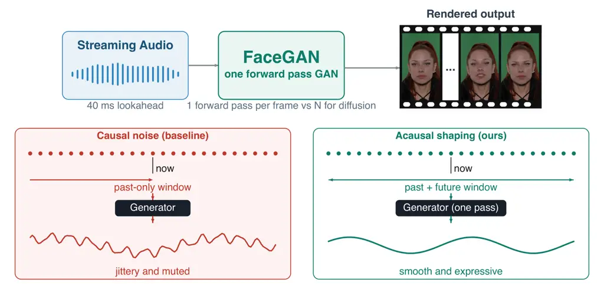
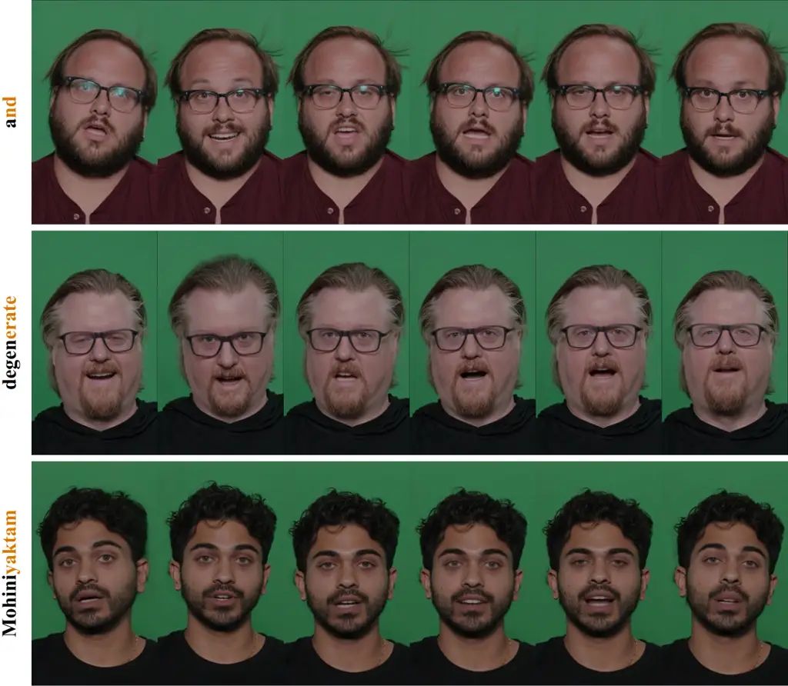
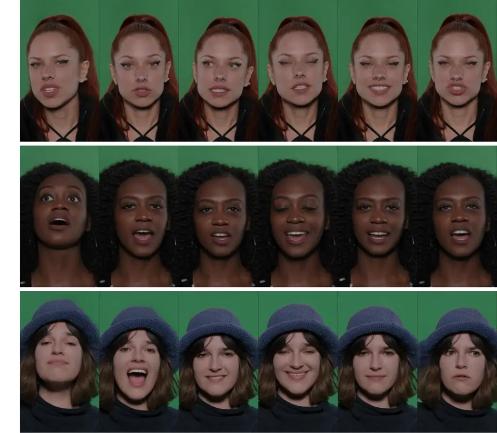

# No Distillation Needed: Single-Pass Real-Time Talking Heads via Acausal Noise Shaping

Yu Han, Dejan Markovic, Alexander Richard, Wojciech Zielonka
Affiliation: Akshay Venkatesh, Cheng-hsin Wuu & Michael Zollhoefer
Affiliation: Meta Reality Labs Affiliation: [Project
Website](https://wojciechzielonka.com/facegan/)

###### Abstract

Audio-driven facial animation underpins real-time avatars, telepresence,
and embodied virtual agents. And it must run online: each frame emitted
from audio observed up to the current time, at interactive rates. Recent
progress is dominated by diffusion models, which need many network
evaluations per sample and are therefore a poor fit for streaming. We
argue the cost is unnecessary in this domain. Audio-conditioned facial
motion occupies a comparatively low-dimensional manifold, a regime where
a single-pass GAN suffices. The obstacle is not capacity but stochastic
structure. We show that a causal, time-invariant generator driven by
i.i.d. noise cannot suppress its output spectrum over a band without
collapsing its per-step innovation. We proposed FaceGAN, which dissolved
the limitation by shaping the noise pathway acausally. Because the
driving noise is synthetic, its future can be sampled now, so the
audio-to-expression path stays causal, and the model supports fully
causal operation. FaceGAN emits expression and head pose in a single
forward pass per frame and matches or outperforms state-of-art
approaches in generation quality. Being feed-forward with bounded
attention windows, it generates indefinitely without drift.

|     |
| --- |
|     |



Figure 1: Streaming audio-to-expression with latency-free acausal noise
shaping. Top: audio streams through our method called FaceGAN, which
emits every frame in a single forward pass at 25 Hz with 40 ms of audio
lookahead; the filmstrip shows rendered output. Bottom: the same causal
generator driven by causal noise (left) produces jittery, muted motion,
while our acausally shaped noise (right) yields smooth, expressive
motion. Bottom traces are illustrative schematics.

## 1 Introduction

Audio-driven facial expression generation, mapping a stream of speech to
a stream of facial motion, is a core building block for virtual avatars,
telepresence, embodied agents, game characters, and assistive
communication. In practical settings the model runs online: it must emit
expression frame $`t`$ from audio observed up to that time and small
lookahead, at interactive frame rates, with bounded and small latency.
Offline fidelity is not enough; the deployment constraint is streaming
inference.

The task itself is mature, and recent gains have been driven largely by
diffusion models, which produce high-fidelity, diverse motion but at the
cost of iterative sampling: tens to hundreds of function evaluations per
frame. This is a poor fit for streaming: the very mechanism that gives
diffusion its quality is what makes it expensive to deploy online. The
prevailing response is to accept the cost, or to distill diffusion back
down toward a single pass, implicitly conceding that single-pass
generation is the desirable endpoint and diffusion is a detour to reach
it.

We take the endpoint directly. Our starting observation is that
diffusion’s advantages are most pronounced on high-dimensional, highly
multimodal data distributions; audio-conditioned facial expression, by
contrast, lives on a comparatively low-dimensional manifold and is
typically learned under data scarcity. In this regime the gap that
motivates iterative refinement largely disappears, and a single-pass
generator (concretely, a GAN) can match or exceed diffusion quality
while retaining single-pass, low-latency inference. In other words, the
efficient, well-understood tool is sufficient here; the question is only
whether it can be made to produce natural motion online.

The obstacle to that is not obvious, and it is where our second
contribution lies. A naive causal single-pass generator faces an
intrinsic spectral limitation: driven by i.i.d. noise, a causal,
time-invariant generator cannot shape the spectrum of its output without
paying in innovation variance. We make this precise via the theorem in
Sec. 3: suppressing the output spectrum over a band forces the per-step
new-information budget to collapse. Empirically this manifests as the
trade-off practitioners hit: either the motion is temporally rich but
jittery, or smooth but muted and lifeless. Increasing network capacity
does not help – it is a property of the generated process, not the
architecture.

Our fix is a single, cheap architectural move: acausal shaping of the
noise pathway. Because the driving noise is generated internally rather
than observed from the environment, an acausal filter over the noise can
be realized with zero latency: we simply sample the required future
noise now. This makes the noise fed to the generator non-i.i.d. The
result is a system that is causal and streaming in the
audio$`\to`$expression pathway, yet free to produce smooth, spectrally
clean, and richly stochastic motion. The acausal stage is
generator-agnostic in principle and may benefit other generators;
whether it helps diffusion is orthogonal to our thesis and left to
future work, and even if it did, diffusion’s iterative sampling cost
would remain.

Together these two threads, the efficiency of single-pass GANs on this
manifold and the noise-shaping technique that unlocks their quality,
yield FaceGAN, a low-latency, single-pass audio-to-expression system
that matches or surpasses diffusion baselines at a fraction of the
inference latency.

Our main contributions are as follows:

- •
  We identify and formalize an intrinsic spectral limitation to causal
  single-pass generation via the Kolmogorov–Szegő theorem, explaining
  the jitter-vs-muted-motion trade-off as a property of the generated
  process rather than the architecture.
- •
  We introduce latency-free acausal noise shaping, which dissolves this
  limitation by driving a causal generator with non-i.i.d. noise, and
  show it costs no audio latency.
- •
  We build FaceGAN and show that on the low-dimensional manifold of
  audio-driven facial expression, a single-pass GAN matches the compared
  baselines at $`43`$ ms latency and $`12\times`$ real time on a single
  GPU.

## 2 Related work

### 2.1 Audio-Driven Facial Motion Generation

Audio-driven facial motion generation synthesizes facial movement from
speech, and has been studied across output representations ranging from
2D portrait videos Zhou et al. (2020); Prajwal et al. (2020) to 3D mesh
templates Karras et al. (2017); Fan et al. (2022); Richard et al.
(2021); Xing et al. (2023); Thambiraja et al. (2023) and, more recently,
neural rendering with NeRF Guo et al. (2021); Ye et al. (2023); Gafni et
al. (2021); Zielonka et al. (2023) or Gaussian Splatting Aneja et al.
(2025); Li et al. (2024); Zielonka et al. (2025a); Zielonka et al.
(2025b); Qian et al. (2024) for higher visual fidelity (see Zielonka et
al. (2026) for a comprehensive survey of avatar representations and
creation methods across face, full-body, hands, hair, and garments).
Orthogonal to the choice of representation, a central difficulty is that
audio only weakly determines facial dynamics: deterministic regressors
collapse toward the conditional mean, producing over-smoothed,
under-expressive motion that discards a speaker’s stochastic detail. To
recover this diversity, recent work turns to generative models.
Diffusion approaches Aneja et al. (2024); Sun et al. (2024) synthesize
high-fidelity, varied motion but depend on full-sequence look-ahead or
iterative sampling, and even streaming-oriented Xiao et al. (2025) or
single-step Lee et al. (2025) variants operate at chunk granularity.
Autoregressive token models predict discrete motion codes step by step
Chu et al. (2025), which Chu et al. (2026) pushed to strictly causal,
zero-lookahead streaming. Both families restore motion diversity, but
each carries an inference cost: diffusion pays for iterative refinement,
and autoregressive models require a learned tokenizer and sequential,
token-by-token decoding.

#### Our setting.

We target streaming, single-pass generation: each frame is emitted from
audio observed up to the current time, in one forward pass, at low
latency. This rules out full-sequence and chunk-based methods, and
distinguishes us from autoregressive streaming approaches Chu et al.
(2025); Chu et al. (2026), which remain sequential in the token
dimension. We show that on the comparatively low-dimensional manifold of
facial motion, a single-pass GAN matches or exceeds these approaches at
a fraction of the inference cost, provided the stochastic degradation
that afflicts cheap single-pass generators is addressed, which we do via
latency-free acausal noise shaping (Sec. 3.2).

### 2.2 Generative Models for Motion: Diffusion vs. Single-Pass Generator

The choice of generative family reflects a trade-off between sample
quality and inference cost. Diffusion models became the default for
high-dimensional, highly multimodal domains, and continue to scale
through flow-based formulations Lipman et al. (2023); Esser et al.
(2024); Black Forest Labs (2024), where iterative denoising both
stabilizes training and captures complex, multi-peaked distributions.
This power comes at a price: sampling requires many sequential network
evaluations. Consequently, a large and very active line of work seeks to
compress diffusion back toward a single step: consistency models Song et
al. (2023); Luo et al. (2023) and their continuous-time refinement Lu
and Song (2025), trajectory- and shortcut-based samplers Kim et al.
(2024); Frans et al. (2025); Geng et al. (2025), and distillation
objectives such as distribution matching Yin et al. (2024b); Yin et al.
(2024a) and adversarial distillation Sauer et al. (2024); Xu et al.
(2024). That so much recent effort targets one-step sampling underscores
the point: single-pass generation is the desirable inference regime, and
these methods are routes back to it. Notably, several of these
state-of-the-art accelerators converge on ideas from GANs. Adversarial
objectives are reintroduced to sharpen few-step samples Sauer et al.
(2024); Xu et al. (2024), and recent work distills diffusion models
directly into conditional GANs Kang et al. (2024), while modernized GAN
architectures and training recipes Kang et al. (2023); Sauer et al.
(2023); Huang et al. (2024) have narrowed or closed the quality gap with
diffusion at a single forward pass. GANs remain particularly strong on
lower-dimensional or strongly structured domains and under limited data
Karras et al. (2020), where diffusion’s multi-step machinery offers
diminishing returns and can even overfit. Face motion is such a regime:
conditioned on audio, expression and head pose occupy a comparatively
low-dimensional manifold, and paired audio-motion data is scarce
relative to image or video corpora, so a single-pass conditional
generator can match iterative samplers in quality while retaining a
latency advantage for streaming synthesis.

| Method                         | Arch.       | \# steps | Causal                 | Live-system |
| ------------------------------ | ----------- | -------- | ---------------------- | ----------- |
| DiffPoseTalk Sun et al. (2024) | Diffusion   | 500      | $`\sim`$ (chunk-level) | ✗           |
| ARTalk Chu et al. (2025)       | LLM         | 5        | $`\sim`$ (chunk-level) | ✗           |
| MemoryTalker Kim et al. (2025) | Transformer | 1        | ✗                      | ✗           |
| Fallingwater Chu et al. (2026) | LLM         | 176      | $`\sim`$ (chunk-level) | ✗           |
| FaceGAN (ours)                 | GAN         | 1        | ✓ (frame-level)        | ✓           |

Table 1: Inference characteristics of the compared methods. Only our
method is both single-pass and frame-level streaming; see Appendix D for
how \# steps is counted. Live-system means deployable for live
animation: frame-level streaming with low latency, not throughput alone;
see Appendix E for the measured benchmark.

#### Our position.

We therefore build on a single-pass GAN rather than an iterative or
autoregressive sampler. The obstacle is not quality but stochastic
structure: a causal, single-pass generator driven by i.i.d. noise faces
an intrinsic limit on how it can shape the temporal spectrum of its
output without sacrificing motion richness (Sec. 3.2). We show this
limitation, not any inherent weakness of GANs, is what has kept cheap
single-pass generators uncompetitive for temporally coherent motion, and
that it is removed by shaping the noise pathway acausally at no cost to
audio-side latency. Table 1 summarizes how the compared methods differ
along these axes.

## 3 Spectral Limitation of Causal Generation

A causal and time-invariant generator maps i.i.d. noise
$`z=(z_{t})_{t\in\mathbb{Z}}`$ to outputs $`y=(y_{t})_{t\in\mathbb{Z}}`$
via

```math
y_{t}=F(z_{t},z_{t-1},z_{t-2},\ldots), \tag{1}
```

where $`F`$ is any measurable function (an arbitrary neural network).
For natural facial motion $`y`$ should have bandlimited spectrum: energy
concentrated at low frequencies, and none above a cutoff. The question
is whether such a causal $`F`$ can produce a perfect stopband (exact
spectral null) in $`y`$. The linear case is settled by Paley–Wiener
theory Paley and Wiener (1934); and here we show a nonlinear $`F`$
cannot do it either: the argument below applies to the generated
_stochastic process_ rather than to any particular architecture, and
therefore binds arbitrary causal $`F`$ without linearization. The
argument proceeds in two parts. We first prove impossibility of a
perfect stopband via Szegő’s link between spectral nulls and
predictability, then quantify the depth-vs.-innovation trade-off and
show how acausal noise shaping escapes it. Background is recalled in
Appendix A; we use (4)–(5) below.

### 3.1 No perfect spectral stopband

Theorem (Kolmogorov–Szegő). Szegő (1920); Kolmogorov (1941); Pourahmadi
(2001) Let $`y_{t}`$ be a real $`L^{2}`$-stationary stochastic process
with spectral density $`S:[-\pi,\pi]\to[0,\infty)`$. Then the asymptotic
one-step linear prediction error variance equals

```math
\sigma_{\infty}^{2}=\exp\!\left(\frac{1}{2\pi}\int_{-\pi}^{\pi}\log S(\omega)\,d\omega\right),\quad\exp(-\infty):=0. \tag{2}
```

Key consequence. If $`S=0`$ on a set $`E\subseteq[-\pi,\pi]`$ of
positive measure, then $`\log S=-\infty`$ on $`E`$, so
$`\int\log S\,d\omega=-\infty`$ and $`\sigma_{\infty}^{2}=0`$ by (2).
The process is then deterministic Doob (1953), so
$`\mathrm{Var}(y_{t}\mid y_{<t})=0`$.

Theorem (main claim). Assume the generator uses its current noise, i.e.
$`\mathrm{Var}(F(z_{t},z_{<t})\mid z_{<t})>0`$ a.s. (cf. (4)). Let $`y`$
be the output in (1). Then its spectral density satisfies
$`S_{y}(\omega)>0`$ for a.e. $`\omega`$. In particular, $`S_{y}`$ has no
perfect stopband.

Proof of main claim. By (5),
$`\mathrm{Var}(y_{t}\mid y_{<t})\geq\mathbb{E}[\mathrm{Var}(y_{t}\mid z_{<t})\mid y_{<t}]`$.
Given $`z_{<t}`$, $`y_{t}`$ depends only on $`z_{t}`$, so
$`\mathrm{Var}(y_{t}\mid z_{<t})>0`$ a.s. by (4); conditioning on
$`y_{<t}`$ preserves strict positivity, so
$`\mathrm{Var}(y_{t}\mid y_{<t})>0`$ a.s. Thus $`y_{t}`$ lies outside
the closed linear span of $`y_{<t}`$ and $`\sigma_{\infty}^{2}>0`$,
which by the key consequence rules out any positive-measure null of
$`S_{y}`$. $`\square`$

### 3.2 Quantitative trade-off: stopband depth vs. innovation

Suppose $`S_{y}\leq\varepsilon`$ over a fraction $`\delta\in(0,1)`$ of
the spectrum, with $`S_{y}`$ scaled so its peak is $`1`$ (hence
$`\log S_{y}\leq 0`$ elsewhere). Then from (2),

```math
\log\sigma_{\infty}^{2}=\frac{1}{2\pi}\int_{-\pi}^{\pi}\log S_{y}(\omega)\,d\omega\leq\delta\cdot\log\varepsilon\quad\Longrightarrow\quad\boxed{\sigma_{\infty}^{2}\leq\varepsilon^{\delta}.} \tag{3}
```

For example, for a 40 dB stopband ($`\varepsilon=10^{-4}`$ in power)
over $`\delta=0.9`$ of the spectrum,
$`\sigma_{\infty}^{2}\leq 10^{-3.6}\approx 2.5\times 10^{-4}`$: at most
$`\sim`$0.025% of input noise variance survives as new per-step
information. Insisting on rich stochasticity (large
$`\sigma_{\infty}^{2}`$) forces a leaky stopband (jitter); insisting on
small $`\varepsilon`$ collapses $`\sigma_{\infty}^{2}`$ (muted motion);
buying back both with deep causal memory costs latency.

#### Escaping via acausal noise shaping.

The limitation binds i.i.d. driving noise via
$`\mathrm{Var}(F(z_{t},z_{<t})\mid z_{<t})>0`$ a.s. (cf. (4)).
Preprocess acausally $`z\mapsto\hat{z}`$: $`\hat{z}_{t}`$ becomes
predictable from $`\hat{z}_{<t}`$ since the smoother mixes in future
$`z`$, so (4) fails for $`\hat{z}`$ by design and the downstream causal
$`F`$ in (1) is no longer bound by (3). Since $`z`$ is synthetic,
sampling its future needs no audio lookahead.

## 4 Method

Figure 2: System overview. Speech is encoded by a frozen Mimi encoder
while an independent noise pathway samples past and future noise
(costing no latency, as the noise is drawn rather than observed) and
shapes it with two bidirectional layers into a temporally coherent
motion prior. A six-layer causal conditioning stack fuses the audio
features with the prior and emits 128-D expression codes plus head pose
at 25 Hz in a single forward pass, with no iterative sampling.

Motion representation. We operate in the same motion latent space as
Agrawal et al. (2025), using their pretrained encoder. Each frame $`i`$
is encoded into an expression code
$`\mathbf{e}_{i}\in\mathbb{R}^{128}`$, head rotation
$`\mathbf{r}^{\text{h}}_{i}`$, head translation
$`\mathbf{t}^{\text{h}}_{i}`$, and shoulder translation
$`\mathbf{t}^{\text{s}}_{i}`$ (each in $`\mathbb{R}^{3}`$), concatenated
into
$`\mathbf{y}_{i}=[\mathbf{e}_{i},\mathbf{r}^{\text{h}}_{i},\mathbf{t}^{\text{h}}_{i},\mathbf{t}^{\text{s}}_{i}]\in\mathbb{R}^{137}.`$
Adopting this representation makes the comparison to Chu et al. (2026)
free of representation confound, since both predict the same signal and
are rendered by the same decoder.

System overview. As shown in Figure 2, given a speech waveform, we
synthesize a temporally coherent sequence of expression codes and rigid
head pose at 25 Hz. Let $`\mathbf{a}\in\mathbb{R}^{T\times 512}`$ denote
continuous audio embeddings from a frozen Mimi encoder Défossez et al.
(2024), taken at 25 Hz frame grid of the target codes
$`\mathbf{y}_{1:T}\in\mathbb{R}^{T\times 137}`$. The mapping is
one-to-many, since many plausible facial performances accompany the same
utterance: regression to the conditional mean yields near-stationary
motion, so we train adversarially, using expression reconstruction only
during warmup; head pose retains a $`\ell_{1}`$ term throughout training
(Sec. 4.3). Variation is supplied by a noise latent
$`\mathbf{z}_{1:T}\in\mathbb{R}^{T\times 128}`$,
$`\mathbf{z}_{t}\sim\mathcal{N}(\mathbf{0},\mathbf{I})`$. The generator
$`G(\mathbf{z},\mathbf{a})`$ is a transformer; two multi-scale
convolutional discriminators, one audio-conditioned and one
unconditional, supply the adversarial signal.

### 4.1 Generator

Two-stack design. $`G`$ separates what varies from what is determined by
speech. A noise stack of $`M{=}2`$ layers processes $`\mathbf{z}`$ alone
with bidirectional attention; a conditioning stack of $`N{=}6`$ causal
layers then fuses the processed latent with audio. Causality bounds the
input context only: predicted frames are never fed back, so the model is
not autoregressive in its output and the full sequence is produced in a
single forward pass. Placing the stochastic path before conditioning
lets the latent develop temporally-correlated structure (a coherent
motion style over a window) before speech constrains it, rather than
perturbing an already-committed trajectory frame by frame. All layers
are pre-norm blocks with RMSNorm Zhang and Sennrich (2019), rotary
position embeddings Su et al. (2024), and SwiGLU feed-forward Shazeer
(2020), with $`d_{\text{model}}{=}512`$, 8 heads, and
$`d_{\text{ff}}{=}4d_{\text{model}}`$.

Audio conditioning. Audio features are shifted left by $`L`$ frames so
that output frame $`t`$ is conditioned on $`\mathbf{a}_{t+L}`$. A small
lookahead ($`L{=}1`$) supplies the right-context for coarticulation,
where a viseme anticipates the following phoneme, at a latency cost of
40 ms (see lookahead ablation in Sec. 5.4). Projected audio is added to
the noise-stack output before the conditioning stack.

Windowed attention. Both stacks use windowed attention with radii
$`R_{\text{c}}`$ (conditioning) and $`R_{\text{n}}`$ (noise); we set
$`R_{\text{c}}{=}R_{\text{n}}{=}64`$. The conditioning stack attends
causally over $`[t{-}R_{\text{c}}{+}1,t]`$ (2.6 s), the noise stack
symmetrically over $`[t{-}R_{\text{n}},t{+}R_{\text{n}}]`$ (5.2 s),
making the receptive field independent of sequence length and admitting
KV-cached incremental decoding. Stacking widens this: past dependence
reaches $`N(R_{\text{c}}{-}1)=378`$ frames of audio ($`\approx`$15 s),
while future dependence is only $`MR_{\text{n}}`$ frames of noise and
$`L`$ of audio. Future noise costs no latency ($`\mathbf{z}`$ is
sampled, not observed, so future noise is drawn ahead), leaving the
$`L`$-frame audio lookahead as the only inference latency.

Output head. A single linear projection emits the $`137`$ channels of
the motion representation. The pose rows of its bias are initialized to
the dataset mean pose, so the model learns only the delta.

### 4.2 Discriminators

The conditional discriminator $`D_{c}`$ receives two channels, the code
sequence and a linear projection of the audio to the same width, and so
judges audio–motion correspondence; it applies the same shift as the
generator, so each frame is paired with exactly the audio the generator
saw. The unconditional discriminator $`D_{u}`$ receives the code
sequence alone. When head pose is predicted it is appended to the
expression channel, scaled per dimension by its dataset standard
deviation to match the z-scored expression, and only $`D_{u}`$ sees this
joint $`137`$-D signal; $`D_{c}`$ is restricted to the $`128`$-D
expression.

Both discriminators view a clip as a 2-D image over (code $`\times`$
time) and are evaluated at temporal scales $`S{=}\{1,2,4,8\}`$, via
average-pooling along time, each judging a different temporal
granularity, from per-frame articulation to multi-second head motion.
Each scale has a sub-discriminator: five weight-normalized
$`3{\times}3`$ convolutions with stride $`(2,1)`$, downsampling the
feature axis while preserving temporal resolution, with LeakyReLU(0.2),
plus a $`1`$-channel output convolution.

### 4.3 Training objective

Both discriminators are trained with the multi-scale hinge loss over
scales $`s\in S`$, and the generator with the corresponding term plus
$`\ell_{1}`$ feature matching on the deepest convolutional activation of
each scale; we write $`\mathcal{L}^{\text{adv}}_{c}`$,
$`\mathcal{L}^{\text{fm}}_{c}`$ for the terms from $`D_{c}`$ and
likewise for $`D_{u}`$. To prevent the generator ignoring $`z`$ we add
the mode-seeking term of Mao et al. (2019),

```math
\mathcal{L}_{\text{div}}=-\frac{d\big(e(z_{1},a),\,e(z_{2},a)\big)}{d(z_{1},\,z_{2})+\epsilon},
```

with $`e(\cdot)`$ the expression channels and $`d`$ the mean absolute
difference; two latents are drawn per step. Head pose is supervised by
an $`\ell_{1}`$ term $`\mathcal{L}_{\text{hp}}`$ and regularized by the
squared first- and third-order time differences of the prediction,
standardized per dimension ($`\mathcal{L}_{\text{vel}}`$,
$`\mathcal{L}_{\text{jit}}`$). The full generator objective is

```math
\mathcal{L}_{G}=\mathcal{L}^{\text{adv}}_{c}+\mathcal{L}^{\text{adv}}_{u}+\lambda_{\text{fm}}\big(\mathcal{L}^{\text{fm}}_{c}+\mathcal{L}^{\text{fm}}_{u}\big)+\lambda_{\text{div}}\mathcal{L}_{\text{div}}+\lambda_{\text{hp}}\mathcal{L}_{\text{hp}}+\lambda_{\text{vel}}\mathcal{L}_{\text{vel}}+\lambda_{\text{jit}}\mathcal{L}_{\text{jit}},
```

with $`\lambda_{\text{fm}}{=}2`$, $`\lambda_{\text{div}}{=}1`$,
$`\lambda_{\text{hp}}{=}1`$, $`\lambda_{\text{vel}}{=}0.01`$,
$`\lambda_{\text{jit}}{=}0.05`$. The first 5,000 steps use only the
reconstruction ($`\ell_{1}`$ on expression and pose) and smoothness
terms; generator and discriminator steps then alternate.

## 5 Experiments

### 5.1 Experimental Settings

Dataset. We use the dataset of Chu et al. (2026): 34,906 clips from 832
subjects (469.6 hours) spanning speech and non-verbal vocalizations,
partitioned into 784 training and 48 test identities. All results are
reported on a fixed set of 64 held-out clips.

Implementation details. We train generator and discriminators jointly
for 200,000 steps on 8 NVIDIA H200 GPUs at batch size 128. Samples are
512-frame crops. The loss covers a 128-frame window whose offset is
drawn uniformly from $`[0,384]`$ each step; frames before the window are
generated to supply its causal history, so the model is supervised at
every history depth up to the $`378`$-frame stacked reach. We use AdamW
Loshchilov and Hutter (2019) at $`1{\times}10^{-4}`$ (generator) and
$`2{\times}10^{-4}`$ (discriminators), cosine decay (factor $`0.1`$),
and an EMA of the generator weights.

### 5.2 Results

We present quantitative and qualitative results. Unless stated
otherwise, our model is evaluated in the final configuration of Sec.
4.1: a single frame of audio lookahead ($`L{=}1`$, 40 ms) and
$`R_{\text{c}}{=}R_{\text{n}}{=}64`$. The lookahead ablation is reported
in Sec. 5.4. We selected four state-of-the-art methods as baselines:
Fallingwater Chu et al. (2026), DiffPoseTalk Sun et al. (2024),
MemoryTalker Kim et al. (2025), and ARTalk Chu et al. (2025). All
methods except MemoryTalker are stochastic, so for fair quantitative
evaluation we draw 64 samples per sequence and average each metric over
the draws. To assess distributional realism, we report Fréchet
Expression Distance (FED) and Fréchet Pose Distance (FPD); lower is
better. To assess expressiveness, we report within-clip variance ratios
of the generated motion relative to ground truth; closer to 1.0 is
better. We also report motion similarity to ground truth and lip-sync
(Sync Score) following the Fallingwater evaluation protocol; higher is
better. Table 2 reports the quantitative results, and Figure 3 shows
qualitative comparisons (additional examples can be found in Appendix
C). All baselines are trained without style conditioning for direct
comparability with our method; style-conditioned variants are reported
in Appendix B.



|              |                                |                                |                          |                                |                |
| ------------ | ------------------------------ | ------------------------------ | ------------------------ | ------------------------------ | -------------- |
| Ground Truth | Fallingwater Chu et al. (2026) | DiffPoseTalk Sun et al. (2024) | ARTalk Chu et al. (2025) | MemoryTalker Kim et al. (2025) | FaceGAN (ours) |

Figure 3: Lip articulation on three utterances, with the target phoneme
highlighted in each row label. Our mouth shapes track the ground-truth
articulation faithfully with single-step inference, unlike the
multi-step or non-causal baselines.

| Method         | FED $`\downarrow`$ | FPD $`\downarrow`$ | Similarity $`\uparrow`$ | Sync Score $`\uparrow`$ | Expr Var $`\to\!1`$ | Pose Var $`\to\!1`$ |
| -------------- | ------------------ | ------------------ | ----------------------- | ----------------------- | ------------------- | ------------------- |
| Fallingwater   | 12.4824^(†)        | 1.6070             | 0.0976                  | 0.6964                  | 0.9803              | 1.1863^(†)          |
| DiffPoseTalk   | 11.3546            | 1.4720^(†)         | 0.1016                  | 0.5768^(†)              | 0.7591^(†)          | 0.5354              |
| MemoryTalker   | 20.7047            | 3.7693             | 0.1328^(†)              | 0.5346                  | 0.2171              | 0.0832              |
| ARTalk         | 14.5405            | 1.2727             | 0.2911                  | 0.2342                  | 1.3998              | 1.0539              |
| FaceGAN (ours) | 12.1483            | 1.3335             | 0.1542                  | 0.8767                  | 0.9647              | 0.9921              |

Table 2: Quantitative comparison against Fallingwater Chu et al. (2026),
DiffPoseTalk Sun et al. (2024), MemoryTalker Kim et al. (2025) and
ARTalk Chu et al. (2025). Expr/Pose Var are within-clip variance ratios
against ground truth (how much the face and head move over time during
an utterance), so best is closest to $`1.0`$. bold gold= best, underline
silver= second-best, bronze†= third-best per column (ranking direction
per arrow). Our method matches the multi-step or non-causal methods,
achieving the best Sync Score and within-clip pose variance, while being
the second best on every other metric, and operating in real time with
single-step inference.

Our model substantially outperforms all baselines in Sync Score (Table 2) while being the only method that streams frame by frame at low
latency. All other metrics are on par with the current state of the art,
which means we did not trade speed for quality, unlike what usually
happens with distilled diffusion models. This trade-off is a known
artifact of diffusion distillation: DMD’s reverse-KL objective behaves
in a mode-seeking way, collapsing the generator onto dominant modes of
the teacher distribution Yin et al. (2024b); Li et al. (2026).

### 5.3 User study

To assess the perceptual quality of the generated face motion, we
conducted a user preference study with 19 participants and a total of
684 comparisons. We use blind side-by-side A/B testing to compare our
method against the baselines. We ask participants to focus on two
criteria: lip sync (how well the mouth movements match the speech) and
naturalness (whether the facial expressions and head motion look
natural). We omit the identity-similarity criterion of Chu et al.
(2026), as our method does not condition on speaker style.

Pooled over all baselines, our method is at parity on lip sync and
preferred on naturalness (Tab. 3). The per-opponent rows are reported
for completeness, but with $`76`$ to $`190`$ comparisons each they
resolve differences only above roughly ten points; the two that separate
from chance, ARTalk on naturalness and MemoryTalker on both criteria,
favour our method, and no baseline is ahead of ours on either criterion.
The study agrees with the metrics: a single forward pass reaches the
perceptual quality of the multi-step or non-causal baselines.

| Comparison                         | Lip sync                  | Naturalness               |
| ---------------------------------- | ------------------------- | ------------------------- |
| vs. Fallingwater Chu et al. (2026) | $`45.3\pm 7.1`$           | $`55.3\pm 7.1`$           |
| vs. DiffPoseTalk Sun et al. (2024) | $`52.1\pm 7.1`$           | $`52.1\pm 7.1`$           |
| vs. ARTalk Chu et al. (2025)       | $`45.6\pm 9.1`$           | $`\mathbf{61.1\pm 9.0}`$  |
| vs. MemoryTalker Kim et al. (2025) | $`\mathbf{67.1\pm 10.6}`$ | $`\mathbf{68.4\pm 10.5}`$ |
| all baselines                      | $`50.5\pm 4.1`$           | $`\mathbf{57.1\pm 4.1}`$  |

Table 3: User study: percentage of comparisons preferring our method,
with $`95\%`$ confidence intervals, over 19 participants and 684
comparisons. $`50\%`$ means the two are perceptually indistinguishable;
bold marks intervals that exclude $`50\%`$.

### 5.4 Ablation Study

We ablate the central design choices of our model: the temporal
structure of the injected noise (Tab. 4), and the audio lookahead,
training objective and discriminator design (Tab. 5). All ablations are
trained under identical settings; scores are on the 64-clip test set.
Three independent training runs of the full model give the run-to-run
band against which differences are judged. Alongside the distribution
metrics we report sample diversity for expression and pose: with
$`K{=}64`$ draws per clip, the spread across draws at a fixed frame, in
units of the ground-truth temporal spread, so $`1`$ means two samples
differ as much as a real face moves and $`0`$ means the model ignores
$`\mathbf{z}`$.

|              |        |      |                   |               |                    |             |          |             |          |             |          |             |
| ------------ | ------ | ---- | ----------------- | ------------- | ------------------ | ----------- | -------- | ----------- | -------- | ----------- | -------- | ----------- |
| causal noise | radius | att. | Sync $`\uparrow`$ |               | FED $`\downarrow`$ |             | Expr Div |             | Pose Div |             | Expr Var |             |
| ✓            | 512    | 512  | 0.8654            | -2%           | 11.59              | -1%         | 0.89     | -3%         | 0.84     | +4%         | 0.92     | -8%         |
| ✓            | 129    | 129  | 0.8905            | +1%           | 11.60              | -1%         | 0.79     | -14%        | 0.64     | -22%        | 0.93     | -7%         |
| ✓            | 64     | 64   | 0.9074            | +3%           | 12.61              | +7%         | 0.68     | -25%        | 0.52     | -36%        | 0.92     | -9%         |
|              | 2      | 5    | 0.8616            | -2%           | 11.59              | -1%         | 0.82     | -11%        | 0.81     | -0%         | 1.03     | +3%         |
|              | 32     | 65   | 0.8902            | +1%           | 11.64              | -1%         | 0.91     | -0%         | 0.91     | +12%        | 1.02     | +1%         |
| ours         | 64     | 129  | 0.8810            | $`\pm`$0.0065 | 11.76              | $`\pm`$0.52 | 0.91     | $`\pm`$0.03 | 0.82     | $`\pm`$0.05 | 1.01     | $`\pm`$0.02 |
|              | 128    | 257  | 0.8847            | +0%           | 11.88              | +1%         | 0.91     | -0%         | 0.88     | +8%         | 1.02     | +2%         |

Table 4: Noise stack, causal versus acausal; causal rows and ours are
means of three runs. “att.” is frames seen per layer: $`R_{\text{n}}`$
for a causal stack, $`2R_{\text{n}}{+}1`$ for an acausal one. Deltas
against ours, whose $`\pm`$ is the run-to-run sd over its three runs;
grey is inside that band ($`<2\sigma`$). For Expr Div and Pose Div only
collapse is marked, since higher diversity is not in itself better.

Noise shaping. Sec. 3 predicts that a causal generator driven by i.i.d.
noise cannot place a spectral null without collapsing its innovation.
Tab. 4 tests this by making the noise stack causal while holding
everything else fixed. The two are not directly comparable at equal
radius (a causal noise stack sees $`R_{\text{n}}`$ frames, an acausal
one $`2R_{\text{n}}{+}1`$), so we compare at matched attended width and
bracket our model with a narrower and a wider causal stack. All three
causal stacks under-articulate, at $`0.92`$–$`0.93`$ against ground
truth, while every acausal setting stays within $`3\%`$ of $`1.0`$. At
matched width the causal stack also loses $`14\%`$ of expression
diversity and $`22\%`$ of pose diversity at unchanged Sync and FED; the
narrower stack loses $`25\%`$ and $`36\%`$.

|                  |                              | Sync $`\uparrow`$ |               | FED $`\downarrow`$ |             | FPD $`\downarrow`$ |             | Expr Div |             | Pose Div |             |
| ---------------- | ---------------------------- | ----------------- | ------------- | ------------------ | ----------- | ------------------ | ----------- | -------- | ----------- | -------- | ----------- |
| Ours ($`L{=}1`$) |                              | 0.8810            | $`\pm`$0.0065 | 11.76              | $`\pm`$0.52 | 1.62               | $`\pm`$0.32 | 0.91     | $`\pm`$0.03 | 0.82     | $`\pm`$0.05 |
| Lookahead        | $`L{=}0`$                    | 0.8698            | -1%           | 13.08              | +11%        | 2.38               | +46%        | 1.03     | +13%        | 0.99     | +21%        |
|                  | $`L{=}2`$                    | 0.8737            | -1%           | 11.42              | -3%         | 1.99               | +22%        | 0.90     | -1%         | 0.85     | +4%         |
|                  | $`L{=}4`$                    | 0.8721            | -1%           | 11.82              | +1%         | 2.24               | +38%        | 0.90     | -2%         | 0.81     | -0%         |
| Discriminators   | no $`D_{u}`$                 | 0.6403            | -27%          | 11.98              | +2%         | 4.44               | +173%       | 1.21     | +33%        | 0.08     | -90%        |
|                  | no $`D_{c}`$                 | 0.0234            | -97%          | 15.16              | +29%        | 1.87               | +15%        | 1.21     | +33%        | 0.86     | +5%         |
| Objective        | $`\lambda_{\text{fm}}{=}0`$  | 0.8602            | -2%           | 16.48              | +40%        | 1.94               | +20%        | 1.30     | +42%        | 1.17     | +43%        |
|                  | $`\lambda_{\text{div}}{=}0`$ | 0.8851            | +0%           | 11.97              | +2%         | 2.79               | +72%        | 0.09     | -91%        | 0.07     | -91%        |
|                  | $`\lambda_{\text{hp}}{=}0`$  | 0.8625            | -2%           | 11.18              | -5%         | 1.58               | -3%         | 0.97     | +7%         | 1.00     | +22%        |

Table 5: Ablations on the 64-clip test set. Deltas are percentages
against ours (mean of three runs), whose $`\pm`$ is the run-to-run sd
over three runs; grey marks differences inside that band ($`<2\sigma`$).
For Expr Div and Pose Div only collapse is marked, since higher
diversity is not in itself better.

Lookahead, objective and discriminators. Lookahead beyond one frame
changes nothing, while $`L{=}0`$ costs expression and pose quality. The
architecture therefore supports fully causal operation ($`L{=}0`$) where
required, trading expression and pose quality for 40 ms. Both
discriminators are necessary: without $`D_{c}`$ lip-sync collapses
entirely ($`-97\%`$ Sync) while pose is untouched, and without $`D_{u}`$
pose collapses in both distribution and diversity ($`+173\%`$ FPD,
$`-90\%`$ Pose Div) and lip-sync degrades as well. Removing feature
matching inflates FED by $`40\%`$. The mode-seeking term has a
measurable effect on the metric it targets: removing it collapses
diversity by $`91\%`$ in both expression and pose: the generator
reproduces a single performance regardless of $`\mathbf{z}`$, and FPD
inflates by $`72\%`$. Removing the pose $`\ell_{1}`$ term is tolerable,
costing $`2\%`$ Sync.

### 5.5 Computational performance

We report the computational performance for generator alone, excluding
frozen audio encoder and renderer. All numbers are measured in streaming
mode (one frame per call, with each layer keeping a fixed-size ring
buffer over its attention window, so per-frame cost and memory are
independent of stream length) on a single H200 in fp32, with no
optimisation beyond the KV cache. Latency is input-to-output: the
$`L{=}1`$ lookahead ($`40`$ ms) plus the forward pass. A single stream
runs at $`43.3`$ ms, $`12.1\times`$ real time. Batching is nearly free:
latency is unchanged at $`256`$ concurrent streams, still under
$`50`$ ms at $`1024`$, and real time holds to $`4096`$ streams at
$`62`$ ms (Tab. 6). Coarser emission trades latency for throughput: at
$`1`$ s blocks the per-call cost amortises to $`235\times`$ real time,
at $`1`$ s latency.

| concurrent streams     | 1          | 256        | 1024       | 2048        | 4096        |
| ---------------------- | ---------- | ---------- | ---------- | ----------- | ----------- |
| forward / latency (ms) | 3.3 / 43.3 | 3.6 / 43.6 | 6.5 / 46.4 | 11.4 / 51.4 | 21.7 / 61.7 |
| $`\times`$ real time   | 12.1       | 11.0       | 6.2        | 3.5         | 1.8         |

Table 6: Latency and throughput of the generator on one H200. Latency is
the forward pass plus the $`40`$ ms audio lookahead; real-time factor is
against the $`40`$ ms frame budget at 25 Hz.

## 6 Conclusion

We showed that audio-driven facial animation does not need iterative
sampling. On this task a single-pass GAN matches the compared baselines.
Because generation is one forward pass over a causal audio stack with a
single frame of lookahead, the same weights run offline and streaming,
at $`43`$ ms latency for a single stream and $`62`$ ms at $`4096`$
concurrent streams on one GPU. The ablations locate where the quality
comes from: both discriminators are necessary and in different ways, and
the noise stack must be acausal: a causal one under-articulates and
loses sample diversity, which is free to avoid, since noise is sampled
rather than observed.

### AI use statement

We used AI tools to aid and polish writing, e.g. to save space by
compacting long paragraphs, enhance the clarity of sentences, format
tables, etc. We also used AI tools to draft sections of the paper, e.g.
we used model config to draft implementation details, and result data to
create LaTeX tables. We have reviewed all AI-assisted work, e.g. we
proof-read AI modified paragraphs, checked that reported numbers match
the experiment results, etc. All conceptual contributions, like use of
GANs and causal noise shaping, the experimental designs, ablation and
analyses are the sole work of the authors. We take responsibility for
the final content of this work, including text, claims or artifacts
produced with the aid of generative AI.

### Ethics statement

Generation of photorealistic talking heads raises concerns about the
potential for misuse, like deepfake creation. Two properties of our
system bound that risk without removing it: the model outputs
low-dimensional expression and head-pose coefficients rather than
pixels, so photorealistic video requires renderer that we do not
contribute; and it is not conditioned on speaker identity or style. On
the other hand, real-time single-pass operation lowers the cost of
misuse relative to existing methods. We hope to raise awareness of risks
and encourage productive discussions regarding fair uses of synthetic
video generation models.

## References

- Agrawal et al. (2025) V. Agrawal, A. Akinyemi, K. Alvero, M.
  Behrooz, J. Buffalini, F. M. Carlucci, J. Chen, J. Chen, Z. Chen, S.
  Cheng, et al. Seamless interaction: dyadic audiovisual motion modeling
  and large-scale dataset. arXiv preprint. Cited by: §4.
- Aneja et al. (2025) S. Aneja, A. Sevastopolsky, T. Kirschstein, J.
  Thies, A. Dai, and M. Nießner GaussianSpeech: audio-driven
  personalized 3D gaussian avatars. In ICCV, pp. 13065–13075. Cited by:
  §2.1.
- Aneja et al. (2024) S. Aneja, J. Thies, A. Dai, and M. Nießner
  FaceTalk: audio-driven motion diffusion for neural parametric head
  models. In CVPR, pp. 21263–21273. Cited by: §2.1.
- Black Forest Labs (2024) Black Forest Labs FLUX. Note:
  [https://github.com/black-forest-labs/flux](https://github.com/black-forest-labs/flux)
  Cited by: §2.2.
- Chu et al. (2025) X. Chu, N. Goswami, Z. Cui, H. Wang, and T. Harada
  ARTalk: speech-driven 3D head animation via autoregressive model. In
  Proceedings of the SIGGRAPH Asia 2025 Conference Papers, Hong Kong,
  pp. 1–9. Cited by: Table 7, Figure 4, Appendix E, Appendix E, §2.1,
  §2.1, Table 1, Figure 3, §5.2, Table 2, Table 3.
- Chu et al. (2026) X. Chu, Y. Han, W. Mao, and S. Wei Personalizing
  causal audio-driven facial motion via dynamic multi-modal retrieval.
  In Proceedings of the SIGGRAPH Asia 2026 Conference Papers, Cited by:
  Table 7, Figure 4, §2.1, §2.1, Table 1, §4, Figure 3, §5.1, §5.2,
  §5.3, Table 2, Table 3.
- Défossez et al. (2024) A. Défossez, L. Mazaré, M. Orsini, A. Royer, P.
  Pérez, H. Jégou, E. Grave, and N. Zeghidour Moshi: a speech-text
  foundation model for real-time dialogue. Cited by: §4.
- Doob (1953) J. L. Doob Stochastic processes. Wiley. Cited by: §3.1.
- Esser et al. (2024) P. Esser, S. Kulal, A. Blattmann, R. Entezari, J.
  Müller, H. Saini, Y. Levi, D. Lorenz, A. Sauer, F. Boesel, D.
  Podell, T. Dockhorn, Z. English, and R. Rombach Scaling rectified flow
  transformers for high-resolution image synthesis. In Proceedings of
  the 41st International Conference on Machine Learning (ICML),
  Proceedings of Machine Learning Research, Vol. 235, pp. 12606–12633.
  Cited by: §2.2.
- Fan et al. (2022) Y. Fan, Z. Lin, J. Saito, W. Wang, and T. Komura
  FaceFormer: speech-driven 3D facial animation with transformers. In
  Proceedings of the IEEE/CVF conference on computer vision and pattern
  recognition, pp. 18770–18780. Cited by: §2.1.
- Frans et al. (2025) K. Frans, D. Hafner, S. Levine, and P. Abbeel One
  step diffusion via shortcut models. In The Thirteenth International
  Conference on Learning Representations (ICLR), Cited by: §2.2.
- Gafni et al. (2021) G. Gafni, J. Thies, M. Zollhöfer, and M. Nießner
  Dynamic neural radiance fields for monocular 4D facial avatar
  reconstruction. In CVPR, Cited by: §2.1.
- Geng et al. (2025) Z. Geng, M. Deng, X. Bai, J. Z. Kolter, and K. He
  Mean flows for one-step generative modeling. In Advances in Neural
  Information Processing Systems (NeurIPS), Cited by: §2.2.
- Guo et al. (2021) Y. Guo, K. Chen, S. Liang, Y. Liu, H. Bao, and J.
  Zhang AD-NeRF: audio driven neural radiance fields for talking head
  synthesis. In ICCV, Cited by: §2.1.
- Huang et al. (2024) Y. Huang, A. Gokaslan, V. Kuleshov, and J. Tompkin
  The GAN is dead; long live the GAN! A modern GAN baseline. In Advances
  in Neural Information Processing Systems (NeurIPS), Vol. 37. Cited by:
  §2.2.
- Kang et al. (2024) M. Kang, R. Zhang, C. Barnes, S. Paris, S. Kwak, J.
  Park, E. Shechtman, J. Zhu, and T. Park Distilling diffusion models
  into conditional GANs. In Proceedings of the European Conference on
  Computer Vision (ECCV), pp. 428–447. Cited by: §2.2.
- Kang et al. (2023) M. Kang, J. Zhu, R. Zhang, J. Park, E.
  Shechtman, S. Paris, and T. Park Scaling up GANs for text-to-image
  synthesis. In Proceedings of the IEEE/CVF Conference on Computer
  Vision and Pattern Recognition (CVPR), pp. 10124–10134. Cited by:
  §2.2.
- Karras et al. (2017) T. Karras, T. Aila, S. Laine, A. Herva, and J.
  Lehtinen Audio-driven facial animation by joint end-to-end learning of
  pose and emotion. ACM Trans. Graph. (4), pp. 94:1–94:12. Cited by:
  §2.1.
- Karras et al. (2020) T. Karras, M. Aittala, J. Hellsten, S. Laine, J.
  Lehtinen, and T. Aila Training generative adversarial networks with
  limited data. In Advances in Neural Information Processing Systems
  (NeurIPS), Vol. 33, pp. 12104–12114. Cited by: §2.2.
- Kim et al. (2024) D. Kim, C. Lai, W. Liao, N. Murata, Y. Takida, T.
  Uesaka, Y. He, Y. Mitsufuji, and S. Ermon Consistency trajectory
  models: learning probability flow ODE trajectory of diffusion. In The
  Twelfth International Conference on Learning Representations (ICLR),
  Cited by: §2.2.
- Kim et al. (2025) H. K. Kim, S. Lee, and H. G. Kim MemoryTalker:
  personalized speech-driven 3D facial animation via audio-guided
  stylization. In Proceedings of the IEEE/CVF International Conference
  on Computer Vision (ICCV), pp. 11241–11251. Cited by: Table 7, Figure
  4, Table 1, Figure 3, §5.2, Table 2, Table 3.
- Kolmogorov (1941) A. N. Kolmogorov Stationary sequences in Hilbert
  space. Bull. Moscow Univ., Math. Ser. 2 (6), pp. 1–40. Cited by: §3.1.
- Lee et al. (2025) J. Lee, C. Li, L. Tran, S. Wei, J. Saragih, A.
  Richard, H. Joo, and S. Bai Audio driven real-time facial animation
  for social telepresence. In Proceedings of the SIGGRAPH Asia 2025
  Conference Papers, Hong Kong, pp. 1–12. Cited by: §2.1.
- Li et al. (2026) H. Li, T. Wen, L. Qi, Z. Wu, Y. Chen, X. Zhou, L.
  Zhu, X. Wang, and K. Zhang 1.x-Distill: breaking the diversity,
  quality, and efficiency barrier in distribution matching distillation.
  Cited by: §5.2.
- Li et al. (2024) J. Li, J. Zhang, X. Bai, J. Zheng, X. Ning, J. Zhou,
  and L. Gu TalkingGaussian: structure-persistent 3D talking head
  synthesis via gaussian splatting. In ECCV, Cited by: §2.1.
- Lipman et al. (2023) Y. Lipman, R. T. Q. Chen, H. Ben-Hamu, M. Nickel,
  and M. Le Flow matching for generative modeling. In The Eleventh
  International Conference on Learning Representations (ICLR), Cited by:
  §2.2.
- Loshchilov and Hutter (2019) I. Loshchilov and F. Hutter Decoupled
  weight decay regularization. In International Conference on Learning
  Representations (ICLR), Cited by: §5.1.
- Lu and Song (2025) C. Lu and Y. Song Simplifying, stabilizing and
  scaling continuous-time consistency models. In The Thirteenth
  International Conference on Learning Representations (ICLR), Cited by:
  §2.2.
- Luo et al. (2023) S. Luo, Y. Tan, L. Huang, J. Li, and H. Zhao Latent
  consistency models: synthesizing high-resolution images with few-step
  inference. arXiv preprint. Cited by: §2.2.
- Mao et al. (2019) Q. Mao, H. Lee, H. Tseng, S. Ma, and M. Yang Mode
  seeking generative adversarial networks for diverse image synthesis.
  In Proceedings of the IEEE/CVF Conference on Computer Vision and
  Pattern Recognition (CVPR), pp. 1429–1439. Cited by: §4.3.
- Paley and Wiener (1934) R. E. A. C. Paley and N. Wiener Fourier
  transforms in the complex domain. Colloquium Publications, Vol. 19,
  American Mathematical Society. Cited by: §3.
- Pourahmadi (2001) M. Pourahmadi Foundations of time series analysis
  and prediction theory. Wiley. Cited by: §3.1.
- Prajwal et al. (2020) K. Prajwal, R. Mukhopadhyay, V. P. Namboodiri,
  and C. Jawahar A lip sync expert is all you need for speech to lip
  generation in the wild. In Proceedings of the 28th ACM international
  conference on multimedia, pp. 484–492. Cited by: §2.1.
- Qian et al. (2024) S. Qian, T. Kirschstein, L. Schoneveld, D.
  Davoli, S. Giebenhain, and M. Nießner GaussianAvatars: photorealistic
  head avatars with rigged 3D gaussians. In Proceedings of the IEEE/CVF
  Conference on Computer Vision and Pattern Recognition,
  pp. 20299–20309. Cited by: §2.1.
- Richard et al. (2021) A. Richard, M. Zollhöfer, Y. Wen, F. De la
  Torre, and Y. Sheikh MeshTalk: 3D face animation from speech using
  cross-modality disentanglement. In ICCV, pp. 1173–1182. Cited by:
  §2.1.
- Sauer et al. (2023) A. Sauer, T. Karras, S. Laine, A. Geiger, and T.
  Aila StyleGAN-T: unlocking the power of GANs for fast large-scale
  text-to-image synthesis. In Proceedings of the 40th International
  Conference on Machine Learning (ICML), Proceedings of Machine Learning
  Research, Vol. 202, pp. 30105–30118. Cited by: §2.2.
- Sauer et al. (2024) A. Sauer, D. Lorenz, A. Blattmann, and R. Rombach
  Adversarial diffusion distillation. In Proceedings of the European
  Conference on Computer Vision (ECCV), Cited by: §2.2.
- Shazeer (2020) N. Shazeer GLU variants improve transformer. arXiv
  preprint. Cited by: §4.1.
- Song et al. (2023) Y. Song, P. Dhariwal, M. Chen, and I. Sutskever
  Consistency models. In Proceedings of the 40th International
  Conference on Machine Learning (ICML), Proceedings of Machine Learning
  Research, Vol. 202, pp. 32211–32252. Cited by: §2.2.
- Su et al. (2024) J. Su, Y. Lu, S. Pan, A. Murtadha, B. Wen, and Y. Liu
  RoFormer: enhanced transformer with rotary position embedding.
  Neurocomputing 568, pp. 127063. Cited by: §4.1.
- Sun et al. (2024) Z. Sun, T. Lv, S. Ye, M. Lin, J. Sheng, Y. Wen, M.
  Yu, and Y. Liu DiffPoseTalk: speech-driven stylistic 3D facial
  animation and head pose generation via diffusion models. ACM
  Transactions on Graphics (TOG) 43 (4), pp. 1–9. Cited by: Table 7,
  Figure 4, §2.1, Table 1, Figure 3, §5.2, Table 2, Table 3.
- Szegő (1920) G. Szegő Beiträge zur Theorie der Toeplitzschen Formen.
  Math. Zeitschrift 6 (3–4), pp. 167–202. Cited by: §3.1.
- Thambiraja et al. (2023) B. Thambiraja, I. Habibie, S. Aliakbarian, D.
  Cosker, C. Theobalt, and J. Thies Imitator: personalized speech-driven
  3D facial animation. In ICCV, pp. 20621–20631. Cited by: §2.1.
- Xiao et al. (2025) L. Xiao, S. Lu, H. Pi, K. Fan, L. Pan, Y. Zhou, Z.
  Feng, X. Zhou, S. Peng, and J. Wang MotionStreamer: streaming motion
  generation via diffusion-based autoregressive model in causal latent
  space. In Proceedings of the IEEE/CVF International Conference on
  Computer Vision (ICCV), pp. 16948–16958. Cited by: §2.1.
- Xing et al. (2023) J. Xing, M. Xia, Y. Zhang, X. Cun, J. Wang, and T.
  Wong CodeTalker: speech-driven 3D facial animation with discrete
  motion prior. In CVPR, pp. 12780–12790. Cited by: §2.1.
- Xu et al. (2024) Y. Xu, Y. Zhao, Z. Xiao, and T. Hou UFOGen: you
  forward once large scale text-to-image generation via diffusion GANs.
  In Proceedings of the IEEE/CVF Conference on Computer Vision and
  Pattern Recognition (CVPR), pp. 8196–8206. Cited by: §2.2.
- Ye et al. (2023) Z. Ye, Z. Jiang, Y. Ren, J. Liu, J. He, and Z. Zhao
  GeneFace: generalized and high-fidelity audio-driven 3D talking face
  synthesis. In ICLR, Cited by: §2.1.
- Yin et al. (2024a) T. Yin, M. Gharbi, T. Park, R. Zhang, E.
  Shechtman, F. Durand, and W. T. Freeman Improved distribution matching
  distillation for fast image synthesis. In Advances in Neural
  Information Processing Systems (NeurIPS), Vol. 37. Cited by: §2.2.
- Yin et al. (2024b) T. Yin, M. Gharbi, R. Zhang, E. Shechtman, F.
  Durand, W. T. Freeman, and T. Park One-step diffusion with
  distribution matching distillation. In Proceedings of the IEEE/CVF
  Conference on Computer Vision and Pattern Recognition (CVPR),
  pp. 6613–6623. Cited by: §2.2, §5.2.
- Zhang and Sennrich (2019) B. Zhang and R. Sennrich Root mean square
  layer normalization. In Advances in Neural Information Processing
  Systems (NeurIPS), Vol. 32, pp. 12360–12371. Cited by: §4.1.
- Zhou et al. (2020) Y. Zhou, X. Han, E. Shechtman, J. Echevarria, E.
  Kalogerakis, and D. Li MakeItTalk: speaker-aware talking-head
  animation. ACM TOG. Cited by: §2.1.
- Zielonka et al. (2025a) W. Zielonka, T. Bolkart, T. Beeler, and J.
  Thies GEM: gaussian eigen models for human heads. In CVPR, Cited by:
  §2.1.
- Zielonka et al. (2023) W. Zielonka, T. Bolkart, and J. Thies Instant
  volumetric head avatars. In CVPR, pp. 4574–4584. Cited by: §2.1.
- Zielonka et al. (2025b) W. Zielonka, S. J. Garbin, A. Lattas, G.
  Kopanas, P. Gotardo, T. Beeler, J. Thies, and T. Bolkart SynShot:
  synthetic prior for few-shot drivable head avatar inversion. In CVPR,
  Cited by: §2.1.
- Zielonka et al. (2026) W. Zielonka, T. Kirschstein, T. Bolkart, S.
  Giebenhain, V. Sklyarova, X. Deng, D. Xiang, S. Saito, Y. Liu, M.
  Nießner, and J. Thies How to build digital humans? from priors to
  photorealistic avatars. Computer Graphics Forum (Eurographics
  State-of-the-Art Report) 45 (2). Cited by: §2.1.

## Appendix A Background for Spectral Limitation

#### Stationary processes and spectra.

$`\{y_{t}\}_{t\in\mathbb{Z}}`$ is $`L^{2}`$-stationary if
$`\mathbb{E}[y_{t}^{2}]<\infty`$, $`\mathbb{E}[y_{t}]=\textit{const.}`$,
and $`\mathrm{Cov}(y_{t},y_{t+h})=\gamma(h)`$ depends only on the lag
$`h`$ (i.e. the process has finite variance and its first and second
moments do not drift with absolute time). In particular the process
looks statistically the same at every $`t`$, which holds here because
the generator (1) is time-invariant and driven by i.i.d. noise. Its
spectral density $`S\geq 0`$ distributes variance over frequency:
$`\mathrm{Var}(y_{t})=\frac{1}{2\pi}\int_{-\pi}^{\pi}S(\omega)\,d\omega`$.
A perfect stopband is $`S=0`$ on a set of positive Lebesgue measure
(e.g. a frequency interval). The main text uses $`S`$ and this stopband
definition to state Szegő’s formula and its key consequence.

#### Predictability.

$`\sigma_{\infty}^{2}`$ is the smallest possible mean-squared error
predicting $`y_{t}`$ from linear combinations of past values
$`y_{<t}=(y_{t-1},y_{t-2},\dots)`$. It measures how much genuinely new
randomness the process generates per step. If $`\sigma_{\infty}^{2}=0`$,
$`y_{t}`$ is perfectly recoverable from its past (i.e. it is
deterministic), so $`\mathrm{Var}(y_{t}\mid y_{<t})=0`$. An element of
the closed linear span ($`L^{2}`$-limits of past linear combinations) is
past-measurable, hence a function of $`y_{<t}`$ a.s. In the main text
this is used to turn $`\sigma_{\infty}^{2}=0`$ into $`\mathrm{Var}=0`$,
which the main proof then contradicts by showing
$`\mathrm{Var}(y_{t}\mid y_{<t})>0`$ a.s.

#### Fresh-noise usage.

The generator genuinely uses its current input if holding past noise
fixed and varying $`z_{t}`$ still varies the output,

```math
\mathrm{Var}(F(z_{t},z_{<t})\mid z_{<t})>0\quad\text{a.s.} \tag{4}
```

For example, $`y_{t}=z_{t-1}`$ would violate (4), while
$`y_{t}=z_{t}+0.5z_{t-1}`$ satisfies it. Any non-trivial generator
sampling fresh noise per frame satisfies it. Used as the standing
assumption of the main claim; the main proof cites it to force
$`\mathrm{Var}(y_{t}\mid z_{<t})>0`$.

#### Nested information.

Each $`y_{s}`$, $`s<t`$, is computed from $`z_{<t}`$ alone, so past
outputs are deterministic functions of past noise: knowing $`z_{<t}`$
tells you $`y_{<t}`$, but not vice versa (the map is many-to-one for
nonlinear $`F`$). In information terms
$`\sigma(y_{<t})\subseteq\sigma(z_{<t})`$, i.e. $`\sigma(y_{<t})`$ is
the less informative of the two. The law of total variance for
$`\mathcal{G}\subseteq\mathcal{F}`$ gives

```math
\mathrm{Var}(y_{t}\mid y_{<t})=\mathbb{E}[\mathrm{Var}(y_{t}\mid z_{<t})\mid y_{<t}]+\mathrm{Var}(\mathbb{E}[y_{t}\mid z_{<t}]\mid y_{<t})\geq\mathbb{E}[\mathrm{Var}(y_{t}\mid z_{<t})\mid y_{<t}]. \tag{5}
```

Both terms are non-negative, so dropping the second yields the lower
bound, used in the first line of the main proof to lift variance given
noise-past to variance given output-past.

## Appendix B Style-Conditioned Results

The main paper compares all baselines without style conditioning for
direct comparability with our method. This appendix reports the same
metrics for the style-conditioned variants, plus our (unconditioned)
model as a reference. The results are shown in Table 7.

| Method         | style | FED $`\downarrow`$ | FPD $`\downarrow`$ | Similarity $`\uparrow`$ | Sync Score $`\uparrow`$ | Expr Var   | Pose Var   |
| -------------- | ----- | ------------------ | ------------------ | ----------------------- | ----------------------- | ---------- | ---------- |
| Fallingwater   | ✓     | 12.3718^(†)        | 1.7186             | 0.7052                  | 0.6977                  | 1.1058     | 1.2905^(†) |
| DiffPoseTalk   | ✓     | 9.8356             | 1.3321             | 0.5683                  | 0.5100                  | 0.6428^(†) | 0.4661     |
| MemoryTalker   | ✓     | 16.2776            | 3.9006             | 0.1486                  | 0.5722^(†)              | 0.2651     | 0.0227     |
| ARTalk         | ✓     | 12.4887            | 1.3644^(†)         | 0.5223^(†)              | 0.3121                  | 1.4379     | 0.8492     |
| FaceGAN (ours) |       | 12.1483            | 1.3335             | 0.1542                  | 0.8767                  | 0.9647     | 0.9921     |

Table 7: Style-conditioned comparison against Fallingwater Chu et al.
(2026), DiffPoseTalk Sun et al. (2024), MemoryTalker Kim et al. (2025)
and ARTalk Chu et al. (2025); ✓marks style conditioning. Expr/Pose Var
are within-clip variance ratios against ground truth (how much the face
and head move over time during an utterance), so best is closest to
$`1.0`$. bold gold= best, underline silver= second-best, bronze†=
third-best per column (ranking direction per arrow).

## Appendix C Additional Qualitative Comparisons

As a part of the supplemental material we include videos that show
comparison with the baselines. In addition, Figure 4 shows another
qualitative single-frame example.



|              |                                |                                |                          |                                |                |
| ------------ | ------------------------------ | ------------------------------ | ------------------------ | ------------------------------ | -------------- |
| Ground Truth | Fallingwater Chu et al. (2026) | DiffPoseTalk Sun et al. (2024) | ARTalk Chu et al. (2025) | MemoryTalker Kim et al. (2025) | FaceGAN (ours) |

Figure 4: Head pose variation across three identities.

## Appendix D Inference Characteristics in Detail

Table 1 in the main paper summarizes the inference characteristics of
the compared methods. Table 8 below gives the per-method verification
behind the \#-steps counts.

| Method         | Arch.       | \# steps | Causal                 | Live-system ready | Step counting                                                                                               |
| -------------- | ----------- | -------- | ---------------------- | ----------------- | ----------------------------------------------------------------------------------------------------------- |
| DiffPoseTalk   | Diffusion   | 500      | $`\sim`$ (chunk-level) | ✗                 | Full 500-level DDPM ancestral schedule per 100-frame chunk; one denoising pass per level, no step-skipping  |
| ARTalk         | LLM         | 5        | $`\sim`$ (chunk-level) | ✗                 | Coarse-to-fine AR schedule over 5 token scales (\[1, 5, 25, 50, 100\]); one pass per scale                  |
| MemoryTalker   | Transformer | 1        | ✗                      | ✗                 | Single deterministic forward pass over the full sequence                                                    |
| Fallingwater   | LLM         | 176      | $`\sim`$ (chunk-level) | ✗                 | Per-token AR over 176 tokens across 4 scales (\[1, 25, 50, 100\]), with style-bank cross-attention per step |
| FaceGAN (ours) | GAN         | 1        | ✓ (frame-level)        | ✓                 | One generator pass per frame; causal attention with 40 ms lookahead                                         |

Table 8: How \# steps is counted. For each method, \# steps is the
number of sequential forward evaluations of the core generative network
needed to finalize one generation unit, independent of clip length.
DiffPoseTalk runs the full 500-level DDPM ancestral schedule per
100-frame chunk: one denoising pass per level, with no DDIM or
step-skipping. ARTalk generates each 100-frame chunk through a
coarse-to-fine autoregressive schedule over 5 token scales (patch sizes
\[1, 5, 25, 50, 100\]), invoking the network once per scale.
Fallingwater decodes its 4-scale pyramid (patch sizes \[1, 25, 50,
100\]) token by token, invoking the network 176 times per chunk with
style-bank cross-attention at each step. MemoryTalker produces the full
sequence in a single deterministic forward pass (audio encoder $`\to`$
memory retrieval $`\to`$ decoder). FaceGAN emits one frame per forward
pass of the generator.

## Appendix E Real-Time Benchmark of the Compared Methods

Table 9 reports generation compute and latency for every compared method
on an NVIDIA H200 (torch 2.12.1, fp32, batch size 1, 30 s of speech),
excluding model loading, audio encoding, rendering, and I/O.
Measurements were reproduced on two independent H200 nodes agreeing
within 2.2%. FaceGAN was timed without loaded weights; its decode has no
data-dependent branching, so timing is weight-independent.

| Method       | Decoding                      | Compute | Latency $`\downarrow`$ |
| ------------ | ----------------------------- | ------- | ---------------------- |
| MemoryTalker | one-shot, non-causal          | 0.02 s  | full utterance         |
| DiffPoseTalk | 4 s chunk, 500-step diffusion | 11.2 s  | 5.56 s                 |
| Fallingwater | 4 s chunk, 176-step AR        | 9.0 s   | 5.29 s                 |
| ARTalk       | 4 s chunk, 5-step AR          | 0.3 s   | 4.20 s                 |
| Ours         | per-frame                     | 2.4 s   | 83 ms                  |

Table 9: Compute is total wall-clock time to generate 30 s of motion
(motion generation only, H200, fp32, batch 1); values below 30 s are
faster than real time. Latency is the delay before the first frame can
be emitted: for the chunked methods, 4.00 s of audio buffering $`+`$
per-chunk compute $`+`$ 0.16 s of centred Savitzky–Golay look-ahead; for
ours, one 40 ms frame $`+`$ 40 ms acausal look-ahead $`+`$ 3.2 ms
compute.

Every method clears 25 fps; what differs is latency. ARTalk reports an
RTF of 0.01 and describes this as low latency Chu et al. (2025); we
reproduce that throughput (RTF 0.010). Throughput, however, is not
latency: its 100-frame window means no frame can be emitted until 4 s of
audio has arrived, giving a time-to-first-frame of 4.20 s. Ours emits
the first frame in 83 ms, about 50$`\times`$ less; at the same 4 s
latency it is 9$`\times`$ faster than ARTalk (880$`\times`$ real time)
with no retraining. None of the baselines is therefore deployable for
live animation. Lookahead horizons differ by two orders of magnitude:
40 ms for ours, up to 4 s for the chunked baselines, unbounded for
MemoryTalker; block size (1–250) is a runtime flag in ours.

The 4 s floor is architectural: ARTalk and Fallingwater decode each
100-frame window into a coarse-to-fine token pyramid (ARTalk Chu et al.
(2025): \[1, 5, 25, 50, 100\]; Fallingwater: \[1, 25, 50, 100\]) in
scale order rather than time order, with the coarsest scale a single
token spanning the whole window, while DiffPoseTalk runs 500 diffusion
steps per fixed 100-frame window. In ARTalk the window is welded to
learned weights, so shrinking it requires retraining; in Fallingwater it
is a config choice with length-agnostic encoding, so a smaller window
would run with untested quality. Both implementations also zero-pad
short clips to a chunk multiple, with untested quality effects.

Fallingwater is about 31$`\times`$ slower than ARTalk despite fewer
parameters (71.8M versus 489.5M): 5 scale-parallel steps versus 176
sequential token steps per chunk. Lowering classifier-free guidance from
2.0 to 1.0 changes throughput by about 1%, so sequential depth, not
guidance, is the bottleneck.
